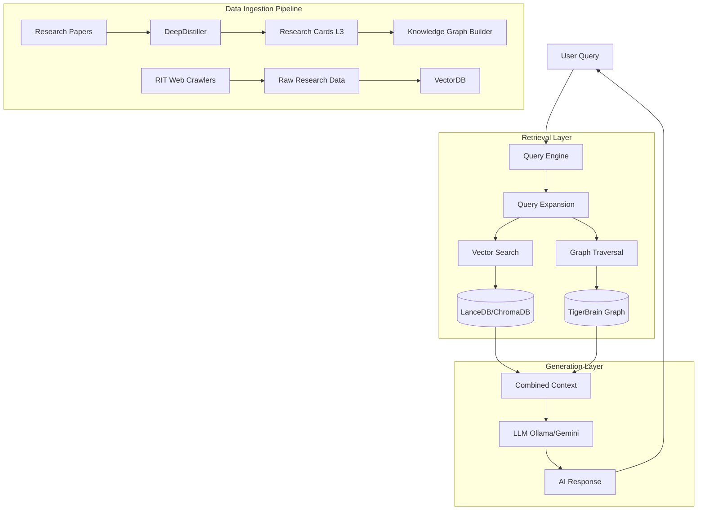

# TigerResearchBuddy - RIT Research Collaboration Platform


> **AI-Powered Research Discovery & Collaboration for Rochester Institute of Technology**

## 🎯 Overview

**TigerResearchBuddy** is an AI-powered research companion built for RIT (Golisano College of Computing) students. It helps you discover faculty advisors, explore ongoing research projects, and find relevant papers — all through a simple chat interface. Under the hood it combines **web scraping**, **vector databases** (RAG), and **local Large Language Models** via Ollama, so your data stays private and the app works fully offline.


TigerResearchBuddy is an intelligent research collaboration platform that helps RIT students and faculty discover research opportunities, find collaborators, and explore interdisciplinary connections across departments.

## ✨ Features

### 🔍 Multi-Department Research Discovery
- Search across Computing, Engineering, Science, and other RIT colleges
- AI-powered semantic search expands queries with related keywords
- Browse research areas, faculty profiles, and publications

### 🤝 Collaboration Hub
- Post research ideas and find matching faculty collaborators
- AI-powered matching algorithm identifies relevant experts
- View research connections in interactive Prism visualization graph

### 📊 AI Impact Analysis
- Automatic scoring of research ideas for societal impact
- UN Sustainable Development Goal (SDG) alignment
- Impact summaries generated by AI

### 🎭 Multi-Persona AI Assistant
- **Tiger Mode**: Friendly, encouraging research buddy
- **Analyzer Mode**: Technical, data-focused analyst
- **Critique Mode**: Constructive critical reviewer

## � How the App Works

TigerResearchBuddy uses a **hybrid RAG (Retrieval-Augmented Generation)** architecture combining vector search with knowledge graph traversal to provide intelligent research assistance.

### Architecture Overview



### Data Flow: From Paper to Answer

#### 1️⃣ **Data Collection Phase**

The system gathers research data from multiple sources:

- **Web Crawling** (`src/crawlers/`)
  - `rit_crawler.py`: Scrapes faculty profiles from RIT college websites
  - `smart_crawler.py`: LLM-powered intelligent extraction of research areas
  - `extended_sources.py`: Crawls research centers, news, PhD directories
  
- **Paper Acquisition** (`src/crawlers/paper_downloader.py`)
  - Downloads papers from ArXiv and Semantic Scholar
  - Matches papers to faculty members
  - Stores PDFs locally in `data/papers/`

#### 2️⃣ **Deep Processing Phase**

Raw data is transformed into structured knowledge:

- **PDF Distillation** (`src/processors/pdf_distiller.py`)
  - **DeepDistiller**: Vision-first extraction using VLM (Vision Language Model)
  - Generates "Research Cards" (Level 3) with:
    - Core technical concepts
    - Methodologies and datasets
    - Key findings and contributions
    - Related work connections
  
- **Knowledge Graph Construction** (`src/knowledge_graph/`)
  - `graph_builder.py`: Creates nodes for Faculty, Papers, Concepts, Methods
  - `entity_resolver.py`: Deduplicates and merges similar entities
  - Builds edges representing relationships (AUTHORED_BY, CITES, STUDIES)
  - Exports to NetworkX graph stored as `data/tiger_brain.json`

- **Data Mining** (`src/knowledge_graph/data_mining.py`)
  - **Topic Modeling**: Discovers latent research themes using LDA
  - **Association Rules**: Finds frequent topic patterns (e.g., "AI + Computer Vision")
  - **Clustering**: Groups similar papers by content

#### 3️⃣ **Indexing Phase**

Processed data is loaded into dual storage systems:

- **Vector Database** (`src/database/`)
  - **ChromaDB** (default): Fast semantic search via embeddings
  - **LanceDB** (v2): Columnar storage for large-scale data
  - **PostgreSQL** (optional): Full production deployment
  - Text chunks embedded using `sentence-transformers/all-MiniLM-L6-v2`
  
- **Knowledge Graph Storage**
  - In-memory NetworkX graph for fast traversal
  - Serialized as JSON/GML for persistence

#### 4️⃣ **Query Processing Phase**

When a user asks a question:

1. **Intent Classification** (`src/chatbot/intent_classifier.py`)
   - Determines query type: faculty_search, paper_lookup, concept_explanation, etc.
   
2. **Query Expansion** (`src/chatbot/query_engine.py`)
   - Expands "machine learning" → ["machine learning", "ML", "neural networks", "deep learning"]
   - Uses semantic similarity to broaden search

3. **Hybrid Retrieval** (`src/retrieval/hybrid_retriever.py`)
   - **Vector Search**: Finds top-k most similar document chunks (cosine similarity)
   - **Graph Search**: 
     - Identifies concept nodes matching query
     - Traverses edges to find related Faculty, Papers, Methods
     - Example: "Zero-Shot Learning" → Papers → Authored By → Prof. Kanan
   - Combines both results into unified context

4. **Context Enrichment** (`src/chatbot/query_engine.py`)
   - Adds graph insights (author collaborations, citation networks)
   - Injects contact information (emails, office locations)

#### 5️⃣ **Response Generation Phase**

- **LLM Selection**
  - **Ollama** (offline): Local models like `llama2`, `tigerbuddy:latest`
  - **Gemini** (online): Google's Gemini API for higher quality

- **RAG Pipeline** (`src/chatbot/rag_engine.py`)
  - System prompt defines persona (Tiger/Analyzer/Critique)
  - Retrieved context injected into prompt
  - LLM generates response grounded in research data
  
- **Post-Processing** (`src/chatbot/response_postprocessor.py`)
  - Formats citations
  - Adds source links
  - Validates factual accuracy against retrieved docs

#### 6️⃣ **Visualization & Collaboration**

- **Prism View** (`src/ui/prism_view.py`)
  - Interactive network graph showing research connections
  - Visualizes Faculty ↔ Papers ↔ Concepts relationships

- **Collaboration Matcher** (`src/collaboration/matcher.py`)
  - Matches student research ideas to faculty expertise
  - Uses vector similarity + keyword matching
  
- **Impact Analyzer** (`src/analysis/impact_analyzer.py`)
  - Scores research ideas on UN SDG alignment
  - Generates impact summaries

### Entry Points

The application can be accessed through multiple interfaces:

1. **CLI** (`main.py`)
   ```bash
   python main.py chat           # Interactive chat (Gemini)
   python main.py chat-offline   # Offline chat (Ollama)
   python main.py crawl          # Run data collection
   python main.py scrape-all     # Full pipeline with distillation
   ```

2. **Web Interface** (`web_app.py`)
   ```bash
   streamlit run web_app.py      # Streamlit UI with Star Wars theme
   ```

3. **Alternative UI** (`src/ui/app.py`)
   ```bash
   streamlit run src/ui/app.py   # TigerStack 2.0 interface
   ```

### Technology Stack

- **Vector Search**: ChromaDB, LanceDB
- **Graph Database**: NetworkX (in-memory)
- **LLMs**: Ollama (local), Google Gemini (API)
- **Embeddings**: `sentence-transformers/all-MiniLM-L6-v2`
- **Data Processing**: Pandas, NumPy, scikit-learn
- **Visualization**: Streamlit, Plotly, NetworkX
- **Web Scraping**: BeautifulSoup, Selenium

## �🚀 Quick Start

### Prerequisites
- Python 3.8+
- [Ollama](https://ollama.ai/) (for local LLM)

### Installation

```bash
# Clone repository
cd tiger_research_buddy

# Install dependencies
pip install -r requirements.txt

# Pull Ollama model
ollama pull tigerbuddy
# Or use any other model like llama2
```

### Running the Application

```bash
# Start Ollama
brew services start ollama
# Or: ollama serve

# Run web interface
streamlit run web_app.py
```

The application will open in your browser at `http://localhost:8501`

## 📖 Documentation

For comprehensive information about the system architecture, core modules, algorithms, and setup instructions, please visit the [Project Wiki](docs/wiki/).

- **[System Architecture](docs/wiki/01_system_architecture.md)** - High-level overview of the Two-Lobe Brain
- **[Algorithm Deep Dives](docs/wiki/10_algorithms_deepdive.md)** - Explanations of RRF, Entity Resolution, and VLM validation
- **[Detailed Setup & Usage](docs/wiki/11_usage_and_setup.md)** - Exhaustive command-line configuration options
- **[Project Journey & History](docs/project_journey.md)** - The chronological history and architecture review of the project

## 📁 Project Structure

```
tiger_research_buddy/
├── main.py                 # CLI interface
├── web_app.py             # Streamlit web interface
├── docs/
│   ├── wiki/              # Comprehensive documentation wiki
│   └── project_journey.md # Project history and rationale
├── src/
│   ├── chatbot/           # AI chat components
│   │   ├── ollama_client.py
│   │   └── query_engine.py
│   ├── crawlers/          # Web crawlers for RIT data
│   │   ├── rit_crawler.py
│   │   └── pdf_crawler.py
│   ├── database/          # Data models & vector store
│   │   ├── models.py
│   │   └── vector_store.py
│   ├── collaboration/     # Collaboration features
│   │   └── matcher.py
│   ├── analysis/          # Research analysis
│   │   └── impact_analyzer.py
│   └── ui/                # UI components
│       └── prism_view.py
├── data/
│   ├── prompts/           # AI persona prompts
│   └── rit_data.json      # Crawled research data
└── tests/                 # Test scripts
```

## 🎓 Usage

### Chat Interface
1. Select your preferred AI persona from the sidebar
2. Ask questions about RIT research
3. Get AI-generated answers with source citations

### Collaboration Hub
1. Navigate to the "Collaboration Hub" tab
2. Fill out the idea form:
   - Title & description of your research idea
   - Select your college
   - Add relevant tags
3. Click "Find Collaborators"
4. View matched faculty and impact score
5. Explore connections in the Prism visualization

### Data Management

```bash
# Crawl RIT research data
python main.py crawl

# Load data into vector database
python main.py load

# Clear database
python main.py clear
```

## 🧪 Testing

```bash
# Test persona switching
python tests/test_persona.py

# Test collaboration matcher
python tests/test_matcher.py

# Debug crawler
python tests/debug_crawler.py
```

## 🛠️ Configuration

Edit `src/utils/config.py` to customize:
- Target RIT colleges to crawl
- Embedding model settings
- Vector database parameters

## 📊 Data Sources

- RIT College websites (research pages)
- Faculty directory pages
- Google Scholar (for publication data)

## 🔐 Privacy

- All AI processing runs locally via Ollama
- No data sent to external APIs
- Research data crawled from public RIT websites

## 🚧 Roadmap

See the [V2 Roadmap](docs/wiki/tigerbrain_v2_roadmap.md) and [Project Journey](docs/project_journey.md) for planned features and historical context.

## 📝 License

MIT License - feel free to use for educational purposes

## 🤝 Contributing

This is a student project for RIT. Contributions welcome!

## 📧 Contact

For questions or collaboration, reach out through RIT channels.

---

**Built with ❤️ at RIT** 🐅
