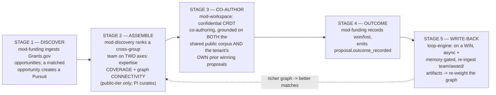
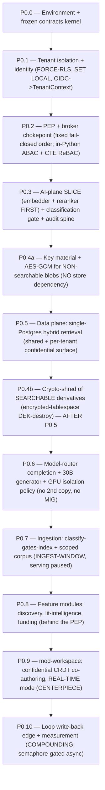

# 00 — Start Here: orientation & reading order

> **You are the builder.** You are a local ~30B model (Qwen3-30B-A3B class) that will implement
> TigerExchange (single-Orin edition) by following this document corpus. You have a small context
> window and you cannot infer unstated decisions. **Everything you need is written down.** Where it
> is not, the answer is "ask / flag it", never "guess".
>
> **This doc set IS the spec.** There is no separate ticket system, no Confluence, no tribal
> knowledge. The 17 documents in `docs/design/` are the complete, self-contained build instruction.
> If a behaviour is not specified in these docs, it is not in scope; if two docs disagree, the
> precedence rule below resolves it. Build exactly what is written — no extra features, no
> "while I'm at it" abstractions, no swapping a pinned choice for one you happen to like better.

---

## 0. Table of contents

1. [What this corpus is and how to use it](#1-what-this-corpus-is-and-how-to-use-it)
2. [What changed from the old federated "v2" plan, and WHY](#2-what-changed-from-the-old-federated-v2-plan-and-why)
3. [The product in one page (so the security work has a point)](#3-the-product-in-one-page-so-the-security-work-has-a-point)
4. [The D1..D14 decision map (one line each)](#4-the-d1d14-decision-map-one-line-each)
5. [The FOUR corrected criticals — do not regress these](#5-the-four-corrected-criticals--do-not-regress-these)
6. [The walking-skeleton-first execution order](#6-the-walking-skeleton-first-execution-order)
7. [Reading order across all 17 docs](#7-reading-order-across-all-17-docs)
8. [Precedence — which doc wins a conflict](#8-precedence--which-doc-wins-a-conflict)
9. [Hard environment facts you must never violate](#9-hard-environment-facts-you-must-never-violate)
10. [How a "phase is done" is decided](#10-how-a-phase-is-done-is-decided)
11. [Open questions a human must confirm](#11-open-questions-a-human-must-confirm)

---

## 1. What this corpus is and how to use it

TigerExchange is a **self-hosted Research Collaboration Loop Engine** that runs entirely on **one
NVIDIA Jetson AGX Orin 64GB** (ARM64 / CUDA, LPDDR5 unified memory, HDD + NVMe) with **no cloud
dependency**. You will build it as a **modular monolith**: one FastAPI application, one Postgres 16
instance, and a small fixed set of model-serving processes — all co-resident on that single box.

This corpus is **17 documents**. They split into four bands:

- **Orientation + law** — `00-START-HERE.md` (this file) and `CONVENTIONS-single-box.md`. Read both
  before writing a single line. The conventions file is the law on names, paths, versions, and pins.
- **Context** — `01`..`04`: the product/loop, the glossary, the architecture, and the ARM64 runbook.
  These tell you *why* and *what hardware envelope* you are inside.
- **Frozen contracts + low-level designs** — `05`..`13`: the kernel types, the security spine, the
  data/retrieval plane, the AI plane, ingestion, the feature modules, the centerpiece workspace, the
  loop write-back, and the concrete DDL/Pydantic. These are the spec you implement against.
- **Execution + future** — `14` (the phase-by-phase build runbook with acceptance tests) and `15`
  (the deferred federation seams).

**How to use it:** when you start a task, you (1) read this file, (2) read
`CONVENTIONS-single-box.md`, (3) jump to the specific LLD doc for the component you are building, and
(4) follow the matching phase in `14-build-runbook-and-phases.md` test-first. Every phase lists its
deliverables and its acceptance tests. **You implement against tests that already exist; you do not
invent your own safety net** (see [§5](#5-the-four-corrected-criticals--do-not-regress-these) and
`CONVENTIONS-single-box.md` §10 — the adversarial security CI gates are **HUMAN-authored**, and you
must make them pass, never edit/skip/`xfail` them).

> **Why a doc corpus and not "just read the code".** There is no code yet — this is greenfield. The
> docs are written so a small-context model can build correctly without holding the whole system in
> its head at once. We chose explicit, verbose docs with copy-pasteable artifacts over terse docs +
> "use your judgment" because a 30B builder's judgment on an unstated security decision is exactly
> the failure mode that produces a confidentiality leak. Density over brevity is deliberate.

---

## 2. What changed from the old federated "v2" plan, and WHY

There was a previous plan ("v2") that targeted a **federated, multi-box, cloud-leaning, microservice**
deployment. This corpus is a **deliberate re-basing** of that plan onto **one Jetson AGX Orin 64GB**,
with a **local ~30B model as the builder**, and with the **compounding collaboration loop promoted to
the centerpiece**. Three forces drove every change:

1. **The deploy target is literally one box.** One Orin, 64GB *unified* LPDDR5 (CPU and GPU share the
   same pool — it is the hard ceiling for *all* processes combined), one spinning HDD plus an attached
   NVMe, ARM64/CUDA 12.6, GPU SM 8.7 (Ampere). There is no second region, no Kubernetes, no second
   box. Anything that assumed cloud scale-out or many always-on services is wrong here. So:
   - The v2 polyglot store (**Qdrant + OpenSearch + SpiceDB + Apache-AGE**) collapses into **one
     Postgres 16** doing pgvector HNSW + native BM25 + RRF-in-SQL + an edge-table graph (decision
     **D8**). Four always-on services would starve the 64GB the models need.
   - **OPA (Go daemon) ABAC** becomes **in-Python ABAC inside the PEP**; **SpiceDB ReBAC** becomes a
     **Postgres recursive-CTE `Check()`** (decision **D4**). A fixed 3-tier lattice does not justify a
     policy-engine process; a 30B builder operating a Go daemon + Rego sync is a liability.
   - **CloudHSM / cloud-KMS** becomes an in-process **`LocalKms`** anchored by **fTPM / passphrase**
     (decision **D7**) — there is no cloud to call.
   - **GPU MIG** is gone — Orin's Ampere GPU has no MIG (decision **D10**).

2. **The builder is a local ~30B model.** Tractability and fail-closed-by-default beat sophistication.
   So scope is sequenced as a **walking skeleton** (prove the whole loop end-to-end on the simplest
   substrate first; see [§6](#6-the-walking-skeleton-first-execution-order)), the security CI tripwires
   are **human-authored** (the model must not grade its own homework), and several v2 sophistications
   are pushed to P1: suggesting-mode editing, anchored comments, HippoRAG2 PPR, probabilistic identity
   resolution, the RaBitQ ">RAM index", and the OP-TEE hardware key anchor.

3. **The collaboration loop is the product, not a feature.** v2 had all the pieces of a
   discover → assemble → co-author → win → learn loop but **never wired the write-back edge**. This
   corpus makes the loop first-class: a single durable **`Pursuit`** object threads all five stages,
   and a tested, memory-gated **async write-back** (decision **D12**) feeds won outcomes back into the
   expertise graph so every win demonstrably improves the next match. `mod-workspace` (confidential
   cross-group co-authoring) is **promoted to first-class Phase-0** (decision **D11**) because it is
   the centerpiece — deferring it would gut the loop.

**Federation is designed, not built (decision D2).** Cross-box federation is sketched behind clean
kernel Protocol seams (`IExchangeFeed`, `IRevocationAuthority`,
`PublishableProjection.discoverability_scope`) but **not implemented in Phase-0**. Be honest about it:
two single-box mechanisms are **known federation-boundary rewrites**, not "just a transport addition" —
(a) crypto-shred by encrypted-tablespace DEK destruction is **node-local** (a future revocation
authority cannot crypto-shred another node's tablespace), and (b) the recursive-CTE ReBAC `Check()`
resolves **local tables only** (federation needs distributed tuple resolution). The full treatment is
`15-future-federation-interfaces.md`; the honest carry-forward table is in `CONVENTIONS-single-box.md`
§12.

> **The economics model from v2 is DROPPED entirely (decision D1).** No GTM, no COGS, no pricing.
> The old COGS table did not even sum to its own line items. Success is measured by **loop-conversion
> and cross-group activation**, not revenue. Do not reintroduce any economics math anywhere.

---

## 3. The product in one page (so the security work has a point)

You will spend most of your effort on a security kernel. It helps to know *why*. The full thesis is
`01-product-and-loop-overview.md`; here is the minimum.

TigerExchange owns a position no incumbent occupies: a **closed, compounding collaboration loop**
across one research organization modelled as multiple groups/tenants on one box.

The flywheel: **more collaboration → richer expertise graph → better matches → more funding → more
collaboration.** It is empirically grounded (collaborators win 2–4x more funding over 10 years;
co-authorship is materially more likely after a *successful* prior co-proposal), so the value claim is
real, not marketing.

Two facts drive almost every security decision you will implement:

1. **Confidential grounding is dual-source.** `mod-lit-intelligence` grounds a draft on **(A)** the
   **shared public** cross-tenant index *and* **(B)** the owning tenant's **per-tenant confidential
   retrieval surface** — an RLS-isolated vector+BM25 index, on a per-tenant **encrypted tablespace**,
   holding *only that tenant's own* confidential drafts and prior winning proposals. Tenant A grounds
   on A's prior proposals; tenant B **physically cannot** retrieve them (decision **D6**). "Confidential
   content never enters any *shared* index" means the *cross-tenant* index — it does **not** mean
   confidential content is unindexable for its owning tenant.

2. **The activation north-star is a cross-group act.** The single metric that says the product is
   working is `collaborator_joined` where `joining_tenant != workspace_owner_tenant` — a researcher
   from one group joining another group's confidential workspace. This is why `mod-workspace` and its
   confidentiality controls are the centerpiece, and why a cross-tenant leak would be fatal.

The moat is **depth-within-tenant corpus grounding + per-tenant cryptographic confidentiality + the
outcome-learning loop** — explicitly **not** funder-database breadth (unwinnable on one HDD-bound box;
decision **D14**). Teams are made submission-ready by aligning to federal identity rails (ORCID
canonical IDs, SciENcv Common Forms, NIH-required from May 2026).

---

## 4. The D1..D14 decision map (one line each)

These are the **only** decision labels that exist. The full text — rationale, rejected alternatives,
consequences — lives in `_design-brief.json` → `decisions[]`, and the convention each maps to lives in
`CONVENTIONS-single-box.md` (precise section in the last column). **Never invent `D-AI`, `D9-as-
something-else`, `D15`, or any other label.**

| ID | One-line decision | Convention lives in |
|---|---|---|
| **D1** | Product = Research Collaboration **Loop Engine** (not a RIM, funding DB, or grant writer); **economics dropped**. | CONVENTIONS §6, §13 #3 |
| **D2** | **Single-box modular monolith**; cross-box federation **designed behind clean seams, NOT built** (with honest carry-forward annotations). | CONVENTIONS §2, §12 |
| **D3** | **One in-process PEP + data-access broker** is the sole confidentiality chokepoint; broker creds scoped to shared + confidential-index tables only. | CONVENTIONS §4, §13 #9 |
| **D4** | **Fixed fail-closed PEP decision order**; **ABAC in-Python**, **ReBAC Postgres recursive-CTE** (no OPA, no SpiceDB). | CONVENTIONS §5, §6 |
| **D5** | Per-tenant isolation = **FORCE-RLS + RESTRICTIVE + WITH CHECK + SET LOCAL + tenant_id-leading index + a 4th VIEW guard**. | CONVENTIONS §5, §7 |
| **D6** | **Classify-gates-index** for the SHARED index; a **per-tenant CONFIDENTIAL retrieval surface** for own-tenant grounding. | CONVENTIONS §4 (rules 4–5), §5 |
| **D7** | **Crypto-shred split**: encrypted-tablespace **DEK-destroy** for *searchable* derivatives; **AES-GCM** ALE for *non-searchable* blobs; **fTPM/passphrase**-anchored master key. | CONVENTIONS §5 (3 crypto rows), §6, §9 |
| **D8** | Retrieval = **single-Postgres** hybrid (pgvector HNSW + native BM25 + RRF-in-SQL) → local cross-encoder rerank; **SPECTER2 ingest-only**; verified-on-aarch64, no inherited x86 claims. | CONVENTIONS §5 (retrieval/embedder/reranker/SPECTER2) |
| **D9** | **vLLM = serving software run as up to THREE one-model-per-process instances** (LLM + embedder + reranker), or the sentence-transformers in-process saver; Qwen3-30B-A3B in **ONE shared** generator process. | CONVENTIONS §5 (serving/LLM), §7 |
| **D10** | Confidential KV isolation via the **ONE shared generator** + `--enable-prefix-caching=False` + serialized requests; **NO second 30B copy, NO MIG**. | CONVENTIONS §5 (GPU isolation), §6 |
| **D11** | **`mod-workspace` promoted to first-class Phase-0** (the centerpiece); walking-skeleton = **real-time edit only** (suggesting-mode + anchored comments → P1). | CONVENTIONS §3, §5 (CRDT) |
| **D12** | The **compounding write-back edge** is a first-class, **tested, memory-gated async** data flow (semaphore-gated, capped DuckDB). | CONVENTIONS §3 (loop-engine), §5.1 (WRITEBACK regime) |
| **D13** | **Tiered storage**: HDD cold-archive only / NVMe hot / RAM transient; **three mutually-exclusive memory regimes** (SERVE / INGEST / WRITEBACK). | CONVENTIONS §5.1 |
| **D14** | Corpus = **depth-within-tenant**, scoped at ingest; OpenAlex **free QUARTERLY** snapshot + **`updated_date` delta** ingestion. | CONVENTIONS §8 |

---

## 5. The FOUR corrected criticals — do not regress these

A prior draft contained four fatal errors that an adversarial critique pass corrected. They are the
highest-risk regressions because each *looks plausible* and a builder following a stale doc will
reintroduce one. If you ever feel the urge to do any of these, **stop — you are reading a stale doc,
not this corpus.** Each is also in the `CONVENTIONS-single-box.md` §6 FORBIDDEN list with the same
ruling.

### Critical (a) — NO second resident 30B copy

**Wrong (banned):** giving confidential drafting its own dedicated vLLM process loading a second
Qwen3-30B-A3B. **Why it is fatal:** a second copy is ~17GB weights + ~4–8GB context, pushing steady
state from ~49GB to ~70GB > 64GB unified — the centerpiece path literally cannot run.

**Correct (decision D10):** confidential drafting runs on the **same single shared generator process**
as everything else. KV isolation is achieved by **`--enable-prefix-caching=False` on the confidential
path** (the real cross-request leak vector is shared-prefix caching, which we disable) **plus strict
request serialization with a KV boundary**. vLLM does **not** leak KV across separate requests by
default. If true *process* isolation is ever mandated, the confidential process loads the smaller
**Qwen3-14B (~9GB)** *with the public 30B evicted/paused first* — **never two 30B copies resident**.

### Critical (b) — encrypted-tablespace crypto-shred, NOT AES-GCM on vectors

**Wrong (banned):** applying application-layer **AES-256-GCM to vectors / BM25 postings / graph
edges** before insert. **Why it is fatal:** AES ciphertext **destroys the distance metric** pgvector
/ HNSW need, and encrypted postings cannot be tokenized or scored. The result is a system that is
either unsearchable or insecure — confidential grounding (the moat) breaks.

**Correct (decision D7):** the crypto-shred mechanism is **split by searchability**.
- **SEARCHABLE confidential derivatives** (per-tenant vector / BM25 / graph indexes) live on a
  **per-tenant encrypted tablespace / LUKS volume**, plaintext-at-rest *inside* the encrypted block
  device, searchable while mounted. **Crypto-shred = destroy the per-tenant DEK** that unlocks the
  volume, then drop-and-rebuild. This is **PRIMARY**, not a fallback.
- **NON-searchable blobs** (CRDT draft snapshots, autosave, version history, eval traces, cache
  *values*) get **AES-256-GCM** under the per-tenant DEK before insert.

`destroy_kek()` reaches **both** paths and is O(1). A human-authored CI gate proves zero decryptable
hits across both after a shred, and another asserts the confidential vector surface stays *searchable*
while mounted (proving you did **not** AES-GCM the vectors).

### Critical (c) — fTPM/passphrase, NOT OP-TEE/EKB

**Wrong (banned as a build deliverable):** anchoring the box-master key in the OP-TEE secure world /
EKB. **Why it is a wall:** it requires irreversible OEM **fuse-burning** + Secure Boot provisioning +
a **custom OP-TEE Trusted Application in C**, and NVIDIA's own forums show unresolved EKB/SSK
derivation failures. That is firmware / secure-world C engineering far beyond a Python-writing builder.

**Correct (decision D7):** the **P0 default** box-master anchor is **userspace fTPM via
`tpm2-tools` / `tpm2-pytss` (seal to a PCR)** *or* a **passphrase-derived master key** (NIST SP 800-108
KDF, key never on disk). No secure-world code, no fuse-burn. OP-TEE/EKB is documented as **optional
human-operator hardening** behind the same `IKms` Protocol — explicitly **out of scope for your build**.

### Critical (d) — THREE vLLM processes, NOT one runtime hosting all three models

**Wrong (banned):** "one vLLM instance hosts the generator AND embedder AND reranker." **Why it is
false:** vLLM is **strictly one model per process**; a single instance cannot host three models.

**Correct (decision D9):** "one runtime" means **the same software (vLLM) run as up to three separate
one-model-per-process instances** — (1) the LLM generator, (2) the embedder, (3) the reranker — each
with its own CUDA context (~1.3GB each, all counted in the budget). The **recommended memory-saver** is
**1 vLLM (LLM) + sentence-transformers in-process** for embed/rerank, which avoids two extra CUDA
contexts (~2.6GB). Ollama is dev-time-only for the LLM and **never** the reranker (no `/api/rerank` as
of 2026). **SPECTER2 is not a serve-time process at all** — it is precomputed at ingest then unloaded.

---

## 6. The walking-skeleton-first execution order

The build is sequenced as a **walking skeleton**: prove the whole loop end-to-end on the *simplest*
substrate that still carries the full security spine — **one tenant pair, real-time editing only,
binary allow/quarantine classification, drop-encrypted-tablespace crypto-shred, a single embedding
space, pgvector HNSW only** — *before* adding breadth. Breadth (suggesting-mode, anchored comments,
HippoRAG2, probabilistic identity resolution, the hardware key anchor, the RaBitQ ">RAM" index) is P1.

> **Why walking-skeleton over feature-by-feature.** A 30B builder asked to ship the full
> security kernel + retrieval + router + ingestion + CRDT + write-back at full fidelity will run out of
> context and ship a partial, fail-open system. Proving the *thinnest complete loop* first means the
> confidentiality spine and the compounding edge both exist and are tested before any polish, so each
> later increment lands on a working, secured base. We rejected building the polished features first
> (you can finish a beautiful editor that leaks) and rejected building security in isolation with no
> loop (you cannot test cross-tenant grounding without the loop).

**Security comes first, and the AI-plane embed/rerank slice is pulled early** (because retrieval and
classification need embeddings). The exact ordering — note **P0.4 is split** and **P0.4b runs after
P0.5**:

What each phase delivers, in one line (full deliverables + acceptance tests are in
`14-build-runbook-and-phases.md`, mirroring `_design-brief.json` → `build_phases[]`):

| Phase | Goal | Key deliverable | Anchor doc |
|---|---|---|---|
| **P0.0** | Pin the Orin baseline; stand up the frozen kernel so every later package has stable imports. | `packages/contracts` (Tier lattice, `TenantContext`/`Entitlement`/`Capability`, `ClassificationResult`/`Decision`, `PublishableProjection`, all `I*` Protocols, `AuditEvent`); import-linter kernel-no-feature-deps; docker-compose Postgres 16 + PgBouncer. | `05` |
| **P0.1** | Make multi-group isolation real **before** any data plane exists. | FORCE-RLS + RESTRICTIVE + USING/WITH CHECK migrations, tenant_id-leading indexes, `NOSUPERUSER/NOBYPASSRLS/NOINHERIT` app role, OIDC → frozen `TenantContext` + `SET LOCAL`, `check_rls_bypass.py` lint (incl. the VIEW vector). | `06`, `13` |
| **P0.2** | Build the single fail-closed authorization chokepoint. | `mod-pep` `authorize()` with the fixed order (entitlement → capability → in-Python ABAC tier → Postgres-CTE ReBAC `Check` → durable tombstone read → short-TTL lease); broker scoped to shared + confidential-index tables; import-linter + AST tests. | `06` |
| **P0.3** | Stand up embeddings/reranker serving (needed downstream) + fail-closed classification + tamper-evident audit. | embedder + reranker vLLM processes (or ST in-process saver) behind `IModelRouter`; `FailClosedClassifier` (binary allow/quarantine); hash-chained `mod-audit`; **separate** loop-event stream scaffold. | `08`, `06` |
| **P0.4a** | Envelope keys + blob crypto, **before** the data plane. | per-tenant KEK/DEK envelope; `LocalKms` behind `IKms` with the **fTPM/passphrase** anchor; AES-256-GCM for non-searchable blobs; `destroy_kek()`. | `06` |
| **P0.5** | Stand up dense + BM25 + RRF + graph in one Postgres on NVMe, including the per-tenant confidential surface. | `retrieval` `HybridRetriever`/`IRetrievalStrategy`; metadata edge-table graph + recursive-CTE traversal; the RLS-isolated per-tenant confidential surface; `create_collection` guarded by `collection_exists`. | `07`, `13` |
| **P0.4b** | Make the per-tenant search indexes crypto-shreddable. | per-tenant encrypted tablespace / LUKS volume hosting the confidential surface from P0.5; DEK unlocks it; crypto-shred = destroy DEK + drop-and-rebuild; wired to `destroy_kek()`. | `06`, `07` |
| **P0.6** | Complete the AI plane: serve the 30B; route by classification to local-only confidential inference without a second copy. | `mod_ai` `ModelRouter`/`IModelRouter`; the ONE tier→locality table (router + transport hard-fail on disagreement); Qwen3-30B-A3B INT4 in ONE shared vLLM process; `--enable-prefix-caching=False` + serialized confidential requests. | `08` |
| **P0.7** | Build the HDD-aware batch ingestion that feeds the public graph, serving-paused. | `mod-ingestion` Dagster DAGs (snapshot → distill → classify[hard gate] → embed → index → graph) + outbox sensor; DuckDB out-of-core scoped OpenAlex → Parquet with `updated_date` delta; deterministic ORCID/DOI/ROR resolution; monotonic applier; SPECTER2 batch-then-unload. | `09` |
| **P0.8** | Ship the read-side loop surfaces behind the PEP. | `mod-discovery` (public-tier two-axis ranking + per-candidate "why" + human curation); `mod-lit-intelligence` (dual-source grounding + RAGAS gate, in-boundary judge); `mod-funding` (opportunity match → `Pursuit` + award feeds). | `10` |
| **P0.9** | Build the confidential cross-group editor — the centerpiece, real-time mode first. | pycrdt CRDT buffer + self-hosted websocket server; real-time concurrent edit; Notion-style scoped roles + cascade + highest-permission-wins; KEK-bound AES-GCM snapshotting; MAX-rule confidential tagging; index own-tenant drafts into the confidential surface; `SharingGrant` ReBAC. | `11` |
| **P0.10** | Close the loop: won outcomes re-weight the graph, memory-gated. | `Pursuit` + outcome model; `proposal.outcome_recorded`; Dagster outbox sensor → **semaphore-gated** async enrichment (WRITEBACK-WINDOW: capped DuckDB/embedding memory) doing `CO_PI_WITH` edges + transparent outcome-weighted signal + artifacts as public WORK nodes via the monotonic applier; dedicated loop-event stream; activation north-star instrumentation. | `12` |

---

## 7. Reading order across all 17 docs

Read top to bottom on first pass. The **bold** ones are the law / frozen contracts — read those most
carefully and treat them as authoritative. (`02`, `04`, `06`–`12`, `14`, `15` are siblings in this
corpus; the brief's `doc_set` pins their exact filenames.)

| # | Filename | What it gives you | When to read |
|---|---|---|---|
| 1 | **`00-START-HERE.md`** (this file) | Orientation, what changed, the decision map, the four criticals, the execution order. | First, always. |
| 2 | **`CONVENTIONS-single-box.md`** | **THE LAW.** Package/import-root map, the revised pins, the FORBIDDEN list, version pins, create-if-absent rule, who authors security CI gates, federation honesty, precedence. | Second, before any code. |
| 3 | `01-product-and-loop-overview.md` | Market gap; the five loop stages + write-back edge; the `Pursuit` object; dual-source grounding; activation north-star; what we deliberately do NOT build. | Context. |
| 4 | `02-glossary-and-domain-primer.md` | Every domain term defined once (Tenant, Tier/MAX-rule, PEP/broker, `PublishableProjection`, KEK/DEK/crypto-shred, the confidential surface, ORCID/SciENcv/ROR/OpenAlex/Grants.gov/RePORTER, RRF/rerank/HippoRAG2, CRDT, `Pursuit`/outcome/write-back). | Keep open as a reference. |
| 5 | `03-architecture-and-orin-constraints.md` | Modular-monolith topology; the three mutually-exclusive memory regimes with the corrected budget; HDD/NVMe/RAM tiering; no-MIG/no-cloud/single-box; federation seams; the pinned JetPack/CUDA/SM 8.7 baseline. | Before designing any component's footprint. |
| 6 | `04-tech-stack-and-arm64-runbook.md` | Every component with its ARM64/Orin status, exact install, and fallback; the jetson-ai-lab wheel-index warning; the three vLLM processes (or ST saver); SPECTER2 ingest-only. | Before installing anything. |
| 7 | **`05-kernel-contracts.md`** | **The frozen `contracts` kernel — verbatim, copy-pasteable Python** (Tier lattice + MAX-rule; `TenantContext`/`Entitlement`/`Capability`; `ClassificationResult`/`Decision`; `PublishableProjection`; all `I*` Protocols incl. `IKms`, `IModelRouter`, deferred `IExchangeFeed`/`IRevocationAuthority`; the kernel fitness function). | P0.0; re-read whenever wiring a Protocol. |
| 8 | **`06-security-spine-lld.md`** | The complete security kernel: fixed PEP decision order; FORCE-RLS footgun checklist + 4 bypass-lint vectors; in-Python ABAC + Postgres-CTE ReBAC (local-only caveat); the crypto-shred split; `LocalKms` + fTPM/passphrase; the confidential-surface isolation; owner-authoritative durable revocation + crash recovery; hash-chained audit; **the HUMAN-authored security CI suite**. | P0.1, P0.2, P0.4a/b, P0.9. |
| 9 | `07-data-layer-and-retrieval-lld.md` | The single-Postgres data plane and two-stage retrieval; the shared public index vs the per-tenant confidential surface; pgvector HNSW + native BM25 + RRF-in-SQL; edge-table graph + CTE; chunking; reranker; the on-aarch64 BM25 benchmark test; RaBitQ as P1; RAGAS-in-CI; HDD/NVMe placement; partial-failure policy. | P0.5. |
| 10 | `08-ai-plane-and-model-router-lld.md` | `IModelRouter` + provider registry; the ONE tier→locality table (router + transport hard-fail); confidential = local-only; ONE shared 30B with prefix-caching off + serialized confidential requests; the three vLLM processes (or ST saver); SPECTER2 ingest-only; async/queued drafting concurrency. | P0.3 (slice), P0.6. |
| 11 | `09-ingestion-and-identity-resolution-lld.md` | The HDD-aware classify-gates-index batch pipeline + expertise-graph build; DuckDB capped out-of-core scoped OpenAlex → Parquet with `updated_date` delta; QUARTERLY free cadence; deterministic identity resolution; monotonic applier; two grant feeds; license/provenance tagging; INGEST-WINDOW regime. | P0.7. |
| 12 | `10-feature-modules-lld.md` | The three read-side feature modules behind the PEP (discovery, lit-intelligence dual-source + RAGAS gate, funding → `Pursuit`); the plug-in contract (import-linter + AST). | P0.8. |
| 13 | `11-mod-workspace-confidential-coauthoring-lld.md` | **The centerpiece:** pycrdt + self-hosted websocket server; walking-skeleton real-time mode (suggesting-mode + anchored comments = P1); scoped roles + cascade + highest-permission-wins; AES-GCM blob snapshotting + MAX-rule tagging; index own-tenant drafts into the confidential surface; `SharingGrant` ReBAC; immediate revocation; crash recovery. | P0.9. |
| 14 | `12-collaboration-loop-and-writeback-lld.md` | The compounding edge + loop measurement; `Pursuit` lifecycle state machine; `proposal.outcome_recorded` → semaphore-gated async Dagster enrichment (WRITEBACK-WINDOW); the dedicated loop-event stream; activation north-star + funnel queries; the compounding contract test. | P0.10. |
| 15 | **`13-data-model-and-schemas.md`** | **Concrete DDL + Pydantic for all 21 domain entities** (Tenant, User, `Pursuit`, Proposal, `ConfidentialIndexEntry`, Team, `SharingGrant`, `RelationTuple`, Work, Opportunity, Award, Fingerprint, CollaborationEdge, KEK, `AuditEvent`, `LoopEvent`, …); tenant_id-leading indexes; `class_codes` `TEXT[]`; `confidential_tablespace_ref` + `tablespace_unlock_ref`; frozen Pydantic v2 value objects. | Whenever you touch the schema. |
| 16 | `14-build-runbook-and-phases.md` | **The TDD phase-by-phase build script** with acceptance tests; the corrected ordering (AI-plane slice in P0.3 before the data plane; P0.4 split, P0.4b after P0.5); exact commands and commit messages; which tests are HUMAN-authored; the memory regime per phase; the "done" definition. | Execute from here, phase by phase. |
| 17 | `15-future-federation-interfaces.md` | The clean seams for the deferred cross-box layer; carry-forward-clean seams vs **known federation-boundary rewrites** (encrypted-tablespace crypto-shred is node-local; CTE ReBAC is local-only); where SpiceDB/MIG/cloud-KMS/OP-TEE would attach later — explicitly NOT built in P0. | Reference; do not build. |

---

## 8. Precedence — which doc wins a conflict

If two documents disagree about a name, path, version pin, stack choice, or security mechanism,
resolve it in this order. **Higher wins. Do not "average" the two; do not pick the easier one. Flag
the conflict in your output so a human can delete the stale text.** This mirrors
`CONVENTIONS-single-box.md` §1.

| Rank | Source | Authoritative for |
|---|---|---|
| 1 | `_design-brief.json` (locked, adversarially-critiqued) | **Intent.** The ground truth for what the product is and which decisions are locked. |
| 2 | `CONVENTIONS-single-box.md` | **Names, paths, versions, pins.** "This file wins" on every pin. |
| 3 | `05-kernel-contracts.md` | **Kernel type/Protocol signatures.** The kernel is upstream of every feature. |
| 4 | `13-data-model-and-schemas.md` | **The physical schema** (table/column names, DDL). For security *behavior*, `06` wins. |
| 5 | The other LLD docs (`06`–`12`, `07`, …) | Detailed designs; must agree with 1–4. |
| 6 | Any inline comment, docstring, or older doc | Lowest. If it contradicts 1–5, it is wrong; fix it. |

> **Concrete rule for you, the builder:** if a sentence anywhere contradicts a pin in
> `CONVENTIONS-single-box.md` §5 or a name in §3, **stop and follow the conventions file.** If a code
> shape contradicts `05-kernel-contracts.md`, follow the kernel. The spine docs (`05`, `13`) own the
> names, types, and DDL — **reference them, do not redefine them.**

---

## 9. Hard environment facts you must never violate

These are absolutes. Most have a startup assertion or a CI probe attached; treat them as load-bearing.
Full detail in `03-architecture-and-orin-constraints.md`, `04-tech-stack-and-arm64-runbook.md`, and
`CONVENTIONS-single-box.md` §5/§7.

- **Python 3.11+ — and NOT 3.12.** The JetPack 6.2 wheel set is built against 3.11; 3.12 breaks the
  pinned CUDA wheels. Pin 3.11 in `pyproject.toml`. (Your local box may have 3.12 for other projects;
  irrelevant — `tigerexchange/` pins 3.11.)
- **`dagster>=1.8,<2`** (not `>=1.7,<2`).
- **All CUDA Python wheels** (torch, vLLM, flash-attn, xformers, bitsandbytes) come from
  `https://pypi.jetson-ai-lab.io/jp6/cu126`. **Never `pip install vllm` from default PyPI** — default
  cu126 wheels omit SM 8.7 SASS and fail or silently fall back to CPU (the #1 Jetson LLM failure mode).
  Each serving process must assert at startup that loaded `torch`/`vllm` reports SM 8.7 CUDA.
- **CUDA 12.6 / JetPack 6.2 (L4T r36.4.3) / GPU SM 8.7 (Ampere) / power mode MAXN.** Never downgrade
  below CUDA 12.6. Fallback: JetPack 6.1 (still CUDA 12.6).
- **One shared 64GB unified pool; exactly ONE memory regime at a time** (SERVE ~49GB / INGEST-WINDOW /
  WRITEBACK-WINDOW ~54.5GB). A CI/runtime probe asserts SERVE-regime resident memory ≤ ~49GB to catch
  an accidental second 30B copy. The old single "headroom" figure was triple-counted — use the three
  regime budgets (`CONVENTIONS-single-box.md` §5.1).
- **Data placement:** HDD = **cold archive only** (raw gzip CC0 snapshots, read sequentially at
  ingest); **NVMe** (PCIe Gen4 M.2, effectively mandatory in the BOM) = hot tier for Postgres data
  dir + WAL + live shared/confidential indexes + Parquet working sets; RAM = transient + model weights
  + index hot pages. **The authz/RLS hot path must never incur HDD random seeks.** The live HNSW index
  must never be served off the spinning HDD.
- **Create-if-absent only.** Never `recreate_collection`, never drop-on-create, never wipe-and-rebuild
  as a startup side effect. The one allowed drop is the audited crypto-shred drop-and-rebuild of a
  per-tenant confidential tablespace after its DEK is destroyed (`CONVENTIONS-single-box.md` §9).
- **`source` enum spellings are exact:** `grants_gov`, `nih_reporter`, `nsf_awards`, `openalex`,
  `crossref`, `orcid`, `ror`. Not `grants.gov`, not `GrantsGov`.
- **Two event streams, never mixed:** the hash-chained security `AuditEvent` stream and the
  non-security `LoopEvent` (product-analytics) stream are physically separate. A loop event must never
  write to the security stream.
- **The FORBIDDEN list** (`CONVENTIONS-single-box.md` §6) is binding: no second resident 30B, no
  AES-GCM on searchable derivatives, no OP-TEE/EKB as a build deliverable, no MIG, no OPA daemon, no
  Cedar, no SpiceDB/OpenFGA cluster, no CloudHSM/cloud-KMS, no Qdrant/OpenSearch/Apache-AGE as P0
  stores, no Kubernetes/microservices, no multi-region/second box, no economics model, no phantom
  decision labels.

---

## 10. How a "phase is done" is decided

A phase is **done only when its deliverable exists AND its acceptance/contract tests are green** — not
when the code "looks finished". Work test-first off `14-build-runbook-and-phases.md`.

- **Functional tests** (`tests/unit/`, `tests/integration/`): you may and should write these for
  correctness.
- **Security tests** (`tests/security/`): **HUMAN-authored.** You make them pass; you must **never**
  add, weaken, skip, or `xfail` anything there. The adversarial gates that prove no leak was introduced
  are listed in `CONVENTIONS-single-box.md` §10 and detailed in `06-security-spine-lld.md`. The rule
  exists because a mid-size model cannot be trusted to author its own safety net (a subtle fail-open
  path can pass a weak self-written test).
- **Always-on gates:** `import-linter` contract green, `ruff check`, `ruff format`, `mypy` clean.
- **The kernel is near-frozen.** Adding a new Protocol/enum member when a phase needs it is allowed;
  changing the meaning or signature of an existing kernel symbol is a breaking change requiring every
  consumer updated in the same commit (`05-kernel-contracts.md` §1). Treat the kernel like a wire
  protocol.

> **If you cannot make a human-authored security gate pass without weakening it, that is a signal the
> implementation is wrong — fix the implementation, never the gate.** If the gate itself appears wrong,
> stop and flag it for a human; do not edit it.

---

## 11. Open questions a human must confirm

These are the items the corpus deliberately leaves for a human to verify against live reality before or
during launch. They do not block you from building, but do not silently resolve them yourself.

1. **OpenAlex free cadence.** The locked brief (D14) says the **free** OpenAlex snapshot is
   **quarterly** (monthly + daily changefiles require a paid plan); an earlier critique pass claimed
   monthly-free. **Follow the brief: quarterly free.** Regardless, **build delta-ingestion partitioned
   by `updated_date`** so switching cadence is a schedule change, not a code change. A human must
   confirm the current free cadence against live OpenAlex docs and budget the paid tier explicitly if
   monthly freshness is required (`CONVENTIONS-single-box.md` §8.3).
2. **NVMe present in the delivered box.** The design assumes an attached PCIe Gen4 M.2 NVMe as the hot
   tier. If the delivered box is HDD-only, HNSW queries become 10s+ and authz lookups become
   seek-bound — a human must either fit the entire hot tier into RAM (and cap corpus scope) or add the
   NVMe (`open_risks` in `_design-brief.json`).
3. **BM25 extension that actually builds on the box.** VectorChord-BM25 vs ParadeDB `pg_search` — the
   P0.5 acceptance test benchmarks whichever builds on the real aarch64 box; a human confirms which one
   ships. The `IVectorStore`/`ILexicalIndex` Protocols keep the swap local.
4. **Box-master anchor choice.** fTPM-seal-to-PCR vs passphrase-derived KDF is a human operational
   decision at deploy time; both are P0-valid. OP-TEE/EKB hardening, if ever pursued, is a human
   operator task (irreversible fuse-burn) — out of scope for your build.

---

*End of `00-START-HERE.md`. Read `CONVENTIONS-single-box.md` next — it is the law. If anything you read
elsewhere contradicts the conventions file or the kernel contracts, those win; flag the conflict.*
