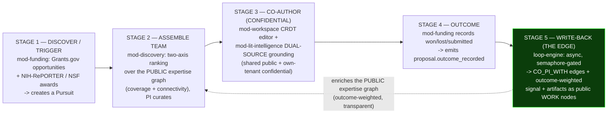

# 01 — Product & the Compounding Collaboration Loop

> **What this document is.** The product thesis for TigerExchange (single-Orin edition) and the
> single thing that makes it different from every adjacent product: a **closed, compounding
> collaboration loop**. This is the *why* and the *what* of the build. The *how* lives in the LLD
> docs. If you are the builder and you only have room in your context for one orientation doc, read
> `00-START-HERE.md` first, then this one, then `CONVENTIONS-single-box.md`.
>
> **Authority chain.** `_design-brief.json` (locked intent) → `CONVENTIONS-single-box.md`
> (names/pins, "this file wins") → the LLD docs. This doc expands the brief fields
> `product_summary`, `collaboration_loop_design`, and decision **D1**. It introduces **no** new
> names, types, or pins — every concrete artifact it references is owned by a spine doc and
> cross-linked.
>
> **Decision IDs are D1..D14 only.** There are no other labels (no `D-AI`, no `D15`). See
> `CONVENTIONS-single-box.md` §13.
>
> **Cross-references.** Domain terms: `02-glossary-and-domain-primer.md`. Architecture + Orin
> envelope: `03-architecture-and-orin-constraints.md`. Frozen kernel types (`Tier`, `Capability`,
> `PublishableProjection`, the `I*` Protocols): `05-kernel-contracts.md`. Security spine (PEP order,
> crypto-shred split, per-tenant confidential surface isolation): `06-security-spine-lld.md`.
> Retrieval (the two surfaces, RRF, rerank): `07-data-layer-and-retrieval-lld.md`. Feature modules
> (discovery / lit-intelligence / funding): `10-feature-modules-lld.md`. The centerpiece editor:
> `11-mod-workspace-confidential-coauthoring-lld.md`. The write-back edge + loop measurement:
> `12-collaboration-loop-and-writeback-lld.md`. Concrete DDL + Pydantic for every entity named here:
> `13-data-model-and-schemas.md`. Build order + acceptance tests: `14-build-runbook-and-phases.md`.

---

## 0. Table of contents

1. [The one-sentence product](#1-the-one-sentence-product)
2. [Market positioning: a Research Collaboration Loop Engine (NOT a RIM / funding-DB / grant-writer) — D1](#2-market-positioning-a-research-collaboration-loop-engine-not-a-rim--funding-db--grant-writer--d1)
3. [The five loop stages + the write-back EDGE that makes it compounding](#3-the-five-loop-stages--the-write-back-edge-that-makes-it-compounding)
4. [The Pursuit object: the durable loop thread](#4-the-pursuit-object-the-durable-loop-thread)
5. [Dual-source grounding: shared public + per-tenant confidential surface (D6)](#5-dual-source-grounding-shared-public--per-tenant-confidential-surface-d6)
6. [Two-axis team assembly: coverage + connectivity, always human-curated](#6-two-axis-team-assembly-coverage--connectivity-always-human-curated)
7. [The activation north-star: cross-tenant `collaborator_joined`](#7-the-activation-north-star-cross-tenant-collaborator_joined)
8. [Empirical validation: why the compounding claim is real, not marketing](#8-empirical-validation-why-the-compounding-claim-is-real-not-marketing)
9. [What we deliberately do NOT build (the breadth game)](#9-what-we-deliberately-do-not-build-the-breadth-game)
10. [The walking-skeleton-first build sequence (loop end-to-end on the simplest substrate)](#10-the-walking-skeleton-first-build-sequence-loop-end-to-end-on-the-simplest-substrate)
11. [Personas + a concrete end-to-end walkthrough](#11-personas--a-concrete-end-to-end-walkthrough)
12. [How this doc maps to the build phases + acceptance tests](#12-how-this-doc-maps-to-the-build-phases--acceptance-tests)

---

## 1. The one-sentence product

**TigerExchange is a self-hosted Research Collaboration Loop Engine for a single research
organization** — modeled as multiple groups / tenants — **that runs entirely on one NVIDIA Jetson
AGX Orin 64GB with no cloud dependency.** Its centerpiece is a *closed, compounding* loop:

> a funding match triggers a Pursuit → the platform assembles a cross-group team → the team
> co-authors a **confidential** proposal grounded in both the **shared public** scholarly+funding
> corpus and the tenant's **own prior winning proposals** → the funding **outcome** is recorded →
> on a **win**, the team, award, and artifacts are **written back** into the public expertise graph,
> so every won proposal demonstrably improves the next match.

The flywheel: **more collaboration → richer graph → better matches → more funding → more
collaboration.** No incumbent occupies this position because they each own only one segment of the
loop and none of them learn from outcomes (see §2).

---

## 2. Market positioning: a Research Collaboration Loop Engine (NOT a RIM / funding-DB / grant-writer) — D1

**Decision D1 (verbatim intent).** Position and build TigerExchange as the integrated,
outcome-learning collaboration loop — *discover → assemble → confidentially co-author → win → feed
outcomes back* — explicitly **not** as another research-information-management (RIM) system, funding
database, or standalone grant-writing assistant.

### 2.1 Why this position and not the adjacent ones

Every adjacent product category already has an entrenched data-moat or workflow incumbent. The one
position **nobody occupies** is the *integrated loop that learns from funding outcomes*. The
incumbents are structurally split across the loop:

| Loop segment | Who owns it today | Where they STOP (the seam they leave open) |
|---|---|---|
| Discovery + visibility (profiles, expertise, networks) | RIM tools — Pure / Symplectic / VIVO; Clarivate Web of Science Research Intelligence | Stop at the *front door*: they surface who exists, then hand off to humans. No drafting, no confidential workspace, no outcome capture. |
| Funding-opportunity discovery + drafting | Instrumentl / Granted | Draft, but never **ground** in a shared scholarly corpus, and have **zero** confidentiality controls. |
| The introduction itself | IN-PART / AcademicLabs | Make the intro, then **hand off to humans** — the collaboration never re-enters a system that learns. |
| Funder-database breadth | Pivot-RP (~3.6M profiles), WoS-RI | Breadth we cannot and will not match on one HDD-bound box (see §9). |

**TigerExchange owns the SEAMS they lack:** *discovery → confidential workspace → outcome capture →
graph write-back.* It is the only design in this space that **learns from outcomes** — a won
proposal mutates the living expertise graph so the next match is measurably better.

### 2.2 Rejected alternatives (why we did not just build a better version of an incumbent)

These are D1's `alternatives_rejected`, spelled out so the builder does not silently drift the
product back toward a category we explicitly rejected:

- **A better funding database.** We lose on breadth + the HDD / single-box limits versus Pivot-RP /
  WoS-RI / Instrumentl. Unwinnable; not our moat.
- **A standalone AI grant writer.** Commoditized — Instrumentl "Apply" drafts in ~5 minutes. A
  generic drafter with no corpus grounding and no confidentiality is a feature, not a product.
- **A VIVO-style RIM.** Mature, low-growth, maintenance-fatigued category. Building another one adds
  no new value.

### 2.3 The moat, stated plainly

The moat is **not** breadth. It is three things stacked:

1. **Depth-within-tenant corpus grounding** — drafts are grounded in the group's *own* prior winning
   proposals, not just public papers (the #1 confirmed gap in every grant-AI tool; see §5).
2. **Per-tenant cryptographic confidentiality** — a group's confidential drafts are physically
   isolated and crypto-shreddable (see `06-security-spine-lld.md`; D6, D7).
3. **The outcome-learning loop** — the write-back edge (§3, Stage 5; D12) that no competitor wires.

### 2.4 Consequences the build must honor (D1 `consequences`)

- The build **must wire the write-back EDGE** (Stage 5). The prior "v2" plan had every piece *except*
  the edge and was therefore linear, not compounding. Wiring it is non-negotiable
  (`12-collaboration-loop-and-writeback-lld.md`, build phase **P0.10**).
- **Success metrics are loop-conversion + cross-group activation, not search volume.** See §7 and
  the `tex.loop_event` stream in `13-data-model-and-schemas.md` §21.
- **We accept being narrow-corpus by design.** Scoped ingest, not full-world (§9; D14).
- **No economics.** The GTM / COGS / pricing model is dropped entirely. Do not model it. Success is
  measured by the loop funnel, not margin (`CONVENTIONS-single-box.md` §6, §13 #3).

---

## 3. The five loop stages + the write-back EDGE that makes it compounding

The loop is made **first-class** by two design choices:

- **(a)** a single durable domain object — the **Pursuit** — threads all five stages (§4); and
- **(b)** an explicit, *tested* write-back data flow (the EDGE) that converts a linear workflow into
  a compounding flywheel. This edge is what the prior plan omitted.

### 3.1 The loop at a glance



The dashed arrow from Stage 5 back to Stage 2 is **the compounding edge**. Without it the system is a
straight pipeline (discover → draft → submit) that never improves. With it, every won proposal feeds
the graph that drives the *next* team match.

### 3.2 Stage 1 — Discover / trigger (`mod-funding`)

`mod-funding` ingests two distinct funding feeds (modeled as two tables, **never collapsed** — D14):

- **Grant Opportunity** (`source = grants_gov`, the exact enum spelling — `CONVENTIONS-single-box.md`
  §8.1; `tex.opportunity` in `13-data-model-and-schemas.md` §6) — an **open call**. This is the
  **top-of-loop trigger**. Each opportunity carries `required_concepts[]`, which drives the Stage-2
  coverage matrix.
- **Grant Award** (`source = nih_reporter` / `nsf_awards`; `tex.award` in §7) — a **historical funded
  project**. Feeds PI track-record and co-funding collaboration edges; it does *not* trigger the loop.

A saved **Pursuit** (Instrumentl-style project + tracker) binds a matched Opportunity → draft
Proposal → candidate Team + ongoing match alerts (§4).

> **Why funding is the top-of-loop trigger, chosen over discovery-first.** A concrete funding need
> beats aimless expert browsing: it gives the user a reason to assemble a team *right now*, and it
> sidesteps the discovery-first cold-start problem (an empty "go browse experts" screen has no pull).
> We chose **funding-triggered** over **discovery-triggered** because the literature and the product
> logic agree the loop needs a concrete pursuit to anchor it (D1 / `collaboration_loop_design`).

### 3.3 Stage 2 — Assemble team (`mod-discovery`)

`mod-discovery` ranks candidates on **two axes** over the **PUBLIC-tier expertise graph only** (it
touches **no** confidential data — this is enforced, not just intended; see §6 and
`10-feature-modules-lld.md`):

- **Expertise COVERAGE** of the opportunity's `required_concepts[]` — complementary / gap-filling,
  surfaced as a **coverage matrix with explicit gaps**.
- **Graph CONNECTIVITY** — prior co-authorship + co-funding distance over the
  `CollaborationEdge` graph (`13-data-model-and-schemas.md`; `CO_AUTHORED` / `CO_PI_WITH` edge types).

Plus a **transparent outcome-weighted overlay** (one signal among several — §6.3) and a per-candidate
**"why"**. **The PI always curates** the shortlist (§6.4).

### 3.4 Stage 3 — Co-author, confidentially (`mod-workspace` + `mod-lit-intelligence`)

`mod-workspace` is **promoted to first-class Phase-0** (decision **D11**) — it is the centerpiece.
The **walking-skeleton P0 ships REAL-TIME concurrent edit only**; suggesting / tracked-changes (PI
accept/reject) and anchored comments + resolve are **P1** (§10; D11; build phase **P0.9**).

- The live edit buffer is a **CRDT** (Yjs / y-crdt via `pycrdt`) served by a self-hosted
  pycrdt-websocket server on the Orin. The CRDT merges in any order, survives restart, and supports
  autosave recovery (`11-mod-workspace-confidential-coauthoring-lld.md`; D11).
- Roles are **Notion-style scoped**: `pi` = owner, `co_pi` = edit, `reviewer` = comment, `viewer` =
  view (the `tex.team_role` enum in `13-data-model-and-schemas.md` §0.8), with permission cascade and
  **highest-permission-wins** (computed in `mod-workspace`, P1 for cascade beyond real-time edit).
- The draft is **MAX-rule-tagged confidential** (`tier_join_all`; `05-kernel-contracts.md` §3) and
  snapshotted as an **AES-256-GCM non-searchable blob** under the per-tenant DEK into the KEK-bound
  draft store, so crypto-shred reaches it (D7; `06-security-spine-lld.md`).

The drafting is **dual-source grounded** — this is the moat — and is detailed in §5.

### 3.5 Stage 4 — Outcome (`mod-funding`)

`mod-funding` records the funding result — **submitted / won / lost** (the `tex.outcome_result` enum)
— against the Pursuit. A **won** result drives the Pursuit to its terminal `won` state and
**emits the event `proposal.outcome_recorded`** onto the transactional outbox
(`12-collaboration-loop-and-writeback-lld.md`; D12).

### 3.6 Stage 5 — Write-back (THE CENTERPIECE EDGE, `loop-engine`) — D12

A Dagster **sensor on the outbox** fires an **async enrichment job** — this is the edge the prior
plan never wired. It runs **off the interactive hot path** in the **WRITEBACK-WINDOW memory regime**:
**semaphore-gated to yield to interactive generation**, with **capped DuckDB / embedding memory**, and
respecting HDD latency (D12, D13; `03-architecture-and-orin-constraints.md` for the regimes).

On a **won** outcome the job does three things, all through the **same classify-gates-index
monotonic applier** used at ingest (so it is idempotent and **cannot resurrect a revoked /
down-classified record** — `projection_version` vs `revocation_epoch`; D12, D6):

1. **Materializes in-platform `CO_PI_WITH` edges** between the actual team members, tagged with the
   proposal / award (`CollaborationEdge` with `source_proposal_id` / `award_number`;
   `13-data-model-and-schemas.md`).
2. **Attaches a transparent outcome-weighted expertise signal** per member for the opportunity's
   concepts — **one signal among similarity + connectivity**, never the sole ranker, to dodge the
   incumbency-bias trap (§6.3; D12 `consequences`, open-risk mitigation).
3. **Ingests produced artifacts as new public `WORK` nodes** (`source = in_platform_writeback`;
   `tex.work` §5) through the classify-gates-index pipeline.

> **Why async-off-the-outbox and not synchronous-during-editing.** Graph writes on the slow HDD path
> would stall the interactive editor; an uncapped async DuckDB job during interactive use would cause
> RAM contention on the 64GB unified pool. We chose **outbox sensor → semaphore-gated WRITEBACK-WINDOW
> job** over (a) synchronous write-back on the editing path (slow, blocks the user) and (b) uncapped
> concurrent async (RAM contention; the prior plan's "headroom" was triple-counted — see
> `03-architecture-and-orin-constraints.md`). D12.

### 3.7 The compounding contract test (the proof the edge works)

The build is not "done" on Stage 5 until a **contract test asserts a recorded WIN demonstrably
changes a subsequent team-match ranking** (build phase **P0.10**;
`12-collaboration-loop-and-writeback-lld.md`). This is the executable definition of "compounding": if
a win does not move a later ranking, the edge is not wired correctly.

---

## 4. The Pursuit object: the durable loop thread

The **Pursuit** is the single durable domain object that threads all five stages — the
Instrumentl-style *project + tracker* analog. It is the **sticky home** that creates data gravity: a
user returns to a Pursuit to check match alerts, see the team forming, open the draft, and record the
outcome.

- **Table:** `tex.pursuit` (TENANT-SCOPED, RLS) — `13-data-model-and-schemas.md` §8.
- **Binds:** `opportunity_id` → `proposal_id` → `team_id` + `alert_config` (ongoing match alerts).
- **Lifecycle state machine** (`tex.pursuit_state` enum; full machine in
  `12-collaboration-loop-and-writeback-lld.md`):

```
draft -> matched -> team_forming -> drafting -> submitted -> won
                                                          \-> lost
   (any non-terminal state) ------------------------------ -> abandoned
```

The terminal **`won`** state is what fires `proposal.outcome_recorded` → the write-back edge (§3.6).

> **Why one durable object threading all five stages, chosen over per-stage records.** A single
> Pursuit gives the loop a *thread* — a stable id the loop-event stream, the team, the proposal, and
> the outcome all hang off, so "this win came from this match" is a first-class fact, not a join you
> hope holds. We chose **one Pursuit object** over **independent per-stage records** (which would
> make the write-back edge's "attribute this outcome to this match and team" reconstruction fragile)
> (D1 / D12, `collaboration_loop_design`).

---

## 5. Dual-source grounding: shared public + per-tenant confidential surface (D6)

This is the **single most important product mechanic** and the resolution of a contradiction the
prior plan left open. Stage-3 drafting (`mod-lit-intelligence`) grounds the proposal on **TWO
retrieval surfaces** — both run the same two-stage hybrid pipeline (pgvector HNSW + native BM25 + RRF
→ cross-encoder rerank; D8, `07-data-layer-and-retrieval-lld.md`):

| Surface | What it holds | Who can query it | Decision |
|---|---|---|---|
| **(A) Shared public index** | Cross-tenant, **public-tier only**, classify-gated scholarly + funding corpus (`tex.work_chunk`, `tex.opportunity`, `tex.award`) | Any entitled tenant (capability `PUBLIC_RETRIEVAL`) | D6, D8 |
| **(B) Per-tenant confidential retrieval surface** | A tenant-scoped, RLS-isolated vector + BM25 index on a **per-tenant encrypted tablespace** holding **only that tenant's own** confidential drafts + prior winning proposals (`tex.confidential_index_entry`) | **Only that tenant's confidential drafting path** (capability `CONFIDENTIAL_RETRIEVAL`, PEP-enforced) | D6, D7 |

So: **tenant A grounds its draft on A's prior winning proposals; tenant B physically cannot retrieve
them.**

### 5.1 The contradiction this resolves (read carefully — it is easy to get wrong)

The phrase **"confidential content never enters any SHARED index"** means the **cross-tenant public
index (A)** — it does **NOT** mean confidential content is unindexable for its **owning** tenant. If
confidential content were wholly unindexable, the centerpiece moat (grounding drafts in the group's
own prior winning proposals) would be **non-functional**. Therefore:

- The **`PublishableProjection` validator rejects the confidential tier** so confidential content can
  never even be *constructed* into a shape destined for the shared index (A)
  (`05-kernel-contracts.md` §7; the P0.0 test `PublishableProjection(tier=confidential) raises`).
- **Separately**, each tenant's own confidential content **is** indexed into its private surface (B),
  isolated by **RLS + encrypted tablespace + the PEP** (D6; `06-security-spine-lld.md`).

> **Why a physically separate confidential surface, chosen over query-time post-filtering.**
> Query-time filtering on a single shared index leaves confidential vectors / postings *physically
> present* in a cross-tenant index — a standing breach. A physically separate, RLS + encrypted-tablespace
> surface makes "A can ground on A's, B cannot read A's" a **structural** property, proven by a
> HUMAN-authored test (build phase **P0.9**). We also rejected making confidential content wholly
> unindexable (kills the moat) and classifier fail-open on low confidence (violates fail-closed). D6.

### 5.2 Why NOT encrypt the confidential vectors directly

AES-GCM on vectors / BM25 postings is **mathematically unsearchable** — the ciphertext destroys the
distance metric HNSW needs and encrypted postings cannot be tokenized / scored. So surface (B) stores
content **plaintext-at-rest *inside* an encrypted block device** (LUKS / encrypted tablespace),
searchable while mounted, and **crypto-shredded by destroying the unlocking DEK** (D7). Application-layer
AES-GCM is used **only** for *non-searchable* blobs (CRDT draft snapshots, autosave, history, eval
traces). Full treatment: `06-security-spine-lld.md`; `CONVENTIONS-single-box.md` §5 (the three crypto
rows). This is a known **federation-boundary rewrite** — node-local crypto-shred cannot reach another
node's tablespace (D2; `15-future-federation-interfaces.md`).

---

## 6. Two-axis team assembly: coverage + connectivity, always human-curated

Stage 2 (`mod-discovery`) is **read-only over the public expertise graph** and ranks candidates on
two independent axes plus a transparent overlay, then hands a curatable shortlist to the PI.

### 6.1 Axis 1 — Expertise COVERAGE (does the team *cover the RFP*?)

For an opportunity's `required_concepts[]`, score how well a candidate set **covers** the concept
areas — explicitly rewarding **complementary / gap-filling** expertise, not redundant overlap. The UI
surface is a **coverage matrix** (candidates × required concepts) **with gaps shown**, so the PI can
see what is still missing.

### 6.2 Axis 2 — Graph CONNECTIVITY (have they *worked together*?)

Score graph **connectivity** — prior co-authorship + co-funding distance — over the
`CollaborationEdge` graph (`CO_AUTHORED` / `CO_PI_WITH` edge types, weighted and time-decayed;
`13-data-model-and-schemas.md`). Bounded-hop traversal is done by recursive CTEs over the edge table
(`IGraph.ego_net`, `max_hops` required-bounded; `05-kernel-contracts.md` §10; D8) — **no Apache AGE**.

### 6.3 The transparent outcome-weighted overlay (one signal, not the ranker)

The write-back edge (§3.6) attaches an **outcome-weighted expertise signal** per researcher
(`ExpertiseFingerprint.outcome_weight_by_concept`; `05-kernel-contracts.md` §9 entity notes). In
ranking it is **one signal among coverage + connectivity, never the sole ranker**, and its influence
is **transparent + tunable + logged**.

> **Why outcome-weight is one transparent signal and not the dominant ranker.** Letting won-funding
> dominate the ranking would entrench established investigators (incumbency bias) and make the loop
> self-reinforcing in a bad way. We keep it **transparent, one-among-several, PI-curatable, and the
> weight tunable** (D12 `consequences`; open-risk mitigation "outcome-weighted graph write-back
> entrenches established investigators"). Chosen over **opaque outcome weighting as the sole ranker**
> (the incumbency-bias trap, explicitly rejected in D12).

### 6.4 Human curation is mandatory (D1 / `collaboration_loop_design`)

The PI **always curates** the shortlist. The team-formation literature is explicit that the algorithm
*alone* produces worse teams than algorithm + human judgment. The product **never** auto-assembles a
team; it produces a ranked, gap-annotated, why-explained shortlist and the PI accepts / edits it.
Per-candidate **"why"** (which concepts they cover, how they connect, what their track record signal
is) is a required output, not a nice-to-have.

---

## 7. The activation north-star: cross-tenant `collaborator_joined`

Loop health is measured on a **dedicated non-security loop-event stream** — `tex.loop_event`
(TENANT-SCOPED, RLS; `13-data-model-and-schemas.md` §21) — kept **strictly separate** from the
hash-chained security audit stream (`tex.audit_event`; D12, security spine). A loop event must
**never** write to the security stream and vice versa (build phase **P0.3** acceptance).

The canonical loop-event vocabulary (use these **exact** event-type strings):

```
pursuit_created, opportunity_matched, team_shortlisted, invite_sent,
collaborator_joined, first_co_edit, suggestion_resolved,
proposal_submitted, outcome_recorded, graph_enriched
```

**ACTIVATION NORTH-STAR:** `collaborator_joined` where **`joining_tenant != workspace_owner_tenant`**
— i.e. a **cross-GROUP collaborative act**. On the row this is the `is_cross_tenant = true` flag
(`actor_tenant_id != target_tenant_id`). There is even a partial index for it:
`ix_loop_cross ON tex.loop_event (tenant_id, ts) WHERE is_cross_tenant = true`
(`13-data-model-and-schemas.md` §21).

> **Why cross-tenant `collaborator_joined` is the north-star, chosen over search volume or DAU.** The
> product's *reason to exist* is cross-group collaboration; the aha-moment evidence (Miro / Dropbox)
> is that the activating act is *a second party joining a shared artifact*. Search volume and DAU
> measure usage, not the loop. We pick **the cross-group join** as the single metric that, if it
> moves, the product is working (D1 / D12 `collaboration_loop_design`).

**Loop-health funnel** (queried off `tex.loop_event`, computed in
`12-collaboration-loop-and-writeback-lld.md`):

```
match -> team -> edit -> submit -> win   (conversion at each step)
+ time-to-team
+ cross-group edit ratio (share of edits from a non-owner tenant)
```

---

## 8. Empirical validation: why the compounding claim is real, not marketing

The value claim is grounded in published findings, so the loop is built on evidence, not optimism:

- **Collaborators win 2–4× more funding over a 10-year horizon** than non-collaborators. The whole
  premise — that catalyzing collaboration increases funding — is empirically supported.
- **Co-authorship is ~13.8 percentage points more likely after a prior co-proposal** — and critically
  this holds **only for *successful* participants**. This is *exactly* why the write-back edge weights
  by **outcome** (won), not by mere participation: the compounding signal is in the *wins*.

These two facts are the reason the build wires the **win-conditioned** write-back edge specifically
(Stage 5; §3.6) rather than enriching the graph on every submission. If we enriched on participation
alone we would be amplifying noise; the evidence says the durable collaboration signal lives in
successful co-proposals.

---

## 9. What we deliberately do NOT build (the breadth game)

We **do not compete on funder-database breadth.** Mirroring Pivot-RP / WoS-scale corpora (millions of
profiles) locally is infeasible on one HDD-bound box, and chasing it would burn the scarce 64GB the
models need. Instead (decision **D14**, `CONVENTIONS-single-box.md` §8):

- **Corpus is scoped at ingest** by a chosen **ROR institution set and/or topic** via DuckDB — **not
  a full-world ingest.** The moat is depth-within-tenant, not breadth.
- **External APIs are periodic snapshot/file imports, never metered live APIs on the hot path**
  (ORCID, SciENcv, Crossref, Grants.gov, NIH RePORTER, NSF Awards).
- **OpenAlex free snapshot cadence is QUARTERLY** (monthly + daily changefiles require a **paid**
  plan); ingestion is **delta, partitioned by `updated_date`** — never a full re-download.
  > **VERIFICATION FLAG (a human should confirm before launch):** sources have disagreed on the
  > *free* OpenAlex cadence. This corpus **follows the brief: quarterly free, monthly = paid**. Either
  > way, **build delta-by-`updated_date`** so switching cadence is a schedule change, not a code
  > change (`CONVENTIONS-single-box.md` §8.3; D14).

We also explicitly **do not** build (all banned in `CONVENTIONS-single-box.md` §6): a second resident
30B model copy; Kubernetes / microservices / multi-region / a second box; any built cross-box
federation (it is **designed behind clean seams, not built** — D2); and **any economics** (GTM / COGS
/ pricing — dropped entirely, D1).

Federal-rails alignment **is** in scope because it makes assembled teams submission-ready: identity
anchors to **ORCID** (canonical researcher id), and biosketch interchange to **SciENcv Common Forms**
(NIH-required from May 2026). These are enrichment imports, not breadth (D14).

---

## 10. The walking-skeleton-first build sequence (loop end-to-end on the simplest substrate)

The full Phase-0 surface (security kernel + retrieval + router + ingestion + CRDT + write-back) is
large for a mid-size local builder. The build is therefore sequenced as a **WALKING SKELETON**: prove
the **end-to-end loop with the full security spine on the simplest substrate first**, then add breadth.

**Walking-skeleton P0 simplifications (build these first):**

- **One tenant pair** (enough to demonstrate cross-group collaboration and the north-star).
- **Real-time editing only** in `mod-workspace` (suggesting-mode + anchored comments → P1; D11).
- **Binary allow/quarantine** classification (the `DENY` member exists in the kernel for the full
  model but P0 emits only `ALLOW`/`QUARANTINE`; `05-kernel-contracts.md` §6; D6).
- **Single embedding space at serve time** (bge-m3 or Qwen3-Embedding-0.6B); **SPECTER2 is
  ingest-only** then unloaded (D8).
- **pgvector HNSW** kept RAM-resident (RaBitQ ">RAM index" → P1 verify-then-adopt; D8).
- **Drop-encrypted-tablespace crypto-shred** for searchable confidential derivatives (D7).

**Deferred to P1 (do NOT build at P0):** suggesting-mode + anchored comments; HippoRAG2 PPR;
probabilistic identity resolution (P0 is deterministic ORCID/DOI/ROR only); the OP-TEE hardware key
anchor (P0 default is fTPM / passphrase; D7); the RaBitQ disk-friendly index.

> **Why walking-skeleton-first, chosen over breadth-first.** A 30B builder asked to ship everything at
> once will get the *security* edges wrong (a leak), which is the one class of bug we cannot tolerate.
> Proving the whole loop on the simplest substrate **with the full security spine** means the
> dangerous parts (PEP, RLS, crypto-shred, confidential isolation) are exercised end-to-end early, and
> breadth is added against a proven skeleton. Chosen over building all editorial modes / full corpus /
> all retrieval enhancements up front (too much surface to get confidentiality right) — D11, open-risk
> mitigation "Phase-0 scope overwhelms a mid-size local builder".

---

## 11. Personas + a concrete end-to-end walkthrough

This is one concrete trip around the loop, so the builder has a mental model of who does what. Names
are illustrative; the mechanics are exact.

**Personas:**

- **Dr. Rivera** — PI in tenant **A** (a research group). Has `COLLABORATION` edition, capabilities
  including `PUBLIC_RETRIEVAL`, `CONFIDENTIAL_RETRIEVAL`, `CONFIDENTIAL_DRAFTING`, `CROSS_GROUP_SHARE`
  (`05-kernel-contracts.md` §4).
- **Dr. Okafor** — co-PI candidate in tenant **B** (a *different* group on the same box).
- **The PI always curates** — no auto-assembly.

**The trip:**

1. **Trigger (Stage 1).** `mod-funding` ingests today's Grants.gov opportunities. One matches tenant
   A's profile on `required_concepts[]`. The system creates a **Pursuit** (`tex.pursuit`,
   `lifecycle_state = matched`) and emits `pursuit_created` + `opportunity_matched` to
   `tex.loop_event`.
2. **Assemble (Stage 2).** `mod-discovery` ranks candidates over the **public** expertise graph: a
   **coverage matrix** shows tenant A covers 4 of 6 required concepts; **Dr. Okafor (tenant B)** fills
   two gaps *and* has high connectivity (a prior co-authored work edge to Rivera). The shortlist shows
   each candidate's **"why"**. Rivera curates and shortlists Okafor → `team_shortlisted`.
3. **Invite + join (Stage 3 start).** Rivera issues a cross-group `SharingGrant`
   (capability `CROSS_GROUP_SHARE`; `tex.sharing_grant` → a `relation_tuple` for the ReBAC Check;
   `13-data-model-and-schemas.md` §12–13). Okafor accepts → **`collaborator_joined` with
   `is_cross_tenant = true`** (the **north-star** fires, §7) → `invite_sent` then
   `collaborator_joined`.
4. **Co-author (Stage 3).** Rivera and Okafor edit the proposal **concurrently** in the `mod-workspace`
   CRDT editor → `first_co_edit`. `mod-lit-intelligence` grounds the draft on **both** surfaces:
   the **shared public** corpus *and* **tenant A's own prior winning proposals** (surface B; §5).
   Okafor in tenant B **cannot** retrieve A's confidential entries. The draft is **MAX-rule
   confidential**, snapshotted as an AES-GCM blob (D7).
5. **Submit + outcome (Stage 4).** The team submits → `proposal_submitted`. Months later the award
   lands; `mod-funding` records **won** → Pursuit → `won` → emits `proposal.outcome_recorded`.
6. **Write-back (Stage 5, the edge).** The Dagster outbox sensor fires the **semaphore-gated**
   enrichment job: it materializes a `CO_PI_WITH` edge between Rivera and Okafor tagged with the
   award, attaches a **transparent outcome-weighted signal** for the funded concepts, and ingests the
   produced artifacts as **public `WORK` nodes** — all through the monotonic applier → `graph_enriched`.
7. **Compounding (back to Stage 2).** The next opportunity that needs those concepts now ranks the
   Rivera–Okafor pairing **higher**, because the graph has been enriched by their win. The
   **compounding contract test** (P0.10) asserts exactly this ranking change.

---

## 12. How this doc maps to the build phases + acceptance tests

This product doc is intent; the *build* is in `14-build-runbook-and-phases.md` (phases **P0.0–P0.10**).
The mapping from loop concept → phase → the test that proves it:

| Loop concept (this doc) | Build phase | The acceptance test that proves it |
|---|---|---|
| Dual-source grounding, confidential surface isolation (§5) | P0.5 + P0.9 | `tenant A's confidential surface NOT queryable by tenant B` [HUMAN-authored]; `lit-intelligence grounds on BOTH surfaces for the owning tenant` |
| Two-axis team assembly, public-only (§6) | P0.8 | `mod-discovery touches no confidential data (public-tier only)`; `team ranking surfaces coverage gaps + connectivity + why` |
| Stage-1 trigger → Pursuit (§3.2, §4) | P0.8 | `Pursuit created from a matched opportunity`; two grant feeds ingested distinctly |
| Centerpiece editor, cross-group real-time edit (§3.4) | P0.9 | `two users from DIFFERENT tenants concurrently edit and converge (CRDT)`; `crash mid-edit recovers the CRDT doc` |
| The write-back EDGE = compounding (§3.6, §3.7) | P0.10 | `a recorded WIN demonstrably changes a subsequent team-match ranking`; `write-back runs async off the outbox, semaphore-gated, NOT on the interactive path` |
| North-star + funnel, separate stream (§7) | P0.3 + P0.10 | `loop events do not write to the security stream`; `loop-conversion funnel queryable`; `graph_enriched emitted` |
| Outcome-weight is one transparent signal (§6.3) | P0.10 | `outcome weight is one transparent signal among similarity+connectivity` |

> **Closing rule.** Nothing in this product doc overrides a pin. Where this doc names a value object,
> table, enum, capability, or event-type, the **spine docs win** on the exact name / type / DDL
> (`05-kernel-contracts.md`, `13-data-model-and-schemas.md`, `CONVENTIONS-single-box.md`). This doc's
> job is to explain *why the loop is the product*; the spine docs' job is to define *what to type*. If
> they ever disagree on a name, follow the spine doc and flag the drift.

---

*End of `01-product-and-loop-overview.md`. Next: `02-glossary-and-domain-primer.md` defines every term
used here for a small-context builder; `12-collaboration-loop-and-writeback-lld.md` is the LLD for the
loop and the write-back edge.*
