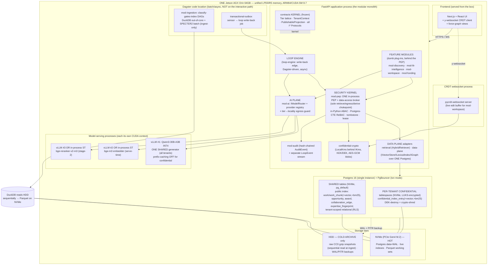
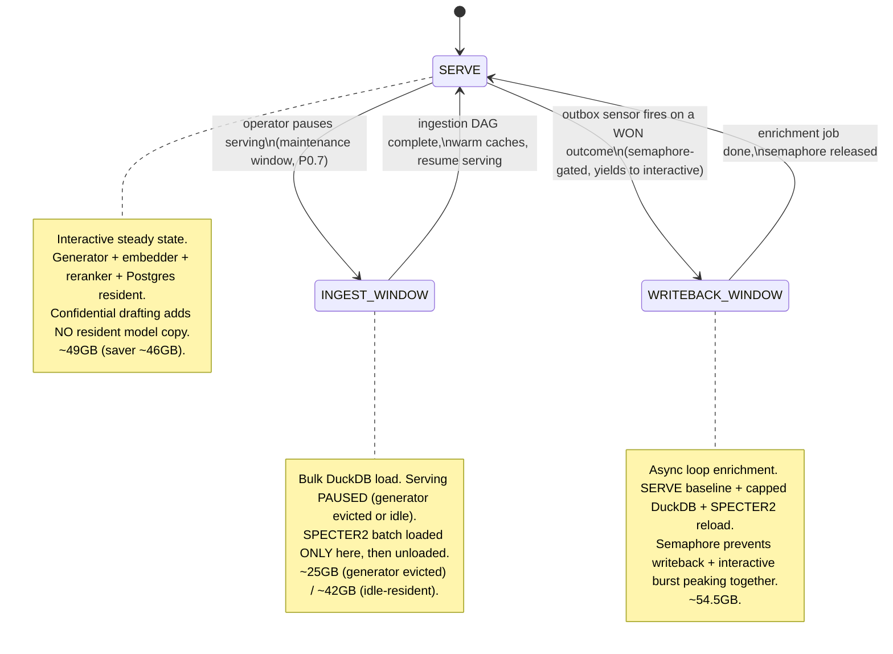
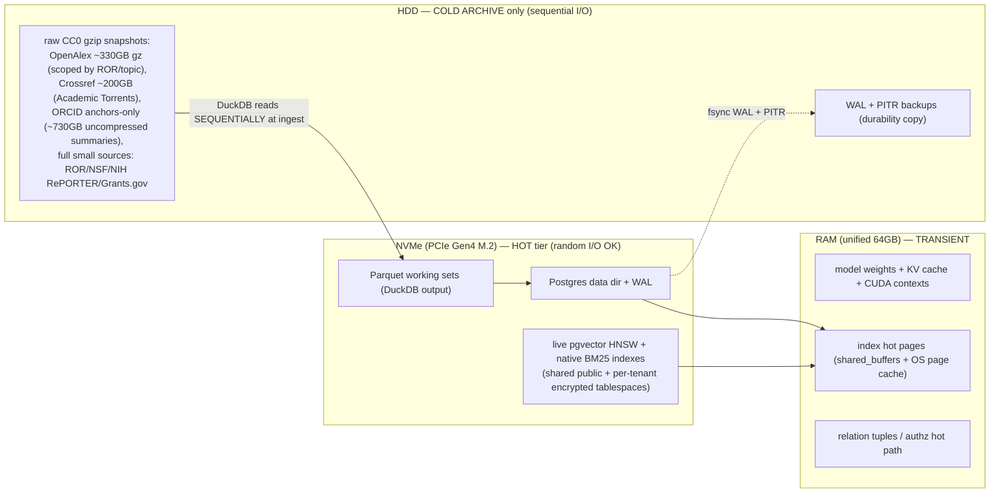

# 03 — Architecture & Orin Hardware Envelope

> **What this document is.** The high-level design (HLD) for TigerExchange (single-Orin edition)
> **plus** the hardware/memory envelope it must fit inside. It tells you (the builder) *what the
> layers are, how they depend on each other, and what physical limits constrain every choice you
> make.* It does **not** redefine kernel types (those live in `05-kernel-contracts.md`), DDL (that
> lives in `13-data-model-and-schemas.md`), pins (`CONVENTIONS-single-box.md`), or the security
> decision order (`06-security-spine-lld.md`). When a name/type/DDL/pin appears here it is a
> *reference* to those documents, not a new definition.
>
> **Who reads this.** A local ~30B model that will build the system. Everything is spelled out.
> Do not infer unstated decisions; if you think you need a decision that is not written here or in a
> sibling doc, stop and flag it.
>
> **Authority chain (precedence).** `_design-brief.json` (locked intent) → `CONVENTIONS-single-box.md`
> (names/paths/versions/pins — *this file wins* over the rest) → `05-kernel-contracts.md` (kernel
> shapes) and `13-data-model-and-schemas.md` (schema). This document must agree with all of them; if
> it ever appears to disagree, the higher-ranked doc wins and this text is the bug.
>
> **Primary brief fields expanded here.** `architecture_overview`, `memory_budget`, decisions
> **D2** (single-box monolith; federation deferred behind seams), **D10** (confidential KV isolation
> with no second model copy, no MIG), **D13** (tiered storage + three mutually-exclusive memory
> regimes), and the `open_risks` entries for NVMe, RAM contention, and single-point-of-failure.
>
> **Decision IDs are D1..D14 only.** There are no other labels (no `D-AI`, no `D15`).

---

## 0. Table of contents

1. [The one-paragraph mental model](#1-the-one-paragraph-mental-model)
2. [The modular-monolith topology (mermaid)](#2-the-modular-monolith-topology-mermaid)
3. [The six layers, top to bottom](#3-the-six-layers-top-to-bottom)
4. [The Orin hardware baseline (pinned)](#4-the-orin-hardware-baseline-pinned)
5. [Unified memory: why one pool changes everything](#5-unified-memory-why-one-pool-changes-everything)
6. [The THREE mutually-exclusive memory regimes](#6-the-three-mutually-exclusive-memory-regimes)
7. [The corrected memory budget tables (each ≤ 64GB)](#7-the-corrected-memory-budget-tables-each--64gb)
8. [Storage tiering: HDD cold / NVMe hot / RAM transient](#8-storage-tiering-hdd-cold--nvme-hot--ram-transient)
9. [The no-list: no MIG, no cloud, no second box, no second 30B](#9-the-no-list-no-mig-no-cloud-no-second-box-no-second-30b)
10. [Confidential isolation without a second model copy (D10)](#10-confidential-isolation-without-a-second-model-copy-d10)
11. [Federation seams: designed, not built — with honest carry-forward annotations](#11-federation-seams-designed-not-built--with-honest-carry-forward-annotations)
12. [Single-point-of-failure honesty + backup posture](#12-single-point-of-failure-honesty--backup-posture)
13. [Runtime contention rules (the operator runbook)](#13-runtime-contention-rules-the-operator-runbook)
14. [Acceptance gates this document is responsible for](#14-acceptance-gates-this-document-is-responsible-for)

---

## 1. The one-paragraph mental model

TigerExchange is **one FastAPI application + one Postgres 16 instance + a small fixed set of
model-serving processes**, all co-resident on **one NVIDIA Jetson AGX Orin 64GB**. It is a
**modular monolith**: in-process module boundaries, an in-process event bus, and exactly one
deployable. There is **no Kubernetes, no microservices, no second region, no second box.** Tenants
are *research groups on the one box*, isolated by Postgres FORCE-RLS + transaction-scoped
`SET LOCAL` + per-tenant encrypted tablespaces + per-tenant envelope keys (see D5/D7 in
`CONVENTIONS-single-box.md`). Every retrieve/egress/derive call funnels through **one in-process
Policy Enforcement Point (PEP) + data-access broker** (D3). The single hard ceiling is the **64GB
of LPDDR5 *unified* memory shared by CPU and GPU** — there is no separate VRAM, so the models, the
database buffers, the OS, and the ingestion engine all draw from the same pool. We never run all
the memory-hungry workloads at once; the box operates in exactly **one of three mutually-exclusive
memory regimes** at a time (SERVE / INGEST-WINDOW / WRITEBACK-WINDOW), each proven to fit under
64GB. Cross-box federation is **designed behind clean Protocol seams but not built**, and we are
**honest** that two of the single-box mechanisms (encrypted-tablespace crypto-shred and the
recursive-CTE ReBAC resolver) are *known federation-boundary rewrites*, not transport swaps (D2).

---

## 2. The modular-monolith topology (mermaid)

This is the runtime topology — the *processes* on the box and the *layers* inside the FastAPI
process. It is the physical companion to the package/import diagram in
`CONVENTIONS-single-box.md` §4.2 (which shows *import* edges). Here we show *who runs as a process*
and *who talks to whom at runtime*.



> **What the topology encodes.** (1) There is exactly **one** application process; feature modules
> are layers inside it, not separate services. (2) Every data/egress/derive path goes through the
> **PEP** before it reaches the data plane, the AI plane, or the crypto layer — the PEP is drawn as
> the single choke. (3) The **serving processes are separate OS processes** (each with its own CUDA
> context) but there is only **one** generator process shared by all tenants. (4) The **Dagster
> code location is off the interactive path** — ingestion and write-back run in their own regimes.
> (5) **NVMe is the hot tier; HDD is cold-archive + backup only.**

---

## 3. The six layers, top to bottom

The system is built bottom-up: the kernel first, then the security kernel, then the data/AI planes,
then the feature modules, then the loop engine. This ordering is the build order in
`14-build-runbook-and-phases.md` (P0.0 → P0.10). Each layer is summarized below; the authoritative
detail lives in the cited sibling doc.

| # | Layer | Package(s) (`CONVENTIONS` §3) | Responsibility | Authoritative doc |
|---|-------|-------------------------------|----------------|-------------------|
| 1 | **Kernel** (`contracts`) | `tigerexchange_contracts` | The near-frozen shared vocabulary: `Tier` lattice + MAX-rule, `TenantContext`/`Entitlement`/`Capability`, `ClassificationResult`/`Decision`, `PublishableProjection`, all `I*` Protocols (incl. the deferred `IExchangeFeed`/`IRevocationAuthority` stubs), `AuditEvent`. Imports **nothing** feature-side; does **no** I/O. | `05-kernel-contracts.md` |
| 2 | **Security kernel** | `tigerexchange_pep`, `tigerexchange_confidential_crypto`, `tigerexchange_audit` | ONE in-process PEP + data-access broker (the **sole** retrieve/egress/derive chokepoint, D3); fixed fail-closed decision order (D4): entitlement → capability → in-Python ABAC tier → Postgres-CTE ReBAC → durable tombstone → short-TTL lease; LocalKms + KEK/DEK envelope (D7); hash-chained audit. **Built first** (P0.1–P0.4a). | `06-security-spine-lld.md` |
| 3 | **Data plane** | `tigerexchange_data_plane`, `tigerexchange_retrieval` | A **single Postgres 16** providing relational tables + pgvector HNSW (dense) + native BM25 + RRF-in-SQL + a metadata-backbone graph as an edge table traversed by recursive CTEs (D8). Hosts **both** the shared public retrieval index **and** the per-tenant confidential retrieval surfaces (on encrypted tablespaces). | `07-data-layer-and-retrieval-lld.md`, `13-data-model-and-schemas.md` |
| 4 | **AI plane** | `tigerexchange_ai` | Up to **three** small one-model-per-process serving instances behind a classification-routed `IModelRouter`: (1) the ONE shared Qwen3-30B-A3B generator, (2) the embedder, (3) the reranker — *or* the recommended saver: 1 vLLM (LLM) + sentence-transformers in-process for embed/rerank. SPECTER2 is **ingest-only** (precompute then unload), never serve-resident (D8/D9/D10). | `08-ai-plane-and-model-router-lld.md` |
| 5 | **Feature modules** | `tigerexchange_discovery`, `tigerexchange_lit_intelligence`, `tigerexchange_workspace`, `tigerexchange_funding` | "Dumb" plug-ins behind the PEP. `mod-discovery` (two-axis team assembly, PUBLIC-tier only); `mod-lit-intelligence` (dual-source grounding: shared public + own-tenant confidential); `mod-workspace` (confidential CRDT co-authoring — the **centerpiece**, real-time mode at P0); `mod-funding` (opportunity + award feeds, creates the Pursuit). | `10-feature-modules-lld.md`, `11-mod-workspace-confidential-coauthoring-lld.md` |
| 6 | **Loop engine** | `tigerexchange_loop_engine`, `tigerexchange_ingestion` | The compounding write-back edge (D12): on a recorded **won** outcome, a Dagster outbox sensor fires a **semaphore-gated async** job that re-ingests team + award + artifacts through the **same** classify-gates-index monotonic applier, materializing `CO_PI_WITH` edges + a transparent outcome-weighted expertise signal + artifacts as public WORK nodes. | `12-collaboration-loop-and-writeback-lld.md`, `09-ingestion-and-identity-resolution-lld.md` |

> **Why this layering, and what it rejects.** We chose a *modular monolith with a frozen kernel +
> single PEP* over (a) independently-deployed microservices and (b) a flat code tree. Microservices
> were rejected because on one 64GB box, every extra always-on service (an OPA daemon, a SpiceDB
> cluster, a Qdrant node, an OpenSearch node) competes for the same memory the models need, and the
> K8s/operator overhead buys nothing when there is exactly one node (D2, D4, D8). A flat tree was
> rejected because it lets business logic leak across module boundaries and makes the import-linter
> contract impossible to phrase (`CONVENTIONS` §2). The layering also makes the **security edge
> structural**: a feature module physically cannot open a raw DB connection, construct a
> `PublishableProjection`, or call the classifier directly (enforced by import-linter + AST test,
> `CONVENTIONS` §4) — so a builder mistake in a feature module cannot become a confidentiality leak.

---

## 4. The Orin hardware baseline (pinned)

This is the **fixed deploy target.** Pin it verbatim. These values are the authoritative source for
`04-tech-stack-and-arm64-runbook.md`; if any value drifts, the pinned CUDA wheels break (the #1
Jetson LLM failure mode).

| Concern | Pinned value | Why it matters / what breaks otherwise |
|---|---|---|
| Board | **Jetson AGX Orin 64GB** | 64GB LPDDR5 **unified** memory is the single hard ceiling for *all* processes combined (CPU + GPU share one pool). |
| OS / L4T | **JetPack 6.2 (L4T r36.4.3), Ubuntu 22.04 aarch64** | Fallback: JetPack 6.1 (still CUDA 12.6). Never go below CUDA 12.6. |
| CUDA | **12.6** | The pinned jetson-ai-lab wheels are built for CUDA 12.6; below this they will not load. |
| GPU arch | **SM 8.7 (Ampere)** | Wheels MUST contain SM 8.7 SASS. Default PyPI cu126 wheels **omit** SM 8.7 → silent CPU fallback. Each serving process asserts SM 8.7 at startup (`CONVENTIONS` §7). |
| Python | **3.11+ (build/test on 3.11; NOT 3.12)** | The JetPack 6.2 wheel set is built against 3.11; 3.12 breaks the pinned CUDA wheels. `pyproject.toml` pins 3.11 (`CONVENTIONS` §7). |
| Power mode | **MAXN** | Required for the decode throughput the latency SLOs assume. |
| CUDA wheels source | **`https://pypi.jetson-ai-lab.io/jp6/cu126`** | torch, vLLM, flash-attn, xformers, bitsandbytes MUST come from here. **NEVER `pip install vllm` from default PyPI.** |
| MIG | **Unavailable** | Orin Ampere has no MIG. GPU partitioning is impossible; confidential isolation uses a software mechanism instead (D10, §10). |
| Storage | **Spinning HDD (cold) + attached NVMe PCIe Gen4 M.2 (hot)** | NVMe is *effectively mandatory in the BOM*; see §8 and the NVMe open-risk (§12). |

---

## 5. Unified memory: why one pool changes everything

On a discrete-GPU server, GPU VRAM and host RAM are separate budgets: you can load 24GB of model
weights into VRAM *and* run a 32GB Postgres buffer pool in host RAM, and the two never collide. **The
Orin is not that machine.** It has a single 64GB LPDDR5 pool shared by the CPU and the GPU. There is
no "VRAM headroom" hiding behind the "RAM headroom." Every byte of model weights, KV cache, CUDA
context, Postgres `shared_buffers`, OS page cache, DuckDB hash tables, and Python heap is drawn from
the **same 64GB**.

Three consequences follow, and they drive the rest of this document:

1. **You cannot sum optimistic per-component budgets and assume they coexist.** The old plan's single
   "headroom" figure was **triple-counted** — it implicitly assumed a burst, a DuckDB spill, and a
   (now-eliminated) second vLLM process could each have headroom *at the same time* (open-risk
   "DuckDB + Postgres + vLLM RAM contention"). They cannot. The fix is the three mutually-exclusive
   regimes (§6).
2. **A second resident 30B model is fatal arithmetic, not a tuning knob.** A second copy is
   ~17GB weights + ~4–8GB context. Added to the ~49GB SERVE baseline that is ~70GB > 64GB — the box
   would OOM and the centerpiece confidential-drafting path could not run at all. This is *why* D10
   forbids a second copy (§10).
3. **The database and the model fight over the same pages.** Postgres `shared_buffers` + OS page
   cache for the hot HNSW/BM25 indexes (~7GB in SERVE) is not "free RAM the model isn't using" — it
   is RAM the model **is** using. During bulk ingestion we *reduce* `shared_buffers` precisely
   because the embedder + DuckDB need that memory (INGEST-WINDOW, §6/§7).

> **The one rule to internalize:** there is one 64GB pool. Budget every workload against it
> *together*, never in isolation, and only run mutually-compatible workloads in the same regime.

---

## 6. The THREE mutually-exclusive memory regimes

The box runs in **exactly one** of three regimes at any moment. A regime is a named, budgeted set of
resident workloads. The transition between regimes is an explicit operator/runbook action (pause
serving; start the ingestion DAG; etc.), enforced by the serving-pause + semaphore mechanism (§13).
This replaces the discredited single "headroom" number (D13; open-risks "RAM contention",
"triple-counted headroom").



| Regime | When it is active | What is resident | Approx. total | Hard rules |
|---|---|---|---|---|
| **SERVE** | Interactive steady state (the default) | OS + the shared 30B generator + embedder + reranker + Postgres buffers + app/CRDT backends. **No** DuckDB, **no** SPECTER2. | **~49GB** (saver **~46GB**) | Confidential drafting adds **no** resident model copy (same generator, prefix-caching off + serialized, D10). The saver collapses embed/rerank to sentence-transformers in-process. |
| **INGEST-WINDOW** | Bulk corpus load (P0.7), **serving paused** | OS + DuckDB (capped) + SPECTER2 batch (loaded here only) + embedder + Postgres with **reduced** `shared_buffers`. Generator **evicted** (or idle-resident for a quick window). | **~25GB** (generator evicted) / **~42GB** (idle-resident) | DuckDB `memory_limit='8GB'` + capped threads, set explicitly. Runs in a maintenance window; not silently concurrent with serving. |
| **WRITEBACK-WINDOW** | Async loop enrichment on a WON outcome (P0.10), **semaphore-gated** | SERVE baseline + capped writeback DuckDB + SPECTER2 reload for fingerprint recompute. | **~54.5GB** | DuckDB `memory_limit='4GB'`. The semaphore yields to interactive generation so writeback and an interactive burst never peak together. |

> **Why mutually-exclusive regimes and not "just run everything and let the OOM killer sort it
> out".** On unified memory an OOM during confidential drafting is a correctness failure (a half-built
> draft, a dropped revocation, a corrupted CRDT snapshot), not a graceful degradation. We chose
> explicit regimes — proven to fit individually — over (a) one optimistic combined budget (which was
> triple-counted and wrong) and (b) relying on swap (the swap device is the slow HDD; swapping model
> weights or HNSW pages there gives 10s+ latencies, defeating the whole design). Each regime's
> arithmetic is shown in §7 and sums to ≤ 64GB.

---

## 7. The corrected memory budget tables (each ≤ 64GB)

These tables are the verbatim expansion of the brief's `memory_budget` field. They are the
authoritative numbers; `04-tech-stack-and-arm64-runbook.md` cites them. Every number is an
*approximate* steady-state resident figure on the 64GB unified pool.

### 7.1 REGIME 1 — SERVE (interactive steady state)

| # | Component | Detail | Approx. |
|---|-----------|--------|--------:|
| 1 | OS + L4T + CUDA drivers + headroom | base system | **~7GB** |
| 2 | **Generator process** — Qwen3-30B-A3B INT4/W4A16 | weights ~17GB (**all** 30.5B experts resident; the 3.3B active-per-token governs only **decode speed** ~30–45 tok/s, *not* footprint) + KV cache/activations/CUDA context @ ~20k ctx, small `max-num-seqs` ~8GB | **~25GB** |
| 3 | **Embedder process** — bge-m3 568M FP16 | weights ~1.2GB + CUDA context ~1.3GB | **~2.5GB** |
| 4 | **Reranker process** — bge-reranker-v2-m3 568M | weights ~1.2GB + CUDA context ~1.3GB | **~2.5GB** |
| 5 | **SPECTER2** | precomputed at ingest, **UNLOADED** at serve | **0GB** |
| 6 | **Postgres `shared_buffers` + OS page cache** | hot pgvector HNSW + BM25 index for the scoped tenant corpus (~100K–1M chunks at 1024-dim, + HNSW ~1.5–2× overhead); shared public index + the small hot per-tenant confidential surfaces | **~7GB** |
| 7 | **App backends** | Postgres backends + PgBouncer + FastAPI + Python workers + CRDT websocket server (CRDT docs are KB–MB, negligible) | **~5GB** |
| | **SERVE TOTAL** | 7 + 25 + 2.5 + 2.5 + 0 + 7 + 5 | **~49GB** (≈ **15GB margin**) |

**Recommended saver:** collapse the embedder + reranker to **sentence-transformers in-process**,
dropping 2 CUDA contexts (~2.6GB) → **~46GB**. This is the recommended variant if the 3-process
budget is ever tight (D9; `CONVENTIONS` §5 serving row).

**Confidential drafting adds NO resident model copy.** It reuses the *same* generator process with
`--enable-prefix-caching=False` + serialized requests (D10, §10). The SERVE total is therefore
unchanged at ~49GB whether or not a confidential draft is in flight.

**If true PROCESS isolation is ever mandated** (it is *not* required at P0): the confidential process
loads the **smaller Qwen3-14B** (~9GB weights + ~4GB context = ~13GB) **and the public 30B is
PAUSED/EVICTED first** — never two 30B copies resident:
`7 + 13 + 2.5 + 2.5 + 7 + 5 = ~37GB`. **NEVER ~70GB.** (D10; `CONVENTIONS` §6 FORBIDDEN.)

### 7.2 REGIME 2 — INGEST-WINDOW (bulk DuckDB load; serving paused)

| # | Component | Detail | Approx. |
|---|-----------|--------|--------:|
| 1 | OS + drivers | base system | **~7GB** |
| 2 | Generator | **EVICTED** during bulk load (0GB) — or **idle-resident** ~17GB for a quick window | **0GB** / ~17GB |
| 3 | DuckDB out-of-core | `SET memory_limit='8GB'` + capped threads | **~8GB** |
| 4 | SPECTER2 batch | base + proximity adapter via the `adapters` library, **loaded only here** | **~1.5GB** |
| 5 | Embedder process | computing chunk embeddings at ingest | **~2.5GB** |
| 6 | Postgres | **REDUCED** `shared_buffers` during bulk load + writer backends | **~6GB** |
| | **INGEST TOTAL (generator evicted)** | 7 + 8 + 1.5 + 2.5 + 6 | **~25GB** (huge margin) |
| | **INGEST TOTAL (generator idle-resident)** | + ~17GB | **~42GB** (still fits) |

### 7.3 REGIME 3 — WRITEBACK-WINDOW (async loop enrichment, semaphore-gated)

| # | Component | Detail | Approx. |
|---|-----------|--------|--------:|
| 1 | SERVE baseline | full §7.1 SERVE total | **~49GB** |
| 2 | Capped writeback DuckDB / enrichment | `SET memory_limit='4GB'` | **~4GB** |
| 3 | SPECTER2 reload | for fingerprint recompute on enrichment | **~1.5GB** |
| | **WRITEBACK TOTAL** | 49 + 4 + 1.5 | **~54.5GB** (within 64GB) |

> The semaphore (§13) guarantees the writeback job yields to interactive generation, so the writeback
> spend and an interactive generation burst do not both peak simultaneously.

> **Side note (why the A3B MoE, not a dense 32B).** A dense Qwen2.5-32B would push weights to ~19GB
> **and** slow decode (a dense 32B activates all parameters per token). The A3B MoE keeps weights at
> ~17GB and decode bandwidth-bound at ~3B speed. Two reasons the MoE is correct on this box (D9).

---

## 8. Storage tiering: HDD cold / NVMe hot / RAM transient

There are **three storage tiers**, and the rule about which data lives where is load-bearing for
both latency and security (D13).



**Tier rules (pinned):**

- **HDD = cold archive ONLY.** Raw CC0 gzip corpus snapshots, read **sequentially** by DuckDB during
  the INGEST-WINDOW, plus WAL/PITR backup copies. Orin HDD *random* I/O is a documented bottleneck;
  the HDD is only ever touched in long sequential streams.
- **NVMe = hot tier.** Postgres data dir + WAL, the live HNSW/BM25 indexes (shared public **and** the
  per-tenant encrypted tablespaces), and the Parquet working sets DuckDB writes. NVMe handles the
  random I/O that HNSW and the authz path generate.
- **RAM = transient.** Model weights, KV cache, CUDA contexts, the hot index pages
  (`shared_buffers` + OS page cache), and the relation-tuple/authz hot path.

**The load-bearing guardrail — the authz/HNSW hot path never touches HDD.** This is the single most
important storage rule, and it is non-negotiable (D13; `retrieval_design` "HDD GUARDRAIL"):

- **HNSW is pure random I/O.** Serving an HNSW index off the spinning HDD yields **10s+ queries**.
  The live HNSW index MUST stay RAM-resident / on NVMe. Whichever vector index is chosen (pgvector
  HNSW is the verified P0 default; VectorChord RaBitQ ">RAM index" is a *P1 verify-then-adopt* task,
  **not** a P0 dependency, D8) MUST remain RAM-resident / on NVMe.
- **Per-request authorization is on the hot path.** The PEP's ReBAC recursive-CTE Check and the
  tombstone read run on every confidential access. If those tables seek on the HDD, authz latency
  dominates the request. They live on NVMe with `tenant_id`-leading indexes (D5) so the predicate is
  an index seek, never a heap scan.

> **Why DuckDB out-of-core and not load-into-RAM.** The scoped OpenAlex/Crossref sets exceed RAM.
> DuckDB reads the gzip NDJSON **sequentially** off the HDD, spills intermediate hash tables to disk,
> and writes Parquet to NVMe — so it processes >RAM corpora on a 64GB box without ever loading the
> whole set into memory (D13/D14). Its `memory_limit` is capped (8GB ingest / 4GB writeback) and it
> only runs in the INGEST-WINDOW or the semaphore-gated WRITEBACK-WINDOW, never silently concurrent
> with full serving.

> **Confidential search indexes live on NVMe inside an encrypted tablespace.** The per-tenant
> `confidential_index_entry` surface (its vectors/BM25 postings, see `13-data-model-and-schemas.md`
> §10) is on a per-tenant LUKS-encrypted tablespace on NVMe. It is *plaintext-at-rest inside* the
> encrypted block device — searchable while the device is mounted — and crypto-shredded by destroying
> the unlocking DEK (D7; §11 carry-forward note). We do **not** AES-GCM the vectors/postings (that
> would make them mathematically unsearchable).

---

## 9. The no-list: no MIG, no cloud, no second box, no second 30B

These are the hardware/topology bans that this document is responsible for. The full forbidden list
is `CONVENTIONS-single-box.md` §6; the four below are the ones that shape the *architecture and
hardware envelope* specifically.

| Banned | Why (hardware/topology reason) | Use instead |
|---|---|---|
| **A second resident 30B model copy** | A second ~17GB weights + ~4–8GB context → ~70GB > 64GB unified pool → OOM. The centerpiece confidential path could not run (D10). | ONE shared generator + `--enable-prefix-caching=False` + serialization (§10). If true process isolation is ever mandated: Qwen3-14B **with the 30B evicted first** — never two 30B copies. |
| **GPU MIG** | **Physically unavailable** on Orin Ampere. There is no hardware to partition. | Software KV isolation on the one shared generator (§10). MIG deferred to a future Thor/Blackwell board only. |
| **Cloud KMS / CloudHSM / cloud model APIs as a default** | This is a **no-cloud, self-hosted** box (D2/D7). Confidential drafts must never egress (D10). | In-process `LocalKms` + fTPM/passphrase anchor; in-boundary vLLM for confidential/private inference. Public-tier *may* use a cloud model, gated by the tier→locality table. |
| **Kubernetes / microservices / a second box / built federation** | One box, one 64GB pool; K8s and extra services waste the scarce memory the models need (D2). | Modular monolith — one FastAPI app. Federation is **designed behind clean seams, not built** (§11). |

---

## 10. Confidential isolation without a second model copy (D10)

This is the architecture's most counter-intuitive decision, so it is spelled out in full. The
requirement is: **a tenant's confidential drafting must not leak across requests or to other
tenants, and confidential content must never egress the box.** The naive answer — "give confidential
tenants their own dedicated model process" — is *fatal arithmetic* on this box.

**The arithmetic (why a second copy is forbidden):**

```
SERVE baseline                              ~49 GB
+ a dedicated confidential vLLM process:
    second Qwen3-30B-A3B weights            ~17 GB
    + its KV cache / context                ~4–8 GB
= total                                     ~70–74 GB   >  64 GB  ->  OOM
```

A second copy does not fit. Therefore **there is exactly one resident 30B generator process**, shared
by all tenants including the confidential drafting path.

**How isolation is achieved instead (the software mechanism):**

1. **vLLM does NOT leak KV cache across separate requests by default.** Independent requests get
   independent KV state. The *real* cross-request leak vector is **shared-prefix caching** (a request
   reusing another request's cached prefix KV).
2. So for the confidential path we **disable prefix caching**: `--enable-prefix-caching=False` on
   confidential requests. No prefix/KV is shared across requests.
3. And we **serialize** confidential requests with a **KV-cache boundary** between confidential and
   non-confidential work. Confidential drafting requests are queued/serialized; backpressure is
   exposed to the editor.

The result is **safe** (no shared-prefix KV leak) **and fits** (no second resident copy).

```mermaid
sequenceDiagram
    participant WS as mod-workspace (confidential draft)
    participant PEP as PEP + tier→locality guard
    participant RT as IModelRouter (mod-ai)
    participant GEN as ONE shared Qwen3-30B-A3B vLLM process
    Note over WS,GEN: There is only ONE generator process for ALL tenants.
    WS->>PEP: GenerationRequest(tier=confidential, confidential=True)
    PEP->>PEP: tier→locality table: confidential ⇒ in-boundary ONLY
    Note right of PEP: router AND transport read the SAME policy table;\ndisagreement HARD-FAILS
    PEP->>RT: route (local-only)
    RT->>GEN: serialized request, --enable-prefix-caching=False
    Note right of GEN: no shared-prefix KV reuse;\nKV boundary vs non-confidential requests
    GEN-->>RT: GenerationResult(served_locally=True)
    RT-->>WS: draft tokens (served_locally MUST be True)
```

> **What enforces this at runtime.** The `IModelRouter` and the egress transport both read the **one
> owned tier→locality policy table** (D10; brief security control "Confidential = local-only
> inference + shared-generator KV isolation"); a router/transport disagreement **hard-fails**. A
> human-authored CI gate asserts confidential requests run with prefix caching disabled, and a
> CI/runtime probe asserts SERVE-regime resident memory ≤ ~49GB (catching an accidental second 30B
> copy). See `08-ai-plane-and-model-router-lld.md` for the router internals and
> `CONVENTIONS-single-box.md` §10 for the gate list.

> **Open risk (mitigated).** Mis-implementing this — leaving prefix caching ON for confidential
> requests, or reintroducing a second 30B process — is an explicit open risk
> (`open_risks`: "Confidential drafting KV isolation is mis-implemented"). The mitigations are the
> startup/route assertion, the human-authored "confidential request runs with prefix caching
> disabled" test, the FORBIDDEN-list ban on a second 30B copy, and the ≤ ~49GB SERVE probe.

---

## 11. Federation seams: designed, not built — with honest carry-forward annotations

Cross-BOX federation (a second Orin, a central network read-PEP, cross-node discovery exchange,
distributed revocation) is **designed behind clean kernel Protocol seams but NOT built in Phase-0**
(D2). The seams are defined now so the future layer is *mostly* a transport addition — but we are
**honest** that two single-box mechanisms are **known federation-boundary rewrites**, not transport
swaps. Do not claim "everything is just plumbing later." The full treatment is
`15-future-federation-interfaces.md`; this is the architecture-level summary.

| Seam / mechanism | Where defined | Federation status |
|---|---|---|
| `PublishableProjection.discoverability_scope` (incl. `FEDERATED` member, never emitted in P0) | `05-kernel-contracts.md` §7 | **Carry-forward-CLEAN.** The projection shape is federation-portable; only the transport is added later. |
| `IExchangeFeed` (deferred stub, `publish` / `pull`) | `05-kernel-contracts.md` §10 | **Carry-forward-CLEAN.** Traffics only in confidential-rejecting `PublishableProjection`. A transport addition later. |
| `IRevocationAuthority` (deferred stub) | `05-kernel-contracts.md` §10 | Stub in P0. The *interface* is stable, but the mechanism behind it (below) is a rewrite. |
| Owner-authoritative re-derivation invariant | `06-security-spine-lld.md` | **Carry-forward-CLEAN** invariant. |
| **Encrypted-tablespace / volume crypto-shred (D7)** | this doc §8/§10; `06` | **KNOWN FEDERATION-BOUNDARY REWRITE.** Crypto-shred = destroying a *node-local* DEK that unlocks a *node-local* LUKS tablespace. A future `IRevocationAuthority` **cannot** crypto-shred another node's tablespace by message-passing; distributed crypto-shred is a different mechanism. |
| **Recursive-CTE ReBAC `Check()` (D4)** | `06`; `13` §13 | **KNOWN FEDERATION-BOUNDARY REWRITE.** The CTE resolves **LOCAL** relation-tuple tables only. Cross-box ReBAC needs distributed tuple resolution the CTE cannot do. |

> **Why be this explicit.** An earlier plan over-claimed that federation was "a transport addition,
> not a rewrite." It is not — for crypto-shred-by-volume and CTE ReBAC (`open_risks`: "Federation
> over-claim"). Stating the boundary honestly now prevents a future builder from believing those two
> mechanisms will federate for free and shipping a confidentiality hole. The deferred-stub discipline
> (`05` §10) is: define `IExchangeFeed`/`IRevocationAuthority` now, wire **no** real provider in P0,
> and raise `NotImplementedError` from the placeholder (never a silent no-op — a silent no-op on
> revocation would be a leak).

---

## 12. Single-point-of-failure honesty + backup posture

**The box is a single point of failure. There is no HA.** This is a deliberate, honest pilot-scale
posture, not an oversight (`open_risks`: "Single box = single point of failure"). One Orin means: a
disk failure, a power loss, or a kernel panic loses *live* state until recovery. We do **not** pretend
otherwise, and we do **not** add a second box (that is out of scope, D2). Instead we make the failure
modes *recoverable* and *honest about RPO/RTO*.

**Backup + durability posture (pinned mitigations):**

| Concern | Mechanism | Notes |
|---|---|---|
| **Committed-data durability** | Postgres data + WAL on NVMe with **`synchronous_commit=on`** | A committed transaction is on stable storage before the client sees the ack. |
| **Point-in-time recovery** | **WAL + PITR backups to the HDD cold tier** | The HDD is the local backup target. RPO is bounded by the WAL-archive cadence; document it honestly. |
| **Revocation durability (the security-critical one)** | The **durable, fsync'd `revocation_log`** is committed **before** any allow/deny observes it; crash-recovery rebuilds authorization **strictly from the durable log** and **refuses confidential reads until recovery completes** (anti-resurrection) | Proven by the human-authored `crash-mid-revocation stays-denied` test (`CONVENTIONS` §10). A crash must never resurrect a revoked confidential grant. |
| **CRDT draft recovery** | The CRDT buffer survives server restart; snapshots are taken on **autosave intervals** (not per keystroke) and AES-GCM'd into the per-tenant KEK-bound store | A crash mid-edit recovers the CRDT doc (P0.9 acceptance). |
| **NVMe-absent contingency** | If the delivered box truly lacks NVMe, force the **entire hot tier** (Postgres data+WAL, indexes, relation tuples) into RAM via `shared_buffers` and **cap corpus scope** so the working set fits — accepting a smaller corpus | NVMe is flagged *effectively mandatory in the BOM at P0.0* (`open_risks`: "NVMe absent"). HDD-only is **not** an acceptable serving tier (10s+ HNSW queries, seek-bound authz). |

> **State the RPO/RTO honestly.** This is a single-box pilot. RPO is bounded by the WAL-archive/PITR
> cadence; RTO is bounded by restart + crash-recovery (rebuild-from-log) time. Do not claim
> zero-RPO/HA. Federation/HA is explicitly future work (§11, `15-future-federation-interfaces.md`).

---

## 13. Runtime contention rules (the operator runbook)

The three regimes (§6) are enforced by a small set of contention rules. These are pinned operator
behaviors *and* code mechanisms (`memory_budget` "CONTENTION RULES"; D13).

1. **Exactly ONE regime at a time.** Ingestion (P0.7) runs in a maintenance window with **serving
   paused** (generator evicted or idle). The regime transition is an explicit action, not an
   accident of concurrent jobs.
2. **Serialize LLM generation vs heavy embedding batches.** Do not run a large embedding batch
   concurrently with full interactive generation; they both contend for the GPU and the unified pool.
   Gate generation so the **CRDT editor stays responsive** (the centerpiece interactive surface).
3. **Confidential KV isolation = prefix-caching-off + serialization on the ONE shared generator.**
   No MIG (unavailable), no second copy (forbidden). See §10.
4. **Write-back is semaphore-gated and yields to interactive generation.** The WRITEBACK-WINDOW
   async enrichment job (D12) acquires a semaphore that yields to interactive generation, so a
   writeback spend and an interactive burst never peak together (§7.3).
5. **Warm caches before resuming SERVE.** After an INGEST-WINDOW, warm the hot index pages before
   accepting interactive traffic, so the first queries do not pay a cold-cache (and possibly
   disk-seek) penalty.
6. **Partial-failure policy differs by surface** (`retrieval_design` "PARTIAL-FAILURE POLICY"):
   public/shared discovery returns **partial-results-with-an-honest-completeness-indicator** (never a
   whole-query failure); the **confidential path is whole-query fail-closed** (a confidential
   retrieval/generation either fully succeeds or denies — never returns a partial, possibly-leaky
   result).

---

## 14. Acceptance gates this document is responsible for

This document is *descriptive* (HLD + envelope), but several of its claims are checked by acceptance
tests owned by build phases in `14-build-runbook-and-phases.md`. The architecture is "correct" only
when these are green. (Security-bearing gates are **human-authored**, per `CONVENTIONS` §10 — the
builder makes them pass, it does not write them.)

| Claim in this doc | Verified by | Phase |
|---|---|---|
| SM 8.7 CUDA is actually loaded (no silent CPU fallback) in each serving process | startup assertion that loaded `torch`/`vllm` reports SM 8.7 CUDA | P0.0 / P0.6 |
| SERVE-regime resident memory ≤ ~49GB (no accidental second 30B copy) | CI/runtime memory probe | P0.6 |
| Confidential requests run with prefix caching disabled | human-authored route/startup assertion + test | P0.6 |
| Confidential/private routes to in-boundary only; router vs transport disagreement hard-fails | router/transport policy-table test | P0.6 |
| Decode ~30–45 tok/s | smoke benchmark recorded | P0.6 |
| The live HNSW index is served RAM-resident / on NVMe (no HDD on the hot path) | placement verification | P0.5 |
| HDD reads are sequential at ingest (no random-read on the ingest hot path) | ingestion test | P0.7 |
| Ingestion runs in INGEST-WINDOW with serving paused | regime/orchestration test | P0.7 |
| Write-back runs async off the outbox, semaphore-gated, NOT on the interactive path; stays within the WRITEBACK-WINDOW budget | compounding contract test + memory check | P0.10 |
| A confidential prior-proposal entry is unreadable after DEK destruction (encrypted-tablespace crypto-shred) | human-authored zero-decryptable-hits gate | P0.4b |
| Crash mid-revocation leaves the object denied (anti-resurrection) | human-authored crash-injection test | P0.2 / P0.9 |

---

*End of `03-architecture-and-orin-constraints.md`. For names/types/DDL/pins this doc defers to:
`05-kernel-contracts.md` (kernel types + Protocols), `13-data-model-and-schemas.md` (DDL + Pydantic),
`CONVENTIONS-single-box.md` (pins + forbidden list, this-file-wins), `06-security-spine-lld.md`
(decision order + crypto-shred + revocation), `07-data-layer-and-retrieval-lld.md` (retrieval),
`08-ai-plane-and-model-router-lld.md` (router + KV isolation), `15-future-federation-interfaces.md`
(deferred seams).*
