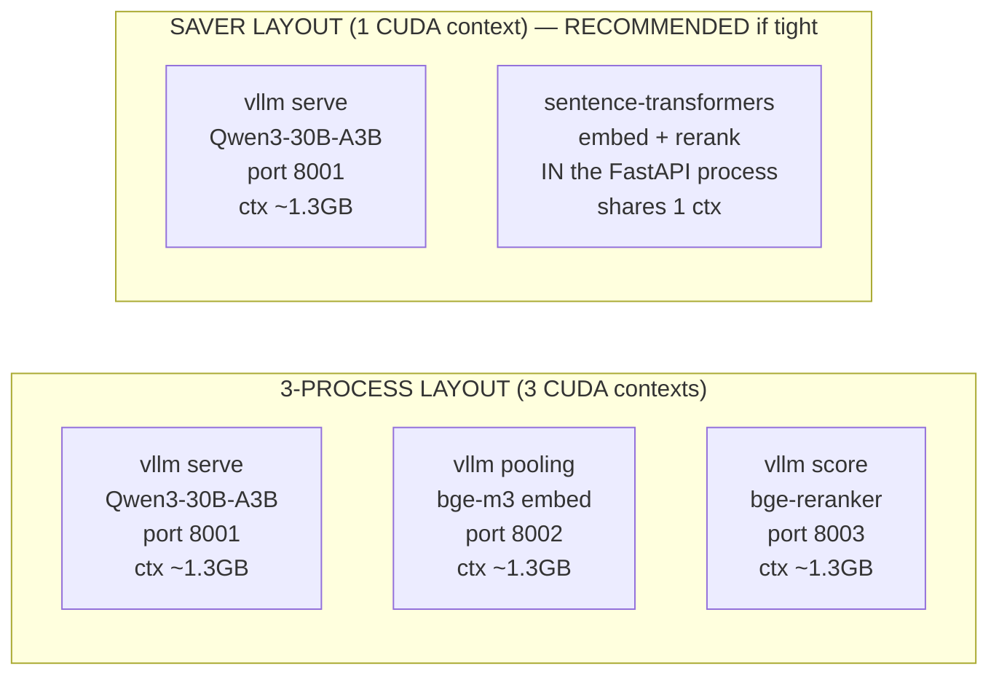

# 04 — Tech Stack & ARM64/Orin Install Runbook

> **What this document is.** The component-by-component install runbook for TigerExchange
> (single-Orin edition). For **every one of the 18 tech-stack layers** you get: the *choice*, *why*
> it was chosen (with the rejected alternative), its *ARM64/Orin status*, the **exact** install and
> config commands, the **pinned** versions, and the **fallback**. The hardware target is fixed: ONE
> NVIDIA Jetson AGX Orin 64GB (ARM64/CUDA, LPDDR5 *unified* memory, an HDD cold tier + an NVMe hot
> tier). The reader is the local ~30B builder; nothing here may be inferred — every command is
> copy-pasteable.
>
> **Authority chain.** `_design-brief.json` (locked intent) → `CONVENTIONS-single-box.md`
> (THIS-FILE-WINS names/pins) → this runbook for *install mechanics*. If any command here disagrees
> with a pin in `CONVENTIONS-single-box.md` §5/§7, **CONVENTIONS wins** — stop and flag it. Decision
> IDs are **D1..D14 only**.
>
> **Cross-references.** Architecture + the three memory regimes: `03-architecture-and-orin-constraints.md`.
> Kernel types/Protocols this stack implements: `05-kernel-contracts.md`. Security mechanics for the
> crypto layers (LocalKms, fTPM, LUKS, RLS): `06-security-spine-lld.md`. Retrieval/data-plane detail:
> `07-data-layer-and-retrieval-lld.md`. AI-plane router + KV isolation: `08-ai-plane-and-model-router-lld.md`.
> Ingestion (where SPECTER2 + DuckDB actually run): `09-ingestion-and-identity-resolution-lld.md`.
> Workspace/CRDT: `11-mod-workspace-confidential-coauthoring-lld.md`. The phase order that consumes
> all of this: `14-build-runbook-and-phases.md`.

---

## 0. Table of contents

1. [The four hard rules of this runbook (read first)](#1-the-four-hard-rules-of-this-runbook-read-first)
2. [The 18 layers at a glance](#2-the-18-layers-at-a-glance)
3. [Layer 1 — Deploy target / OS baseline (JetPack 6.2 / CUDA 12.6 / SM 8.7)](#3-layer-1--deploy-target--os-baseline-jetpack-62--cuda-126--sm-87)
4. [Layer 2 — Primary in-boundary LLM (Qwen3-30B-A3B INT4)](#4-layer-2--primary-in-boundary-llm-qwen3-30b-a3b-int4)
5. [Layer 3 — Serving runtime (vLLM as up to 3 processes vs the ST saver)](#5-layer-3--serving-runtime-vllm-as-up-to-3-processes-vs-the-st-saver)
6. [Layer 4 — Retriever embedding model (bge-m3 / Qwen3-Embedding-0.6B)](#6-layer-4--retriever-embedding-model-bge-m3--qwen3-embedding-06b)
7. [Layer 5 — SPECTER2 citation-aware embedding (INGEST-ONLY, then unloaded)](#7-layer-5--specter2-citation-aware-embedding-ingest-only-then-unloaded)
8. [Layer 6 — Reranker (cross-encoder, stage-2)](#8-layer-6--reranker-cross-encoder-stage-2)
9. [Layer 7 — Relational + vector + lexical + graph datastore (single Postgres 16)](#9-layer-7--relational--vector--lexical--graph-datastore-single-postgres-16)
10. [Layer 8 — Disk-friendly vector index (P1 only, not P0)](#10-layer-8--disk-friendly-vector-index-p1-only-not-p0)
11. [Layer 9 — Concurrent co-authoring engine (pycrdt + websocket)](#11-layer-9--concurrent-co-authoring-engine-pycrdt--websocket)
12. [Layer 10 — ABAC engine (in-Python lattice)](#12-layer-10--abac-engine-in-python-lattice)
13. [Layer 11 — ReBAC engine (Postgres recursive-CTE)](#13-layer-11--rebac-engine-postgres-recursive-cte)
14. [Layer 12 — Key management / crypto-shred custody (LocalKms + fTPM/passphrase)](#14-layer-12--key-management--crypto-shred-custody-localkms--ftppassphrase)
15. [Layer 13 — Crypto-shred of SEARCHABLE derivatives (encrypted tablespace / LUKS)](#15-layer-13--crypto-shred-of-searchable-derivatives-encrypted-tablespace--luks)
16. [Layer 14 — Application-layer encryption (AES-256-GCM, NON-searchable blobs ONLY)](#16-layer-14--application-layer-encryption-aes-256-gcm-non-searchable-blobs-only)
17. [Layer 15 — Ingestion / bulk-transform engine (DuckDB, capped)](#17-layer-15--ingestion--bulk-transform-engine-duckdb-capped)
18. [Layer 16 — Orchestration (Dagster)](#18-layer-16--orchestration-dagster)
19. [Layer 17 — App framework + connection pooling (FastAPI + asyncpg + PgBouncer)](#19-layer-17--app-framework--connection-pooling-fastapi--asyncpg--pgbouncer)
20. [Layer 18 — Frontend (Next.js + React + y-websocket + force-graph)](#20-layer-18--frontend-nextjs--react--y-websocket--force-graph)
21. [Per-process memory budget (the line items, per regime)](#21-per-process-memory-budget-the-line-items-per-regime)
22. [The SM 8.7 startup assertion (verbatim, every model process)](#22-the-sm-87-startup-assertion-verbatim-every-model-process)
23. [Open risks that touch this runbook (wheel drift, VectorChord build)](#23-open-risks-that-touch-this-runbook-wheel-drift-vectorchord-build)
24. [Consolidated pinned-version table + one-shot bring-up order](#24-consolidated-pinned-version-table--one-shot-bring-up-order)

---

## 1. The four hard rules of this runbook (read first)

These four rules cause more Jetson LLM failures than everything else combined. They are repeated at
the layers they affect, but internalize them now.

1. **ALL CUDA Python wheels come from the jetson-ai-lab index, NEVER default PyPI.**
   The index is **`https://pypi.jetson-ai-lab.io/jp6/cu126`**. This applies to `torch`, `vllm`,
   `flash-attn`, `xformers`, `bitsandbytes`, `torchvision`, `torchaudio` — anything that compiles
   CUDA kernels.
   > **⚠ The #1 Jetson LLM failure mode:** default-PyPI `cu126` wheels are built for x86 datacenter
   > GPUs and **omit SM 8.7 SASS** (Orin's Ampere compute capability). Installing them yields either
   > a hard `CUDA error: no kernel image is available for execution on the device` **or**, worse, a
   > *silent* fall-back to CPU that runs at ~1 tok/s and looks like a "slow model". You will waste
   > days. **`pip install vllm` / `pip install torch` from default PyPI is FORBIDDEN** (CONVENTIONS §6).

2. **Every model-serving process MUST assert SM 8.7 at startup.** See [§22](#22-the-sm-87-startup-assertion-verbatim-every-model-process)
   for the verbatim assertion. It catches the silent-CPU-fallback the instant a process boots, in
   each of the (up to three) vLLM processes independently.

3. **CUDA contexts cost RAM and are counted in the budget.** Each one-model-per-process vLLM
   instance creates its **own CUDA context** (~1.3GB on Orin). Three model processes = three contexts
   = ~3.9GB of overhead *before any weights*. The **recommended memory-saver** collapses the embedder
   and reranker into the FastAPI process via `sentence-transformers` (one shared context), saving
   ~2.6GB. Both layouts are specified below; pick the saver if the 3-process budget is tight.

4. **Create-if-absent, never recreate.** No bring-up command in this runbook (Postgres collections,
   tablespaces, indexes, Dagster assets) may drop-and-recreate as a side effect. Use
   `CREATE ... IF NOT EXISTS`; the only allowed drop is the audited crypto-shred drop-and-rebuild of a
   per-tenant confidential tablespace *after* its DEK is destroyed (D7, CONVENTIONS §9).

---

## 2. The 18 layers at a glance

| # | Layer | Pinned choice | ARM64/Orin status | Where weights/state live |
|---|-------|---------------|-------------------|--------------------------|
| 1 | Deploy target / OS | Jetson AGX Orin 64GB, JetPack 6.2 (L4T r36.4.3), CUDA 12.6, Ubuntu 22.04 aarch64, Python 3.11, MAXN, SM 8.7 | verified-available | — |
| 2 | Primary LLM | Qwen3-30B-A3B MoE, W4A16 AWQ/GPTQ-Int4, ONE shared vLLM process | verified-available | ~17GB RAM (serve) |
| 3 | Serving runtime | vLLM `>=0.10.x` (jetson-ai-lab SM 8.7 wheel), up to 3 one-model-per-process instances **or** the ST-in-process saver | verified-available | per-process CUDA ctx ~1.3GB |
| 4 | Serve embedder | bge-m3 (568M, 1024-dim) **or** Qwen3-Embedding-0.6B | verified-available | ~2.5GB (process) / ~1.2GB (in-proc saver) |
| 5 | SPECTER2 | base + proximity adapter via `adapters`, **INGEST-ONLY then UNLOADED** | verified-available | ~1.5GB **ingest-window only**, 0GB serve |
| 6 | Reranker | bge-reranker-v2-m3 (568M) **or** Qwen3-Reranker-0.6B | verified-available | ~2.5GB (process) / ~1.2GB (in-proc saver) |
| 7 | Datastore | SINGLE Postgres 16 + pgvector HNSW + native BM25 (VectorChord-BM25 / ParadeDB pg_search) + RRF-in-SQL + edge-graph | verified-available (BM25 ext = build risk) | NVMe hot tier |
| 8 | Disk-friendly index | VectorChord IVF+RaBitQ — **P1 verify-then-adopt, NOT P0** | needs-verification | n/a at P0 |
| 9 | Co-authoring | CRDT via `pycrdt` + self-hosted `pycrdt-websocket` server | verified-available | KB–MB per doc (negligible) |
| 10 | ABAC | **in-Python** lattice inside the PEP | verified-available (pure Python) | — |
| 11 | ReBAC | **Postgres recursive-CTE `Check()`** on a relation-tuple table | verified-available (pure SQL) | NVMe |
| 12 | KMS / custody | `LocalKms` behind `IKms`; box-master = fTPM (tpm2-tools) **or** passphrase-KDF | verified-available | key never on disk |
| 13 | Crypto-shred (searchable) | per-tenant **encrypted tablespace / LUKS**; shred = destroy DEK + drop-rebuild | verified-available | NVMe (encrypted block dev) |
| 14 | ALE (non-searchable) | AES-256-GCM via `cryptography`, per-tenant DEK, blobs ONLY | verified-available | NVMe |
| 15 | Ingestion engine | DuckDB out-of-core, `memory_limit` + threads capped | verified-available | HDD read → Parquet on NVMe |
| 16 | Orchestration | Dagster `>=1.8,<2` (DAGs + outbox sensor) | verified-available | NVMe |
| 17 | App framework | FastAPI 0.11x + asyncpg + SQLAlchemy 2 + PgBouncer (txn mode) | verified-available | — |
| 18 | Frontend | Next.js + React + y-websocket + force-graph | verified-available | served from box |

> **The 0GB-at-serve trick (layer 5):** SPECTER2 is the only model that is *not* resident at serve
> time. It runs as a batch job during the INGEST-WINDOW, precomputes citation-aware vectors, and is
> then unloaded. It appears in the ingest budget only — never in the SERVE budget. Forgetting this is
> [old-plan mistake #11](./CONVENTIONS-single-box.md).

---

## 3. Layer 1 — Deploy target / OS baseline (JetPack 6.2 / CUDA 12.6 / SM 8.7)

**Choice.** Jetson AGX Orin 64GB, **JetPack 6.2 (L4T r36.4.3)**, **CUDA 12.6**, Ubuntu 22.04 aarch64,
**Python 3.11** (NOT 3.12), power mode **MAXN**, GPU **SM 8.7 (Ampere)**.

**Why.** Fixed hardware; this is not a choice so much as a constraint to pin verbatim. JetPack 6.2 is
the JetPack release whose CUDA 12.6 toolchain the jetson-ai-lab community wheel set is built against.
Python 3.11 is pinned because the jetson-ai-lab JetPack-6.2 wheel set is built for 3.11; **3.12 breaks
the pinned CUDA wheels** (CONVENTIONS §7, old-plan mistake #5). MAXN power mode unlocks all CPU/GPU
clocks — on a battery/thermal-managed default the model decode rate collapses.

**Rejected alternative.** Running stock Ubuntu without the L4T/JetPack BSP (no CUDA userspace, no
nvpmodel) — you lose the GPU entirely. Downgrading below CUDA 12.6 — the pinned wheels stop resolving.

**ARM64/Orin status.** verified-available.

**Exact bring-up.**

```bash
# 1. Verify the L4T / JetPack release (expect r36.4.3 == JetPack 6.2).
cat /etc/nv_tegra_release
# expect a line beginning: # R36 (release), REVISION: 4.3 ...

# 2. Verify CUDA 12.6 toolkit is present.
nvcc --version          # expect: release 12.6, V12.6.x
ls -d /usr/local/cuda-12.6 || echo "CUDA 12.6 MISSING -- install via JetPack 6.2 SDK Manager"

# 3. Lock the board to maximum performance (MUST do before any benchmark).
sudo nvpmodel -m 0      # mode 0 == MAXN on AGX Orin 64GB
sudo jetson_clocks      # pin all clocks to max
nvpmodel -q             # confirm: "NV Power Mode: MAXN"

# 4. Confirm Python 3.11 is the interpreter the project venv will use.
python3.11 --version    # expect Python 3.11.x  (NOT 3.12)

# 5. Pin the jetson-ai-lab index globally for this box (so every pip in the venv uses it).
#    Put this in the project venv's pip.conf; do NOT rely on a one-off --extra-index-url.
mkdir -p /home/anurag/codebase/tigerexchange/.venv && python3.11 -m venv /home/anurag/codebase/tigerexchange/.venv
cat > /home/anurag/codebase/tigerexchange/.venv/pip.conf <<'EOF'
[global]
extra-index-url = https://pypi.jetson-ai-lab.io/jp6/cu126
EOF
```

> **`nvidia-smi` caveat on Jetson.** Classic `nvidia-smi` is limited/absent on Tegra; use
> `tegrastats` for live RAM/GPU utilization (`tegrastats --interval 1000`). The SERVE-regime memory
> probe ([§21](#21-per-process-memory-budget-the-line-items-per-regime)) parses `tegrastats` `RAM`
> field, not `nvidia-smi`.

**Pinned versions.** JetPack **6.2** (L4T **r36.4.3**); CUDA **12.6**; Ubuntu **22.04** aarch64;
Python **3.11**; power mode **MAXN (0)**; GPU compute capability **8.7**.

**Fallback.** If JetPack 6.2 is unavailable, **JetPack 6.1 (also CUDA 12.6)** is the documented
alternate. **Never downgrade below CUDA 12.6** or the pinned wheels break.

---

## 4. Layer 2 — Primary in-boundary LLM (Qwen3-30B-A3B INT4)

**Choice.** **Qwen3-30B-A3B** (Mixture-of-Experts, 30.5B total params / 3.3B active per token) at
**W4A16 AWQ or GPTQ-Int4**, served in **ONE shared vLLM process for ALL tenants** (D9, D10).
Resident ~17GB at INT4.

**Why.** MoE activation sparsity makes *decode* bandwidth-bound at ~3B-active speed (~30–45 tok/s on
Orin) while retaining near-32B quality, with strong grounded-RAG and structured-output behavior. The
*all* 30.5B experts are resident (~17GB) — the 3.3B-active figure governs decode **speed**, not
footprint (a common misread; see [§21](#21-per-process-memory-budget-the-line-items-per-regime)).
**There is exactly ONE resident copy.** Confidential isolation is achieved *without* a second copy
(D10) — a second resident 30B (~17GB weights + ~4–8GB context) would push the total past ~70GB > 64GB
and the centerpiece path could not run.

**Rejected alternatives.** Dense **Qwen2.5-32B** (~19GB Q4 *and* slower dense decode — both worse on
this box); **Mixtral 8x7B**, **Gemma3-27B dense**, **Llama-3.x-70B** (too large / weaker grounded-RAG
for the footprint).

**ARM64/Orin status.** verified-available (an SM 8.7 GPTQ-Marlin/AWQ INT4 community wheel + a quant
that vLLM loads on Ampere).

**Exact install + smoke.**

```bash
source /home/anurag/codebase/tigerexchange/.venv/bin/activate

# torch FIRST, from the jetson-ai-lab index (SM 8.7 SASS). NEVER default PyPI.
pip install --index-url https://pypi.jetson-ai-lab.io/jp6/cu126 torch torchvision torchaudio

# Pull a pre-quantized INT4 checkpoint into the local model cache on NVMe (HDD is cold-only).
export HF_HOME=/mnt/nvme/hf-cache
huggingface-cli download Qwen/Qwen3-30B-A3B-GPTQ-Int4 --local-dir /mnt/nvme/models/qwen3-30b-a3b-int4
#   ^ choose the AWQ or GPTQ-Int4 artifact that the SM 8.7 vLLM wheel can load (verify on-box, P0.6).
```

> **Confidential KV isolation is a *serving flag*, not a model variant (D10).** The confidential
> drafting path runs on THIS SAME process with `--enable-prefix-caching=False` plus serialized
> requests — see [§5](#5-layer-3--serving-runtime-vllm-as-up-to-3-processes-vs-the-st-saver) and
> `08-ai-plane-and-model-router-lld.md`. Do NOT spin up a second 30B for confidential work.

**Pinned versions.** Qwen3-30B-A3B, **W4A16 AWQ or GPTQ-Int4**, ~17GB resident, ~20k context,
`max-num-seqs` small (~8). Plan SLOs against **~30–45 tok/s decode** and **~2000 tok/s prefill**.

**Fallback.** **Qwen3-14B dense** (~9GB weights at INT4). Used in two cases: (a) if the A3B MoE quant
misbehaves on the SM 8.7 wheel, and (b) as the model an *optional* dedicated confidential process
would load — **but only with the public 30B PAUSED/EVICTED first**, never two 30B copies resident
(D10). The 14B + evicted-30B regime totals ~37GB (CONVENTIONS §5.1).

---

## 5. Layer 3 — Serving runtime (vLLM as up to 3 processes vs the ST saver)

**Choice.** **vLLM** (jetson-ai-lab SM 8.7 wheel, pin **`vllm>=0.10.x`**) run as **up to THREE
separate one-model-per-process instances** — (1) the LLM, (2) the embedder, (3) the reranker — each
with its own CUDA context (~1.3GB each, all counted in the budget). The **recommended memory-saver**
is **1 vLLM process (LLM only) + `sentence-transformers` IN-PROCESS** for embed/rerank inside the
FastAPI process, which avoids two extra CUDA contexts (~2.6GB) (D9).

**Why.** vLLM gives +30–40% decode and ~3.8x faster prefill vs llama.cpp, an OpenAI-compatible API,
and zero per-model compile. **CORRECTION baked into the design (old-plan mistake #10d):** vLLM is
**strictly one model per process** — a single instance *cannot* host generator + embedder + reranker.
"One runtime" therefore means *the same software run as up to 3 processes*. Three processes is still
operationally simpler than three *different* serving systems and still closes the Ollama-has-no-rerank
gap.

**Rejected alternatives.** A single vLLM instance hosting all three models (**impossible** — one model
per process). **TensorRT-LLM** (30–90 min per-model engine compile, preview-grade on Jetson).
**MLC-LLM** (weak prefill on Jetson). **Ollama for production** (no `/api/rerank` as of 2026) — Ollama
is **dev-time-only for the LLM, never the reranker**.

**ARM64/Orin status.** verified-available (community SM 8.7 wheel).

**The two layouts (pick one):**



**Exact install + the LLM process launcher.**

```bash
source /home/anurag/codebase/tigerexchange/.venv/bin/activate

# vLLM from the jetson-ai-lab SM 8.7 wheel index. NEVER `pip install vllm` from default PyPI.
pip install --index-url https://pypi.jetson-ai-lab.io/jp6/cu126 "vllm>=0.10,<0.11"

# (1) THE ONE SHARED LLM PROCESS. Public AND confidential requests share this process.
#     Prefix caching is DISABLED globally here because confidential requests must never reuse a
#     cross-request KV prefix (D10). The router serializes confidential requests (see 08-...).
vllm serve /mnt/nvme/models/qwen3-30b-a3b-int4 \
  --served-model-name qwen3-30b-a3b \
  --quantization gptq_marlin \
  --max-model-len 20000 \
  --max-num-seqs 8 \
  --gpu-memory-utilization 0.45 \
  --enable-prefix-caching False \
  --port 8001
```

```bash
# (2) EMBEDDER PROCESS — only in the 3-process layout (skip if using the ST saver).
vllm serve /mnt/nvme/models/bge-m3 --task embed --served-model-name bge-m3 \
  --gpu-memory-utilization 0.06 --port 8002

# (3) RERANKER PROCESS — only in the 3-process layout (skip if using the ST saver).
vllm serve /mnt/nvme/models/bge-reranker-v2-m3 --task score --served-model-name bge-reranker-v2-m3 \
  --gpu-memory-utilization 0.06 --port 8003
```

> **`--gpu-memory-utilization` on UNIFIED memory.** On Orin, CPU and GPU share one LPDDR5 pool. vLLM's
> `--gpu-memory-utilization` reserves a *fraction of the unified pool* for that process's KV cache.
> Because three model processes + Postgres + FastAPI all draw on the *same* 64GB, you must hand-tune
> these fractions so the **sum** stays within the SERVE budget (~49GB). The values above are a
> starting point; the P0.6 acceptance test measures actual resident memory and the probe in [§21](#21-per-process-memory-budget-the-line-items-per-regime)
> hard-caps it at ~49GB.

**The ST-saver variant (recommended if the 3-process budget is tight):**

```bash
pip install --index-url https://pypi.jetson-ai-lab.io/jp6/cu126 torch
pip install sentence-transformers   # pure-Python wheel; uses the torch installed above (SM 8.7)
# Then run ONLY the LLM vllm process (port 8001). Embed + rerank happen in-process via
# sentence-transformers inside mod_ai (see 08-...). This drops 2 CUDA contexts (~2.6GB) -> SERVE ~46GB.
```

**Pinned versions.** `vllm>=0.10,<0.11` from `https://pypi.jetson-ai-lab.io/jp6/cu126`. Each vLLM
process MUST pass the SM 8.7 startup assertion ([§22](#22-the-sm-87-startup-assertion-verbatim-every-model-process)).

**Fallback.** The **ST-saver layout** itself is the primary fallback for memory pressure. If vLLM's
SM 8.7 wheel is fragile entirely, **llama.cpp** (aarch64-buildable with CUDA) is the documented LLM
fallback, and `sentence-transformers` covers embed/rerank. Ollama is dev-time-only for the LLM.

---

## 6. Layer 4 — Retriever embedding model (bge-m3 / Qwen3-Embedding-0.6B)

**Choice.** **bge-m3** (dense + sparse + ColBERT, 8192-token context, 568M params, **1024-dim dense**)
**OR** **Qwen3-Embedding-0.6B**, as the **single serve-time retriever embedder** (D8).

**Why.** Small (137M–568M) so it coexists with the 30B generator inside 64GB; bge-m3's single-model
multi-representation simplifies the hybrid stack (one model gives you dense + sparse). 1024-dim
matches the `tex.work_chunk.embedding vector(1024)` column in `13-data-model-and-schemas.md`.

**Rejected alternative.** **Qwen3-Embedding-8B** (MTEB #1 but 8B resident is not worth it on a shared
box — it would crowd out the generator's KV cache).

**ARM64/Orin status.** verified-available.

**Exact install + dimension pin.**

```bash
export HF_HOME=/mnt/nvme/hf-cache
huggingface-cli download BAAI/bge-m3 --local-dir /mnt/nvme/models/bge-m3
# Served either by the embedder vLLM process (port 8002) OR via sentence-transformers in-process.
```

> **Dimension pin (load-bearing).** bge-m3 dense output is **1024-dim**. The pgvector column is
> `vector(1024)` (`13-...` §5b). If you swap to Qwen3-Embedding-0.6B (different output dim), you MUST
> update the `vector(N)` column dim and pin the new N in `CONVENTIONS-single-box.md`. **Do not mix
> dimensions in one column.** Re-embedding the whole corpus is required on a dimension change.

**Pinned versions.** bge-m3 (1024-dim) is the P0 default. The dense dim is pinned to the column.

**Fallback.** **nomic-embed-text (137M)** if even 568M is tight; serve via `sentence-transformers` if
the vLLM **pooling** task misbehaves on the SM 8.7 wheel (this is independent of the LLM process).

---

## 7. Layer 5 — SPECTER2 citation-aware embedding (INGEST-ONLY, then unloaded)

**Choice.** **SPECTER2** (Apache-2.0) **base + the PROXIMITY adapter**, loaded via the
**`adapters`** (formerly `adapter-transformers`) library on the SM 8.7 PyTorch wheel, run as a
**BATCH job at ingest** to precompute `ExpertiseFingerprint` / paper-similarity vectors, then
**UNLOADED**. **NEVER serve-resident. NEVER served by vLLM pooling** (D8, brief `tech_stack`).

**Why.** SPECTER2 beats general embedders on citation-proximity, which directly powers the
collaborator-discovery *connectivity* axis. But it is a **second embedding space** the budget must
account for — and it is an **adapter on SciBERT (bert-base)**, not a drop-in sentence-transformers
model: you load the base model, then load the proximity adapter on top. Precomputing at ingest (then
unloading → ~0GB at serve) is correct on this box: its ~0.5–1.5GB footprint + the adapter library
appear **only in the INGEST-WINDOW budget**, never serve-time.

**Rejected alternative.** Serving SPECTER2 resident at serve time (wastes a whole embedding space's
RAM that the generator needs). Using a plain sentence-transformers SPECTER (the proximity-adapter
variant is what gives the citation precision).

**ARM64/Orin status.** verified-available (it runs on the SM 8.7 torch wheel; `adapters` is pure
Python).

**Exact usage (verbatim shape — this runs INSIDE the ingestion DAG, `09-...`):**

```python
# packages/mod-ingestion/tigerexchange_ingestion/specter2_batch.py  (INGEST-WINDOW only)
from __future__ import annotations
import torch
from transformers import AutoTokenizer
from adapters import AutoAdapterModel   # `adapters` library, NOT sentence-transformers

SPECTER2_BASE = "allenai/specter2_base"
SPECTER2_PROX = "allenai/specter2"      # the PROXIMITY adapter

def load_specter2() -> tuple[AutoTokenizer, AutoAdapterModel]:
    tok = AutoTokenizer.from_pretrained(SPECTER2_BASE)
    model = AutoAdapterModel.from_pretrained(SPECTER2_BASE)
    model.load_adapter(SPECTER2_PROX, source="hf", set_active=True)  # proximity adapter on the base
    model = model.to("cuda").eval()
    return tok, model

@torch.inference_mode()
def embed_batch(tok, model, texts: list[str]) -> list[list[float]]:
    batch = tok(texts, padding=True, truncation=True, max_length=512, return_tensors="pt").to("cuda")
    out = model(**batch)
    return out.last_hidden_state[:, 0, :].cpu().tolist()  # CLS token = the SPECTER2 vector

def unload(model) -> None:
    """MANDATORY: free the second embedding space before serving resumes (back to ~0GB at serve)."""
    del model
    torch.cuda.empty_cache()
```

```bash
pip install adapters transformers   # both pure-Python; rely on the SM 8.7 torch already installed
```

**Pinned versions.** `adapters` (current), base `allenai/specter2_base` + proximity adapter
`allenai/specter2`. Footprint **~0.5–1.5GB, INGEST-WINDOW only; 0GB at serve.**

**Fallback.** If the `adapters` library is troublesome on aarch64, fall back to **bge-m3 embeddings
for the connectivity/similarity axis** at reduced citation-precision; SPECTER2 then becomes a **P1**
enhancement (CONVENTIONS §5, brief `tech_stack`).

---

## 8. Layer 6 — Reranker (cross-encoder, stage-2)

**Choice.** **bge-reranker-v2-m3** (568M) **OR** **Qwen3-Reranker-0.6B**, served via a **dedicated
vLLM score-endpoint process** (its own CUDA context, counted) **OR** a `sentence-transformers`
`CrossEncoder` **in-process** (the saver, avoids the 3rd CUDA context) (D8/D9).

**Why.** Lightweight, multilingual, +5–15 nDCG@10 for <200ms; two-stage hybrid+rerank beats
single-stage (Recall@5 0.816 vs 0.695). It is stage 2 of the `IRetrievalStrategy`: rerank top-50 →
top-8.

**Rejected alternatives.** **Ollama** (no rerank endpoint). **Large rerankers** (won't fit hot beside
the 30B).

**ARM64/Orin status.** verified-available.

**Exact install.**

```bash
export HF_HOME=/mnt/nvme/hf-cache
huggingface-cli download BAAI/bge-reranker-v2-m3 --local-dir /mnt/nvme/models/bge-reranker-v2-m3
# 3-process layout: `vllm serve ... --task score --port 8003` (see §5).
# Saver layout: sentence_transformers.CrossEncoder("/mnt/nvme/models/bge-reranker-v2-m3") in mod_ai.
```

**Pinned versions.** bge-reranker-v2-m3 (568M) default; top-50 → top-8; <200ms target.

**Fallback.** `sentence-transformers` **`CrossEncoder` in-process** is the recommended saver (avoids
the third CUDA context). This is the same decision lever as the embedder.

---

## 9. Layer 7 — Relational + vector + lexical + graph datastore (single Postgres 16)

**Choice.** A **SINGLE Postgres 16** providing: relational tables + **pgvector HNSW** (dense) +
**native BM25** (**VectorChord-BM25** `vchord_bm25`, with **ParadeDB `pg_search`** as a co-equal
verified alternate) + **RRF in SQL** + a metadata-backbone **graph as an edge table** traversed by
**recursive CTEs** (D8). This single engine hosts BOTH the shared public retrieval index AND, on
per-tenant encrypted tablespaces, the per-tenant confidential retrieval surfaces.

**Why.** One memory-shared Orin with a slow HDD cannot afford Qdrant + OpenSearch + SpiceDB +
Apache-AGE as extra always-on services competing for the 64GB the models need. One transactional
store makes per-tenant RLS isolation and tablespace-level crypto-shred dramatically simpler for a 30B
builder.
> **The single-box rationale is one-engine consolidation — NOT any inherited x86 BM25 number.**
> VectorChord-BM25 *does* support aarch64 (SVE SIMD + runtime CPU dispatch) and benchmarks
> competitively, but we **do not** lean on any "3x-vs-Elasticsearch" x86 figure. The P0.5 acceptance
> test **benchmarks BM25 latency on the real aarch64 box** (brief `retrieval_design`).

**Rejected alternatives.** **Qdrant + OpenSearch + RRF** (two extra always-on services on a
memory-shared box — demoted to *future scale-out adapters*, not P0). **Apache AGE** (another engine to
operate; the metadata backbone is fine as an edge table). **SpiceDB** for ReBAC (see layer 11).

**ARM64/Orin status.** pgvector = verified-available (compiles cleanly on aarch64, ARM-optimized
distance kernels). **VectorChord-BM25 Rust extension = build risk** (not a perf risk; see [§23](#23-open-risks-that-touch-this-runbook-wheel-drift-vectorchord-build)).
ParadeDB `pg_search` is the co-equal verified BM25 alternate.

**Exact install (Postgres + extensions on the NVMe hot tier).**

```bash
# 1. Postgres 16 (Ubuntu 22.04 aarch64 has it via PGDG).
sudo sh -c 'echo "deb http://apt.postgresql.org/pub/repos/apt jammy-pgdg main" > /etc/apt/sources.list.d/pgdg.list'
wget -qO- https://www.postgresql.org/media/keys/ACCC4CF8.asc | sudo apt-key add -
sudo apt-get update && sudo apt-get install -y postgresql-16 postgresql-server-dev-16 build-essential git

# 2. Put the data directory on NVMe (HDD is cold-only; HNSW off HDD = 10s+ queries, D13).
sudo systemctl stop postgresql
sudo mkdir -p /mnt/nvme/pgdata && sudo chown postgres:postgres /mnt/nvme/pgdata
sudo -u postgres /usr/lib/postgresql/16/bin/initdb -D /mnt/nvme/pgdata
# point the service at /mnt/nvme/pgdata (edit data_directory in postgresql.conf / unit drop-in)

# 3. pgvector (HNSW) -- compiles cleanly on aarch64.
git clone --branch v0.7.4 https://github.com/pgvector/pgvector.git /tmp/pgvector
make -C /tmp/pgvector && sudo make -C /tmp/pgvector install

# 4a. PRIMARY: VectorChord-BM25 (Rust extension). Needs cargo-pgrx; THIS IS THE BUILD-RISK STEP.
curl https://sh.rustup.rs -sSf | sh -s -- -y && source "$HOME/.cargo/env"
cargo install cargo-pgrx --locked && cargo pgrx init --pg16 "$(which pg_config)"
git clone https://github.com/tensorchord/VectorChord-bm25.git /tmp/vchord-bm25
cd /tmp/vchord-bm25 && cargo pgrx install --release --sudo   # if this FAILS to build -> step 4b

# 4b. CO-EQUAL FALLBACK: ParadeDB pg_search (if VectorChord won't build on the JetPack base).
#     Prefer a prebuilt aarch64 .deb if available; otherwise build pg_search from source per ParadeDB docs.
```

```sql
-- Enable the extensions (create-if-absent; NEVER drop on startup).
CREATE EXTENSION IF NOT EXISTS vector;        -- pgvector HNSW
CREATE EXTENSION IF NOT EXISTS vchord_bm25;   -- OR: CREATE EXTENSION IF NOT EXISTS pg_search;
```

> **Index placement (D13, load-bearing).** The live HNSW + BM25 indexes MUST be RAM-resident / on
> NVMe. Postgres `data_directory` and `pg_wal` go on NVMe; `synchronous_commit=on`; `shared_buffers`
> sized so the hot pgvector HNSW + BM25 pages stay cached (~7GB in SERVE; reduced during
> INGEST-WINDOW). The authz/RLS hot path must never incur an HDD random seek.

**Pinned versions.** Postgres **16**; pgvector **HNSW** (`m=16, ef_construction=64` per `13-...`);
BM25 = `vchord_bm25` **or** `pg_search` (whichever benchmarks on-box at P0.5). RLS template, roles,
and DDL are owned by `13-data-model-and-schemas.md` — **do not redefine them here.**

**Fallback.** **pgvector HNSW is the VERIFIED P0 dense default.** **ParadeDB `pg_search`** is the
co-equal verified BM25 alternate if VectorChord's Rust extension won't build. Qdrant/OpenSearch
adapters are kept ONLY as documented future scale-out, never P0.

---

## 10. Layer 8 — Disk-friendly vector index (P1 only, not P0)

**Choice.** **pgvector HNSW kept RAM-resident is the P0 default.** **VectorChord IVF+RaBitQ /
DiskANN-style** (~1-bit quantized codes scanned instead of float vectors) is a **P1
"verify-then-adopt" task, NOT a P0 dependency** (D8).

**Why.** RaBitQ scans bit-packed quantized codes, attractive *if* the index ever exceeds RAM. But the
P0 design **requires** the live index to fit RAM/NVMe regardless (HNSW off HDD = 10s+ queries — it is
pure random I/O). So the ">RAM index via RaBitQ" story is **not load-bearing for P0** and is moved
entirely to P1 *after* on-aarch64 verification.

**Rejected alternative.** Making RaBitQ a P0 dependency on an unverified-on-target index type.

**ARM64/Orin status.** **needs-verification** → therefore it does **not** gate P0.

**Exact install.** None at P0. (P1: verify RaBitQ builds with VectorChord on the JetPack base, then
adopt behind the unchanged `IVectorStore` Protocol.)

**Pinned versions.** n/a at P0.

**Fallback.** pgvector HNSW, RAM-resident — the P0 default, no upgrade required.

---

## 11. Layer 9 — Concurrent co-authoring engine (pycrdt + websocket)

**Choice.** **CRDT via Yjs/y-crdt** — the **`pycrdt`** binding (successor to `y-py`) — with a
self-hosted **`pycrdt-websocket`** / Hocuspocus-style server on the Orin. The CRDT doc is the live
edit buffer, snapshotted (AES-256-GCM, **non-searchable blob**) into the KEK-bound draft store (D11).

**Why.** CRDTs merge in any order, survive server restart, and support offline edit + autosave
recovery (the Notion/Figma model), fully self-hostable on one box. The CRDT doc per proposal is
KB–MB, so the CRDT is never the resource constraint.

**Rejected alternatives.** **Operational Transformation** (requires a central authoritative server,
worse offline/recovery semantics). **Last-write-wins** (silently loses concurrent edits — fatal for
co-authoring).

**ARM64/Orin status.** verified-available (`pycrdt` ships aarch64 wheels).

**Exact install + the websocket server skeleton (`services/crdt-ws`).**

```bash
source /home/anurag/codebase/tigerexchange/.venv/bin/activate
pip install "pycrdt" "pycrdt-websocket"
```

```python
# services/crdt-ws/tigerexchange_crdt_ws/server.py  (illustrative shape; see 11-... for the full design)
from pycrdt import Doc, Text
from pycrdt_websocket import WebsocketServer
# One Doc per proposal_id; the live buffer. Snapshots are AES-GCM'd (NON-searchable blob) on autosave
# intervals (NOT per keystroke) into the per-tenant KEK-bound store via IKms.encrypt_blob (D7, §16).
# Cross-tenant membership is authorized by the ReBAC Check (SharingGrant), never trusted from the client.
```

> **Snapshot rule (open_risks mitigation).** Snapshot the CRDT doc on **autosave intervals, not per
> keystroke**; AES-GCM the snapshot under the per-tenant DEK (layer 14); store the handle in
> `tex.proposal.kek_snapshot_ref`. Draft, autosave, and version history are MAX-rule **confidential**
> and persist **only** in the encrypted store. A HUMAN-authored test (P0.9) asserts no draft artifact
> lands in a non-encrypted store.

**Pinned versions.** `pycrdt` + `pycrdt-websocket` (current aarch64 wheels).

**Fallback.** If the `pycrdt` aarch64 wheel breaks, **build y-crdt from Rust source on the box**
(`cargo` is already installed for VectorChord). The CRDT is never the bottleneck.

---

## 12. Layer 10 — ABAC engine (in-Python lattice)

**Choice.** **IN-PROCESS Python** inside the single PEP, using the kernel lattice (`tier_join_all`
MAX-rule, `Entitlement.permits_tier`, caveats re-evaluated at access). Fail-closed (D4).

**Why.** The ABAC ruleset is a tiny FIXED 3-tier lattice + capability gate — a few lines of
fail-closed Python beat standing up a policy engine: nothing to sync, nothing to operate, impossible
for a module to bypass (it lives inside the PEP). **REVISES** the old "ABAC = OPA" for the single-box
edition (no Go daemon).

**Rejected alternatives.** **OPA/Rego** (a Go daemon + Rego + data-sync — overkill, and a module
could still call the store around it). **Cedar** (the old plan even listed Cedar as primary — a
contradiction this edition outlaws; old-plan mistake #4).

**ARM64/Orin status.** verified-available (pure Python; uses the frozen kernel from `05-...`).

**Exact install.** None — it is pure Python in `tigerexchange_pep`. The lattice types
(`Tier`, `tier_join_all`, `Entitlement.permits_tier`) are imported verbatim from
`tigerexchange_contracts` (`05-kernel-contracts.md`). The decision-order wiring is in
`06-security-spine-lld.md`.

**Pinned versions.** n/a (kernel-defined).

**Fallback.** None needed — pure Python. OPA stays a documented considered-alternative only.

---

## 13. Layer 11 — ReBAC engine (Postgres recursive-CTE)

**Choice.** A **Postgres-native relation-tuple table** `(subject, relation, object, tenant_id)`
evaluated by a **recursive-CTE `Check()`** in the SAME Postgres, behind the kernel
`IPolicyEnforcement` / relation-`Check` Protocol (D4).

**Why.** Zanzibar's tuple model maps to one indexed Postgres table; recursive CTEs evaluate nested
relations fast with proper indexes; tuples inherit tenant RLS isolation; zero new infra, pure
Python + SQL. **REVISES** the old "ReBAC = SpiceDB".
> **HONEST CAVEAT (D2, D4):** the recursive-CTE `Check` resolves **LOCAL tables only** — cross-box
> federation needs distributed tuple resolution this cannot do, so this is a **KNOWN
> federation-boundary REWRITE**, NOT a clean transport swap. Documented in
> `15-future-federation-interfaces.md`.

**Rejected alternative.** **SpiceDB / OpenFGA-as-a-service** (separate datastore + operator + Go;
high single-node complexity).

**ARM64/Orin status.** verified-available (pure SQL on the Postgres from layer 7).

**Exact install.** None beyond Postgres. The `relation_tuple` DDL is owned by
`13-data-model-and-schemas.md` (§13); the recursive-CTE `Check()` SQL lives in
`06-security-spine-lld.md`. **Do not redefine them here.**

**Pinned versions.** n/a (SQL on Postgres 16).

**Fallback.** None needed (pure SQL); SpiceDB stays a documented future-federation alternative behind
the unchanged Protocol.

---

## 14. Layer 12 — Key management / crypto-shred custody (LocalKms + fTPM/passphrase)

**Choice.** A **dependency-free in-process `LocalKms`** behind the kernel `IKms` Protocol, holding
per-tenant KEKs encrypted under ONE box-master key. **P0 DEFAULT box-master anchor =** fTPM via the
userspace **`tpm2-tools` / `tpm2-pytss`** stack (seal to a PCR) **OR** a passphrase-derived master key
entered at boot (NIST SP 800-108 KDF, **key never on disk**). `destroy_kek()` = crypto-shred (D7).

**Why.** The OP-TEE/EKB secure-world anchor is **NOT turnkey** — it requires irreversible OEM
fuse-burning + Secure Boot provisioning + a custom OP-TEE Trusted Application in **C**, with
documented unresolved NVIDIA-forum EKB/SSK failures: firmware/secure-world C engineering far beyond a
Python-writing 30B builder and a likely hard build wall. So the Phase-0 builder default is the
**userspace fTPM** (no custom TA) or the **passphrase-KDF** path. This also **REPLACES** the old
CloudHSM/cloud-KMS seam (wrong for a no-cloud box).

**Rejected alternatives.** **OP-TEE/EKB as a build deliverable** (firmware-C wall; demoted to
*optional human-operator hardening* behind the same `IKms`, out of scope for the automated build —
old-plan mistake #10c). **CloudHSM / cloud-KMS** (contradicts the no-cloud box). **Raw key file**
(master key plaintext on the slow HDD — unacceptable).

**ARM64/Orin status.** verified-available (Orin has an fTPM; `tpm2-tools`/`tpm2-pytss` are aarch64
packages).

**Exact install + the two anchor paths.**

```bash
# fTPM userspace stack (NO custom Trusted Application, NO fuse-burn).
sudo apt-get install -y tpm2-tools
source /home/anurag/codebase/tigerexchange/.venv/bin/activate
pip install tpm2-pytss cryptography
ls /dev/tpm0 /dev/tpmrm0 || echo "no fTPM device -> use the passphrase-KDF anchor instead"
```

```python
# packages/confidential-crypto/tigerexchange_confidential_crypto/anchor.py  (illustrative shape)
# PATH A (default if /dev/tpmrm0 present): seal the box-master to a TPM PCR via tpm2-pytss.
#   - The sealed blob lives on disk; the SECRET is released only by the TPM when PCRs match.
# PATH B (no fTPM): derive the box-master from a boot-time passphrase via an SP 800-108 KDF.
#   - The passphrase is entered at boot; the derived key lives ONLY in process memory, NEVER on disk.
# Either way: per-tenant KEK wraps a per-tenant DEK; destroy_kek() unlinks the wrapped DEK = O(1) shred.
# Full LocalKms + IKms implementation: 06-security-spine-lld.md.
```

**Pinned versions.** `tpm2-tools` (apt), `tpm2-pytss`, `cryptography` (current aarch64). Anchor =
**fTPM-seal-to-PCR (default) or passphrase-KDF**. `destroy_kek()` is **O(1)**.

**Fallback.** **OP-TEE/EKB hardware anchor** documented as an OPTIONAL human-operator hardening step
(irreversible fuse-burn, OUT OF SCOPE for the automated build) behind the SAME `IKms`. **OpenBao
Transit** as an optional stronger backend. The passphrase-KDF path is the fallback if no fTPM device.

---

## 15. Layer 13 — Crypto-shred of SEARCHABLE derivatives (encrypted tablespace / LUKS)

**Choice.** A **per-tenant ENCRYPTED TABLESPACE / LUKS-dm-crypt volume** holding the tenant's
confidential vector + BM25 + graph indexes; **crypto-shred = DESTROY the per-tenant DEK** that unlocks
that volume, then drop-and-rebuild. **This is PRIMARY, not a fallback** (D7).

**Why (the correction that defines this layer).** AES-256-GCM application-layer encryption on
vectors/BM25 postings is **mathematically incompatible with searching them** — AES ciphertext destroys
the distance metric pgvector/HNSW need, and encrypted postings cannot be tokenized/scored. Therefore
volume/tablespace-level encryption is the **only** workable crypto-shred for searchable confidential
derivatives: the index data stays **plaintext-at-rest *inside* an encrypted block device**, searchable
**while mounted**, and crypto-shredded by destroying the unlocking DEK. This is node-local (a KNOWN
federation-boundary rewrite, `15-...`).

**Rejected alternatives.** **ALE on vectors/BM25** (the inverted prior design — unsearchable or
insecure; old-plan mistake #10b). **Per-record physical deletion across engines** (unprovable, races).

**ARM64/Orin status.** verified-available (`cryptsetup` LUKS + Postgres `TABLESPACE` are standard on
aarch64).

**Exact provisioning (per-tenant, at tenant creation — runs in P0.4b, AFTER the data plane P0.5).**

```bash
# Per-tenant LUKS volume on NVMe. The DEK is the LUKS key, custodied by LocalKms (layer 12), NOT on disk.
TENANT=acme
sudo fallocate -l 8G /mnt/nvme/enc/${TENANT}.img
# The keyfile is the per-tenant DEK delivered by LocalKms at mount time; it is NEVER persisted plaintext.
sudo cryptsetup luksFormat /mnt/nvme/enc/${TENANT}.img --key-file=/dev/stdin   # DEK piped from LocalKms
sudo cryptsetup luksOpen   /mnt/nvme/enc/${TENANT}.img enc_${TENANT} --key-file=/dev/stdin
sudo mkfs.ext4 /dev/mapper/enc_${TENANT}
sudo mkdir -p /mnt/nvme/enc/mnt/${TENANT}
sudo mount /dev/mapper/enc_${TENANT} /mnt/nvme/enc/mnt/${TENANT}
sudo chown postgres:postgres /mnt/nvme/enc/mnt/${TENANT}
```

```sql
-- Place this tenant's confidential surface ON the encrypted tablespace (create-if-absent).
CREATE TABLESPACE ts_conf_acme LOCATION '/mnt/nvme/enc/mnt/acme';
-- The confidential_index_entry partition for this tenant lives on ts_conf_acme
-- (PARTITION BY LIST (tenant_id); see 13-... §10 for the partitioned DDL).
```

```bash
# CRYPTO-SHRED (audited erasure ONLY): destroy the DEK in LocalKms, then close+drop+rebuild.
#   1. IKms.destroy_kek(key_ref)  -> the LUKS volume can never be unlocked again (O(1)).
#   2. sudo cryptsetup luksClose enc_acme
#   3. DROP TABLESPACE ts_conf_acme; (after dropping the partition) then re-provision empty if needed.
# A HUMAN-authored P0.4b gate asserts zero-decryptable-hits after destroy_kek across the searchable indexes.
```

> **The searchable-while-mounted property is tested.** A HUMAN-authored gate
> (`confidential vector surface remains SEARCHABLE while mounted`) proves we did **not** AES-GCM the
> vectors. The companion gate (`post-crypto-shred zero-decryptable-hits`) proves erasure after DEK
> destruction. Both live in `tests/security/` (CONVENTIONS §10) — the builder makes them pass, never
> edits them.

**Pinned versions.** `cryptsetup` (LUKS2), ext4, Postgres `TABLESPACE`. Per-tenant volume on NVMe.

**Fallback.** A **per-tenant logical Postgres tablespace + DROP on shred** where full LUKS-per-tenant
is impractical (the walking-skeleton's "drop-encrypted-tablespace crypto-shred"); physical scrub as a
last resort.

---

## 16. Layer 14 — Application-layer encryption (AES-256-GCM, NON-searchable blobs ONLY)

**Choice.** **AES-256-GCM via the `cryptography` library**, per-tenant DEK, applied **ONLY** to
non-searchable at-rest blobs: **CRDT draft snapshots, autosave, version history, eval traces, cache
VALUES** (D7).

**Why.** ALE is the right mechanism **exactly** where the data is never searched (opaque blobs), and
the **wrong** mechanism for indexes. Scoping ALE to non-searchable blobs makes `destroy_kek()` reach
drafts/history/eval while searchable indexes use the encrypted-tablespace mechanism (layer 13). The
two mechanisms together cover all confidential derivatives correctly. ARM64-trivial.

**Rejected alternative.** Homomorphic / searchable / distance-preserving encryption (research-grade,
x86-tuned, beyond a 30B builder).

**ARM64/Orin status.** verified-available (`cryptography` ships aarch64 wheels; AES-NI-equivalent on
Orin's ARM crypto extensions).

**Exact usage (the `IKms.encrypt_blob` / `decrypt_blob` contract from `05-...`).**

```python
# packages/confidential-crypto/tigerexchange_confidential_crypto/blobs.py  (illustrative shape)
from cryptography.hazmat.primitives.ciphers.aead import AESGCM
import os

def encrypt_blob(dek: bytes, plaintext: bytes, aad: bytes | None = None) -> bytes:
    """AES-256-GCM on a NON-searchable blob (D7). NEVER call this on a vector/BM25 posting/graph edge."""
    nonce = os.urandom(12)                      # 96-bit GCM nonce, fresh per blob
    ct = AESGCM(dek).encrypt(nonce, plaintext, aad)
    return nonce + ct                           # store nonce || ciphertext||tag

def decrypt_blob(dek: bytes, blob: bytes, aad: bytes | None = None) -> bytes:
    return AESGCM(dek).decrypt(blob[:12], blob[12:], aad)
```

```bash
pip install cryptography   # aarch64 wheel
```

> **The forbidden inversion (CONVENTIONS §6).** Never call `encrypt_blob` on `tex.work_chunk` /
> `tex.confidential_index_entry` vectors, BM25 postings, or graph edges. Those are crypto-shredded by
> the encrypted tablespace (layer 13). `IKms.encrypt_blob` is **blobs only**.

**Pinned versions.** `cryptography` (current aarch64), AES-256-GCM, per-tenant DEK, 96-bit nonce.

**Fallback.** None needed for blobs; the searchable-index path is handled entirely by layer 13.

---

## 17. Layer 15 — Ingestion / bulk-transform engine (DuckDB, capped)

**Choice.** **DuckDB** (out-of-core, spill-to-disk) reading gzip-JSONL/NDJSON directly → writing
**Parquet on NVMe**, with `SET memory_limit` (**8GB** ingest window / **4GB** writeback window) and
**capped threads explicitly set** (D13/D14).

**Why.** Native aarch64 build; reads gzip NDJSON natively; spills to disk so it processes the >RAM
OpenAlex/Crossref sets on a 64GB box **without loading into RAM**. DuckDB still wants several GB
working RAM for hash joins/sorts, so its `memory_limit` is **CAPPED** and it runs **only** in the
INGEST-WINDOW (serving paused) or the semaphore-gated WRITEBACK-WINDOW — **never silently concurrent
with full serving** (the triple-counted "headroom" bug, old-plan mistake #14).

**Rejected alternatives.** **Spark** (heavy). **Pandas** (won't fit the >RAM sets). **Hand-rolled
streamers** (reinventing out-of-core).

**ARM64/Orin status.** verified-available (native aarch64).

**Exact install + the mandatory caps.**

```bash
source /home/anurag/codebase/tigerexchange/.venv/bin/activate
pip install duckdb pyarrow
```

```python
# packages/mod-ingestion/tigerexchange_ingestion/duck.py  (illustrative shape)
import duckdb

def ingest_window_conn():   # INGEST-WINDOW: serving paused
    con = duckdb.connect()
    con.execute("SET memory_limit='8GB'")    # CAPPED -- explicit, not default
    con.execute("SET threads=6")             # CAPPED -- leave cores for Postgres writers
    con.execute("SET temp_directory='/mnt/nvme/duckdb_spill'")  # spill to NVMe, not HDD
    return con

def writeback_window_conn():  # WRITEBACK-WINDOW: semaphore-gated, yields to interactive generation
    con = duckdb.connect()
    con.execute("SET memory_limit='4GB'")    # tighter cap -- SERVE baseline is still resident
    con.execute("SET threads=3")
    con.execute("SET temp_directory='/mnt/nvme/duckdb_spill'")
    return con
# Read gzip NDJSON straight off the HDD cold tier (SEQUENTIAL), write Parquet to NVMe:
#   con.execute("COPY (SELECT ... FROM read_json_auto('/mnt/hdd/openalex/*.gz')) TO '/mnt/nvme/wk/works.parquet'")
```

**Pinned versions.** DuckDB (current aarch64); `memory_limit` **8GB ingest / 4GB writeback**; threads
capped; `temp_directory` on NVMe. OpenAlex is scoped by ROR/topic and ingested **delta-by-`updated_date`**
(D14) — see `09-ingestion-and-identity-resolution-lld.md` and CONVENTIONS §8.3.

**Fallback.** `pyarrow` streaming as a thin alternate for tiny sources.

---

## 18. Layer 16 — Orchestration (Dagster)

**Choice.** **Dagster** (pin **`dagster>=1.8,<2`**) for the classify-gates-index ingestion DAGs + the
transactional-outbox sensor that triggers the semaphore-gated async loop write-back job (D12).

**Why.** Correct minimalist substrate for one box; already in the TigerBuddy stack; outbox-polling
avoids Kafka/Temporal/Debezium.

**Rejected alternatives.** **Temporal / Kafka CDC** (scale machinery the box does not need). **Ad-hoc
cron** (no lineage, no sensor model).

**ARM64/Orin status.** verified-available.

**Exact install.**

```bash
source /home/anurag/codebase/tigerexchange/.venv/bin/activate
pip install "dagster>=1.8,<2" "dagster-webserver>=1.8,<2"
# Code location: services/dagster/tigerexchange_dagster ; run: `dagster dev -m tigerexchange_dagster`
```

> **The pin is `>=1.8,<2`, NOT `>=1.7,<2`** (old-plan mistake #8, CONVENTIONS §7). The outbox sensor +
> the WRITEBACK-WINDOW semaphore are defined in `12-collaboration-loop-and-writeback-lld.md`.

**Pinned versions.** `dagster>=1.8,<2`, `dagster-webserver>=1.8,<2`.

**Fallback.** Plain Python + **systemd timers** if Dagster's aarch64 install is troublesome — but
Dagster is the documented default.

---

## 19. Layer 17 — App framework + connection pooling (FastAPI + asyncpg + PgBouncer)

**Choice.** **FastAPI** (latest 0.11x) + **asyncpg** + **SQLAlchemy 2** + **PgBouncer (transaction
mode)**; tenant context pinned per-transaction via
`set_config('app.tenant_id', <bound param>, true)` (**SET LOCAL**) (D5).

**Why.** All first-class aarch64. **`SET LOCAL` (not `SET SESSION`) is mandatory under PgBouncer
transaction mode** — otherwise the previous tenant's context leaks onto a reused connection on the
next request. The **bound parameter** (`$1`) avoids tenant-id SQL injection (never string-format the
tenant id into the SQL).

**Rejected alternative.** Session-level `SET SESSION` (leaks tenant across pooled connections —
old-plan footgun closed by D5). Synchronous psycopg without pooling (won't sustain the async app).

**ARM64/Orin status.** verified-available.

**Exact install + the non-negotiable tenant binding.**

```bash
source /home/anurag/codebase/tigerexchange/.venv/bin/activate
pip install "fastapi" "uvicorn[standard]" "asyncpg" "sqlalchemy>=2,<3" "pydantic>=2.7,<3"
sudo apt-get install -y pgbouncer   # configure pool_mode = transaction
# Run: python -m uvicorn tigerexchange_api.app:app
```

```python
# The ONLY correct tenant binding (D5). Third arg `true` => SET LOCAL (transaction-scoped). Bound param.
await conn.execute("SELECT set_config('app.tenant_id', $1, true)", str(tenant_context.tenant_id))
```

> PgBouncer **transaction** pool mode. The app role is **NOSUPERUSER / NOBYPASSRLS / NOINHERIT**
> non-owner (`13-...` §0.2). A startup CI probe (P0.1) asserts the role lacks `BYPASSRLS`/superuser.

**Pinned versions.** FastAPI 0.11x; `sqlalchemy>=2,<3`; `pydantic>=2.7,<3` (frozen v2 kernel models);
asyncpg; PgBouncer **transaction** mode.

**Fallback.** None needed.

---

## 20. Layer 18 — Frontend (Next.js + React + y-websocket + force-graph)

**Choice.** **Next.js + React** (served from the box) connecting to FastAPI; a **`y-websocket`** CRDT
client for the workspace editor; **`force-graph`** for the expertise-graph / coverage views
(brief `tech_stack`).

**Why.** Matches the existing TigerBuddy frontend stack; the editor needs a real CRDT-aware client
that talks to the `pycrdt-websocket` server (layer 9). Kept deliberately thin — the box's scarce
resources go to models, not the UI tier.

**Rejected alternative.** A heavy SPA build hosted on-box that competes with the models for RAM.

**ARM64/Orin status.** verified-available (Node/Next build on aarch64; ideally build off-box, serve
static).

**Exact install.**

```bash
cd /home/anurag/codebase/tigerexchange/frontend
npm install   # next, react, react-dom, yjs, y-websocket, force-graph
npm run build && npm run start   # or build off-box and serve the static export from the box
```

**Pinned versions.** Next.js + React (current); `yjs` + `y-websocket` (must interoperate with the
`pycrdt`/y-crdt doc format on the server — both are Yjs-protocol); `force-graph`.

**Fallback.** A **Streamlit** app for an internal/admin surface if the Next.js build is too heavy to
host on-box (build off-box, serve static).

---

## 21. Per-process memory budget (the line items, per regime)

The box has **64GB LPDDR5 UNIFIED memory** — CPU and GPU share one pool, which is the hard ceiling for
**all processes combined**. The old single "headroom" figure was **triple-counted** (burst + DuckDB
spill + a now-eliminated second vLLM). It is replaced by **three mutually-exclusive regime budgets**
(D13, brief `memory_budget`). The box is in **exactly one** regime at a time.

### REGIME 1 — SERVE (interactive steady state)

| # | Line item | RAM | Note |
|---|-----------|-----|------|
| 1 | OS + L4T + CUDA drivers + headroom | ~7GB | |
| 2 | **GENERATOR process** — Qwen3-30B-A3B INT4 | **~25GB** | ~17GB weights (ALL 30.5B experts resident; 3.3B active governs decode SPEED, not footprint) + ~8GB KV/activations/CUDA ctx @ ~20k ctx, `max-num-seqs ~8` |
| 3 | EMBEDDER process — bge-m3 568M FP16 | ~2.5GB | ~1.2GB weights + ~1.3GB CUDA context |
| 4 | RERANKER process — bge-reranker-v2-m3 568M | ~2.5GB | ~1.2GB weights + ~1.3GB CUDA context |
| 5 | **SPECTER2** | **0GB** | precomputed at ingest, UNLOADED at serve |
| 6 | Postgres `shared_buffers` + OS page cache for hot HNSW + BM25 | ~7GB | scoped tenant corpus ~100K–1M chunks @ 1024-dim + HNSW ~1.5–2x overhead; shared public + small hot confidential surfaces |
| 7 | Postgres backends + PgBouncer + FastAPI + Python workers + CRDT websocket | ~5GB | CRDT docs KB–MB, negligible |
| | **SERVE TOTAL** | **~49GB** | leaves ~15GB margin |
| | **SAVER variant** (embed+rerank collapsed to ST in-process) | **~46GB** | drops 2 CUDA contexts ~2.6GB |

> **Confidential drafting adds NO resident model copy.** It reuses the SAME generator process with
> `--enable-prefix-caching=False` + serialized requests (D10), so SERVE total stays ~49GB. *If* true
> PROCESS isolation is ever mandated: the confidential process loads **Qwen3-14B** (~9GB weights +
> ~4GB ctx = ~13GB) **AND the public 30B is PAUSED/EVICTED first** → `7 + 13 + 2.5 + 2.5 + 7 + 5 =
> ~37GB`. **NEVER two 30B copies, NEVER 70GB.**

### REGIME 2 — INGEST-WINDOW (bulk DuckDB load; interactive serving PAUSED)

| # | Line item | RAM |
|---|-----------|-----|
| 1 | OS + drivers | ~7GB |
| 2 | Generator | **EVICTED (0GB)** [or idle-resident ~17GB for a quick window] |
| 3 | DuckDB out-of-core, `memory_limit='8GB'` + capped threads | ~8GB |
| 4 | **SPECTER2 batch** (base + proximity adapter — loaded ONLY here) | ~1.5GB |
| 5 | Embedder process (chunk embeddings) | ~2.5GB |
| 6 | Postgres with REDUCED `shared_buffers` during bulk load + writer backends | ~6GB |
| | **INGEST TOTAL** (generator evicted) | **~25GB** (huge margin); ~42GB if generator idle-resident |

### REGIME 3 — WRITEBACK-WINDOW (async loop enrichment, SEMAPHORE-GATED)

| Line item | RAM |
|-----------|-----|
| SERVE baseline | ~49GB |
| Capped writeback DuckDB/enrichment, `memory_limit='4GB'` | ~4GB |
| SPECTER2 reload for fingerprint recompute | ~1.5GB |
| **WRITEBACK TOTAL** | **~54.5GB** (within 64GB; the semaphore prevents writeback + an interactive burst peaking together) |

**Contention rules (pinned):** (a) exactly ONE regime at a time — ingestion (P0.7) runs serving-paused;
(b) serialize LLM generation vs heavy embedding batches; gate generation so the CRDT editor stays
responsive; (c) confidential KV isolation = prefix-caching-off + serialization on the ONE shared
generator, **NO MIG** (Orin Ampere lacks MIG; deferred to Thor/Blackwell).

**The SERVE-regime probe (CI/runtime gate, CONVENTIONS §7).** A probe asserts SERVE-regime resident
memory **≤ ~49GB** — this is the tripwire that catches an accidental second 30B copy:

```bash
# Parse tegrastats RAM field (NOT nvidia-smi, which is limited on Tegra) and fail if > ~49GB used.
USED_MB=$(tegrastats --interval 500 | head -1 | sed -n 's/.*RAM \([0-9]*\)\/.*/\1/p')
test "${USED_MB:-999999}" -le 50176 || { echo "SERVE RAM ${USED_MB}MB > 49GB -- second 30B copy?"; exit 1; }
```

---

## 22. The SM 8.7 startup assertion (verbatim, every model process)

**Every** model-serving process (the LLM vLLM process, and the embedder/reranker — whether vLLM
processes or the ST in-process path) MUST run this assertion at startup, **before serving any
request**. It catches the silent-CPU-fallback failure mode the instant a wrong (default-PyPI) wheel
is loaded. This is the open-risk "wheel drift" mitigation made executable (CONVENTIONS §7, brief
`open_risks`).

```python
# services/serving/_sm87_assert.py  --  import and call assert_sm87() at the top of EVERY model process.
from __future__ import annotations
import sys
import torch

REQUIRED_CC = (8, 7)   # Orin Ampere == SM 8.7

def assert_sm87() -> None:
    """Fail FAST if CUDA/SM 8.7 is not actually live. Catches default-PyPI wheels that omit SM 8.7
    SASS and silently fall back to CPU (the #1 Jetson LLM failure mode)."""
    if not torch.cuda.is_available():
        sys.exit("FATAL: torch reports CUDA UNAVAILABLE. You almost certainly installed a "
                 "default-PyPI wheel. Reinstall from https://pypi.jetson-ai-lab.io/jp6/cu126")
    major, minor = torch.cuda.get_device_capability(0)
    if (major, minor) != REQUIRED_CC:
        sys.exit(f"FATAL: GPU compute capability is {major}.{minor}, expected 8.7 (Orin Ampere). "
                 "Wrong wheel or wrong device. Use the jetson-ai-lab SM 8.7 wheels.")
    # Optional belt-and-suspenders: confirm the build actually contains sm_87 SASS.
    arch_list = torch.cuda.get_arch_list()  # e.g. ['sm_87'] on a correct Jetson build
    if not any(a.endswith("87") for a in arch_list):
        sys.exit(f"FATAL: torch arch list {arch_list} contains no sm_87 -- default-PyPI wheel detected.")
    print(f"[sm87-assert] OK: CUDA live, SM {major}.{minor}, arch_list={arch_list}", flush=True)

if __name__ == "__main__":
    assert_sm87()
```

> This assertion is the runtime half of open-risk "vLLM SM 8.7 wheel drift". It runs **per process**
> (each of the up-to-3 vLLM processes asserts independently). The build-side half is the verbatim pin
> table in [§24](#24-consolidated-pinned-version-table--one-shot-bring-up-order) + the
> `--index-url https://pypi.jetson-ai-lab.io/jp6/cu126` on every CUDA `pip install`.

---

## 23. Open risks that touch this runbook (wheel drift, VectorChord build)

From the brief `open_risks`, the ones this runbook is responsible for mitigating:

| Risk | Mitigation owned here |
|------|------------------------|
| **vLLM SM 8.7 community wheel drifts** from JetPack/CUDA, OR the builder uses default-PyPI `vllm` (CPU fallback / silent failure) across the 3 vLLM processes. | PIN exact JetPack 6.2 / CUDA 12.6 / Python 3.11 / `vllm>=0.10,<0.11` verbatim ([§24](#24-consolidated-pinned-version-table--one-shot-bring-up-order)); the **per-process SM 8.7 startup assertion** ([§22](#22-the-sm-87-startup-assertion-verbatim-every-model-process)); `--index-url https://pypi.jetson-ai-lab.io/jp6/cu126` on every CUDA install; document the **llama.cpp (LLM) + sentence-transformers (embed/rerank)** fallbacks; **prefer the ST-in-process saver if the 3-process build is fragile**; NEVER `pip install vllm` from default PyPI. |
| **VectorChord-BM25 Rust extension fails to build** on the JetPack/CUDA aarch64 base (a **build** risk, NOT a perf risk — aarch64 SVE is verified). | Default to **pgvector HNSW + ParadeDB `pg_search`** (co-equal verified BM25 alternate) and treat VectorChord as interchangeable; the **P0.5 acceptance test benchmarks whichever BM25 engine builds, on the REAL aarch64 box** (no inherited x86 number); keep `IVectorStore`/`ILexicalIndex` clean so the swap is local ([§9](#9-layer-7--relational--vector--lexical--graph-datastore-single-postgres-16)). |
| **NVMe absent** from the delivered box → HNSW queries 10s+, authz seek-bound. | Flag **NVMe (PCIe Gen4 M.2) as effectively MANDATORY in the BOM at P0.0**; if truly unavailable, force the entire hot tier into RAM via `shared_buffers` and **cap corpus scope** so the working set fits, accepting a smaller corpus (D13). |
| **Crypto-shred mis-built** (builder AES-GCMs vectors → unsearchable). | The SPLIT is stated explicitly: encrypted-tablespace + DEK-destroy for SEARCHABLE ([§15](#15-layer-13--crypto-shred-of-searchable-derivatives-encrypted-tablespace--luks)), AES-GCM ONLY for NON-searchable blobs ([§16](#16-layer-14--application-layer-encryption-aes-256-gcm-non-searchable-blobs-only)); HUMAN-authored zero-decryptable-hits gates cover BOTH paths; a gate asserts the confidential vector surface stays SEARCHABLE while mounted. |
| **OP-TEE/EKB becomes a hard build wall.** | P0 default is the **userspace fTPM (tpm2-tools, no custom TA) or passphrase-KDF** ([§14](#14-layer-12--key-management--crypto-shred-custody-localkms--ftppassphrase)); OP-TEE/EKB is OPTIONAL human-operator hardening, out of scope for the automated build. |
| **Second 30B copy / 64GB ceiling blown.** | ONE shared generator + `--enable-prefix-caching=False` + serialization ([§4](#4-layer-2--primary-in-boundary-llm-qwen3-30b-a3b-int4)/[§5](#5-layer-3--serving-runtime-vllm-as-up-to-3-processes-vs-the-st-saver)); the SERVE-regime ≤49GB probe ([§21](#21-per-process-memory-budget-the-line-items-per-regime)). |

---

## 24. Consolidated pinned-version table + one-shot bring-up order

### 24.1 The pin table (copy into `pyproject.toml` / install scripts)

| Component | Pin | Source |
|-----------|-----|--------|
| JetPack | **6.2 (L4T r36.4.3)** | NVIDIA SDK Manager (fallback 6.1) |
| CUDA | **12.6** | JetPack (never below 12.6) |
| Python | **3.11** (NOT 3.12) | system / venv |
| GPU compute capability | **8.7** | asserted at startup ([§22](#22-the-sm-87-startup-assertion-verbatim-every-model-process)) |
| `torch` / `torchvision` / `torchaudio` | jetson-ai-lab SM 8.7 wheel | `https://pypi.jetson-ai-lab.io/jp6/cu126` |
| `vllm` | **`>=0.10,<0.11`** | `https://pypi.jetson-ai-lab.io/jp6/cu126` |
| LLM | **Qwen3-30B-A3B** W4A16 AWQ/GPTQ-Int4 | HF → `/mnt/nvme/models` |
| Embedder | **bge-m3** (1024-dim) / Qwen3-Embedding-0.6B | HF |
| Reranker | **bge-reranker-v2-m3** (568M) / Qwen3-Reranker-0.6B | HF |
| SPECTER2 | base `allenai/specter2_base` + adapter `allenai/specter2` via `adapters` | **INGEST-ONLY** |
| `sentence-transformers` | current (uses SM 8.7 torch) | PyPI (pure Python) |
| Postgres | **16** | PGDG apt |
| `pgvector` | **v0.7.x** (HNSW `m=16, ef_construction=64`) | source build |
| BM25 ext | `vchord_bm25` **or** `pg_search` (benchmark on-box, P0.5) | source build |
| `duckdb` / `pyarrow` | current aarch64 | PyPI |
| `dagster` / `dagster-webserver` | **`>=1.8,<2`** | PyPI |
| `fastapi` / `uvicorn` | FastAPI 0.11x | PyPI |
| `asyncpg` / `sqlalchemy` | asyncpg / `>=2,<3` | PyPI |
| `pydantic` | **`>=2.7,<3`** (frozen v2 kernel models) | PyPI |
| PgBouncer | **transaction** mode | apt |
| `pycrdt` / `pycrdt-websocket` | current aarch64 | PyPI |
| `cryptography` | current aarch64 (AES-256-GCM blobs only) | PyPI |
| `tpm2-tools` / `tpm2-pytss` | current aarch64 | apt / PyPI |
| `cryptsetup` (LUKS2) | system | apt |
| Frontend | Next.js + React + `yjs`/`y-websocket` + `force-graph` | npm |

### 24.2 One-shot bring-up order (mirrors the P0 phase order)

```text
1. Layer 1   — OS baseline: verify JetPack 6.2/CUDA 12.6, nvpmodel -m 0, jetson_clocks, venv + pip.conf
2. Layer 7   — Postgres 16 on NVMe + pgvector + BM25 ext        (data plane substrate; P0.5)
3. Layer 17  — FastAPI + asyncpg + SQLAlchemy 2 + PgBouncer txn (the app shell; P0.1/P0.2)
4. Layer 12  — LocalKms + fTPM(tpm2-tools)/passphrase anchor + AES-GCM blobs (P0.4a)
5. Layer 13  — per-tenant LUKS/encrypted tablespace + DEK-destroy crypto-shred (P0.4b, AFTER P0.5)
6. Layer 3+4+6 — vLLM SM 8.7 wheel: embedder + reranker FIRST (P0.3), then the LLM generator (P0.6);
                 run assert_sm87() in each process; OR use the ST-in-process saver
7. Layer 15+16 — DuckDB (capped) + Dagster >=1.8,<2 ingestion DAGs + outbox sensor (P0.7, INGEST-WINDOW)
8. Layer 5   — SPECTER2 batch precompute via `adapters`, then UNLOAD (inside the ingestion DAG; P0.7)
9. Layer 9+18 — pycrdt + pycrdt-websocket server + Next.js/y-websocket editor (P0.9 centerpiece)
```

> Layers 8 (RaBitQ), 10 (in-Python ABAC), and 11 (Postgres-CTE ReBAC) require **no install step** —
> RaBitQ is P1, and ABAC/ReBAC are pure Python/SQL inside `mod-pep` against the kernel + the Postgres
> already standing. Everything above is gated by the SM 8.7 assertion ([§22](#22-the-sm-87-startup-assertion-verbatim-every-model-process))
> for the model processes and the SERVE ≤49GB probe ([§21](#21-per-process-memory-budget-the-line-items-per-regime))
> once serving begins.

---

*End of `04-tech-stack-and-arm64-runbook.md`. Component choices and pins are owned by
`CONVENTIONS-single-box.md` (§5/§7); kernel types by `05-kernel-contracts.md`; DDL/RLS by
`13-data-model-and-schemas.md`. If a command here disagrees with those, those win — fix this file.*
