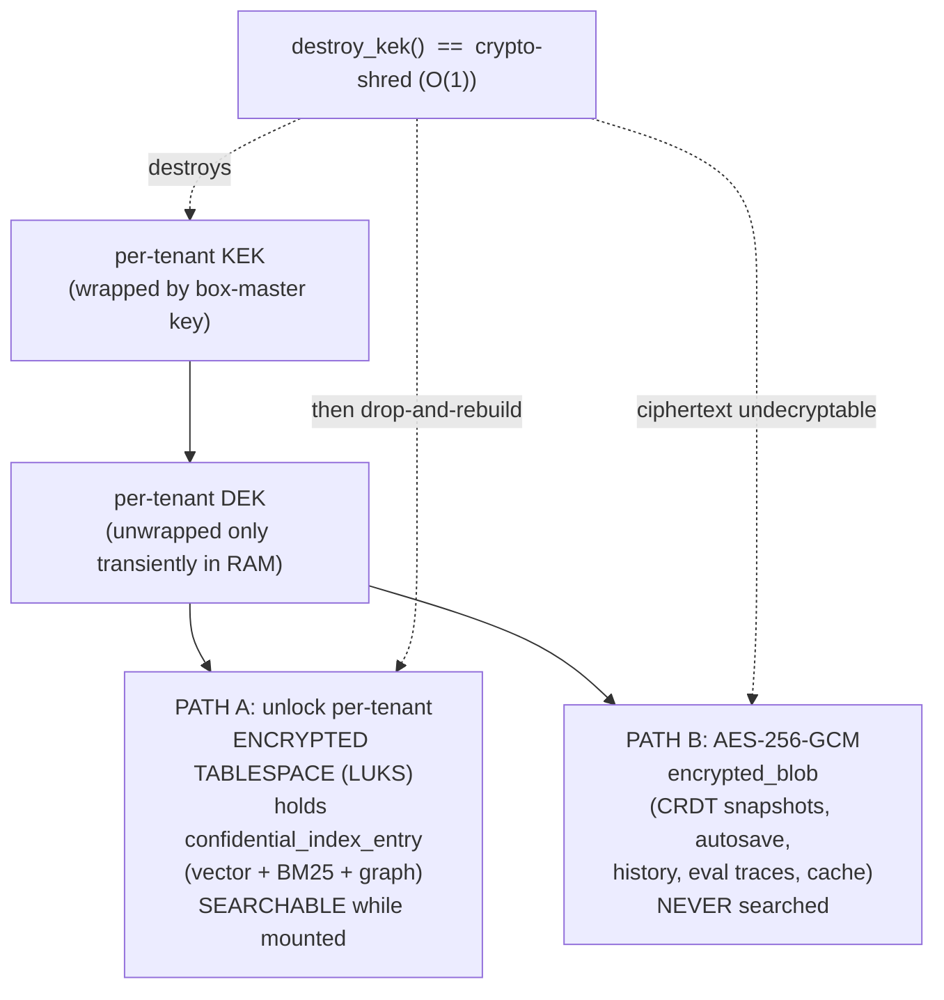

# 06 — Security Spine: Low-Level Design (the load-bearing moat)

> **What this document is.** The complete, build-ready design of the TigerExchange (single-Orin
> edition) **security kernel** — the one in-process Policy Enforcement Point (PEP) + data-access
> broker, the fixed fail-closed decision order, FORCE-RLS, the crypto-shred split, key custody,
> per-tenant confidential retrieval isolation, owner-authoritative durable revocation, the
> hash-chained audit spine, confidential KV isolation, and the full list of **HUMAN-AUTHORED**
> security CI gates with a canonical reason-code taxonomy. Everything in here is "the moat": if a
> control is built wrong, confidential proposal content leaks across research groups on one shared
> box, and the product's entire reason to exist evaporates.
>
> **Who reads this.** The builder — a local ~30B model. Every non-obvious decision is spelled out
> with its rejected alternative. Do not infer. Where this doc gives a SQL/Python/shell artifact, type
> it essentially verbatim.
>
> **Authority chain (read these first; they WIN over this doc on the things they own).**
> `_design-brief.json` (locked intent) → `CONVENTIONS-single-box.md` (names/paths/pins, "this file
> wins") → `05-kernel-contracts.md` (frozen kernel types + Protocol signatures) →
> `13-data-model-and-schemas.md` (the exact DDL for every table referenced here). **This document does
> not re-define kernel types or table DDL** — it references them by name and specifies the
> *behavior* that consumes them. Where this doc and `13` disagree on a physical schema detail, `13`
> wins; where this doc and a feature LLD disagree on a *security behavior*, **this doc wins** (the
> brief's `doc_set` makes `06` authoritative for security behavior).
>
> **Decisions expanded here:** **D3** (single PEP + broker chokepoint), **D4** (fixed fail-closed
> decision order; ABAC in-Python, ReBAC Postgres-CTE), **D5** (FORCE-RLS isolation + 4 bypass
> vectors), **D6** (classify-gates-index + per-tenant confidential surface), **D7** (crypto-shred
> split + fTPM/passphrase anchor), **D10** (confidential KV isolation without a second model copy).
> Decision IDs are **D1..D14 only** — there are no other labels.

---

## 0. Table of contents

1. [The security spine at a glance — the 13 controls](#1-the-security-spine-at-a-glance--the-13-controls)
2. [Control 1: the single PEP chokepoint + the data-access broker](#2-control-1-the-single-pep-chokepoint--the-data-access-broker)
3. [Control 2: the fixed fail-closed decision order (6 steps)](#3-control-2-the-fixed-fail-closed-decision-order-6-steps)
4. [Control 3 + 4: FORCE-RLS isolation + the 4 bypass-lint vectors](#4-control-3--4-force-rls-isolation--the-4-bypass-lint-vectors)
5. [In-Python ABAC (D4 step 3) — the lattice gate](#5-in-python-abac-d4-step-3--the-lattice-gate)
6. [Postgres-CTE ReBAC Check (D4 step 4) — and the federation caveat](#6-postgres-cte-rebac-check-d4-step-4--and-the-federation-caveat)
7. [Control 5 + 6 + 7: the crypto-shred SPLIT + why AES-on-vectors is impossible](#7-control-5--6--7-the-crypto-shred-split--why-aes-on-vectors-is-impossible)
8. [Control 8: LocalKms + the fTPM/passphrase box-master anchor (OP-TEE optional)](#8-control-8-localkms--the-ftpmpassphrase-box-master-anchor-op-tee-optional)
9. [Control 5 (cont.): per-tenant confidential retrieval surface isolation (D6)](#9-control-5-cont-per-tenant-confidential-retrieval-surface-isolation-d6)
10. [Control 9: confidential KV isolation — one shared generator, prefix-off, no second copy (D10)](#10-control-9-confidential-kv-isolation--one-shared-generator-prefix-off-no-second-copy-d10)
11. [Control 10: owner-authoritative durable revocation + crash recovery + revocation-by-reason](#11-control-10-owner-authoritative-durable-revocation--crash-recovery--revocation-by-reason)
12. [Control 11: per-stream hash-chained audit spine (separate from loop events)](#12-control-11-per-stream-hash-chained-audit-spine-separate-from-loop-events)
13. [Control 12: entitlement-at-PEP capability gating](#13-control-12-entitlement-at-pep-capability-gating)
14. [Control 13: the HUMAN-AUTHORED security-contract CI gates](#14-control-13-the-human-authored-security-contract-ci-gates)
15. [Canonical reason-code taxonomy](#15-canonical-reason-code-taxonomy)
16. [Federation honesty: what is a known rewrite vs a clean seam](#16-federation-honesty-what-is-a-known-rewrite-vs-a-clean-seam)
17. [Open security risks carried into the build](#17-open-security-risks-carried-into-the-build)

---

## 1. The security spine at a glance — the 13 controls

These are the brief's 13 `security_spine` controls. Every one is built first (the security kernel
precedes the data plane and the feature modules). The table maps each control to the decision that
drives it, the package that owns it (`CONVENTIONS-single-box.md` §3), and the section of this doc
that specifies it.

| # | Control | Decision | Owner package | Section |
|---|---------|----------|---------------|---------|
| 1 | Single Policy Enforcement Point chokepoint + broker | D3 | `tigerexchange_pep` | [§2](#2-control-1-the-single-pep-chokepoint--the-data-access-broker) |
| 2 | Fixed fail-closed decision order | D4 | `tigerexchange_pep` | [§3](#3-control-2-the-fixed-fail-closed-decision-order-6-steps) |
| 3 | Per-tenant Postgres isolation (FORCE-RLS) | D5 | `migrations/` + `tigerexchange_pep` | [§4](#4-control-3--4-force-rls-isolation--the-4-bypass-lint-vectors) |
| 4 | RLS-bypass lint (4 vectors) | D5 | `migrations/` + CI | [§4](#4-control-3--4-force-rls-isolation--the-4-bypass-lint-vectors) |
| 5 | Classify-gates-index hard edge + per-tenant confidential surface | D6 | `tigerexchange_ingestion` + `tigerexchange_pep` | [§9](#9-control-5-cont-per-tenant-confidential-retrieval-surface-isolation-d6) |
| 6 | Crypto-shred of SEARCHABLE derivatives (encrypted-tablespace DEK-destroy) | D7 | `tigerexchange_confidential_crypto` | [§7](#7-control-5--6--7-the-crypto-shred-split--why-aes-on-vectors-is-impossible) |
| 7 | AES-GCM ALE for NON-searchable blobs | D7 | `tigerexchange_confidential_crypto` | [§7](#7-control-5--6--7-the-crypto-shred-split--why-aes-on-vectors-is-impossible) |
| 8 | Box-master key custody (fTPM/passphrase; OP-TEE optional) | D7 | `tigerexchange_confidential_crypto` | [§8](#8-control-8-localkms--the-ftpmpassphrase-box-master-anchor-op-tee-optional) |
| 9 | Confidential = local-only inference + shared-generator KV isolation | D10 | `tigerexchange_ai` | [§10](#10-control-9-confidential-kv-isolation--one-shared-generator-prefix-off-no-second-copy-d10) |
| 10 | Owner-authoritative, fail-closed durable revocation + recovery | D4/D11 | `tigerexchange_pep` (+ `IGrantStore`) | [§11](#11-control-10-owner-authoritative-durable-revocation--crash-recovery--revocation-by-reason) |
| 11 | Tamper-evident hash-chained audit spine | audit | `tigerexchange_audit` | [§12](#12-control-11-per-stream-hash-chained-audit-spine-separate-from-loop-events) |
| 12 | Entitlement-at-PEP capability gating | D4 | `tigerexchange_pep` | [§13](#13-control-12-entitlement-at-pep-capability-gating) |
| 13 | Security-contract CI gates (HUMAN-authored) | — | `tests/security/` | [§14](#14-control-13-the-human-authored-security-contract-ci-gates) |

> **The one rule that ties them together.** Every retrieve / egress / derive / share / read / write
> goes through exactly **one** in-process function — `PolicyEnforcementPoint.authorize()` — which runs
> the **same six fixed steps in the same fixed order**, and **any** step that errors or abstains
> returns `DENY`. There is no second authorization path, no module that "knows better", no soft
> "maybe". This is what makes a 30B builder unable to accidentally open a hole: there is only one hole
> to keep closed, and it is closed by construction.

---

## 2. Control 1: the single PEP chokepoint + the data-access broker

### 2.1 What the PEP is, in one paragraph

The Policy Enforcement Point is an **in-process** object that implements the kernel
`IPolicyEnforcement` Protocol (`05-kernel-contracts.md` §10.2). It lives in `tigerexchange_pep`. It is
the *sole* gate every feature module passes through to touch data. Feature modules
(`tigerexchange_discovery`, `tigerexchange_lit_intelligence`, `tigerexchange_workspace`,
`tigerexchange_funding`) **never** open a database connection, **never** import the classifier engine,
**never** construct a `PublishableProjection`, and **never** import `tigerexchange_data_plane`. They
call the PEP/broker and receive **already-projected, already-tier-checked** objects. This is
decision **D3**.

We collapsed v2's *two* PEP loci (network read-PEP + node PEP) into **one** in-process PEP, because
there is exactly one box and one process group; a second PEP locus would be dead code that drifts out
of sync. The federation seam that a second PEP *would* attach to is the deferred `IExchangeFeed` /
`IRevocationAuthority` (designed, not built — D2; see [§16](#16-federation-honesty-what-is-a-known-rewrite-vs-a-clean-seam)).

**Chosen over the rejected alternatives:**

| Rejected | Why rejected |
|----------|--------------|
| Each module re-implements its own confidentiality checks | A 30B builder will get one wrong → a leak. New capabilities would each need their own correct enforcement. |
| Query-time post-filtering on a single shared index | Leaves confidential vectors/postings *physically present* in a cross-tenant index = a standing breach (D6). |
| Two PEP loci (v2 federated design) | One box, one process — a second locus is drift-prone dead code. |

### 2.2 What the BROKER is, and the EXACT scope of its credentials

The broker is the component inside `tigerexchange_pep` that actually holds raw-store credentials and
runs queries on behalf of an *already-authorized* request. The brief and `CONVENTIONS-single-box.md`
§13 #9 are emphatic about the **precise** scope of those credentials, because the old v2 plan
contained a load-bearing contradiction ("broker is the ONLY holder of all raw-store creds" =
god-object vs. "each module owns its data"). The single-box resolution (D3):

> **The broker holds raw-store credentials ONLY for:**
> 1. the **shared confidential-artifact / classification tables** (the cross-tenant control plane:
>    `tex.classification_result`, `tex.revocation_log`, `tex.audit_event`, `tex.relation_tuple`,
>    `tex.sharing_grant`, and the shared public index tables it must project into), **and**
> 2. **per-tenant confidential-index access** (the `tex.confidential_index_entry` surface, [§9](#9-control-5-cont-per-tenant-confidential-retrieval-surface-isolation-d6)).
>
> **The broker does NOT hold credentials for every feature module's own schema.** Module-private
> relational tables are reached through the module's own repository (which still connects only as the
> `tigerexchange_app` role under RLS — never the owner). The broker is the *confidentiality
> chokepoint*, not a universal data-access god-object.

**Why this precise scope (rationale).** Scoping the broker to the shared confidential/classification
tables + the per-tenant confidential surface gives us *one* place that gates everything that can
cross a tenant boundary or touch the highest tier — without re-centralizing every CRUD path into a
single coupled object that every change must touch. It resolves the v2 contradiction by saying
exactly which creds the broker holds and which it does not.

**Wording rule (enforced in review).** Never write "the broker holds all raw-store credentials". The
correct, repeated phrasing is the boxed text above. A doc that calls the broker the holder of *all*
raw-store creds is wrong (`CONVENTIONS-single-box.md` §13 #9).

### 2.3 The import-linter + AST enforcement of D3 (what makes "modules cannot bypass" true)

D3 is only real if it is mechanically enforced. Two CI checks do this (the contracts are stated in
`CONVENTIONS-single-box.md` §4; the concrete config lives here).

**(a) `import-linter` contract** — `tigerexchange/.importlinter`:

```ini
[importlinter]
root_packages =
    tigerexchange_contracts
    tigerexchange_pep
    tigerexchange_discovery
    tigerexchange_lit_intelligence
    tigerexchange_workspace
    tigerexchange_funding
    tigerexchange_ingestion
    tigerexchange_audit
    tigerexchange_ai
    tigerexchange_retrieval
    tigerexchange_data_plane
    tigerexchange_confidential_crypto
    tigerexchange_loop_engine

[importlinter:contract:kernel-no-feature-deps]
name = Kernel imports nothing feature-side
type = forbidden
source_modules = tigerexchange_contracts
forbidden_modules =
    tigerexchange_pep
    tigerexchange_discovery
    tigerexchange_lit_intelligence
    tigerexchange_workspace
    tigerexchange_funding
    tigerexchange_ingestion
    tigerexchange_audit
    tigerexchange_ai
    tigerexchange_retrieval
    tigerexchange_data_plane
    tigerexchange_confidential_crypto
    tigerexchange_loop_engine

[importlinter:contract:modules-never-import-raw-store]
name = Feature modules never import the raw store
type = forbidden
source_modules =
    tigerexchange_discovery
    tigerexchange_lit_intelligence
    tigerexchange_workspace
    tigerexchange_funding
forbidden_modules =
    tigerexchange_data_plane
    asyncpg
    sqlalchemy
    psycopg

[importlinter:contract:modules-isolated-from-each-other]
name = A feature module imports only the kernel + the PEP + itself
type = independence
modules =
    tigerexchange_discovery
    tigerexchange_lit_intelligence
    tigerexchange_workspace
    tigerexchange_funding
```

**(b) AST test** — `tests/security/test_module_ast_contracts.py` (HUMAN-authored; see [§14](#14-control-13-the-human-authored-security-contract-ci-gates)). It walks the source of every
`tigerexchange_<feature>` package and fails if it finds:

- an import of `PublishableProjection` (only the broker may construct it), or any call node that
  instantiates `PublishableProjection(...)`;
- an import of the classifier engine internals (`tigerexchange_ingestion.classifier.*` private
  symbols) — the classifier is reached only through the kernel `IClassifier` Protocol via the
  ingestion DAG / PEP;
- a direct `asyncpg.connect` / `create_engine` / raw-cursor construction.

```python
# tests/security/test_module_ast_contracts.py  (HUMAN-authored — illustrative shape)
import ast, pathlib, pytest

FEATURE_PKGS = ["tigerexchange_discovery", "tigerexchange_lit_intelligence",
                "tigerexchange_workspace", "tigerexchange_funding"]
FORBIDDEN_CALLS = {"PublishableProjection"}            # construction forbidden in modules
FORBIDDEN_IMPORTS = {"asyncpg", "sqlalchemy", "psycopg", "tigerexchange_data_plane"}

def _module_files(pkg: str) -> list[pathlib.Path]:
    ...

@pytest.mark.parametrize("pkg", FEATURE_PKGS)
def test_module_does_not_construct_projection_or_open_store(pkg):
    for path in _module_files(pkg):
        tree = ast.parse(path.read_text())
        for node in ast.walk(tree):
            if isinstance(node, ast.Call) and isinstance(node.func, ast.Name):
                assert node.func.id not in FORBIDDEN_CALLS, f"{path}: builds {node.func.id}"
            if isinstance(node, (ast.Import, ast.ImportFrom)):
                names = {a.name.split('.')[0] for a in (node.names or [])}
                if isinstance(node, ast.ImportFrom) and node.module:
                    names.add(node.module.split('.')[0])
                assert not (names & FORBIDDEN_IMPORTS), f"{path}: forbidden import {names & FORBIDDEN_IMPORTS}"
```

### 2.4 Where the PEP sits in a request (sequence)

```mermaid
sequenceDiagram
    participant FE as Next.js frontend
    participant API as FastAPI router (services/api)
    participant MOD as feature module (e.g. mod-lit-intelligence)
    participant PEP as PolicyEnforcementPoint (mod-pep)
    participant BR as broker (mod-pep)
    participant PG as Postgres 16 (RLS, SET LOCAL)
    participant AUD as IAuditSink (mod-audit)

    FE->>API: request (OIDC bearer token)
    API->>API: build frozen TenantContext from token
    API->>PG: SELECT set_config('app.tenant_id', $1, true)  // SET LOCAL, bound param
    API->>MOD: call module method(context, ...)
    MOD->>PEP: authorize(PepRequest{context, action, required_capability, resource_tier, ...})
    PEP->>PEP: step 1 entitlement -> step 2 capability -> step 3 ABAC tier
    PEP->>PG: step 4 ReBAC recursive-CTE Check()  (within tenant txn, RLS-scoped)
    PEP->>PG: step 5 durable tombstone read (revocation_log, AUTHORITATIVE deny)
    PEP->>PEP: step 6 narrow-only short-TTL lease (positive cache)
    PEP->>AUD: append AuditEvent(event_type="pep_decision", reason_code=...)
    PEP-->>MOD: PepResponse{effect=ALLOW|DENY, reason_code, resolved_tier}
    alt ALLOW
        MOD->>BR: broker.retrieve/derive(...)  // module never touches the store directly
        BR->>PG: query (RLS-scoped; confidential surface gated)
        BR-->>MOD: already-projected, already-tier-checked objects
    else DENY
        MOD-->>API: refusal (no data)  // fail-closed
    end
```

---

## 3. Control 2: the fixed fail-closed decision order (6 steps)

This is the heart of the spine. The convergence review's **#1 finding** was that three stores
(entitlement source, ABAC, ReBAC) gating one decision with *undefined composition* is a **fail-OPEN**
risk: a 30B builder asked to "combine" three results will, under ambiguity, pick the permissive
interpretation. We remove the ambiguity by pinning **one order**, **cheap-first**, **fail-closed**.

### 3.1 The order (verbatim — do not reorder, do not add a 7th step)

```
PolicyEnforcementPoint.authorize(request: PepRequest) -> PepResponse
  Run, in this exact order, cheap-first. ANY step that errors OR abstains returns DENY.

  1. ENTITLEMENT / EDITION gate
        Resolve the per-tenant Entitlement (IEntitlementEvaluator.resolve).
        If the edition does not include the request's required path -> DENY (entitlement_denied).

  2. CAPABILITY gate
        request.required_capability MUST be in entitlement.capabilities.
        Else -> DENY (capability_denied).

  3. ABAC TIER check  (in-Python lattice; §5)
        entitlement.permits_tier(request.resource_tier) MUST be True.
        For DERIVE, resource_tier is the MAX-rule join of input tiers (tier_join_all),
        computed by the caller and re-asserted here. ABAC may only NARROW, never widen.
        Else / missing attribute / unknown tier -> DENY (tier_denied | missing_abac_attr).

  4. ReBAC RELATION Check  (Postgres recursive CTE; §6)
        For object/relationship-scoped actions, IPolicyEnforcement.check(subject, relation,
        object, tenant_id) MUST return True. LOCAL-only resolution (D2 caveat).
        Else -> DENY (rebac_denied). If the CTE errors / times out -> DENY (pip_unavailable).

  5. OWNER-LOCAL DURABLE TOMBSTONE read  (AUTHORITATIVE deny; §11)
        Read tex.revocation_log for the object_ref. If a COMMITTED revocation exists whose
        revocation_epoch is current -> DENY (tombstoned). The durable log is AUTHORITATIVE:
        it overrides any positive lease. If the log is unavailable / recovery incomplete -> DENY
        (recovery_incomplete).

  6. SHORT-TTL LEASE  (narrow-only POSITIVE cache)
        Only after 1-5 all ALLOW may a narrow positive lease be minted/honored. A lease can ONLY
        say "yes for this exact (subject, action, object, tier) for <= N seconds". A lease can
        NEVER say "no" and can NEVER widen scope. The durable tombstone (step 5) is always
        re-checked; a lease cannot survive a revocation.

  Return PepResponse.allow(tier=resolved_tier) ONLY if all six pass; else PepResponse.deny(reason).
```

### 3.2 Why this exact order and these exact properties

| Property | Why (and rejected alternative) |
|----------|--------------------------------|
| **Cheap-first** | Entitlement/capability are in-memory frozen-object checks (`Entitlement.has`, `permits_tier`); ABAC is pure Python; only steps 4–5 touch Postgres. Putting the DB steps last avoids a DB round-trip on requests that fail the cheap gates. Rejected: DB-first (wastes a seek on every denied request — costly on the HDD-class box, D13). |
| **Fail-closed on error OR abstain** | The brief's #1 risk is a 30B builder writing a fail-OPEN composition. So: any exception, timeout, missing attribute, or "I don't know" → `DENY`. There is no path where an error yields ALLOW. Rejected: "log and continue" (an unavailable PIP would silently allow). |
| **Durable log AUTHORITATIVE for deny (step 5 over step 6)** | Caches can be stale; a revoked grant must stop serving *immediately*. The durable, fsync'd `revocation_log` is the source of truth for deny; the lease is only a *positive* accelerator that the tombstone always overrides. Rejected: cache-authoritative (a stale positive lease would keep serving a revoked confidential proposal — a breach). |
| **Caches narrow-only / positive-only** | A negative cache could mask a freshly-granted access (annoying but safe) or, worse, a poisoned negative entry could be turned into a positive by inversion. We forbid negative caching entirely and make positive leases narrow (one exact tuple) and short-TTL. Rejected: bidirectional cache. |
| **PEP returns ALLOW/DENY only — never QUARANTINE** | QUARANTINE is the *classifier's* verb (D6, content-into-index). The *PEP* answers a request: binary, fail-closed. Conflating them lets a builder treat "quarantine" as a soft authorization state. Rejected: a three-valued PEP. (Kernel `PepEffect` has exactly `ALLOW`/`DENY` — `05` §8.3.) |

### 3.3 Reference implementation skeleton (Python 3.11, against the frozen kernel)

This is the shape the builder implements in `tigerexchange_pep`. It uses the exact kernel types from
`05-kernel-contracts.md`. The HUMAN-authored gates in [§14](#14-control-13-the-human-authored-security-contract-ci-gates)
are what prove it correct — the builder writes this body to make those gates green.

```python
# packages/mod-pep/tigerexchange_pep/enforcement.py
from __future__ import annotations

from tigerexchange_contracts import (
    PepRequest, PepResponse, PepAction, Tier,
    IEntitlementEvaluator, IAuditSink, AuditEvent,
)


class PolicyEnforcementPoint:  # satisfies IPolicyEnforcement structurally
    def __init__(
        self,
        entitlements: IEntitlementEvaluator,
        rebac,                 # exposes async check(subject, relation, object, tenant_id) -> bool
        revocations,           # exposes async is_revoked(object_ref, tenant_id) -> bool (durable read)
        leases,                # narrow-only positive cache; get()/put(); NEVER negative
        audit: IAuditSink,
    ) -> None:
        self._ent = entitlements
        self._rebac = rebac
        self._revocations = revocations
        self._leases = leases
        self._audit = audit

    async def authorize(self, request: PepRequest) -> PepResponse:
        ctx = request.context
        try:
            # 1. entitlement / edition
            ent = await self._ent.resolve(tenant_id=ctx.tenant_id, subject_id=ctx.subject_id)
            if ent is None:
                return await self._deny(request, "entitlement_denied")

            # 2. capability
            if not ent.has(request.required_capability):
                return await self._deny(request, "capability_denied")

            # 3. ABAC tier (in-Python lattice; narrows only)
            if not ent.permits_tier(request.resource_tier):
                return await self._deny(request, "tier_denied")

            # 4. ReBAC relation Check (Postgres recursive CTE; local-only)
            if request.relation is not None and request.object_ref is not None:
                try:
                    ok = await self._rebac.check(
                        subject=f"user:{ctx.subject_id}",
                        relation=request.relation,
                        object=request.object_ref,
                        tenant_id=ctx.tenant_id,
                    )
                except Exception:
                    return await self._deny(request, "pip_unavailable")   # fail-closed
                if not ok:
                    return await self._deny(request, "rebac_denied")

            # 5. durable tombstone read (AUTHORITATIVE deny)
            if request.object_ref is not None:
                try:
                    revoked = await self._revocations.is_revoked(
                        object_ref=request.object_ref, tenant_id=ctx.tenant_id,
                    )
                except Exception:
                    return await self._deny(request, "recovery_incomplete")  # fail-closed
                if revoked:
                    return await self._deny(request, "tombstoned")

            # 6. narrow-only positive lease (mint AFTER 1-5 pass)
            ttl = self._lease_ttl_for(request)
            resp = PepResponse.allow(tier=request.resource_tier, reason_code="ok",
                                     lease_ttl_seconds=ttl)
            await self._audit_decision(request, resp)
            return resp

        except Exception:
            # ANY uncaught error anywhere in the order -> DENY (fail-closed)
            return await self._deny(request, "internal_error")

    async def _deny(self, request: PepRequest, reason: str) -> PepResponse:
        resp = PepResponse.deny(reason)
        await self._audit_decision(request, resp)
        return resp

    async def _audit_decision(self, request: PepRequest, resp: PepResponse) -> None:
        await self._audit.append(event=AuditEvent(
            stream_id=f"tenant:{request.context.tenant_id}:pep",
            seq=0,  # the sink assigns the real seq + computes the hash chain (§12)
            event_type="pep_decision",
            payload={
                "action": request.action.value,
                "object_ref": request.object_ref,
                "resource_tier": request.resource_tier.to_label(),
                "effect": resp.effect.value,
                "reason_code": resp.reason_code,
                "subject_id": request.context.subject_id,
            },
        ))
```

> **Note on the lease (step 6).** The lease store is a process-local, narrow, positive cache keyed by
> the exact `(tenant_id, subject_id, action, object_ref, resource_tier)` tuple, with a short TTL
> (e.g. 5–30 s). On a cache hit the PEP **still** performs step 5 (the durable tombstone read) — the
> lease only lets it skip the cheaper steps 1–4, never the authoritative deny. This is why a revoked
> grant stops serving immediately even within a live lease window.

---

## 4. Control 3 + 4: FORCE-RLS isolation + the 4 bypass-lint vectors

Row-Level Security is the **belt** behind the PEP **suspenders**. Even if a bug let a query reach
Postgres without going through the broker, RLS makes another tenant's rows invisible. This is
decision **D5**. The exact DDL template, roles, and per-table policies live in
`13-data-model-and-schemas.md` §0.2–§0.5 — **do not redefine them here**; this section specifies the
*footgun checklist* and the *4 bypass-lint vectors* that keep RLS actually load-bearing.

### 4.1 The FORCE-RLS footgun checklist (every item is a real way to silently disable the boundary)

Apply this checklist to **every tenant-scoped table**. The exact policy block is the verbatim
template in `13` §0.3.

- [ ] **`ENABLE ROW LEVEL SECURITY`** is set. (Without it, no policy applies.)
- [ ] **`FORCE ROW LEVEL SECURITY`** is set. *Footgun:* RLS does **not** apply to the table owner by
      default; `FORCE` makes it apply even to the owner. Combined with the app never being the owner,
      this is belt-and-suspenders.
- [ ] The policy is **`AS RESTRICTIVE`**, not the default `PERMISSIVE`. *Footgun:* `PERMISSIVE`
      policies are **OR-combined** — a later migration that adds a second permissive policy *widens*
      access. `RESTRICTIVE` policies are **AND-combined** — all must pass. (Lint vector 4.)
- [ ] The policy is **`FOR ALL`** and has **BOTH** `USING (...)` **and** `WITH CHECK (...)`.
      *Footgun:* omitting `WITH CHECK` leaves the **write side** open — a caller could `INSERT`/`UPDATE`
      a row stamped with *another* tenant's `tenant_id` (cross-tenant write / poisoning). `USING`
      filters reads; `WITH CHECK` filters writes; you need both.
- [ ] The predicate uses **`current_setting('app.tenant_id', true)::uuid`** with the **second arg
      `true`**. *Footgun:* without `true`, an unset GUC raises; with `true` it returns `NULL`, and
      `tenant_id = NULL` is `NULL` (not true) → **zero rows**. This is the fail-closed property: a
      transaction that forgot `SET LOCAL` sees nothing. (Lint vector / regression test below.)
- [ ] Cast the **GUC** to `::uuid`, never the column. *Footgun:* casting the column kills the index
      seek on `tenant_id`; casting the GUC keeps the leading-column index usable (vital on the HDD
      box, D13).
- [ ] **`tenant_id` is the LEADING column** of every index the RLS predicate or a tenant-scoped query
      touches (`(tenant_id, ...)`). Turns `tenant_id = $1` into an index seek, not a heap scan.
- [ ] The app connects as **`tigerexchange_app`** with **`NOSUPERUSER NOBYPASSRLS NOINHERIT`** and is
      **not** the table owner. *Footgun:* a superuser or `BYPASSRLS` role silently ignores every
      policy. (Lint probe below.)
- [ ] Tenant context is pinned with **`SET LOCAL`** via `set_config('app.tenant_id', $1, true)` with a
      **bound parameter**. *Footgun:* `SET SESSION` leaks the previous tenant's context onto a reused
      PgBouncer connection (transaction mode); string-interpolating the id is a tenant-id SQL
      injection. (Lint vector / regression test below.)
- [ ] The **shared public tables** (`tex.work`, `tex.work_chunk`, `tex.opportunity`, `tex.award`,
      `tex.expertise_fingerprint`, `tex.collaboration_edge`) deliberately carry **NO** `tenant_id` RLS
      policy — they are cross-tenant by design; their gate is **classification + the broker** (D6),
      not RLS. *Footgun:* adding RLS to them would break the discovery product; *forgetting* the
      classification gate would leak confidential content into them. (See [§9](#9-control-5-cont-per-tenant-confidential-retrieval-surface-isolation-d6).)

### 4.2 The 4 bypass-lint vectors (`check_rls_bypass.py`, P0.1)

The CI lint forbids, in **any** migration SQL, the following four ways to defeat RLS. The fourth
(VIEW) is the vector **v2's lint missed** — D5 explicitly adds it.

| # | Forbidden construct | Why it bypasses RLS |
|---|---------------------|---------------------|
| 1 | `SECURITY DEFINER` function over a tenant table | Runs with the *definer's* privileges, not the caller's — can read/write across tenants regardless of `app.tenant_id`. |
| 2 | `MATERIALIZED VIEW` over a tenant table | Materialized views are **not** RLS-filtered; the snapshot contains every tenant's rows. |
| 3 | A plain `VIEW` over a tenant table **without** `WITH (security_invoker = true)` | A non-invoker view runs with the **view owner's** privileges = bypass. (The vector v2 missed.) |
| 4 | A `PERMISSIVE` policy (the default) on a tenant table | Permissive policies **OR-combine**; a later one can silently widen access. Must be `AS RESTRICTIVE`. |

If a view over a tenant table is genuinely needed, it **must** be:

```sql
CREATE VIEW tex.<v> WITH (security_invoker = true) AS SELECT ...;
```

**The lint itself** (`tigerexchange/migrations/check_rls_bypass.py`, run in CI):

```python
# migrations/check_rls_bypass.py  (P0.1)  -- scans every *.sql migration; nonzero exit on a hit.
import re, sys, pathlib

SQL_DIR = pathlib.Path(__file__).parent / "sql"
TENANT_HINT = re.compile(r"\btex\.\w+", re.I)  # tighten to the known tenant-scoped table list in CI

PATTERNS = {
    "SECURITY DEFINER":       re.compile(r"\bSECURITY\s+DEFINER\b", re.I),
    "MATERIALIZED VIEW":      re.compile(r"\bCREATE\s+MATERIALIZED\s+VIEW\b", re.I),
    "non-invoker VIEW":       re.compile(r"\bCREATE\s+VIEW\b(?!.*security_invoker\s*=\s*true)", re.I | re.S),
    "PERMISSIVE policy":      re.compile(r"\bCREATE\s+POLICY\b(?!.*\bAS\s+RESTRICTIVE\b)", re.I | re.S),
}

def main() -> int:
    failures = []
    for path in SQL_DIR.glob("*.sql"):
        text = path.read_text()
        for label, pat in PATTERNS.items():
            for m in pat.finditer(text):
                failures.append(f"{path.name}: RLS-bypass vector '{label}' near offset {m.start()}")
    for f in failures:
        print("RLS-BYPASS LINT FAILURE:", f, file=sys.stderr)
    return 1 if failures else 0

if __name__ == "__main__":
    raise SystemExit(main())
```

> The regex form is intentionally conservative; in CI it is restricted to the **known list of
> tenant-scoped tables** (every table in `13` that carries the RLS policy block) so it does not
> false-positive on the deliberately-RLS-free shared public tables. The *authoritative* gates are the
> HUMAN-authored runtime tests in [§14](#14-control-13-the-human-authored-security-contract-ci-gates),
> not this static lint — the lint is a fast tripwire, the tests are the proof.

### 4.3 The two runtime probes that prove RLS is on (P0.1)

These are HUMAN-authored (a 30B builder must not write its own safety net). The DDL behind them is in
`13` §0.2.

```python
# tests/security/test_rls_force_closed.py   [HUMAN-authored, P0.1]
import pytest

@pytest.mark.asyncio
async def test_no_set_local_returns_zero_rows(app_conn):
    # A transaction that NEVER calls set_config('app.tenant_id', ...) must see NOTHING.
    async with app_conn.transaction():
        rows = await app_conn.fetch("SELECT * FROM tex.proposal")  # any tenant-scoped table
        assert rows == []          # current_setting(..., true) -> NULL -> tenant_id = NULL -> 0 rows

@pytest.mark.asyncio
async def test_app_role_cannot_bypass_rls(app_conn):
    # The app role must be NOSUPERUSER + NOBYPASSRLS, else RLS is silently disabled.
    row = await app_conn.fetchrow(
        "SELECT rolsuper, rolbypassrls FROM pg_roles WHERE rolname = current_user")
    assert row["rolsuper"] is False
    assert row["rolbypassrls"] is False

@pytest.mark.asyncio
async def test_with_check_blocks_cross_tenant_insert(app_conn, tenant_a, tenant_b):
    # Pin tenant A, then try to INSERT a row stamped tenant B -> must fail the WITH CHECK.
    async with app_conn.transaction():
        await app_conn.execute("SELECT set_config('app.tenant_id', $1, true)", str(tenant_a))
        with pytest.raises(Exception):  # RLS WITH CHECK rejects the foreign tenant_id
            await app_conn.execute(
                "INSERT INTO tex.pursuit (tenant_id, lifecycle_state) VALUES ($1, 'draft')",
                str(tenant_b))
```

---

## 5. In-Python ABAC (D4 step 3) — the lattice gate

ABAC (Attribute-Based Access Control) here is the **confidentiality-tier gate**, run **in-process in
Python** inside the PEP using the kernel lattice. This **REVISES** v2/CONVENTIONS "ABAC = OPA" and the
old plan body's "Cedar" — the single-box answer is **neither OPA nor Cedar** (D4;
`CONVENTIONS-single-box.md` §6, §13 #4). There is no Go daemon, no Rego, no policy bundle to sync.

### 5.1 What ABAC evaluates

It is a few lines of fail-closed Python over a **fixed 3-tier lattice** (`Tier.PUBLIC < PRIVATE <
CONFIDENTIAL`, `05` §3) plus the entitlement capability gate. Two rules:

1. **MAX-rule on derivation.** A derived artifact's tier is the **maximum (most restrictive)** of all
   input tiers: `tier_join_all([...])`. The empty join is `CONFIDENTIAL` (unknown provenance → most
   restrictive — the fail-closed default, `05` §3.1). The caller computes the join via
   `tier_join_all` and passes the result as `PepRequest.resource_tier`; the PEP re-asserts it.
2. **Entitlement → tier gate.** `entitlement.permits_tier(resource_tier)` must be `True`
   (`05` §4.2): `public` needs `PUBLIC_RETRIEVAL` or `OWN_MATERIALS`; `private` needs `OWN_MATERIALS`;
   `confidential` needs `CONFIDENTIAL_RETRIEVAL` **or** `CONFIDENTIAL_DRAFTING`.

**ABAC may only NARROW, never widen.** It can turn a would-be ALLOW into a DENY (too-low entitlement
for the tier) but it can never turn a DENY from an earlier step into an ALLOW. A missing attribute or
an unknown tier → DENY (`missing_abac_attr` / `tier_denied`). The "ABAC-narrows-only" property is a
HUMAN-authored property test ([§14](#14-control-13-the-human-authored-security-contract-ci-gates)).

### 5.2 Why in-Python (rationale + rejected)

| Rejected | Why rejected |
|----------|--------------|
| **OPA Go daemon (Rego)** | Standing up a policy engine for a *fixed 3-tier lattice + capability gate* is overkill; it adds a process to operate and sync, and — critically — a module could still call the store *around* it. In-Python ABAC lives **inside** the PEP, so it is impossible to bypass. |
| **Cedar** | The old plan body listed Cedar as primary, contradicting "ABAC = OPA". The single-box edition outlaws both (`CONVENTIONS` §6). |
| **A DB table of tier rules** | The rule set is tiny and fixed; a table invites drift and a sync bug a 30B builder would get wrong. The edition→capability map is a Python constant in `mod-pep` (`13` §4). |

The lattice math (`tier_join`, `tier_join_all`, `permits_tier`) is **already defined verbatim in the
kernel** (`05-kernel-contracts.md` §3.2, §4.3). The PEP imports and calls it; it does not re-implement
it. The empty-join-is-confidential rule and the MAX-rule are kernel acceptance tests (P0.0).

---

## 6. Postgres-CTE ReBAC Check (D4 step 4) — and the federation caveat

ReBAC (Relationship-Based Access Control) answers "does *subject* have *relation* on *object*?" for
team membership and cross-group sharing grants. It is implemented as a **Zanzibar-style relation-tuple
table** `tex.relation_tuple` evaluated by a **recursive-CTE `Check()`** in the **same** Postgres,
behind the kernel `IPolicyEnforcement.check(...)` Protocol. This **REVISES** v2/CONVENTIONS
"ReBAC = SpiceDB" (D4; `CONVENTIONS` §6). No SpiceDB cluster, no OpenFGA service, no separate
datastore, no Go.

### 6.1 What it is (the DDL + the Check are owned by `13`)

The `tex.relation_tuple` DDL, its indexes, its RLS policy, and the **verbatim recursive-CTE `Check()`
SQL** are in `13-data-model-and-schemas.md` §13 (lines defining `WITH RECURSIVE reachable(...)`,
userset expansion `group:G#member`, the `parent` cascade, and the **depth-16 bound**). **Do not
redefine them here.** The security-relevant behavior:

- The `Check()` runs **inside the tenant transaction**, so RLS has *already* scoped
  `tex.relation_tuple` to the one tenant whose `app.tenant_id` is set — a tenant cannot resolve
  another tenant's tuples.
- Usersets (`group:G#member`) and a `parent` relation (team → proposal cascade) are followed. At P0
  the parent rewrite is kept **explicit** (the grant path writes the implied tuples denormalized),
  which is simpler for the builder and keeps a single writer (`13` §13 note).
- The recursion is **bounded at depth 16** — a hard cycle/blowup guard. If the CTE errors or times
  out, the PEP treats it as `pip_unavailable` → **DENY** (step 4 fail-closed).

### 6.2 The federation caveat (be honest — this is a known rewrite, not a transport swap)

> **HONEST CAVEAT (D2, D4; `CONVENTIONS` §12).** The recursive-CTE `Check()` resolves **LOCAL tables
> only**. Cross-box federation needs *distributed tuple resolution* (a tuple on box A referencing a
> group on box B) that a single-Postgres recursive CTE cannot do. So this is a **KNOWN
> FEDERATION-BOUNDARY REWRITE**, not a clean transport swap. The `IPolicyEnforcement` Protocol seam is
> stable, but the *resolver behind it* is node-local and must be re-architected for multi-node. Do not
> claim "federation is just plumbing" for ReBAC. (The full treatment is in
> `15-future-federation-interfaces.md`.)

---

## 7. Control 5 + 6 + 7: the crypto-shred SPLIT + why AES-on-vectors is impossible

This is the single most error-prone area for a 30B builder, and the brief flags it as a corrected
critical (`CONVENTIONS` §13 #10(b); open_risk "Crypto-shred mis-built"). Read this section twice.

### 7.1 The mathematical fact: you cannot AES-GCM a searchable index

> **Application-layer AES-256-GCM applied to vectors / BM25 postings / graph edges is mathematically
> incompatible with searching them.** Two independent reasons:
>
> 1. **Vectors:** ANN search (pgvector HNSW) finds nearest neighbors by a **distance metric** (cosine
>    / L2) over the float components. AES-GCM ciphertext is, by design, indistinguishable from random
>    — it **destroys** the distance metric. Two semantically-near vectors have ciphertexts at random
>    distance. The HNSW graph built over ciphertext returns garbage.
> 2. **BM25 postings:** lexical scoring **tokenizes** the text and scores term frequencies. Encrypted
>    text cannot be tokenized or scored; the inverted index over ciphertext is meaningless.
>
> Therefore application-layer encryption **cannot** be the crypto-shred mechanism for searchable
> confidential derivatives. The old (inverted) v2 instruction "ALE on vectors/BM25 before insert"
> would produce a **broken or insecure** system. It is **FORBIDDEN** (`CONVENTIONS` §6).

We rejected the research-grade alternatives explicitly: **homomorphic encryption**,
**searchable/distance-preserving encryption** — all x86-tuned, research-grade, and far beyond a Python
30B builder on an aarch64 Orin.

### 7.2 The SPLIT (the only correct design)

Crypto-shred is **split by searchability**:

| Path | Data | Mechanism | Decision |
|------|------|-----------|----------|
| **A — SEARCHABLE** | per-tenant **vector / BM25 / graph** confidential indexes (`tex.confidential_index_entry`) | The data lives on a **per-tenant ENCRYPTED TABLESPACE / LUKS-dm-crypt volume**. It is **plaintext-at-rest INSIDE the encrypted block device** — searchable while the device is mounted (HNSW gets real distances). **Crypto-shred = destroy the per-tenant DEK** that unlocks the volume, then drop-and-rebuild. **PRIMARY**, not a fallback. | D7 |
| **B — NON-searchable** | CRDT draft snapshots, autosave, version history, eval traces, cache **values** (`tex.encrypted_blob`) | **Application-layer AES-256-GCM** via the `cryptography` library, per-tenant DEK, applied **before insert**. Crypto-shred = `destroy_kek()` makes the ciphertext permanently undecryptable, O(1). | D7 |

Both paths are shredded by the **same** `destroy_kek()` call on the tenant's KEK ([§8](#8-control-8-localkms--the-ftpmpassphrase-box-master-anchor-op-tee-optional)): the DEK that path A uses to unlock the tablespace and that path B
uses for AES-GCM is wrapped by that one KEK.



### 7.3 Path A: the encrypted-tablespace mechanism (P0.4b — built AFTER the data plane P0.5)

The `tex.confidential_index_entry` table and its placement (`PARTITION BY LIST (tenant_id)`, one
partition per tenant on a per-tenant tablespace) are defined in `13` §10. The crypto-shred-relevant
operator steps:

1. **Provision** (at tenant creation, by the operator/migration path, run as owner): create a
   LUKS-mounted directory keyed by the per-tenant DEK, then a Postgres tablespace pointing at it:
   ```sql
   -- per-tenant, run once at provisioning (operator/owner path, outside app RLS):
   CREATE TABLESPACE ts_conf_<tenant> LOCATION '/mnt/nvme/enc/<tenant>';  -- on the LUKS-mounted dir
   CREATE TABLE tex.cie_<tenant> PARTITION OF tex.confidential_index_entry
       FOR VALUES IN ('<tenant_uuid>') TABLESPACE ts_conf_<tenant>;
   ```
   The LUKS device is unlocked at boot/mount with the per-tenant DEK (which LocalKms unwraps from the
   KEK). The tablespace lives on **NVMe** (D13 — HNSW must never serve off the HDD).
2. **Serve:** while the device is mounted, the partition is a normal Postgres table — RLS-isolated
   ([§9](#9-control-5-cont-per-tenant-confidential-retrieval-surface-isolation-d6)) **and**
   physically encrypted at rest. Search works because the data is plaintext *inside* the unlocked
   device.
3. **Crypto-shred** (on `security`/`consent` revocation of the tenant's confidential corpus, or tenant
   deletion):
   ```text
   destroy_kek(tenant)            # O(1): the DEK can never be reconstructed
   -> unmount + LUKS-erase the tenant's encrypted volume (key-slot wipe)
   -> DROP the per-tenant partition + tablespace
   -> (re-provision an empty volume only if the tenant is re-activated)
   ```
   This is the **only sanctioned `DROP`** in the whole system (`CONVENTIONS` §9; `13` §27) — it is a
   deliberate, audited erasure, not a startup convenience. After this, every searchable confidential
   derivative for that tenant is permanently unreadable.

> **Why per-tenant tablespace and not one shared encrypted tablespace?** Crypto-shred must destroy
> **one** tenant's searchable derivatives without touching others. A single shared encrypted
> tablespace cannot be selectively shredded per tenant — destroying its DEK would shred everyone. One
> encrypted tablespace (and DEK) per tenant makes per-tenant shred physically scoped (`13` §10 note).

### 7.4 Path B: AES-GCM for non-searchable blobs (P0.4a — built BEFORE the data plane)

The `tex.encrypted_blob` table (`13` §18) stores `nonce` (96-bit), `ciphertext` (AES-256-GCM),
`auth_tag`, and `dek_id`. The plaintext is encrypted **before** insert via `IKms.encrypt_blob`
(`05` §10.2 / [§8](#8-control-8-localkms--the-ftpmpassphrase-box-master-anchor-op-tee-optional)). This
path covers exactly the data that is **never searched**: CRDT draft snapshots (snapshotted on autosave
intervals, **not** per keystroke — open_risk mitigation), autosave, version history, RAGAS eval
traces, and cache values. Crypto-shred for these = `destroy_kek()` → ciphertext permanently
undecryptable, O(1).

### 7.5 Why split-by-searchability beats the alternatives

| Rejected | Why rejected |
|----------|--------------|
| ALE on searchable derivatives (the inverted v2 design) | Unsearchable or insecure — see §7.1. **FORBIDDEN.** |
| Per-record physical deletion across engines | Unprovable (no proof the bytes are gone), races with replicas/WAL, O(records × engines) cost. Envelope crypto-shred is O(1) and provable. |
| CloudHSM / cloud-KMS | Contradicts the no-cloud single box. **FORBIDDEN.** |
| Raw key file on disk | Master key plaintext on the slow HDD — unacceptable. |

The **post-crypto-shred zero-decryptable-hits** CI gate proves erasure across **BOTH** paths (P0.4a
for blobs, P0.4b for the searchable surface) — HUMAN-authored ([§14](#14-control-13-the-human-authored-security-contract-ci-gates)). A companion HUMAN-authored gate
proves the confidential surface remains **SEARCHABLE while mounted** (i.e. we did *not* AES-GCM the
vectors).

---

## 8. Control 8: LocalKms + the fTPM/passphrase box-master anchor (OP-TEE optional)

Key custody is a **dependency-free, in-process `LocalKms`** implementing the kernel `IKms` Protocol
(`05` §10.2, methods `create_kek`, `get_dek`, `encrypt_blob`, `decrypt_blob`, `destroy_kek`). It lives
in `tigerexchange_confidential_crypto`. This **REVISES** v2's CloudHSM/cloud-KMS seam (wrong for a
no-cloud box) (D7; `CONVENTIONS` §6).

### 8.1 The envelope (what is stored, what is never stored)

Per-tenant **KEK** (Key-Encryption-Key) wraps a per-tenant **DEK** (Data-Encryption-Key). The DEK does
double duty (§7.2): AES-GCM on blobs (path B) **and** unlocks the per-tenant encrypted tablespace
(path A). The `tex.kek` DDL (`13` §19) stores **only**:

- `wrapped_dek` — the DEK encrypted under the KEK (**never** plaintext);
- `box_master_anchor_ref` — an fTPM PCR handle **or** a passphrase-KDF salt (**not** the key);
- `tablespace_unlock_ref` — a handle to unlock the per-tenant encrypted tablespace.

**Never stored anywhere:** the box-master key, the unwrapped DEK, or a plaintext KEK. The unwrapped
DEK exists only **transiently in process RAM** after LocalKms unwraps it for a request, and is zeroed
after use. `destroy_kek()` deletes the wrapped DEK and stamps `destroyed_at`, after which the DEK can
never be reconstructed → crypto-shred (`13` §19).

### 8.2 The box-master anchor (P0 DEFAULT = fTPM via tpm2-tools OR passphrase-KDF)

The **one box-master key** wraps all per-tenant KEKs. It is anchored by one of two **P0-default**
mechanisms — **never** stored in plaintext on the HDD:

1. **fTPM, userspace** — seal the box-master key to a TPM **PCR** via the userspace
   `tpm2-tools` / `tpm2-pytss` stack. **No custom Trusted Application, no secure-world C.** Example
   primitives (verify exact CLI/API against the installed `tpm2-tools` version on the box):
   ```bash
   # seal (provisioning): seal a generated master key to PCR state, persist the sealed blob (not the key)
   tpm2_createprimary -C o -g sha256 -G ecc -c primary.ctx
   tpm2_create -C primary.ctx -i master.key -u sealed.pub -r sealed.priv -L pcr.policy
   # unseal (boot): release the key only if PCR state matches; key never written to disk
   tpm2_load -C primary.ctx -u sealed.pub -r sealed.priv -c sealed.ctx
   tpm2_unseal -c sealed.ctx -p "pcr:sha256:7"
   ```
2. **Passphrase-derived** — derive the box-master key from a **boot-time passphrase** via a NIST
   SP 800-108 KDF (counter-mode HMAC). The passphrase is entered at boot; the **key is never on
   disk**, only the KDF salt (`box_master_anchor_ref`).

### 8.3 Why fTPM/passphrase and NOT OP-TEE/EKB as a build deliverable

> **OP-TEE / EKB is FORBIDDEN as a Phase-0 BUILD deliverable** (`CONVENTIONS` §6; D7). It requires
> **irreversible OEM fuse-burning** + Secure Boot provisioning + a **custom OP-TEE Trusted Application
> in C** in the secure world, and NVIDIA's own forums document **unresolved EKB/SSK derivation
> failures**. That is firmware / secure-world C engineering far beyond a Python-writing 30B builder,
> and a likely hard build wall. OP-TEE/EKB is documented as **OPTIONAL human-operator hardening**,
> behind the **same** `IKms` Protocol — a human may add it later; the automated build does not.
> **OpenBao Transit** is an optional stronger backend, also behind the same `IKms`.

Rejected: a raw key file (master key plaintext on the slow HDD — unacceptable).

### 8.4 `destroy_kek()` is the one crypto-shred primitive

`IKms.destroy_kek(key_ref)` is O(1) and, per its kernel docstring (`05` §10.2), makes **BOTH** the
AES-GCM blobs **AND** the encrypted-tablespace searchable indexes for that tenant permanently
undecryptable. The wiring: revocation-by-reason (§11) calls `destroy_kek()` for `security`/`consent`
on a confidential object, which triggers the path-A drop-and-rebuild (§7.3) and makes the path-B
blobs unrecoverable (§7.4).

---

## 9. Control 5 (cont.): per-tenant confidential retrieval surface isolation (D6)

This control resolves the STAGE-3 contradiction that nearly killed the moat. Spell it out precisely.

### 9.1 The two meanings of "confidential content never enters a shared index"

> "Confidential content never enters any **SHARED** index" means the **cross-tenant PUBLIC** index. It
> does **NOT** mean confidential content is unindexable for its **OWNING** tenant. If it did, the
> centerpiece moat — grounding a tenant's draft in *that tenant's own prior winning proposals* — would
> be non-functional (D6 rationale).

So there are **two retrieval surfaces** sharing the same two-stage pipeline (D6, D8; `13` §0.6):

| Surface | Table | Tier | Who can query | Crypto-shred |
|---------|-------|------|---------------|--------------|
| **SHARED PUBLIC** (cross-tenant) | `tex.work_chunk` (+ `tex.expertise_fingerprint`, `tex.collaboration_edge`) | public only, classify-gated | anyone with `PUBLIC_RETRIEVAL` | n/a (public CC0) |
| **PER-TENANT CONFIDENTIAL** (own-tenant only) | `tex.confidential_index_entry` | confidential | **only** that tenant's drafting path (`CONFIDENTIAL_RETRIEVAL` capability) | encrypted-tablespace DEK-destroy (§7.3) |

### 9.2 The three layers of isolation on the confidential surface

`tex.confidential_index_entry` is the **one** table that is isolated by **all three** mechanisms at
once (`13` §10):

1. **RLS** — FORCE-RLS + RESTRICTIVE + WITH CHECK on `tenant_id` (the full D5 template). Tenant B's
   transaction cannot see tenant A's rows.
2. **Encrypted tablespace** — each tenant's partition lives on its own LUKS-encrypted tablespace
   keyed by the per-tenant DEK (§7.3). Even outside Postgres, tenant A's bytes are ciphertext.
3. **PEP capability gate** — the only `PepAction` that reaches it is `RETRIEVE_CONFIDENTIAL`, which
   requires the `CONFIDENTIAL_RETRIEVAL` capability and `entitlement.permits_tier(CONFIDENTIAL)`
   (steps 2–3). A discovery-only tenant physically cannot construct a query against it.

### 9.3 The classify-gates-index hard edge for the SHARED surface

For the **shared** surface, the structural fail-closed edge (D6) is: **a record is classified BEFORE
it can be embedded / indexed / graphed.** Only `ClassificationResult.is_retrievable == True`
(`Decision.ALLOW` **and** `Tier.PUBLIC`, `05` §6) reaches the shared sink. Abstention / ambiguity /
low confidence → **QUARANTINE** (treated confidential, sent to the human adjudication queue, **never**
indexed to a shared sink). The `tex.classification_result` row even carries a DB-level
`CHECK (is_retrievable = (decision = 'ALLOW' AND tier = 'public'))` so a builder cannot mark a
quarantined record retrievable by mistake (`13` §14). And `PublishableProjection` — the only shape
that crosses into the shared index — has a validator that **rejects confidential tier** (`05` §7;
`13` §15), so confidential content can never even be *constructed* for the shared index.

### 9.4 The acceptance test that proves it (P0.9, HUMAN-authored)

```python
# tests/security/test_confidential_surface_isolation.py   [HUMAN-authored, P0.9]
import pytest

@pytest.mark.asyncio
async def test_tenant_b_cannot_retrieve_tenant_a_confidential(pep, broker, tenant_a, tenant_b, ctx_b):
    # Tenant A has a prior winning proposal indexed into A's confidential surface.
    # Tenant B's confidential drafting path must retrieve ZERO of A's entries.
    results = await broker.retrieve_confidential(context=ctx_b, query="A's secret method")
    assert all(r.tenant_id == tenant_b for r in results)   # never tenant_a's
    assert not any("A's secret method" in r.text for r in results)

@pytest.mark.asyncio
async def test_tenant_a_grounds_on_own_prior_proposal(pep, broker, tenant_a, ctx_a):
    results = await broker.retrieve_confidential(context=ctx_a, query="our prior aims")
    assert any(r.source_ref.startswith("proposal:") for r in results)  # A grounds on A's own
```

> `mod-discovery` and the expertise graph remain **PUBLIC-tier-only by construction** (P0.8
> acceptance: "mod-discovery touches no confidential data"). `mod-lit-intelligence` grounds on **both**
> surfaces *for the owning tenant only* (P0.8: "lit-intelligence grounds on BOTH surfaces for the
> owning tenant"). The confidential path is **whole-query-fail-closed** (no partial results), while
> the public path returns partial-results-with-honest-completeness (retrieval_design; `13` §25).

---

## 10. Control 9: confidential KV isolation — one shared generator, prefix-off, no second copy (D10)

Confidential drafting runs generation on the **SAME single shared Qwen3-30B-A3B vLLM process** as
everything else. This is decision **D10**, and the arithmetic is the whole point.

### 10.1 The fatal arithmetic that rules out a second copy

> A dedicated vLLM **process** per confidential tenant would require a **SECOND FULL resident copy** of
> the 30B (~17GB weights + ~4–8GB context), pushing steady-state total from ~49GB to **~70GB > 64GB**.
> The centerpiece path could not run. A **second resident 30B copy is FORBIDDEN** (`CONVENTIONS` §6).

### 10.2 The real leak vector, and how we close it

vLLM does **not** leak KV-cache across *separate requests* by default. The real cross-request leak
vector is **shared-prefix caching** (a confidential request reusing a KV prefix computed for another
request). So confidential isolation = two mechanisms on the one shared generator:

1. **Disable prefix caching for confidential requests** — `--enable-prefix-caching=False` on the
   confidential path, so no prefix/KV is shared across requests.
2. **Strict request serialization with a KV boundary** — confidential and non-confidential requests
   are serialized with a KV-cache boundary between them; confidential drafting requests are
   queued/serialized and backpressure is exposed to the editor.

`GenerationRequest.confidential = True` (`05` §9.5) is the flag that forces both this KV path **and**
local-only inference. The `IModelProvider.generate` docstring (`05` §10.2) states confidential
requests MUST be served with prefix caching disabled + serialized.

### 10.3 The locality guard (router + transport read ONE policy table; disagreement hard-fails)

Confidential/private content is **local-only inference always** (D10). There is **one owned
tier→locality policy table** consulted by **BOTH** the `IModelRouter` **and** the egress transport
guard; if the two disagree, the system **hard-fails** (this stops router/transport drift). Concretely:
`confidential` and `private` → in-boundary vLLM **only**; `public` *may* use a cloud model. The egress
`PepAction.EGRESS` path is locality-checked at the PEP; `GenerationResult.served_locally` MUST be
`True` for any confidential/private result. Full router mechanics live in
`08-ai-plane-and-model-router-lld.md`; the security invariant is: **a confidential prompt can never
leave the box.**

### 10.4 No MIG, and the escape hatch if true process isolation is ever mandated

- **GPU MIG is FORBIDDEN** — physically unavailable on Orin Ampere (SM 8.7); deferred to a future
  Thor/Blackwell interface only (`CONVENTIONS` §6).
- **Escape hatch:** if true *process* isolation is ever mandated, the confidential process loads the
  **smaller Qwen3-14B** (~9GB) **AND the public 30B is PAUSED/EVICTED first** — **NEVER** two 30B
  copies resident (D10 consequence; memory_budget proves `7+13+2.5+2.5+7+5 = ~37GB`). This is a
  documented contingency, not the P0 build.

### 10.5 The acceptance gates (P0.6)

- "confidential requests run with prefix caching disabled (verified)" — HUMAN-authored test that a
  confidential request does not reuse a cached prefix;
- "router vs transport disagreement hard-fails";
- a CI/runtime probe asserts **SERVE-regime resident memory ≤ ~49GB** (catches an accidental second
  30B copy; `CONVENTIONS` §7 startup assertions).

---

## 11. Control 10: owner-authoritative durable revocation + crash recovery + revocation-by-reason

Owner-authoritative, fail-closed revocation is the **correctness backbone of confidential sharing**.
On one box there is no global consensus to worry about (it is automatic), so what matters is
**durability + crash recovery**, proven by an injected-clock crash-mid-revocation deterministic test
every CI.

### 11.1 The durability ordering (commit BEFORE observe)

The `tex.revocation_log` DDL (`13` §22) carries `object_ref`, `reason` (`tex.revoke_reason`),
`revocation_epoch` (monotonic per object), and `committed` (set true only after a durable fsync). The
**hard ordering rule** (this is what makes revocation safe):

> A revocation MUST commit to the durable log — `synchronous_commit=on`, WAL fsync, **then** set
> `committed = true` — **BEFORE any allow/deny observes it.** The durable log is **AUTHORITATIVE for
> deny** (PEP step 5). It overrides any positive lease (step 6). Caller-claimed scope is an
> **untrusted hint**; the **owner re-derives** the effective scope (the `IGrantStore.revoke` Protocol
> docstring, `05` §10.2, says it "Commits (fsync) to the durable revocation log BEFORE any allow/deny
> observes it").

```python
# packages/mod-pep/tigerexchange_pep/revocation.py  (illustrative; owner-authoritative, fail-closed)
async def revoke(self, *, object_ref: str, tenant_id: str, reason: str) -> None:
    epoch = await self._next_epoch(object_ref, tenant_id)        # monotonic per object
    async with self._conn.transaction():                         # synchronous_commit=on
        await self._conn.execute(
            "INSERT INTO tex.revocation_log "
            "(tenant_id, object_ref, reason, revocation_epoch, committed) "
            "VALUES ($1, $2, $3, $4, false)",
            tenant_id, object_ref, reason, epoch,
        )
        await self._conn.execute("CHECKPOINT")                   # force WAL durable (fsync)
        await self._conn.execute(
            "UPDATE tex.revocation_log SET committed = true "
            "WHERE tenant_id = $1 AND object_ref = $2 AND revocation_epoch = $3",
            tenant_id, object_ref, epoch,
        )
    # Only AFTER the durable commit do we trigger crypto-shred for security/consent reasons:
    if reason in ("security", "consent"):
        await self._kms.destroy_kek(key_ref=await self._kek_ref(tenant_id))  # §8.4 -> §7.3 + §7.4
    await self._audit.append(event=...)  # event_type="revocation" (§12)
```

### 11.2 Crash recovery (anti-resurrection)

On crash recovery, authorization is **rebuilt strictly from the durable `revocation_log`**, and the
PEP **refuses confidential reads until recovery completes** (`recovery_incomplete` → DENY at step 5).
This is the anti-resurrection guarantee: a crash mid-revocation can **never** leave a revoked object
servable. The HUMAN-authored `crash-mid-revocation stays-denied` test injects a clock/crash between
the `INSERT` and the `committed = true` (or between the durable commit and the crypto-shred) and
asserts the object stays denied (P0.9).

### 11.3 Revocation-by-reason (`security`/`consent` = zero allow-window)

`tex.revoke_reason` ∈ `{security, consent, expiry, admin, superseded}`:

| Reason | Allow-window | Triggers crypto-shred? |
|--------|--------------|------------------------|
| `security` | **ZERO** — immediate, durable, authoritative deny | **Yes** (`destroy_kek` → §7.3/§7.4) |
| `consent` | **ZERO** — immediate (a collaborator withdrew consent) | **Yes** |
| `expiry` | grant simply lapses at `expires_at` | No (grant just stops being valid) |
| `admin` | administrative removal | No (unless the admin chose erasure) |
| `superseded` | replaced by a newer grant (monotonic) | No |

The P0.9 acceptance "revoked collaborator loses access immediately (zero allow-window, security
reason)" is HUMAN-authored.

### 11.4 The monotonic applier (anti-resurrection for the write-back / re-ingest)

The shared public tables (`tex.work`, `tex.work_chunk`, `tex.collaboration_edge`) carry
`projection_version` and `revocation_epoch` columns (`13` §23). The applier rule (run by the broker,
**not** a trigger, so it composes with the PEP):

```text
APPLY an incoming projection P to object O only if:
    P.projection_version  >  O.current_projection_version
AND P.projection_version  >  latest committed revocation_epoch for O in tex.revocation_log
Otherwise: SKIP (a stale or post-revocation write is a no-op).
```

This guarantees a re-ingest or the loop write-back (D12) **cannot resurrect** a revoked /
down-classified record (P0.7 anti-resurrection test), while still letting a won outcome change a
subsequent match ranking (P0.10 compounding test).

---

## 12. Control 11: per-stream hash-chained audit spine (separate from loop events)

A tamper-evident record of *who accessed which group's confidential artifact under which grant* is a
right-sized multi-group moat (and proves a revoked grant stopped serving). It lives in
`tigerexchange_audit` behind the kernel `IAuditSink` Protocol (`05` §10.2). The `tex.audit_event` DDL
(`13` §20) is owned by `13`; the security behavior:

### 12.1 The hash chain

Each stream (e.g. `tenant:<id>:pep`) is an append-only chain:

```text
entry_hash = SHA-256( prev_hash || canonical_json(payload) || seq || event_type )
```

The first row of a stream uses a fixed genesis `prev_hash`. The sink assigns `seq` and computes
`entry_hash` (the kernel `AuditEvent` carries `prev_hash`/`entry_hash` fields but does **not** compute
them — that is I/O, forbidden in the kernel, `05` §11.2). `IAuditSink.verify_chain(stream_id)` re-walks
the chain and returns `False` if any link is broken — so any tampering (an altered or deleted row) is
detectable. Periodic **locally-signed** chain-head checkpoints go in `signed_checkpoint_ref`.

**What is audited:** PEP decisions (`pep_decision`), classification (`classification`), revocation
(`revocation`), egress (`egress`), grant-issued (`grant_issued`). Inserts are append-only; the app
role has no UPDATE/DELETE need on `audit_event` (enforce via grant restriction / trigger).

### 12.2 Two streams, never mixed (P0.3)

> The **security** `AuditEvent` (hash-chained, `tex.audit_event`) and the **non-security** `LoopEvent`
> (product analytics, `tex.loop_event` — `pursuit_created`, `collaborator_joined`, `outcome_recorded`,
> `graph_enriched`, …) live on **separate streams in separate tables with separate writers**. A loop
> event MUST NOT write to the security stream, and vice versa (P0.3 acceptance:
> "loop events do not write to the security stream"). Mixing them would pollute the tamper-evident
> chain with high-volume analytics and let an analytics bug break audit verification.

### 12.3 What is deliberately dropped

External **RFC-3161 / transparency-log anchoring is dropped** — that is a federation /
compelled-operator concern, not a self-hosted single-box concern. Local hash-chaining + local signed
checkpoints are the right size here (security_spine rationale).

---

## 13. Control 12: entitlement-at-PEP capability gating

The per-tenant `Entitlement` is evaluated **AT the PEP** (D4 steps 1–2), never inside a feature
module. Modules **read** an entitlement; they never **decide** one. The edition→capability map is a
**Python constant** in `mod-pep` (a fixed, tiny lattice — `13` §4), not a DB table (a table invites
drift and a sync bug). The five required capabilities (`05` §4.1):

| Capability | Gates | Edition (P0) |
|------------|-------|--------------|
| `OWN_MATERIALS` | baseline read/write of the tenant's own non-confidential materials | both |
| `PUBLIC_RETRIEVAL` | the SHARED cross-tenant public index | both |
| `CONFIDENTIAL_RETRIEVAL` | the **per-tenant confidential retrieval surface** ([§9](#9-control-5-cont-per-tenant-confidential-retrieval-surface-isolation-d6)) | `collaboration` only |
| `CROSS_GROUP_SHARE` | issue/accept a cross-tenant `SharingGrant` | `collaboration` only |
| `CONFIDENTIAL_DRAFTING` | confidential generation on the shared 30B (KV-isolated path, D10) | `collaboration` only |

The two P0 editions (`05` §4.3): `discovery_only` = `{PUBLIC_RETRIEVAL}` (public discovery, no
confidential surface, no cross-group share); `collaboration` = full loop. **The
business/pricing model is DROPPED** — edition here is purely a capability bundle, not a price tier
(D1; `CONVENTIONS` §6, §13 #3).

The contract test **"a lower tier cannot construct a confidential/cross-group request"** is the proof:
an entitlement lacking both confidential capabilities returns
`permits_tier(Tier.CONFIDENTIAL) == False`, and the PEP DENIES at step 3
(HUMAN-authored, [§14](#14-control-13-the-human-authored-security-contract-ci-gates)). Modules
**physically cannot** enable a capability they are not entitled to, because the capability lives on
the frozen `Entitlement` resolved at the PEP, and the entitlement is immutable for the request
(`05` §5).

---

## 14. Control 13: the HUMAN-AUTHORED security-contract CI gates

> **Pinned rule (`CONVENTIONS` §10; brief security_spine + open_risks).** The adversarial
> security-contract CI gates are **authored by a HUMAN, not by the 30B builder.** The model writes the
> *implementation* against tests that are **already** in `tests/security/`. The model does **not**
> write its own safety net, and it **MUST NOT add, weaken, skip, or `xfail`** anything in
> `tests/security/`. The builder MAY write **non-security** unit/integration tests in `tests/unit/` and
> `tests/integration/`.

**Why:** a mid-size local model cannot be trusted to author the tripwires that prove it did not
introduce a leak. If the same model writes both the code and the test, a subtle fail-open path can
pass its own weak test. So a human writes the gates first; the model implements until they go green.
`tests/security/` is a physically separate tree (`CONVENTIONS` §2) so "the builder may add tests
anywhere EXCEPT here" is a one-line CODEOWNERS rule.

### 14.1 The full gate list (HUMAN-authored), mapped to the control and phase

| Gate | Asserts | Control | Phase |
|------|---------|---------|-------|
| `any-step-error/abstain → DENY` | Any PEP step that errors or abstains DENIES (fail-closed). | §3 | P0.2 |
| `lower-tier-cannot-construct-confidential-request` | A lower-tier caller physically cannot build a confidential/cross-group request. | §13 | P0.2 |
| `broker-over-assert-denied` | The broker refuses a request the PEP denied. | §2 | P0.2 |
| `missing-ABAC-attr → deny` | A missing ABAC attribute denies. | §5 | P0.2 |
| `PIP-unavailable → deny` | A policy-information-point (ReBAC CTE / tombstone read) unavailable denies. | §3/§6 | P0.2 |
| `cross-tenant-read-denied (BOLA)` | Tenant B cannot read tenant A's rows. | §4 | P0.1 |
| `NO-SET-LOCAL transaction returns ZERO rows` | A transaction with no `SET LOCAL app.tenant_id` returns zero rows (fail-closed GUC). | §4 | P0.1 |
| `app-role probe` | The app role is `NOSUPERUSER` / `NOBYPASSRLS`. | §4 | P0.1 |
| `WITH CHECK blocks cross-tenant insert` | Cannot INSERT a row stamped with another tenant's id. | §4 | P0.1 |
| `lint fails on planted SECURITY DEFINER + non-invoker view` | The RLS-bypass lint catches the 4 vectors. | §4 | P0.1 |
| `zero-leak adversarial classifier` | A quarantined record reaches NO shared sink. | §9 | P0.3 |
| `audit chain verifies; tampering breaks it` | `prev_hash → entry_hash` verifies; any tamper breaks verification. | §12 | P0.3 |
| `loop events do not write to the security stream` | Two streams, never mixed. | §12 | P0.3 |
| `post-crypto-shred zero-decryptable-hits (BLOB path)` | After `destroy_kek()`: zero decryptable hits in `tex.encrypted_blob`. | §7.4 | P0.4a |
| `post-crypto-shred zero-decryptable-hits (SEARCHABLE path)` | After DEK destroy: a confidential prior-proposal entry is unreadable. | §7.3 | P0.4b |
| `confidential vector surface remains SEARCHABLE while mounted` | The encrypted-tablespace surface is searchable when its DEK is loaded (proves we did NOT AES-GCM the vectors). | §7.1 | P0.4b/P0.5 |
| `KEK never plaintext on HDD; box-master sealed/derived, not on disk; destroy_kek O(1)` | Key-custody invariants. | §8 | P0.4a |
| `confidential-surface-cross-tenant-denied` | Tenant B cannot query tenant A's confidential retrieval surface. | §9 | P0.5/P0.9 |
| `tenant A's confidential surface NOT queryable by tenant B` | Same, at the data-plane level. | §9 | P0.5 |
| `confidential request runs with prefix caching disabled` | The confidential path uses `--enable-prefix-caching=False`; no prefix reuse. | §10 | P0.6 |
| `router vs transport disagreement hard-fails` | The one tier→locality policy table is consistent. | §10 | P0.6 |
| `SERVE-regime resident memory ≤ ~49GB` | No accidental second 30B copy. | §10 | P0.6 |
| `crash-mid-revocation stays-denied` | An injected crash mid-revocation leaves the object denied (anti-resurrection). | §11 | P0.9 |
| `revoked collaborator loses access immediately (zero allow-window, security reason)` | Revocation-by-reason: security = zero window. | §11 | P0.9 |
| `monotonic applier cannot resurrect a revoked/down-classified record on replay` | Anti-resurrection for re-ingest/write-back. | §11.4 | P0.7/P0.10 |
| `MAX-rule + ABAC-narrows-only property tests` | Tier joins use MAX-rule (`tier_join_all([]) == confidential`); ABAC only narrows, never widens. | §5 | P0.0/P0.2 |
| `PublishableProjection(tier=confidential) raises` | Confidential content can never be CONSTRUCTED for the shared index. | §9.3 | P0.0 |
| `module AST contracts` | No feature module constructs `PublishableProjection`, opens a raw store, or imports the classifier internals. | §2.3 | P0.2 |

### 14.2 The property tests for MAX-rule + ABAC-narrows-only (shape)

```python
# tests/security/test_lattice_properties.py   [HUMAN-authored]
from hypothesis import given, strategies as st
from tigerexchange_contracts import Tier, tier_join_all, tier_join

tiers = st.sampled_from([Tier.PUBLIC, Tier.PRIVATE, Tier.CONFIDENTIAL])

def test_empty_join_is_confidential():
    assert tier_join_all([]) == Tier.CONFIDENTIAL          # unknown -> most restrictive

@given(st.lists(tiers, min_size=1))
def test_join_is_the_max(ts):
    assert tier_join_all(ts) == max(ts)                    # MAX-rule

@given(tiers, tiers)
def test_join_is_monotone_never_widens(a, b):
    # joining can only make the result MORE restrictive, never less
    assert tier_join(a, b) >= a and tier_join(a, b) >= b
```

---

## 15. Canonical reason-code taxonomy

Every `PepResponse.reason_code` and every audited deny uses **one** of these codes. This is the
canonical set — a builder must not invent ad-hoc strings (a typo'd reason code makes a deny
unauditable). Codes map 1:1 to the decision step that produced them.

| reason_code | Step / source | Effect | Meaning |
|-------------|---------------|--------|---------|
| `ok` | step 6 success | ALLOW | All six steps passed. |
| `entitlement_denied` | step 1 | DENY | The tenant's edition does not include the required path. |
| `capability_denied` | step 2 | DENY | `required_capability` not in the entitlement. |
| `tier_denied` | step 3 | DENY | `permits_tier(resource_tier)` is False (e.g. no confidential capability). |
| `missing_abac_attr` | step 3 | DENY | A required ABAC attribute was absent → fail-closed. |
| `rebac_denied` | step 4 | DENY | The recursive-CTE `Check()` returned False (no such relation). |
| `pip_unavailable` | step 4 | DENY | The ReBAC CTE (policy-information-point) errored / timed out → fail-closed. |
| `tombstoned` | step 5 | DENY | A committed revocation for this object is current (authoritative deny). |
| `recovery_incomplete` | step 5 | DENY | The durable revocation log is unavailable / crash recovery not finished → fail-closed. |
| `locality_denied` | egress guard (§10.3) | DENY | A confidential/private egress to a non-local provider was attempted. |
| `internal_error` | any step (uncaught) | DENY | Any uncaught exception anywhere in the order → fail-closed. |

> **Note on classifier verbs.** The classifier (`tex.classification_result`) uses
> `Decision.{ALLOW, QUARANTINE, DENY}` (D6) — those are **not** PEP reason codes. The PEP is binary
> (`ALLOW`/`DENY`); the codes above are PEP/broker codes. Keep the two vocabularies distinct.

---

## 16. Federation honesty: what is a known rewrite vs a clean seam

Cross-BOX federation is **DESIGNED behind clean kernel Protocol seams but NOT BUILT** in Phase-0
(D2; `CONVENTIONS` §12). For the security spine specifically, be honest about which mechanisms carry
forward cleanly and which are **known rewrites** (not transport swaps). The full treatment is in
`15-future-federation-interfaces.md`.

| Seam / mechanism | Federation status |
|------------------|-------------------|
| `PublishableProjection.discoverability_scope` | **Carry-forward-clean** — designed for future federation (the `FEDERATED` scope is never emitted in P0). |
| `IExchangeFeed` (deferred stub, `05` §10.2) | **Carry-forward-clean** — traffics only in confidential-rejecting `PublishableProjection`; the transport is added later. |
| Owner-authoritative re-derivation invariant (§11) | **Carry-forward-clean.** |
| **Encrypted-tablespace / volume crypto-shred (§7.3, D7)** | **KNOWN FEDERATION-BOUNDARY REWRITE** — node-local. A future `IRevocationAuthority` **cannot** crypto-shred another node's tablespace. (`05` §10.2 `IRevocationAuthority` docstring says exactly this.) |
| **Recursive-CTE ReBAC `Check()` (§6, D4)** | **KNOWN FEDERATION-BOUNDARY REWRITE** — resolves LOCAL tables only; federation needs distributed tuple resolution the CTE cannot do. |

The deferred stubs `IRevocationAuthority` / `IExchangeFeed` are **defined now** (so the seam is
stable) but have **no P0 implementation**; the DI factory must not wire a real provider for them in
P0, and any call must raise `NotImplementedError` (never a silent no-op — a silent no-op on revocation
would be a confidentiality hole; `05` §10.2). **Do not claim "everything is just a transport
addition."**

---

## 17. Open security risks carried into the build

These are the security-relevant `open_risks` from the brief, with the mitigation each control above
implements. They are not resolved; they are *managed*.

| Risk | Mitigation (where built) |
|------|--------------------------|
| A 30B builder writes a fail-OPEN multi-store composition. | ONE fixed decision order ([§3](#3-control-2-the-fixed-fail-closed-decision-order-6-steps)); HUMAN-authored `any-step-error→deny` / `PIP-unavailable→deny` gates ([§14](#14-control-13-the-human-authored-security-contract-ci-gates)); import-linter + AST forbid scattering authz ([§2.3](#23-the-import-linter--ast-enforcement-of-d3-what-makes-modules-cannot-bypass-true)). |
| Crypto-shred mis-built: AES-GCM applied to vectors/BM25 (unsearchable → broken grounding). | The SPLIT is stated explicitly ([§7](#7-control-5--6--7-the-crypto-shred-split--why-aes-on-vectors-is-impossible)); P0.4b builds the searchable path AFTER P0.5; zero-decryptable-hits gates cover BOTH paths; a gate asserts the surface stays SEARCHABLE while mounted. |
| Confidential KV isolation mis-implemented (prefix caching left ON) OR a second 30B reintroduced. | `--enable-prefix-caching=False` + serialization on ONE shared generator ([§10](#10-control-9-confidential-kv-isolation--one-shared-generator-prefix-off-no-second-copy-d10)); HUMAN-authored prefix-off gate; SERVE-regime ≤ ~49GB probe; FORBIDDEN list bans a second copy. |
| OP-TEE/EKB becomes a hard build wall. | P0 default = userspace fTPM / passphrase-KDF ([§8](#8-control-8-localkms--the-ftpmpassphrase-box-master-anchor-op-tee-optional)); OP-TEE/EKB documented as OPTIONAL human hardening behind the same `IKms`. |
| CRDT confidential draft leaks via autosave/version-history buffers that bypass the encrypted store. | MAX-rule-tag draft/autosave/history confidential; persist ONLY via AES-GCM blob (§7.4); snapshot on autosave intervals (not per keystroke); HUMAN-authored test that no draft artifact lands in a non-encrypted store. |
| Builder reintroduces dropped tech (OPA daemon, SpiceDB, CloudHSM, MIG, second 30B, Qdrant/OpenSearch, ALE-on-vectors). | `CONVENTIONS-single-box.md` §6 FORBIDDEN list "this file wins"; each control here cites the decision that replaced the dropped tech. |
| Federation over-claim (single-box mechanisms "just become a transport addition"). | [§16](#16-federation-honesty-what-is-a-known-rewrite-vs-a-clean-seam) names encrypted-tablespace crypto-shred and CTE ReBAC as KNOWN REWRITES; carry-forward-clean seams listed separately; blanket "transport addition" claim removed. |
| License contamination: confidential drafts mix with public CC0 records. | Classification + RLS + the **separate** confidential surface ([§9](#9-control-5-cont-per-tenant-confidential-retrieval-surface-isolation-d6)) keep confidential drafts physically separate from the public corpus; per-record provenance+license tag; fail-closed commercial-use gate (`tex.work.license`, D14). |
| Single box = single point of failure; disk/power loss loses live state. | Postgres data+WAL on NVMe with `synchronous_commit=on` + WAL/PITR backups to the HDD cold tier; durable fsync'd revocation log with rebuild-from-log recovery that refuses confidential reads until recovery completes ([§11.2](#112-crash-recovery-anti-resurrection)); RPO/RTO documented honestly as single-box pilot-scale. |

---

*End of `06-security-spine-lld.md`. The security spine is built FIRST and the HUMAN-authored gates in
`tests/security/` are the executable contract; the builder implements until they are green and never
edits them. If anything here conflicts with `CONVENTIONS-single-box.md` or a kernel type in
`05-kernel-contracts.md`, those files win — flag the conflict so a human can delete the stale text.*
