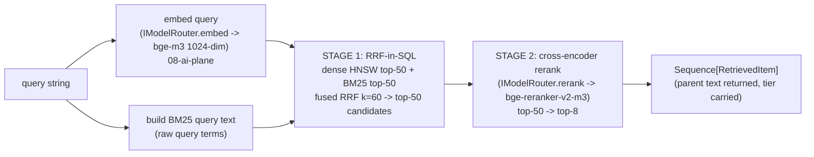

# 07 — Data Layer & Retrieval: Low-Level Design

> **What this document is.** The complete low-level design for TigerExchange's **single-Postgres data plane** and its **two-stage retrieval pipeline** (single-Orin edition). It tells you *why* vector + lexical + graph all live in one Postgres 16 instance, *how* the SHARED public index and the per-tenant CONFIDENTIAL retrieval surface differ physically and in code, and *exactly* how the two-stage pipeline (RRF-fused hybrid Stage 1 → cross-encoder rerank Stage 2) is built behind the kernel `IRetrievalStrategy` Protocol.
>
> **Who reads this.** The builder. You implement the `retrieval` and `data-plane` packages (`tigerexchange_retrieval`, `tigerexchange_data_plane`; see `CONVENTIONS-single-box.md` §3) against the frozen Protocols in `05-kernel-contracts.md`.
>
> **Authority chain (read these first; they WIN over this doc on names/types/DDL).**
> 1. `_design-brief.json` — the locked brief. The fields this doc expands: `retrieval_design`, `memory_budget`, decisions **D6, D8, D13** (with D10 for the confidential-generation seam).
> 2. `CONVENTIONS-single-box.md` — "this file wins" pins. The §5 retrieval/embedder/reranker/SPECTER2 rows, the §5.1 memory regimes, the §6 FORBIDDEN list, and the §9 create-if-absent rule are load-bearing here.
> 3. `05-kernel-contracts.md` — the frozen `IRetrievalStrategy` / `IVectorStore` / `ILexicalIndex` / `IGraph` Protocols and the `RetrievedItem` value object. **Use those signatures verbatim; this doc never redefines them.**
> 4. `13-data-model-and-schemas.md` — the DDL for `tex.work_chunk`, `tex.confidential_index_entry`, `tex.collaboration_edge`, the RRF-in-SQL query, the recursive-CTE `Check()`/ego-net, and the migration ordering. **That doc is authoritative for the physical schema; this doc references it and explains the retrieval behaviour, it does not re-issue the `CREATE TABLE`s.**
>
> **Cross-references to sibling docs.** Security behaviour that gates retrieval (PEP decision order, RLS footguns, crypto-shred split, revocation): `06-security-spine-lld.md`. Who *populates* these tables (Dagster DAGs, DuckDB out-of-core, SPECTER2 batch precompute, identity resolution, monotonic applier): `09-ingestion-and-identity-resolution-lld.md`. The model-serving processes the reranker/embedder/generator run in (3 vLLM processes or the sentence-transformers saver): `08-ai-plane-and-model-router-lld.md`. The consumers of retrieval — `mod-discovery` (two-axis team ranking over the graph) and `mod-lit-intelligence` (dual-source grounded drafting + RAGAS gate): `10-feature-modules-lld.md`. The confidential editor that *writes* into the confidential surface: `11-mod-workspace-confidential-coauthoring-lld.md`. The write-back edge that mutates the graph on a win: `12-collaboration-loop-and-writeback-lld.md`.

---

## 0. Table of contents

1. [Scope, non-goals, and the headline single-box revision](#1-scope-non-goals-and-the-headline-single-box-revision)
2. [Why vector + lexical + graph all live in ONE Postgres (D8)](#2-why-vector--lexical--graph-all-live-in-one-postgres-d8)
3. [The two retrieval surfaces: SHARED public vs per-tenant CONFIDENTIAL (D6)](#3-the-two-retrieval-surfaces-shared-public-vs-per-tenant-confidential-d6)
4. [The two-stage pipeline behind one `IRetrievalStrategy` (D8)](#4-the-two-stage-pipeline-behind-one-iretrievalstrategy-d8)
5. [Stage 1 — hybrid dense + BM25 fused with RRF k=60 in SQL](#5-stage-1--hybrid-dense--bm25-fused-with-rrf-k60-in-sql)
6. [Why RRF and why it needs no labels](#6-why-rrf-and-why-it-needs-no-labels)
7. [Stage 2 — cross-encoder rerank top-50 → top-8](#7-stage-2--cross-encoder-rerank-top-50--top-8)
8. [Chunking: section-aware + parent/child; semantic chunking SKIPPED at P0](#8-chunking-section-aware--parentchild-semantic-chunking-skipped-at-p0)
9. [Embeddings: bge-m3 at serve, SPECTER2 ingest-only](#9-embeddings-bge-m3-at-serve-specter2-ingest-only)
10. [The metadata-backbone graph: edge table + recursive-CTE traversal (no Apache AGE)](#10-the-metadata-backbone-graph-edge-table--recursive-cte-traversal-no-apache-age)
11. [HippoRAG2 Personalized-PageRank — P1 SQL add, not P0](#11-hipporag2-personalized-pagerank--p1-sql-add-not-p0)
12. [Dual-source grounding: how `mod-lit-intelligence` queries BOTH surfaces](#12-dual-source-grounding-how-mod-lit-intelligence-queries-both-surfaces)
13. [The HDD guardrail: index RAM/NVMe-resident, the authz hot path never seeks HDD (D13)](#13-the-hdd-guardrail-index-ramnvme-resident-the-authz-hot-path-never-seeks-hdd-d13)
14. [Index footprint vs the SERVE-regime memory budget](#14-index-footprint-vs-the-serve-regime-memory-budget)
15. [Partial-failure policy: degrade public, fail-closed confidential](#15-partial-failure-policy-degrade-public-fail-closed-confidential)
16. [RAGAS-in-CI with an in-boundary judge](#16-ragas-in-ci-with-an-in-boundary-judge)
17. [The on-aarch64 BM25 benchmark acceptance test (P0.5)](#17-the-on-aarch64-bm25-benchmark-acceptance-test-p05)
18. [RaBitQ — P1 verify-then-adopt only](#18-rabitq--p1-verify-then-adopt-only)
19. [`create_collection_if_absent` (NEVER recreate) and the data-plane adapter shape](#19-create_collection_if_absent-never-recreate-and-the-data-plane-adapter-shape)
20. [P0.5 acceptance tests and how each is satisfied](#20-p05-acceptance-tests-and-how-each-is-satisfied)
21. [Forbidden list (data-plane scoped) and open risks](#21-forbidden-list-data-plane-scoped-and-open-risks)

---

## 1. Scope, non-goals, and the headline single-box revision

This document covers the **read path**: how a query string becomes a ranked, tier-correct set of `RetrievedItem`s. It owns two packages:

- **`tigerexchange_data_plane`** — the single-Postgres adapters that implement the kernel `IVectorStore`, `ILexicalIndex`, and `IGraph` Protocols, plus the create-if-absent collection helper (`CONVENTIONS-single-box.md` §9).
- **`tigerexchange_retrieval`** — `HybridRetriever`, the class that implements `IRetrievalStrategy` by orchestrating Stage 1 (RRF-in-SQL hybrid) and Stage 2 (cross-encoder rerank) across either surface.

**Non-goals (built elsewhere; do not implement here).**

| Concern | Lives in |
|---|---|
| Who classifies/embeds/indexes a record (the *write* path) | `09-ingestion-and-identity-resolution-lld.md` (P0.7) |
| The PEP decision order that authorizes a retrieval | `06-security-spine-lld.md` (P0.2) |
| The vLLM/sentence-transformers processes serving the embedder + reranker | `08-ai-plane-and-model-router-lld.md` (P0.3 brings the embed/rerank slice up *before* this data plane) |
| The physical `CREATE TABLE` DDL + RLS policy text | `13-data-model-and-schemas.md` (authoritative) |
| Crypto-shred of the confidential surface (encrypted tablespace + DEK destroy) | `06-security-spine-lld.md` / `13` §22 (P0.4b, *after* this P0.5 data plane) |

**The headline single-box revision (D8).** The federated "v2" plan locked **Qdrant + OpenSearch + SpiceDB + Apache AGE** as four always-on services. The single-Orin edition **revises that to ONE Postgres 16** providing dense vectors (pgvector HNSW), lexical search (native BM25), RRF fusion (in SQL), and the metadata graph (edge table + recursive CTE). Qdrant/OpenSearch are demoted to documented **future scale-out adapters behind the unchanged Protocols** — they are **not P0 build targets** and reintroducing them is on the `CONVENTIONS-single-box.md` §6 FORBIDDEN list. This doc is the detailed justification and build spec for that revision.

---

## 2. Why vector + lexical + graph all live in ONE Postgres (D8)

The deploy target is a single Jetson AGX Orin 64GB with **unified** LPDDR5 memory shared between CPU and GPU, an HDD cold tier, and an NVMe hot tier (`CONVENTIONS-single-box.md` §5.1; brief `memory_budget`, D13). On that box, every always-on service competes with the model weights for the same 64GB pool. The argument for consolidation is concrete, not aesthetic:

1. **Memory arithmetic.** The SERVE-regime budget (brief `memory_budget`; §14 below) already spends ~49GB on OS + the 30B generator + embedder + reranker + Postgres + backends, leaving ~15GB margin. A resident Qdrant *and* a resident OpenSearch JVM would consume several GB of that margin each, plus their own page caches duplicating data Postgres already caches. **We chose one engine over four** because four engines do not fit beside the models with safe margin, and "search is slow because the JVM heap is paging" is exactly the failure mode a single-box pilot cannot debug.

2. **One transactional store makes per-tenant isolation tractable.** RLS (`FORCE ROW LEVEL SECURITY` + `AS RESTRICTIVE` + `WITH CHECK`, see `13` §0.3 and D5) and per-tenant encrypted-tablespace crypto-shred (D7) are *dramatically* simpler when vectors, postings, graph edges, and relational rows share one engine and one tenant-isolation mechanism. A 30B builder maintaining tenant isolation across Qdrant collections + OpenSearch indices + SpiceDB namespaces + an AGE graph **will** get one of them wrong, and a single wrong one is a cross-tenant leak. Collapsing to one engine collapses the isolation surface to one mechanism that the human-authored security gates (`06`) can fully cover.

3. **One query can fuse across modalities in SQL.** Because dense vectors and BM25 postings sit in the same table (`tex.work_chunk`), Stage-1 RRF fusion is a single SQL statement (§5) — no cross-service join, no two network round-trips, no score-reconciliation glue. The graph traversal (§10) is another SQL statement against an edge table in the same transaction, so the discovery path and the retrieval path share one connection and one tenant context.

4. **The ARM64 reality is verified, and we do NOT lean on borrowed x86 numbers.** `pgvector` HNSW compiles cleanly on aarch64 with ARM-optimized distance kernels. VectorChord-BM25 supports aarch64 (SVE SIMD + runtime CPU dispatch) and ParadeDB `pg_search` is a co-equal verified alternate. **We chose this stack over inheriting the v2 "BM25 is 3× faster than Elasticsearch" claim** because that figure was measured on x86 and does not transfer; the only rationale that matters here is one-engine consolidation, and the only number we trust is the one the **P0.5 on-aarch64 benchmark** (§17) produces on the real box.

**Rejected alternatives, explicitly.**

| Rejected | Why rejected here |
|---|---|
| Qdrant + OpenSearch + RRF | Two extra always-on services competing for the 64GB the models need; demoted to future adapters (D8). |
| Vector-only RAG (drop BM25) | Misses exact-entity matches — scholarly + grant queries are entity-heavy (author/lab names, solicitation numbers, gene/method acronyms). BM25 is **non-optional** (D8, brief `retrieval_design`). |
| Apache AGE for the graph | Another extension/engine to operate; the metadata backbone is a plain edge table traversed by recursive CTEs (D8; §10). |
| SpiceDB for relationships | ReBAC is a Postgres relation-tuple table + recursive-CTE `Check()` (D4; `06`/`13` §13). |
| Learned / convex score fusion | Needs per-tenant labeled relevance data you will not have at a fresh launch; RRF needs none (§6). |

---

## 3. The two retrieval surfaces: SHARED public vs per-tenant CONFIDENTIAL (D6)

There are **two retrieval surfaces** that share the *same* two-stage pipeline (the same `HybridRetriever`, the same RRF-in-SQL, the same reranker). They differ only in *which table they query*, *which capability the PEP requires*, and *where the table physically lives*. This split is the resolution of the STAGE-3 contradiction in D6: "confidential content never enters any **SHARED** index" means the cross-tenant public index — it does **not** mean confidential content is unindexable for its *owning* tenant.

| | **SHARED public surface** | **Per-tenant CONFIDENTIAL surface** |
|---|---|---|
| Table | `tex.work_chunk` (+ `tex.work`, `tex.opportunity`, `tex.award`) | `tex.confidential_index_entry` |
| Contents | public-tier, classify-gated scholarly + funding content (cross-tenant readable) | ONLY the owning tenant's own confidential drafts + prior winning proposals |
| Tenant isolation | none — cross-tenant **by design** (the expertise graph is a shared product surface); the gate is classification + the broker (D6), NOT RLS | `FORCE` RLS (`tenant_id` leading) **AND** physical placement on a per-tenant **encrypted tablespace** (D7) |
| What reaches it | `ClassificationResult.is_retrievable == True` only — i.e. `Decision.ALLOW AND tier == PUBLIC` (kernel `is_retrievable`, `05` §6; `13` §14 `CHECK` constraint) | own-tenant confidential content, written by `mod-workspace` snapshots / ingest of prior wins |
| Who may query it | anyone with `Capability.PUBLIC_RETRIEVAL` (or `OWN_MATERIALS`) | ONLY the owning tenant's confidential drafting path, gated by `Capability.CONFIDENTIAL_RETRIEVAL` at the PEP |
| PEP action | `PepAction.RETRIEVE_PUBLIC` | `PepAction.RETRIEVE_CONFIDENTIAL` |
| `IRetrievalStrategy.retrieve(...)` arg | `confidential_surface=False` (default) | `confidential_surface=True` |
| Crypto-shred | n/a (public) | destroy the per-tenant DEK that unlocks the tablespace → drop-and-rebuild (D7, P0.4b; `06`/`13` §22) |
| Physical placement | `pg_default` tablespace on NVMe | per-tenant `ts_conf_<tenant>` encrypted tablespace on a LUKS-mounted NVMe directory; the table is `PARTITION BY LIST (tenant_id)` so each tenant's partition is on its own encrypted tablespace (`13` §10) |

```mermaid
flowchart TB
    Q["query string + TenantContext"]
    PEP["PEP.authorize(PepRequest)\n(06: fixed 6-step fail-closed order)"]
    HR["HybridRetriever\nIRetrievalStrategy.retrieve(...)"]
    subgraph SHARED["SHARED public surface — pg_default tablespace, NVMe, NO RLS"]
      WC["tex.work_chunk\n(+vector HNSW, +bm25)\nclassify-gated, is_retrievable only"]
    end
    subgraph CONF["PER-TENANT CONFIDENTIAL surface — encrypted tablespace per tenant, RLS"]
      CIE["tex.confidential_index_entry\n(+vector HNSW, +bm25)\nown-tenant drafts + prior wins"]
    end
    Q --> PEP
    PEP -->|ALLOW + RETRIEVE_PUBLIC| HR
    PEP -->|ALLOW + RETRIEVE_CONFIDENTIAL\n(CONFIDENTIAL_RETRIEVAL cap)| HR
    HR -->|confidential_surface=False| WC
    HR -->|confidential_surface=True\n(RLS scopes to SET LOCAL tenant)| CIE
    PEP -. DENY on any uncertainty .-> X((deny))
```

**Why a separate physical surface and not query-time filtering of one shared index?** Query-time post-filtering would leave confidential vectors and BM25 postings **physically present** inside a cross-tenant index — a standing breach, even if the filter is correct today (D6 rejected alternative; `13` §0.6). A physically separate, RLS + encrypted-tablespace surface makes "tenant A grounds on A's own prior proposals; tenant B physically cannot retrieve them" a **structural** property, proven by the human-authored P0.9 test `confidential-surface-cross-tenant-denied`.

**Why the confidential surface's vectors/postings are plaintext-at-rest (NOT AES-GCM'd) but still crypto-shreddable.** AES-GCM on a vector destroys the distance metric HNSW needs, and AES-GCM on a BM25 posting cannot be tokenized or scored — application-layer encryption is **mathematically incompatible** with searching (D7; `13` §0.6). So the confidential surface stores searchable plaintext **inside an encrypted block device** (the per-tenant LUKS/encrypted tablespace): searchable while mounted, and crypto-shredded in O(1) by destroying the DEK that unlocks the device (D7, P0.4b). The forbidden inversion — "AES-GCM the vectors before insert" — produces a broken or insecure system and is on the FORBIDDEN list (`CONVENTIONS-single-box.md` §6). AES-GCM is for **non-searchable blobs only** (`tex.encrypted_blob`, `13` §18).

---

## 4. The two-stage pipeline behind one `IRetrievalStrategy` (D8)

All retrieval — both surfaces — goes through **one** kernel Protocol. Use this signature verbatim from `05-kernel-contracts.md` §10.2 (do not redefine it here):

```python
# from tigerexchange_contracts (05-kernel-contracts.md) — DO NOT REDEFINE; implement against it.
@runtime_checkable
class IRetrievalStrategy(Protocol):
    async def retrieve(
        self,
        *,
        query: str,
        tenant_id: str,
        top_k: int = 8,
        confidential_surface: bool = False,
    ) -> Sequence[RetrievedItem]:
        ...
```

`HybridRetriever` (in `tigerexchange_retrieval`) is the P0 implementation. Its flow:



The `RetrievedItem` it returns is the frozen kernel value object (`05` §9.5) — use it verbatim:

```python
# from tigerexchange_contracts — frozen; carries tier so the broker re-asserts the MAX-rule on derivation.
class RetrievedItem(BaseModel):
    model_config = ConfigDict(frozen=True)
    chunk_id: str
    parent_id: str | None = None     # hierarchical parent (return 512-1024 tok parent; embed child)
    text: str
    tier: Tier
    score: float                     # fused RRF score (stage 1) OR rerank score (stage 2)
    source_ref: str
    metadata: Mapping[str, Any] = Field(default_factory=dict)
```

**Why two stages and not one.** The evidence-backed quality floor is hybrid+rerank: two-stage beats single-stage on Recall@5 (0.816 vs 0.695, brief `retrieval_design`). Stage 1 is cheap and recall-oriented (fetch 50 candidates broadly); Stage 2 is a precise but more expensive cross-encoder that reorders those 50 down to the 8 that actually go into a prompt. We chose this over **vector-only** (misses exact entities) and over **skipping rerank** (leaves the cheapest large quality win — +5–15 nDCG@10 for <200ms — on the table). The pipeline is **single-shot** at P0: no query expansion, no HyDE, no multi-query, no agentic loop (those are P1; §11 / brief `retrieval_design`), because each of those is an extra LLM call contending for the one shared GPU.

**The `confidential_surface` flag is the only branch.** When `True`, `HybridRetriever` runs the *same* RRF-in-SQL and the *same* reranker but against `tex.confidential_index_entry` instead of `tex.work_chunk`. RLS + the encrypted tablespace already scope the confidential table to the one tenant whose `app.tenant_id` GUC is set (`13` §25), so no extra WHERE clause is needed and none must be added (adding a hand-written tenant filter instead of relying on RLS is a footgun — the structural isolation must be RLS, per D5/D6).

---

## 5. Stage 1 — hybrid dense + BM25 fused with RRF k=60 in SQL

Stage 1 fuses a dense ANN search and a BM25 lexical search into one ranked candidate list using **Reciprocal Rank Fusion with k = 60, computed in SQL**. The authoritative query is in `13-data-model-and-schemas.md` §25 — **use that query; this section explains its mechanics, it does not re-issue it.** The shape (VectorChord-BM25 variant), reproduced for orientation only:

```sql
-- RRF k = 60. Runs INSIDE the tenant transaction (SET LOCAL app.tenant_id already applied).
-- AUTHORITATIVE COPY: 13-data-model-and-schemas.md §25. For the confidential surface,
-- substitute tex.confidential_index_entry; RLS + the encrypted tablespace scope it to one tenant.
WITH
dense AS (
    SELECT chunk_id,
           row_number() OVER (ORDER BY embedding <=> $1) AS rank   -- $1 = query embedding (vector)
    FROM tex.work_chunk
    ORDER BY embedding <=> $1
    LIMIT 50
),
lexical AS (
    SELECT chunk_id,
           row_number() OVER (ORDER BY bm25_vector <&> to_bm25query('ix_work_chunk_bm25', $2)) AS rank
    FROM tex.work_chunk
    ORDER BY bm25_vector <&> to_bm25query('ix_work_chunk_bm25', $2)   -- $2 = query text -> bm25 query
    LIMIT 50
),
fused AS (
    SELECT COALESCE(d.chunk_id, l.chunk_id) AS chunk_id,
           COALESCE(1.0 / (60 + d.rank), 0.0)
         + COALESCE(1.0 / (60 + l.rank), 0.0) AS rrf_score
    FROM dense d
    FULL OUTER JOIN lexical l ON d.chunk_id = l.chunk_id
)
SELECT f.chunk_id, c.work_id, c.content, f.rrf_score
FROM fused f
JOIN tex.work_chunk c ON c.chunk_id = f.chunk_id
ORDER BY f.rrf_score DESC, f.chunk_id      -- chunk_id tie-break => deterministic (P0.5)
LIMIT 50;                                  -- top-50 -> Stage-2 rerank -> top-8 (in Python)
```

**Mechanics, spelled out:**

- **RRF formula.** For each candidate chunk `c`, `rrf_score(c) = Σ_lists 1 / (k + rank_list(c))`, with `k = 60` and `rank` 1-based within each list. A chunk in only one list still scores (the `FULL OUTER JOIN` + `COALESCE(..., 0.0)` handle the missing-from-one-list case). `k = 60` is the standard published default; we do not tune it at P0 (no labels to tune against — §6).
- **Dense leg.** `embedding <=> $1` is pgvector **cosine distance** matching the `vector_cosine_ops` HNSW index (`ix_work_chunk_hnsw`, `13` §5b). `$1` is the query embedded by the serve-time embedder (bge-m3, 1024-dim; §9). `LIMIT 50` is the candidate depth feeding Stage 2.
- **Lexical leg.** The BM25 operator/function (`<&>` / `to_bm25query(...)`) is **VectorChord-BM25**-specific. **Verify the exact operator and function names against the installed extension version on the box** — the names have changed across VectorChord releases. For the **ParadeDB `pg_search`** alternate, the lexical CTE instead uses `content @@@ $2` with `paradedb.score(chunk_id)` for ranking (`13` §5b note). Keep the swap local to the `ILexicalIndex` adapter so `HybridRetriever` is unchanged.
- **Determinism (P0.5 acceptance).** RRF is order-deterministic given fixed inputs, but ties in `rrf_score` must break stably; the final `ORDER BY f.rrf_score DESC, f.chunk_id` adds the `chunk_id` tie-break so the same query returns the same top-50 every run. HNSW itself is approximate, so `ef_search` must also be pinned (see §13) for run-to-run reproducibility on the dense leg.
- **Why fuse in SQL and not in Python.** Both legs already live in one table in one transaction; fusing in SQL avoids shipping 100 rows to Python only to merge them, and keeps the candidate set inside the tenant-scoped transaction (no risk of a Python merge accidentally crossing surfaces). We chose SQL fusion over Python fusion for this reason; the only work that *must* happen in Python is Stage 2 (the cross-encoder is a model call, §7).
- **Both surfaces, one query.** The confidential surface runs the identical CTE against `tex.confidential_index_entry`; RLS scopes it. No code fork beyond the table name (parameterized by the `confidential_surface` flag).

---

## 6. Why RRF and why it needs no labels

RRF is chosen deliberately over learned/convex fusion because of the deployment reality:

1. **Parameter-free.** Only `k` (=60) is a constant; there is nothing to fit.
2. **Score-scale-immune.** Dense cosine distances and BM25 scores live on incomparable scales. RRF uses only the *rank* within each list, never the raw score, so you never have to normalize a cosine distance against a BM25 score (a normalization that is itself a tuned, fragile choice).
3. **Zero labeled data required.** A fresh TigerExchange deployment has **no per-tenant relevance judgments**. Learned fusion (e.g. a logistic blend of the two scores) and convex fusion (a tuned `α·dense + (1−α)·lexical`) both require labeled query→relevant-doc pairs to fit `α` or the weights. We do not have them at launch, and a 30B builder fabricating an `α` is worse than RRF's principled default.

**Rejected alternative.** Learned/convex fusion is **deferred until per-tenant labels exist** (brief `retrieval_design`). When a tenant accumulates relevance feedback (e.g. which retrieved chunks made it into a won proposal), a P1 task may fit a per-tenant fusion weight behind the same `IRetrievalStrategy` — but that is explicitly out of P0 scope.

---

## 7. Stage 2 — cross-encoder rerank top-50 → top-8

Stage 2 takes the 50 RRF-fused candidates and reranks them with a **local cross-encoder**, returning the top 8. Unlike the bi-encoder embeddings (which embed query and document separately), a cross-encoder scores the `(query, candidate_text)` *pair* jointly, which is more accurate but too expensive to run over the whole corpus — hence "rerank the 50, not score the million."

- **Model.** `bge-reranker-v2-m3` (568M) or `Qwen3-Reranker-0.6B` (`CONVENTIONS-single-box.md` §5 reranker row). Served via the AI plane behind the kernel `IModelRouter.rerank(...)`:

  ```python
  # from tigerexchange_contracts (05 §10.2) — IModelRouter.rerank, used by HybridRetriever Stage 2.
  async def rerank(self, *, query: str, candidates: Sequence[str], tenant_id: str) -> Sequence[float]:
      ...
  ```

- **Serving topology (decided in `08-ai-plane-and-model-router-lld.md`).** Either a dedicated vLLM score-endpoint process (its own CUDA context, ~2.5GB in the SERVE budget) **or** a sentence-transformers `CrossEncoder` **in-process** (the recommended memory-saver — avoids the third CUDA context, ~−1.3GB; `CONVENTIONS-single-box.md` §5.1, brief `memory_budget`). `HybridRetriever` does not care which; it calls `IModelRouter.rerank` and the AI plane resolves the provider. Ollama is **never** the reranker (it has no `/api/rerank` as of 2026 — FORBIDDEN, §6 of conventions).
- **Why these numbers.** Top-50 in is the standard cross-encoder reranking depth (enough recall headroom for the reranker to recover a relevant doc the RRF missed in its top-8); top-8 out is the `IRetrievalStrategy.retrieve(..., top_k=8)` default — 8 chunks (returned as parent text, §8) is a reasonable grounding context for the 30B generator without overflowing its ~20k context budget (`memory_budget`). Rerank adds +5–15 nDCG@10 for <200ms (brief `retrieval_design`).
- **Confidential path latency note.** Confidential generation is serialized with prefix-caching disabled on the shared generator (D10; `08`). The reranker is a *separate* small model and is **not** the generator, so reranking a confidential candidate set does not itself require the generator's serialization — but the *downstream* drafting call does (handled by `mod-lit-intelligence`/`mod-workspace`, not here).

The reranked top-8 are returned as `RetrievedItem`s with `score` set to the cross-encoder score (the field doc-comment in `RetrievedItem` says `score` is "fused RRF score (stage 1) OR rerank score (stage 2)" — after Stage 2 it is the rerank score).

---

## 8. Chunking: section-aware + parent/child; semantic chunking SKIPPED at P0

Chunking happens at **ingest** (`09-ingestion-and-identity-resolution-lld.md`), but the retrieval design dictates the chunk shape, so it is specified here.

- **Section-aware splitting.** Split a Work's text on its natural section boundaries (abstract, intro, methods, results, etc.) rather than blindly every N tokens, so a chunk does not straddle two unrelated sections.
- **Hierarchical parent/child.** **Embed small children (128–256 tokens), return large parents (512–1024 tokens).** The child is what gets the dense embedding and the BM25 posting (precise matching); the parent is what gets returned to the generator (enough surrounding context to be useful). The DDL supports this with `tex.work_chunk.parent_chunk_id` (self-referential, nullable; `13` §5b) and the kernel `RetrievedItem.parent_id`. `HybridRetriever` searches at child granularity, then resolves each winning child to its parent text before returning.
- **Semantic / LLM-driven chunking is SKIPPED at P0.** The evidence (NAACL 2025, cited in brief `retrieval_design`) is that fixed ~200-word chunks match or beat semantic chunking — and semantic chunking would add an LLM call per document at ingest, contending for the one GPU during the INGEST-WINDOW. **We chose fixed section-aware + parent/child over semantic chunking** because it is cheaper, deterministic, and at least as good per the literature. Semantic chunking is not even a P1 commitment; it is simply not worth it here.

**Why this matters to the builder.** The HNSW index is built over the *child* `embedding` column; the BM25 index over the *child* `content`. Do not embed parents. The parent text is a lookup join (`13` §5b `parent_chunk_id`), not a second index.

---

## 9. Embeddings: bge-m3 at serve, SPECTER2 ingest-only

There are **two embedding spaces**, and conflating them is a documented old-plan mistake (`CONVENTIONS-single-box.md` §13 #11).

| Space | Model | Dim | When loaded | Used for |
|---|---|---|---|---|
| **Serve-time retriever** | bge-m3 (568M) or Qwen3-Embedding-0.6B | **1024** (bge-m3) | resident at SERVE | the dense leg of Stage 1; embedding the query and the chunk children |
| **Citation-aware expertise** | SPECTER2 base + PROXIMITY adapter | **768** (SciBERT base) | **ingest-only, then UNLOADED** | precomputed `ExpertiseFingerprint.specter2_centroid` / paper-similarity for the connectivity axis of team discovery |

- **The retrieval column is `vector(1024)`** on `tex.work_chunk.embedding` and `tex.confidential_index_entry.embedding` (`13` §5b/§10). If Qwen3-Embedding-0.6B is used instead of bge-m3, set the column dimension to its output size and **pin it in `CONVENTIONS-single-box.md`** — never mix dimensions in one column.
- **SPECTER2 is NOT serve-resident and NOT served by vLLM** (`CONVENTIONS-single-box.md` §5 SPECTER2 row; D8). It is an adapter on SciBERT (not a drop-in sentence-transformers model), run as a **batch job at ingest** (in the INGEST-WINDOW, ~1.5GB, the only window it appears in the budget) to precompute the 768-dim centroids into `tex.expertise_fingerprint.specter2_centroid` (`13` §16), then unloaded (~0GB at serve). Serving it resident would waste RAM on a second embedding space and is FORBIDDEN.
- **SPECTER2 is for the GRAPH/discovery similarity axis, not for the two-stage RAG retrieval.** The two-stage retrieval pipeline (§4–§7) uses **only** the bge-m3 space. The SPECTER2 768-dim space powers `mod-discovery`'s expertise-similarity ranking over the expertise graph (`10-feature-modules-lld.md`), via its own HNSW index `ix_fingerprint_specter_hnsw` on `tex.expertise_fingerprint`. Do not feed SPECTER2 vectors into the `work_chunk` RRF query and do not feed bge-m3 vectors into the fingerprint similarity search — different spaces, different columns, different tables.
- **Fallback.** If the `adapters` library is troublesome on aarch64, fall back to bge-m3 embeddings for the connectivity/similarity axis at reduced citation-precision, and demote SPECTER2 to a P1 enhancement (brief `tech_stack` SPECTER2 fallback). The two-stage retrieval is unaffected by this fallback.

The query embedding for Stage 1 is obtained via `IModelRouter.embed(...)` (`05` §10.2), routed to the serve-time embedder by the AI plane (`08`). `HybridRetriever` calls `embed` for the query and passes the resulting `vector(1024)` as `$1` to the RRF SQL.

---

## 10. The metadata-backbone graph: edge table + recursive-CTE traversal (no Apache AGE)

The "graph" is a **deterministic metadata-backbone edge table** built from corpus metadata (authorship, citations, affiliations, venues, grants, topics) plus in-platform write-back edges — **not** an LLM-extracted knowledge graph. There is **no recurring LLM entity-extraction tax** (D8, brief `retrieval_design`). The same graph **is** the collaborator-discovery product surface that `mod-discovery` reads for the connectivity axis (`10`).

- **Physical model.** Edges live in `tex.collaboration_edge` (`13` §17): `(src_subject, dst_subject, edge_type, weight, time_decay, source_proposal_id?, award_number?)`, with `edge_type ∈ {co_authored, co_pi_with, cites, affiliated_with}` (`13` §0.8). It is a **shared public** table (no RLS) — the expertise graph is a cross-tenant product surface. Both traversal directions are indexed (`ix_edge_src (src_subject, edge_type)`, `ix_edge_dst (dst_subject, edge_type)`) so the recursive CTE can walk either way.
- **Traversal Protocol.** Use the kernel `IGraph` Protocol verbatim (`05` §10.2). The traversal method is **bounded-hop and the bound is required**:

  ```python
  # from tigerexchange_contracts (05 §10.2) — IGraph. max_hops is REQUIRED bounded (no unbounded walks).
  async def ego_net(self, *, tenant_id: str, node: str, max_hops: int = 2) -> Sequence[dict[str, Any]]:
      ...
  ```

- **Recursive-CTE ego-net (illustrative — verify against `06`/`13` for the exact tuned form).** "All subjects within `max_hops` hops of `node`":

  ```sql
  -- Bounded-hop ego-net over the shared collaboration graph. max_hops is a HARD bound.
  WITH RECURSIVE ego(subject, depth) AS (
      SELECT $1::uuid AS subject, 0 AS depth                       -- $1 = seed node
    UNION
      SELECT CASE WHEN e.src_subject = ego.subject THEN e.dst_subject
                  ELSE e.src_subject END,
             ego.depth + 1
      FROM ego
      JOIN tex.collaboration_edge e
        ON ego.subject IN (e.src_subject, e.dst_subject)
      WHERE ego.depth < $2                                         -- $2 = max_hops, HARD bound
  )
  SELECT DISTINCT subject, MIN(depth) AS hops
  FROM ego
  WHERE subject <> $1
  GROUP BY subject;
  ```

- **Why an edge table + recursive CTE and not Apache AGE.** A plain edge table with two indexes and a bounded recursive CTE is enough for the bounded-hop neighborhood queries discovery needs, costs **zero** extra always-on engine, and inherits Postgres tenant/transaction semantics. We chose it over **Apache AGE** (a graph extension that is another engine to operate and another aarch64 build risk) — AGE is on the FORBIDDEN list (`CONVENTIONS-single-box.md` §6).
- **The `max_hops` bound is load-bearing, not cosmetic.** An unbounded graph walk on a dense collaboration graph can blow up (exponential frontier). The CTE **must** carry a hard depth bound (`WHERE depth < $2`), exactly as the ReBAC `Check()` carries its `depth < 16` cycle guard (`13` §13). Default `max_hops=2`; a builder must never remove the bound.
- **Note on `IGraph.ego_net`'s `tenant_id` argument.** The collaboration graph is shared public (no RLS), so `tenant_id` here is for audit/observability and for the future case where a graph query is scoped — it does **not** filter the shared edge rows. The write-back edge (`12`) writes `co_pi_with` rows into this same table on a win.

---

## 11. HippoRAG2 Personalized-PageRank — P1 SQL add, not P0

HippoRAG2-style **Personalized-PageRank (PPR) graph-augmented retrieval** (~1k tokens/query) is a **P1** SQL/Python add over the same edge table — **not a P0 dependency**. P0 ships single-shot hybrid + rerank only (§4).

- **Why P1, not P0.** PPR adds a graph-walk re-weighting step that improves multi-hop reasoning retrieval, but it is an enhancement, not the quality floor. P0's job is the walking skeleton: prove the two-stage pipeline end-to-end first. Adding PPR before the floor is proven inflates the surface a 30B builder must get right.
- **Why HippoRAG2-PPR and not Microsoft GraphRAG.** Microsoft GraphRAG's global community-summarization approach costs **~331k tokens/query** — infeasible on this edge box's single GPU. HippoRAG2-PPR is ~1k tokens/query and runs as SQL/Python over the existing edge table. **We chose HippoRAG2-PPR (P1) over GraphRAG (rejected outright)** on cost grounds (brief `retrieval_design`).
- **How it slots in later.** PPR is implemented behind the same `IGraph` / `IRetrievalStrategy` seams — a P1 task adds a PPR re-weighting pass over the §10 edge table that biases the Stage-1 candidate set toward graph-connected nodes. No P0 interface changes.

---

## 12. Dual-source grounding: how `mod-lit-intelligence` queries BOTH surfaces

`mod-lit-intelligence` (the proposal-grounding module, `10-feature-modules-lld.md`) is the **only** module that retrieves over **both** surfaces for the owning tenant — this is the centerpiece moat (D6, brief `collaboration_loop_design` STAGE 3). The data-plane mechanics:

1. For an owning tenant drafting a confidential proposal, `mod-lit-intelligence` issues **two** retrieval calls through the broker/PEP:
   - `retrieve(query=..., tenant_id=T, confidential_surface=False)` → the **shared public** corpus (scholarly + funding), gated by `Capability.PUBLIC_RETRIEVAL`, `PepAction.RETRIEVE_PUBLIC`.
   - `retrieve(query=..., tenant_id=T, confidential_surface=True)` → tenant T's **own** prior winning proposals + drafts, gated by `Capability.CONFIDENTIAL_RETRIEVAL`, `PepAction.RETRIEVE_CONFIDENTIAL`.
2. The PEP authorizes each independently (fixed 6-step order, `06`). The confidential call requires the confidential capability; a tenant without it gets a fail-closed DENY (kernel `Entitlement.permits_tier(CONFIDENTIAL)`, `05` §4.2). Tenant B can never obtain `confidential_surface=True` results for tenant A — RLS + the encrypted tablespace + the PEP each independently prevent it (P0.9 `confidential-surface-cross-tenant-denied`).
3. The two result sets are merged in `mod-lit-intelligence` for grounding the draft. **The MAX-rule applies to the derivation**: a draft grounded on a confidential input is itself confidential (`tier_join_all` → CONFIDENTIAL; `05` §3). Each `RetrievedItem` carries its `tier`, so the broker re-asserts the MAX-rule when the derived draft is produced. The resulting draft is therefore confidential-tier, never enters the shared index, and its snapshots are AES-GCM blobs while its index entries live on the confidential surface (D6/D7).

**Data-plane contract:** the data plane exposes exactly one retrieval entrypoint (`IRetrievalStrategy.retrieve`) with the `confidential_surface` boolean. It does **not** expose a "merge both" call — merging is `mod-lit-intelligence`'s job, because merging confidential + public content is a tier-derivation act that must go through the broker's MAX-rule re-assertion, not a silent data-plane convenience.

---

## 13. The HDD guardrail: index RAM/NVMe-resident, the authz hot path never seeks HDD (D13)

This is **load-bearing** (brief `retrieval_design`, D13; `CONVENTIONS-single-box.md` §5.1 data placement). The Orin's spinning HDD has poor random-I/O latency, and **HNSW is pure random I/O**; serving an HNSW index off the HDD yields **10s+ queries**. The rules:

| Tier | What lives there | Rule |
|---|---|---|
| **HDD** | raw CC0 gzip snapshots (OpenAlex/Crossref/etc.) | **COLD ARCHIVE ONLY** — read **sequentially** at ingest. **Never** an index, never WAL, never the authz hot path. |
| **NVMe** (PCIe Gen4 M.2, effectively mandatory in BOM) | Postgres data dir + WAL, **live HNSW + BM25 indexes** (shared `work_chunk` + per-tenant `confidential_index_entry` on encrypted tablespaces), Parquet working sets | the HOT tier; all live indexes go here. |
| **RAM** (unified 64GB) | model weights, Postgres `shared_buffers` + OS page cache hot pages of the indexes | transient + hot pages. |

- **The HNSW index MUST stay RAM-resident / on NVMe — never served off HDD.** This is the single most important data-placement rule in the whole system; it is the difference between sub-second and 10-second retrieval. The P0.5 acceptance test verifies "index served RAM-resident/NVMe (no HDD on hot path)."
- **The authz/RLS hot path must NEVER incur HDD random seeks** (D13). The `relation_tuple`, `revocation_log`, and tenant tables are on NVMe with `tenant_id`-leading indexes (so the RLS predicate is an index seek, `13` §0.5), because per-request authorization off HDD would dominate latency.
- **`ef_search` pinning.** For HNSW query reproducibility (and to bound query latency/recall), pin `hnsw.ef_search` (e.g. `SET LOCAL hnsw.ef_search = 100`) within the retrieval transaction. The build-time `m=16, ef_construction=64` are set in the DDL (`13` §5b/§10); `ef_search` is the query-time knob.
- **If NVMe is genuinely absent (open risk).** Force the entire hot tier (Postgres data + WAL, indexes, relation tuples) into RAM via `shared_buffers` and **cap the corpus scope** so the working set fits, accepting a smaller corpus (brief `open_risks` NVMe mitigation). Flag NVMe as effectively mandatory at P0.0. Never fall back to serving HNSW off the HDD.

---

## 14. Index footprint vs the SERVE-regime memory budget

The index footprint is a line item in the **SERVE** regime of the three mutually-exclusive memory regimes (brief `memory_budget`; `CONVENTIONS-single-box.md` §5.1). The relevant slice:

| SERVE line item | Approx | Notes |
|---|---|---|
| OS + L4T + CUDA drivers + headroom | ~7GB | |
| Generator (Qwen3-30B-A3B INT4, weights + KV/ctx @ ~20k) | ~25GB | ONE shared copy (D9/D10); confidential drafting adds **no** second copy. |
| Embedder (bge-m3 568M + CUDA ctx) | ~2.5GB | 0 in the in-process saver beyond shared ctx. |
| Reranker (bge-reranker-v2-m3 568M + CUDA ctx) | ~2.5GB | in-process saver drops the 3rd CUDA context (~−1.3GB). |
| SPECTER2 | **0GB at serve** | precomputed at ingest, UNLOADED (§9). |
| **Postgres `shared_buffers` + OS page cache for the hot pgvector HNSW + BM25 index** | **~7GB** | the **index footprint** this doc owns: scoped tenant corpus ~100K–1M chunks at 1024-dim + HNSW ~1.5–2× overhead; covers the shared public surface **and** the small hot per-tenant confidential surfaces. |
| Postgres backends + PgBouncer + FastAPI + Python workers + CRDT ws server | ~5GB | |
| **SERVE TOTAL** | **~49GB** | ~15GB margin. Saver variant (embed/rerank in-process) ~46GB. |

**Index-sizing implications for the builder:**

- The ~7GB index budget assumes a **scoped corpus** (~100K–1M chunks), which is enforced by the corpus-scoping-at-ingest rule (D14, ingested by ROR/topic via DuckDB; `09`). The moat is depth-within-tenant, **not** a full-world ingest. If you ingest unscoped, the HNSW index will not fit in the ~7GB budget and will spill — do not do this.
- **HNSW memory overhead is ~1.5–2× the raw vector bytes.** Raw: ~1M chunks × 1024 dims × 4 bytes ≈ 4GB; with HNSW graph overhead ≈ 6–8GB. This is why the index budget is ~7GB and why corpus scope is capped.
- **The confidential surfaces are small.** Each tenant's confidential surface holds only that tenant's own drafts + prior wins (tens to low-hundreds of proposals), so the per-tenant confidential HNSW indexes are tiny relative to the shared public index; they fit comfortably inside the same ~7GB line as hot pages.
- **A runtime/CI probe asserts SERVE-regime resident memory ≤ ~49GB** (`CONVENTIONS-single-box.md` §7; brief `open_risks`) — this catches both an accidental second 30B copy and an over-large unscoped index.

INGEST-WINDOW and WRITEBACK-WINDOW budgets (where SPECTER2 reloads, DuckDB caps at 8GB/4GB, serving pauses) are owned by `09-ingestion-...` and `12-collaboration-loop-...`; this doc only owns the SERVE-time index footprint.

---

## 15. Partial-failure policy: degrade public, fail-closed confidential

When one Stage-1 leg or the reranker fails, the two surfaces behave **oppositely**, and this asymmetry is mandatory (brief `retrieval_design`; `13` §25):

| Surface | On a leg failure (e.g. BM25 errors, or dense leg errors, or rerank errors) | Why |
|---|---|---|
| **SHARED public** | **Degrade, never whole-query-fail.** Return the surviving leg's results **with an honest completeness indicator** (a flag in `RetrievedItem.metadata`, e.g. `{"degraded": true, "missing_leg": "bm25"}`). Public discovery should stay useful even if one index is temporarily unavailable. | Availability matters more than completeness for public discovery; a partial result with an honest flag beats a hard error. |
| **PER-TENANT CONFIDENTIAL** | **Whole-query fail-closed.** If any leg of a confidential retrieval fails, the **entire** confidential retrieval fails (DENY/error), returning nothing. Never return a silently partial confidential grounding set. | A silently incomplete confidential grounding could omit a sensitive prior-proposal match in a way the drafter cannot see; fail-closed is the safe default for the confidential path, consistent with the PEP's fail-closed posture (`06`). |

**Builder rule:** the partial-failure branch lives in `HybridRetriever`, keyed on the `confidential_surface` flag. Confidential ⇒ on any sub-failure, raise (let the PEP/caller treat it as a denial). Public ⇒ on a single-leg failure, return the other leg's results with the completeness flag set; only if **both** legs fail does the public path error. The reranker failing on the public path degrades to the RRF-fused order (return the Stage-1 top-8 unreranked, flagged); on the confidential path it fails closed.

---

## 16. RAGAS-in-CI with an in-boundary judge

Retrieval + grounding quality is regression-gated with **RAGAS** wired into CI, using an **in-boundary (local 30B) judge** — never a cloud judge (brief `retrieval_design`).

- **Metrics.** RAGAS **faithfulness** + **context precision/recall**, plus **nDCG@k / Recall@k** on a small per-tenant gold set. The gold set is small and curated per tenant (no labels needed for RRF itself — §6 — but a tiny gold set is needed to *measure* quality and catch regressions).
- **The judge MUST be in-boundary.** Confidential drafts forbid sending content to a cloud model (D10 locality; `08`). The RAGAS judge therefore runs on the **same local 30B generator** (the shared Qwen3-30B-A3B). For evaluations touching confidential content, the judge call uses the confidential path (prefix-caching off + serialized, D10). Using a cloud judge (OpenAI/Anthropic) for any confidential eval is a confidentiality breach and is forbidden.
- **Eval artifacts are confidential-tier.** Eval traces are stored as **AES-256-GCM non-searchable blobs** (`tex.encrypted_blob`, kind `eval_trace`; `13` §18) under the per-tenant DEK, so `destroy_kek()` crypto-shreds them too (D7). Do not write eval traces to a plaintext file.
- **CI gate.** The RAGAS faithfulness gate must be green on the gold set before a retrieval/grounding change merges (P0.8 acceptance: "RAGAS faithfulness gate green on gold set"). This is a **functional** quality gate the builder may author (it is not one of the human-authored *security* gates; `CONVENTIONS-single-box.md` §10).

---

## 17. The on-aarch64 BM25 benchmark acceptance test (P0.5)

P0.5 includes an explicit acceptance test that **benchmarks BM25 latency on the REAL aarch64 box** — **not** an inherited x86 number (brief `retrieval_design`, D8; `CONVENTIONS-single-box.md` §5 retrieval row).

- **Why this test exists.** The v2 plan justified BM25 with a borrowed x86 "3× faster than Elasticsearch" figure. That number does not transfer to aarch64, and the single-box rationale is *consolidation*, not raw BM25 speed. The benchmark replaces the borrowed claim with a measured one on the target hardware.
- **What it measures.** Stage-1 BM25 query latency (and the full hybrid RRF query latency) over a representative scoped corpus on the Orin, against whichever BM25 engine actually **builds** on the JetPack/CUDA aarch64 base — **VectorChord-BM25** if its Rust extension builds, else **ParadeDB `pg_search`** (the co-equal verified alternate). The two are interchangeable behind the `ILexicalIndex` adapter, so the swap is local (open risk mitigation; `13` §5b note).
- **Acceptance shape (descriptive — the human-authored security gates are separate; this is a functional/perf gate the builder writes):**
  - GIVEN a scoped corpus loaded into `tex.work_chunk` with the BM25 index built, and the index RAM-resident/NVMe (no HDD),
  - WHEN a representative set of entity-heavy queries (author names, solicitation numbers, method acronyms) is run through the lexical leg and through the full hybrid RRF query,
  - THEN record p50/p95 BM25-leg latency and full-hybrid latency **measured on the Orin**, assert they are within a documented budget (e.g. hybrid p95 well under the rerank/generation budget so retrieval is not the bottleneck), and **store the measured numbers in the test output** (no x86 numbers anywhere).
  - AND assert **hybrid + rerank beats vector-only** on the gold set (Recall@k uplift) — the two-stage justification, measured locally.
- **Companion P0.5 assertions:** index served RAM-resident/NVMe verified; the graph bounded-hop CTE returns the correct ego-net; **RRF is deterministic** (stable tie-break, §5); and the human-authored `confidential-surface-cross-tenant-denied` test (tenant A's confidential surface not queryable by tenant B).

---

## 18. RaBitQ — P1 verify-then-adopt only

VectorChord **IVF + RaBitQ** (DiskANN-style ~1-bit quantized codes, a disk-friendly ">RAM index") is a **P1 verify-then-adopt** task, **NOT a P0 dependency** (D8; `CONVENTIONS-single-box.md` §5 disk-friendly-index row).

- **Why it is NOT load-bearing at P0.** The P0 design **requires the live index to fit RAM/NVMe regardless** (§13 — HNSW off HDD is catastrophic). So the ">RAM index via RaBitQ" story buys nothing at P0: the index already fits because the corpus is scoped (§14). RaBitQ only matters *if* the index ever exceeds RAM, which the P0 scoping prevents.
- **`arm64_status = needs-verification`.** RaBitQ's aarch64 status is unverified, so it **does not gate P0** by construction (`CONVENTIONS-single-box.md` §5). The verified P0 default is **pgvector HNSW kept RAM-resident**.
- **"Verify-then-adopt" discipline.** A P1 task may benchmark RaBitQ on the real aarch64 box (recall vs latency vs footprint) and adopt it *only if it verifiably wins*, behind the unchanged `IVectorStore` Protocol. Do not make P0 depend on it; do not adopt it sight-unseen.

---

## 19. `create_collection_if_absent` (NEVER recreate) and the data-plane adapter shape

The data-plane adapters implement the kernel store Protocols. **All collection/index bring-up is create-if-absent (idempotent); `recreate_collection` / drop-on-create is FORBIDDEN** (`CONVENTIONS-single-box.md` §9; the old plan used Qdrant's destructive `recreate_collection` — banned). The only sanctioned drop is the crypto-shred destroy-then-rebuild of a per-tenant confidential tablespace after its DEK is destroyed (D7, P0.4b; `06`/`13` §22).

Use the kernel `IVectorStore` Protocol verbatim (`05` §10.2) — note the method is named `create_collection_if_absent`, not `recreate_collection`:

```python
# from tigerexchange_contracts (05 §10.2) — IVectorStore. Idempotent, NEVER drops.
async def collection_exists(self, *, name: str, tenant_id: str) -> bool: ...

async def create_collection_if_absent(self, *, name: str, dim: int, tenant_id: str) -> None:
    """Idempotent. MUST be a no-op if the collection already exists. NEVER drops."""
    ...
```

The Postgres-backed implementation guards every `CREATE` with an existence check / `IF NOT EXISTS` (`CONVENTIONS-single-box.md` §9; `13` §24). Illustrative shape (the canonical helper lives in `tigerexchange_data_plane`):

```python
# packages/data-plane/tigerexchange_data_plane/collections.py  (illustrative shape; per CONVENTIONS §9)
async def ensure_collection(conn, name: str, ddl: str) -> None:
    """Create the collection/index IFF absent. NEVER drops. Idempotent no-op if present."""
    if await collection_exists(conn, name):
        return
    await conn.execute(ddl)   # CREATE TABLE/INDEX ... IF NOT EXISTS where the engine supports it
```

The three data-plane adapters and their backing physical objects (DDL authoritative in `13`):

| Kernel Protocol | Adapter (`tigerexchange_data_plane`) | Backing physical object |
|---|---|---|
| `IVectorStore` | pgvector HNSW adapter | `embedding vector(1024)` + `ix_*_hnsw` on `work_chunk` / `confidential_index_entry` |
| `ILexicalIndex` | native BM25 adapter (VectorChord-BM25 or ParadeDB `pg_search`) | `bm25_vector` + `ix_*_bm25` (or `pg_search` index) on the same tables |
| `IGraph` | edge-table + recursive-CTE adapter | `tex.collaboration_edge` + the bounded-hop ego-net CTE (§10) |

`HybridRetriever` (`IRetrievalStrategy`) composes these three; it does not talk to Postgres directly except through the adapters. Per import rules (`CONVENTIONS-single-box.md` §4), feature modules never import `tigerexchange_data_plane` — they receive `RetrievedItem`s from the broker.

---

## 20. P0.5 acceptance tests and how each is satisfied

P0.5 ("Data plane: single-Postgres hybrid retrieval — shared + per-tenant confidential surface"; brief `build_phases`). Each acceptance test and the design feature that satisfies it:

| P0.5 acceptance test | Satisfied by |
|---|---|
| hybrid+rerank beats vector-only on a small gold set (Recall@k uplift) | Two-stage pipeline (§4, §7); measured locally in the P0.5 benchmark (§17). |
| BM25 latency BENCHMARKED on the REAL aarch64 box (not an x86 number) | The on-aarch64 BM25 benchmark test (§17); no inherited x86 numbers. |
| index served RAM-resident/NVMe (no HDD on hot path) verified | The HDD guardrail (§13); index on NVMe, hot pages in `shared_buffers`. |
| graph bounded-hop CTE returns correct ego-net | The recursive-CTE ego-net with the hard `max_hops` bound (§10). |
| RRF deterministic | RRF-in-SQL with the `chunk_id` tie-break + pinned `ef_search` (§5, §13). |
| tenant A's confidential surface NOT queryable by tenant B **[HUMAN-authored]** | The per-tenant CONFIDENTIAL surface (§3): RLS + encrypted tablespace + PEP `CONFIDENTIAL_RETRIEVAL` gate (`06`). |
| `create_collection` guarded by `collection_exists` | `create_collection_if_absent` (§19); never `recreate_collection`. |

> **Ordering reminder.** P0.5 (this data plane) is built **before** P0.4b (crypto-shred of the searchable confidential derivatives), because the encrypted-tablespace DEK-destroy mechanism needs the confidential surface to exist first (brief `build_phases`; `13` §24 migration `0007` is last). The confidential surface's *table and RLS* are built here at P0.5; its *encrypted-tablespace placement and DEK-destroy wiring* are P0.4b.

---

## 21. Forbidden list (data-plane scoped) and open risks

**Forbidden (carried from `CONVENTIONS-single-box.md` §6 and `13` §27, scoped to this doc):**

- **Do NOT** introduce Qdrant or OpenSearch as P0 stores — single Postgres (pgvector + native BM25 + RRF + edge-graph). They are future scale-out adapters only.
- **Do NOT** use Apache AGE for the graph — edge table + recursive CTE.
- **Do NOT** `recreate_collection` / drop-on-create any table, index, or partition — create-if-absent only (§19). The sole sanctioned drop is crypto-shred (P0.4b).
- **Do NOT** apply AES-GCM to `embedding` / `bm25_vector` or any searchable index — mathematically unsearchable (D7). Searchable confidential derivatives are protected by encrypted-tablespace + DEK-destroy; AES-GCM is for non-searchable blobs only (`13` §18).
- **Do NOT** add a `tenant_id` RLS policy to the shared public tables (`work`, `work_chunk`, `opportunity`, `award`, `expertise_fingerprint`, `collaboration_edge`) — cross-tenant by design; their gate is classification + the broker (D6).
- **Do NOT** make RaBitQ a P0 dependency — it is P1 verify-then-adopt (§18); pgvector HNSW RAM-resident is the P0 default.
- **Do NOT** serve any HNSW index off the HDD — RAM-resident / on NVMe always (§13).
- **Do NOT** add semantic/LLM chunking, query expansion, HyDE, multi-query, or HippoRAG2-PPR at P0 — single-shot hybrid+rerank only (§4, §8, §11).
- **Do NOT** use a cloud RAGAS judge for any confidential eval — in-boundary local 30B judge only (§16).
- **Do NOT** make the data plane merge the public + confidential surfaces for the caller — `mod-lit-intelligence` merges through the broker so the MAX-rule is re-asserted (§12).

**Open risks relevant to this doc (brief `open_risks`):**

| Risk | Mitigation (where handled here) |
|---|---|
| NVMe absent → HNSW 10s+ queries, authz seek-bound | Flag NVMe mandatory at P0.0; if absent, force hot tier into RAM and cap corpus scope; never serve HNSW off HDD (§13, §14). |
| VectorChord-BM25 Rust extension fails to build on aarch64 (build risk, not perf) | Default to pgvector HNSW + ParadeDB `pg_search`; the P0.5 benchmark runs against whichever BM25 engine builds; keep `IVectorStore`/`ILexicalIndex` clean so the swap is local (§17, §19). |
| Crypto-shred mis-built (AES-GCM on vectors → broken grounding) | The split is explicit: encrypted-tablespace + DEK-destroy for searchable, AES-GCM only for blobs; a human-authored test asserts the confidential surface stays SEARCHABLE while mounted (§3; `06`/`13` §22). |
| Builder reintroduces dropped tech (Qdrant/OpenSearch/AGE/ALE-on-vectors) | The forbidden list above + `CONVENTIONS-single-box.md` §6, cited inline. |

---

*End of `07-data-layer-and-retrieval-lld.md`. Schema DDL is authoritative in `13-data-model-and-schemas.md`; kernel Protocol signatures are authoritative in `05-kernel-contracts.md`; pins are authoritative in `CONVENTIONS-single-box.md`. Where this doc and a spine doc disagree, the spine doc wins.*
