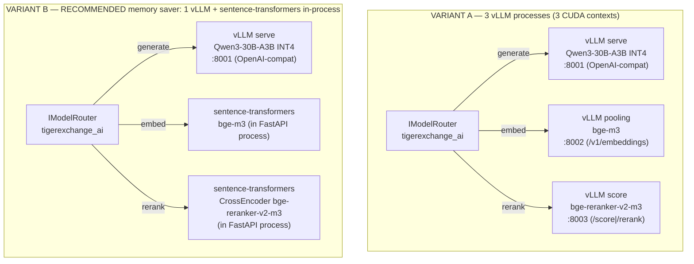

# 08 — AI Plane & Model Router: Low-Level Design

> **What this document is.** The complete low-level design of the **AI plane** for TigerExchange
> (single-Orin edition): the `mod-ai` package (`tigerexchange_ai`) that implements `IModelRouter` +
> `IModelProvider`, the **provider registry**, the **one owned tier→locality policy table** consulted by
> *both* the router and the egress transport guard, the **single shared Qwen3-30B-A3B generator** and how
> confidential KV isolation is achieved on it **without a second model copy and without MIG**, the
> embedder/reranker choices, the SPECTER2 ingest-only batch path, and the async/queued
> confidential-drafting concurrency + backpressure model with the decode/prefill SLOs.
>
> **Who reads this.** The builder. Type the signatures and config snippets in essentially verbatim, then
> implement against them. Where this document and a feature LLD disagree about an AI-plane behavior, this
> document wins for AI-plane behavior; the **kernel types** in `05-kernel-contracts.md` win for the
> `GenerationRequest`/`GenerationResult`/`IModelRouter`/`IModelProvider` shapes (do not redefine them
> here — import them), and `CONVENTIONS-single-box.md` wins for pins/names/the FORBIDDEN list.
>
> **Authority chain.** `_design-brief.json` (locked) → `CONVENTIONS-single-box.md` (this-file-wins pins)
> → `05-kernel-contracts.md` (frozen Protocol shapes) → this document for AI-plane mechanics. Decisions
> referenced here are **D9, D10** (plus D8 for SPECTER2/embedder/reranker, D13 for the memory regimes).
> Decision IDs are **D1..D14 only** — there are no other labels.
>
> **Cross-references.** Kernel Protocols/value objects this doc implements: `05-kernel-contracts.md`.
> The PEP/broker that calls the router and the egress audit: `06-security-spine-lld.md`. The retrieval
> pipeline that consumes `embed()`/`rerank()`: `07-data-layer-and-retrieval-lld.md`. The ingestion DAG
> that runs the SPECTER2 batch precompute: `09-ingestion-and-identity-resolution-lld.md`. The confidential
> co-authoring path that issues `CONFIDENTIAL_DRAFTING` generations: `11-mod-workspace-confidential-coauthoring-lld.md`.
> The memory-regime budget table: `03-architecture-and-orin-constraints.md`. The exact wheel-install/runbook
> and per-process startup assertions: `04-tech-stack-and-arm64-runbook.md`. The deferred federation seams:
> `15-future-federation-interfaces.md`.

---

## 0. Table of contents

1. [What the AI plane is, and what it is NOT](#1-what-the-ai-plane-is-and-what-it-is-not)
2. [The serving topology: up to three one-model-per-process instances (D9)](#2-the-serving-topology-up-to-three-one-model-per-process-instances-d9)
3. [The provider registry + `IModelProvider` implementations](#3-the-provider-registry--imodelprovider-implementations)
4. [`IModelRouter` — the classification-routed entry point](#4-imodelrouter--the-classification-routed-entry-point)
5. [The ONE owned tier→locality policy table (router + transport, disagreement = hard-fail)](#5-the-one-owned-tierlocality-policy-table-router--transport-disagreement--hard-fail)
6. [The ONE shared Qwen3-30B-A3B generator (D9)](#6-the-one-shared-qwen3-30b-a3b-generator-d9)
7. [Confidential KV isolation WITHOUT a second copy (D10)](#7-confidential-kv-isolation-without-a-second-copy-d10)
8. [Async/queued confidential-drafting concurrency + backpressure](#8-asyncqueued-confidential-drafting-concurrency--backpressure)
9. [Embedder + reranker choices and the 3-process vs sentence-transformers saver](#9-embedder--reranker-choices-and-the-3-process-vs-sentence-transformers-saver)
10. [SPECTER2 is INGEST-ONLY (precompute then unload)](#10-specter2-is-ingest-only-precompute-then-unload)
11. [Decode/prefill SLOs and the throughput model](#11-decodeprefill-slos-and-the-throughput-model)
12. [Memory accounting for the AI plane (per regime)](#12-memory-accounting-for-the-ai-plane-per-regime)
13. [Failure modes, startup assertions, and the egress audit record](#13-failure-modes-startup-assertions-and-the-egress-audit-record)
14. [Acceptance tests this document must satisfy (P0.3, P0.6)](#14-acceptance-tests-this-document-must-satisfy-p03-p06)
15. [The deferred federation note (honest)](#15-the-deferred-federation-note-honest)

---

## 1. What the AI plane is, and what it is NOT

The AI plane is layer (4) of the modular monolith (brief `architecture_overview`): a **small fixed set of
model-serving processes** co-resident on one Jetson AGX Orin 64GB, fronted by a classification-routed
`IModelRouter`. Everything that needs inference — retrieval embedding/reranking, classification, grounded
drafting, the RAGAS judge — goes through this one router. It is implemented entirely in the
`tigerexchange_ai` package (directory `packages/mod-ai/`, per `CONVENTIONS-single-box.md` §3).

The AI plane provides exactly three model *capabilities* at serve time:

| Capability | Backed by (P0 default) | Kernel method | Consumed by |
|---|---|---|---|
| **Generate** (the LLM) | ONE shared Qwen3-30B-A3B INT4 vLLM process | `IModelRouter.generate` | `mod-lit-intelligence` (grounded drafting + RAGAS judge), `mod-workspace` (confidential drafting), `mod-discovery` (per-candidate "why") |
| **Embed** (dense retriever vectors) | bge-m3 568M (vLLM pooling process **or** sentence-transformers in-process) | `IModelRouter.embed` | `retrieval` (`07`), `mod-ingestion` chunk embeddings (`09`) |
| **Rerank** (stage-2 cross-encoder) | bge-reranker-v2-m3 568M (vLLM score process **or** sentence-transformers `CrossEncoder` in-process) | `IModelRouter.rerank` | `retrieval` stage-2 (`07`) |

**What the AI plane is NOT** (each banned per `CONVENTIONS-single-box.md` §6 / the listed decision):

- It is **NOT** a single all-in-one runtime hosting generator + embedder + reranker in one vLLM instance.
  vLLM is strictly **one model per process** (D9). "One runtime" means *the same software* run as up to
  three processes, each with its own CUDA context.
- It does **NOT** contain a second resident 30B copy for confidential tenants. Confidential isolation is
  achieved on the **one shared generator** (D10). A second ~17GB-weights + ~4–8GB-context copy would push
  steady-state RAM to ~70GB > 64GB; the centerpiece path could not run. **FORBIDDEN.**
- It does **NOT** use GPU **MIG**. MIG is physically unavailable on the Orin Ampere GPU (SM 8.7); it is
  deferred to a future Thor/Blackwell box only (D10). **FORBIDDEN.**
- It does **NOT** keep SPECTER2 resident at serve time. SPECTER2 is an **ingest-only** batch job that
  precomputes citation-aware vectors then unloads to ~0GB (D8); see [§10](#10-specter2-is-ingest-only-precompute-then-unload).
- It does **NOT** make routing or locality decisions in scattered call sites. There is **one** owned
  tier→locality policy table read by both the router and the egress transport guard, and they **hard-fail**
  on disagreement (security_spine "Confidential = local-only inference + shared-generator KV isolation");
  see [§5](#5-the-one-owned-tierlocality-policy-table-router--transport-disagreement--hard-fail).

> **The AI plane never makes authorization decisions.** Whether a caller *may* run a confidential
> generation is decided by the **PEP** (`06`), not the router. By the time a `GenerationRequest` reaches
> `IModelRouter.generate`, the broker has already `authorize()`-d a `PepRequest` with
> `action=EGRESS` / `action=DERIVE` and `required_capability=CONFIDENTIAL_DRAFTING`. The router's job is
> narrower and mechanical: **given a request whose tier is already trusted, enforce locality and KV
> isolation and pick the provider.** The router is a *defense-in-depth* second check on locality, not the
> primary gate. We keep this separation because conflating authorization into the router would scatter the
> single-chokepoint property (D3) the whole system depends on.

---

## 2. The serving topology: up to three one-model-per-process instances (D9)

### 2.1 The two supported serving variants

The brief and `CONVENTIONS-single-box.md` §5 pin **two** acceptable serving topologies. The builder picks
one at deploy time via config; the `IModelRouter`/`IModelProvider` contract is identical for both.



| | **Variant A: 3 vLLM processes** | **Variant B (RECOMMENDED saver): 1 vLLM + ST in-process** |
|---|---|---|
| LLM | dedicated `vllm serve` process | dedicated `vllm serve` process |
| Embedder | dedicated vLLM pooling process (`--task embed`) | `sentence-transformers` SentenceTransformer **in the FastAPI worker process** |
| Reranker | dedicated vLLM score process (`--task score`) | `sentence-transformers` `CrossEncoder` **in the FastAPI worker process** |
| CUDA contexts | **3** (~1.3GB each ⇒ ~3.9GB context overhead total) | **1** (the LLM only) + ST shares the FastAPI process's context |
| SERVE-regime total | **~49GB** | **~46GB** (drops 2 CUDA contexts ≈ 2.6GB) |
| Operational shape | 3 systemd units, 3 health checks, OpenAI-compatible everywhere | 2 systemd units (LLM + app); embed/rerank are library calls |
| When to use | when you want process isolation between embed/rerank and the app, or want to scale them independently | **default on this box** — lighter, fewer moving parts, no `/v1/embeddings` or `/score` round-trips |

**We chose making Variant B the recommended default over forcing Variant A** because the embedder and
reranker are small (568M each) and the two extra CUDA contexts buy nothing on a single memory-shared box —
they only consume ~2.6GB of the scarce 64GB and add two extra processes to supervise. **We chose keeping
Variant A available rather than deleting it** because the OpenAI-compatible `/v1/embeddings` and `/score`
endpoints are operationally cleaner if the embedder/reranker ever need to move to a different box, and
because if the sentence-transformers in-process path blocks the FastAPI event loop badly under load,
moving embed/rerank to their own processes is the escape hatch. The router code is **identical** for both;
only the provider registry wiring differs (see [§3](#3-the-provider-registry--imodelprovider-implementations)).

> **Why not TensorRT-LLM / MLC-LLM / Ollama for the LLM?** Rejected per D9: TensorRT-LLM needs a 30–90 min
> per-model engine compile and is preview-grade on Jetson; MLC-LLM has weak prefill on Jetson; Ollama has
> **no `/api/rerank`** endpoint as of 2026 and is **dev-time-only for the LLM, never the reranker**. vLLM
> on the jetson-ai-lab SM 8.7 wheel gives +30–40% decode and 3.8× faster prefill vs llama.cpp with an
> OpenAI-compatible API and zero per-model compile. `llama.cpp` (LLM) and `sentence-transformers`
> (embed/rerank) are documented fallbacks only.

### 2.2 The wheel-source pin (the #1 Jetson failure mode)

All CUDA wheels for **every** serving process (`torch`, `vllm`, `flash-attn`, `xformers`, `bitsandbytes`)
MUST come from `https://pypi.jetson-ai-lab.io/jp6/cu126`. Default PyPI cu126 wheels omit **SM 8.7** SASS and
will fail or silently fall to CPU. `vllm>=0.10.x`, never from default PyPI. **NEVER `pip install vllm`
from default PyPI.** Exact install commands live in `04-tech-stack-and-arm64-runbook.md`; this document
pins only the assertion (see [§13](#13-failure-modes-startup-assertions-and-the-egress-audit-record)).

---

## 3. The provider registry + `IModelProvider` implementations

### 3.1 The kernel Protocols (imported, NOT redefined)

The router and providers implement the frozen kernel Protocols verbatim from `05-kernel-contracts.md` §10.2.
Reproduced here for the builder's convenience — **do not redefine these in `mod-ai`; import them from
`tigerexchange_contracts`**:

```python
# from tigerexchange_contracts (05-kernel-contracts.md) — imported, not redefined here.
@runtime_checkable
class IModelRouter(Protocol):
    async def generate(self, *, request: GenerationRequest, context: TenantContext) -> GenerationResult: ...
    async def embed(self, *, texts: Sequence[str], tenant_id: str) -> Sequence[Sequence[float]]: ...
    async def rerank(self, *, query: str, candidates: Sequence[str], tenant_id: str) -> Sequence[float]: ...

@runtime_checkable
class IModelProvider(Protocol):
    @property
    def model_id(self) -> str: ...
    @property
    def is_local(self) -> bool: ...                       # MUST be True to serve confidential/private (D10)
    async def generate(self, request: GenerationRequest) -> GenerationResult: ...
```

And the value objects (also from the kernel — `GenerationRequest.confidential=True` is the load-bearing
flag that forces local-only + prefix-caching-off on the shared 30B):

```python
# from tigerexchange_contracts.values (05-kernel-contracts.md §9.5) — imported, not redefined.
class GenerationRequest(BaseModel):
    model_config = ConfigDict(frozen=True)
    prompt: str
    tier: Tier
    confidential: bool = False     # True -> local-only inference + prefix-caching OFF on the shared 30B (D10)
    max_tokens: int = Field(gt=0, default=1024)
    temperature: float = Field(ge=0.0, le=2.0, default=0.2)
    routing_hints: Mapping[str, Any] = Field(default_factory=dict)

class GenerationResult(BaseModel):
    model_config = ConfigDict(frozen=True)
    text: str
    model_id: str
    prompt_tokens: int = 0
    completion_tokens: int = 0
    served_locally: bool = True    # MUST be True for confidential/private (egress guard, D10)
```

### 3.2 The provider role enum and the registry shape

`mod-ai` defines a small internal `ProviderRole` enum (NOT in the kernel — it is a `mod-ai` private detail,
fitness invariant #3 of the kernel forbids single-consumer symbols in the kernel) and a `ProviderRegistry`
that maps each role to exactly one provider plus the locality flag.

```python
# packages/mod-ai/tigerexchange_ai/registry.py
from __future__ import annotations

from enum import StrEnum
from dataclasses import dataclass

from tigerexchange_contracts import IModelProvider


class ProviderRole(StrEnum):
    """The three serve-time model roles. NOT a kernel type — mod-ai private vocabulary."""
    GENERATOR = "generator"     # the ONE shared Qwen3-30B-A3B
    EMBEDDER = "embedder"       # bge-m3
    RERANKER = "reranker"       # bge-reranker-v2-m3


@dataclass(frozen=True)
class RegisteredProvider:
    role: ProviderRole
    provider: IModelProvider
    is_local: bool              # mirrors provider.is_local; must be True for GENERATOR on this box


class ProviderRegistry:
    """Holds exactly one provider per role. Built once by the DI factory in services/api (D2 wiring).
    NO cloud generator is registered in P0 (single no-cloud box); see §5 for why the policy table
    still distinguishes local vs cloud as a designed-but-not-populated seam."""

    def __init__(self) -> None:
        self._by_role: dict[ProviderRole, RegisteredProvider] = {}

    def register(self, role: ProviderRole, provider: IModelProvider) -> None:
        if role in self._by_role:
            raise ValueError(f"provider role already registered: {role}")  # one provider per role
        if role is ProviderRole.GENERATOR and not provider.is_local:
            # Hard invariant on THIS box: the generator is the shared LOCAL 30B. A non-local generator
            # would be a cloud LLM, which P0 does not deploy and which confidential routing forbids (D10).
            raise ValueError("generator provider MUST be local on the single-box edition (D10)")
        self._by_role[role] = RegisteredProvider(role=role, provider=provider, is_local=provider.is_local)

    def get(self, role: ProviderRole) -> RegisteredProvider:
        try:
            return self._by_role[role]
        except KeyError as exc:                                  # missing provider -> fail closed
            raise RuntimeError(f"no provider registered for role {role}") from exc
```

> **Why a registry and not a `match` on strings in the router?** A registry built once at wiring time lets
> the DI factory (`services/api`) swap Variant A ⇄ Variant B by registering different `IModelProvider`
> implementations *without touching the router*. It also makes the "exactly one provider per role" and "the
> generator must be local" invariants enforceable at construction time, not at request time. We rejected an
> in-router `if/elif` over provider names because a 30B builder editing the router to add a model would
> reintroduce scattered locality logic — exactly the drift D9/D10 forbid.

### 3.3 The three `IModelProvider` implementations

There are three provider classes. The generator provider talks HTTP to the local vLLM `serve` process; the
embedder/reranker providers are either HTTP (Variant A) or in-process sentence-transformers (Variant B).

```python
# packages/mod-ai/tigerexchange_ai/providers.py
from __future__ import annotations

from typing import Sequence

import httpx

from tigerexchange_contracts import GenerationRequest, GenerationResult


class VllmGeneratorProvider:
    """The ONE shared Qwen3-30B-A3B INT4 generator (D9/D10). Talks to the local vLLM OpenAI-compatible
    /v1/chat/completions endpoint. is_local is ALWAYS True (it is on-box). Confidential requests are
    served with prefix caching DISABLED + serialized by the router (D10) — see §6, §7."""

    def __init__(self, *, base_url: str, model_id: str, client: httpx.AsyncClient) -> None:
        self._base_url = base_url
        self._model_id = model_id
        self._client = client

    @property
    def model_id(self) -> str:
        return self._model_id

    @property
    def is_local(self) -> bool:
        return True                                  # on-box vLLM; never a cloud endpoint

    async def generate(self, request: GenerationRequest) -> GenerationResult:
        # The router has already enforced locality + decided isolation (§5, §7). This provider only
        # marshals the call. The CONFIDENTIAL prefix-caching-off enforcement is set on the request body
        # below (extra_body) AND asserted server-side by the launch flag (§6.3) — belt-and-suspenders.
        body = {
            "model": self._model_id,
            "messages": [{"role": "user", "content": request.prompt}],
            "max_tokens": request.max_tokens,
            "temperature": request.temperature,
            # vLLM per-request override: confidential requests MUST NOT reuse a cached prefix (D10).
            "extra_body": {"enable_prefix_caching": (not request.confidential)},
        }
        resp = await self._client.post(f"{self._base_url}/v1/chat/completions", json=body)
        resp.raise_for_status()
        data = resp.json()
        choice = data["choices"][0]["message"]["content"]
        usage = data.get("usage", {})
        return GenerationResult(
            text=choice,
            model_id=self._model_id,
            prompt_tokens=usage.get("prompt_tokens", 0),
            completion_tokens=usage.get("completion_tokens", 0),
            served_locally=True,                     # provably local; the egress guard re-asserts (§5)
        )


class VllmEmbedderProvider:
    """Variant A embedder: vLLM pooling process /v1/embeddings (bge-m3, 1024-dim)."""

    def __init__(self, *, base_url: str, model_id: str, client: httpx.AsyncClient) -> None:
        self._base_url, self._model_id, self._client = base_url, model_id, client

    @property
    def model_id(self) -> str:
        return self._model_id

    @property
    def is_local(self) -> bool:
        return True

    async def embed(self, texts: Sequence[str]) -> Sequence[Sequence[float]]:
        resp = await self._client.post(
            f"{self._base_url}/v1/embeddings", json={"model": self._model_id, "input": list(texts)}
        )
        resp.raise_for_status()
        return [row["embedding"] for row in resp.json()["data"]]


class SentenceTransformersEmbedderProvider:
    """Variant B (saver) embedder: bge-m3 in-process via sentence-transformers. NO extra CUDA context.
    encode() is sync+blocking, so the router calls it via asyncio.to_thread to avoid blocking the loop."""

    def __init__(self, *, model_id: str, st_model) -> None:   # st_model: SentenceTransformer (CUDA, fp16)
        self._model_id, self._model = model_id, st_model

    @property
    def model_id(self) -> str:
        return self._model_id

    @property
    def is_local(self) -> bool:
        return True

    def embed_sync(self, texts: Sequence[str]) -> Sequence[Sequence[float]]:
        return self._model.encode(list(texts), normalize_embeddings=True).tolist()


class VllmRerankerProvider:
    """Variant A reranker: vLLM score process /score (or /rerank) (bge-reranker-v2-m3)."""

    def __init__(self, *, base_url: str, model_id: str, client: httpx.AsyncClient) -> None:
        self._base_url, self._model_id, self._client = base_url, model_id, client

    @property
    def model_id(self) -> str:
        return self._model_id

    @property
    def is_local(self) -> bool:
        return True

    async def rerank(self, query: str, candidates: Sequence[str]) -> Sequence[float]:
        resp = await self._client.post(
            f"{self._base_url}/score",
            json={"model": self._model_id, "text_1": query, "text_2": list(candidates)},
        )
        resp.raise_for_status()
        return [row["score"] for row in resp.json()["data"]]


class SentenceTransformersRerankerProvider:
    """Variant B (saver) reranker: CrossEncoder in-process. NO extra CUDA context. predict() is
    sync+blocking -> router wraps in asyncio.to_thread."""

    def __init__(self, *, model_id: str, cross_encoder) -> None:    # cross_encoder: CrossEncoder (CUDA)
        self._model_id, self._ce = model_id, cross_encoder

    @property
    def model_id(self) -> str:
        return self._model_id

    @property
    def is_local(self) -> bool:
        return True

    def rerank_sync(self, query: str, candidates: Sequence[str]) -> Sequence[float]:
        pairs = [(query, c) for c in candidates]
        return [float(s) for s in self._ce.predict(pairs)]
```

> **Note on the `embed`/`rerank` method names.** The kernel `IModelProvider` Protocol only standardizes
> `generate` (generation is the only role that is locality-and-isolation-sensitive). Embedder/reranker
> providers expose role-specific methods (`embed`/`embed_sync`, `rerank`/`rerank_sync`) that the router
> calls directly after a `ProviderRole` lookup. This keeps the security-bearing surface (`generate`) tiny
> and uniform while letting the non-security embed/rerank paths stay simple. The router adapts the sync
> in-process variants via `asyncio.to_thread` so they never block the FastAPI event loop.

---

## 4. `IModelRouter` — the classification-routed entry point

### 4.1 What the router does, in order, for `generate()`

`ModelRouter.generate()` is the single funnel for all LLM generation. It runs a fixed, fail-closed sequence
(mirroring the kernel-level discipline; any step that errors or abstains raises, never silently degrades to
a less-safe path):

```
generate(request, context):
  1. derive required locality from the ONE policy table:  required = POLICY[request.tier]   (§5)
  2. pick the generator provider from the registry         prov = registry.get(GENERATOR)
  3. LOCALITY GUARD (router side):
        if required == IN_BOUNDARY and not prov.is_local:  -> raise LocalityViolation (fail-closed)
        (P0: the only generator is local, so a cloud generation is impossible by construction; the guard
         is defense-in-depth for the day a cloud public-summarization provider is added.)
  4. ISOLATION DECISION:
        if request.confidential or request.tier in (PRIVATE, CONFIDENTIAL):
            -> route through the SERIALIZED confidential lane (§7/§8): acquire the confidential semaphore,
               call provider with confidential=True (prefix caching off)
        else:
            -> route through the concurrent public lane (prefix caching on, batched by vLLM)
  5. call prov.generate(request)  (the provider sets extra_body.enable_prefix_caching = not confidential)
  6. EGRESS RE-ASSERT (transport guard): if required == IN_BOUNDARY assert result.served_locally is True,
        else raise EgressViolation; emit an egress AuditEvent (§13) via IAuditSink.
  7. return result
```

### 4.2 The router implementation (verbatim shape)

```python
# packages/mod-ai/tigerexchange_ai/router.py
from __future__ import annotations

import asyncio
from typing import Sequence

from tigerexchange_contracts import (
    GenerationRequest,
    GenerationResult,
    IAuditSink,
    TenantContext,
    Tier,
)

from .locality import Locality, TIER_LOCALITY_POLICY, required_locality
from .registry import ProviderRegistry, ProviderRole


class LocalityViolation(RuntimeError):
    """Router-side: a request whose tier requires IN_BOUNDARY was about to hit a non-local provider."""


class EgressViolation(RuntimeError):
    """Transport-side: a result for an IN_BOUNDARY tier did not come back served_locally=True, OR the
    router and transport disagreed about required locality (D10 hard-fail)."""


class ModelRouter:
    """Implements IModelRouter (structural). Classification-routed local inference + KV isolation.

    Confidential isolation invariants (D10):
      * confidential/private generations are SERIALIZED behind one semaphore (§7/§8),
      * confidential generations set enable_prefix_caching=False (no cross-request prefix KV),
      * NO second model copy, NO MIG.
    """

    def __init__(
        self,
        *,
        registry: ProviderRegistry,
        audit: IAuditSink,
        confidential_lane,         # ConfidentialLane (§8): semaphore + bounded queue + backpressure
    ) -> None:
        self._registry = registry
        self._audit = audit
        self._lane = confidential_lane

    async def generate(self, *, request: GenerationRequest, context: TenantContext) -> GenerationResult:
        required = required_locality(request.tier)                       # step 1 (§5)
        prov = self._registry.get(ProviderRole.GENERATOR).provider       # step 2

        # step 3: router-side locality guard (fail-closed).
        if required is Locality.IN_BOUNDARY and not prov.is_local:
            raise LocalityViolation(
                f"tier={request.tier} requires IN_BOUNDARY but provider {prov.model_id} is not local"
            )

        is_confidential_lane = request.confidential or request.tier in (Tier.PRIVATE, Tier.CONFIDENTIAL)

        if is_confidential_lane:
            # step 4a: serialized confidential lane. The lane forces confidential=True downstream and
            # enforces prefix-caching-off + serialization (§7/§8). Backpressure raised here if the queue
            # is full (BackpressureError) so the editor can show "drafting busy".
            result = await self._lane.run(prov, request, context)
        else:
            # step 4b: concurrent public lane; vLLM batches these and prefix caching is allowed.
            result = await prov.generate(request)

        # step 6: transport-side egress re-assert + audit (the SECOND enforcement point, §5).
        await self._assert_and_audit_egress(required=required, result=result, request=request, context=context)
        return result

    async def _assert_and_audit_egress(
        self, *, required: Locality, result: GenerationResult, request: GenerationRequest, context: TenantContext
    ) -> None:
        # The egress transport guard reads the SAME policy table the router read in step 1. If the two
        # ever disagree about required locality, that is a HARD FAIL (D10) — see §5.
        transport_required = required_locality(request.tier)
        if transport_required is not required:
            raise EgressViolation("router/transport locality disagreement (D10 hard-fail)")
        if required is Locality.IN_BOUNDARY and not result.served_locally:
            raise EgressViolation(
                f"IN_BOUNDARY tier={request.tier} but result not served locally (model={result.model_id})"
            )
        await self._audit.append(event=self._egress_event(required, result, request, context))

    # embed/rerank: non-security, non-locality-sensitive. Variant A -> HTTP; Variant B -> to_thread.
    async def embed(self, *, texts: Sequence[str], tenant_id: str) -> Sequence[Sequence[float]]:
        reg = self._registry.get(ProviderRole.EMBEDDER).provider
        if hasattr(reg, "embed"):                       # Variant A (vLLM HTTP, already async)
            return await reg.embed(texts)
        return await asyncio.to_thread(reg.embed_sync, texts)     # Variant B (ST in-process, blocking)

    async def rerank(self, *, query: str, candidates: Sequence[str], tenant_id: str) -> Sequence[float]:
        reg = self._registry.get(ProviderRole.RERANKER).provider
        if hasattr(reg, "rerank"):                      # Variant A (vLLM HTTP)
            return await reg.rerank(query, candidates)
        return await asyncio.to_thread(reg.rerank_sync, query, candidates)   # Variant B

    @staticmethod
    def _egress_event(required, result, request, context):
        from tigerexchange_contracts import AuditEvent
        return AuditEvent(
            stream_id=f"egress:{context.tenant_id}",
            seq=0,                                      # the IAuditSink assigns the real seq + hash chain
            event_type="egress",
            payload={
                "tenant_id": context.tenant_id,
                "tier": request.tier.to_label(),
                "confidential": request.confidential,
                "required_locality": required.value,
                "served_locally": result.served_locally,
                "model_id": result.model_id,
                "prompt_tokens": result.prompt_tokens,
                "completion_tokens": result.completion_tokens,
            },
        )
```

> **Why the router re-reads the policy table in the egress step instead of trusting `required` from step 1?**
> This is the *two-enforcement-points-one-policy-table* pattern (security_spine). The router computes
> `required` once for routing, but the egress guard independently re-derives it from the same owned table and
> asserts they match. In a single function this looks redundant, but it is the mechanism that catches a
> future refactor where routing and egress drift apart (e.g. a builder adds a `routing_hints` override that
> changes routing but forgets the egress side). The disagreement is a **hard fail**, never a silent
> "trust the router". We chose this over a single computed value because the brief explicitly requires the
> router *and* the transport to consult the same table and hard-fail on disagreement (D10).

---

## 5. The ONE owned tier→locality policy table (router + transport, disagreement = hard-fail)

This is the load-bearing security mechanism of the AI plane. There is **exactly one** policy table mapping
confidentiality `Tier` → required inference `Locality`. It is owned by `mod-ai`, it is a frozen constant
(not a DB row, not a config a module can edit at runtime), and it is read by **both** the router (routing
decision) and the egress transport guard (egress assertion). They **hard-fail** if they ever disagree.

```python
# packages/mod-ai/tigerexchange_ai/locality.py
from __future__ import annotations

from enum import StrEnum
from types import MappingProxyType

from tigerexchange_contracts import Tier


class Locality(StrEnum):
    IN_BOUNDARY = "in_boundary"   # MUST run on the on-box local generator; NEVER egress to cloud
    MAY_USE_CLOUD = "may_use_cloud"  # public-tier MAY use a cloud provider (none deployed in P0)


# THE ONE OWNED POLICY TABLE. Read by the router (§4 step 1) AND the egress transport guard (§4 step 6).
# Immutable (MappingProxyType) so no module can mutate it at runtime.
TIER_LOCALITY_POLICY: MappingProxyType[Tier, Locality] = MappingProxyType(
    {
        Tier.PUBLIC: Locality.MAY_USE_CLOUD,      # public content MAY use cloud (P0 deploys none -> still local)
        Tier.PRIVATE: Locality.IN_BOUNDARY,       # private -> local-only inference always (D10)
        Tier.CONFIDENTIAL: Locality.IN_BOUNDARY,  # confidential -> local-only inference always (D10)
    }
)


def required_locality(tier: Tier) -> Locality:
    """The single function both the router and the transport guard call. Unknown tier -> fail closed
    to IN_BOUNDARY (most restrictive), never MAY_USE_CLOUD."""
    return TIER_LOCALITY_POLICY.get(tier, Locality.IN_BOUNDARY)
```

### 5.1 The policy, stated plainly

| Tier | Required locality | What it means in P0 |
|---|---|---|
| `public` | `MAY_USE_CLOUD` | Public content *would be permitted* to use a cloud LLM — but **P0 deploys no cloud provider** (single no-cloud box), so in practice every public generation also runs on the local 30B. The `MAY_USE_CLOUD` value exists so the seam is correct the day a cloud public-summarization provider is added; it is **not** populated in P0. |
| `private` | `IN_BOUNDARY` | Tenant-internal content. Local-only inference, always (D10). |
| `confidential` | `IN_BOUNDARY` | Drafts, prior winning proposals. Local-only inference, always (D10). Additionally serialized + prefix-caching-off (§7). |
| *unknown / abstain* | `IN_BOUNDARY` | Fail-closed to the most restrictive locality. A tier not in the table is treated as confidential-grade for locality. |

> **Why `public` is `MAY_USE_CLOUD` and not `IN_BOUNDARY`, given no cloud is deployed?** The brief
> (security_spine) states "confidential/private → in-boundary vLLM ONLY, public may use cloud". Encoding
> `public = MAY_USE_CLOUD` keeps the policy table *honest about intent* and makes the future federation/cloud
> seam a one-line registry addition (register a cloud provider for public) rather than a policy rewrite. We
> chose this over hardcoding everything to `IN_BOUNDARY` because that would erase a designed seam and force a
> code change later; and over deploying an actual cloud provider in P0 because that violates the no-cloud box
> (D2). The net P0 behavior is identical (everything runs local) because no cloud provider is registered.

### 5.2 Why ONE table read by BOTH sides

The classic failure (and the v2 design's weakness) is **two** copies of the locality rule: one in the
router that decides where to send the request, and one (or none) in the transport that decides whether the
egress was allowed. If they drift, a confidential request can be routed correctly but egress-checked against
a stale rule — or vice versa — and the leak goes unnoticed. By making both call `required_locality(tier)`
on the **same** immutable table and asserting agreement (`EgressViolation` on mismatch), drift is
**impossible to ship silently**: any inconsistency is a hard fail at request time and is caught by the
P0.6 acceptance test "router vs transport disagreement hard-fails".

We chose an in-Python immutable `MappingProxyType` constant over a DB-backed policy table because the
policy is a tiny fixed 3-row lattice that must never be runtime-mutable (a mutable policy is an attack
surface — a compromised module could flip `confidential → MAY_USE_CLOUD`). This mirrors the in-Python ABAC
choice (D4): small fixed security lattices live in code, fail-closed, impossible to bypass, with nothing to
operate or sync.

---

## 6. The ONE shared Qwen3-30B-A3B generator (D9)

### 6.1 The model and quantization

| Item | Pinned value | Why (vs rejected) |
|---|---|---|
| Model | **Qwen3-30B-A3B** (MoE, 30.5B total / 3.3B active per token) | MoE activation sparsity makes decode bandwidth-bound at ~3B speed (~30–45 tok/s on Orin) at near-32B quality, with strong grounded-RAG + structured output. Rejected dense Qwen2.5-32B (~19GB Q4 **and** slower dense decode), Mixtral 8×7B, Gemma3-27B dense, Llama-3.x-70B. |
| Quantization | **W4A16 AWQ or GPTQ-Int4** | ~17GB resident weights at INT4 (ALL 30.5B experts resident; the 3.3B active governs only decode speed, not footprint). |
| Process count | **ONE shared `vllm serve` process** for ALL tenants (public, private, confidential) | A second resident 30B = ~17GB weights + ~4–8GB context ⇒ ~70GB > 64GB. **FORBIDDEN** (D10). |
| Fallback | **Qwen3-14B dense** (~9GB INT4) | Used if the A3B MoE quant misbehaves, **and** as the model an optional dedicated confidential process would load *with the 30B evicted* (never two 30B copies). See [§7.4](#74-the-only-true-process-isolation-path-14b-with-the-30b-evicted). |

### 6.2 Context window and concurrency settings

```
--max-model-len 20000          # ~20k ctx — enough for grounded drafting prompts (parents + RFP + prior proposal excerpts)
--max-num-seqs 8               # small batch; the box is RAM-bound, not request-throughput-bound
--gpu-memory-utilization 0.55  # tuned so weights(~17GB)+KV/ctx(~8GB) ≈ 25GB fits beside embedder/reranker/Postgres
--quantization awq             # (or gptq) — match the downloaded checkpoint
--dtype float16
```

These are the SERVE-regime settings (the ~25GB generator line in the memory budget = ~17GB weights +
~8GB KV/activations/CUDA context at ~20k ctx, `max-num-seqs ~8`). See
[§12](#12-memory-accounting-for-the-ai-plane-per-regime).

### 6.3 The two prefix-caching launch postures

Prefix caching is a vLLM optimization that reuses the KV cache of a shared prompt prefix across requests.
It is a **throughput win for public batched generation** but a **cross-request KV leak vector for
confidential generation** (D10, open_risks "prefix caching left ON for confidential requests"). The shared
process is launched with prefix caching **enabled at the server level** (so public batching benefits), and
**every confidential request overrides it OFF per-request** via `extra_body.enable_prefix_caching=False`
(set by `VllmGeneratorProvider.generate`, [§3.3](#33-the-three-imodelprovider-implementations)) **and** is
serialized so no confidential prefix is ever resident alongside another request's:

```
# services/serving/llm/launch.sh  (illustrative; exact wheel install in 04-runbook)
vllm serve Qwen/Qwen3-30B-A3B-AWQ \
  --port 8001 \
  --max-model-len 20000 --max-num-seqs 8 \
  --gpu-memory-utilization 0.55 --quantization awq --dtype float16 \
  --enable-prefix-caching            # ON at server level for PUBLIC batching; confidential overrides per-request
```

> **Belt-and-suspenders on prefix caching.** The per-request `enable_prefix_caching=False` on confidential
> requests is the primary control. The router *additionally* **serializes** confidential requests
> ([§7](#7-confidential-kv-isolation-without-a-second-copy-d10)) so that even if a vLLM version ignored the
> per-request flag, no other request's KV is resident at the same time as a confidential one. A
> HUMAN-authored P0.6 test (`confidential request runs with prefix caching disabled`) asserts the flag is
> set; the serialization is the defense-in-depth backstop.
>
> **If the deployed vLLM version does not support per-request `enable_prefix_caching` override**, fall back
> to launching the generator with prefix caching **OFF globally** (`--no-enable-prefix-caching`), accepting
> the loss of public-batch prefix reuse. Serialization of confidential requests is unchanged. The builder
> must verify per-request override support on the pinned `vllm>=0.10.x` wheel; if absent, the global-off
> posture is the safe default. This is flagged as an open verification item (see end-of-doc open questions).

---

## 7. Confidential KV isolation WITHOUT a second copy (D10)

This is the single most important — and most adversarially-reviewed — decision in the AI plane. State it
exactly:

> **Confidential drafting runs on the SAME single shared Qwen3-30B-A3B vLLM process as everything else. KV
> isolation is achieved by (a) disabling prefix caching for confidential requests and (b) serializing
> confidential requests with a KV-cache boundary so no confidential KV coexists with another request's KV.
> There is NO per-confidential-tenant model duplication. MIG is unavailable on Orin Ampere and is deferred.**

### 7.1 Why a second copy is impossible (the arithmetic)

| Approach | Resident memory | Verdict |
|---|---|---|
| One shared 30B + prefix-off + serialization (**chosen, D10**) | ~25GB generator (in the ~49GB SERVE total) | **FITS** (~15GB margin) |
| A *dedicated confidential* second 30B process | ~25GB + a second ~17GB weights + ~4–8GB context ⇒ steady-state ~70GB | **EXCEEDS 64GB** — the centerpiece path could not run. **FORBIDDEN.** |
| GPU MIG partition | n/a | **Physically unavailable on AGX Orin (Ampere, SM 8.7).** Deferred to Thor/Blackwell. **FORBIDDEN.** |

The fatal error in the v2 design was mandating a dedicated confidential vLLM process, which silently
required the second resident copy and blew the 64GB ceiling. D10 corrects this.

### 7.2 What actually leaks across requests in vLLM, and what does not

The honest technical basis (security_spine rationale, open_risks): **vLLM does NOT leak KV cache across
separate requests by default.** Each request gets its own logical KV blocks. The *one* cross-request leak
vector is **shared-prefix caching**: if request B reuses request A's cached prefix KV, and A was confidential,
B could (in pathological cases) observe state derived from A's confidential prompt. Therefore the isolation
mechanism is precisely targeted at that vector:

1. **Prefix caching OFF for confidential requests** ([§6.3](#63-the-two-prefix-caching-launch-postures)) —
   removes the only documented cross-request KV-sharing path.
2. **Serialization with a KV boundary** ([§7.3](#73-the-serialized-confidential-lane)) — guarantees no
   confidential request's KV is resident concurrently with any other request, so even a future vLLM bug in
   prefix handling cannot expose it.

### 7.3 The serialized confidential lane

All confidential/private generations go through a single async lane guarded by a semaphore of size **1**
(strict serialization). Between confidential requests the lane does **not** rely on any explicit "flush"
API call (vLLM frees per-request KV blocks when a request completes); the serialization itself is the KV
boundary — only one confidential request is ever in flight, and prefix caching is off, so there is no
residual shared KV to leak to the next request.

```python
# packages/mod-ai/tigerexchange_ai/confidential_lane.py
from __future__ import annotations

import asyncio
from dataclasses import dataclass

from tigerexchange_contracts import GenerationRequest, GenerationResult, IModelProvider, TenantContext


class BackpressureError(RuntimeError):
    """Raised when the confidential drafting queue is full; surfaced to the editor as 'drafting busy'."""


@dataclass
class ConfidentialLaneConfig:
    max_concurrency: int = 1        # STRICT serialization: exactly one confidential generation in flight
    max_queue_depth: int = 16       # bounded queue; beyond this -> BackpressureError (no unbounded growth)
    acquire_timeout_s: float = 30.0 # how long a queued confidential request waits before backpressure


class ConfidentialLane:
    """Serializes confidential/private generations on the ONE shared generator (D10). Enforces:
       * concurrency == 1 (one confidential request in flight => KV boundary),
       * confidential=True forced on the outgoing request (prefix caching off downstream),
       * bounded queue with backpressure (no RAM blowup from a flood of drafting requests)."""

    def __init__(self, config: ConfidentialLaneConfig) -> None:
        self._cfg = config
        self._sem = asyncio.Semaphore(config.max_concurrency)   # size 1 => serialized
        self._inflight_and_queued = 0
        self._lock = asyncio.Lock()

    async def run(
        self, provider: IModelProvider, request: GenerationRequest, context: TenantContext
    ) -> GenerationResult:
        async with self._lock:
            if self._inflight_and_queued >= self._cfg.max_queue_depth:
                raise BackpressureError("confidential drafting queue full; retry shortly")
            self._inflight_and_queued += 1
        try:
            # Force confidential=True so the provider sets enable_prefix_caching=False (D10), even if the
            # caller passed confidential=False but tier was PRIVATE/CONFIDENTIAL (router routed it here).
            conf_request = request.model_copy(update={"confidential": True})
            try:
                await asyncio.wait_for(self._sem.acquire(), timeout=self._cfg.acquire_timeout_s)
            except asyncio.TimeoutError as exc:
                raise BackpressureError("confidential drafting timed out waiting for the lane") from exc
            try:
                return await provider.generate(conf_request)   # the ONLY in-flight confidential request
            finally:
                self._sem.release()
        finally:
            async with self._lock:
                self._inflight_and_queued -= 1
```

> **Why `max_concurrency=1` and not a larger pool with prefix-off?** Prefix-caching-off alone removes the
> *documented* leak path, but the brief's belt-and-suspenders posture is to *also* ensure no two requests'
> KV are resident together when one is confidential. The cheapest, most auditable way to guarantee that on
> one shared process is strict serialization of the confidential lane. The cost is throughput on the
> confidential path — acceptable because confidential drafting is interactive (one author at a time per
> draft section), not a batch workload, and the SLO is "responsive editor", not "max tok/s". Public
> generations are unaffected: they run the concurrent lane with vLLM batching. We rejected a larger
> confidential pool because it reintroduces concurrent KV residency, which is exactly what we are isolating.

### 7.4 The ONLY true-process-isolation path: 14B with the 30B evicted

If a deployment ever *mandates* true OS-process isolation for confidential inference (e.g. a future
compliance requirement), the **only** sanctioned path is:

1. **Evict/pause the public 30B generator first** (free its ~17GB).
2. Load **Qwen3-14B dense** (~9GB weights + ~4GB context = ~13GB) in a dedicated confidential process.
3. Memory regime then = `7 (OS) + 13 (14B) + 2.5 (embed) + 2.5 (rerank) + 7 (PG) + 5 (backends) = ~37GB` —
   fits comfortably.

**NEVER two 30B copies resident. NEVER ~70GB.** This is a documented escape hatch, **not** the P0 build:
P0 ships the shared-generator + prefix-off + serialization path. The 14B-with-eviction path is recorded so a
future operator does not reach for "just spin up a second 30B".

---

## 8. Async/queued confidential-drafting concurrency + backpressure

The confidential lane ([§7.3](#73-the-serialized-confidential-lane)) is serialized, so the AI plane must
expose **backpressure** to the editor rather than queueing unboundedly (an unbounded queue of drafting
requests is a RAM/latency footgun, and a frozen editor is a worse UX than an honest "busy" signal).

### 8.1 The concurrency contract

| Lane | Concurrency | Prefix caching | Backpressure behavior |
|---|---|---|---|
| **Public** (`tier=public`, `confidential=False`) | vLLM-batched (up to `--max-num-seqs`) | ON (batched reuse) | vLLM's own scheduler queues; no app-level backpressure needed |
| **Confidential/Private** (`tier in {private, confidential}` or `confidential=True`) | **1** (serialized) | **OFF** per request | bounded queue (`max_queue_depth=16`); on overflow or `acquire_timeout_s` → `BackpressureError` → editor shows "drafting busy, retry" |

### 8.2 Yielding to interactive generation during WRITEBACK-WINDOW

During the **WRITEBACK-WINDOW** regime (the async loop enrichment job, `12`/D12), the semaphore-gated
write-back job may also issue embeddings/generation. The AI plane must **yield to interactive generation**
(brief `memory_budget` contention rule b). Mechanism: the write-back job acquires a **separate, lower-priority
batch semaphore** and checks an `interactive_inflight` counter before submitting a batch; if interactive
generation is in flight, the batch job waits. This keeps the CRDT editor responsive (the activation path)
even while the graph is being re-weighted. The exact write-back scheduling lives in
`12-collaboration-loop-and-writeback-lld.md`; the AI plane only exposes the `interactive_inflight` gauge
and the batch semaphore.

```python
# packages/mod-ai/tigerexchange_ai/interactive_gate.py  (shape)
class InteractiveGate:
    """Lets bulk/writeback embedding+generation YIELD to interactive (editor) generation (D13 rule b)."""
    def __init__(self) -> None:
        self._interactive_inflight = 0
        self._lock = asyncio.Lock()

    async def __aenter__(self):            # interactive callers wrap their generation in this gate
        async with self._lock:
            self._interactive_inflight += 1
        return self

    async def __aexit__(self, *exc):
        async with self._lock:
            self._interactive_inflight -= 1

    async def wait_until_quiet(self, poll_s: float = 0.25) -> None:
        # bulk/writeback callers await this before each batch so the editor stays responsive
        while self._interactive_inflight > 0:
            await asyncio.sleep(poll_s)
```

> **Why backpressure instead of a bigger queue or a second model?** A bigger queue just defers the latency
> spike and risks RAM growth from buffered prompts; a second model is forbidden ([§7](#7-confidential-kv-isolation-without-a-second-copy-d10)).
> An honest "drafting busy" signal is the correct single-box behavior: confidential drafting is interactive
> and one-author-at-a-time per section, so a small bounded queue + clear backpressure matches the real
> workload and keeps memory bounded.

---

## 9. Embedder + reranker choices and the 3-process vs sentence-transformers saver

### 9.1 Embedder (serve-time, dense retriever vectors)

| Item | Pinned value | Why |
|---|---|---|
| Model | **bge-m3** (dense+sparse+ColBERT, 8192 ctx, 568M) **OR** Qwen3-Embedding-0.6B | Small (137M–568M), coexists with the 30B in 64GB; bge-m3's single-model multi-representation simplifies the hybrid stack. Rejected Qwen3-Embedding-8B (MTEB #1 but 8B resident not worth it on a shared box). |
| Output dim | **1024** (bge-m3) — pinned to the `tex.work_chunk.embedding vector(1024)` column (`13`) | Do not mix dimensions in one column. If Qwen3-Embedding-0.6B is used, set the dim to its output size and pin it in `CONVENTIONS-single-box.md`. |
| Serving | vLLM pooling process (Variant A) **OR** sentence-transformers in-process (Variant B saver) | Variant B drops a CUDA context (~1.3GB). |
| Fallback | nomic-embed-text (137M); serve via sentence-transformers if vLLM pooling misbehaves | per D8 fallback. |

### 9.2 Reranker (stage-2 cross-encoder)

| Item | Pinned value | Why |
|---|---|---|
| Model | **bge-reranker-v2-m3** (568M) **OR** Qwen3-Reranker-0.6B | +5–15 nDCG@10 for <200ms. Rejected Ollama (no rerank endpoint), large rerankers (won't fit hot beside the 30B). |
| Serving | vLLM score process (Variant A) **OR** sentence-transformers `CrossEncoder` in-process (Variant B saver) | Variant B avoids the 3rd CUDA context — the recommended saver. |
| Stage shape | rerank top-50 → top-8 (consumed by `retrieval`, `07`) | two-stage beats single-stage (Recall@5 0.816 vs 0.695). |

### 9.3 The 3-process vs saver decision, restated

Both the embedder and the reranker are *small* and *non-locality-sensitive* (they never touch the
tier→locality policy — they are pure retrieval helpers). The **recommended default is Variant B**
(sentence-transformers in-process), which drops both extra CUDA contexts and brings SERVE to ~46GB. Choose
Variant A (dedicated vLLM processes) only if the in-process blocking calls (mitigated by `asyncio.to_thread`)
cause unacceptable event-loop stalls under concurrent retrieval load, or if you want OpenAI-compatible
endpoints for operational reasons. The router contract is identical; the choice is a registry-wiring detail
in `services/api`.

> **Why embed/rerank are brought up FIRST (P0.3) before the data plane and the generator.** The brief
> sequences the AI plane as a *slice*: P0.3 stands up **only** the embedder + reranker behind `IModelRouter`
> (a partial AI plane) so that P0.5 (data plane / retrieval) and the classification gate have embeddings to
> work with; the full router + the 30B generator + GPU isolation policy land later in **P0.6**. The builder
> must implement `ModelRouter.embed`/`rerank` and the embedder/reranker providers in P0.3, and complete
> `ModelRouter.generate` + the generator provider + the locality policy + the confidential lane in P0.6.

---

## 10. SPECTER2 is INGEST-ONLY (precompute then unload)

SPECTER2 is the citation-aware expertise embedding used for the connectivity/similarity axis of collaborator
discovery. It is **NOT a serve-time process** and **NOT served by vLLM pooling** (D8).

| Property | Value |
|---|---|
| What it is | SPECTER2 (Apache-2.0) base (SciBERT / bert-base) + the **PROXIMITY adapter** loaded via the `adapters` (adapter-transformers) library on the SM 8.7 PyTorch wheel. **NOT a drop-in sentence-transformers model.** |
| When it runs | A **batch job at INGEST only** (the `mod-ingestion` DAG, `09`), in the **INGEST-WINDOW** memory regime, with serving paused / the generator evicted. |
| What it produces | Precomputed `ExpertiseFingerprint` / paper-similarity vectors (a SECOND embedding space), written to Postgres / Parquet. |
| After ingest | **UNLOADED** — ~0GB at serve time. It appears **only** in the INGEST-WINDOW budget (~1.5GB: base + proximity adapter), and again briefly in the WRITEBACK-WINDOW when fingerprints are recomputed (D12). |
| Why not serve it | A second embedding space resident at serve wastes scarce RAM and it is not needed for interactive retrieval (bge-m3 covers that). Precomputing then unloading is the correct call on this box. |
| Fallback | If the `adapters` library is troublesome on aarch64, use **bge-m3** embeddings for the connectivity/similarity axis at reduced citation-precision, and make SPECTER2 a **P1** enhancement. |

The AI plane's only responsibility for SPECTER2 is to **NOT register it as a serve-time provider**. The
batch precompute is owned by `mod-ingestion` (`09`), not `mod-ai`. A SERVE-regime memory probe asserting
≤ ~49GB ([§13](#13-failure-modes-startup-assertions-and-the-egress-audit-record)) catches an accidental
serve-resident SPECTER2.

---

## 11. Decode/prefill SLOs and the throughput model

Plan all latency SLOs against the pinned Orin numbers (D9, brief `memory_budget`):

| Metric | Target / planning number | Notes |
|---|---|---|
| **Decode** | **~30–45 tok/s** | Governed by the MoE active params (3.3B) being bandwidth-bound on Orin LPDDR5. A dense 32B would be slower here — a second reason the A3B MoE is correct. |
| **Prefill** | **~2000 tok/s** (≈3.8× llama.cpp) | A ~4k-token grounded-drafting prompt prefills in ~2s. |
| **Reranker stage-2** | **<200ms** for top-50 → top-8 | bge-reranker-v2-m3 568M. |
| **Confidential first-token latency** | dominated by serialization wait + prefill | the confidential lane is concurrency-1; under contention the editor sees backpressure (§8), not a frozen UI. |
| **Public generation** | vLLM-batched up to `--max-num-seqs 8` | prefix caching ON; throughput aggregates across concurrent public requests. |

### 11.1 Worked latency example (confidential drafting turn)

A confidential drafting turn grounding on the dual sources (shared public + own-tenant confidential surface,
`07`/D6) with a ~4000-token prompt and a 512-token completion:

```
prefill:  4000 tok / 2000 tok/s        ≈ 2.0 s
decode:    512 tok / ~37 tok/s (mid)   ≈ 13.8 s
serialize wait (if lane busy):         0..(acquire_timeout_s=30 s) -> else BackpressureError
-------------------------------------------------------------
typical end-to-end (lane free):        ≈ 16 s   (acceptable for a drafting assist, not a chat token-stream)
```

The UI should **stream tokens** as they decode (the OpenAI-compatible streaming endpoint supports this) so
the author sees output starting at ~2s (after prefill), not after 16s. Streaming is a `mod-workspace` /
frontend concern (`11`); the AI plane exposes the streaming-capable provider call.

> **Why ~20k `max-model-len` and not larger?** A larger context window inflates the KV cache linearly and
> eats the ~8GB KV/context budget that keeps the generator at ~25GB. 20k tokens comfortably holds the
> grounded-drafting prompt (parents at 512–1024 tok each + RFP required-concepts + prior-proposal excerpts).
> If a future workload needs longer context, the budget must be re-derived against the 64GB ceiling — do
> not raise `max-model-len` without re-checking the SERVE-regime total.

---

## 12. Memory accounting for the AI plane (per regime)

The box runs in **exactly one** of three mutually-exclusive memory regimes (D13, brief `memory_budget`).
The AI plane's line items per regime (full budget in `03-architecture-and-orin-constraints.md`):

| Regime | Generator | Embedder | Reranker | SPECTER2 | AI-plane subtotal | Box total |
|---|---|---|---|---|---|---|
| **SERVE** (Variant A, 3 processes) | ~25GB (17 weights + 8 KV/ctx) | ~2.5GB (1.2 + 1.3 ctx) | ~2.5GB (1.2 + 1.3 ctx) | 0GB (unloaded) | ~30GB | **~49GB** |
| **SERVE** (Variant B, ST saver) | ~25GB | ~1.2GB (no extra ctx) | ~1.2GB (no extra ctx) | 0GB | ~27.4GB | **~46GB** |
| **INGEST-WINDOW** (serving paused, generator evicted) | 0GB (evicted) | ~2.5GB (chunk embeddings) | 0GB | ~1.5GB (base+proximity adapter, loaded ONLY here) | ~4GB | **~25GB** |
| **WRITEBACK-WINDOW** (semaphore-gated) | ~25GB (SERVE baseline) | ~2.5GB | ~2.5GB | ~1.5GB (fingerprint recompute) | ~31.5GB | **~54.5GB** |

Key invariants the AI plane must uphold:

- **Confidential drafting adds NO resident model copy** — SERVE stays ~49GB (Variant A) / ~46GB (Variant B)
  whether or not confidential drafting is active, because it reuses the shared generator (D10).
- **SPECTER2 is 0GB at serve** — loaded only in INGEST/WRITEBACK windows.
- **The generator is evicted, not merely idle, during INGEST-WINDOW** if a full bulk load needs the RAM
  (gives ~25GB total with huge margin); a quick ingest window may leave it idle-resident (~42GB total).
  Eviction = stop the `vllm serve` process; reload on return to SERVE (warm-cache the model from NVMe).
- A **CI/runtime probe asserts SERVE-regime resident memory ≤ ~49GB** — the tripwire against an accidental
  second 30B copy or a serve-resident SPECTER2 ([§13](#13-failure-modes-startup-assertions-and-the-egress-audit-record)).

---

## 13. Failure modes, startup assertions, and the egress audit record

### 13.1 Required startup assertions (per process)

Each serving process and the router MUST assert at startup (failures here are the #1 Jetson footgun and the
#1 confidentiality footgun):

| Assertion | Process | Catches |
|---|---|---|
| Loaded `torch`/`vllm` reports **SM 8.7 CUDA** | each vLLM process; the ST in-process worker | the silent CPU-fallback failure mode (wheel not from jetson-ai-lab). |
| Generator provider `is_local is True` | `ProviderRegistry.register` | a misconfigured cloud generator on a no-cloud box (D10). |
| `required_locality(Tier.CONFIDENTIAL) is IN_BOUNDARY` and `required_locality(Tier.PRIVATE) is IN_BOUNDARY` | router init | a tampered/edited policy table. |
| Confidential lane `max_concurrency == 1` | router init | a relaxed serialization that reintroduces concurrent KV residency. |
| SERVE-regime resident memory ≤ ~49GB | runtime probe | an accidental second 30B copy or serve-resident SPECTER2. |
| Confidential request body carries `enable_prefix_caching=False` | route assertion / P0.6 test | prefix caching left ON for confidential (the KV-leak vector). |

### 13.2 Failure-handling policy

| Failure | Public path | Confidential path |
|---|---|---|
| Generator process down / 5xx | return a partial-results-with-honest-completeness-indicator where the caller supports it (discovery); otherwise surface an error | **fail-closed**: error, never silently degrade; confidential drafting is whole-request-fail-closed (mirrors the retrieval partial-failure policy in `07`). |
| Embedder/reranker down | degrade gracefully (e.g. skip rerank, return RRF-only) on the public discovery path | fail-closed on the confidential grounding path. |
| `LocalityViolation` / `EgressViolation` | raise — never proceed | raise — never proceed (D10 hard-fail). |
| `BackpressureError` | n/a (public lane is vLLM-batched) | surface to the editor as "drafting busy, retry" (§8). |

### 13.3 The egress audit record

Every `generate()` emits an `egress` `AuditEvent` (kernel `AuditEvent`, hash-chained by `mod-audit`'s
`IAuditSink`, `06`) on the per-tenant egress stream. This is the tamper-evident record proving confidential
content was served locally and never egressed. The payload (set in `ModelRouter._egress_event`,
[§4.2](#42-the-router-implementation-verbatim-shape)) records `tier`, `confidential`, `required_locality`,
`served_locally`, `model_id`, and token counts. The audit append happens **after** the egress assertion, so
a logged egress event is, by construction, one that passed the locality check.

---

## 14. Acceptance tests this document must satisfy (P0.3, P0.6)

From the brief `build_phases`. The security-bearing ones are **HUMAN-authored** (`CONVENTIONS-single-box.md`
§10) — the builder makes them green, does not write them.

**P0.3 — AI plane bring-up (embedder + reranker slice):**

```
- embedder returns vectors + reranker returns scores (smoke)
    -> ModelRouter.embed(texts=[...]) returns 1024-dim vectors; ModelRouter.rerank(query, candidates)
       returns one score per candidate. (Variant A vLLM HTTP or Variant B ST in-process — both pass.)
```

**P0.6 — Model router completion + generator + GPU isolation policy:**

```
- confidential/private routes to in-boundary only
    -> required_locality(CONFIDENTIAL) == required_locality(PRIVATE) == IN_BOUNDARY; a non-local generator
       cannot be registered for the GENERATOR role (ProviderRegistry raises).
- router vs transport disagreement hard-fails
    -> if the egress-side required_locality differs from the routing-side, generate() raises EgressViolation.
- confidential requests run with prefix caching disabled (verified)   [verified per-request flag]
    -> a confidential GenerationRequest produces a provider call body with extra_body.enable_prefix_caching
       == False; the confidential lane forces confidential=True before the call.
- decode ~30-45 tok/s smoke benchmark recorded
    -> a smoke generation records measured decode tok/s in the runbook (04); no hard threshold, but recorded.
- total resident memory in SERVE regime measured <= ~49GB
    -> the runtime probe asserts SERVE-regime resident <= ~49GB (Variant A) / ~46GB (Variant B).
```

**Plus the smoke gate from P0.0** (lives in `04-tech-stack-and-arm64-runbook.md`, not here): one of the
vLLM processes loads a tiny model from the SM 8.7 wheel — proves the wheel index and SM 8.7 SASS are
correct before any real model is pulled.

Illustrative test bodies the human gates pin (shape only; the human authors the real adversarial versions):

```python
# tests/security/test_ai_locality_policy.py   [HUMAN-authored]
def test_confidential_and_private_are_in_boundary():
    from tigerexchange_ai.locality import required_locality, Locality
    from tigerexchange_contracts import Tier
    assert required_locality(Tier.CONFIDENTIAL) is Locality.IN_BOUNDARY
    assert required_locality(Tier.PRIVATE) is Locality.IN_BOUNDARY

def test_unknown_tier_fails_closed_to_in_boundary():
    from tigerexchange_ai.locality import required_locality, Locality
    class _FakeTier:  # a tier not in the table
        pass
    assert required_locality(_FakeTier()) is Locality.IN_BOUNDARY

# tests/security/test_no_second_generator.py   [HUMAN-authored]
def test_generator_must_be_local():
    from tigerexchange_ai.registry import ProviderRegistry, ProviderRole
    class _CloudGen:                      # is_local False -> must be rejected for GENERATOR
        model_id = "cloud-llm"
        is_local = False
        async def generate(self, request): ...
    reg = ProviderRegistry()
    import pytest
    with pytest.raises(ValueError):
        reg.register(ProviderRole.GENERATOR, _CloudGen())

# tests/security/test_confidential_prefix_off.py   [HUMAN-authored]
async def test_confidential_request_disables_prefix_caching():
    # A confidential GenerationRequest must reach the provider with extra_body.enable_prefix_caching=False.
    # (The human test captures the outgoing body via a spy provider and asserts the flag.)
    ...
```

---

## 15. The deferred federation note (honest)

The AI plane is **node-local** in P0 and has **no** cross-box federation surface of its own. There is no AI
equivalent of `IExchangeFeed`/`IRevocationAuthority` — model serving does not federate. The two
federation-relevant facts to state honestly (per `CONVENTIONS-single-box.md` §12, D2):

- The **tier→locality policy table** ([§5](#5-the-one-owned-tierlocality-policy-table-router--transport-disagreement--hard-fail))
  is **carry-forward-clean in spirit**: when a future federated layer adds a cloud or peer-box public
  provider, registering it for the `public`/`MAY_USE_CLOUD` path is a registry addition, not a policy
  rewrite. **Confidential/private remain `IN_BOUNDARY` forever** — confidential content never egresses to
  another box, by policy. This is a designed seam, not a built feature.
- **MIG, a second confidential model copy, and cloud-KMS-style remote inference are explicitly NOT built**
  and are not "just plumbing" later. The single-box confidential isolation (one shared generator +
  prefix-off + serialization) is correct for one box; a multi-box confidential-inference story would be a
  new design, not a transport swap. Do not let a future builder believe otherwise.

The full federation treatment lives in `15-future-federation-interfaces.md`. SPECTER2, MIG, cloud LLMs, and
a second confidential generator are documented there as *where they would attach later* — **explicitly NOT
built in Phase-0**.

---

*End of `08-ai-plane-and-model-router-lld.md`. For the frozen Protocol shapes this implements, see
`05-kernel-contracts.md`; for the pins and the FORBIDDEN list, `CONVENTIONS-single-box.md` wins.*
