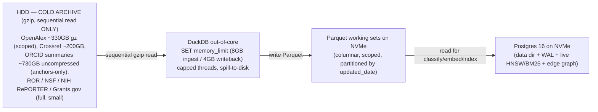
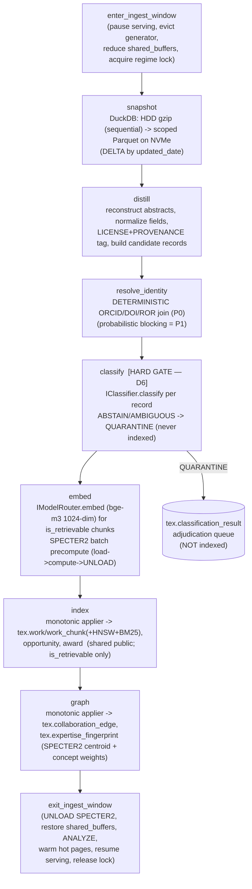

# 09 — Ingestion & Identity Resolution: Low-Level Design

> **What this document is.** The concrete, build-it-from-this design for the **batch ingestion
> pipeline** and the **expertise-graph build** of TigerExchange (single-Orin edition). It covers the
> Dagster DAGs (`snapshot → distill → classify[HARD gate] → embed → index → graph`), the
> transactional-outbox sensor that wakes the write-back job, the DuckDB out-of-core load of scoped
> OpenAlex/Crossref into Parquet on NVMe, the `updated_date` DELTA ingestion regime, the small
> full-source loaders (ROR / NSF / NIH RePORTER / Grants.gov) + ORCID anchors-only, the SPECTER2
> batch precompute-then-unload, the **deterministic** identity resolution (ORCID/DOI/ROR) of P0 with
> probabilistic blocking deferred to P1, the **monotonic applier** (`projection_version` vs
> `revocation_epoch`) that cannot resurrect a revoked or down-classified record, the two distinct
> grant feeds (OPPORTUNITIES vs AWARDS), license/provenance tagging with the commercial-OK gate, the
> **INGEST-WINDOW** memory regime (serving paused), and HDD sequential-read discipline.
>
> **Who reads this.** The builder. You implement `packages/mod-ingestion/tigerexchange_ingestion`
> (and the Dagster code location `services/dagster/tigerexchange_dagster`) against the frozen kernel
> Protocols. You DO NOT redefine kernel types, table DDL, or Pydantic models — those are owned by
> `05-kernel-contracts.md` and `13-data-model-and-schemas.md`; this doc references them by name.
>
> **Authority chain.** `_design-brief.json` (locked) → `CONVENTIONS-single-box.md` (this-file-wins
> pins) → `05-kernel-contracts.md` (frozen kernel shapes) → `13-data-model-and-schemas.md`
> (authoritative physical schema) → this document (ingestion behavior). When this doc and a spine doc
> disagree on a **name / type / DDL**, the spine doc wins. This doc owns only the *pipeline behavior*.
>
> **Decisions expanded here:** **D13** (tiered storage + three mutually-exclusive memory regimes),
> **D14** (corpus depth-within-tenant, scoped-at-ingest, OpenAlex quarterly-free + `updated_date`
> delta, two grant feeds, license gate). Also load-bearing: **D6** (classify-gates-index hard edge),
> **D8** (the retrieval surfaces these tables feed), **D12** (the write-back applier shares this
> exact monotonic-applier code), **D2** (federation honesty). Decision IDs are **D1..D14 only** — no
> other labels exist.
>
> **Cross-references.**
> `04-tech-stack-and-arm64-runbook.md` — DuckDB / SPECTER2 / `adapters` install on aarch64, the
> jetson-ai-lab wheel warning.
> `05-kernel-contracts.md` — `IClassifier`, `ClassificationResult`/`Decision`/`is_retrievable`,
> `PublishableProjection`, `IVectorStore`/`ILexicalIndex`/`IGraph`, `IModelRouter.embed`, `Tier`.
> `06-security-spine-lld.md` — the PEP/broker, the classification fail-closed edge, the durable
> revocation log this applier reads.
> `07-data-layer-and-retrieval-lld.md` — the two retrieval surfaces, RRF-in-SQL, HNSW/BM25 detail
> (ingestion *populates* them; that doc *queries* them).
> `08-ai-plane-and-model-router-lld.md` — the embedder process this pipeline calls; SPECTER2 is NOT
> served (ingest-only).
> `12-collaboration-loop-and-writeback-lld.md` — the write-back job that re-enters this same pipeline
> via the outbox sensor (Stage 5 of the loop).
> `13-data-model-and-schemas.md` — every table this pipeline writes (`work`, `work_chunk`,
> `opportunity`, `award`, `expertise_fingerprint`, `collaboration_edge`, `app_user`,
> `confidential_index_entry`, `classification_result`, `revocation_log`).

---

## 0. Table of contents

1. [Scope, non-goals, and the one-paragraph mental model](#1-scope-non-goals-and-the-one-paragraph-mental-model)
2. [The INGEST-WINDOW regime (serving paused) — the hard precondition](#2-the-ingest-window-regime-serving-paused--the-hard-precondition)
3. [HDD sequential-read discipline + storage placement](#3-hdd-sequential-read-discipline--storage-placement)
4. [Data sources: cadence, license, provenance, scoping (D14)](#4-data-sources-cadence-license-provenance-scoping-d14)
5. [DuckDB out-of-core: gzip-NDJSON → Parquet on NVMe](#5-duckdb-out-of-core-gzip-ndjson--parquet-on-nvme)
6. [The Dagster DAG: snapshot → distill → classify[HARD gate] → embed → index → graph](#6-the-dagster-dag-snapshot--distill--classifyhard-gate--embed--index--graph)
7. [The classify-gates-index HARD edge (D6)](#7-the-classify-gates-index-hard-edge-d6)
8. [SPECTER2 batch precompute-then-unload](#8-specter2-batch-precompute-then-unload)
9. [Deterministic identity resolution (ORCID/DOI/ROR), P0](#9-deterministic-identity-resolution-orciddoiror-p0)
10. [The expertise-graph build (edges + fingerprints)](#10-the-expertise-graph-build-edges--fingerprints)
11. [The monotonic applier (projection_version vs revocation_epoch)](#11-the-monotonic-applier-projection_version-vs-revocation_epoch)
12. [The transactional-outbox sensor](#12-the-transactional-outbox-sensor)
13. [Two distinct grant feeds (OPPORTUNITIES vs AWARDS)](#13-two-distinct-grant-feeds-opportunities-vs-awards)
14. [Config surface (verbatim)](#14-config-surface-verbatim)
15. [Acceptance tests (P0.7) + how to run](#15-acceptance-tests-p07--how-to-run)
16. [Failure modes, restartability, and forbidden patterns](#16-failure-modes-restartability-and-forbidden-patterns)
17. [Federation honesty for the ingest layer](#17-federation-honesty-for-the-ingest-layer)

---

## 1. Scope, non-goals, and the one-paragraph mental model

**Mental model.** Ingestion is a **controlled batch job that runs with serving paused** (the
INGEST-WINDOW regime, D13). It reads raw, gzip-compressed CC0/commercial-OK snapshots **sequentially**
off the spinning HDD, scopes them down with DuckDB (out-of-core, capped RAM) to one institution/topic
set, writes intermediate Parquet to the NVMe hot tier, then for each candidate record runs the
**fail-closed classification gate** *before* it is allowed to be embedded, indexed, or graphed
(D6 "classify-gates-index"). Only `ClassificationResult.is_retrievable == True` (i.e. `Decision.ALLOW`
**and** `Tier.PUBLIC`) records reach the **shared cross-tenant** index. Embedding uses the same
serve-time embedder the retrieval layer uses (bge-m3, 1024-dim) via `IModelRouter.embed`; the
citation-aware **SPECTER2** vectors for the expertise graph are computed by a **separate batch step
that loads SPECTER2 only inside the window then unloads it** (D8 — SPECTER2 is never serve-resident).
Identity is resolved **deterministically** by canonical IDs (ORCID, DOI, ROR) in P0; fuzzy/probabilistic
blocking is explicitly P1. Every write to a shared public table goes through the **monotonic applier**,
which compares the incoming `projection_version` against the object's current version **and** against
the latest `revocation_epoch` in `tex.revocation_log`, so a replay or write-back can never resurrect a
revoked or down-classified record (D12, anti-resurrection). The **same Dagster code location** also
hosts the **transactional-outbox sensor** that, on `proposal.outcome_recorded`, wakes the
semaphore-gated write-back job in the WRITEBACK-WINDOW regime (the loop write-back is documented in
`12`; this doc owns only the *shared ingestion machinery* it reuses).

**In scope (this doc):**

- The Dagster assets/ops for `snapshot → distill → classify → embed → index → graph`.
- DuckDB out-of-core config, scoping, Parquet layout on NVMe.
- The `updated_date` DELTA ingestion partition logic and the quarterly-free cadence schedule.
- The deterministic identity resolution (canonical-ID join only).
- The SPECTER2 batch-then-unload step.
- The monotonic applier (shared by ingestion AND write-back).
- The transactional-outbox sensor.
- License/provenance tagging and the commercial-OK fail-closed gate.
- The two grant feeds modeled distinctly.

**Out of scope (deliberately, with the doc that owns it):**

| Out of scope here | Owned by |
|---|---|
| The PEP decision order, broker internals, classification *engine* internals | `06` |
| The retrieval *query* path (RRF-in-SQL, rerank, ego-net traversal at query time) | `07` |
| The embedder/reranker/generator *process management* and the tier→locality guard | `08` |
| The write-back *business logic* (CO_PI_WITH edges, outcome-weighted signal, loop events) | `12` |
| Every table's DDL, RLS policy, Pydantic row model | `13` |
| The CRDT workspace, confidential drafting | `11` |
| Probabilistic identity resolution, HippoRAG2 PPR, suggesting-mode | **P1** (not built in P0) |

**Non-negotiable invariants this doc must uphold (any violation is a build failure):**

1. Ingestion runs **only** in the INGEST-WINDOW regime with **serving paused** (D13). Never silently
   concurrent with full serving.
2. **No record is embedded/indexed/graphed before classification** (D6). The classify op is a HARD
   gate, not a soft annotation.
3. Only `is_retrievable == True` records reach the **shared cross-tenant** sink.
4. **HDD reads are sequential only**; the HDD is never on a random-read hot path during ingest.
5. The monotonic applier is the **only** writer of shared public projections and is **idempotent and
   anti-resurrection**.
6. Identity resolution in P0 is **deterministic** (canonical-ID join). No fuzzy matching.
7. SPECTER2 is loaded **only** inside the window and **unloaded** before serving resumes.
8. `dagster>=1.8,<2`, Python 3.11 (NOT 3.12), `grants_gov` enum verbatim, create-if-absent only.

---

## 2. The INGEST-WINDOW regime (serving paused) — the hard precondition

Per **D13** and the brief `memory_budget`, the box runs in **exactly one** of three mutually-exclusive
memory regimes at a time. Bulk ingestion runs in **INGEST-WINDOW**, with interactive serving **paused**
and the 30B generator **evicted or idle**. This is a *precondition* the pipeline must assert before it
touches DuckDB, not a best-effort hope.

### 2.1 The INGEST-WINDOW budget (from `memory_budget`, do not exceed)

| Line item | Approx | Note |
|---|---|---|
| OS + L4T + CUDA drivers + headroom | ~7 GB | always present |
| Generator (Qwen3-30B-A3B) | **0 GB** (evicted) / ~17 GB (idle-resident, quick window) | **evicted is the default for a full ingest** |
| DuckDB out-of-core | **~8 GB** | `SET memory_limit='8GB'` + capped threads — **explicitly set** |
| SPECTER2 batch (base + proximity adapter) | ~1.5 GB | loaded **only here**, unloaded after |
| Embedder process (bge-m3, for chunk embeddings) | ~2.5 GB | the same embedder the serve path uses |
| Postgres (REDUCED `shared_buffers` during bulk load + writer backends) | ~6 GB | reduce `shared_buffers` for the window, restore after |
| **INGEST TOTAL (generator evicted)** | **~25 GB** | huge margin under 64 GB |
| INGEST TOTAL (generator idle-resident) | ~42 GB | still fits, for a quick window |

> **Rationale (chosen over alternatives).** We pause serving during bulk ingest rather than run
> ingest concurrently because the prior "headroom" figure that allowed concurrency was
> **triple-counted** (burst + DuckDB spill + a now-eliminated second vLLM). A serving-paused window
> makes the budget provably fit (`~25 GB` evicted) and removes all RAM-contention races. Rejected
> alternative: a permanent low-priority background ingest competing with serving — on a 64 GB unified
> pool that is exactly the contention the regime model exists to kill.

### 2.2 Regime entry/exit protocol (the builder MUST implement this around the DAG)

```
INGEST-WINDOW entry (a Dagster op `enter_ingest_window`, runs FIRST in the job):
  1. Acquire the global box-regime lock (a Postgres advisory lock or a file lock at
     data/.regime.lock) so SERVE and WRITEBACK cannot run concurrently.
  2. Drain + pause interactive serving:
       - signal the API to stop accepting interactive generation (503 / maintenance flag),
       - request the generator process to EVICT weights (or leave idle if the window is short).
  3. ALTER SYSTEM-equivalent: reduce Postgres shared_buffers for the window
     (apply at session/pool level; do NOT require a restart — use a dedicated maintenance pool).
  4. Assert free unified memory >= INGEST budget headroom before proceeding; abort the window if not.

INGEST-WINDOW exit (an op `exit_ingest_window`, runs LAST, ALWAYS, even on failure):
  1. UNLOAD SPECTER2 (free ~1.5GB) — assert it is unloaded.
  2. Restore Postgres shared_buffers, ANALYZE the freshly-written tables (planner stats).
  3. Warm the HNSW/BM25 hot pages for the indexes that changed (sequential prefetch from NVMe).
  4. Re-enable interactive serving; reload the generator if it was evicted.
  5. Release the box-regime lock.
```

> **`exit_ingest_window` must run on failure too.** Implement it as a Dagster `op` wired so the job's
> teardown always invokes it (a sensor-driven cleanup or a `try/finally` in the launching code).
> Leaving SPECTER2 resident or `shared_buffers` reduced after a crash would silently degrade the next
> SERVE regime. There is an acceptance check that the post-window resident set returns to the SERVE
> budget (`<= ~49GB`, see `CONVENTIONS-single-box.md` §7 startup assertions).

### 2.3 The WRITEBACK-WINDOW is a different regime (do not conflate)

The write-back enrichment (D12, `12`) runs in **WRITEBACK-WINDOW**: SERVE baseline `~49GB` + a
**semaphore-gated, capped** DuckDB (`SET memory_limit='4GB'`) + SPECTER2 reload (~1.5GB) = `~54.5GB`,
**without** pausing serving — the semaphore yields to interactive generation. The ingestion DAG and
the write-back job **share the same ops and the same monotonic applier**, but they enter **different
regimes**. The builder distinguishes them by a job parameter `regime: Literal["ingest", "writeback"]`
that sets the DuckDB `memory_limit` (8GB vs 4GB) and whether serving is paused (ingest = paused,
writeback = semaphore-gated). See [§14](#14-config-surface-verbatim).

---

## 3. HDD sequential-read discipline + storage placement

**D13** pins three tiers. Ingestion is the *only* subsystem that touches the HDD, and it touches it
**sequentially only**.



**Rules (pinned):**

- **HDD = cold archive only.** Raw snapshots stay gzip-compressed on the HDD. DuckDB reads them
  **sequentially** (a full scan of a gzip-NDJSON file is sequential I/O — fine on a spinning disk). We
  **never** seek randomly into the HDD during ingest, and **never** serve a live index off the HDD
  (HNSW off HDD = 10s+ queries; D8/D13 guardrail).
- **NVMe = hot tier.** Intermediate Parquet, the Postgres data dir + WAL, and every live
  vector/BM25/graph index (shared **and** per-tenant confidential tablespaces) live on the NVMe
  (`PCIe Gen4 M.2`, **effectively mandatory in BOM** — see `open_risks`). If NVMe is genuinely absent,
  the documented fallback is to force the entire hot tier into RAM via `shared_buffers` and cap corpus
  scope so the working set fits — accepting a smaller corpus (open_risks mitigation).
- **RAM = transient** working set, model weights (only the embedder + SPECTER2 in this window),
  DuckDB hash/sort buffers (capped), index hot pages.
- **The authz/RLS hot path never incurs HDD random seeks** — but that path is *not* exercised during
  the serving-paused ingest window anyway.

**Directory layout on the NVMe hot tier (illustrative; pin exact paths in config):**

```
/mnt/nvme/tex/
├── pg/                      # Postgres data dir + WAL
├── parquet/                 # DuckDB-produced working sets
│   ├── openalex/updated_date=2026-01-01/part-*.parquet
│   ├── crossref/...
│   ├── grants_gov/...       # opportunities
│   ├── nih_reporter/...     # awards
│   ├── nsf_awards/...       # awards
│   ├── ror/...
│   └── orcid_anchors/...
└── enc/                     # per-tenant LUKS-mounted dirs for confidential tablespaces (D7, P0.4b)
    └── <tenant>/            # ts_conf_<tenant> lives here

/mnt/hdd/tex/raw/            # COLD ARCHIVE (gzip), sequential read only
├── openalex/2026-Q1/*.gz
├── crossref/*.gz
├── orcid/summaries.tar.gz
├── ror/ror-data.json.gz
├── grants_gov/GrantsDBExtract*.zip
├── nih_reporter/*.csv.gz
└── nsf_awards/*.zip
```

---

## 4. Data sources: cadence, license, provenance, scoping (D14)

### 4.1 The source enum (verbatim — `13` §0.8, `CONVENTIONS` §8.1)

Every ingested public entity carries `source` drawn from the native enum `tex.corpus_source`. Use the
**exact** spellings; do not invent variants.

```
'openalex' | 'crossref' | 'orcid' | 'ror' | 'grants_gov' |
'nih_reporter' | 'nsf_awards' | 'pmc' | 'in_platform_writeback'
```

> `grants_gov` is **snake_case lowercase**, NOT `grants.gov` / `GrantsGov` / `grantsgov` (D14,
> `CONVENTIONS` §8.1). `in_platform_writeback` is the source the write-back edge (D12) stamps on WORK
> nodes produced by a won proposal.

### 4.2 OpenAlex cadence + DELTA ingestion (D14) — with the verification flag

| Aspect | Pinned value | Why |
|---|---|---|
| **Free snapshot cadence** | **QUARTERLY** | Per the locked brief D14 (re-verified against OpenAlex docs, 2026). Monthly snapshots + daily changefiles require a **PAID** plan. The default refresh DAG schedule is the quarterly free cadence. |
| **Ingestion mode** | **DELTA, partitioned by `updated_date`** | Download/process only **new** `updated_date` partitions, NEVER a full re-ingest. This is the load-bearing instruction and holds regardless of cadence. |

> **⚠ VERIFICATION FLAG (a human confirms before launch).** Sources disagree on the current OpenAlex
> *free* cadence: the locked brief D14 says **quarterly free (monthly = paid)**; an earlier critique
> pass asserted **monthly free**. This doc follows the brief: **quarterly free**. Build the pipeline
> **delta-by-`updated_date`** so switching cadence is a **schedule change, not a code change**. If
> monthly freshness turns out to be required, budget the **paid** OpenAlex tier explicitly (D14
> consequence). A human must verify the live cadence against the OpenAlex docs and update only the
> Dagster schedule. (See `CONVENTIONS-single-box.md` §8.3.)

**DELTA logic (the load-bearing part).** OpenAlex records carry an `updated_date`. The pipeline keeps
a small **ingest-state table** of the high-water mark per source. On each run it processes only
partitions whose `updated_date` exceeds the last successfully-applied watermark:

```python
# packages/mod-ingestion/tigerexchange_ingestion/state.py  (shape; row model lives with the DAG, not the kernel)
from __future__ import annotations
import datetime as dt
from pydantic import BaseModel, ConfigDict

class IngestWatermark(BaseModel):
    """Per-source high-water mark for DELTA ingestion. Stored in a small ingest_state table
    on NVMe Postgres (NOT a kernel type; ingestion-internal)."""
    model_config = ConfigDict(frozen=True)

    source: str                      # tex.corpus_source value, e.g. "openalex"
    last_updated_date: dt.date       # highest updated_date partition fully applied
    last_run_id: str                 # Dagster run id that advanced it
    applied_at: dt.datetime
```

The watermark advances **only after** the monotonic applier has committed every record of a partition
(at-least-once + idempotent applier = effectively-once; see [§11](#11-the-monotonic-applier-projection_version-vs-revocation_epoch)).
If a run dies mid-partition, the watermark does not advance and the next run **re-reads that partition
sequentially** — the applier no-ops the already-applied rows.

### 4.3 The full set of sources (D14, `memory_budget` data-placement)

| Source | `source` enum | Mode | Approx cold size (HDD gz) | What we keep |
|---|---|---|---|---|
| OpenAlex | `openalex` | **scoped + delta** | ~330 GB gz (scoped down by ROR/topic) | works, authorships, topics, DOIs |
| Crossref | `crossref` | scoped (Academic Torrents) | ~200 GB | DOI metadata, references for the citation edges |
| ORCID | `orcid` | **anchors-only** | ~730 GB uncompressed summaries | canonical ORCID iD + name variants ONLY (NOT full profiles) |
| ROR | `ror` | **full** (small) | small | institution registry — the scoping key + affiliations |
| NSF Awards | `nsf_awards` | **full** (small) | small | **AWARDS** feed |
| NIH RePORTER | `nih_reporter` | **full** (small) | small | **AWARDS** feed |
| Grants.gov | `grants_gov` | **full** (daily XML extract) | small | **OPPORTUNITIES** feed (top-of-loop trigger) |
| PMC (commercial subset) | `pmc` | **fail-closed gate** | varies | only the "Commercial Use Allowed" subset (full text) |

> **ORCID anchors-only (D14).** We ingest **only** the canonical ORCID iD + `name_variants` from the
> ORCID summaries — not full profiles. ORCID is the **identity anchor** for deterministic resolution
> ([§9](#9-deterministic-identity-resolution-orciddoiror-p0)), not a content source. Rationale: the
> moat is depth-within-tenant, not a mirror of ORCID; pulling full profiles wastes HDD and adds no
> retrieval value. Rejected alternative: ingest full ORCID works/affiliations — redundant with
> OpenAlex/Crossref and inflates the cold archive.

### 4.4 Corpus scoping (D14) — depth, not breadth

Public ingestion is **scoped AT INGEST** by a chosen **ROR institution set and/or topic** via DuckDB —
**NOT a full-world ingest**. The scope set lives in config ([§14](#14-config-surface-verbatim)); DuckDB
filters the OpenAlex/Crossref scans down to records whose `authorships[].institutions[].ror` is in the
scope set OR whose `topics` intersect the scope topics.

> **Rationale (D14, chosen over alternatives).** We cannot win the breadth game on one HDD-bound box
> vs cloud-scale incumbents (Pivot-RP 3.6M profiles, WoS-RI). A deep, confidential, tenant-private
> corpus that grounds drafting is the #1 confirmed gap in every grant-AI tool. Rejected: mirroring
> Pivot-RP/WoS-scale corpora locally (infeasible on HDD/single box); a generic LLM with no corpus
> grounding (commodity baseline).

### 4.5 License / provenance tagging + the commercial-OK gate (D14, open_risks "license")

Every ingested entity carries a **provenance** (JSONB on the row, see `tex.work.provenance` in `13`)
and a **license** tag (`tex.work.license`). The commercial-use gate is **fail-closed**:

```
LICENSE GATE (runs in the `classify` op, before is_retrievable can be True):
  - OpenAlex / Crossref metadata: CC0 / metadata-open -> allowed (public-tier).
  - PMC FULL TEXT: ingest ONLY the "Commercial Use Allowed" subset.
        * If the article's license is NC-only (non-commercial), DROP it (Decision.DENY,
          compliance_flag "license_nc_only"). NEVER index NC content into a feature that could
          be used commercially.
  - ODC-BY derived data (e.g. any S2/SPECTER2-adjacent derivative): store the ODC-BY ATTRIBUTION
    STRING with the derived data in provenance.attribution.
  - UNKNOWN / MISSING license -> FAIL CLOSED: treat as NOT commercial-OK -> Decision.QUARANTINE
    (never silently allow).
```

> **Provenance record shape (illustrative — stored in the `provenance` JSONB, `13` §5):**
> ```json
> {
>   "source": "openalex",
>   "source_url": "https://openalex.org/W...",
>   "snapshot_id": "openalex-2026-Q1",
>   "updated_date": "2026-01-14",
>   "ingest_run_id": "dagster-run-...",
>   "license": "CC0",
>   "attribution": null
> }
> ```
> Rationale (open_risks "license contamination"): a per-record provenance+license tag plus the
> fail-closed commercial gate is the structural defense against "a non-commercial PMC article reaches
> a commercial feature". Classification + RLS + the separate confidential surface keep confidential
> drafts physically separate from the public CC0 corpus. Rejected alternative: trusting an upstream
> "is_oa" flag without recording the license string — leaves no audit trail and no way to prove the
> commercial gate held.

---

## 5. DuckDB out-of-core: gzip-NDJSON → Parquet on NVMe

DuckDB is the bulk-transform engine (CONVENTIONS §5 pin; D13/D14). It is **native aarch64**, reads
gzip NDJSON natively, and **spills to disk**, so it processes the >RAM OpenAlex/Crossref sets on a
64 GB box without loading them into RAM.

### 5.1 Mandatory DuckDB session config (verbatim — set these EXPLICITLY every time)

```python
# packages/mod-ingestion/tigerexchange_ingestion/duck.py
from __future__ import annotations
import duckdb
from pathlib import Path

def open_ingest_duckdb(*, regime: str, threads: int, temp_dir: Path) -> duckdb.DuckDBPyConnection:
    """Open a DuckDB connection configured for out-of-core ingest. CAPS are mandatory (D13).

    regime: "ingest" -> 8GB memory_limit; "writeback" -> 4GB memory_limit.
    threads: CAPPED explicitly (e.g. 4) so DuckDB does not saturate the box during the window.
    temp_dir: spill directory ON NVME (never the HDD).
    """
    mem = "8GB" if regime == "ingest" else "4GB"
    con = duckdb.connect()                       # in-process, no server
    con.execute(f"SET memory_limit='{mem}';")    # <-- D13: CAPPED, EXPLICIT. Never leave default.
    con.execute(f"SET threads={threads};")       # <-- CAPPED, EXPLICIT.
    con.execute(f"SET temp_directory='{temp_dir}';")  # spill to NVMe, NOT the HDD
    con.execute("SET preserve_insertion_order=false;")  # lower memory for large scans
    con.execute("SET enable_progress_bar=false;")
    return con
```

> **Why the caps are mandatory (D13).** DuckDB still wants several GB of working RAM for hash joins
> and sorts. If `memory_limit` is left at its default (a fraction of total RAM), a big OpenAlex join
> can balloon and collide with Postgres/embedder in the unified pool. We pin `8GB` (ingest) / `4GB`
> (writeback) so the regime budget in [§2.1](#21-the-ingest-window-budget-from-memory_budget-do-not-exceed)
> provably holds. `threads` is capped (e.g. 4) for the same reason. The spill directory is **on NVMe**
> — spilling to the HDD would reintroduce random I/O. Rejected alternatives: Spark (heavy, JVM,
> overkill for one box); Pandas (won't fit >RAM); hand-rolled streamers (reinvents DuckDB's
> spill-to-disk).

### 5.2 The scoped OpenAlex transform (verbatim shape)

DuckDB reads the gzip-NDJSON **sequentially** off the HDD, filters to the ROR/topic scope, projects the
columns we keep, and writes partitioned Parquet to NVMe:

```sql
-- Runs inside the `snapshot` op for source=openalex. Reads HDD gzip sequentially; writes NVMe Parquet.
-- :scope_rors and :scope_topics are bound LISTs from config (D14 scoping).
COPY (
    SELECT
        w.id                              AS openalex_id,
        w.doi                             AS doi,
        w.title                           AS title,
        w.abstract_inverted_index         AS abstract_iidx,   -- reconstructed downstream
        w.publication_year                AS year,
        w.updated_date                    AS updated_date,     -- DELTA partition key
        list_transform(w.topics, t -> t.display_name) AS topics,
        w.primary_location.source.display_name          AS venue,
        list_transform(w.authorships, a -> a.author.orcid)          AS author_orcids,
        list_transform(w.authorships, a -> a.institutions[1].ror)   AS author_rors,
        'openalex'                        AS source
    FROM read_ndjson_auto('/mnt/hdd/tex/raw/openalex/2026-Q1/*.gz', ignore_errors=true) w
    WHERE
        -- SCOPE at ingest (D14): keep only records touching the institution/topic scope.
        list_bool_or(list_transform(w.authorships,
                     a -> a.institutions[1].ror IN (SELECT UNNEST(:scope_rors))))
        OR list_bool_or(list_transform(w.topics,
                     t -> t.display_name IN (SELECT UNNEST(:scope_topics))))
)
TO '/mnt/nvme/tex/parquet/openalex'
   (FORMAT parquet, PARTITION_BY (updated_date), OVERWRITE_OR_IGNORE false);
```

> **`OVERWRITE_OR_IGNORE false` + create-if-absent.** We never overwrite an existing partition
> blindly (CONVENTIONS §9: create-if-absent, never recreate). A re-run of an already-written
> `updated_date` partition is a no-op at the applier level; we do not destructively rewrite Parquet.
> If a partition must be re-derived (e.g. a corrected snapshot), that is an explicit, logged operation,
> not a pipeline default.

> **Abstract reconstruction.** OpenAlex ships abstracts as an inverted index
> (`abstract_inverted_index`). Reconstruct the plain-text abstract in the `distill` op (Python), not in
> DuckDB SQL, to keep the SQL scan cheap.

### 5.3 Why Parquet as the intermediate (chosen over going straight to Postgres)

We land a **columnar Parquet working set on NVMe** between DuckDB and Postgres rather than streaming
straight into Postgres rows. Rationale: (1) the classify gate, license gate, and identity resolution
operate over the projected columns far cheaper on Parquet than on a partially-loaded Postgres table;
(2) Parquet partitions by `updated_date` are the natural DELTA unit; (3) a failed `embed`/`index` step
can be retried from Parquet without re-reading the HDD. Rejected alternative: DuckDB → Postgres
`COPY` directly — couples the slow gzip scan to the index write and loses the cheap re-try point.

---

## 6. The Dagster DAG: snapshot → distill → classify[HARD gate] → embed → index → graph

The pipeline is a **Dagster** asset/op DAG (`dagster>=1.8,<2`, CONVENTIONS §7) living in the
`services/dagster/tigerexchange_dagster` code location, calling into
`packages/mod-ingestion/tigerexchange_ingestion`. The same code location hosts the outbox sensor
([§12](#12-the-transactional-outbox-sensor)).



### 6.1 Op-by-op responsibilities

| Op | Reads | Writes | Calls | Key rule |
|---|---|---|---|---|
| `enter_ingest_window` | regime lock | maintenance flag | API pause, generator evict | [§2.2](#22-regime-entryexit-protocol-the-builder-must-implement-this-around-the-dag) |
| `snapshot` | HDD gzip (sequential) | NVMe Parquet (partition by `updated_date`) | DuckDB | DELTA only; capped DuckDB |
| `distill` | NVMe Parquet | NVMe Parquet (candidate records) | Python | reconstruct abstract; **license+provenance tag**; chunk text (section-aware, parent/child — see `07`) |
| `resolve_identity` | candidate records + `tex.app_user` (ORCID anchors) | resolved `subject_id`/`work_id`/`org_ror` | Postgres | **deterministic only** (§9) |
| `classify` | candidate records | `tex.classification_result` (incl. QUARANTINE) | `IClassifier.classify` | **HARD gate** (§7); fail-closed |
| `embed` | `is_retrievable` records | embeddings (bge-m3 1024-dim) + SPECTER2 centroids (768-dim) | `IModelRouter.embed`; SPECTER2 batch | SPECTER2 load→compute→**unload** (§8) |
| `index` | embedded `is_retrievable` records | `tex.work`, `tex.work_chunk`, `tex.opportunity`, `tex.award` | monotonic applier | **only `is_retrievable`** reaches shared sink (§7, §11) |
| `graph` | resolved + embedded records | `tex.collaboration_edge`, `tex.expertise_fingerprint` | monotonic applier | edges from co-authorship/citation/affiliation/co-funding (§10) |
| `exit_ingest_window` | — | restore state | UNLOAD SPECTER2, resume serving | always runs, even on failure |

### 6.2 Asset materialization vs ops — what to use

- Use **Dagster assets** for the durable, queryable outputs (`work`, `work_chunk`, `opportunity`,
  `award`, `expertise_fingerprint`, `collaboration_edge`) so Dagster tracks lineage and lets you
  re-materialize a single downstream asset (e.g. re-run `graph` from the existing Parquet without
  re-scanning the HDD). Rationale: Dagster's asset lineage is exactly the "resume from distill"
  ergonomics the runner needs; ad-hoc cron has no lineage (D12 rationale, chosen over cron/Temporal).
- Use **ops** for the regime-control steps (`enter_ingest_window`, `exit_ingest_window`) and the
  classify/embed gates, which are control-flow, not durable assets.
- Partition the corpus assets by `updated_date` (Dagster `DailyPartitionsDefinition` or a static
  partition per snapshot quarter) so DELTA ingestion maps to materializing only new partitions.

### 6.3 The Dagster job + schedule (shape)

```python
# services/dagster/tigerexchange_dagster/jobs.py  (shape; pin exact resource wiring per 04/14 runbook)
from dagster import job, op, schedule, In, Out, Nothing
# ops imported from tigerexchange_ingestion ...

@job
def public_ingest_job():
    # The order is fixed: window guard wraps the classify-gates-index chain.
    ready = enter_ingest_window()
    parquet = snapshot(ready)
    candidates = distill(parquet)
    resolved = resolve_identity(candidates)
    classified = classify(resolved)          # HARD gate
    embedded = embed(classified)
    indexed = index(embedded)                # is_retrievable only
    graphed = graph(indexed)
    exit_ingest_window(graphed)              # ALWAYS via job teardown too

@schedule(cron_schedule="0 3 1 */3 *", job=public_ingest_job)  # quarterly free cadence (D14); human-verifiable
def quarterly_openalex_refresh(_context):
    return {}
```

> **Schedule note.** `0 3 1 */3 *` = 03:00 on the 1st of every 3rd month (quarterly), the **free**
> OpenAlex cadence (D14). The small full sources (Grants.gov daily, ROR/NSF/NIH periodic) get their
> own lighter schedules — Grants.gov **opportunities** especially are the top-of-loop trigger and run
> more frequently ([§13](#13-two-distinct-grant-feeds-opportunities-vs-awards)). Changing the
> OpenAlex cadence (if a human confirms monthly-free or buys the paid tier) is a **schedule edit
> only** because the pipeline is delta-by-`updated_date`.

---

## 7. The classify-gates-index HARD edge (D6)

This is the single most security-load-bearing rule in the pipeline. **A record is classified BEFORE
it can be embedded, indexed, or graphed.** The `classify` op sits *between* `resolve_identity` and
`embed`, and `embed`/`index`/`graph` receive **only** the records the gate let through.

### 7.1 The gate (verbatim shape)

```python
# packages/mod-ingestion/tigerexchange_ingestion/classify_gate.py
from __future__ import annotations
from collections.abc import Sequence
from tigerexchange_contracts import IClassifier, ClassificationResult, Decision, Tier

async def classify_gate(
    *,
    classifier: IClassifier,
    records: Sequence["CandidateRecord"],   # ingestion-internal candidate model
    tenant_id: str,
) -> tuple[list["CandidateRecord"], list[ClassificationResult]]:
    """Run the fail-closed classifier on every candidate. Return ONLY the records whose
    ClassificationResult.is_retrievable is True (Decision.ALLOW AND Tier.PUBLIC) for the
    SHARED-index path; persist ALL results (incl. QUARANTINE) to tex.classification_result.

    Fail-closed: any classifier error/abstain -> QUARANTINE (treated confidential), NEVER indexed.
    """
    passed: list[CandidateRecord] = []
    results: list[ClassificationResult] = []
    for rec in records:
        try:
            res = await classifier.classify(
                content=rec.classification_text,
                declared_tier=rec.declared_tier,    # None for public-corpus ingest
                tenant_id=tenant_id,
            )
        except Exception:                            # ANY error -> fail closed
            res = ClassificationResult.quarantined(reason_code="classifier_error")
        results.append(res)
        if res.is_retrievable:                       # == (decision==ALLOW and tier==PUBLIC)
            passed.append(rec)
        # else: QUARANTINE/DENY -> persisted to the adjudication queue, NOT passed downstream.
    return passed, results
```

### 7.2 Rules baked into the gate

1. **Only `is_retrievable == True` reaches the shared sink.** `is_retrievable` is the kernel property
   `decision == Decision.ALLOW AND tier == Tier.PUBLIC` (`05` §6.1). A `private`/`confidential` record
   is never retrievable on the **shared** surface even if `ALLOW`. (Confidential own-tenant content
   reaches the **per-tenant confidential surface** by a *different* path — the workspace, `11`/`12` —
   not via this public-ingest gate.)
2. **Abstain/ambiguous/low-confidence → QUARANTINE.** Unclassified = treated confidential. The
   quarantined record goes to the human adjudication queue (`tex.classification_result` with
   `decision='QUARANTINE'`, `adjudicated=false`) and is **never** indexed. P0 walking-skeleton is
   **binary allow/quarantine** (`DENY` exists in the model and is used for the hard license deny in
   [§4.5](#45-license--provenance-tagging--the-commercial-ok-gate-d14-open_risks-license) but P0
   primarily emits ALLOW/QUARANTINE).
3. **The license gate participates here.** A PMC NC-only article is `Decision.DENY`
   (`compliance_flag="license_nc_only"`); an unknown license is `QUARANTINE` (fail-closed).
4. **The classification engine is NOT imported by feature modules.** The ingestion pipeline invokes
   `IClassifier` (the kernel Protocol); modules never reach into the classifier (CONVENTIONS §4 rule 4,
   D6). The classifier *implementation* lives behind the Protocol (built in P0.3, see `06`).
5. **The DB `CHECK` is the backstop.** `tex.classification_result` carries
   `CHECK (is_retrievable = (decision = 'ALLOW' AND tier = 'public'))` (`13` §14), so a builder cannot
   persist a quarantined record marked retrievable. The pipeline must compute `is_retrievable` from the
   kernel property, never set it independently.

> **Rationale (D6, chosen over alternatives).** Structural fail-closed classification at the SHARED
> edge is the only way to guarantee confidential/quarantined content cannot become cross-tenant
> visible. Rejected: query-time post-filtering of one shared index (leaves the content physically
> present = standing breach); classifier fail-open on low confidence (violates fail-closed); making the
> classify step a soft annotation downstream of embed/index (would index-then-maybe-delete, a race a
> 30B builder gets wrong). The HUMAN-authored **zero-leak adversarial classifier** test (P0.3) asserts
> a quarantined record reaches **no** shared sink.

---

## 8. SPECTER2 batch precompute-then-unload

SPECTER2 is the **citation-aware** embedding space that powers the expertise-graph similarity axis
(`tex.expertise_fingerprint.specter2_centroid`, 768-dim, `13` §16). Per **D8** and the brief
`tech_stack`, SPECTER2 is **INGEST-ONLY**: loaded inside the window, used to precompute centroids, then
**unloaded** before serving resumes. It is **never** serve-resident and **never** served by vLLM
pooling.

### 8.1 What SPECTER2 is (and is NOT)

- It is **SPECTER2 base + the PROXIMITY adapter** loaded via the `adapters` (adapter-transformers)
  library on the SM 8.7 PyTorch wheel from the jetson-ai-lab index (`04`). It is an adapter on SciBERT
  (bert-base), **dim 768**.
- It is **NOT** a drop-in sentence-transformers model, and it is **NOT** the serve-time retriever
  embedder. The serve-time embedder is **bge-m3 (1024-dim)** via `IModelRouter.embed` (`08`).
- Two distinct vector spaces, two distinct columns, two distinct tables: bge-m3 1024-dim in
  `tex.work_chunk.embedding`; SPECTER2 768-dim in `tex.expertise_fingerprint.specter2_centroid`. **Do
  not conflate them** (`13` §16 note).

### 8.2 The batch step (verbatim shape)

```python
# packages/mod-ingestion/tigerexchange_ingestion/specter2.py
from __future__ import annotations
from collections.abc import Sequence

class Specter2Batch:
    """Loads SPECTER2 base + proximity adapter ONLY for the duration of the ingest window,
    computes paper-similarity / expertise centroid vectors, then UNLOADS. ~1.5GB while loaded;
    ~0GB at serve (D8). NEVER served by vLLM."""

    def __init__(self, *, device: str = "cuda") -> None:
        self._device = device
        self._model = None  # lazily loaded; assert SM 8.7 CUDA at load (see CONVENTIONS §7)

    def load(self) -> None:
        # adapters library: AutoModel + load proximity adapter on the SciBERT base.
        # Assert torch reports SM 8.7 CUDA here (the #1 Jetson failure mode is silent CPU fallback).
        ...

    def embed_papers(self, texts: Sequence[str]) -> list[list[float]]:
        # returns 768-dim SPECTER2 vectors (title+abstract concatenated per SPECTER2 input spec)
        ...

    def unload(self) -> None:
        # free GPU memory and drop the Python refs; assert the ~1.5GB is released.
        # MUST be called in exit_ingest_window even on failure.
        ...
```

### 8.3 Where it runs and the unload guarantee

- SPECTER2 runs **inside `embed`**, after the bge-m3 chunk embeddings, batched over the
  `is_retrievable` works that need a fingerprint update.
- `embed` calls `Specter2Batch.load()` once, processes all batches, then `unload()`. The
  `exit_ingest_window` op **also** asserts SPECTER2 is unloaded (belt-and-suspenders) so a crash inside
  `embed` cannot leave it resident into SERVE.
- Its **~1.5 GB footprint appears ONLY in the INGEST-WINDOW (and WRITEBACK-WINDOW) budget**, never
  SERVE (`memory_budget`).

> **Rationale (D8, chosen over alternatives).** SPECTER2 beats general models on citation-proximity,
> directly powering collaborator discovery, but it is a **required second embedding space** the budget
> must account for. Precomputing at ingest then unloading is the right call on this box — a resident
> second embedding space wastes RAM the generator needs. Rejected: serving SPECTER2 resident (a second
> embedding space at serve = FORBIDDEN, CONVENTIONS §6); serving it via vLLM pooling (it is an adapter
> on SciBERT, not a pooling model vLLM can host). **Fallback** (open_risks): if the `adapters` library
> is troublesome on aarch64, use **bge-m3** embeddings for the similarity axis at reduced
> citation-precision and make SPECTER2 a **P1** enhancement — keep the
> `tex.expertise_fingerprint.specter2_centroid` column populated from bge-m3 in that case (dimension
> change must be pinned in CONVENTIONS if you do).

---

## 9. Deterministic identity resolution (ORCID/DOI/ROR), P0

P0 identity resolution is **purely deterministic** — a join on canonical identifiers. **Probabilistic
blocking / fuzzy matching is explicitly P1** and NOT built in P0.

### 9.1 The three canonical anchors

| Entity | Canonical anchor | Resolution rule (P0) |
|---|---|---|
| Researcher | **ORCID iD** (`0000-0000-0000-0000`) | exact match on normalized ORCID → existing `tex.app_user.orcid_id` / graph `subject_id`. No ORCID → leave `orcid_id` NULL, do **not** guess. |
| Work / Paper | **DOI** | exact match on normalized DOI → `tex.work.doi` (UNIQUE). No DOI → `work_id` is content-keyed but **not** merged with any other record. |
| Institution | **ROR** | exact match on ROR id → the scope set / `tex.award.org_ror` / authorship affiliation. |

### 9.2 The resolution op (verbatim shape)

```python
# packages/mod-ingestion/tigerexchange_ingestion/identity.py
from __future__ import annotations
import re

ORCID_RE = re.compile(r"^\d{4}-\d{4}-\d{4}-\d{3}[\dX]$")

def normalize_orcid(raw: str | None) -> str | None:
    """Strip any https://orcid.org/ prefix, uppercase the checksum X, validate the 16-digit form.
    Return None if it is not a well-formed ORCID (NEVER fabricate one)."""
    if not raw:
        return None
    s = raw.strip().rsplit("/", 1)[-1].upper()
    return s if ORCID_RE.match(s) else None

def normalize_doi(raw: str | None) -> str | None:
    """Lowercase, strip doi.org prefix and 'doi:' scheme. Return None if absent."""
    if not raw:
        return None
    s = raw.strip().lower()
    for pfx in ("https://doi.org/", "http://doi.org/", "doi:"):
        if s.startswith(pfx):
            s = s[len(pfx):]
    return s or None

# Resolution = a Postgres join on the normalized canonical key. NO fuzzy matching in P0.
#   Researcher: SELECT subject_id FROM tex.app_user WHERE orcid_id = :orcid   (exact)
#   Work:       INSERT ... ON CONFLICT (doi) DO NOTHING   (DOI is UNIQUE in tex.work)
#   Org:        ROR id used directly as the affiliation/scope key.
```

### 9.3 The deliberate P0/P1 split

- **P0 (built):** ORCID/DOI/ROR exact-match joins. A record with no canonical anchor is **not merged**
  with any other record (it stands alone, or is quarantined if it cannot be attributed) — we accept
  some duplication rather than risk a false merge.
- **P1 (deferred, NOT built):** probabilistic blocking — name-variant matching, affiliation+name
  blocking, author disambiguation across name spellings. The `tex.app_user.name_variants` TEXT[]
  column already exists (`13` §2) so P1 can populate it without a schema change, but **no fuzzy logic
  ships in P0**.

> **Rationale (D14 consequence, chosen over alternatives).** Deterministic canonical-ID resolution is
> correct, auditable, and cannot silently merge two different researchers — a false merge would
> attribute one person's confidential collaboration history to another, a privacy and correctness
> failure. A 30B builder cannot be trusted to tune a probabilistic blocker's thresholds safely in P0.
> Rejected: shipping fuzzy matching in P0 (false-merge risk + thresholds the builder would mis-tune);
> assuming every record has an ORCID/DOI (it won't — leave NULL, never fabricate).

---

## 10. The expertise-graph build (edges + fingerprints)

The `graph` op builds the **deterministic metadata-backbone edge table** (D8 retrieval_design) and the
**expertise fingerprints** — the *living* signal the write-back edge later mutates (D12). There is **no
recurring LLM entity-extraction tax**: edges come from corpus metadata, not from an LLM
extraction pass. This same graph **is** the collaborator-discovery product surface (`mod-discovery`,
`10`).

### 10.1 Edges written to `tex.collaboration_edge` (`13` §17)

| `edge_type` (enum `tex.edge_type`) | Derived from | Direction / weight |
|---|---|---|
| `co_authored` | two ORCID-resolved authors on the same `tex.work` | undirected pair; weight ↑ with shared works, time-decayed |
| `cites` | Crossref/OpenAlex references between works | directed work→work |
| `affiliated_with` | author ↔ ROR institution | author→org |
| `co_pi_with` | co-PIs on the same `tex.award` (co-funding) **and** in-platform write-back (D12) | undirected pair; the write-back tags `source_proposal_id`/`award_number` |

> The `co_pi_with` co-funding edges come from the **AWARDS** feed (NIH RePORTER / NSF — D14: awards
> feed expertise + co-funding edges). The **in-platform** `co_pi_with` edges (tagged with
> `source_proposal_id`) are inserted by the **write-back job** (D12, `12`) — through this **same**
> `graph` op + monotonic applier, so a won proposal's edges go through identical anti-resurrection
> machinery.

Edges are written with `weight` and `time_decay` (`13` §17). The connectivity axis of two-axis team
ranking (`mod-discovery`) traverses these via **bounded-hop recursive CTEs** at query time (`07`) —
this doc only *writes* the edges. **HippoRAG2-style Personalized-PageRank** over this graph is a **P1**
SQL/Python add (D8), not P0.

### 10.2 Fingerprints written to `tex.expertise_fingerprint` (`13` §16)

For each ORCID-resolved researcher in scope, the `graph` op computes/updates:

- `specter2_centroid` (768-dim): the centroid of the SPECTER2 vectors of that researcher's works
  (from [§8](#8-specter2-batch-precompute-then-unload)).
- `concept_weights` (JSONB): topic weights from the works' `topics`.
- `outcome_weight_by_concept` (JSONB): **the write-back edge mutates this** (D12) — at ingest it is
  initialized/preserved, not overwritten by ingestion. Ingestion must **not** clobber a write-back's
  outcome weights; the monotonic applier protects this.

> **Incumbency-bias guardrail (open_risks).** `outcome_weight_by_concept` is **one transparent signal
> among similarity + connectivity**, never the sole ranker (D12). The ingestion build initializes it;
> the write-back edge adjusts it; `mod-discovery` blends all three axes and surfaces a per-candidate
> "why" with PI curation. Ingestion does not encode any ranking — it only populates the signals.

### 10.3 Public-tier by construction

The expertise graph (`work`, `work_chunk`, `expertise_fingerprint`, `collaboration_edge`,
`opportunity`, `award`) is **shared public** — these tables have **no `tenant_id` and no RLS policy**
(`13` §0.6, §5–§7, §16–§17). They hold only `is_retrievable` (public-tier, classify-gated) content.
`mod-discovery` reads them cross-tenant; confidential content **never** enters them (D6). Confidential
own-tenant content lives only in `tex.confidential_index_entry` (per-tenant encrypted tablespace) and
`tex.encrypted_blob`, populated by the workspace path (`11`), never by this public-ingest DAG.

---

## 11. The monotonic applier (projection_version vs revocation_epoch)

The **monotonic applier** is the **only writer** of shared public projections, and it is shared by
**both** ingestion (P0.7) and the write-back job (P0.10, D12). It guarantees the pipeline is
**idempotent** (safe to replay) and **anti-resurrection** (a replay or write-back cannot resurrect a
revoked or down-classified record). This is `13` §23 made operational.

### 11.1 The columns it reads/writes

Shared public tables `tex.work`, `tex.work_chunk`, `tex.collaboration_edge` (and the fingerprint
analog) carry two monotonic integers (`13`):

- `projection_version` — monotonic version of the incoming projection (from
  `PublishableProjection.projection_version`, `05` §7, `ge=1`).
- `revocation_epoch` — the object's current revocation epoch; the latest revocation for the object
  lives in `tex.revocation_log.revocation_epoch` (`13` §22).

### 11.2 The apply rule (verbatim — `13` §23)

```text
APPLY an incoming projection P to object O only if:
    P.projection_version  >  O.current_projection_version
AND P.projection_version  >  latest revocation_epoch for O in tex.revocation_log
Otherwise: SKIP (a stale or post-revocation write is a no-op).
```

```python
# packages/mod-ingestion/tigerexchange_ingestion/applier.py
from __future__ import annotations
from tigerexchange_contracts import PublishableProjection

async def apply_projection(conn, *, projection: PublishableProjection) -> bool:
    """Single-writer, idempotent, anti-resurrection applier. Returns True if applied, False if skipped.
    Runs in the INGEST-WINDOW (ingest) or WRITEBACK-WINDOW (write-back) regime; HDD-aware (the records
    were already landed on NVMe Parquet, so this reads NVMe + Postgres only, never the HDD).

    NOTE: the broker constructs the PublishableProjection (D3); the applier never constructs one and
    never down-classifies — a confidential projection cannot even exist (validator rejects it, 05 §7)."""
    # 1. latest revocation epoch for this object (authoritative deny source, 06/13 §22)
    rev_epoch = await conn.fetchval(
        "SELECT COALESCE(MAX(revocation_epoch), -1) "
        "FROM tex.revocation_log WHERE object_ref = $1 AND committed = true",
        projection.entity_ref,
    )
    # 2. current applied version
    cur_ver = await conn.fetchval(
        "SELECT current_projection_version FROM tex.work WHERE work_id = ...",  # per-table
    )
    cur_ver = cur_ver if cur_ver is not None else -1
    # 3. monotonic + anti-resurrection guard
    if not (projection.projection_version > cur_ver
            and projection.projection_version > rev_epoch):
        return False                      # SKIP: stale OR post-revocation -> no-op
    # 4. apply (upsert the row + its chunks/edges), stamping projection_version.
    #    create-if-absent for any collection/index touched (CONVENTIONS §9). NEVER recreate.
    await conn.execute("INSERT ... ON CONFLICT (...) DO UPDATE SET ... , projection_version = $N")
    return True
```

### 11.3 Why this exact shape (D12, chosen over alternatives)

- **Single-writer, applied by the Dagster job — NOT a DB trigger.** It runs in Python in the applier
  so it **composes with the PEP/broker** (the broker constructs the `PublishableProjection`; the
  applier never down-classifies). A trigger would run inside the DB without the broker's tier checks.
- **`> revocation_epoch` is the anti-resurrection clause.** If an object was revoked (its
  `revocation_epoch` advanced), any incoming projection with `projection_version <= revocation_epoch`
  is dropped — so a replayed snapshot or a stale write-back **cannot** bring back a revoked or
  down-classified record. This is the security backbone of the loop write-back (D12 consequence).
- **Idempotent.** Replaying a partition re-applies only strictly-greater versions; equal/lesser
  versions are no-ops. This is what lets the DELTA watermark advance at-least-once safely
  ([§4.2](#42-openalex-cadence--delta-ingestion-d14--with-the-verification-flag)).

The HUMAN-authored P0.7 test asserts **"a replay cannot resurrect a revoked / down-classified
record"**; the P0.10 compounding test asserts **"a won outcome demonstrably changes a subsequent match
ranking"** — both pass against this one applier.

---

## 12. The transactional-outbox sensor

The **transactional-outbox sensor** is the seam between Stage 4 (outcome recorded) and Stage 5
(write-back) of the loop (D12). It lives in the **same Dagster code location** as the ingestion DAG and
wakes the semaphore-gated write-back job. This doc owns the **sensor mechanics**; the write-back
*business logic* is in `12`.

### 12.1 Why outbox-polling (D12, chosen over alternatives)

When `mod-funding` records `proposal.outcome_recorded` (a won outcome), it writes — **in the same
Postgres transaction** as the outcome state change — a row to an **outbox table**. A Dagster **sensor**
polls that outbox and launches the write-back job for new rows. Rationale: the outbox row is committed
**atomically** with the business state change, so the write-back can never be lost or fire on an
uncommitted outcome (the classic transactional-outbox pattern). Outbox-polling on one box **avoids
Kafka / Temporal / Debezium** entirely (D12, chosen over scale machinery). Rejected: ad-hoc cron (no
lineage, no exactly-once-ish semantics); a DB `LISTEN/NOTIFY` only (lost if no listener is connected at
notify time — the outbox row survives).

### 12.2 The sensor (verbatim shape)

```python
# services/dagster/tigerexchange_dagster/sensors.py
from dagster import sensor, RunRequest, SkipReason, SensorEvaluationContext

@sensor(job=writeback_job, minimum_interval_seconds=30)
def outbox_writeback_sensor(context: SensorEvaluationContext):
    """Poll the transactional outbox for committed `proposal.outcome_recorded` (won) rows and
    launch the SEMAPHORE-GATED write-back job (WRITEBACK-WINDOW regime). Cursor = last processed
    outbox seq, so each outbox row triggers exactly one run."""
    last_seq = int(context.cursor or "0")
    rows = fetch_unprocessed_outbox(after_seq=last_seq)   # committed rows only, ordered by seq
    if not rows:
        return SkipReason("no new outbox events")
    requests = []
    new_cursor = last_seq
    for row in rows:
        requests.append(RunRequest(
            run_key=f"writeback-{row.outbox_seq}",        # idempotent: dedupes re-fires
            run_config={"ops": {"writeback": {"config": {
                "proposal_id": str(row.proposal_id),
                "regime": "writeback",                    # 4GB DuckDB cap, serving NOT paused
            }}}},
        ))
        new_cursor = max(new_cursor, row.outbox_seq)
    context.update_cursor(str(new_cursor))
    return requests
```

### 12.3 Mechanics the builder must honor

- **Cursor-based, idempotent.** The sensor cursor is the last processed outbox seq; `run_key` is
  derived from the outbox seq so a re-fire dedupes. Combined with the idempotent monotonic applier, the
  write-back is **effectively-once**.
- **Launches into WRITEBACK-WINDOW**, not INGEST-WINDOW: serving is **not** paused; the job is
  **semaphore-gated** to yield to interactive generation, DuckDB capped at **4GB** (`memory_budget`,
  D13). The write-back is **off the interactive hot path** and respects HDD latency (it reads NVMe +
  Postgres, not the HDD random path).
- **Outbox table.** A small append-only table (e.g. `tex.outbox` — defined where the write-back
  schema is owned, `12`/`13`) holding `(outbox_seq, event_type, proposal_id, committed_at, processed)`.
  Rows are written in the same transaction as the outcome state change.

> The sensor does **not** carry confidential payload — it carries only the `proposal_id` reference; the
> write-back job re-derives everything it needs through the PEP/broker (owner-authoritative
> re-derivation, D2 carry-forward-clean). Confidential proposal *content* never flows through the
> sensor.

---

## 13. Two distinct grant feeds (OPPORTUNITIES vs AWARDS)

Per **D14**, the two grant feeds are modeled **distinctly** because their loop semantics differ. **Do
not collapse them into one table** (`13` §6, §7; CONVENTIONS §8.2).

| Feed | Source(s) | Table (`13`) | Loop role | Cadence |
|---|---|---|---|---|
| **OPPORTUNITIES** | `grants_gov` (daily XML extract) | `tex.opportunity` | **Top-of-loop trigger** (Stage 1) — drives the win-loop; a matched opportunity creates a `Pursuit` | daily / frequent |
| **AWARDS** | `nih_reporter`, `nsf_awards` | `tex.award` | Feeds **PI track-record** + **co-funding** `co_pi_with` collaboration edges (Stage 2 connectivity) | periodic |

### 13.1 OPPORTUNITIES ingest specifics

- Grants.gov ships a **daily XML extract**. The `snapshot` op for `grants_gov` reads it (full, small —
  no scoping needed) and lands `tex.opportunity` rows with `source='grants_gov'` (verbatim),
  `required_concepts` (TEXT[] — drives the coverage matrix in `mod-discovery`, `10`), `forecast_flag`,
  and `status` (`tex.opp_status`: `forecasted|posted|closed|archived`).
- Opportunities are **public-tier** and go through the classify gate like any public record (a
  well-formed government solicitation is `ALLOW`/public; a malformed one quarantines).
- Because OPPORTUNITIES are the top-of-loop trigger, they get a **more frequent** Dagster schedule than
  the quarterly OpenAlex refresh ([§6.3](#63-the-dagster-job--schedule-shape)).

### 13.2 AWARDS ingest specifics

- NIH RePORTER and NSF Awards land `tex.award` rows with `pi_orcid`, `org_ror`, `co_pis` (ORCID iDs),
  `linked_work_dois`, `fiscal_year`, and the distinct `source` (`nih_reporter` / `nsf_awards`).
- The `graph` op derives `co_pi_with` co-funding edges from `co_pis` on the same award
  ([§10.1](#101-edges-written-to-tex-collaboration_edge-13-17)).
- Awards are **public-tier**, classify-gated, scoped by ROR to the institution set.

> **Rationale (D14).** OPPORTUNITIES drive the **win-loop** (a match triggers a Pursuit → team →
> confidential drafting → outcome). AWARDS feed **expertise + co-funding edges** (the connectivity
> axis and PI track-record). Collapsing them would lose this distinction — an opportunity is a *future
> call to pursue*; an award is a *historical funded fact*. They have different lifecycles, different
> tables, different consumers.

---

## 14. Config surface (verbatim)

A frozen Pydantic v2 config the DAG reads. **Ingestion-internal** (not a kernel type — the kernel
imports nothing feature-side, `05` §2). Pin exact values in `.env` / Dagster resources per the
`04-tech-stack-and-arm64-runbook.md`.

```python
# packages/mod-ingestion/tigerexchange_ingestion/config.py
from __future__ import annotations
from pathlib import Path
from typing import Literal
from pydantic import BaseModel, ConfigDict, Field

class IngestConfig(BaseModel):
    """Frozen ingestion config. CAPS and paths are load-bearing (D13/D14)."""
    model_config = ConfigDict(frozen=True)

    # --- regime ---
    regime: Literal["ingest", "writeback"] = "ingest"
    pause_serving: bool = True                 # ingest -> True (serving paused); writeback -> False
    duckdb_memory_limit: str = "8GB"           # ingest=8GB / writeback=4GB (D13)
    duckdb_threads: int = Field(default=4, ge=1, le=8)   # CAPPED, EXPLICIT (D13)
    writeback_semaphore_permits: int = 1       # WRITEBACK-WINDOW: yield to interactive generation

    # --- storage placement (D13): HDD cold archive (sequential), NVMe hot tier ---
    hdd_raw_root: Path = Path("/mnt/hdd/tex/raw")          # gzip cold archive, sequential read ONLY
    nvme_parquet_root: Path = Path("/mnt/nvme/tex/parquet") # working sets
    duckdb_temp_dir: Path = Path("/mnt/nvme/tex/duck_tmp")  # spill to NVMe, NEVER the HDD

    # --- sources / cadence (D14) ---
    openalex_cadence: Literal["quarterly_free", "monthly_paid"] = "quarterly_free"  # human-verifiable flag
    openalex_delta_by_updated_date: bool = True            # ALWAYS True (load-bearing)
    scope_rors: tuple[str, ...] = ()                       # institution scope (D14); empty = misconfig -> abort
    scope_topics: tuple[str, ...] = ()                     # topic scope (D14)
    orcid_anchors_only: bool = True                        # D14: ORCID iD + name_variants ONLY

    # --- license gate (D14, fail-closed) ---
    pmc_commercial_subset_only: bool = True                # only "Commercial Use Allowed"
    fail_closed_on_unknown_license: bool = True            # unknown -> QUARANTINE

    # --- identity resolution (P0) ---
    deterministic_only: bool = True                        # P0: ORCID/DOI/ROR exact; probabilistic = P1
```

> **`scope_rors`/`scope_topics` empty = misconfiguration.** A full-world ingest is forbidden (D14).
> If both scope sets are empty, the `snapshot` op must **abort with an explicit error**, not silently
> ingest the world.

---

## 15. Acceptance tests (P0.7) + how to run

The P0.7 acceptance tests (brief `build_phases`). Functional tests the builder writes in
`tests/integration/`; security-bearing tests are **HUMAN-authored** in `tests/security/`
(CONVENTIONS §10) — the builder makes them pass, does not edit them.

| Acceptance test | Asserts | Authored by |
|---|---|---|
| `quarantined record never indexed` | a `QUARANTINE`/non-`is_retrievable` record reaches **no** shared sink (`work`/`work_chunk`/`opportunity`/`award`/`collaboration_edge`/`expertise_fingerprint`) | human (zero-leak adversarial classifier, P0.3 family) |
| `monotonic applier anti-resurrection` | a replay with `projection_version <= revocation_epoch` is a **no-op**; a revoked record stays revoked | human |
| `HDD reads are sequential` | the ingest hot path issues **no random reads** to the HDD (only sequential gzip scans); live index queries hit NVMe/RAM | builder (I/O probe) |
| `two grant feeds distinct` | OPPORTUNITIES land in `tex.opportunity` (`source='grants_gov'`), AWARDS in `tex.award` (`nih_reporter`/`nsf_awards`); not collapsed | builder |
| `commercial-OK license gate` | an NC-only PMC article is dropped (`DENY`, `license_nc_only`); unknown license → `QUARANTINE` | builder |
| `ingest runs in INGEST-WINDOW` | serving is paused, generator evicted/idle, DuckDB `memory_limit='8GB'` + threads capped; post-window resident set returns to SERVE budget | builder + regime probe |
| `SPECTER2 unloaded after window` | SPECTER2 is loaded only during the window and unloaded by `exit_ingest_window`; ~0GB at serve | builder |
| `deterministic resolution only` | resolution uses ORCID/DOI/ROR exact joins; no fuzzy match path is exercised in P0 | builder |
| `delta by updated_date` | only new `updated_date` partitions are processed; the watermark advances only after a partition fully applies; a re-run no-ops applied rows | builder |
| `create-if-absent` | the pipeline never `recreate_collection`/drop-on-create; partitions/indexes guarded by existence checks / `IF NOT EXISTS` | builder + lint |

**How to run (commands; match the existing repo conventions):**

```bash
# Dagster dev UI (inspect the DAG, materialize partitions)
dagster dev -m tigerexchange_dagster

# Execute the public ingest job from the CLI (a quarterly partition)
dagster job execute -j public_ingest_job -m tigerexchange_dagster

# The ingestion test suites
pytest tests/integration -k ingestion
pytest tests/security    -k "classifier or anti_resurrection"   # HUMAN-authored gates (do not edit)

# Lint / type / import-contract gates (must be green)
ruff check packages/mod-ingestion services/dagster
mypy      packages/mod-ingestion services/dagster
lint-imports   # import-linter: mod-ingestion imports only kernel + own subpackage (CONVENTIONS §4)
```

---

## 16. Failure modes, restartability, and forbidden patterns

### 16.1 Restartability (HDD-aware, idempotent)

| Failure point | Recovery |
|---|---|
| `snapshot` dies mid-scan | Parquet partition not committed; re-run re-scans the HDD **sequentially**; watermark not advanced. |
| `classify` dies | classified results are persisted per-record; re-run re-classifies un-finished records (classification is pure). |
| `embed` dies (incl. SPECTER2) | `exit_ingest_window` still **unloads SPECTER2**; re-run re-embeds from the NVMe Parquet (no HDD re-read). |
| `index`/`graph` dies | the **idempotent monotonic applier** makes re-apply a no-op for already-applied versions; re-run safely. |
| crash before `exit_ingest_window` | the always-run teardown restores `shared_buffers`, unloads SPECTER2, resumes serving, releases the regime lock. |
| DuckDB OOM | should not happen with the capped `memory_limit`; if it does, lower the cap / threads — never raise it past the regime budget. |

### 16.2 Forbidden patterns (carried from CONVENTIONS §6, §9 and `13` §27)

- **Do NOT** run ingest concurrently with full serving — it must be in the INGEST-WINDOW with serving
  paused (D13). The triple-counted-headroom concurrency model is dead.
- **Do NOT** index/embed/graph **before** classification — the classify op is a HARD gate (D6).
- **Do NOT** let a `QUARANTINE`/`DENY`/non-public record reach the shared sink.
- **Do NOT** apply AES-GCM to any searchable column (`embedding`, `bm25_vector`) — mathematically
  unsearchable (D7). Searchable confidential derivatives use the encrypted-tablespace + DEK-destroy
  mechanism (P0.4b, `06`/`13`); this **public-ingest** DAG writes only **public-tier** shared tables and
  does not touch confidential surfaces at all.
- **Do NOT** `recreate_collection` / drop-on-create any table, index, or Parquet partition — use
  create-if-absent (`IF NOT EXISTS` / existence check). The only sanctioned drop is the crypto-shred
  destroy-then-rebuild of a per-tenant confidential surface (D7, `06`/`13` §22) — which is **not** part
  of this DAG.
- **Do NOT** do a full-world OpenAlex ingest — scope by ROR/topic at ingest (D14). Empty scope = abort.
- **Do NOT** ship probabilistic identity matching in P0 — deterministic canonical-ID joins only.
- **Do NOT** serve SPECTER2 resident — ingest-only, unload before serving (D8).
- **Do NOT** pin `dagster>=1.7,<2` or Python 3.12 — pin `dagster>=1.8,<2`, Python 3.11
  (CONVENTIONS §7, §13).
- **Do NOT** write the monotonic-applier guard as a DB trigger — it runs in the applier so it composes
  with the broker/PEP (D3/D12).

---

## 17. Federation honesty for the ingest layer

Per **D2** / CONVENTIONS §12, be honest about what carries forward to a future cross-BOX federation:

| Ingest-layer mechanism | Federation status |
|---|---|
| `PublishableProjection` (what the applier consumes) + `discoverability_scope` | **Carry-forward-clean** — the projection shape is federation-portable; a future `IExchangeFeed` traffics in it (`05` §10.2). |
| Owner-authoritative re-derivation (the write-back re-derives via the broker, not from the sensor payload) | **Carry-forward-clean** invariant. |
| The **monotonic applier** itself (version/epoch comparison) | **Carry-forward-clean** as a local rule — but it reads `tex.revocation_log`, whose **revocation authority is node-local** (see below). |
| Reading `tex.revocation_log` for the anti-resurrection epoch | **Bounded by a KNOWN federation-boundary REWRITE** — a future `IRevocationAuthority` **cannot** crypto-shred or authoritatively revoke another node's records; cross-box revocation needs distributed resolution this local applier cannot do (D2, `05` §10.2 `IRevocationAuthority` docstring). |
| Encrypted-tablespace crypto-shred of confidential surfaces (touched by the *workspace*, not this DAG) | **KNOWN federation-boundary REWRITE** — node-local (D7, `15`). |

The full treatment is in `15-future-federation-interfaces.md`. **Do not** claim federation is "just a
transport addition" for the revocation/crypto-shred path — it is a known rewrite. The DAG and applier
themselves are local-only in P0 by design.

---

*End of `09-ingestion-and-identity-resolution-lld.md`. Spine docs win on names/types/DDL
(`05-kernel-contracts.md`, `13-data-model-and-schemas.md`); `CONVENTIONS-single-box.md` wins on
pins. If anything here contradicts them, follow them and flag this file.*
