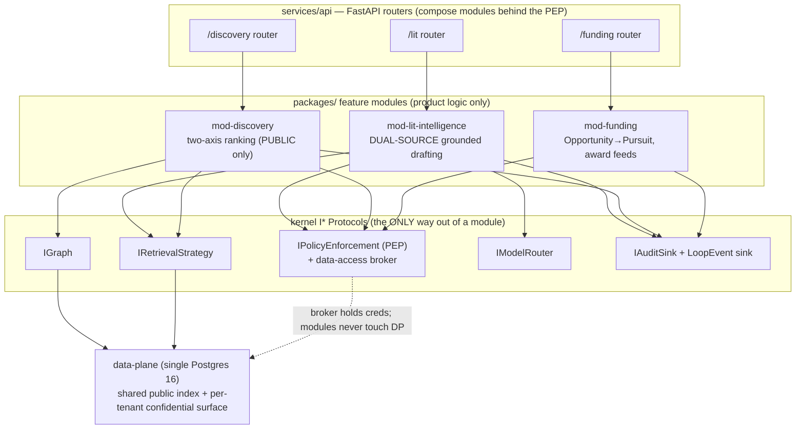

# 10 — Feature Modules: Low-Level Design (the read-side loop surfaces behind the PEP)

> **What this document is.** The low-level design for the three **read-side feature modules** that
> surface stages 1–2 of the collaboration loop and the dual-source proposal grounding:
> `mod-discovery` (team assembly), `mod-lit-intelligence` (dual-source grounded drafting), and
> `mod-funding` (opportunity match → `Pursuit`, plus award feeds). It also specifies the **plug-in
> contract** every feature module obeys, and the **DI factory wiring + FastAPI routers** that compose
> them behind the single Policy Enforcement Point (PEP). This is build phase **P0.8** (brief
> `build_phases` → P0.8). The CENTERPIECE write-side editor (`mod-workspace`) is **P0.9** and lives in
> `11-mod-workspace-confidential-coauthoring-lld.md`; the compounding write-back edge is **P0.10** in
> `12-collaboration-loop-and-writeback-lld.md`.
>
> **Who reads this.** The local ~30B builder. Type the signatures in this file essentially verbatim,
> then implement against the kernel Protocols. Where this file references a kernel type or a table,
> the authoritative definition is in the spine docs — do **not** redefine it here.
>
> **Authority chain (higher wins).** `_design-brief.json` (locked intent) →
> `CONVENTIONS-single-box.md` (this-file-wins pins, package names, FORBIDDEN list) →
> `05-kernel-contracts.md` (frozen kernel types + `I*` Protocols) →
> `13-data-model-and-schemas.md` (DDL + row models) → **this document** (feature-module behavior). If
> this doc disagrees with a spine doc on a name/type/DDL, the spine doc wins; flag the conflict.
>
> **Decisions exercised here.** Primary: **D1** (loop engine product), **D3** (single PEP + broker
> chokepoint), **D4** (fixed fail-closed PEP order), **D6** (classify-gates-index for the SHARED index
> + per-tenant CONFIDENTIAL surface for own-tenant grounding), **D8** (single-Postgres two-stage
> retrieval), **D14** (two grant feeds, scoped corpus). Decision IDs are **D1..D14 only** — no other
> labels exist.

---

## 0. Table of contents

1. [Where these modules sit, and the one rule they all obey](#1-where-these-modules-sit-and-the-one-rule-they-all-obey)
2. [The plug-in contract (consume only kernel + broker; import-linter + AST enforcement)](#2-the-plug-in-contract-consume-only-kernel--broker-import-linter--ast-enforcement)
3. [`mod-funding` — opportunity match → Pursuit creation + award feeds (loop stage 1)](#3-mod-funding--opportunity-match--pursuit-creation--award-feeds-loop-stage-1)
4. [`mod-discovery` — two-axis team assembly, PUBLIC-tier only (loop stage 2)](#4-mod-discovery--two-axis-team-assembly-public-tier-only-loop-stage-2)
5. [`mod-lit-intelligence` — DUAL-SOURCE grounded drafting + RAGAS gate (loop stage 3 read side)](#5-mod-lit-intelligence--dual-source-grounded-drafting--ragas-gate-loop-stage-3-read-side)
6. [DI factory wiring](#6-di-factory-wiring)
7. [FastAPI routers](#7-fastapi-routers)
8. [Loop events these modules emit (non-security stream)](#8-loop-events-these-modules-emit-non-security-stream)
9. [P0.8 acceptance tests (what "done" means)](#9-p08-acceptance-tests-what-done-means)
10. [Failure modes, partial-failure policy, and what is deliberately P1](#10-failure-modes-partial-failure-policy-and-what-is-deliberately-p1)

---

## 1. Where these modules sit, and the one rule they all obey

These three modules are **"dumb" plug-ins behind the PEP** (D3, architecture overview layer 5). They
contain *product logic* — ranking, drafting orchestration, opportunity matching — but **zero**
security mechanism and **zero** raw data access. Everything a module touches arrives as an
**already-projected, already-tier-checked** object handed to it by the broker inside `mod-pep`, or as
a result returned by a kernel `I*` Protocol the DI factory wired for it.



**The one rule:** a feature module's *only* outbound edges are (a) the kernel
(`tigerexchange_contracts`), and (b) the Protocol implementations the DI factory injected — which in
practice means it calls **the PEP/broker** before any retrieve/derive/egress, and it calls
`IRetrievalStrategy` / `IGraph` / `IModelRouter` / `IAuditSink` through their kernel interfaces. A
module **never** imports `tigerexchange_data_plane`, never opens a DB connection, never imports the
classifier engine, and **never constructs a `PublishableProjection`** (§2). This is decision **D3**
made physical; the enforcement is in §2.

> **Why product logic but no security mechanism?** A 30B builder editing five modules will, over time,
> get one confidentiality check subtly wrong if each module re-implements its own gate. Funnelling
> every authorization through the single PEP (D3) means a new capability inherits enforcement for
> free and there is exactly one place the human-authored security gates have to defend. Chosen over
> per-module enforcement (the v2 god-object/own-data contradiction; see CONVENTIONS §13 #9) and over
> query-time post-filtering of one shared index (leaves confidential rows physically present
> cross-tenant = a standing breach; D6 rejected alternative).

### 1.1 The loop stages these modules cover

From the brief `collaboration_loop_design`, the five-stage loop is:

| Stage | What happens | Owning module(s) | Phase |
|---|---|---|---|
| **1 — discover / trigger** | Ingest Grants.gov opportunities + NIH/NSF awards; a matched opportunity creates a **Pursuit** | **`mod-funding`** | P0.8 (this doc) |
| **2 — team** | Two-axis ranking (expertise COVERAGE + graph CONNECTIVITY) over the PUBLIC expertise graph; PI curates | **`mod-discovery`** | P0.8 (this doc) |
| **3 — co-author** | Confidential CRDT co-authoring grounded DUAL-SOURCE (shared public + own-tenant confidential) | `mod-workspace` (write side, `11`) + **`mod-lit-intelligence`** (grounding/drafting read side, this doc) | P0.9 / P0.8 |
| **4 — outcome** | Record won/lost/submitted → emit `proposal.outcome_recorded` | `mod-funding` (records) → `loop-engine` | P0.10 (`12`) |
| **5 — write-back** | Async, semaphore-gated enrichment re-weights the expertise graph | `loop-engine` | P0.10 (`12`) |

This document builds the **read-side** of stages 1–2 fully, plus the **grounding/drafting read-side**
of stage 3. The funding-outcome *recording* surface (`POST /funding/pursuits/{id}/outcome`) is wired
here too because it lives in `mod-funding`, but the *consumption* of that event (the write-back) is
P0.10.

---

## 2. The plug-in contract (consume only kernel + broker; import-linter + AST enforcement)

This is the contract every feature module — `mod-discovery`, `mod-lit-intelligence`, `mod-funding`
(and later `mod-workspace`) — must satisfy. It is decision **D3** made enforceable, and it mirrors
`CONVENTIONS-single-box.md` §4 (the import rules) and `05-kernel-contracts.md` (the kernel surface).
**Two CI mechanisms enforce it: `import-linter` (import-graph contracts) and an AST test (forbidden
construction/attribute access).** A module that violates either does not merge.

### 2.1 The five hard rules (restated for feature modules)

1. **Import only the kernel + your own subpackage.** A `tigerexchange_<mod>` package may import
   `tigerexchange_contracts` and its own submodules. It may **not** import another feature module
   (`tigerexchange_discovery` may not `import tigerexchange_lit_intelligence`), and it may **not**
   import `services/*`. Cross-module collaboration happens through kernel Protocols wired by the DI
   factory (§6), never by direct import. *(CONVENTIONS §4.1 rules 2, 6.)*
2. **Never import the raw store.** No `tigerexchange_data_plane`, no `asyncpg`, no `sqlalchemy`, no
   raw connection. You receive already-projected, already-tier-checked objects from the broker.
   *(CONVENTIONS §4.1 rule 3; D3.)*
3. **Never import the classifier engine directly.** Classification is a fail-closed security edge
   (D6); a module never reaches into its internals. *(CONVENTIONS §4.1 rule 4.)*
4. **Never construct a `PublishableProjection`.** Only the broker constructs it. The AST test fails
   any module that instantiates `PublishableProjection(...)`. *(CONVENTIONS §4.1 rule 5; the kernel
   validator in `05` §7 also rejects the confidential tier independently.)*
5. **Authorize before you retrieve/derive/egress.** Every retrieve/derive/egress goes through
   `IPolicyEnforcement.authorize(...)` first; a `PepEffect.DENY` (or any error/abstain) terminates the
   operation. There is no "maybe". *(D3, D4.)*

> **Why import-linter AND an AST test, not just one?** `import-linter` catches the *import graph*
> (module A imports forbidden package B). It does **not** catch a module that imports an *allowed*
> kernel symbol (`PublishableProjection` lives in the kernel, which every module may import) and then
> *constructs* it. The AST test closes that gap: it walks each module's source and flags
> `PublishableProjection(...)` construction and any `asyncpg`/`sqlalchemy` attribute access. Chosen
> over import-linter alone (misses construction of an allowed-to-import-but-forbidden-to-build type)
> and over runtime guards alone (a runtime guard only fires on the code path you happened to execute;
> a static AST walk covers every line).

### 2.2 `import-linter` contract (verbatim, `pyproject.toml` / `.importlinter`)

These contracts live in the project root config and run in CI. The kernel contract is from `05`/`P0.0`;
the feature-module contracts are added here for P0.8.

```ini
# .importlinter  (or [tool.importlinter] in pyproject.toml)
[importlinter]
root_packages =
    tigerexchange_contracts
    tigerexchange_pep
    tigerexchange_discovery
    tigerexchange_lit_intelligence
    tigerexchange_funding
    tigerexchange_workspace
    tigerexchange_data_plane
    tigerexchange_retrieval
    tigerexchange_ai
    tigerexchange_audit

# (1) The kernel imports nothing feature-side (P0.0; restated).
[[importlinter.contracts]]
name = kernel-no-feature-deps
type = forbidden
source_modules = tigerexchange_contracts
forbidden_modules =
    tigerexchange_pep
    tigerexchange_discovery
    tigerexchange_lit_intelligence
    tigerexchange_funding
    tigerexchange_workspace
    tigerexchange_data_plane
    tigerexchange_retrieval
    tigerexchange_ai
    tigerexchange_audit

# (2) Feature modules never import the raw store or the data-plane package (D3).
[[importlinter.contracts]]
name = features-never-import-raw-store
type = forbidden
source_modules =
    tigerexchange_discovery
    tigerexchange_lit_intelligence
    tigerexchange_funding
    tigerexchange_workspace
forbidden_modules =
    tigerexchange_data_plane
    asyncpg
    sqlalchemy
    psycopg

# (3) Feature modules never import each other (D3 / modular monolith).
[[importlinter.contracts]]
name = features-do-not-cross-import
type = independence
modules =
    tigerexchange_discovery
    tigerexchange_lit_intelligence
    tigerexchange_funding
    tigerexchange_workspace

# (4) Feature modules never import the classifier engine internals (D6).
#     The classifier is invoked via the ingestion pipeline / IClassifier behind the broker,
#     never reached into directly. (mod-ingestion's classifier submodule path shown.)
[[importlinter.contracts]]
name = features-never-import-classifier-engine
type = forbidden
source_modules =
    tigerexchange_discovery
    tigerexchange_lit_intelligence
    tigerexchange_funding
    tigerexchange_workspace
forbidden_modules =
    tigerexchange_ingestion.classifier
```

### 2.3 The AST test (verbatim shape, `tests/integration/test_module_plugin_contract.py`)

This is a **builder-authored functional test** (it is *not* a security tripwire — those live in
`tests/security/` and are HUMAN-authored; CONVENTIONS §10). It statically walks each feature module's
source tree and asserts no forbidden construction or store access.

```python
# tests/integration/test_module_plugin_contract.py
from __future__ import annotations

import ast
import pathlib

import pytest

FEATURE_PACKAGES = [
    "tigerexchange_discovery",
    "tigerexchange_lit_intelligence",
    "tigerexchange_funding",
    "tigerexchange_workspace",
]

FORBIDDEN_CONSTRUCTIONS = {"PublishableProjection"}        # only the broker may build this (D3/D6)
FORBIDDEN_ATTR_ROOTS = {"asyncpg", "sqlalchemy", "psycopg"}  # no raw store access (D3)


def _module_source_files(pkg: str) -> list[pathlib.Path]:
    # Resolve the installed package directory and list its .py files.
    mod = __import__(pkg)
    root = pathlib.Path(mod.__file__).parent
    return list(root.rglob("*.py"))


@pytest.mark.parametrize("pkg", FEATURE_PACKAGES)
def test_no_forbidden_construction_or_store_access(pkg: str) -> None:
    for path in _module_source_files(pkg):
        tree = ast.parse(path.read_text(encoding="utf-8"), filename=str(path))
        for node in ast.walk(tree):
            # (a) forbid constructing PublishableProjection
            if isinstance(node, ast.Call):
                func = node.func
                name = (
                    func.id if isinstance(func, ast.Name)
                    else func.attr if isinstance(func, ast.Attribute)
                    else None
                )
                assert name not in FORBIDDEN_CONSTRUCTIONS, (
                    f"{path}:{node.lineno} constructs {name!r}; only the broker may build it (D3/D6)"
                )
            # (b) forbid raw-store attribute roots (asyncpg.connect, sqlalchemy.create_engine, ...)
            if isinstance(node, ast.Attribute):
                root = node
                while isinstance(root, ast.Attribute):
                    root = root.value
                if isinstance(root, ast.Name):
                    assert root.id not in FORBIDDEN_ATTR_ROOTS, (
                        f"{path}:{node.lineno} touches raw store {root.id!r}; modules use the broker (D3)"
                    )
```

> **Note on `mod-workspace` in these lists.** It is included so the contract is uniform across all
> feature modules, even though its build is P0.9 (`11`). At P0.8 the package may not yet exist; the
> parametrize will simply skip a not-yet-importable package, or you scope the list to the three P0.8
> modules and re-add `mod-workspace` when P0.9 lands. Keep the rule identical for all four.

### 2.4 What a module is *allowed* to import (the green list)

| Allowed import | Why |
|---|---|
| `tigerexchange_contracts` (the whole kernel) | the shared vocabulary: `Tier`, `Capability`, `TenantContext`, `PepRequest/Response`, `RetrievedItem`, `GenerationRequest/Result`, all `I*` Protocols. |
| its own subpackage (`tigerexchange_<mod>.*`) | the module's own internal code. |
| stdlib, `pydantic` | value objects, validation. |
| `numpy` (discovery only, for the coverage-matrix math) | pure CPU array math; verified aarch64 wheel. Not a store, not a model. |

Everything else is reached **through an injected Protocol**, never imported.

---

## 3. `mod-funding` — opportunity match → Pursuit creation + award feeds (loop stage 1)

**Package:** `packages/mod-funding/` → import root `tigerexchange_funding` (CONVENTIONS §3).
**Responsibility (one line):** funding feeds — Grants.gov **opportunities** (the top-of-loop trigger)
+ NIH RePORTER / NSF **awards** — create the `Pursuit`, and record `proposal.outcome_recorded`.

> **The two feeds are modeled distinctly (D14, CONVENTIONS §8.2).** `Grant Opportunity`
> (`source='grants_gov'`) is an *open call* that **drives the win-loop** — matching one creates a
> Pursuit. `Grant Award` (`source` ∈ `{'nih_reporter','nsf_awards'}`) is a *historical funded
> project* that **feeds PI track-record and co-funding collaboration edges** for `mod-discovery`'s
> connectivity axis. Do **not** collapse them into one table or one match path; the loop semantics
> differ. The DDL is `tex.opportunity` (`13` §6) and `tex.award` (`13` §7) — both SHARED PUBLIC,
> no tenant RLS.

### 3.1 What `mod-funding` does and does not do

| Does | Does not |
|---|---|
| Match an open `Opportunity` against a tenant's expertise/interest profile and return ranked candidate opportunities with a per-opportunity "why". | Ingest the raw Grants.gov/RePORTER/NSF files — that is `mod-ingestion` (`09`), in the INGEST-WINDOW. |
| Create a `Pursuit` (the loop-threading object) bound to a matched opportunity. | Hold a DB connection or write `tex.pursuit` directly — it asks the broker to persist (D3). |
| Record an outcome (submitted/won/lost) on a Pursuit → emit `proposal.outcome_recorded`. | Run the write-back enrichment — that is `loop-engine` (P0.10, `12`). |
| Configure ongoing match alerts on a Pursuit. | Read confidential proposal content — funding match is PUBLIC-tier only. |

> **Why funding is the top-of-loop trigger (D1, brief `collaboration_loop_design`).** A concrete
> funding need produces a far better team-assembly query than aimless expert browsing; it rejects the
> discovery-first cold-start problem. So the Pursuit — the durable object that threads all five loop
> stages — is born from a matched opportunity. Chosen over discovery-first (no concrete anchor; users
> browse and bounce; no data gravity).

### 3.2 The Protocol `mod-funding` exposes (verbatim)

```python
# packages/mod-funding/tigerexchange_funding/api.py
from __future__ import annotations

from typing import Protocol, Sequence
from uuid import UUID

from pydantic import BaseModel, ConfigDict, Field

from tigerexchange_contracts import TenantContext


class OpportunityMatch(BaseModel):
    """One ranked open opportunity for a tenant, with a transparent 'why'. Frozen value object."""

    model_config = ConfigDict(frozen=True)

    opportunity_id: UUID
    agency: str
    title: str
    deadline: str | None = None                       # ISO date string; None for forecasted calls
    required_concepts: tuple[str, ...] = Field(default_factory=tuple)
    match_score: float                                # 0..1 transparent score
    why: tuple[str, ...] = Field(default_factory=tuple)  # human-readable reasons (concept overlaps)


class PursuitView(BaseModel):
    """A created/loaded Pursuit as the read-side sees it. Frozen value object."""

    model_config = ConfigDict(frozen=True)

    pursuit_id: UUID
    tenant_id: UUID
    opportunity_id: UUID | None
    proposal_id: UUID | None
    team_id: UUID | None
    lifecycle_state: str                              # tex.pursuit_state value


class IFundingService(Protocol):
    """Loop stage 1. PUBLIC-tier only. All DB access via the injected broker (D3)."""

    async def match_opportunities(
        self, *, context: TenantContext, top_k: int = 20
    ) -> Sequence[OpportunityMatch]:
        """Rank OPEN opportunities (source='grants_gov') against the tenant's interest profile."""
        ...

    async def create_pursuit(
        self, *, context: TenantContext, opportunity_id: UUID
    ) -> PursuitView:
        """Create the loop-threading Pursuit bound to a matched opportunity. Emits pursuit_created
        + opportunity_matched loop events."""
        ...

    async def record_outcome(
        self, *, context: TenantContext, pursuit_id: UUID, result: str
    ) -> PursuitView:
        """result ∈ {'submitted','won','lost'} (tex.outcome_result). On 'won' transitions the Pursuit
        to 'won' and writes proposal.outcome_recorded to the transactional outbox (consumed by the
        P0.10 write-back; this module does NOT run enrichment)."""
        ...
```

### 3.3 Opportunity matching — the algorithm (P0, deterministic, PUBLIC-tier)

P0 opportunity matching is **concept-overlap scoring**, not an LLM call (keep the one GPU for
drafting). The tenant's *interest profile* is the set of concept labels harvested from its public
works/fingerprints (the same `concept_weights` on `tex.expertise_fingerprint`, `13` §16). The
opportunity's `required_concepts` (`tex.opportunity.required_concepts`, `13` §6) is the other side.

```
For each open Opportunity O (status ∈ {'forecasted','posted'} and deadline in the future or NULL):
    overlap = sum over c in O.required_concepts of tenant_concept_weight(c)        # 0 if absent
    coverage_ratio = |O.required_concepts ∩ tenant_concepts| / |O.required_concepts|
    match_score = 0.6 * normalize(overlap) + 0.4 * coverage_ratio                  # transparent blend
    why = ["matched concept '<c>' (tenant weight 0.xx)" for the top contributing concepts]
Return top_k by match_score, descending.
```

This is intentionally simple and transparent so the "why" is trustworthy and there is no opaque ranker
on the trigger step. The blend weights (0.6/0.4) are a config constant, tunable; log them.

> **Why concept-overlap and not an LLM relevance judge at P0?** Stage 1 fires frequently (daily
> opportunity feed × all tenants); an LLM call per opportunity would contend for the single shared
> 30B generator that the confidential drafting path needs (D10, memory regime SERVE). Deterministic
> overlap is cheap, explainable, and good enough to surface candidate calls a PI then triages. An
> Adaptive-RAG / LLM-assisted matcher is a **P1** enhancement, off by default (mirrors the
> query-expansion deferral in `retrieval_design`).

### 3.4 PEP gate for `mod-funding`

Opportunity matching and Pursuit creation are **PUBLIC-tier** operations. Before reading the shared
public index/graph or persisting a Pursuit, the module authorizes:

```python
from tigerexchange_contracts import PepRequest, PepAction, Capability, Tier

req = PepRequest(
    context=context,
    action=PepAction.RETRIEVE_PUBLIC,           # matching reads the shared public surface
    required_capability=Capability.PUBLIC_RETRIEVAL,
    resource_tier=Tier.PUBLIC,
)
resp = await pep.authorize(req)
if not resp.allowed:
    # fail-closed: no partial guess. Surface a clean denied result.
    raise PermissionError(resp.reason_code)
```

Creating a Pursuit and recording an outcome are tenant-scoped writes (`PepAction.WRITE_OBJECT`,
`required_capability=Capability.OWN_MATERIALS`); the broker performs the actual INSERT/UPDATE under
the tenant's `SET LOCAL` context against `tex.pursuit` (D5; `13` §8). The module never writes the
table itself.

### 3.5 Pursuit lifecycle (what this module sets; full state machine in `12`)

`mod-funding` sets these `tex.pursuit_state` transitions (`13` §0.8 enum):

```
create_pursuit(opportunity)      -> 'matched'      (from 'draft' if a shell was pre-created)
(team assembled by mod-discovery)-> 'team_forming' (mod-discovery sets this; §4.6)
(drafting begins in mod-workspace)-> 'drafting'    (mod-workspace sets this; 11)
record_outcome('submitted')      -> 'submitted'
record_outcome('won')            -> 'won'          (fires proposal.outcome_recorded -> outbox)
record_outcome('lost')           -> 'lost'
```

> The terminal `won` is the only transition that writes `proposal.outcome_recorded` to the
> transactional outbox. The Dagster outbox **sensor** that consumes it (the write-back) is **P0.10**
> (`12`); `mod-funding` only *emits*. Keep that separation — synchronous write-back on the interactive
> path would do slow graph writes inline (D12 rejected alternative).

---

## 4. `mod-discovery` — two-axis team assembly, PUBLIC-tier only (loop stage 2)

**Package:** `packages/mod-discovery/` → import root `tigerexchange_discovery` (CONVENTIONS §3).
**Responsibility (one line):** rank candidate collaborators for a Pursuit on **two axes** —
expertise **COVERAGE** of the RFP's required concepts (a matrix that *shows gaps*) and graph
**CONNECTIVITY** (prior co-authorship + co-funding distance) — with a **transparent outcome-weighted
overlay**, a **per-candidate "why"**, and **mandatory human curation**. It touches **PUBLIC-tier data
only** (D6 consequence: "mod-discovery + the expertise graph remain PUBLIC-tier-only by
construction"). It can never read a confidential draft or a confidential index.

> **Why PUBLIC-tier-only, structurally.** The expertise graph is a *shared product surface* — its
> whole point is cross-tenant discovery of who to invite. The kernel makes this safe by construction:
> `mod-discovery` only ever issues `PepAction.RETRIEVE_PUBLIC` with `Capability.PUBLIC_RETRIEVAL` at
> `Tier.PUBLIC`, and the broker hands back only public projections. There is no code path in this
> module that requests the confidential surface. A HUMAN-authored P0.8 test asserts
> `mod-discovery touches no confidential data`.

### 4.1 The three ranking inputs (and the tables behind them)

| Axis / overlay | Source signal | Backing table (`13`) | Surface |
|---|---|---|---|
| **Axis 1 — expertise COVERAGE** | concept overlap of each candidate against the RFP `required_concepts`; complementary/gap-filling, shown as a matrix | `tex.expertise_fingerprint.concept_weights` + SPECTER2 `specter2_centroid` (`13` §16); `tex.opportunity.required_concepts` (`13` §6) | SHARED PUBLIC |
| **Axis 2 — graph CONNECTIVITY** | bounded-hop ego-net distance over prior co-authorship + co-funding | `tex.collaboration_edge` (`13` §17) via `IGraph.ego_net` recursive CTE | SHARED PUBLIC |
| **Overlay — outcome-weighted signal** | `outcome_weight_by_concept` (mutated by the P0.10 write-back) — **one transparent signal among the two axes, never the sole ranker** | `tex.expertise_fingerprint.outcome_weight_by_concept` (`13` §16) | SHARED PUBLIC |

> **The overlay is one signal, not the ranker (incumbency-bias mitigation, D12 / open_risks).** The
> outcome-weighted overlay must remain transparent and be *one* term among coverage and connectivity,
> never the dominant or sole signal — otherwise the write-back loop entrenches established
> investigators. Surface its contribution in the per-candidate "why", expose a tunable weight, and
> log its influence on the ranking. Chosen over opaque outcome-weighting-as-sole-ranker (the
> incumbency trap; D12 rejected alternative).

### 4.2 The Protocol `mod-discovery` exposes (verbatim)

```python
# packages/mod-discovery/tigerexchange_discovery/api.py
from __future__ import annotations

from typing import Mapping, Protocol, Sequence
from uuid import UUID

from pydantic import BaseModel, ConfigDict, Field

from tigerexchange_contracts import TenantContext


class CandidateScore(BaseModel):
    """One ranked candidate collaborator. PUBLIC-tier only. Frozen value object."""

    model_config = ConfigDict(frozen=True)

    subject_id: UUID
    display_name: str
    orcid_id: str | None = None
    coverage_score: float                         # axis 1: 0..1 RFP-concept coverage
    connectivity_score: float                     # axis 2: 0..1 graph-distance-decayed connectivity
    outcome_overlay: float                         # transparent overlay term (one signal, not the ranker)
    total_score: float                            # the transparent blend (see §4.4)
    # per-candidate "why": maps each contributing reason to its numeric contribution
    why: tuple[str, ...] = Field(default_factory=tuple)
    # which RFP concepts THIS candidate covers (drives the coverage matrix + gap view)
    covered_concepts: tuple[str, ...] = Field(default_factory=tuple)


class CoverageMatrix(BaseModel):
    """RFP concept × shortlisted-candidate coverage, with explicit gaps. Frozen value object."""

    model_config = ConfigDict(frozen=True)

    required_concepts: tuple[str, ...]            # the RFP's required concept areas (columns)
    # rows: subject_id -> {concept -> coverage_weight in 0..1}
    coverage: Mapping[str, Mapping[str, float]]
    # concepts NOT covered by ANY shortlisted candidate (the gaps the PI must fill)
    uncovered_concepts: tuple[str, ...] = Field(default_factory=tuple)


class TeamShortlist(BaseModel):
    """The discovery result: ranked candidates + the coverage matrix + gaps. Frozen value object."""

    model_config = ConfigDict(frozen=True)

    pursuit_id: UUID
    candidates: tuple[CandidateScore, ...]
    matrix: CoverageMatrix


class IDiscoveryService(Protocol):
    """Loop stage 2. PUBLIC-tier ONLY (D6). All graph/index reads via injected Protocols behind the PEP."""

    async def shortlist_team(
        self, *, context: TenantContext, pursuit_id: UUID, top_k: int = 15, max_hops: int = 2
    ) -> TeamShortlist:
        """Rank candidates on coverage + connectivity with the outcome overlay; build the coverage
        matrix with gaps. Emits team_shortlisted. Does NOT auto-form a team — the PI curates (§4.5)."""
        ...
```

### 4.3 Axis 1 — expertise COVERAGE matrix with gaps

The coverage axis answers: *for this RFP's required concept areas, how well does each candidate cover
each one, and which concepts does nobody cover?* It is a matrix because the PI needs to see
**complementary / gap-filling** coverage, not just a single scalar (team-formation literature: the
algorithm alone produces worse teams — brief `collaboration_loop_design`, stage 2).

```
Inputs:
  required_concepts := tex.opportunity.required_concepts of the Pursuit's opportunity
  For each candidate s in the candidate pool (PUBLIC fingerprints):
      fp := tex.expertise_fingerprint for s
      For each concept c in required_concepts:
          coverage[s][c] := concept_coverage(fp, c)        # 0..1 from concept_weights and/or
                                                           # SPECTER2-centroid similarity to c's vector
      covered_concepts[s] := { c : coverage[s][c] >= COVERAGE_THRESHOLD }    # e.g. 0.2
      coverage_score[s]   := mean over c of coverage[s][c]                   # axis-1 scalar for ranking

Gaps:
  uncovered_concepts := { c in required_concepts : max over s of coverage[s][c] < COVERAGE_THRESHOLD }
```

The candidate pool is the set of researchers reachable in the expertise graph (public nodes); P0 may
seed it from the PI's ego-net plus concept-matched fingerprints. The matrix and `uncovered_concepts`
are returned verbatim so the UI (force-graph + matrix view, brief frontend) can render gaps the PI
must fill by inviting someone new.

> **Why a matrix + explicit gap list and not a single fit score?** A single number hides whether the
> team is *complementary*. A PI assembling a grant team needs to see "concept X is required but nobody
> on the shortlist covers it" — that gap is the actionable output of stage 2. Chosen over a scalar
> "team fit" (opaque, hides gaps) and over auto-forming the team from the top-k (the literature says
> algorithm-only teams are worse; D1 / stage-2 rationale → mandatory human curation, §4.5).

### 4.4 Axis 2 — graph CONNECTIVITY + the transparent blend

Connectivity uses the bounded-hop ego-net over `tex.collaboration_edge` (co-authorship + co-funding +
in-platform `co_pi_with` write-back edges) via `IGraph.ego_net` (kernel `05` §10.2; recursive CTE, D8;
`13` §17). Distance decays the score: a direct prior collaborator scores higher than a 2-hop one.

```python
# illustrative connectivity computation inside mod-discovery (calls the injected IGraph)
neighbors = await graph.ego_net(tenant_id=str(context.tenant_id), node=f"user:{pi_subject}", max_hops=max_hops)
# neighbors: Sequence[dict] with at least {"node": "user:<id>", "hop": int, "weight": float, ...}
HOP_DECAY = 0.5
for n in neighbors:
    connectivity_score[n["node"]] = n["weight"] * (HOP_DECAY ** (n["hop"] - 1))   # decay by distance
```

The final transparent blend (config constants `W_COVERAGE`, `W_CONNECTIVITY`, `W_OUTCOME`; defaults
shown; they must sum to 1.0 and be logged):

```
total_score = W_COVERAGE   * coverage_score
            + W_CONNECTIVITY* connectivity_score
            + W_OUTCOME     * outcome_overlay        # W_OUTCOME is the SMALLEST weight by policy

# defaults: W_COVERAGE = 0.5, W_CONNECTIVITY = 0.35, W_OUTCOME = 0.15
```

`outcome_overlay` is derived from `tex.expertise_fingerprint.outcome_weight_by_concept` restricted to
the RFP's `required_concepts`. `W_OUTCOME` is deliberately the smallest weight (incumbency-bias
guardrail). The per-candidate `why` enumerates each term's contribution, e.g.:

```
why = (
  "covers 4/6 required concepts (coverage 0.71)",
  "1-hop prior co-author of the PI (connectivity 0.62)",
  "outcome signal +0.09 on concept 'graph neural networks' (1 prior win)",
)
```

> **`max_hops` is REQUIRED bounded.** `IGraph.ego_net` takes `max_hops` (kernel `05` §10.2: "no
> unbounded walks"); the recursive CTE has a hard depth bound (`13` §13 depth-16 guard). An unbounded
> graph walk on the HDD-class box is a latency and memory hazard (D13). Default `max_hops=2`.

### 4.5 Mandatory human curation (the PI always curates)

`shortlist_team` returns a *ranked shortlist + coverage matrix + gaps*. It **does not** form a team,
send invites, or write `tex.team_member`. Team formation is a deliberate, PI-driven act in
`mod-workspace` (P0.9, `11`): the PI reviews the shortlist, sees the gaps, and curates — adding,
removing, or inviting someone the algorithm did not surface.

> **Why mandatory curation (D1, brief stage-2; team-formation literature).** Algorithmic team
> assembly alone produces measurably worse teams; the human PI's judgment on fit, availability, and
> politics is irreducible. So discovery *informs*, the PI *decides*. Chosen over auto-assembly (worse
> teams; removes the human signal the loop depends on). This also keeps `mod-discovery` read-only,
> which is why it can be PUBLIC-tier-only with no write path.

### 4.6 Loop-state coupling

After the PI curates a team in `mod-workspace`, the Pursuit moves to `team_forming` (set by
`mod-workspace`, not `mod-discovery`). `mod-discovery` itself emits only the `team_shortlisted` loop
event (§8). It writes no Pursuit state.

### 4.7 PEP gate for `mod-discovery`

Every read is PUBLIC-tier:

```python
req = PepRequest(
    context=context,
    action=PepAction.RETRIEVE_PUBLIC,
    required_capability=Capability.PUBLIC_RETRIEVAL,
    resource_tier=Tier.PUBLIC,
)
resp = await pep.authorize(req)
if not resp.allowed:
    raise PermissionError(resp.reason_code)   # fail-closed
```

There is **no** `RETRIEVE_CONFIDENTIAL` path in this module. The `Edition.DISCOVERY_ONLY` entitlement
(kernel `05` §4.3: `{PUBLIC_RETRIEVAL}`) is sufficient to run discovery — a tenant on the
discovery-only edition can assemble shortlists but cannot enter the confidential workspace (that needs
`COLLABORATION`). This is the clean line between participation modes (security_spine
"Entitlement-at-PEP capability gating").

---

## 5. `mod-lit-intelligence` — DUAL-SOURCE grounded drafting + RAGAS gate (loop stage 3 read side)

**Package:** `packages/mod-lit-intelligence/` → import root `tigerexchange_lit_intelligence`
(CONVENTIONS §3).
**Responsibility (one line):** ground a confidential proposal draft over **TWO retrieval surfaces** —
(A) the **shared public** corpus index AND (B) the owning tenant's **per-tenant confidential**
retrieval surface (its own prior winning proposals + drafts) — synthesize a cited draft segment on the
**in-boundary** 30B generator, and pass it through a **RAGAS faithfulness gate** judged by an
**in-boundary** model. This is the read/generation side of loop **stage 3**; the CRDT editor and
snapshotting are `mod-workspace` (`11`).

> **This module is the resolution of the STAGE-3 contradiction (D6, brief `retrieval_design`).**
> "Confidential content never enters any SHARED index" means the **cross-tenant public** index — it
> does **not** mean confidential content is unindexable for its owning tenant. `mod-lit-intelligence`
> grounds the draft on BOTH the shared public surface AND the owning tenant's own confidential surface;
> tenant A grounds on A's prior winning proposals, and tenant B physically cannot retrieve them
> (PEP-enforced; HUMAN-authored P0.9 test).

### 5.1 The two surfaces and how they are selected

Both surfaces run the **same** two-stage pipeline behind the **same** `IRetrievalStrategy` interface
(D8; `07`). The only difference is the `confidential_surface` flag and the PEP action/capability:

| Surface | `IRetrievalStrategy.retrieve(...)` arg | PEP action | Required capability | Resource tier | Backing storage (`13`) |
|---|---|---|---|---|---|
| **(A) shared public** | `confidential_surface=False` | `RETRIEVE_PUBLIC` | `PUBLIC_RETRIEVAL` | `PUBLIC` | `tex.work_chunk` (`13` §5b), SHARED PUBLIC, NVMe |
| **(B) own-tenant confidential** | `confidential_surface=True` | `RETRIEVE_CONFIDENTIAL` | `CONFIDENTIAL_RETRIEVAL` | `CONFIDENTIAL` | `tex.confidential_index_entry` (`13` §10), per-tenant **encrypted tablespace**, RLS-isolated |

The kernel interface (`05` §10.2) is exactly:

```python
async def retrieve(
    self, *, query: str, tenant_id: str, top_k: int = 8, confidential_surface: bool = False
) -> Sequence[RetrievedItem]: ...
```

> **Why one pipeline, two surfaces (D6/D8).** Reusing the identical two-stage hybrid+rerank pipeline
> (pgvector HNSW + native BM25 + RRF k=60 in SQL → cross-encoder rerank top-50→top-8) for both
> surfaces means there is one retrieval code path to get right, and the confidential surface inherits
> the same quality floor. The confidential surface merely lives on a per-tenant encrypted tablespace
> and is gated by `CONFIDENTIAL_RETRIEVAL` (D6 consequence; `07`). Chosen over a second bespoke
> confidential retriever (more code to get wrong) and over query-time filtering of one shared index
> (standing breach; D6 rejected).

### 5.2 The dual-source grounding flow (verbatim sequence)

```mermaid
sequenceDiagram
    participant WS as mod-workspace (CRDT editor, 11)
    participant LIT as mod-lit-intelligence
    participant PEP as PEP + broker
    participant RET as IRetrievalStrategy
    participant GEN as IModelRouter (30B, in-boundary)
    participant JUDGE as IModelRouter (in-boundary RAGAS judge)

    WS->>LIT: ground_and_draft(context, pursuit_id, prompt)
    Note over LIT: confidential drafting requires CONFIDENTIAL_DRAFTING + CONFIDENTIAL_RETRIEVAL
    LIT->>PEP: authorize(RETRIEVE_PUBLIC, PUBLIC_RETRIEVAL, tier=PUBLIC)
    PEP-->>LIT: ALLOW
    LIT->>RET: retrieve(query, tenant_id, confidential_surface=False)   %% surface A
    RET-->>LIT: public RetrievedItem[]
    LIT->>PEP: authorize(RETRIEVE_CONFIDENTIAL, CONFIDENTIAL_RETRIEVAL, tier=CONFIDENTIAL)
    PEP-->>LIT: ALLOW (only the OWNING tenant's drafting path; tenant B -> DENY)
    LIT->>RET: retrieve(query, tenant_id, confidential_surface=True)    %% surface B (own tenant only)
    RET-->>LIT: own-confidential RetrievedItem[]
    Note over LIT: merge + de-dup; tier = tier_join_all(all item tiers) == CONFIDENTIAL (MAX-rule)
    LIT->>PEP: authorize(DERIVE, CONFIDENTIAL_DRAFTING, tier=CONFIDENTIAL)
    PEP-->>LIT: ALLOW
    LIT->>GEN: generate(GenerationRequest(prompt+context, tier=CONFIDENTIAL, confidential=True))
    Note over GEN: in-boundary 30B, --enable-prefix-caching=False, serialized (D10)
    GEN-->>LIT: GenerationResult(text, served_locally=True)
    LIT->>JUDGE: RAGAS faithfulness over (answer, retrieved contexts) [in-boundary judge]
    JUDGE-->>LIT: faithfulness score
    alt faithfulness >= threshold
        LIT-->>WS: DraftSegment(text, citations, faithfulness, passed=True)
    else below threshold
        LIT-->>WS: DraftSegment(passed=False, reason="faithfulness_gate_failed")
    end
```

**MAX-rule on the merged context (kernel `05` §3.1; `tier_join_all`).** Because the draft is grounded
on a confidential surface, the derived draft's tier is the MAX of all input tiers — which is
`CONFIDENTIAL`. The module computes this with `tier_join_all([item.tier for item in merged])` and
passes it as `GenerationRequest.tier` and as the `DERIVE` request's `resource_tier`. An empty merged
set joins to `CONFIDENTIAL` (fail-closed; `05` §3.1) — the draft never silently downgrades to public.

**Confidential generation is local-only with KV isolation (D10).** The `GenerationRequest` carries
`confidential=True`, which forces the router to serve on the in-boundary 30B with
`enable_prefix_caching=False` and serialized requests (kernel `05` §9.5 `GenerationRequest`; D10;
`08`). `GenerationResult.served_locally` MUST be `True` — the egress guard (`08`) hard-fails otherwise.
There is **no** second model copy and **no** cloud judge.

### 5.3 The Protocol `mod-lit-intelligence` exposes (verbatim)

```python
# packages/mod-lit-intelligence/tigerexchange_lit_intelligence/api.py
from __future__ import annotations

from typing import Protocol, Sequence
from uuid import UUID

from pydantic import BaseModel, ConfigDict, Field

from tigerexchange_contracts import TenantContext


class Citation(BaseModel):
    """A grounded citation pointing at a retrieved chunk. Frozen value object."""

    model_config = ConfigDict(frozen=True)

    source_ref: str                          # entity ref the chunk derives from (work:<id>/proposal:<id>)
    surface: str                             # "public" | "confidential" (which surface it came from)
    snippet: str                             # the supporting text span
    score: float                             # rerank score


class DraftSegment(BaseModel):
    """A grounded, cited draft segment with its faithfulness verdict. Frozen value object.
    Tier is CONFIDENTIAL (MAX-rule); this object is handled only inside the confidential path."""

    model_config = ConfigDict(frozen=True)

    pursuit_id: UUID
    text: str
    citations: tuple[Citation, ...] = Field(default_factory=tuple)
    faithfulness: float                       # RAGAS faithfulness 0..1 (in-boundary judge)
    passed: bool                              # faithfulness >= threshold
    reason: str = "ok"                        # "ok" | "faithfulness_gate_failed" | "denied"
    served_locally: bool = True               # MUST be True (D10 egress guard)


class ILitIntelligenceService(Protocol):
    """Loop stage 3 read side. DUAL-SOURCE grounding (D6). In-boundary generation + RAGAS judge."""

    async def ground_and_draft(
        self, *, context: TenantContext, pursuit_id: UUID, prompt: str, top_k: int = 8
    ) -> DraftSegment:
        """Retrieve over BOTH surfaces (public + own-tenant confidential), synthesize a cited draft on
        the in-boundary 30B (confidential=True), and apply the RAGAS faithfulness gate (in-boundary
        judge). Returns passed=False if the gate fails (does NOT silently emit ungrounded text)."""
        ...

    async def search_only(
        self, *, context: TenantContext, query: str, surfaces: Sequence[str], top_k: int = 8
    ) -> Sequence[Citation]:
        """Read-only dual-surface search (no generation). `surfaces` ⊆ {'public','confidential'};
        'confidential' requires CONFIDENTIAL_RETRIEVAL and resolves ONLY the calling tenant's own
        surface."""
        ...
```

### 5.4 Citations

Every claim-bearing sentence in the draft must carry at least one `Citation` resolving to a
`RetrievedItem.source_ref`, tagged with the `surface` it came from (`"public"` or `"confidential"`).
Citations from the confidential surface point at the tenant's own prior proposals (`proposal:<id>`);
they are visible **only** inside that tenant's confidential drafting context and are never surfaced
cross-tenant. The draft, its citations, and any eval trace are MAX-rule **confidential** and persist
**only** in the encrypted store (AES-GCM blob for the draft snapshot, `13` §18; the confidential index
entries on the encrypted tablespace, `13` §10). `mod-workspace` owns the persistence; this module
returns the in-memory `DraftSegment`.

### 5.5 RAGAS faithfulness gate with an in-boundary judge

The draft passes through a **RAGAS faithfulness** check before it is offered to the editor.
Faithfulness measures whether the generated claims are supported by the retrieved contexts (low
faithfulness = hallucination). The judge model is the **in-boundary 30B** (or a local judge process) —
**never a cloud judge**, because the contexts include confidential prior-proposal text that must not
egress (brief `retrieval_design`: "an IN-BOUNDARY local 30B judge (mandatory — confidential drafts
forbid a cloud judge)").

```
faithfulness := RAGAS_faithfulness(answer = draft.text, contexts = [c.snippet for c in citations])
                # judged by the in-boundary IModelRouter, GenerationRequest(confidential=True)
PASS  if faithfulness >= RAGAS_FAITHFULNESS_THRESHOLD   (config default 0.75; tune on the gold set)
FAIL  otherwise -> DraftSegment(passed=False, reason="faithfulness_gate_failed")
```

On FAIL the module returns `passed=False` rather than emitting ungrounded text; the editor shows the
draft as un-vetted and lets the user re-prompt or edit. A regression form of this gate is wired into
CI on a small per-tenant gold set (`07` RAGAS-in-CI; the P0.8 acceptance "RAGAS faithfulness gate green
on gold set"). **Eval artifacts (RAGAS traces) are confidential-tier** AES-GCM blobs, crypto-shred on
erasure (`13` §18; brief `retrieval_design`).

> **Why a faithfulness gate at all, and why in-boundary?** Grant proposals grounded on prior winning
> text are exactly where a hallucinated citation is most damaging. RAGAS faithfulness is a
> reference-free, label-free check (correct for a fresh deployment, like RRF in `07`). The judge MUST
> be in-boundary because the contexts are confidential — a cloud judge would egress them, violating
> D10's local-only-for-confidential rule. Chosen over no gate (ships hallucinations into a funding
> proposal) and over a cloud-hosted judge (confidentiality breach).

### 5.6 Partial-failure policy (asymmetric by surface)

From the brief `retrieval_design` PARTIAL-FAILURE POLICY:

- **Public/shared discovery** (`search_only` with `surfaces=['public']`, and `mod-discovery`): return
  **partial results with an honest completeness indicator** — never whole-query-fail. If the BM25
  index is briefly unavailable, return the dense-only results and flag completeness.
- **The confidential path** (`ground_and_draft`, any `confidential` surface): **whole-query
  fail-closed**. If the confidential surface is unavailable or the PEP denies, the operation fails
  cleanly; it must never silently fall back to public-only grounding and present it as complete (that
  would silently drop the moat signal and could mislead the drafter).

### 5.7 PEP gates for `mod-lit-intelligence` (the three authorize calls)

```python
# (A) public surface
await pep.authorize(PepRequest(context=ctx, action=PepAction.RETRIEVE_PUBLIC,
                               required_capability=Capability.PUBLIC_RETRIEVAL, resource_tier=Tier.PUBLIC))
# (B) own-tenant confidential surface  -> tenant B asking for tenant A's surface => DENY (P0.9 test)
await pep.authorize(PepRequest(context=ctx, action=PepAction.RETRIEVE_CONFIDENTIAL,
                               required_capability=Capability.CONFIDENTIAL_RETRIEVAL,
                               resource_tier=Tier.CONFIDENTIAL))
# (derive) confidential generation
await pep.authorize(PepRequest(context=ctx, action=PepAction.DERIVE,
                               required_capability=Capability.CONFIDENTIAL_DRAFTING,
                               resource_tier=Tier.CONFIDENTIAL))
```

A tenant on `Edition.DISCOVERY_ONLY` lacks `CONFIDENTIAL_RETRIEVAL` and `CONFIDENTIAL_DRAFTING`, so
both (B) and (derive) DENY at PEP step 1–2 (entitlement/capability gate). The
`lower-tier-cannot-construct-confidential-request` HUMAN-authored gate (CONVENTIONS §10) covers this.

---

## 6. DI factory wiring

The dependency-injection factory lives in the **deployable**, not in a module: `services/api`
(import root `tigerexchange_api`). It is the *only* place that knows concrete implementations; it
constructs them once at startup and injects them into the feature modules as their kernel-Protocol
dependencies. This is what makes cross-module collaboration go through Protocols, never direct imports
(CONVENTIONS §4.1 rule 2/6; D3).

> **Why DI in `services/api` and not inside the modules.** A module that constructed its own
> `IRetrievalStrategy` would have to import `tigerexchange_retrieval` → it would then know a concrete
> store → the plug-in contract (§2) breaks. By keeping construction in the deployable, modules depend
> only on the abstract Protocols and stay unit-testable with fakes. Chosen over a service-locator
> singleton (hidden global state, hard to test) and over per-module construction (breaks the import
> contract).

### 6.1 The factory (verbatim shape)

```python
# services/api/tigerexchange_api/factory.py
from __future__ import annotations

from dataclasses import dataclass

from tigerexchange_contracts import (
    IPolicyEnforcement, IRetrievalStrategy, IGraph, IModelRouter, IAuditSink,
)

# Concrete implementations are imported ONLY here (the deployable), never inside a module.
from tigerexchange_pep import PolicyEnforcementPoint, DataAccessBroker   # mod-pep
from tigerexchange_retrieval import HybridRetriever                      # retrieval (07)
from tigerexchange_data_plane import PgGraph                             # data-plane IGraph (07)
from tigerexchange_ai import ModelRouter                                 # mod-ai (08)
from tigerexchange_audit import HashChainedAuditSink, LoopEventSink      # mod-audit

from tigerexchange_funding import FundingService, IFundingService
from tigerexchange_discovery import DiscoveryService, IDiscoveryService
from tigerexchange_lit_intelligence import LitIntelligenceService, ILitIntelligenceService


@dataclass(frozen=True)
class Services:
    """The wired, injectable service surface the routers consume. Built once at startup."""
    pep: IPolicyEnforcement
    funding: IFundingService
    discovery: IDiscoveryService
    lit: ILitIntelligenceService
    audit: IAuditSink
    loop_events: LoopEventSink


def build_services(*, pool, kms, config) -> Services:
    """Construct the object graph. `pool` = asyncpg pool (held by the broker, NEVER by a module).
    `kms` = LocalKms behind IKms. Protocol implementations are isinstance-checked (05 §10:
    @runtime_checkable) as a fail-fast wiring guard."""

    # --- platform layer ---
    broker = DataAccessBroker(pool=pool, kms=kms)        # holds raw-store creds for shared confidential/
                                                         # classification tables + per-tenant conf index ONLY (D3)
    audit = HashChainedAuditSink(pool=pool)              # security stream
    loop_events = LoopEventSink(pool=pool)               # SEPARATE non-security stream (never mixed)
    pep: IPolicyEnforcement = PolicyEnforcementPoint(broker=broker, audit=audit, config=config)

    retriever: IRetrievalStrategy = HybridRetriever(broker=broker)   # both surfaces behind one interface (D8)
    graph: IGraph = PgGraph(broker=broker)
    router: IModelRouter = ModelRouter(config=config)                # in-boundary providers (08, D10)

    # --- runtime-checkable guards (cheap fail-fast at wiring time, 05 §10) ---
    assert isinstance(pep, IPolicyEnforcement)
    assert isinstance(retriever, IRetrievalStrategy)
    assert isinstance(graph, IGraph)
    assert isinstance(router, IModelRouter)
    assert isinstance(audit, IAuditSink)

    # --- feature modules: injected with Protocols ONLY (no concrete store, no pool) ---
    funding = FundingService(pep=pep, loop_events=loop_events)
    discovery = DiscoveryService(pep=pep, retriever=retriever, graph=graph, loop_events=loop_events)
    lit = LitIntelligenceService(pep=pep, retriever=retriever, router=router,
                                 audit=audit, loop_events=loop_events)

    return Services(pep=pep, funding=funding, discovery=discovery, lit=lit,
                    audit=audit, loop_events=loop_events)
```

> **The broker is the only holder of the asyncpg pool.** Modules get `pep` / `retriever` / `graph` /
> `router` — never `pool`. This is the physical expression of "modules never import the raw store"
> (D3). The broker holds raw-store creds **only** for the shared confidential/classification tables AND
> per-tenant confidential-index access — **not** every module's schema (D3; CONVENTIONS §13 #9 exact
> wording).

### 6.2 FastAPI dependency provider

```python
# services/api/tigerexchange_api/deps.py
from __future__ import annotations

from fastapi import Depends, Request

from .factory import Services


def get_services(request: Request) -> Services:
    """The Services object built once in the lifespan handler and stored on app.state."""
    return request.app.state.services
```

The `Services` object is built in the FastAPI `lifespan` (startup) and stored on `app.state.services`;
routers depend on it via `Depends(get_services)`.

---

## 7. FastAPI routers

Routers live in `services/api` (CONVENTIONS §2/§3). They are thin: they (1) build the
`TenantContext` from the OIDC token, (2) open a transaction and pin the tenant via `SET LOCAL`
(`set_config('app.tenant_id', <bound param>, true)` — D5; `13` §3), and (3) call the wired module
service. The router never contains product logic or security mechanism — it composes modules behind
the PEP.

> **Tenant pinning is the router's job (D5).** The router (via the request-scoped DB session
> dependency) executes `SELECT set_config('app.tenant_id', $1, true)` with the tenant id as a **bound
> parameter** at the start of the transaction. `SET LOCAL` (the `true` third arg) is mandatory under
> PgBouncer transaction mode or the previous tenant's context leaks (D5; `13` §0.1). The module
> assumes the context is already pinned.

### 7.1 Router map (P0.8)

| Router | Prefix | Endpoints (P0.8) | Module |
|---|---|---|---|
| funding | `/funding` | `GET /opportunities/match`, `POST /pursuits`, `POST /pursuits/{id}/outcome` | `mod-funding` |
| discovery | `/discovery` | `GET /pursuits/{id}/shortlist` | `mod-discovery` |
| lit | `/lit` | `POST /pursuits/{id}/draft`, `POST /search` | `mod-lit-intelligence` |

### 7.2 Verbatim router shapes

```python
# services/api/tigerexchange_api/routers/funding.py
from __future__ import annotations

from uuid import UUID

from fastapi import APIRouter, Depends, HTTPException

from ..deps import get_services
from ..security import current_context        # OIDC token -> frozen TenantContext (05 §5; P0.1)
from ..factory import Services

router = APIRouter(prefix="/funding", tags=["funding"])


@router.get("/opportunities/match")
async def match_opportunities(top_k: int = 20, svc: Services = Depends(get_services), ctx=Depends(current_context)):
    return await svc.funding.match_opportunities(context=ctx, top_k=top_k)


@router.post("/pursuits")
async def create_pursuit(opportunity_id: UUID, svc: Services = Depends(get_services), ctx=Depends(current_context)):
    return await svc.funding.create_pursuit(context=ctx, opportunity_id=opportunity_id)


@router.post("/pursuits/{pursuit_id}/outcome")
async def record_outcome(pursuit_id: UUID, result: str, svc: Services = Depends(get_services), ctx=Depends(current_context)):
    if result not in {"submitted", "won", "lost"}:        # tex.outcome_result (13 §0.8)
        raise HTTPException(status_code=422, detail="result must be submitted|won|lost")
    return await svc.funding.record_outcome(context=ctx, pursuit_id=pursuit_id, result=result)
```

```python
# services/api/tigerexchange_api/routers/discovery.py
from __future__ import annotations

from uuid import UUID

from fastapi import APIRouter, Depends

from ..deps import get_services
from ..security import current_context
from ..factory import Services

router = APIRouter(prefix="/discovery", tags=["discovery"])


@router.get("/pursuits/{pursuit_id}/shortlist")
async def shortlist_team(pursuit_id: UUID, top_k: int = 15, max_hops: int = 2,
                         svc: Services = Depends(get_services), ctx=Depends(current_context)):
    # PUBLIC-tier only; returns ranked candidates + coverage matrix + gaps. PI curates downstream.
    return await svc.discovery.shortlist_team(context=ctx, pursuit_id=pursuit_id,
                                              top_k=top_k, max_hops=max_hops)
```

```python
# services/api/tigerexchange_api/routers/lit.py
from __future__ import annotations

from uuid import UUID

from fastapi import APIRouter, Depends
from pydantic import BaseModel

from ..deps import get_services
from ..security import current_context
from ..factory import Services

router = APIRouter(prefix="/lit", tags=["lit-intelligence"])


class DraftRequest(BaseModel):
    prompt: str
    top_k: int = 8


class SearchRequest(BaseModel):
    query: str
    surfaces: list[str] = ["public"]          # subset of {"public","confidential"}
    top_k: int = 8


@router.post("/pursuits/{pursuit_id}/draft")
async def draft(pursuit_id: UUID, body: DraftRequest,
                svc: Services = Depends(get_services), ctx=Depends(current_context)):
    # DUAL-SOURCE grounding + RAGAS gate; confidential path is whole-query fail-closed.
    return await svc.lit.ground_and_draft(context=ctx, pursuit_id=pursuit_id,
                                          prompt=body.prompt, top_k=body.top_k)


@router.post("/search")
async def search(body: SearchRequest, svc: Services = Depends(get_services), ctx=Depends(current_context)):
    return await svc.lit.search_only(context=ctx, query=body.query,
                                     surfaces=body.surfaces, top_k=body.top_k)
```

### 7.3 App assembly

```python
# services/api/tigerexchange_api/app.py  (illustrative)
from contextlib import asynccontextmanager

from fastapi import FastAPI

from .factory import build_services
from .routers import funding, discovery, lit


@asynccontextmanager
async def lifespan(app: FastAPI):
    # build the asyncpg pool, LocalKms, config here, then wire services once.
    app.state.services = build_services(pool=app.state.pool, kms=app.state.kms, config=app.state.config)
    yield


app = FastAPI(lifespan=lifespan)
app.include_router(funding.router)
app.include_router(discovery.router)
app.include_router(lit.router)
```

---

## 8. Loop events these modules emit (non-security stream)

These modules emit **non-security product-analytics `LoopEvent`s** on a **dedicated stream**, separate
from the hash-chained security `AuditEvent` stream. **A loop event MUST NOT write to the security
stream** (CONVENTIONS §11; P0.3 acceptance). The `LoopEvent` row model is in `13` (`tex.loop_event`,
the brief domain entity `LoopEvent`).

| Module | Event | Fields of note |
|---|---|---|
| `mod-funding` | `pursuit_created` | `pursuit_id`, `actor_tenant_id` |
| `mod-funding` | `opportunity_matched` | `pursuit_id`, `opportunity_id` |
| `mod-funding` | `proposal_submitted` (on `record_outcome('submitted')`) | `pursuit_id` |
| `mod-funding` | `outcome_recorded` (on any outcome) | `pursuit_id`, `result` |
| `mod-discovery` | `team_shortlisted` | `pursuit_id`, candidate count |
| `mod-lit-intelligence` | (none required at P0; drafting events belong to `mod-workspace`) | — |

> **The activation north-star (`collaborator_joined` where `joining_tenant != workspace_owner_tenant`)
> is emitted by `mod-workspace` (P0.9, `11`), not by these modules** — it is the cross-group act, and
> these three modules are pre-workspace. They populate the *earlier* funnel stages
> (`match → team → ...`). The full loop-event taxonomy and funnel queries are in `12`. Security
> decisions (PEP allow/deny, classification, egress) go to the `AuditEvent` stream via `IAuditSink`,
> never here.

---

## 9. P0.8 acceptance tests (what "done" means)

From the brief `build_phases` → P0.8. The builder writes the **functional** tests in
`tests/unit/` and `tests/integration/`; the security tripwire (`mod-discovery touches no confidential
data`, and the dual-surface isolation it reuses) is HUMAN-authored in `tests/security/` (CONVENTIONS
§10) — the builder makes it pass, never edits it.

| # | Acceptance test | Where | Authored by |
|---|---|---|---|
| 1 | `mod-discovery` touches no confidential data (PUBLIC-tier only) — no `RETRIEVE_CONFIDENTIAL` path exists; an attempt would DENY | `tests/security/` | HUMAN |
| 2 | `mod-lit-intelligence` grounds on BOTH surfaces for the owning tenant (a public chunk AND an own-confidential chunk both appear in the draft's citations) | `tests/integration/` | builder |
| 3 | team ranking surfaces coverage gaps + connectivity + per-candidate why (assert `CoverageMatrix.uncovered_concepts` populated when a required concept is unmatched; assert `why` non-empty) | `tests/unit/` | builder |
| 4 | RAGAS faithfulness gate green on the gold set (a known-grounded draft passes; a planted hallucination returns `passed=False`) | `tests/integration/` | builder |
| 5 | Pursuit created from a matched opportunity (`create_pursuit` returns a `PursuitView` with `lifecycle_state='matched'` and the bound `opportunity_id`) | `tests/integration/` | builder |
| 6 | module imports pass import-linter (the §2.2 contracts are green) and the §2.3 AST test passes | CI | builder |
| 7 | tenant B cannot retrieve tenant A's confidential surface via `mod-lit-intelligence` (reuses the P0.9 `confidential-surface-cross-tenant-denied` gate; here exercised through the lit module's surface-B path) | `tests/security/` | HUMAN |

> **Test #2 and #7 together prove D6.** #2 shows the moat is *functional* (own-tenant grounds on its
> own confidential prior proposals); #7 shows it is *isolated* (no cross-tenant leak). Both must hold;
> one without the other is either a broken moat or a breach.

---

## 10. Failure modes, partial-failure policy, and what is deliberately P1

### 10.1 Partial-failure policy (restated, asymmetric)

| Path | Policy | Why |
|---|---|---|
| public discovery (`mod-discovery`, `mod-lit-intelligence` public search) | **partial results + honest completeness indicator**; never whole-query-fail | discovery is exploratory; a missing BM25 shard should degrade gracefully (brief `retrieval_design`) |
| confidential grounding (`mod-lit-intelligence` `ground_and_draft`, any confidential surface) | **whole-query fail-closed** | never silently drop the confidential moat signal and present public-only as complete |
| any PEP `DENY` / error / abstain | **fail-closed** — terminate the operation; no partial guess | D4 fail-closed decision order |

### 10.2 Failure modes to handle explicitly

- **PEP denies surface B for a tenant lacking `CONFIDENTIAL_RETRIEVAL`** → `ground_and_draft` returns
  `DraftSegment(passed=False, reason="denied")` (or raises `PermissionError` surfaced as HTTP 403); it
  must **not** fall back to public-only and claim success.
- **In-boundary generator returns `served_locally=False`** → hard error (the D10 egress guard in `08`
  should already have prevented this; treat any `served_locally=False` on a confidential request as a
  contract violation, not a soft state).
- **RAGAS judge unavailable** → fail-closed on the confidential path (no ungrounded draft shipped
  without a faithfulness verdict).
- **`IGraph.ego_net` returns empty** (PI has no prior collaborators) → connectivity contributes 0;
  coverage + outcome overlay still rank candidates; the PI sees a coverage-only shortlist. This is
  expected for a new PI, not an error.

### 10.3 Deliberately P1 (do NOT build in P0.8)

| Deferred to P1 | Where it would attach |
|---|---|
| LLM-assisted opportunity matching / Adaptive-RAG difficulty router (HyDE, multi-query, CRAG corrective loop) | `mod-funding` matcher / `mod-lit-intelligence` grounding (brief `retrieval_design`) |
| HippoRAG2-style Personalized-PageRank over the collaboration graph | `mod-discovery` connectivity axis (D8 P1 SQL add; `13` §17) |
| Probabilistic identity resolution (name-variant blocking) for the candidate pool | uses `tex.app_user.name_variants` (`13` §2); P0 is deterministic ORCID/DOI/ROR only (`09`) |
| Multi-agent team-assembly decomposition | `mod-discovery` (brief `retrieval_design`) |
| Suggesting-mode / anchored comments in the editor (write side) | `mod-workspace` (P0.9, `11`) |

> **Why these are P1 (open_risks "Phase-0 scope overwhelms a mid-size local builder").** The walking
> skeleton proves the loop end-to-end on the simplest substrate; each P1 item adds an extra LLM call
> contending for the single shared GPU (Adaptive-RAG, HyDE, CRAG, multi-agent) or extra
> identity-resolution complexity. P0.8 ships single-shot hybrid+rerank grounding, deterministic
> opportunity matching, and a transparent two-axis ranker — the minimum that makes stages 1–2 and the
> read side of stage 3 real.

---

*End of `10-feature-modules-lld.md`. Build order: this is P0.8, after the data plane (P0.5), the
searchable crypto-shred (P0.4b), and the model router (P0.6); the CENTERPIECE `mod-workspace` (P0.9)
and the write-back edge (P0.10) follow. If anything here contradicts `CONVENTIONS-single-box.md`,
`05-kernel-contracts.md`, or `13-data-model-and-schemas.md`, those spine docs win — flag the conflict.*
