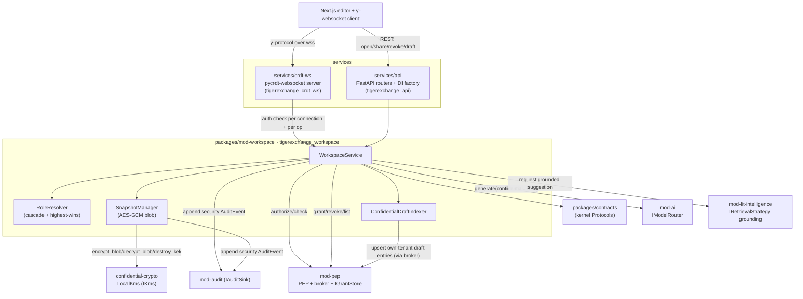

# 11 — mod-workspace: Confidential CRDT Co-Authoring (CENTERPIECE)

> **What this document is.** The complete low-level design for `mod-workspace`
> (import root `tigerexchange_workspace`) — the **centerpiece** of TigerExchange: confidential
> cross-group co-authoring of a grant proposal. This is **Stage 3** of the collaboration loop
> (`01-product-and-loop-overview.md`) and the build phase **P0.9**. It is the surface that produces
> the activation north-star event (`collaborator_joined` where `joining_tenant != workspace_owner_tenant`).
>
> **Who reads this.** The builder. You will type this against the frozen kernel
> (`05-kernel-contracts.md`) and the locked DDL (`13-data-model-and-schemas.md`). Where this doc and a
> sibling disagree on a **kernel type** the kernel wins (`05`); on a **physical schema** detail `13`
> wins; on **names / pins / forbidden items** `CONVENTIONS-single-box.md` wins; on **security
> behavior** `06-security-spine-lld.md` wins. This doc is authoritative for the *workspace feature
> design* and for how it composes those frozen pieces.
>
> **Decisions expanded here:** **D11** (mod-workspace promoted to first-class P0; walking-skeleton =
> real-time edit only), **D10** (confidential KV isolation via the ONE shared generator, no second
> 30B copy), **D7** (crypto-shred split: encrypted-tablespace DEK-destroy for searchable; AES-256-GCM
> for non-searchable blobs; fTPM/passphrase anchor). Supporting: **D2** (federation designed-not-built),
> **D3/D4** (single PEP + fixed fail-closed order), **D5** (FORCE-RLS isolation), **D6** (per-tenant
> confidential retrieval surface), **D12** (the write-back edge consumes what this module produces).
> Decision IDs are **D1..D14 only** — there are no other labels.
>
> **Cross-references.**
> - Kernel types/Protocols this module imports: `05-kernel-contracts.md`
>   (`IGrantStore`, `IKms`, `IModelRouter`, `IRetrievalStrategy`, `IPolicyEnforcement`, `IAuditSink`,
>   `RelationTuple`, `TenantContext`, `Capability`, `Tier`, `GenerationRequest`, `PepRequest`,
>   `PepAction`).
> - Security behavior (PEP decision order, revocation durability + crash recovery, confidential
>   surface isolation, the HUMAN-authored CI gates): `06-security-spine-lld.md`.
> - The two retrieval surfaces and the dual-source grounding pipeline this editor feeds and consumes:
>   `07-data-layer-and-retrieval-lld.md` and `10-feature-modules-lld.md` (`mod-lit-intelligence`).
> - Shared-generator KV isolation mechanics (prefix-caching-off + serialization): `08-ai-plane-and-model-router-lld.md`.
> - The exact tables: `13-data-model-and-schemas.md` — `proposal` (§9), `confidential_index_entry`
>   (§10), `team_member` (§11), `sharing_grant` (§12), `relation_tuple` (§13), `encrypted_blob` (§18),
>   `kek` (§19), `revocation_log` (§22), `loop_event` (§21).
> - The Pursuit lifecycle this drafting feeds and the write-back that consumes a won proposal:
>   `12-collaboration-loop-and-writeback-lld.md`.
> - Build script + which tests are HUMAN-authored: `14-build-runbook-and-phases.md`.

---

## 0. Table of contents

1. [Scope: what P0.9 ships and what is explicitly deferred to P1](#1-scope-what-p09-ships-and-what-is-explicitly-deferred-to-p1)
2. [Where mod-workspace sits (module boundary + the no-direct-import rule)](#2-where-mod-workspace-sits-module-boundary--the-no-direct-import-rule)
3. [The CRDT buffer (pycrdt) — why, what shape, what survives a restart](#3-the-crdt-buffer-pycrdt--why-what-shape-what-survives-a-restart)
4. [The self-hosted websocket server (`services/crdt-ws`)](#4-the-self-hosted-websocket-server-servicescrdt-ws)
5. [Notion-style scoped roles, permission cascade, highest-permission-wins](#5-notion-style-scoped-roles-permission-cascade-highest-permission-wins)
6. [SharingGrant (ReBAC) lighting cross-tenant membership](#6-sharinggrant-rebac-lighting-cross-tenant-membership)
7. [Immediate revocation (zero allow-window) for the security reason](#7-immediate-revocation-zero-allow-window-for-the-security-reason)
8. [KEK-bound AES-GCM snapshotting, autosave, and version history](#8-kek-bound-aes-gcm-snapshotting-autosave-and-version-history)
9. [MAX-rule confidential tagging — every draft artifact lands only in encrypted stores](#9-max-rule-confidential-tagging--every-draft-artifact-lands-only-in-encrypted-stores)
10. [Indexing own-tenant drafts into the per-tenant confidential retrieval surface (D6)](#10-indexing-own-tenant-drafts-into-the-per-tenant-confidential-retrieval-surface-d6)
11. [Confidential generation: backpressure on the ONE shared generator (D10)](#11-confidential-generation-backpressure-on-the-one-shared-generator-d10)
12. [Crash recovery of the CRDT doc](#12-crash-recovery-of-the-crdt-doc)
13. [Public interfaces of mod-workspace (verbatim Python signatures)](#13-public-interfaces-of-mod-workspace-verbatim-python-signatures)
14. [End-to-end sequence diagrams](#14-end-to-end-sequence-diagrams)
15. [Loop events emitted (never on the security stream)](#15-loop-events-emitted-never-on-the-security-stream)
16. [Configuration (verbatim snippet)](#16-configuration-verbatim-snippet)
17. [Acceptance tests (P0.9) + what is HUMAN-authored](#17-acceptance-tests-p09--what-is-human-authored)
18. [Federation honesty: which seams carry forward, which are rewrites](#18-federation-honesty-which-seams-carry-forward-which-are-rewrites)
19. [Failure modes and the fail-closed defaults table](#19-failure-modes-and-the-fail-closed-defaults-table)

---

## 1. Scope: what P0.9 ships and what is explicitly deferred to P1

**D11 walking-skeleton.** Shipping all three editorial modes (real-time + suggesting/tracked-changes
+ anchored comments) plus role cascade plus the full confidentiality path in one phase is too large a
surface for a 30B builder to get the confidentiality right. So P0.9 ships **real-time concurrent edit
only**. That alone proves (a) the cross-group aha-moment (the activation north-star) and (b) the
confidential-snapshot + immediate-revocation security path. Everything else is P1.

| Capability | P0.9 (this doc) | P1 (designed against the same seams, NOT built now) |
|---|---|---|
| Real-time concurrent edit (multiple cursors converge) | **YES** | — |
| Notion-style scoped roles (PI/co-PI/reviewer/viewer) | **YES** | — |
| Permission cascade + highest-permission-wins | **YES** | — |
| KEK-bound AES-256-GCM snapshot + autosave + version history | **YES** | — |
| MAX-rule confidential tagging of all draft artifacts | **YES** | — |
| Indexing own-tenant drafts into the confidential surface (D6) | **YES** | — |
| SharingGrant (ReBAC) cross-tenant membership | **YES** | — |
| Immediate revocation (zero allow-window, security reason) | **YES** | — |
| Crash recovery of the CRDT doc | **YES** | — |
| Backpressure when the shared generator is busy | **YES** | — |
| **Suggesting / tracked-changes mode (PI accept/reject)** | **NO — P1** | track-changes overlay on the CRDT doc; `suggestion_resolved` loop event |
| **Anchored comments + resolve threads** | **NO — P1** | RelativePosition-anchored comment threads; resolve workflow |
| **Branch/merge of versions, diff UI** | **NO — P1** | snapshot-graph branching |

> **Why "real-time edit only" and not "comment-only read view".** A read-only comment workspace has
> no true co-authoring, so it never produces the cross-tenant `first_co_edit` / `collaborator_joined`
> events that *are* the aha-moment. We chose the smallest slice that still proves the centerpiece, over
> (a) the full three-mode build (too much confidentiality surface to get right at once) and (b) a
> comment-only stub (no co-authoring = no validated loop). (D11 alternatives_rejected.)

**Two-tenant pilot scope.** P0.9 is validated on **one tenant pair** (the walking-skeleton substrate
from the brief): tenant A owns a workspace, a member of tenant B joins via a SharingGrant. The design
generalizes to N members across M tenants, but the acceptance tests assert the A↔B case.

---

## 2. Where mod-workspace sits (module boundary + the no-direct-import rule)

`mod-workspace` is a **dumb plug-in behind the PEP** (D3). It composes kernel Protocols wired by the
DI factory in `services/api`; it imports **only** `tigerexchange_contracts` and its own subpackage
(CONVENTIONS §4 rule 2). It **never**:

- imports `tigerexchange_data_plane`, `asyncpg`, or `sqlalchemy`, or opens its own DB connection
  (CONVENTIONS §4 rule 3) — it receives already-projected, already-tier-checked objects from the
  **broker**;
- imports the classifier engine directly (rule 4);
- constructs a `PublishableProjection` (rule 5) — confidential drafts must **never** be shaped for the
  shared index, and the AST test forbids any module from building one.

It depends, through kernel Protocols only, on:

| Kernel Protocol (from `05`) | Used for |
|---|---|
| `IPolicyEnforcement.authorize` / `.check` | every workspace action passes the fixed 6-step fail-closed order (D4); ReBAC `check` resolves cross-tenant membership |
| `IGrantStore` | issue / revoke / list cross-group `SharingGrant`s (ReBAC tuples) (D11) |
| `IKms` | `encrypt_blob` / `decrypt_blob` for CRDT snapshots; `destroy_kek` participates in revocation crypto-shred (D7) |
| `IModelRouter.generate` | confidential drafting on the ONE shared 30B generator with `confidential=True` (D10) |
| `IRetrievalStrategy.retrieve` | dual-source grounding (shared public + own-tenant confidential surface); but **`mod-workspace` calls `mod-lit-intelligence` for grounded drafting** — see note below |
| `IAuditSink.append` | hash-chained **security** audit of share/revoke/snapshot/egress decisions |

> **Grounded drafting belongs to `mod-lit-intelligence`, not here.** The dual-source RAG (retrieve
> over the shared public index AND the owning tenant's confidential surface, RRF, rerank, RAGAS gate,
> in-boundary judge) lives in `mod-lit-intelligence` (`10-feature-modules-lld.md`). `mod-workspace`
> *requests* a grounded suggestion through a kernel-typed call and inserts the returned text into the
> CRDT doc. `mod-workspace` owns the **editor, roles, snapshots, revocation, and confidential-surface
> indexing of the produced draft**; it does not own retrieval or synthesis. This keeps the module
> boundary clean (a 30B builder cannot smear retrieval logic into the editor).



> **The websocket server is a separate process but NOT a separate authority.** `services/crdt-ws`
> relays CRDT updates; it does **not** make authorization decisions on its own. Every connection and
> every privileged operation (join, edit-vs-view enforcement, snapshot, revoke) is authorized by
> `WorkspaceService` through the single PEP. The websocket process holds **no** raw-store credentials
> and **no** key material. See §4.

---

## 3. The CRDT buffer (pycrdt) — why, what shape, what survives a restart

### 3.1 Why a CRDT (and not OT or last-write-wins)

We chose a **CRDT via Yjs/y-crdt (`pycrdt`, the successor to `y-py`)** for the live edit buffer (D11,
CONVENTIONS §5 "Concurrent co-authoring engine" row). Rationale:

- **Merges in any order** — concurrent edits from a tenant-A PI and a tenant-B co-PI converge to the
  same document regardless of arrival order; no central serialization point is required for
  correctness.
- **Survives server restart and supports offline edit + autosave recovery** — the document state is a
  mergeable value, so a reconnecting client re-syncs by exchanging state vectors, not by replaying a
  fragile operation log.
- **Fully self-hostable on one box** — `pycrdt` has aarch64 wheels (verified-available per the brief
  tech_stack); the CRDT doc per proposal is KB–MB, so the CRDT is **never** the memory or latency
  constraint on this box.

**Rejected:** Operational Transformation (requires a central transform server, worse offline and
recovery story); last-write-wins (silently loses concurrent edits — unacceptable for co-authoring).
(D11 / CONVENTIONS §5.)

> **Fallback (CONVENTIONS §5):** if the `pycrdt` aarch64 wheel breaks on the JetPack base, build
> `y-crdt` from Rust source on the box. The doc-size constraint is never the CRDT, so this is a build
> issue, not a design issue.

### 3.2 The document shape (one `Doc` per proposal)

Each `Proposal` (`13` §9) has exactly one live CRDT `Doc`. The proposal's `crdt_doc_ref` column
(`13` §9) is the stable handle for that doc. The doc is structured so that snapshots and the
confidential-surface indexer can extract plain text deterministically.

```python
# packages/mod-workspace/tigerexchange_workspace/crdt_doc.py  (shape, illustrative)
from __future__ import annotations
from pycrdt import Doc, Map, XmlFragment, Array


def new_proposal_doc() -> Doc:
    """Construct the canonical CRDT shape for a proposal draft.

    Layout (top-level keys are STABLE; do not rename — snapshots and the confidential
    indexer rely on them):
      doc["meta"]      : Map   -> {proposal_id, pursuit_id, owner_tenant_id, schema_version}
      doc["body"]      : XmlFragment -> the rich-text proposal body (sections as XML elements)
      doc["sections"]  : Array -> ordered section ids (Specific Aims, Approach, Budget Justification, ...)
    """
    doc = Doc()
    doc["meta"] = Map()
    doc["body"] = XmlFragment()
    doc["sections"] = Array()
    return doc
```

> **Why `XmlFragment` for the body.** The Yjs ecosystem's collaborative rich-text bindings
> (ProseMirror/Tiptap on the Next.js side) bind to a shared `XmlFragment`. Using it keeps the client
> editor and the server doc compatible without a custom mapping. The **plain-text extraction** used by
> the snapshot and the confidential indexer walks `doc["body"]` to a UTF-8 string deterministically
> (§8.3, §10).

### 3.3 What is the durable source of truth

The CRDT doc in process memory is the **live** buffer. The **durable** source of truth is the
sequence of **AES-256-GCM-encrypted CRDT state snapshots** in `tex.encrypted_blob`
(`13` §18, `kind = 'crdt_snapshot'` and `'autosave'`). On any restart or crash, the live doc is
**reconstructed by decrypting and applying the latest snapshot**, then re-syncing connected clients
(§12). There is no plaintext CRDT state on disk, ever (§9).

---

## 4. The self-hosted websocket server (`services/crdt-ws`)

### 4.1 Process model

`services/crdt-ws` (import root `tigerexchange_crdt_ws`) is a self-hosted **pycrdt-websocket**
(Hocuspocus-style) server process. It is one of the small fixed set of deployables (CONVENTIONS §2).
It runs in the **SERVE** memory regime; the brief's budget counts the CRDT websocket server inside the
"~5GB Postgres backends + PgBouncer + FastAPI + Python workers + CRDT websocket server" line, and
notes "CRDT docs KB-MB, negligible" (brief `memory_budget`). It does **not** add a model copy.

### 4.2 What it does and does NOT do

| Does | Does NOT do |
|---|---|
| Maintain one in-memory `Doc` (a "room") per open `proposal_id` | Make authorization decisions itself |
| Relay y-protocol sync/update messages between connected clients of the **same** room | Hold raw-store credentials |
| On client connect, call `WorkspaceService.authorize_connection(...)` (which calls the PEP) before joining a room | Hold key material (KEKs/DEKs) |
| Enforce **edit vs view** by dropping inbound update messages from a connection whose resolved role is `reviewer`/`viewer` | Persist plaintext CRDT state to disk |
| Trigger autosave snapshots on the autosave interval and on the last-client-disconnect | Decide role cascade (it asks `RoleResolver`) |
| **Immediately close** all connections for a `(proposal_id, subject)` on a revocation signal (§7) | Run any model / retrieval call |

> **Authorization is per-connection AND continuous.** A connection is authorized once at join, but the
> server also re-checks on a short cadence and **on every revocation broadcast** (§7), because the
> security requirement is a **zero allow-window** on a security revocation. A connection that loses
> authorization is force-closed and its in-flight buffered updates are discarded.

### 4.3 The revocation channel (in-process pub/sub)

The websocket server subscribes to an **in-process revocation channel** published to by
`WorkspaceService.revoke_collaborator(...)` after the durable revocation has committed (§7). On a
single box this is an `asyncio` broadcast (or a Postgres `LISTEN/NOTIFY` on a `workspace_revocation`
channel — the builder may use either; `LISTEN/NOTIFY` is preferred because it also survives the API
process and the ws process being separate). The contract: **the durable `revocation_log` row is
committed (fsync) before the notification is sent**, so the notification can never out-run the
authoritative deny (`06`, `13` §22).

```python
# services/crdt-ws/tigerexchange_crdt_ws/server.py  (shape, illustrative)
from __future__ import annotations
from typing import Protocol


class WorkspaceAuthority(Protocol):
    """The crdt-ws server depends on this NARROW surface of WorkspaceService.
    It is given an implementation by the DI factory; it never imports mod-pep/data-plane directly."""

    async def authorize_connection(
        self, *, proposal_id: str, subject_id: str, tenant_id: str
    ) -> "ResolvedRole | None":
        """Return the resolved (cascaded, highest-wins) role, or None to DENY the connection."""
        ...

    async def on_autosave(self, *, proposal_id: str, state_update: bytes) -> None:
        """Hand the server-side CRDT state snapshot to WorkspaceService for AES-GCM persistence."""
        ...
```

---

## 5. Notion-style scoped roles, permission cascade, highest-permission-wins

### 5.1 The role enum (exact values from `13` §0.8 `tex.team_role`)

Roles are the native enum `tex.team_role` with **exactly four members** (`13` §0.8). The capability
each grants in the editor:

| Role (`tex.team_role`) | Notion analog | Editor capability | CRDT effect |
|---|---|---|---|
| `pi` | owner | full edit + invite + revoke + accept/reject (P1) | inbound updates accepted; may snapshot, share, revoke |
| `co_pi` | edit | full edit | inbound updates accepted |
| `reviewer` | comment | comment-only (P1: anchored comments); **P0 = read** | inbound body updates **dropped** by the ws server |
| `viewer` | view | read-only | inbound updates dropped; receives sync only |

> **P0 reality for `reviewer`.** Anchored comments are P1 (§1). At P0, a `reviewer` is functionally a
> `viewer` (read-only) — the role is *stored and resolved* correctly so that enabling P1 comment
> threads is purely additive, but at P0 the ws server treats both `reviewer` and `viewer` as
> non-editing connections. This is stated so the builder does not implement a half-built comment path.

### 5.2 Where role lives (and the cross-tenant subtlety)

A member's role on a proposal is stored on `tex.team_member` (`13` §11): `role tex.team_role`,
`member_subject_id`, `member_tenant_id` (which **may differ** from the team's owning `tenant_id` —
that difference is the cross-group collaboration). Per `13` §11, a member from a **different** tenant
does **not** see the `team_member` row through that table's RLS; their access is authorized through a
`sharing_grant` / `relation_tuple` resolved by the ReBAC `check`, **not** by reading `team_member`.

So role resolution has **two inputs**:

1. **Same-tenant members** → the `team_member.role` row (RLS-visible to the owning tenant).
2. **Cross-tenant members** → the `relation_tuple` materialized from a `SharingGrant` (§6), resolved
   by `IPolicyEnforcement.check`. The grant's `relation` (`editor` / `commenter` / `viewer`) maps to
   the role.

### 5.3 The cascade (team → proposal)

Roles **cascade** from a team to its proposal. Per `13` §13, the parent cascade is modeled by tuples
like `('team:T', 'parent', 'proposal:P')` plus an explicit rewrite: a member who is `editor` on
`team:T` is `editor` on `proposal:P`. **At P0 the implied tuples are written denormalized on grant**
(the grant path is the single writer; the SQL `Check()` does not compute rewrites at query time —
`13` §13). So the cascade is: grant on the team writes both the team tuple **and** the implied
proposal tuple.

### 5.4 Highest-permission-wins

A subject may acquire a role by **more than one path** (e.g. a direct `team_member` row AND a
cross-tenant SharingGrant; or two grants at different scopes). The effective role is the
**maximum permission** over all paths. Permission strength order (most → least):

```
pi  >  co_pi  >  reviewer  >  viewer
```

```python
# packages/mod-workspace/tigerexchange_workspace/roles.py  (verbatim)
from __future__ import annotations
from enum import IntEnum
from typing import Iterable


class RoleStrength(IntEnum):
    """Numeric strength for highest-permission-wins. Maps to tex.team_role labels.
    HIGHER int == MORE permission. Unknown/empty -> VIEWER (least), never escalate."""
    VIEWER = 0
    REVIEWER = 1
    CO_PI = 2
    PI = 3

    @classmethod
    def from_label(cls, label: str) -> "RoleStrength":
        return {
            "viewer": cls.VIEWER,
            "reviewer": cls.REVIEWER,
            "co_pi": cls.CO_PI,
            "pi": cls.PI,
        }.get(label, cls.VIEWER)   # unknown -> least permission (fail-closed)

    def to_label(self) -> str:
        return {0: "viewer", 1: "reviewer", 2: "co_pi", 3: "pi"}[int(self)]


def highest_permission_wins(role_labels: Iterable[str]) -> RoleStrength:
    """Resolve the effective role as the MAX over all granted roles.

    CRITICAL fail-closed contract: an EMPTY set of roles -> VIEWER is WRONG here, because
    'no role at all' must mean NO ACCESS, not view access. The caller MUST treat an empty
    input as DENY (return None / refuse the connection), NOT call this. This function assumes
    the subject has at least one role; it picks the strongest. Mirror of the kernel MAX-rule
    intuition but for ROLES, not tiers.
    """
    best = RoleStrength.VIEWER
    seen = False
    for label in role_labels:
        seen = True
        s = RoleStrength.from_label(label)
        if s > best:
            best = s
    if not seen:
        raise ValueError("highest_permission_wins called with no roles; caller must DENY instead")
    return best
```

> **Why role MAX-rule is "highest wins" but the tier join is also a MAX-rule, yet they point opposite
> directions.** The kernel `Tier` MAX-rule picks the **most restrictive** tier (confidential), because
> confidentiality is fail-closed. Role resolution picks the **most permissive** role, because a
> subject legitimately granted edit by *any* valid path should be able to edit — but the **resource
> tier never changes**: the proposal stays `confidential` regardless of role. A high role lets you
> *edit confidential content you are entitled to*; it never *down-classifies* anything. Keep these two
> "MAX" rules mentally separate; they govern different lattices. The empty-role case is fail-closed in
> both: empty tiers → `confidential`; empty roles → **DENY** (no access), not viewer.

---

## 6. SharingGrant (ReBAC) lighting cross-tenant membership

### 6.1 What a SharingGrant is

A `SharingGrant` (`13` §12) is a **revocable, scope-bounded, owner-authoritative** cross-group access
grant. It is the mechanism by which a tenant-A PI invites a tenant-B researcher into the confidential
workspace. It is **materialized as a `RelationTuple`** (`13` §13, kernel `RelationTuple` in `05` §9.1)
plus human-facing metadata (scope, expiry, reason) in `tex.sharing_grant`.

Issuing a grant requires the `CROSS_GROUP_SHARE` capability on the issuer's entitlement (`05` §4.1).
The PEP gates this at step 1–2 (entitlement → capability) of the fixed order (D4). A tenant on the
`discovery_only` edition lacks `CROSS_GROUP_SHARE` and **physically cannot** issue a cross-group
invite (`05` §4: "Entitlement-at-PEP capability gating").

### 6.2 The grant flow (verbatim shape)

```python
# packages/mod-workspace/tigerexchange_workspace/sharing.py  (shape, illustrative)
from __future__ import annotations
from tigerexchange_contracts import (
    IGrantStore, IPolicyEnforcement, IAuditSink,
    RelationTuple, TenantContext, PepRequest, PepAction, Capability, Tier,
)


async def invite_collaborator(
    *,
    ctx: TenantContext,                 # the inviting PI's request context (owner tenant)
    pep: IPolicyEnforcement,
    grants: IGrantStore,
    audit: IAuditSink,
    proposal_id: str,
    member_subject_id: str,
    member_tenant_id: str,              # the GUEST tenant (may != ctx.tenant_id)
    relation: str,                      # "editor" | "commenter" | "viewer"
    scope: dict,
    reason: str,
) -> None:
    # 1. PEP authorizes a SHARE action; requires CROSS_GROUP_SHARE capability (D4 steps 1-2).
    decision = await pep.authorize(PepRequest(
        context=ctx,
        action=PepAction.SHARE,
        required_capability=Capability.CROSS_GROUP_SHARE,
        resource_tier=Tier.CONFIDENTIAL,           # the workspace is confidential
        relation=relation,
        object_ref=f"proposal:{proposal_id}",
    ))
    if not decision.allowed:
        await audit.append(event=_share_denied_event(ctx, proposal_id, decision.reason_code))
        raise PermissionError(decision.reason_code)

    # 2. Materialize the ReBAC tuple. Subject encodes the GUEST tenant so Check() resolves cross-tenant.
    #    The tuple is owned (RLS) by the OWNER tenant (ctx.tenant_id) -- owner-authoritative.
    tuple_ = RelationTuple(
        subject=f"user:{member_subject_id}@{member_tenant_id}",
        relation=relation,
        object=f"proposal:{proposal_id}",
        tenant_id=ctx.tenant_id,                   # owner tenant
    )
    await grants.grant(tuple=tuple_, granted_by=ctx.subject_id, scope=str(scope), reason=reason)
    # 2b. Cascade: also write the implied team->proposal tuple denormalized (13 §5.3 / §13).
    #     (omitted here; RoleResolver writes both on grant.)

    # 3. SECURITY audit (hash-chained) -- a grant issued is a security-relevant event.
    await audit.append(event=_grant_issued_event(ctx, proposal_id, tuple_, reason))
    # 4. The corresponding LOOP event (collaborator invited / joined) goes to the SEPARATE
    #    loop_event stream, NOT here (see §15).
```

> **Owner-authoritative re-derivation (D2 carry-forward-clean seam, `06`/`13` §12).** The owner tenant
> re-derives the effective scope from `tex.sharing_grant`; a caller's claimed scope is an **untrusted
> hint**. This invariant carries forward cleanly to federation. Do not trust a guest-supplied scope.

### 6.3 How the guest's access is resolved at edit time

When the tenant-B member connects, `WorkspaceService.authorize_connection` runs the PEP. ReBAC step 4
calls `IPolicyEnforcement.check(subject="user:<B-subject>@<B-tenant>", relation="editor",
object="proposal:<id>", tenant_id="<A-owner-tenant>")`, which runs the recursive-CTE `Check()`
(`13` §13) **inside the owner tenant's transaction**. The cascade (team→proposal) and usersets
(`group:G#member`) are followed up to the depth-16 bound. The grant's `relation` maps to a role label
via `RoleResolver`, which then runs `highest_permission_wins` over all of the guest's resolved roles.

> **HONEST federation caveat (D2/D4).** The recursive-CTE `Check()` resolves **LOCAL tables only**.
> On one box that is complete — the guest tenant lives in the same Postgres. Cross-**box** federation
> needs distributed tuple resolution this CTE cannot do; that is a **known federation-boundary
> rewrite**, not a transport swap (`15-future-federation-interfaces.md`, §18 below). Do not let a
> future builder believe cross-box sharing is "just plumbing on top of this".

---

## 7. Immediate revocation (zero allow-window) for the security reason

### 7.1 The requirement

When a collaborator is revoked **for a security reason** (`tex.revoke_reason = 'security'` or
`'consent'`, `13` §0.8), there must be **zero allow-window**: the instant the revocation is durable,
that subject can no longer read or edit the confidential draft — including an already-open websocket
connection. This is the centerpiece's hardest security property and a HUMAN-authored P0.9 gate
("revoked collaborator loses access immediately (zero allow-window, security reason)").

### 7.2 The exact ordering (durability before observation)

The order is fixed by `06`/`13` §22 ("a revocation must commit before any allow/deny observes it").
`WorkspaceService.revoke_collaborator` performs, in this order:

```mermaid
sequenceDiagram
    participant PI as PI (owner tenant)
    participant WS as WorkspaceService (mod-workspace)
    participant GS as IGrantStore (mod-pep)
    participant DB as Postgres (revocation_log, fsync)
    participant KMS as IKms (LocalKms)
    participant CH as Revocation channel (LISTEN/NOTIFY)
    participant CRDT as crdt-ws server
    participant AUD as IAuditSink

    PI->>WS: revoke(proposal, subject, reason="security")
    WS->>GS: revoke(tuple, reason)  %% flips sharing_grant.revoked_at + writes relation_tuple removal
    WS->>DB: INSERT revocation_log(object_ref, reason, revocation_epoch++) ; COMMIT (synchronous_commit=on, fsync)
    DB-->>WS: committed=true  %% AUTHORITATIVE deny now exists durably
    WS->>AUD: append revocation AuditEvent (hash-chained)
    alt reason in (security, consent)
        WS->>KMS: (deferred to §7.4) crypto-shred path for the OBJECT, not the subject
    end
    WS->>CH: NOTIFY workspace_revocation (proposal_id, subject)  %% ONLY AFTER commit
    CH-->>CRDT: revocation event
    CRDT->>CRDT: force-close all connections for (proposal_id, subject); drop buffered updates
    Note over CRDT: subsequent reconnect re-runs PEP -> tombstone read DENIES
```

**Why this order is correct (fail-closed):**

- The **durable `revocation_log` row is the authoritative deny** (D4 step 5). It is committed with
  `synchronous_commit=on` (fsync) **before** the NOTIFY is sent. So even if the box crashes between
  commit and NOTIFY, recovery rebuilds authorization strictly from the log and the subject stays
  denied (anti-resurrection, `06`).
- The NOTIFY closes live sockets **as an optimization for the live connection**, not as the security
  guarantee. The guarantee is the tombstone: the next PEP `authorize` for that subject reads the
  durable tombstone at step 5 and DENIES. There is no positive cache that can keep them in — leases
  are **narrow-only** and short-TTL, and the durable log is authoritative for deny (D4).
- Because the tombstone exists before any further allow can be observed, the **allow-window is zero**:
  no decision taken after the commit can return ALLOW for that subject on that object.

### 7.3 What "force-close" does to the CRDT doc

The revoked subject's connection(s) are closed; any updates they had buffered but not yet relayed are
**discarded** (they were never applied to the authoritative doc, which is rebuilt from the last
snapshot). The remaining collaborators' doc is unaffected — CRDT merge means dropping one peer's
un-relayed delta does not corrupt convergence; it simply never happened.

### 7.4 Revocation of a COLLABORATOR vs crypto-shred of the OBJECT

These are distinct and the builder must not conflate them:

- **Revoking a collaborator** (a person loses access) = removing their `relation_tuple` / flipping
  `sharing_grant.revoked_at` + the durable `revocation_log` tombstone on `grant:<id>`. It does
  **NOT** destroy the tenant's DEK (other legitimate collaborators still need the draft).
- **Crypto-shredding the OBJECT** (the confidential draft itself must be erased, e.g. consent
  withdrawal for the whole proposal or a tenant offboarding) = `destroy_kek()` on the tenant's DEK
  (D7), after which the AES-GCM snapshots (§8) AND the encrypted-tablespace confidential surface
  (§10) become permanently undecryptable, then drop-and-rebuild (`13` §22, P0.4b). This is the only
  sanctioned `DROP` (CONVENTIONS §9).

> A `security`/`consent` revocation **on a whole proposal/tenant** triggers the object crypto-shred
> path; a `security` revocation **of one collaborator** does not. The `revocation_log.object_ref`
> (`grant:<id>` vs `proposal:<id>` vs the tenant) tells the handler which path to run.

---

## 8. KEK-bound AES-GCM snapshotting, autosave, and version history

### 8.1 The rule: CRDT snapshots are NON-searchable blobs → AES-256-GCM (D7 path B)

The CRDT doc snapshot, autosave checkpoints, and version history are **non-searchable opaque blobs**.
Per **D7**, application-layer **AES-256-GCM under the per-tenant DEK** is the **correct** mechanism
for exactly this case (data is never searched). They are stored in `tex.encrypted_blob` (`13` §18)
with `kind ∈ {'crdt_snapshot','autosave','version'}`. The blob is encrypted via
`IKms.encrypt_blob(...)` (`05` §10.2) before insert; the broker writes the row (the module never holds
a DB connection — §2).

> **FORBIDDEN, do not do this (CONVENTIONS §6):** never AES-GCM the *confidential search index*
> (§10) — that is mathematically unsearchable. AES-GCM here is **only** for the opaque CRDT snapshot
> blobs. The searchable confidential surface is crypto-shredded by encrypted-tablespace DEK
> destruction, not by AES-GCM (D7).

### 8.2 Snapshot cadence (autosave intervals, NOT per keystroke)

Snapshotting per keystroke would (a) thrash the encrypted blob store and (b) risk a draft artifact
escaping the encrypted path under load (open_risks: "CRDT confidential draft leaks via
autosave/version-history buffers"). The mitigation is fixed: **snapshot on autosave intervals**
(default 10s of inactivity or 30s max since last snapshot, whichever first) and on the
**last-client-disconnect** for a room. Per-keystroke deltas live only in the in-memory CRDT and the
y-protocol relay; they are never persisted in plaintext.

### 8.3 The snapshot/encrypt/persist path (verbatim shape)

```python
# packages/mod-workspace/tigerexchange_workspace/snapshots.py  (shape, illustrative)
from __future__ import annotations
from pycrdt import Doc
from tigerexchange_contracts import IKms, KeyRef, TenantContext


class SnapshotManager:
    """Encrypts CRDT state snapshots with the per-tenant DEK (AES-256-GCM) and hands the
    ciphertext to the broker for insert into tex.encrypted_blob. Holds NO DB connection."""

    def __init__(self, kms: IKms, blob_writer: "BlobWriter") -> None:
        self._kms = kms
        self._blobs = blob_writer   # broker-backed writer; mod-workspace never opens a conn (§2)

    async def snapshot(
        self, *, ctx: TenantContext, proposal_id: str, doc: Doc, kind: str, version: int
    ) -> str:
        # 1. Serialize the FULL CRDT state (mergeable; recovery applies it to a fresh Doc).
        state: bytes = doc.get_update()                      # pycrdt full-state update bytes

        # 2. AES-256-GCM under the per-tenant DEK. AAD binds the ciphertext to its context so a
        #    blob cannot be replayed under a different proposal/tenant.
        key_ref = KeyRef(kek_id=ctx.kek_id, tenant_id=ctx.tenant_id)  # active KEK looked up by tenant
        aad = f"{ctx.tenant_id}|proposal:{proposal_id}|{kind}|v{version}".encode()
        ciphertext = await self._kms.encrypt_blob(key_ref=key_ref, plaintext=state, aad=aad)

        # 3. Persist via the broker (kind in {'crdt_snapshot','autosave','version'}); owner_ref pins it.
        blob_id = await self._blobs.insert_encrypted(
            tenant_id=ctx.tenant_id,
            kind=kind,
            owner_ref=f"proposal:{proposal_id}",
            ciphertext=ciphertext,
            dek_id=ctx.kek_id,
        )
        return blob_id
```

> **AAD (additional authenticated data) binds context.** The AAD ties each snapshot to its
> `tenant_id | proposal | kind | version`. AES-GCM authenticates the AAD, so a ciphertext copied to a
> different proposal/tenant fails decryption — defense against blob replay. The DDL stores `nonce`,
> `ciphertext`, `auth_tag` separately (`13` §18); `IKms.encrypt_blob` returns the framed bytes and the
> `BlobWriter` splits them per the column layout (or stores them framed — builder's choice, but be
> consistent with `decrypt_blob`).

### 8.4 Version history

Each promoted version (e.g. the doc state at `proposal.lifecycle_state` transitions, or an explicit
"save version") writes a `kind='version'` blob with the proposal's monotonic `version` (`13` §9). The
`proposal.kek_snapshot_ref` column points at the latest `crdt_snapshot` blob handle. Version history
is the same encrypted-blob path; **branch/merge/diff UI is P1** (§1). Crypto-shred reaches all
versions because they are all under the one per-tenant DEK (`13` §18: `destroy_kek()` shreds them
O(1)).

---

## 9. MAX-rule confidential tagging — every draft artifact lands only in encrypted stores

### 9.1 The tagging rule

The proposal is **always** `tier = confidential` — pinned at the DB level by
`CHECK (tier = 'confidential')` on `tex.proposal` (`13` §9). Every artifact derived from it inherits
confidential by the kernel **MAX-rule** (`05` §3): `tier_join_all([...inputs...])` over a draft
grounded on a public paper AND a confidential prior proposal returns **confidential** (the most
restrictive). A confidential input can never be laundered down through a derivation.

The artifacts and where they may live:

| Artifact | Tier | Storage (the ONLY permitted location) |
|---|---|---|
| Live CRDT doc | confidential | in-memory + AES-GCM `encrypted_blob` snapshots (`13` §18) |
| Autosave checkpoint | confidential | AES-GCM `encrypted_blob` (`kind='autosave'`) |
| Version history | confidential | AES-GCM `encrypted_blob` (`kind='version'`) |
| Confidential-surface index entries for own drafts | confidential | `confidential_index_entry` on the per-tenant **encrypted tablespace** (`13` §10) — searchable, crypto-shred by DEK-destroy |
| RAGAS / generation eval traces for confidential drafting | confidential | AES-GCM `encrypted_blob` (`kind='eval_trace'`) |
| The generated suggestion text before insertion | confidential | transient in process memory; inserted into the CRDT doc; never written to a non-encrypted store |

### 9.2 The hard invariant (HUMAN-authored test)

> **No draft artifact may land in any non-encrypted store.** This is a HUMAN-authored P0.9 / open_risks
> mitigation: "a test that no draft artifact lands in a non-encrypted store." The builder must route
> **every** persisted draft byte through either the AES-GCM blob path (§8) or the encrypted-tablespace
> confidential surface (§10). In particular: no plaintext snapshot file, no plaintext autosave on the
> HDD, no draft text in a log line, no draft text in `loop_event.payload`, no draft text in the
> security `audit_event.payload`. The audit and loop events carry **references and metadata only**
> (proposal_id, actor, ts), never draft content.

### 9.3 The PublishableProjection wall

`mod-workspace` **never** constructs a `PublishableProjection` (CONVENTIONS §4 rule 5; AST test). Even
if a builder tried, the kernel validator rejects `tier=confidential` (`05` §7.3). So a confidential
draft **cannot** be shaped for the shared cross-tenant index — structurally, independent of the
classifier (D6). The only index a draft enters is the **owning tenant's** confidential surface (§10).

---

## 10. Indexing own-tenant drafts into the per-tenant confidential retrieval surface (D6)

### 10.1 Why this exists (the moat)

The centerpiece moat is grounding a draft in the tenant's **own prior winning proposals + own current
drafts** (Stage 3 dual-source grounding). For that, the tenant's own confidential content must be
**indexed for its OWNING tenant's retrieval** — into the **per-tenant confidential retrieval surface**
(`confidential_index_entry`, `13` §10), which is **RLS-isolated AND physically on a per-tenant
encrypted tablespace** (D6/D7). "Confidential content never enters any SHARED index" means the
**cross-tenant public** index — it does **not** mean confidential content is unindexable for its owning
tenant (D6 correction). Tenant A grounds on A's prior proposals; tenant B **physically cannot** retrieve
them (HUMAN-authored P0.9/P0.5 test).

### 10.2 What gets indexed and when

`ConfidentialDraftIndexer` upserts entries for:

- the tenant's **prior winning proposals** (ingested once when imported / when a Pursuit reaches
  `won`), and
- the **current draft** (re-indexed on a debounced cadence — not per keystroke; aligned with the
  autosave interval — so confidential grounding can cite the in-progress draft's own earlier sections).

Each entry is a chunk of the draft's plain text plus its dense vector. Per `13` §10 the
`content` and `embedding` are **plaintext-at-rest INSIDE the encrypted tablespace** and the embedding
is **searchable** (it is NOT AES-GCM'd — that would make it unsearchable; D7).

```python
# packages/mod-workspace/tigerexchange_workspace/confidential_indexer.py  (shape, illustrative)
from __future__ import annotations
from tigerexchange_contracts import (
    IModelRouter, IPolicyEnforcement, TenantContext, PepRequest, PepAction, Capability, Tier,
)


class ConfidentialDraftIndexer:
    """Upserts own-tenant draft chunks into tex.confidential_index_entry (per-tenant encrypted
    tablespace, RLS). Writes go THROUGH the broker (the module holds no DB connection, §2).
    The PEP authorizes a RETRIEVE_CONFIDENTIAL-class write requiring CONFIDENTIAL_RETRIEVAL."""

    def __init__(self, router: IModelRouter, pep: IPolicyEnforcement, conf_writer: "ConfidentialWriter") -> None:
        self._router = router
        self._pep = pep
        self._conf = conf_writer   # broker-backed; targets the per-tenant encrypted tablespace

    async def reindex_draft(self, *, ctx: TenantContext, proposal_id: str, plaintext_chunks: list[str]) -> None:
        # 1. Authorize: only this tenant's confidential drafting path may touch its confidential surface.
        decision = await self._pep.authorize(PepRequest(
            context=ctx,
            action=PepAction.RETRIEVE_CONFIDENTIAL,     # the confidential-surface gate (D6)
            required_capability=Capability.CONFIDENTIAL_RETRIEVAL,
            resource_tier=Tier.CONFIDENTIAL,
            object_ref=f"proposal:{proposal_id}",
        ))
        if not decision.allowed:
            raise PermissionError(decision.reason_code)

        # 2. Embed with the SERVE-time retriever embedder (bge-m3 / Qwen3-Embedding-0.6B), 1024-dim.
        #    The embedder is the SAME local in-boundary model used everywhere; confidential text never
        #    egresses (the router enforces local-only for confidential, D10/08).
        vectors = await self._router.embed(texts=plaintext_chunks, tenant_id=ctx.tenant_id)

        # 3. Upsert into the per-tenant confidential surface via the broker (create-if-absent partition).
        await self._conf.upsert_entries(
            tenant_id=ctx.tenant_id,
            source_proposal_id=proposal_id,
            chunks=plaintext_chunks,
            vectors=vectors,
        )
```

### 10.3 Isolation properties (restated for the builder)

- **RLS** (D5): `confidential_index_entry` carries the FORCE-RLS RESTRICTIVE policy on
  `tenant_id` (`13` §10). A query without `SET LOCAL app.tenant_id` returns zero rows.
- **Encrypted tablespace** (D7): the table is **`PARTITION BY LIST (tenant_id)`** with each tenant's
  partition on its own encrypted tablespace `ts_conf_<tenant>` (`13` §10 partition note). Crypto-shred
  destroys one tenant's DEK without touching others.
- **PEP-gated** (D3/D6): only a request with `CONFIDENTIAL_RETRIEVAL` (resolved at the PEP) and the
  correct tenant context can read or write this surface. `mod-discovery` (public-tier only) and the
  shared index path can never reach it.

### 10.4 Embedding model note

The confidential surface uses the **same serve-time retriever embedder** (bge-m3 1024-dim, or
Qwen3-Embedding-0.6B — pin the dimension in CONVENTIONS) as the public surface (`07`, `13` §10:
`vector(1024)`). **SPECTER2 is ingest-only** and never serve-resident (D8); it is not used here. Do
not introduce a second serve-time embedding space for the workspace.

---

## 11. Confidential generation: backpressure on the ONE shared generator (D10)

### 11.1 The hard constraint

There is exactly **ONE** resident Qwen3-30B-A3B vLLM generator process, shared by all tenants and all
paths (D9/D10). A second resident 30B copy is **FORBIDDEN** (CONVENTIONS §6) — it would push the box
to ~70GB > 64GB and the centerpiece could not run. Confidential drafting therefore **reuses the same
generator** with:

1. **`--enable-prefix-caching=False` on the confidential path** — so no prefix/KV is shared across
   requests (the real cross-request leak vector vLLM has; D10);
2. **strict request serialization** with a KV boundary between confidential and non-confidential
   requests.

`mod-workspace` does not manage vLLM; it calls `IModelRouter.generate(request=GenerationRequest(...,
confidential=True), context=ctx)` (`05` §9.5, §10.2). The router (`mod-ai`, `08`) sets
`enable_prefix_caching=False` and serializes confidential requests. The HUMAN-authored gate asserts a
confidential request runs with prefix caching disabled (CONVENTIONS §10; brief P0.6 / open_risks).

### 11.2 Why this means the editor must apply backpressure

Because confidential requests are **serialized** on the one shared generator (and yield to interactive
generation), a confidential drafting request may have to **wait** when the generator is busy (another
tenant drafting, an interactive query, or the WRITEBACK-WINDOW semaphore holding it). The editor must
**not** hang the CRDT typing experience while waiting. Real-time editing continues unimpeded (it is
pure CRDT relay, no model involved); only the **"generate a grounded suggestion"** action is queued.

### 11.3 The backpressure contract (verbatim shape)

```python
# packages/mod-workspace/tigerexchange_workspace/drafting.py  (shape, illustrative)
from __future__ import annotations
from enum import StrEnum
from tigerexchange_contracts import (
    IModelRouter, GenerationRequest, TenantContext, Tier,
)


class DraftJobState(StrEnum):
    QUEUED = "queued"          # accepted; waiting for the serialized confidential slot
    RUNNING = "running"
    DONE = "done"
    REJECTED = "rejected"      # generator saturated past the bound; tell the user to retry


async def request_grounded_suggestion(
    *,
    ctx: TenantContext,
    router: IModelRouter,
    prompt: str,
    queue_depth_guard: int = 4,        # max queued confidential jobs before we shed load
    current_queue_depth: int = 0,
) -> DraftJobState:
    """NON-BLOCKING from the editor's perspective: returns a job state, never blocks the CRDT loop.

    The confidential generation runs on the ONE shared generator (D10) with confidential=True so the
    router serializes it + disables prefix caching. If the confidential queue is already at the guard
    depth, REJECT with backpressure (the UI shows 'generator busy, retry shortly') rather than
    unbounded queueing -- the box has one generator and must shed load gracefully.
    """
    if current_queue_depth >= queue_depth_guard:
        return DraftJobState.REJECTED          # backpressure: bounded queue, fail-soft for generation

    req = GenerationRequest(
        prompt=prompt,
        tier=Tier.CONFIDENTIAL,                # MAX-rule: grounded on confidential inputs
        confidential=True,                     # forces local-only + prefix-caching-off + serialized (D10)
        max_tokens=1024,
        temperature=0.2,
    )
    # The router enqueues this on the serialized confidential lane; await yields to the event loop,
    # so the websocket relay and other requests keep flowing. The result text is then inserted into
    # the CRDT doc by the caller (and re-indexed into the confidential surface on the next debounce).
    _ = await router.generate(request=req, context=ctx)
    return DraftJobState.DONE
```

> **Partial-failure policy (brief retrieval_design).** The **confidential path is
> whole-query-fail-closed**: if confidential grounding retrieval or generation fails, the suggestion
> fails (the user retries) — we never silently fall back to public-only grounding for a confidential
> draft, and we never return a partial confidential result. (Contrast: the **public** discovery path
> degrades to partial-results-with-an-honest-completeness-indicator. The editor's real-time CRDT relay
> is independent of both and stays up regardless.)

### 11.4 `served_locally` must be true

`GenerationResult.served_locally` (`05` §9.5) **must** be `True` for any confidential/private
generation; the router's tier→locality egress guard hard-fails otherwise (D10, `08`). Confidential
draft content can never egress to a cloud model. `mod-workspace` does not need to re-check this (the
guard is in the AI plane), but it must never set `confidential=False` on a confidential draft request
to "go faster" — that would route confidential content as if public. The MAX-rule tier on the request
prevents this if used correctly.

---

## 12. Crash recovery of the CRDT doc

### 12.1 The requirement

A crash mid-edit must recover the CRDT doc (HUMAN-adjacent P0.9 gate: "crash mid-edit recovers the
CRDT doc"). Single box = single point of failure (open_risks); the mitigation is durable snapshots +
Postgres WAL on NVMe with `synchronous_commit=on`.

### 12.2 The recovery algorithm

```mermaid
sequenceDiagram
    participant CRDT as crdt-ws server (restart)
    participant WS as WorkspaceService
    participant KMS as IKms
    participant DB as Postgres (encrypted_blob, revocation_log)
    participant CLIENT as reconnecting clients

    CRDT->>WS: open room(proposal_id) after crash
    WS->>DB: read revocation_log for proposal/tenant (recovery refuses confidential reads until this completes)
    WS->>DB: SELECT latest encrypted_blob WHERE owner_ref='proposal:<id>' AND kind IN ('crdt_snapshot','autosave') ORDER BY created_at DESC
    DB-->>WS: ciphertext (+ nonce, tag, dek_id)
    WS->>KMS: decrypt_blob(key_ref, ciphertext, aad=tenant|proposal|kind|version)
    KMS-->>WS: plaintext CRDT state bytes
    WS->>CRDT: new Doc(); doc.apply_update(state)
    CRDT->>CLIENT: clients reconnect; y-protocol state-vector exchange re-syncs any deltas since the snapshot
    Note over WS,CRDT: edits between the last snapshot and the crash that were relayed but not yet snapshotted are recovered from the surviving clients' local CRDT state on re-sync; if no client survived, they are lost back to the last autosave (bounded by the autosave interval)
```

**Recovery properties:**

- **Bounded loss = the autosave interval.** The worst case (box crash with no surviving client) loses
  at most the edits since the last autosave snapshot (default ≤30s). This is the honest single-box
  RPO; documented as pilot-scale (open_risks). Per-keystroke snapshots are deliberately avoided (§8.2),
  so this bounded loss is the accepted trade.
- **Anti-resurrection first.** Recovery reads `revocation_log` **before** serving any confidential
  read (`06`/`13` §22). A revoked subject is not re-admitted on reconnect; a crypto-shredded object's
  DEK is gone, so its snapshot is undecryptable and the room cannot reopen (correct — the object was
  erased).
- **CRDT convergence makes re-sync safe.** Surviving clients hold their own CRDT state; the
  state-vector exchange merges their deltas into the recovered doc deterministically. No operation
  replay log is needed.

---

## 13. Public interfaces of mod-workspace (verbatim Python signatures)

These are the module's own surface. They are **not** kernel Protocols (those live in `05`); they are
`mod-workspace`'s service API that `services/api` routers and `services/crdt-ws` call. They are typed
against kernel types only.

```python
# packages/mod-workspace/tigerexchange_workspace/service.py  (verbatim signatures)
from __future__ import annotations

from typing import Protocol, Sequence

from tigerexchange_contracts import (
    TenantContext,
    RelationTuple,
)
from .roles import RoleStrength


class ResolvedRole(Protocol):
    """The cascaded, highest-permission-wins role for a subject on a proposal."""
    @property
    def subject_id(self) -> str: ...
    @property
    def member_tenant_id(self) -> str: ...
    @property
    def strength(self) -> RoleStrength: ...
    @property
    def can_edit(self) -> bool: ...          # True for pi/co_pi; False for reviewer/viewer (P0)


class IWorkspaceService(Protocol):
    """mod-workspace public surface. Wired by the DI factory in services/api. Composes the PEP,
    IGrantStore, IKms, IModelRouter, IRetrievalStrategy (via mod-lit-intelligence), IAuditSink."""

    # ---- lifecycle ----
    async def open_workspace(
        self, *, ctx: TenantContext, proposal_id: str
    ) -> "WorkspaceHandle":
        """Open (or create-if-absent) the CRDT room for a proposal. PEP-authorized READ_OBJECT.
        Loads the latest decrypted snapshot into the live Doc (or a fresh Doc if none)."""
        ...

    async def authorize_connection(
        self, *, proposal_id: str, subject_id: str, tenant_id: str
    ) -> ResolvedRole | None:
        """Per-connection authorization for crdt-ws. Runs the full PEP order incl. ReBAC Check +
        durable tombstone. Returns the resolved role, or None to DENY (force-close the socket)."""
        ...

    # ---- roles / sharing ----
    async def invite_collaborator(
        self, *, ctx: TenantContext, proposal_id: str, member_subject_id: str,
        member_tenant_id: str, relation: str, scope: dict, reason: str,
    ) -> None:
        """Issue a cross-group SharingGrant (ReBAC tuple). Requires CROSS_GROUP_SHARE (PEP). §6."""
        ...

    async def resolve_role(
        self, *, ctx: TenantContext, proposal_id: str, subject_id: str, member_tenant_id: str,
    ) -> ResolvedRole | None:
        """Cascade (team->proposal) + highest-permission-wins over all granted paths. §5."""
        ...

    async def revoke_collaborator(
        self, *, ctx: TenantContext, proposal_id: str, subject_id: str,
        member_tenant_id: str, reason: str,
    ) -> None:
        """Durable-commit-before-observe revocation. reason='security'|'consent' => zero allow-window.
        Force-closes live sockets AFTER the tombstone commits. §7."""
        ...

    # ---- snapshots / recovery ----
    async def snapshot(
        self, *, ctx: TenantContext, proposal_id: str, kind: str, version: int,
    ) -> str:
        """AES-256-GCM the current CRDT state under the per-tenant DEK -> encrypted_blob. §8."""
        ...

    async def recover_room(
        self, *, ctx: TenantContext, proposal_id: str,
    ) -> "WorkspaceHandle":
        """Crash recovery: read tombstones first, then decrypt+apply the latest snapshot. §12."""
        ...

    # ---- confidential grounding + drafting ----
    async def reindex_confidential_draft(
        self, *, ctx: TenantContext, proposal_id: str, plaintext_chunks: Sequence[str],
    ) -> None:
        """Upsert own-tenant draft chunks into the per-tenant confidential surface (D6). §10."""
        ...

    async def request_grounded_suggestion(
        self, *, ctx: TenantContext, proposal_id: str, prompt: str,
    ) -> str:
        """Dual-source-grounded confidential suggestion via mod-lit-intelligence + the shared
        generator (confidential=True, prefix-caching-off, serialized; backpressure-bounded). §11."""
        ...
```

> **Frozen-input discipline.** Every method takes the frozen `TenantContext` (`05` §5); the module
> never mutates it and never reconstructs a wider one. `relation` / `reason` strings map to the native
> enums `tex.team_role` / `tex.revoke_reason` at the broker boundary (`13` §0.8) — pass the exact
> enum-label spellings.

---

## 14. End-to-end sequence diagrams

### 14.1 The cross-group co-edit (the activation north-star path)

```mermaid
sequenceDiagram
    participant PIA as PI (tenant A)
    participant API as services/api
    participant WS as WorkspaceService
    participant PEP as PEP + IGrantStore
    participant LOOP as loop_event stream
    participant BCB as co-PI (tenant B)
    participant CRDT as crdt-ws server

    PIA->>API: POST /workspace/{proposal}/invite {subject=B, tenant=B, relation=editor}
    API->>WS: invite_collaborator(...)
    WS->>PEP: authorize(SHARE, required=CROSS_GROUP_SHARE, tier=confidential)
    PEP-->>WS: ALLOW
    WS->>PEP: grant(RelationTuple subject=user:B@tenantB relation=editor object=proposal:P)
    WS->>LOOP: invite_sent (NON-security stream, §15)
    BCB->>CRDT: connect wss /proposal/P  (y-websocket)
    CRDT->>WS: authorize_connection(P, subject=B, tenant=B)
    WS->>PEP: authorize + check(user:B@tenantB, editor, proposal:P, tenant=A)  %% recursive CTE
    PEP-->>WS: ALLOW (role=co_pi via grant; highest-permission-wins)
    WS-->>CRDT: ResolvedRole(can_edit=true)
    CRDT->>BCB: room joined; sync CRDT state
    WS->>LOOP: collaborator_joined (is_cross_tenant=true)  %% ACTIVATION NORTH-STAR
    BCB->>CRDT: edit (insert text)
    CRDT->>PIA: relay update -> both docs converge
    WS->>LOOP: first_co_edit (cross-tenant)
    Note over CRDT: autosave interval fires -> WS.snapshot(AES-GCM) -> encrypted_blob
```

### 14.2 Grounded confidential suggestion (dual-source, backpressured)

```mermaid
sequenceDiagram
    participant U as co-PI editing
    participant WS as WorkspaceService
    participant PEP as PEP
    participant LIT as mod-lit-intelligence
    participant RET as IRetrievalStrategy
    participant AIR as IModelRouter (shared 30B)

    U->>WS: request_grounded_suggestion(prompt)
    WS->>PEP: authorize(DERIVE, required=CONFIDENTIAL_DRAFTING, tier=confidential)
    PEP-->>WS: ALLOW
    WS->>LIT: ground(prompt, tenant=A, proposal=P)
    LIT->>RET: retrieve(query, tenant=A, confidential_surface=false)  %% shared PUBLIC
    LIT->>RET: retrieve(query, tenant=A, confidential_surface=true)   %% OWN confidential (D6)
    RET-->>LIT: fused+reranked context (RRF k=60 -> rerank top-8)
    LIT->>AIR: generate(GenerationRequest confidential=true)  %% prefix-caching OFF, serialized (D10)
    alt confidential queue at guard depth
        AIR-->>WS: (router sheds) -> WS returns REJECTED (backpressure, §11)
    else slot available
        AIR-->>LIT: grounded text (served_locally=true)
        LIT-->>WS: suggestion (confidential tier, MAX-rule)
        WS->>U: insert into CRDT doc; debounced reindex into confidential surface (§10)
    end
```

---

## 15. Loop events emitted (never on the security stream)

`mod-workspace` emits **non-security product-analytics LoopEvents** to the dedicated `tex.loop_event`
stream (`13` §21), which is **physically separate** from the hash-chained security `audit_event`
stream (`13` §20). P0.3 acceptance: a loop event must **never** write to the security stream and vice
versa. Two tables, two writers, two streams (CONVENTIONS §11).

| LoopEvent `event_type` | Emitted when | `is_cross_tenant` |
|---|---|---|
| `invite_sent` | a SharingGrant is issued (§6) | true if `member_tenant_id != owner` |
| `collaborator_joined` | a guest first joins the room (§14.1) | **true = the ACTIVATION NORTH-STAR** when `joining_tenant != workspace_owner_tenant` |
| `first_co_edit` | the first edit by a different-tenant member | true |
| `proposal_submitted` | the Pursuit reaches `submitted` (handed to `mod-funding`) | n/a |

> **The activation north-star** is `collaborator_joined` where `joining_tenant !=
> workspace_owner_tenant` — a cross-GROUP collaborative act (brief collaboration_loop_design). The
> loop-conversion funnel (match → team → edit → submit → win) and the cross-group edit ratio are
> computed by querying `loop_event` (`12-collaboration-loop-and-writeback-lld.md`).
>
> **Security-relevant events (grant issued, revocation, snapshot egress decisions, confidential
> generation egress check) go to the hash-chained `audit_event` stream** via `IAuditSink.append`
> (`13` §20), carrying **references only**, never draft content (§9.2). `suggestion_resolved` is a
> **P1** loop event (it belongs to suggesting-mode, deferred — §1); do not emit it at P0.

---

## 16. Configuration (verbatim snippet)

These are the `mod-workspace` / `crdt-ws` knobs. Put them in the typed settings module loaded from
`.env` (no secrets in the repo — CONVENTIONS §11). Values are defaults; tune on the box.

```toml
# tigerexchange/.env.example  (mod-workspace section)
[workspace]
# CRDT autosave cadence (§8.2). NOT per-keystroke.
autosave_idle_seconds = 10            # snapshot after this much inactivity
autosave_max_seconds  = 30            # ...or at most this long since the last snapshot
snapshot_on_last_disconnect = true    # snapshot when the last client leaves a room

# Confidential draft re-index cadence into the per-tenant confidential surface (§10). Debounced.
confidential_reindex_debounce_seconds = 30

# Backpressure on the ONE shared generator (§11). Bounded confidential queue.
confidential_generation_queue_guard = 4   # reject (fail-soft) beyond this many queued confidential jobs

# Role / sharing (§5, §6)
default_guest_relation = "viewer"     # safest default if an invite omits a relation (fail-closed)
rebac_check_max_depth  = 16           # matches the recursive-CTE depth bound (13 §13)

[crdt_ws]
host = "127.0.0.1"                     # bound to localhost; the Next.js app proxies wss (single box)
port = 1234
# The server makes NO authz decisions itself; it calls WorkspaceService.authorize_connection (§4).
revocation_channel = "workspace_revocation"   # Postgres LISTEN/NOTIFY channel (§4.3, §7)
reauthorize_interval_seconds = 15      # periodic re-check in addition to the revocation broadcast
```

> **Why localhost-bound ws + app proxy.** On one box the websocket server need not be internet-facing;
> the Next.js frontend (served from the box) proxies `wss` to it. This keeps the authorization edge at
> `WorkspaceService`/PEP and avoids exposing an unauthenticated socket. (CONVENTIONS frontend row:
> "kept deliberately thin".)

---

## 17. Acceptance tests (P0.9) + what is HUMAN-authored

These are the P0.9 gates from the brief `build_phases`. **The security-bearing ones are
HUMAN-authored** (CONVENTIONS §10) — the builder makes them green, does **not** author or weaken them
(they live in `tests/security/`). The builder writes the functional/integration tests in
`tests/unit/` and `tests/integration/`.

| # | Acceptance test | Author | Asserts |
|---|---|---|---|
| 1 | **Two users from DIFFERENT tenants concurrently edit and converge (CRDT)** | builder (functional) | A (tenant A) and B (tenant B) edit the same proposal; both docs converge to identical state after merge. Proves the centerpiece + the cross-group path. |
| 2 | **Revoked collaborator loses access immediately (zero allow-window, security reason)** | **HUMAN** (`tests/security/`) | After `revoke_collaborator(reason='security')` commits, B's open socket is force-closed and any new authorize for B on that proposal DENIES — no decision after the commit returns ALLOW. (§7) |
| 3 | **Draft snapshot is KEK-bound and shred-reachable** | builder + **HUMAN** for the shred half | A snapshot is AES-256-GCM under the per-tenant DEK; after `destroy_kek()` the snapshot is undecryptable (zero-decryptable-hits, the blob path of the P0.4a gate). (§8) |
| 4 | **Tenant A grounds on A's own prior proposal; tenant B cannot retrieve it** | **HUMAN** (`tests/security/`) | A's confidential-surface query returns A's prior-proposal chunks; B's query (any path) returns none of A's confidential entries. Proves D6 isolation. (§10) |
| 5 | **Crash mid-edit recovers the CRDT doc** | builder (functional) | Kill the crdt-ws process mid-edit; on restart the room recovers from the latest decrypted snapshot and re-syncs surviving clients; loss bounded by the autosave interval. (§12) |
| 6 | **Confidential request runs with prefix caching disabled** | **HUMAN** (`tests/security/`) | A confidential draft generation does not reuse a cached prefix (`--enable-prefix-caching=False`). (D10; lives in the AI-plane gate but exercised through the workspace path.) (§11) |
| 7 | **No draft artifact lands in a non-encrypted store** | **HUMAN** (open_risks mitigation) | Across snapshot/autosave/version/eval-trace/log/loop_event/audit_event paths, no plaintext draft byte is persisted outside the AES-GCM blob path or the encrypted tablespace. (§9.2) |
| 8 | **Highest-permission-wins + cascade resolve correctly** | builder (functional) | A subject with two granted paths resolves to the strongest role; a team-level editor grant cascades to the proposal; empty roles → DENY (not viewer). (§5) |
| 9 | **`collaborator_joined` (cross-tenant) emitted to the loop stream, NOT the security stream** | builder (functional) | The activation north-star event lands in `tex.loop_event` with `is_cross_tenant=true` and never touches `tex.audit_event`. (§15) |

> **Boundaries the builder must respect (CONVENTIONS §10):** do not add, weaken, skip, or `xfail`
> anything in `tests/security/`. The HUMAN-authored tests 2, 4, 6, 7 (and the shred half of 3) are the
> safety net for this module's confidentiality; the builder implements until they pass.

---

## 18. Federation honesty: which seams carry forward, which are rewrites

Cross-BOX federation is **designed, not built** (D2). For `mod-workspace` specifically:

| Mechanism in this module | Federation status |
|---|---|
| `SharingGrant` issued via `IGrantStore`; owner-authoritative re-derivation | **Carry-forward-clean** invariant — the *shape* (owner re-derives scope; caller scope is an untrusted hint) survives unchanged. |
| The CRDT doc + AES-GCM snapshot shape | **Carry-forward-clean** as a data shape (the doc is mergeable and the blob is opaque). |
| **Recursive-CTE ReBAC `Check()` resolving the cross-tenant guest's membership** | **KNOWN FEDERATION-BOUNDARY REWRITE** — it resolves **LOCAL tables only**. A cross-*box* guest's tuples live on another node; the CTE cannot reach them. Federation needs distributed tuple resolution (where SpiceDB would attach later, `15`). This is **NOT** a transport swap. |
| **Crypto-shred of the confidential draft (encrypted-tablespace DEK-destroy + AES-GCM blob shred)** | **KNOWN FEDERATION-BOUNDARY REWRITE** — node-local. A future `IRevocationAuthority` **cannot** crypto-shred another node's tablespace or another node's DEK-wrapped blobs. (`15`.) |
| Immediate-revocation force-close over the in-process channel | **Node-local optimization** — the durable tombstone is the guarantee; cross-box revocation needs the `IRevocationAuthority` transport (`15`), and the crypto-shred half is still a rewrite. |

> Do not write or imply "cross-box co-authoring is just adding a transport". The CRDT relay *transport*
> would extend cleanly, but the **authorization (CTE ReBAC) and the erasure (crypto-shred) are
> semantically node-local and are known rewrites** (D2; CONVENTIONS §12; `15`).

---

## 19. Failure modes and the fail-closed defaults table

Every uncertain or error path in this module **fails closed**. The defaults a 30B builder must
hard-code:

| Situation | Fail-closed default | Why |
|---|---|---|
| PEP `authorize` errors / abstains on any step | **DENY** (raise / refuse the op) | D4 fixed order: any error/abstain → DENY. |
| ReBAC `check` cannot resolve (PIP unavailable) | **DENY the connection** | `06`: PIP-unavailable → deny. |
| Invite omits a `relation` | treat as `viewer` (`default_guest_relation`) | least permission; never default to editor. |
| `highest_permission_wins` receives **no** roles | **DENY** (no access), do **not** return viewer | "no role at all" ≠ "view access"; §5.4. |
| Revocation NOTIFY fails to deliver but tombstone committed | subject still **denied** on next authorize | durable tombstone is authoritative; NOTIFY is only a live-socket optimization (§7.2). |
| Confidential generation queue at guard depth | **REJECT** the suggestion (backpressure) | bounded queue on the one shared generator; UI retries (§11). |
| Confidential grounding retrieval/generation fails | **whole-query-fail-closed** (no public-only fallback) | confidential path never silently degrades (§11.3). |
| Snapshot decryption fails on recovery (e.g. DEK destroyed) | **room does not reopen** | the object was crypto-shredded; correct to refuse (§12). |
| Tenant lacks `CROSS_GROUP_SHARE` | invite **denied** at the PEP | entitlement-at-PEP gating (`05` §4); discovery-only tenants cannot share. |
| Tenant lacks `CONFIDENTIAL_RETRIEVAL` | confidential-surface read/write **denied** | only the owning tenant's drafting path may touch its confidential surface (D6, §10). |
| Any plaintext draft about to be written outside the encrypted path | **abort the write** (and the §9.2 test fails CI) | no draft artifact in a non-encrypted store (§9.2). |

> **One sentence to remember.** `mod-workspace` owns the **editor, roles, encrypted snapshots,
> immediate revocation, and own-tenant confidential-surface indexing** — and it does all of it by
> composing kernel Protocols behind the single PEP, never by reaching into the store, the classifier,
> the crypto, or a second model copy. When in doubt: deny, encrypt, and serialize on the one generator.
