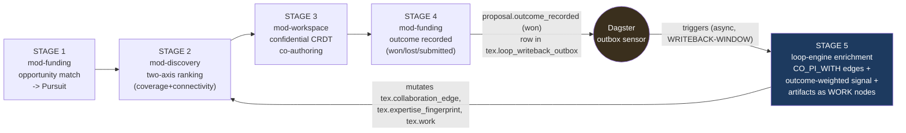
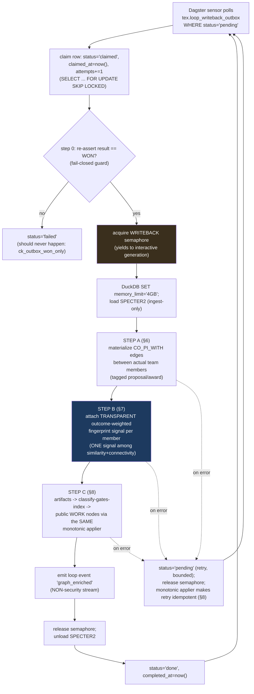

# 12 — Collaboration Loop & Write-Back Edge: Low-Level Design

> **What this document is.** The compounding edge of TigerExchange and the machinery that measures
> the loop. It specifies (1) the **Pursuit lifecycle state machine**, (2) the `proposal.outcome_recorded`
> event and the **transactional outbox** that carries it, (3) the **semaphore-gated async Dagster
> enrichment job** that runs in the WRITEBACK-WINDOW memory regime and materializes in-platform
> `CO_PI_WITH` edges, attaches a **transparent outcome-weighted fingerprint signal**, and adds produced
> artifacts as public `WORK` nodes through the **same classify-gates-index monotonic applier**, (4) the
> **dedicated non-security loop-event stream** with its full event vocabulary, (5) the **activation
> north-star** (`collaborator_joined` where the joining tenant differs from the workspace-owner tenant)
> plus the funnel queries, and (6) the **compounding contract test** — a recorded WIN that demonstrably
> changes a later match ranking.
>
> **Who reads this.** The builder, implementing `packages/loop-engine` (`tigerexchange_loop_engine`)
> and the `services/dagster` outbox sensor. You implement the data flow against the kernel Protocols and
> the DDL the sibling docs already froze. **You do not redefine kernel types, table schemas, or the PEP
> decision order** — you call them.
>
> **Authority chain.** `_design-brief.json` (locked) → `CONVENTIONS-single-box.md` (this-file-wins pins)
> → `05-kernel-contracts.md` (kernel shapes) / `13-data-model-and-schemas.md` (DDL). When this doc and a
> sibling disagree on a *schema* detail, `13` wins; on a *kernel type*, `05` wins; on a *pin/name*,
> `CONVENTIONS` wins. This doc is authoritative only for the **loop semantics, the outbox table, the
> enrichment job control flow, and the loop-event vocabulary**.
>
> **Decisions expanded here.** Primarily **D12** (the compounding write-back edge is a first-class,
> tested, memory-gated async data flow) and **D1** (the product *is* the outcome-learning loop). Also
> load-bearing: **D6** (classify-gates-index monotonic applier), **D13** (WRITEBACK-WINDOW regime),
> **D2** (federation seams, honest carry-forward). Decision IDs are **D1..D14 only**.
>
> **Cross-references.**
> `01-product-and-loop-overview.md` (the five stages narratively), `11-mod-workspace-confidential-coauthoring-lld.md`
> (Stage 3 confidential editing; emits `first_co_edit`/`collaborator_joined`),
> `10-feature-modules-lld.md` (`mod-discovery` two-axis ranking that this edge feeds, `mod-funding`
> that records the outcome), `09-ingestion-and-identity-resolution-lld.md` (the classify-gates-index
> pipeline + monotonic applier this edge re-uses), `13-data-model-and-schemas.md` (every table + the
> `tex.collaboration_edge`/`tex.expertise_fingerprint`/`tex.work`/`tex.loop_event`/`tex.pursuit` DDL +
> §23 the monotonic applier), `06-security-spine-lld.md` (PEP, classifier, durable revocation, hash-chained
> audit), `05-kernel-contracts.md` (`PublishableProjection`, `ClassificationResult`, `IClassifier`,
> `IGraph`, `IAuditSink`, `Tier`), `03-architecture-and-orin-constraints.md` (the three memory regimes),
> `15-future-federation-interfaces.md` (what carries forward).

---

## 0. Table of contents

1. [Why this edge exists (D1, D12) — and what v2 omitted](#1-why-this-edge-exists-d1-d12--and-what-v2-omitted)
2. [The five stages and where this doc sits (Stages 4–5)](#2-the-five-stages-and-where-this-doc-sits-stages-45)
3. [The Pursuit lifecycle state machine](#3-the-pursuit-lifecycle-state-machine)
4. [`proposal.outcome_recorded` — the event, the API, the transactional outbox](#4-proposaloutcome_recorded--the-event-the-api-the-transactional-outbox)
5. [The write-back enrichment job: control flow + semaphore + WRITEBACK-WINDOW](#5-the-write-back-enrichment-job-control-flow--semaphore--writeback-window)
6. [Step A — in-platform `CO_PI_WITH` edges](#6-step-a--in-platform-co_pi_with-edges)
7. [Step B — the transparent, outcome-weighted fingerprint signal (anti-incumbency-bias)](#7-step-b--the-transparent-outcome-weighted-fingerprint-signal-anti-incumbency-bias)
8. [Step C — artifacts as public WORK nodes via the same monotonic applier](#8-step-c--artifacts-as-public-work-nodes-via-the-same-monotonic-applier)
9. [The dedicated non-security loop-event stream + the full event list](#9-the-dedicated-non-security-loop-event-stream--the-full-event-list)
10. [The activation north-star + the loop funnel queries](#10-the-activation-north-star--the-loop-funnel-queries)
11. [The COMPOUNDING contract test (a recorded WIN changes a later ranking)](#11-the-compounding-contract-test-a-recorded-win-changes-a-later-ranking)
12. [Open risks expanded: incumbency bias + write-back contention](#12-open-risks-expanded-incumbency-bias--write-back-contention)
13. [Federation honesty (D2): which seams carry forward](#13-federation-honesty-d2-which-seams-carry-forward)
14. [Package layout, signatures, and acceptance map (P0.10)](#14-package-layout-signatures-and-acceptance-map-p010)

---

## 1. Why this edge exists (D1, D12) — and what v2 omitted

**D1** positions TigerExchange as the *Research Collaboration Loop Engine* — the integrated, outcome-learning
loop (discover → assemble → confidentially co-author → win → feed outcomes back), explicitly **not** a RIM,
funding database, or standalone grant writer. The thing no incumbent occupies is the **closed, compounding
loop**: more collaboration → richer expertise graph → better matches → more funding → more collaboration.

**D12** is the decision that makes the loop *actually compound*: the write-back edge is a **first-class,
tested, memory-gated async data flow**, not an afterthought. The brief is blunt about the failure mode it
corrects:

> "v2 had all the pieces but **NEVER wired the EDGE**." — D12 rationale.

A read-only expertise graph is **linear and non-compounding**: matches never improve from outcomes, and the
moat evaporates. The empirical basis the loop rests on (D1, `01`): collaborators win 2–4× more funding over
10 years, and co-authorship is 13.8pp more likely after a prior co-proposal — but **only for SUCCESSFUL
participants**. That last clause is exactly why the trigger is a recorded **WIN**, not mere participation.

This document specifies the edge so a 30B builder cannot under-build it:

- It is **async**, fired off a **transactional outbox** by a **Dagster sensor** — never on the interactive
  hot path (HDD graph writes are slow; D13).
- It runs in the **WRITEBACK-WINDOW** memory regime: **semaphore-gated to yield to interactive generation**,
  with **capped DuckDB/embedding memory** (`SET memory_limit='4GB'`). The prior single "headroom" figure was
  triple-counted (burst + DuckDB + a now-eliminated second vLLM); the regime budget replaces it (D12, D13;
  `03`, `CONVENTIONS §5.1`).
- It re-ingests team + award + artifacts through the **same classify-gates-index monotonic applier** the
  ingestion pipeline uses (D6; `09`; `13 §23`), so a re-ingest **cannot resurrect a revoked / down-classified
  record**.
- The outcome signal is **one transparent signal among similarity + connectivity**, never the sole ranker
  (anti-incumbency-bias; open_risks).

> **Chosen over alternatives (D12 `alternatives_rejected`):** no write-back (read-only graph = linear, no
> moat); synchronous write-back during editing (slow HDD graph writes on the interactive path); uncapped
> async DuckDB during interactive use (RAM contention); opaque outcome weighting as the sole ranker (the
> incumbency-bias trap).

---

## 2. The five stages and where this doc sits (Stages 4–5)

The loop is made first-class by **one durable domain object — the `Pursuit`** — threading all five stages
(`13 §8`), plus the explicit write-back flow this doc owns.

| Stage | Name | Owner module | This doc? |
|---|---|---|---|
| 1 | discover / trigger | `mod-funding` (`grants_gov` opportunities; `nih_reporter`/`nsf_awards` awards) | binds the Pursuit (referenced) |
| 2 | assemble team | `mod-discovery` (two-axis: COVERAGE + CONNECTIVITY) | **consumes** what this edge writes |
| 3 | confidentially co-author | `mod-workspace` (CRDT, real-time mode P0) + `mod-lit-intelligence` (dual-source grounding) | emits loop events (referenced) |
| 4 | **record outcome** | `mod-funding` records won/lost/submitted, **emits `proposal.outcome_recorded`** | **OWNED HERE (§4)** |
| 5 | **write back (the centerpiece)** | `loop-engine` async Dagster enrichment job | **OWNED HERE (§5–§8)** |

Stage 5 is the centerpiece. On a recorded **WIN**, the team, award, and produced artifacts are written back
into the **public** expertise graph (outcome-weighted, transparently), so every won proposal demonstrably
improves the next match (Stage 2). That is the flywheel.



> **The arrow from S5 back to S2 is the compounding loop.** Everything else in this doc exists to make that
> arrow real, safe, memory-bounded, and *tested*.

---

## 3. The Pursuit lifecycle state machine

The `Pursuit` (`13 §8`, `tex.pursuit`, tenant-scoped + RLS) is the single sticky object threading the five
stages. Its `lifecycle_state` column is the Postgres native enum `tex.pursuit_state` (`13 §0.8`), with members:

```
'draft', 'matched', 'team_forming', 'drafting', 'submitted', 'won', 'lost', 'abandoned'
```

The companion `tex.proposal.lifecycle_state` is `tex.proposal_state`:

```
'drafting', 'in_review', 'submitted', 'won', 'lost', 'withdrawn'
```

The **Pursuit** is the loop-level object; the **Proposal** is the document-level object inside it. The
outcome is recorded against the Proposal (`mod-funding`, §4), which transitions BOTH the Proposal and the
parent Pursuit. The terminal `Pursuit.won` state is what fires the write-back (D12; `13 §8` note).

### 3.1 State machine (mermaid)

```mermaid
stateDiagram-v2
    [*] --> draft : pursuit_created\n(saved from a matched opportunity)
    draft --> matched : opportunity_matched\n(Opportunity bound to Pursuit)
    matched --> team_forming : team_shortlisted / invite_sent
    team_forming --> drafting : collaborator_joined\n(>=1 co-editor accepted; CRDT workspace live)
    drafting --> submitted : proposal_submitted\n(Proposal.lifecycle_state -> submitted)
    submitted --> won : outcome_recorded(won)\n** fires proposal.outcome_recorded -> WRITE-BACK **
    submitted --> lost : outcome_recorded(lost)\n(NO write-back; loss is recorded only)

    %% non-happy transitions
    matched --> abandoned : abandoned (deadline passed / withdrawn)
    team_forming --> abandoned : abandoned
    drafting --> abandoned : abandoned
    draft --> abandoned : abandoned

    won --> [*]
    lost --> [*]
    abandoned --> [*]

    note right of won
      ONLY 'won' triggers Stage 5.
      'lost'/'submitted'/'abandoned'
      record outcome but DO NOT
      enrich the graph (D1: learning
      is limited to SUCCESSFUL
      participants).
    end note
```



### 3.2 The transition table (verbatim — the builder implements exactly these)

| From | Event | To | Guard | Side effects |
|---|---|---|---|---|
| `[*]` | user saves a matched opportunity | `draft` | caller has `OWN_MATERIALS` | emit `pursuit_created`; create `tex.pursuit` row |
| `draft` | `opportunity_matched` | `matched` | `opportunity_id` bound | emit `opportunity_matched` |
| `matched` | `team_shortlisted` | `team_forming` | candidate list non-empty | emit `team_shortlisted` |
| `team_forming` | `invite_sent` | `team_forming` (self) | `CROSS_GROUP_SHARE` for cross-tenant invite | emit `invite_sent`; write `tex.sharing_grant` + `tex.relation_tuple` |
| `team_forming` | `collaborator_joined` | `drafting` | invitee accepted; `tex.team_member` row active | emit `collaborator_joined` (**north-star if cross-tenant**, §10) |
| `drafting` | `proposal_submitted` | `submitted` | `Proposal.lifecycle_state -> submitted` | emit `proposal_submitted` |
| `submitted` | `outcome_recorded(won)` | `won` | recorded by `mod-funding`; durable | emit `outcome_recorded`; **enqueue outbox row** (§4) |
| `submitted` | `outcome_recorded(lost)` | `lost` | recorded by `mod-funding` | emit `outcome_recorded`; **NO outbox row** |
| any non-terminal | `abandoned` | `abandoned` | — | emit `outcome_recorded(result=submitted/none)` optional; no write-back |

**Rules the builder must not violate:**

- **Only `submitted → won` enqueues a write-back outbox row.** `lost`, `abandoned`, and `submitted`-with-no-
  outcome record their state and emit loop events but do **NOT** enrich the graph. This is D1's "limited to
  SUCCESSFUL participants" encoded as a guard, not a comment.
- The transition that fires the outbox row and the transition of `Pursuit`/`Proposal` to `won` must happen
  in the **same Postgres transaction** as the outbox insert (§4.3) — that is the transactional-outbox
  guarantee. A crash between "state = won" and "outbox row written" must be impossible.
- Re-recording the same outcome is **idempotent**: a second `outcome_recorded(won)` for an already-`won`
  pursuit is a no-op (the outbox row carries the natural key `proposal_id` with a uniqueness guard, §4.3).

> **Why a Pursuit-level state machine and not just per-Proposal status?** The Pursuit is the *loop* unit
> (D1, D12): it threads opportunity → team → proposal → outcome and is the home for ongoing match alerts.
> Driving the machine off the Pursuit keeps "where are we in the loop" in one place that `mod-discovery`,
> `mod-funding`, and the funnel queries (§10) all read. Chosen over tracking state only on the Proposal
> (would scatter loop progress across documents and lose the alert/binding context) and over a separate
> "workflow" table (a third object a 30B builder would desync from the Pursuit).

---

## 4. `proposal.outcome_recorded` — the event, the API, the transactional outbox

### 4.1 Where it is emitted

`mod-funding` (`tigerexchange_funding`, `10`) records the funding outcome through the PEP (a `WRITE_OBJECT`
action on the Proposal). On a **won** outcome it (a) transitions `tex.proposal.lifecycle_state -> 'won'` and
`tex.pursuit.lifecycle_state -> 'won'`, (b) emits the non-security `outcome_recorded` **loop event** (§9),
and (c) **inserts a transactional-outbox row** — all in one transaction.

The domain event name is **`proposal.outcome_recorded`** (verbatim, brief Stage 4 + D12). It is *not* a
kernel `AuditEvent` and *not* directly a `LoopEvent` — it is the **outbox payload** that the Dagster sensor
consumes. The corresponding *measurement* signal `outcome_recorded` is written separately to the loop-event
stream (§9). Two writes, two purposes:

| Write | Table | Purpose | Stream |
|---|---|---|---|
| outbox row (`proposal.outcome_recorded`) | `tex.loop_writeback_outbox` (§4.3) | **trigger** the Stage-5 enrichment job | mechanism |
| loop event (`outcome_recorded`) | `tex.loop_event` (`13 §21`) | **measure** the funnel | analytics |

### 4.2 The outcome value object

The recorded outcome uses the `tex.outcome_result` enum (`13 §0.8`): `'submitted' | 'won' | 'lost'`. The
frozen Pydantic shape `loop-engine` consumes from the outbox payload:

```python
# packages/loop-engine/tigerexchange_loop_engine/events.py
from __future__ import annotations

from enum import StrEnum
from uuid import UUID

from pydantic import BaseModel, ConfigDict, Field


class OutcomeResult(StrEnum):
    SUBMITTED = "submitted"
    WON = "won"
    LOST = "lost"


class ProposalOutcomeRecorded(BaseModel):
    """The `proposal.outcome_recorded` domain event payload carried by the outbox row.
    Frozen value object. Only result == WON enqueues an outbox row in the first place (see §3.2),
    but the consumer re-asserts it (§5, step 0) as a fail-closed guard."""

    model_config = ConfigDict(frozen=True)

    event_name: str = Field(default="proposal.outcome_recorded", frozen=True)
    proposal_id: UUID
    pursuit_id: UUID
    owner_tenant_id: UUID
    opportunity_id: UUID | None = None
    award_number: str | None = None          # the won award, if a funder award number exists yet
    funder: str | None = None
    result: OutcomeResult
    team_member_subject_ids: tuple[UUID, ...] = Field(default_factory=tuple)   # actual team (for CO_PI_WITH)
    artifact_refs: tuple[str, ...] = Field(default_factory=tuple)              # produced public artifacts
    rfp_required_concepts: tuple[str, ...] = Field(default_factory=tuple)      # for the outcome-weighted signal
    recorded_at: str                          # ISO-8601 UTC; the outbox row also stamps its own ts
```

> **Why carry the team + concepts in the event and not re-query at enrichment time?** The enrichment job runs
> *later* (async). Capturing the team membership and RFP concepts **at the moment of the recorded win** makes
> the write-back a snapshot of who actually won on what, immune to later membership edits. The job still
> re-validates each subject and each artifact through the classifier and monotonic applier (§6–§8) — the
> event is a *seed*, not trusted ground truth. Chosen over re-querying live `team_member` at enrichment time
> (would credit people added after the win) and over trusting the event blindly (would skip classification).

### 4.3 The transactional outbox table (owned by THIS doc)

`13` references "outbox" as a shared sink consulted by `is_retrievable` (`05 §6.1`) and lists the
"transactional-outbox sensor" in `mod-ingestion`, but does **not** define the write-back outbox table. This
document defines it. It is **tenant-scoped + RLS** (same template as every tenant table, `13 §0.3`), lives on
the default tablespace (NVMe), and is **append-only with a claim/complete lifecycle** so the Dagster sensor
can poll it (D12: outbox-polling avoids Kafka/Temporal/Debezium — brief Orchestration rationale).

```sql
-- migration 0008_loop_writeback_outbox  (after 0005_security_spine; depends on tex.proposal, tex.pursuit)
-- Transactional outbox for the COMPOUNDING write-back edge (D12). Polled by the Dagster sensor (§5).
CREATE TABLE tex.loop_writeback_outbox (
    outbox_id        uuid              NOT NULL DEFAULT gen_random_uuid(),
    tenant_id        uuid              NOT NULL REFERENCES tex.tenant(tenant_id),   -- owner_tenant_id
    proposal_id      uuid              NOT NULL,
    pursuit_id       uuid              NOT NULL,
    event_name       text              NOT NULL DEFAULT 'proposal.outcome_recorded',
    result           tex.outcome_result NOT NULL,                  -- only 'won' rows are ever inserted
    payload          jsonb             NOT NULL,                   -- ProposalOutcomeRecorded (§4.2)
    -- claim/complete lifecycle (single-consumer, at-least-once -> made idempotent by the applier, §8)
    status           text              NOT NULL DEFAULT 'pending', -- 'pending'|'claimed'|'done'|'failed'
    claimed_at       timestamptz,
    completed_at     timestamptz,
    attempts         integer           NOT NULL DEFAULT 0,
    last_error       text,
    created_at       timestamptz       NOT NULL DEFAULT now(),
    PRIMARY KEY (tenant_id, outbox_id),                            -- tenant_id LEADING (D5)
    -- idempotency: one outbox row per (tenant, proposal) — re-recording a win is a no-op insert.
    CONSTRAINT ux_outbox_proposal UNIQUE (tenant_id, proposal_id),
    -- safety: we only ever enqueue WINS (the producer guard in §3.2 is belt; this is suspenders).
    CONSTRAINT ck_outbox_won_only CHECK (result = 'won')
);
CREATE INDEX ix_outbox_pending
    ON tex.loop_writeback_outbox (tenant_id, created_at)
    WHERE status = 'pending';

ALTER TABLE tex.loop_writeback_outbox ENABLE ROW LEVEL SECURITY;
ALTER TABLE tex.loop_writeback_outbox FORCE ROW LEVEL SECURITY;
CREATE POLICY tenant_isolation ON tex.loop_writeback_outbox
    AS RESTRICTIVE FOR ALL TO tigerexchange_app
    USING      (tenant_id = current_setting('app.tenant_id', true)::uuid)
    WITH CHECK (tenant_id = current_setting('app.tenant_id', true)::uuid);
```

**The transactional guarantee (the whole point of an outbox):** `mod-funding` performs, in **one transaction**:

```sql
-- inside ONE transaction (SET LOCAL app.tenant_id already applied)
UPDATE tex.proposal SET lifecycle_state = 'won', updated_at = now()
  WHERE tenant_id = $tid AND proposal_id = $pid;
UPDATE tex.pursuit  SET lifecycle_state = 'won', updated_at = now()
  WHERE tenant_id = $tid AND pursuit_id  = $purid;
INSERT INTO tex.loop_event (tenant_id, event_type, pursuit_id, target_tenant_id, is_cross_tenant, payload)
  VALUES ($tid, 'outcome_recorded', $purid, NULL, false, $loop_payload);
INSERT INTO tex.loop_writeback_outbox (tenant_id, proposal_id, pursuit_id, result, payload)
  VALUES ($tid, $pid, $purid, 'won', $event_payload)
  ON CONFLICT (tenant_id, proposal_id) DO NOTHING;   -- idempotent re-record
-- COMMIT
```

Because the state change and the outbox insert commit atomically, the write-back **cannot be lost** (if the
state is `won`, the row exists) and **cannot fire twice** (the unique constraint + `ON CONFLICT DO NOTHING`).
The enrichment job is therefore **at-least-once delivery made effectively-once by the idempotent monotonic
applier** (§8) — never relied on for exactly-once at the queue level.

> **Why poll an outbox table instead of an in-process event bus or Kafka?** The whole platform is a single
> modular monolith on one box (D2); Kafka/Temporal/Debezium are scale machinery the box cannot afford
> (brief Orchestration `alternatives_rejected`). A Postgres outbox table polled by a Dagster sensor gives
> durability (it survives a crash because it is committed with the state change), lineage (Dagster), and zero
> new infra. Chosen over an in-memory `asyncio` event (lost on crash, no durability) and over CDC/Kafka
> (operational weight). The sensor lives in `services/dagster` (`tigerexchange_dagster`).

---

## 5. The write-back enrichment job: control flow + semaphore + WRITEBACK-WINDOW

The enrichment job is a **Dagster job** triggered by a **sensor** that polls `tex.loop_writeback_outbox` for
`status = 'pending'` rows. It runs in the **WRITEBACK-WINDOW** memory regime (D13; `03`; `CONVENTIONS §5.1`):

- **Semaphore-gated to yield to interactive generation.** A single process-wide semaphore is shared with the
  AI plane (`mod-ai`). The job **acquires** it before any DuckDB / embedding work and **releases** it
  promptly; an interactive generation burst holds priority. The semaphore guarantees the write-back and an
  interactive burst **do not both peak** (memory_budget Regime 3 = ~54.5GB only because they cannot coincide).
- **Capped DuckDB / embedding memory.** Any DuckDB used in the job sets `SET memory_limit='4GB'` and capped
  threads, explicitly (D13; `CONVENTIONS §5`). SPECTER2 is reloaded **only** for the fingerprint recompute and
  unloaded after (~1.5GB; ingest-only model, D8) — it is **never** serve-resident.
- **HDD-aware.** Graph writes go to NVMe (`tex.collaboration_edge` is a shared-public NVMe table); the job
  never does HDD random I/O (D13 hot-path guardrail).

### 5.1 Job control flow (mermaid)



### 5.2 The three steps, in order (each detailed in §6–§8)

1. **Step A — `CO_PI_WITH` edges.** Materialize in-platform collaboration edges between the *actual* team
   members, tagged with `source_proposal_id` and (if present) `award_number`. (§6)
2. **Step B — outcome-weighted fingerprint signal.** For each member, attach a **transparent**
   outcome-weighted expertise signal for the RFP's concept areas — **one signal among
   similarity + connectivity**, not the ranker. (§7)
3. **Step C — artifacts as public WORK nodes.** Ingest produced artifacts through the **same
   classify-gates-index pipeline** as ordinary corpus, so they become public `WORK` nodes — **idempotently**,
   via the monotonic applier (`13 §23`), which **cannot resurrect a revoked / down-classified record**. (§8)

Only after all three succeed does the job emit the non-security `graph_enriched` loop event (§9) and mark the
outbox row `done`. On any step error the row goes back to `pending` for a bounded retry; because every write
goes through the monotonic applier (§8) and `ON CONFLICT` upserts, a partial re-run is safe.

### 5.3 Why this job is OFF the interactive path (D12, D13)

| Concern | Decision |
|---|---|
| Graph writes are slow on HDD-class storage | run async off the outbox, not during editing (D12 rejected "synchronous write-back") |
| DuckDB + embeddings would contend with the 30B generator | cap to `memory_limit='4GB'`, run in WRITEBACK-WINDOW, semaphore-gated (D13) |
| The editor must stay responsive | the semaphore yields to interactive generation; SERVE stays ~49GB; the burst + write-back never coincide |
| Re-runs / crashes must not corrupt the graph | the monotonic applier (`13 §23`) makes every step idempotent and anti-resurrection |

---

## 6. Step A — in-platform `CO_PI_WITH` edges

A **WIN** means a real cross-group team co-authored a winning proposal. Step A records that as **weighted
collaboration edges** in the shared-public graph `tex.collaboration_edge` (`13 §17`), which powers the
**connectivity axis** of `mod-discovery`'s two-axis ranking (D1; `10`).

- **Edge type:** `'co_pi_with'` (the `tex.edge_type` enum member, `13 §0.8`).
- **Endpoints:** every unordered pair of `team_member_subject_ids` from the validated team (the actual team
  that won). Edges are stored in both directions' indexes via the two-way indexes on
  `tex.collaboration_edge` (`ix_edge_src`, `ix_edge_dst`); the recursive-CTE ego-net traversal reads both
  (`13 §17`, `07`).
- **Tagging:** `source_proposal_id = proposal_id` and, if the funder award exists, `award_number`. This
  distinguishes **in-platform won-proposal edges** from ingested co-authorship/co-funding edges (`13 §17`).
- **Idempotency:** the table's `UNIQUE (src_subject, dst_subject, edge_type, source_proposal_id, award_number)`
  makes re-inserting the same edge a no-op (`ON CONFLICT DO NOTHING`).

```sql
-- Step A: one row per unordered team pair, tagged with the winning proposal/award.
-- Runs as the single-writer enrichment job; tenant context = owner_tenant of the pursuit.
INSERT INTO tex.collaboration_edge
    (src_subject, dst_subject, edge_type, weight, time_decay, source_proposal_id, award_number)
SELECT a.subject_id, b.subject_id, 'co_pi_with',
       $win_edge_weight,        -- e.g. 1.0 base weight for a fresh win
       1.0,                     -- time_decay starts at 1.0; recomputed on later ingests (07)
       $proposal_id, $award_number
FROM unnest($team_subjects::uuid[]) AS a(subject_id)
JOIN unnest($team_subjects::uuid[]) AS b(subject_id) ON a.subject_id < b.subject_id
ON CONFLICT (src_subject, dst_subject, edge_type, source_proposal_id, award_number) DO NOTHING;
```

> **Why edges live in the SHARED PUBLIC graph (no tenant RLS) but the team data is confidential?** The
> *fact that two researchers co-won* is a public collaboration signal (it is the connectivity moat). The
> *content* of the proposal is confidential and stays in the per-tenant confidential surface (`13 §10`) and
> the encrypted blobs (`13 §18`). Step A writes only the **public-tier edge** (subject↔subject + proposal id),
> never confidential content. Subjects are public graph node identities (ORCID-anchored, `13 §2`), so the
> edge carries no confidential payload. This matches D6: `mod-discovery` and the expertise graph remain
> **public-tier-only by construction**.

> **`co_pi_with` vs `co_authored`.** `co_authored` edges come from ingested papers (`09`); `co_pi_with` edges
> are the **in-platform** signal that a team co-won a funded proposal *on this box*. They are distinct edge
> types so the connectivity axis can weight a demonstrated funded collaboration differently from a paper
> co-authorship, and so the compounding contract test (§11) can assert the *new* edge changed the ranking.

---

## 7. Step B — the transparent, outcome-weighted fingerprint signal (anti-incumbency-bias)

Step B is the part the brief flags most carefully, because it is where the **incumbency-bias trap**
(open_risks) lives. The rule from D12 and open_risks is unambiguous:

> Keep outcome weight **TRANSPARENT** and as **ONE signal among expertise-similarity and connectivity, never
> the sole ranker**; surface per-candidate "why"; allow PI curation; expose a tunable weight and log its
> influence on rankings.

### 7.1 What is mutated

For each winning team member, the job updates that researcher's `tex.expertise_fingerprint` row (`13 §16`,
shared-public, **no** tenant RLS — the expertise graph is a shared product surface). Specifically the
`outcome_weight_by_concept` JSONB column and `last_enriched_at`:

```python
# packages/loop-engine/tigerexchange_loop_engine/signals.py  (illustrative; the applier wraps the UPDATE)
def bump_outcome_weight(
    current: dict[str, float],        # existing outcome_weight_by_concept
    rfp_concepts: tuple[str, ...],    # the won RFP's required_concepts (from the Opportunity)
    *,
    increment: float = 0.10,          # SMALL, tunable, logged (see 7.3); NOT a winner-take-all jump
    cap: float = 1.0,                 # bounded so a serial winner cannot dominate (anti-incumbency)
) -> dict[str, float]:
    """One transparent signal among three. Bounded + small + logged. NEVER the ranker by itself."""
    out = dict(current)
    for concept in rfp_concepts:
        out[concept] = min(cap, out.get(concept, 0.0) + increment)
    return out
```

```sql
-- Step B: bump the outcome-weighted signal for each member, for the RFP's concept areas.
UPDATE tex.expertise_fingerprint
   SET outcome_weight_by_concept = $bumped_weights::jsonb,   -- computed by bump_outcome_weight()
       last_enriched_at = now()
 WHERE subject_id = $member_subject_id;
```

The SPECTER2 `specter2_centroid` (768-dim) is **not** mutated by the win itself — it is recomputed from the
member's *works* when new artifacts are ingested (Step C → next ingest), keeping the citation-aware vector
honest. Step B only touches the explicit, transparent `outcome_weight_by_concept`.

### 7.2 How the signal is *used* (and why it can never be the sole ranker)

`mod-discovery` (`10`) ranks candidates on **two axes** — expertise **COVERAGE** of the RFP concepts and graph
**CONNECTIVITY** — and applies the outcome weight as an **overlay**, not a replacement. The composite score a
candidate receives is, schematically:

```
score(candidate) = w_cov * coverage_similarity(candidate, rfp_concepts)      # SPECTER2 + concept match
                 + w_con * connectivity(candidate, team, graph)              # ego-net over collaboration_edge
                 + w_out * outcome_overlay(candidate, rfp_concepts)          # outcome_weight_by_concept (THIS)
```

with `w_out` **strictly less than** the sum of the other two and **tunable + logged**. The three guards that
keep it anti-incumbency:

1. **It is one of three terms.** A candidate with strong coverage and connectivity but zero prior wins still
   ranks; outcome weight cannot zero them out.
2. **It is bounded and incremented in small steps** (`cap=1.0`, `increment=0.10`), so a serial winner's
   overlay saturates and cannot run away.
3. **It is transparent + curatable.** Each candidate carries a per-candidate **"why"** (coverage gaps,
   connectivity distance, outcome contribution) that the PI sees, and the PI **always curates** the final
   team (team-formation literature: algorithm alone produces worse teams — D1, brief Stage 2). The PI can
   down-weight or remove a high-outcome incumbent.

### 7.3 The tunable + the influence log (open_risks mitigation, concrete)

The brief requires: "expose a tunable weight and log its influence on rankings." Concretely:

- `w_out` is a **config value** (in `mod-discovery` config, surfaced to an operator), not a magic constant.
- Every time the outcome overlay changes a candidate's *rank position*, `mod-discovery` records a
  non-security **`graph_enriched`-adjacent analytics note** (or a discovery-side ranking trace) capturing
  the delta. The compounding contract test (§11) reads exactly this to prove the win moved the ranking.
- The `bump_outcome_weight` increment is logged on the `graph_enriched` loop event payload (§9) so a human
  can audit how much a single win moved the signal.

> **Chosen over alternatives.** We chose a **small, bounded, transparent overlay term** over (a) using
> outcome as the *primary* ranker — the explicit incumbency-bias trap D12 rejects; (b) a hidden multiplier —
> unauditable; (c) mutating the SPECTER2 centroid on win — would silently entangle the citation-aware vector
> with funding outcomes and corrupt the similarity axis. The overlay is the only design that lets a win
> *demonstrably* change a ranking (the contract test) while remaining one honest signal among three.

---

## 8. Step C — artifacts as public WORK nodes via the same monotonic applier

When a proposal wins, it often produces public artifacts (a funded-project abstract, a published output,
deliverables marked public). Step C ingests those artifacts as new **public `WORK` nodes** (`13 §5`,
`tex.work` + `tex.work_chunk`) — but **only** through the **same classify-gates-index monotonic-applier
pipeline** the ordinary ingestion uses (D6; D12; `09`; `13 §23`). The write-back is **not** a privileged
back door into the public index.

### 8.1 The classify-gates-index re-use (D6 — fail-closed at the shared edge)

Each artifact is classified **before** it can be embedded/indexed/graphed (D6; `IClassifier.classify`,
`05 §10.2`). The gate:

```
classify(artifact) -> ClassificationResult
    is_retrievable == (decision == ALLOW AND tier == PUBLIC)        # 05 §6.1 / 13 §14 CHECK constraint
```

- A `QUARANTINE` (abstain/ambiguous) artifact → adjudication queue → **never reaches the shared sink** (the
  zero-leak invariant). A `DENY` (license/compliance) artifact → not indexed.
- Only an `ALLOW` + `PUBLIC` artifact is shaped into a `PublishableProjection` **by the broker** (modules
  never construct it — `05 §7`; D3) and applied. `PublishableProjection` validation **rejects confidential
  tier** structurally (`05 §7.3` / `13 §15`), so a confidential draft can never leak into the public graph
  via the write-back, even if mislabeled.
- The artifact `WORK` row carries `source = 'in_platform_writeback'` (the `tex.corpus_source` enum member,
  `13 §0.8`) so write-back artifacts are distinguishable in provenance.

### 8.2 The monotonic applier (anti-resurrection — `13 §23`)

The applier rule (verbatim from `13 §23`) is what makes the write-back **idempotent** and **unable to
resurrect a revoked / down-classified record**:

```text
APPLY an incoming projection P to object O only if:
    P.projection_version  >  O.current_projection_version
AND P.projection_version  >  latest revocation_epoch for O in tex.revocation_log
Otherwise: SKIP (a stale or post-revocation write is a no-op).
```

So if a researcher's prior consent was revoked (a `security`/`consent` row in `tex.revocation_log`, `13 §22`),
or an artifact was down-classified, a later write-back **cannot bring it back**: its `projection_version`
will not exceed the `revocation_epoch`, and the apply is a no-op. This is the same applier the ingestion DAG
uses (P0.7), run by the **single-writer** enrichment job in the WRITEBACK-WINDOW (D13). The P0.7
anti-resurrection test and the P0.10 compounding test both exercise it.

```python
# illustrative applier guard (broker/applier, NOT a DB trigger, so it composes with the PEP — 13 §23)
async def apply_writeback_work(applier, projection: PublishableProjection, graph: IGraph) -> bool:
    """Returns True if applied, False if skipped (stale or post-revocation). Idempotent."""
    current_v = await applier.current_projection_version(projection.entity_ref)
    revoked_epoch = await applier.latest_revocation_epoch(projection.entity_ref)
    if not (projection.projection_version > current_v
            and projection.projection_version > revoked_epoch):
        return False                      # SKIP — stale or revoked; the write-back cannot resurrect it
    await applier.upsert_public_work(projection)   # create-if-absent (NEVER recreate_collection — CONVENTIONS §9)
    return True
```

> **Why re-use the ingestion pipeline rather than a bespoke write-back inserter?** D6's fail-closed
> classification edge and `13 §23`'s monotonic applier are the *only* sanctioned way content enters the
> shared public index. A bespoke inserter would be a second, untested path into the shared graph — exactly
> the kind of confidentiality hole D3/D6 are designed to prevent. Re-using `classify-gates-index` means the
> write-back inherits the zero-leak classifier, the `PublishableProjection`-rejects-confidential guard, and
> the anti-resurrection applier for free. Chosen over a direct `INSERT INTO tex.work` (bypasses
> classification = a leak vector) and over a synchronous in-editor insert (HDD-slow on the hot path, D12).

---

## 9. The dedicated non-security loop-event stream + the full event list

Loop measurement uses a **dedicated NON-security stream** (`tex.loop_event`, `13 §21`) kept **physically
separate** from the hash-chained security `AuditEvent` stream (`tex.audit_event`, `13 §20`). This is a
D12 deliverable and a P0.3 acceptance gate: **loop events must never write to the security stream, and vice
versa.** Two tables, two writers, two streams (`CONVENTIONS §11`).

> **Why separate?** The security audit chain (`prev_hash → entry_hash`, periodic signed checkpoints) is a
> tamper-evident record of *who accessed which confidential artifact under which grant* (`06`). Polluting it
> with high-volume product analytics (every `first_co_edit`) would bloat the chain and blur its forensic
> purpose. Keeping loop events on their own stream keeps the security audit clean and lets product analytics
> be queried/aggregated freely without touching security tables. Chosen over one unified event log (couples
> analytics volume to the forensic chain) and over emitting loop events as `AuditEvent`s (would force every
> product metric through the hash chain).

### 9.1 The full loop-event vocabulary (verbatim, brief Stage 5 + `13 §21`)

These ten event types are the complete P0 vocabulary. Stored as `tex.loop_event.event_type` (text), one row
per occurrence, tenant-scoped by `actor_tenant_id`.

| `event_type` | Emitted when | `is_cross_tenant`? | Emitting module |
|---|---|---|---|
| `pursuit_created` | a Pursuit is saved from a matched opportunity | false | `mod-funding` |
| `opportunity_matched` | an Opportunity is bound to a Pursuit | false | `mod-funding` |
| `team_shortlisted` | `mod-discovery` produces a candidate team | false | `mod-discovery` |
| `invite_sent` | a workspace invite is issued | true iff invitee tenant ≠ owner tenant | `mod-workspace` |
| `collaborator_joined` | an invitee accepts and becomes an active `team_member` | **true iff joining tenant ≠ owner tenant → NORTH-STAR** | `mod-workspace` |
| `first_co_edit` | the first concurrent CRDT edit by a second member | true iff editor tenant ≠ owner tenant | `mod-workspace` |
| `suggestion_resolved` | (P1) a suggestion is accepted/rejected | true iff cross-tenant | `mod-workspace` (P1) |
| `proposal_submitted` | the Proposal transitions to `submitted` | false | `mod-funding` |
| `outcome_recorded` | the funding outcome (won/lost) is recorded | false | `mod-funding` |
| `graph_enriched` | the write-back enrichment job completes Steps A–C | false | `loop-engine` |

> **`suggestion_resolved` is P1.** Suggesting-mode + anchored comments are deferred to P1 (D11; `11`); the
> event name is reserved in the vocabulary now so the stream schema is stable, but it is **not emitted in
> P0**. The other nine are P0.

### 9.2 Emitting a loop event (the writer contract)

Every loop event is a single insert into `tex.loop_event` within the emitting module's tenant transaction:

```sql
INSERT INTO tex.loop_event
    (tenant_id, event_type, pursuit_id, target_tenant_id, is_cross_tenant, payload)
VALUES
    ($actor_tenant_id, $event_type, $pursuit_id, $target_tenant_id,
     ($actor_tenant_id IS DISTINCT FROM $target_tenant_id), $payload::jsonb);
```

- `tenant_id` = the **actor** tenant (the one whose RLS scope owns the row).
- `target_tenant_id` = the counterparty tenant for cross-group acts (e.g. the workspace owner when a
  collaborator from another group joins); NULL for single-tenant events.
- `is_cross_tenant` = `actor_tenant_id != target_tenant_id` — the activation north-star flag (§10).
- **The writer MUST NOT write to `tex.audit_event`.** A planted test (P0.3) asserts the streams are disjoint.

---

## 10. The activation north-star + the loop funnel queries

### 10.1 The north-star

The **activation north-star** is `collaborator_joined` where **`joining_tenant != workspace_owner_tenant`** —
i.e. a **cross-GROUP collaborative act** (brief Stage 5; per Miro/Dropbox aha-moment evidence). In the
schema this is exactly a `tex.loop_event` row with `event_type = 'collaborator_joined'` and
`is_cross_tenant = true`.

```sql
-- Activation north-star: count of cross-group collaborator_joined events (per period).
-- Note: cross-tenant analytics aggregate across tenants, so this query runs in an ADMIN/analytics
-- context (the owner role or a dedicated read role), NOT inside a single tenant's RLS scope.
SELECT date_trunc('week', ts) AS week, count(*) AS cross_group_activations
FROM tex.loop_event
WHERE event_type = 'collaborator_joined'
  AND is_cross_tenant = true
GROUP BY 1
ORDER BY 1;
```

> **RLS note for analytics.** `tex.loop_event` is RLS-scoped by `tenant_id` (the actor). The north-star and
> funnel are **cross-tenant aggregates**, so they are computed in an analytics context — either the owner
> role (which still must be granted read; never the `tigerexchange_app` role bypassing RLS) or a dedicated
> read-only analytics role with a documented, audited cross-tenant grant. The default `tigerexchange_app`
> role **cannot** see other tenants' rows (D5), which is correct: product analytics is an operator function,
> not a tenant-facing one. The builder must not "fix" this by relaxing RLS on `tex.loop_event`.

### 10.2 The loop conversion funnel

Loop health = the conversion **match → team → edit → submit → win**, plus **time-to-team** and the
**cross-group edit ratio** (brief Stage 5). Each funnel stage maps to a loop event:

| Funnel stage | Event |
|---|---|
| matched | `opportunity_matched` |
| team | `team_shortlisted` (or first `collaborator_joined`) |
| edit | `first_co_edit` |
| submit | `proposal_submitted` |
| win | `outcome_recorded` (result won) → followed by `graph_enriched` |

```sql
-- Loop conversion funnel per Pursuit (admin/analytics context, cross-tenant).
WITH stages AS (
    SELECT pursuit_id,
           bool_or(event_type = 'opportunity_matched')                       AS reached_matched,
           bool_or(event_type IN ('team_shortlisted','collaborator_joined'))  AS reached_team,
           bool_or(event_type = 'first_co_edit')                             AS reached_edit,
           bool_or(event_type = 'proposal_submitted')                        AS reached_submit,
           bool_or(event_type = 'graph_enriched')                            AS reached_win
    FROM tex.loop_event
    WHERE pursuit_id IS NOT NULL
    GROUP BY pursuit_id
)
SELECT
    count(*) FILTER (WHERE reached_matched) AS matched,
    count(*) FILTER (WHERE reached_team)    AS team,
    count(*) FILTER (WHERE reached_edit)    AS edit,
    count(*) FILTER (WHERE reached_submit)  AS submit,
    count(*) FILTER (WHERE reached_win)     AS won
FROM stages;
```

```sql
-- time-to-team: pursuit_created -> first collaborator_joined.
SELECT j.pursuit_id,
       min(j.ts) - min(c.ts) AS time_to_team
FROM tex.loop_event c
JOIN tex.loop_event j
  ON c.pursuit_id = j.pursuit_id
WHERE c.event_type = 'pursuit_created'
  AND j.event_type = 'collaborator_joined'
GROUP BY j.pursuit_id;
```

```sql
-- cross-group edit ratio: cross-tenant first_co_edits / all first_co_edits.
SELECT
    count(*) FILTER (WHERE is_cross_tenant)::float
      / NULLIF(count(*), 0) AS cross_group_edit_ratio
FROM tex.loop_event
WHERE event_type = 'first_co_edit';
```

These four queries are the P0.10 "loop-conversion funnel queryable" deliverable. They read **only**
`tex.loop_event` (never the security stream) and are the operator dashboard's backing queries.

---

## 11. The COMPOUNDING contract test (a recorded WIN changes a later ranking)

This is the single most important test in the doc set for proving the product thesis: **a recorded WIN
demonstrably changes a subsequent team-match ranking** (D12; P0.10 acceptance). It is the executable form of
"every won proposal improves the next match." It is a **functional** contract test (it asserts compounding,
not security), so the builder *may* write it (unlike the HUMAN-authored security gates, `CONVENTIONS §10`),
but it is mandatory and must be green for P0.10 to be "done".

### 11.1 The test, described precisely

```text
GIVEN
  - a fresh box with two tenants (one tenant pair — the walking-skeleton substrate)
  - researchers A1, A2 (tenant A) and an RFP/opportunity O with required_concepts C
  - an expertise graph where, BEFORE any win, mod-discovery ranks a candidate team for O,
    and the pair (A1, A2) sits at rank R_before
  - A1 and A2 have comparable coverage to other candidates (so the test is sensitive to the
    outcome signal, not dominated by coverage)

WHEN
  - a Pursuit for O reaches 'submitted' with A1+A2 as the team
  - mod-funding records outcome_recorded(WON) for that proposal
    -> tex.loop_writeback_outbox gets one 'won' row (§4.3)
  - the Dagster sensor fires the enrichment job; it runs Steps A-C (§6-§8):
      A: a co_pi_with edge between A1 and A2 tagged source_proposal_id is materialized
      B: A1, A2 outcome_weight_by_concept bumped for concepts C (transparent overlay)
      C: any produced artifact ingested as a public WORK node (classify-gated)
  - 'graph_enriched' loop event is emitted

THEN
  - mod-discovery re-ranks a NEW candidate team for the SAME (or a concept-overlapping) opportunity
  - the pair (A1, A2) now sits at rank R_after with R_after < R_before (strictly higher rank)
  - AND the per-candidate "why" attributes the improvement partly to the outcome overlay
    (the influence log from §7.3 shows a non-zero outcome contribution and the rank delta)
  - AND the improvement is NOT solely from the outcome signal: the ranker still uses
    coverage + connectivity (assert outcome term weight w_out < (w_cov + w_con))
```

### 11.2 What it actually asserts (and what it must NOT)

| Asserts | Does NOT assert |
|---|---|
| The win produced a `co_pi_with` edge and an outcome-weight bump | that outcome weight is the only thing that moved the rank |
| The later ranking changed in the expected direction (R_after < R_before) | a specific magnitude (the increment is small + tunable) |
| The "why" surfaces the outcome contribution transparently | that incumbents always rank first (that would be the bias trap) |
| The write-back ran **async off the outbox, semaphore-gated, NOT on the interactive path** | nothing about latency SLAs (that is `07`/`08`) |
| Outcome weight is **one signal among similarity + connectivity** | — |

### 11.3 Companion P0.10 acceptance assertions (from the brief, verbatim intent)

- write-back runs **async off the outbox, semaphore-gated, NOT on the interactive path** (assert the job is
  triggered by the sensor, not synchronously in the outcome-record request);
- outcome weight is **one transparent signal among similarity + connectivity** (assert `w_out` is bounded and
  `< w_cov + w_con`, and the influence is logged);
- **loop-conversion funnel queryable** (the §10 queries return rows);
- **`graph_enriched` emitted** (one `tex.loop_event` row per completed enrichment);
- **writeback memory stays within the WRITEBACK-WINDOW budget** (assert DuckDB `memory_limit='4GB'`, SPECTER2
  reloaded-then-unloaded, semaphore acquired/released; the runtime probe asserts peak ≤ ~54.5GB).

> **Why this test is the linchpin.** Without it, "compounding" is a claim in prose; with it, a regression that
> silently turns the write-back into a no-op (e.g. the monotonic applier skipping every apply, or the overlay
> term set to zero) fails CI. It is the executable proof that the S5→S2 arrow in §2 is real.

---

## 12. Open risks expanded: incumbency bias + write-back contention

These two open_risks are the ones D12 names directly. They are mitigated *in the design above*; this section
makes the mitigations explicit so the builder does not regress them.

### 12.1 Incumbency bias (outcome write-back entrenches established investigators)

| Vector | Mitigation (where) |
|---|---|
| Outcome becomes the dominant ranker | outcome weight is **one of three** terms with `w_out < w_cov + w_con`, tunable, logged (§7.2, §7.3) |
| A serial winner's signal runs away | the overlay is **bounded** (`cap=1.0`) and **incremented in small steps** (`increment=0.10`) (§7.1) |
| The signal is opaque | per-candidate **"why"** surfaces the outcome contribution; the rank-delta influence is **logged** (§7.3) |
| The algorithm produces the team alone | the **PI always curates** the final team (D1 Stage 2; team-formation literature) |
| SPECTER2 similarity gets entangled with funding | the centroid is **not** mutated on win; only the explicit `outcome_weight_by_concept` is (§7.1) |

The brief's mitigation verbatim: "Keep outcome weight TRANSPARENT and as ONE signal among
expertise-similarity and connectivity, never the sole ranker; surface per-candidate 'why'; allow PI curation;
expose a tunable weight and log its influence on rankings." Every clause maps to a line above.

### 12.2 Write-back contention (DuckDB + Postgres + vLLM RAM contention)

The brief: "THREE mutually-exclusive regimes (SERVE / INGEST-WINDOW / WRITEBACK-WINDOW): bulk ingestion runs
serving-paused; DuckDB capped via SET memory_limit (8GB ingest, 4GB writeback) + capped threads; writeback
gated behind a semaphore that yields to interactive generation; each regime's budget shown to fit."

| Vector | Mitigation (where) |
|---|---|
| Write-back DuckDB/embeddings spike RAM during interactive use | runs in **WRITEBACK-WINDOW**, `memory_limit='4GB'`, capped threads (§5; D13) |
| Write-back and an interactive generation burst peak together | a **shared semaphore** yields to interactive generation; they cannot coincide (§5; memory_budget Regime 3) |
| SPECTER2 reload bloats serve memory | SPECTER2 is **reloaded only for the fingerprint recompute and unloaded after** (~1.5GB; ingest-only, D8) (§5, §7) |
| Graph writes hit the slow HDD on the hot path | edges/works are written to **NVMe** shared-public tables; the job does no HDD random I/O (§5.3; D13) |
| A crashed/retried job corrupts the graph | every write goes through the **idempotent monotonic applier** + `ON CONFLICT` upserts (§6, §8) |

> **The triple-counting correction (D12, D13).** The prior "headroom" was triple-counted across burst +
> DuckDB spill + a now-eliminated second vLLM. The WRITEBACK-WINDOW budget (~54.5GB) holds **only because**
> the semaphore guarantees write-back and an interactive burst are mutually exclusive at peak. The builder
> must not "optimize" by removing the semaphore or by running the enrichment job concurrently with full
> serving — that reintroduces the triple-counted contention the regime model was built to eliminate.

### 12.3 Adjacent risk this edge touches: confidential draft leakage

Step C ingests *artifacts*, not the confidential draft. The draft, autosave, and version history are MAX-rule
confidential and persist **only** in the encrypted blob store (`13 §18`) and the per-tenant confidential
surface (`13 §10`) — never written to the public graph by the write-back. The `PublishableProjection`
validator rejecting confidential tier (`05 §7`) and the classifier gate (§8.1) are the two structural guards
that make this true even if an artifact is mislabeled. This is the open_risk "CRDT confidential draft leaks
via … buffers that bypass the encrypted store" — handled in `11`/`06`; the write-back simply never carries
confidential content into the public index.

---

## 13. Federation honesty (D2): which seams carry forward

Cross-BOX federation is **designed, not built** (D2; `CONVENTIONS §12`; `15`). For the write-back edge,
the honest carry-forward status:

| Mechanism in this doc | Federation status |
|---|---|
| The `graph_enriched` / loop-event vocabulary | **Carry-forward-clean** — the event shapes are stable; a federated layer adds transport, not new semantics. |
| `PublishableProjection` used in Step C (artifacts) | **Carry-forward-clean** — `discoverability_scope` (incl. `FEDERATED`) is the designed seam (`05 §7`); the projection is federation-portable. |
| Owner-authoritative re-derivation of the won-team facts | **Carry-forward-clean** invariant — the owner tenant re-derives; caller claims are untrusted hints. |
| The **monotonic applier** (`projection_version` vs `revocation_epoch`) | **Carry-forward-clean** as a *local* anti-resurrection rule, but cross-box revocation needs `IRevocationAuthority` (a **STUB** in P0). The CTE ReBAC that authorizes who is a team member resolves **LOCAL tables only** — a **KNOWN federation-boundary REWRITE** (D2/D4), not a transport swap. |
| The transactional outbox (`tex.loop_writeback_outbox`) | **Local mechanism.** Cross-box outcome propagation would publish `PublishableProjection`s via `IExchangeFeed` (a STUB in P0). The local outbox→sensor→job flow does not federate as-is; it would feed the feed. |

Do **not** claim the write-back "just becomes a transport addition" across boxes. The local-only CTE ReBAC
(which validates team membership for Step A) and the node-local crypto-shred (which a revocation may trigger)
are the same known rewrites the rest of the corpus flags (`15`).

---

## 14. Package layout, signatures, and acceptance map (P0.10)

### 14.1 Where the code lives (`CONVENTIONS §3`)

| Concern | Package / service |
|---|---|
| The enrichment data flow (Steps A–C), signals, applier guard, event models | `packages/loop-engine` → `tigerexchange_loop_engine` |
| The Dagster outbox sensor + the enrichment Dagster job | `services/dagster` → `tigerexchange_dagster` |
| Recording the outcome + emitting `outcome_recorded` + inserting the outbox row | `packages/mod-funding` → `tigerexchange_funding` (`10`) |
| Emitting `collaborator_joined` / `first_co_edit` / `invite_sent` | `packages/mod-workspace` → `tigerexchange_workspace` (`11`) |
| Consuming the outcome-weighted signal in ranking | `packages/mod-discovery` → `tigerexchange_discovery` (`10`) |
| The classify-gates-index pipeline + monotonic applier re-used by Step C | `packages/mod-ingestion` → `tigerexchange_ingestion` (`09`) |
| Graph writes (`IGraph`), classification (`IClassifier`), audit (`IAuditSink`) | kernel Protocols (`05 §10`) |

**Import discipline (`CONVENTIONS §4`):** `loop-engine` imports `tigerexchange_contracts` + its own
subpackage only. It does **not** import `tigerexchange_discovery`, `tigerexchange_workspace`, or the raw data
plane; it works through the kernel `I*` Protocols (`IGraph`, `IClassifier`, `IAuditSink`) wired by the DI
factory in `services/api`/`services/dagster`, and it **never** constructs a `PublishableProjection` (only the
broker does — `05 §7`; D3). The Dagster job receives the broker/applier and the Protocol implementations
injected; it does not open its own DB connection.

### 14.2 The loop-engine entry signature (verbatim shape)

```python
# packages/loop-engine/tigerexchange_loop_engine/enrichment.py
from __future__ import annotations

from tigerexchange_contracts import IGraph, IClassifier, IAuditSink   # kernel Protocols (05)

from .events import ProposalOutcomeRecorded, OutcomeResult


class WritebackEnrichmentJob:
    """The semaphore-gated, WRITEBACK-WINDOW enrichment job (D12, D13). Single-writer.
    Triggered by the Dagster outbox sensor; NOT on the interactive path."""

    def __init__(
        self,
        *,
        graph: IGraph,                 # tex.collaboration_edge writes (Step A)
        classifier: IClassifier,       # classify-gates-index for artifacts (Step C)
        applier,                       # the monotonic applier (13 §23); applies PublishableProjections
        broker,                        # constructs PublishableProjection (D3) — modules never do
        audit: IAuditSink,             # security audit for any PEP-mediated reads
        loop_events,                   # writer to tex.loop_event (NON-security stream)
        semaphore,                     # shared with mod-ai; yields to interactive generation
        duckdb_memory_limit: str = "4GB",   # WRITEBACK-WINDOW cap (D13)
        outcome_weight_increment: float = 0.10,   # transparent, small, logged (§7)
        outcome_weight_cap: float = 1.0,
    ) -> None: ...

    async def run(self, event: ProposalOutcomeRecorded) -> None:
        """Step 0 (re-assert result==WON, fail-closed) -> acquire semaphore -> cap DuckDB ->
        Step A (co_pi_with edges) -> Step B (outcome-weight overlay) -> Step C (artifacts as WORK
        via classify-gates-index + monotonic applier) -> emit 'graph_enriched' -> release semaphore.
        Idempotent: safe to re-run on retry (monotonic applier + ON CONFLICT upserts)."""
        if event.result is not OutcomeResult.WON:
            return                     # fail-closed guard; only wins enrich (D1)
        ...
```

### 14.3 P0.10 acceptance map (what "done" means)

| P0.10 deliverable (brief) | Where in this doc | Acceptance |
|---|---|---|
| Pursuit + outcome model | §3, §4.2 | state machine implemented; `tex.pursuit_state`/`tex.outcome_result` used |
| `proposal.outcome_recorded` event | §4 | event emitted; outbox row inserted in the same txn as the state change |
| Dagster outbox sensor → semaphore-gated async enrichment (WRITEBACK-WINDOW) | §5 | job triggered by sensor, NOT synchronous; DuckDB `memory_limit='4GB'`; semaphore yields |
| in-platform `CO_PI_WITH` edges | §6 | `co_pi_with` edges tagged `source_proposal_id`; idempotent |
| transparent outcome-weighted fingerprint signal | §7 | bounded overlay; `w_out < w_cov + w_con`; influence logged |
| artifacts as public WORK nodes via the same monotonic applier | §8 | classify-gated; `PublishableProjection`-rejects-confidential; monotonic applier anti-resurrection |
| dedicated loop-event stream | §9 | `tex.loop_event` separate from `tex.audit_event` (P0.3 disjoint-streams gate holds) |
| activation north-star instrumentation | §10.1 | cross-tenant `collaborator_joined` queryable |
| **the compounding contract test** | §11 | a recorded WIN demonstrably changes a later match ranking |
| loop-conversion funnel queryable; `graph_enriched` emitted; memory within budget | §10.2, §9, §12.2 | funnel queries return; one `graph_enriched` per enrichment; peak ≤ ~54.5GB |

> **The walking-skeleton scope (D11, open_risks).** P0.10 proves the loop end-to-end on the simplest
> substrate: **one tenant pair**, real-time editing only, binary allow/quarantine classification, single
> embedding space, HNSW only, drop-tablespace crypto-shred. `suggestion_resolved` (and the suggesting-mode it
> measures) is **P1**. HippoRAG2 Personalized-PageRank over the enriched graph is **P1** (D8; `07`). The P0
> edge is the *minimum* that makes the loop compound and is testable; breadth is deferred.

---

*End of `12-collaboration-loop-and-writeback-lld.md`. The S5 → S2 arrow (§2) is the product. Everything here
exists to make it real, memory-bounded, fail-closed, and tested. If anything here conflicts with
`CONVENTIONS-single-box.md` (pins/names), `05-kernel-contracts.md` (kernel types), or
`13-data-model-and-schemas.md` (schema), those files win — flag the conflict.*
