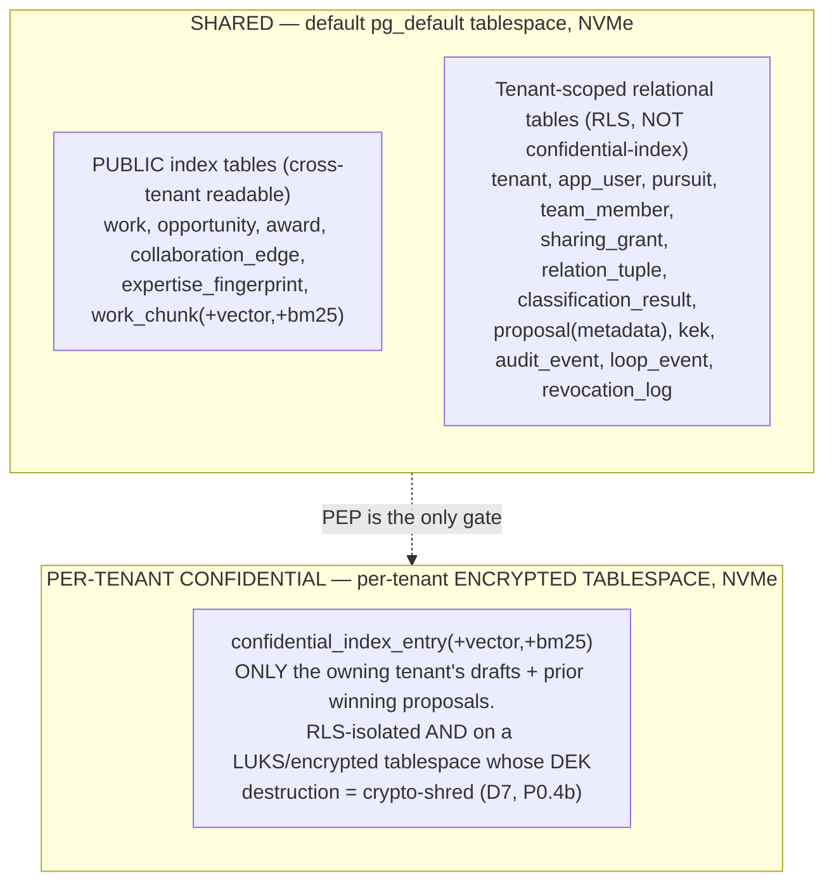
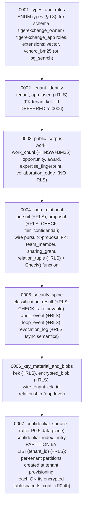

# 13 — Data Model & Schemas: concrete DDL + Pydantic for every entity

> **Read this with:** `05-kernel-contracts.md` (the frozen Pydantic value objects this doc imports),
> `06-security-spine-lld.md` (RLS footgun checklist, crypto-shred split, revocation semantics),
> `07-data-layer-and-retrieval-lld.md` (the two retrieval surfaces, RRF-in-SQL, HNSW/BM25 detail),
> `09-ingestion-and-identity-resolution-lld.md` (who *populates* these tables), and
> `CONVENTIONS-single-box.md` ("this file wins" pins). When this doc and a sibling disagree on a
> *physical schema* detail, **this doc is authoritative for the schema**; for security *behavior*,
> `06` is authoritative.

This is the complete physical + logical data model for TigerExchange (single-Orin edition). One
Postgres 16 instance. Every tenant-scoped table is RLS-isolated. For each of the **21 domain
entities** you get (a) a Pydantic v2 model (frozen value object or row model) and (b) the verbatim
Postgres `CREATE TABLE` DDL plus indexes and RLS policy. Copy these verbatim; do not paraphrase the
DDL — the security properties live in the exact wording (`FORCE`, `AS RESTRICTIVE`, `WITH CHECK`,
the `(tenant_id, ...)` leading-column index).

---

## 0. Conventions used in every table (read once, applies everywhere)

These rules are non-negotiable and come straight from **D5** and the security spine. They are
repeated verbatim on *every tenant-scoped table* below; this section explains *why* once so the
per-table sections stay terse.

### 0.1 Postgres baseline

| Item | Value | Why this and not the alternative |
|---|---|---|
| Engine | PostgreSQL **16** | Single engine consolidates pgvector + native BM25 + RRF + edge-graph (D8). Chose **one Postgres** over Qdrant+OpenSearch+SpiceDB+Apache-AGE because a memory-shared 64GB Orin cannot afford four always-on services competing with the models. |
| Vector extension | `pgvector` (HNSW) | Verified P0 default on aarch64; RaBitQ/DiskANN is P1 only (D8). |
| BM25 extension | `vchord_bm25` (VectorChord-BM25) **or** `pg_search` (ParadeDB) | Whichever **builds and benchmarks** on the real aarch64 box (P0.5 acceptance test). DDL below shows VectorChord; the ParadeDB variant is given inline where it differs. |
| Migration tool | Alembic (SQLAlchemy 2) | Already in the stack; deterministic ordering. |
| Tenant pinning | `set_config('app.tenant_id', <bound param>, true)` = **SET LOCAL** | Transaction-scoped. **Never** `SET SESSION` — under PgBouncer transaction mode the previous tenant's context leaks onto a reused connection (D5). The third arg `true` makes it `SET LOCAL`. |

### 0.2 The two database roles

There are exactly two roles. **The application never connects as the owner.**

```sql
-- Migration role: OWNS the schema, runs DDL. Used ONLY by Alembic, never by the app.
CREATE ROLE tigerexchange_owner LOGIN PASSWORD :'owner_pw' NOSUPERUSER;

-- Application role: what FastAPI/asyncpg/PgBouncer connect as. CANNOT bypass RLS.
CREATE ROLE tigerexchange_app LOGIN PASSWORD :'app_pw'
    NOSUPERUSER          -- cannot become superuser
    NOBYPASSRLS          -- cannot ignore row-level security (the whole point)
    NOINHERIT            -- does not inherit privileges of roles it is a member of
    NOCREATEDB
    NOCREATEROLE;

-- The app role gets table DML grants but is NOT the table owner, so FORCE RLS applies to it.
GRANT USAGE ON SCHEMA tex TO tigerexchange_app;
GRANT SELECT, INSERT, UPDATE, DELETE ON ALL TABLES IN SCHEMA tex TO tigerexchange_app;
ALTER DEFAULT PRIVILEGES IN SCHEMA tex
    GRANT SELECT, INSERT, UPDATE, DELETE ON TABLES TO tigerexchange_app;
```

> **CI probe (P0.1, `06`):** assert at startup that `tigerexchange_app` reports
> `rolsuper = false` AND `rolbypassrls = false`. A misconfigured role silently disables the entire
> tenant boundary, so this is checked, not assumed.

We chose **non-owner app role + FORCE RLS** over "app is owner with RLS enabled" because a table
owner bypasses RLS by default; `FORCE ROW LEVEL SECURITY` is required to make RLS apply even to the
owner, and we additionally never let the app *be* the owner — belt and suspenders.

### 0.3 The RLS policy template (verbatim, applied to every tenant-scoped table)

Every tenant-scoped table `tex.<name>` carries **exactly** this block. The only thing that changes
per table is the table name.

```sql
-- 1. Enable + FORCE so even the table owner is subject to the policy.
ALTER TABLE tex.<name> ENABLE ROW LEVEL SECURITY;
ALTER TABLE tex.<name> FORCE ROW LEVEL SECURITY;

-- 2. ONE restrictive policy FOR ALL, with BOTH USING (read/return filter)
--    and WITH CHECK (write-side filter). RESTRICTIVE = AND-combined: a future
--    migration that adds another policy cannot WIDEN access (PERMISSIVE policies
--    OR-combine and can accidentally open the boundary).
CREATE POLICY tenant_isolation ON tex.<name>
    AS RESTRICTIVE
    FOR ALL
    TO tigerexchange_app
    USING      (tenant_id = current_setting('app.tenant_id', true)::uuid)
    WITH CHECK (tenant_id = current_setting('app.tenant_id', true)::uuid);
```

Why each clause (D5):

| Clause | Closes |
|---|---|
| `FORCE ROW LEVEL SECURITY` | Owner-bypass. RLS normally does not apply to the table owner. |
| `AS RESTRICTIVE` | A later `PERMISSIVE` policy silently OR-widening access. Restrictive policies are AND-combined; access requires *all* restrictive policies to pass. |
| `FOR ALL` | Applies to SELECT/INSERT/UPDATE/DELETE in one policy. |
| `USING (...)` | Read/return side: rows of other tenants are invisible. |
| `WITH CHECK (...)` | Write side: you cannot INSERT/UPDATE a row stamped with another tenant's id (cross-tenant write/poisoning). Omitting this is a real leak vector. |
| `current_setting('app.tenant_id', true)` | The `true` second arg returns NULL (not an error) when unset. Combined with `= <uuid>`, an **unset** GUC yields `NULL = uuid` = NULL = **not true** = **zero rows**. This is the fail-closed property: a transaction that forgot `SET LOCAL` sees nothing. There is a regression test asserting exactly this (P0.1). |

> **The `::uuid` cast matters.** `current_setting` returns `text`. We store `tenant_id` as `uuid`.
> Cast the GUC, not the column, so the index on `tenant_id` is usable.

### 0.4 The four RLS-bypass lint vectors (`check_rls_bypass.py`, P0.1)

The CI lint (`06`) forbids, in any migration:

1. `SECURITY DEFINER` functions (run as definer = can bypass the caller's RLS).
2. `MATERIALIZED VIEW` over a tenant table (materialized views are not RLS-filtered).
3. A plain `VIEW` over a tenant table **without** `WITH (security_invoker = true)` (a non-invoker
   view runs with the view owner's privileges = bypass). This is the vector v2's lint missed.
4. Any policy that is `PERMISSIVE` (default) on a tenant table — must be `AS RESTRICTIVE`.

If you must create a view over a tenant table, it **must** be:

```sql
CREATE VIEW tex.<v> WITH (security_invoker = true) AS SELECT ...;
```

### 0.5 Leading-column index rule

On every tenant-scoped table, `tenant_id` is the **leading column** of every index that the RLS
predicate or any tenant-scoped query touches. This turns the RLS predicate
`tenant_id = $1` into an index seek instead of a heap scan — load-bearing on the HDD-class box (D5,
D13). You will see `(tenant_id, <other cols>)` everywhere below; that order is deliberate.

### 0.6 Shared (public) vs per-tenant confidential tables — the central split (D6)

There are **three storage classes** of table. Know which you are looking at:



- **SHARED PUBLIC index tables** hold *public-tier, classify-gated* content only. They are
  cross-tenant readable *by design* (the discovery/expertise graph is a shared product surface).
  They carry **no** `tenant_id` RLS policy because they are not tenant-private — but writes to them
  go only through the broker after `ClassificationResult.is_retrievable == true` (D6).
- **Tenant-scoped relational tables** carry the full RLS template from §0.3. They live on the
  default tablespace (NVMe). They are private-per-tenant but are *not* the searchable confidential
  retrieval surface.
- **Per-tenant CONFIDENTIAL index tables** (`confidential_index_entry`) are BOTH RLS-isolated AND
  physically placed on a **per-tenant encrypted tablespace** (D7). They hold only that tenant's own
  confidential drafts + prior winning proposals, and only that tenant's drafting path can query them
  (PEP-enforced). Crypto-shred = destroy the tablespace-unlocking DEK (see §22).

> **Why a separate confidential surface and not query-time filtering of one shared index?**
> Query-time post-filtering leaves confidential vectors/postings *physically present* in a
> cross-tenant index = a standing breach (D6 rejected alternative). A physically separate,
> RLS+encrypted-tablespace surface makes "tenant A grounds on A's prior proposals; tenant B cannot
> retrieve them" a structural property, proven by a HUMAN-authored test (P0.9).

> **Why NOT AES-GCM the vectors/BM25 postings directly?** Mathematically impossible to search:
> AES ciphertext destroys the distance metric pgvector/HNSW need, and encrypted postings cannot be
> tokenized/scored (D7). Application-layer AES-GCM is used **only** for *non-searchable* blobs
> (§18, §22). Searchable confidential derivatives are crypto-shredded by **encrypted-tablespace DEK
> destruction**, never by per-record AES.

### 0.7 Frozen Pydantic value objects vs row models

Two flavors of Pydantic v2 model appear here:

- **Frozen value objects** (`model_config = ConfigDict(frozen=True)`): the kernel contracts from
  `05-kernel-contracts.md` — `TenantContext`, `Entitlement`, `ClassificationResult`,
  `PublishableProjection`, `Tier`, `Decision`, `Capability`. These are imported, not redefined; we
  show them here for completeness but they are **owned by the kernel**. They are immutable for the
  request.
- **Row models** (`model_config = ConfigDict(frozen=True, from_attributes=True)`): a 1:1 typed view
  of a table row, used at the broker/repository boundary. `from_attributes=True` lets them be built
  from asyncpg `Record`/SQLAlchemy rows. They are also frozen — rows are read as immutable snapshots;
  mutation goes through an explicit UPDATE, not by mutating an in-memory object.

Common imports assumed at the top of every Pydantic block:

```python
from __future__ import annotations
import datetime as dt
from uuid import UUID
from typing import Optional
from pydantic import BaseModel, ConfigDict, Field
```

### 0.8 Two enum strategies (D14 `grants_gov`, tiers, decisions)

- **Tier / Decision / Capability / lifecycle states** are Python `StrEnum`s in the kernel and stored
  as Postgres native `ENUM` types (created in migration `0001`). Native enums give a hard DB-level
  domain constraint a 30B builder cannot bypass with a typo'd string.
- **`source` on public corpus entities** uses a native enum too, and `grants_gov` is a member
  verbatim (D14). Do not invent variant spellings.

```sql
-- Migration 0001 (types first; see §24 ordering)
CREATE TYPE tex.tier            AS ENUM ('public', 'private', 'confidential');
CREATE TYPE tex.decision        AS ENUM ('ALLOW', 'QUARANTINE', 'DENY');
CREATE TYPE tex.disc_scope      AS ENUM ('local_only', 'federation_listed', 'federation_full'); -- future seam
CREATE TYPE tex.corpus_source   AS ENUM ('openalex', 'crossref', 'orcid', 'ror',
                                         'grants_gov', 'nih_reporter', 'nsf_awards',
                                         'pmc', 'in_platform_writeback');
CREATE TYPE tex.pursuit_state   AS ENUM ('draft', 'matched', 'team_forming', 'drafting',
                                         'submitted', 'won', 'lost', 'abandoned');
CREATE TYPE tex.proposal_state  AS ENUM ('drafting', 'in_review', 'submitted',
                                         'won', 'lost', 'withdrawn');
CREATE TYPE tex.team_role       AS ENUM ('pi', 'co_pi', 'reviewer', 'viewer');
CREATE TYPE tex.opp_status      AS ENUM ('forecasted', 'posted', 'closed', 'archived');
CREATE TYPE tex.outcome_result  AS ENUM ('submitted', 'won', 'lost');
CREATE TYPE tex.revoke_reason   AS ENUM ('security', 'consent', 'expiry', 'admin', 'superseded');
CREATE TYPE tex.edge_type       AS ENUM ('co_authored', 'co_pi_with', 'cites', 'affiliated_with');
```

> **`tier` ordering note for the MAX-rule.** The lattice order is `public < private < confidential`
> (confidential = most restrictive). `tier_join_all` returns the MAX (most restrictive), and an
> **empty** input returns `confidential` (unknown = confidential; D6, P0.0 test
> `tier_join_all([]) == confidential`). The ordering is implemented in Python (kernel), not relied
> on from the enum's textual sort; the enum is just the storage domain.

---

## 1. Tenant

The unit of RLS isolation, KEK custody, encrypted-tablespace crypto-shred, and the per-tenant
confidential retrieval surface. A `Tenant` is a research group/institution on the one box. In the
future federation a Tenant maps to a node (designed, not built — D2).

**Note:** `tex.tenant` is itself tenant-scoped (a tenant can only see its own row), but the row
*also* carries `tenant_id = tenant_id` (the PK is the tenant id). Admin/bootstrap operations that
create tenants run as the **owner** role in a migration/admin path, outside the app RLS context.

### Pydantic

```python
class TenantRow(BaseModel):
    model_config = ConfigDict(frozen=True, from_attributes=True)

    tenant_id: UUID
    display_name: str
    kek_id: UUID                              # -> tex.kek (LocalKms custody)
    confidential_tablespace_ref: str         # logical name of the per-tenant encrypted tablespace
    tablespace_unlock_ref: Optional[str]      # opaque handle the KMS uses to unlock the volume/DEK
    entitlement_edition: str                  # e.g. "discovery_only" | "collaboration" | "full"
    created_at: dt.datetime
    crypto_shredded_at: Optional[dt.datetime] = None
```

### DDL

```sql
CREATE TABLE tex.tenant (
    tenant_id                    uuid        PRIMARY KEY DEFAULT gen_random_uuid(),
    display_name                 text        NOT NULL,
    kek_id                       uuid        NOT NULL,         -- FK added after tex.kek exists (§19)
    confidential_tablespace_ref  text        NOT NULL,        -- e.g. 'ts_conf_<tenant>'
    tablespace_unlock_ref        text,                        -- opaque KMS unlock handle (NOT a key)
    entitlement_edition          text        NOT NULL DEFAULT 'discovery_only',
    created_at                   timestamptz NOT NULL DEFAULT now(),
    crypto_shredded_at           timestamptz                  -- set when destroy_kek() ran
);

-- RLS: a tenant sees only its own row. tenant_id IS the PK here.
ALTER TABLE tex.tenant ENABLE ROW LEVEL SECURITY;
ALTER TABLE tex.tenant FORCE ROW LEVEL SECURITY;
CREATE POLICY tenant_isolation ON tex.tenant
    AS RESTRICTIVE FOR ALL TO tigerexchange_app
    USING      (tenant_id = current_setting('app.tenant_id', true)::uuid)
    WITH CHECK (tenant_id = current_setting('app.tenant_id', true)::uuid);
```

> `confidential_tablespace_ref` / `tablespace_unlock_ref` are the bridge to D7/P0.4b. The
> `tablespace_unlock_ref` is **not** key material — it is an opaque handle the LocalKms uses to
> derive/unwrap the tablespace DEK. The actual DEK is never stored here (§19, §22).

---

## 2. User / Researcher

A person, anchored to a canonical ORCID iD. The node identity in the expertise graph. Holds
memberships in one or more tenants (membership rows live in `team_member` / `relation_tuple`; a
researcher's *primary* tenant is denormalized here for the home-tenant fast path).

> **Subtlety:** a Researcher is a *graph node* (public-tier identity) but also a *tenant member*.
> The researcher's public identity (ORCID, name variants, public works) is in the shared public
> graph. The `app_user` row below is the tenant-scoped membership/account record. We keep them in
> one table with RLS because the account *is* tenant-scoped; the public graph references the
> researcher by `orcid_id` / `subject_id`, not by reading this RLS row.

### Pydantic

```python
class ResearcherRow(BaseModel):
    model_config = ConfigDict(frozen=True, from_attributes=True)

    subject_id: UUID
    tenant_id: UUID                          # the tenant whose account row this is
    orcid_id: Optional[str]                  # canonical "0000-0000-0000-0000"; None until resolved
    display_name: str
    primary_tenant_id: UUID
    sciencv_profile_ref: Optional[str]        # opaque handle to a SciENcv Common Forms biosketch
    name_variants: list[str] = Field(default_factory=list)
    created_at: dt.datetime
```

### DDL

```sql
CREATE TABLE tex.app_user (
    subject_id          uuid        NOT NULL DEFAULT gen_random_uuid(),
    tenant_id           uuid        NOT NULL REFERENCES tex.tenant(tenant_id),
    orcid_id            text,                                  -- canonical ORCID iD, nullable pre-resolution
    display_name        text        NOT NULL,
    primary_tenant_id   uuid        NOT NULL REFERENCES tex.tenant(tenant_id),
    sciencv_profile_ref text,
    name_variants       text[]      NOT NULL DEFAULT '{}',     -- TEXT[] for probabilistic-resolution P1
    created_at          timestamptz NOT NULL DEFAULT now(),
    PRIMARY KEY (tenant_id, subject_id)                        -- tenant_id LEADING
);

-- A given ORCID is unique within a tenant's account space.
CREATE UNIQUE INDEX ux_app_user_tenant_orcid
    ON tex.app_user (tenant_id, orcid_id) WHERE orcid_id IS NOT NULL;

ALTER TABLE tex.app_user ENABLE ROW LEVEL SECURITY;
ALTER TABLE tex.app_user FORCE ROW LEVEL SECURITY;
CREATE POLICY tenant_isolation ON tex.app_user
    AS RESTRICTIVE FOR ALL TO tigerexchange_app
    USING      (tenant_id = current_setting('app.tenant_id', true)::uuid)
    WITH CHECK (tenant_id = current_setting('app.tenant_id', true)::uuid);
```

---

## 3. TenantContext (frozen kernel value object — NOT a table)

Request-scoped, immutable identity derived from the OIDC token and pinned to the transaction via
`SET LOCAL`. **There is no `tenant_context` table** — this is a transient kernel object
(`05-kernel-contracts.md`) constructed once per request and passed by reference. It is listed as a
domain entity because it is the carrier of the RLS GUC value.

### Pydantic (imported from the kernel; shown for reference)

```python
class TenantContext(BaseModel):
    model_config = ConfigDict(frozen=True)

    tenant_id: UUID
    subject_id: UUID
    entitlement: "Entitlement"               # frozen, see §4
    request_id: UUID

    def apply_to_session(self) -> str:
        # Bound-parameter SET LOCAL; the literal value is passed as a bind param, NOT interpolated,
        # to avoid tenant-id SQL injection. The repository runs:
        #   await conn.execute("SELECT set_config('app.tenant_id', $1, true)", str(self.tenant_id))
        return "SELECT set_config('app.tenant_id', $1, true)"
```

> **Hard rule:** the value is passed as `$1` (bound), never string-formatted into the SQL. The
> third `set_config` arg `true` = transaction-local (= `SET LOCAL`), mandatory under PgBouncer
> transaction pooling (D5).

---

## 4. Entitlement / Capability (frozen kernel value objects — NOT tables)

The resolved per-tenant capability set evaluated **at the PEP** (D4 step 1–2). Modules read it; they
never decide it. Stored *durably* as a column on `tex.tenant.entitlement_edition` plus an
edition→capabilities mapping that lives in code (a fixed, small lattice — D4 rationale). There is no
separate `entitlement` table at P0; editions are a constant map.

### Pydantic (imported from the kernel)

```python
from enum import StrEnum

class Capability(StrEnum):
    OWN_MATERIALS          = "own_materials"
    PUBLIC_RETRIEVAL       = "public_retrieval"
    CONFIDENTIAL_RETRIEVAL = "confidential_retrieval"   # gates the per-tenant confidential surface
    CROSS_GROUP_SHARE      = "cross_group_share"
    CONFIDENTIAL_DRAFTING  = "confidential_drafting"

class Tier(StrEnum):
    PUBLIC       = "public"
    PRIVATE      = "private"
    CONFIDENTIAL = "confidential"

class Entitlement(BaseModel):
    model_config = ConfigDict(frozen=True)
    edition: str
    capabilities: frozenset[Capability]

    def permits_tier(self, tier: Tier) -> bool:
        # confidential tier requires CONFIDENTIAL_RETRIEVAL or CONFIDENTIAL_DRAFTING capability
        if tier == Tier.CONFIDENTIAL:
            return bool(self.capabilities & {Capability.CONFIDENTIAL_RETRIEVAL,
                                             Capability.CONFIDENTIAL_DRAFTING})
        return True
```

> The fixed edition→capability map (e.g. `discovery_only` = `{PUBLIC_RETRIEVAL}`,
> `collaboration` = `{... CROSS_GROUP_SHARE, CONFIDENTIAL_DRAFTING ...}`) is a Python constant in
> `mod-pep`. We chose a code constant over a DB table because the set is tiny and fixed; a table
> invites drift and a sync bug a 30B builder would get wrong (D4 rationale, mirrors the in-Python
> ABAC choice).

---

## 5. Work / Paper (SHARED PUBLIC — no tenant RLS)

A scholarly output node in the expertise graph, anchored by DOI. **Public-tier, cross-tenant
readable.** Also created by the write-back edge (D12) when a won proposal produces artifacts
(`source = 'in_platform_writeback'`). Carries the SPECTER2 (ingest-precomputed) centroid reference
and links to its retrieval chunks.

This table is **shared**: it has **no** `tenant_id` and **no** RLS policy. Writes go only through the
broker after classification ALLOW (D6).

### Pydantic

```python
class WorkRow(BaseModel):
    model_config = ConfigDict(frozen=True, from_attributes=True)

    work_id: UUID
    doi: Optional[str]
    title: str
    abstract: Optional[str]
    topics: list[str] = Field(default_factory=list)
    venue: Optional[str]
    year: Optional[int]
    source: str                              # tex.corpus_source enum value
    license: Optional[str]                   # provenance/commercial gate (D14)
    provenance: dict                         # JSONB: source URL, snapshot id, ingest run
    specter2_centroid_id: Optional[UUID]      # -> tex.expertise_fingerprint or a vector row
    projection_version: int                  # monotonic applier (D12)
    revocation_epoch: int                    # monotonic applier (D12) — anti-resurrection
    created_at: dt.datetime
```

### DDL

```sql
CREATE TABLE tex.work (
    work_id              uuid              PRIMARY KEY DEFAULT gen_random_uuid(),
    doi                  text              UNIQUE,            -- DOI anchor; NULL for some sources
    title                text              NOT NULL,
    abstract             text,
    topics               text[]            NOT NULL DEFAULT '{}',
    venue                text,
    year                 integer,
    source               tex.corpus_source NOT NULL,
    license              text,                                -- e.g. 'CC0', 'CC-BY', PMC commercial flag
    provenance           jsonb             NOT NULL DEFAULT '{}'::jsonb,
    specter2_centroid_id uuid,
    projection_version   integer           NOT NULL DEFAULT 0,
    revocation_epoch     integer           NOT NULL DEFAULT 0,
    created_at           timestamptz       NOT NULL DEFAULT now()
);
CREATE INDEX ix_work_year   ON tex.work (year);
CREATE INDEX ix_work_topics ON tex.work USING gin (topics);
CREATE INDEX ix_work_source ON tex.work (source);
-- NO RLS: this is a shared public table. Writes gated by the broker post-classification (D6).
```

> The actual searchable dense/lexical content for a Work lives in `tex.work_chunk` (§5b), not on
> the `work` row, because of section-aware parent/child chunking (`07`).

### 5b. work_chunk — the SHARED PUBLIC retrieval surface (vector + BM25)

This is the physical shared index for public retrieval (D8). It carries the pgvector HNSW column and
the BM25 index. One row per child chunk (embed 128–256 tok children, return 512–1024 tok parents;
`07`).

```sql
CREATE TABLE tex.work_chunk (
    chunk_id        uuid        PRIMARY KEY DEFAULT gen_random_uuid(),
    work_id         uuid        NOT NULL REFERENCES tex.work(work_id) ON DELETE CASCADE,
    parent_chunk_id uuid,                                    -- hierarchical parent (self-ref, nullable)
    ordinal         integer     NOT NULL,
    content         text        NOT NULL,                    -- the child chunk text (returned: parent)
    embedding       vector(1024) NOT NULL,                   -- bge-m3 dense, 1024-dim (pin in CONVENTIONS)
    bm25_vector     bm25vector,                              -- VectorChord-BM25 column type
    projection_version integer  NOT NULL DEFAULT 0,
    revocation_epoch   integer  NOT NULL DEFAULT 0
);

-- Dense HNSW index. MUST stay RAM-resident / on NVMe (D8/D13 HDD guardrail).
CREATE INDEX ix_work_chunk_hnsw
    ON tex.work_chunk USING hnsw (embedding vector_cosine_ops)
    WITH (m = 16, ef_construction = 64);

-- Native BM25 index (VectorChord-BM25). ParadeDB pg_search variant differs (see note).
CREATE INDEX ix_work_chunk_bm25
    ON tex.work_chunk USING bm25 (bm25_vector bm25_ops);

CREATE INDEX ix_work_chunk_work ON tex.work_chunk (work_id);
-- NO RLS: shared public index.
```

> **ParadeDB pg_search alternate** (if VectorChord-BM25 will not build on the JetPack base — open
> risk): drop the `bm25_vector` column and instead create
> `CREATE INDEX ix_work_chunk_search ON tex.work_chunk USING bm25 (chunk_id, content) WITH (key_field='chunk_id');`
> and query via `content @@@ 'terms'`. Keep `IVectorStore`/`ILexicalIndex` clean so the swap is
> local (open_risks mitigation). The P0.5 acceptance test benchmarks whichever engine builds, on the
> real aarch64 box — no inherited x86 number is relied upon (D8).

> **`vector(1024)` dimension:** pinned to the chosen serve-time embedder (bge-m3 = 1024). If
> Qwen3-Embedding-0.6B is used instead, set the dimension to its output size and pin it in
> `CONVENTIONS-single-box.md`. Do not mix dimensions in one column.

---

## 6. Grant Opportunity (SHARED PUBLIC — no tenant RLS)

An open funding call (Grants.gov daily XML extract). The **top-of-loop trigger** (D1, Stage 1).
Public-tier. `source = 'grants_gov'` verbatim (D14).

### Pydantic

```python
class OpportunityRow(BaseModel):
    model_config = ConfigDict(frozen=True, from_attributes=True)

    opportunity_id: UUID
    agency: str
    solicitation_number: Optional[str]
    title: str
    deadline: Optional[dt.date]
    required_concepts: list[str] = Field(default_factory=list)   # drives the coverage matrix (D6/disc)
    forecast_flag: bool = False
    status: str                                                  # tex.opp_status
    source: str = "grants_gov"
    created_at: dt.datetime
```

### DDL

```sql
CREATE TABLE tex.opportunity (
    opportunity_id      uuid              PRIMARY KEY DEFAULT gen_random_uuid(),
    agency              text              NOT NULL,
    solicitation_number text,
    title               text              NOT NULL,
    deadline            date,
    required_concepts   text[]            NOT NULL DEFAULT '{}',   -- TEXT[] coverage-matrix input
    forecast_flag       boolean           NOT NULL DEFAULT false,
    status              tex.opp_status    NOT NULL DEFAULT 'posted',
    source              tex.corpus_source NOT NULL DEFAULT 'grants_gov',
    created_at          timestamptz       NOT NULL DEFAULT now()
);
CREATE INDEX ix_opportunity_deadline ON tex.opportunity (deadline);
CREATE INDEX ix_opportunity_concepts ON tex.opportunity USING gin (required_concepts);
-- NO RLS: shared public table.
```

---

## 7. Grant Award (SHARED PUBLIC — no tenant RLS)

A historical funded project (NIH RePORTER / NSF Awards). Feeds PI track-record and co-funding
collaboration edges (D14: awards feed expertise + co-funding edges, distinct from opportunities
which drive the win-loop). Public-tier.

### Pydantic

```python
class AwardRow(BaseModel):
    model_config = ConfigDict(frozen=True, from_attributes=True)

    award_id: UUID
    award_number: str
    funder: str
    pi_orcid: Optional[str]
    org_ror: Optional[str]
    abstract: Optional[str]
    fiscal_year: Optional[int]
    linked_work_dois: list[str] = Field(default_factory=list)
    co_pis: list[str] = Field(default_factory=list)            # ORCID iDs of co-PIs
    source: str                                                # nih_reporter | nsf_awards
    created_at: dt.datetime
```

### DDL

```sql
CREATE TABLE tex.award (
    award_id         uuid              PRIMARY KEY DEFAULT gen_random_uuid(),
    award_number     text              NOT NULL,
    funder           text              NOT NULL,
    pi_orcid         text,
    org_ror          text,
    abstract         text,
    fiscal_year      integer,
    linked_work_dois text[]            NOT NULL DEFAULT '{}',
    co_pis           text[]            NOT NULL DEFAULT '{}',
    source           tex.corpus_source NOT NULL,
    created_at       timestamptz       NOT NULL DEFAULT now(),
    UNIQUE (funder, award_number)
);
CREATE INDEX ix_award_pi   ON tex.award (pi_orcid);
CREATE INDEX ix_award_ror  ON tex.award (org_ror);
CREATE INDEX ix_award_fy   ON tex.award (fiscal_year);
-- NO RLS: shared public table.
```

---

## 8. Pursuit (TENANT-SCOPED — RLS)

**THE loop-threading object** (D1, D12). Binds a matched Opportunity → draft Proposal → candidate
Team + ongoing match alerts. The single sticky home that threads all five loop stages and creates
data gravity. Owned by one tenant.

### Pydantic

```python
class PursuitRow(BaseModel):
    model_config = ConfigDict(frozen=True, from_attributes=True)

    pursuit_id: UUID
    tenant_id: UUID                          # owner_tenant_id
    opportunity_id: Optional[UUID]
    proposal_id: Optional[UUID]
    team_id: Optional[UUID]
    alert_config: dict                       # JSONB: ongoing match-alert config
    lifecycle_state: str                     # tex.pursuit_state
    created_at: dt.datetime
    updated_at: dt.datetime
```

### DDL

```sql
CREATE TABLE tex.pursuit (
    pursuit_id      uuid              NOT NULL DEFAULT gen_random_uuid(),
    tenant_id       uuid              NOT NULL REFERENCES tex.tenant(tenant_id),
    opportunity_id  uuid              REFERENCES tex.opportunity(opportunity_id),
    proposal_id     uuid,                                       -- FK added after tex.proposal (§9)
    team_id         uuid,                                       -- logical team grouping (see §11)
    alert_config    jsonb             NOT NULL DEFAULT '{}'::jsonb,
    lifecycle_state tex.pursuit_state NOT NULL DEFAULT 'draft',
    created_at      timestamptz       NOT NULL DEFAULT now(),
    updated_at      timestamptz       NOT NULL DEFAULT now(),
    PRIMARY KEY (tenant_id, pursuit_id)                         -- tenant_id LEADING
);
CREATE INDEX ix_pursuit_state ON tex.pursuit (tenant_id, lifecycle_state);
CREATE INDEX ix_pursuit_opp   ON tex.pursuit (tenant_id, opportunity_id);

ALTER TABLE tex.pursuit ENABLE ROW LEVEL SECURITY;
ALTER TABLE tex.pursuit FORCE ROW LEVEL SECURITY;
CREATE POLICY tenant_isolation ON tex.pursuit
    AS RESTRICTIVE FOR ALL TO tigerexchange_app
    USING      (tenant_id = current_setting('app.tenant_id', true)::uuid)
    WITH CHECK (tenant_id = current_setting('app.tenant_id', true)::uuid);
```

> `lifecycle_state` transitions are the Pursuit state machine documented in `12`. The terminal
> `won` state is what fires `proposal.outcome_recorded` → the write-back edge (D12, §22, §20).

---

## 9. Proposal (TENANT-SCOPED — RLS; metadata here, content in CRDT + confidential index)

The confidential co-authored grant proposal. **MAX-rule confidential tier.** The *content* lives as
(a) a CRDT buffer (the live edit doc), snapshotted as an **AES-256-GCM non-searchable blob** into
the KEK-bound draft store, and (b) indexed into the **owning tenant's confidential retrieval
surface** (§10) for own-tenant grounding. This `proposal` row is the relational metadata/anchor; it
**never** enters the shared cross-tenant index.

### Pydantic

```python
class ProposalRow(BaseModel):
    model_config = ConfigDict(frozen=True, from_attributes=True)

    proposal_id: UUID
    tenant_id: UUID                          # owner_tenant_id
    pursuit_id: UUID
    tier: str = "confidential"               # MAX-rule; always confidential
    crdt_doc_ref: str                        # handle to the live CRDT buffer (pycrdt)
    kek_snapshot_ref: Optional[str]           # handle to the AES-GCM snapshot blob (non-searchable)
    confidential_index_ref: Optional[str]     # handle into the per-tenant confidential surface
    lifecycle_state: str                     # tex.proposal_state
    version: int
    created_at: dt.datetime
    updated_at: dt.datetime
```

### DDL

```sql
CREATE TABLE tex.proposal (
    proposal_id            uuid               NOT NULL DEFAULT gen_random_uuid(),
    tenant_id              uuid               NOT NULL REFERENCES tex.tenant(tenant_id),
    pursuit_id             uuid               NOT NULL,
    tier                   tex.tier           NOT NULL DEFAULT 'confidential'
                                              CHECK (tier = 'confidential'),   -- MAX-rule pin
    crdt_doc_ref           text               NOT NULL,
    kek_snapshot_ref       text,                                 -- AES-GCM blob handle (§18)
    confidential_index_ref text,                                 -- per-tenant conf surface handle (§10)
    lifecycle_state        tex.proposal_state NOT NULL DEFAULT 'drafting',
    version                integer            NOT NULL DEFAULT 1,
    created_at             timestamptz        NOT NULL DEFAULT now(),
    updated_at             timestamptz        NOT NULL DEFAULT now(),
    PRIMARY KEY (tenant_id, proposal_id),                        -- tenant_id LEADING
    FOREIGN KEY (tenant_id, pursuit_id)
        REFERENCES tex.pursuit (tenant_id, pursuit_id)
);
CREATE INDEX ix_proposal_pursuit ON tex.proposal (tenant_id, pursuit_id);
CREATE INDEX ix_proposal_state   ON tex.proposal (tenant_id, lifecycle_state);

ALTER TABLE tex.proposal ENABLE ROW LEVEL SECURITY;
ALTER TABLE tex.proposal FORCE ROW LEVEL SECURITY;
CREATE POLICY tenant_isolation ON tex.proposal
    AS RESTRICTIVE FOR ALL TO tigerexchange_app
    USING      (tenant_id = current_setting('app.tenant_id', true)::uuid)
    WITH CHECK (tenant_id = current_setting('app.tenant_id', true)::uuid);

-- Now we can wire the pursuit -> proposal FK (was deferred in §8).
ALTER TABLE tex.pursuit
    ADD CONSTRAINT fk_pursuit_proposal
    FOREIGN KEY (tenant_id, proposal_id) REFERENCES tex.proposal (tenant_id, proposal_id);
```

> The `CHECK (tier = 'confidential')` is a deliberate DB-level pin: a proposal can never be
> down-classified to public by a builder bug. Down-classification, if ever needed, is a deliberate
> derived public WORK node via the write-back edge (D12), not an in-place tier flip.

> **Snapshot cadence:** snapshot the CRDT doc on **autosave intervals**, not per keystroke
> (open_risks mitigation), AES-GCM the snapshot under the per-tenant DEK, store the blob handle in
> `kek_snapshot_ref`. The draft, autosave, and version history are all MAX-rule confidential and
> persist **only** in the encrypted store (§18, §22). A HUMAN-authored test asserts no draft artifact
> lands in a non-encrypted store (P0.9).

---

## 10. ConfidentialIndexEntry (PER-TENANT CONFIDENTIAL — RLS **and** encrypted tablespace)

A per-tenant, RLS-isolated retrieval entry (dense vector + BM25 posting) for the tenant's **own**
confidential drafts and prior winning proposals. **This is the centerpiece moat surface (D6).** It
lives on the tenant's **encrypted tablespace** (D7) and is queryable **only** by that tenant's
confidential drafting path (PEP-enforced, `CONFIDENTIAL_RETRIEVAL` capability required). Tenant B
physically cannot retrieve tenant A's entries — proven by a HUMAN-authored test (P0.9).

This is the one table that is BOTH RLS-isolated AND placed on a per-tenant encrypted tablespace.

### Pydantic

```python
class ConfidentialIndexEntryRow(BaseModel):
    model_config = ConfigDict(frozen=True, from_attributes=True)

    entry_id: UUID
    tenant_id: UUID                          # leading index + RLS
    source_proposal_id: UUID                 # which own proposal/draft this entry derives from
    content: str                             # plaintext-at-rest INSIDE the encrypted tablespace
    embedding: list[float]                   # dense vector (searchable; not AES-GCM'd)
    tablespace_ref: str                      # the per-tenant encrypted tablespace name
    created_at: dt.datetime
```

### DDL

```sql
-- The tablespace is created by the operator/migration when a tenant is provisioned (D7, §22):
--   CREATE TABLESPACE ts_conf_<tenant> LOCATION '/mnt/nvme/enc/<tenant>';   (on a LUKS-mounted dir)
-- The DDL below places this tenant's confidential surface ON that encrypted tablespace.

CREATE TABLE tex.confidential_index_entry (
    entry_id           uuid         NOT NULL DEFAULT gen_random_uuid(),
    tenant_id          uuid         NOT NULL REFERENCES tex.tenant(tenant_id),
    source_proposal_id uuid         NOT NULL,
    content            text         NOT NULL,                  -- plaintext AT REST inside encrypted vol
    embedding          vector(1024) NOT NULL,                  -- searchable; crypto-shred = DEK destroy
    bm25_vector        bm25vector,                             -- searchable BM25 (VectorChord)
    tablespace_ref     text         NOT NULL,
    created_at         timestamptz  NOT NULL DEFAULT now(),
    PRIMARY KEY (tenant_id, entry_id)                          -- tenant_id LEADING
) TABLESPACE pg_default;                                       -- per-tenant partition placed on enc TS

-- HNSW + BM25 for the confidential surface (same two-stage pipeline as the public surface, D8).
CREATE INDEX ix_cie_hnsw
    ON tex.confidential_index_entry USING hnsw (embedding vector_cosine_ops)
    WITH (m = 16, ef_construction = 64);
CREATE INDEX ix_cie_bm25
    ON tex.confidential_index_entry USING bm25 (bm25_vector bm25_ops);
CREATE INDEX ix_cie_proposal
    ON tex.confidential_index_entry (tenant_id, source_proposal_id);

ALTER TABLE tex.confidential_index_entry ENABLE ROW LEVEL SECURITY;
ALTER TABLE tex.confidential_index_entry FORCE ROW LEVEL SECURITY;
CREATE POLICY tenant_isolation ON tex.confidential_index_entry
    AS RESTRICTIVE FOR ALL TO tigerexchange_app
    USING      (tenant_id = current_setting('app.tenant_id', true)::uuid)
    WITH CHECK (tenant_id = current_setting('app.tenant_id', true)::uuid);
```

> **Physical placement (D7, the load-bearing detail):** at P0 the simplest workable scheme is **one
> partition (or one tablespace) per tenant** for this table, each partition's tablespace pointing at
> a LUKS-mounted directory whose unlock key is the per-tenant DEK. We use **partition-per-tenant on a
> per-tenant encrypted tablespace** rather than a single shared table because crypto-shred must
> destroy *one tenant's* searchable derivatives without touching others — destroying a per-tenant
> DEK renders that tenant's tablespace unreadable, and we then drop-and-rebuild (§22). A single
> shared tablespace cannot be selectively crypto-shredded per tenant.
>
> Concretely (partition variant), declare the table `PARTITION BY LIST (tenant_id)` and, per tenant,
> `CREATE TABLE tex.cie_<tenant> PARTITION OF tex.confidential_index_entry FOR VALUES IN (<id>) TABLESPACE ts_conf_<tenant>;`
> The RLS policy is inherited by partitions. The simplified DDL above shows the non-partitioned
> shape for readability; the **builder must use the partitioned form** so per-tenant DEK destruction
> is physically scoped. See `06`/`07` for the partition DDL in full and the P0.4b wiring.

> **Why the content column is plaintext-at-rest here but the embedding is searchable:** the entire
> table lives *inside* an encrypted block device (LUKS/encrypted tablespace). While mounted, it is
> searchable (HNSW needs real distances). Crypto-shred = destroy the DEK that unlocks the device, at
> which point everything in it — content, vectors, BM25 postings — is unrecoverable in O(1)
> (D7). We do **not** AES-GCM the embedding/postings (that would make them unsearchable). A
> HUMAN-authored P0.4b test asserts the surface stays searchable while mounted AND yields
> zero-decryptable-hits after DEK destruction.

---

## 11. Team / TeamMember (TENANT-SCOPED — RLS)

The assembled cross-group team and each member's scoped, revocable workspace role
(`pi` = owner, `co_pi` = edit, `reviewer` = comment, `viewer` = view — Notion-style scoped roles,
D11). Members may span tenants: a `team_member` row's `member_tenant_id` may differ from the team's
owning `tenant_id` (this is the cross-group collaboration the activation north-star measures).

> **RLS subtlety for cross-tenant membership:** the `team_member` table is owned by the *team's*
> tenant (the workspace owner), so `tenant_id` = workspace-owner tenant. A *member from a different
> tenant* does **not** see this row via this table's RLS; their access to the workspace is granted
> through a `sharing_grant` / `relation_tuple` (§12, §13) resolved by the ReBAC Check, **not** by
> reading `team_member` directly. This keeps the RLS predicate simple (owner-tenant only) while the
> ReBAC layer handles cross-tenant authorization. See `06`/`11` for the full sharing flow.

### Pydantic

```python
class TeamMemberRow(BaseModel):
    model_config = ConfigDict(frozen=True, from_attributes=True)

    team_member_id: UUID
    tenant_id: UUID                          # workspace-owner tenant (the team's tenant)
    team_id: UUID
    proposal_id: UUID
    member_subject_id: UUID
    member_tenant_id: UUID                    # may != tenant_id  -> cross-group member
    role: str                                # tex.team_role
    granted_by: UUID                         # subject_id of the granting PI
    granted_at: dt.datetime
    revoked_at: Optional[dt.datetime] = None
```

### DDL

```sql
CREATE TABLE tex.team_member (
    team_member_id    uuid          NOT NULL DEFAULT gen_random_uuid(),
    tenant_id         uuid          NOT NULL REFERENCES tex.tenant(tenant_id),  -- workspace owner
    team_id           uuid          NOT NULL,
    proposal_id       uuid          NOT NULL,
    member_subject_id uuid          NOT NULL,
    member_tenant_id  uuid          NOT NULL REFERENCES tex.tenant(tenant_id),  -- may differ (cross-group)
    role              tex.team_role NOT NULL,
    granted_by        uuid          NOT NULL,
    granted_at        timestamptz   NOT NULL DEFAULT now(),
    revoked_at        timestamptz,
    PRIMARY KEY (tenant_id, team_member_id),                    -- tenant_id LEADING
    FOREIGN KEY (tenant_id, proposal_id)
        REFERENCES tex.proposal (tenant_id, proposal_id)
);
CREATE INDEX ix_team_member_team  ON tex.team_member (tenant_id, team_id);
CREATE INDEX ix_team_member_subj  ON tex.team_member (tenant_id, member_subject_id);
CREATE INDEX ix_team_member_active
    ON tex.team_member (tenant_id, team_id) WHERE revoked_at IS NULL;

ALTER TABLE tex.team_member ENABLE ROW LEVEL SECURITY;
ALTER TABLE tex.team_member FORCE ROW LEVEL SECURITY;
CREATE POLICY tenant_isolation ON tex.team_member
    AS RESTRICTIVE FOR ALL TO tigerexchange_app
    USING      (tenant_id = current_setting('app.tenant_id', true)::uuid)
    WITH CHECK (tenant_id = current_setting('app.tenant_id', true)::uuid);
```

> There is **no separate `team` table** at P0 — `team_id` is a grouping key on `team_member` and
> referenced from `pursuit.team_id`. Promoting it to its own table is a P1 task if team-level
> metadata is needed. `revoked_at` is a *soft* membership signal for UI; the **authoritative** deny
> is the durable `revocation_log` (§21) read at PEP step 5. Highest-permission-wins cascade is
> computed in `mod-workspace` (`11`), not in this table.

---

## 12. SharingGrant (TENANT-SCOPED — RLS; a typed view over RelationTuple)

A revocable, scope-bounded cross-group access grant. Owner-authoritative; lights up cross-tenant
workspace membership. **A SharingGrant is materialized as a RelationTuple** (§13) plus grant
metadata (scope, expiry, reason). We keep a thin `sharing_grant` table for the human-facing metadata
and write the corresponding `relation_tuple` row for the ReBAC Check.

### Pydantic

```python
class SharingGrantRow(BaseModel):
    model_config = ConfigDict(frozen=True, from_attributes=True)

    grant_id: UUID
    tenant_id: UUID                          # owner tenant (authoritative)
    subject: str                             # e.g. "user:<subject_id>@<member_tenant>"
    relation: str                            # e.g. "editor" | "commenter" | "viewer"
    object: str                              # e.g. "proposal:<proposal_id>"
    scope: dict                              # JSONB: scope bounds (sections, capabilities)
    reason: str
    expires_at: Optional[dt.datetime] = None
    revoked_at: Optional[dt.datetime] = None
    created_at: dt.datetime
```

### DDL

```sql
CREATE TABLE tex.sharing_grant (
    grant_id    uuid        NOT NULL DEFAULT gen_random_uuid(),
    tenant_id   uuid        NOT NULL REFERENCES tex.tenant(tenant_id),   -- owner-authoritative
    subject     text        NOT NULL,
    relation    text        NOT NULL,
    object      text        NOT NULL,
    scope       jsonb       NOT NULL DEFAULT '{}'::jsonb,
    reason      text        NOT NULL,
    expires_at  timestamptz,
    revoked_at  timestamptz,
    created_at  timestamptz NOT NULL DEFAULT now(),
    PRIMARY KEY (tenant_id, grant_id)                           -- tenant_id LEADING
);
CREATE INDEX ix_sharing_grant_object
    ON tex.sharing_grant (tenant_id, object) WHERE revoked_at IS NULL;

ALTER TABLE tex.sharing_grant ENABLE ROW LEVEL SECURITY;
ALTER TABLE tex.sharing_grant FORCE ROW LEVEL SECURITY;
CREATE POLICY tenant_isolation ON tex.sharing_grant
    AS RESTRICTIVE FOR ALL TO tigerexchange_app
    USING      (tenant_id = current_setting('app.tenant_id', true)::uuid)
    WITH CHECK (tenant_id = current_setting('app.tenant_id', true)::uuid);
```

> **Owner-authoritative re-derivation (D2 carry-forward-clean seam, `06`):** the owner tenant
> re-derives the effective scope from this table; a caller's claimed scope is an **untrusted hint**.
> Revocation flips `revoked_at` here AND writes a durable `revocation_log` row (§21) which is the
> authoritative deny.

---

## 13. RelationTuple (TENANT-SCOPED — RLS; the ReBAC store + recursive-CTE Check)

The Zanzibar-style ReBAC storage row evaluated by the **recursive-CTE `Check()`** (D4 step 4). It
inherits tenant RLS isolation. **HONEST CAVEAT (D2, D4):** the recursive-CTE Check resolves **LOCAL
tables only**; cross-box federation needs distributed tuple resolution this cannot do — a KNOWN
federation-boundary REWRITE, not a transport swap (`15`).

### Pydantic

```python
class RelationTupleRow(BaseModel):
    model_config = ConfigDict(frozen=True, from_attributes=True)

    tenant_id: UUID                          # leading index
    subject: str                             # "user:<id>" or "group:<id>#member" (userset)
    relation: str                            # "owner" | "editor" | "commenter" | "viewer" | "parent"
    object: str                              # "proposal:<id>" | "team:<id>"
```

### DDL

```sql
CREATE TABLE tex.relation_tuple (
    tenant_id uuid NOT NULL REFERENCES tex.tenant(tenant_id),
    subject   text NOT NULL,
    relation  text NOT NULL,
    object    text NOT NULL,
    PRIMARY KEY (tenant_id, object, relation, subject)          -- tenant_id LEADING; object-first lookup
);
-- Reverse lookup (who can X this object) and subject expansion both want indexes:
CREATE INDEX ix_rt_object  ON tex.relation_tuple (tenant_id, object, relation);
CREATE INDEX ix_rt_subject ON tex.relation_tuple (tenant_id, subject);

ALTER TABLE tex.relation_tuple ENABLE ROW LEVEL SECURITY;
ALTER TABLE tex.relation_tuple FORCE ROW LEVEL SECURITY;
CREATE POLICY tenant_isolation ON tex.relation_tuple
    AS RESTRICTIVE FOR ALL TO tigerexchange_app
    USING      (tenant_id = current_setting('app.tenant_id', true)::uuid)
    WITH CHECK (tenant_id = current_setting('app.tenant_id', true)::uuid);
```

### The recursive-CTE `Check()` (verbatim, D4 step 4)

`Check(subject, relation, object)` returns whether `subject` has `relation` on `object`, following
usersets (`group:G#member`) and a `parent` relation (e.g. team → proposal cascade). This is the SQL
behind `IPolicyEnforcement.check_relation(...)`. It runs **within the tenant transaction** (so RLS
already scopes `relation_tuple` to one tenant).

```sql
-- Returns one row if the relation holds, zero rows otherwise. Bounded depth to avoid cycles.
WITH RECURSIVE reachable(subject, relation, object, depth) AS (
    -- base: direct tuples for the target object
    SELECT rt.subject, rt.relation, rt.object, 1
    FROM tex.relation_tuple rt
    WHERE rt.object   = $3          -- target object, bound param
      AND rt.relation = $2          -- target relation, bound param
  UNION
    -- step: expand usersets ("group:G#member") and parent cascade
    SELECT rt2.subject, r.relation, r.object, r.depth + 1
    FROM reachable r
    JOIN tex.relation_tuple rt2
      ON  rt2.object   = split_part(r.subject, '#', 1)   -- the referenced group/object
      AND ('#' || rt2.relation) = ('#' || split_part(r.subject, '#', 2))
    WHERE r.subject LIKE '%#%'      -- only expand userset references
      AND r.depth < 16              -- hard depth bound (cycle/blowup guard)
)
SELECT 1
FROM reachable
WHERE subject = $1                  -- the asking subject, bound param
LIMIT 1;
```

> **Parent cascade** (team → proposal) is modeled by tuples like
> `('team:T', 'parent', 'proposal:P')` plus a rewrite rule that `editor` on `proposal:P` is implied
> by `editor` on `team:T`. At P0 keep the rewrite **explicit** by also writing the implied tuples on
> grant (denormalized) rather than computing rewrites in SQL — simpler for the builder, and the
> grant path is the single writer. The depth-16 bound is a safety guard, not a feature limit. The
> P0.2 acceptance test asserts a nested-relation Check resolves correctly.

---

## 14. ClassificationResult (frozen kernel value object + a persisted row for adjudication)

The fail-closed classifier output gating SHARED-index ingestion (D6). Abstention → QUARANTINE
(= treated confidential). Determines `is_retrievable` for the shared index. Walking-skeleton P0 =
binary allow/quarantine (DENY reserved). The **value object** is the kernel type; we also persist a
`classification_result` row for the adjudication queue and audit.

### Pydantic (kernel value object)

```python
class Decision(StrEnum):
    ALLOW      = "ALLOW"
    QUARANTINE = "QUARANTINE"
    DENY       = "DENY"

class ClassificationResult(BaseModel):
    model_config = ConfigDict(frozen=True)

    tier: Tier
    decision: Decision
    is_retrievable: bool                     # True ONLY for Decision.ALLOW + Tier.PUBLIC
    class_codes: list[str] = Field(default_factory=list)   # TEXT[] in DDL (P0.3 acceptance)
    confidence: float
    compliance_flags: list[str] = Field(default_factory=list)
```

### DDL (persisted adjudication row — TENANT-SCOPED for quarantined items belonging to a tenant)

```sql
CREATE TABLE tex.classification_result (
    classification_id uuid          NOT NULL DEFAULT gen_random_uuid(),
    tenant_id         uuid          NOT NULL REFERENCES tex.tenant(tenant_id),
    entity_ref        text          NOT NULL,                 -- "work:<id>" etc. being classified
    tier              tex.tier      NOT NULL,
    decision          tex.decision  NOT NULL,
    is_retrievable    boolean       NOT NULL,
    class_codes       text[]        NOT NULL DEFAULT '{}',    -- TEXT[] (P0.3 acceptance test)
    confidence        double precision NOT NULL,
    compliance_flags  text[]        NOT NULL DEFAULT '{}',
    adjudicated       boolean       NOT NULL DEFAULT false,   -- human adjudication queue flag
    created_at        timestamptz   NOT NULL DEFAULT now(),
    PRIMARY KEY (tenant_id, classification_id),               -- tenant_id LEADING
    CONSTRAINT ck_is_retrievable_only_public_allow
        CHECK (is_retrievable = (decision = 'ALLOW' AND tier = 'public'))  -- structural fail-closed
);
CREATE INDEX ix_classification_queue
    ON tex.classification_result (tenant_id, adjudicated)
    WHERE decision = 'QUARANTINE' AND adjudicated = false;

ALTER TABLE tex.classification_result ENABLE ROW LEVEL SECURITY;
ALTER TABLE tex.classification_result FORCE ROW LEVEL SECURITY;
CREATE POLICY tenant_isolation ON tex.classification_result
    AS RESTRICTIVE FOR ALL TO tigerexchange_app
    USING      (tenant_id = current_setting('app.tenant_id', true)::uuid)
    WITH CHECK (tenant_id = current_setting('app.tenant_id', true)::uuid);
```

> **The `CHECK` constraint is load-bearing.** It encodes "only a public ALLOW is retrievable into the
> shared index" at the DB level, so a builder cannot mark a quarantined/confidential record
> retrievable by mistake. The zero-leak adversarial classifier test (P0.3) asserts a quarantined
> record reaches **no** shared sink. `class_codes` is `TEXT[]` per the explicit P0.3 acceptance
> requirement.

---

## 15. PublishableProjection (frozen kernel value object — NOT a table)

The **only shape that crosses into the SHARED/cross-tenant retrieval surface** — an allowlist
projection of public/private fields (D3, D6). The validator **forbids confidential**. **Only the
broker constructs it** (import-linter + AST test forbid modules from constructing it). Carries
`discoverability_scope` for future federation (a carry-forward-clean seam, D2).

There is **no `publishable_projection` table** — it is a transient kernel object produced by the
broker on the way into the shared index. Listed as a domain entity because it is the structural gate.

### Pydantic (kernel value object; validator shown)

```python
from pydantic import model_validator

class PublishableProjection(BaseModel):
    model_config = ConfigDict(frozen=True)

    entity_ref: str
    tier: Tier                               # MUST be public or private — NEVER confidential
    fields: dict                             # allowlisted fields only
    discoverability_scope: str = "local_only"   # tex.disc_scope; future-federation seam
    projection_version: int

    @model_validator(mode="after")
    def _forbid_confidential(self) -> "PublishableProjection":
        if self.tier == Tier.CONFIDENTIAL:
            raise ValueError("PublishableProjection cannot carry confidential tier")  # P0.0 test
        return self
```

> P0.0 acceptance: `PublishableProjection(tier=confidential)` raises. This is the structural reason
> confidential content can never be *constructed* for the shared index (D6) — independent of, and in
> addition to, the classification gate.

---

## 16. ExpertiseFingerprint (SHARED PUBLIC — no tenant RLS; the LIVING graph signal)

A researcher's time-evolving expertise vector (SPECTER2 space, **precomputed at ingest** + topic
weights + an **outcome-weighted signal**). This is the LIVING graph signal the **write-back edge
mutates** (D12). Public-tier (the expertise graph is a shared product surface — `mod-discovery`
reads it).

### Pydantic

```python
class ExpertiseFingerprintRow(BaseModel):
    model_config = ConfigDict(frozen=True, from_attributes=True)

    fingerprint_id: UUID
    subject_id: UUID
    concept_weights: dict                    # JSONB: {concept: weight}
    specter2_centroid: list[float]           # SPECTER2-space centroid (ingest-precomputed)
    outcome_weight_by_concept: dict          # JSONB: {concept: outcome_weight} (write-back mutates)
    last_enriched_at: Optional[dt.datetime] = None
    created_at: dt.datetime
```

### DDL

```sql
CREATE TABLE tex.expertise_fingerprint (
    fingerprint_id            uuid         PRIMARY KEY DEFAULT gen_random_uuid(),
    subject_id                uuid         NOT NULL,
    concept_weights           jsonb        NOT NULL DEFAULT '{}'::jsonb,
    specter2_centroid         vector(768)  NOT NULL,           -- SPECTER2/SciBERT dim = 768
    outcome_weight_by_concept jsonb        NOT NULL DEFAULT '{}'::jsonb,  -- write-back mutates (D12)
    last_enriched_at          timestamptz,
    created_at                timestamptz  NOT NULL DEFAULT now(),
    UNIQUE (subject_id)
);
-- SPECTER2 is a SECOND embedding space (768-dim), distinct from the serve-time bge-m3 (1024-dim).
CREATE INDEX ix_fingerprint_specter_hnsw
    ON tex.expertise_fingerprint USING hnsw (specter2_centroid vector_cosine_ops)
    WITH (m = 16, ef_construction = 64);
CREATE INDEX ix_fingerprint_concepts
    ON tex.expertise_fingerprint USING gin (concept_weights jsonb_path_ops);
-- NO RLS: shared public expertise graph.
```

> **`vector(768)`** for SPECTER2 (SciBERT base dim). Do **not** conflate with the 1024-dim bge-m3
> retrieval column — they are different spaces, different columns, different tables. SPECTER2 is
> **ingest-only** (precomputed then unloaded; D9/`09`) — this table stores its *output* vectors; the
> model is never serve-resident. The write-back edge (D12) updates `outcome_weight_by_concept` and
> `last_enriched_at` as **one transparent signal among similarity + connectivity** (incumbency-bias
> mitigation — never the sole ranker).

---

## 17. CollaborationEdge (SHARED PUBLIC — no tenant RLS; the connectivity axis)

A weighted, time-decayed collaboration edge built from co-authorship AND co-funding, plus
in-platform won-proposal edges from the write-back (D12). Powers the **connectivity axis** of
two-axis team ranking (D1, `mod-discovery`). This is one half of the metadata-backbone edge-table
graph (D8) traversed by recursive CTEs (the other "edges" are derived from `work.authorship`,
citations, affiliations — modeled as additional edge rows here with `edge_type`).

### Pydantic

```python
class CollaborationEdgeRow(BaseModel):
    model_config = ConfigDict(frozen=True, from_attributes=True)

    edge_id: UUID
    src_subject: UUID
    dst_subject: UUID
    edge_type: str                           # tex.edge_type
    weight: float
    time_decay: float
    source_proposal_id: Optional[UUID] = None   # set for in-platform write-back edges (D12)
    award_number: Optional[str] = None          # set for co-funding edges
    created_at: dt.datetime
```

### DDL

```sql
CREATE TABLE tex.collaboration_edge (
    edge_id            uuid          PRIMARY KEY DEFAULT gen_random_uuid(),
    src_subject        uuid          NOT NULL,
    dst_subject        uuid          NOT NULL,
    edge_type          tex.edge_type NOT NULL,
    weight             double precision NOT NULL DEFAULT 1.0,
    time_decay         double precision NOT NULL DEFAULT 1.0,
    source_proposal_id uuid,                                   -- in-platform write-back edge (D12)
    award_number       text,                                   -- co-funding edge
    created_at         timestamptz   NOT NULL DEFAULT now(),
    UNIQUE (src_subject, dst_subject, edge_type, source_proposal_id, award_number)
);
-- Recursive-CTE ego-net traversal wants both directions indexed:
CREATE INDEX ix_edge_src ON tex.collaboration_edge (src_subject, edge_type);
CREATE INDEX ix_edge_dst ON tex.collaboration_edge (dst_subject, edge_type);
-- NO RLS: shared public graph.
```

> **Bounded-hop ego-net traversal** (D8, `07`) uses a recursive CTE on this table (and the other
> edge rows), e.g. "all subjects within 2 hops of subject X". HippoRAG2-style Personalized-PageRank
> over this graph is a **P1** SQL/Python add (D8) — not P0. The write-back edge (D12) inserts
> `edge_type = 'co_pi_with'` rows tagged with `source_proposal_id`/`award_number` when a proposal
> wins; the monotonic applier guarantees a re-ingest cannot resurrect a revoked edge (§23).

---

## 18. (CRDT draft snapshots & history — NON-searchable AES-GCM blobs; supports Proposal)

These are not a top-21 named entity on their own (they belong to **Proposal**, §9), but the builder
needs the table. Non-searchable confidential blobs — CRDT draft snapshots, autosave, version
history, eval traces, cache values — get **application-layer AES-256-GCM under the per-tenant DEK**
before insert (D7 path B). This is where ALE is correct (data is never searched).

### DDL

```sql
CREATE TABLE tex.encrypted_blob (
    blob_id      uuid        NOT NULL DEFAULT gen_random_uuid(),
    tenant_id    uuid        NOT NULL REFERENCES tex.tenant(tenant_id),
    kind         text        NOT NULL,        -- 'crdt_snapshot'|'autosave'|'version'|'eval_trace'|'cache'
    owner_ref    text        NOT NULL,        -- "proposal:<id>" etc.
    nonce        bytea       NOT NULL,        -- AES-GCM nonce (96-bit)
    ciphertext   bytea       NOT NULL,        -- AES-256-GCM ciphertext (NON-searchable)
    auth_tag     bytea       NOT NULL,        -- AES-GCM tag
    dek_id       uuid        NOT NULL,        -- which per-tenant DEK encrypted this (-> tex.kek)
    created_at   timestamptz NOT NULL DEFAULT now(),
    PRIMARY KEY (tenant_id, blob_id)                            -- tenant_id LEADING
);
CREATE INDEX ix_blob_owner ON tex.encrypted_blob (tenant_id, owner_ref, kind);

ALTER TABLE tex.encrypted_blob ENABLE ROW LEVEL SECURITY;
ALTER TABLE tex.encrypted_blob FORCE ROW LEVEL SECURITY;
CREATE POLICY tenant_isolation ON tex.encrypted_blob
    AS RESTRICTIVE FOR ALL TO tigerexchange_app
    USING      (tenant_id = current_setting('app.tenant_id', true)::uuid)
    WITH CHECK (tenant_id = current_setting('app.tenant_id', true)::uuid);
```

> Crypto-shred for these = `destroy_kek()` on the tenant's DEK → ciphertext is permanently
> undecryptable, O(1) (D7 path B). The post-shred **zero-decryptable-hits** CI gate covers this path
> AND the encrypted-tablespace path (§10/§22) — both must pass (P0.4a + P0.4b).

---

## 19. KEK / DEK (key material) — TENANT-SCOPED — RLS

Per-tenant **Key-Encryption-Key** wrapping a per-tenant **Data-Encryption-Key**. The DEK does
AES-GCM on non-searchable blobs (§18) **AND** unlocks the per-tenant encrypted tablespace
(searchable indexes, §10). `destroy_kek()` = crypto-shred for **both** paths. The box-master key
(wrapping KEKs) is anchored by **fTPM/passphrase (P0 default)** — never OP-TEE as a build deliverable
(D7).

> **What is stored vs what is never stored.** This table stores the **wrapped** DEK (DEK encrypted
> under the KEK) and an opaque `box_master_anchor_ref` (an fTPM PCR handle or passphrase-KDF salt).
> It does **not** store the KEK in plaintext, the box-master key, or the unwrapped DEK. The unwrapped
> DEK exists only transiently in process memory after LocalKms unwraps it. `destroy_kek()` deletes
> the wrapped DEK and marks `destroyed_at`, after which the DEK can never be reconstructed →
> crypto-shred.

### Pydantic

```python
class KekRow(BaseModel):
    model_config = ConfigDict(frozen=True, from_attributes=True)

    kek_id: UUID
    tenant_id: UUID
    wrapped_dek: bytes                       # DEK encrypted under the KEK (never plaintext)
    box_master_anchor_ref: str               # fTPM PCR handle OR passphrase-KDF salt (NOT the key)
    tablespace_unlock_ref: Optional[str]      # handle to unlock the per-tenant encrypted tablespace
    created_at: dt.datetime
    destroyed_at: Optional[dt.datetime] = None   # set by destroy_kek() == crypto-shred
```

### DDL

```sql
CREATE TABLE tex.kek (
    kek_id                uuid        NOT NULL DEFAULT gen_random_uuid(),
    tenant_id             uuid        NOT NULL REFERENCES tex.tenant(tenant_id),
    wrapped_dek           bytea       NOT NULL,                -- wrapped, never plaintext
    box_master_anchor_ref text        NOT NULL,                -- fTPM PCR handle or passphrase-KDF salt
    tablespace_unlock_ref text,                                -- unlocks the per-tenant encrypted TS
    created_at            timestamptz NOT NULL DEFAULT now(),
    destroyed_at          timestamptz,                         -- destroy_kek() == crypto-shred (D7)
    PRIMARY KEY (tenant_id, kek_id)                            -- tenant_id LEADING
);
CREATE UNIQUE INDEX ux_kek_active
    ON tex.kek (tenant_id) WHERE destroyed_at IS NULL;          -- one active KEK per tenant

ALTER TABLE tex.kek ENABLE ROW LEVEL SECURITY;
ALTER TABLE tex.kek FORCE ROW LEVEL SECURITY;
CREATE POLICY tenant_isolation ON tex.kek
    AS RESTRICTIVE FOR ALL TO tigerexchange_app
    USING      (tenant_id = current_setting('app.tenant_id', true)::uuid)
    WITH CHECK (tenant_id = current_setting('app.tenant_id', true)::uuid);

-- Wire the deferred FK from §1 now that tex.kek exists:
ALTER TABLE tex.tenant
    ADD CONSTRAINT fk_tenant_kek FOREIGN KEY (kek_id) REFERENCES tex.kek (...);  -- see note
```

> **FK note:** `tex.tenant.kek_id` → `tex.kek` is a logical reference; because `tex.kek` is keyed
> `(tenant_id, kek_id)` and the active-KEK uniqueness is enforced by `ux_kek_active`, prefer wiring
> the relationship in application code (LocalKms looks up the active KEK by `tenant_id`) rather than
> a composite FK that fights the `WHERE destroyed_at IS NULL` partial. If you do add a DB FK, key it
> `(tenant_id, kek_id)` and ensure ordering creates `tex.kek` before adding the constraint (§24).

> **Box-master anchoring (D7, P0.4a).** P0 default: box-master sealed to an **fTPM PCR** via
> userspace `tpm2-tools`/`tpm2-pytss` (no custom Trusted Application) **OR** derived from a
> boot-time passphrase via NIST SP 800-108 KDF (key never on disk). **OP-TEE/EKB is NOT a build
> deliverable** — it is optional human-operator hardening behind the same `IKms` (D7, `06`). Never
> store the box-master key on the HDD in plaintext.

---

## 20. AuditEvent (per-stream hash-chained, tamper-evident) — SEPARATE from LoopEvent

A per-stream hash-chained, tamper-evident **security** record (PEP decisions, classification,
revocation, egress, grant-issued). `prev_hash → entry_hash` with periodic signed checkpoints.
**SEPARATE from loop events** (§21) so the security audit chain stays clean (security_spine). The
kernel `AuditEvent` value object is imported; the persisted row is below.

### Pydantic (kernel value object)

```python
class AuditEvent(BaseModel):
    model_config = ConfigDict(frozen=True)

    stream_id: str                           # per-stream chain (e.g. "tenant:<id>:pep")
    seq: int
    prev_hash: str                           # hex; "" or genesis for seq 0
    entry_hash: str                          # H(prev_hash || canonical(payload))
    event_type: str
    payload: dict
    ts: dt.datetime
    signed_checkpoint_ref: Optional[str] = None
```

### DDL (TENANT-SCOPED — RLS; per-stream chain)

```sql
CREATE TABLE tex.audit_event (
    tenant_id             uuid        NOT NULL REFERENCES tex.tenant(tenant_id),
    stream_id             text        NOT NULL,
    seq                   bigint      NOT NULL,
    prev_hash             text        NOT NULL,
    entry_hash            text        NOT NULL,
    event_type            text        NOT NULL,
    payload               jsonb       NOT NULL,
    ts                    timestamptz NOT NULL DEFAULT now(),
    signed_checkpoint_ref text,
    PRIMARY KEY (tenant_id, stream_id, seq)                     -- tenant_id LEADING; per-stream monotonic
);
CREATE INDEX ix_audit_type ON tex.audit_event (tenant_id, event_type, ts);

ALTER TABLE tex.audit_event ENABLE ROW LEVEL SECURITY;
ALTER TABLE tex.audit_event FORCE ROW LEVEL SECURITY;
CREATE POLICY tenant_isolation ON tex.audit_event
    AS RESTRICTIVE FOR ALL TO tigerexchange_app
    USING      (tenant_id = current_setting('app.tenant_id', true)::uuid)
    WITH CHECK (tenant_id = current_setting('app.tenant_id', true)::uuid);
```

> **Hash chain (P0.3).** `entry_hash = SHA-256(prev_hash || canonical_json(payload) || seq || event_type)`.
> The first row in a stream uses a fixed genesis `prev_hash`. Periodic **locally-signed** chain-head
> checkpoints go in `signed_checkpoint_ref`. The P0.3 tests assert the chain verifies and that
> tampering with any row breaks verification. External RFC-3161/transparency-log anchoring is
> deliberately **dropped** (a federation/compelled-operator concern, not a self-hosted box —
> security_spine). Inserts are append-only; the app role has no UPDATE/DELETE need here (consider a
> trigger or grant restriction in `06`).

---

## 21. LoopEvent (NON-security product analytics) — SEPARATE stream

A **non-security** product-analytics event on a dedicated stream (`pursuit_created`,
`opportunity_matched`, `team_shortlisted`, `invite_sent`, `collaborator_joined` [cross-tenant],
`first_co_edit`, `suggestion_resolved`, `proposal_submitted`, `outcome_recorded`, `graph_enriched`).
Keeps the security audit chain (§20) clean (D12, security_spine). The **activation north-star** is
`collaborator_joined` where `joining_tenant != workspace_owner_tenant`.

### Pydantic

```python
class LoopEventRow(BaseModel):
    model_config = ConfigDict(frozen=True, from_attributes=True)

    event_id: UUID
    event_type: str                          # the loop event vocabulary above
    pursuit_id: Optional[UUID]
    actor_tenant_id: UUID
    target_tenant_id: Optional[UUID]
    is_cross_tenant: bool                    # actor_tenant_id != target_tenant_id (north-star)
    payload: dict
    ts: dt.datetime
```

### DDL (TENANT-SCOPED — RLS by actor tenant)

```sql
CREATE TABLE tex.loop_event (
    event_id        uuid        NOT NULL DEFAULT gen_random_uuid(),
    tenant_id       uuid        NOT NULL REFERENCES tex.tenant(tenant_id),  -- = actor_tenant_id
    event_type      text        NOT NULL,
    pursuit_id      uuid,
    target_tenant_id uuid,
    is_cross_tenant boolean     NOT NULL DEFAULT false,        -- activation north-star flag
    payload         jsonb       NOT NULL DEFAULT '{}'::jsonb,
    ts              timestamptz NOT NULL DEFAULT now(),
    PRIMARY KEY (tenant_id, event_id)                          -- tenant_id LEADING
);
CREATE INDEX ix_loop_type   ON tex.loop_event (tenant_id, event_type, ts);
CREATE INDEX ix_loop_cross  ON tex.loop_event (tenant_id, ts) WHERE is_cross_tenant = true;

ALTER TABLE tex.loop_event ENABLE ROW LEVEL SECURITY;
ALTER TABLE tex.loop_event FORCE ROW LEVEL SECURITY;
CREATE POLICY tenant_isolation ON tex.loop_event
    AS RESTRICTIVE FOR ALL TO tigerexchange_app
    USING      (tenant_id = current_setting('app.tenant_id', true)::uuid)
    WITH CHECK (tenant_id = current_setting('app.tenant_id', true)::uuid);
```

> **Hard separation (P0.3 acceptance):** loop events must **never** write to the security
> `audit_event` stream, and vice versa. Two tables, two writers, two streams. The loop-conversion
> funnel (match → team → edit → submit → win) and the cross-group edit ratio are computed by querying
> `loop_event` (`12`).

---

## 22. TombstoneLog / RevocationRecord (durable, fsync'd) — TENANT-SCOPED — RLS

The owner-local **durable, fsync'd** revocation log. **Authoritative for DENY** (D4 step 5). Rebuilt
on crash; refuses confidential reads until recovery completes (anti-resurrection). Revocation-by-
reason (`security`/`consent` = zero allow-window). This is the table the PEP reads at decision step 5
and the write-back monotonic applier consults (§23).

### Pydantic

```python
class RevocationRecordRow(BaseModel):
    model_config = ConfigDict(frozen=True, from_attributes=True)

    revocation_id: UUID
    tenant_id: UUID
    object_ref: str                          # "proposal:<id>" | "work:<id>" | "grant:<id>"
    revoked_at: dt.datetime
    reason: str                              # tex.revoke_reason
    revocation_epoch: int                    # monotonic; compared against projection_version (§23)
    committed: bool                          # fsync'd / durably committed
```

### DDL

```sql
CREATE TABLE tex.revocation_log (
    revocation_id    uuid              NOT NULL DEFAULT gen_random_uuid(),
    tenant_id        uuid              NOT NULL REFERENCES tex.tenant(tenant_id),
    object_ref       text              NOT NULL,
    revoked_at       timestamptz       NOT NULL DEFAULT now(),
    reason           tex.revoke_reason NOT NULL,
    revocation_epoch bigint            NOT NULL,                -- monotonic per object (anti-resurrection)
    committed        boolean           NOT NULL DEFAULT false,  -- set true AFTER durable fsync
    PRIMARY KEY (tenant_id, revocation_id)                     -- tenant_id LEADING
);
CREATE INDEX ix_revocation_object
    ON tex.revocation_log (tenant_id, object_ref, revocation_epoch DESC);

ALTER TABLE tex.revocation_log ENABLE ROW LEVEL SECURITY;
ALTER TABLE tex.revocation_log FORCE ROW LEVEL SECURITY;
CREATE POLICY tenant_isolation ON tex.revocation_log
    AS RESTRICTIVE FOR ALL TO tigerexchange_app
    USING      (tenant_id = current_setting('app.tenant_id', true)::uuid)
    WITH CHECK (tenant_id = current_setting('app.tenant_id', true)::uuid);
```

> **Durability ordering (security_spine, `06`).** A revocation must commit (`synchronous_commit=on`,
> WAL fsync, then set `committed=true`) **before** any allow/deny observes it. On crash recovery,
> authorization is rebuilt strictly from this log and confidential reads are refused until recovery
> completes. The crash-mid-revocation deterministic test (injected clock) runs every CI. Revocation
> also triggers crypto-shred where applicable: for `security`/`consent` on a confidential object,
> `destroy_kek()` runs (§19) and the per-tenant encrypted tablespace is dropped-and-rebuilt
> (D7/P0.4b), then the confidential surface (§10) and blobs (§18) are zero-decryptable.

---

## 23. The monotonic applier (projection_version vs revocation_epoch) — cross-cutting rule

Several shared public tables (`work`, `work_chunk`, `collaboration_edge`) carry
`projection_version` and `revocation_epoch` integer columns. This is the **monotonic applier** that
makes the write-back (D12) and ingestion (P0.7) **idempotent and anti-resurrection**: a re-ingest or
replay cannot resurrect a revoked / down-classified record.

Rule (applied by the broker/applier, not by a trigger, so it composes with the PEP):

```text
APPLY an incoming projection P to object O only if:
    P.projection_version  >  O.current_projection_version
AND P.projection_version  >  latest revocation_epoch for O in tex.revocation_log
Otherwise: SKIP (a stale or post-revocation write is a no-op).
```

This guarantees the compounding contract test (P0.10) — "a won outcome demonstrably changes a
subsequent match ranking" — while the anti-resurrection test (P0.7) — "a replay cannot resurrect a
revoked record" — both pass. The applier is single-writer (the Dagster job / ingestion DAG), runs in
the INGEST-WINDOW / WRITEBACK-WINDOW regimes (D13), and is HDD-aware (sequential reads only).

---

## 24. Migration ordering (Alembic) — exact sequence

Order is forced by FK dependencies and by the rule that the data plane (P0.5) exists before the
searchable crypto-shred (P0.4b) is wired. Build phases (P0.x) map to these migrations.



Notes:

- **Extensions first** (`CREATE EXTENSION vector; CREATE EXTENSION vchord_bm25;`) in `0001`, before
  any table using `vector(...)` or `bm25vector`. If using ParadeDB, `CREATE EXTENSION pg_search;`
  instead and adjust `work_chunk`/`confidential_index_entry` per the §5b note.
- **Roles + grants in `0001`**, then `ALTER DEFAULT PRIVILEGES` so every later table auto-grants DML
  to `tigerexchange_app` (§0.2). RLS policies are created per-table in the table's migration.
- **`tenant.kek_id` FK** is intentionally deferred: `tenant` (0002) precedes `kek` (0006). Prefer
  the application-level lookup (LocalKms by `tenant_id`) over a composite DB FK (§19 note).
- **`confidential_index_entry` is the LAST migration (0007)** and runs only after the data plane
  (P0.5) is proven, because its per-tenant encrypted tablespaces and DEK-destroy wiring are P0.4b —
  which the brief explicitly sequences **after** P0.5.
- **create-if-absent only.** Per `CONVENTIONS-single-box.md`: never `recreate_collection` /
  drop-on-create. Guard any runtime collection/partition creation with an existence check
  (`collection_exists` / `IF NOT EXISTS`). Crypto-shred is the *only* sanctioned drop, and it is a
  deliberate destroy-then-rebuild of one tenant's confidential surface (§22).

---

## 25. RRF-in-SQL — the hybrid fusion query (D8, used by BOTH surfaces)

Both the shared public surface (`work_chunk`) and the per-tenant confidential surface
(`confidential_index_entry`) use the **same** two-stage pipeline (D6/D8): Stage 1 = dense (HNSW) +
BM25 fused with **RRF k=60 in SQL**; Stage 2 = local cross-encoder rerank top-50 → top-8
(done in `mod-lit-intelligence`/retrieval Python, not SQL). RRF is parameter-free, score-scale-
immune, and needs **zero labeled data** — correct for a fresh deployment (D8); learned/convex fusion
is deferred until per-tenant labels exist.

Public-surface fusion (VectorChord-BM25 variant). For the confidential surface, substitute
`tex.confidential_index_entry` and add nothing — RLS + the encrypted tablespace already scope it to
the one tenant whose `app.tenant_id` is set:

```sql
-- RRF k = 60. Runs INSIDE the tenant transaction (SET LOCAL app.tenant_id already applied).
WITH
dense AS (
    SELECT chunk_id,
           row_number() OVER (ORDER BY embedding <=> $1) AS rank   -- $1 = query embedding (vector)
    FROM tex.work_chunk
    ORDER BY embedding <=> $1
    LIMIT 50
),
lexical AS (
    SELECT chunk_id,
           row_number() OVER (ORDER BY bm25_vector <&> to_bm25query('ix_work_chunk_bm25', $2)) AS rank
    FROM tex.work_chunk
    ORDER BY bm25_vector <&> to_bm25query('ix_work_chunk_bm25', $2)   -- $2 = query text -> bm25 query
    LIMIT 50
),
fused AS (
    SELECT COALESCE(d.chunk_id, l.chunk_id) AS chunk_id,
           COALESCE(1.0 / (60 + d.rank), 0.0)
         + COALESCE(1.0 / (60 + l.rank), 0.0) AS rrf_score
    FROM dense d
    FULL OUTER JOIN lexical l ON d.chunk_id = l.chunk_id
)
SELECT f.chunk_id, c.work_id, c.content, f.rrf_score
FROM fused f
JOIN tex.work_chunk c ON c.chunk_id = f.chunk_id
ORDER BY f.rrf_score DESC
LIMIT 50;            -- top-50 -> Stage-2 cross-encoder rerank -> top-8 (in Python)
```

> **Operator note.** `<=>` is pgvector cosine distance (matches `vector_cosine_ops` on the HNSW
> index). `<&>` / `to_bm25query(...)` is the VectorChord-BM25 ranking operator — **verify the exact
> operator/function names against the installed extension version on the box** (see Problems). For
> ParadeDB, the lexical CTE uses `content @@@ $2` with `paradedb.score(chunk_id)` instead.
> RRF determinism (P0.5 acceptance) requires a stable tie-break — add `, chunk_id` to the final
> `ORDER BY` if exact reproducibility is asserted.

> **Partial-failure policy (retrieval_design):** the public/shared path returns
> partial-results-with-honest-completeness-indicator (if BM25 or dense fails, return the other with a
> flag — never whole-query-fail); the **confidential** path is whole-query-**fail-closed**.

---

## 26. Entity → table → storage-class → phase map (quick reference)

| # | Domain entity (brief) | Table / type | Storage class | RLS | Built in |
|---|---|---|---|---|---|
| 1 | Tenant | `tex.tenant` | tenant-scoped relational | yes | P0.1 |
| 2 | User / Researcher | `tex.app_user` | tenant-scoped relational | yes | P0.1 |
| 3 | TenantContext | kernel value object (no table) | transient | n/a | P0.0 |
| 4 | Entitlement / Capability | kernel value object + `tenant.entitlement_edition` | transient + col | n/a | P0.0 |
| 5 | Work / Paper | `tex.work` + `tex.work_chunk` | **shared public** index | no | P0.5/P0.7 |
| 6 | Grant Opportunity | `tex.opportunity` | **shared public** | no | P0.7 |
| 7 | Grant Award | `tex.award` | **shared public** | no | P0.7 |
| 8 | Pursuit | `tex.pursuit` | tenant-scoped relational | yes | P0.8/P0.10 |
| 9 | Proposal | `tex.proposal` (+ CRDT + blobs §18) | tenant-scoped relational | yes | P0.9 |
| 10 | ConfidentialIndexEntry | `tex.confidential_index_entry` | **per-tenant confidential** (enc tablespace) | yes | P0.5/P0.4b |
| 11 | Team / TeamMember | `tex.team_member` | tenant-scoped relational | yes | P0.9 |
| 12 | SharingGrant | `tex.sharing_grant` | tenant-scoped relational | yes | P0.9 |
| 13 | RelationTuple | `tex.relation_tuple` + `Check()` | tenant-scoped relational | yes | P0.2 |
| 14 | ClassificationResult | kernel value object + `tex.classification_result` | tenant-scoped relational | yes | P0.3 |
| 15 | PublishableProjection | kernel value object (no table) | transient | n/a | P0.0 |
| 16 | ExpertiseFingerprint | `tex.expertise_fingerprint` | **shared public** | no | P0.7/P0.10 |
| 17 | CollaborationEdge | `tex.collaboration_edge` | **shared public** graph | no | P0.7/P0.10 |
| 18 | (CRDT snapshots/history) | `tex.encrypted_blob` | tenant-scoped AES-GCM blobs | yes | P0.4a/P0.9 |
| 19 | KEK / DEK | `tex.kek` | tenant-scoped relational | yes | P0.4a |
| 20 | AuditEvent | kernel value object + `tex.audit_event` | tenant-scoped, hash-chained | yes | P0.3 |
| 21 | LoopEvent | `tex.loop_event` | tenant-scoped, separate stream | yes | P0.3/P0.10 |
| 22 | TombstoneLog / RevocationRecord | `tex.revocation_log` | tenant-scoped, durable fsync | yes | P0.2 |

> Row 18 (`encrypted_blob`) supports entity #9 (Proposal) and is not one of the 21 named entities,
> but is included because the builder needs the table for the non-searchable AES-GCM blob path
> (D7 path B). All 21 named brief entities (1–17, 19–22 with #18-the-named-CRDT-blob folded into
> Proposal/§18) are covered above; the 21 names are: Tenant, User/Researcher, TenantContext,
> Entitlement/Capability, Work/Paper, Grant Opportunity, Grant Award, Pursuit, Proposal,
> ConfidentialIndexEntry, Team/TeamMember, SharingGrant, RelationTuple, ClassificationResult,
> PublishableProjection, ExpertiseFingerprint, CollaborationEdge, KEK/DEK, AuditEvent, LoopEvent,
> TombstoneLog/RevocationRecord.

---

## 27. Things the builder MUST NOT do (schema-level forbidden list)

Carried from the brief's FORBIDDEN list and open_risks, scoped to the data model:

- **Do NOT** `recreate_collection` / drop-on-create any table, index, or partition. Use
  create-if-absent (`IF NOT EXISTS` / `collection_exists`). The only sanctioned drop is crypto-shred
  (§22), a deliberate per-tenant destroy-then-rebuild.
- **Do NOT** apply AES-GCM to the `embedding` / `bm25_vector` columns or any searchable index — that
  makes them mathematically unsearchable (D7). Searchable confidential derivatives are protected by
  the **encrypted tablespace + DEK-destroy** (§10/§22). AES-GCM is ONLY for `tex.encrypted_blob`
  (§18).
- **Do NOT** add a `tenant_id` RLS policy to the shared public tables (`work`, `work_chunk`,
  `opportunity`, `award`, `expertise_fingerprint`, `collaboration_edge`) — they are cross-tenant by
  design; their gate is classification + the broker (D6), not RLS.
- **Do NOT** create a `PERMISSIVE` policy on any tenant table — always `AS RESTRICTIVE` (D5).
- **Do NOT** create a non-`security_invoker` VIEW or any MATERIALIZED VIEW over a tenant table
  (RLS-bypass vectors 2 & 3, D5).
- **Do NOT** `SET SESSION` the tenant GUC — only `set_config(..., true)` (= SET LOCAL) with a bound
  param (D5).
- **Do NOT** store the box-master key, an unwrapped DEK, or a plaintext KEK in any column — only the
  **wrapped** DEK and opaque anchor handles (§19).
- **Do NOT** let the application connect as `tigerexchange_owner` — only as the
  `NOSUPERUSER/NOBYPASSRLS/NOINHERIT` `tigerexchange_app` role (D5).
- **Do NOT** introduce a second resident 30B copy, MIG, Qdrant/OpenSearch, SpiceDB, OPA daemon, or
  cloud-KMS to "improve" the schema — single Postgres, in-Python ABAC, Postgres-CTE ReBAC,
  LocalKms+fTPM (D4, D7, D8, D9, D10).
