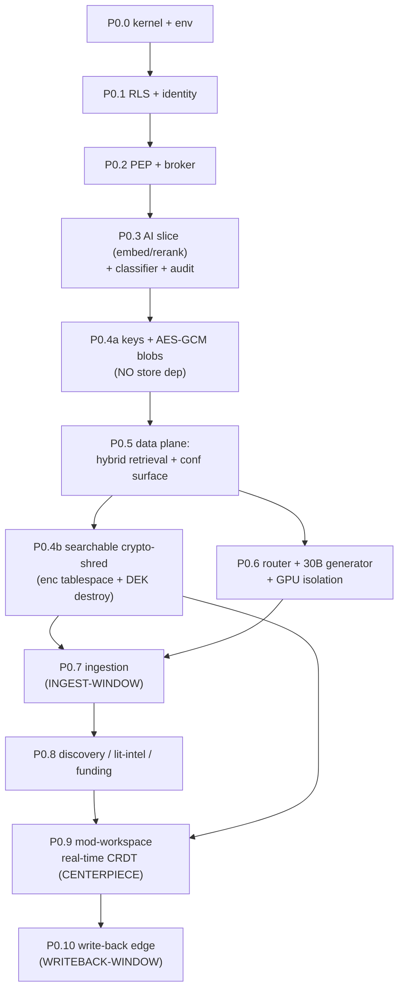

# 14 — Build Runbook: Phased TDD Plan with Acceptance Gates

> **What this document is.** The phase-by-phase build script the builder executes. It takes the
> locked `build_phases` (P0.0 … P0.10) from `_design-brief.json` and turns each into a concrete,
> test-first work order: the **goal**, the **deliverables**, the **failing tests to write first
> (TDD)**, the **exact shell commands**, a **suggested commit message**, **which memory regime** the
> phase runs in, and — critically — **which tests are HUMAN-authored security tripwires the builder
> must not touch**.
>
> **Read this with:**
> - `CONVENTIONS-single-box.md` — "this file wins" pins, package map, FORBIDDEN list, the HUMAN-
>   authored security-gate rule. **If anything here conflicts with CONVENTIONS, CONVENTIONS wins.**
> - `05-kernel-contracts.md` — the frozen kernel types/Protocols you implement against (verbatim).
> - `13-data-model-and-schemas.md` — the DDL + Pydantic row models + migration order (`0001`…`0007`).
> - `06-security-spine-lld.md`, `07-data-layer-and-retrieval-lld.md`, `08-ai-plane-and-model-router-lld.md`,
>   `09-ingestion-and-identity-resolution-lld.md`, `10-feature-modules-lld.md`,
>   `11-mod-workspace-confidential-coauthoring-lld.md`, `12-collaboration-loop-and-writeback-lld.md`
>   — the detailed designs each phase implements.
>
> **Authority chain.** `_design-brief.json` (locked) → `CONVENTIONS-single-box.md` (pins) →
> `05`/`13` (kernel shapes / DDL) → this document for *execution order and gating*. This doc does
> **not** redefine types, DDL, or pins; it references them and tells you the order to build them in.
> Decision IDs are **D1..D14 only** — no `D-AI`, no `D15`.

---

## 0. Table of contents

1. [How to read a phase (the template)](#1-how-to-read-a-phase-the-template)
2. [The walking-skeleton-first principle, and the CORRECTED phase order](#2-the-walking-skeleton-first-principle-and-the-corrected-phase-order)
3. [Global rules that apply to every phase](#3-global-rules-that-apply-to-every-phase)
4. [Who authors which tests (HUMAN vs builder)](#4-who-authors-which-tests-human-vs-builder)
5. [The phase dependency graph](#5-the-phase-dependency-graph)
6. [P0.0 — Environment + kernel skeleton](#6-p00--environment--kernel-skeleton)
7. [P0.1 — Tenant isolation + identity](#7-p01--tenant-isolation--identity)
8. [P0.2 — PEP + broker chokepoint](#8-p02--pep--broker-chokepoint)
9. [P0.3 — AI plane bring-up (embedder + reranker FIRST) + classification gate + audit spine](#9-p03--ai-plane-bring-up-embedder--reranker-first--classification-gate--audit-spine)
10. [P0.4a — Key material + non-searchable-blob crypto (NO store dependency)](#10-p04a--key-material--non-searchable-blob-crypto-no-store-dependency)
11. [P0.5 — Data plane: single-Postgres hybrid retrieval (shared + per-tenant confidential surface)](#11-p05--data-plane-single-postgres-hybrid-retrieval-shared--per-tenant-confidential-surface)
12. [P0.4b — Crypto-shred of SEARCHABLE confidential derivatives (AFTER the data plane)](#12-p04b--crypto-shred-of-searchable-confidential-derivatives-after-the-data-plane)
13. [P0.6 — Model router completion + generator + GPU isolation policy](#13-p06--model-router-completion--generator--gpu-isolation-policy)
14. [P0.7 — Ingestion: classify-gates-index + scoped corpus (INGEST-WINDOW regime)](#14-p07--ingestion-classify-gates-index--scoped-corpus-ingest-window-regime)
15. [P0.8 — Feature modules (discovery, lit-intelligence, funding)](#15-p08--feature-modules-discovery-lit-intelligence-funding)
16. [P0.9 — mod-workspace: confidential CRDT co-authoring, real-time mode (CENTERPIECE walking-skeleton)](#16-p09--mod-workspace-confidential-crdt-co-authoring-real-time-mode-centerpiece-walking-skeleton)
17. [P0.10 — Loop write-back edge + measurement (COMPOUNDING)](#17-p010--loop-write-back-edge--measurement-compounding)
18. [What is DEFERRED to P1 (do not build in P0)](#18-what-is-deferred-to-p1-do-not-build-in-p0)
19. [The full CI gate list (the security spine as executable gates)](#19-the-full-ci-gate-list-the-security-spine-as-executable-gates)
20. [Phase → memory-regime → CI-gate quick matrix](#20-phase--memory-regime--ci-gate-quick-matrix)

---

## 1. How to read a phase (the template)

Every phase section below has the **same eight fields**. Build them in this order:

| Field | What it means for the builder |
|---|---|
| **Goal** | One sentence: what becomes true when this phase is done. |
| **Memory regime** | Which of the three mutually-exclusive regimes (SERVE / INGEST-WINDOW / WRITEBACK-WINDOW) this phase *runs in or against*. Most build work happens with serving idle; the regime here is the one the **delivered code targets at runtime**. See `CONVENTIONS-single-box.md` §5.1 and the brief `memory_budget`. |
| **Deliverables** | The exact packages/files/migrations/processes produced. Cross-references the spine docs that specify them. |
| **Write these failing tests FIRST (TDD)** | The red tests. Per `superpowers:test-driven-development`, write the test, watch it fail for the right reason, then implement until green. Each test is tagged `[HUMAN]` (a security tripwire a human authored — you make it green, never edit it) or `[builder]` (you write it). |
| **Exact commands** | Copy-pasteable shell. Absolute-path friendly; assumes you are inside `tigerexchange/`. |
| **Done when** | The literal exit criterion. **A phase is done only when its deliverable exists AND its contract tests are green** — not before. |
| **Suggested commit message** | A conventional-commits line. No attribution, no emoji, no "generated with" (see `CLAUDE.md` global rule + CONVENTIONS §11). |
| **Pitfalls** | The specific FORBIDDEN-list traps this phase is most likely to fall into. |

---

## 2. The walking-skeleton-first principle, and the CORRECTED phase order

### 2.1 Walking skeleton first

The brief's #1 scope risk (`open_risks`) is that **Phase-0 overwhelms a mid-size local builder**
(full security kernel + retrieval + router + ingestion + CRDT + write-back at once). The mitigation
is a **walking skeleton**: prove the entire loop end-to-end on the *simplest substrate that still
carries the full security spine*, then add breadth. Concretely, P0 ships the thinnest viable version
of each capability:

| Capability | Walking-skeleton P0 | Deferred to P1 |
|---|---|---|
| Editing | **Real-time concurrent edit only** (D11) | Suggesting/tracked-changes (PI accept/reject), anchored comments + resolve |
| Classification | **Binary allow/quarantine** (D6) | Multi-class, confidence-tiered policies |
| Crypto-shred (searchable) | **Drop-and-rebuild after per-tenant DEK destroy** (D7) | — (this *is* the mechanism; only hardware-anchor hardening is deferred) |
| Embedding spaces | bge-m3 serve-time (1024-dim) + SPECTER2 **ingest-only** (768-dim) | — |
| Vector index | **pgvector HNSW kept RAM-resident** (D8) | VectorChord IVF+RaBitQ ">RAM" index (verify-then-adopt) |
| Identity resolution | **Deterministic ORCID/DOI/ROR only** (D14) | Probabilistic blocking / fuzzy name resolution |
| Graph retrieval | Bounded-hop recursive CTE ego-net (D8) | HippoRAG2-style Personalized-PageRank |
| Key anchor | **fTPM-seal-to-PCR OR passphrase-KDF** (D7) | OP-TEE/EKB hardware anchor (optional human hardening) |
| Federation | **Designed behind seams, NOT built** (D2) | Transport for `IExchangeFeed`/`IRevocationAuthority` |

> **Why this order over "build the most impressive feature first".** The centerpiece is the
> confidential co-authoring loop, but you cannot safely build the editor until the security kernel
> (PEP, RLS, classification, crypto, audit) exists *underneath* it — otherwise the confidentiality
> guarantees are unverifiable. So the skeleton is built **security-spine-first, then data, then
> features, then the centerpiece, then the compounding edge**. We rejected "centerpiece-first"
> because a CRDT editor with no PEP/RLS/crypto underneath is a leak waiting to happen and cannot pass
> any HUMAN-authored gate.

### 2.2 The CORRECTED order (and what was wrong before)

The brief's `build_phases` array is the authoritative order. **Two corrections from a naive
left-to-right read are load-bearing and you must honor them:**

1. **The AI-plane embed/rerank SLICE moves EARLY, into P0.3 — BEFORE the data plane (P0.5).**
   Retrieval (P0.5) needs an embedder to produce vectors and a reranker to score stage-2; the
   classification gate (also P0.3) needs embeddings too. So we bring up *just* the embedder + reranker
   serving processes (or the sentence-transformers in-process saver) in P0.3, and defer the heavy 30B
   *generator* + the full router + GPU-isolation policy to **P0.6**. Building the whole AI plane late
   would block P0.5; building the whole AI plane early would waste effort on the generator before
   retrieval needs it. The slice split is the correct middle.

2. **P0.4 is SPLIT into P0.4a and P0.4b, and they are NOT adjacent.**
   - **P0.4a** (key material + AES-GCM for *non-searchable blobs*) has **no store dependency** — it
     needs only `confidential-crypto` + the `kek`/`encrypted_blob` tables — so it runs **right after
     P0.3**, before the data plane.
   - **P0.4b** (crypto-shred of *searchable* confidential derivatives via per-tenant
     encrypted-tablespace DEK destruction) **depends on the per-tenant confidential retrieval surface
     existing**, which is built in **P0.5**. So P0.4b runs **AFTER P0.5**.

   This is why the executed sequence is: `… P0.3 → P0.4a → P0.5 → P0.4b → P0.6 …`. The numbering
   looks out of order on purpose; the **dependency** order is correct. (See `13-data-model-and-schemas.md`
   §24: migration `0007_confidential_surface` is intentionally last.)

The full executed sequence:

```
P0.0  Environment + kernel skeleton
P0.1  Tenant isolation + identity (RLS)
P0.2  PEP + broker chokepoint
P0.3  AI-plane SLICE (embedder + reranker) + classification gate + audit spine
P0.4a Key material + AES-GCM blobs            (NO store dep -> before data plane)
P0.5  Data plane: hybrid retrieval + per-tenant confidential surface
P0.4b Searchable crypto-shred (encrypted tablespace + DEK destroy)  (AFTER P0.5)
P0.6  Model router completion + 30B generator + GPU isolation policy
P0.7  Ingestion: classify-gates-index + scoped corpus (INGEST-WINDOW)
P0.8  Feature modules (discovery, lit-intelligence, funding)
P0.9  mod-workspace: confidential CRDT co-authoring, real-time mode (CENTERPIECE)
P0.10 Loop write-back edge + measurement (COMPOUNDING)
```

---

## 3. Global rules that apply to every phase

These are pulled forward so each phase section can stay terse. They are non-negotiable.

1. **TDD always.** Write the failing test first (`superpowers:test-driven-development`). Watch it
   fail for the *right* reason (not an import error). Implement the minimum to pass. Refactor green.
   Never write implementation before a test exists for it — except you **never** write the
   `[HUMAN]` security tests (§4); those are already in `tests/security/`.

2. **Green-or-red gates only.** A phase is **done only when its deliverable + its contract tests are
   green**. "Mostly working" is not done. If a `[HUMAN]` gate is red, the phase is not done — fix the
   implementation, do not weaken the gate.

3. **Lint/format/type are gates every phase.** Each phase ends with `ruff check`, `ruff format
   --check`, `mypy`, and `lint-imports` (import-linter) all clean. A phase that breaks the
   import-linter contract is not done (CONVENTIONS §4).

4. **Create-if-absent only.** Never `recreate_collection`, never drop-on-create, never wipe-and-
   rebuild as a startup side-effect (CONVENTIONS §9). The single sanctioned drop is the crypto-shred
   destroy-then-rebuild in P0.4b (`13` §22).

5. **Pins are pins.** Python **3.11** (not 3.12), `dagster>=1.8,<2`, `vllm>=0.10.x` from the
   jetson-ai-lab SM 8.7 index (never default PyPI), Postgres 16, Pydantic v2 frozen models,
   `pydantic>=2.7,<3`, CUDA 12.6, JetPack 6.2 (CONVENTIONS §5, §7).

6. **The FORBIDDEN list is enforced, not advisory.** No second resident 30B copy; no AES-GCM on
   vectors/BM25/graph; no OP-TEE/EKB as a build deliverable; no MIG; no OPA daemon; no SpiceDB
   cluster; no CloudHSM/cloud-KMS; no Qdrant/OpenSearch/Apache-AGE as P0 stores; no Cedar; no
   K8s/microservices; no GTM/COGS/pricing math (CONVENTIONS §6).

7. **Run the SQL gates against a real Postgres 16**, not SQLite. RLS/`FORCE`/`RESTRICTIVE`/
   `current_setting`/recursive CTEs/pgvector/native-BM25 do not exist in SQLite. The
   `docker-compose.yml` (Postgres 16 + PgBouncer transaction mode) from P0.0 is the test substrate.

8. **Branch, do not commit on `main`.** Per the harness rule, work on a feature branch; commit only
   when asked. The "Suggested commit message" lines are templates for when you do.

9. **Markers.** Tag tests with pytest markers so the gate matrix can select them: `@pytest.mark.unit`,
   `@pytest.mark.integration`, `@pytest.mark.security` (the last is the `tests/security/` tree).

---

## 4. Who authors which tests (HUMAN vs builder)

**Pinned rule (CONVENTIONS §10, brief `security_spine`):** the **adversarial security-contract CI
gates are authored by a HUMAN, not by the builder.** The builder writes the *implementation* against
tests that already live in `tests/security/`. The builder also writes ordinary functional
unit/integration tests in `tests/unit/` and `tests/integration/`.

- **`[HUMAN]`** in a phase's test list = the tripwire already exists in `tests/security/`. **You make
  it green. You never add, edit, weaken, skip, or `xfail` it.** A red `[HUMAN]` gate means your
  implementation is wrong, not the test.
- **`[builder]`** = you write this test (red first, then implement).

> **Why.** A mid-size local model cannot be trusted to author the tripwires that prove it did not
> introduce a leak. If the same model writes both the fail-open code and its weak test, a subtle
> fail-open path passes its own test. A human writes the gates; the model implements until green
> (brief `open_risks`: "writes weak adversarial tests for its own safety net").

The complete `[HUMAN]` gate inventory is in [§19](#19-the-full-ci-gate-list-the-security-spine-as-executable-gates).
CODEOWNERS / review must protect `tests/security/` so the builder's PRs cannot modify it.

---

## 5. The phase dependency graph



> **The two non-obvious edges to internalize:** `P0.3 → P0.4a` (keys before the data plane, because
> blob crypto has no store dependency) and `P0.5 → P0.4b` (searchable crypto-shred *after* the
> confidential surface it shreds exists). Both come straight from the brief's split of P0.4.

---

## 6. P0.0 — Environment + kernel skeleton

**Goal.** Pin the Orin baseline and stand up the frozen `contracts` kernel so every later package has
stable imports.

**Memory regime.** N/A for the kernel (pure types, no model load). The single smoke step (load a tiny
model from the SM 8.7 wheel) touches the **SERVE** regime tooling but loads a trivial model — it is a
*wheel-correctness* smoke, not a budget test.

**Deliverables.** (See `05-kernel-contracts.md` §11 for the verbatim files, `CONVENTIONS-single-box.md`
§2 for the layout, `13-data-model-and-schemas.md` §0.8 for the enum types.)
- The pinned runbook header: JetPack 6.2 / L4T r36.4.3 / CUDA 12.6 / **Python 3.11** / SM 8.7 / power
  mode MAXN; all CUDA wheels from `https://pypi.jetson-ai-lab.io/jp6/cu126`.
- `tigerexchange/` root per CONVENTIONS §2 (`packages/` + `services/` + `tests/{unit,integration,security}/`,
  `pyproject.toml` pinning Python 3.11, `migrations/`, `docker-compose.yml`).
- `packages/contracts/` (`tigerexchange_contracts`) with **all** kernel symbols **typed verbatim from
  `05`**: `Tier` + `tier_join`/`tier_join_all` + `MOST_RESTRICTIVE_TIER`; `Capability` (the 5 required
  members incl. `CONFIDENTIAL_RETRIEVAL`), `Edition`, `Entitlement.permits_tier`; `TenantContext`;
  `Decision` + `ClassificationResult` (+ `is_retrievable`); `DiscoverabilityScope` +
  `PublishableProjection` (validator rejects confidential); `PepAction`/`PepEffect`/`PepRequest`/
  `PepResponse`; `AuditEvent`; `RelationTuple`/`RetrievedItem`/`GenerationRequest`/`GenerationResult`/
  `KeyRef`; **all `I*` Protocols** including the deferred **stubs** `IExchangeFeed`/`IRevocationAuthority`.
- `import-linter` contract `kernel-no-feature-deps` (kernel imports only stdlib + pydantic + typing).
- `docker-compose.yml` bringing up Postgres 16 + PgBouncer (transaction mode).

**Write these failing tests FIRST (TDD).** (Copy the exact bodies from `05` §12.)
- `[HUMAN]` `test_empty_join_is_confidential` — `tier_join_all([]) == Tier.CONFIDENTIAL`.
- `[builder]` `test_max_rule` — `tier_join_all([PUBLIC, CONFIDENTIAL]) == CONFIDENTIAL`, etc.
- `[HUMAN]` `test_publishable_projection_rejects_confidential` — constructing
  `PublishableProjection(tier=CONFIDENTIAL, …)` raises `ValidationError`.
- `[HUMAN]` `test_lower_tier_cannot_touch_confidential` — `Entitlement(... only PUBLIC_RETRIEVAL ...)
  .permits_tier(CONFIDENTIAL) is False`.
- `[builder]` `test_is_retrievable_only_allow_public` — `is_retrievable` true ONLY for ALLOW+PUBLIC.
- `[builder]` frozen-immutability test: attribute assignment on each value object raises.
- `[builder]` `test_kernel_imports_no_features` — `import tigerexchange_contracts` works with only
  stdlib + pydantic available (smoke; the import-linter contract is the real gate).

**Exact commands.**
```bash
# bring up the test substrate
docker compose -f docker-compose.yml up -d postgres pgbouncer

# install (dev) — Python 3.11; CUDA wheels come from the jetson index when needed (P0.3/P0.6)
python3.11 -m venv .venv && . .venv/bin/activate
pip install -e ".[dev]"

# kernel gates
pytest tests/unit -k "tier or projection or permits or retrievable or kernel" -q
lint-imports                       # import-linter: kernel-no-feature-deps must be green
ruff check packages/contracts && ruff format --check packages/contracts
mypy packages/contracts

# wheel-correctness smoke (run on the actual Orin): load a tiny model from the SM 8.7 wheel
#   asserts torch.cuda.get_device_capability() == (8, 7); see 04-tech-stack-and-arm64-runbook.md
python services/serving/scripts/smoke_sm87.py
```

**Done when.** All kernel tests green; `lint-imports` green (kernel imports nothing feature-side);
`ruff` + `mypy` clean; the SM 8.7 wheel smoke prints capability `(8, 7)` (no silent CPU fallback).

**Suggested commit message.**
`feat(contracts): freeze kernel types + Protocols and pin Orin baseline (P0.0)`

**Pitfalls.**
- Do **not** make `tier_join_all([])` return `PUBLIC` (fail-open). It is `CONFIDENTIAL`.
- Do **not** pin Python 3.12 in `pyproject.toml` (CONVENTIONS §13 #5).
- Do **not** `pip install vllm` from default PyPI — that wheel omits SM 8.7 SASS and silently falls
  to CPU (the #1 Jetson failure mode). Use the jetson-ai-lab index.
- The deferred stubs `IExchangeFeed`/`IRevocationAuthority` are **defined**, **not wired** — a call
  must raise `NotImplementedError`, never silently no-op (`05` §10 deferred-stub discipline).

---

## 7. P0.1 — Tenant isolation + identity

**Goal.** Make multi-group isolation real and fail-closed **before any data plane exists**.

**Memory regime.** SERVE (the RLS predicate is on the per-request authz hot path; it must be an index
seek, never an HDD random read — D5/D13).

**Deliverables.** (DDL is verbatim in `13` §1, §2, §0.2–§0.5; migrations `0001`/`0002`.)
- Migration `0001_types_and_roles`: the `tex` schema; the ENUM types (`13` §0.8); the two roles —
  `tigerexchange_owner` (DDL only) and `tigerexchange_app` (`NOSUPERUSER NOBYPASSRLS NOINHERIT`
  non-owner); `CREATE EXTENSION vector; CREATE EXTENSION vchord_bm25;` (or `pg_search`); grants +
  `ALTER DEFAULT PRIVILEGES`.
- Migration `0002_tenant_identity`: `tex.tenant`, `tex.app_user` with the **verbatim RLS template**
  (`ENABLE` + `FORCE ROW LEVEL SECURITY`, `AS RESTRICTIVE FOR ALL`, `USING` + `WITH CHECK` on
  `current_setting('app.tenant_id', true)::uuid`), `tenant_id` as the **leading** index column.
- The OIDC-token → frozen `TenantContext` builder, and the per-transaction pin via
  `set_config('app.tenant_id', $1, true)` with `$1` **bound** (never string-interpolated — `13` §3).
- `check_rls_bypass.py` CI lint forbidding `SECURITY DEFINER`, `MATERIALIZED VIEW`, and non-
  `security_invoker` `VIEW` over tenant tables, plus any `PERMISSIVE` policy on a tenant table
  (the 4 vectors, `13` §0.4).

**Write these failing tests FIRST (TDD).**
- `[HUMAN]` `cross-tenant-read-denied (BOLA)` — with `SET LOCAL app.tenant_id = A`, a SELECT returns
  zero of tenant B's rows.
- `[HUMAN]` `NO-SET-LOCAL transaction returns ZERO rows` — a transaction that never sets the GUC sees
  nothing (the fail-closed property of `current_setting(..., true)` returning NULL).
- `[builder]` `app-role probe` — `tigerexchange_app` reports `rolsuper = false` AND
  `rolbypassrls = false` (the brief lists this as an acceptance test; `13` §0.2).
- `[builder]` `WITH CHECK blocks foreign tenant_id` — inserting a row stamped with another tenant's
  id raises (write-side isolation).
- `[builder]` lint regression: `check_rls_bypass.py` **fails** on a planted `SECURITY DEFINER`
  function and on a planted non-`security_invoker` view.

**Exact commands.**
```bash
alembic upgrade head                          # applies 0001, 0002
pytest tests/security -k "bola or set_local or rls" -q     # [HUMAN] gates
pytest tests/integration -k "app_role or with_check" -q    # [builder]
python tools/check_rls_bypass.py migrations/  # must exit non-zero on planted violations in fixtures
ruff check . && mypy packages services && lint-imports
```

**Done when.** Both `[HUMAN]` gates green; the app-role probe green; the lint catches both planted
bypass vectors; migrations `0001`/`0002` apply cleanly to a fresh Postgres 16.

**Suggested commit message.**
`feat(data): FORCE-RLS tenant isolation + identity + bypass lint (P0.1)`

**Pitfalls.**
- Never `SET SESSION` the tenant GUC — only `set_config(..., true)` (= SET LOCAL); under PgBouncer
  transaction mode `SET SESSION` leaks the previous tenant onto a reused connection (D5).
- Never let the app connect as `tigerexchange_owner`; the owner bypasses RLS unless `FORCE`d, and we
  additionally never make the app the owner (belt-and-suspenders, `13` §0.2).
- `tenant_id` must be the **leading** index column or the RLS predicate becomes a heap scan —
  catastrophic on the HDD-class box (D5/D13).
- Cast the GUC (`::uuid`), not the column, so the index stays usable (`13` §0.3).

---

## 8. P0.2 — PEP + broker chokepoint

**Goal.** Build the single fail-closed authorization chokepoint with the fixed decision order (D3/D4).

**Memory regime.** SERVE. Every step of the order must avoid HDD random seeks (the tombstone read is
on the hot path — D13).

**Deliverables.** (`06-security-spine-lld.md` for semantics; `13` §13 for the `relation_tuple` DDL +
the verbatim recursive-CTE `Check()`; §22 for `revocation_log`; migration `0004` adds
`relation_tuple` + `Check()`, `0005` adds `revocation_log`.)
- `mod-pep` `PolicyEnforcementPoint.authorize()` implementing the **fixed 6-step order, cheap-first,
  fail-closed** (`05` §8, `06`): (1) entitlement/edition gate → (2) capability gate → (3) **in-Python
  ABAC** tier check (`Entitlement.permits_tier` + MAX-rule) → (4) **Postgres recursive-CTE ReBAC**
  `check()` → (5) **owner-local durable tombstone read** (authoritative deny) → (6) short-TTL lease
  (narrow-only positive cache). **Any step that errors or abstains DENIES.**
- The `tex.relation_tuple` table + the verbatim recursive-CTE `Check()` (`13` §13) behind
  `IPolicyEnforcement.check(...)`. Resolves usersets + bounded parent cascade, depth-16 guard.
- The **data-access broker**: holds raw-store creds **only** for the shared confidential/classification
  tables AND per-tenant confidential-index access — **NOT** every module's schema (D3; CONVENTIONS
  §13 #9 exact wording). The broker is the **only** constructor of `PublishableProjection`.
- `import-linter` contracts + the AST test forbidding any `mod-*` from importing the raw store
  (`tigerexchange_data_plane`/`asyncpg`/`sqlalchemy`), importing the classifier engine, or
  constructing `PublishableProjection` (CONVENTIONS §4 rules 3–5).

**Write these failing tests FIRST (TDD).**
- `[HUMAN]` `any-step-error/abstain → DENY` — inject an error at each of the 6 steps; the verdict is
  DENY every time (fail-closed).
- `[HUMAN]` `lower-tier-cannot-construct-confidential-request` — an entitlement lacking both
  confidential capabilities cannot get an ALLOW for a confidential action.
- `[HUMAN]` `missing-ABAC-attr → deny` and `[HUMAN]` `PIP-unavailable → deny`.
- `[HUMAN]` `broker-over-assert-denied` — the broker refuses to act on a request the PEP denied.
- `[builder]` `ReBAC nested-relation Check resolves correctly` — a userset/parent-cascade tuple
  chain returns true; a missing chain returns false; the depth-16 bound terminates.
- `[builder]` `module-importing-raw-store fails import-linter` — a fixture module that imports
  `tigerexchange_data_plane` breaks `lint-imports`.

**Exact commands.**
```bash
alembic upgrade head                          # 0004 relation_tuple + Check(); 0005 revocation_log
pytest tests/security -k "deny or denied or pip or abac or construct" -q   # [HUMAN]
pytest tests/integration -k "rebac or check or broker" -q                  # [builder]
lint-imports                                  # rules 1-6 all green; planted-violation fixture red
ruff check packages/mod-pep && mypy packages/mod-pep
```

**Done when.** All five `[HUMAN]` PEP gates green; nested ReBAC Check correct + bounded; the import-
linter forbids raw-store/classifier/projection access from modules; the broker is the sole projection
constructor.

**Suggested commit message.**
`feat(pep): single fail-closed PEP + broker + Postgres-CTE ReBAC (P0.2)`

**Pitfalls.**
- ABAC is **in-Python** inside the PEP — do **not** stand up an OPA Go daemon or Cedar (D4, FORBIDDEN).
- ReBAC is the **Postgres recursive CTE** — do **not** stand up a SpiceDB cluster (D4, FORBIDDEN).
- The **durable log is authoritative for DENY**; caches are **narrow-only** positive. Never let a
  positive cache outvote a tombstone.
- The recursive-CTE Check is **LOCAL-only** — a known federation-boundary rewrite, not a transport
  swap (D2/D4). Do not pretend otherwise in comments.

---

## 9. P0.3 — AI plane bring-up (embedder + reranker FIRST) + classification gate + audit spine

**Goal.** Stand up the embeddings/reranker serving **slice** (needed by P0.5 retrieval and the
classifier) and gate ingestion fail-closed with a tamper-evident audit. **This is the corrected
ordering: the embed/rerank slice comes BEFORE the data plane; the heavy 30B generator + full router
are deferred to P0.6.**

**Memory regime.** SERVE (the embedder + reranker run resident in SERVE; see `memory_budget` SERVE
line items 3 + 4, ~2.5GB each, or ~0 extra if you use the **sentence-transformers in-process saver**,
the recommended variant).

**Deliverables.** (`08-ai-plane-and-model-router-lld.md` for the AI plane; `13` §14 for
`classification_result` DDL incl. the `CHECK (is_retrievable = (decision='ALLOW' AND tier='public'))`;
§20 for `audit_event`; §21 for `loop_event`; migration `0005`.)
- The **embedder** + **reranker** model-serving processes behind `IModelRouter` (a *slice* of the
  router, just `embed()` and `rerank()` — `generate()` is stubbed/raises until P0.6). Two ways,
  builder's choice per CONVENTIONS §5:
  - **3-process variant:** a vLLM pooling/embedding process + a vLLM score/reranker process; OR
  - **RECOMMENDED saver:** `sentence-transformers` in-process for both (avoids 2 CUDA contexts ~2.6GB).
  Use **bge-m3** (1024-dim) as the embedder and **bge-reranker-v2-m3** as the reranker (CONVENTIONS §5).
- `FailClosedClassifier` implementing `IClassifier` — **walking-skeleton BINARY allow/quarantine**:
  abstention/ambiguity/low-confidence → `ClassificationResult.quarantined(...)` (CONFIDENTIAL tier,
  QUARANTINE decision) → adjudication queue → **never** indexed to the shared sink.
- `tex.classification_result` with `class_codes` as `TEXT[]` and the DB-level `CHECK` constraint.
- `mod-audit` `IAuditSink`: per-stream **hash-chained** `AuditEvent`
  (`entry_hash = SHA-256(prev_hash || canonical_json(payload) || seq || event_type)`), genesis
  `prev_hash`, periodic locally-signed chain-head checkpoints; `verify_chain()`.
- The **SEPARATE** `tex.loop_event` stream scaffold (non-security analytics) — a distinct table, a
  distinct writer (D12, security_spine).

**Write these failing tests FIRST (TDD).**
- `[builder]` embedder smoke: `embed(["x"])` returns a 1024-float vector; reranker smoke:
  `rerank(query, [c1, c2])` returns 2 scores (proves the slice serves).
- `[HUMAN]` `zero-leak adversarial classifier` — a quarantined record reaches **NO** shared sink
  (vector/BM25/graph/outbox). The DB `CHECK` plus the broker gate make this structural.
- `[builder]` `class_codes is TEXT[]` in DDL and round-trips tuple↔array at the boundary.
- `[builder]` `audit chain verifies` and `tampering breaks verify_chain()` — flip one stored row's
  payload and `verify_chain()` returns False.
- `[HUMAN]` `loop events do not write to the security stream` — a `LoopEvent` write touches only
  `loop_event`, never `audit_event`, and vice versa (two tables, two writers).

**Exact commands.**
```bash
alembic upgrade head                          # 0005: classification_result, audit_event, loop_event

# bring up the embed/rerank slice (pick ONE variant)
python -m tigerexchange_serving.embedder --model bge-m3 &        # 3-process variant
python -m tigerexchange_serving.reranker --model bge-reranker-v2-m3 &
#   OR set EMBED_INPROCESS=1 to use the sentence-transformers saver (no extra CUDA contexts)

pytest tests/integration -k "embed or rerank" -q
pytest tests/security -k "zero_leak or stream_separation" -q     # [HUMAN]
pytest tests/integration -k "audit_chain or class_codes" -q
ruff check packages/mod-ai packages/mod-audit && mypy packages/mod-ai packages/mod-audit
```

**Done when.** Embedder returns vectors + reranker returns scores; the zero-leak classifier gate is
green; `class_codes` is `TEXT[]`; the audit chain verifies and tampering breaks it; loop and security
streams are provably separate.

**Suggested commit message.**
`feat(ai,ingest,audit): embed/rerank slice + fail-closed classifier + hash-chained audit (P0.3)`

**Pitfalls.**
- Do **not** bring up the 30B generator here — that is P0.6. Only the embed/rerank slice.
- SPECTER2 is **not** part of this slice (it is ingest-only, P0.7). Do not load it at serve time.
- The classifier is **fail-closed**: abstain → QUARANTINE (=confidential), never fail-open to ALLOW.
- Keep the loop stream and the audit stream physically separate — mixing them pollutes the tamper-
  evident security chain (security_spine).

---

## 10. P0.4a — Key material + non-searchable-blob crypto (NO store dependency)

**Goal.** Stand up envelope keys, the box-master anchor, and AES-GCM for **non-searchable blobs** —
**before** the data plane. This phase has **no retrieval-store dependency** (only `kek` +
`encrypted_blob` tables), which is why it runs here.

**Memory regime.** SERVE (LocalKms is in-process; key unwrap is a hot-path operation but trivial RAM).

**Deliverables.** (`06-security-spine-lld.md` for custody semantics; `13` §19 for `tex.kek`, §18 for
`tex.encrypted_blob`; migration `0006`.)
- `confidential-crypto` per-tenant **KEK/DEK envelope**: per-tenant KEK wraps a per-tenant DEK;
  `tex.kek` stores the **wrapped** DEK + an opaque `box_master_anchor_ref` — never the plaintext KEK,
  never the box-master key, never the unwrapped DEK.
- `LocalKms` behind `IKms` with the **P0 DEFAULT box-master anchor**: **fTPM via userspace
  `tpm2-tools`/`tpm2-pytss` (seal to a PCR)** OR a **passphrase-derived master key** (NIST SP 800-108
  KDF, key never on disk). Builder picks whichever the box supports; both are P0-acceptable (D7).
- **AES-256-GCM ALE for NON-searchable blobs** via the `cryptography` library: CRDT draft snapshots,
  autosave, version history, eval traces, cache values → `tex.encrypted_blob` (nonce + ciphertext +
  auth_tag + dek_id).
- `destroy_kek()` = **O(1) crypto-shred** (deletes the wrapped DEK, sets `destroyed_at`).

**Write these failing tests FIRST (TDD).**
- `[HUMAN]` `post-crypto-shred zero-decryptable-hits across BLOB stores` — after `destroy_kek()`,
  every `encrypted_blob` row for that tenant is undecryptable; zero plaintext recoverable.
- `[builder]` `KEK never plaintext on HDD` — scan the persisted columns; the KEK/DEK never appear in
  plaintext; only the **wrapped** DEK + opaque anchor handle are stored.
- `[builder]` `box-master not on disk` — assert the master key is sealed to an fTPM PCR OR derived
  from the boot passphrase (KDF salt stored, key not stored).
- `[builder]` `destroy_kek is O(1)` — shred time does not scale with the number of blobs (it is a key
  deletion, not a per-record wipe).
- `[builder]` AES-GCM round-trip with AAD: `decrypt_blob(encrypt_blob(x)) == x`; tampering the tag
  raises.

**Exact commands.**
```bash
alembic upgrade head                          # 0006: kek, encrypted_blob

# fTPM path (preferred when a TPM is present): seal the box-master to a PCR
tpm2_pcrread sha256:7                          # inspect PCR state used for sealing
python -m tigerexchange_confidential_crypto.bootstrap --anchor ftpm   # or --anchor passphrase

pytest tests/security -k "zero_decryptable and blob" -q          # [HUMAN]
pytest tests/integration -k "kek or aes_gcm or destroy_kek" -q   # [builder]
ruff check packages/confidential-crypto && mypy packages/confidential-crypto
```

**Done when.** The blob-path zero-decryptable-hits gate is green; the KEK is never plaintext on disk;
the box-master is fTPM-sealed or passphrase-derived (not stored); `destroy_kek()` is O(1).

**Suggested commit message.**
`feat(crypto): per-tenant KEK/DEK envelope + AES-GCM blobs + fTPM/passphrase anchor (P0.4a)`

**Pitfalls.**
- AES-GCM is for **non-searchable blobs ONLY**. Do **not** AES-GCM vectors/BM25/graph here — that is
  mathematically unsearchable and is the inverted-design trap (D7, FORBIDDEN). The searchable path is
  P0.4b.
- **OP-TEE/EKB is NOT a build deliverable** — it needs irreversible fuse-burning + secure-world C; the
  P0 default is fTPM/passphrase (D7, FORBIDDEN, brief `open_risks`). OP-TEE is optional human hardening
  behind the same `IKms`, documented in `06`/`15`.
- Never store the box-master key, an unwrapped DEK, or a plaintext KEK in any column (`13` §27).

---

## 11. P0.5 — Data plane: single-Postgres hybrid retrieval (shared + per-tenant confidential surface)

**Goal.** Stand up dense + BM25 + RRF + graph in **one** Postgres on the **NVMe hot tier**, including
the **per-tenant confidential retrieval surface** (the centerpiece moat surface).

**Memory regime.** SERVE. The live HNSW index **MUST** stay RAM-resident / on NVMe — never served off
the spinning HDD (10s+ queries otherwise; D8/D13 HDD guardrail). `memory_budget` SERVE line 6 budgets
~7GB for the hot pgvector HNSW + BM25 pages.

**Deliverables.** (`07-data-layer-and-retrieval-lld.md` for the pipeline; `13` §5/§5b `work` +
`work_chunk` (+HNSW +BM25), §10 `confidential_index_entry` (PARTITION BY LIST per tenant), §17
`collaboration_edge`, §25 the verbatim RRF-in-SQL query; migrations `0003` public corpus, `0007`
confidential surface.)
- `retrieval` package `HybridRetriever` implementing `IRetrievalStrategy`: **Stage 1** dense
  (pgvector HNSW) + native BM25 (VectorChord-BM25 or ParadeDB `pg_search`, whichever **builds and
  benchmarks** on the real aarch64 box) fused with **RRF k=60 in SQL**; **Stage 2** cross-encoder
  rerank top-50 → top-8 using the **P0.3 reranker**.
- The metadata edge-table graph (`collaboration_edge` + derived edges) + bounded-hop recursive-CTE
  ego-net traversal behind `IGraph.ego_net(max_hops=...)`.
- The **per-tenant CONFIDENTIAL retrieval surface** (`confidential_index_entry`), RLS-isolated, placed
  via `PARTITION BY LIST (tenant_id)` so each tenant's partition lands on its own tablespace
  (`ts_conf_<tenant>`) — queryable **only** via the PEP (`CONFIDENTIAL_RETRIEVAL` capability). The
  **same** two-stage pipeline runs against it (`13` §25).
- `create_collection` guarded by `collection_exists` (create-if-absent; CONVENTIONS §9).
- **Partial-failure policy:** public/shared path returns partial-results-with-completeness-indicator;
  the **confidential path is whole-query-fail-closed** (`07`, `13` §25).

**Write these failing tests FIRST (TDD).**
- `[builder]` `hybrid+rerank beats vector-only` — on a small gold set, two-stage Recall@k > single-
  stage (the evidence floor; `retrieval_design`).
- `[builder]` `BM25 latency BENCHMARKED on the REAL aarch64 box` — record the measured latency; do
  **not** assert an inherited x86 number (D8 acceptance).
- `[builder]` `index served RAM-resident/NVMe` — verify the HNSW index is not on the HDD on the hot
  path (placement check).
- `[builder]` `graph bounded-hop CTE returns correct ego-net` and terminates within `max_hops`.
- `[builder]` `RRF deterministic` — same inputs → same ranking (stable tie-break on `chunk_id`).
- `[HUMAN]` `tenant A's confidential surface NOT queryable by tenant B` — with `SET LOCAL
  app.tenant_id = B`, a query of A's confidential surface returns zero rows (RLS + per-tenant
  partition; the structural form of the P0.9 moat test).

**Exact commands.**
```bash
alembic upgrade head                          # 0003 public corpus, 0007 confidential surface (partitioned)
pytest tests/integration -k "hybrid or rrf or ego_net or placement" -q
pytest tests/integration -k "bm25_latency_aarch64" -q     # records measured latency, not an x86 number
pytest tests/security -k "confidential_surface_cross_tenant" -q   # [HUMAN]
ruff check packages/retrieval packages/data-plane && mypy packages/retrieval packages/data-plane
```

**Done when.** Hybrid+rerank beats vector-only on the gold set; BM25 latency measured on-box; HNSW is
RAM/NVMe-resident on the hot path; the ego-net CTE is correct + bounded; RRF is deterministic; the
cross-tenant confidential-surface gate is green; `create_collection` is create-if-absent.

**Suggested commit message.**
`feat(retrieval): single-Postgres hybrid (pgvector+BM25+RRF) + per-tenant confidential surface (P0.5)`

**Pitfalls.**
- One Postgres only — do **not** add Qdrant/OpenSearch/Apache-AGE (D8, FORBIDDEN). They are documented
  *future* adapters, not P0.
- The confidential surface is **searchable plaintext-at-rest inside an encrypted block device** — do
  **not** AES-GCM its `embedding`/`bm25_vector` (that is P0.4b's tablespace mechanism, not ALE).
- HNSW off the HDD is catastrophic — keep it RAM-resident / on NVMe (D8/D13).
- RaBitQ ">RAM" index is **P1 only** — pgvector HNSW kept RAM-resident is the P0 default (D8).

---

## 12. P0.4b — Crypto-shred of SEARCHABLE confidential derivatives (AFTER the data plane)

**Goal.** Make the per-tenant **search indexes** crypto-shreddable by **encrypted-tablespace DEK
destruction**. This runs **after** P0.5 because it shreds the confidential surface P0.5 created.

**Memory regime.** SERVE (the confidential surface is searchable while mounted in SERVE; shred is an
administrative operation).

**Deliverables.** (`06-security-spine-lld.md` + `07` for the wiring; `13` §10 placement note, §22
revocation-triggered shred, §19 `destroy_kek`.)
- Per-tenant **ENCRYPTED TABLESPACE / LUKS-dm-crypt volume** hosting the confidential
  vector/BM25/graph surface from P0.5 (`CREATE TABLESPACE ts_conf_<tenant> LOCATION
  '/mnt/nvme/enc/<tenant>'` on a LUKS-mounted dir; the per-tenant partition placed `TABLESPACE
  ts_conf_<tenant>`).
- The per-tenant **DEK unlocks the volume**; **crypto-shred = destroy the per-tenant DEK + drop-and-
  rebuild** the confidential partition. Wire it to `destroy_kek()` so both the searchable-tablespace
  path AND the AES-GCM-blob path (P0.4a) are shredded by one key destruction.

**Write these failing tests FIRST (TDD).**
- `[HUMAN]` `post-crypto-shred zero-decryptable-hits across the SEARCHABLE confidential indexes` —
  after `destroy_kek()` + tablespace teardown, zero rows of the confidential surface are recoverable.
- `[builder]` `a confidential prior-proposal entry is unreadable after DEK destruction`.
- `[builder]` `shred is O(1) at the key level` — destroying the DEK is constant-time regardless of
  index size; the drop-and-rebuild is the only per-tenant cost.
- `[HUMAN]` `confidential vector surface remains SEARCHABLE while mounted` — proves we did **NOT**
  AES-GCM the vectors (it is searchable when the DEK is loaded; D7).

**Exact commands.**
```bash
# operator/provisioning step (per tenant): LUKS volume + encrypted tablespace
cryptsetup open /dev/nvme0n1pX ts_conf_<tenant>      # unlock with the per-tenant DEK
mount /dev/mapper/ts_conf_<tenant> /mnt/nvme/enc/<tenant>
psql -c "CREATE TABLESPACE ts_conf_<tenant> LOCATION '/mnt/nvme/enc/<tenant>';"

pytest tests/security -k "zero_decryptable and searchable" -q    # [HUMAN]
pytest tests/security -k "searchable_while_mounted" -q           # [HUMAN]
pytest tests/integration -k "tablespace_shred or dek_destroy" -q # [builder]
```

**Done when.** The searchable-index zero-decryptable-hits gate is green; a confidential entry is
unreadable after DEK destruction; shred is O(1) at the key level; the surface stays searchable while
mounted (proving no ALE on the vectors).

**Suggested commit message.**
`feat(crypto): encrypted-tablespace DEK-destroy crypto-shred for searchable derivatives (P0.4b)`

**Pitfalls.**
- This is the **PRIMARY** mechanism for searchable derivatives, not a fallback (D7). The whole point
  is that AES-GCM cannot search; the encrypted block device can.
- The drop-and-rebuild after DEK destroy is the **only** sanctioned drop in the system (CONVENTIONS
  §9). It is an audited erasure, not a startup convenience.
- Both shred paths (tablespace + blob) must be covered by zero-decryptable-hits gates; one passing is
  not enough (`13` §18 note).

---

## 13. P0.6 — Model router completion + generator + GPU isolation policy

**Goal.** Complete the AI plane: serve the **30B generator** and route by classification to local-
only confidential inference **without a second model copy**.

**Memory regime.** SERVE — and this phase is where the **SERVE budget is proven**: ~49GB total
(saver ~46GB), with **confidential drafting adding NO resident model copy** (same generator,
prefix-caching off + serialized). The runtime probe asserting `resident ≤ ~49GB` lives here.

**Deliverables.** (`08-ai-plane-and-model-router-lld.md`; `05` §9 `GenerationRequest.confidential`,
§10 `IModelRouter`/`IModelProvider`.)
- `mod-ai` `ModelRouter` implementing `IModelRouter` completely (now incl. `generate()`); the provider
  registry; the **transport egress guard** reading the **ONE owned tier→locality policy table** —
  router AND transport read the same table and **hard-fail on disagreement** (security_spine).
- **Qwen3-30B-A3B INT4 (W4A16 AWQ/GPTQ-Int4) in ONE shared vLLM process** (~17GB resident) serving
  all tenants.
- Confidential KV isolation = **`--enable-prefix-caching=False` on the confidential path** +
  **serialized confidential requests with a KV boundary**. **NO MIG. NO second 30B copy** (D10).

**Write these failing tests FIRST (TDD).**
- `[builder]` `confidential/private routes to in-boundary only` — `GenerationResult.served_locally ==
  True` for confidential/private; an attempt to route confidential to a cloud provider is denied.
- `[builder]` `router vs transport disagreement hard-fails` — if the two readings of the
  tier→locality table differ, the request hard-fails (no silent drift).
- `[HUMAN]` `confidential request runs with prefix caching disabled` — the confidential path sets
  `enable_prefix_caching=False` and does not reuse a cached prefix.
- `[builder]` `decode ~30-45 tok/s smoke benchmark recorded` — record measured decode throughput.
- `[HUMAN]` `SERVE-regime resident memory ≤ ~49GB` — measure total resident memory with the generator
  + embedder + reranker + Postgres up; assert ≤ ~49GB (catches an accidental second 30B copy).

**Exact commands.**
```bash
# launch the ONE shared 30B generator from the SM 8.7 wheel (NEVER default-PyPI vllm)
python -m tigerexchange_serving.llm \
  --model Qwen3-30B-A3B-AWQ --quantization awq --enable-prefix-caching false &
python services/serving/scripts/assert_sm87.py          # each process asserts torch reports SM 8.7

pytest tests/integration -k "router or locality or decode_tps" -q
pytest tests/security -k "prefix_caching_disabled or serve_resident_memory" -q   # [HUMAN]
python tools/measure_resident_mem.py --regime serve     # must print <= ~49GB
```

**Done when.** Confidential/private route in-boundary only; router/transport disagreement hard-fails;
the confidential path provably runs with prefix caching off; decode throughput recorded; SERVE
resident memory ≤ ~49GB (no second 30B copy).

**Suggested commit message.**
`feat(ai): complete model router + shared 30B generator + confidential KV isolation (P0.6)`

**Pitfalls.**
- **NO second resident 30B copy** — a dedicated confidential 30B process pushes the total to ~70GB >
  64GB and the centerpiece cannot run (D10, FORBIDDEN). If true process isolation is ever mandated,
  load **Qwen3-14B with the 30B EVICTED first** — never two 30B copies resident.
- **NO MIG** — unavailable on Orin Ampere (D10, FORBIDDEN). Isolation is prefix-caching-off +
  serialization, not partitioning.
- Leaving prefix caching **ON** for confidential requests is the shared-prefix KV leak vector — the
  exact risk the `[HUMAN]` gate guards (`open_risks`).
- Never `pip install vllm` from default PyPI (silent CPU fallback).

---

## 14. P0.7 — Ingestion: classify-gates-index + scoped corpus (INGEST-WINDOW regime)

**Goal.** Build the HDD-aware **classify-gates-index** batch ingestion that feeds the public graph,
in a **serving-paused maintenance window**.

**Memory regime.** **INGEST-WINDOW** — interactive serving PAUSED, generator evicted (or briefly
idle-resident). `memory_budget`: DuckDB `SET memory_limit='8GB'` + capped threads + SPECTER2 batch
(~1.5GB, loaded ONLY here) + embedder + reduced Postgres `shared_buffers`; total ~25GB (generator
evicted). This regime is mutually exclusive with SERVE (D13).

**Deliverables.** (`09-ingestion-and-identity-resolution-lld.md`; `13` §23 the monotonic applier, §5b
`work_chunk`, §16 `expertise_fingerprint`, §17 `collaboration_edge`; CONVENTIONS §8 data-source
conventions.)
- `mod-ingestion` **Dagster DAGs** (pin `dagster>=1.8,<2`): `snapshot → distill → classify [HARD
  GATE] → embed → index → graph`, plus the **transactional-outbox sensor**.
- **DuckDB out-of-core** (`SET memory_limit='8GB'`, capped threads explicitly set) reading gzip-NDJSON
  → writing Parquet on NVMe; **scoped OpenAlex** by ROR/topic with **`updated_date` DELTA ingestion**
  (download only new partitions, never a full re-ingest); **QUARTERLY** free cadence (monthly = paid).
- Full small sources: ROR / NSF Awards / NIH RePORTER / Grants.gov (`source='grants_gov'` verbatim);
  **ORCID anchors-only**. **Two grant feeds modeled distinctly**: opportunities (`grants_gov`, drive
  the win-loop) vs awards (`nih_reporter`/`nsf_awards`, feed expertise + co-funding edges).
- **SPECTER2 batch precompute then UNLOAD** (base + proximity adapter via the `adapters` library) →
  768-dim `specter2_centroid` vectors; the model is never serve-resident.
- **DETERMINISTIC identity resolution only** (ORCID/DOI/ROR); probabilistic blocking deferred to P1.
- The **monotonic applier** (`projection_version` vs `revocation_epoch`) so a re-ingest/replay cannot
  resurrect a revoked/down-classified record (`13` §23).
- **Commercial-OK license gate** (fail-closed): ingest only the PMC "Commercial Use Allowed" subset;
  carry provenance + license per record.

**Write these failing tests FIRST (TDD).**
- `[HUMAN]` `quarantined record never indexed` — a quarantine outcome reaches no shared sink (re-uses
  the P0.3 classifier gate through the full DAG).
- `[builder]` `monotonic applier cannot resurrect a revoked/down-classified record on replay` — a
  stale/post-revocation projection is a no-op (`13` §23 rule).
- `[builder]` `HDD reads are sequential` — assert no random-read on the ingest hot path (DuckDB reads
  the cold gzip snapshots sequentially; D13).
- `[builder]` `two grant feeds ingested distinctly` — opportunities and awards land in their separate
  tables with the correct `source` enum values.
- `[builder]` `commercial-OK license gate drops NC-only PMC` — a non-commercial PMC record is dropped.
- `[builder]` `ingestion runs in INGEST-WINDOW with serving paused` — the DAG verifies the serve regime
  is paused before bulk load (regime mutual exclusion).

**Exact commands.**
```bash
# enter INGEST-WINDOW: pause serving / evict the generator, reduce shared_buffers
python tools/regime.py --enter ingest-window

dagster job execute -j ingest_public_corpus -m tigerexchange_dagster   # snapshot->...->graph
pytest tests/security -k "quarantined_never_indexed" -q                 # [HUMAN]
pytest tests/integration -k "monotonic or sequential_reads or two_feeds or license_gate" -q

python tools/regime.py --exit ingest-window                            # back to SERVE
```

**Done when.** The quarantined-never-indexed gate is green; the monotonic applier blocks resurrection
on replay; ingest HDD reads are sequential; the two grant feeds are distinct; the license gate drops
NC-only PMC; the DAG runs only with serving paused.

**Suggested commit message.**
`feat(ingestion): HDD-aware classify-gates-index DAG + scoped delta corpus + monotonic applier (P0.7)`

**Pitfalls.**
- Pin `dagster>=1.8,<2` — not `>=1.7,<2` (CONVENTIONS §13 #8).
- `source='grants_gov'` exact spelling — not `grants.gov`/`GrantsGov` (CONVENTIONS §8.1).
- OpenAlex free cadence is **QUARTERLY** per the brief; build **delta-by-`updated_date`** either way
  so a cadence change is a schedule change, not a code change (CONVENTIONS §8.3 verification flag — a
  human must confirm the live cadence before launch).
- SPECTER2 is **ingest-only** — precompute then UNLOAD; never serve-resident (D8, FORBIDDEN to leave
  resident).
- Cap DuckDB memory + threads explicitly; never run bulk ingest silently concurrent with full serving
  (D13).

---

## 15. P0.8 — Feature modules (discovery, lit-intelligence, funding)

**Goal.** Ship the read-side loop surfaces **behind the PEP**.

**Memory regime.** SERVE.

**Deliverables.** (`10-feature-modules-lld.md`; `13` §6/§7 opportunity/award, §8 pursuit, §16/§17
fingerprint/edge.)
- `mod-discovery`: **PUBLIC-tier** two-axis ranking — expertise **COVERAGE** matrix (with gaps) +
  graph **CONNECTIVITY** (co-authorship/co-funding distance) + an outcome-weighted overlay +
  per-candidate "why" + PI human curation. **Touches no confidential data.**
- `mod-lit-intelligence`: **DUAL-SOURCE** grounded drafting — retrieves over (A) the shared public
  index AND (B) the **owning tenant's confidential retrieval surface** (P0.5) — with a **RAGAS gate**
  using an **in-boundary 30B judge** (a cloud judge is forbidden for confidential drafts).
- `mod-funding`: opportunity match → **Pursuit** (binds Opportunity → draft Proposal → candidate
  team + alert config); award feeds; lifecycle state machine entry.
- DI factory wiring in `services/api` + FastAPI routers composing modules **behind the PEP**.

**Write these failing tests FIRST (TDD).**
- `[builder]` `mod-discovery touches no confidential data` — assert its retrieval calls only use the
  public surface (`confidential_surface=False`); an attempt to read confidential is denied at the PEP.
- `[builder]` `lit-intelligence grounds on BOTH surfaces for the owning tenant` — for tenant A, the
  grounding context contains both public hits and A's own confidential prior-proposal hits.
- `[builder]` `team ranking surfaces coverage gaps + connectivity + why` — the response includes the
  coverage matrix (with gaps), the connectivity score, and a per-candidate rationale.
- `[builder]` `RAGAS faithfulness gate green on gold set` — the in-boundary judge scores faithfulness/
  context-precision above the threshold (eval traces are confidential-tier AES-GCM blobs).
- `[builder]` `Pursuit created from a matched opportunity` — a match creates a `pursuit` row in
  `matched` state and emits `pursuit_created` + `opportunity_matched` loop events.
- `[builder]` `module imports pass import-linter` — none of the three modules import another module,
  the raw store, the classifier engine, or construct a `PublishableProjection`.

**Exact commands.**
```bash
pytest tests/integration -k "discovery or lit_intel or funding or ragas or pursuit" -q
lint-imports                                  # plug-in contract for the three modules
ruff check packages/mod-discovery packages/mod-lit-intelligence packages/mod-funding
mypy packages/mod-discovery packages/mod-lit-intelligence packages/mod-funding
```

**Done when.** Discovery is public-only; lit-intelligence grounds on both surfaces for the owner;
ranking surfaces coverage gaps + connectivity + why; the RAGAS gate is green with the in-boundary
judge; a Pursuit is created from a matched opportunity; all three modules pass import-linter.

**Suggested commit message.**
`feat(modules): public discovery + dual-source grounded lit-intelligence + funding/Pursuit (P0.8)`

**Pitfalls.**
- `mod-discovery` and the expertise graph are **PUBLIC-tier only by construction** (D6). Do not let
  discovery read the confidential surface.
- The RAGAS judge is the **in-boundary 30B** — never a cloud judge (confidential drafts forbid it;
  `retrieval_design`).
- Modules are plug-ins **behind the PEP** — no direct cross-module imports, no raw-store access
  (CONVENTIONS §4).

---

## 16. P0.9 — mod-workspace: confidential CRDT co-authoring, real-time mode (CENTERPIECE walking-skeleton)

**Goal.** Build the confidential cross-group editor — the project's centerpiece — **real-time mode
first**.

**Memory regime.** SERVE. Confidential drafting reuses the **one shared 30B generator** with
prefix-caching off + serialized requests (D10) — **no resident model copy is added**; backpressure is
exposed to the editor.

**Deliverables.** (`11-mod-workspace-confidential-coauthoring-lld.md`; `13` §9 proposal, §11
team_member, §12 sharing_grant, §18 encrypted_blob, §22 revocation.)
- `pycrdt` CRDT buffer + the self-hosted **pycrdt-websocket server** (`services/crdt-ws`).
- **REAL-TIME concurrent edit only** (suggesting-mode + anchored comments are P1, D11).
- Notion-style **scoped roles** (`TEAM_ROLE`: pi=owner, co_pi=edit, reviewer=comment, viewer=view) +
  permission **cascade** + **highest-permission-wins**.
- **KEK-bound AES-GCM snapshotting** of the CRDT doc on **autosave intervals** (not per keystroke) →
  `encrypted_blob`; **MAX-rule confidential tagging** of draft/autosave/history.
- **Indexing own-tenant drafts into the confidential retrieval surface** (P0.5) so STAGE-3 grounding
  works for the owning tenant.
- **SharingGrant (ReBAC)** lights up cross-tenant workspace membership; revocation is durable +
  fail-closed (P0.2 revocation_log).

**Write these failing tests FIRST (TDD).**
- `[builder]` `two users from DIFFERENT tenants concurrently edit and converge (CRDT)` — concurrent
  ops merge deterministically; the activation north-star (`collaborator_joined` cross-tenant) fires.
- `[HUMAN]` `revoked collaborator loses access immediately (zero allow-window, security reason)` — a
  `security`/`consent` revocation denies the next read with no allow-window.
- `[builder]` `draft snapshot is KEK-bound and shred-reachable` — the snapshot is an AES-GCM blob
  under the per-tenant DEK and `destroy_kek()` makes it undecryptable.
- `[HUMAN]` `tenant A grounds on A's own prior proposal, tenant B cannot retrieve it` — the moat test:
  A's confidential grounding works; B physically cannot read A's confidential entries (P0.9 moat).
- `[builder]` `crash mid-edit recovers the CRDT doc` — restart the websocket server; the doc recovers
  from the last snapshot + CRDT log.
- `[HUMAN]` (carried) `no draft artifact lands in a non-encrypted store` — autosave/history/synth
  buffers persist only via the encrypted store (`open_risks` mitigation).

**Exact commands.**
```bash
python -m tigerexchange_crdt_ws.server &      # self-hosted pycrdt-websocket server
pytest tests/integration -k "crdt_converge or crash_recovery or snapshot_kek" -q
pytest tests/security -k "revoked_immediately or grounds_a_not_b or no_plaintext_draft" -q  # [HUMAN]
ruff check packages/mod-workspace services/crdt-ws && mypy packages/mod-workspace services/crdt-ws
```

**Done when.** Two cross-tenant users converge; revocation is immediate with zero allow-window; the
snapshot is KEK-bound and shred-reachable; A grounds on A while B cannot read A; crash mid-edit
recovers; no draft artifact lands in a non-encrypted store.

**Suggested commit message.**
`feat(workspace): real-time confidential cross-group CRDT co-authoring (P0.9)`

**Pitfalls.**
- **Real-time mode only** — do not build suggesting/tracked-changes or anchored comments in P0 (D11,
  P1).
- Confidential drafting uses the **one shared generator** (prefix-caching off + serialized) — do
  **not** spin up a second 30B (D10, FORBIDDEN).
- Snapshot on **autosave intervals**, not per keystroke (`open_risks` mitigation); every draft/
  autosave/history artifact is MAX-rule confidential and persists **only** in the encrypted store.

---

## 17. P0.10 — Loop write-back edge + measurement (COMPOUNDING)

**Goal.** Close the loop: **won outcomes re-weight the expertise graph**, memory-gated, off the
interactive path.

**Memory regime.** **WRITEBACK-WINDOW** — SERVE baseline + **capped writeback DuckDB
(`SET memory_limit='4GB'`)** + SPECTER2 reload (~1.5GB) ≈ ~54.5GB, **semaphore-gated to yield to
interactive generation** so writeback and an interactive burst never both peak (D12/D13).

**Deliverables.** (`12-collaboration-loop-and-writeback-lld.md`; `13` §8 pursuit, §16 fingerprint,
§17 collaboration_edge, §21 loop_event, §23 monotonic applier.)
- Pursuit + outcome model; the `proposal.outcome_recorded` event (`won`/`lost`/`submitted`).
- A **Dagster outbox sensor → SEMAPHORE-GATED async enrichment job** (WRITEBACK-WINDOW) that, on a
  WON outcome, re-ingests team + award + artifacts through the **same** classify-gates-index
  monotonic-applier pipeline:
  - materialize in-platform **`CO_PI_WITH` edges** (tagged with proposal/award);
  - attach a **TRANSPARENT outcome-weighted fingerprint signal** — **one** signal among
    similarity + connectivity (incumbency-bias mitigation: never the sole ranker; tunable; logged);
  - add produced **artifacts as public WORK nodes** (`source='in_platform_writeback'`) via the
    monotonic applier (cannot resurrect a revoked/down-classified record).
- The dedicated **loop-event stream** + activation north-star instrumentation (cross-tenant
  `collaborator_joined`); loop-conversion funnel queries (match → team → edit → submit → win).

**Write these failing tests FIRST (TDD).**
- `[builder]` **the compounding contract test** — `a recorded WIN demonstrably changes a subsequent
  team-match ranking` (the flywheel; D12). Record a win → re-run the same match → the ranking moves.
- `[builder]` `write-back runs async off the outbox, semaphore-gated, NOT on the interactive path` —
  the enrichment job runs from the sensor, not synchronously during editing; the semaphore yields to
  interactive generation.
- `[builder]` `outcome weight is one transparent signal among similarity + connectivity` — disabling
  the outcome weight still produces a ranking from the other two axes; the weight is tunable + logged.
- `[builder]` `loop-conversion funnel queryable` + `graph_enriched emitted` — the funnel computes from
  `loop_event`; a `graph_enriched` event fires after enrichment.
- `[builder]` `writeback memory stays within WRITEBACK-WINDOW budget` — measured peak ≤ ~54.5GB with
  the semaphore enforced.
- `[builder]` (carried from P0.7) `monotonic applier cannot resurrect a revoked record` through the
  write-back path too.

**Exact commands.**
```bash
python tools/regime.py --enter writeback-window     # SERVE baseline + capped DuckDB, semaphore on
dagster sensor start -m tigerexchange_dagster outbox_writeback_sensor
pytest tests/integration -k "compounding or writeback_async or transparent_signal or funnel" -q
python tools/measure_resident_mem.py --regime writeback   # must print <= ~54.5GB
python tools/regime.py --exit writeback-window
```

**Done when.** The compounding contract test is green (a win changes a later ranking); write-back runs
async off the outbox, semaphore-gated, never on the interactive path; the outcome weight is one
transparent tunable signal; the funnel is queryable and `graph_enriched` fires; writeback peak stays
within the WRITEBACK-WINDOW budget.

**Suggested commit message.**
`feat(loop): semaphore-gated outcome write-back edge + activation measurement (P0.10)`

**Pitfalls.**
- Write-back is **async off the outbox**, never synchronous during editing (HDD graph writes on the
  interactive path are slow; D12).
- The outcome weight is **transparent and one-of-three** — never the sole ranker (incumbency-bias
  trap; `open_risks`).
- DuckDB is capped at **4GB** in this regime + semaphore-gated; never uncapped concurrent with
  interactive use (D13, the triple-counted-headroom mistake; CONVENTIONS §13 #14).
- The monotonic applier (`projection_version` vs `revocation_epoch`) is mandatory so a re-ingest
  cannot resurrect a revoked record (`13` §23).

---

## 18. What is DEFERRED to P1 (do not build in P0)

These are explicitly **out of Phase-0**. Building them now blows the scope budget the walking skeleton
exists to protect (`open_risks`, brief `build_phases`, `retrieval_design`).

| Deferred to P1 | Why deferred | Lives behind / becomes |
|---|---|---|
| Suggesting / tracked-changes mode (PI accept/reject) | Too much surface for P0 confidentiality correctness (D11) | `mod-workspace` P1 + its own loop events |
| Anchored comments + resolve | Same (D11) | `mod-workspace` P1 |
| HippoRAG2-style Personalized-PageRank retrieval | A P1 SQL/Python add over the existing edge table (D8) | `retrieval` P1 |
| Probabilistic identity blocking / fuzzy name resolution | P0 is deterministic ORCID/DOI/ROR only (D14) | `mod-ingestion` P1 |
| VectorChord IVF+RaBitQ ">RAM" index | Unverified on aarch64; HNSW RAM-resident suffices at P0 (D8) | verify-then-adopt P1 |
| OP-TEE/EKB hardware key anchor | Irreversible fuse-burn + secure-world C; a build wall (D7) | **optional human hardening**, same `IKms`; `06`/`15` |
| Cross-BOX federation transport | Designed behind seams, not built (D2) | `IExchangeFeed`/`IRevocationAuthority` transport; `15` (with the HONEST node-local rewrite caveats) |
| Adaptive-RAG difficulty router / HyDE / multi-query / CRAG | P0 is single-shot hybrid+rerank only (`retrieval_design`) | `mod-lit-intelligence` P1 |
| Qdrant / OpenSearch / SpiceDB / OPA / cloud-KMS / MIG | FORBIDDEN single-box revisions (D4/D7/D8/D9/D10) | documented future scale-out only; never built |
| GTM / COGS / pricing model | Dropped entirely (D1) | nothing — do not model economics |

> **Honesty note for federation (D2, CONVENTIONS §12):** two single-box mechanisms are **KNOWN
> federation-boundary REWRITES, not transport swaps** — (1) encrypted-tablespace/volume crypto-shred
> is node-local (a future `IRevocationAuthority` cannot crypto-shred another node's tablespace), and
> (2) the recursive-CTE ReBAC `Check()` resolves LOCAL tables only. Carry-forward-clean seams:
> `PublishableProjection.discoverability_scope`, `IExchangeFeed`, owner-authoritative re-derivation.
> Do not let a later builder believe federation is "just plumbing".

---

## 19. The full CI gate list (the security spine as executable gates)

This is the consolidated inventory of the **HUMAN-authored** security-contract gates (CONVENTIONS §10,
brief `security_spine`). They live in `tests/security/`. The builder **makes them green and never
edits them.** Each row names the phase that must turn it green.

| # | Gate | Asserts | Turns green in |
|---|---|---|---|
| 1 | `tier_join_all([]) == confidential` | unknown provenance → most restrictive (fail-closed) | P0.0 |
| 2 | `PublishableProjection(confidential) raises` | confidential can never be shaped for the shared index | P0.0 |
| 3 | `lower-tier-cannot-touch-confidential` (`permits_tier`) | an entitlement without confidential caps is denied | P0.0 |
| 4 | `cross-tenant-read-denied (BOLA)` | tenant B cannot read tenant A's rows | P0.1 |
| 5 | `NO-SET-LOCAL transaction returns ZERO rows` | unset tenant GUC → fail-closed (zero rows) | P0.1 |
| 6 | `any-step-error/abstain → DENY` | any PEP step error/abstain denies (fail-closed) | P0.2 |
| 7 | `lower-tier-cannot-construct-confidential-request` | a lower tier cannot build a confidential/cross-group request | P0.2 |
| 8 | `broker-over-assert-denied` | the broker refuses a PEP-denied request | P0.2 |
| 9 | `missing-ABAC-attr → deny` | a missing ABAC attribute denies | P0.2 |
| 10 | `PIP-unavailable → deny` | policy-information-point unavailable denies | P0.2 |
| 11 | `zero-leak adversarial classifier` | a quarantined record reaches NO shared sink | P0.3 (re-checked P0.7) |
| 12 | `loop events do not write to the security stream` | the two streams are physically separate | P0.3 |
| 13 | `post-crypto-shred zero-decryptable-hits (BLOBS)` | after `destroy_kek()`, AES-GCM blobs undecryptable | P0.4a |
| 14 | `confidential-surface-cross-tenant-denied` | tenant B cannot query tenant A's confidential surface | P0.5 (full form P0.9) |
| 15 | `post-crypto-shred zero-decryptable-hits (SEARCHABLE)` | after DEK destroy, the search indexes undecryptable | P0.4b |
| 16 | `confidential vector surface remains SEARCHABLE while mounted` | proves we did NOT AES-GCM the vectors | P0.4b |
| 17 | `confidential request runs with prefix caching disabled` | the confidential path uses `--enable-prefix-caching=False` | P0.6 |
| 18 | `SERVE-regime resident memory ≤ ~49GB` | no accidental second 30B copy | P0.6 |
| 19 | `quarantined record never indexed` (full DAG) | the classify gate holds through ingestion | P0.7 |
| 20 | `crash-mid-revocation stays-denied` | injected crash mid-revocation leaves the object denied (anti-resurrection) | P0.2 (revocation built) / re-run P0.9 |
| 21 | `revoked collaborator loses access immediately (zero allow-window)` | security/consent revocation denies the next read | P0.9 |
| 22 | `tenant A grounds on A's prior proposal, tenant B cannot retrieve it` | the moat, structurally | P0.9 |
| 23 | `no draft artifact lands in a non-encrypted store` | autosave/history/synth buffers only in the encrypted store | P0.9 |
| 24 | `app-role probe (NOSUPERUSER / NOBYPASSRLS)` | the app role cannot bypass RLS | P0.1 |
| 25 | `MAX-rule + ABAC-narrows-only` property tests | tier joins use MAX-rule; ABAC only narrows, never widens | P0.0/P0.2 |

> **Always-on gates (every phase, every PR):** `ruff check`, `ruff format --check`, `mypy`, and
> `lint-imports` (the import-linter contract: kernel-no-feature-deps + the per-module plug-in rules)
> must be green on every commit (CONVENTIONS §4, §11). A startup assertion that each model-serving
> process reports **SM 8.7 CUDA** is a runtime gate from P0.3 onward (CONVENTIONS §7).

---

## 20. Phase → memory-regime → CI-gate quick matrix

| Phase | Runs in regime | New `[HUMAN]` gates it must turn green | Builds (one line) |
|---|---|---|---|
| **P0.0** | n/a (smoke touches SERVE tooling) | #1, #2, #3, #25 (MAX-rule) | frozen kernel + env pins |
| **P0.1** | SERVE | #4, #5, #24 | FORCE-RLS isolation + identity + bypass lint |
| **P0.2** | SERVE | #6, #7, #8, #9, #10, #20 | single fail-closed PEP + broker + CTE ReBAC |
| **P0.3** | SERVE | #11, #12 | embed/rerank slice + fail-closed classifier + audit |
| **P0.4a** | SERVE | #13 | KEK/DEK + AES-GCM blobs + fTPM/passphrase anchor |
| **P0.5** | SERVE | #14 (structural form) | single-Postgres hybrid retrieval + confidential surface |
| **P0.4b** | SERVE | #15, #16 | encrypted-tablespace DEK-destroy crypto-shred |
| **P0.6** | SERVE (budget proven here) | #17, #18 | full router + shared 30B generator + KV isolation |
| **P0.7** | **INGEST-WINDOW** | #19 (full DAG) | classify-gates-index DAG + scoped delta corpus |
| **P0.8** | SERVE | — (builder functional gates) | public discovery + dual-source lit-intel + funding |
| **P0.9** | SERVE | #14 (full), #21, #22, #23 | real-time confidential CRDT co-authoring (CENTERPIECE) |
| **P0.10** | **WRITEBACK-WINDOW** | — (the compounding contract test is builder-authored) | semaphore-gated outcome write-back + measurement |

> **The single most important invariant across the matrix:** the box runs in **exactly one** memory
> regime at a time (D13). P0.7 (INGEST-WINDOW) pauses serving; P0.10 (WRITEBACK-WINDOW) is semaphore-
> gated to yield to interactive generation; everything else runs in SERVE. Confidential drafting adds
> **no resident model copy** — that is what keeps SERVE at ~49GB and the whole plan inside 64GB.

---

*End of `14-build-runbook-and-phases.md`. A phase is done only when its deliverable AND its contract
tests are green. Build the walking skeleton in the corrected order; defer everything in §18 to P1;
never edit a `[HUMAN]` gate. If anything here conflicts with `CONVENTIONS-single-box.md`, that file
wins.*
