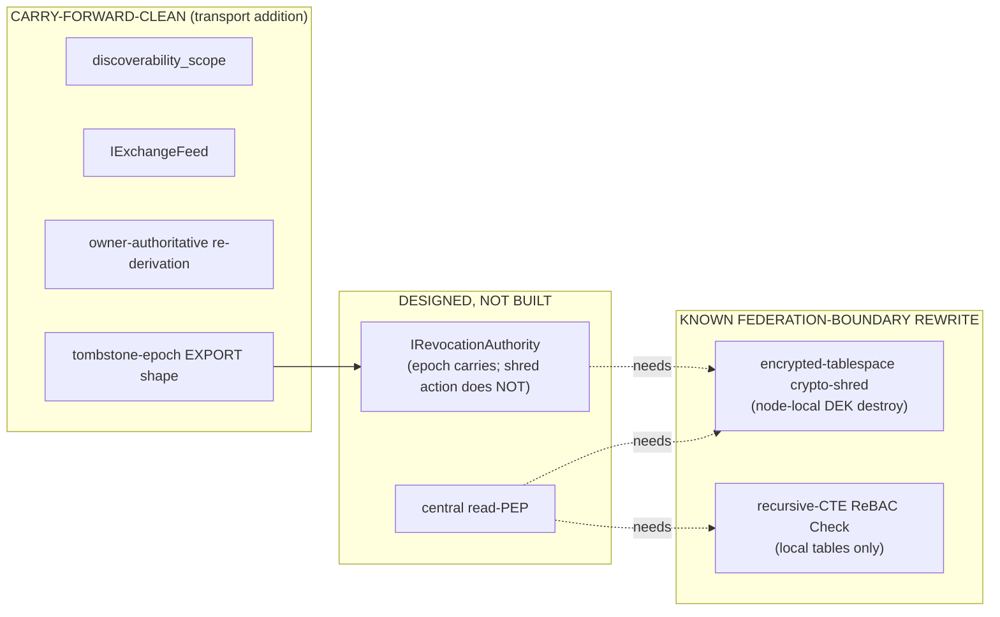
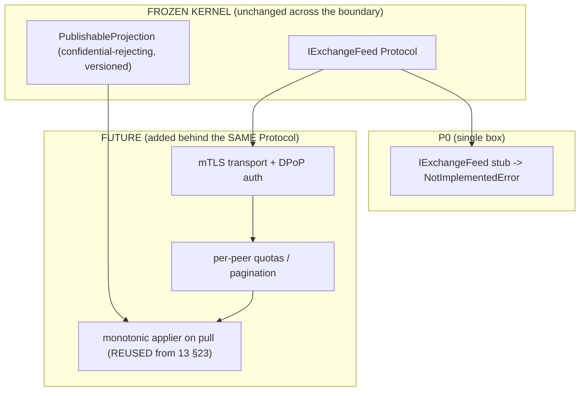
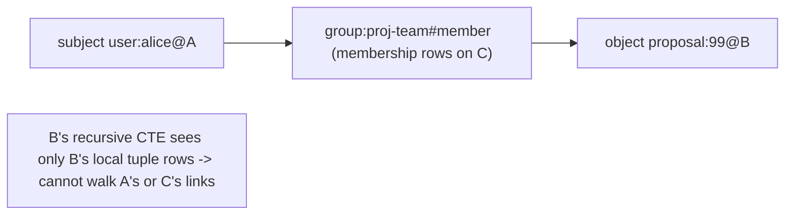

# 15 — Future Federation Interfaces (designed, NOT built)

> **Read this with:** `05-kernel-contracts.md` (the deferred `IExchangeFeed` / `IRevocationAuthority`
> stubs and `PublishableProjection.discoverability_scope` live there, verbatim), `06-security-spine-lld.md`
> (crypto-shred split, owner-authoritative revocation, durable tombstone semantics),
> `13-data-model-and-schemas.md` (the `disc_scope` enum, `revocation_log` / tombstone DDL, the monotonic
> applier), and `CONVENTIONS-single-box.md` §12 ("Federation honesty rule"). When this doc and a sibling
> disagree on a **kernel type signature**, `05` wins (it is the kernel). When they disagree on a **pin or
> a forbidden-tech rule**, `CONVENTIONS-single-box.md` wins. This doc is authoritative only for *how the
> deferred federation layer attaches later* and *which single-box mechanisms are known rewrites*.

> **The one thing to take away.** Phase-0 is **one box**. Nothing in this document is built in Phase-0.
> The federation seams are *defined now* so the kernel surface is stable across the boundary (decision
> **D2**), but there is **no transport, no second node, no central PEP, no replication** in P0. This doc
> is also the project's standing answer to the open risk **"federation over-claim"** (brief
> `open_risks`): it states plainly which seams carry forward as a clean transport addition and which are
> **known semantic rewrites**, so a future builder never believes "federation is just plumbing".

---

## 0. Table of contents

1. [Scope, status, and the honesty contract](#1-scope-status-and-the-honesty-contract)
2. [The CARRY-FORWARD-CLEAN vs KNOWN-REWRITE split (the headline table)](#2-the-carry-forward-clean-vs-known-rewrite-split-the-headline-table)
3. [`PublishableProjection.discoverability_scope` — the clean discovery seam](#3-publishableprojectiondiscoverability_scope--the-clean-discovery-seam)
4. [`IExchangeFeed` — cross-BOX discovery exchange (clean transport addition)](#4-iexchangefeed--cross-box-discovery-exchange-clean-transport-addition)
5. [`IRevocationAuthority` — cross-BOX revocation (and why crypto-shred does NOT carry)](#5-irevocationauthority--cross-box-revocation-and-why-crypto-shred-does-not-carry)
6. [The central read-PEP contract (designed, not built)](#6-the-central-read-pep-contract-designed-not-built)
7. [Owner-authoritative re-derivation — the invariant that survives federation](#7-owner-authoritative-re-derivation--the-invariant-that-survives-federation)
8. [The tombstone-epoch export shape](#8-the-tombstone-epoch-export-shape)
9. [KNOWN REWRITE #1 — encrypted-tablespace crypto-shred is node-local](#9-known-rewrite-1--encrypted-tablespace-crypto-shred-is-node-local)
10. [KNOWN REWRITE #2 — recursive-CTE ReBAC resolves local tables only](#10-known-rewrite-2--recursive-cte-rebac-resolves-local-tables-only)
11. [Where SpiceDB / MIG / cloud-KMS / OP-TEE would attach later](#11-where-spicedb--mig--cloud-kms--op-tee-would-attach-later)
12. [What is explicitly NOT built in Phase-0 (the deferred-stub discipline)](#12-what-is-explicitly-not-built-in-phase-0-the-deferred-stub-discipline)
13. [A future-federation acceptance checklist (for the day someone builds it)](#13-a-future-federation-acceptance-checklist-for-the-day-someone-builds-it)

---

## 1. Scope, status, and the honesty contract

TigerExchange (single-Orin edition) is a **modular monolith** on **one** Jetson AGX Orin 64GB
(decision **D2**). Tenants are research groups *on that one box*, isolated by FORCE-RLS +
`SET LOCAL` + per-tenant DEK-on-encrypted-tablespace + per-tenant KEK envelope crypto. There is no
network between boxes because there is no second box.

"Federation" in this corpus means a **future** topology where **each box is a node** and a Tenant maps
to a node (brief `domain_entities` → Tenant: *"Long-term federation maps a Tenant to a node"*). In that
future world, three things become real that are absent in P0:

1. **Cross-box discovery** — a node advertises a subset of its *public* projections to other nodes so a
   Pursuit on box A can surface a candidate researcher whose home node is box B.
2. **Cross-box revocation** — a revocation (consent withdrawal, security event) issued on the owning
   node must propagate so other nodes stop serving the revoked projection.
3. **Cross-box authorization** — a request on box A that touches a projection owned by box B must be
   authorized against B's policy, not A's.

**The honesty contract (this is the entire point of this document).** When you design seams for those
three, it is tempting to declare every single-box mechanism "just needs a transport added". That claim
is **false** for two of our mechanisms, and stating it falsely was a real defect in the old v2 plan
(`CONVENTIONS-single-box.md` §13 item 13, brief `open_risks` "Federation over-claim"). This doc tells
the truth instead:

- Some seams (`discoverability_scope`, `IExchangeFeed`, owner-authoritative re-derivation) **carry
  forward clean** — the P0 design already has the right shape; the future work is genuinely a transport
  addition plus quotas/auth.
- Two mechanisms (**encrypted-tablespace crypto-shred** and **recursive-CTE ReBAC resolution**) are
  **semantically node-local**. They are **KNOWN FEDERATION-BOUNDARY REWRITES**, not transport swaps. A
  future builder must *rewrite* them, not wrap them.

> **Why we still define the seams now (D2 rationale, chosen over alternatives).** We chose *"design the
> Protocol seams, build nothing"* over (a) *building federation now* — out of scope, premature, and a
> hard wall for a 30B builder on one box; and (b) *single-tenant with no seams* — which forces a
> ground-up rewrite the day a second box appears. Defining `IExchangeFeed` / `IRevocationAuthority` /
> `discoverability_scope` now keeps the kernel surface **stable across the boundary**, so the eventual
> federation work touches transports and node-spanning resolvers — **not** the value-object vocabulary
> every feature module already depends on. The cost of stable seams is near-zero (a few Protocol
> definitions + one enum member); the cost of *no* seams is a rewrite. The honest caveat is that "stable
> kernel vocabulary" is not the same as "stable mechanism" — see §9 and §10.

---

## 2. The CARRY-FORWARD-CLEAN vs KNOWN-REWRITE split (the headline table)

This is the single most important table in the document. Memorize it. Every other section expands one
row.

| Seam / mechanism | Where it lives in P0 | Federation status | Why |
|---|---|---|---|
| `PublishableProjection.discoverability_scope` | kernel `05` (`projection.py`); persisted enum `tex.disc_scope` `13` §15 | **CARRY-FORWARD-CLEAN** | Already an explicit, confidential-rejecting, version-stamped allowlist projection with a `FEDERATED` / `federation_*` scope member reserved. The shape *is* the wire format. |
| `IExchangeFeed` (publish / pull projections) | kernel `05` (deferred stub, `NotImplementedError`) | **CARRY-FORWARD-CLEAN** | Traffics only in `PublishableProjection` (confidential can never be constructed into it). The transport (mTLS, DPoP tokens, pagination, quotas) is *added behind* the unchanged Protocol. |
| Owner-authoritative re-derivation | broker / `IGrantStore` / revocation, `06` + `13` §12 | **CARRY-FORWARD-CLEAN** invariant | The owner already treats a caller's claimed scope as an *untrusted hint* and re-derives effective scope from its own tables. That stays correct across nodes; it is the right federation default. |
| `IRevocationAuthority` (assert_revoked / current_epoch) | kernel `05` (deferred stub) | **PARTIALLY clean** — the *epoch/tombstone export* shape carries; the *crypto-shred action* does NOT | The monotonic `revocation_epoch` and the tombstone export (§8) are federation-portable signals. But the *enforcement action* that single-box revocation triggers (DEK-destroy of an encrypted tablespace) cannot reach another node. See next two rows. |
| **Encrypted-tablespace / volume crypto-shred** (D7) | `confidential-crypto` + `data-plane`, `06` §crypto-shred, `13` §10/§22, P0.4b | **KNOWN FEDERATION-BOUNDARY REWRITE** | `destroy_kek()` shreds *this node's* LUKS/encrypted-tablespace DEK. A future `IRevocationAuthority` **cannot** crypto-shred another node's tablespace — there is no cross-node key custody or volume control in the design. Needs a node-spanning custody + remote-shred protocol = a rewrite. |
| **Recursive-CTE ReBAC `Check()`** (D4) | `mod-pep`, `06` PEP step 4, `13` §13 | **KNOWN FEDERATION-BOUNDARY REWRITE** | The `Check()` is a Postgres recursive CTE over **local** `tex.relation_tuple` rows. A tuple chain that spans nodes (subject on box A, object on box B) cannot be resolved by a single-node CTE. Needs distributed tuple resolution = a rewrite (this is exactly where SpiceDB would attach — §11). |
| Central read-PEP | not in P0 (single in-process PEP only) | **DESIGNED, NOT BUILT** | The P0 collapse of v2's *two* PEP loci into *one* in-process PEP (D2 consequence) is correct for one box. Federation reintroduces a network read-PEP at the node boundary; its *contract* is sketched (§6) but it is unbuilt and depends on the two rewrites above. |



---

## 3. `PublishableProjection.discoverability_scope` — the clean discovery seam

`PublishableProjection` is **the only shape that may cross into the SHARED / cross-tenant retrieval
surface** (decisions **D3**, **D6**). Its validator **rejects `confidential` tier** so confidential
content can never even be *constructed* into a shape destined for any shared or federated surface
(`05` §7, `13` §15). Because confidential content is structurally excluded at construction time, the
projection is **safe to ship across boxes by design** — there is no path by which a confidential draft
becomes a federated projection. That is exactly what makes this seam carry forward clean.

`discoverability_scope` is the field that says *how widely* a projection may be advertised. It is
**carry-forward-clean**: the P0 type already reserves a federation value, defaults to the safe value,
and is enforced by the kernel.

### 3.1 The two scope vocabularies (a real inconsistency — flagged, both authoritative for their layer)

There are **two** enumerations of discoverability scope in the corpus, at two layers. They are **not
identical**, and a builder must use the right one for the right layer:

- **Kernel value object (`05-kernel-contracts.md` §7.2, `projection.py`)** — the in-memory enum
  `DiscoverabilityScope`:

  ```python
  class DiscoverabilityScope(StrEnum):
      NONE = "none"               # default, fail-closed: not discoverable anywhere
      TENANT_LOCAL = "tenant_local"
      SHARED_BOX = "shared_box"   # the P0 cross-tenant public surface
      FEDERATED = "federated"     # DEFERRED (D2) -- never emitted in P0
  ```

- **Persisted Postgres enum (`13-data-model-and-schemas.md` §0.8, §15, `tex.disc_scope`)** — the
  durable column domain:

  ```sql
  CREATE TYPE tex.disc_scope AS ENUM ('local_only', 'federation_listed', 'federation_full'); -- future seam
  ```

> **⚠ INCONSISTENCY FLAG (a human should reconcile before federation work begins, NOT before P0
> ships):** the kernel enum and the DB enum use **different member names** and a **different number of
> members**. The kernel's `NONE` and `TENANT_LOCAL` both map conceptually to the DB's `local_only`
> (not federated); the kernel's `SHARED_BOX` is the P0 cross-tenant-on-one-box surface and has **no
> dedicated DB member** (it is the implicit "indexed into the shared tables" state); the kernel's
> single `FEDERATED` splits into the DB's **two** federation members `federation_listed`
> (advertised-but-not-pulled) and `federation_full` (advertised + pullable). **This does not block P0**
> because P0 never emits a federated scope at all — both `IExchangeFeed` and the federated members are
> deferred stubs. For P0, follow each doc for its own layer: use `DiscoverabilityScope` in kernel/Python
> code, `tex.disc_scope` in DDL, and map `NONE`/`TENANT_LOCAL` → `local_only` at the persistence
> boundary. **When federation is actually built, a human must pick ONE canonical mapping** (the natural
> reconciliation: `FEDERATED` → `federation_full`, add a `federation_listed` member to the kernel enum)
> and update both layers in the same commit. Per `CONVENTIONS-single-box.md` §13 item 2 ("maintain one
> canonical set of anything you enumerate; if you collapse N→M, state the collapse explicitly") — this
> note IS that explicit statement of the N→M mismatch.

### 3.2 Why it carries forward clean

| Property already true in P0 | Why it is exactly what federation needs |
|---|---|
| Default is the **most-restricted** scope (`NONE` / `local_only`) | A projection that omits scope is *not* advertised anywhere. Fail-closed default = safe to federate; an un-annotated record never leaks across nodes. |
| `confidential` tier **cannot be constructed** into a projection (validator) | The wire format can never carry confidential content. No federation-time filtering is needed; it is structurally impossible. |
| `projection_version` is a **monotonic integer** | The pull side (`IExchangeFeed.pull(since_version=...)`) gets incremental sync for free, and the monotonic applier (`13` §23) rejects stale/post-revocation cross-node writes the same way it rejects stale local replays. |
| The federated member already exists in the type | Adding the transport does **not** require a kernel type change — only flipping a projection's scope to `FEDERATED` / `federation_full` and wiring `IExchangeFeed`. The frozen kernel stays frozen. |

> **Rationale (chosen over alternatives).** We chose *carrying the scope on the projection value object*
> over (a) a *separate federation ACL table* — which would let a projection and its advertise-decision
> drift apart, exactly the kind of two-sources-of-truth bug a 30B builder creates; and (b) *deciding
> discoverability at publish time on the feed side* — which would put the confidentiality decision
> outside the validated, confidential-rejecting projection and reintroduce a leak surface. Keeping scope
> *on the validated projection* means the same object that proves "not confidential" also declares "how
> far this may travel" — one object, one decision, federation-portable.

---

## 4. `IExchangeFeed` — cross-BOX discovery exchange (clean transport addition)

`IExchangeFeed` is the deferred Protocol (defined verbatim in `05-kernel-contracts.md` §10.2; copied
here for reference — **do not redefine it, reference the kernel**):

```python
@runtime_checkable
class IExchangeFeed(Protocol):
    """DEFERRED (D2). Cross-BOX discovery exchange of PublishableProjection records. STUB in P0.

    Carries forward CLEANLY: it traffics only in PublishableProjection (confidential-rejecting)
    with discoverability_scope == FEDERATED. The projection shape is federation-portable; the
    TRANSPORT is what gets added later. See 15-future-federation-interfaces.md.
    """

    async def publish(self, *, projection: PublishableProjection) -> None:
        ...

    async def pull(self, *, since_version: int) -> Sequence[PublishableProjection]:
        ...
```

### 4.1 What "carry-forward-clean" means concretely for `IExchangeFeed`

The Protocol is the contract; the future work is everything *behind* it, none of which touches the
kernel:

- **`publish(projection)`** — a node pushes a federated-scoped projection to a peer or to a central
  registry. In P0 this raises `NotImplementedError` (stub discipline, §12). The future implementation
  adds: serialization, mTLS transport, broker DPoP / bearer auth (brief `architecture_overview`:
  *"broker DPoP tokens"*), per-peer quotas, and back-pressure. The **input type is unchanged** — it is
  a validated `PublishableProjection`, so the confidentiality invariant holds across the wire.
- **`pull(since_version)`** — a node fetches projections newer than a watermark. Because
  `projection_version` is monotonic (`13` §23), `pull` is naturally incremental and idempotent: feed
  the highest applied version, get the delta, run each through the **same monotonic applier** that
  ingestion and write-back use locally (`13` §23). A stale or post-revocation cross-node projection is
  a no-op for the same reason a stale local replay is.

### 4.2 The clean separation that makes this honest



The kernel box never changes. That is the definition of a clean seam: **the deferred work lives
entirely on the implementation side of an interface the rest of the system already depends on.**

> **Honest limit even here.** `IExchangeFeed` carries *public discovery* cleanly. It does **not**, by
> itself, give you cross-node *authorization* of a pull (a peer should not be able to pull everything),
> nor cross-node *revocation* (a pulled projection must be retractable). Those depend on the central
> read-PEP (§6) and `IRevocationAuthority` (§5) respectively — and the latter drags in the crypto-shred
> rewrite (§9). So `IExchangeFeed` is clean *as a discovery transport*; the surrounding security plane
> is where the rewrites hide.

---

## 5. `IRevocationAuthority` — cross-BOX revocation (and why crypto-shred does NOT carry)

`IRevocationAuthority` is the deferred Protocol (defined verbatim in `05-kernel-contracts.md` §10.2;
reference it, do not redefine):

```python
@runtime_checkable
class IRevocationAuthority(Protocol):
    """DEFERRED (D2). Cross-BOX revocation authority. In P0 this is a STUB with no impl.

    HONEST federation note: single-box crypto-shred is ENCRYPTED-TABLESPACE DEK-DESTRUCTION,
    which is NODE-LOCAL -- a future IRevocationAuthority CANNOT crypto-shred ANOTHER node's
    tablespace. This is a KNOWN federation-boundary REWRITE, NOT a clean transport swap (D2).
    See 15-future-federation-interfaces.md.
    """

    async def assert_revoked(self, *, object_ref: str, revocation_epoch: int) -> None:
        ...

    async def current_epoch(self, *, object_ref: str) -> int:
        ...
```

### 5.1 The split inside this single Protocol — half clean, half rewrite

`IRevocationAuthority` is the clearest illustration of the whole document's thesis: **one Protocol, two
halves, one carries and one does not.**

| Half | What it does | Federation status | Why |
|---|---|---|---|
| **Epoch signalling** (`assert_revoked`, `current_epoch`) | Propagates the monotonic `revocation_epoch` for an `object_ref` so a remote node can refuse to apply / serve a stale projection | **CARRIES FORWARD CLEAN** | The epoch is just an integer + an object ref (the tombstone-export shape, §8). The remote node already runs the monotonic applier (`13` §23) and a durable tombstone read at PEP step 5 (`06`). Feeding it a *remote* epoch is a transport addition. |
| **Crypto-shred enforcement** (the *action* a `security`/`consent` revocation triggers locally) | On the **owning** node, a `security`/`consent` revocation calls `destroy_kek()` → the per-tenant encrypted tablespace is dropped-and-rebuilt (`13` §22; D7; P0.4b) | **KNOWN REWRITE** | `destroy_kek()` destroys **this node's** DEK for **this node's** LUKS/encrypted tablespace. A peer node holding a *pulled* projection has **no DEK, no tablespace, no key custody** for the owner's confidential data — and it shouldn't, because confidential content never federates (§3). So there is nothing to crypto-shred remotely; but equally there is no remote-shred mechanism. The cross-node retraction of even a *public* federated projection is a different mechanism (delete-the-replica), not crypto-shred. See §9. |

### 5.2 The key honest statement (verbatim intent the builder must preserve)

> **A future `IRevocationAuthority` CANNOT crypto-shred another node's tablespace.** Single-box
> crypto-shred is encrypted-tablespace DEK destruction, which is node-local. Cross-box revocation can
> propagate an *epoch* (so peers stop applying/serving a stale public projection) and can request a
> peer *delete its replica*, but it cannot reach into the owner's — or any peer's — key custody to
> perform a cryptographic erasure. The cryptographic-erasure guarantee (`crypto-shred` = the data is
> mathematically unrecoverable in O(1)) is a **node-local property** and stays node-local. This is a
> **rewrite**, not a transport swap.

This is why the brief's `open_risks` "Federation over-claim" mitigation names this doc specifically:
the *promise* of crypto-shred (O(1) provable erasure) does not compose across nodes, and saying it does
would be a security over-claim. Confidential data never leaves the owning node (§3), so the *practical*
exposure is bounded — but the *mechanism* does not federate, and we say so.

---

## 6. The central read-PEP contract (designed, not built)

In P0 there is **one** in-process Policy Enforcement Point (decision **D2** consequence: *"Collapse
v2's dual PEP into ONE in-process PEP"* because there is one node). The v2 plan had two PEP loci; the
single-box edition correctly has one. **Federation reintroduces the second locus** — a **central /
node-boundary read-PEP** that authorizes a cross-node read against the *owning* node's policy.

This is **designed, not built.** Its *contract* reuses the existing kernel `IPolicyEnforcement` shape
(`05` §10.2) at a network boundary, so the decision semantics are stable. Sketch:

```text
Cross-node read of object owned by node B, requested via node A:
  1. Node A resolves the LOCAL parts of the request (caller's TenantContext, A-local entitlement).
  2. Node A forwards a PepRequest-shaped call to B's read-PEP over the federation transport.
  3. B's read-PEP runs the SAME fixed fail-closed 6-step order (D4) AS THE AUTHORITY:
        entitlement -> capability -> ABAC tier -> ReBAC Check -> tombstone read -> lease
     ...but ReBAC Check and tombstone read are resolved against B's tables (owner-authoritative, §7).
  4. B returns ALLOW/DENY (PepResponse). A NEVER substitutes its own verdict for B's.
```

### 6.1 Why this is genuinely deferred (and what it depends on)

The central read-PEP is **not** a clean transport addition, because step 3 depends on the **two known
rewrites**:

- It must run **ReBAC `Check()` across nodes** when a sharing chain spans boxes → depends on the
  distributed tuple resolution rewrite (§10).
- It must honor a **tombstone/revocation** that may have been issued on the owner and whose crypto-shred
  action is node-local (§9) → depends on the revocation rewrite (§5).

So the central read-PEP's *interface* (`IPolicyEnforcement`) carries forward clean — but its
*implementation* sits on top of two rewrites, which is why it is in the "designed, not built" column,
not the "carry-forward-clean" column.

> **Rationale (chosen over alternatives).** We sketch the read-PEP as *the same `IPolicyEnforcement`
> contract at a network boundary* rather than (a) *a new "FederationPolicy" engine* — which would fork
> the decision order and invite the exact fail-open multi-store composition risk D4 was created to kill;
> or (b) *trusting node A's local verdict for B's data* — which is the cardinal federation security
> error (A cannot be authoritative over B's confidentiality). Owner-authoritative evaluation (§7) is
> non-negotiable.

---

## 7. Owner-authoritative re-derivation — the invariant that survives federation

**Owner-authoritative re-derivation** is the rule that the **owner of a resource re-derives the
effective scope/permission from its own authoritative tables, and treats any caller-supplied scope as an
untrusted hint** (P0: `13` §12 SharingGrant note, `06` revocation; brief `decisions` D2 consequences
list it as carry-forward-clean).

It is already true and load-bearing in P0:

- A `SharingGrant` caller's claimed scope is an **untrusted hint**; the **owner tenant** re-derives the
  effective scope from `tex.sharing_grant` + `tex.relation_tuple` (`13` §12).
- Revocation is **owner-authoritative**: the owner's durable `tex.revocation_log` is the **authoritative
  DENY** (PEP step 5, `06`), and the owner re-derives, never the caller.

### 7.1 Why it carries forward clean

Federation does not change the rule; it makes it *more* important. The future central read-PEP (§6)
authorizes against the **owning node's** tables — which is exactly "owner re-derives, caller's claim is
an untrusted hint", now spanning a network instead of a process boundary. The invariant is identical;
only the locus moves from in-process to node-boundary.

| In P0 (one box) | In federation (designed) | Same invariant? |
|---|---|---|
| Owner tenant re-derives scope from its own tables | Owning **node** re-derives scope from its own tables | **Yes — identical rule, larger boundary** |
| Caller's claimed scope = untrusted hint | Requesting **node's** claimed scope = untrusted hint | **Yes** |
| Owner's `revocation_log` = authoritative DENY | Owning node's `revocation_log` = authoritative DENY; remote nodes mirror the **epoch** (§8) | **Yes for the verdict; the shred action is node-local (§5/§9)** |

> **This is the cleanest of the three clean seams.** It needs *no* new type and *no* new mechanism — it
> is a discipline already enforced in P0, and it is the correct federation default. The only honest
> caveat is the one already stated: the owner-authoritative *verdict* federates; the crypto-shred
> *enforcement action* it can trigger does not (§5, §9).

---

## 8. The tombstone-epoch export shape

The **tombstone-epoch export shape** is the federation-portable signal a node publishes so peers can
stop applying/serving a revoked or down-classified object. It is derived directly from the P0
`tex.revocation_log` (`13` §22) and the monotonic-applier columns (`13` §23) — **no new storage, just an
export view.**

### 8.1 The export record (designed — what `IRevocationAuthority.current_epoch` / a tombstone feed emits)

```python
# DESIGNED, NOT BUILT. A federation-portable tombstone signal derived from tex.revocation_log.
# It carries ONLY non-confidential coordinates: an object ref + a monotonic epoch + a reason class.
# It NEVER carries content, keys, or anything tenant-confidential.
from __future__ import annotations
from pydantic import BaseModel, ConfigDict, Field

class TombstoneEpochExport(BaseModel):
    model_config = ConfigDict(frozen=True)

    object_ref: str = Field(min_length=1)   # "work:<id>" | "grant:<id>" — PUBLIC refs only; never a proposal:<id>
    revocation_epoch: int = Field(ge=0)     # monotonic per object (matches tex.revocation_log.revocation_epoch)
    reason_class: str                       # COARSE class only: "revoked" | "downclassified" | "expired"
                                            # (NOT the fine tex.revoke_reason — security/consent stay node-local)
    owner_node_id: str = Field(min_length=1)  # which node is authoritative for this tombstone
```

### 8.2 How a peer consumes it (reusing P0 machinery, unchanged)

A peer receiving a `TombstoneEpochExport` runs the **same monotonic applier rule** it already uses for
local ingestion and write-back (`13` §23):

```text
For a federated projection P of object O with version P.projection_version,
APPLY (or keep serving) O only if:
    P.projection_version  >  the latest revocation_epoch known for O   (local OR exported)
Otherwise: SKIP / retract the replica.
```

Because the epoch is monotonic and the applier is already anti-resurrection, **a stale or
post-revocation cross-node projection is rejected by exactly the same logic that rejects a stale local
replay.** That is why the *epoch/tombstone shape* carries forward clean.

### 8.3 Three honest constraints on the tombstone export

1. **Public refs only.** A tombstone export carries `work:` / `grant:` / `opportunity:` refs — **never**
   a `proposal:` ref, because confidential proposals never federate (§3). A peer has no replica of a
   confidential object, so there is nothing to tombstone there.
2. **Coarse reason only.** The fine `tex.revoke_reason` (`security`/`consent`/`expiry`/`admin`/
   `superseded`, `13` §0.8) stays node-local; the export downgrades to a coarse `reason_class`. The
   *fine* reason drives the **local** crypto-shred decision (a node-local action, §9), which is not a
   peer's concern.
3. **The export is a "stop serving the replica" signal, NOT a crypto-shred command.** A peer reacting to
   a tombstone **deletes its replica** of a public projection. It does **not** (and cannot) perform the
   owner's cryptographic erasure (§5, §9). Replica deletion ≠ crypto-shred; we never conflate them.

---

## 9. KNOWN REWRITE #1 — encrypted-tablespace crypto-shred is node-local

This is the first of the two rewrites the corpus is honest about. Read `06-security-spine-lld.md`
(crypto-shred split) and `13-data-model-and-schemas.md` §10/§22 for the P0 mechanism; this section
states *why it does not federate*.

### 9.1 What P0 crypto-shred actually is (decision **D7**)

Crypto-shred in P0 is **split by searchability** (D7; `CONVENTIONS-single-box.md` §5; `13` §0.6):

- **SEARCHABLE** confidential derivatives (per-tenant vector / BM25 / graph indexes in
  `tex.confidential_index_entry`, `13` §10) live on a **per-tenant ENCRYPTED TABLESPACE / LUKS volume**.
  Crypto-shred = **destroy the per-tenant DEK** that unlocks that volume, then drop-and-rebuild.
- **NON-searchable** confidential blobs (CRDT snapshots, autosave, history, eval traces, cache values in
  `tex.encrypted_blob`, `13` §18) are AES-256-GCM under the per-tenant DEK; `destroy_kek()` makes them
  undecryptable.

Both reduce to **`destroy_kek()` on a key held by *this node's* in-process `LocalKms`**, anchored by
*this node's* fTPM/passphrase box-master (D7). It is O(1) and provable *on this node*.

### 9.2 Why it is a REWRITE, not a transport swap

```mermaid
flowchart LR
    subgraph NODE_A["Node A (owner)"]
      KA["LocalKms A: per-tenant KEK/DEK"]
      TSA["Encrypted tablespace ts_conf_<tenant> on A's NVMe"]
      KA -->|destroy_kek -> O(1) shred| TSA
    end
    subgraph NODE_B["Node B (peer)"]
      NOKEY["NO DEK, NO KEK custody, NO tablespace for A's data"]
    end
    KA -. "CANNOT reach across the network" .-> NODE_B
    NODE_B -. "has only PUBLIC replicas (delete-replica != crypto-shred)" .-> NODE_B
```

The reasons it cannot be wrapped in a transport:

1. **Key custody is node-local by design.** `LocalKms` holds per-tenant KEKs encrypted under **one
   box-master key** anchored to **this box's** fTPM PCR / passphrase (D7). There is deliberately **no**
   cross-node key custody (we forbid CloudHSM/cloud-KMS, `CONVENTIONS-single-box.md` §6). A peer
   physically cannot hold or destroy A's DEK.
2. **The volume is node-local.** The encrypted tablespace is a LUKS-mounted directory on **A's NVMe**
   (`13` §10). There is no remote block device to unlock or shred.
3. **Confidential data never federates anyway (§3).** A peer holds only **public** replicas. The
   strongest a peer can do on revocation is **delete its replica** — which is *deletion*, not
   *cryptographic erasure*. The O(1)-provable-unrecoverability guarantee is meaningless for a peer that
   never had the ciphertext or the key.

**What the rewrite must add (for the day someone federates):** a node-spanning key-custody and
remote-shred protocol (e.g. a federation KMS or a per-node attestation + remote DEK-destroy handshake),
*plus* a peer-side replica-retraction mechanism distinct from crypto-shred. None of that exists in the
P0 `IKms` or `IRevocationAuthority`; the Protocols are stable, but the *crypto-shred semantics* must be
re-authored. **This is explicitly a rewrite.**

> **Why we accept this (D7 / D2 rationale).** The node-local crypto-shred is the *right* P0 mechanism: it
> is O(1), provable, dependency-free, no-cloud, and ARM64-trivial. We chose it over (a) per-record
> physical deletion across engines — unprovable, races; and (b) cloud-KMS — contradicts the no-cloud
> single box. The cost is that it does not federate. We pay that cost knowingly and document it here,
> rather than pretend a future transport makes it node-spanning.

---

## 10. KNOWN REWRITE #2 — recursive-CTE ReBAC resolves local tables only

The second honest rewrite. P0 ReBAC is a **Postgres-native relation-tuple table + a recursive-CTE
`Check()`** (decision **D4**; `CONVENTIONS-single-box.md` §5 ReBAC row; `13` §13; `05`
`IPolicyEnforcement.check`).

### 10.1 What P0 ReBAC actually is

`tex.relation_tuple` holds Zanzibar-style `(subject, relation, object, tenant_id)` rows, RLS-isolated.
`IPolicyEnforcement.check(subject, relation, object, tenant_id)` runs a **recursive CTE** over those
**local** rows (PEP step 4, D4). Nested relations (userset rewrites, group membership chains) are walked
by the CTE inside one Postgres.

### 10.2 Why it is a REWRITE, not a transport swap

A cross-box sharing chain can have a **subject on node A** sharing an **object on node B** through a
**group whose membership lives on node C**. A single-node recursive CTE over node B's local
`tex.relation_tuple` **cannot resolve a chain whose tuples live on other nodes** — there are no rows for
the remote links, and a CTE cannot recurse over a network.



**What the rewrite must add:** distributed tuple resolution — i.e. a node-spanning Check that gathers
relevant tuples / sub-decisions from the owning nodes and composes them safely (fail-closed). That is a
genuinely different resolver, not the local CTE with a transport bolted on. **This is exactly where
SpiceDB / a Zanzibar service would attach** (§11): the kernel `IPolicyEnforcement.check` Protocol stays
the same; the *resolver behind it* is replaced.

> **The honest caveat is already in the kernel.** `05` `RelationTuple` docstring and
> `IPolicyEnforcement.check` say *"LOCAL-only (D2)"*. `CONVENTIONS-single-box.md` §5 ReBAC row says it
> verbatim. This section is the expansion: the Protocol is the seam; the CTE behind it is a node-local
> implementation that a multi-node deployment must **rewrite**, not wrap.

> **Why we accept this (D4 rationale).** The recursive-CTE `Check()` is the *right* P0 mechanism: it maps
> Zanzibar's tuple model onto one indexed Postgres table, evaluates nested relations fast with proper
> indexes, inherits tenant RLS, and adds **zero** new infrastructure. We chose it over
> SpiceDB/OpenFGA-as-a-service (separate datastore + operator + Go, high single-node complexity,
> `CONVENTIONS-single-box.md` §6 FORBIDDEN). The cost is local-only resolution. We document that cost
> here rather than claim federation is a transport swap.

---

## 11. Where SpiceDB / MIG / cloud-KMS / OP-TEE would attach later

These four are **FORBIDDEN in P0** (`CONVENTIONS-single-box.md` §6) and are documented here purely as
*where they would attach in a future federated or hardened deployment* — behind the **unchanged** kernel
Protocols. **None is built in Phase-0.** Listing them here is the brief's explicit instruction
(`doc_set` → `15`: *"where SpiceDB/MIG/cloud-KMS/OP-TEE would attach later — explicitly NOT built in
Phase-0"*).

| Future tech | Forbidden in P0 because (decision) | Where it would attach later | What it does NOT change |
|---|---|---|---|
| **SpiceDB / Zanzibar service** | ReBAC = Postgres recursive-CTE in P0 (D4); a SpiceDB cluster is separate datastore + operator + Go, overkill for one node | Behind the **same** `IPolicyEnforcement.check` Protocol, as the **distributed tuple resolver** that rewrite #2 (§10) needs. It replaces the *local CTE resolver*, not the contract. | The kernel `IPolicyEnforcement` / `RelationTuple` shapes; the fixed fail-closed decision order (D4) — SpiceDB sits at step 4 only. |
| **GPU MIG** | Physically **unavailable on Orin Ampere** (D10); confidential KV isolation in P0 = one shared generator + `--enable-prefix-caching=False` + serialization | A future **Thor/Blackwell**-class node with MIG could give hardware-partitioned confidential inference. It attaches at the AI plane behind `IModelRouter` / `IModelProvider`. | The "NO second resident 30B copy" rule (D10) and the kernel `IModelRouter` Protocol; MIG would be an *isolation upgrade*, never a license to load two 30B copies. |
| **Cloud-KMS / CloudHSM** | Contradicts the **no-cloud single box** (D7); P0 = in-process `LocalKms` + fTPM/passphrase anchor | A future **federation KMS** for cross-node key custody — exactly the missing piece rewrite #1 (§9) needs — behind the **same** `IKms` Protocol. | The `IKms` Protocol shape and `destroy_kek()` semantics on each node; a federation KMS coordinates custody, it does not change what shred *means* on a node. |
| **OP-TEE / EKB hardware key anchor** | NOT a P0 build deliverable (D7): irreversible OEM fuse-burn + Secure Boot + a custom OP-TEE Trusted Application in **C**, with documented unresolved NVIDIA-forum failures — a hard wall for a Python builder | **OPTIONAL human-operator hardening** of the box-master anchor, behind the **same** `IKms`, on a node where an operator has done the (irreversible) fuse-burn. Strengthens the anchor under `LocalKms`; it is not federation per se. | The `IKms` Protocol and the P0 default fTPM/passphrase path; OP-TEE is a *stronger anchor*, swappable behind `IKms`, never required by the automated build. |

> **The pattern.** Every one of these attaches **behind an existing kernel Protocol** — that is the
> payoff of the deferred-stub discipline. But "attaches behind a Protocol" is **not** the same as "no
> rewrite": SpiceDB attaches behind `IPolicyEnforcement.check` *because the CTE resolver is rewritten*
> (§10), and a federation KMS attaches behind `IKms` *because crypto-shred custody is rewritten* (§9).
> The Protocol is stable; the mechanism is not. Saying otherwise would be the over-claim this doc exists
> to prevent.

---

## 12. What is explicitly NOT built in Phase-0 (the deferred-stub discipline)

A blunt list so a builder reading only this page cannot misunderstand. **In Phase-0, NONE of the
following exists, and the builder MUST NOT build any of it:**

- ❌ No second box, no second node, no network between boxes, no multi-region (D2;
  `CONVENTIONS-single-box.md` §6 FORBIDDEN).
- ❌ No real `IExchangeFeed` implementation. It is a **stub that raises `NotImplementedError`** (`05`
  §10.2 deferred-stub discipline). The DI factory MUST NOT wire a real provider for it in P0.
- ❌ No real `IRevocationAuthority` implementation. Same stub discipline. **A silent no-op on revocation
  would be a confidentiality hole** — the stub MUST raise, never silently succeed (`05` §10.2).
- ❌ No central / node-boundary read-PEP. P0 has **one** in-process PEP (D2). The second locus is
  designed (§6), not built.
- ❌ No federated `discoverability_scope` emitted. P0 never sets a projection's scope to `FEDERATED` /
  `federation_listed` / `federation_full`. The federated members exist in the types only to keep the
  kernel stable across the boundary (`05` §7.2; `13` §0.8).
- ❌ No cross-node tuple resolution, no distributed ReBAC, no SpiceDB (rewrite #2, §10; FORBIDDEN §6).
- ❌ No cross-node key custody, no federation KMS, no cloud-KMS, no remote crypto-shred (rewrite #1, §9;
  FORBIDDEN §6).
- ❌ No tombstone replication / bitmap export wire format running. The `TombstoneEpochExport` shape (§8)
  is a **design**, not a built feed.

### 12.1 Deferred-stub discipline (verbatim rule from the kernel)

From `05-kernel-contracts.md` §10.2, restated because it is the load-bearing safety rule for this whole
doc:

> `IRevocationAuthority` and `IExchangeFeed` are **defined now** (so the federation seam is stable, D2)
> but have **no P0 implementation**. The DI factory must **not** wire a real provider for them in P0;
> any attempt to call them should **raise `NotImplementedError` from a placeholder, never silently
> no-op** (a silent no-op on revocation would be a confidentiality hole). Their docstrings state,
> honestly, that crypto-shred and CTE-ReBAC are *node-local rewrites*, not transport swaps — do not let
> a future builder believe federation is "just plumbing".

A reference placeholder shape (do not wire it; it exists to fail loudly):

```python
# DEFERRED federation stubs. Wire NOTHING to these in P0. They exist to fail LOUDLY if called.
class UnbuiltExchangeFeed:  # satisfies IExchangeFeed structurally; raises on use
    async def publish(self, *, projection):  # type: ignore[no-untyped-def]
        raise NotImplementedError("IExchangeFeed is DEFERRED (D2): cross-box federation is not built in P0.")

    async def pull(self, *, since_version: int):
        raise NotImplementedError("IExchangeFeed is DEFERRED (D2): cross-box federation is not built in P0.")


class UnbuiltRevocationAuthority:  # satisfies IRevocationAuthority structurally; raises on use
    async def assert_revoked(self, *, object_ref: str, revocation_epoch: int) -> None:
        raise NotImplementedError(
            "IRevocationAuthority is DEFERRED (D2): cross-box revocation is not built in P0. "
            "Single-box crypto-shred is node-local encrypted-tablespace DEK destruction (a known rewrite)."
        )

    async def current_epoch(self, *, object_ref: str) -> int:
        raise NotImplementedError("IRevocationAuthority is DEFERRED (D2): cross-box revocation is not built in P0.")
```

> **Why raise, not no-op (chosen over alternatives).** A `pass`/no-op stub on `IRevocationAuthority`
> would mean "revocation silently succeeded" — the single worst confidentiality failure mode. A stub
> that raises `NotImplementedError` fails loudly and is impossible to mistake for a working path. We
> chose loud-raise over (a) silent no-op (a standing breach) and (b) returning a benign default (e.g.
> `current_epoch -> 0`, which would let a stale projection apply). Fail-closed extends even to unbuilt
> code.

---

## 13. A future-federation acceptance checklist (for the day someone builds it)

Not a P0 deliverable. Recorded so that whoever eventually builds federation has the honest scope in one
place and cannot accidentally ship the over-claim. Each item maps to a section above.

| # | When building federation, you MUST… | Because | §ref |
|---|---|---|---|
| 1 | Reconcile the **two `discoverability_scope` vocabularies** into one canonical mapping in a single commit (kernel `DiscoverabilityScope` ↔ `tex.disc_scope`) | They differ in names and member count today; shipping with both is a two-sources-of-truth bug | §3.1 |
| 2 | Implement `IExchangeFeed` **behind the unchanged Protocol** (transport + DPoP auth + quotas + pagination), reusing the monotonic applier on pull | Keeps the frozen kernel frozen; pull idempotency comes free from `projection_version` | §4 |
| 3 | **Rewrite** ReBAC resolution for cross-node chains (distributed tuple resolution / SpiceDB behind `IPolicyEnforcement.check`) — do NOT wrap the local CTE | The CTE resolves local tables only; a node-spanning chain cannot be walked by one Postgres | §10, §11 |
| 4 | **Rewrite** crypto-shred custody for multi-node (federation KMS + remote-shred handshake behind `IKms`) AND add a peer **replica-retraction** path distinct from crypto-shred | `destroy_kek()` is node-local; a peer has no DEK/tablespace; delete-replica ≠ crypto-shred | §5, §9 |
| 5 | Build the **central read-PEP** running the **same fixed fail-closed order (D4)** as the **authority** (owning node decides), never substituting the requester's verdict | Owner-authoritative re-derivation is non-negotiable across nodes | §6, §7 |
| 6 | Emit only the **public, coarse-reason** `TombstoneEpochExport`; never federate a `proposal:` ref or the fine `revoke_reason`; have peers react with **replica deletion**, not crypto-shred | Confidential content never federates; the fine reason and crypto-shred stay node-local | §8 |
| 7 | Keep the **"NO second resident 30B copy"** rule even with MIG hardware; MIG is an isolation upgrade, never a license to double the model | D10 budget arithmetic does not change with federation | §11 |
| 8 | Treat OP-TEE/EKB as **optional per-node operator hardening** behind `IKms`, never as a federation requirement | It is a stronger anchor, not a federation mechanism; the fuse-burn is irreversible | §11 |
| 9 | Re-run the **entire P0 security-contract CI suite per node**, plus new cross-node fail-closed gates (cross-node read denied without owner ALLOW; tombstone-not-yet-replicated → deny; partial federation → fail-closed on confidential) — all **HUMAN-authored** | The model cannot author its own safety net (`CONVENTIONS-single-box.md` §10) | §6, §12 |

---

## 14. Summary — the one-paragraph honest position

Federation is **designed, not built** (D2). Three seams **carry forward clean** because their P0 shape
*is* the federation shape: `PublishableProjection.discoverability_scope` (a confidential-rejecting,
versioned, safe-defaulting projection with a reserved federated scope), `IExchangeFeed` (a Protocol that
traffics only in those projections, with the transport added behind it), and **owner-authoritative
re-derivation** (the owner re-derives effective scope; the caller's claim is an untrusted hint — a rule
that simply spans a network instead of a process). The **tombstone-epoch export** shape also carries
(a public ref + a monotonic epoch + a coarse reason, consumed by the existing monotonic applier). Two
mechanisms are **KNOWN FEDERATION-BOUNDARY REWRITES**, not transport swaps: **encrypted-tablespace
crypto-shred is node-local** (no cross-node key custody or volume; `destroy_kek()` cannot reach another
node — §9), and the **recursive-CTE ReBAC `Check()` resolves local tables only** (a cross-node tuple
chain needs distributed resolution the CTE cannot do — §10). The **central read-PEP** is designed (same
`IPolicyEnforcement` contract at a node boundary) but unbuilt, because it sits on top of those two
rewrites. **SpiceDB, MIG, cloud-KMS, and OP-TEE** are FORBIDDEN in P0 and documented only as *where they
would attach later* behind unchanged kernel Protocols — attaching behind a Protocol does **not** mean
"no rewrite". **Nothing in this document is built in Phase-0.**

---

*End of `15-future-federation-interfaces.md`. The deferred Protocol definitions are owned by
`05-kernel-contracts.md`; the crypto-shred and ReBAC mechanisms by `06-security-spine-lld.md`; the
DDL and enums by `13-data-model-and-schemas.md`; the federation honesty rule by
`CONVENTIONS-single-box.md` §12. If any of those disagree with this file on a type, a pin, or a
mechanism, those files win for their layer — this file is authoritative only for how federation attaches
and what is a rewrite.*
