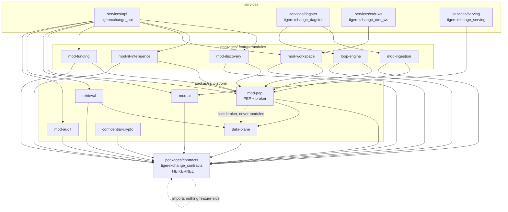

# Conventions (single-box edition) — THIS FILE WINS

> **Status:** Authoritative. Single Orin (Jetson AGX Orin 64GB) edition of TigerExchange.
> **Precedence:** This document is the single source of truth for names, paths, versions, and the revised single-box pins. **Any other doc that conflicts with this file is wrong.** See [§1 Precedence](#1-precedence--this-file-wins).
> **Audience:** a local ~30B model (Qwen3-30B-A3B class) that will BUILD the application by reading these docs. Spell everything out. Do not infer.
> **Decision IDs:** the locked decision set is **D1..D14 only** (defined in `_design-brief.json` → `decisions[]`). There are **no other decision labels**. Never invent `D-AI`, `D9-as-something-else`, `D15`, etc. See [§13](#13-old-plan-mistakes-this-corpus-must-not-repeat).

---

## Table of contents

1. [Precedence — "this file wins"](#1-precedence--this-file-wins)
2. [Project root layout (`tigerexchange/`)](#2-project-root-layout-tigerexchange)
3. [Module / package names (canonical list)](#3-module--package-names-canonical-list)
4. [Import-root + import-linter contract rules](#4-import-root--import-linter-contract-rules)
5. [The REVISED PINS table (single-box)](#5-the-revised-pins-table-single-box)
6. [The FORBIDDEN list (do not reintroduce)](#6-the-forbidden-list-do-not-reintroduce)
7. [Language / framework / version pins](#7-language--framework--version-pins)
8. [Data-source conventions (grants_gov, OpenAlex cadence, license gate)](#8-data-source-conventions-grants_gov-openalex-cadence-license-gate)
9. [Create-if-absent collection rule (NEVER recreate)](#9-create-if-absent-collection-rule-never-recreate)
10. [Who authors the security CI gates (a HUMAN, not the builder)](#10-who-authors-the-security-ci-gates-a-human-not-the-builder)
11. [Naming & style conventions](#11-naming--style-conventions)
12. [Federation honesty rule (designed, not built)](#12-federation-honesty-rule-designed-not-built)
13. [OLD-PLAN MISTAKES this corpus must NOT repeat](#13-old-plan-mistakes-this-corpus-must-not-repeat)
14. [Quick decision → convention map (D1..D14)](#14-quick-decision--convention-map-d1d14)

---

## 1. Precedence — "this file wins"

When two documents disagree about a name, a path, a version pin, a stack choice, or a security mechanism, resolve the conflict in this exact order. **Higher wins.**

| Rank | Source | Role |
|---|---|---|
| 1 | `docs/design/_design-brief.json` | The locked, adversarially-critiqued brief. The ground truth for *intent*. |
| 2 | **`CONVENTIONS-single-box.md` (this file)** | The ground truth for *names, paths, versions, and pins*. |
| 3 | `05-kernel-contracts.md`, `06-security-spine-lld.md`, `07-...` (the LLD docs) | Detailed designs. Must agree with 1 and 2. |
| 4 | Any inline code comment, docstring, or older doc | Lowest. If it contradicts 1–3, it is wrong; fix it. |

**Rule for the builder:** if you read a sentence anywhere in the corpus that contradicts a pin in [§5](#5-the-revised-pins-table-single-box) or a name in [§3](#3-module--package-names-canonical-list), **stop and follow this file.** Do not "average" the two. Do not pick the one that looks easier. Flag the conflict in your output so a human can delete the stale text.

This file deliberately **revises** several decisions that an older federated "v2" plan locked. Where a decision's `consequences` field in the brief says *"REVISES CONVENTIONS"*, the revised value lives here in [§5](#5-the-revised-pins-table-single-box). The old federated pins are dead. Do not resurrect them — see [§6 FORBIDDEN](#6-the-forbidden-list-do-not-reintroduce) and [§13](#13-old-plan-mistakes-this-corpus-must-not-repeat).

---

## 2. Project root layout (`tigerexchange/`)

This is a **greenfield** project. It is NOT a refactor of the existing `tiger_research_buddy` code. Build it fresh under a new root named `tigerexchange/`.

The repository is a **modular monolith**: one deployable FastAPI application, one Postgres 16 instance, a small fixed set of model-serving processes — all co-resident on one Jetson AGX Orin 64GB (see brief `architecture_overview`, decision **D2**). There is **no** `microservices/`, no `k8s/`, no `helm/`, no second deployable.

The root splits into two top-level Python source trees:

- **`packages/`** — importable **libraries** (the kernel + each feature module's library code). Pure, testable, no process entry points.
- **`services/`** — **deployables / runnable processes** (the FastAPI app, the Dagster code location, the model-serving launchers, the CRDT websocket server).

```
tigerexchange/
├── pyproject.toml                     # single project, pins Python 3.11, deps; declares the workspace packages
├── README.md
├── .env.example                       # config template (NO secrets committed)
├── docker-compose.yml                 # Postgres 16 + PgBouncer (transaction mode) for local/box bring-up
├── docs/
│   └── design/                        # this corpus (00-START-HERE.md, CONVENTIONS-single-box.md, 01..15)
├── migrations/                        # SQL + Alembic migrations (RLS policies, tablespaces, DDL)
│   └── sql/                           #   raw SQL for FORCE-RLS policies, recursive-CTE Check(), pgvector/BM25 DDL
├── packages/                          # ── LIBRARIES (importable, no process entry points) ──
│   ├── contracts/                     # THE FROZEN KERNEL. Imports nothing feature-side. Everything imports it.
│   │   └── tigerexchange_contracts/   #   import root: `tigerexchange_contracts`
│   ├── mod-pep/                       # Policy Enforcement Point + data-access broker (the SOLE chokepoint)
│   │   └── tigerexchange_pep/
│   ├── mod-discovery/                 # team assembly: two-axis ranking (coverage + connectivity), PUBLIC-tier only
│   │   └── tigerexchange_discovery/
│   ├── mod-lit-intelligence/          # dual-source proposal grounding (shared public + own-tenant confidential)
│   │   └── tigerexchange_lit_intelligence/
│   ├── mod-workspace/                 # confidential CRDT co-authoring (CENTERPIECE; real-time mode at P0)
│   │   └── tigerexchange_workspace/
│   ├── mod-funding/                   # opportunity match -> Pursuit; opportunity + award feeds
│   │   └── tigerexchange_funding/
│   ├── mod-ingestion/                 # classify-gates-index batch pipeline + outbox sensor (Dagster assets)
│   │   └── tigerexchange_ingestion/
│   ├── mod-audit/                     # per-stream hash-chained AuditEvent sink + signed checkpoints
│   │   └── tigerexchange_audit/
│   ├── mod-ai/                        # IModelRouter + provider registry + tier->locality egress guard
│   │   └── tigerexchange_ai/
│   ├── retrieval/                     # HybridRetriever: pgvector HNSW + native BM25 + RRF-in-SQL + rerank + graph CTE
│   │   └── tigerexchange_retrieval/
│   ├── data-plane/                    # single-Postgres adapters: IVectorStore/ILexicalIndex/IGraph backends
│   │   └── tigerexchange_data_plane/
│   ├── confidential-crypto/           # KEK/DEK envelope, LocalKms, fTPM/passphrase anchor, AES-GCM blobs, DEK-destroy
│   │   └── tigerexchange_confidential_crypto/
│   └── loop-engine/                   # write-back edge: outcome -> CO_PI_WITH edges + outcome-weighted signal
│       └── tigerexchange_loop_engine/
├── services/                          # ── DEPLOYABLES (runnable processes) ──
│   ├── api/                           # the FastAPI application (routers wire modules behind the PEP)
│   │   └── tigerexchange_api/         #   `python -m uvicorn tigerexchange_api.app:app`
│   ├── dagster/                       # the Dagster code location (ingestion DAGs + outbox sensor)
│   │   └── tigerexchange_dagster/
│   ├── crdt-ws/                       # self-hosted pycrdt-websocket server for mod-workspace
│   │   └── tigerexchange_crdt_ws/
│   └── serving/                       # launchers/config for the model-serving processes (vLLM / sentence-transformers)
│       ├── llm/                       #   the ONE shared Qwen3-30B-A3B generator process launcher
│       ├── embedder/                  #   bge-m3 embedder process (or in-process saver config)
│       └── reranker/                  #   bge-reranker-v2-m3 score process (or in-process saver config)
└── tests/
    ├── unit/
    ├── integration/
    └── security/                      # HUMAN-AUTHORED adversarial CI gates ONLY (see §10). The builder does NOT write these.
```

**Rationale (chosen over alternatives):**

- **`packages/` (libs) + `services/` (deployables) over a flat `src/` tree.** A flat tree makes it too easy for a deployable to leak business logic into a place where another module imports it, and it makes import-linter contracts harder to phrase. The two-tree split lets us state one blunt rule: *libraries never import services; services compose libraries.* We rejected a flat `src/` because the existing TigerBuddy code already shows how a flat `src/` drifts into cross-imports.
- **One distribution per `packages/<mod>` directory, each with a single import-root package.** The directory name uses kebab-case (`mod-lit-intelligence`) to match the doc-set vocabulary; the importable Python package inside uses snake_case (`tigerexchange_lit_intelligence`) because Python module names cannot contain hyphens. We rejected making the import-root match the directory verbatim because `import mod-lit-intelligence` is a syntax error.
- **`tests/security/` is physically separate** because those tests are authored by a **human**, not the builder (see [§10](#10-who-authors-the-security-ci-gates-a-human-not-the-builder)). Keeping them in their own tree makes "the builder may add tests anywhere EXCEPT here" a one-line CODEOWNERS / review rule.

> **Naming reconciliation:** throughout the docs the modules are referred to by their kebab directory name (`mod-pep`, `mod-discovery`, …). When you see `mod-X` in prose, the importable package is `tigerexchange_<x_with_underscores>` as listed in [§3](#3-module--package-names-canonical-list). There is exactly one mapping; do not invent others.

---

## 3. Module / package names (canonical list)

This is the **complete** package map. There are no other top-level packages. If a doc references a package not in this table, that doc is wrong.

| Tree | Directory | Import root (the package you `import`) | Responsibility (one line) |
|---|---|---|---|
| `packages/` | `contracts` | `tigerexchange_contracts` | **The frozen kernel.** Tier lattice, `TenantContext`/`Entitlement`/`Capability`, `ClassificationResult`/`Decision`, `PublishableProjection`, all `I*` Protocol interfaces, PEP request/response types, `AuditEvent`. Imports **nothing** feature-side. |
| `packages/` | `mod-pep` | `tigerexchange_pep` | The single in-process **Policy Enforcement Point** `authorize()` + the data-access **broker**. Sole chokepoint for every retrieve/egress/derive. Holds the `RelationTuple` table + recursive-CTE `Check()`. |
| `packages/` | `mod-discovery` | `tigerexchange_discovery` | Team assembly. Two-axis ranking (expertise COVERAGE matrix + graph CONNECTIVITY) over the **PUBLIC-tier** expertise graph + per-candidate "why" + human curation. Touches **no** confidential data. |
| `packages/` | `mod-lit-intelligence` | `tigerexchange_lit_intelligence` | **Dual-source** proposal grounding: retrieves over (A) the shared public index AND (B) the owning tenant's confidential retrieval surface. RAGAS gate with an in-boundary judge. |
| `packages/` | `mod-workspace` | `tigerexchange_workspace` | **CENTERPIECE.** Confidential cross-group CRDT co-authoring. P0 = real-time edit only. Scoped roles, KEK-bound AES-GCM snapshotting, MAX-rule confidential tagging. |
| `packages/` | `mod-funding` | `tigerexchange_funding` | Funding feeds. Grants.gov **opportunities** (top-of-loop trigger) + NIH RePORTER / NSF **awards**. Creates the `Pursuit`. Records `proposal.outcome_recorded`. |
| `packages/` | `mod-ingestion` | `tigerexchange_ingestion` | The HDD-aware **classify-gates-index** batch pipeline (Dagster assets) + the transactional-outbox sensor. DuckDB out-of-core. SPECTER2 batch precompute-then-unload. |
| `packages/` | `mod-audit` | `tigerexchange_audit` | Per-stream **hash-chained** `AuditEvent` sink (`prev_hash -> entry_hash`) + signed checkpoints. The SEPARATE non-security loop-event stream lives here too but on a distinct stream. |
| `packages/` | `mod-ai` | `tigerexchange_ai` | `IModelRouter` + provider registry + the egress transport guard that reads the ONE owned **tier→locality** policy table (router + transport hard-fail on disagreement). |
| `packages/` | `retrieval` | `tigerexchange_retrieval` | `HybridRetriever` implementing `IRetrievalStrategy`: pgvector HNSW + native BM25 + RRF-in-SQL + cross-encoder rerank + bounded-hop recursive-CTE graph traversal. |
| `packages/` | `data-plane` | `tigerexchange_data_plane` | The single-Postgres adapters backing `IVectorStore` / `ILexicalIndex` / `IGraph`. Owns the create-if-absent collection helper ([§9](#9-create-if-absent-collection-rule-never-recreate)). |
| `packages/` | `confidential-crypto` | `tigerexchange_confidential_crypto` | KEK/DEK envelope, `LocalKms` behind `IKms`, fTPM/passphrase box-master anchor, AES-256-GCM for **non-searchable blobs**, `destroy_kek()` crypto-shred. |
| `packages/` | `loop-engine` | `tigerexchange_loop_engine` | The compounding write-back edge: on a won outcome, materialize `CO_PI_WITH` edges + a transparent outcome-weighted signal + artifacts as public WORK nodes via the monotonic applier. |
| `services/` | `api` | `tigerexchange_api` | FastAPI app. Routers compose the modules **behind the PEP**. |
| `services/` | `dagster` | `tigerexchange_dagster` | The Dagster code location (`dagster dev` / job execute). |
| `services/` | `crdt-ws` | `tigerexchange_crdt_ws` | The self-hosted pycrdt-websocket server process. |
| `services/` | `serving` | `tigerexchange_serving` | Launchers/config for the model-serving processes. |

> **The "contracts kernel" is one package.** It is the near-frozen `contracts` distribution at `packages/contracts/` with import root `tigerexchange_contracts`. When any doc says "the kernel", "the contracts kernel", or "the frozen kernel", it means exactly this package.

---

## 4. Import-root + import-linter contract rules

These rules are enforced in CI by **import-linter** plus an **AST test** (a small Python test that walks each module's source and fails if it constructs a forbidden type or imports a forbidden symbol). The rules below are the *contract*; the LLD docs (`05-kernel-contracts.md`, `06-security-spine-lld.md`) spell out the exact `importlinter` config and the AST checks. This is decision **D3** made enforceable.

### 4.1 The hard import rules

1. **The kernel imports nothing feature-side.** `tigerexchange_contracts` may import only the standard library, `pydantic`, and `typing`. It may **not** import any `tigerexchange_*` feature/service package, any store driver (`asyncpg`, `sqlalchemy`, `psycopg`), any model library (`vllm`, `torch`, `sentence_transformers`, `transformers`, `adapters`), or any crypto backend. **Rationale:** the kernel is the stable dependency everything points at; if it depended on a feature, you would get an import cycle and the "frozen" promise would be a lie. Rejected alternative: letting the kernel import a "small" utility package — that utility inevitably grows feature deps and the cycle returns.

2. **A module imports only the kernel + its own subpackage.** Each `tigerexchange_<mod>` package may import `tigerexchange_contracts` and its own submodules. It may **not** import another feature module's package (e.g. `tigerexchange_discovery` may **not** `import tigerexchange_workspace`). Cross-module collaboration happens through kernel `I*` Protocols wired by the DI factory in `services/api`, never by direct import. **Rationale:** direct cross-module imports recreate the tangled monolith we are explicitly avoiding; Protocol seams are what make federation ([§12](#12-federation-honesty-rule-designed-not-built)) a *mostly* clean later addition. Rejected alternative: a shared "common" grab-bag package — it becomes a second hidden kernel with feature deps.

3. **Modules never import the raw store.** No feature module may import `tigerexchange_data_plane`, `asyncpg`, `sqlalchemy`, or hold a raw DB connection. Modules receive **already-projected, already-tier-checked** objects from the **broker** inside `mod-pep`. **Rationale (D3):** if a module can open its own connection it can bypass RLS, bypass the PEP decision order, and leak across tenants. The broker holds raw-store credentials ONLY for the shared confidential-artifact/classification tables AND per-tenant confidential-index access — **not** every module's schema (this is the explicit resolution of the old "broker-as-god-object vs module-owns-its-data" contradiction; see [§13](#13-old-plan-mistakes-this-corpus-must-not-repeat)).

4. **Modules never import the classifier engine directly.** The classification gate lives behind the kernel interface and is invoked through the ingestion pipeline / PEP, never by a feature module reaching into the classifier's internals. **Rationale:** classification is a fail-closed security edge (D6); scattering classifier calls lets a builder accidentally index a quarantined record.

5. **Modules never construct a `PublishableProjection`.** Only the broker constructs it. A feature module that builds a `PublishableProjection` is forbidden by the AST test. **Rationale (D3/D6):** the `PublishableProjection` validator is the structural guarantee that confidential-tier content can never be shaped for the SHARED cross-tenant index; if any module could build one, that guarantee evaporates.

6. **Services may import packages; packages may not import services.** `services/api` composes `packages/*`. No `packages/*` may import any `services/*` package. **Rationale:** keeps libraries unit-testable without a running process and prevents a deployable's wiring from leaking into reusable logic.

### 4.2 Layered dependency diagram



> **What the diagram encodes:** every feature module's only inbound edges to the platform go through `mod-pep` and the kernel. Feature modules have **no** edge to `data-plane`, `retrieval` internals, the classifier, or each other. That is rules 2–5 drawn out.

---

## 5. The REVISED PINS table (single-box)

This is the heart of the document. Each row is a pin the single-box edition **locks**. Where the cell says **REVISES**, it overrides an older federated-v2 pin that is now dead. The "rationale / rejected" column gives the *why* so the builder does not silently swap back to the old value. Decision IDs are the brief's D1..D14.

| Concern | **PINNED single-box value** | Decision | Rationale + what it REVISES / rejects |
|---|---|---|---|
| **ABAC engine** (tier / classification lattice) | **In-process Python** inside the single PEP, using the kernel lattice (`tier_join_all` MAX-rule, `Entitlement.permits_tier`, caveats re-evaluated at access). Fail-closed. | **D4** | A fixed 3-tier lattice + capability gate is a few lines of fail-closed Python. **REVISES** the old "ABAC = OPA". Rejected: OPA/Rego (a Go daemon + Rego + data-sync to operate, impossible-to-bypass-only-if-perfectly-synced) — overkill, and a module could still call the store around it. Also rejected: Cedar (the old plan body even listed Cedar as primary — a direct contradiction; see [§13](#13-old-plan-mistakes-this-corpus-must-not-repeat)). |
| **ReBAC engine** (team membership, sharing grants) | **Postgres-native relation-tuple table** `(subject, relation, object, tenant_id)` evaluated by a **recursive-CTE `Check()`** in the SAME Postgres, behind the kernel `IPolicyEnforcement` / relation-`Check` Protocol. | **D4** | Zanzibar's tuple model maps to one indexed Postgres table; recursive CTEs evaluate nested relations fast; tuples inherit tenant RLS; zero new infra. **REVISES** the old "ReBAC = SpiceDB". Rejected: SpiceDB/OpenFGA-as-a-service (separate datastore + operator + Go, high single-node complexity). **HONEST CAVEAT:** the CTE `Check` resolves **LOCAL tables only** — a federation rewrite, not a transport swap (see [§12](#12-federation-honesty-rule-designed-not-built)). |
| **Key management / crypto custody** | **Dependency-free in-process `LocalKms`** behind kernel `IKms`, holding per-tenant KEKs encrypted under ONE box-master key. **P0 DEFAULT box-master anchor = fTPM via userspace `tpm2-tools`/`tpm2-pytss` (seal to a PCR)** OR a **passphrase-derived master key** (NIST SP 800-108 KDF, key never on disk). `destroy_kek()` = crypto-shred. | **D7** | **REVISES** the old CloudHSM / cloud-KMS seam (wrong for a no-cloud box). Rejected: OP-TEE/EKB hardware anchor as a BUILD deliverable — it needs irreversible OEM fuse-burning + Secure Boot + a custom OP-TEE Trusted Application in **C**, with documented unresolved NVIDIA-forum failures: a hard wall for a Python builder. OP-TEE/EKB is **optional human-operator hardening**, behind the same `IKms`, not in P0. Also rejected: raw key file (master key plaintext on the slow HDD). |
| **Retrieval store / engine** | **A SINGLE Postgres 16:** relational tables + **pgvector HNSW** (dense) + **native BM25** (VectorChord-BM25, with ParadeDB `pg_search` as a co-equal verified alternate) + **RRF in SQL** + a metadata-backbone **graph as an edge table** traversed by **recursive CTEs**. | **D8** | One memory-shared Orin with a slow HDD cannot afford extra always-on stores competing for the 64GB the models need. **REVISES** the old "Qdrant + OpenSearch + SpiceDB + Apache-AGE polyglot" — those become documented **future scale-out adapters**, not P0 targets. pgvector HNSW is the **VERIFIED P0 dense default**, kept RAM-resident / on NVMe. Rejected: relying on any inherited x86 "3x-vs-Elasticsearch" BM25 number (does not transfer to aarch64; benchmark on the real box, see P0.5). |
| **Disk-friendly vector index** | **pgvector HNSW kept RAM-resident is the P0 default.** VectorChord IVF+RaBitQ / DiskANN-style ">RAM index" is a **P1 verify-then-adopt** task, **NOT a P0 dependency**. | **D8** | HNSW is pure random I/O and catastrophic off HDD, so the live index MUST stay RAM-resident / on NVMe regardless. The ">RAM via RaBitQ" story is therefore not load-bearing at P0. `arm64_status` for RaBitQ = needs-verification → it does not gate P0. |
| **GPU / confidential isolation** | **ONE shared Qwen3-30B-A3B vLLM generator process for ALL tenants.** Confidential KV isolation = **`--enable-prefix-caching=False` on the confidential path + strict request serialization with a KV boundary**. **NO second resident 30B copy. NO MIG.** | **D10** | A dedicated vLLM process per confidential tenant needs a SECOND full ~17GB resident copy (+ context) → ~70GB > 64GB: the centerpiece could not run. vLLM does **not** leak KV across separate requests by default; the real leak vector is shared-prefix caching, which we disable for confidential requests. **REVISES** the old "dedicated confidential vLLM process". Rejected: MIG partitioning — **physically unavailable on Orin Ampere** (deferred to a future Thor/Blackwell). If true PROCESS isolation is ever mandated, load the smaller **Qwen3-14B** AND **evict/pause the public 30B first** — NEVER two 30B copies resident. |
| **Crypto-shred of SEARCHABLE derivatives** (per-tenant vector / BM25 / graph) | **Per-tenant ENCRYPTED TABLESPACE / LUKS-dm-crypt volume; crypto-shred = DESTROY the per-tenant DEK that unlocks that volume, then drop-and-rebuild.** This is **PRIMARY**, not a fallback. | **D7** | AES-GCM on vectors/BM25 is **mathematically unsearchable** — ciphertext destroys the distance metric pgvector/HNSW need and encrypted postings cannot be tokenized/scored. So volume/tablespace encryption is the ONLY workable crypto-shred for searchable indexes: plaintext-AT-REST-inside an encrypted block device, searchable while mounted, shredded by destroying the unlocking DEK. **REVISES** the old (inverted) "ALE on vectors before insert". Node-local → a known federation-boundary rewrite. |
| **Application-layer encryption** (NON-searchable blobs ONLY) | **AES-256-GCM via the `cryptography` library, per-tenant DEK, applied ONLY to non-searchable at-rest blobs:** CRDT draft snapshots, autosave, version history, eval traces, cache VALUES. | **D7** | ALE is correct **exactly** where data is never searched (opaque blobs) and **wrong** for indexes. Scoping it to blobs makes `destroy_kek()` reach drafts/history/eval while searchable indexes use the encrypted-tablespace mechanism above. Rejected: homomorphic / searchable / distance-preserving encryption (research-grade, x86-tuned, beyond the builder). |
| **Model serving runtime** | **vLLM** (jetson-ai-lab SM 8.7 wheel, pin `vllm>=0.10.x`) run as **up to THREE one-model-per-process instances** — (1) the LLM, (2) the embedder, (3) the reranker — each with its own CUDA context (~1.3GB each, all counted in the budget). | **D9** | vLLM is strictly **one model per process**; a single instance cannot host generator + embedder + reranker. "One runtime" = the same software as 3 processes. **RECOMMENDED memory-saver:** 1 vLLM (LLM) + **sentence-transformers IN-PROCESS** for embed/rerank — avoids two extra CUDA contexts (~2.6GB) and is lighter on Orin. Rejected: TensorRT-LLM (30–90 min per-model engine compile, preview-grade on Jetson); Ollama for prod (no `/api/rerank` as of 2026) — Ollama is **dev-time-only for the LLM, never the reranker**. |
| **SPECTER2 citation-aware embedding** | **INGEST-ONLY.** SPECTER2 base + PROXIMITY adapter (via the `adapters` library on the SM 8.7 PyTorch wheel) runs as a **BATCH job at ingest to precompute** ExpertiseFingerprint / paper-similarity vectors, then is **UNLOADED**. **NEVER serve-resident. NEVER served by vLLM pooling.** | **D8 / brief tech_stack** | SPECTER2 is an adapter on SciBERT, not a drop-in sentence-transformers model; serving it resident wastes RAM. Precomputing at ingest then unloading (~0GB at serve) is correct on this box — its footprint appears ONLY in the INGEST-WINDOW budget. Fallback: if `adapters` is troublesome on aarch64, use bge-m3 for the connectivity/similarity axis at reduced citation-precision and make SPECTER2 a P1 enhancement. |
| **Serve-time retriever embedder** | **bge-m3** (dense+sparse+ColBERT, 8192 ctx, 568M) OR **Qwen3-Embedding-0.6B** as the SINGLE serve-time embedder. | **D8** | Small, coexists with the 30B generator in 64GB. Rejected: Qwen3-Embedding-8B (MTEB #1 but 8B resident not worth it on a shared box). Fallback: nomic-embed-text (137M); serve via sentence-transformers if vLLM pooling misbehaves. |
| **Reranker** (stage-2 cross-encoder) | **bge-reranker-v2-m3** (568M) OR **Qwen3-Reranker-0.6B**, served via a dedicated vLLM score-endpoint process **OR** sentence-transformers `CrossEncoder` in-process (the saver, avoids the 3rd CUDA context). | **D8 / D9** | +5–15 nDCG@10 for <200ms. Rejected: Ollama (no rerank endpoint), large rerankers (won't fit hot beside the 30B). |
| **Primary in-boundary LLM** | **Qwen3-30B-A3B** (MoE, 30.5B total / 3.3B active) at **W4A16 AWQ or GPTQ-Int4**, in ONE shared vLLM process. ~17GB resident at INT4. | **D9 / D10** | MoE keeps decode bandwidth-bound at ~3B speed (~30–45 tok/s on Orin) at near-32B quality. Rejected: dense Qwen2.5-32B (~19GB Q4 AND slower dense decode), Mixtral 8x7B, Gemma3-27B dense, Llama-3.x-70B. Fallback: Qwen3-14B dense (~9GB INT4) — used if the MoE quant misbehaves, AND as the model an optional dedicated confidential process would load **with the 30B evicted**. |
| **Ingestion / bulk transform** | **DuckDB** out-of-core (spill-to-disk), reading gzip-JSONL/NDJSON directly → writing **Parquet on NVMe**, with `SET memory_limit` (8GB ingest window / 4GB writeback window) and capped threads **explicitly set**. | **D13 / D14** | Native aarch64, reads gzip NDJSON natively, spills to disk so it processes >RAM sets on a 64GB box. Runs ONLY in the INGEST-WINDOW or semaphore-gated WRITEBACK-WINDOW — never silently concurrent with full serving. Rejected: Spark (heavy), Pandas (won't fit). |
| **Orchestration** | **Dagster, pinned `dagster>=1.8,<2`** — classify-gates-index DAGs + the transactional-outbox sensor that triggers the semaphore-gated write-back job. | **D12 / brief** | Minimalist substrate for one box; outbox-polling avoids Kafka/Temporal/Debezium. **The pin is `>=1.8,<2`** (NOT `>=1.7,<2`; see [§13](#13-old-plan-mistakes-this-corpus-must-not-repeat)). Fallback: plain Python + systemd timers if Dagster's aarch64 install is troublesome, but Dagster is the default. |
| **App framework + pooling** | **FastAPI** (latest 0.11x) + **asyncpg** + **SQLAlchemy 2** + **PgBouncer (transaction mode)**; tenant context pinned per-transaction via `set_config('app.tenant_id', <bound param>, true)` (**SET LOCAL**). | **D5** | `SET LOCAL` (not `SET SESSION`) is mandatory under PgBouncer transaction mode or the previous tenant's context leaks on a reused connection; the bound parameter avoids tenant-id SQL injection. |
| **Per-tenant isolation** | **FORCE ROW LEVEL SECURITY + AS RESTRICTIVE policy FOR ALL** with **BOTH `USING` and `WITH CHECK`** on `current_setting('app.tenant_id', true)`; **tenant_id as the LEADING index column**; app role **NOSUPERUSER / NOBYPASSRLS / NOINHERIT** non-owner. Forbid `SECURITY DEFINER`, `MATERIALIZED VIEW`, and `VIEW` over tenant tables unless `security_invoker=true`. | **D5** | FORCE closes owner-bypass; RESTRICTIVE prevents migrations widening access; WITH CHECK blocks cross-tenant writes; leading tenant_id index makes the predicate an index seek (vital on the HDD box). The VIEW guard is the 3rd bypass vector the old lint missed. |
| **Concurrent co-authoring engine** | **CRDT via Yjs/y-crdt** (`pycrdt`, successor to `y-py`) with a self-hosted **pycrdt-websocket** server on the Orin; the CRDT doc is the live buffer, snapshotted (AES-256-GCM, non-searchable blob) into the KEK-bound draft store. | **D11** | CRDT merges in any order, survives restart, supports offline + autosave recovery, fully self-hostable. Rejected: Operational Transformation (needs central server, worse recovery), last-write-wins (silently loses concurrent edits). Fallback: build y-crdt from Rust source if the aarch64 wheel breaks. |
| **Frontend** | **Next.js + React** (served from the box) → FastAPI; **y-websocket** CRDT client for the editor; **force-graph** for expertise-graph / coverage views. | **brief** | Matches the existing TigerBuddy frontend stack; kept thin (scarce box resources go to models). Fallback: a Streamlit admin surface if the Next.js build is too heavy to host on-box. |
| **Deploy target / OS baseline** | **Jetson AGX Orin 64GB, JetPack 6.2 (L4T r36.4.3), CUDA 12.6, Ubuntu 22.04 aarch64, Python 3.11+, power mode MAXN, GPU SM 8.7 (Ampere).** ALL CUDA Python wheels (torch, vLLM, flash-attn, xformers, bitsandbytes) from **`https://pypi.jetson-ai-lab.io/jp6/cu126`**. | **D9 / brief** | Default PyPI cu126 wheels omit SM 8.7 SASS and will fail or silently fall to CPU (the #1 Jetson LLM failure mode). **NEVER `pip install vllm` from default PyPI.** Fallback: JetPack 6.1 (CUDA 12.6); never downgrade below CUDA 12.6 or the pinned wheels break. |

### 5.1 Memory regimes (the budget pin)

The box runs in **exactly one** of three mutually-exclusive memory regimes at a time. The old single "headroom" figure was **triple-counted** (burst + DuckDB spill + a now-eliminated second vLLM). Replace it with three regime budgets (decision **D13**, brief `memory_budget`):

| Regime | When | Approximate total | Notes |
|---|---|---|---|
| **SERVE** | interactive steady state | **~49GB** (saver variant **~46GB**) | 7 OS + 25 generator (17 weights + 8 KV/ctx) + 2.5 embedder + 2.5 reranker + 7 Postgres buffers + 5 backends. Confidential drafting adds **NO** resident model copy (same generator, prefix-caching off + serialized). Saver = embed/rerank in-process. |
| **INGEST-WINDOW** | bulk DuckDB load, **serving PAUSED** | **~25GB** (generator evicted) / ~42GB (idle-resident) | DuckDB `memory_limit='8GB'` + SPECTER2 batch (~1.5GB, loaded ONLY here) + embedder + reduced Postgres `shared_buffers`. |
| **WRITEBACK-WINDOW** | async loop enrichment, **semaphore-gated to yield to interactive generation** | **~54.5GB** | SERVE baseline + capped writeback DuckDB `memory_limit='4GB'` + SPECTER2 reload (~1.5GB). The semaphore prevents writeback and an interactive burst peaking together. |

**Contention rules (pinned):** (a) exactly ONE regime at a time; ingestion runs in a maintenance window with serving paused; (b) serialize LLM generation vs heavy embedding batches; gate generation so the CRDT editor stays responsive; (c) confidential KV isolation = prefix-caching-off + serialization on the ONE shared generator, NO MIG.

**Data placement (pinned, D13):** HDD = **cold archive only** (raw CC0 gzip snapshots, read SEQUENTIALLY at ingest); NVMe (PCIe Gen4 M.2, **effectively mandatory in BOM**) = hot tier for Postgres data dir + WAL + live shared/confidential indexes + Parquet working sets; RAM = transient + model weights + index hot pages. **The authz/RLS hot path must NEVER incur HDD random seeks.**

---

## 6. The FORBIDDEN list (do not reintroduce)

These were in the old federated plan or are tempting "improvements". They are **banned** in the single-box edition. If you (the builder) feel the urge to add any of these, **stop** — the urge means you are reading a stale doc, not following this file. Each ban cites the decision that replaced it.

| FORBIDDEN | Why it is banned | Use instead (decision) |
|---|---|---|
| **A SECOND resident 30B model copy** (a dedicated confidential vLLM process loading another Qwen3-30B) | A second ~17GB weights + ~4–8GB context pushes the total to ~70GB > 64GB. The centerpiece path could not run. | ONE shared generator + `--enable-prefix-caching=False` + serialization (**D10**). If true process isolation is ever mandated: Qwen3-14B **with the 30B evicted first** — never two 30B copies. |
| **Application-layer AES-GCM on vectors / BM25 postings / graph edges** | Mathematically **unsearchable** — AES ciphertext destroys the distance metric and encrypted postings cannot be tokenized/scored. Produces a broken or insecure system. | **Encrypted-tablespace + DEK-destroy** for SEARCHABLE indexes; AES-GCM ONLY for NON-searchable blobs (**D7**). |
| **OP-TEE / EKB hardware key anchor as a BUILD deliverable** | Needs irreversible OEM fuse-burning + Secure Boot + a custom OP-TEE Trusted Application in **C**, with unresolved NVIDIA-forum failures. A hard wall for a Python builder. | fTPM-via-tpm2-tools (seal-to-PCR) OR passphrase-KDF as the **P0 default** (**D7**). OP-TEE/EKB is OPTIONAL human hardening only, behind the same `IKms`. |
| **GPU MIG** | Unavailable on Orin Ampere. | Prefix-caching-off + serialization on the one shared generator (**D10**). MIG deferred to a future Thor/Blackwell. |
| **OPA Go daemon** (Rego ABAC) | Standing up a policy engine for a fixed 3-tier lattice is overkill; a module could still bypass it. | In-Python ABAC inside the PEP (**D4**). |
| **Cedar** (as the ABAC engine) | The old plan body even listed Cedar as primary — a direct contradiction the conventions had to outlaw. | In-Python ABAC (**D4**). |
| **SpiceDB / OpenFGA cluster** (ReBAC as a service) | Separate datastore + operator + Go; high single-node complexity. | Postgres recursive-CTE `Check()` on a relation-tuple table (**D4**). |
| **CloudHSM / cloud-KMS** | Contradicts the no-cloud single box. | In-process `LocalKms` + fTPM/passphrase anchor (**D7**). |
| **Qdrant / OpenSearch as P0 stores** | Extra always-on services competing for the 64GB the models need. | Single Postgres: pgvector + native BM25 + RRF + edge-graph (**D8**). They are documented **future** scale-out adapters, not P0. |
| **Apache AGE** (graph extension) | Another engine to operate; the metadata backbone is fine as an edge table. | Edge table + recursive CTE (**D8**). |
| **Kubernetes / microservices / multiple deployables** | The deploy target is literally one box; K8s wastes the scarce 64GB. | Modular monolith: one FastAPI app (**D2**). |
| **Multi-region / a second box / built cross-box federation** | Out of scope, premature, high risk for the builder. | Federation is **designed behind clean seams, NOT built** (**D2**; [§12](#12-federation-honesty-rule-designed-not-built)). |
| **The GTM / COGS / pricing / business model** | Dropped **entirely**. The old COGS table did not even sum to its own line items. | Nothing — do not model economics. Success metrics are **loop-conversion + cross-group activation** (**D1**). |
| **`recreate_collection` / drop-on-create for collections** | Destructive; wipes data on every run; an old retrieval sub-plan used it. | **Create-if-absent** (**[§9](#9-create-if-absent-collection-rule-never-recreate)**). |
| **Python 3.12** | The old plan body said 3.12; the conventions said 3.11+. We pin **3.11+ and NOT 3.12** for the build target. | Python 3.11 (**[§7](#7-language--framework--version-pins)**). |
| **A second resident SPECTER2 at serve time** | A second embedding space resident at serve wastes RAM. | SPECTER2 is **ingest-only, then unloaded** (**D8**). |
| **TensorRT-LLM / MLC-LLM as the P0 serving runtime** | TRT-LLM: 30–90 min per-model engine compile, preview-grade on Jetson. MLC: weak prefill on Jetson. | vLLM SM 8.7 wheel (**D9**); llama.cpp is only a documented fallback for the LLM. |
| **Ollama as the production reranker (or production LLM)** | Ollama has **no `/api/rerank`** as of 2026. | vLLM score process or sentence-transformers CrossEncoder (**D8/D9**). Ollama is dev-time-only for the LLM. |
| **Phantom decision labels** (`D-AI`, `D9-as-something-else`, `D15`, …) | The locked set is **D1..D14 only**. Old downstream docs invented `D-AI`/`D9`. | Use D1..D14 exactly (**[§13](#13-old-plan-mistakes-this-corpus-must-not-repeat)**). |

---

## 7. Language / framework / version pins

| Thing | **PIN** | Notes |
|---|---|---|
| Python | **3.11+ (build/test on 3.11; NOT 3.12)** | The brief's baseline is "Python 3.11+". The OLD plan body said 3.12 — that was a contradiction the conventions had to delete. **Build target = 3.11.** Do not pin 3.12 in `pyproject.toml`. (Note: the developer's local box may have 3.12 installed for other projects; that is irrelevant — `tigerexchange/` pins 3.11.) |
| Dagster | **`dagster>=1.8,<2`** | An old sub-plan pinned `>=1.7,<2`; that drift is wrong. The pin is **`>=1.8,<2`**. |
| vLLM | **`vllm>=0.10.x`** from the jetson-ai-lab SM 8.7 wheel index | NEVER from default PyPI. |
| Pydantic | **Pydantic v2** | All kernel value objects are **frozen** Pydantic v2 models (`model_config = ConfigDict(frozen=True)`); Protocol interfaces use `typing.Protocol`. |
| FastAPI | latest 0.11x | + asyncpg + SQLAlchemy 2 + PgBouncer (transaction mode). |
| Postgres | **16** | single instance; pgvector + native BM25 (VectorChord-BM25 or ParadeDB pg_search) on it. |
| CUDA | **12.6** | never below 12.6 or the pinned wheels break. |
| JetPack | **6.2 (L4T r36.4.3)** | fallback JetPack 6.1 (still CUDA 12.6). |
| GPU SM | **8.7 (Ampere)** | wheels MUST include SM 8.7 SASS (jetson-ai-lab index). |

**Startup assertions (required):** each model-serving process MUST assert at startup that the loaded `torch`/`vllm` reports **SM 8.7 CUDA** (catches the silent CPU-fallback failure mode). A CI/runtime probe MUST assert SERVE-regime resident memory ≤ ~49GB (catches an accidental second 30B copy).

---

## 8. Data-source conventions (grants_gov, OpenAlex cadence, license gate)

### 8.1 Source-name enum

Every ingested entity carries a `source` field drawn from a fixed enum. The funding-opportunity source value is **`grants_gov`** (snake_case, lowercase). Use this **exact** spelling — not `grants.gov`, not `GrantsGov`, not `grantsgov`. The award sources are `nih_reporter` and `nsf_awards`; scholarly is `openalex` and `crossref`; identity is `orcid` and `ror`. These are `StrEnum` members in the kernel.

### 8.2 Two grant feeds, modeled distinctly (D14)

- **Grant Opportunity** (`source=grants_gov`) — an open call, the **top-of-loop trigger**. Drives the win-loop. Public-tier.
- **Grant Award** (`source=nih_reporter` / `nsf_awards`) — a historical funded project. Feeds PI track-record and co-funding collaboration edges. Public-tier.

Do not collapse these into one table; the loop semantics differ.

### 8.3 OpenAlex cadence + delta ingestion (D14) — **with a verification flag**

- **Pinned per the brief (D14):** the **free** OpenAlex public snapshot is **QUARTERLY**. **Monthly snapshots + daily changefiles require a PAID plan.** Schedule the public-corpus refresh DAG for the **quarterly free** cadence by default.
- **Ingestion is DELTA, partitioned by `updated_date`** — download only new `updated_date` partitions, **never** a full re-ingest. This is true regardless of cadence and is the load-bearing instruction.

> **⚠ VERIFICATION FLAG (a human should confirm before launch):** sources disagree on the current OpenAlex *free* cadence — the locked brief D14 says **quarterly free (monthly = paid)**, while an earlier critique pass asserted **monthly free**. **This file follows the brief: quarterly free.** Either way, **build delta-by-`updated_date`** so switching cadence is a schedule change, not a code change. If monthly freshness turns out to be required, budget the **paid** OpenAlex tier explicitly (D14 consequence). A human must verify the current free cadence against the live OpenAlex docs and update the DAG schedule if needed.

### 8.4 License / provenance gate

Carry a per-record **provenance + license** tag on every ingested entity. The commercial-use gate is **fail-closed**: ingest only the PMC **"Commercial Use Allowed"** subset; store the ODC-BY attribution string with derived data. Classification + RLS + the separate confidential surface keep confidential drafts physically separate from the public CC0 corpus.

### 8.5 Corpus scoping (D14)

Public ingestion is **scoped at ingest** by a chosen ROR institution set and/or topic via DuckDB — **NOT a full-world ingest**. The moat is depth-within-tenant, not breadth. Approximate cold sizes (HDD gzip): OpenAlex ~330GB gz (scoped down), Crossref ~200GB (Academic Torrents), ORCID anchors-only from the ~730GB-uncompressed summaries; ROR/NSF/NIH/Grants.gov ingested in full (small).

---

## 9. Create-if-absent collection rule (NEVER recreate)

**Pinned rule:** all collection / index / tablespace bring-up code MUST be **create-if-absent (idempotent)**. **Never** call `recreate_collection`, never drop-on-create, never wipe-and-rebuild as a startup side effect. An old retrieval sub-plan used Qdrant's destructive `recreate_collection`; that is banned (see [§6](#6-the-forbidden-list-do-not-reintroduce), [§13](#13-old-plan-mistakes-this-corpus-must-not-repeat)).

The canonical helper lives in `tigerexchange_data_plane` and is exercised by the **P0.5** acceptance criterion *"`create_collection` guarded by `collection_exists`"*. Shape of the rule (Postgres, illustrative):

```python
# packages/data-plane/tigerexchange_data_plane/collections.py  (illustrative shape)
async def ensure_collection(conn, name: str, ddl: str) -> None:
    """Create the collection/index IFF it does not already exist. NEVER drops."""
    if await collection_exists(conn, name):
        return                      # idempotent no-op; existing data is preserved
    await conn.execute(ddl)         # plain CREATE ... IF NOT EXISTS where the engine supports it
```

```sql
-- Postgres equivalent for tables / indexes: ALWAYS use IF NOT EXISTS
CREATE TABLE IF NOT EXISTS ... ;
CREATE INDEX IF NOT EXISTS ... ;
-- FORBIDDEN: DROP TABLE / DROP INDEX / "recreate" on startup or on every pipeline run.
```

The only place a drop is allowed is the **crypto-shred drop-and-rebuild of a per-tenant confidential tablespace** after its DEK has been destroyed (D7) — and that is an explicit, audited erasure operation, not a startup convenience.

---

## 10. Who authors the security CI gates (a HUMAN, not the builder)

**Pinned rule:** the **adversarial security-contract CI gates are authored by a HUMAN, not by the 30B builder.** The model writes the *implementation* against tests that are already in `tests/security/`. The model does **not** write its own safety net. (Brief: security_spine "Security-contract test suite as CI gates (HUMAN-authored)"; open_risks "writes weak adversarial tests for its own safety net".)

**Why:** a mid-size local model cannot be trusted to author the tripwires that prove it did not introduce a leak. The decision order, the fail-closed semantics, and the zero-leak invariants are the correctness backbone; if the same model writes both the code and the tests, a subtle fail-open path can pass its own weak test. So a human authors the gates first; the model implements until they go green.

**The HUMAN-authored gates (these live in `tests/security/`; the builder must make them pass, not edit them):**

| Gate | Asserts |
|---|---|
| `any-step-error/abstain → DENY` | Any step of the PEP decision order that errors or abstains DENIES (fail-closed). |
| `lower-tier-cannot-construct-confidential-request` | A lower-tier caller physically cannot build a confidential/cross-group request. |
| `broker-over-assert-denied` | The broker refuses a request the PEP denied. |
| `missing-ABAC-attr → deny` | A missing ABAC attribute denies. |
| `PIP-unavailable → deny` | Policy-information-point unavailable denies. |
| `cross-tenant-read-denied (BOLA)` | Tenant B cannot read tenant A's rows. |
| `confidential-surface-cross-tenant-denied` | Tenant B cannot query tenant A's confidential retrieval surface (P0.9). |
| `zero-leak adversarial classifier` | A quarantined record reaches NO shared sink. |
| `post-crypto-shred zero-decryptable-hits` (BOTH paths) | After `destroy_kek()`: zero decryptable hits across the tablespace-DEK-destroy path AND the AES-GCM-blob path. |
| `NO-SET-LOCAL transaction returns ZERO rows` | A transaction with no `SET LOCAL app.tenant_id` returns zero rows. |
| `app-role probe` | The app role is NOSUPERUSER / NOBYPASSRLS. |
| `crash-mid-revocation stays-denied` | An injected crash mid-revocation leaves the object denied (anti-resurrection). |
| `MAX-rule + ABAC-narrows-only` property tests | Tier joins use MAX-rule; ABAC only narrows, never widens. |
| `confidential vector surface remains SEARCHABLE while mounted` | The encrypted-tablespace surface is searchable when its DEK is loaded (proves we did NOT AES-GCM the vectors). |
| `confidential request runs with prefix caching disabled` | The confidential path uses `--enable-prefix-caching=False`. |
| `SERVE-regime resident memory ≤ ~49GB` | No accidental second 30B copy. |

The builder MAY (and should) write **non-security** unit/integration tests for functional correctness in `tests/unit/` and `tests/integration/`. The builder MUST NOT add, weaken, skip, or `xfail` anything in `tests/security/`.

---

## 11. Naming & style conventions

- **Directory names:** kebab-case for `packages/<mod>` and `services/<svc>` (`mod-lit-intelligence`, `crdt-ws`).
- **Python import roots:** snake_case, prefixed `tigerexchange_` (`tigerexchange_lit_intelligence`). Exactly one import root per distribution.
- **Kernel value objects:** frozen Pydantic v2 (`ConfigDict(frozen=True)`). Interfaces are `typing.Protocol`. Enums are `StrEnum` (e.g. `Capability`, `Decision`, `Tier`, source enum).
- **Decision references in prose/comments:** `D1`..`D14` only. Never `D-AI`, `D9-as-something`, `D15`.
- **`class_codes`:** stored as Postgres **`TEXT[]`** (array), and as a list in the payload — both in DDL and in the `ClassificationResult` model.
- **Tier MAX-rule:** `tier_join_all([]) == confidential`; unknown/abstain → confidential; `PublishableProjection(tier=confidential)` must raise.
- **Two event streams, never mixed:** security `AuditEvent` (hash-chained) and the non-security `LoopEvent` (product analytics) live on **separate streams**. A loop event MUST NOT write to the security stream (P0.3 acceptance).
- **Lint/format/type:** `ruff check`, `ruff format`, `mypy` — clean is a gate (mirrors the existing repo conventions). import-linter contract is green is a gate.
- **Tenant context:** always pinned per-transaction via `set_config('app.tenant_id', <bound param>, true)` — never `SET SESSION`.
- **No secrets in the repo:** `.env.example` is a template; real keys/passphrases never committed; KEKs never plaintext on the HDD.
- **No marketing language, no economics, no attribution boilerplate** in any doc, comment, commit message, or README.

---

## 12. Federation honesty rule (designed, not built)

Cross-BOX federation is **DESIGNED behind clean kernel Protocol seams (`IExchangeFeed`, `IRevocationAuthority`, `PublishableProjection.discoverability_scope`) but NOT BUILT** in Phase-0 (decision **D2**). Be honest about which seams carry forward cleanly and which are known rewrites. Do **not** claim "everything is just a transport addition".

| Seam / mechanism | Federation status |
|---|---|
| `PublishableProjection.discoverability_scope` | **Carry-forward-clean** — designed for future federation. |
| `IExchangeFeed` | **Carry-forward-clean** — a transport addition later. |
| Owner-authoritative re-derivation | **Carry-forward-clean** invariant. |
| **Encrypted-tablespace / volume crypto-shred (D7)** | **KNOWN FEDERATION-BOUNDARY REWRITE** — node-local; a future `IRevocationAuthority` **cannot** crypto-shred another node's tablespace. |
| **Recursive-CTE ReBAC `Check()` (D4)** | **KNOWN FEDERATION-BOUNDARY REWRITE** — resolves LOCAL tables only; federation needs distributed tuple resolution the CTE cannot do. |

The full treatment lives in `15-future-federation-interfaces.md`. SpiceDB / MIG / cloud-KMS / OP-TEE are documented there as *where they would attach later* — **explicitly NOT built in Phase-0**.

---

## 13. OLD-PLAN MISTAKES this corpus must NOT repeat

The previous federated "v2" plan and its sub-plans contained the following real defects (recorded in `_audit-of-old-plans.json` and `_critique-resolved.json`). This corpus exists partly to **not repeat them**. If you see any of these patterns in any doc, treat the doc as wrong.

1. **Leaked authoring monologue.** The old canonical plan opened with the author's private planning narration committed into the deliverable. **Never** commit process meta-text ("I'll produce the strengthened plan…", "no tools needed…") into any doc.
2. **Two conflicting "11 HIGH" lists.** The old corpus referenced "the 11 high-severity items" as if one canonical list existed; there were actually two different sets with different numbering, plus a table titled "11 HIGH" that contained 13 numbered rows. **Maintain one canonical set of anything you enumerate; if you collapse N→M, state the collapse explicitly.**
3. **A COGS table that did not sum.** The old §16 COGS Table-B line items summed to $4.5k/mo but the table *stated* $3.0–3.6k/mo, breaking every downstream margin claim. **Economics are dropped entirely (D1).** Do not reintroduce any COGS/pricing/GTM math — and never ship a table whose stated total contradicts its own rows.
4. **Cedar-vs-OPA contradiction.** The old plan body listed ABAC as "Cedar (primary), OPA (fallback)" while the conventions declared "ABAC = OPA" authoritative. The single-box answer is **neither**: ABAC is **in-Python** (D4). Do not list Cedar or OPA as the engine.
5. **Python 3.12.** The old plan body pinned 3.12 while the conventions said 3.11+. **Pin 3.11; not 3.12** ([§7](#7-language--framework--version-pins)).
6. **Phantom decision labels.** Downstream docs invented `D-AI` and a stray `D9` meaning something other than the locked D9. **Only D1..D14 exist**, with the meanings in `_design-brief.json`. Never invent labels.
7. **`recreate_collection` (destructive).** An old retrieval sub-plan used Qdrant's destructive `recreate_collection`. **Create-if-absent only** ([§9](#9-create-if-absent-collection-rule-never-recreate)).
8. **`dagster>=1.7,<2` drift.** An old sub-plan pinned `>=1.7,<2` against the canonical `>=1.8,<2`. **Pin `>=1.8,<2`** ([§7](#7-language--framework--version-pins)).
9. **Broker-god-object wording.** The old §4.2 called the broker "the ONLY holder of raw-store credentials" (god object) while §5.2 said "each module owns its data" — a load-bearing contradiction. The single-box resolution (D3): the broker holds creds **ONLY** for the shared confidential-artifact/classification tables AND per-tenant confidential-index access, **NOT** every module's schema. **Use this precise wording; never call the broker the holder of all raw-store credentials.**
10. **The four corrected criticals (from `_critique-resolved.json`) — do not regress:**
    - **(a) Second 30B copy / memory.** The old design mandated a dedicated confidential vLLM process = a second ~17GB 30B copy → ~70GB > 64GB. **Banned**; use D10 (one shared generator, prefix-caching-off + serialization).
    - **(b) AES-GCM on searchable derivatives.** The old design said "ALE on vectors/BM25 before insert" — mathematically unsearchable. **Banned**; use D7 (encrypted-tablespace + DEK-destroy for searchable; AES-GCM for blobs only).
    - **(c) OP-TEE/EKB as a build deliverable.** The old design framed it as turnkey; it is irreversible-fuse-burn + secure-world C. **Banned as a build deliverable**; P0 default is fTPM/passphrase (D7).
    - **(d) "vLLM = one runtime for LLM + embedder + reranker".** False; vLLM is one model per process. **Use 3 processes (or the sentence-transformers saver)** (D9).
11. **SPECTER2 omitted from the budget / left serve-resident.** The old budget forgot SPECTER2 as a second embedding space. **It is ingest-only, then unloaded** (D8), and it appears ONLY in the INGEST-WINDOW budget.
12. **OpenAlex "quarterly correction" vs "monthly" factual dispute.** Treat the cadence as a **flagged uncertainty** ([§8.3](#83-openalex-cadence--delta-ingestion-d14--with-a-verification-flag)): follow the brief (quarterly free) but build **delta-by-`updated_date`** either way, and have a human verify the live cadence.
13. **Federation over-claim.** The old plan promised cross-box federation was "a transport addition, not a rewrite". **It is not** for crypto-shred-by-volume and CTE ReBAC — those are known rewrites ([§12](#12-federation-honesty-rule-designed-not-built)).
14. **Triple-counted "headroom".** The old single headroom figure double/triple-counted burst + DuckDB spill + a second vLLM. **Use the three mutually-exclusive regime budgets** ([§5.1](#51-memory-regimes-the-budget-pin)).

---

## 14. Quick decision → convention map (D1..D14)

A one-line index from each locked decision to where its convention lives in this file. The decisions are defined in `_design-brief.json` → `decisions[]`; the meanings here are summaries, the brief is authoritative.

| ID | Decision (summary) | Convention lives in |
|---|---|---|
| **D1** | Product = Research Collaboration Loop Engine (not RIM/funding-DB/grant-writer); **no economics** | [§6](#6-the-forbidden-list-do-not-reintroduce) (GTM/COGS banned), [§13](#13-old-plan-mistakes-this-corpus-must-not-repeat) #3 |
| **D2** | Single-box modular monolith; federation designed-not-built behind seams | [§2](#2-project-root-layout-tigerexchange), [§12](#12-federation-honesty-rule-designed-not-built) |
| **D3** | Single PEP + broker is the sole confidentiality chokepoint; broker creds scoped | [§4](#4-import-root--import-linter-contract-rules), [§13](#13-old-plan-mistakes-this-corpus-must-not-repeat) #9 |
| **D4** | Fixed fail-closed PEP order; **ABAC in-Python**, **ReBAC Postgres-CTE** | [§5](#5-the-revised-pins-table-single-box) (ABAC/ReBAC rows), [§6](#6-the-forbidden-list-do-not-reintroduce) |
| **D5** | Per-tenant isolation = FORCE-RLS + RESTRICTIVE + WITH CHECK + SET LOCAL + leading index + VIEW guard | [§5](#5-the-revised-pins-table-single-box) (isolation row), [§7](#7-language--framework--version-pins) |
| **D6** | Classify-gates-index for SHARED index; per-tenant CONFIDENTIAL retrieval surface for own grounding | [§4](#4-import-root--import-linter-contract-rules) (rules 4–5), [§5](#5-the-revised-pins-table-single-box) |
| **D7** | Crypto-shred split: encrypted-tablespace DEK-destroy for searchable; AES-GCM blobs; fTPM/passphrase anchor | [§5](#5-the-revised-pins-table-single-box) (3 crypto rows), [§6](#6-the-forbidden-list-do-not-reintroduce), [§9](#9-create-if-absent-collection-rule-never-recreate) |
| **D8** | Retrieval = single-Postgres pgvector + native-BM25 + RRF → rerank; SPECTER2 ingest-only | [§5](#5-the-revised-pins-table-single-box) (retrieval/embedder/reranker/SPECTER2 rows) |
| **D9** | vLLM = serving software run as 3 processes (or ST saver); Qwen3-30B-A3B in ONE shared process | [§5](#5-the-revised-pins-table-single-box) (serving/LLM rows), [§7](#7-language--framework--version-pins) |
| **D10** | Confidential KV isolation via ONE shared generator + prefix-caching-off + serialization; NO second copy, NO MIG | [§5](#5-the-revised-pins-table-single-box) (GPU isolation row), [§6](#6-the-forbidden-list-do-not-reintroduce) |
| **D11** | mod-workspace promoted to first-class P0; walking-skeleton = real-time edit only | [§3](#3-module--package-names-canonical-list), [§5](#5-the-revised-pins-table-single-box) (CRDT row) |
| **D12** | Compounding write-back edge = first-class, tested, memory-gated async (semaphore, capped DuckDB) | [§3](#3-module--package-names-canonical-list) (loop-engine), [§5.1](#51-memory-regimes-the-budget-pin) (WRITEBACK regime) |
| **D13** | Tiered storage HDD-cold / NVMe-hot / RAM-transient; three mutually-exclusive memory regimes | [§5.1](#51-memory-regimes-the-budget-pin) |
| **D14** | Corpus depth-within-tenant, scoped at ingest; OpenAlex free QUARTERLY + updated_date delta | [§8](#8-data-source-conventions-grants_gov-openalex-cadence-license-gate) |

---

*End of `CONVENTIONS-single-box.md`. If anything you read elsewhere contradicts this file, this file wins.*
