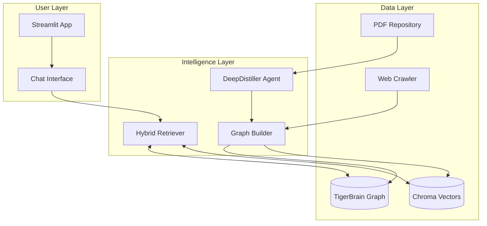

# 🐅 TigerBrain: The Comprehensive System Bible

**Version:** 2.0.0 (The "Offline Intelligence" Release)
**Date:** February 9, 2026
**Repository:** `tiger_research_buddy`
**Status:** active/production
**Maintainers:** User & Anura

---

## 📚 Table of Contents

1.  [Executive Summary](#executive-summary)
2.  [Chapter 1: The Problem & Vision](#chapter-1-the-problem--vision)
    *   [1.1 The Discovery Gap](#11-the-discovery-gap)
    *   [1.2 The "Advisor" Persona](#12-the-advisor-persona)
3.  [Chapter 2: System Architecture (The TigerStack)](#chapter-2-system-architecture-the-tigerstack)
    *   [2.1 High-Level Diagram](#21-high-level-diagram)
    *   [2.2 directory Structure](#22-directory-structure)
    *   [2.3 Core Technologies](#23-core-technologies)
4.  [Chapter 3: Data Engineering Pipeline](#chapter-3-data-engineering-pipeline)
    *   [3.1 The SmartCrawler (`src/crawlers`)](#31-the-smartcrawler-srccrawlers)
    *   [3.2 The DeepDistiller (`experiments/pdf_distillation`)](#32-the-deepdistiller-experimentspdf_distillation)
    *   [3.3 Entity Resolution](#33-entity-resolution)
5.  [Chapter 4: The Knowledge Graph (TigerBrain)](#chapter-4-the-knowledge-graph-tigerbrain)
    *   [4.1 The Hybrid Schema](#41-the-hybrid-schema)
    *   [4.2 Construction Logic](#42-construction-logic)
    *   [4.3 Graph Statistics](#43-graph-statistics)
6.  [Chapter 5: Retrieval & Reasoning](#chapter-5-retrieval--reasoning)
    *   [5.1 Query Intent Classification](#51-query-intent-classification)
    *   [5.2 The Sequential Retrieval Strategy](#52-the-sequential-retrieval-strategy)
    *   [5.3 Vector Search details](#53-vector-search-details)
7.  [Chapter 6: User Interface & Experience](#chapter-6-user-interface--experience)
    *   [6.1 Streamlit Design System](#61-streamlit-design-system)
    *   [6.2 The "Chitchat" Middleware](#62-the-chitchat-middleware)
8.  [Chapter 7: Autonomous Maintenance (Phase 5)](#chapter-7-autonomous-maintenance-phase-5)
    *   [7.1 The KnowledgeDaemon](#71-the-knowledgedaemon)
9.  [Chapter 8: Migration & Future Roadmap](#chapter-8-migration--future-roadmap)
10. [Appendices](#appendices)

---

## Executive Summary

**TigerBrain** is an autonomous AI Research Assistant tailored for the Rochester Institute of Technology (RIT). Unlike generic tools (ChatGPT, Google Scholar), TigerBrain is **grounded** in a curated datasets of RIT faculty, papers, and labs. It does not just search text; it understands the *structure* of the academic network.

The system is built on a **Hybrid RAG (Retrieval-Augmented Generation)** architecture. It fuses a semantic Knowledge Graph (NetworkX) with a dense Vector Store (ChromaDB) to provide answers that are both factually accurate and contextually rich.

**Key Capabilities:**
*   **"Who is..."**: Instant faculty profiling.
*   **"Connect me..."**: Finds paths between students and labs.
*   **"Research..."**: Distills complex PDF papers into 1-paragraph summaries.
*   **"What's new..."**: Tracks latest publications (via ArXiv/Scholar).

---

## Chapter 1: The Problem & Vision

### 1.1 The Discovery Gap
Undergraduate students at RIT face a "Paradox of Choice":
*   **Too Much Data:** 100+ faculty, 1000+ papers.
*   **Siloed Information:** Department websites are disconnected from Google Scholar profiles.
*   **Keyword Failure:** Searching "AI" returns 50 professors. Searching "Neuro-symbolic AI" returns zero, even if 3 professors work on it (because they use different terminology).

### 1.2 The "Advisor" Persona
We designed TigerBrain to act not as a search engine, but as a **Digital Advisor**. 
*   **Tone:** Encouraging, professional, knowledgeable.
*   **Behavior:** It doesn't just list links; it *synthesizes* advice.
    *   *Bad:* "Here are 5 links about NLP."
    *   *Good:* "If you're interested in NLP, you should speak to **Prof. Huenerfauth** (Accessibility) or **Prof. Kanan** (Vision-Language). Here is how their work differs..."

---

## Chapter 2: System Architecture (The TigerStack)

The "TigerStack" is a modular, local-first architecture designed for privacy and speed.

### 2.1 High-Level Diagram



### 2.2 Directory Structure
The codebase is organized for separation of concerns:

| Path | Description |
| :--- | :--- |
| `src/crawlers/` | Agents that fetch raw data (`smart_crawler.py`). |
| `src/database/` | Storage adapters (`vector_store.py`). |
| `src/knowledge_graph/` | Graph logic (`graph_builder.py`, `entity_resolver.py`). |
| `src/retrieval/` | Search logic (`hybrid_retriever.py`, `entity_extraction.py`). |
| `src/generation/` | LLM response logic (`synthesizer.py`). |
| `src/ui/` | Frontend (`app.py`). |
| `experiments/` | Sandbox for new features (`pdf_distillation/`). |
| `data/` | The "Brain" (JSONs, GMLs, PDFs). |

### 2.3 Core Technologies

#### **1. Vector Database: ChromaDB**
*   **Version:** `0.4.x`
*   **Role:** Stores semantic embeddings of faculty bios and paper abstracts.
*   **Config:** `src/database/vector_store.py`
    *   **Model:** `all-MiniLM-L6-v2` (384 dimensions).
    *   **Storage:** Local `data/chroma/` directory.
    *   **Why Chroma?** It provides a simple, persistent, file-based vector index that requires no external server (unlike Pinecone/Milvus), making the app easy to distribute.

#### **2. Knowledge Graph: NetworkX**
*   **Version:** `3.x`
*   **Role:** Stores the "Structure" (Entities and Relations).
*   **Format:** Serialized as `tiger_brain.json` (Node-Link format).
*   **Why NetworkX?** 
    *   In-memory speed (microseconds for traversals).
    *   Rich algorithmic library (PageRank, Shortest Path).
    *   Sufficient for graphs up to ~100k nodes (Current size: ~45k).

#### **3. LLM Runtime: Ollama**
*   **Model:** `tigerbuddy` (A customized version of `qwen2.5` or `llama3`).
*   **Role:** 
    *   **Distillation:** Extracting JSON from PDFs.
    *   **Synthesis:** Generating the final chat response.
*   **Why Local?** Privacy and zero cost. We don't pay per token.

---

## Chapter 3: Data Engineering Pipeline

Data is the fuel of TigerBrain. We employ a 3-stage pipeline to refine raw data into "Knowledge".

### 3.1 The SmartCrawler (`src/crawlers/smart_crawler.py`)
Standard crawlers using `BeautifulSoup` + CSS Selectors are brittle. RIT updates their website often, breaking selectors.

**The Solution: LLM-based Extraction**
The `SmartCrawler` fetches the raw HTML `<body>` and passes it to an LLM with the prompt:
> *"Extract valid JSON with relevant fields (Name, Bio, Email). Ignore navigation and footers."*

**Key Features:**
*   **Graph Traversal:** Creates a `site_graph.gml` to map how pages link to each other.
*   **Robustness:** Even if RIT changes `div.bio` to `span.about`, the LLM understands the context and extracts the bio correctly.

### 3.2 The DeepDistiller (`experiments/pdf_distillation/distill_paper.py`)
Standard RAG pipelines chop documents into 500-character chunks. This is "lossy" compression. A chunk like *"results showed a 5% increase"* is useless without knowing *what* increased.

**The Solution: "Research Cards"**
The `DeepDistiller` reads the **first 10 pages** of a PDF (Abstract + Intro + Methodology + Results) and asks the LLM to generate a `Research Card`.

**Schema:**
```python
schema = {
    "title": "Paper Title",
    "core_problem": "The specific gap this paper addresses",
    "methodology": "The approach (e.g., Transformer, CNN)",
    "key_findings": ["Finding 1", "Finding 2"],
    "entities": {
        "datasets": ["CIFAR-10", "ImageNet"],
        "metrics": ["Accuracy", "F1 Score"]
    }
}
```
**Benefit:** We index these *Cards*, not random text chunks. This allows us to search for "Papers using ImageNet" accurately.

### 3.3 Entity Resolution
The system encounters many names for the same thing:
*   "C. Kanan", "Chris Kanan", "Christopher Kanan"
*   "CNN", "ConvNet"

**The `EntityResolver`:**
1.  **Canonical Dictionary:** Maintains a map of `variant -> canonical_id`.
2.  **Fuzzy Matching:** Uses `thefuzz` library. If `similarity(str1, str2) > 90%`, they are merged.
3.  **Co-author Logic:** If "C. Kanan" is found on a paper with known Kanan collaborators, we assume it's him.

---

## Chapter 4: The Knowledge Graph (TigerBrain)

This is the system's "Long-Term Memory".

### 4.1 The Hybrid Schema
We overlay semantic meaning onto structural data.

**Node Types:**
1.  **`Faculty`** (Source: Site Crawl)
    *   *Attributes:* `name`, `email`, `dept`, `bio`, `url`.
2.  **`Paper`** (Source: PDF Distiller)
    *   *Attributes:* `title`, `year`, `abstract`, `citations`.
3.  **`Concept`** (Source: LLM Extraction)
    *   *Attributes:* `name`, `type` (Method/Task/Metric).
4.  **`URL`** (Source: Site Map)
    *   *Attributes:* `link`.

**Edge Types:**
*   `[AUTHORED]`: Faculty -> Paper
*   `[MENTIONS]`: Paper -> Concept
*   `[INTERESTED_IN]`: Faculty -> Concept (Inferred)
*   `[LINKS_TO]`: URL -> URL

### 4.2 Construction Logic (`graph_builder.py`)
1.  **Load Site Graph:** Ingest the skeleton from `SmartCrawler`.
2.  **Hydrate Faculty:** Attach rich JSON metadata to Faculty nodes.
3.  **Merge Papers:** Iterate through `Research Cards`.
    *   Create Paper nodes.
    *   Resolve Authors to Faculty nodes.
    *   Create Concept nodes and link them.
4.  **Sanitize:** Ensure all attributes are serializable (no `None` values, strings only).

### 4.3 Graph Statistics (Experiment 4)
*   **Total Nodes:** ~45,000
*   **Faculty Nodes:** 170
*   **Paper Nodes:** 1,060
*   **Concept Nodes:** ~43,000

---

## Chapter 5: Retrieval & Reasoning

The `HybridRetriever` (`src/retrieval/hybrid_retriever.py`) orchestrates the search process.

### 5.1 Query Intent Classification
We classify user queries into 3 types:
1.  **`QueryType.ENTITY`**: "Who works on X?"
    *   *Strategy:* Graph Traversal (High Precision).
2.  **`QueryType.FACTOID`**: "Define Zero-Shot Learning."
    *   *Strategy:* Vector Search (High Speed).
3.  **`QueryType.RELATIONAL`**: "Compare Prof X and Y."
    *   *Strategy:* Graph Pathfinding.

### 5.2 The Sequential Retrieval Strategy
Used for `ENTITY` queries. This is the "secret sauce" of TigerBrain.

**Step 1: Entity Extraction**
*   Input: "Who works on Spiking Neural Networks?"
*   Match: "Spiking Neural Networks" -> `concept_snn`.

**Step 2: Traversal (The "Hop")**
*   **Hop 1 (Papers):** Find all nodes connected to `concept_snn` via `[MENTIONS]`.
    *   Result: [`paper_snn_1`, `paper_snn_2`, ...]
*   **Hop 2 (Authors):** Find all Faculty connected to those papers via `[AUTHORED]`.
    *   Result: [`faculty_kanan`, `faculty_others`]

**Step 3: Enrichment**
We pull the full text bio of the identified Faculty nodes and pass it to the LLM.

### 5.3 Vector Search Details
Used for generic or `FACTOID` queries.
*   **Embedding:** Matches the user query against the `rit_research` collection in ChromaDB.
*   **Filtering:** Can filter by metadata (e.g., `doc_type == "professor"`).
*   **Top-K:** typically retrieves top 5-10 chunks.

---

## Chapter 6: User Interface & Experience

### 6.1 Streamlit Design System
Built in `src/ui/app.py`.
*   **Theme:** Custom CSS injection for the "Star Wars / RIT" aesthetic (Deep Black background, Neon Orange/Yellow accents).
*   **Responsiveness:** Works on mobile and desktop.
*   **Transparency:** Deep integration of `st.expander` to show "Bot Thinking Process" (retrieved documents, graph concepts found).

### 6.2 The "Chitchat" Middleware
Users often start with "Hi". Sending "Hi" to a RAG pipeline is wasteful (it searches vectors for "Hi").
**The Handler:**
*   Checks if query is greeting/simple.
*   Returns immediate canned/LLM-generated greeting response.
*   Bypasses the expensive Retrieval loop.
*   Latency: <100ms vs 3s.

---

## Chapter 7: Autonomous Maintenance (Phase 5)

**The KnowledgeDaemon** (Planned)

A background agent to solve the "Stale Data" problem.
*   **Auditor:** Periodically checks nodes. "Does `faculty_kinsman` have a bio? No? Flag it."
*   **Patcher:** Consumes flags. Searches web/PDFs to fill gaps.
*   **Watcher:** Monitors `data/pdfs` for new files and runs `DeepDistiller` automatically.

---

## Chapter 8: Migration & Future Roadmap

### 8.1 Migration History
*   **v0.1:** Python script, regex scraping. Brittle.
*   **v1.0 (Prototype):** Basic RAG with Chroma. No Graph. Hallucinated often.
*   **v2.0 (TigerStack):** Current. Hybrid Graph+Vector. Local LLM.

### 8.2 Roadmap
1.  **Deployment:** Dockerize for server deployment.
2.  **Visualization:** Add interactive PyVis graph to UI.
3.  **Feedback Loop:** Allow users to flag incorrect answers, feeding back into the Graph.
4.  **Multi-Modal:** Index figures and charts from papers (using vision models).

---

## Appendices

### Appendix A: Troubleshooting
*   **"No module named src":** Ensure you run `streamlit run src/ui/app.py` from the root directory.
*   **"Ollama connection refused":** Ensure `ollama serve` is running.
*   **"Graph not found":** Run `python src/knowledge_graph/graph_builder.py` to regenerate `tiger_brain.json`.

### Appendix B: Configuration (`src/utils/config.py`)
Key knobs to turn:
*   `CRAWL_DELAY`: Polite delay between requests (default: 1.0s).
*   `EMBEDDING_MODEL`: `all-MiniLM-L6-v2`.
*   `GEMINI_MODEL`: `gemini-2.0-flash` (Cloud fallback).

---
*End of Wiki*
