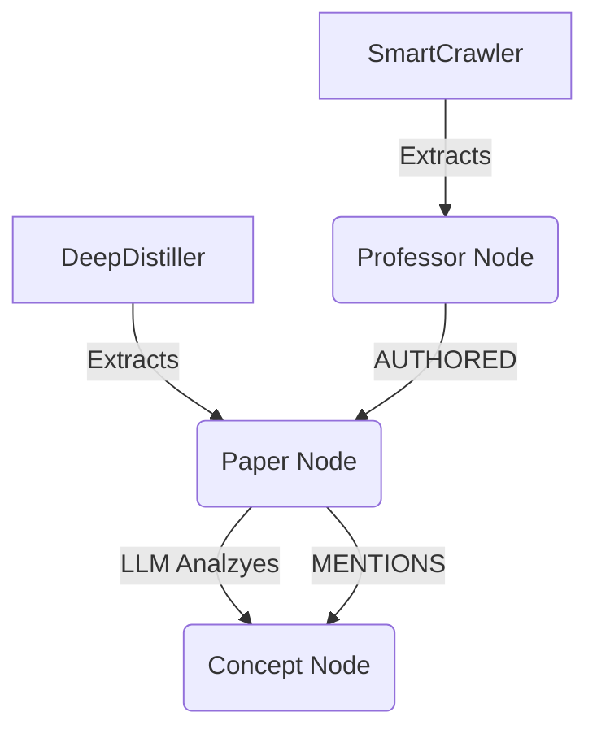

# Unified Graph Design: The "TigerBrain" Architecture

## Core Philosophy
Instead of choosing between a **Site Graph** (URLs connecting to URLs) and a **Knowledge Graph** (Concepts connecting to Concepts), we build a **Hybrid Graph** where both coexist.

This allows us to answer complex queries that require both *structural* (who knows who) and *semantic* (who measures what) information.

## 1. The Unified Schema

### Nodes (Entities)
We treat everything as a first-class node in the graph:

1.  **`Professor`** (Source: Site Crawl)
    *   *Props*: Name, Dept, Office
2.  **`Paper`** (Source: PDF Distiller)
    *   *Props*: Title, Year, Citations
3.  **`Concept`** (Source: LLM Extraction)
    *   *Props*: Name, Category (Method, Metric, Task)
4.  **`URL/Page`** (Source: Site Crawl)
    *   *Props*: Link, Title

### Edges (Relationships)
We layer semantic edges on top of structural ones:

#### A. Structural Edges (The "Skeleton")
*   `Professor` --[HAS_PROFILE]--> `URL`
*   `URL` --[LINKS_TO]--> `URL` (The Site Map)
*   `Professor` --[AUTHORED]--> `Paper`

#### B. Semantic Edges (The "Brain")
*   `Paper` --[PROPOSES]--> `Concept` (e.g., "Attention Mechanism")
*   `Paper` --[EVALUATES_ON]--> `Concept` (e.g., "ImageNet")
*   `Concept` --[RELATED_TO]--> `Concept` (e.g., "RNN" --related--> "LSTM")
*   `Professor` --[EXPERT_IN]--> `Concept` (Inferred from papers/bio)

---

## 2. Why Combine Them?

### Use Case A: "The Hidden expert"
*   **Query**: "Who works on Drones?"
*   **Vector Search**: Finds Profs who say "Drones" in their bio.
*   **Hybrid Graph**:
    1.  Find `Concept("Drones")`.
    2.  Find `Concept("UAV")` (linked via `RELATED_TO`).
    3.  Find `Paper` nodes connected to `UAV`.
    4.  Find `Professor` nodes who *AUTHORED* those papers.
    *   **Result**: Finds a prof who never says "Drones" but writes about "Quadrotor Dynamics".

### Use Case B: "The Department Network"
*   **Query**: "Is the AI department isolated?"
*   **Site Graph**: Shows links between faculty pages.
*   **Hybrid Graph**: Shows if AI faculty `[CO_AUTHOR]` papers with Biology faculty, or if they cite the same `Concept` nodes.

---

## 3. Implementation Discussion
To build this, we don't need a massive migration. we layer it:

1.  **Layer 1 (Current)**: `NetworkX` graph of URLs (Site Map).
2.  **Layer 2 (Next)**: Inject `Paper` nodes attached to `Professor` nodes.
3.  **Layer 3 (Advanced)**: Run LLM on Papers to generate `Concept` nodes and attach them.

### Data Flow

## 4. Discussion Point
Is this the complexity level we want? This requires:
1.  **Entity Resolution**: Is "Deep Learning" the same node as "Deep-Learning"? (We need a fuzzy merger).
2.  **Storage**: NetworkX matches might get slow >10k nodes. We might need `KùzuDB` (as Claude suggested) eventually.

**Proposal**: We start small. We add `Paper` nodes to our existing Site Graph next.
