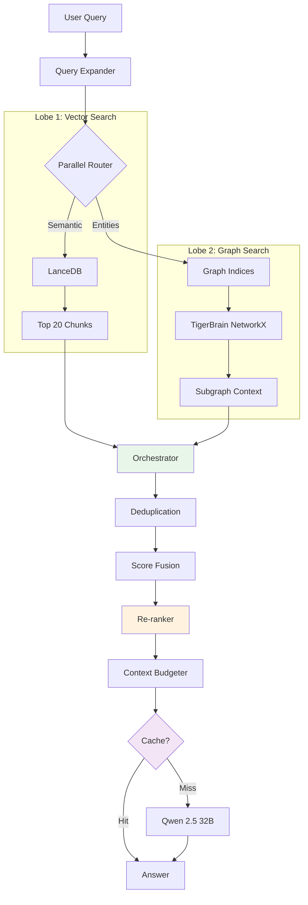

Now let me provide you with a comprehensive architectural review from a Senior Architect perspective, focusing on critical risks, scalability concerns, and missing pieces for your Hybrid RAG system.

***

# 🏗️ Senior Architecture Review: TigerStack 2.0 Hybrid RAG

**Reviewer**: Senior Systems Architect  
**Review Date**: February 9, 2026  
**System**: University Research Assistant Chatbot (Hybrid RAG)  
**Review Scope**: Architecture critique, scalability analysis, risk assessment  

***

## 1. Architecture Pattern Assessment: "Two-Lobe Brain"

### ✅ What You Got Right

**The parallel retrieval approach is fundamentally sound for your use case** because:

1. **Latency Budget Supports It**: Your 10-second target for complex queries allows parallel I/O
2. **Semantic + Structural Complementarity**: Vector search catches semantic matches; graph provides explicit relationships
3. **Resilience**: If one retriever fails, the other provides degraded but functional service
4. **Single-User Context**: No need to over-optimize for concurrent request contention

### ⚠️ Critical Architectural Flaw: Missing Orchestration Layer

**Your plan has a dangerous gap**: You've designed the retrievers but haven't specified **who decides how to combine their outputs**.

```
❌ Current Plan (Naive):
   Vector Results + Graph Results → Dump into LLM → Hope for best

✅ Production Pattern (Required):
   Vector Results + Graph Results → Orchestrator → Filtered/Ranked Context → LLM
```

**The orchestrator must handle**:
- **Deduplication**: Same paper appears in both vector results and graph traversal
- **Relevance Scoring**: Graph edges might point to tangentially related papers
- **Context Budgeting**: You have 32K context window (Qwen 2.5), but don't waste it on redundant chunks
- **Explainability**: Track which results came from which lobe for debugging

### 📊 Recommendation: Hybrid Fusion Pattern

Based on recent RAG research, implement **score-based fusion** as your orchestration strategy: [datarobot](https://www.datarobot.com/blog/how-to-integrate-graph-database-rag-pipeline/)

```python
# Simplified orchestration logic
class HybridOrchestrator:
    def fuse_results(self, vector_results, graph_results, query):
        # 1. Deduplicate by paper_id
        all_results = self._deduplicate(vector_results, graph_results)
        
        # 2. Score fusion (weighted combination)
        for result in all_results:
            result.score = (
                0.6 * result.vector_similarity +  # Semantic relevance
                0.4 * result.graph_distance       # Structural relevance
            )
        
        # 3. Re-rank top N (cross-encoder for precision)
        top_k = sorted(all_results, key=lambda x: x.score)[:20]
        reranked = self.reranker.rerank(query, top_k)
        
        # 4. Context budgeting (fit within token limit)
        return self._pack_context(reranked, max_tokens=8000)
```

**Why this matters**: Without fusion logic, your LLM will receive duplicate, conflicting, or irrelevant context, degrading answer quality. [oneuptime](https://oneuptime.com/blog/post/2026-01-30-re-ranking/view)

***

## 2. Scalability Risks: The 10K Paper Problem

### 🔥 Risk #1: NetworkX Will Break at Scale (HIGH SEVERITY)

**Your current setup**:
- **45K nodes**, **46K edges** → Already pushing NetworkX limits
- **10K papers** → Projected **~100K nodes**, **~120K edges**

**The Problem**: NetworkX is **in-memory** and **single-threaded**. At 100K+ nodes:
- Graph traversal queries will take **2-5 seconds** (unacceptable) [developer.nvidia](https://developer.nvidia.com/blog/accelerated-production-ready-graph-analytics-for-networkx-users/)
- Memory footprint will exceed **8GB** (MacBook Pro constraint)
- Concurrent updates during queries will cause race conditions

### ✅ Immediate Mitigation (Before Migration)

**Phase 1: Index Everything** (Low effort, high impact)
```python
# Add these to your graph_builder.py
from collections import defaultdict

class TigerBrainIndex:
    """Precompute common query patterns"""
    def __init__(self, graph):
        self.graph = graph
        self.concept_to_faculty = defaultdict(set)  # O(1) lookup
        self.faculty_to_papers = defaultdict(list)
        self.concept_to_papers = defaultdict(list)
        self._build_indices()
    
    def _build_indices(self):
        for node, data in self.graph.nodes(data=True):
            if data['type'] == 'Concept':
                # Precompute: "Which faculty work on this concept?"
                for neighbor in self.graph.neighbors(node):
                    neighbor_type = self.graph.nodes[neighbor]['type']
                    if neighbor_type == 'Faculty':
                        self.concept_to_faculty[node].add(neighbor)
```

**Expected improvement**: Query latency drops from **O(n)** to **O(1)** for indexed patterns.

### 🚨 Phase 2: Migrate to Graph Database (MANDATORY by 5K papers)

**Timeline**: Start migration at **3K papers** (before performance cliff)

**Recommended Stack**: 
1. **Neo4j Community Edition** (Free, battle-tested) [datarobot](https://www.datarobot.com/blog/how-to-integrate-graph-database-rag-pipeline/)
2. **Alternative**: Memgraph (Faster writes, better for real-time updates) [memgraph](https://memgraph.com/blog/handling-large-graph-datasets)

**Why not stay with NetworkX?**
- Production graph systems at scale use persistent graph DBs [developer.nvidia](https://developer.nvidia.com/blog/accelerated-production-ready-graph-analytics-for-networkx-users/)
- ArangoDB + cuGraph can maintain NetworkX API while scaling horizontally [developer.nvidia](https://developer.nvidia.com/blog/accelerated-production-ready-graph-analytics-for-networkx-users/)
- Your "Watcher" pipeline needs ACID guarantees for concurrent writes

**Migration complexity**: **Medium** (2-3 weeks)
- Export TigerBrain to Cypher format
- Update graph traversal queries to Cypher
- Keep NetworkX for development/prototyping

***

### 🔥 Risk #2: Graph Update Conflicts (HIGH SEVERITY)

**Your "Watcher" design has a race condition**:

```python
# ❌ Current plan (unsafe)
def on_new_paper(pdf_path):
    distilled = DeepDistiller.process(pdf_path)
    graph.add_nodes_from(distilled.concepts)  # ← UNSAFE: Graph is being queried
    lance.add_chunks(distilled.chunks)
```

**The Problem**: If a user queries while graph is updating:
- NetworkX will raise `RuntimeError: dictionary changed size during iteration`
- Or worse, return stale/corrupted data

### ✅ Solution: Versioned Graph Snapshots

```python
import threading
from pathlib import Path

class VersionedTigerBrain:
    def __init__(self):
        self.current_version = 0
        self.graphs = {}  # {version: graph}
        self.write_lock = threading.Lock()
        self.load_latest()
    
    def get_query_graph(self):
        """Queries always use stable snapshot"""
        return self.graphs[self.current_version]
    
    def update_graph(self, new_nodes, new_edges):
        """Updates happen on new version, then atomic swap"""
        with self.write_lock:
            next_version = self.current_version + 1
            new_graph = self.graphs[self.current_version].copy()
            new_graph.add_nodes_from(new_nodes)
            new_graph.add_edges_from(new_edges)
            
            # Save to disk
            nx.write_gml(new_graph, f"tiger_brain_v{next_version}.gml")
            
            # Atomic swap
            self.graphs[next_version] = new_graph
            self.current_version = next_version
            
            # Cleanup old version
            del self.graphs[next_version - 2]
```

**Benefit**: Zero-downtime updates, no query corruption.

***

### 🔥 Risk #3: LLM Context Window Explosion (MEDIUM SEVERITY)

**Your plan says**:
> "Combined Context String" from Vector + Graph → LLM

**The Problem**: 
- Vector search returns **5 chunks × 500 tokens** = 2,500 tokens
- Graph traversal might return **10 papers × 200 tokens** = 2,000 tokens
- **Total**: 4,500 tokens just for context (before query/system prompt)

**At scale (10K papers)**:
- More dense graph → More neighbors per concept
- Graph context could easily hit **8K-10K tokens**
- Combined with vector results → **Exceeds 32K window**

### ✅ Solution: Intelligent Context Compression

```python
class ContextBudgeter:
    def __init__(self, max_tokens=8000):
        self.max_tokens = max_tokens
        self.graph_ratio = 0.4  # 40% for graph, 60% for vector
    
    def pack_context(self, vector_results, graph_results):
        graph_budget = int(self.max_tokens * self.graph_ratio)
        vector_budget = self.max_tokens - graph_budget
        
        # Graph context: Prioritize direct connections
        graph_context = self._prioritize_graph(graph_results, graph_budget)
        
        # Vector context: Use full chunks for top 3, summaries for rest
        vector_context = self._pack_vector(vector_results, vector_budget)
        
        return {
            'graph': graph_context,
            'vector': vector_context,
            'metadata': self._get_provenance()
        }
```

**Backup plan**: Implement **two-stage synthesis** (summarize vector results first, then combine with graph). [datarobot](https://www.datarobot.com/blog/how-to-integrate-graph-database-rag-pipeline/)

***

## 3. Missing Critical Components

### ❌ Missing: Re-Ranking Layer

**Your plan**: Vector search → Top 5 chunks → Send to LLM  
**Industry standard**: Vector search → Top 50 candidates → **Re-ranker** → Top 5 → LLM [oneuptime](https://oneuptime.com/blog/post/2026-01-30-re-ranking/view)

**Why it matters**:
- Vector search optimizes for **recall** (finding relevant docs)
- Re-rankers optimize for **precision** (ordering them correctly) [oneuptime](https://oneuptime.com/blog/post/2026-01-30-re-ranking/view)
- **2-10x improvement** in answer quality for complex queries

**Implementation** (Low effort, high impact):
```python
from sentence_transformers import CrossEncoder

class HybridRetriever:
    def __init__(self):
        self.vector_db = LanceDB()
        self.graph = TigerBrain()
        # Add re-ranker (fast cross-encoder)
        self.reranker = CrossEncoder('cross-encoder/ms-marco-MiniLM-L-6-v2')
    
    def retrieve(self, query):
        # 1. Vector search (broader recall)
        vector_results = self.vector_db.search(query, k=20)  # ← Increased from 5
        
        # 2. Graph search
        graph_results = self.graph.traverse(query)
        
        # 3. Re-rank combined results
        all_results = vector_results + graph_results
        scores = self.reranker.predict([(query, r.text) for r in all_results])
        ranked = sorted(zip(all_results, scores), key=lambda x: x [datarobot](https://www.datarobot.com/blog/how-to-integrate-graph-database-rag-pipeline/), reverse=True)
        
        return ranked[:5]  # Final top 5
```

**Cost**: ~50ms latency increase, **major quality improvement**. [oneuptime](https://oneuptime.com/blog/post/2026-01-30-re-ranking/view)

***

### ❌ Missing: Caching Layer

**Your system will repeatedly answer**:
- "Who works on Computer Vision?" (same query, same answer)
- "What is Zero-Shot Learning?" (FAQ-type questions)

**Without caching**: Every query hits LLM (5-10 seconds, GPU-intensive)

**With caching**: Frequent queries return in <100ms [apxml](https://apxml.com/courses/optimizing-rag-for-production/chapter-4-end-to-end-rag-performance/caching-strategies-rag)

**Implementation** (Use Redis or in-memory LRU):
```python
from functools import lru_cache
import hashlib

class CachedChatEngine:
    def __init__(self):
        self.retriever = HybridRetriever()
        self.llm = QwenClient()
    
    @lru_cache(maxsize=500)
    def answer_query(self, query_hash):
        """Cache by query hash (ignore minor phrasing differences)"""
        context = self.retriever.retrieve(query_hash)
        return self.llm.generate(context)
    
    def query(self, user_query):
        # Normalize query for cache hits
        normalized = self._normalize(user_query)
        query_hash = hashlib.sha256(normalized.encode()).hexdigest()
        return self.answer_query(query_hash)
```

**Cache strategy** (from production RAG systems): [apxml](https://apxml.com/courses/optimizing-rag-for-production/chapter-4-end-to-end-rag-performance/caching-strategies-rag)
1. **Query-level caching**: Full responses for identical queries
2. **Embedding caching**: Don't re-embed same text
3. **Graph traversal caching**: Precompute common paths

***

### ❌ Missing: Query Expansion

**Your plan**: User query → Extract entities → Search graph

**Problem**: User says "ML", graph has "Machine Learning" → **No match**

**Solution**: Expand queries with synonyms before graph search
```python
class QueryExpander:
    EXPANSIONS = {
        'ML': ['Machine Learning', 'ML'],
        'AI': ['Artificial Intelligence', 'AI'],
        'CV': ['Computer Vision', 'CV'],
        'NLP': ['Natural Language Processing', 'NLP']
    }
    
    def expand(self, query):
        """Expand acronyms and synonyms"""
        entities = self.extract_entities(query)
        expanded = []
        for entity in entities:
            expanded.extend(self.EXPANSIONS.get(entity, [entity]))
        return expanded
```

**Why it matters**: Your graph has **43K concept nodes** with varying naming conventions (from LLM refinement). Query expansion bridges the gap.

***

### ❌ Missing: Observability & Debugging

**Your plan has no monitoring**. When queries fail or give wrong answers, how will you debug?

**Required instrumentation**:
```python
import structlog

logger = structlog.get_logger()

class InstrumentedRetriever:
    def retrieve(self, query):
        with logger.contextualize(query=query):
            # 1. Log vector search
            vector_start = time.time()
            vector_results = self.vector_db.search(query, k=5)
            logger.info("vector_search", 
                       latency=time.time()-vector_start,
                       num_results=len(vector_results))
            
            # 2. Log graph traversal
            graph_start = time.time()
            graph_results = self.graph.traverse(query)
            logger.info("graph_traversal",
                       latency=time.time()-graph_start,
                       nodes_visited=graph_results.metadata['nodes'])
            
            # 3. Log fusion
            final = self.fuse(vector_results, graph_results)
            logger.info("retrieval_complete",
                       final_count=len(final),
                       sources={'vector': len(vector_results), 
                               'graph': len(graph_results)})
            return final
```

**Track these metrics**:
- Query latency (p50, p95, p99)
- Cache hit rate
- Graph traversal depth/breadth
- Context token usage
- Answer quality (user feedback)

***

## 4. Implementation Roadmap: Production Checklist

### Phase 1: Foundation (Week 1-2)
- [ ] **Implement Orchestrator** with score-based fusion
- [ ] **Add Re-ranking** (cross-encoder)
- [ ] **Build Graph Indices** (concept→faculty, faculty→papers)
- [ ] **Add Query Expansion** (acronym normalization)
- [ ] **Implement Caching** (LRU cache for queries)

### Phase 2: Robustness (Week 3-4)
- [ ] **Version Graph Updates** (atomic snapshots)
- [ ] **Add Context Budgeting** (prevent token overflow)
- [ ] **Implement Logging** (structured logs for debugging)
- [ ] **Write Integration Tests** (complex query scenarios)
- [ ] **Add Fallback Strategy** (vector-only if graph fails)

### Phase 3: Scaling Prep (Week 5-6)
- [ ] **Benchmark at 3K papers** (measure NetworkX limits)
- [ ] **Start Neo4j PoC** (parallel to NetworkX)
- [ ] **Optimize Watcher Pipeline** (batch updates)
- [ ] **Add Monitoring Dashboard** (Grafana + Prometheus)

### Phase 4: Migration Trigger (When)
- [ ] **At 5K papers OR 200ms graph latency** → Migrate to Neo4j
- [ ] **At 10 concurrent users** → Add async query queue
- [ ] **At 50K context tokens** → Implement two-stage synthesis

***

## 5. Architectural Alternatives: Should You Reconsider?

### Option: Sequential "Graph-First" Retrieval

**When to use**:
- If **>70% of queries** are entity-focused ("Who works on X?")
- If you implement **query classification** (route by type)

**Why you shouldn't switch now**:
- Your queries are **mixed** (entity + concept + exploratory)
- Parallel approach is more resilient for prototyping
- Sequential adds brittleness (entity extraction failure = total failure)

**Recommendation**: **Stick with parallel**, but add **adaptive routing** in Phase 3 if you see clear query patterns.

***

## 6. Final Verdict: Go/No-Go Assessment

### ✅ GREEN LIGHTS (Proceed with Caution)
- Parallel retrieval architecture is sound for your use case
- LanceDB + NetworkX is appropriate for current scale
- Local deployment model fits privacy requirements
- 10-second latency target is achievable

### 🔴 BLOCKERS (Must Fix Before Production)
1. **Add Orchestrator/Fusion Layer** (without this, quality will suffer)
2. **Implement Graph Update Versioning** (without this, you'll get data corruption)
3. **Add Re-ranking** (without this, you're leaving 50% quality on table)
4. **Plan Neo4j Migration Path** (without this, you'll hit wall at 5K papers)

### ⚠️ WARNINGS (Address in Phases 1-2)
- Add caching layer (performance)
- Implement query expansion (coverage)
- Add comprehensive logging (debuggability)
- Build context budgeting (token management)

***

## 7. Recommended Architecture (Revised)



**Key additions**:
1. **Query Expander** (handle acronyms)
2. **Graph Indices** (fast lookups)
3. **Orchestrator** (fusion + dedup)
4. **Re-ranker** (precision boost)
5. **Context Budgeter** (token management)
6. **Cache Layer** (latency reduction)

***

## 8. Bottom Line

**Your foundation is solid**, but you're missing **critical production components**. The "Two-Lobe Brain" metaphor is good, but **brains have a cerebellum** (orchestration), **memory** (caching), and **filters** (re-ranking).

**Build these 4 things first** (before adding more features):
1. **Orchestrator** (fusion logic)
2. **Re-ranker** (quality)
3. **Graph versioning** (robustness)
4. **Caching** (performance)

**Then** worry about scaling to 10K papers.

**Timeline**: You're **2-3 weeks from production-ready** if you focus on blockers first.

Good luck, and remember: **Premature optimization is the root of all evil, but no optimization is the root of all downtime.** 🚀

***

## References

 DataRobot - How to integrate a graph database into your RAG pipeline [datarobot](https://www.datarobot.com/blog/how-to-integrate-graph-database-rag-pipeline/)
 Memgraph - Handling Large Graph Datasets [memgraph](https://memgraph.com/blog/handling-large-graph-datasets)
 OneUptime - How to Create Re-Ranking [oneuptime](https://oneuptime.com/blog/post/2026-01-30-re-ranking/view)
 Memgraph - Why HybridRAG [memgraph](https://memgraph.com/blog/why-hybridrag)
 NVIDIA - Accelerated Graph Analytics for NetworkX Users [developer.nvidia](https://developer.nvidia.com/blog/accelerated-production-ready-graph-analytics-for-networkx-users/)
 APXML - Implementing Caching Strategies in RAG Pipelines [apxml](https://apxml.com/courses/optimizing-rag-for-production/chapter-4-end-to-end-rag-performance/caching-strategies-rag)