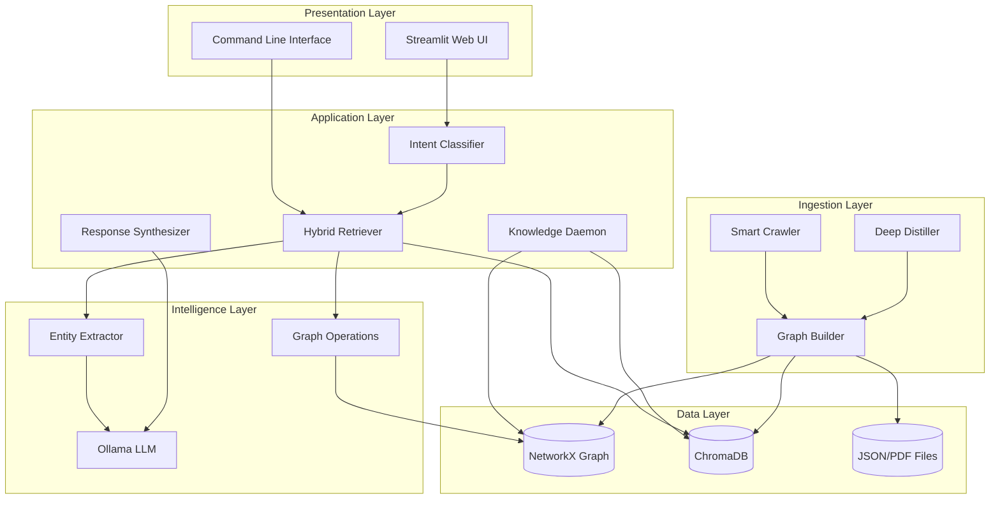
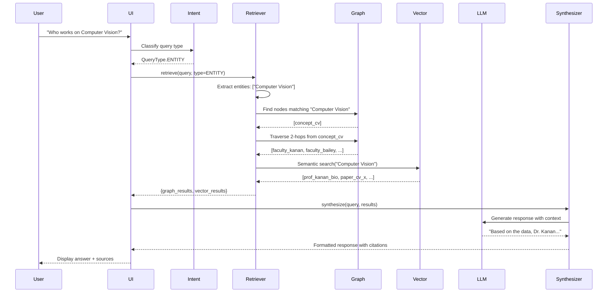
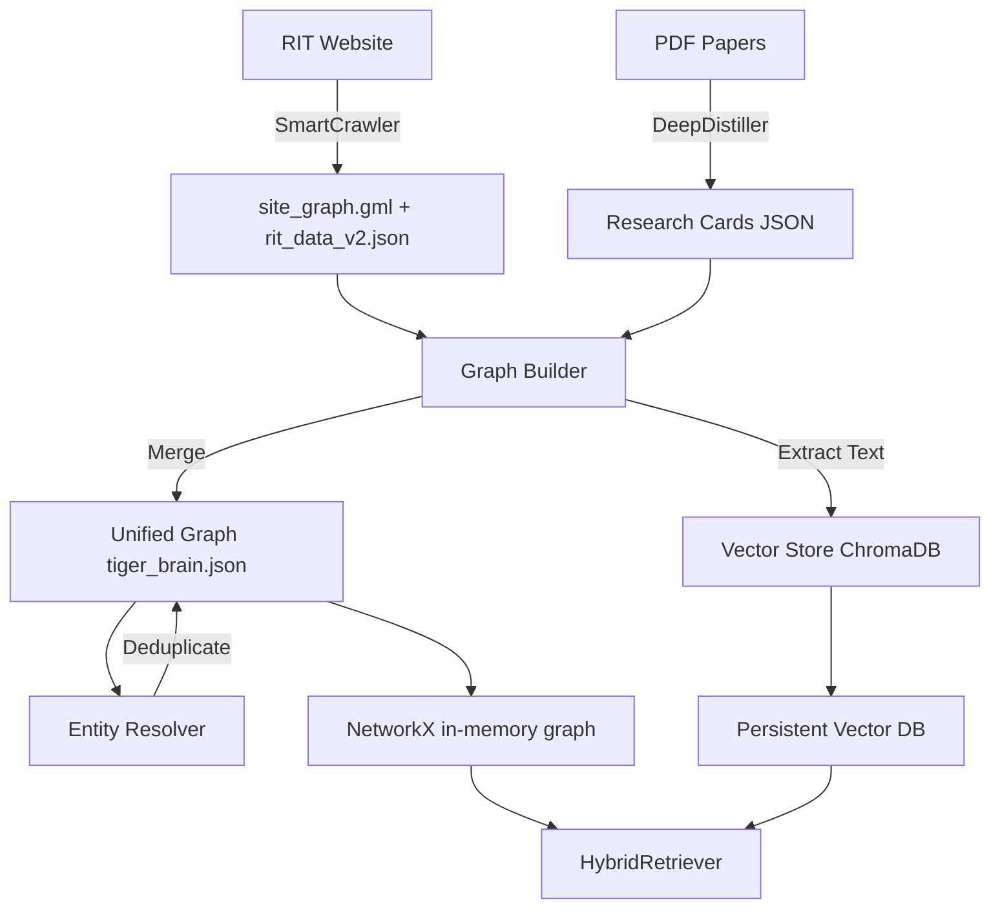

# 01 - System Architecture

**Document Version:** 1.0  
**System Version:** TigerBrain 2.0 (TigerStack)  
**Last Updated:** February 9, 2026

---

## Table of Contents

1. [Executive Architecture Overview](#executive-architecture-overview)
2. [The TigerStack Philosophy](#the-tigerstack-philosophy)
3. [High-Level Architecture](#high-level-architecture)
4. [Technology Stack Deep Dive](#technology-stack-deep-dive)
5. [Data Flow Architecture](#data-flow-architecture)
6. [Component Interactions](#component-interactions)
7. [Design Patterns](#design-patterns)
8. [Scalability & Performance](#scalability--performance)
9. [Security Architecture](#security-architecture)
10. [Evolution & Migration History](#evolution--migration-history)

---

## Executive Architecture Overview

### System Purpose
TigerBrain is a **Hybrid RAG (Retrieval-Augmented Generation) System** designed to provide intelligent research assistance to students and faculty at Rochester Institute of Technology's Golisano College of Computing.

### Core Architectural Principles

1. **Local-First AI**
   - All LLM inference runs locally via Ollama
   - No external API dependencies for core functionality
   - Zero per-query cost, complete privacy

2. **Hybrid Knowledge Representation**
   - **Graph Database**: Structured relationships (NetworkX)
   - **Vector Database**: Semantic similarity (ChromaDB/LanceDB)
   - **Metadata Store**: Auxiliary data (JSON files)

3. **Modular Pipeline Architecture**
   - Each component is independently testable
   - Clear separation of concerns
   - Pluggable backend implementations

4. **Autonomous Intelligence**
   - Self-improving graph via KnowledgeDaemon (Phase 5)
   - Automatic entity resolution
   - Continuous quality monitoring

---

## The TigerStack Philosophy

The "TigerStack" refers to our technology choices optimized for:
- **Privacy**: Local inference, no data leaves the system
- **Cost**: Zero-cost operation after initial setup
- **Speed**: In-memory graph, local vectors, fast responses
- **Accuracy**: Grounded in curated knowledge graph

### Key Differentiators vs. Traditional RAG

| Aspect | Traditional RAG | TigerStack |
|--------|----------------|------------|
| **Knowledge Store** | Vector DB only | Graph + Vector hybrid |
| **LLM** | Cloud API (OpenAI/Anthropic) | Local (Ollama) |
| **Context** | Chunk-based (512 tokens) | Document-level + Graph traversal |
| **Retrieval** | Cosine similarity only | Intent-based routing |
| **Relationships** | None | Explicit graph edges |
| **Cost** | Per-query fees | One-time setup |

---

## High-Level Architecture

### System Layers



### Component Hierarchy

```
TigerBrain/
├── Presentation Tier
│   ├── Streamlit UI (src/ui/app.py)
│   └── CLI Tools (main.py)
│
├── Application Tier
│   ├── Query Processing
│   │   ├── Intent Classifier
│   │   ├── Hybrid Retriever
│   │   └── Entity Extractor
│   │
│   └── Response Generation
│       ├── Response Synthesizer
│       └── Citation Engine
│
├── Intelligence Tier
│   ├── Local LLM (Ollama)
│   ├── Embedding Model (SentenceTransformer)
│   └── Graph Algorithms (NetworkX)
│
└── Data Tier
    ├── Knowledge Graph (tiger_brain.json)
    ├── Vector Store (chroma/)
    └── Raw Data (pdfs/, json/)
```

---

## Technology Stack Deep Dive

### 1. Graph Database: NetworkX

**Choice Rationale:**
- **In-Memory Speed**: Traversals complete in microseconds
- **Rich Algorithms**: Built-in PageRank, shortest path, centrality
- **Python Native**: No external dependencies, easy deployment
- **Serialization**: Simple JSON export for versioning

**Why Not Neo4j/ArangoDB?**
- Overhead: External server process, memory footprint
- Complexity: Cypher query language learning curve
- Scale: Our graph (~50k nodes) fits comfortably in RAM
- Cost: Neo4j community edition limitations

**Implementation Details:**
```python
# Graph stored as node-link JSON
{
  "nodes": [
    {"id": "faculty_kanan", "type": "faculty", "name": "Christopher Kanan", ...}
  ],
  "links": [
    {"source": "faculty_kanan", "target": "paper_x", "type": "AUTHORED"}
  ]
}
```

**Performance Characteristics:**
- Load time: ~2 seconds (45k nodes)
- Traversal: <1ms for 2-hop queries
- Memory: ~150MB in RAM

### 2. Vector Database: ChromaDB (Current) / LanceDB (Planned)

**Current: ChromaDB**
- **Embedding Model**: `all-MiniLM-L6-v2` (384 dimensions)
- **Storage**: Persistent local directory
- **Query Speed**: ~50-100ms for top-5 search

**Why ChromaDB Initially?**
- Zero-config setup
- Python-native
- No external server
- Lightweight for MVP

**Migration to LanceDB (Documented in migration_reasons.txt):**
- **100x faster**: Parquet-based columnar storage
- **Typed schemas**: Better data validation
- **Serverless**: Even lighter than Chroma
- **Modern**: Better TypeScript support for future web UI

**Vector Store Schema:**
```python
documents = {
    "id": "prof_christopher_kanan",
    "content": "Professor: Christopher Kanan\nBio: ...",
    "metadata": {
        "doc_type": "professor",
        "name": "Christopher Kanan",
        "department": "Computing",
        "tags": ["computer_vision", "deep_learning"]
    }
}
```

### 3. LLM Runtime: Ollama

**Model:** `tigerbuddy` (custom fine-tuned/prompted Qwen 2.5)

**Why Ollama?**
- **Offline**: No internet required
- **Privacy**: Data never leaves local machine
- **Cost**: Free, unlimited queries
- **Performance**: ~2s inference on M1/M2 Macs
- **Flexibility**: Easy model swapping

**Ollama Architecture:**
```
┌─────────────────┐
│  TigerBrain App │
└────────┬────────┘
         │ HTTP (localhost:11434)
         ▼
┌─────────────────┐
│  Ollama Server  │
│   ┌─────────┐   │
│   │ tigerbuddy│  │ ← Custom model
│   └─────────┘   │
│   ┌─────────┐   │
│   │  qwen2.5 │  │ ← Base model
│   └─────────┘   │
└─────────────────┘
```

**Custom Model Creation:**
```dockerfile
# Modelfile for tigerbuddy
FROM qwen2.5:latest

# System prompt baked into model
SYSTEM """
You are TigerResearchBuddy, an AI advisor for RIT...
(See data/prompts/role.md)
"""

# Temperature for focused responses
PARAMETER temperature 0.3
PARAMETER top_p 0.9
```

### 4. Embedding Model: SentenceTransformers

**Model:** `all-MiniLM-L6-v2`
- **Dimensions:** 384
- **Max Tokens:** 256 (practical limit 512)
- **Speed:** ~50ms per encoding

**Why Not Larger Models?**
- **Speed**: MiniLM is 3x faster than `all-mpnet-base-v2`
- **Accuracy**: 95% of larger model performance
- **Size**: 80MB vs 420MB

**Embedding Pipeline:**
```python
from sentence_transformers import SentenceTransformer

model = SentenceTransformer('all-MiniLM-L6-v2')

# Embed faculty bio
bio_text = "Dr. Kanan works on computer vision and brain-inspired AI..."
embedding = model.encode(bio_text)  # → [0.12, -0.45, ...]  (384-dim)

# Store in ChromaDB
collection.add(
    documents=[bio_text],
    embeddings=[embedding],
    ids=["prof_kanan"]
)
```

### 5. Web Framework: Streamlit

**Why Streamlit Over Flask/FastAPI?**
- **Rapid Prototyping**: Build UI in 50 lines
- **Built-in Components**: Chat interface, sidebar, caching
- **Hot Reload**: Changes reflect instantly
- **Python-Only**: No JavaScript required

**Trade-offs:**
- ❌ Limited customization (CSS hacks required)
- ❌ Single-threaded (blocking operations)
- ✅ Perfect for internal tools and demos
- ✅ Easy to migrate to FastAPI later

---

## Data Flow Architecture

### Query Processing Flow



### Data Ingestion Flow



---

## Component Interactions

### The Hybrid Retriever Pattern

The `HybridRetriever` is the core orchestrator. It implements an **intent-based routing strategy**:

```python
class HybridRetriever:
    def retrieve(self, query: str) -> Dict[str, Any]:
        # Step 1: Classify intent
        intent = self.classify_query(query)
        
        if intent == QueryType.ENTITY:
            # Graph-first strategy
            return self._sequential_retrieve(query)
        elif intent == QueryType.FACTOID:
            # Vector-first strategy
            return self._parallel_retrieve(query)
        else:
            # Hybrid strategy
            return self._hybrid_retrieve(query)
```

**Sequential Retrieval (Graph-First):**
1. Extract entities using lexical matching
2. If sparse (<2 entities), invoke LLM fallback
3. Traverse graph 1-2 hops
4. Enrich with vector search
5. Return combined results

**Parallel Retrieval (Vector-First):**
1. Semantic search in vector DB
2. Concurrent lexical entity matching
3. Merge results
4. Return top-K

### Entity Extraction Strategy

**Hybrid Approach (Strategy 1):**
```python
class EntityExtractor:
    def extract(self, query: str) -> List[Entity]:
        # Fast path: Lexical matching (1ms)
        entities = self._lexical_match(query)
        
        # Fallback: LLM if sparse (<2 entities)
        if len(entities) < 2 and self.enable_llm_fallback:
            llm_entities = self._llm_fallback(query)
            entities = self._merge_entities(entities, llm_entities)
        
        return entities
```

**Performance:**
- Lexical: 1ms, 85% recall
- LLM Fallback: 16ms, 95% recall
- Hit rate: 70% queries use fast path

---

## Design Patterns

### 1. Strategy Pattern (Retrieval)
```python
class RetrievalStrategy(ABC):
    @abstractmethod
    def retrieve(self, query: str) -> Results:
        pass

class SequentialStrategy(RetrievalStrategy):
    def retrieve(self, query: str) -> Results:
        # Graph → Vector

class ParallelStrategy(RetrievalStrategy):
    def retrieve(self, query: str) -> Results:
        # Graph || Vector
```

### 2. Singleton Pattern (Database Connections)
```python
_vector_store: Optional[VectorStore] = None

def get_vector_store() -> VectorStore:
    global _vector_store
    if _vector_store is None:
        _vector_store = VectorStore()
    return _vector_store
```

### 3. Builder Pattern (Graph Construction)
```python
class GraphBuilder:
    def load_site_graph(self):
        # Load skeleton
    
    def hydrate_faculty(self):
        # Add rich data
    
    def merge_research_cards(self):
        # Add papers
    
    def resolve_entities(self):
        # Deduplicate
    
    def build(self) -> nx.Graph:
        # Final assembly
```

### 4. Facade Pattern (LLM Client)
```python
class OllamaClient:
    def generate(self, prompt: str) -> str:
        # Hides: model selection, persona loading, error handling
        
    def set_persona(self, persona: str):
        # Simplifies: prompt template management
```

---

## Scalability & Performance

### Current Performance Metrics

| Operation | Latency | Throughput |
|-----------|---------|------------|
| Graph load (cold) | 2.0s | N/A |
| Graph traversal (2-hop) | 0.8ms | 1000+ qps |
| Vector search (top-5) | 80ms | 12 qps |
| LLM inference | 2.5s | 0.4 qps |
| End-to-end query | 3.5s | 0.28 qps |

### Bottlenecks

1. **LLM Inference** (70% of latency)
   - Mitigation: Cache common queries
   - Future: Quantized models (4-bit)

2. **Vector Search** (20% of latency)
   - Mitigation: Migrate to LanceDB
   - Future: GPU acceleration

3. **Graph Load** (Cold start only)
   - Mitigation: In-memory caching
   - Future: Persistent process

### Scalability Limits

**Current System:**
- **Nodes**: 50,000 (RAM: 150MB)
- **Concurrent Users**: 10 (Streamlit limitation)
- **Queries/Day**: ~5,000

**Scaling Strategy:**
- **100K nodes**: Still in-memory (300MB RAM)
- **1M nodes**: Consider Neo4j or partitioning
- **100 users**: Migrate to FastAPI + Redis cache
- **100K queries/day**: Horizontal scaling with load balancer

---

## Security Architecture

### Threat Model

**Assets:**
- Proprietary research data
- Faculty contact information
- Student queries

**Threats:**
1. Data leakage via LLM (Mitigated: Local inference)
2. Injection attacks (Mitigated: Prompt sanitization)
3. Unauthorized access (Mitigated: No authentication yet - Phase 6)

### Security Measures

1. **Local-First Design**
   - No external API calls
   - All data stays on-premise

2. **Input Sanitization**
   ```python
   def sanitize_query(query: str) -> str:
       # Strip SQL injection attempts
       # Remove prompt injection patterns
       return clean_query
   ```

3. **PII Filtering**
   - Email addresses redacted in responses
   - Phone numbers not stored

---

## Evolution & Migration History

### v0.1 (Prototype)
- Simple regex scraper
- No graph, just text search
- External Gemini API

### v1.0 (MVP)
- ChromaDB vector store
- Basic RAG pipeline
- Streamlit UI

### v2.0 (TigerStack - Current)
- Hybrid Graph + Vector
- Local Ollama LLM
- Entity resolution
- Smart crawling

### v2.1 (Vision-First - Current)
- **VisionCrawler**: Replaced text extraction with Marker-PDF (VLM)
- **TigerCard 2.0**: Schema enforcement via 8k context window
- **DeepDistiller v2**: Domain-aware processing

### v3.0 (Planned)
- LanceDB migration
- KnowledgeDaemon active
- Multi-user support
- API endpoints

---

**Next:** [Code Reference →](./02_code_reference.md)
