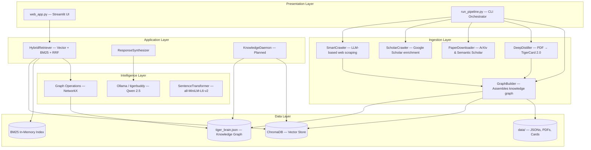
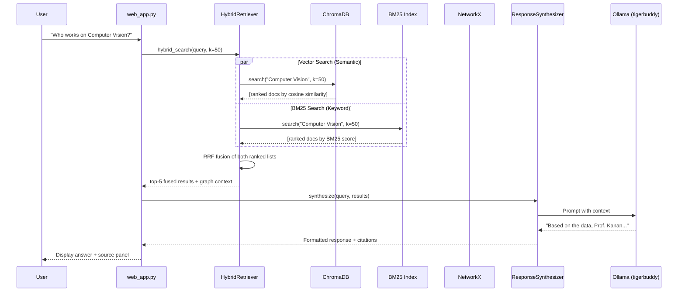
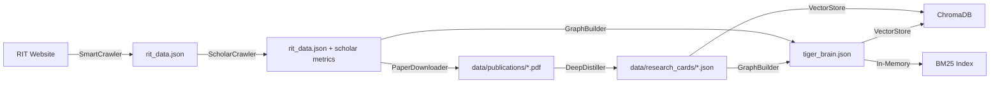

# 01 - System Architecture

**Document Version:** 2.0  
**System Version:** TigerBrain 2.2 (Fast-by-Default)  
**Last Updated:** February 23, 2026

---

## Table of Contents

1. [Executive Architecture Overview](#executive-architecture-overview)
2. [The TigerStack Philosophy](#the-tigerstack-philosophy)
3. [High-Level System Diagram](#high-level-system-diagram)
4. [Technology Stack Deep Dive](#technology-stack-deep-dive)
5. [Data Flow Architecture](#data-flow-architecture)
6. [Component Interactions](#component-interactions)
7. [Design Patterns](#design-patterns)
8. [Scalability & Performance](#scalability--performance)
9. [Security Architecture](#security-architecture)
10. [Version History](#version-history)

---

## Executive Architecture Overview

### System Purpose
TigerBrain is a **Hybrid RAG (Retrieval-Augmented Generation) System** designed to provide intelligent research assistance to students and faculty at Rochester Institute of Technology's Golisano College of Computing.

### Core Architectural Principles

1. **Local-First AI**
   - All LLM inference runs locally via Ollama.
   - No external API dependencies for core functionality.
   - Zero per-query cost; complete data privacy.

2. **Fast-by-Default Processing**
   - **Digital-First:** Prioritizes extracting digital text layers from PDFs; OCR is a fallback.
   - **Apple Silicon Optimized:** MPS-accelerated Surya OCR and layout analysis.
   - **Smart Gating:** Uses heuristics and lightweight models (GMFT) to avoid heavy computation when possible.

3. **Hybrid Knowledge Representation**
   - **Graph Database:** Structured relationships (NetworkX / `tiger_brain.json`)
   - **Vector Database:** Semantic similarity (ChromaDB)
   - **Keyword Index:** BM25 for exact-term matching

4. **Modular Pipeline Architecture**
   - Single orchestration entry point: `run_pipeline.py`
   - Configurable "Restricted" (Dev) and "Full" (Prod) modes via `CrawlConfig`
   - Data isolation: test data in `data/restricted/`, production in `data/`
   - Each component is independently testable and each stage is skippable

5. **Autonomous Intelligence (In-Progress)**
   - Self-improving graph via KnowledgeDaemon (Phase 5 — planned)
   - Automatic entity resolution with canonical ID system
   - Continuous quality monitoring

---

## The TigerStack Philosophy

**Four core values:**
- **Privacy**: Local inference; no data leaves the system.
- **Cost**: Zero-cost operation after initial setup.
- **Speed**: In-memory graph, local vectors, fast responses.
- **Accuracy**: Grounded in a curated knowledge graph; refuses to hallucinate.

### Key Differentiators vs. Traditional RAG

| Aspect | Traditional RAG | TigerStack |
|--------|----------------|------------|
| **Knowledge Store** | Vector DB only | Graph + Vector + BM25 hybrid |
| **LLM** | Cloud API (OpenAI/Anthropic) | Local (Ollama) — zero cost |
| **Context** | Chunk-based (512 tokens) | Document-level + Graph traversal |
| **Retrieval** | Cosine similarity only | RRF fusion of Vector + BM25 + optional Graph |
| **Relationships** | None | Explicit graph edges (AUTHORED, MENTIONS, INTERESTED_IN) |
| **Cost** | Per-query API fees | One-time setup only |

---

## High-Level System Diagram

### System Layers



### Component Hierarchy

```
TigerBrain/
├── Presentation Tier
│   ├── Streamlit UI (web_app.py)
│   └── CLI Pipeline Runner (run_pipeline.py)
│
├── Application Tier
│   ├── Query Processing
│   │   └── HybridRetriever (Vector + BM25 via RRF)
│   └── Response Generation
│       └── ResponseSynthesizer (LLM formatting + citations)
│
├── Intelligence Tier
│   ├── Local LLM (Ollama — tigerbuddy/Qwen 2.5)
│   ├── Embedding Model (all-MiniLM-L6-v2)
│   └── Graph Algorithms (NetworkX — traversal, shortest path)
│
└── Data Tier
    ├── Knowledge Graph (data/tiger_brain.json)
    ├── Vector Store (data/chroma/)
    ├── Research Cards (data/research_cards/)
    └── Raw Data (data/publications/, data/restricted/)
```

---

## Technology Stack Deep Dive

### 1. Knowledge Graph: NetworkX

**Choice Rationale:**
- In-memory speed — traversals complete in microseconds.
- Rich built-in algorithms: PageRank, shortest path, centrality.
- Python-native, zero external dependencies.
- Simple JSON export for versioning and portability.

**Why Not Neo4j/ArangoDB?**
- Our graph (~50k nodes, ~46k edges) fits comfortably in RAM.
- External server process adds deployment complexity.
- NetworkX is sufficient until 5k papers (p95 latency trigger: >200ms).

**Graph Schema:**
```json
{
  "nodes": [{"id": "faculty_kanan", "type": "faculty", "name": "Christopher Kanan", "dept": "Computing"}],
  "links": [{"source": "faculty_kanan", "target": "paper_x", "type": "AUTHORED"}]
}
```

**Performance:**
- Load time: ~2s (45k nodes)
- Traversal: <1ms for 2-hop queries
- RAM footprint: ~150MB

### 2. Vector Database: ChromaDB

**Current Setup:**
- Embedding Model: `all-MiniLM-L6-v2` (384 dimensions)
- Storage: Persistent local directory at `data/chroma/`
- Query speed: ~50–100ms for top-5 semantic search

**Why ChromaDB (Currently):**
- Zero-config setup, Python-native, no external server.
- Upsert support handles re-indexing without duplicates.
- Adequate for <10k documents.

**Planned Migration → LanceDB:**
- 100× faster columnar storage (Apache Lance format)
- Better typed schemas and metadata filtering
- Serverless — even lighter than ChromaDB
- See `docs/project_journey.md` §9 for migration rationale.

### 3. BM25 Keyword Index

- Loaded in-memory from the same document corpus as ChromaDB.
- Combined with vector results using **Reciprocal Rank Fusion (RRF)**.
- Provides exact-term matching that semantic embeddings miss (e.g., specific professor names, acronyms).

### 4. LLM Runtime: Ollama

**Model:** `tigerbuddy` — a customized Qwen 2.5 with baked-in system prompt.

**Why Ollama:**
- Offline, privacy-preserving, zero API cost.
- ~2s inference on Apple Silicon (M1/M2/M3).
- Easy model swapping — upgrade to Llama 3 or Mistral with one command.

**Personas (switchable at runtime):**
- `tiger` — Encouraging, student-friendly tone.
- `analyzer` — Technical, data-focused.
- `critique` — Critical reviewer; challenges assumptions.

### 5. PDF Processing: DocumentProcessor (v2.2)

**Engine: `apple_fast` (default)**
Three-stage smart gate that avoids expensive computation whenever possible:

| Gate | Trigger | Action |
|------|---------|--------|
| Digital Gate | PDF has selectable text (>50 chars) | Extract directly — milliseconds |
| Table Gate | Heuristic: table-like structure detected | Surya Layout Analysis → GMFT extraction |
| OCR Fallback | No digital text found | Surya OCR on MPS backend |

**Benchmark vs. legacy Marker-PDF:**
- Digital PDFs: **245× faster** (0.018s vs 4.42s per page)
- Mixed PDFs: **52× faster** (0.135s vs 7.02s per page)

### 6. Web Framework: Streamlit

**Why Streamlit:**
- Rapid prototyping — chat interface, sidebar, caching in ~50 lines.
- `@st.cache_resource` for loading heavy backend components once.
- Real-time spinner for long operations.

**Known Limitations:**
- Single-threaded — not suitable for >10 concurrent users.
- Limited CSS customizability.
- Future path: migrate to FastAPI + React when multi-user support is needed.

---

## Data Flow Architecture

### Query Processing Flow



### Data Ingestion Flow



---

## Component Interactions

### Hybrid Retrieval Pattern

The `HybridRetriever` implements **Reciprocal Rank Fusion (RRF)** to combine vector and keyword signals:

```python
class HybridRetriever:
    def hybrid_search(self, query: str, k: int = 50) -> List[Dict]:
        # 1. Vector Search (ChromaDB) — semantic understanding
        vector_results = self._search_vector(query, k=50)

        # 2. Keyword Search (BM25) — exact-term matching
        bm25_results = self._search_bm25(query, k=50)

        # 3. Reciprocal Rank Fusion
        # Score = Σ [1 / (60 + rank)] across both rankers
        combined = self._apply_rrf(vector_results, bm25_results)

        return combined[:k]
```

**Why RRF over weighted scores?**
Vector similarity (0–1) and BM25 scores are on incompatible scales. RRF uses rank positions — making fusion safe and parameter-free.

### Entity Resolution Pipeline

```python
class EntityResolver:
    def resolve_faculty(self, name: str) -> Optional[str]:
        # Tier 1: Exact string match or highly confident fuzzy match (>95%)
        # Tier 2 (Relational-Aware): Ambiguous fuzzy match (80-95%) -> check graph context
        #   - Calculate Jaccard similarity of NetworkX 1-hop neighborhoods
        #   - Merge if Jaccard >= 0.4
        # Tier 3 (Legacy): Phonetic heuristic fallback if no graph is attached
        return canonical_id  # e.g., "faculty_christopher_kanan"
```

Canonical ID system prevents the classic "C. Kanan" + "Christopher Kanan" duplication problem that caused papers to be attributed to two different nodes.

---

## Design Patterns

### Strategy Pattern (Retrieval)
```python
class RetrievalStrategy(ABC):
    @abstractmethod
    def retrieve(self, query: str) -> Results: pass

class VectorBM25Strategy(RetrievalStrategy):  # Primary — RRF hybrid
class SequentialGraphStrategy(RetrievalStrategy):  # For entity queries
```

### Singleton Pattern (Database Connections)
```python
_vector_store: Optional[VectorStore] = None

def get_vector_store() -> VectorStore:
    global _vector_store
    if _vector_store is None:
        _vector_store = VectorStore()
    return _vector_store
```

### Builder Pattern (Graph Construction)
```python
class GraphBuilder:
    def load_site_graph(self): ...    # Structural skeleton from SmartCrawler
    def load_faculty_data(self): ...  # Rich profiles from rit_data.json
    def merge_research_cards(self): ... # Paper nodes + author links
    def export(self): ...             # Serialize to tiger_brain.json
```

### Facade Pattern (LLM Client)
```python
class OllamaClient:
    def generate(self, prompt: str, context: str = None) -> str: ...
    def set_persona(self, persona: str): ...  # tiger | analyzer | critique
```

---

## Scalability & Performance

### Current Performance Metrics

| Operation | Latency | Notes |
|-----------|---------|-------|
| Graph cold load | ~2.0s | 45k nodes from tiger_brain.json |
| Graph traversal (2-hop) | <1ms | In-memory NetworkX |
| Vector search (top-5) | ~80ms | ChromaDB similarity |
| BM25 search (top-50) | <5ms | In-memory |
| LLM inference (tigerbuddy) | 2.5–45s | Depends on context and quantization |
| End-to-end query | 3–12s | With cached graph, q4_0 quantization |

### Bottlenecks

1. **LLM Inference (70% of latency)**
   - Fix: Use quantized models (`qwen2.5:7b-q4_0`) — 2–3× faster.
   - Fix: `@st.cache_resource` — components loaded once per session.

2. **Vector Search (20% of latency)**
   - Future: Migrate to LanceDB (100× faster local search).

3. **Graph Cold Start**
   - Fix: In-memory caching after first load.

### Scalability Thresholds

| Papers | Graph Tech | Users | Infra |
|--------|-----------|-------|-------|
| Current (~1k) | NetworkX | 1–10 | Streamlit local |
| 3k | NetworkX + benchmark | 10 | Streamlit |
| 5k | **Migrate to Memgraph** | 10 | Streamlit |
| 10k+ | Memgraph / Neo4j | 50+ | FastAPI + load balancer |

---

## Security Architecture

**Assets:** Faculty research data, contact information, student queries.

**Approach (Local-First by Design):**
- No external API calls for core inference — data never leaves the machine.
- No authentication implemented yet (single-user, local deployment).
- Input sanitization: query cleaning before LLM context injection.
- PII filtering: email addresses not surfaced in generated responses.

**Planned (Phase 6):**
- User authentication for lab server deployment.
- Role-based access control.
- Audit logging for queries.

---

## Version History

| Version | Date | Key Changes |
|---------|------|-------------|
| v0.1 | Early 2026 | Regex scraper, external Gemini API, no graph |
| v1.0 | Feb 2026 | ChromaDB vector store, basic RAG pipeline, Streamlit UI |
| v2.0 (TigerStack) | Feb 9, 2026 | Hybrid Graph+Vector, local Ollama LLM, entity resolution, SmartCrawler |
| v2.1 (Vision-First) | Feb 10–13, 2026 | Marker-PDF, TigerCard 2.0 schema, 8k context prompting |
| v2.2 (Fast-by-Default) | Feb 16, 2026 | apple_fast engine, MPS Surya, GMFT tables, 245× PDF speedup |
| v2.3 (Current Dev) | Feb 20, 2026 | Full pipeline runner (run_pipeline.py), DB logging, code quality pass |

---

**Next:** [Code Reference →](./02_code_reference.md)
