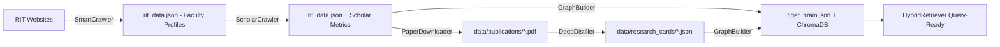

# 05 - Data Pipeline

**Last Updated:** February 23, 2026  
**Purpose:** Deep dive into all six stages of the data ingestion pipeline

---

## Table of Contents

1. [Pipeline Overview](#pipeline-overview)
2. [Stage 1: Web Crawling (SmartCrawler)](#stage-1-web-crawling-smartcrawler)
3. [Stage 2: Scholar Enrichment](#stage-2-scholar-enrichment)
4. [Stage 3: Paper Download](#stage-3-paper-download)
5. [Stage 4: PDF Distillation (DeepDistiller)](#stage-4-pdf-distillation-deepdistiller)
6. [Stage 5: Vector Store Indexing](#stage-5-vector-store-indexing)
7. [Stage 6: Knowledge Graph Assembly](#stage-6-knowledge-graph-assembly)
8. [Entity Resolution](#entity-resolution)
9. [Quality Assurance](#quality-assurance)

---

## Pipeline Overview

The TigerBrain data pipeline transforms raw, unstructured data (RIT web pages, academic PDFs) into a queryable hybrid knowledge system.

### Architecture Diagram



### Pipeline Entry Point

Everything is orchestrated by **`run_pipeline.py`** — the single command to run any subset of stages:

```bash
# Full run (all 6 stages)
python run_pipeline.py --mode full

# Development run (restricted — ~10 profiles, fast)
python run_pipeline.py --mode restricted

# Resume from distillation (stages 1–3 already done)
python run_pipeline.py --skip-crawl --skip-scholar --skip-download

# Just rebuild the index and graph after adding papers manually
python run_pipeline.py --skip-crawl --skip-scholar --skip-download --skip-distill
```

### Stage Summary

| Stage | Script/Module | Input | Output |
|-------|--------------|-------|--------|
| 1. Crawl | `src/crawlers/smart_crawler.py` | RIT CS website | `rit_data.json` |
| 2. Scholar | `src/crawlers/scholar_crawler.py` | `rit_data.json` | `rit_data.json` (enriched) |
| 3. Download | `src/crawlers/paper_downloader_v3.py` | `rit_data.json` | `data/publications/*.pdf` |
| 4. Distill | `src/processors/pdf_distiller.py` | `*.pdf` | `data/research_cards/*.json` |
| 5. Index | `src/database/vector_store.py` | `rit_data.json` + `*.json` cards | `data/chroma/` + BM25 |
| 6. Graph | `src/knowledge_graph/graph_builder.py` | All above | `data/tiger_brain.json` |

---

## Stage 1: Web Crawling (SmartCrawler)

### Purpose
Extract faculty profiles from RIT websites **without brittle CSS selectors**.

### Key Innovation: LLM-Powered Semantic Parsing
The `SmartCrawler` fetches raw HTML and asks an LLM to extract structured JSON:
```python
prompt = """
Extract faculty profile information from this HTML text.
Return ONLY valid JSON matching this schema:
{"name": "...", "title": "...", "bio": "...", "research_interests": [...], "email": "..."}

HTML Content:
{text[:4000]}
"""
```
This works even when RIT changes `div.bio` to `span.about` — the LLM reads context, not selectors.

### Crawl Algorithm (BFS)
```python
def crawl_bfs(self):
    queue = [self.start_url]
    while queue and profiles_found < self.max_profiles:
        url = queue.pop(0)
        html = self._fetch_page(url)
        links = self._extract_links(html, url)
        queue.extend(links)
        
        if self._is_faculty_page(url):
            profile = self.extract_profile_data(url, html)
            if profile:
                faculty_data.append(profile)
        
        time.sleep(CRAWL_DELAY)   # Polite crawling
```

### Output
**File:** `data/rit_data.json` (restricted mode: `data/restricted/rit_data.json`)
```json
{
  "faculty": [
    {
      "name": "Christopher Kanan",
      "title": "Associate Professor",
      "department": "Computing",
      "bio": "...",
      "email": "...",
      "research_interests": ["Computer Vision", "Deep Learning"]
    }
  ]
}
```

---

## Stage 2: Scholar Enrichment

### Purpose
Augment faculty profiles with real-time Google Scholar metrics: citation count, h-index, recent papers list.

### Multithreaded Execution
Scholar enrichment uses a `ThreadPoolExecutor`. Workers receive `(idx, prof)` tuples, process independently, and return `(idx, updated_copy, scholar_data)`. **Only the main thread writes results back** via `faculty[idx] = updated_copy` — this was a critical thread-safety fix applied Feb 22 (Bug 6: `dictionary changed size during iteration`).

### Output (added to each faculty entry)
```json
{
  "scholar": {
    "citations": 5200,
    "h_index": 42,
    "i10_index": 87,
    "recent_papers": [{"title": "...", "year": 2024, "scholar_id": "..."}]
  }
}
```

---

## Stage 3: Paper Download

### Purpose
Pull full-text PDFs from ArXiv and Semantic Scholar for each faculty member's papers.

### Author Matching (Bug 4 — Fixed Feb 22)
`PaperDownloader` uses `_is_author_match()` to prevent downloading papers by the wrong person. The fix enforces: if both faculty name and paper author have full first names (length > 1), they must match exactly. A proactive assertion loop then re-checks all accepted papers and removes any that fail.

### Vision Type Guard (Bug 7 — Fixed Feb 23)
`extract_text()` now has an `isinstance(result, dict)` guard. If `VisionCrawler.convert()` returns a raw string (error path), the string is used as-is with a WARNING log rather than crashing with `AttributeError: 'str' object has no attribute 'get'`.

### Output
- **Directory:** `data/publications/` (or `data/restricted/publications/` in restricted mode)
- **Summary:** `data/publications/download_summary.json` — per-faculty download counts, skipped papers, reasons.

### Limits
```python
max_per_faculty = config.PAPER_LIMIT_PER_FACULTY   # Default: 10 in full mode, 3 in restricted
```

---

## Stage 4: PDF Distillation (DeepDistiller)

### Purpose
Convert raw academic PDFs into structured **TigerCard 2.0** JSON — the "Research Cards" that power the knowledge graph and vector index.

> **Feb 22 Patches:** (1) `extract_text_async()` fully wrapped in `try/except` — `RecursionError` on malformed PDFs is caught and returns `""` instead of crashing. (2) `isinstance(result, dict)` type guard added — if `VisionCrawler` returns a string, it's used as raw text with a warning.

### Fast-by-Default: apple_fast Engine (v2.2)

Three-stage smart gate:

| Gate | Condition | Action | Speed |
|------|-----------|--------|-------|
| Digital Gate | PDF has digital text (>50 chars) | Direct text extraction | ~18ms/page |
| Table Gate | Table-like patterns detected | Surya layout → GMFT extraction | ~50ms/page |
| OCR Fallback | No digital text (scanned doc) | Surya OCR on MPS backend | ~135ms/page |

**45× to 245× faster than the legacy Marker-PDF pipeline.**

### TigerCard 2.0 Schema
```json
{
  "card_id": "paper_unique_id",
  "bibliographic_data": {
    "title": "Deep Residual Learning for Image Recognition",
    "primary_domain": "cs.CV",
    "authors": ["Kaiming He", "Xiangyu Zhang"],
    "year": 2016
  },
  "core_content": {
    "novelty_claim": "Introduces residual learning (skip connections).",
    "key_methodology": "Reformulating layers as learning residual functions.",
    "outcomes": ["3.57% error on ImageNet", "Won ILSVRC 2015"]
  },
  "knowledge_graph": {
    "nodes": [
      {"id": "residual_learning", "type": "Method", "label": "Residual Learning"}
    ],
    "edges": [
      {"source": "residual_learning", "target": "vanishing_gradient", "relation": "SOLVES"}
    ]
  }
}
```

### Domain Classification
Before extraction, each paper's abstract is sent to the LLM for arXiv taxonomy classification (e.g., `cs.CV`, `cs.LG`, `cs.CL`). This primes the LLM with domain context, improving extraction accuracy.

### Why 8k Context Window
The TigerCard 2.0 schema is large. 2k context truncates the schema instructions → schema drift → hallucinated JSON. All distillation calls use `num_ctx: 8192`.

### Output
**Directory:** `data/research_cards/`  
**Files:** `paper_<title_slug>_card.json`

---

## Stage 5: Vector Store Indexing

### Purpose
Embed all faculty data and Research Cards into ChromaDB for semantic similarity search, and build the in-memory BM25 keyword index.

### Two Sub-Stages

**5a. Faculty & Research Areas:**
```python
store = load_data_to_vectorstore(config)
# Processes rit_data.json → document per faculty member
```

**5b. Research Cards:**
```python
store = ingest_research_cards(config)
# Processes data/research_cards/*.json → document per paper
```

### Document Schema
```python
{
    "id": "prof_christopher_kanan",
    "content": """Professor: Christopher Kanan
Title: Associate Professor
Department: Computing
Bio: Dr. Kanan's research focuses on computer vision...
Research Interests: Computer Vision, Deep Learning
Tags: computer_vision, deep_learning""",
    "metadata": {
        "doc_type": "professor",    # professor | paper | research_area
        "name": "Christopher Kanan",
        "department": "Computing",
        "tags": ["computer_vision", "deep_learning"],
        "citations": "5200"
    }
}
```

### Upsert Strategy
ChromaDB `upsert()` is used — safe to re-run without creating duplicates. Existing documents are updated in place.

---

## Stage 6: Knowledge Graph Assembly

### Purpose
Build the unified **TigerBrain** knowledge graph linking Faculty, Papers, Concepts, and URLs into a single queryable structure.

### Assembly Steps

```python
class GraphBuilder:
    def load_site_graph(self):        # Structural skeleton (URL → URL links)
    def load_faculty_data(self):      # Attach rich profiles to Faculty nodes
    def merge_research_cards(self):   # Add Paper nodes, link to authors and concepts
    def export(self):                 # Serialize to data/tiger_brain.json
```

### Node Types
| Type | Source | Example |
|------|--------|---------|
| `Faculty` | SmartCrawler | `faculty_christopher_kanan` |
| `Paper` | DeepDistiller | `paper_deep_residual_learning` |
| `Concept` | TigerCard 2.0 nodes | `concept_residual_learning` |
| `URL` | Site Map | `url_rit_edu_computing_faculty` |

### Edge Types
| Relation | Meaning | Example |
|----------|---------|---------|
| `AUTHORED` | Faculty wrote paper | faculty_kanan → paper_x |
| `MENTIONS` | Paper mentions concept | paper_x → concept_compvision |
| `INTERESTED_IN` | Inferred from paper authorship | faculty_kanan → concept_compvision |
| `LINKS_TO` | Web page links to page | url_faculty → url_profile |

### Output
**File:** `data/tiger_brain.json` (node-link JSON format for NetworkX)

---

## Prompt Templates (`data/prompts/`)

The LLM behavior in every stage is controlled by five prompt markdown files. These were refactored Feb 22 to add anti-hallucination guards and structured output rules.

| File | Used By | Purpose |
|------|---------|---------|
| `role.md` | `OllamaClient` | System persona — TigerBuddy's identity, tone, and hard refusal rules |
| `analyzer.md` | `ResponseSynthesizer` | Instructs the LLM to reason step-by-step over retrieved context before answering |
| `critique.md` | Post-processing (optional) | Self-critique pass — checks response for hallucinations and unsupported claims |
| `skills.md` | `SmartCrawler` | HTML extraction guidance — what fields to extract, what to ignore |
| `chain_of_density.md` | `DeepDistiller` | Iterative compression: summarize → densify → verify, minimizing hallucinated content |

**Anti-hallucination rules enforced in all prompts:**
- `CITE SOURCES from context only. If not in context, say "I don't have that information."`
- `Do NOT fabricate paper titles, author names, or citation counts.`
- Output format constraints (e.g., JSON-only for distillation, markdown headers for synthesis).

---

## Entity Resolution

### The Name Ambiguity Problem
Author names appear in many forms across PDFs:
- "C. Kanan" | "Chris Kanan" | "Christopher Kanan"
- "CNN" | "ConvNet" | "Convolutional Neural Network"

### EntityResolver Algorithm

```python
class EntityResolver:
    def resolve_faculty(self, name: str) -> Optional[str]:
        # Step 1: Exact match in canonical map dictionary
        canonical = self.canonical_map.get(name.lower())
        if canonical:
            return canonical

        # Step 2: Fuzzy match at 90% similarity threshold (TheFuzz library)
        matches = process.extract(name, self.all_names, limit=1)
        if matches and matches[0][1] > 90:
            return self.canonical_map[matches[0][0]]

        # Step 3: Last-name only heuristic (low confidence, logged)
        last_name = name.split()[-1]
        for full_name, canonical_id in self.canonical_map.items():
            if last_name.lower() in full_name:
                return canonical_id

        return None   # No match — paper not linked to any faculty node
```

**Canonical ID format:** `faculty_firstname_lastname` (e.g., `faculty_christopher_kanan`)  
**Mappings stored in:** `data/entity_mappings.json`

---

## Quality Assurance

### Automated Checks (Post-Build)

```bash
# Graph quality report
python scripts/weekly_quality_report.py

# Check for orphan nodes (not connected to any faculty)
python scripts/debug_duplicates.py
```

### Key Metrics Tracked
- **Bio coverage %** — faculty nodes with non-empty bios.
- **Paper linkage %** — papers successfully linked to at least one faculty node.
- **Orphan nodes** — Concept/URL nodes with no incoming edges.
- **Entity resolution rate** — % of author name strings successfully resolved to canonical IDs.

### Resetting for a Clean Rebuild
```bash
rm -rf data/chroma/          # Wipe vector store
rm -f data/tiger_brain.json  # Wipe knowledge graph
python run_pipeline.py --skip-crawl --skip-scholar --skip-download
# Rebuilds from existing PDFs and research cards
```

---

**Next:** [Deployment →](./06_deployment.md)
