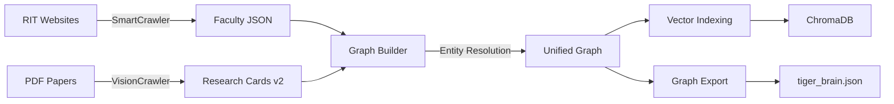

# 05 - Data Pipeline

**Last Updated:** February 10, 2026  
**Purpose:** Deep dive into data ingestion, processing, and graph construction

---

## Table of Contents

1. [Pipeline Overview](#pipeline-overview)
2. [Web Crawling](#web-crawling)
3. [Vision-Based Distillation](#vision-based-distillation)
4. [Entity Resolution](#entity-resolution)
5. [Graph Assembly](#graph-assembly)
6. [Quality Assurance](#quality-assurance)

---

## Pipeline Overview

The TigerBrain data pipeline transforms raw, unstructured data into a queryable knowledge graph.

### Pipeline Stages



### Data Flow

1. **Crawling** → Raw HTML → Structured Faculty Data
2. **Distillation** → PDF (Vision) → Semantic Research Cards  
3. **Resolution** → Name Variants → Canonical IDs
4. **Assembly** → Multiple Sources → Single Graph
5. **Indexing** → Text → Vector Embeddings

---

## Web Crawling

### SmartCrawler Implementation

**Purpose:** Extract faculty profiles from RIT websites without brittle CSS selectors.

**Key Innovation:** LLM-powered semantic parsing instead of regex/XPath.

### Architecture

```python
class SmartCrawler:
    def __init__(self, start_url: str, max_pages: int = 100):
        self.visited = set()
        self.graph = nx.DiGraph()  # Site map
        self.llm_client = get_ollama_client()
```

### Crawl Algorithm

**BFS Traversal:**
```python
def crawl_bfs(self):
    queue = [self.start_url]
    
    while queue:
        # Fetch & Parse (LLM Extraction)
        # ...
```

### LLM Extraction (Faculty Profiles)

**Prompt Engineering:**
```python
def extract_profile_data(self, url: str, text: str) -> dict:
    prompt = f"""
    Extract faculty profile from this HTML.
    Return ONLY valid JSON matching this schema:
    {{
        "name": "Full name",
        "title": "Job title",
        "bio": "Biography",
        "research_interests": ["topic1", "topic2"]
    }}
    HTML: {text[:4000]}
    """
    return self.llm_client.generate(prompt)
```

---

## Vision-Based Distillation

### DeepDistiller (v2) Implementation

**Purpose:** Convert academic papers into structured "TigerCard 2.0" JSONs.

**Key Innovation**: **Vision-First Ingestion** using `Marker-PDF` and **Schema Enforcement** via One-Shot Prompting. We no longer rely on brittle text extraction (`PyMuPDF`) which fails on multi-column layouts and math.

### The TigerCard 2.0 Schema

```json
{
  "card_id": "paper_unique_id",
  "bibliographic_data": {
    "title": "Deep Residual Learning for Image Recognition",
    "primary_domain": "cs.CV",
    "authors": ["Kaiming He", "Xiangyu Zhang"]
  },
  "core_content": {
    "novelty_claim": "Introduces residual learning (skip connections) to train very deep networks.",
    "key_methodology": "Reformulating layers as learning residual functions.",
    "outcomes": ["3.57% error on ImageNet", "Won ILSVRC 2015"]
  },
  "knowledge_graph": {
    "nodes": [
      {"id": "residual_learning", "type": "Method", "label": "Residual Learning"},
      {"id": "vanishing_gradient", "type": "Concept", "label": "Vanishing Gradient Problem"}
    ],
    "edges": [
      {"source": "residual_learning", "target": "vanishing_gradient", "relation": "SOLVES"}
    ]
  }
}
```

### Distillation Process (Vision-First)

**Step 1: Neuro-Visual Extraction (Marker-PDF)**
We use a VLM-based layout analysis to extract high-quality markdown, preserving tables and equations.
```python
def extract_text(self, pdf_path: Path) -> str:
    # 1. Convert PDF pages to images
    # 2. Use detection model (Surya) to find blocks
    # 3. OCR text blocks with reading order
    return self.vision_crawler.convert_pdf(pdf_path)
```

**Step 2: Domain Classification (The Librarian)**
Before extraction, we classify the paper's domain to prime the LLM:
- **Input**: Abstract
- **Output**: `cs.CV`, `cs.LG`, `cs.CL`, etc. (arXiv Taxonomy)
- **Benefit**: "Context Priming" improves extraction accuracy.

**Step 3: Graph Distillation (Context-Aware)**
We use a **One-Shot Prompting** strategy with a localized **8k context window** to enforce the schema. 
*Note: Standard 2k context truncates the schema instructions leading to hallucinations.*

```python
def distill(self, text: str, domain: str) -> dict:
    prompt = f"""
    Distill this {domain} paper into TigerCard 2.0 JSON.
    
    Ontology Rules:
    - Concept: Core idea (e.g. "Transformer")
    - Method: Technique (e.g. "Self-Attention")
    
    One-Shot Example:
    Input: "Residual Learning..." -> Output: {{...}}
    
    Paper Text: {text[:30000]}
    """
    
    # 8k Context Window is CRITICAL for large schema adherence
    response = llm.generate(prompt, options={"num_ctx": 8192})
    return json.loads(response)
```

### Output Location

**Directory:** `data/research_cards/`  
**Files:** `paper_title_card.json`

---

## Entity Resolution

### The Name Ambiguity Problem

**Examples:**
- "C. Kanan" vs "Christopher Kanan" vs "Chris Kanan"
- "CNN" vs "ConvNet" vs "Convolutional Neural Network"

### EntityResolver Class

```python
class EntityResolver:
    def resolve_faculty(self, name: str) -> Optional[str]:
        # 1. Exact match
        # 2. Fuzzy match (90% similarity)
        # 3. Last name match heuristic
        return canonical_id
```

**Mappings File:** `data/entity_mappings.json`

---

## Graph Assembly

### GraphBuilder Pipeline

**Input:**
1. `site_graph.gml` - Structural skeleton
2. `rit_data_v2.json` - Faculty profiles
3. `research_cards/*.json` - Semantic research data

**Output:**
- `tiger_brain.json` - Unified graph

### Assembly Steps

1. **Load Site Graph**: Base topology.
2. **Hydrate Faculty**: Attach rich profiles to nodes.
3. **Merge Research Cards**: Add paper nodes and link authors.
4. **Infer Relationships**: `Faculty` -INTERESTED_IN-> `Concept` (derived from papers).

---

## Quality Assurance

### Validation Checks
- **Orphan Nodes**: Detected and pruned.
- **Missing Attributes**: Flagged in weekly reports.
- **Completeness**: Bio coverage %, Abstract coverage %.

### Monitoring
Run `python scripts/weekly_quality_report.py` to generate stats on node counts and connectivity.
