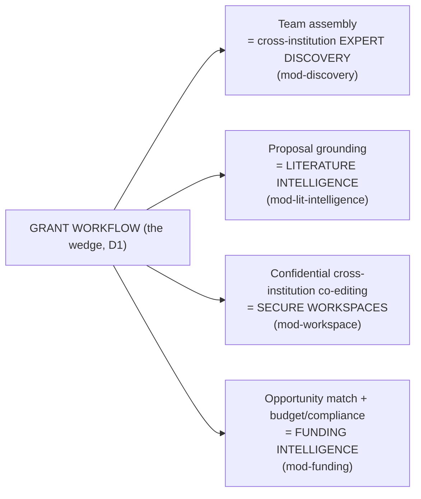
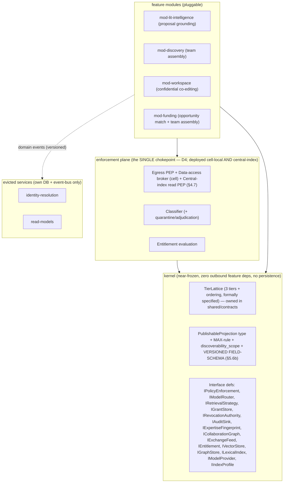
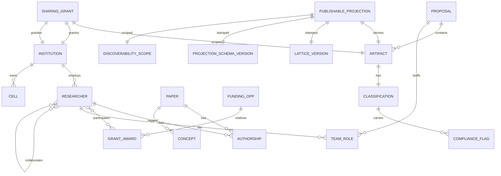
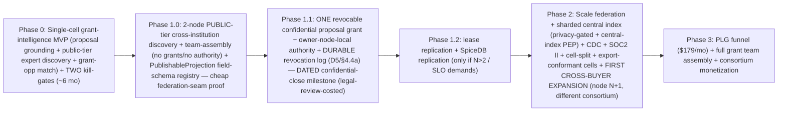

# FINAL PLAN (converged) — Federated Multi-University Grant-Intelligence & Research Platform

> Converged: 0 critical findings across two bounded adversarial verification passes. 11 high-severity refinement items tracked in convergence-report.md.
> Canonical full plan. (The auto-finalizer produced only a 17k summary — see executive-summary.md — so this file is the authoritative complete plan = plan7.)

---

This is a plan-authoring task, not a code task. I have the full current plan and the in-scope findings. I'll produce the strengthened, complete plan directly — no tools needed since everything required is in-context and the deliverable is my verbatim final response.

The 11 findings cluster into: (1) owner-cell revocation durability/recovery, (2) shared-tier discovery epoch source consistency, (3) central-index per-query authz + discoverability scope + mosaic, (4) confidential derivative-store encryption under tenant KEK, (5) pooled-plane per-tenant isolation, (6) PublishableProjection field-schema evolution, (7) D7 $120k-vs-2-3x-COGS reconciliation, (8) differentiation-vs-fast-revenue expansion procurement model, (9) defensibility fallback concreteness, (10) COGS table internal reconciliation, (11) steady-state confidential COGS vs Phase-0 sandbox COGS. I'll resolve each in the relevant section, keep all 19 sections at full depth, and preserve D1-D7.

# TigerExchange — Grant Intelligence as a Federated Cross-Institution Team-Assembly & Secure-Proposal-Collaboration Platform
## Architecture & Business Plan v7 (Re-Anchored on Locked Decisions D1–D7; Adversarial-Review-Hardened)

*Self-contained. Re-anchored on the grant-intelligence wedge (D1) sold into one existing federally-funded multi-site center (D3), with confidentiality enforced through a single Policy Enforcement Point + data-access broker chokepoint (D4), the owning node as the sole local fail-closed revocation authority (D5), confidential content never entering the shared index (D6), and institutional ACV ≥ 2–3× per-tenant COGS as the revenue anchor (D7). The architecture is modular and constant across phases; build order, isolation posture, and which decomposed wedge is lit are the levers. This revision (v7) hardens eleven adversarial-review findings without disturbing any locked decision: owner-cell revocation **durability & crash-recovery** (§4.4a), the **single named source** of the shared-tier discovery revocation epoch with an explicit bounded-stale window (§4.3/§10.3), a **PEP in front of the central index** with first-class discoverability-scope + mosaic threat-modeling + at-rest control-plane encryption (§4.7/§11.2b), **tenant-KEK encryption of ALL confidential derivative stores** so crypto-shred shreds the searchable copies (§11.3b), a **pooled-plane per-tenant isolation boundary** (object-authz primary + RLS defense-in-depth, §7.7/§13.1), a **field-schema evolution contract for PublishableProjection** (§5.6b), and a full **D7 unit-economics reconciliation** that separates the 2–3×-COGS gross-margin floor from the separately-derived $120k minimum-viable ACV, reconciles the COGS line items to the per-tenant total, and prices the steady-state confidential tier (not the Phase-0 de-identified sandbox) against the locked ratio (§16).*

---

## 1. Vision & Positioning

**Product.** A federated grant-intelligence platform for multi-institution research. The wedge is **cross-institution team assembly + secure proposal co-authoring** for funded, recurring grant cycles. Each institution runs a strongly-isolated node holding its public, private, and confidential data. A thin shared **Exchange** enables revocable, classification-enforced cross-institution discovery and collaboration **without centralizing confidential data**.

**The moat is NOT the grant database** (Grants.gov, RePORTER, NSF awards are commodity CC0/public feeds; Pivot-RP, GrantForward, Instrumentl, and the AI fast-follow Atom Grants/GrantsAI already index them). The moat is three compounding assets the database vendors structurally cannot build:

1. **Cross-institution expertise graph** — who can co-PI what, resolved across institutional boundaries, accumulating entity-resolution + collaboration-history trust artifacts per dyad.
2. **Confidential proposal workspace** — pre-submission proposals are the *most* confidential artifacts in the academy (unfunded ideas, budgets, preliminary data); no public-data grant tool can host them, and no enterprise secure-RAG tool (Glean/NotebookLM) federates them across institutional trust boundaries.
3. **Federation network** — revocable cross-institution sharing grants + audit history + tuned eval gold-sets that grow super-linearly with connected nodes and active grant cycles.

**The white space (precise, unoccupied intersection):**

| Category | Examples | Owns | Structural blind spot |
|---|---|---|---|
| Grant DB / discovery | Pivot-RP, GrantForward, Instrumentl, **Atom Grants/GrantsAI** | Funding-opportunity index + (Atom) AI co-PI match | **Single-tenant, public-data-only**; no confidential proposal hosting; no federation; no institutional trust fabric |
| Research-admin / CRIS | Cayuse, Kuali, Pure, Symplectic | Grant *administration* + faculty/publication data inside one research office | Centralized SaaS; **confidential cross-institution sharing cannibalizes their data-monetization**; no AI-native team assembly |
| Enterprise secure-RAG | Glean, NotebookLM Ent., Copilot, Azure-OpenAI-on-your-data | Single-tenant grounded Q&A over internal docs | No federation, no cross-institution trust fabric, no scholarly/grant graph |
| Confidential federation | Decentriq, BeeKeeperAI, cloud clean rooms | Confidential multi-party compute | Generic clean rooms; no grant workflow, no scholarly graph, no PI-facing product |
| Academic LOD federation | VIVO CTSAsearch / Direct2Experts (64 inst.) | Public-tier cross-institution expert search | Public-only; no confidentiality tier, no grounded AI, no grant workflow |

**Nobody assembles cross-institution grant teams over a confidential, revocably-shared proposal workspace with classification-routed AI.** That is the wedge.

**Defensibility thesis (raced, not resting on incumbent inaction).** Two compounding *measurable* switching-cost mechanisms + a certification lead:

1. **Data-gravity from trust artifacts** — sharing grants, audit chains, per-dyad entity-resolution decisions, accumulated grant histories, per-tenant tuned gold-sets. **Pulled forward to N=2:** even one dyad inside the anchor consortium accrues grant history + audit chain + tuned gold-sets a replacement cannot reproduce.
2. **Network effect** — team-assembly quality and discovery value grow super-linearly with connected nodes and active grant cycles.
3. **Certification depth** — FERPA/GDPR/export-control readiness incumbents acquire over 4–6 quarters.

**Incumbent time-to-replicate.** Atom Grants can bolt on a thin "private" tier in ~1 quarter; the *federated confidential trust fabric* (cross-tenant authz, revocation correctness, owner-side re-derivation, audit anchoring) is a 4–6 quarter security program even for a well-resourced team — and the CRIS incumbents must do it without breaking their centralized data-monetization model.

**The distribution-vs-data-tier asymmetry, confronted (resolves Finding 9).** The honest danger is *inverted from the usual*: the incumbent's **easy** move (a thin private tier) is what we race, while our **hard** move (multi-institution distribution) is assumed on schedule. Distribution is harder to bolt on than a private-data tier; an Atom with 50+ institutional relationships starts its 4–6 quarter clock from a distribution position we must *build*. We therefore do **not** treat the network-effect fallback as automatically load-bearing — at N=2 there is no network, only single-customer switching cost, which is real but is **not a moat against a distribution-advantaged incumbent selling to OTHER consortia.** Concretely:

- **Defensible-N is two-dimensional, not one.** It requires both (a) **N≥5 connected nodes** *and* (b) **cross-buyer diversity ≥ 2 DISTINCT consortia/centers** (not 2 sites of one center). One center at N=4 is a single-customer lock-in, not a network. (Decision restated in §17 with dated gate in §18.)
- **Distribution is a planned acquisition, not organic node growth.** Channel strategy: (i) **consortium-director and alliance partnerships** (CTSA program, Big-Ten Academic Alliance, NSF AI-Institute PI networks) where one signature reaches many nodes; (ii) a **Cayuse/Kuali integration partnership** that rides an installed base rather than displacing it (TigerExchange as the confidential-federation layer atop their administrative system-of-record); (iii) framework LOIs with a *second* consortium signed during Phase 0–1, not deferred to Phase 3.
- **Race condition (R17/R18):** reach defensible-N (both dimensions) before that window closes (defined in §17, reachability + dated gate in §18). Per Triage C2/C23 (item 23) and Finding 9: if **either** the race window **or** the cross-buyer-N target is unreachable on the modeled ramp, the moat **does not** silently fall back to "network-effect lock-in" — it triggers the **regulated-niche down-scope (PRIMARY plan-B) at a specific trigger month** (§17), because at sub-threshold N the network claim is unsupported.

**Why now.** (a) Multi-site federally-funded research (NIH U54/U01, NSF AI Institutes) is structurally cross-institutional, runs recurring funded grant cycles, and is underserved by single-tenant tools — this is exactly the anchor (D3). (b) Open scholarly + grant corpora (OpenAlex, Crossref, ROR, ORCID-dump, SPECTER2; Grants.gov, RePORTER, NSF awards) are redistributable at scale. (c) Open-weight models on commodity GPUs make in-boundary confidential inference economical. (d) Export-control + data-sovereignty regimes make "confidential data stays in-boundary" a hard procurement requirement.

---

## 2. Users, Buyers & Packaging

### 2.1 Personas
- **PI / co-PI** — finds collaborators, assembles a cross-institution team, co-authors the proposal. **Budget authority ≈ $0; champion + PLG top-of-funnel, does not sign.**
- **Center / consortium RD office (anchor buyer, D1)** — owns the recurring multi-site grant strategy, the master DUA, and the budget. **The institutional, mid-ACV economic buyer.**
- **Sponsored-programs / grants administrator** — pre-award compliance, budget, submission; co-champion inside the RD office.
- **Library / scholarly comms** — corpus, public profiles, OA strategy; frequent co-buyer.
- **IT / CISO / privacy / export-control officer** — security/compliance gatekeeper; can veto.
- **Consortium / alliance director** — multi-institution governance buyer at scale.

### 2.2 The buyers, honestly mapped (per D1/D7)

| Motion | Budget owner | Deal size (ACV) | Cycle | Security depth | Revenue phase |
|---|---|---|---|---|---|
| **ANCHOR: existing multi-site center RD office** (NIH U54/U01, NSF AI Institute) | Center admin / RD office | **$120–250k/yr** (minimum-viable ACV ≥$120k, separately derived from CAC+GTM+compliance; clears the D7 2–3×-COGS gross-margin floor — §16.2) | 4–9 mo (existing-relationship + funded-need shortens) | High (rides existing DUA) | **Phase 0–1** |
| Top-down institutional (research office/library/IT) | VP Research / Library / CIO | $150–600k/yr | 6–12 mo | High | Phase 2 |
| Consortia / alliances | Consortium director | $300k–1.5M/yr | 9–18 mo | High + governance | Phase 2–3 |
| Campus-wide | CIO / Provost | enterprise license | 9–18 mo | High + SAML/eduGAIN | Phase 2–3 |
| **PLG top-of-funnel (individual PIs)** | Individual | **$179/mo** (loss-leader) | self-serve | Low (public + own-materials only) | Phase 1+ (acquisition channel) |

**Locked-requirement reconciliation (D7, explicit — resolves Findings 7, 10, 11).** Two *separate* numbers govern pricing and they were previously conflated:

1. **The D7 gross-margin floor** is literally *ACV ≥ 2–3× per-tenant COGS.* Applied to the **honest steady-state confidential-tier COGS** (§16.1, reconciled to ~$36–43k/yr, with a $72k/yr ceiling if a dedicated per-tenant GPU is allocated), 2–3× yields a **$72–129k/yr** gross-margin floor — and at the dedicated-GPU ceiling, $120k is only **1.7× $72k, which VIOLATES D7**, so the dedicated-GPU confidential edition is **priced higher** or **density-constrained** (§16.2).
2. **The $120k/yr minimum-viable ACV** is a **separately-derived, CAC+GTM+compliance-loaded breakeven floor**, NOT the 2–3×-COGS number. It is validated against an **external comparable** (a Cayuse/Kuali module ACV or an NIH-center software line item), not against COGS, in Gate A.

The **$179/mo individual tier is explicitly top-of-funnel / loss-leader**, not the margin driver. "Sellable to PLG" is satisfied by a PLG land-and-expand surface whose purpose is to seed champions inside target consortia. If a stakeholder requires standalone PLG profitability, that is a *new* requirement surfaced now (§19 Q21), not in Phase 3.

### 2.3 Editions = entitlement config, not forks
One platform; editions resolve through a first-class **Entitlement/Edition** module (§5) mapping a tenant to a capability set, evaluated centrally **at the PEP**. Modules consume capabilities as a contract and **physically cannot** enable a tier they are not entitled to.

| Edition | Capabilities | Target | Isolation posture (D7) |
|---|---|---|---|
| **Consortium-Anchor** | confidential proposal workspace, HYOK, in-boundary inference, **exchange participation + cross-institution grants + team assembly**, N≥2 cells | anchor center (D3) | dedicated cell |
| **Confidential-Sovereign (highest isolation)** | + dedicated per-tenant GPU + export-conformant cell + self-host option | export/defense/sovereign buyers | dedicated cell + dedicated GPU (priced higher per §16.2) |
| **Institutional** | + private tier, library RBAC, OIDC/SAML, full discovery | research office | dedicated cell |
| **Campus** | + campus-wide SSO (eduGAIN), seats at scale | campus | dedicated cell |
| **PLG (individual, $179/mo)** | **public + own-materials ONLY; confidential/exchange hard-OFF** | individual PIs | **pooled multi-tenant plane** (per-tenant isolation boundary, §7.7) |

**Contract tests (CI-enforced, Triage item 17/§2.3 + Findings 4,5):**
- *"A PLG-edition tenant cannot construct a confidential-tier or exchange-participation request."* Entitlements evaluate at the PEP, not per-module.
- *"A pooled-plane tenant cannot read another pooled tenant's own-materials"* (§7.7 cross-tenant-read-denied property test).
- *"After KEK crypto-shred, a search over the confidential corpus returns no decryptable hits"* (§11.3b).

### 2.4 Value metric & metering (D7-aligned; designed in day one)
Metered axes chosen to **not tax the network effect**: **seats** (institutional/campus), **confidential proposal workspaces** (anchor/consortium), **node/data-plane** (institutional/managed), **grant-team assemblies** (consortium add-on). We deliberately **do NOT meter per cross-institution sharing grant** — that would tax the exact bootstrapping behavior. **Non-confidential workloads run on multi-tenant pooled infra; dedicated isolation (and its cost) is billed only on the confidential tier (D7).** The metering module is pluggable (§5).

### 2.5 GTM sequencing
Phase 0: anchor-center BD + two kill-gates + single-cell MVP with a **federation-flavored public-tier differentiator** (Triage item 20). Phase 1: light up the federation seam inside the anchor center's existing DUA (D3), then one revocable confidential grant. Phase 2: institutional + consortium broadening **plus first cross-buyer expansion** (node N+1 from a *different* consortium, against the §2.6 procurement-veto-graph). Phase 3: PLG funnel + full grant-monetization across consortia.

### 2.6 Expansion procurement-veto-graph & time-to-yes (resolves Finding 8)
**The anchor's DUA collapses the FIRST dyad's legal vehicle; it does NOT collapse each NEW institution's review when the consortium expands.** Expansion is what produces the network effect, and expansion is where multi-party procurement friction is maximal. We model the **node-N+1 join** as a distinct, costed motion separate from the anchor land:

| Stakeholder (per joining institution) | What they gate | Typical duration | Mitigation we build |
|---|---|---|---|
| **Office of General Counsel (OGC)** | DUA accession / data-sharing addendum | 2–5 mo | pre-negotiated **accession-rider template** to the anchor master DUA; counsel-reviewed once, reused |
| **IRB / HRPP** (only if human-subjects preliminary data crosses) | human-subjects data handling | 1–4 mo | **default posture = no human-subjects PHI in proposal workspace**; if present, rely on the anchor's existing reliance agreement / sIRB; otherwise the workspace holds non-human-subjects content only |
| **Export-control officer** | controlled tech data in proposals | 1–3 mo | **export-conformant cell + opt-in-per-project FRE** (§11.6); default = export-controlled data NOT accepted until that cell line exists |
| **CISO** | HECVAT, SOC2, pen-test, data-residency | 1–4 mo | HECVAT pre-filled; SOC2 Type I/II completed before expansion phase; **reusable security packet** |

**Time-to-yes (expansion):** typically **6–12 months per new institution**, parallelizable across stakeholders, compressible to ~4–6 months with the reusable templates above. This is **slower than the anchor land** (which rides a pre-existing DUA) and is the rate-limiter on the network effect — explicitly modeled in the runway (§16.3) and dated-gated (§18 Phase 2).

**Two revenue lines, separated in the runway model (resolves Finding 8):**
- **(a) Fast, undifferentiated public grant-assistant ACV** — the Phase-0 public-tier / de-identified surface (grounded drafting + public expert discovery + grant-opp match). Closes in the anchor's normal sandbox-pilot cycle (month 3–6). This is the surface Atom/Pivot/Instrumentl already occupy; it pays bills but is **not the moat**.
- **(b) Slow, differentiated confidential-federation ACV** — the Phase-1.1 confidential proposal grant + cross-institution revocable sharing. Closes on the **multi-institution legal timeline** above. **The Phase-1.1 confidential-grant close is a DATED, NAMED milestone with the legal-review path costed (§18), not a build milestone.**

**Runway must survive if (b) lands 12–18 months out** (modeled in §16.3): the 32-month runway funds the fast (a) revenue from month 3–6 and treats the differentiated (b) close as a month-12-to-18 event with at most two attempts budgeted.

---

## 3. Feature Catalog & MVP Sequencing

### 3.1 The grant wedge IS the product; the other three wedges are its decomposition (D2)

The locked decision D2 reframes the four pillars not as separate products but as the **natural decomposition of one grant workflow**:



| Decomposed wedge | Module | Consumes (interfaces) | Phase |
|---|---|---|---|
| **Team assembly = expert discovery** | `mod-discovery` | `IRetrievalStrategy`, `ICollaborationGraph`, `IExpertiseFingerprint`, `IExchangeFeed` | **0 (public-tier)**, 1 (cross-inst.), 2 (PSI overlap) |
| **Proposal grounding = literature intel** | `mod-lit-intelligence` | `IRetrievalStrategy`, `IModelRouter`, `IPolicyEnforcement` | **0 (own-corpus grounded drafting)** |
| **Confidential co-editing = secure workspaces** | `mod-workspace` | `IGrantStore`, `IRevocationAuthority`, `IPolicyEnforcement`, `IAuditSink` | 1 (single grant), 2 (full) |
| **Opportunity match + team assembly = funding intel** | `mod-funding` | `IExpertiseFingerprint`, `ICollaborationGraph`, `IExchangeFeed`, grant feeds | 1 (opportunity match), 3 (full assembly + budget) |

### 3.2 The MVP wedge + anchor buyer
**MVP wedge (Phase 0):** for the anchor center's PIs — **(a)** grounded proposal drafting + semantic search over the center's own documents + public scholarly corpus (`mod-lit-intelligence`, classification-enforced in-boundary inference, HYOK-at-rest), **plus (b)** the federation-flavored differentiator (Triage item 20): **cross-institution PUBLIC-tier expert discovery over OpenAlex** (`mod-discovery`, zero confidentiality machinery) **plus (c)** grant-opportunity match (`mod-funding` lite) over Grants.gov/RePORTER/NSF. This makes first-dollar a *grant-flavored, federation-flavored* product, not commodity secure-RAG.

**Anchor buyer (D3):** **ONE existing federally-funded multi-site center** (NIH U54/U01, NSF AI Institute, or established consortium) that already shares confidential data under an existing DUA → day-one N≥2 + legal basis + recurring funded grant need.

### 3.3 Two independent kill-gates (Triage C1/C22; D3)

Phase-0 carries one federation-flavored differentiator so first revenue is not pure commodity (item 20), but we still split validation into **two independent demand gates with independent pivots** — *not* a build-order continuation:

- **Gate A (Week 1) — anchor-grant-wedge demand:** the anchor center's RD office gives a **written price indication ≥ the $120k/yr minimum-viable ACV (separately derived in §16.2, validated against an external Cayuse/Kuali-module or NIH-center-software-line comparable — NOT against COGS)** against a concrete grant-program budget line; funds a paid sandbox pilot. *Fail → pivot the wedge before engineering.*
- **Gate B (Week 1, SAME interviews) — federation/cold-start basis:** confirm in writing **(i)** an existing confidential cross-institution sharing relationship + **its legal vehicle (DUA)** in force, **(ii)** N≥2 sites already collaborating, **(iii)** a recurring funded grant need (D3's three conditions). *Fail → the anchor isn't real; do not commit to the federation build — Phase 1 becomes an independent kill-gate, not an automatic continuation.*

Passing A while failing B means we have a sellable single-cell grant-assistant and an unproven federation. That is a decision point, not a green light.

### 3.4 Cold-start: anchor on a pre-existing legal vehicle (D3)
Federated platforms die in the dyad cold-start gap. **We do not create a new sharing relationship.** The first dyad **digitizes the anchor center's existing DUA.** **Hard Phase-1 entry gate (ranked above the consortium-BD hire):** *"Anchor center selected; its existing DUA + N≥2 sites + recurring funded grant need confirmed in writing."* Anchor-center **selection criteria are a gate, not aspiration:** (1) ≥2 sites already sharing confidential data, (2) a master DUA/consortium agreement in force, (3) a recurring (annual/biennial) funded grant cycle, (4) a named RD/center-admin budget owner. **The accession-rider template (§2.6) is drafted in Phase 1 so the FIRST expansion node is not blocked on a from-scratch legal negotiation.**

### 3.5 Deferred & why
- **F4 full grant team assembly + budget intelligence** → Phase 3 (needs mature graph + N≥several); **opportunity-match lite ships Phase 1.**
- **PSI collaborator-overlap** → Phase 2, but **usability spiked in Phase 1**.
- **Multi-agent retrieval** → Phase 3 (cost/safety).
- **TEE-at-use, sovereign hosting, customer self-host** → Phase 2+ (separately funded line, §13).

---

## 4. System Architecture

### 4.1 Control-plane / data-plane split & federation topology

```mermaid
flowchart TB
  subgraph CP["CONTROL PLANE (regional-pinned: US / EU instances)"]
    EX["Exchange: federated discovery broker + GRANT registry index + team-assembly broker"]
    CIDXPEP["CENTRAL-INDEX PEP (per-query authz + discoverability-scope filter) — Finding 3"]
    RA["Revocation Authority (lease-issuing; owning node is sole local authority — D5)"]
    ENT["Entitlement/Edition service"]
    IDP["Identity broker (Keycloak + CILogon/eduGAIN)"]
    TLR["TierLattice + PublishableProjection schema registry (additive, fail-closed)"]
    CIDX["Managed central index + materialized PUBLIC-tier graph (sharded, ENCRYPTED-AT-REST under control-plane keys) + public grant feeds"]
    TXP["Cross-tenant transparency log (audit anchor)"]
  end

  subgraph CELL_A["DATA PLANE — Center Site A cell (isolated tenant)"]
    PEPa["Egress PEP + Data-access broker (SINGLE chokepoint — D4)"]
    STOREa["Per-tenant stores: Postgres / vector / graph / lexical (confidential derivatives ENCRYPTED under tenant KEK — Finding 4)"]
    GRANTa["Authoritative GrantStore (A): durable WAL'd tombstone log + fenced counter (D5; durability §4.4a)"]
    AUTHa["Cell-local SpiceDB replica + lease cache"]
    INFa["In-boundary inference (vLLM) + KMS/HYOK"]
    AUDa["Hash-chained audit (per-stream) + checkpointer"]
  end

  subgraph CELL_B["DATA PLANE — Center Site B cell"]
    PEPb["Egress PEP + broker"]
    STOREb["Per-tenant stores (tenant-KEK encrypted)"]
    GRANTb["Authoritative GrantStore (B): durable WAL'd tombstone log + fenced counter"]
    AUTHb["SpiceDB replica + lease cache"]
  end

  subgraph POOL["MULTI-TENANT POOLED PLANE (non-confidential only — D7)"]
    POOLPEP["Pooled-plane PEP: object-authz Check (deny-by-default) + FORCE RLS defense-in-depth — Finding 5"]
    PLGc["PLG + public-discovery shared cells (pooled GPU/index)"]
  end

  IDP --> PEPa & PEPb & POOLPEP
  ENT --> PEPa & PEPb & POOLPEP
  TLR --> PEPa & PEPb
  PEPa -- "PUBLIC/SHARED projections only (CDC) + discoverability_scope" --> CIDX
  PEPb -- "PUBLIC/SHARED projections only (CDC) + discoverability_scope" --> CIDX
  EX --> CIDXPEP --> CIDX
  EX <-- "discovery (no confidential payload), authz+scope-filtered" --> PEPa & PEPb
  PEPa -- "brokered drill-down (deadline-propagated)" --> EX
  EX -- "owner-side re-derivation (D5)" --> PEPb
  RA -- "fenced leases (LOCAL read at owning node)" --> AUTHa & AUTHb
  PEPa -- "compact revocation epoch + tombstone bitmap (bounded-stale)" --> EX
  AUDa -- "periodic signed chain-head checkpoints" --> TXP
```



**Invariant (D6):** confidential payloads NEVER enter the control plane or shared index. The Exchange holds only **PublishableProjections** (public/shared-tier, MAX-rule-bounded — §6/§11) and **grant *references*** (not contents) + public grant-opportunity feeds. Cross-institution discovery and team assembly operate on public/shared projections; **confidential collaboration happens via brokered, owner-mediated drill-down where the OWNER node serves its own data after re-deriving authority** (§4.3, D5).

**New invariant (Finding 3):** **the central index is itself behind a PEP for READ queries.** A tenant "publishing to discovery" does NOT consent to be discovered by every connected node; each `PublishableProjection` carries a first-class `discoverability_scope` enforced at query time, and the aggregate index is treated as **at-least-private-tier for access purposes** (mosaic effect, §4.7/§11.2b).

### 4.2 The single confidentiality chokepoint (D4)
**Every** retrieval, egress, and derivation in a cell flows through **one Policy Enforcement Point + Data-Access Broker.** Feature modules receive **already-projected, already-tier-checked result objects** and **never see raw classification logic or the raw store.** This is the structural resolution of Triage C10 ("pluggable module impossibility"): modules never re-implement enforcement. Enforced:
- Import-linter forbids feature modules from importing the raw store, the classifier, or constructing a `PublishableProjection`.
- Runtime: the broker is the **only** holder of raw-store credentials (per-module DB-role isolation, §5/§7).
- The egress PEP **re-evaluates classification against a publishable allowlist schema at the boundary** (Triage C11): the outbox is *checked, not trusted* — the same PEP is the deny-by-default egress validator.

Adding `mod-funding` (Phase 3) therefore **inherits enforcement for free** — it cannot leak because it never touches classified data except through the broker.

**Two enforcement loci, one model (D4 honored):** the **cell-local PEP** (in-cell + cross-tenant owner-side authority) and the **central-index PEP** (§4.7) are the **same PEP code/policy engine deployed at two locations**, not two implementations. The cell PEP gates raw confidential data; the central-index PEP gates *reads of published public/shared projections* by discoverability-scope + per-query authz. Both consume the one owned policy table (§5.8); modules still never re-implement enforcement.

### 4.3 How cross-institution discovery & team assembly work WITHOUT centralizing confidential data (D5/D6)

**Discovery + team assembly (public/shared).** Owner cells publish MAX-rule-bounded projections to the central index via CDC (§10). Team-assembly candidate ranking runs over the central public-tier expertise graph + public grant feeds; results are **(i) per-query authz-checked and discoverability-scope-filtered at the central-index PEP** (§4.7), then **(ii) shared-tier hits are post-filtered against the owner's bounded-stale revocation epoch/bitmap replicated to the Exchange** (§4.3a below).

**Discovery revocation-epoch source — the one named model (resolves Finding 2).** The prior plan asserted both "live correctness gate" (10.3b) and "eventually-consistent epoch store" (10.4), which is inconsistent. We pick and pin **one** model, fully within D5:

- Each owner cell maintains a **locally-authoritative, monotonic revocation epoch** + a **compact tombstone bitmap** (its sole local authority, D5).
- The owner cell **replicates ONLY the compact epoch counter + tombstone bitmap to the Exchange with a stated, bounded staleness** (target ≤ 2s p99 replication lag; measured and published in §14.5). This is a tiny, high-frequency push — *not* a full re-publish (§10.3c).
- **Shared-tier (non-confidential) discovery is gated on this bounded-stale bitmap at the central-index PEP.** We **EXPLICITLY ACCEPT a bounded stale-allow window for the SHARED tier** and **drop the "correctness gate / effectively immediate" wording for discovery.** This is exactly D5 ("discovery metadata eventually-consistent; confidentiality decisions strongly consistent at the owning node only"). The measured staleness bound is in the SLO table (§14.5).
- **Confidential drill-down is unaffected** because it re-derives authority at the owner cell against the *strongly-consistent local* tombstone log (§4.4/§4.4a), not the bounded-stale Exchange bitmap. A revoked confidential artifact is therefore **never** served past the owner's local revocation, regardless of Exchange-bitmap lag.
- We do **not** synchronously fan out to every owner cell per discovery query (the rejected option (b)): that would reintroduce per-hit cross-region coupling on the 800ms index path and scale poorly with N owner cells per result page.

**Confidential collaboration (proposal workspace) — brokered, owner-authoritative drill-down.**

**Universal invariant (Triage C15, generalized to ALL cross-tenant access):** *Owner-side authoritative re-derivation. Broker and grantee assertions are untrusted hints.* Every brokered request carries a **grant-ID**; the **owner node** looks the grant up in its **own authoritative GrantStore** (D5 — sole local authority), re-derives scope + tier + caveats + revocation status against its **durable local tombstone log** (§4.4a), and **ignores any scope claim in the token.** The broker is a deputy with credentials to many tenants; it can never be confused into widening scope because the owner never trusts the presented scope. **Caveats are sticky and re-evaluated at grantee-side access** (`transfer_legality`, `export_attestation`, `FERPA_role` — §11.5).

**Token security:** per-tenant-signed, HSM-DPoP-bound, **audience-bound, single-use, short-TTL.** A replayed token hits the synchronous revocation check (§4.4) → live deny.

**Per-hop deadline-propagated latency budget (composite SLO = 6.5s; reconciles Triage C14 worst-case US→EU):**

| Hop | Budget (p99) | Notes |
|---|---|---|
| Client → query cell | 150 ms | TLS + ingress |
| Query cell → Exchange broker | 120 ms | intra-region |
| Broker → owner cell (cross-region worst case, US→EU) | 350 ms | RTT + queueing |
| Owner-side SpiceDB Check (**local replica read**, §7) | 20 ms | not cross-region (D5) |
| Owner-side revocation lease read (**local fenced lease**, §4.4) | 15 ms | **not a consensus round trip** (D5); durable-log-backed (§4.4a) |
| Owner-side retrieval + synthesis (in-boundary vLLM TTFT+gen) | 4,500 ms | dominant |
| HSM sign (fair-exchange receipt) | 80 ms | §11.4 |
| Return path | 400 ms | |
| **Subtotal** | **5,635 ms** | |
| **Reserved slack** | **865 ms** | absorbs jitter |
| **Composite SLO** | **6,500 ms** | |

**Worst-case cross-region table (Triage item 28, C14):** US-subject requester → EU-resident confidential artifact → generated answer = the row above with the 350ms cross-region hop. Because D5 makes authority **local at the owner**, there is **no added consensus hop**; the residual cross-region cost is one RTT to reach the owner + the owner's local checks. This reconciles against the 6.5s Q&A SLO with 865ms slack.

**Deadline propagation:** each hop passes a **shrinking deadline**; a hop that cannot meet its remaining budget **fails-closed-fast.** **Circuit-breaker trip threshold = the hop's deadline fraction** — a *slow* owner node (gray failure, the dominant federation failure mode) trips at its budget boundary, not only when fully offline. Gray-failure (injected owner-node latency) is a **Phase-2 milestone test.**

### 4.4 The revocation authority: lease-based LOCAL reads at the owning node (D5)

**D5 locks this:** *the owning institution node is the SOLE, LOCAL, fail-closed authority for access/revocation of its confidential artifacts. No global multi-region consensus on the hot path.* This resolves the largest finding cluster (Triage C6/C7).

**Design.** Each owner cell is the authority for *its own* artifacts. The hot-path check is a **local read** of the cell's lease cache: `lease.valid && now < lease.expiry && grant not in local tombstone-since-lease`. **No cross-region hop on the read path** (the 15ms in §4.3).
- For ordering of *its own* revocations, the cell uses a **local monotonic fenced counter** (no cross-region consensus). Revocation = local tombstone commit + local lease invalidation.
- The control-plane Revocation Authority does **not** adjudicate access; it only **replicates revocation epochs/tombstones for shared-tier discovery post-filtering** (bounded-stale, §4.3a) and issues **fenced grant-validity leases** the owner cell reads locally. **It is never on the confidential read hot path.**

### 4.4a Durability, replication & crash-recovery of the owner-LOCAL authoritative revocation state (resolves Finding 1)

D5 makes the owner cell the **sole** local authority. Because that authority is deliberately **not** in global consensus (correct per D5), its single-node durability and recovery semantics are the **load-bearing correctness property** — so they are specified here, entirely intra-cell (no global consensus added):

**1. The authoritative tombstone log is a durably-committed, locally-replicated write-ahead log.**
- The fenced monotonic counter + tombstone set live in the cell's **Postgres** as an append-only `revocation_log(epoch BIGINT monotonic, grant_id, reason, committed_at, fence_token)` table.
- A revocation is **synchronously committed (fsync, `synchronous_commit = on`) to the durable log BEFORE the lease is invalidated and before any deny/allow decision observes the new epoch.** Lease-cache invalidation is a *derived* effect of a *durably-committed* tombstone, never the source of truth. Ordering: **durable-commit → fence-bump → lease-invalidate → serve-deny.** A crash between commit and lease-invalidate is safe because recovery (below) rebuilds the lease cache strictly from the durable log.
- **Intra-cell replication:** the cell's Postgres runs **synchronous streaming replication to ≥1 in-cell replica** (`synchronous_standby_names`, quorum `ANY 1`) so a single-node loss does not lose a committed tombstone, plus **continuous WAL archiving / PITR**. This is *intra-cell* HA, not cross-region consensus — D5 intact.

**2. Crash-recovery is fail-closed and log-authoritative.**
- On restart, the cell **rebuilds the lease-cache validity strictly from the durable tombstone log** (replays all epochs up to the durable high-water mark), and **refuses to serve any confidential read until recovery completes** (`recovery_complete` flag false → deny-all-confidential). The cell **never** serves confidential reads from a checkpoint/snapshot that predates the durable log head.
- **Anti-resurrection rule:** a recovery that would replay from a checkpoint older than the highest durably-committed epoch is **rejected**; the cell refuses to start in a serve-confidential state and alarms. A tombstone can therefore not "vanish" via a stale checkpoint — the durable WAL is always the floor.
- The local fenced counter is monotonic across restarts (persisted in the log); a restart can only move the epoch **forward**, never backward.

**3. Deterministic-simulation test (CI gate, §15.2).** Crash the owner cell **mid-revocation** (between durable-commit and lease-invalidate, and again between fence-bump and serve), recover, and **assert the revoked grant stays denied.** A second variant restores Postgres from a checkpoint deliberately predating a revocation and asserts recovery **refuses to serve** until the WAL is replayed past that epoch. This is the precise failure D5 exists to prevent, now localized and **tested**.

**CAP posture (Triage item 27, C13).**
- Confidential reads serve against the **local lease** until TTL; then **fail-closed-deny** (correct). A control-plane partition is **NOT** an instant total outage; it is **TTL-bounded graceful degradation, then deny**, scoped to the partitioned cell only (D5 bounds the blast radius to one owner node).
- **Published number (release gate):** expected confidential deny-minutes/year at a measured inter-region partition rate, with the cell's local-authority SLO and 2s TTL, is **derived from the Phase-1 spike and published** (Q4) — a measured number, not a target.

**Separate SLOs + honest compound availability (Triage item 27).** Index-path discovery and the brokered confidential-drill-down path have **separate SLOs.** The brokered path is **multiplicative** across (broker × token-mint × owner authority × watermark feed) which share a control-plane failure domain → its honest compound availability under correlated control-plane degradation is **lower than any single component** and is published. **Explicit degraded mode:** *owner node unreachable → publishable metadata only, confidential detail unavailable* (never a stale allow).

### 4.5 Revocation by *reason*, not just tier (Triage C19, item 4)
The allow-window distinguishes **reason**, not only tier:
- **Security / consent-withdrawal / compromise / GDPR Art. 7(3) / FERPA-revocation** → **synchronous deny-correct path at the owning node, zero allow-window, regardless of tier.**
- **Benign administrative revocation of low-sensitivity public/shared data** → bounded allow-window (lease-TTL, default **2s**) acceptable.
- Per-tier, per-reason **maximum-staleness commitment** stated explicitly; confirmed with DPO (Q13) and registrar (Q14).

### 4.6 Skew & ordering
No self-asserted timestamp orders a security decision; ordering uses the **owning cell's local fenced monotonic counter** (D5 — no global clock needed). A node whose clock skew exceeds `max_skew_bound` **fails-closed-deny for its own security decisions + alarms.** The local fenced-counter write path is confirmed to sustain the worst-case bulk-revoke rate via **tombstone coalescing** (tenant/scope-version supersedes N); the **revocations/sec ceiling is published** and tied to bulk-revoke saturation handling (deny-wider on saturation, never global-stall).

### 4.7 The central-index PEP: per-query authz + discoverability-scope + mosaic posture (resolves Finding 3)

The shared central index is now **behind a PEP for read queries** — it is not an open read surface for every connected node. Three mechanisms:

**1. Per-query authorization.** Discovery queries are authz-checked at the central-index PEP: the querying subject/tenant's edition + federation membership are evaluated before any other tenant's projections are returned. Anonymous / unauthenticated queries see only `public-web`-scoped records (below). Deny-by-default: no membership relation → no result.

**2. First-class `discoverability_scope` on every `PublishableProjection`.** Publishing to discovery is **not** consent to be discovered by everyone. Each published record carries one of:
- `public-web` — discoverable by anyone (equivalent to a public faculty profile);
- `federation-wide` — discoverable by any authenticated federation member;
- `named-consortium` — discoverable only within the publishing tenant's consortium(s);
- `named-tenants` — discoverable only by an explicit allowlist of tenant IDs.

The central-index PEP enforces `discoverability_scope` **at query time** against the requester's identity/consortium membership. A `named-consortium` record is invisible to a non-member even if the query would otherwise match. This is the mechanism consortium members need to **restrict discoverability to their own consortium, not the entire connected network.**

**3. Mosaic / aggregate threat-modeled explicitly; index treated as at-least-private-tier.** Aggregation of individually-public projections is itself sensitive (a federation-wide research-capability map is a competitive, foreign-adversary, and export-control reconnaissance target even when every row is public-tier). Therefore:
- **Encryption at rest under control-plane keys distinct from tenant keys** (so an index compromise does not also surrender tenant KEKs; and tenant KEK crypto-shred does not depend on the index for confidential erasure, which it never holds anyway).
- **Bulk/aggregate query controls:** rate-limiting + anomaly detection on broad capability-mapping queries; the index aggregate is access-controlled as **at-least-private-tier**, not public, for authorization purposes.
- **Export-sensitive/defense tenants may opt OUT of central indexing entirely** — `discoverability_scope = none` → they appear in **no** shared index and are reachable only via **live owner-brokered drill-down** (the owner serves its own metadata on an authenticated, scoped request). This is the strongest posture for tenants bordering export-controlled work.

This is **distinct from** the linkage-inference mitigation (§11.2/§11.2b, which protects against *inferring* undisclosed collaborations via DP-noise/k-anon/scope-keys). §4.7 is about **authorizing direct reads** of *disclosed* projections; §11.2b is about **defeating inference** over the disclosed aggregate. Both apply.

---

## 5. Modularity Model

### 5.1 Canonical module map
A committed artifact `shared/contracts/MODULE_MAP.md` is the single source of truth; the **import-linter config is its executable mirror.**



### 5.2 Module definition, isolation, versioning, communication
- **A module** = an owned schema + owned DB role + published domain events + consumed/published interfaces. It owns its data; no other module reads its tables.
- **Isolation from day one (Triage item 16):** even inside the Phase-0 modular monolith, **per-module Postgres schemas + per-module DB roles with `REVOKE` on other schemas** are enforced (DDL + GRANT, nearly free) — *import-linter alone cannot stop shared-table reads.* Paired with import-linter + a no-cross-schema-query lint/runtime check.
- **Communication = published domain EVENTS with a versioned schema (Triage item 15):** an **in-process event bus in Phase 0 using the same versioned contract** (Protobuf/Avro + schema registry + compatibility rules) that Kafka will carry later — so the extraction escape-hatch genuinely exists from Phase 0. Each topic states **idempotency, ordering, and replay guarantees** explicitly. **CDC/Debezium is permitted ONLY for replicating a module's OWN data to its OWN read store — never as a cross-module integration API.**

### 5.3 Add/remove a module with minimal blast radius
- **Add:** register edition capabilities; declare consumed interfaces; receive already-projected objects from the broker. No confidentiality re-threading (chokepoint, §4.2).
- **Remove:** disable its capability in Entitlement; drop its schema; deregister its events. Blast radius bounded by its owned schema + enumerated event consumers.

### 5.4 Extraction trigger (concrete)
Extract to its own service **when EITHER:** (a) measured CPU/QPS exceeds 40% of cell budget while siblings idle, **OR** (b) change-frequency exceeds 2× the cell median for 2 consecutive months. Extraction = own DB (already true) + event-bus-only (already true) → mechanical. **Honest MVP posture (Triage item 17): a modular monolith — single deployable, in-process boundaries — NOT "independently-deployed services."**

### 5.5 Bounded kernel — checkable fitness function
A type/interface belongs in the kernel iff **(a) zero deps on feature modules, (b) no persistent state, (c) referenced by ≥2 features.** Failing these → **evicted** (identity-resolution, read-models). Enforced by import-linter contracts + a CI check on kernel package fan-in and size.

### 5.6 TierLattice: additive, safe-by-construction (Triage item 13)
We **DROP "control plane refuses activation until all attest"** (a global liveness barrier). Replaced with **additive, versioned, fail-closed-by-construction:**
- The **tier set is a tiny, near-frozen, formally-specified lattice (3 tiers + ordering + MAX-rule)** owned in `shared/contracts`. **Per-feature classification CODES live in an extensible registry mapping onto the frozen lattice** (SAFETY semantics separated from EXTENSIBILITY).
- We do **NOT** claim compiler-enforced exhaustiveness across distributed consumers. Instead: a **versioned artifact + per-consumer conformance registry + min-node-version floor** where an **unknown tier is treated MOST-restrictive** (safe-by-construction, not blocked-by-barrier).
- **Version negotiation:** nodes advertise supported lattice versions; the Exchange operates at the **min-common version.** New tiers/codes are additive with default-deny.
- **Two-phase rollout:** all nodes RECOGNIZE a value (fail-closed default) *before* any node EMITS it.
- **Reclassification recall:** every PublishableProjection is **stamped with the lattice-version it was derived under**; a tightening change triggers a re-derivation/withdrawal pass (recallable by construction).

### 5.6b PublishableProjection FIELD-SCHEMA evolution contract (resolves Finding 6)

The lattice **version** (§5.6) governs *tier semantics*. It does **not** govern the **field schema** of the projection record itself — the per-entity allowlist of *which fields* physically cross the federation seam and are consumed by every other node's index applier across independently-upgrading node versions. The projection is **the single contract most exposed to internal data-model churn**, so it gets its own versioned field-schema contract — separate from the lattice version, distinct from §5.6's reclassification-recall machinery:

1. **Registry-backed schema, own version.** `PublishableProjection` has its own **Protobuf/Avro schema in `shared/contracts/`** registered in the **same schema registry + compatibility rules** that §5.2 mandates for domain events. Compatibility is enforced **BACKWARD + FORWARD** (a new node can read old records; an old node ignores unknown fields safely). The projection schema version is **independent** of the lattice version; a record carries both (`projection_schema_version`, `lattice_version`).

2. **Adding a new publishable field (recognize-before-emit, reusing §5.6 two-phase).** A new field defaults to **NOT-published** until **every live index consumer attests support** (per-consumer conformance registry, the same machinery as §5.6). The Exchange computes a **min-common projection-schema version** (mirroring §5.6's lattice min-common-version rule) and **will not emit a field above that floor.** CI contract test: *an added projection field is suppressed from emission until all registered live consumers attest the new schema version.* This prevents the publishable surface from silently growing ahead of consumers.

3. **Per-field consumer registry → a path to REMOVE a field.** Each consumer registers which projection fields it reads. A field is **retirable** once the registry shows **zero consumers read it** (and a deprecation window has elapsed). Removal procedure: mark deprecated → drain (consumers stop reading) → verify zero-readers in registry → stop emitting → drop from schema at the next major projection-schema version. This breaks the "additive-only-forever" default that §5.7's deferral would otherwise leave on the most churn-prone contract.

4. **Why this is not deferred to N≥5 (unlike §5.7).** §5.7 defers *governance machinery for many-consumer coordination problems that don't exist yet.* The projection field-schema is different: it is the **one contract where an internal data-model change in any module couples to every other node's index consumer**, and it is exercised the moment there is a **second node** (Phase 1.0). So the **schema-registry registration + backward/forward compat check + recognize-before-emit gate ship in Phase 1.0**; the heavier *deprecation-lifecycle automation* (auto-draining, version-matrix caps) can still lean on the N≥5 governance work, but the **removal procedure itself is specified and exercised once** (a single field retired on synthetic) before N≥5 so the path is proven, not theoretical.

This makes the projection schema evolvable in both directions with bounded blast radius and a negotiated min-common version — the same discipline already applied to events and the lattice — rather than a fear-driven lockstep deploy.

### 5.7 Defer governance machinery until needed (Triage C22)
Conformance-attestation **activation gates for many-consumer coordination**, formal multi-consumer deprecation-lifecycle **automation**, and version-matrix caps **solve coordination problems that only exist at many-consumer scale** → **explicitly deferred to N≥5 (Phase 2).** Phase 0–1 use a modular monolith + `mypy assert_never` + ordinary contract tests + the additive-lattice rule (§5.6) + **the projection field-schema registry + recognize-before-emit gate + one exercised removal (§5.6b ships Phase 1.0, NOT deferred).**

### 5.8 Swappable AI router & retrieval via interfaces (Triage item 14)
- **`IModelProvider`** declares: capabilities (context window, **embedding dim**, tool-use, structured-output), **which locality-classes it satisfies**, cost, and a **no-train/retention attestation.** The router selects over a **registry of providers that DECLARE the locality classes they satisfy** — *not* a hardcoded tier→provider table. BYO endpoints register with **attested** locality (§8).
- **Single owned `tier→locality routing-policy table` consulted by BOTH the router and the transport/egress layer** — never two independent re-derivations. Disagreement = "router violated given policy" → hard-fail.
- **`IVectorStore`, `IGraphStore`, `ILexicalIndex`, `IRetrievalStrategy`** insulate callers from engine choice; RRF fusion and the planner consume only these. A **conformance suite** (multi-hop/PPR correctness) gates any `IGraphStore` impl → Neo4j/Memgraph is a drop-in (Triage item 10 fallback).
- **`IIndexProfile`** = (embedding-model-version, engine, DP params). The **central-index privacy bound is pinned to an IIndexProfile**, so an embedding swap **forces re-validation through a gate** (§8/§11).

---

## 6. Data Model & Knowledge Graph

### 6.1 Core entities & ER



- **PROPOSAL** = the confidential proposal workspace (the wedge artifact): team roles, draft sections, budget, preliminary data — almost always tier=confidential.
- **FUNDING_OPP** = a grant opportunity from Grants.gov/RePORTER/NSF (public-tier).
- **CLASSIFICATION** = `{tier: public|private|confidential, codes: [...], compliance_flags: [FERPA|IRB|ITAR|EAR|GDPR-personal], lattice_version}`. **COMPLIANCE_FLAG** is sticky (UNION on join, §11). **SHARING_GRANT** is explicit, revocable, scope-bounded, owner-authoritative (§4.3).
- **PUBLISHABLE_PROJECTION** now carries **`projection_schema_version`** (§5.6b) and **`discoverability_scope`** (§4.7) as first-class stamped attributes alongside `lattice_version`.

### 6.2 Scholarly + grant ingestion (public-tier, redistributable; licensing-clean)
**Scholarly (per research brief licensing traps):**
- **OpenAlex** — *self-host the free monthly CC0 snapshot;* the live API is metered (never on a hot path).
- **Crossref** — DOI metadata + references (annual file).
- **ROR** — institution disambiguation (CC0).
- **ORCID** — *ship the CC0 annual Public Data File, NOT the non-commercial live API.*
- **Semantic Scholar bulk (ODC-BY, attribution) / SPECTER2 (Apache-2.0)** — paper embeddings for similarity/expertise fingerprints.
- **PMC / Europe PMC OA-subset** — full text under a **commercial-OK OA filter** (CC0/BY/BY-SA/BY-ND; exclude NC) — Q16 sizes the usable corpus.

**Grant (public/CC0/US-gov):**
- **Grants.gov** opportunity feed, **NIH RePORTER** awards, **NSF Awards** — public-tier funding-opportunity + award graph powering `mod-funding` and team-assembly priors.

### 6.3 Entity resolution / author disambiguation across institutions
Deterministic anchors (ORCID, DOI, ROR) first; probabilistic blocking (name + co-author + concept + affiliation-time) for the unanchored tail. **`identity-resolution` is an evicted service** (own DB + events). Cross-institution resolution decisions are **trust artifacts that accumulate as data-gravity** (§1) — the disambiguation graph is **public-tier by construction**; confidential records are resolved **inside the cell only** (resolution never crosses the boundary).

---

## 7. Identity & Access Control

### 7.1 Federated identity
- **Keycloak** per-cell + control-plane broker.
- **CILogon / eduGAIN / InCommon (SAML)** for university federation (commercial CILogon subscription = COGS line, Q10). REFEDS R&S + Sirtfi + CoCo v2 to industrialize attribute release.
- **Phase-0 reality:** the anchor center's sites use plain **OIDC (Okta/Entra)** or CILogon — confirmed in Gate B. **ANY campus-wide/consortium buyer triggers SAML/eduGAIN brokering**, sized now in engineer-weeks (Q10) and gated behind that line being built. Phase-0 ships **Direct OIDC/CILogon to the buyer's IdP** only. Authorize on `eduPersonScopedAffiliation` + stable `eduPersonUniqueId`; ORCID = correlation key, not auth root of trust.

### 7.2 Authz model: ABAC (Cedar/OPA) + ReBAC (SpiceDB/OpenFGA)
- **ABAC (tiers + attributes)** via **Cedar** (deterministic, validated; OPA/Rego fallback) — evaluates classification tier × subject attributes (FERPA authorization, US-person status, edition capability).
- **ReBAC (sharing grants)** via **SpiceDB** (ZedToken; OpenFGA `HIGHER_CONSISTENCY` fallback) — relationship graph for grants, workspaces, membership.

### 7.3 Authz data model (concrete)
```
// ReBAC (SpiceDB schema sketch) — proposal workspace + cross-institution grant
definition institution { relation member: user }
definition proposal { relation owner: institution; relation collaborator: user | institution#member }
definition artifact  { relation parent: proposal; relation grantee: user | institution#member
  permission view = grantee + parent->collaborator + parent->owner->member }
// every sharing_grant carries: grant_id, scope, tier, caveats{transfer_legality, export_attestation, FERPA_role},
//   lattice_version, revocation_epoch
// discovery: PublishableProjection carries discoverability_scope {public-web|federation-wide|named-consortium|named-tenants|none}
definition consortium { relation member: institution }
definition projection { relation publisher: institution; relation consortium_scope: consortium
  permission discover = publisher->member + consortium_scope->member->member }  // enforced at central-index PEP (§4.7)
```

**ABAC composition invariants (Triage item 2, C16) — inside the single PEP:**
- A `view` permission is **necessary but not sufficient** — the PEP additionally evaluates Cedar (tier vs requester attributes vs edition) **and** the revocation lease (§4.4) before release.
- **Missing/indeterminate ABAC attribute → DENY for confidential + export tiers.**
- **ABAC may only NARROW a ReBAC grant, never widen** (property-tested invariant, §15).
- **PIP unavailability on a confidential check → DENY, no cache-fallback.**

### 7.4 Subject deprovisioning is a first-class PEP check on ALL non-public tiers (Triage item 3, C18)
The **subject-not-deprovisioned freshness check is extended to ALL non-public tiers AND to the discovery PEP** (not just confidential drill-down). Subject-revocation (SCIM deprovision / affiliation loss / session-kill) is a **first-class check in the standard PEP decision flow on every request touching private/confidential** — checked at the owning node (D5-compatible), evaluated inside the single PEP (D4-compatible).

### 7.5 Cell-local SpiceDB: go/no-go fork, not a free config (Triage item 25, C7)
ZedToken→local-revision translation is a **Phase-1 go/no-go architectural fork, prototyped Week 1, MEASURED** against SpiceDB's actual primitives — **treated as a likely bespoke build, not a free configuration choice.**
- **Prototype:** SpiceDB replication (`Watch`/`LookupResources` + local materialized cache with a stated staleness bound); measure replication lag + fail-closed-on-lag.
- **If monotonic reads under lag CANNOT be guaranteed:** we do **NOT** ship "synchronous cross-region Check on every request" (blows both SLOs). Instead: **cache authz decisions cell-locally with a short bounded TTL** (the staleness bound becomes a first-class consistency guarantee) + a synchronous re-check **only on the confidential-sensitive subset** — collapsing into the §4.4 lease design. **D5 reduces but does not eliminate** the need for grant-tuple availability at the owning node, so this fork is still required.

### 7.6 PDP location
The **PDP sits at the cell-local PEP** for all in-cell access. For cross-tenant access, the **PDP is the OWNER cell's PEP** (owner-side re-derivation, D5/§4.3) — never the broker, never the requester's cell. For **central-index reads** the PDP is the **central-index PEP** (§4.7), which authorizes the *query* and scope-filters *published projections* only (never confidential data, which never resides there per D6).

### 7.7 Pooled-plane per-tenant isolation boundary (resolves Finding 5)

D7 puts **non-confidential** workloads (PLG + public-discovery shared cells) on **multi-tenant pooled infra**. The PLG tier ingests the individual's **own materials** (private data) into that shared plane, so a per-TENANT isolation boundary *inside* a pooled cell is mandatory — the §5.2 per-MODULE schema/role isolation bounds blast radius *between modules*, not *between co-located tenants*. The pooled plane co-locates multiple tenants' private own-materials, which is precisely the OWASP-API-#1 (BOLA/IDOR) breach class. The boundary is specified as **primary authz + RLS defense-in-depth**, never RLS alone (the grounding brief flags RLS as defense-in-depth, never the sole boundary):

**Primary boundary — object-level authz Check on every request (deny-by-default).** Every pooled-plane request resolves the target object's owning tenant and performs an authz Check (SpiceDB/OpenFGA relation `tenant#member`) **before** any data access. **No grant → no path.** This is the same enforcement model as the confidential tier (§7.2/§7.3), evaluated at the pooled-plane PEP (§4.1). This is the *primary* boundary; a query that omits the tenant predicate cannot reach another tenant's rows because the authz Check gates the request, not the SQL.

**Defense-in-depth — Postgres RLS with all the named footguns closed (grounding hard-constraint):**
- **`FORCE ROW LEVEL SECURITY`** on every tenant-scoped table so the **table owner / superuser does not bypass** RLS.
- **`SET LOCAL` (transaction-scoped), never `SET`**, for the tenant context variable — so a **PgBouncer pooled/transaction-mode connection cannot leak tenant context** to the next borrower of the connection.
- **`WITH CHECK`** clauses on every policy to **block cross-tenant INSERT/UPDATE** (not just SELECT filtering).
- **`RESTRICTIVE` (AND-combined), not `PERMISSIVE` (OR-combined)** policies, so adding a policy can only narrow, never widen, access.
- **`tenant_id` as the leading index column** on tenant-scoped tables so the tenant predicate is index-driven (also avoids a full-scan side channel).

**Forbidden bypasses (CI-enforced).** **`SECURITY DEFINER` functions and materialized/`SECURITY DEFINER` views must NOT bypass the tenant predicate** — they are reviewed and either forbidden or required to re-apply the tenant filter explicitly. A lint/CI check flags any `SECURITY DEFINER` or materialized view over a tenant-scoped table.

**RLS is defense-in-depth only, never the sole boundary** for any private/confidential data — consistent with the grounding constraint. Confidential data does not live in the pooled plane at all (D7: dedicated isolation for the confidential tier).

**Contract test (same security-contract suite as the PLG-cannot-construct-confidential test, §2.3/§15.2):** *cross-tenant read denied* — tenant A authenticated, attempts to read tenant B's own-materials object by ID (BOLA), via direct query, via a `SECURITY DEFINER` path, and via a borrowed PgBouncer connection after tenant A's transaction; **all denied.**

---

## 8. AI / Model-Router Layer

### 8.1 Classification-routed, provider-agnostic router (Triage item 14)
The router selects over the **`IModelProvider` registry** (§5.8). Each provider **declares the locality classes it satisfies**; the router matches the data's classification to a provider that satisfies the required locality **and** capability/cost. **Single source of truth:** one owned policy table consulted by both router and transport (egress); disagreement → hard-fail. A precedence change is a single-table edit.

### 8.2 Routing rules (fail-closed)
| Data class | Allowed providers |
|---|---|
| **confidential (e.g., proposal drafts/budgets)** | in-boundary self-hosted ONLY (vLLM prod / Ollama dev) |
| **export-controlled (ITAR/EAR)** | in-boundary self-hosted on an **export-conformant cell** (§11.6) ONLY; **BYO refused unless TEE-attested + jurisdiction-proven** |
| **private (institution-internal)** | in-boundary, or BYO endpoint with attested locality |
| **public / low-risk** | cloud frontier (Anthropic/OpenAI/Google) or local |

### 8.3 BYO provider/keys per institution (Triage item 26, C12)
- BYO endpoints register as `IModelProvider` with **attested** locality.
- **"No-retention" is a CONTRACTUAL control**, not cryptographically enforceable, with a **TEE-remote-attestation technical upgrade path.** mTLS proves endpoint identity; in-boundary network proof shows traffic stays in a controlled boundary — **but neither cryptographically prevents a BYO provider from logging prompts. We do not overclaim.**
- **For export-controlled / EU-personal data:** the BYO endpoint **MUST present TEE-with-remote-attestation** (enclave + no-log proof + jurisdiction proof + named-person access = the concrete definition of "sovereign-verified" in `shared/contracts/`). **If the BYO provider cannot attest, the router fails closed and falls back to the in-boundary self-hosted model** — a fail-closed routing rule in the policy table, not a contractual caveat.
- BYO constrained to a **pre-certified matrix (2–3 clouds, 2–3 providers)** early; priced as a higher-touch edition with services attach.

### 8.4 Embeddings & serving
- **Embeddings:** SPECTER2 (scholarly/citation space, expertise fingerprints) + BGE/Qwen3 (general ad-hoc RAG); nomic fallback. **Embedding-model identity is a versioned `IIndexProfile` property** with an explicit re-embed migration contract; a swap is **gated** (re-validates the membership-inference bound, §11), never silent.
- **Serving:** vLLM (prod, multi-GPU tensor-parallel; ~24× TGI throughput, avoids TGI maintenance-mode trap); Ollama (dev, M4 Max 36GB — **UI/pipeline dev only, never the confidential-path test target**, §15).

### 8.5 Grounded generation for proposal drafting + guardrails
- **Grounded drafting (the wedge):** proposal-section drafts are generated **grounded in the confidential workspace + public scholarly corpus**, with citations, on the in-boundary model only. RAGAS faithfulness is a release gate (§9.3).
- **Guardrails:** output-channel egress check (§11.5 — completions grounded in tainted sources re-checked against requester attributes), prompt-injection filtering on retrieved context, tier-pinned tool use, PEP-on-every-agent-action (Phase 3 multi-agent).

---

## 9. Retrieval Architecture

### 9.1 Hybrid retrieval (MVP-essential)
Vector (`IVectorStore`, Qdrant) + BM25 (`ILexicalIndex`, OpenSearch — academic corpora are entity-heavy: author names, acronyms, grant numbers, gene names) + **RRF fusion (k≈60, tenant-local weights)**, behind `IRetrievalStrategy`. **Reranking** (BGE-reranker-v2-m3 / Qwen3-Reranker, local) top-50→top-8. This is the Phase-0 `mod-lit-intelligence` core for proposal grounding. **On the confidential tier, the vector/lexical derivative stores backing this path are encrypted under the tenant KEK (§11.3b)** — so a confidential search is served from KEK-decryptable derivatives only.

### 9.2 GraphRAG & agentic (later, justified) — with the AGE benchmark gate (Triage item 10, C21b)
- **Deterministic metadata-backbone graph** (authors/papers/citations/affiliations/venues/grants/topics) first — cheap, no LLM-extraction tax.
- **Ego-graph traversal** for collaborator/team-assembly context — Phase 1.
- **HippoRAG2 / personalized PageRank (~1k tokens/query)** — Phase 2, **post-AGE-verdict.** **Apache AGE multi-hop + PPR is BENCHMARKED at realistic R1 graph scale (N=200: ~300M nodes / ~1.6B edges, §14.2) BEFORE it is locked** (Q6); concrete fallback switch criterion → **Neo4j (GPLv3, isolate) / Memgraph (BSL)** behind the `IGraphStore` conformance suite. **Microsoft GraphRAG global community summarization (~331k tokens/query) is explicitly overkill** — a later opt-in module only.
- **Bounded-candidate team assembly** (no global PPR over the central graph) — Phase 2/3.
- **Agentic/planner strategies (Adaptive RAG → CRAG → multi-hop)** — Phase 3, capped + tier-pinned + PEP-on-every-action.

### 9.3 Evaluation harness
**RAGAS-in-CI** (faithfulness, context-precision/recall) + nDCG@k/Recall@k on a small in-domain gold set, **a release gate** for retrieval quality (§15), run **per-tenant and per-model-route.** The **judge LLM is the local model on the confidential tier** (router-aware eval — you cannot send confidential answers to a cloud judge). Per-tenant gold-sets (data-gravity) built **inside the cell** (Q20), GPU-staging prod-size judge.

### 9.4 Discovery correctness under partial failure
The **common public/shared discovery path uses per-shard partial-results-with-honest-completeness-indicator** (coarse + DP-noised), **NOT whole-query-fail-closed** — one slow/partitioned shard degrades a *bounded fraction* of results with an explicit completeness flag, never empties the query. **Whole-query-fail-closed is reserved for the confidential path only.** DP-noise impact on top-k recall is **quantified** (measured number); shard-failure blast radius stated (one shard down = which fraction degraded). Per-shard `incomplete` is not exposed per-topic (covert-channel decoupled from topology).

---

## 10. Data Pipelines & Orchestration

### 10.1 Orchestration substrate ownership (one-line rules)
| Substrate | Owns ONLY |
|---|---|
| **Dagster** | ingestion / distillation / index **batch DAGs** + grant-feed sync |
| **Temporal** | durable, compensating, long-lived **business workflows** (grant lifecycle, revocation-propagation side-effects) |
| **Kafka/CDC** | **data replication to read stores** — never business logic |

**Phase-0 simplification (Triage item 18, C22):** **Dagster ONLY.** **Defer Temporal + Debezium + Kafka + schema-registry**; Phase-0 grant-lifecycle uses a **Dagster sensor + transactional-outbox-polling** (not log-based CDC). Temporal is introduced only when a customer contract requires durable compensation.

### 10.2 Ingestion/distillation
Dagster DAGs: crawl/snapshot (OpenAlex/Crossref/ROR/ORCID-dump + Grants.gov/RePORTER/NSF) → entity-resolve → distill (research cards) → **classify (gates index)** → embed → index → graph-build. **Classify-gates-index** is a hard edge: unclassified/quarantined records (§11.1) **never enter any index.**

### 10.3 Cell↔Exchange sync: consistency contract (per D5/D6)
Phase 0–1: **transactional-outbox-polling.** Phase 2+: Debezium + Kafka, **CDC ordering keyed per-(tenant, record)** so grant/revoke/republish for one record are totally ordered. The **index consistency contract:**
- (a) Every index record carries `PublishableProjection.projection_schema_version + lattice_version + grant_epoch`. The applier is **idempotent and MONOTONIC** — it **rejects lower-epoch applies**, so replays/snapshots **cannot resurrect** a revoked/downgraded record (Triage C6 tombstone ordering). The applier also **rejects records above the consumer's attested projection-schema version** (§5.6b recognize-before-emit).
- (b) **Shared-tier discovery results are post-filtered at query time against the owner's BOUNDED-STALE replicated revocation epoch/bitmap** (the one named source, §4.3a). **This is an eventually-consistent gate with a stated staleness bound (≤2s p99), NOT a strong-consistency "correctness gate."** It bounds — but does not eliminate — the shared-tier stale-allow window. (Wording corrected from the prior plan per Finding 2; the "effectively immediate / correctness gate" claim is dropped for discovery.)
- (c) **Lease-liveness is decoupled from full re-publish (Triage item 12, C21d):** a lightweight **per-record-version TTL index** carries liveness; we do not re-publish the whole projection to refresh a lease. The compact epoch/bitmap replication (§4.3a) is likewise independent of full projection re-publish.
- (d) **Bounded staleness SLO (shared tier):** share→discoverable ≤ 30s; **revoke→undiscoverable for SHARED-tier hits: bounded by the epoch/bitmap replication lag (≤2s p99 target, measured & published §14.5) + query-time filter; CDC index removal ≤ 30s.** **Confidential drill-down revocation is NOT subject to this window** — it is strongly consistent at the owner (§4.4/§4.4a).

### 10.4 Consistency model (D5)
- Within a cell: **strong** (transactional Postgres + read-your-writes); revocation tombstone log **durably committed before any decision observes it** (§4.4a).
- Cell→central index: **eventual with bounded staleness** + query-time bounded-stale epoch post-filter for **shared-tier** discovery (not a strong-consistency gate; §4.3a/§10.3b).
- **Confidentiality decisions: strongly consistent at the OWNING NODE only (D5), against the durable local tombstone log; discovery metadata eventually-consistent.** Revocation: **deny-correct** (synchronous for security-reason/high-sensitivity at the owner; lease-TTL-bounded for benign low-sensitivity — §4.4/§4.5).

---

## 11. Security, Privacy & Compliance

### 11.1 Classifier abstention = quarantine, Phase 0 (Triage item 8, C9; D6)
**Explicit fail-closed semantics (Phase 0, NOT deferred):** any record the single classifier **cannot confidently label** (below a stated confidence threshold) is **quarantined to `unclassified = confidential, excluded-from-ALL-retrieval`** and routed to a **human adjudication queue** before it can enter any index. The confidence threshold + review queue are **Phase-0 build items.** A confidently-labeled record uses its label. (The dual classifier — agreement-for-tier-down — is deferred to Phase 1; **default-deny-on-abstention + adjudication is Phase 0.**) **Per D6, an abstained record is NEVER a candidate for a shared-index write.**
**Phase-0 contract test:** inject low-confidence and **adversarial records (confidential content with public-looking metadata)**; assert **zero leak** into any retrievable surface.

### 11.2 Central-index privacy bound proven BEFORE real embeddings ship (Triage item 8, C8; D6)
The index is a **one-way door.** The membership-inference + embedding-inversion + **cross-tenant-linkage** red-team is a **GATE on the index DESIGN — proven on SYNTHETIC/de-identified corpora BEFORE any real embedding is written** (a Phase-2 GA gate would be past the point of no return). Per D6, **confidential content NEVER enters the shared index** (public + explicitly-shared metadata + non-reversible signals only).
- The **quantified resistance bound (ε, k, churn-noise) is specified in `shared/contracts/` pinned to an `IIndexProfile`.**
- A **rollback/re-embed procedure** is specified if the bound is later insufficient (versioned, provenance-carrying projections = recallable by construction).
- **Classifier abstention → quarantine default-deny (D6):** abstained records are *never* candidates for a shared-index write.

### 11.2b Two distinct central-index protections, both required (resolves Finding 3, complements §4.7)

The central index faces **two distinct risks** that the prior plan conflated:

**(1) Inference / linkage (mosaic of UNDISCLOSED facts) — §11.2 + DP machinery.** Correlating public-tier presence/churn across consortium members to infer the *existence* of an undisclosed confidential collaboration is a metadata leak even with a perfect MAX-rule and even with per-query authz. Mitigations: **presence/count/churn DP-noise, k-anonymity, per-consortium scope-keys, decoupling churn signals from tenant identity.** This protects against *inferring* things never published.

**(2) Authorized-read scoping of DISCLOSED projections — §4.7.** Even perfectly de-identified-against-inference, the index must still **authorize who may read which disclosed projection** (per-query authz + `discoverability_scope`), **encrypt the aggregate at rest under control-plane keys distinct from tenant keys**, and treat the **aggregate as at-least-private-tier** (mosaic of *disclosed* capability). Export-sensitive/defense tenants may set `discoverability_scope = none` (live owner-brokered drill-down only). This protects against *reading* disclosed projections beyond the publisher's intended audience.

Both ship together: §4.7 PEP-gates reads, §11.2 DP-defeats inference, and the index is encrypted at rest under control-plane keys. Neither substitutes for the other.

### 11.3 Confidential-tier crypto & key lifecycle (Triage item 24, C5/C7 hygiene; D7)
- **At rest:** **default to cloud KMS per-tenant keys** (managed; no namespaces, no unseal toil). **Self-run Vault reserved for sovereign/on-prem only** — we do **NOT** assume Vault Community namespaces (Enterprise-only). HYOK (customer-held keys, vendor-blind-at-rest) for the confidential tier; **HYOK NOT overclaimed for at-use** — plaintext-at-use residual stated; TEE-at-use is the upgrade path.
- **Envelope encryption** for confidential shared artifacts: revocation/offboarding triggers **crypto-shred of the data-key wrapping** → retained ciphertext becomes undecryptable.
- **Per-consortium scope-keys ROTATE on membership change**; consortium dissolution rotates keys (crypto-shred).
- **`allow_durable_copy` (default false):** if a durable copy was granted, the UI/audit state plainly that revocation is **best-effort and the copy is permanent.**

### 11.3b ALL confidential derivative stores encrypted under the tenant KEK so crypto-shred shreds the searchable copies (resolves Finding 4)

Crypto-shred is the backbone of revocation/offboarding (§11.3) and per-subject erasure (§11.7). The primary-document envelope encryption is **not sufficient**: the **searchable derivatives** (vector embeddings, BM25 postings, graph nodes/edges) of confidential content are themselves content-revealing (embedding-inversion and term-frequency reconstruction), and these engines typically store derivatives in **plaintext at rest**. Therefore, explicitly:

**ALL confidential-tier derivative stores are encrypted under the same tenant KEK/DEK as the primary artifact, so KEK revocation cryptographically shreds the searchable derivatives:**
- **Qdrant vectors**, **OpenSearch BM25 postings**, **Apache AGE graph nodes/edges**, **object storage**, and **per-tenant caches** derived from confidential content are encrypted under the tenant KEK/DEK.
- **DEK granularity:** **per-tenant DEK** is the default (one envelope key per confidential tenant), wrapped by the tenant KEK in cloud KMS/HYOK; **per-record DEK** is offered for the highest-isolation Confidential-Sovereign edition where per-subject crypto-erasure granularity is required. **Rotation:** tenant DEK rotates on a fixed cadence and on membership/offboarding events; KEK rotation re-wraps DEKs (cheap) without re-encrypting data.
- **Engine reality / fallback (no overclaiming).** Where a given engine does **not** support at-rest encryption under a **customer-held** KEK (the common case for Qdrant/OpenSearch/AGE today — they support provider-managed at-rest encryption, not customer-held-KEK-per-tenant cryptographic shredding of the searchable structure), we use one of two enforced fallbacks:
  - **(a) Cell-/volume-level encryption keyed by the tenant KEK** (LUKS/dm-crypt or cloud block-encryption with a tenant-CMK) for the engine's data volumes, so the entire confidential cell's derivative storage is cryptographically bound to the tenant KEK — KEK shred → the engine's on-disk data is unreadable. (Viable because the confidential tier is **dedicated per-tenant**, D7, so a tenant's engines live on tenant-keyed volumes.)
  - **(b) Deletion-and-rebuild fallback** for any derivative not covered by (a): on KEK crypto-shred or per-subject erasure, the affected indices are **deleted and rebuilt** from the (now-undecryptable) source, with the **residual window stated** (time-to-rebuild) and the index marked unavailable for the affected corpus during rebuild.
- **Contract test (CI gate, §15.2):** *after KEK crypto-shred, a search (vector + BM25 + graph) over the confidential corpus returns no decryptable hits* — run against all three engines on a dedicated confidential cell.

This makes "revocable is a moat + compliance feature" and "crypto-shred satisfies erasure" **true for the searchable derivatives**, not just the primary document.

### 11.4 Audit: anchored against the node operator (Triage items 6, 7; C17)
- **Hash-chained, tamper-evident per-(tenant/stream) PARALLEL chains** (not one global serial chain) — removes the per-cell single-writer throughput ceiling; **append-rate ceiling stated and confirmed to exceed peak served-operation rate per cell.**
- **External anchoring against the operator (C17b, insider/compelled-access in the model):** every node's audit chain emits **periodic signed chain-head checkpoints to the control-plane transparency log and/or an RFC-3161 TSA / public transparency log** → tamper-evident even for internal-only access and even against a compelled operator. **Checkpoint interval = the maximum undetectable-rewrite window** (a compliance-tier parameter).
- **Fair-exchange disclosure (C17a):** the **owner issues a signed access-receipt binding `(grant_id, grant_version, scope, token_jti, watermark, ts)` and obtains a signed request-receipt BEFORE serving bytes** (commit-then-serve). **Divergence response is a control, not just detection:** auto **freeze the grant + P1 + suspend pending investigation.**

### 11.5 Sticky taint flows to the COMPLETION (Triage item 1; C15)
Compliance flags are **sticky (UNION on join).** **The taint flows to the AI completion:** a grounded answer over tainted sources is a confidentiality/export event **at generation time.** **The egress PEP covers the model OUTPUT channel to the user** (not only cross-node publication): at generation/response time it re-checks **requester attributes** (FERPA authorization, US-person status).
- **Export-controlled access is gated by an institution-attested US-person SIGNED grantor caveat (export-control-officer assertion) — NEVER an SSO-carried nationality attribute (C15).** **Owner-side authoritative re-derivation of grant scope is the universal invariant for ALL cross-tenant access**; grantee/broker assertions are untrusted hints. Caveats (`transfer_legality`, `export_attestation`, `FERPA_role`) are **sticky and re-evaluated at grantee-side access.**
- **Contract test:** a foreign-person requester gets deny/redaction when the grounded answer would reveal export-tainted content, even though they could retrieve the differently-classified surrounding context.

### 11.6 Export control: operational-access surface, not just end-users
Export-controlled data is **FORBIDDEN on any non-export-conformant cell.** An **export-conformant cell requires:** US-person-only **vendor operational staff**, **US-region hosting**, **TEE-at-use** (removes vendor operational access from the deemed-export surface). The router/cell-placement policy **refuses to place export-classified data on a non-conformant cell.** **FRE caveat (research brief):** the export gate is **opt-in per controlled project, never blanket** — imposing access restrictions on ordinary fundamental research can itself strip the Fundamental Research Exclusion. Until export-conformant cells exist (Phase 2+), **export-controlled data is not accepted** (Q12). **Export-sensitive tenants additionally set `discoverability_scope = none` so their capability map never enters the shared index (§4.7).**

### 11.7 GDPR / FERPA + per-data-subject erasure (Triage item 5, C20)
- **Every cross-region/cross-border flow mapped to a transfer mechanism** (adequacy/SCCs) as a Phase-1/2 design artifact. **EU control-plane + EU Exchange pinned to EU regions** — EU confidential-path lease consultations + brokered-drill-down metadata never leave the EEA.
- **Per-plane controllership:** cell = **processor**; Exchange = **joint-controller** (Art. 26 arrangements + lawful basis as an EU-index release gate). FERPA: vendor positioned as **"school official" under institutional control.**
- **Per-data-subject erasure workflow distinct from tenant-KEK crypto-shred (C20):** GDPR Art. 17 / FERPA erasure = **targeted hard-delete + tombstone of that subject's published projections/embeddings in the shared index** (subject-keyed reuse of the revocation-tombstone path), **plus Art. 19 recipient-notification to consumers that pulled the projection.** For confidential-tier derivatives, per-subject erasure uses **per-record DEK crypto-shred (§11.3b) where available, else delete-and-rebuild.** This is required because the central index holds *published* projections (researcher names/affiliations = personal data) even though D6 keeps *confidential* content out. Public-tier graph: confirm with DPO whether **opt-out-default vs opt-in/legitimate-interest-balancing** is required for EU subjects (Q13).

### 11.8 Threat model & top mitigations
| Threat | Mitigation |
|---|---|
| Misclassification (root leak) | quarantine-on-abstention Phase 0 + adversarial zero-leak contract test (§11.1) |
| Federation-seam leak | single PEP chokepoint (D4) + structural PublishableProjection + MAX-rule incl. codes; confidential never in index (D6) |
| **Owner-cell revocation state lost/resurrected on crash** | **durable WAL'd tombstone log + intra-cell sync replica + PITR; fail-closed recovery rebuilds leases from durable log before serving; deterministic crash-mid-revocation test (§4.4a)** |
| Revocation fail-open | owning-node local-lease deny-correct (D5/§4.4); synchronous for security-reason regardless of tier (§4.5) |
| **Stale-allow on shared-tier discovery** | **bounded-stale replicated epoch/bitmap with stated ≤2s p99 bound; explicitly accepted bounded window for SHARED tier (D5); confidential drill-down re-derives at owner, unaffected (§4.3a/§10.3b)** |
| **Over-broad/unauthorized central-index read; mosaic of disclosed capability** | **central-index PEP: per-query authz + discoverability_scope filter; at-rest control-plane-key encryption; aggregate treated at-least-private; export tenants opt-out (§4.7/§11.2b)** |
| Cross-tenant linkage inference (undisclosed facts) | DP-noise + k-anon + scope-keys + churn decoupling (§11.2/§11.2b) |
| **Confidential derivatives survive crypto-shred (searchable copy leak)** | **all confidential derivative stores (Qdrant/OpenSearch/AGE/object/cache) under tenant KEK/DEK; volume-key fallback; delete-and-rebuild fallback; post-shred zero-decryptable-hits test (§11.3b)** |
| **Cross-tenant BOLA/IDOR in pooled PLG plane** | **object-authz Check primary boundary + FORCE-RLS/SET-LOCAL/WITH-CHECK/RESTRICTIVE/tenant_id-leading defense-in-depth; SECURITY-DEFINER/matview bypass forbidden; cross-tenant-read-denied test (§7.7)** |
| Confused-deputy / cross-tenant IDOR (federation) | owner-side re-derivation UNIVERSAL invariant + grant-ID lookup + audience-bound single-use DPoP tokens (§4.3) |
| Export-controlled access via unverified nationality | institution-attested US-person signed grantor caveat, never SSO attribute (§11.5) |
| Subject deprovisioned but still served | all-tier + discovery-PEP freshness check (§7.4) |
| Operator audit rewrite (insider/compelled) | external chain-head anchoring + fair-exchange receipts + divergence freeze (§11.4) |
| RAG output leak / export taint | output-channel PEP re-check at generation (§11.5) |
| GDPR/FERPA erasure not satisfied | per-subject hard-delete + tombstone + Art. 19 notification; confidential-derivative per-record DEK shred or rebuild (§11.7/§11.3b) |
| Deemed export (operational) | export-conformant cells only (§11.6) |
| Retained-ciphertext after revocation | envelope crypto-shred incl. derivatives (§11.3/§11.3b) |
| ABAC PIP fail-open / widen | DENY on missing attr (conf/export); ABAC narrows-only; no cache-fallback (§7.3) |
| **Projection field-schema rot / lockstep deploy** | **versioned projection field-schema + registry + backward/forward compat + recognize-before-emit + removal procedure (§5.6b)** |

### 11.9 SOC2 / ISO readiness + HECVAT
**HECVAT** (full toolkit) is mandatory before any pilot/purchase. **SOC2 Type I is sequenced first (point-in-time), targeted at the Phase-0/1 boundary** (deferrable if the sandbox/de-identified pilot doesn't require it — validated with a named buyer's CISO/contracts officer as a **Week-1 kill-gate sub-condition**, Q17). SOC2 Type II → Phase 2 (and a **prerequisite for the expansion phase**, §2.6); ISO 27001 → Phase 3 (EU). The **"sandbox pilot avoids full security review" claim is validated in writing** with the anchor center's CISO before runway is modeled against the fast path.

---

## 12. Technology Stack

| Layer | Primary | Fallback | Licensing flag |
|---|---|---|---|
| Backend | Python 3.12 / FastAPI | — | — |
| Module isolation | per-schema + DB-role + import-linter | — | — |
| Pooled-plane tenant isolation | object-authz Check + FORCE-RLS (SET LOCAL/WITH CHECK/RESTRICTIVE) | — | §7.7 |
| ABAC | Cedar | OPA/Rego | both OSS |
| ReBAC | SpiceDB | OpenFGA (`HIGHER_CONSISTENCY`) | SpiceDB Apache-2; **AuthZed managed = paid**; **avoid Permify (AGPL)** |
| Vector store | Qdrant | pgvector (small tenants) / OpenSearch kNN | Apache-2; confidential derivatives tenant-KEK/volume-key encrypted (§11.3b) |
| Lexical | OpenSearch BM25 | Tantivy/Quickwit | Apache-2; **NOT Elasticsearch (AGPL)**; confidential postings tenant-KEK/volume-key encrypted (§11.3b) |
| Graph | Apache AGE (on Postgres) | Neo4j (**GPLv3 — isolate**) / Memgraph (**BSL**) | **Kuzu archived — replaced by AGE**; confidential graph tenant-KEK/volume-key encrypted (§11.3b) |
| Embeddings | SPECTER2 + BGE/Qwen3 | nomic | Semantic Scholar bulk = ODC-BY (attribution); SPECTER2 Apache-2 |
| LLM serving (prod) | vLLM | SGLang | **NOT TGI (maintenance mode)**; Apache-2 |
| LLM serving (dev) | Ollama (M4 Max 36GB) | llama.cpp | dev-only |
| Orchestration | Dagster | — | Apache-2 |
| Durable workflows | Temporal (**deferred to contract-demand**) | Dagster sensor | **Temporal Cloud metered** |
| CDC/stream | Debezium + Kafka (Phase 2) | outbox-polling (Phase 0–1) | **MSK/Confluent monthly floor** |
| Schema registry (events + PublishableProjection §5.6b) | Confluent/Apicurio (Protobuf/Avro) | in-repo codegen + CI compat check (Phase 0–1) | Apicurio Apache-2 |
| Identity | Keycloak + CILogon/eduGAIN | Ory | **CILogon commercial quote — Q10** |
| Secrets/keys | **Cloud KMS per-tenant** + CloudHSM; HYOK | self-run Vault (sovereign only) | **NOT Vault Community namespaces (Enterprise-only)** |
| Confidential derivative at-rest | tenant-KEK DEK where engine supports; else tenant-CMK volume encryption (LUKS/dm-crypt/cloud block CMK); else delete-and-rebuild | — | §11.3b |
| Central index at-rest | control-plane-key encryption (distinct from tenant keys) | — | §4.7/§11.2b |
| Scholarly/grant data | OpenAlex CC0 snapshot + Crossref + ROR + **ORCID CC0 dump** + S2/SPECTER2 + Grants.gov/RePORTER/NSF | live polite-pool APIs (freshness only) | **ORCID live API non-commercial; OpenAlex live API metered — both avoided on hot path** |
| IaC/orchestration | Terraform + Kubernetes | — | — |
| Eval | RAGAS in CI | — | — |
| Frontend | Next.js + React | — | — |

(Engine choices are insulated behind §5.8 interfaces; the central-index privacy bound is pinned to `IIndexProfile`, so swaps are gated.)

---

## 13. Deployment & Infrastructure

### 13.1 Topology (D7 pooled-vs-dedicated)
Control plane (US + EU regional instances) + **per-tenant/per-region confidential data-plane cells** + a **multi-tenant POOLED plane for all non-confidential workloads (PLG, public discovery) — D7.** Each confidential cell: isolated namespace, per-tenant KMS/HYOK, **tenant-KEK/volume-key-encrypted derivative stores (§11.3b)**, SpiceDB replica + lease cache, **durable WAL'd revocation log + intra-cell sync replica (§4.4a)**, vector/graph/lexical stores, in-boundary vLLM, per-stream audit. **Dedicated isolation cost lands ONLY on the priced confidential tier**; PLG and public discovery share pooled infra (resolves Triage C5 — PLG cannot afford a dedicated GPU cell).

**Pooled-plane isolation (Finding 5):** the pooled plane enforces the §7.7 per-tenant boundary (object-authz Check primary + FORCE-RLS defense-in-depth). PgBouncer is run in a mode compatible with `SET LOCAL` transaction-scoped tenant context (no cross-borrow leakage). The pooled plane never holds confidential-tier data.

### 13.2 Managed vs self-host
- **Phase 0–2 = MANAGED-cell-only (startup-operated).** No installer, no field SRE.
- **Customer self-host (on-prem / customer-cloud) = an explicitly-deferred, separately-priced edition with its OWN engineering line** (installer, upgrade CD, version-skew management, support SLA) that does **not** exist until Phase 2+.
- **Export/CMMC/sovereign buyers most often mandate self-host AND export-conformant cells (§11.6); deferred until that line is funded.** We do not promise these buyers in Phase 0–1.

### 13.3 Hot-tenant cell-split protocol
The largest anchor-center site is provisioned in a **DEDICATED cell from day one** — so we never split it; a **per-cell tenant-size ceiling is stated.** When cell-split is needed (Phase 2), it is a specified migration protocol: how SpiceDB relationships + revision/lease tokens migrate **without breaking monotonic reads**; how the CDC stream is fenced/replayed; how active revocations are quiesced/carried across the cut; **how the durable revocation log (§4.4a) is split with epochs preserved (no epoch reuse across the cut).**

### 13.4 Per-tenant cost shape (D7)
Each confidential cell's cost is `f(N, corpus-size)` (§14.2/§16), priced so **institutional/center ACV ≥ 2–3× per-tenant COGS** against the **honest steady-state confidential-tier COGS** (§16.1, not the Phase-0 de-identified sandbox figure). Pooled PLG/public infra cost is amortized across all individual users (near-zero marginal per-user GPU on shared/burstable).

### 13.5 IaC/k8s posture
Terraform + k8s; per-cell Helm release; GitOps; **persistent cloud GPU staging** for confidential-path tests (§15), not the M4 Max.

---

## 14. Scalability & Reliability

### 14.1 Consistency model (D5)
Hot path = **local reads** (owner-node lease backed by the durable log + cell-local cached authz); consensus is **never on the confidential read hot path** (D5). Per-tenant **noisy-neighbor quotas + fair-scheduling on shared-index write/query and shared-cell GPU/RAM (Triage item 12, C21d)** prevent a hot tenant from starving the pooled plane.

### 14.2 Central index/graph growth model — costed in the body (Triage item 9, C21a)
**The central index/graph is SHARDED + replicated (NOT a single managed instance), encrypted at rest under control-plane keys (§4.7).** Hybrid topical-macro + per-tenant sub-partition; a tenant's bitmap stays in a bounded shard set with per-shard admission control. **Ownership decision: self-managed sharded Qdrant + sharded property graph on k8s, owned by the ML/RAG engineer; managed (Qdrant Cloud) is the fallback once ops load exceeds 0.5 FTE.**

**Growth model (public-tier only — confidential never centralizes, D6):**

| Scale | Papers/profiles (public) | Embedding bytes (1024-dim fp16 ×2 models) | Graph nodes/edges | Index store (est.) |
|---|---|---|---|---|
| N=10 | ~5M | ~20 GB | ~15M / ~80M | ~60–100 GB |
| N=50 | ~25M | ~100 GB | ~75M / ~400M | ~300–500 GB |
| N=200 (R1) | ~80–100M | ~320–400 GB | ~300M / ~1.6B | ~1.2–2 TB |

- **Single-instance break point ~300–500 GB (N≈50) = the named trigger to shard.**
- **Whole-corpus re-embedding** (model upgrade) = multi-day GPU job scaling **linearly with corpus size**; **recurring cost modeled as f(corpus-size × upgrade-cadence)** and gated by `IIndexProfile` re-validation — **in the COGS model (§16), not the appendix.**
- **Topical-shard skew (Triage item 11, C21c):** OpenAlex topics are power-law; we **cost the skew + the re-clustering/re-embedding migration on synthetic OpenAlex** (Q7) and **do NOT assert "few shards per query"**; hot topics get sub-partitioned with admission control.
- **AGE multi-hop/PPR benchmarked at N=200 scale before lock** (Q6, §9.2); Neo4j/Memgraph fallback behind `IGraphStore` conformance.

### 14.3 Bottlenecks & levers
| Bottleneck | Lever |
|---|---|
| Revocation write throughput | local fenced counter + tombstone coalescing; published revocations/sec ceiling (§4.6); durable-commit fsync batched within the ceiling (§4.4a) |
| Audit append | per-stream parallel chains (§11.4) |
| Central index size | shard at N≈50; per-shard admission control (§14.2) |
| Hot tenant | dedicated cell day one + cell-split protocol (§13.3) + noisy-neighbor quotas (§14.1) |
| Brokered drill-down latency | deadline propagation + circuit breakers (§4.3) |
| Epoch/bitmap replication lag (shared-tier staleness) | compact-counter+bitmap push (not full re-publish); measured ≤2s p99 published (§4.3a/§14.5) |
| PSI scaling | Phase-1 usability spike; pairwise PSI is **O(N²)** — bounded set sizes; **documented fallback: k-anonymized bucketed overlap via the central index** (not architecturally PSI-dependent) |

### 14.4 Failure domains (bounded per D5)
Per-cell isolation = blast-radius containment. **Control-plane partition → TTL-bounded confidential degradation then deny, scoped to the affected owner cell only** (D5 — no global authority to take down). **Owner-cell single-node store loss is survived by intra-cell sync replica + PITR; recovery is fail-closed (§4.4a) — a lost node does NOT resurrect a revoked grant.** Gray-failure (slow owner node) → circuit-breaker trip at deadline boundary (§4.3). One shard down → bounded fraction of public discovery degraded with honest completeness flag (§9.4).

### 14.5 SLOs
- Grounded proposal-drafting Q&A (Phase 0): **p95 < 4s.**
- Federated discovery / team assembly (Phase 2): **p95 < 800ms** under continuous ingest (**index-path SLO**).
- Confidential brokered drill-down: **composite p99 < 6.5s** (**brokered-path SLO, separate; honest compound availability published — §4.4**).
- Revocation hot-path read (owner-node local lease, durable-log-backed): **p99 < 15ms.**
- **Owner-cell durable revocation commit (fsync to log + sync-replica ack): p99 < 50ms** (off the read hot path; on the revoke path).
- **Shared-tier revocation-epoch/bitmap replication lag (owner→Exchange): p99 ≤ 2s (MEASURED & PUBLISHED).** This is the explicit bounded stale-allow window for **shared-tier discovery** (Finding 2); it does **not** apply to confidential drill-down.
- Confidential allow-window = **lease-TTL (2s default; 0 for security-reason).**
- share→discoverable **≤ 30s**; revoke→undiscoverable for **shared-tier hits** bounded by epoch/bitmap replication lag (≤2s p99) + query-time filter; index-removal **≤ 30s.**

---

## 15. Observability, Testing & CI/CD

### 15.1 Telemetry
OpenTelemetry traces across cells + control plane; **deadline propagation surfaced in traces**; per-cell SLO dashboards; revocation-propagation lag metric; **epoch/bitmap replication-lag metric (the shared-tier staleness bound, §4.3a)**; index-staleness metric; per-path (index vs brokered) availability dashboards; **owner-cell durable-commit latency + recovery-state gauge (§4.4a)**.

### 15.2 Testing strategy (Triage item 17)
- **Consumer-driven contract tests (Pact-style) between EVERY cell and the Exchange — a CI gate** (both sides' expectations versioned), **including the PublishableProjection field-schema backward/forward compat + recognize-before-emit gate (§5.6b).**
- **Property-based tests (invariants):** TierLattice **MAX-rule**, sticky-flag **UNION**, **source-class re-derivation** — generate random tier/flag combinations, assert the published projection NEVER exceeds source class; assert **ABAC narrows-only, never widens.**
- **Deterministic simulation tests** (injected-clock + partition harness): clock-skew, owner-node partition, revoke-ordering, bulk-revoke saturation, **crash-mid-revocation + checkpoint-predating-revocation recovery (§4.4a)** — **run EVERY CI.**
- **Eval-in-CI** (RAGAS) as a retrieval-quality release gate.
- **Confidential-path tests run against a vLLM container in CI + cloud GPU staging — never the M4 Max** (Ollama is UI/pipeline dev only).
- **Security contract tests:** zero-leak adversarial classifier; broker-over-assert-denied; grantee-over-assert-denied; replayed-token-for-revoked-grant-denied; foreign-person-completion-redacted; subject-deprovisioned-denied (all tiers); PLG-cannot-construct-confidential/exchange; missing-ABAC-attr→deny; **post-KEK-crypto-shred zero-decryptable-hits across vector+BM25+graph (§11.3b)**; **pooled-plane cross-tenant-read-denied incl. SECURITY-DEFINER and PgBouncer-borrowed-connection paths (§7.7)**; **central-index discoverability-scope denied to non-member + named-tenants enforcement (§4.7)**.

### 15.3 Release / rollback
GitOps; per-cell canary; lattice changes are **additive + two-phase (recognize-before-emit, §5.6)** so rollback never strands records; **projection field-schema changes are additive + recognize-before-emit + min-common-version-negotiated (§5.6b)**; index changes are versioned + recallable (§5.6/§11.2).

---

## 16. Cost Model & Team

### 16.1 Per-service monthly floor table (D7 pooled-vs-dedicated) — RECONCILED (resolves Findings 10, 11)

The prior table's N=1 line items summed to ~$3.6k/mo while the per-tenant row stated $1.5–2.5k/mo — an internal contradiction. They are reconciled here, and the **Phase-0 de-identified sandbox** posture is separated from the **steady-state confidential tier** posture (the latter is what D7 governs):

**Table A — Phase-0 DE-IDENTIFIED SANDBOX cell (de-identified data → shared/burstable GPU, no HSM):**

| Service | Idle floor (N=1 sandbox cell) | Notes |
|---|---|---|
| Managed cell compute + storage | ~$1.2k/mo | |
| vLLM GPU (shared/burstable) | ~$1.5k/mo | shared because sandbox data is de-identified |
| Vector/graph/lexical (sharded public index, shared) | ~$0.5k/mo | |
| SpiceDB (self-host) | ~$0.3k/mo | |
| Kafka/CDC | $0 | Phase 0 outbox |
| CloudHSM | $0 | de-identified sandbox |
| KMS (per-tenant cloud KMS) | ~$0.1k/mo | |
| **Phase-0 sandbox line-item sum** | **~$3.6k/mo (~$43k/yr)** | (NOT the per-tenant figure once GPU is amortized — below) |
| **less shared-GPU amortization across K=4 sandbox tenants** | **−$1.1k/mo** ($1.5k GPU ÷ 4 = $0.375k effective; saving ~$1.1k vs full) | **K (tenants-per-shared-GPU) = 4 STATED EXPLICITLY** |
| **Phase-0 sandbox per-tenant COGS (amortized)** | **~$2.5k/mo (~$30k/yr)** | reconciles to the $18–30k/yr row, but ONLY for the de-identified sandbox |

The earlier "$1.5–2.5k/mo / $18–30k/yr" figure is now **labeled as the Phase-0 de-identified-sandbox COGS**, and the math that nets the $3.6k line items down to it is **explicit**: the single largest driver is **shared-GPU amortization at K=4 tenants-per-shared-GPU**, plus $0 HSM because sandbox data is de-identified.

**Table B — STEADY-STATE CONFIDENTIAL tier cell (D7-governed: dedicated isolation, real confidential data, HSM):**

| Service | Per confidential tenant (N=5 amortization) | Notes |
|---|---|---|
| Managed dedicated cell compute + storage | ~$1.0k/mo | |
| vLLM GPU — **shared confidential-GPU pool, K=2 confidential tenants/GPU** | ~$2.0k/mo | $4k dedicated GPU ÷ 2; in-boundary requirement satisfied within one tenant-keyed cell namespace per §11.3b volume keys |
| Vector/graph/lexical (tenant-KEK/volume-key encrypted derivatives, §11.3b) | ~$0.4k/mo | |
| SpiceDB replica + durable revocation log + intra-cell sync replica | ~$0.3k/mo | §4.4a |
| CloudHSM (per-cell local authority + HYOK + checkpoints) | ~$0.6k/mo | $2–4k/mo HSM amortized across confidential tenants in a region |
| KMS (per-tenant cloud KMS / HYOK) | ~$0.2k/mo | |
| **Steady-state confidential per-tenant COGS (shared-GPU, K=2)** | **~$3.0–3.6k/mo (~$36–43k/yr)** | the HONEST D7 denominator |
| **Confidential-Sovereign (dedicated per-tenant GPU, no GPU sharing)** | **~$5.5–6k/mo (~$66–72k/yr)** | highest-isolation edition |

### 16.2 Unit economics reconciled — TWO separate floors (resolves Findings 7, 10, 11; D7)

The prior plan asserted "$120k floor" and "ACV ≥ 2–3× COGS" as if identical. They are **two different constraints**, now derived separately:

**Floor 1 — D7 gross-margin floor (literally 2–3× COGS).** Against the **honest steady-state confidential-tier COGS (Table B)**:
- Shared-GPU confidential (K=2): COGS ~$36–43k/yr → **2–3× = $72–129k/yr.**
- Confidential-Sovereign (dedicated GPU): COGS ~$66–72k/yr → **2–3× = $132–216k/yr.**
- **Consequence (explicit):** $120k ACV is **2.8–3.3× the shared-GPU COGS (D7-COMPLIANT)** but only **~1.7× the dedicated-GPU COGS (D7-VIOLATING)**. Therefore the **Confidential-Sovereign edition is priced at ≥$150k** (to clear ≥2× its $66–72k COGS) **and/or** density-constrained to a shared confidential-GPU pool (K≥2) that keeps it on the $36–43k COGS basis. We do **not** sell a $120k dedicated-per-tenant-GPU confidential deal, because it violates D7.

**Floor 2 — minimum-viable ACV ($120k/yr), CAC+GTM+compliance-loaded, NOT the 2–3×-COGS number.** Bridge:
```
per-tenant steady-state confidential COGS (Table B, shared-GPU)      ~$36–43k/yr
+ allocated CAC (founder-led 6–9mo cycle, fractional GTM)            ~$25–35k/yr (amortized over contract)
+ allocated GTM/success                                              ~$10–15k/yr
+ allocated compliance amortization (SOC2/HECVAT/pen-test/counsel)   ~$15–20k/yr
= fully-loaded breakeven                                             ~$86–113k/yr
→ required ≥60% gross-margin ACV on COGS alone                       ≥$90–108k/yr
→ minimum-viable ACV (covers breakeven + margin headroom)            ≥$120k/yr
```
**$120k is therefore the binding constraint** (it exceeds both the 2–3×-COGS floor for the shared-GPU edition and the fully-loaded breakeven), and the **2–3×-COGS ratio is satisfied with headroom (~2.8–3.3×) for the shared-GPU confidential edition** — *not* the trivially-large 4–6.7× the prior plan over-claimed against the understated $18–30k sandbox COGS.

**External validation (Gate A, §3.3/§19 Q1).** $120k is validated against an **external comparable** — a **Cayuse/Kuali research-admin module ACV or an NIH-center software line item** — **not against COGS**. This is the harder, previously-unaddressed question: *will an anchor RD office pay $120k against a grant-program budget line when Atom is $179/mo and VIVO federation is free?* The answer is sought in Gate A as a written price indication against a named budget line + a named comparable, before any engineering.

**Gross-margin gate (release condition):** **≥60% gross margin per confidential deal.** At $120k ACV: 60% margin requires COGS ≤ $48k/yr → the shared-GPU steady-state COGS ($36–43k/yr) **passes with margin** (vs the prior plan, where $43k passed only narrowly because the denominator was mislabeled). The dedicated-GPU edition does not pass at $120k and is therefore priced at ≥$150k.

**Result:** contribution margin positive on the shared-GPU confidential edition (~$120–250k ACV vs ~$36–43k/yr COGS); the $179/mo PLG tier is a loss-leader funnel. **Phase-0 is a funded-loss validation phase** covered by seed until logos × ACV clears burn.

### 16.3 Monthly-burn model vs revenue (Triage item 22, C23; two-revenue-line per Finding 8)
- **Burn (loaded):** 3 founding eng @ ~$18k/mo = **$54k**; GTM founder $16k; **fractional GRC + counsel $12k**; managed-service + GPU floors $6k; **discrete compliance-cash line (SOC2 auditor, pen-test, Vanta/Drata) ~$6k/mo amortized.** ≈ **$94k/mo.**
- **Seed assumption: $3.0M → ~32-month runway.** Headcount ramp: 3 eng Phase 0; +security-eng/SRE + consortium-BD before Phase 1.
- **Two separated revenue lines (Finding 8):**
  - **(a) Fast undifferentiated public grant-assistant ACV** — first paid sandbox ≈ **month 3–6** (the de-identified surface; pays bills, not the moat).
  - **(b) Slow differentiated confidential-federation ACV** — first confidential-grant recurring close modeled at **month 12–18** (multi-institution legal timeline, §2.6), budgeted as a **dated, named milestone** with the legal-review path costed, **with at most two attempts in runway.**
- **Logos to cover burn:** at $120k ACV, **~9–10 logos** cover $94k/mo; **Phase-0 target = anchor center + 2–4 paid sandbox→production logos** (line (a)) — runway survives even if line (b) lands at month 18.
- **Expansion (node N+1, different consortium) is modeled on the §2.6 6–12-month-per-institution clock**, parallelizable, gated in Phase 2 — NOT assumed organic.
- **Phase-1 federation-build start tied to a runway checkpoint (≥18 months remaining) AND a confirmed anchor center**, not just "a second node."

### 16.4 Pilot→recurring conversion
Sandbox-pilot → recurring = **50% within 4 months** (validated, Q18) **for line (a)**; **line (b) confidential-federation conversion is modeled separately on the legal-review timeline (§2.6), not the 4-month sandbox clock.** A **founder owns the regulated GTM motion full-time**; the hired GTM person is support.

### 16.5 Founding team

| Role | Phase-0 focus | Scale-up |
|---|---|---|
| **Eng — distributed systems** | per-schema/DB-role isolation, per-stream hash-chain audit + checkpointer, **owner-node-local revocation authority + durable WAL'd tombstone log + intra-cell sync replica + fail-closed recovery (D5/§4.4a)**, Dagster classify-gates-index + outbox-polling, transport egress block, KMS wiring, **pooled-plane object-authz + FORCE-RLS boundary (§7.7)** | → lease-based multi-region replication, SpiceDB replication fork, CDC, cell-split protocol |
| **Eng — ML/RAG** | retrieval planner (single-shot hybrid+rerank), provider-registry router, embeddings/serving, RAGAS-in-CI (GPU-staging judge), quarantine hard-exclusion, **public-tier expert discovery over OpenAlex + grant-opportunity match**, **tenant-KEK/volume-key derivative encryption wiring (§11.3b)**; owns sharded-index ops + snapshot-drift | → planner strategies, bounded team assembly, AGE/PPR + GNN |
| **Eng — security/infra** | single fail-closed classifier + abstention-quarantine + human-review queue, **single PEP (D4) deployed cell-local + central-index read PEP w/ discoverability-scope (§4.7)** + policy-table router + hard-fail, KMS/HYOK, k8s/IaC, vLLM CI container + cloud GPU staging, **PublishableProjection field-schema registry + compat gate (§5.6b)** | → egress PEP + projection + dual classifier + 2-cell seam; security-eng/SRE split; TEE later |
| **GTM founder / domain** | **owns regulated/anchor-consortium sales full-time** (two kill-gates + first close); pricing/veto-graph mapping incl. **expansion procurement-veto-graph (§2.6)** and **external $120k comparable (§16.2)** | → enterprise field sales |
| **Consortium/alliance BD** | (before Phase 1) **distribution-acquisition: consortium-director/CTSA/Big-Ten + Cayuse/Kuali integration-partnership outreach (§1)** | dyad + consortium monetization; cross-buyer expansion |
| **Fractional GRC + counsel** | FERPA/GDPR/ITAR review + DPA/DUA/SCC templates ≈ 20 hrs/wk; **accession-rider template (§3.4/§2.6)**; HECVAT pre-fill (**not** the GTM founder); SOC2 prep scoped to demand (§11.9) | — |

---

## 17. Risks & Mitigations

| # | Risk | Type | Mitigation |
|---|---|---|---|
| R1 | Federation-seam confidentiality leak (existential) | Tech | Single PEP chokepoint (D4) + structural PublishableProjection + MAX-rule incl. codes; confidential never in index (D6); membership red-team = pre-write design gate on synthetic data (§11.2) |
| R2 | Revocation fail-open | Tech/Comp | Owner-node local-lease deny-correct (D5/§4.4); synchronous for security-reason regardless of tier (§4.5) |
| **R2b** | **Owner-cell revocation state lost / revoked grant resurrected on crash** | **Tech/Comp** | **Durable WAL'd tombstone log committed before any decision observes it; intra-cell sync replica + PITR; fail-closed recovery rebuilds leases from durable log before serving; anti-resurrection rule; deterministic crash-mid-revocation + stale-checkpoint test (§4.4a)** |
| R3 | Clock-skew ordering | Sec | Owner-cell local fenced counter; over-skewed node fails-closed-deny + alarm (§4.6) |
| R4 | Owner-node authority partition | Reliab | Local-lease reads → TTL-bounded degradation scoped to one cell (D5), not global outage; published deny-minutes/yr (§4.4) |
| R5 | Embedding inversion / membership / linkage (undisclosed-fact inference) | Sec | Cross-tenant linkage in threat model; bound proven on synthetic BEFORE real embeddings; ε/k/churn in contracts; rollback (§11.2/§11.2b) |
| **R5b** | **Unauthorized/over-broad central-index reads; mosaic of DISCLOSED capability** | **Sec** | **Central-index PEP: per-query authz + discoverability_scope (public-web/federation-wide/named-consortium/named-tenants/none); control-plane-key at-rest encryption; aggregate at-least-private; export tenants opt-out (§4.7/§11.2b)** |
| R6 | Per-shard incomplete covert channel | Sec | Partial-results+honest-completeness for public path; whole-fail-closed confidential only; recall impact quantified (§9.4) |
| R7 | Confused-deputy / cross-tenant IDOR (federation) | Sec | Owner-side re-derivation UNIVERSAL invariant; grant-ID lookup; audience-bound single-use DPoP tokens (§4.3) |
| **R7b** | **Cross-tenant BOLA/IDOR in pooled PLG plane** | **Sec** | **Object-authz Check primary boundary (deny-by-default) + FORCE-RLS/SET-LOCAL/WITH-CHECK/RESTRICTIVE/tenant_id-leading defense-in-depth; SECURITY-DEFINER/matview bypass forbidden; cross-tenant-read-denied test (§7.7)** |
| R8 | Export access via unverified nationality | Comp | Institution-attested US-person signed grantor caveat, never SSO attribute (§11.5/C15) |
| R9 | Deemed export via operational access | Comp | Export-conformant cells only (US-person ops + US-region + TEE); router refuses placement; opt-in-per-project (FRE) (§11.6) |
| R10 | Audit operator-rewrite (insider/compelled) | Comp | External chain-head anchoring + fair-exchange receipts + divergence freeze (§11.4/C17) |
| R11 | Subject deprovisioned but served | Sec | All-tier + discovery-PEP freshness check, first-class in PEP flow (§7.4/C18) |
| R12 | Classifier misclassification (root leak) | Sec | Quarantine-on-abstention Phase 0 + adjudication; adversarial zero-leak test (§11.1) |
| R13 | TierLattice barrier / heterogeneous lattice | Maint | Additive + default-deny + two-phase recognize-before-emit; min-node-version unknown→most-restrictive; NO all-attest barrier (§5.6/C13) |
| **R13b** | **PublishableProjection field-schema rot / additive-forever / lockstep deploy** | **Maint** | **Versioned projection field-schema in shared/contracts (registry-backed, backward+forward compat); recognize-before-emit gate; per-field consumer registry + exercised removal procedure; min-common projection-schema-version at Exchange (§5.6b)** |
| R14 | Modularity vs confidentiality coupling | Maint | Single PEP chokepoint (D4) = modules inherit enforcement; import-linter forbids raw-store access (§4.2/C10) |
| R15 | Event-contract / distributed monolith | Maint | Versioned domain events from Phase 0; per-schema+DB-role isolation; CDC only for own read-store (§5.2/C15-maint) |
| R16 | SpiceDB cell-local replication = bespoke | Tech | Go/no-go fork, Week-1 measured against actual primitives; fallback cell-local cached authz (§7.5/C7) |
| R17 | Defensibility race lost / distribution-disadvantage | Market | Two-dimensional defensible-N (N≥5 **AND** ≥2 distinct consortia); distribution-acquisition plan (consortium-director/CTSA/Big-Ten + Cayuse/Kuali integration partnership); **NO automatic network-effect fallback at sub-threshold N** — dated regulated-niche down-scope trigger instead (§1/§17 below/§18) |
| R18 | Incumbent (Atom Grants) adds thin private tier from a distribution lead | Market | Not resting on inaction; the easy incumbent move (private tier) is raced while OUR hard move (distribution) is a planned acquisition not assumed organic; quantified replicate window + cross-buyer-N gate (§1) |
| R19 | Phase-0 undifferentiated (commodity secure-RAG) | Market | Wedge = grant intelligence (D1); ONE federation differentiator in Phase 0 = cross-institution PUBLIC-tier expert discovery over OpenAlex + grant-opportunity match (§3.2/C1 item 20) |
| R20 | WTP < required floor; COGS denominator understated | Business | **$120k = separately-derived minimum-viable ACV validated against external comparable, NOT the 2–3×-COGS number; honest steady-state confidential COGS $36–43k (shared-GPU) used as the D7 denominator → 2.8–3.3× (compliant); dedicated-GPU edition priced ≥$150k to stay ≥2×; ≥60% margin gate (§16.1/§16.2/Findings 7,10,11)** |
| R21 | Cold-start (federation network effect) | Market | Anchor on existing federally-funded center + its DUA (D3); hard Phase-1 entry gate (§3.4/C2) |
| **R21b** | **Expansion (node N+1) blocked by each new institution's OGC/IRB/export/CISO** | **Market/Comp** | **Expansion procurement-veto-graph + time-to-yes (6–12mo/institution); accession-rider template; reusable security packet; SOC2-II prerequisite; modeled separately from anchor land in runway (§2.6/§16.3)** |
| R22 | Phase 1 = multi-year monolith | Execution | Decomposed into 1.0/1.1/1.2 sub-phases with own gates (§18); owner-local authority first; Temporal/Cedar/fair-exchange deferred to contract-demand (C22) |
| R23 | Phase-0 not buildable by 3 eng | Execution | Engineer-weeks per item (§18); thin PEP over RBAC, append-only audit (defer hash-chain), classification column + if/else router, Dagster only, outbox-polling; HYOK deferred to first-real-confidential-data customer; ~6-month calendar (C22) |
| R24 | Self-host/per-node ops uncosted | Cost | Phase 0–2 managed-only; self-host separately-funded Phase-2+; export/sovereign deferred until funded (§13.2) |
| R25 | Compliance cash trap | Cost | Discrete compliance-cash line in burn; SOC2 Type I first, buyer-demand-driven, deferrable to Phase-0/1 boundary (§11.9/§16.3/C23) |
| R26 | Over-engineered governance machinery | Execution | Conformance-activation/deprecation-automation/version-matrix deferred to N≥5; BUT projection field-schema registry + removal ships Phase 1.0 (§5.7/§5.6b) |
| R27 | Central index growth uncosted | Tech/Cost | Growth model + dollar line in body; sharded at N≈50; re-embed = f(corpus×cadence); ownership assigned (§14.2/C21a) |
| R28 | Four-buyer / PLG reconciliation | Market | $179/mo PLG = explicit loss-leader top-of-funnel; institutional ACV is the anchor (D7); per-buyer table (§2.2) |
| R29 | BYO cost/CAC amplifier | Business | Pre-certified matrix; BYO = higher-touch edition + services attach; fail-closed to in-boundary (§8.3) |
| R30 | Bulk-revoke saturates security lane | Tech | Tombstone coalescing; published revocations/sec ceiling; deny-wider never global-stall; durable-commit fsync batched within ceiling (§4.6/§4.4a) |
| R31 | Hot-tenant cell-split brutal | Tech | Largest site dedicated cell day one; split = specified migration protocol incl. durable-log split w/ epoch preservation (§13.3) |
| R32 | GPU dev parity (Mac ≠ vLLM+TEE) | Execution | Confidential-path CI on vLLM container + cloud GPU staging; M4 Max = UI/pipeline only (§15.2) |
| R33 | Procurement stalls pilot | Execution | Sandbox/de-identified pilot; Week-1 written confirmation a paid sandbox can sign without full review/BAA (hard gate sub-condition, Q17) |
| R34 | AGE multi-hop/PPR fails at scale | Tech | Synthetic benchmark at N=200 before lock; Neo4j(GPLv3-isolated)/Memgraph(BSL) fallback behind IGraphStore conformance (§9.2/C21b) |
| R35 | Topical-shard skew / re-cluster cost | Tech/Cost | Costed on synthetic OpenAlex; hot-topic sub-partition + admission control; no "few shards" assertion (§14.2/C21c) |
| R36 | GDPR/FERPA erasure unmet by crypto-shred | Comp | Per-subject hard-delete + tombstone + Art. 19 notification distinct from KEK-shred; confidential-derivative per-record DEK shred or rebuild (§11.7/§11.3b/C20) |
| **R36b** | **Confidential derivatives survive crypto-shred (searchable copy leak)** | **Sec/Comp** | **ALL confidential derivative stores (Qdrant/OpenSearch/AGE/object/cache) under tenant KEK/DEK; tenant-CMK volume-key fallback; delete-and-rebuild fallback with residual window stated; post-shred zero-decryptable-hits test (§11.3b/Finding 4)** |
| R37 | Vault unseal/namespace toil | Cost/Ops | Cloud KMS per-tenant default; self-run Vault sovereign-only; no Community namespaces (§11.3/item 24) |
| R38 | Lease-liveness coupled to re-publish | Tech | Lightweight per-record-version TTL index decoupled from projection re-write; compact epoch/bitmap push decoupled from re-publish; noisy-neighbor quotas (§10.3/§14.1/C21d) |
| **R39** | **Shared-tier discovery stale-allow misrepresented as "correctness gate"** | **Tech/Sec** | **One named source: owner-local monotonic epoch + tombstone bitmap replicated to Exchange at bounded ≤2s p99 staleness; SHARED-tier discovery gated on bounded-stale bitmap with EXPLICITLY ACCEPTED bounded window (D5); confidential drill-down re-derives at owner (unaffected); staleness bound in SLO table (§4.3a/§10.3b/§14.5/Finding 2)** |

**Defensible-N (decision; two-dimensional, resolves Finding 9).** Defensible requires **BOTH:** (i) **N≥5 connected nodes** AND (ii) **cross-buyer diversity ≥ 2 DISTINCT consortia/centers** (not 2 sites of one center), each with ≥1 accumulated grant history + per-tenant tuned gold-set. Single-center N is single-customer switching cost, NOT a network moat. Target by **month 24** to clear the 4–6 quarter incumbent window. **Explicit plan-B / down-scope trigger (DATED):** if, by **month 18**, the modeled ramp does not show a credible path to (i)+(ii) by month 24 (specifically: ≥1 confirmed second-consortium framework LOI AND the anchor at N≥3), trigger the **regulated-niche down-scope (PRIMARY plan-B)** — narrow to the export-control/defense-adjacent confidential-federation niche where the certification depth (§1.3) is the moat and incumbent distribution is least relevant. The moat is **NOT** silently re-labeled "network-effect lock-in" at sub-threshold N (Finding 9) — at N=2 there is no network.

---

## 18. Phased Roadmap & Milestones



### Phase 0 — Single-cell grant-intelligence MVP (~6 months; engineer-weeks attached)
**Build (walking skeleton, Triage item 18):** single fail-closed classifier + **abstention-quarantine + human-review queue** (4 wk) · **thin PEP over library RBAC** + policy-table router + transport hard-fail (4 wk) · **append-only Postgres audit (defer hash-chain/merkle to Phase 1)** (1 wk) · **per-schema + DB-role isolation** (1 wk) · **pooled-plane object-authz Check + FORCE-RLS boundary for own-materials (§7.7)** (2 wk) · `mod-lit-intelligence` proposal-grounding retrieval planner (single-shot hybrid+rerank) + RAGAS-in-CI (5 wk) · functional confidential tier: vLLM (shared/burstable GPU), egress-blocked, **cloud KMS per-tenant + tenant-CMK volume encryption for derivative stores (§11.3b foundation)** (4 wk) · **HYOK DEFERRED to first-real-confidential-data customer** (sandbox uses de-identified data) · **federation differentiator: cross-institution PUBLIC-tier expert discovery over OpenAlex + grant-opportunity match over Grants.gov/RePORTER/NSF** (no confidentiality machinery) (4 wk) · **Dagster ONLY + transactional-outbox-polling** (defer Temporal/Debezium/Kafka) (2 wk) · Direct OIDC · vLLM CI container + cloud GPU staging (2 wk). **NO** second cell, central shared index, central-index PEP, egress PEP/projection, dual classifier, hash-chain audit, governance machinery, Kafka, Temporal, TEE, multi-region authority. **Calendar ≈ 6 months for 3 engineers.**
**Gates/Milestones (all Week 1):** **Gate A (anchor written price indication ≥$120k/yr minimum-viable ACV, validated vs external Cayuse/Kuali-module or NIH-center-software comparable — §16.2)** + **Gate B (D3 three-conditions confirmed in writing)** + **Q17 (paid sandbox signs without full review/BAA — written from anchor CISO)** + **Q4-spike (owner-node lease latency + partition deny-minutes + durable-commit latency §4.4a)** + **Q5 (SpiceDB replication go/no-go)** · first paid sandbox pilot (revenue line (a)) · grounded Q&A p95<4s · confidential egress-block green (vLLM CI) · router-violation hard-fail green · adversarial-classifier zero-leak test green · RAGAS faithfulness gate green · **pooled-plane cross-tenant-read-denied test green (§7.7)**.

### Phase 1.0 — 2-node public-tier discovery + team assembly (cheap seam proof)
**Build:** PublishableProjection (versioned **lattice-version + projection_schema_version + discoverability_scope**, provenance, MAX-rule incl. codes) + **PublishableProjection field-schema registry + backward/forward compat + recognize-before-emit gate + ONE exercised field-removal on synthetic (§5.6b)** + **central-index read PEP with per-query authz + discoverability_scope filter (§4.7)** + dual classifier + owned TierLattice (additive/two-phase) + per-module schemas + **2-node public-tier federated discovery + cross-institution team-assembly** + consumer-driven contract tests + deterministic-sim harness. **NO grants, NO revocation authority, NO SpiceDB replication** (proves the federation seam cheaply — Triage item 19, C22).
**Milestones:** federation seam green; tier-propagation property tests green; **projection field-schema compat + recognize-before-emit + removal-procedure tests green (§5.6b)**; **central-index discoverability-scope tests green (§4.7)**; **membership/linkage red-team PASSED on synthetic corpora (pre-write index design gate — §11.2/§11.2b/D6)**; public-tier cross-institution discovery + team-assembly live; **anchor-center DUA + N≥2 + funded need confirmed (cold-start gate, §3.4/D3)**; **accession-rider legal template drafted (§3.4/§2.6)**; consortium-BD + distribution-acquisition outreach in place.

### Phase 1.1 — One revocable confidential proposal grant + owner-node-local authority (DATED, legal-review-costed — Finding 8)
**Build:** brokered drill-down (owner-side re-derivation, HSM-DPoP, audience-bound single-use) + **owner-node-LOCAL revocation authority (D5 — local fenced counter + lease cache; NO global consensus) + DURABLE WAL'd tombstone log + intra-cell sync replica + PITR + fail-closed recovery (§4.4a)** + one revocable confidential proposal grant with sticky caveats + **all-tier subject-deprovision + SCIM session-kill (§7.4)** + revocation-by-reason (§4.5) + HYOK + **envelope crypto-shred incl. ALL confidential derivative stores under tenant KEK/volume-key (§11.3b)** + export US-person signed-caveat gate + FERPA approval + compliance-flag flow-down + output-channel egress PEP + **hash-chained per-stream audit + external checkpoint anchoring + fair-exchange receipts**. SOC2 Type I (if buyer-demanded). **Cedar ABAC, Temporal = deferred until a contract requires.**
**This is a DATED, NAMED revenue milestone (line (b)), with the multi-institution legal-review path costed (§2.6) — modeled at month 12–18, NOT treated as a build milestone that closes when code ships.**
**Milestones:** first dyad confidential proposal co-authored; synchronous-revocation **deny-correct (commit-1s-ago)** + **crash-mid-revocation recovery deny-correct (§4.4a)** + confused-deputy/broker-over-assert + replayed-token + foreign-person-redaction + all-tier-deprovision + missing-ABAC→deny tests green; **post-KEK-crypto-shred zero-decryptable-hits across vector+BM25+graph green (§11.3b)**; revocation-by-reason verified; bulk-revoke coalescing verified; per-subject GDPR/FERPA erasure verified; **shared-tier epoch/bitmap replication-lag bound measured & published (§14.5)**.

### Phase 1.2 — Lease replication + SpiceDB replication (only if N>2 / SLO demands)
**Build:** lease replication fabric + cell-local SpiceDB replication+revision-translation (per Q5 verdict) + min-skew enforcement. (D5 keeps authority local; this phase only hardens replication/availability.)
**Milestones:** hot-path lease read p99<15ms; durable-commit p99<50ms; fail-closed-under-partition deny-minutes published (release gate); cross-region drill-down latency table verified against 6.5s SLO.

### Phase 2 — Scale federation + sharded central index + CDC + SOC2 II + FIRST CROSS-BUYER EXPANSION
**Build:** sharded hybrid topical-macro central index (public/shared only, **privacy-bound proven in P1**, **behind the central-index PEP, encrypted at rest under control-plane keys §4.7/§11.2b**, presence DP-noised, per-consortium scope-keys, `discoverability_scope` enforced, opt-out default for export tenants) + materialized public-tier graph (bounded-candidate team assembly, no global PPR) + Debezium/Kafka CDC (per-record key, idempotent-monotonic applier, query-time **bounded-stale** epoch post-filter, **lease-liveness via TTL index**, **compact epoch/bitmap replication §4.3a**) + per-shard admission control + noisy-neighbor quotas + re-clustering/re-embedding tooling + brokered-path circuit-breakers + **gray-failure injection test** + zero-copy confidential workspaces + HippoRAG2 PPR (post-AGE-verdict) + GNN team-assembly (data-gated) + Qdrant/OpenSearch shard split + **hot-tenant cell-split protocol (incl. durable-log split §13.3)** + PSI (post Phase-1 usability spike) + k-anon-bucketed-overlap fallback + GDPR joint-controller arrangements + key-rotation-on-offboarding + SOC2 Type II + **export-conformant cell line + self-host edition engineering line (separately funded)** + governance machinery (N≥5) + **FIRST CROSS-BUYER EXPANSION via accession-rider template against the §2.6 procurement-veto-graph.**
**Milestones:** N≥5; **cross-buyer diversity ≥2 distinct consortia (defensible-N dimension (ii), §17)**; discovery p95<800ms under ingest; gray-failure circuit-breaker verified; central-index privacy re-validated post-scale; **central-index PEP discoverability-scope + bulk-query anomaly controls live (§4.7)**; SOC2 Type II; PSI useful within DP ledger (or fallback shipped); cell-split exercised on synthetic; AGE/PPR benchmark verdict acted on; **defensible-N (both dimensions) reached — OR month-18 down-scope trigger fired (§17).**

### Phase 3 — PLG funnel + full grant monetization
**Build:** **PLG self-serve $179/mo** (public + own-materials, **loss-leader top-of-funnel — D7**, on the §7.7-isolated pooled plane) + `mod-funding` full (grant intelligence + bounded-candidate team assembly + budget/compliance) + capped tier-pinned multi-agent (PEP-on-every-action) + per-tenant learned fusion + ISO 27001 (EU) + multi-axis pricing.
**Milestones:** ≥2 consortia under multi-year contracts (or framework LOIs signed in Phase 0–1 per Triage item 23/§17); first cross-institution grant team assembled + funded.

---

## 19. Open Questions & Decisions to Validate

*Locked by D1–D7: grant-intelligence wedge; anchor on existing federally-funded center + DUA; single PEP chokepoint; owner-node-local fail-closed authority (no global consensus); confidential never in shared index + pre-write red-team gate; quarantine-on-abstention default-deny; ACV ≥2–3× COGS with $179/mo PLG loss-leader; pooled non-confidential + dedicated confidential.*

1. **Gate A — anchor-grant-wedge demand (Week 1, HARD):** anchor RD office writes **≥$120k/yr minimum-viable ACV** vs a grant-program budget line, **validated against an external comparable (Cayuse/Kuali module ACV or an NIH-center software line item), NOT against COGS** (§16.2); funds a paid sandbox. *Fail → pivot.*
2. **Gate B — federation/cold-start basis (Week 1, HARD):** D3 three conditions (existing DUA + N≥2 sites + recurring funded need) confirmed in writing. *Fail → Phase 1 is an independent kill-gate.*
3. **Anchor-center selection (before Phase 1, HARD):** named center meeting all four selection criteria (§3.4).
4. **Owner-node lease latency + partition deny-minutes + durable-commit latency (Phase-1 spike, RELEASE GATE):** measure local-lease read p99, durable revocation-commit (fsync + sync-replica ack) p99, and publish measured confidential deny-minutes/year at realistic partition rates — measured, not target (§4.4a).
5. **SpiceDB replication go/no-go (Week 1):** can ZedToken→local-revision guarantee monotonic reads under measured lag against actual primitives? If no → cell-local cached authz + confidential-subset sync re-check (§7.5).
6. **AGE multi-hop/PPR at R1 scale (synthetic):** benchmark at N=200 graph; exercise Neo4j/Memgraph switch via IGraphStore conformance (§9.2/§14.2).
7. **Index skew/drift/bitmap locality (synthetic OpenAlex):** topical concentration of corpus AND queries; bounded shard set; re-cluster/re-embed cost (§14.2).
8. **Central-index privacy red-team (Phase-1 pre-write DESIGN GATE, on synthetic):** membership-inference + embedding-inversion + cross-tenant linkage; ε/k/churn bound in `shared/contracts/`; rollback procedure (§11.2/§11.2b).
9. **Central graph cost + team-assembly quality at N=10/50/200:** validate sharding triggers + bounded-candidate assembly.
10. **CILogon cost & eduGAIN/SAML brokering effort:** hard quote; engineer-weeks for SAML (gates campus/consortium buyers).
11. **PSI usability + scaling (Phase-1 spike):** pairwise O(N²) vs multiparty; bounded sets; confirm k-anon-bucketed fallback returns useful answers.
12. **Export-control operational surface (officer):** US-person ops + US-region + TEE conformance accepted; operational-access covered; opt-in-per-project FRE preserved; export tenants accept `discoverability_scope=none` (§4.7).
13. **GDPR controllership + transfers + lawful basis (DPO):** EU-region pinning; is opt-out-default defensible for EU subjects or is opt-in/legitimate-interest-balancing required?; per-tier/per-reason max-staleness for withdrawn consent.
14. **FERPA gating + flow-down (registrar):** owner-side + role re-check + sticky flag + audit authz sufficient; per-tier/per-reason allow-window acceptability.
15. **BYO endpoint verification + sovereign-tier definition:** in-boundary proof + mTLS + TEE-attestation matrix per pre-certified cloud.
16. **PMC/Europe PMC OA-subset:** commercial-OK filter yields a usefully large corpus; ingestion/embedding cost line.
17. **Procurement (HARD Week-1 sub-condition):** named anchor CISO/contracts officer confirms **in writing** a paid sandbox pilot can sign **without full vendor security review / BAA.** If not → re-baseline runway against full-review cycle.
18. **Runway/conversion (validate):** sandbox→recurring % and months for **line (a)**; founder-led 6–9 month first-close; **line (b) confidential-federation close dated at month 12–18 with legal-review path costed (§2.6/§16.3)**; consortium-BD before Phase 1.
19. **TEE deployment surface:** Nitro vs SEV-SNP/TDX abstraction + attestation; spike when first export-class buyer's threat model demands.
20. **Eval gold-set bootstrapping per tenant:** built inside the cell, who labels; GPU-staging judge cost.
21. **PLG locked-requirement sign-off:** confirm "individual PIs as PLG top-of-funnel" at $179/mo is a loss-leader acquisition channel (per D7), not standalone revenue — surface now if a stakeholder disagrees.
22. **Race-window vs cross-buyer-N (Findings 8,9):** decide by **month 18** whether the ramp shows a credible path to defensible-N (N≥5 AND ≥2 distinct consortia) by month 24 — if not, fire the regulated-niche down-scope (§17). Sign a **second-consortium framework LOI** early to de-risk dimension (ii).
23. **Vault/KMS isolation + confidential-derivative encryption (Finding 4):** confirm cloud-KMS per-tenant keys + tenant-CMK volume encryption satisfy the anchor's key-isolation requirement AND that KEK crypto-shred renders vector/BM25/graph derivatives unreadable; reserve self-run Vault for sovereign/on-prem only (no Community namespaces) (§11.3/§11.3b).
24. **Confidential-tier COGS validation (Findings 10,11):** confirm the steady-state shared-confidential-GPU density (K=2 tenants/GPU) holds the in-boundary requirement and keeps COGS at $36–43k/yr; confirm the Confidential-Sovereign dedicated-GPU edition is priced ≥$150k to stay ≥2× COGS (D7); validate the K-amortization assumptions with the anchor's actual confidential-corpus size and query load (§16.1/§16.2).
25. **Pooled-plane PgBouncer mode (Finding 5):** confirm the production PgBouncer pooling mode is compatible with `SET LOCAL` transaction-scoped tenant context with no cross-borrow leakage; validate the object-authz Check latency budget on the pooled plane (§7.7/§13.1).
26. **Expansion procurement durations (Finding 8):** validate the §2.6 per-stakeholder time-to-yes (OGC/IRB/export/CISO) with the anchor's own counsel and with the FIRST candidate expansion institution; confirm the accession-rider template is acceptable to a second institution's OGC.

---

*End of plan v7 (re-anchored + adversarial-review-hardened). Locked decisions D1–D7 are unchanged. The eleven in-scope findings are resolved in the body, each within the relevant locked decision: **(1)** owner-cell revocation **durability + fail-closed crash-recovery** as a durably-committed, intra-cell-replicated WAL with a deterministic crash-mid-revocation test (§4.4a) — intra-cell only, no global consensus added (D5 intact); **(2)** the **single named source** of the shared-tier discovery revocation epoch (owner-local monotonic epoch + tombstone bitmap replicated to the Exchange at a stated ≤2s p99 bound), with the "correctness gate / effectively immediate" wording **dropped** for discovery and a bounded stale-allow window **explicitly accepted** for the SHARED tier (confidential drill-down re-derives at the owner, unaffected) and the bound added to the SLO table (§4.3a/§10.3b/§14.5); **(3)** a **PEP in front of the central index** with per-query authz + first-class `discoverability_scope` (public-web/federation-wide/named-consortium/named-tenants/none) + control-plane-key at-rest encryption + explicit **mosaic** threat-modeling treating the aggregate as at-least-private + export-tenant opt-out (§4.7/§11.2b); **(4)** **all confidential derivative stores** (Qdrant/OpenSearch/AGE/object/cache) encrypted under the tenant KEK/DEK (with tenant-CMK volume-key and delete-and-rebuild fallbacks where engines lack customer-held-KEK encryption) so **crypto-shred shreds the searchable copies**, with a post-shred zero-decryptable-hits test (§11.3b); **(5)** a **pooled-plane per-tenant isolation boundary** — object-level authz Check primary + FORCE-RLS/SET-LOCAL/WITH-CHECK/RESTRICTIVE/tenant_id-leading defense-in-depth, SECURITY-DEFINER/matview bypass forbidden, cross-tenant-read-denied test (§7.7/§13.1); **(6)** a **versioned field-schema contract for PublishableProjection** (registry-backed, backward+forward compat, recognize-before-emit, per-field consumer registry + exercised removal, min-common projection-schema-version) shipped Phase 1.0, NOT deferred (§5.6b); **(7,10,11)** a full **D7 unit-economics reconciliation** that separates the literal 2–3×-COGS gross-margin floor (now applied to the **honest steady-state confidential COGS $36–43k shared-GPU / $66–72k dedicated-GPU**, not the $18–30k de-identified sandbox figure) from the **separately-derived $120k minimum-viable ACV** (CAC+GTM+compliance-loaded, validated against an external Cayuse/Kuali/NIH comparable), reconciles the COGS line items to the per-tenant total via a **stated K-tenants-per-shared-GPU** amortization, and prices the dedicated-GPU Confidential-Sovereign edition at ≥$150k so it stays ≥2× COGS (§16.1/§16.2); **(8)** an explicit **expansion procurement-veto-graph + time-to-yes** for node N+1 (distinct from the anchor's pre-existing DUA) with named stakeholders/durations and the two revenue lines (fast undifferentiated / slow differentiated) separated in the runway, the Phase-1.1 confidential close made a **dated, legal-review-costed milestone** (§2.6/§16.3/§18); and **(9)** a **concrete, two-dimensional defensible-N** (N≥5 AND ≥2 distinct consortia) with a named distribution-acquisition plan and a **dated month-18 regulated-niche down-scope trigger** rather than an unsupported network-effect fallback at sub-threshold N (§1/§17).*