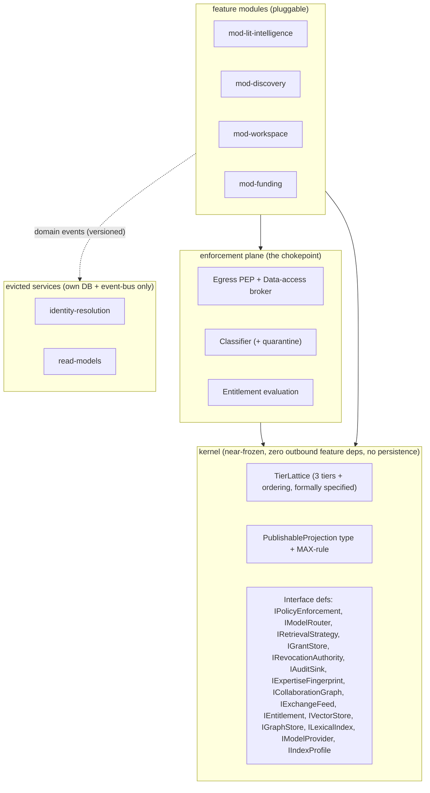
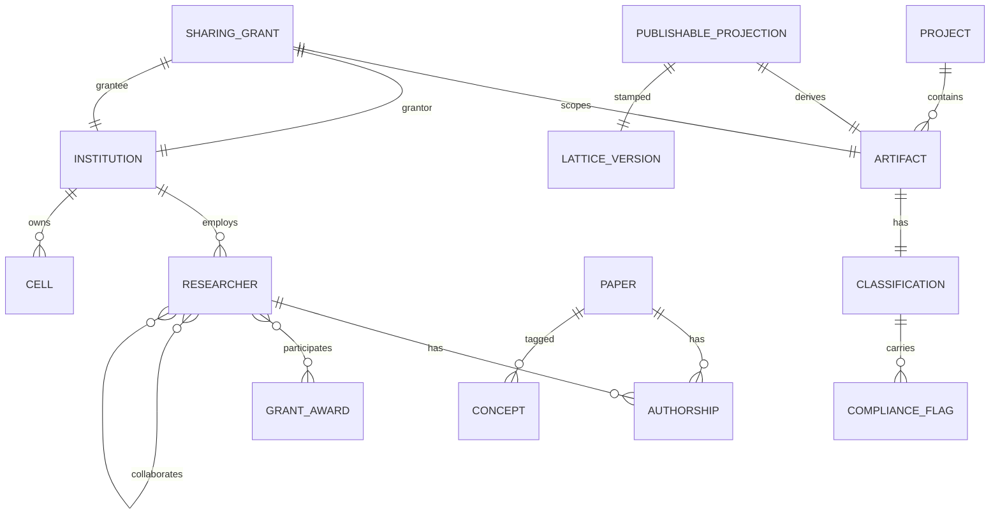
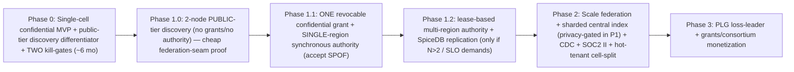

# Final Plan (polished from plan5)

# TigerExchange — Federated Multi-University Research Collaboration & Discovery Platform — Architecture & Business Plan v5 (Final)

*Self-contained. The architecture is constant across phases; build order and isolation posture are the levers. The confidential hot path is a local lease read, confidentiality is a single mediated chokepoint, the central-index privacy bound is proven before any real embedding ships, owner-side re-derivation is the universal cross-tenant invariant, and unit economics are reconciled against COGS.*

---

## 1. Vision & Positioning

**Product.** A federated, multi-university research collaboration and discovery platform. Each university runs a strongly-isolated node where its public, private, and confidential data lives. A thin shared **Exchange/control layer** enables selective, revocable cross-institution discovery and collaboration **without centralizing confidential data**.

**The white space.** Three incumbent categories each own one axis and none owns the intersection:

| Category | Examples | Owns | Structural blind spot |
|---|---|---|---|
| Research-data / CRIS | Pure (Elsevier), Symplectic, Clarivate, Dimensions | Faculty/publication data inside the research office | Centralized SaaS; **confidential cross-institution sharing cannibalizes their data-monetization model** |
| Enterprise secure-RAG | Glean, NotebookLM Enterprise, Copilot, Azure-OpenAI-on-your-data | Single-tenant grounded Q&A over internal docs | No federation, no cross-institution trust fabric, no scholarly graph |
| Research networking | ResearchGate, Academia.edu, LinkedIn | Public profiles + social graph | No confidentiality tier, no institutional control, no grounded retrieval |

The wedge is the **confidential federation fabric**: revocable, classification-enforced cross-institution sharing with provider-agnostic AI that keeps confidential data in-boundary. No incumbent can ship this without cannibalizing a core revenue model or rebuilding their trust architecture.

**Defensibility thesis.** We do **not** rest the moat on a competitor's presumed inaction. The moat is two compounding, *measurable* switching-cost mechanisms plus a certification-depth lead, raced explicitly:

1. **Data-gravity from accumulated trust artifacts** — sharing grants, audit history, per-tenant tuned eval gold-sets, and entity-resolution decisions accumulate per dyad. These are hard to export and grow with N and with grant-count. **Pulled forward to N=2** (not deferred to Phase 2): even a single dyad accrues grant history + audit chain + tuned gold-sets a replacement product cannot reproduce.
2. **Network effect** — discovery value and team-assembly quality grow super-linearly with connected nodes and active grants.
3. **Certification depth** — FERPA/GDPR/export-control (CMMC/ITAR-adjacent) readiness incumbents acquire slowly.

**Time-to-replicate estimate for an incumbent.** An incumbent can ship an isolated "private tier" in ~1 quarter, but the *federated confidential trust fabric* (cross-tenant authz, revocation correctness, owner-side re-derivation, audit anchoring) is a 4–6 quarter security program even for a well-resourced team — and they must do it without breaking their centralized data model. **The race condition (Risk R17):** we must reach **defensible N** before that window closes. Defensible N is defined concretely in §17 and its reachability confirmed in §18.

**Why now.** (a) Multi-site federally-funded research (NIH U-series, NSF AI institutes) is structurally cross-institutional and underserved by single-tenant tools. (b) Open scholarly corpora (OpenAlex, Crossref, ROR, ORCID, Semantic Scholar/SPECTER2) are now redistributable at scale. (c) Open-weight models on commodity GPUs make in-boundary confidential inference economical. (d) Tightening export-control and data-sovereignty regimes make "keep confidential data in-boundary" a hard procurement requirement, not a nice-to-have.

---

## 2. Users, Buyers & Packaging

### 2.1 Personas
- **Researcher / PI** — discovery, grounded literature intelligence, collaborator finding, grant-team assembly. **Budget authority ≈ $0; champions, does not sign.**
- **Lab director / center PI** — confidential workspace owner; the **beachhead economic buyer** for the Phase-0 wedge; controls discretionary/grant budget.
- **Research office (VP Research / sponsored programs)** — top-down institutional buyer; owns compliance and grant strategy; **6+ month committee cycle with veto chains.**
- **Library / scholarly comms** — corpus, profiles, OA strategy; frequent top-down co-buyer/champion.
- **IT / CISO / privacy office** — security/compliance gatekeeper on every motion; can veto.
- **Consortium / alliance director** — multi-institution governance buyer; annual/multi-year procurement.

### 2.2 The four (five) buyers, honestly mapped

| Motion | Budget owner | Deal size | Cycle | Security depth | Revenue phase |
|---|---|---|---|---|---|
| **Beachhead: industry-NDA lab / clinical center** (a fifth, corporate-research-adjacent buyer, named explicitly) | Lab/center director | **$75–150k/yr** (see §16) | 2–4 mo (sandbox path) | High (BAA/VRA even for sandbox) | **Phase 0** |
| Top-down institutional (research office/library/IT) | VP Research / Library / CIO | $150–600k/yr | 6–12 mo | High | Phase 1–2 |
| Consortia / alliances | Consortium director | $300k–1.5M/yr | 9–18 mo | High + governance | Phase 2–3 |
| Campus-wide | CIO / Provost | enterprise license | 9–18 mo | High + SAML/eduGAIN | Phase 2–3 |
| **Bottom-up PLG** (individual researchers/labs) | Individual (≈$0) | free / $0–$20/mo brand-surface | self-serve | Low (public + own-materials only) | Phase 3 |

**Locked-requirement reconciliation (explicit decision).** "Sellable to PLG" is satisfied by a **free/low-cost brand-surface tier whose purpose is land-and-expand into institutional revenue, not standalone PLG revenue.** PLG is a *loss-leader acquisition channel*, not a revenue funnel. We state this plainly and seek investor/founder sign-off that this satisfies the locked GTM requirement. If a stakeholder requires standalone PLG revenue, that is a *new* requirement that changes the model — surfaced now (§19 Q21), not discovered in Phase 3.

### 2.3 Editions = entitlement config, not forks

One platform; editions are resolved by a **first-class Entitlement/Edition module** (§5) that maps a tenant to a **capability set**, evaluated centrally. Modules consume capabilities as a contract (capability X on/off) and **physically cannot** enable a tier they are not entitled to.

| Edition | Capabilities | Target |
|---|---|---|
| **Lab/NDA** | confidential tier, HYOK, in-boundary inference, single-cell | beachhead |
| **Institutional** | + private tier, library RBAC, OIDC/SAML, full discovery | research office |
| **Consortium** | + exchange participation, cross-institution grants, team assembly | consortia |
| **Campus** | + campus-wide SSO (eduGAIN), seats at scale | campus |
| **PLG (brand surface)** | **public + own-materials ONLY; confidential/exchange capabilities hard-OFF** | individuals |

**Contract test (CI-enforced invariant):** *"A PLG-edition tenant cannot construct a confidential-tier request"* and *"an Institutional-edition tenant cannot construct an exchange-participation request."* Entitlements are evaluated at the PEP (§5/§7), not by per-module checks — so an edition can never open a tier ad hoc.

### 2.4 Value metric & metering (designed in day one; list prices later)

Metered axes, chosen to **not tax the network effect**: **seats** (institutional/campus), **confidential workspaces** (lab/consortium), **node/data-plane** (institutional/managed), **grant-team assemblies** (consortium add-on). We deliberately **do NOT meter per cross-institution sharing grant** — that would tax the exact behavior we want to bootstrap. The metering/entitlement module is pluggable (§5).

### 2.5 GTM sequencing
Phase 0 beachhead (NDA lab/clinical center, paid sandbox) → Phase 1 first federation **dyad sold into a pre-existing confidential-sharing relationship** (§3.4) → Phase 2 institutional + consortium → Phase 3 PLG brand-surface + grant monetization.

---

## 3. Feature Catalog & MVP Sequencing

### 3.1 The four locked feature pillars, as modules

| Pillar | Module | Consumes (interfaces) | Phase |
|---|---|---|---|
| **F1 Cross-institution collaborator/expert discovery** | `mod-discovery` | `IRetrievalStrategy`, `ICollaborationGraph`, `IExpertiseFingerprint`, `IExchangeFeed` | 1 (public-tier), 2 (PSI overlap) |
| **F2 Research & literature intelligence** | `mod-lit-intelligence` | `IRetrievalStrategy`, `IModelRouter`, `IPolicyEnforcement` | **0 (MVP)** |
| **F3 Secure shared cross-institution workspaces** | `mod-workspace` | `IGrantStore`, `IRevocationAuthority`, `IPolicyEnforcement`, `IAuditSink` | 1 (single grant), 2 (full) |
| **F4 Grant & funding intelligence + team assembly** | `mod-funding` | `IExpertiseFingerprint`, `ICollaborationGraph`, `IExchangeFeed` | 3 |

### 3.2 The MVP wedge + beachhead buyer
**MVP wedge:** `mod-lit-intelligence` — grounded Q&A + semantic search over a lab's confidential docs + public scholarly corpus, with classification-enforced in-boundary inference (confidential never leaves), HYOK-at-rest, and a research-native scholarly graph.

**Beachhead buyer:** **industry-NDA labs (primary) and PHI-under-BAA clinical research centers (secondary)** — the segments whose value proposition *is* confidentiality.

### 3.3 Two independent kill-gates

The Phase-0 appliance **does not inherit the federation moat** — it competes with Glean/NotebookLM on grounded Q&A. We therefore split validation into **two independent demand gates with independent pivot options**, *not* a build-order continuation:

- **Gate A (Phase-0, Week 1) — appliance demand:** ≥2 of 3 named labs give a **written price indication ≥ $75k/yr** (raised from $30k to clear COGS — §16) against a concrete budget line; ≥1 funds a paid sandbox pilot. *Fail → pivot the wedge before engineering.*
- **Gate B (Phase-0, Week 1, run in the SAME interviews) — federation thesis demand:** the SAME buyers (or a named peer pair) confirm **in writing** a *concrete, funded cross-institution confidential-sharing pain* — a named collaboration they cannot currently do, with a budget owner. *Fail → the federation thesis is unvalidated regardless of appliance revenue; Phase 1 becomes a second, independent kill-gate with its own pivot, NOT an automatic continuation.*

We state explicitly: passing Gate A while failing Gate B means we have a sellable commodity appliance and an unproven platform. That is a business decision point, not a green light to build federation.

### 3.4 Cold-start: sell into a pre-existing relationship
Federated platforms die in the dyad cold-start gap. **We will not create a new sharing relationship from scratch.** The first federation dyad must *digitize an existing legal sharing vehicle.* **Hard Phase-1 entry gate (ranked above the consortium-BD hire):** *"One pre-existing confidential-sharing relationship identified and its legal vehicle confirmed"* — e.g., an NIH multi-site U01/U54 center, an NSF AI institute, or a consortium with a master DUA already in force. The named industry-NDA beachhead is structurally *hostile* to federating its IP with a peer; therefore the federation dyad buyer is a **different, organically-multi-institutional unit**, identified before Phase-1 commitment.

### 3.5 Deferred & why
- **F4 grant intelligence** → Phase 3 (needs mature graph + N≥several).
- **PSI collaborator-overlap** → Phase 2, but **usability spiked in Phase 1**.
- **Multi-agent retrieval** → Phase 3 (cost/safety).
- **TEE-at-use, sovereign hosting, customer self-host** → Phase 2+ (separately funded line, §13).

---

## 4. System Architecture

### 4.1 Control-plane / data-plane split & federation topology

```mermaid
flowchart TB
  subgraph CP["CONTROL PLANE (regional-pinned: US / EU instances)"]
    EX["Exchange: federated discovery broker + grant registry index"]
    RA["Revocation Authority (lease-issuing, per-region replicated)"]
    ENT["Entitlement/Edition service"]
    IDP["Identity broker (Keycloak + CILogon/eduGAIN)"]
    TLR["TierLattice version registry (additive, fail-closed)"]
    CIDX["Managed central index + materialized PUBLIC-tier graph (sharded)"]
    TXP["Cross-tenant transparency log (audit anchor)"]
  end

  subgraph CELL_A["DATA PLANE — University A cell (isolated tenant)"]
    PEPa["Egress PEP + Data-access broker (single chokepoint)"]
    STOREa["Per-tenant stores: Postgres / vector / graph / lexical"]
    GRANTa["Authoritative GrantStore (A)"]
    AUTHa["Cell-local SpiceDB replica + lease cache"]
    INFa["In-boundary inference (vLLM) + KMS/HYOK"]
    AUDa["Hash-chained audit (per-stream) + checkpointer"]
  end

  subgraph CELL_B["DATA PLANE — University B cell"]
    PEPb["Egress PEP + broker"]
    STOREb["Per-tenant stores"]
    GRANTb["Authoritative GrantStore (B)"]
    AUTHb["SpiceDB replica + lease cache"]
  end

  IDP --> PEPa & PEPb
  ENT --> PEPa & PEPb
  TLR --> PEPa & PEPb
  PEPa -- "PUBLIC/SHARED projections only (CDC)" --> CIDX
  PEPb -- "PUBLIC/SHARED projections only (CDC)" --> CIDX
  EX <-- "discovery (no confidential payload)" --> PEPa & PEPb
  PEPa -- "brokered drill-down (deadline-propagated)" --> EX
  EX -- "owner-side re-derivation" --> PEPb
  RA -- "fenced leases (local read)" --> AUTHa & AUTHb
  AUDa -- "periodic signed chain-head checkpoints" --> TXP
```



**Invariant:** confidential payloads never enter the control plane. The Exchange holds only **PublishableProjections** (public/shared-tier, MAX-rule-bounded — §6/§11) and **grant *references*** (not contents). Cross-institution discovery operates on the central index of public/shared projections; **confidential collaboration happens via brokered, owner-mediated drill-down where the owner node serves its own data after re-deriving authority** (§4.3).

### 4.2 The single confidentiality chokepoint
**Every** retrieval, egress, and derivation in a cell flows through **one Policy Enforcement Point + Data-Access Broker.** Feature modules receive **already-projected, already-tier-checked result objects** and **never see raw classification logic or the raw store.** Enforced structurally:
- Import-linter forbids feature modules from importing the raw store, the classifier, or constructing a `PublishableProjection`.
- A runtime contract: the broker is the only holder of raw-store credentials (DB-role isolation, §5/§7).

Adding `mod-funding` (Phase 3) therefore **inherits enforcement for free** — it cannot leak because it never touches classified data except through the broker.

### 4.3 How cross-institution discovery & collaboration work WITHOUT centralizing confidential data

**Discovery (public/shared).** Owner cells publish MAX-rule-bounded projections to the central index via CDC (§10). Discovery queries hit the central index; **shared-tier hits are post-filtered at query time against the owner's live revocation epoch** (§4.4) so CDC lag never yields a stale hit.

**Confidential collaboration — brokered, owner-authoritative drill-down.**

**Universal invariant (generalized from export-only to ALL cross-tenant access):** *Owner-side authoritative re-derivation. Broker and grantee assertions are untrusted hints.* Every brokered request carries a **grant-ID**; the **owner node** looks the grant up in its **own authoritative GrantStore**, re-derives scope + tier + caveats + revocation status, and **ignores any scope claim in the token.** The broker is a deputy with credentials to many tenants; it can never be confused into widening scope because the resource server (owner) never trusts the presented scope.

**Token security:** per-tenant-signed, HSM-DPoP-bound, **audience-bound, single-use, short-TTL.** A replayed token hits the synchronous revocation check (§4.4) → live deny.

**Per-hop deadline-propagated latency budget for the brokered confidential drill-down (composite SLO = 6.5s):**

| Hop | Budget (p99) | Notes |
|---|---|---|
| Client → query cell | 150 ms | TLS + ingress |
| Query cell → Exchange broker | 120 ms | intra-region |
| Broker → owner cell (cross-region worst case) | 350 ms | RTT + queueing |
| Owner-side SpiceDB Check (**local replica read**, §7) | 20 ms | not cross-region (§4.4) |
| Owner-side revocation lease read (**local fenced lease**, §4.4) | 15 ms | **not a consensus round trip** |
| Owner-side retrieval + synthesis (model) | 4,500 ms | dominant; in-boundary inference |
| HSM sign (receipt) | 80 ms | fair-exchange receipt |
| Return path | 400 ms | |
| **Subtotal** | **5,635 ms** | |
| **Reserved slack** | **865 ms** | absorbs jitter |
| **Composite SLO** | **6,500 ms** | |

**Deadline propagation:** each hop passes a **shrinking deadline**; a hop that cannot meet its remaining budget **fails-closed-fast** rather than consuming the whole budget. **Circuit-breaker trip threshold = the hop's deadline fraction** — a *slow* owner node (gray failure, the dominant federation failure mode) trips at its budget boundary, not only when fully offline. Gray-failure (injected owner-node latency) is a **Phase-2 milestone test**, not just the offline case.

### 4.4 The revocation authority: lease-based local reads, not per-request consensus

**The flaw the prior revision caught:** a synchronous per-request check against a *multi-region consensus* authority on the un-sheddable confidential hot path is (a) an anti-scaling serialization point and (b) a total confidential-feature outage during any leader election/partition. We re-architect, deriving the budget instead of asserting it.

**Design (decision):** The Revocation Authority's **write path** uses Raft consensus (3-region quorum) for the authoritative monotonic fenced-counter ordering of revocations. The **read path on the hot path is a *local* read of a *fenced lease*, not a cross-region consensus round trip.**

- The authority issues **fenced grant-validity leases** (signed, HSM) to each owner cell, replicated locally. A lease asserts "grant G is valid through fenced-epoch E, lease-TTL = T."
- The hot-path check is a **local read** of the cell's lease cache: `lease.valid && now < lease.expiry && grant not in local tombstone-since-lease`. **No cross-region hop on the read path** (this is the 15ms in §4.3).
- On revocation, the authority commits the tombstone (Raft) and **invalidates outstanding leases** by pushing a signed tombstone delta; cells apply it locally.

**Latency derivation:**
- Hot-path read = local lease read = **~15ms p99** (no consensus, no cross-region RTT, no HSM sign on read).
- Revocation *write* = Raft commit (cross-region quorum, ~1.5× max inter-region RTT) + HSM sign ≈ **250–400ms p99** — off the read hot path, bounded, and tied to the bulk-revoke ceiling (§4.6).

**The honest fail-open window = lease TTL (decision).** Between a revocation commit and lease-delta propagation, a stale lease could serve. We make lease-TTL the explicit, first-class confidential allow-window and drive it to the smallest value the propagation fabric sustains.

- **Default lease TTL = 2s** for confidential grants (push-invalidation typically lands sub-second; TTL is the *worst-case* bound if push fails).
- **Highest-sensitivity / security-reason revocations** (§4.5) take a **synchronous owner→authority confirm** (accepting the cross-region cost on that *narrow subset only*), so the allow-window for those is **zero**.

**CAP posture under authority partition (decision, with published numbers):**
- Confidential reads continue serving against the **local lease** until TTL expiry, then **fail-closed-deny** (correct for confidentiality) — so a control-plane partition is **NOT** an instant total outage; it is a **TTL-bounded graceful degradation**, then deny.
- **Published number (release gate, not target):** at a measured cloud inter-region partition rate, with 99.95% authority SLO and 2s TTL, expected confidential-feature deny-minutes/year is **derived from the Phase-1 spike and published** (Q4). Open Question #4 reports a **measured** number as a **release gate**.

This reconciles "synchronous deny-correct revocation" with "horizontally scalable": the hot path is a **local read**, scaling horizontally per cell; only the low-rate *write* path touches consensus.

### 4.5 Revocation by *reason*, not just tier
The allow-window distinguishes **reason**, not only tier:
- **Security / consent-withdrawal / compromise / GDPR Art. 7(3) / FERPA-revocation** → **synchronous deny-correct path, zero allow-window, regardless of tier.**
- **Benign administrative revocation of low-sensitivity public/shared data** → bounded allow-window (lease-TTL) acceptable.
- The recovery-path window has a **hard ceiling** for personal-data tiers; exceeding it triggers fail-closed (not "recovery-measured"). The per-tier, per-reason **maximum-staleness commitment** is stated explicitly and confirmed with DPO (Q13) and registrar (Q14).

### 4.6 Skew & ordering
No self-asserted timestamp orders a security decision; ordering uses the **authority's fenced monotonic counter.** **Skew-excursion behavior (explicit decision):** a node whose clock skew exceeds `max_skew_bound` **fails-closed-deny for its own security decisions + alarms** (a skewed node making security decisions is unsafe). Expected excursion rate and blast radius are quantified (single node, its users) and accepted. The authority's fenced-counter write path is confirmed to sustain the **worst-case bulk-revoke rate** via tombstone coalescing (tenant/scope-version supersedes N); the **revocations/sec ceiling is published** and tied to bulk-revoke saturation handling (deny-wider on saturation, never global-stall).

---

## 5. Modularity Model

### 5.1 Canonical module map
A committed artifact `shared/contracts/MODULE_MAP.md` is the single source of truth; the **import-linter config is its executable mirror.**



### 5.2 Module definition, isolation, versioning, communication
- **A module** = an owned schema + owned DB role + a set of published domain events + consumed/published interfaces. It owns its data; no other module reads its tables.
- **Isolation from day one:** even inside the Phase-0 modular monolith, **per-module Postgres schemas + per-module DB roles with `REVOKE` on other schemas** are enforced. This is DDL + GRANT, nearly free, and makes data ownership a checkable boundary on day one — so Phase-1 extraction is mechanical, not a retrofit. Paired with import-linter + a **"no cross-schema query" lint/runtime check.**
- **Communication = published domain EVENTS with a versioned schema:** an in-process event bus in Phase 0 using the **same versioned contract** (Protobuf + schema registry + compatibility rules) that Kafka will carry later. **CDC/Debezium is permitted ONLY for replicating a module's OWN data to its OWN read store — never as a cross-module integration API.** Each topic states **idempotency, ordering, and replay guarantees** explicitly. We do not claim "event-bus-only" decoupling without this contract.

### 5.3 Add/remove a module with minimal blast radius
- **Add:** register edition capabilities; declare consumed interfaces; receive already-projected objects from the broker. No confidentiality re-threading (chokepoint, §4.2).
- **Remove:** disable its capability in the Entitlement service; drop its schema; deregister its events. Blast radius bounded by its owned schema + its event consumers (enumerated in the module map).

### 5.4 Extraction trigger (concrete, not a vibe)
A module is extracted to its own service **when EITHER:** (a) it needs independent horizontal scaling (measured: its CPU/QPS exceeds 40% of the cell budget while siblings are idle), **OR** (b) its change-frequency exceeds 2× the cell median for 2 consecutive months (release-cadence conflict). Extraction = own DB (already true) + event-bus-only (already true) → mechanical.

### 5.5 Bounded kernel — checkable fitness function
**Kernel membership rule (stated, not referenced):** a type/interface belongs in the kernel iff **(a) zero dependencies on feature modules, (b) no persistent state, (c) referenced by ≥2 features.** Anything failing these is **evicted** (identity-resolution and read-models are evicted by this rule). Enforced by **import-linter contracts + a CI check on kernel package fan-in and size.**

### 5.6 TierLattice: additive, safe-by-construction
We **DROP "control plane refuses activation until all attest"** — that is a global liveness barrier across autonomous nodes (deadlocks or silently degrades). Replaced with **additive, versioned, fail-closed-by-construction:**
- The **core lattice is a tiny, near-frozen, formally-specified type** (3 tiers + ordering + MAX-rule). Feature-specific classification *codes* live in per-module policy mapping onto the frozen lattice (separates SAFETY semantics from EXTENSIBILITY).
- **Version negotiation:** nodes advertise supported lattice versions; the Exchange operates at the **min-common version.** New tiers/codes are **additive with default-deny**: an un-upgraded node treats an unknown tier as **MOST-restrictive (confidential, fail-closed)** — so heterogeneous lattices are **safe-by-construction**, never blocked-by-barrier and never comparing on a stale lattice incorrectly (the MAX-rule of an unknown-as-most-restrictive value is always safe).
- **Two-phase rollout:** all nodes RECOGNIZE a value (fail-closed default) *before* any node EMITS it. Feature emission is gated on the consuming node's attested version — an un-upgraded node simply cannot *receive* new-tier records; it never blocks the platform.
- **Reclassification recall:** every PublishableProjection is **stamped with the lattice-version it was derived under.** A *tightening* lattice change or per-artifact reclassification triggers a **re-derivation/withdrawal pass** over affected published projections and indexed embeddings (recallable by construction, tied to the declassification audit trail).

### 5.7 Defer governance machinery until it's needed
Conformance-attestation activation gates, formal multi-consumer deprecation lifecycles, and version-matrix caps **solve coordination problems that only exist at many-consumer scale.** They are **explicitly deferred to N≥5 (Phase 2).** Phase 0–1 use a modular monolith + `mypy assert_never` + ordinary contract tests + the additive-lattice rule above. This deferral is stated, not silently dropped.

### 5.8 Swappable AI router & retrieval via interfaces
- **`IModelProvider`** declares: capabilities (context window, embedding dim, tool-use, structured-output), **which locality-classes it satisfies**, cost, and a no-train/retention attestation. The router selects over a **registry of providers that DECLARE the locality classes they satisfy** — *not* a hardcoded tier→provider table. BYO endpoints register as providers with **attested** locality. (See §8.)
- **`IVectorStore`, `IGraphStore`, `ILexicalIndex`, `IRetrievalStrategy`** insulate callers from engine choice; RRF fusion and the planner consume only these. A **conformance suite** (multi-hop/PPR correctness) gates any `IGraphStore` impl, making Neo4j/Memgraph a drop-in, not a rewrite.
- **`IIndexProfile`** = (embedding-model-version, engine, DP params). The **central-index privacy bound is pinned to an IIndexProfile**, so an embedding swap **forces re-validation through a gate** rather than silently invalidating the bound (§8/§11).

---

## 6. Data Model & Knowledge Graph

### 6.1 Core entities & ER



**CLASSIFICATION** = `{tier: public|private|confidential, codes: [...], compliance_flags: [FERPA|IRB|ITAR|EAR|GDPR-personal], lattice_version}`. **COMPLIANCE_FLAG** is sticky (UNION on join, §11). **SHARING_GRANT** is explicit, revocable, scope-bounded, owner-authoritative (§4.3).

### 6.2 Scholarly ingestion (public-tier, redistributable)
- **OpenAlex snapshot** (works, authors, concepts, institutions) — base graph.
- **Crossref** — DOI metadata, references.
- **ROR** — institution disambiguation.
- **ORCID public dump** — author identity anchors.
- **Semantic Scholar / SPECTER2** — paper embeddings for semantic similarity.
- **PMC / Europe PMC OA-subset** — full text under a **commercial-OK OA filter** (Q16 sizes the usable corpus).

### 6.3 Entity resolution / author disambiguation across institutions
Deterministic anchors (ORCID, DOI, ROR) first; probabilistic blocking (name + co-author + concept + affiliation-time) for the unanchored tail. **`identity-resolution` is an evicted service** (own DB + events). Cross-institution resolution decisions are **trust artifacts that accumulate as data-gravity** (§1). Confidential records are resolved **inside the cell only** — resolution never crosses the boundary.

---

## 7. Identity & Access Control

### 7.1 Federated identity
- **Keycloak** per-cell + control-plane broker.
- **CILogon / eduGAIN / InCommon (SAML)** for university federation. **Phase-0 reality:** the beachhead lab uses plain **OIDC (Okta/Entra)** — confirmed in the kill-gate. **ANY university campus-wide or consortium buyer triggers SAML/eduGAIN brokering**, sized now in engineer-weeks (Q10) and gated behind that line being built. Phase-0 ships **Direct OIDC to the buyer's single IdP** only.

### 7.2 Authz model: ABAC (Cedar) + ReBAC (SpiceDB/OpenFGA)
- **ABAC (tiers + attributes)** via **Cedar** (narrow, fail-closed) — evaluates classification tier × subject attributes (FERPA authorization, US-person status, edition capability).
- **ReBAC (sharing grants)** via **SpiceDB/OpenFGA** — relationship graph for grants, workspaces, membership.

### 7.3 Authz data model (concrete)
```
// ReBAC (SpiceDB schema sketch)
definition institution { relation member: user }
definition workspace { relation owner: institution; relation collaborator: user | institution#member }
definition artifact { relation parent: workspace; relation grantee: user | institution#member
  permission view = grantee + parent->collaborator + parent->owner->member }
// every grant carries: grant_id, scope, tier, caveats, lattice_version, revocation_epoch
```
**ABAC overlays:** a `view` permission is necessary but not sufficient — the **PEP additionally evaluates Cedar** (tier vs requester attributes vs edition) **and** the **revocation lease** (§4.4) before release.

### 7.4 Cell-local SpiceDB: go/no-go fork, not a fallback
We treat ZedToken→local-revision translation as a **Phase-1 go/no-go architectural fork, prototyped Week 1, MEASURED.**
- **Prototype:** SpiceDB replication (`Watch`/`LookupResources` + local materialized cache with a **stated staleness bound**); measure replication lag + fail-closed-on-lag behavior.
- **If monotonic reads under lag CANNOT be guaranteed:** we **do NOT ship "synchronous cross-region Check on every request"** (that would blow both the p95<800ms discovery SLO and the 6.5s confidential SLO). Instead: **cache authorization decisions cell-locally with a short bounded TTL** (the staleness bound becomes a **first-class consistency guarantee**), and take a **synchronous re-check ONLY on the confidential-sensitive subset** — collapsing into the §4.4 lease design. The common private/discovery path is a local cached read.
- The cell-local authz read (20ms, §4.3) is therefore a **local read by construction**, never a per-request cross-region consensus check.

### 7.5 Policy Decision Point location
The **PDP sits at the cell-local PEP** (the chokepoint, §4.2) for all in-cell access. For cross-tenant access, the **PDP is the OWNER cell's PEP** (owner-side re-derivation, §4.3) — never the broker, never the requester's cell.

---

## 8. AI / Model-Router Layer

### 8.1 Classification-routed, provider-agnostic router
The router selects over the **`IModelProvider` registry** (§5.8). Each provider **declares the locality classes it satisfies**; the router matches the data's classification to a provider that satisfies the required locality **and** the requested capability/cost. **Single source of truth:** one **policy table** that both router and transport (egress) consult; disagreement = "router violated given policy" → hard-fail. A precedence change is a single-table edit.

### 8.2 Routing rules (fail-closed)
| Data class | Allowed providers |
|---|---|
| **confidential** | in-boundary self-hosted ONLY (vLLM prod / Ollama dev) |
| **export-controlled (ITAR/EAR)** | in-boundary self-hosted on an **export-conformant cell** (§11.6) ONLY; **BYO refused unless TEE-attested + jurisdiction-proven** |
| **private (institution-internal)** | in-boundary, or BYO endpoint with attested locality |
| **public / low-risk** | cloud frontier (Anthropic/OpenAI/Google) or local |

### 8.3 BYO provider/keys per institution
- BYO endpoints register as `IModelProvider` with **attested** locality.
- **"No-retention" is a CONTRACTUAL control** (matching the honesty applied to HYOK-at-rest), with a **TEE-attestation technical upgrade path.** mTLS proves endpoint identity; in-boundary network proof shows traffic stays in a controlled boundary — **but neither cryptographically prevents a BYO provider from logging prompts.** We do not overclaim.
- **For export-controlled / EU-personal data:** the BYO endpoint **MUST present TEE-with-remote-attestation** (enclave + no-log proof + jurisdiction proof + named-person access controls = the concrete definition of **"sovereign-verified"**, specified in `shared/contracts/`). **If the BYO provider cannot attest, the router fails closed and falls back to the in-boundary self-hosted model** — a **fail-closed routing rule in the policy table**, not a contractual caveat.
- BYO is constrained to a **pre-certified matrix (2–3 clouds, 2–3 providers)** in early phases and priced as a higher-touch edition with professional-services attach.

### 8.4 Embeddings & serving
- **Embeddings:** SPECTER2 (scholarly) + BGE/Qwen3 (general). **Embedding-model identity is a versioned property of the index (`IIndexProfile`)** with an explicit **re-embed migration contract**; a swap is **gated** (re-validates the membership-inference bound, §11), never silent.
- **Serving:** vLLM (prod, multi-GPU tensor-parallel); Ollama (dev, M4 Max 36GB — **UI/pipeline dev only, never the confidential-path test target**, §15).

### 8.5 Guardrails
Output-channel egress check (§11.5: completions grounded in tainted sources re-checked against requester attributes), prompt-injection filtering on retrieved context, tier-pinned tool use, PEP-on-every-agent-action (Phase 3 multi-agent).

---

## 9. Retrieval Architecture

### 9.1 Hybrid retrieval (MVP-essential)
Vector (`IVectorStore`) + BM25 (`ILexicalIndex`) + **RRF fusion**, behind `IRetrievalStrategy`. **Reranking** (cross-encoder) on top-k. This is the Phase-0 `mod-lit-intelligence` core.

### 9.2 GraphRAG & agentic (later, justified)
- **Ego-graph traversal** for collaborator context — Phase 1.
- **HippoRAG2 / personalized PageRank** — Phase 2, **post-AGE-verdict** (Q6).
- **Bounded-candidate team assembly** (no global PPR over the central graph — §6) — Phase 2/3.
- **Agentic/planner strategies (CRAG, multi-hop)** — Phase 3, capped + tier-pinned + PEP-on-every-action.

### 9.3 Evaluation harness
**RAGAS-in-CI** (faithfulness, context-precision/recall) with a **GPU-staging prod-size judge.** Per-tenant gold-sets (data-gravity) built **inside the cell** (Q20). Eval-in-CI is a **release gate** for retrieval quality (§15).

### 9.4 Discovery correctness under partial failure
**Decision:** the **common public/shared discovery path uses per-shard partial-results-with-honest-completeness-indicator** (coarse + noised), **NOT whole-query-fail-closed** — one slow/partitioned shard degrades a *bounded fraction* of results with an explicit completeness flag, never empties the query. **Whole-query-fail-closed is reserved for the confidential path only.** The DP-noise impact on **top-k recall is quantified** (a measured number, not a deferred decision) and the **shard-failure blast radius is stated** (one shard down = which fraction degraded). Per-shard `incomplete` is not exposed per-topic (covert-channel decoupled from topology).

---

## 10. Data Pipelines & Orchestration

### 10.1 Orchestration substrate ownership (one-line rules)
| Substrate | Owns ONLY |
|---|---|
| **Dagster** | ingestion / distillation / index **batch DAGs** |
| **Temporal** | durable, compensating, long-lived **business workflows** (grant lifecycle, revocation-propagation side-effects) |
| **Kafka/CDC** | **data replication to read stores** — never business logic |

**Rule committed to the contracts doc; new background work is gated against it in review.** **Decision: Temporal is deferred — Phase 1 grant-lifecycle uses a Dagster sensor + Temporal only when a customer contract requires durable compensation**, deferring a whole substrate.

### 10.2 Ingestion/distillation
Dagster DAGs: crawl/snapshot → entity-resolve → distill (research cards) → **classify (gates index)** → embed → index → graph-build. **Classify-gates-index** is a hard edge: unclassified/quarantined records (§11.1) **never enter any index.**

### 10.3 Cell↔Exchange sync: CDC consistency contract
Debezium + Kafka, **CDC ordering keyed per-(tenant, record)** (NOT per-tenant) so grant/revoke/republish for one record are **totally ordered.** The **index consistency contract:**
- (a) Every index record carries `PublishableProjection.version + grant_epoch`. The applier is **idempotent and MONOTONIC** — it **rejects lower-epoch applies**, so connector replays / Debezium snapshots **cannot resurrect** a revoked or downgraded record.
- (b) **Shared-tier discovery results are post-filtered at query time against the owner's live revocation bitmap/epoch** — the bitmap is **promoted from "perf only" to a correctness gate for shared-tier discovery**, so CDC lag never yields a stale HIT.
- (c) A **bounded staleness SLO** is stated and tested: **share→discoverable ≤ 30s, revoke→undiscoverable: synchronous via the query-time epoch filter (effectively immediate for hits), CDC index removal ≤ 30s.**

### 10.4 Consistency model
- Within a cell: **strong** (transactional Postgres + read-your-writes).
- Cell→central index: **eventual with bounded staleness** (§10.3) + **query-time epoch post-filter for correctness.**
- Revocation: **deny-correct** (synchronous for security-reason/high-sensitivity; lease-TTL-bounded for benign low-sensitivity — §4.4/§4.5).

---

## 11. Security, Privacy & Compliance

### 11.1 Classifier abstention = quarantine, Phase 0
**Explicit fail-closed semantics (Phase 0, NOT deferred):** any record the single classifier **cannot confidently label** (below a stated confidence threshold) is **quarantined to `unclassified = confidential, excluded-from-ALL-retrieval`** and routed to a **human adjudication queue** before it can enter any index. The confidence threshold + review queue are **Phase-0 build items.** A confidently-labeled record uses its label. (Default-to-confidential-everywhere would lock the product; default-to-anything-less leaks — quarantine-on-uncertainty is the only safe resolution.) The **dual classifier (agreement-for-tier-down) is deferred to Phase 1**, but **default-deny-on-abstention is Phase 0.**
**Phase-0 contract test:** inject low-confidence and **adversarial records (confidential content with public-looking metadata)**; assert **zero leak** into any retrievable surface.

### 11.2 Central-index privacy bound proven BEFORE real embeddings ship
The index is a **one-way door** (published embeddings cannot be unpublished). We move the membership-inference + embedding-inversion + cross-tenant-linkage red-team to a **Phase-1 GATE on the index DESIGN — proven on SYNTHETIC/de-identified corpora BEFORE any real embedding is written.** (A Phase-2 GA gate would be past the point of no return.)
- The **quantified resistance bound (ε, k, churn-noise) is specified in `shared/contracts/` pinned to an `IIndexProfile`.**
- **Cross-tenant co-occurrence/linkage inference is explicitly in the threat model** (not just per-record inversion): correlating public-tier presence/churn across consortium members to infer the *existence* of an undisclosed confidential collaboration is a metadata leak even with a perfect MAX-rule. Mitigations: presence/count/churn DP-noise, k-anonymity, **per-consortium scope-keys**, and **decoupling churn signals from tenant identity.**
- A **rollback/re-embed procedure** is specified if the bound is later found insufficient (versioned, provenance-carrying projections = recallable by construction).

### 11.3 Confidential-tier crypto & key lifecycle
- **At rest:** per-tenant KMS + **HYOK** (customer-held keys, vendor-blind-at-rest). **HYOK is NOT overclaimed for at-use** — plaintext-at-use residual is stated; TEE-at-use is the upgrade path.
- **Envelope encryption** for confidential shared artifacts: revocation/offboarding triggers **crypto-shred of the data-key wrapping** so retained ciphertext becomes undecryptable.
- **Per-consortium scope-keys ROTATE on membership change**; consortium dissolution rotates keys (crypto-shred).
- **`allow_durable_copy` (default false):** if a durable copy was granted, the **UI/audit state plainly that revocation is best-effort and the copy is permanent** — you cannot recall a key the grantee already used. Offboarding/consortium-dissolution key-rotation is a **Phase-2 milestone** alongside joint-controller arrangements.

### 11.4 Audit: anchored against the node operator
- **Hash-chained, tamper-evident per-stream audit.** **Per-(tenant/stream) PARALLEL chains** (not one global serial chain) — the serial-hash constraint becomes per-stream, removing the per-cell single-writer throughput ceiling. **Audit-append rate ceiling is stated and confirmed to exceed peak served-operation rate per cell.** Cross-stream **anchoring** preserves global tamper-evidence without global serialization.
- **External anchoring against the operator (insider/compelled-access threat in the model):** every node's audit chain emits **periodic signed chain-head checkpoints to the control-plane transparency log and/or an RFC-3161 TSA / public transparency log.** This makes the chain tamper-evident **even for internal-only access and even against the node operator** (the multi-institution mutual-distrust premise requires NOT trusting the operator). The **checkpoint interval = the maximum undetectable-rewrite window**, a compliance-tier parameter.
- Fair-exchange receipts (commit-then-serve) for disclosure; divergence auto-suspends + P1.

### 11.5 Sticky taint flows to the COMPLETION
Compliance flags are **sticky (UNION on join).** **The taint flows to the AI completion:** a grounded answer over tainted sources is a confidentiality/export event **at generation time.** **The egress PEP covers the model OUTPUT channel to the user** (not only cross-node publication): at **generation/response time** it re-checks the **requester's attributes** (FERPA authorization, US-person status). **Completions grounded in export-controlled sources inherit export classification** and are gated by the same US-person determination. **Contract test:** a foreign-person requester gets deny/redaction when the grounded answer would reveal export-tainted content, even though they could retrieve the differently-classified surrounding context.

### 11.6 Export control: operational-access surface, not just end-users
**Decision:** export-controlled data is **FORBIDDEN on any non-export-conformant cell** (not merely "priced for export"). An **export-conformant cell requires:** US-person-only **vendor operational staff**, **US-region hosting**, and **TEE-at-use** (to remove vendor operational access from the deemed-export surface). The **router/cell-placement policy refuses to place export-classified data on a non-conformant cell.** Vendor-personnel-nationality and hosting-region are part of the **export conformance attestation.** End-user control (owner-side US-person determination + named-individual allowlist) is necessary but **not sufficient** — operational access is covered too (confirmed with the export-control officer, Q12). Until export-conformant cells exist (Phase 2+), **export-controlled data is not accepted.**

### 11.7 GDPR cross-border transfers
**Every cross-region/cross-border flow is mapped to a transfer mechanism as a Phase-1/2 design artifact** (not a team-table line):
- **EU control-plane + EU Exchange instance pinned to EU regions** — confidential-path lease consultations and brokered-drill-down metadata for EU data **never leave the EEA.**
- Public-tier graph contents (researcher names/affiliations = **personal data**): the materialized public-tier graph is a **centralized personal-data store**; we confirm with the **DPO** whether a **published/legitimate-interest basis** is defensible and **whether opt-out-default vs opt-in/consent** is required for EU subjects (GDPR often requires a documented legitimate-interest balancing test; **opt-out-default may not satisfy it** — Q13).
- Per-plane controllership: **cell = processor, Exchange = joint-controller** (Art. 26 arrangements + lawful basis as an **EU-index release gate**).

### 11.8 Threat model & top mitigations
| Threat | Mitigation |
|---|---|
| Misclassification (root leak) | quarantine-on-abstention (§11.1) + adversarial contract test |
| Federation-seam leak | single PEP chokepoint + structural PublishableProjection + MAX-rule incl. codes |
| Revocation fail-open | lease-based deny-correct + synchronous for security-reason (§4.4/4.5) |
| Confused-deputy / cross-tenant IDOR | owner-side re-derivation universal invariant + grant-ID lookup + audience-bound single-use tokens (§4.3) |
| Cross-tenant linkage inference | DP-noise + k-anon + scope-keys + churn decoupling (§11.2) |
| Operator audit rewrite | external chain-head anchoring (§11.4) |
| RAG output leak | output-channel PEP re-check at generation (§11.5) |
| Deemed export (operational) | export-conformant cells only (§11.6) |
| Retained-ciphertext after revocation | envelope crypto-shred (§11.3) |

### 11.9 SOC2 / ISO readiness
**SOC2 Type I timing is a function of buyer demand, NOT a fixed Phase-0 commitment.** The Phase-0 sandbox/de-identified pilot is structured to avoid the full prod review; SOC2 Type I is targeted at the **Phase-0/1 boundary** (deferrable if the sandbox pilot doesn't require it, saving Phase-0 cash — validated with a real CISO, Q17). SOC2 Type II → Phase 2; ISO 27001 → Phase 3 (EU).

---

## 12. Technology Stack

| Layer | Primary | Fallback | Licensing flag |
|---|---|---|---|
| Backend | Python 3.12 / FastAPI | — | — |
| Module isolation | per-schema + DB-role + import-linter | — | — |
| ABAC | Cedar | OPA | both OSS |
| ReBAC | SpiceDB | OpenFGA | SpiceDB Apache-2; **AuthZed managed = paid** |
| Vector store | Qdrant | OpenSearch kNN | Apache-2 / Apache-2 |
| Lexical | OpenSearch BM25 | Tantivy | Apache-2 |
| Graph | Apache AGE (on Postgres) | Neo4j (**GPLv3 — isolate**) / Memgraph (**BSL**) | **license flags noted** |
| Embeddings | SPECTER2 + BGE/Qwen3 | nomic | check model licenses |
| Serving | vLLM (prod) | Ollama (dev only) | Apache-2 |
| Orchestration | Dagster | — | Apache-2 |
| Durable workflows | Temporal (**deferred**) | Dagster sensor | MIT / **Temporal Cloud metered** |
| CDC/stream | Debezium + Kafka (Phase 2) | — | **MSK/Confluent monthly floor** |
| Identity | Keycloak + CILogon/eduGAIN | — | **CILogon commercial quote — Q10** |
| KMS/HSM | Cloud KMS + CloudHSM | — | **CloudHSM ~$1–2/hr/instance** |
| IaC/orchestration | Terraform + Kubernetes | — | — |
| Eval | RAGAS in CI | — | — |
| Frontend | Next.js + React | — | — |

(Engine choices are insulated behind §5.8 interfaces; the central-index privacy bound is pinned to `IIndexProfile`, so swaps are gated.)

---

## 13. Deployment & Infrastructure

### 13.1 Topology
Control plane (US + EU regional instances) + **per-tenant/per-region data-plane cells.** Each cell: isolated namespace, per-tenant KMS/HYOK, SpiceDB replica + lease cache, vector/graph/lexical stores, in-boundary vLLM, per-stream audit.

### 13.2 Managed vs self-host
**Explicit per-phase deployment decision:**
- **Phase 0–1 = MANAGED-cell-only (startup-operated).** No installer, no field SRE.
- **Customer self-host (on-prem / customer-cloud) = an explicitly-deferred, separately-priced edition with its OWN engineering line** (shippable installer, upgrade CD, version-skew management, support SLA) **that does NOT exist until Phase 2+.**
- **Export/CMMC/sovereign buyers most often mandate self-host AND export-conformant cells (§11.6); their pursuit is asterisked/deferred until that line is funded.** We do not promise these buyers in Phase 0–1.

### 13.3 Hot-tenant cell-split protocol
**Decision for early phases:** rather than risk an online split, **the largest beachhead tenant (pharma/hospital-system) is provisioned in a DEDICATED cell from day one** — so we never split it. A **per-cell tenant-size ceiling is stated.** When cell-split is needed (Phase 2), it is specified as a **migration protocol**: how SpiceDB relationships + revision/lease tokens migrate **without breaking monotonic reads**; how the **CDC stream is fenced/replayed** against the new cell; how **active revocations are quiesced/carried across the cut** (online vs offline stated). Botched-split = confidentiality-correctness incident, so dedicated-cell-from-day-one is the early default.

### 13.4 IaC/k8s posture
Terraform + k8s; per-cell Helm release; GitOps; **persistent cloud GPU staging** for confidential-path tests (§15), not the M4 Max.

---

## 14. Scalability & Reliability

### 14.1 Consistency model
See §10.4. Hot path = **local reads** (lease + cached authz); consensus only on the low-rate revocation write path → horizontally scalable per cell.

### 14.2 Central index/graph growth model — costed in the body
**Decision: the central index/graph is SHARDED + replicated (NOT a single managed instance).** Hybrid topical-macro + per-tenant sub-partition; **a tenant's bitmap stays in a bounded shard set** with per-shard admission control.

**Growth model (public-tier only — confidential never centralizes):**

| Scale | Papers/profiles (public) | Embedding bytes (1024-dim fp16 ×2 models) | Graph nodes/edges | Index store (est.) |
|---|---|---|---|---|
| N=10 | ~5M | ~20 GB | ~15M / ~80M | ~60–100 GB |
| N=50 | ~25M | ~100 GB | ~75M / ~400M | ~300–500 GB |
| N=200 (R1) | ~80–100M | ~320–400 GB | ~300M / ~1.6B | ~1.2–2 TB |

- **Sharded across nodes:** at N=200, ~1.2–2 TB spread over a sharded vector store (Qdrant) + sharded property graph — **no single-node vertical ceiling**; the **N at which a single instance breaks (~300–500 GB, i.e., N≈50) is named as the trigger to shard.**
- **Whole-corpus re-embedding** (on model upgrade) = a **multi-day GPU job scaling linearly with corpus size**; **recurring cost modeled as f(corpus-size × upgrade-cadence)** and gated by `IIndexProfile` re-validation. Exercised on synthetic data once (Phase 2), but its **recurring linear cost is in the COGS model (§16), not the appendix.**
- **COGS is tied to this growth model** (§16) — `$X/mo = f(N)`, not a constant.

### 14.3 Bottlenecks & levers
| Bottleneck | Lever |
|---|---|
| Revocation write throughput | tombstone coalescing; published revocations/sec ceiling (§4.6) |
| Audit append | per-stream parallel chains (§11.4) |
| Central index size | shard at N≈50; per-shard admission control (§14.2) |
| Hot tenant | dedicated cell from day one + cell-split protocol (§13.3) |
| Brokered drill-down latency | deadline propagation + circuit breakers (§4.3) |
| PSI scaling | **Phase-1 usability spike**; pairwise PSI is **O(N²)** across the federation — bounded set sizes; **documented fallback: k-anonymized bucketed overlap via the central index** so the feature is NOT architecturally dependent on cryptographic PSI |

### 14.4 Failure domains
Per-cell isolation = blast-radius containment. Control-plane partition → **TTL-bounded confidential degradation then deny** (§4.4). Gray-failure (slow owner node) → circuit-breaker trip at deadline boundary (§4.3). One shard down → bounded fraction of public discovery degraded with honest completeness flag (§9.4).

### 14.5 SLOs
- Grounded Q&A (Phase 0): **p95 < 4s.**
- Federated discovery (Phase 2): **p95 < 800ms** under continuous ingest.
- Confidential brokered drill-down: **composite p99 < 6.5s** (per-hop budget, §4.3).
- Revocation hot-path read: **p99 < 15ms** (local lease).
- Revocation authority: **99.95%**; confidential allow-window = **lease-TTL (2s default; 0 for security-reason).**
- share→discoverable **≤ 30s**; revoke→undiscoverable hit-filter **immediate**, index-removal **≤ 30s.**

---

## 15. Observability, Testing & CI/CD

### 15.1 Telemetry
OpenTelemetry traces across cells + control plane; **deadline propagation surfaced in traces**; per-cell SLO dashboards; revocation-propagation lag metric; CDC-staleness metric.

### 15.2 Testing strategy
- **Consumer-driven contract tests (Pact-style) between EVERY cell and the Exchange** — both sides' expectations versioned + CI-enforced (not one ephemeral integration test/release).
- **Property-based tests** of the TierLattice MAX-rule, sticky-flag UNION, source-class re-derivation: generate random tier/flag combinations, **assert the published projection NEVER exceeds source class.**
- **Deterministic simulation tests** (injected-clock + partition harness) for clock-skew, authority partition, revoke-ordering, **bulk-revoke saturation — run EVERY CI**, not as one-time milestones. This is what makes the kernel refactor/eviction (§5.5) safe to execute.
- **Eval-in-CI** (RAGAS) as a retrieval-quality release gate.
- **Confidential-path tests run against a vLLM container in CI** (not Ollama), and against cloud GPU staging — never the M4 Max.
- Security contract tests: zero-leak adversarial classifier; broker-over-assert-denied; grantee-over-assert-denied; replayed-token-for-revoked-grant-denied; foreign-person-completion-redacted; PLG-cannot-construct-confidential.

### 15.3 Release / rollback
GitOps; per-cell canary; **lattice changes are additive + two-phase (recognize-before-emit, §5.6)**, so rollback never strands records; index changes are versioned + recallable (§5.6/§11.2).

---

## 16. Cost Model & Team

### 16.1 Per-service monthly floor table

| Service | Idle floor (N=1) | N=5 | Notes |
|---|---|---|---|
| Managed cell compute + storage | ~$1.2k/mo | ~$5k/mo | |
| vLLM GPU (confidential inference) | ~$1.5k/mo (shared/burstable) | ~$4k/mo | **Phase-0 uses shared/burstable GPU**, not dedicated, to collapse per-tenant fixed cost |
| Vector/graph/lexical | ~$0.5k/mo | ~$2k/mo | sharded at N≈50 |
| SpiceDB (self-host) | ~$0.3k/mo | ~$1k/mo | managed AuthZed avoided early |
| Kafka/CDC | $0 (Phase 0) | ~$1k/mo (Phase 2) | deferred |
| **CloudHSM (Revocation Authority)** | **$0 (Phase 0)** | **~$4k/mo (3-region, Phase 2)** | **multi-region HSM authority is PHASE 2; Phase-1 uses a single-region authority (accept SPOF for the dyad)** |
| KMS | ~$0.1k/mo | ~$0.3k/mo | |
| **Phase-0 COGS/cell** | **~$1.5–2.5k/mo (shared infra)** | | **well below the $30k figure pitfall** |

### 16.2 Unit economics reconciled
**The prior contradiction (floor price $30k < per-cell COGS $36–60k) is resolved by BOTH levers:**
1. **Raise the kill-gate floor ASP to $75–150k/yr** (Gate A, §3.3) — the price for a HYOK + GPU + SOC2 enterprise confidential-RAG deal. This **changes the beachhead profile** to labs/centers with real confidential-data budget (NDA clean-room / clinical), consistent with the named segment.
2. **Collapse Phase-0 per-tenant COGS to ~$1.5–2.5k/mo via shared/burstable GPU + shared index** (the dedicated-idle-GPU-from-node-1 decision is **reversed for Phase 0**; dedicated cell reserved for the largest hot tenant only, §13.3).
- **Result:** contribution margin positive (~$75–150k ACV vs ~$18–30k/yr COGS) → **stated target: ≥60% gross margin per deal as an explicit Gate condition.**
- **Phase-0 is explicitly a funded-loss validation phase covered by seed** until logos × ACV clears burn.

### 16.3 Phase-0 revenue model vs burn
- **Burn breakdown:** 3 founding eng @ ~$18k/mo loaded = $54k; GTM founder $16k; fractional GRC + counsel $12k; managed-service + GPU floors $6k; **compliance cash line (SOC2 auditor, pen-test, Vanta/Drata) ~$6k/mo amortized.** ≈ **$94k/mo.**
- **Seed assumption stated: $3.0M → ~32-month runway.** Headcount ramp: 3 eng Phase 0; +security-eng/SRE + consortium-BD before Phase 1.
- **Logos to cover burn:** at $100k ACV, ~11 logos cover $94k/mo burn; **Phase-0 target = 3–5 paid sandbox→production logos** (funded-loss until then). **Phase-1 federation-build start is tied to a runway checkpoint** (≥18 months remaining) **AND** a second real node — not just "a second node."

### 16.4 Pilot→recurring conversion
**Stated, validated assumption:** sandbox-pilot → recurring conversion = **50% within 4 months** (validated, Q18). **The first regulated close is budgeted as a 6–9 month FOUNDER-LED motion** (not the optimistic "fast sandbox cash"); the runway model uses this conservative date. **A founder owns the GTM/regulated-sales motion full-time**; the hired GTM person is support, **not** carrying the first close solo while founders do compliance.

### 16.5 Founding team

| Role | Phase-0 focus | Scale-up |
|---|---|---|
| **Eng — distributed systems** | per-schema/DB-role isolation, per-stream hash-chain audit + checkpointer, single-region revocation authority, Dagster classify-gates-index, transport egress block, HYOK wiring | → lease-based multi-region authority, SpiceDB replication fork, CDC, cell-split protocol |
| **Eng — ML/RAG** | retrieval planner (single-shot), provider-registry router, embeddings/serving, RAGAS-in-CI (GPU-staging judge), quarantine hard-exclusion | → planner strategies, bounded team assembly; owns scholarly-corpus ingestion + snapshot-drift |
| **Eng — security/infra** | single fail-closed classifier + abstention-quarantine + human-review queue, policy-table router + hard-fail, KMS/HYOK, k8s/IaC, vLLM CI container + cloud GPU staging | → egress PEP + projection + dual classifier + 2-cell seam; security-eng/SRE split; TEE later |
| **GTM founder / domain** | **owns regulated sales full-time** (kill-gate spike + first close); pricing/veto-graph mapping | → enterprise field sales |
| **Consortium/alliance BD** | (before Phase 1) | dyad + consortium monetization |
| **Fractional GRC + counsel** | **capacity-ledgered:** FERPA/GDPR/ITAR review + DPA/DUA/SCC templates ≈ 20 hrs/wk; **HECVAT pre-fill NOT assigned to the GTM founder**; SOC2 prep scoped to demand (§11.9) | — |

---

## 17. Risks & Mitigations

| # | Risk | Type | Mitigation |
|---|---|---|---|
| R1 | Federation-seam confidentiality leak (existential) | Tech | Single PEP chokepoint (§4.2) + structural PublishableProjection + MAX-rule incl. codes + source-class re-derivation; index public/shared-only; membership red-team is a Phase-1 design gate on synthetic data (§11.2) |
| R2 | Revocation fail-open | Tech/Comp | Lease-based local-read deny-correct (§4.4); synchronous for security-reason regardless of tier (§4.5); lease-TTL = honest allow-window |
| R3 | Clock-skew ordering | Sec | Authority fenced counter; over-skewed node fails-closed-deny + alarm (§4.6) |
| R4 | Revocation authority SPOF / partition outage | Reliab | Lease-based reads → TTL-bounded degradation, not instant outage; multi-region authority is PHASE 2; Phase-1 single-region SPOF accepted for the dyad; published deny-minutes/yr (§4.4) |
| R5 | Embedding inversion / membership / linkage | Sec | Cross-tenant linkage in threat model; bound proven on synthetic BEFORE real embeddings; ε/k/churn in contracts; rollback procedure (§11.2) |
| R6 | Per-shard incomplete covert channel | Sec | Partial-results+honest-completeness for public path; whole-fail-closed confidential only; recall impact quantified (§9.4) |
| R7 | Confused-deputy / cross-tenant IDOR | Sec | Owner-side re-derivation as UNIVERSAL invariant; grant-ID lookup; audience-bound single-use tokens; broker-over-assert contract test (§4.3) |
| R8 | RAG output leak / export taint | Comp | Egress PEP on the OUTPUT channel; completion inherits export class; foreign-person redaction contract test (§11.5) |
| R9 | Deemed export via operational access | Comp | Export-conformant cells only (US-person ops + US-region + TEE); router refuses placement otherwise; data forbidden until conformant (§11.6) |
| R10 | Audit operator-rewrite (insider/compelled) | Comp | External chain-head anchoring (TSA/transparency log); insider threat in model; per-stream parallel chains (§11.4) |
| R11 | Key lifecycle / retained ciphertext | Sec | Envelope crypto-shred on revoke; scope-key rotation on membership change; durable-copy = permanent, stated (§11.3) |
| R12 | Classifier misclassification (root leak) | Sec | Quarantine-on-abstention Phase 0; adversarial zero-leak contract test (§11.1) |
| R13 | TierLattice barrier / heterogeneous lattice | Maint | Additive + default-deny + two-phase recognize-before-emit; NO all-attest barrier (§5.6) |
| R14 | Modularity vs confidentiality coupling | Maint | Single PEP chokepoint = modules inherit enforcement; import-linter forbids raw-store access (§4.2) |
| R15 | Event-contract / distributed monolith | Maint | Versioned domain events from Phase 0; per-schema+DB-role isolation; CDC only for own read-store (§5.2) |
| R16 | SpiceDB cell-local replication = bespoke | Tech | Go/no-go fork, Week-1 measured; if no, cell-local cached authz + sync re-check on confidential subset only (§7.4) |
| R17 | Defensibility race lost | Market | Testable moat (data-gravity at N=2 + network effect + cert depth); incumbent time-to-replicate estimated; defensible-N defined below; regulated-niche down-scope is PRIMARY plan-B with triggers (§1) |
| R18 | Incumbent enters | Market | NOT resting on inaction: data-gravity + certification depth raced; quantified replicate window (§1) |
| R19 | Phase-0 undifferentiated | Market | Two-gate validation (Gate B for federation thesis); ONE cheap federation differentiator in Phase 0 = cross-institution PUBLIC-tier expert discovery over OpenAlex (no confidentiality machinery) (§3.3) |
| R20 | WTP < COGS | Business | Floor ASP raised to $75–150k; shared/burstable GPU collapses COGS; ≥60% margin gate (§16) |
| R21 | Cold-start (federation network effect) | Market | Sell first dyad into a PRE-EXISTING legal sharing vehicle; hard Phase-1 entry gate (§3.4) |
| R22 | Phase 1 = multi-year monolith | Execution | Decomposed into 1.0/1.1/1.2 sub-phases with own gates (§18); single-region authority first; Cedar/Temporal/fair-exchange deferred to contract-demand |
| R23 | Phase-0 not buildable by 3 eng | Execution | Engineer-weeks per item (§18); HYOK deferred to first-real-confidential-data customer (sandbox uses de-identified); Phase-0 calendar ≈ 6 months |
| R24 | Self-host/per-node ops uncosted | Cost | Phase 0–1 managed-only; self-host is a separately-funded Phase-2+ edition; export/sovereign buyers deferred until funded (§13.2) |
| R25 | Compliance cash trap | Cost | Discrete compliance cash line in burn; SOC2 timing = buyer-demand-driven, deferrable to Phase-0/1 boundary (§11.9, §16.3) |
| R26 | Over-engineered governance machinery | Execution | Conformance attestation / deprecation lifecycle / version-matrix deferred to N≥5 (§5.7) |
| R27 | Central index growth uncosted | Tech/Cost | Growth model in body; sharded at N≈50; re-embed cost = f(corpus×cadence); COGS = f(N) (§14.2, §16.1) |
| R28 | Four-buyer contradiction | Market | Honest mapping; PLG = loss-leader brand surface (sign-off sought); per-buyer cycle/depth/phase table (§2.2) |
| R29 | BYO cost/CAC amplifier | Business | Pre-certified matrix; BYO = higher-touch edition + services attach (§8.3) |
| R30 | Bulk-revoke saturates security lane | Tech | Tombstone coalescing; published revocations/sec ceiling; deny-wider never global-stall (§4.6) |
| R31 | Hot-tenant cell-split brutal | Tech | Largest tenant in dedicated cell day one; split = specified migration protocol (§13.3) |
| R32 | GPU dev parity (Mac ≠ vLLM+TEE) | Execution | Confidential-path CI on vLLM container + cloud GPU staging; M4 Max = UI/pipeline only (§15.2) |
| R33 | Procurement stalls pilot | Execution | Sandbox/de-identified pilot; Week-1 written confirmation a paid sandbox can sign without full review/BAA (hard gate sub-condition, Q17) |
| R34 | Audit serial-chain throughput | Tech | Per-stream parallel chains; append-rate ceiling > peak op rate (§11.4) |
| R35 | AGE multi-hop/PPR fails at scale | Tech | Synthetic benchmark; Neo4j(GPLv3-isolated)/Memgraph(BSL) fallback behind IGraphStore conformance suite |
| R36 | TigerBuddy inheritance drift | Tech | KuzuDB→AGE; nomic→Qwen3/BGE; import-linter + DB-permission + schema-review + swap-test gates |

**Defensible-N (decision):** the company is defensible at **N≥2 connected nodes within an existing legal vehicle + ≥1 accumulated grant history + per-tenant tuned gold-set** (data-gravity), with a target of **N≥5 + ≥1 multi-year consortium by month 24** to clear the incumbent replicate window (4–6 quarters). If N≥2-with-gravity is not reachable inside the race window with the modeled ramp, the **regulated-niche down-scope is triggered (PRIMARY plan-B).**

---

## 18. Phased Roadmap & Milestones



### Phase 0 — Single-cell confidential MVP (~6 months; engineer-weeks attached)
**Build (with estimates):** single fail-closed classifier **+ abstention-quarantine + human-review queue** (4 wk) · policy-table router + transport hard-fail (3 wk) · PEP over library RBAC (3 wk) · per-stream hash-chained Postgres audit + checkpointer (3 wk) · per-schema + DB-role isolation (1 wk) · `mod-lit-intelligence` retrieval planner + RAGAS-in-CI (5 wk) · **functional confidential tier: vLLM (shared/burstable GPU), egress-blocked, per-tenant KMS** (4 wk) · **HYOK DEFERRED to first-real-confidential-data customer** (sandbox uses de-identified data) · **ONE cheap federation differentiator: cross-institution PUBLIC-tier expert discovery over OpenAlex** (no confidentiality machinery) (3 wk) · Dagster classify-gates-index (2 wk) · Direct OIDC · vLLM CI container + cloud GPU staging (2 wk). **NO** second cell, central index, egress PEP, projection, dual classifier, governance machinery, Kafka, Temporal, TEE, multi-region authority.
**Gates/Milestones:** **Gate A (appliance demand ≥$75k/yr)** + **Gate B (federation thesis demand, written)** + **Q17 (paid sandbox signs without full review)** + **Q4-spike (lease latency + partition deny-minutes)** + **Q5 (SpiceDB replication go/no-go)** all Week 1 · first paid sandbox pilot · grounded Q&A p95<4s · confidential egress-block green (vLLM CI) · router-violation hard-fail green · adversarial-classifier zero-leak test green · RAGAS faithfulness gate green.

### Phase 1.0 — 2-node public-tier discovery (cheap seam proof)
**Build:** PublishableProjection (versioned, provenance, MAX-rule incl. codes) + dual classifier + owned TierLattice (additive/two-phase) + per-module schemas + 2-node public-tier federated discovery + consumer-driven contract tests + deterministic-sim harness. **NO grants, NO revocation authority, NO SpiceDB replication.**
**Milestones:** federation seam green; tier-propagation property tests green; **membership/linkage red-team PASSED on synthetic corpora (Phase-1 index design gate — §11.2)**; public-tier cross-institution discovery live; **pre-existing-sharing-relationship + legal vehicle confirmed (cold-start gate, §3.4)**; consortium-BD in place.

### Phase 1.1 — One revocable confidential grant + single-region authority
**Build:** brokered drill-down (owner-side re-derivation, HSM-DPoP, audience-bound single-use) + **SINGLE-region synchronous revocation authority (accept SPOF for the dyad)** + one revocable confidential grant with sticky caveats + subject-deprovision (all-tier + SCIM session-kill) + revocation-by-reason (§4.5) + HYOK + envelope crypto-shred + export US-person gate + FERPA approval + compliance-flag flow-down + output-channel egress PEP. SOC2 Type I (if buyer-demanded). **Cedar ABAC, fair-exchange receipts, Temporal = deferred until a contract requires.**
**Milestones:** first dyad contract; synchronous-revocation **deny-correct (commit-1s-ago)** + confused-deputy/broker-over-assert + replayed-token + foreign-person-redaction + all-tier-deprovision tests green; revocation-by-reason verified; bulk-revoke coalescing verified.

### Phase 1.2 — Lease-based multi-region authority + SpiceDB replication (only if N>2 / SLO demands)
**Build:** lease-issuing multi-region authority (Raft write, local-lease read) + multi-region CloudHSM + cell-local SpiceDB replication+revision-translation (per Q5 verdict) + min-skew enforcement.
**Milestones:** hot-path lease read p99<15ms; fail-closed-under-partition deny-minutes published (release gate); leader-election stall bound verified.

### Phase 2 — Scale federation + sharded central index + CDC + SOC2 II
**Build:** sharded hybrid topical-macro central index (public/shared only, **privacy-bound proven in P1**, presence DP-noised, per-consortium scope-keys, opt-out default) + materialized public-tier graph (bounded-candidate team assembly, no global PPR) + Debezium/Kafka CDC (per-record key, idempotent-monotonic applier, query-time epoch post-filter) + per-shard admission control + re-clustering/re-embedding tooling + brokered-path circuit-breakers + **gray-failure injection test** + zero-copy workspaces + HippoRAG2 PPR (post-AGE) + GNN (data-gated) + Qdrant/OpenSearch split (past trigger) + **hot-tenant cell-split protocol** + PSI (post Phase-1 usability spike) + k-anon-bucketed-overlap fallback + GDPR joint-controller arrangements + key-rotation-on-offboarding + SOC2 Type II + **self-host edition engineering line begins (separately funded)** + export-conformant cell line.
**Milestones:** N≥5; discovery p95<800ms under ingest; gray-failure circuit-breaker verified; central-index privacy re-validated post-scale; SOC2 Type II; PSI useful within DP ledger (or fallback shipped); cell-split exercised on synthetic; defensible-N reached.

### Phase 3 — PLG loss-leader + grants/consortium monetization
**Build:** PLG self-serve (public + own-materials, two-SKU, **brand surface — not a revenue funnel**) + `mod-funding` (grant intelligence + bounded-candidate team assembly) + capped tier-pinned multi-agent (PEP-on-every-action) + per-tenant learned fusion + ISO 27001 (EU) + multi-axis pricing.
**Milestones:** ≥2 consortia under multi-year contracts; first cross-institution grant team assembled + funded.

---

## 19. Open Questions & Decisions to Validate

*Decisions now locked: lease-based local-read revocation (not per-request consensus); single-region authority Phase 1 / multi-region Phase 2; quarantine-on-abstention Phase 0; privacy bound proven on synthetic in Phase 1; owner-side re-derivation universal; additive fail-closed lattice; export-conformant-cells-only; shared/burstable Phase-0 GPU; $75–150k floor ASP; managed-only Phase 0–1; PLG = loss-leader; per-stream audit + external anchoring.*

1. **Gate A — appliance demand (Week 1, HARD):** ≥2 of 3 named labs written **≥$75k/yr** vs a budget line; ≥1 funds a paid sandbox. *Fail → pivot.*
2. **Gate B — federation thesis demand (Week 1, HARD):** same buyers confirm in writing a concrete funded cross-institution confidential-sharing pain. *Fail → Phase 1 is an independent kill-gate.*
3. **Cold-start (before Phase 1, HARD):** one pre-existing confidential-sharing relationship + its legal vehicle confirmed (§3.4).
4. **Revocation lease latency + partition deny-minutes (Phase-1 spike, RELEASE GATE):** measure local-lease read p99, leader-election stall bound, and **publish measured confidential deny-minutes/year** at realistic partition rates — a measured number, not a target.
5. **SpiceDB replication go/no-go (Week 1):** can ZedToken→local-revision translation guarantee monotonic reads under measured lag? If no → cell-local cached authz + confidential-subset sync re-check (§7.4).
6. **AGE multi-hop/PPR at R1 scale (synthetic):** benchmark; exercise Neo4j/Memgraph switch via IGraphStore conformance suite.
7. **Index skew/drift/bitmap locality (synthetic OpenAlex):** topical concentration of corpus AND queries; bounded shard set; re-cluster/re-embed cost.
8. **Central-index privacy red-team (Phase-1 DESIGN GATE, on synthetic):** membership-inference + embedding-inversion + **cross-tenant linkage**; quantified ε/k/churn bound in `shared/contracts/`; rollback procedure.
9. **Central graph cost + team-assembly quality at N=10/50/200:** validate sharding triggers and bounded-candidate assembly.
10. **CILogon cost & eduGAIN/SAML brokering effort:** hard quote; engineer-weeks for SAML (gates university/consortium buyers).
11. **PSI usability + scaling (Phase-1 spike, not Phase 2):** pairwise O(N²) vs multiparty; bounded set sizes; confirm k-anon-bucketed fallback returns useful answers.
12. **Export-control operational surface (officer):** US-person ops + US-region + TEE conformance accepted; confirm operational-access (not just end-user) is covered.
13. **GDPR controllership + transfers + lawful basis (DPO):** EU-region pinning; **is opt-out-default defensible for EU subjects or is opt-in/legitimate-interest-balancing required?**; per-tier/per-reason max-staleness acceptability for withdrawn consent.
14. **FERPA gating + flow-down (registrar):** owner-side + role re-check + sticky flag + audit authz sufficient; per-tier/per-reason allow-window acceptability.
15. **BYO endpoint verification + sovereign-tier definition:** in-boundary proof + mTLS + TEE-attestation matrix per pre-certified cloud.
16. **PMC/Europe PMC OA-subset:** commercial-OK filter yields a usefully large corpus; ingestion/embedding cost line.
17. **Procurement (HARD Week-1 sub-condition):** named buyer confirms **in writing** a paid sandbox pilot can sign **without full vendor security review / BAA.** If not → re-baseline runway against full-review cycle and consider a non-regulated first design partner.
18. **Runway/conversion (validate):** sandbox→recurring % and months; founder-led 6–9 month first-close date; consortium-BD before Phase 1.
19. **TEE deployment surface:** Nitro vs SEV-SNP/TDX abstraction + attestation; spike when first export-class buyer's threat model demands.
20. **Eval gold-set bootstrapping per tenant:** built inside the cell, who labels; GPU-staging judge cost.
21. **PLG locked-requirement sign-off:** confirm "sellable to PLG" is satisfied by a free/cheap brand-surface land-and-expand tier (not standalone PLG revenue) — surface now if a stakeholder disagrees.

---

*End of plan v5 (final). Headline closures: the confidential hot path is a **local lease read (~15ms p99)**, not a per-request multi-region consensus check — so deny-correct revocation coexists with horizontal scalability, and authority partition is a **TTL-bounded degradation with a published deny-minutes/year**, not an instant total outage. Confidentiality is a **single mediated PEP chokepoint** modules cannot bypass — so adding a feature module has minimal blast radius **and** inherits enforcement, reconciling the two locked requirements that were proven coupled. The TierLattice is **additive/fail-closed-by-construction with two-phase recognize-before-emit**, eliminating the global-attest barrier. The central-index privacy bound is **proven on synthetic corpora in Phase 1 before any real embedding ships** (the one-way door is closed before it opens), with **cross-tenant linkage** in the threat model. Owner-side re-derivation is the **universal** cross-tenant invariant (confused-deputy closed); the audit chain is **externally anchored against the node operator** (insider threat closed); RAG **completions** are taint-gated at the output channel; export control covers the **operational-access** surface, not just end-users. Unit economics are reconciled — **floor ASP $75–150k vs shared-infra COGS ~$18–30k/yr** for ≥60% margin — and Phase 1 is **decomposed into three independently-gated sub-phases** so the company is not spending its entire runway reaching the product it pitches. Two independent kill-gates separate appliance demand from federation-thesis demand, and the first dyad sells into a **pre-existing legal sharing vehicle** rather than bootstrapping a relationship from zero.*