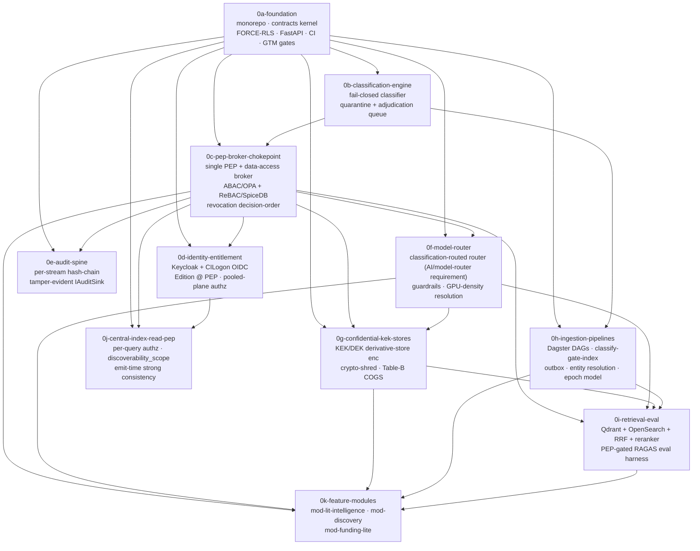

# TigerExchange Phase-0 — Master Sequencing & Index

This is the **master index** for the TigerExchange Phase-0 implementation plan set. It sequences eleven sub-plans (`0a` … `0k`) that together stand up the Phase-0 "walking skeleton" — a multi-tenant, fail-closed, classification-gated RAG platform — under `tigerexchange/`.

Each sub-plan is a standalone implementation plan living at `plans/phase0/<id>.md`. This document is the **entry point**: it defines build order, the dependency graph, and where the eleven HIGH-severity refinement items from the convergence review are addressed.

---

## Overview

Phase-0 builds the security and contract spine first, then layers feature capability on top. The guiding architectural invariants are:

- **One chokepoint.** A single Policy Enforcement Point + data-access broker (`0c`) is the sole path to retrieval, egress, and derivation. Feature modules never touch the raw store, the classifier, or projection construction.
- **Fail-closed classification.** A single classifier (`0b`) gates indexing: anything below confidence is quarantined to `unclassified=confidential` and excluded from *all* retrieval surfaces.
- **Tenant isolation at every layer.** FORCE ROW LEVEL SECURITY + `SET LOCAL` (`0a`), object-authz primary boundary on the pooled plane (`0d`), per-tenant KEK/DEK on every confidential derivative store (`0g`).
- **Honest economics.** Non-code GTM/cost gates (`0a`) and COGS reconciliations (`0f`, `0g`) ensure the build is not committed against unvalidated revenue or hand-wavy margins.

The set is organized in three tiers:

1. **Foundation & security kernel** — `0a` → `0b` → `0c` → (`0d`, `0e`, `0f`). These establish the monorepo/contracts kernel, the classifier, the PEP/broker chokepoint, identity/entitlement, the audit spine, and the model router.
2. **Confidential data plane & ingestion** — `0g`, `0h`. KEK/DEK derivative-store encryption + crypto-shred, and the Dagster classify-gate-index ingestion pipelines.
3. **Retrieval, read-side, and features** — `0i`, `0j`, `0k`. Hybrid retrieval + PEP-gated eval, the central-index read PEP, and the three Phase-0 feature modules.

---

## Dependency Graph

A valid topological build order is: **0a → 0b → 0c → 0d → 0e → 0f → 0g → 0h → 0i → 0j → 0k**.
`0d`, `0e`, `0f` are mutually independent (all gated on `0c`) and may be built concurrently; `0j` depends only on `0a`/`0c`/`0d` and can proceed in parallel with the `0g`/`0h`/`0i` confidential-data track once `0d` lands.

---

## Ordered Sub-Plan Table

| ID | Name | Goal (1-line) | Deliverable (1-line) | Depends on | HIGHs addressed |
|---|---|---|---|---|---|
| **0a-foundation** | Foundation: monorepo, contracts/kernel, FORCE-RLS tenant isolation, FastAPI skeleton, CI | Stand up the walking skeleton: Python 3.12 monorepo, `shared/contracts` kernel (TierLattice, PublishableProjection, ~15 pinned interfaces), Postgres FORCE-RLS tenant isolation via `SET LOCAL`, runnable FastAPI app, CI; plus Week-1 GTM/cost validation gates as non-code deliverables. | Deployable FastAPI service with health endpoint, per-request `TenantContext`, passing cross-tenant-read-denied test (RESTRICTIVE/WITH CHECK/tenant_id-leading index), importable+versioned `shared/contracts`, import-linter + kernel fitness check green in CI, plus committed Gate A/B/Q17 sign-off and line-(a) ACV stress test + PLG resolution. | — | Kernel-interface versioning/evolution contract; Line-(a) ACV/win-rate quantified & runway stress-tested at $20–60k; PLG champion-funnel sequencing reconciled |
| **0b-classification-engine** | Fail-closed classification engine + quarantine/adjudication queue | Single fail-closed classifier with explicit abstention: sub-threshold records → `unclassified=confidential`, excluded from ALL retrieval, routed to human-adjudication queue. The hard classify-gates-index edge. | Classifier module exposing the kernel classification contract; labels into frozen 3-tier lattice + compliance codes; quarantine state + adjudication queue with review/release workflow; passing zero-leak contract test on low-confidence/adversarial inputs; MAX-rule & sticky-flag-UNION property tests pass. | 0a-foundation | — |
| **0c-pep-broker-chokepoint** | Single PEP + data-access broker chokepoint (ABAC/OPA + ReBAC/SpiceDB), revocation decision-order | The one PEP + broker that is the sole chokepoint for retrieval/egress/derivation (D4). ABAC (OPA) × ReBAC (SpiceDB); broker holds raw-store creds ONLY for shared confidential-artifact/classification tables; pinned revocation decision order (durable tombstone authoritative for deny; lease/SpiceDB narrow-only). | PEP that runs ReBAC→ABAC→revocation/lease in one stated order, returning already-projected, tier-checked results; feature modules cannot import raw store/classifier/projection (import-linter); passing broker-role, ABAC-narrows-only, missing-attr→deny, PIP-unavailable→deny tests; documented single decision-order with durable log authoritative. | 0a-foundation, 0b-classification-engine | Lease-vs-durable-log-vs-SpiceDB composition (one decision order); Broker topology (no module-schema creds + broker-role contract test) |
| **0d-identity-entitlement** | Identity (Keycloak + CILogon OIDC) + Entitlement/Edition @ PEP + pooled-plane object-authz | Federated identity (Keycloak per-cell + control-plane broker, Direct OIDC/CILogon to buyer IdP) + first-class Entitlement/Edition service evaluated at the PEP; pooled-plane PLG per-tenant isolation: object-authz Check primary + FORCE-RLS defense-in-depth, confidential/exchange hard-OFF for PLG. | Requests carry eduPersonScopedAffiliation + stable eduPersonUniqueId; PEP resolves tenant→capability set and physically denies missing capabilities; passing tests: PLG tenant cannot construct confidential/exchange request; pooled-plane cross-tenant-read-denied (BOLA, SECURITY DEFINER, borrowed PgBouncer connection) all denied; PgBouncer in SET-LOCAL-compatible mode. | 0a-foundation, 0c-pep-broker-chokepoint | Pooled-plane per-tenant isolation boundary (object-authz primary + RLS defense-in-depth; forbid bypass; cross-tenant-read-denied test) |
| **0e-audit-spine** | Per-stream hash-chain audit sink | Audit spine as per-(tenant/stream) parallel hash-chained, tamper-evident sink with periodic signed chain-head checkpoints (kernel `IAuditSink`); the kernel later phases extend with transparency-log anchoring and fair-exchange receipts. | `IAuditSink` writing per-stream hash-chained records with verifiable chain head; stated append-rate ceiling exceeding peak per-cell op rate; periodic signed chain-head checkpoints to control-plane sink; PEP decisions + data-access events recorded; passing chain-tamper-detection test. | 0a-foundation, 0c-pep-broker-chokepoint | — |
| **0f-model-router** | Provider-agnostic classification-routed Model Router (AI/model-router requirement) + guardrails + GPU-density resolution | Provider-agnostic router over `IModelProvider` registry declaring locality classes; one owned tier→locality policy table shared by router AND transport (disagreement = hard-fail); confidential/private → in-boundary vLLM/Ollama, public → cloud frontier; BYO keys with attested locality + fail-closed fallback; resolve K=2 confidential-GPU density-vs-isolation and recompute COGS. | Router that selects a conformant provider or hard-fails; tests: confidential never selects cloud, router/transport disagreement hard-fails, BYO with attested locality + fail-closed-to-in-boundary; documented GPU-isolation decision (per-tenant MIG/process, no cross-tenant KV cache) with recomputed confidential COGS + ACV-floor implication. | 0a-foundation, 0c-pep-broker-chokepoint | K=2 confidential-GPU density vs in-process KV-cache isolation (mandate per-tenant GPU isolation, recompute COGS, raise ACV floor) |
| **0g-confidential-kek-stores** | Confidential-tier KEK/DEK derivative-store encryption + crypto-shred + Table-B COGS reconciliation | Make crypto-shred actually shred searchable copies: encrypt ALL confidential derivative stores (Qdrant/OpenSearch/AGE/object/cache) under tenant KEK/DEK, with tenant-CMK volume fallback and delete-and-rebuild fallback; per-tenant DEK default, per-record DEK for highest-isolation edition; reconcile Table-B COGS off its own line items. | Per-tenant KMS keys + tenant-CMK volume encryption for a confidential cell's derivative stores; crypto-shred rendering wrapped DEK undecryptable; passing CI gate: post-shred search across vector+BM25+graph returns no decryptable hits; reconciled Table-B COGS (line items summed, GPU amortization/density explicit) feeding confidential ACV floor. | 0a-foundation, 0c-pep-broker-chokepoint, 0f-model-router | ALL confidential derivative stores KEK/DEK-encrypted with fallbacks + post-shred zero-decryptable-hits test; Table-B COGS reconciled, D7 ratio & ≥60% margin gate recomputed honestly |
| **0h-ingestion-pipelines** | Dagster ingestion pipelines (OpenAlex/Crossref/ROR/ORCID/SPECTER2 + grants) with classify-gate-index outbox + entity resolution | Dagster batch DAGs: self-hosted OpenAlex CC0 / Crossref / ROR / ORCID / SPECTER2 + Grants.gov/RePORTER/NSF; entity resolution (deterministic anchors → probabilistic blocking) as evicted service; enforce classify-gates-index via transactional-outbox-polling (Dagster-only; defer Temporal/Debezium/Kafka); disambiguate per-CELL `revocation_epoch` vs per-RECORD `projection_version`. | Runnable DAGs that snapshot corpora + grant feeds, entity-resolve, distill, classify (gating index), embed, index, graph-build, with quarantined records never reaching any index; transactional outbox table + Dagster-sensor poller emitting events carrying both `projection_version` (per-record, monotonic, lower-version-reject) and cell `revocation_epoch` distinctly; documented bitmap indexing scheme + replicated-bytes sizing. | 0a-foundation, 0b-classification-engine | Disambiguate overloaded "epoch" (per-CELL `revocation_epoch` vs per-RECORD `projection_version`; tombstone-bitmap scheme + size at N=200 + per-cycle replicated bytes; delta/log-tail fallback) |
| **0i-retrieval-eval** | Hybrid retrieval (Qdrant + OpenSearch + RRF + reranker) + PEP-gated RAGAS eval harness | Phase-0 hybrid retrieval behind `IRetrievalStrategy`: Qdrant vector + OpenSearch BM25 + RRF (k≈60) + local reranker (BGE/Qwen3) top-50→top-8; RAGAS-in-CI eval gate per-tenant/per-route; eval path is a first-class PEP-gated confidential flow (gold-sets/traces/judge-I/O are confidential-tier, KEK-encrypted, judge bound to in-boundary routing). | Retrieval planner returning fused, reranked, PEP-projected results for mod-lit-intelligence grounding; RAGAS-in-CI gate failing build on regression; tests: confidential eval cannot route to cloud judge, eval traces KEK-encrypted and shred on crypto-shred, gold-sets/traces covered by per-subject erasure; on confidential tier vector/lexical stores KEK-decryptable only. | 0c-pep-broker-chokepoint, 0f-model-router, 0g-confidential-kek-stores, 0h-ingestion-pipelines | RAGAS eval gold-set + judge path routed through the single PEP (confidential-tier, KEK-encrypted, in-boundary-judge-only + contract test, per-subject erasure) |
| **0j-central-index-read-pep** | Central-index read PEP: per-query authz + discoverability_scope (emit-time strong consistency) + at-rest control-plane encryption | Central-index read PEP (same PEP code/policy engine at the central-index location) authorizing discovery READS: per-query authz (deny-by-default, no membership→no result), first-class `discoverability_scope` (public-web / federation-wide / named-consortium / named-tenants / none) at query time; aggregate treated as ≥private-tier, at-rest encrypted under control-plane keys; close share-correctness gap (PEP evaluates owner-committed monotonic scope-epoch, never stale-HIGH). | Read PEP in front of central index enforcing per-query authz + `discoverability_scope`; index encrypted at rest under control-plane keys; tests: scope denied to non-member, named-tenants allowlist enforced, property test that no projection is queryable wider than owner's currently-committed scope across version-skew/replay; confidential payloads structurally absent (D6). | 0a-foundation, 0c-pep-broker-chokepoint, 0d-identity-entitlement | Share-correctness across federation seam (`discoverability_scope` strongly-consistent at owner at emit time; PEP evaluates owner-committed monotonic scope-epoch, never stale-HIGH; no-wider-than-committed-scope property test) |
| **0k-feature-modules** | Feature modules: mod-lit-intelligence (grounded drafting), mod-discovery (public OpenAlex), mod-funding-lite (grant match) | Three Phase-0 modules atop the chokepoint: mod-lit-intelligence (grounded proposal drafting + semantic search, classification-enforced, RAGAS faithfulness gating, draft+ALL persistence inherits MAX-rule tier in tenant-KEK stores); mod-discovery (cross-institution PUBLIC-tier expert discovery over OpenAlex, zero confidentiality machinery); mod-funding-lite (grant match over Grants.gov/RePORTER/NSF). | Three pluggable modules consuming only kernel interfaces + the broker (no raw-store/classifier/projection imports): mod-lit-intelligence drafts grounded cited sections at p95<4s with draft+history KEK-bound; mod-discovery returns public experts; mod-funding-lite returns ranked grant matches; generated-draft + draft-history store included in the post-crypto-shred zero-decryptable-hits test. | 0c-pep-broker-chokepoint, 0f-model-router, 0g-confidential-kek-stores, 0h-ingestion-pipelines, 0i-retrieval-eval | Generated proposal draft (+autosave/version-history/synthesizer buffers/RAG cache) classified via MAX-rule, persisted only in tenant-KEK stores, added to post-crypto-shred zero-decryptable-hits test |

---

## How to Execute

Each sub-plan is itself a task-decomposed implementation plan at `plans/phase0/<id>.md`. Execute the set **in dependency order** (the topological order above), and execute **each sub-plan task-by-task via `superpowers:subagent-driven-development`**:

1. **Pick the next ready sub-plan** — one whose `depends_on` are all complete. Begin with `0a-foundation`; never start a sub-plan before its dependencies have landed and their contract tests pass, because each plan extends the running skeleton of the prior ones.
2. **Drive it task-by-task with subagent-driven development.** Open the sub-plan file, dispatch one subagent per task in plan order, and review each task's output against the plan's stated contract tests before moving to the next task. Do not batch tasks or skip the per-task review checkpoint.
3. **Gate on the deliverable.** A sub-plan is "done" only when its **Deliverable** column is satisfied and its contract/property tests are green in CI (FORCE-RLS isolation, zero-leak, broker-role, cross-tenant-read-denied, zero-decryptable-hits, no-wider-than-committed-scope, etc.). Non-code deliverables (`0a` GTM/cost gates; `0f`/`0g` COGS reconciliations) must be committed as written sign-off docs before downstream economic decisions are made.
4. **Parallelize only where the graph allows.** After `0c`, the `0d`/`0e`/`0f` trio is independent and may run as parallel subagent streams; `0j` may run alongside the `0g`→`0h`→`0i` track once `0d` is in. Everything funnels into `0k` last.
5. **Respect the invariants as hard gates, not aspirations.** The chokepoint (`0c`), fail-closed classification (`0b`), and KEK/crypto-shred (`0g`) are load-bearing for every later plan — a regression in their contract tests blocks all dependents.

---

## Where the 11 HIGH Refinement Items Are Addressed

The convergence review flagged eleven HIGH-severity refinement items. Each is owned by exactly one sub-plan (the plan whose deliverable resolves it and whose contract test proves it):

| # | HIGH refinement item | Owned by |
|---|---|---|
| 1 | Kernel-interface versioning/evolution contract — extend projection/event schema-discipline to the ~15 kernel interfaces; intra-cell vs cross-node; CI compat check on the kernel package | **0a-foundation** |
| 2 | Line-(a) public-assistant ACV/win-rate quantified and runway stress-tested at $20–60k (not implicitly $120k) | **0a-foundation** |
| 3 | PLG champion-funnel sequencing reconciled — PLG is not the Phase-0/1/2 funnel, or model the funnel mechanism | **0a-foundation** |
| 4 | Lease-vs-durable-log-vs-SpiceDB composition — one decision order, durable tombstone log authoritative for deny, lease/SpiceDB narrow-only; reconcile zero-allow-window vs 15ms lease read | **0c-pep-broker-chokepoint** |
| 5 | Broker topology — broker does NOT hold creds to module-owned schemas; chokepoint over shared confidential-artifact/classification tables only; broker-role contract test | **0c-pep-broker-chokepoint** |
| 6 | Pooled-plane per-tenant isolation boundary — object-authz Check primary + FORCE-RLS/SET-LOCAL/WITH-CHECK/RESTRICTIVE/tenant_id-leading defense-in-depth; forbid SECURITY DEFINER/matview bypass; cross-tenant-read-denied test | **0d-identity-entitlement** |
| 7 | K=2 confidential-GPU density vs in-process KV-cache isolation — mandate per-tenant GPU isolation (MIG/dedicated process), recompute COGS, raise confidential ACV floor if density falls | **0f-model-router** |
| 8 | ALL confidential derivative stores (Qdrant/OpenSearch/AGE/object/cache) KEK/DEK-encrypted with volume-key and delete-and-rebuild fallbacks; post-shred zero-decryptable-hits contract test | **0g-confidential-kek-stores** |
| 9 | Table-B steady-state confidential COGS reconciled to its own line items (GPU amortization/density explicit); D7 ratio and ≥60% margin gate recomputed honestly | **0g-confidential-kek-stores** |
| 10 | Disambiguate overloaded "epoch" — per-CELL fenced `revocation_epoch` vs per-RECORD `projection_version`; tombstone-bitmap scheme + size at N=200 + per-cycle replicated bytes; delta/log-tail fallback if bitmap large | **0h-ingestion-pipelines** |
| 11 | RAGAS eval gold-set + judge path routed through the single PEP — gold-sets/traces/judge-I/O tagged confidential-tier, KEK-encrypted, in-boundary-judge-only (routing rule + contract test), per-subject erasure | **0i-retrieval-eval** |
| 12 | Share-correctness across the federation seam — `discoverability_scope` strongly-consistent at owner at emit time; central-index PEP evaluates owner-committed (monotonic scope-epoch) value, never stale-HIGH; no-projection-wider-than-committed-scope property test | **0j-central-index-read-pep** |
| 13 | Generated proposal draft (+autosave/version-history/synthesizer buffers/RAG cache) classified via MAX-rule and persisted only in tenant-KEK derivative stores; added to post-crypto-shred zero-decryptable-hits contract test | **0k-feature-modules** |

> **Count note.** The decomposition tags **13** distinct `highs_addressed` entries across the sub-plans (3 in `0a`; 2 each in `0c`, `0g`; 1 each in `0d`, `0f`, `0h`, `0i`, `0j`, `0k`). These collapse to the **11** HIGH refinement items by grouping `0a`'s two economic items (#2 line-(a) ACV and #3 PLG funnel) as the single "GTM/cost validation" HIGH, and `0g`'s two items (#8 KEK-encrypt-all-stores and #9 Table-B COGS) as the single "confidential-tier crypto + COGS honesty" HIGH. All thirteen tagged entries are listed above for traceability; no item is unowned, and `0b`/`0e` carry no HIGH item (they are pure security-kernel infrastructure validated by their own contract tests).
