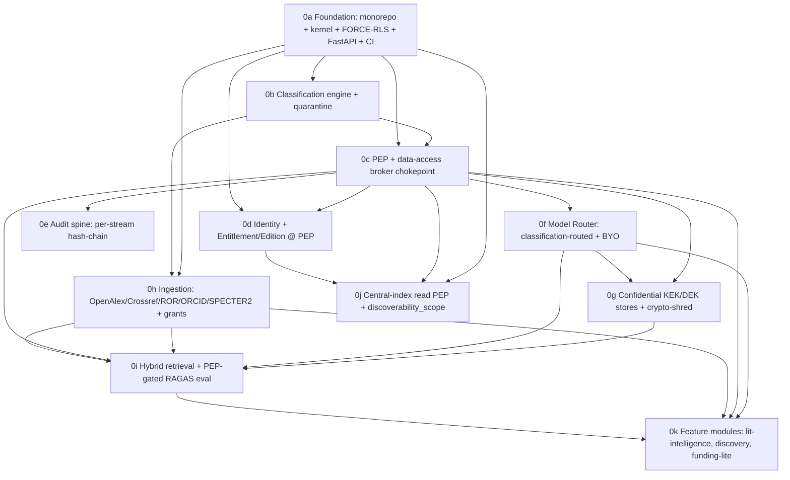

# TigerExchange — Phase-0 Implementation Plan Set

Bite-sized, TDD, no-placeholder implementation plans for the Phase-0 MVP, authored by an orchestrated workflow (15 agents) against the approved design (`../final-plan-v2.md`) and locked decisions (`../00-decisions.md`). Build target: a greenfield project root **`tigerexchange/`**.

## Files
- **`00-kernel-contracts.md`** — the canonical shared `contracts/kernel` package (TierLattice, TenantContext, PEP/classifier/router/retrieval interfaces). **Authoritative**: every sub-plan imports these verbatim. Implemented by `0a`.
- **`0a`–`0k`** — the 11 sub-plans (below), each a working/testable deliverable.
- **`_decomposition.json`** — structured sub-plan graph.
- **`_consistency-check.md`** — cross-plan consistency punch-list (read before executing — see "Known issues").

## Sub-plans (build order: `0a → 0b → 0c → 0d → 0e → 0f → 0g → 0h → 0i → 0j → 0k`)

| id | name | deliverable |
|---|---|---|
| 0a | Foundation | monorepo + frozen `contracts/kernel` + Postgres FORCE-RLS tenant isolation + FastAPI skeleton + CI walking skeleton |
| 0b | Classification engine | fail-closed classifier; abstention → quarantine default-deny + adjudication queue |
| 0c | PEP + broker | single chokepoint: ABAC (OPA) + ReBAC (SpiceDB) + owner-local revocation decision-order |
| 0d | Identity + Entitlement | Keycloak+CILogon OIDC; Edition/Entitlement evaluated at the PEP; pooled-plane object-authz |
| 0e | Audit spine | per-stream hash-chain audit sink |
| 0f | Model Router | provider-agnostic, classification-routed (local vs cloud) + BYO keys + guardrails |
| 0g | Confidential KEK stores | per-tenant KEK/DEK derivative-store encryption + crypto-shred + Table-B COGS reconciliation |
| 0h | Ingestion pipelines | Dagster: scholarly + grant corpora; classify-gate-index outbox; entity resolution |
| 0i | Retrieval + eval | Qdrant + OpenSearch + RRF + reranker; PEP-gated RAGAS-in-CI |
| 0j | Central-index read PEP | per-query authz + `discoverability_scope` (owner-committed, strongly consistent) |
| 0k | Feature modules | mod-lit-intelligence (grounded drafting), mod-discovery (public OpenAlex), mod-funding-lite (grant match) |

All 11 high-severity refinement items from `../convergence-report.md` are assigned to owning sub-plans (see `highs_addressed` in `_decomposition.json`).

## ⚠️ Known issues — resolve before execution (`_consistency-check.md`)
The cross-plan review found real integration mismatches (plans were authored in parallel). Highest-leverage fixes:
1. **`IAuditSink.append` arity** (0e) — kernel is one-arg; remove the two-arg confusion + fabricated `TenantContext`.
2. **One PEP class + one `authorize` signature + one decision order** (0c vs 0d diverge: two class names, an extra `requested_tier` kwarg, different step ordering).
3. **`IModelProvider.satisfies_locality(tier: Tier)`** (0f providers use `LocalityClass` and fail the kernel Protocol `0i` relies on).
4. **Central-index read-PEP duplicated** (0c Task 10 vs 0j) — designate **0j** authoritative; drop 0c's `filter_by_discoverability`.
5. **`app/dependencies.py` + `app.main` + `modules/` ownership undefined** (0k references factories/paths 0a never creates) — assign ownership + align to `packages/`/`services/` layout.
6. **Classifier module name** — standardize to `classification.classifier` across all import-linter contracts (0b/0c/0e/0k currently disagree).

## 🟠 SCOPE QUESTION (needs a decision)
Three sub-plans may stray into **Phase-1+ deferred** confidentiality/revocation machinery:
- **0g** (per-tenant KEK/DEK + crypto-shred) — Phase-0 SCOPE listed only the Table-B COGS *reconciliation*, not the live crypto-shred build; the kernel stubs `IRevocationAuthority` as Phase-1+.
- **0c** durable tombstone reader + lease cache (owner-local revocation) — adjacent to the deferred revocation line.
- **0e** signed Ed25519 checkpoints / transparency-log sink — beyond the bare hash-chain sink.

Either confirm these belong in Phase-0 (and amend the spec's Phase-0 SCOPE) or descope them to seams. `0k`'s confidential draft persistence depends on `0g`, so this also affects the feature modules.

## Execution
Each sub-plan is executed task-by-task via `superpowers:subagent-driven-development` (fresh agent per task, review between) in the dependency order above. `0d`/`0e`/`0f` can run in parallel after `0c`; `0j` can run alongside the `0g`→`0h`→`0i` track. **Apply the known-issue fixes + resolve the scope question first.**
