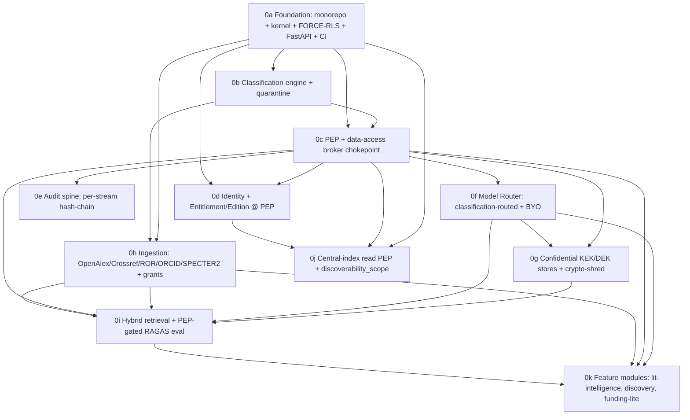

# TigerExchange — Phase-0 Implementation Plan Set

Bite-sized, TDD, no-placeholder implementation plans for the Phase-0 MVP, authored by an orchestrated workflow (15 agents) against the approved design (`../final-plan-v2.md`) and locked decisions (`../00-decisions.md`). Build target: a greenfield project root **`tigerexchange/`**.

## Files
- **`00-kernel-contracts.md`** — the canonical shared `contracts/kernel` package (TierLattice, TenantContext, PEP/classifier/router/retrieval interfaces). **Authoritative**: every sub-plan imports these verbatim. Implemented by `0a`.
- **`0a`–`0k`** — the 11 sub-plans (below), each a working/testable deliverable.
- **`_decomposition.json`** — structured sub-plan graph.
- **`_consistency-check.md`** — cross-plan consistency punch-list (read before executing — see "Known issues").

## Sub-plans (build order: `0a → 0b → 0c → 0d → 0e → 0f → 0g → 0h → 0i → 0j → 0k`)

| id | name | deliverable |
|---|---|---|
| 0a | Foundation | monorepo + frozen `contracts/kernel` + Postgres FORCE-RLS tenant isolation + FastAPI skeleton + CI walking skeleton |
| 0b | Classification engine | fail-closed classifier; abstention → quarantine default-deny + adjudication queue |
| 0c | PEP + broker | single chokepoint: ABAC (OPA) + ReBAC (SpiceDB) + owner-local revocation decision-order |
| 0d | Identity + Entitlement | Keycloak+CILogon OIDC; Edition/Entitlement evaluated at the PEP; pooled-plane object-authz |
| 0e | Audit spine | per-stream hash-chain audit sink |
| 0f | Model Router | provider-agnostic, classification-routed (local vs cloud) + BYO keys + guardrails |
| 0g | Confidential KEK stores | per-tenant KEK/DEK derivative-store encryption + crypto-shred + Table-B COGS reconciliation |
| 0h | Ingestion pipelines | Dagster: scholarly + grant corpora; classify-gate-index outbox; entity resolution |
| 0i | Retrieval + eval | Qdrant + OpenSearch + RRF + reranker; PEP-gated RAGAS-in-CI |
| 0j | Central-index read PEP | per-query authz + `discoverability_scope` (owner-committed, strongly consistent) |
| 0k | Feature modules | mod-lit-intelligence (grounded drafting), mod-discovery (public OpenAlex), mod-funding-lite (grant match) |

All 11 high-severity refinement items from `../convergence-report.md` are assigned to owning sub-plans (see `highs_addressed` in `_decomposition.json`).

## Cross-plan consistency — RESOLVED
Two reconciliation passes + a targeted follow-up brought the plan set to a consistent, execution-ready state. Verdicts/changelogs: `_recheck-after-fixup.md` (pass 1) and `_recheck-residuals.md` (pass 2). Closed:
- object-classification not hardcoded (0c); `IAuditSink.append` one-arg + `store.persist(event, tenant)` (0e); `satisfies_locality(tier: Tier)` on concrete providers (0f); single central-index PEP = **0j** (0c dup dropped); `packages/`+`services/` layout & `api.dependencies` DI factories (0a defines, 0k consumes); `classification.classifier` naming everywhere; kernel interface-versioning amendment (`KERNEL_API_VERSION`/`InterfaceLocus`/`INTERFACE_LOCUS`); single-tenant scope notes (0g/0c/0e).
- **PEP unified across 0c/0d**: one class `PolicyEnforcementPoint` at `packages/mod-pep/src/mod_pep/policy_enforcement_point.py`, one keyword-only ctor `(*, entitlement_evaluator, classifier, rebac, abac, tombstone, lease, broker, pooled_authz)`, kernel `authorize(request) -> PepResponse`.
- **COGS** (0f/0g Task 8): single reconciled band-based block, numbers matching spec §16.1 Table B (shared-GPU K=2 ≈ $42k/yr; dedicated ≈ $66k/yr).
- **Kernel walrus artifact** (`IRerankerLike := IReranker`) scrubbed from `00-kernel-contracts.md` + `0a`.
- **Entitlement collaborator** reconciled: 0c's PEP now calls `entitlement_evaluator.evaluate(request, requested_tier=tier) -> PepResponse` matching 0d's `EntitlementEvaluator`.

No known blocking inconsistencies remain. (Historical `services/pep`/walrus mentions persist only in the review docs `_consistency-check.md` / `_recheck-after-fixup.md`, which narrate the pre-fix state.)

## Scope — resolved
0g (confidential-at-rest KEK/crypto-shred), 0c (owner-local revocation), and 0e (signed checkpoints) are **kept in Phase-0, scoped single-tenant own-data only** — the MVP stores the center's own confidential proposal drafts, so HYOK-at-rest + GDPR crypto-shred are genuinely required. Each now carries an explicit note that the **cross-institution** sharing/exchange + revocation-*authority* are Phase-1+ (kernel interfaces stubbed, not active). `0k`'s confidential draft persistence stays single-tenant via `0g`.

## Execution
Each sub-plan is executed task-by-task via `superpowers:subagent-driven-development` (fresh agent per task, review between) in the dependency order above. `0d`/`0e`/`0f` can run in parallel after `0c`; `0j` can run alongside the `0g`→`0h`→`0i` track. **Apply the known-issue fixes + resolve the scope question first.**
