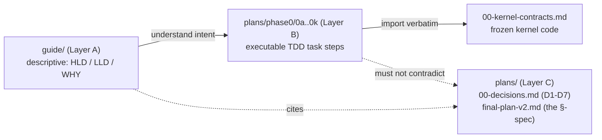
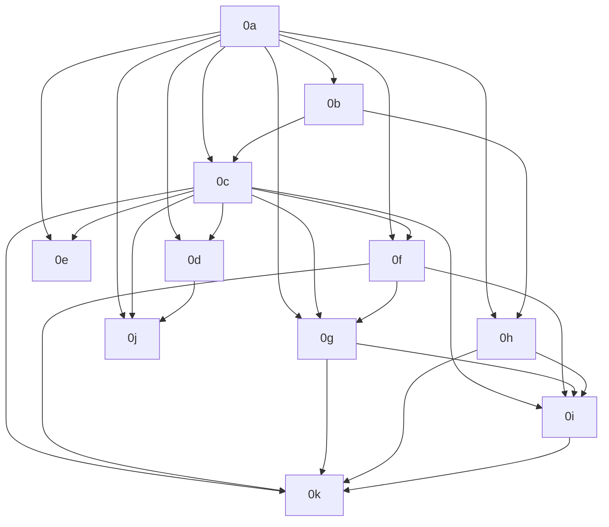

# 00 — START HERE: TigerExchange Phase-0 Builder Guide (Master Orientation Index)

> **READ THIS DOC FIRST, FULLY, BEFORE OPENING ANY OTHER FILE.**
> It is the map of the entire build. Every other doc assumes you have read this one.

This file is the single entry point for building **TigerExchange Phase-0**. It tells you
*what* you are building, *who* you are, *which docs exist and in what order to read them*,
*how the descriptive guide and the executable plans fit together*, the *build order*, the
*global rules you may never break*, and *where to hand off when you are stuck or done*.

---

## 0. Definitions used in this doc (read once, they recur everywhere)

These terms appear in nearly every other doc. They are defined here so you never have to
guess. (Full glossary: `02-glossary-and-domain-primer.md`.)

| Term | One-line definition (memorize these) |
|---|---|
| **Tenant** | One paying institution/organization. Its data must never leak to another tenant. |
| **Tier** | Sensitivity level of a piece of data. Exactly three: `public < private < confidential`. |
| **Classification** | Deciding which Tier a piece of content is. Done by *one* classifier. If unsure → `QUARANTINE` (treated as confidential, hidden from all search). |
| **PEP (Policy Enforcement Point)** | The *single* code path that authorizes every read/egress/derive/discover. Nothing reaches raw data except through it. "Single chokepoint." |
| **Broker (Data-Access Broker)** | The only component holding raw-store credentials. Lives behind the PEP; returns already-filtered, already-projected results. |
| **Projection (`PublishableProjection`)** | The only data shape allowed to cross into the shared central index. Holds public/private metadata only — **never** confidential content (Decision D6). |
| **Kernel (`contracts` package)** | The frozen set of types + interfaces (`Tier`, `TenantContext`, `PepRequest`, `IPolicyEnforcement`, …) that every module imports. No logic, no I/O, no feature deps. |
| **Module (`mod-*`)** | A pluggable feature (e.g. literature drafting). Modules are "dumb": they call the PEP/broker and the kernel interfaces, and may **not** touch raw stores, the classifier, or build a Projection. |
| **Edition / Entitlement** | A tenant's purchased capability set, evaluated *at the PEP*. E.g. a `PLG` tenant physically cannot construct a confidential request. |
| **Federation / Exchange** | Cross-institution sharing. **Phase-0 ships NO federation** — only the interface *seams* exist (`IExchangeFeed`, `IRevocationAuthority`), unimplemented. |
| **TDD** | Test-Driven Development: write a *failing* test first, watch it fail, then write the minimum code to pass it. Mandatory here. |
| **D1–D7** | The seven locked founder/architecture decisions in `plans/00-decisions.md`. Authoritative. Never contradict them. |

---

## 1. What you are building (4–5 sentences)

TigerExchange is a **federated, multi-university grant-intelligence platform**: it helps
research teams at *different* universities find each other, assemble cross-institution teams
for large federal grants (e.g. NIH/NSF center awards), and co-develop proposals while keeping
confidential material (budgets, preliminary data, drafts) isolated per institution. **Phase-0
is the anchor MVP** — the "walking skeleton" — built for a *single* anchor consortium and
deliberately scoped down: it stands up the full security/data kernel and three thin feature
modules, but ships **no cross-institution federation yet** (only the unimplemented seams).
The core architectural bet is a **single Policy Enforcement Point (PEP) chokepoint** plus a
**fail-closed classifier**, so that every read, egress, and derivation is authorized in exactly
one place and confidential data can *physically not* leak into shared surfaces. You are
building the Phase-0 codebase under the project root `tigerexchange/` end-to-end, in dependency
order, using strict TDD.

---

## 2. Who this is for (read this carefully — it changes how the docs are written)

**You are a local code-generation model** (a quantized open-weight model running on an Apple
M4 Max, 36 GB, via Ollama). You have a **limited context window** and **weaker reasoning than a
frontier model**. The docs are therefore written for you specifically:

- **Self-contained.** Each doc defines its terms inline. You should not need three docs open at
  once. If you cannot fit a whole doc in context, read it section by section — sections are kept
  short on purpose.
- **Explicit, never vague.** Exact file paths under `tigerexchange/`, exact library versions,
  exact type/function signatures, exact shell commands. The docs never say "as appropriate",
  "handle edge cases", or "figure it out". If something is ambiguous, that is a bug in the
  doc — stop and hand off to Claude (section 7), do not guess.
- **Reasoning is always given.** Every non-trivial choice is stated as *"we do X because Y; we
  considered Z but rejected it because W."* You do not need to re-derive design intent.
- **Auditable.** This corpus will be reviewed and audited by **Claude (Anthropic)** after you
  build it. Build exactly what the docs specify so the audit can verify each decision against
  its stated rationale and against D1–D7.

> **Your prime directive:** implement *exactly* what is specified, nothing more. No extra
> features, no "while I'm at it" abstractions, no inventing APIs. When uncertain, fail closed
> and hand off (section 7).

---

## 3. The complete doc map (reading order + purpose of each doc)

There are three layers of documents. Read them in the order below.

### Layer A — Descriptive guide (this folder: `plans/phase0/guide/`)

These explain *what* and *why*. **Read these to understand; do not write code from them
directly** — they hand you to the matching executable plan (Layer B).

| # | File (read in this order) | What it is for |
|---|---|---|
| 00 | `00-START-HERE.md` | **This file.** The master map. Read first. |
| 01 | `01-product-overview.md` | Product Overview & Why — the business problem, the grant wedge (D1), Phase-0 scope (D2/D3). |
| 02 | `02-glossary-and-domain-primer.md` | Glossary & Domain Primer — every term defined; grant/funding domain background. |
| 03 | `03-high-level-design.md` | High-Level Design (HLD) — the big-picture architecture diagram: PEP chokepoint, tiers, planes. |
| 04 | `04-tech-stack.md` | Technology Stack & Rationale — exact libraries/versions and *why each was chosen* (and what was rejected). |
| 05 | `05-lld-kernel-contracts.md` | LLD: the `contracts`/kernel package — every kernel type/interface explained field-by-field. |
| 06 | `06-lld-security-ai-kernel.md` | LLD: Security & AI Kernel — Classification, PEP, Identity/Entitlement, Audit spine, Model Router. |
| 07 | `07-lld-data-layer.md` | LLD: Data Layer — tenant isolation (FORCE-RLS), KEK/DEK encryption, ingestion, retrieval, central index. |
| 08 | `08-lld-feature-modules.md` | LLD: Feature Modules — Lit-Intelligence, Discovery, Funding-lite. |
| 09 | `09-data-model-and-schemas.md` | Data Model & Schemas (reference) — concrete tables/JSON shapes/Pydantic models. |
| 10 | `10-api-and-interface-reference.md` | API & Interface Reference — FastAPI endpoints + every kernel interface signature in one place. |
| 11 | `11-security-and-compliance.md` | Security & Compliance Design — the threat model, D4/D5/D6 enforcement, FERPA/IRB/ITAR/EAR/GDPR flags. |
| 12 | `12-build-runbook.md` | Build Runbook — the step-by-step *operating* instructions for you (env setup, commands, loop). |
| 13 | `13-review-and-audit-handoff.md` | Review & Audit Handoff — what to produce for Claude's review; where to stop and ask. |

### Layer B — Executable task plans (`plans/phase0/`)

These are the **literal TDD steps** you execute, with checkbox (`- [ ]`) tasks. **Write code
from these.** Each is a standalone, task-decomposed implementation plan.

| File | What it is |
|---|---|
| `00-kernel-contracts.md` | **Authoritative** canonical kernel source. The exact code of the `contracts` package. Imported verbatim by every plan. **Never contradict this.** |
| `0a` … `0k` | The eleven implementation plans (one per build step — see section 5 for the build order and per-step deliverable). |
| `00-index.md` | The plans' own master index + dependency DAG (mirror of section 5 here). |

### Layer C — Reference / spec (`plans/`)

The ground-truth sources the above were derived from. Consult only when a guide/plan doc points
you here.

| File | What it is |
|---|---|
| `00-decisions.md` | **The locked decisions D1–D7**, each with full reasoning. Authoritative ground truth. |
| `final-plan-v2.md` | The full design + business plan (very long). The section numbers (`§4.2`, `§5.6`, …) cited throughout the kernel and plans refer to *this* document. |

---

## 4. How the docs fit together (the read-then-execute loop)

- **`guide/` (Layer A)** = the *descriptive* HLD/LLD and the *why*. Read it to understand a
  component before you touch it.
- **`plans/phase0/0a..0k` (Layer B)** = the *executable* TDD task steps. This is where the
  actual `- [ ]` work items live.
- **The loop for each build step:** read the relevant **guide** doc (Layer A) for the component,
  **then** open and execute the matching **plan** (`0a..0k`, Layer B) task-by-task.
  Example: before doing the PEP plan `0c`, read guide `06-lld-security-ai-kernel.md`.

> **Conflict rule:** if any doc disagrees with another, precedence is:
> **`00-decisions.md` (D1–D7) > `00-kernel-contracts.md` > guide LLD docs > guide HLD/overview.**
> If you find a real contradiction you cannot resolve, stop and hand off (section 7).

---

## 5. The build order (0a → 0k) and one-line deliverable per step

Build **strictly in this topological order** (some steps may run concurrently — see note below).
The dependency graph is reproduced from `plans/phase0/00-index.md`.

| Step | Read this guide doc first | Then execute this plan | One-line deliverable |
|---|---|---|---|
| **0a** | 03, 04, 05, 07 | `0a-foundation.md` | Monorepo + `contracts` kernel + Postgres FORCE-RLS tenant isolation + runnable FastAPI skeleton + CI + GTM/cost gates. |
| **0b** | 06 | `0b-classification-engine.md` | The single fail-closed classifier: sub-threshold → quarantine (`unclassified=confidential`), excluded from all retrieval, plus adjudication queue. |
| **0c** | 06, 11 | `0c-pep-broker-chokepoint.md` | The single PEP + data-access broker chokepoint (ABAC/OPA × ReBAC/SpiceDB) with one pinned revocation decision order. |
| **0d** | 06, 11 | `0d-identity-entitlement.md` | Federated identity (Keycloak + CILogon OIDC) + Entitlement/Edition evaluated at the PEP + pooled-plane object-authz. |
| **0e** | 06 | `0e-audit-spine.md` | Per-stream hash-chained, tamper-evident `IAuditSink` with signed chain-head checkpoints. |
| **0f** | 06, 04 | `0f-model-router.md` | Provider-agnostic, classification-routed model router (the AI/model-router requirement: provider-agnostic, classification-routed; confidential-routing rule per D6): confidential → in-boundary, public → cloud; fail-closed; per-tenant GPU isolation. |
| **0g** | 07, 11 | `0g-confidential-kek-stores.md` | Per-tenant KEK/DEK encryption on every confidential derivative store + crypto-shred + Table-B COGS reconciliation. |
| **0h** | 07 | `0h-ingestion-pipelines.md` | Dagster ingestion DAGs (OpenAlex/Crossref/ROR/ORCID/SPECTER2 + grants) with classify-gate-index transactional outbox + entity resolution. |
| **0i** | 07, 08 | `0i-retrieval-eval.md` | Hybrid retrieval (Qdrant + OpenSearch + RRF + reranker) behind `IRetrievalStrategy` + PEP-gated RAGAS eval harness. |
| **0j** | 07, 11 | `0j-central-index-read-pep.md` | Central-index read PEP: per-query authz + `discoverability_scope` + emit-time strong consistency + at-rest control-plane encryption. |
| **0k** | 08 | `0k-feature-modules.md` | The three feature modules: `mod-lit-intelligence`, `mod-discovery`, `mod-funding-lite` — atop the chokepoint, kernel-interfaces only. |

> **Valid linear order:** `0a → 0b → 0c → 0d → 0e → 0f → 0g → 0h → 0i → 0k`, with **0j** after
> `0d`. `0d`, `0e`, `0f` are mutually independent (all gated only on `0c`). If unsure, just go
> strictly left-to-right `0a…0k` — that order always satisfies the graph.

---

## 6. Global conventions (NON-NEGOTIABLE — apply to every step)

| # | Rule | Why (and what we rejected) |
|---|---|---|
| G1 | **Python 3.11+.** Use `StrEnum`/`IntEnum`, `X \| Y` unions, `from __future__ import annotations`. | The kernel `pyproject.toml` pins `requires-python = ">=3.11"`. `StrEnum` (3.11) gives stable string wire/DB values. We rejected ints-on-the-wire because they silently drift. |
| G2 | **Pydantic v2** (`pydantic>=2.6,<3`). Cross-boundary value objects use `model_config = ConfigDict(frozen=True)`. | Frozen = an authorized decision/projection cannot be mutated after the PEP blesses it. We rejected mutable dataclasses because they allow post-authorization tampering. |
| G3 | **FastAPI** for the HTTP surface, under `tigerexchange/services/api/`. | Async, Pydantic-native, typed. Matches the kernel's Pydantic contracts with zero glue. |
| G4 | **Monorepo layout:** libraries in `tigerexchange/packages/` (the `contracts` kernel + `mod-*` modules); the app in `tigerexchange/services/api/`. | Keeps the kernel a standalone, dependency-free package; lets `import-linter` enforce that modules never import raw stores. |
| G5 | **TDD: failing test first.** Write the test, run it, *watch it fail*, then write minimum code to pass. Use `pytest`. | The plans are written as `- [ ]` TDD steps. We reject code-first because the security invariants (zero-leak, fail-closed) are only trustworthy if a *failing* test proved the gap first. |
| G6 | **Commit frequently** — one commit per passing task (per `- [ ]`). Keep commits small and green. | Small green commits make the later Claude audit tractable and let you roll back one task, not a day's work. |
| G7 | **Single PEP chokepoint (D4).** Every retrieval/egress/derivation goes through the one PEP + broker. Modules may **not** touch raw stores, the classifier, or construct a `PublishableProjection`. `import-linter` enforces this. | One chokepoint = one place to audit, minimal blast radius. We rejected per-module enforcement because each module would re-implement (and eventually botch) the ~7 confidentiality mechanisms. |
| G8 | **Three tiers only: `public < private < confidential`.** MAX-rule on join; unknown/unparseable tier → `confidential` (fail-closed). | A tiny frozen lattice is formally checkable. We rejected ad-hoc per-field flags because they cannot be reasoned about as a total order. |
| G9 | **Fail closed, always.** Abstention/ambiguity/missing-attribute/unavailable-PIP → `DENY` or `QUARANTINE`. Confidential content **never** enters the shared index (D6). | A permissive default is a one-way-door data leak. Quarantine = `unclassified` treated as confidential and excluded from all retrieval until a human adjudicates. |
| G10 | **`tools`/lint/type:** `ruff` (lint + format), `mypy` (type-check). Run all three + `pytest` before every commit. | Typed + linted code is what the audit can read. |
| G11 | **Never contradict D1–D7 (`plans/00-decisions.md`) or the kernel (`00-kernel-contracts.md`).** Import kernel symbols verbatim; do not redefine `Tier`, `PepRequest`, etc. | These are the locked anchor that made the design converge. Re-litigating them is out of scope for Phase-0. |

> **Phase-0 scope reminder:** there is **no federation, no Exchange feed, no cross-institution
> revocation** in Phase-0. The seams `IExchangeFeed` and `IRevocationAuthority` exist as
> unimplemented `Protocol` stubs *only*. Implementing them in Phase-0 is an `import-linter`
> violation — do not.

---

## 7. When you are stuck or done → hand off to Claude for review

- **If you are STUCK** (a doc is ambiguous, two docs conflict and section 4's precedence rule
  does not resolve it, a kernel signature seems wrong, or a test cannot be made to pass without
  violating D1–D7): **stop. Do not guess and do not invent an API.** Write down the exact
  blocker and hand off per **`13-review-and-audit-handoff.md`**.
- **If you are DONE with a step (or all of Phase-0):** produce the review artifacts described in
  **`13-review-and-audit-handoff.md`** so Claude (Anthropic) can audit your work against the
  stated rationale and D1–D7.

> Handoff target: **`13-review-and-audit-handoff.md`** — both for "I'm blocked" and for
> "I'm finished, please review."

---

**Next step:** read `01-product-overview.md`.
