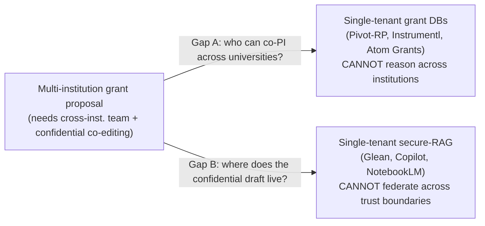
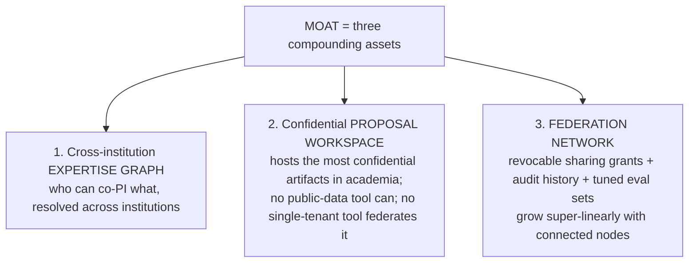
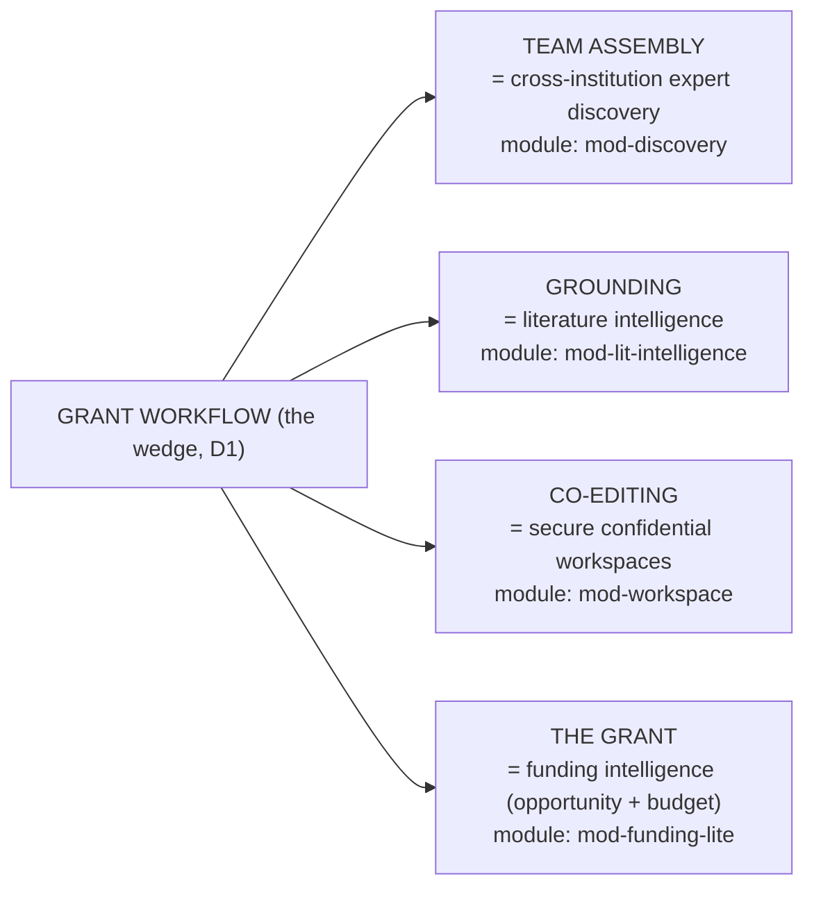
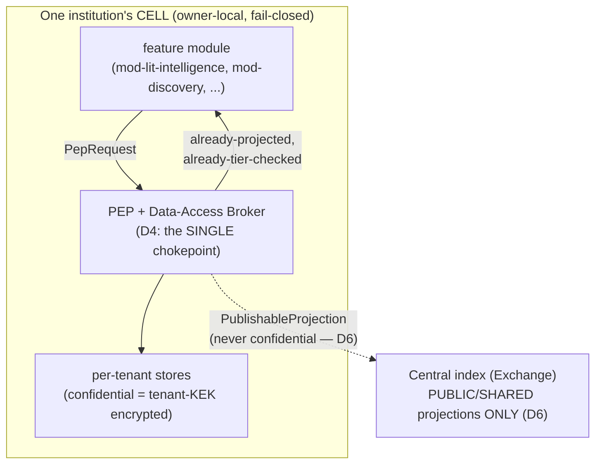
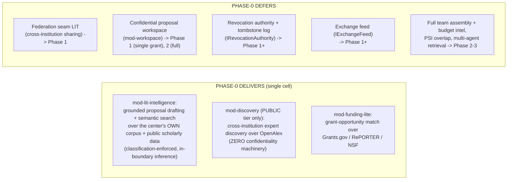

# Product Overview & Why

**What this document is for.** This is the first document a builder reads before writing any TigerExchange code. It tells you *what* you are building (the product), *why* it is shaped this way (the reasoning behind every major choice, so you never have to guess design intent), and *what Phase-0 must and must not deliver*. It is fully self-contained: every term is defined the first time it appears, and every non-trivial choice states the reasoning and names the rejected alternative. It contains **no code** — the executable ground truth is the canonical kernel package at `tigerexchange/packages/contracts/` (see `plans/phase0/00-kernel-contracts.md`). When this document and a locked decision (D1–D7, summarized in §10 below and defined in full in `plans/00-decisions.md`) appear to conflict, the locked decision wins; tell the human, do not silently reconcile.

---

## 1. What TigerExchange is, in three sentences

1. TigerExchange is a **federated grant-intelligence platform** for research that spans more than one university: it helps a Principal Investigator (PI — the lead researcher who owns a grant proposal) assemble a team of co-investigators across institutions, ground the proposal in scholarly literature, co-edit the confidential proposal securely, and match it to funding opportunities.
2. Each participating institution runs its own strongly-isolated **node** (a self-contained deployment holding that institution's data), so confidential material — unfunded ideas, draft budgets, preliminary unpublished data — never leaves the institution that owns it.
3. A thin shared **Exchange** (a central discovery-and-collaboration broker) lets institutions find each other and share *revocably* and *classification-enforced*, **without ever centralizing confidential data**.

Term anchors you will reuse throughout:

| Term | One-line definition |
|---|---|
| **PI / co-PI** | Principal / co-Principal Investigator — the researcher(s) who lead a grant proposal. |
| **Grant proposal** | A document submitted to a funder (e.g. NIH, NSF) requesting research money; pre-submission it is highly confidential. |
| **Node / cell** | One institution's isolated deployment (its own databases, its own inference). "Cell" = the isolated tenant runtime. |
| **Tenant** | One paying institution (or one PLG individual). Each tenant maps to a node/cell. |
| **Exchange** | The shared control-plane broker for cross-institution discovery and brokered access. Holds NO confidential data. |
| **Confidential tier** | The most sensitive classification: pre-submission proposals, budgets, preliminary data. Never leaves the owning node. |
| **PEP** | Policy Enforcement Point — the single code path that authorizes every retrieval, egress, and derivation (see §6). |

---

## 2. The problem (why this needs to exist)

Two structural gaps, neither served by existing tools:

**Gap A — Multi-institution grant teams are underserved.** Large federal funding mechanisms (NIH U54/U01 centers, NSF AI Institutes, DOE programs, multi-PI R01s) *require* teams that span several universities. The recurring, high-value, real job is: *"find me the right partners at other universities to assemble a competitive team for this RFP."* (RFP = Request For Proposals, the funder's call.) Existing grant tools are **single-tenant** (built for one institution at a time) and **public-data-only**, so they cannot reason across institutional boundaries about who can co-PI what.

**Gap B — Confidential proposals cannot live in single-tenant tools.** A pre-submission proposal is the *most* confidential artifact in academia: it contains unfunded ideas, draft budgets, and preliminary data that competitors must not see. Single-tenant secure-document tools (Glean, Microsoft Copilot, Google NotebookLM Enterprise, Azure-OpenAI-on-your-data) can hold one institution's documents but **cannot federate them across institutional trust boundaries** — they have no concept of "Institution A shares this draft with a co-PI at Institution B, revocably, under a legal agreement." So multi-institution teams today fall back to email and shared drives, which are neither secure nor auditable.

This intersection — cross-institution team assembly **over** a confidential, revocably-shared proposal workspace — is the unoccupied white space. Nobody fills it. That is the product.

---

## 3. The grant-intelligence wedge — and WHY it is the chosen beachhead

A **wedge** (a.k.a. beachhead) is the single narrow use case you enter the market with before expanding. The locked wedge (decision **D1**) is **grant intelligence**: cross-institution team assembly + secure proposal collaboration. Here is why this specific wedge was chosen over the alternatives.

### 3.1 Why grant intelligence (four reasons, each with the reasoning)

| # | Property | Why it makes grant intelligence the right wedge | What this avoids |
|---|---|---|---|
| 1 | **Validated buyer + validated willingness-to-pay** | Sponsored-programs / research-development (RD) offices already buy software here. Cayuse, Kuali Research, and Pivot-RP are six-figure institutional contracts; Atom Grants validates a product-led floor at ~$179/month across 50+ institutions. So we are not inventing demand. | Avoids the cold-start risk of a market that has never paid for anything. |
| 2 | **Intrinsically cross-institution** | Large federal grants *require* multi-institution teams, so "assemble a team across universities" is a real recurring job, not a hypothetical. This means the wedge **needs the federation layer from day one** rather than waiting for network effects to appear. | Avoids the classic federated-platform death: building federation no one uses yet. |
| 3 | **Confidential-data-using, but scoped** | Proposals, budgets, and team negotiations are confidential and cross-institution — so the hard confidentiality machinery is exercised early, **but scoped to one use case** (proposal collaboration), not "all research data everywhere." | Avoids making the confidentiality system intractable for a small team. |
| 4 | **It pulls in the other three capabilities as its own decomposition** | The grant workflow naturally decomposes into discovery, literature intelligence, secure workspaces, and funding intelligence (see §4). Building the wedge legitimately builds slices of all four. | Avoids building four separate products. |

### 3.2 The moat is NOT the grant database

A **moat** is a durable competitive advantage that is hard to copy. The single most important strategic statement in this project:

> **The moat is NOT the grant database.** Grants.gov, NIH RePORTER, NSF awards, and Crossref/OpenAlex are commodity public feeds; Pivot-RP, GrantForward, Instrumentl, and AI fast-followers (Atom Grants) already index them. We will index them too because we must, but they are **not** where defensibility lives.

The moat is three assets that **compound** (grow more valuable as institutions join) and that database vendors structurally **cannot** build:

**Why a database is not a moat but these three are:** a grant database is a copy of public data — any competitor can copy the same public data. The expertise graph (resolved across institutions), the confidential workspace (which incumbents cannot host without breaking their centralized data-monetization model), and the federation network (whose value grows with every node) accumulate *private, customer-specific trust artifacts* that a new entrant cannot reproduce by copying public feeds.

**The honest risk, named (so the auditor can see we did not hand-wave it):** an incumbent like Atom Grants could bolt on a thin "private" tier in roughly one quarter. The genuinely hard thing is the *federated confidential trust fabric* — cross-tenant authorization, revocation correctness, owner-side re-derivation, audit anchoring — which is a 4–6 quarter security program even for a well-funded team. We therefore **race** on the hard asset (distribution + federation), not the easy one. We do **not** assume the network effect is automatically load-bearing at small scale: at two connected nodes there is no network, only single-customer switching cost. If we cannot reach a defensible node count across at least two *distinct* consortia within the race window, the plan triggers a regulated-niche down-scope rather than pretending the network moat exists (full reasoning in `plans/final-plan-v2.md` §17).

### 3.3 Why not the other three wedges as the entry point

We considered entering through pure expert discovery, pure literature intelligence, or pure secure workspaces, and rejected each as the *beachhead* (decision D2):

| Rejected entry wedge | Why rejected as the beachhead |
|---|---|
| Pure expert discovery | Has a cold-start problem (no value until many institutions join) and competes with free public tools like VIVO/CTSAsearch. |
| Pure literature intelligence (secure RAG over one lab's docs) | Single-lab secure RAG competes head-on with Glean / Copilot / NotebookLM, where we have no moat. |
| Pure secure workspaces | Generic confidential collaboration (clean rooms like Decentriq) has no grant workflow and no scholarly graph — nothing PI-facing. |

Grant intelligence is the only wedge that is simultaneously a validated buyer, intrinsically cross-institution, confidential-but-scoped, and the natural parent of the other three.

---

## 4. The four capabilities are ONE product (D2)

Decision **D2** reframes what looks like four products as the **natural decomposition of one grant workflow**. They are not separate features bolted together; they are the stages a PI passes through when writing a multi-institution proposal.

| Capability (plain English) | What it does for the PI | Module | Phase it lights up |
|---|---|---|---|
| **Team assembly = discovery** | Find co-PIs at other universities who can fill the team a given RFP requires. | `mod-discovery` | Phase 0 = public-tier only; Phase 1 = cross-institution; Phase 2 = private-set overlap |
| **Grounding = literature intelligence** | Ground the proposal in prior work; draft Aims; semantic + keyword search over the center's own corpus + public scholarly data. | `mod-lit-intelligence` | Phase 0 (own-corpus grounded drafting) |
| **Co-editing = secure workspaces** | Confidentially co-edit the proposal/budget/data across institutions, with revocable sharing. | `mod-workspace` | Phase 1 (single grant), Phase 2 (full) |
| **The grant = funding intelligence** | Match the team to funding opportunities; later, budget + compliance assembly. | `mod-funding-lite` | Phase 1 (opportunity match), Phase 3 (full assembly) |

**Why decompose this way (the reasoning):** because building the grant workflow forces us to build a slice of every capability, every line of Phase-0 code advances the long-run platform. We considered building one capability fully and the others as stubs, but rejected that because a fully-built single capability (e.g. discovery) without the workflow context is just a commodity tool with no moat (§3.3). The decomposition is what makes "narrow wedge" and "full platform" the same build.

**One critical architectural consequence:** because all four capabilities are modules behind one enforcement chokepoint (the PEP, §6), adding the last module (`mod-funding-lite`) in a later phase **inherits confidentiality enforcement for free** — it physically cannot become a leak vector because it can never touch classified data except through the broker. This is decision **D4** and it is *why* the four-capability decomposition is safe. (One clarification: `mod-discovery` operates on PUBLIC-tier data only — it goes through the central-index read PEP for discoverability *scope* filtering, but never reaches the confidential enforcement path.)

---

## 5. The anchor-consortium go-to-market (D3)

A federated platform dies in the "cold-start" gap: the first institution gets no value because no second institution is there yet. The locked solution (decision **D3**) is the **anchor consortium**.

> **Anchor on ONE existing, federally-funded, multi-site research center that already shares confidential data under an existing legal agreement.**

A **DUA** (Data Use Agreement) is the legal contract under which institutions are permitted to share data. The key insight: we do **not** create a new sharing relationship — we **digitize one that already legally exists**.

Landing one such anchor gives us, on day one:

| Day-one asset from the anchor | Why it matters |
|---|---|
| **N ≥ 2 nodes** | The federation has more than one node immediately — no cold start. |
| **A pre-existing DUA** | The legal basis for confidential cross-institution sharing already exists; we do not wait months for lawyers to invent one. |
| **A recurring funded grant need** (renewals, supplements, new sub-projects) | The anchor is a *paying customer with a real recurring job*, not just a federation seed. |
| **A named budget owner** | The center's RD office / administrative core signs the contract. |

**Anchor selection is a hard gate, not an aspiration.** Before committing to the federation build, all four must be confirmed *in writing*: (1) ≥ 2 sites already sharing confidential data; (2) a master DUA in force; (3) a recurring funded grant cycle; (4) a named RD/center-admin budget owner. (Examples of qualifying centers: NIH U54/U01 centers, NSF AI Institutes, established research consortia.)

**Two independent kill-gates** validate demand before engineering (full detail in `plans/final-plan-v2.md` §3.3):

- **Gate A — wedge demand:** the anchor RD office gives a written price indication ≥ the **$120k/year minimum-viable ACV** against a concrete grant-program budget line. *Fail → pivot the wedge before building.* (ACV = Annual Contract Value, the yearly revenue per customer.)
- **Gate B — federation basis:** confirm in writing the existing confidential sharing relationship, its DUA, N ≥ 2 sites, and a recurring funded grant need. *Fail → the anchor is not real; do not commit to the federation build.*

**Buyers, in order:** (1) the anchor consortium's RD office — the institutional, mid-ACV economic buyer who signs; (2) individual PIs on a **$179/month** product-led-growth (PLG) tier — explicitly a **loss-leader / top-of-funnel** acquisition channel that seeds champions inside target consortia, **not** the margin driver. This is decision **D7**: institutional ACV ≥ 2–3× per-tenant cost-of-goods-sold (COGS) is the revenue anchor; the $179/month tier is funnel, not model.

---

## 6. The enforcement spine you must not bypass (D4, D5, D6)

Even though this is the "why" document, three architecture invariants are load-bearing for *every* feature you build in Phase-0, so they are stated here. Violating any of them is a correctness bug, not a style choice. (Their executable form is in `plans/phase0/00-kernel-contracts.md`.)

- **D4 — single Policy Enforcement Point (PEP) + data-access broker.** Every retrieval, egress, and derivation flows through **one** chokepoint. Feature modules receive already-projected, already-tier-checked result objects and **never see raw classification logic or the raw store**. *Why:* this resolves the "pluggable modules vs. confidentiality" contradiction — modules stay dumb and pluggable; they cannot each re-implement (and mis-implement) confidentiality. We considered letting each module enforce its own policy and rejected it because every new module would become a potential leak vector.

- **D5 — the owning node is the sole local authority; NO global hot-path consensus.** The institution that owns a confidential artifact is the only authority for access/revocation decisions on it, and those checks are owner-local and fail-closed. *Why:* a global multi-region consensus on every confidential request would be an unacceptable latency and availability bottleneck. Discovery metadata is eventually-consistent and may be centrally indexed; confidentiality decisions are strongly consistent **at the owning node only**. We considered global consensus and rejected it as an anti-scaling serialization point.

- **D6 — confidential content NEVER enters the shared central index.** The shared index holds only public-tier + explicitly-shared metadata + non-reversible derived signals. A red-team attack test on synthetic data is a **hard gate before any shared-index write**. If the classifier is uncertain (abstains), the record is **quarantined and default-denied** — unclassified is treated as confidential and excluded from all retrieval, pending human review. *Why:* publishing confidential data to a shared index is a one-way door — once leaked it cannot be un-leaked — so the system fails closed by construction.

You do not need to implement all of this in Phase-0 (see §7), but **nothing you build may violate these three invariants.**

---

## 7. What Phase-0 delivers vs. defers

Phase-0 is the **single-cell MVP** plus a federation-*flavored* public differentiator. It is a **modular monolith**: one deployable, but with per-module Postgres schemas, per-module DB roles, and the kernel interfaces already in place so modules can later be extracted into services. The full federation seam is built as a *seam* (interface stubs) but **not lit**.

| Area | Phase-0 delivers | Phase-0 defers | Reasoning |
|---|---|---|---|
| Literature intelligence | Grounded drafting + semantic/keyword search over the center's own corpus + public scholarly corpus, with classification-enforced in-boundary inference. | — | This is the first-dollar value for the anchor's PIs. |
| Discovery | **Public-tier only** cross-institution expert discovery over OpenAlex (public scholarly data). | Cross-institution private/confidential discovery; private-set overlap. | Public-tier discovery needs zero confidentiality machinery, so it ships now and makes first-dollar a *federation-flavored* product, not commodity secure-RAG. |
| Funding | "Lite" grant-opportunity match over public feeds (Grants.gov / RePORTER / NSF). | Full team assembly + budget/compliance assembly. | Opportunity match is cheap public-data work; full assembly needs a mature graph and many nodes. |
| Confidential workspace | — | `mod-workspace` (single revocable grant) → Phase 1; full → Phase 2. | The confidential trust fabric is the hard 4–6 quarter program; Phase-0 proves wedge demand first. |
| Federation seam | Interface **stubs** only (`IExchangeFeed`, `IRevocationAuthority`) so later phases extend cleanly with no kernel change. | Any working federation. | The kernel pins the seam now; lighting it requires the Phase-1 anchor-DUA gate to pass. |
| Enforcement spine | The single PEP + broker, the classifier (fail-closed → quarantine), the 3-tier lattice, per-stream hash-chained audit. | Cross-institution revocation, fenced leases, transparency-log anchoring at scale. | The chokepoint and classifier are foundational (D4/D6); revocation across institutions is a Phase-1+ federation concern. |

**The two-revenue-line rationale (why deliver public stuff first):** Phase-0 ships the *fast, undifferentiated* public grant-assistant surface that pays bills early (closes in the anchor's normal pilot cycle), while the *slow, differentiated* confidential-federation surface closes on the multi-institution legal timeline (12–18 months out). Delivering the public surface first de-risks revenue without betting the company on the slow legal close.

---

## 8. Concrete success criteria for the Phase-0 MVP

These are the conditions that mean Phase-0 is *done and successful*. They are deliberately concrete so a builder knows when to stop.

### 8.1 Demand / business gates (precede engineering)

| Gate | Pass condition | Failure action |
|---|---|---|
| **Gate A (wedge demand)** | Anchor RD office gives a **written price indication ≥ $120k/yr ACV** against a concrete grant-program budget line, funding a paid sandbox pilot. | Pivot the wedge *before* engineering. |
| **Gate B (federation basis)** | Written confirmation of: (i) an existing confidential cross-institution sharing relationship + its DUA in force; (ii) N ≥ 2 sites already collaborating; (iii) a recurring funded grant need. | The anchor is not real; do not commit to the federation build. |

Passing A while failing B means we have a sellable single-cell grant-assistant and an unproven federation — a decision point, not a green light.

### 8.2 Product / engineering criteria (the MVP itself)

| # | Criterion | Why it is the bar |
|---|---|---|
| 1 | A PI at the anchor center can run **grounded proposal drafting + semantic search** over the center's own corpus + public scholarly data, with all inference running **in-boundary** (never sending confidential text to an external API). | Proves `mod-lit-intelligence` + classification-routed inference. |
| 2 | A PI can run **public-tier cross-institution expert discovery** over OpenAlex and get ranked candidate co-PIs. | Proves the federation-flavored differentiator (`mod-discovery`, public tier). |
| 3 | A PI can run **grant-opportunity match** over Grants.gov / RePORTER / NSF. | Proves `mod-funding-lite`. |
| 4 | **Every** retrieval/egress/derivation goes through the single PEP; a feature module **cannot** import the raw store, the classifier, or construct a `PublishableProjection` (enforced by import-linter in CI). | Proves D4 structurally. |
| 5 | The classifier **fails closed**: on abstention/ambiguity it returns `QUARANTINE`, which is treated as confidential and excluded from all retrieval (asserted by a test). | Proves D6 default-deny. |
| 6 | A `PublishableProjection` carrying the `confidential` tier is **rejected at construction** (validation error). | Proves D6: confidential content can never enter the shared index. |
| 7 | A **PLG-edition** tenant **cannot** construct a confidential-tier or exchange-participation request (contract test, CI-enforced). | Proves entitlements are evaluated at the PEP, not per-module. |
| 8 | The system is a **modular monolith** with per-module Postgres schemas + per-module DB roles (`REVOKE` on other schemas); modules communicate via a versioned in-process event bus. | Proves the extraction escape-hatch exists from day one. |
| 9 | The repository builds and passes `pytest`, `ruff check`, and `mypy` on Python 3.11+ with Pydantic v2, following TDD (tests written before implementation). | Proves the stack baseline and quality bar. |

### 8.3 Explicit non-goals for Phase-0 (do NOT build these)

Lit federation, confidential workspaces, cross-institution revocation, fenced leases, private-set-intersection overlap, multi-agent retrieval, TEE-at-use, sovereign/self-host hosting. Each is deferred to Phase 1+ for the reasons in §7. Building any of them in Phase-0 is scope creep and violates the narrow-to-land scope (D2).

---

## 9. How to read the rest of the guide

| You want to know... | Read |
|---|---|
| The exact types, enums, and interfaces to import | `plans/phase0/00-kernel-contracts.md` (authoritative) |
| The locked decisions and their full reasoning | `plans/00-decisions.md` (D1–D7) |
| The complete architecture and business plan | `plans/final-plan-v2.md` (sections 4–19) |

---

## 10. Locked-decision quick reference (ground truth — never contradict)

| ID | Decision (one line) |
|---|---|
| **D1** | Wedge = grant intelligence: cross-institution team assembly + secure proposal collaboration. |
| **D2** | Narrow-to-land scope, full modular architecture; the other 3 wedges are the grant workflow's decomposition. |
| **D3** | Cold-start = anchor on one existing federally-funded multi-site center with an existing DUA. |
| **D4** | Single Policy Enforcement Point (PEP) + data-access broker chokepoint. |
| **D5** | Owning node is the sole local fail-closed authority; NO global hot-path consensus. |
| **D6** | Confidential content never enters the shared central index; red-team gate before any write; classifier abstention → quarantine default-deny. |
| **D7** | Institutional ACV ≥ 2–3× per-tenant COGS; pooled infra for non-confidential, dedicated isolation only for the confidential tier; $179/mo is loss-leader funnel. |
