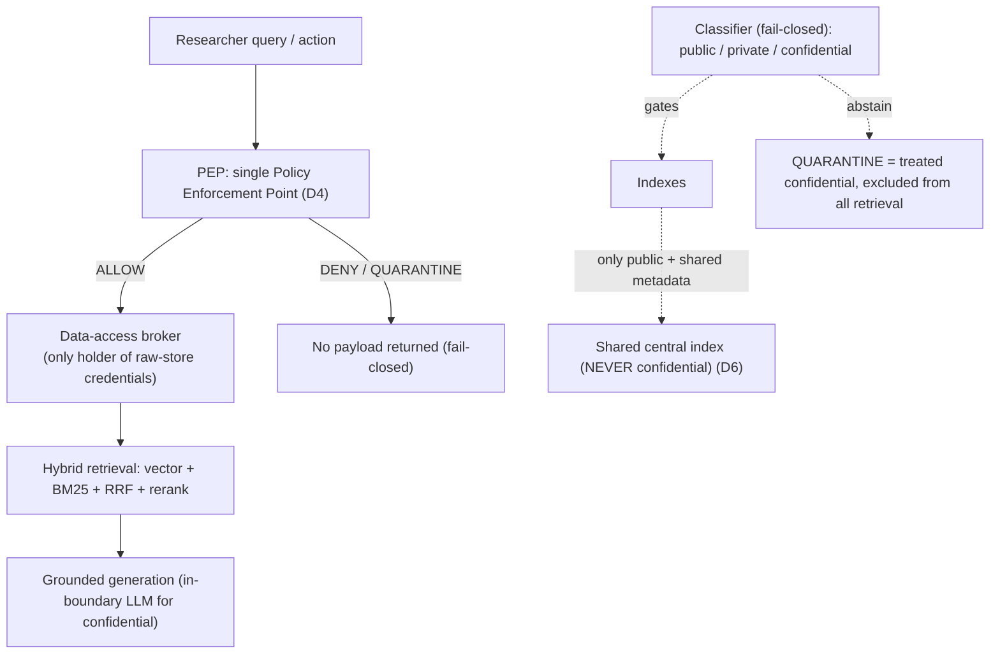

# Glossary & Domain Primer

**What this document is for.** You are the code-generation model that will build **TigerExchange** (project root: `tigerexchange/`). This file is your dictionary. Every term used anywhere in the Phase-0 builder guide is defined here, inline and self-contained, so you never have to guess what a word means or load another document to understand it. Two groups: **(A) Domain terms** — the academic-research / grant world the product lives in; **(B) Technical terms** — the architecture, security, and retrieval machinery you will implement. Each entry is a plain 1-3 sentence definition plus one line, prefixed **Why it matters here**, tying the term to a locked decision (D1-D7) or the canonical kernel. Where a term is a known *risk* the architecture resolves, the risk is named. Read this once; refer back as needed. It is alphabetical within each group so you can jump straight to a term.

> **Ground-truth pointers (never contradict these).**
> - Locked decisions **D1-D7** live in `plans/00-decisions.md` (summarized inline below).
> - The canonical kernel (authoritative Python types/interfaces) lives in `plans/phase0/00-kernel-contracts.md`, implemented under `tigerexchange/packages/contracts/src/contracts/`.
> - Spec/code layout: the spec (`plans/`) is a **sibling of** the code tree (`tigerexchange/`), not nested inside it. Libraries live in `tigerexchange/packages/` (the `contracts` kernel + `mod-*` feature modules); the FastAPI app in `tigerexchange/services/api/`.
> - Stack baseline: Python 3.11+ (the kernel package pins `requires-python = ">=3.11"`; an individual service may target 3.12 if it documents why), Pydantic v2, FastAPI, with `pytest` / `ruff` / `mypy` and test-driven development (TDD: write the failing test first, then the code).

---

## How the whole thing fits together (read this first)

TigerExchange sells **grant intelligence** to multi-institution research teams (decision **D1**). The hard part is that proposals, budgets, and preliminary data are **confidential** and must cross institutional boundaries **without ever being centralized**. The architecture resolves this with one chokepoint and a strict data-tier rule:

Three rules you must never break, because the kernel encodes them and the audit (by Claude/Anthropic) checks them:

1. **Everything goes through the PEP (D4).** Feature modules never read a raw store directly.
2. **Confidential content never enters the shared central index (D6).** The `PublishableProjection` type rejects the `confidential` tier at validation time.
3. **Unknown / ambiguous = most restrictive (fail-closed).** An unclassified record is treated as confidential and excluded from all retrieval until a human adjudicates it.

---

# Group A — Domain terms

| Term | Definition | Why it matters here |
|---|---|---|
| **Co-PI (Co-Principal Investigator)** | A researcher who shares lead scientific responsibility for a grant with the PI, often at a *different* institution on large multi-site awards. | The wedge product (D1) is "find me co-PIs at other universities to assemble a competitive team for this RFP" — `mod-discovery` + the cross-institution expertise graph exist to answer exactly this. |
| **DUA (Data Use Agreement)** | A signed legal contract that governs how identifiable or sensitive research data may be transferred and used between institutions; it is required for almost every inter-institutional transfer of restricted data. | D3 anchors cold-start on a center that *already has a DUA*, so confidential cross-institution sharing has a legal basis on day one. A sharing grant in the system references a DUA; it is not an ad-hoc ACL. |
| **Grant** | An award of funding from a sponsor (usually federal: NIH, NSF, DOE) to support a defined research project, governed by the sponsor's rules and a budget. | D1: grant intelligence is the entire product wedge. "Grant" also names the kernel's `IGrantStore` / `Grant` sharing-grant concept — keep the two senses distinct (funding award vs. sharing-grant authorization object; the latter is defined in Group B under *Sharing grant*). |
| **IRB (Institutional Review Board)** | The committee that reviews and approves human-subjects research to protect participants; data touching human subjects is subject to IRB rules and often a reliance agreement / single-IRB (sIRB) across sites. | A compliance flag (`ComplianceFlag.IRB`) rides the classification lattice. Phase-0 default posture: **no human-subjects PHI in the proposal workspace** unless the anchor's existing reliance agreement covers it. |
| **NIH U54 / U01** | NIH cooperative-agreement grant mechanisms for large, multi-site research *centers* (U54) and cooperative projects (U01); they structurally require multi-institution teams and run recurring funded cycles (renewals, supplements). | D3's ideal anchor: a U54/U01 center gives you N≥2 institutions, an existing DUA, and a recurring, *funded* grant need (a paying customer, not just a federation seed). |
| **NSF AI Institute** | A National Science Foundation program funding large, cross-institution AI research institutes; like NIH U54, intrinsically multi-university and recurring. | Same role as U54/U01 — a valid D3 anchor consortium. The federation layer is needed by the wedge, not deferred. |
| **PI (Principal Investigator)** | The researcher who leads a grant proposal and project and is accountable for it; writes/renews grants and assembles the team. | The PI is the PLG (product-led-growth) top-of-funnel user and champion, but has ~$0 budget authority — they do not sign the contract (the RD office does, per D7). Design for "PI uses it, RD office buys it." |
| **Proposal** | The pre-submission document (specific aims, budget, preliminary data, team roster) a team writes to apply for a grant; pre-funding proposals are among the *most confidential* artifacts in the academy. | The **confidential proposal workspace** is the wedge's defensible artifact (no public-data grant tool can host it). In the data model `PROPOSAL` is almost always `tier = confidential`. This is *why* the confidentiality machinery (D4-D6) exists. |
| **RD office / Sponsored-Programs office** | The institutional office (Research Development / Sponsored Programs) that manages grant submission, compliance, and contracts; an established six-figure buyer (incumbents: Cayuse, Kuali Research, Pivot-RP). | D7: the RD office is the institutional buyer whose ACV must be ≥ 2-3× per-tenant COGS. It signs; the PI champions. Pricing and editions target this buyer. |
| **Research card** | A structured, machine-readable summary of a paper or research artifact (key claims, methods, entities), produced by the distill stage of the ingestion pipeline. | The ingestion DAG produces research cards, then **classify-gates-index**: a card is classified before it can enter any index, and a quarantined card never enters one (D6). |
| **RFP (Request for Proposals)** | A sponsor's published funding opportunity describing what they will fund, eligibility, and deadlines (NIH/NSF/Grants.gov listings). | The trigger for the wedge: a PI sees an RFP and needs a team. `mod-funding-lite` matches researchers to RFPs (over Grants.gov / NIH RePORTER / NSF awards data). |

---

# Group B — Technical terms

> Quick map of where these appear in code (all paths under `tigerexchange/`):
> kernel types → `tigerexchange/packages/contracts/src/contracts/`; feature modules → `tigerexchange/packages/mod-*/`; the API → `tigerexchange/services/api/`.

### ABAC (Attribute-Based Access Control)
Access decisions evaluate boolean policies over *attributes* of the subject, resource, action, and environment (NIST SP 800-162). Example: "allow if `resource.tier <= subject.max_tier AND NOT (resource.export_controlled AND subject.is_foreign_national)`".
**Why it matters here:** ABAC carries the *classification + compliance* gate (tier, FERPA role, US-person status, edition capability). The locked engine is **OPA (Open Policy Agent, Rego)**, deployed as an HTTP sidecar — mature, CNCF-graduated, and giving a single decision point for tier ABAC (one owned Rego policy table behind the one PEP). Cedar was considered but is not used. ABAC answers "is this path *currently permitted*?", complementing ReBAC's "is there a path?".

### BM25 (Best Match 25)
A classic *sparse / lexical* ranking function that scores documents by exact term overlap with the query (term frequency × inverse document frequency, length-normalized). It excels at rare exact tokens: author names, acronyms, grant numbers, gene names.
**Why it matters here:** Academic corpora are entity-heavy, so sparse retrieval is **not optional**. BM25 is the low-level / exact-match leg of hybrid retrieval, implemented over **OpenSearch** (Apache-2.0 — chosen over Elasticsearch, which is AGPL and a license hazard for a commercial SaaS).

### BYOK / HYOK (Bring-Your-Own-Key / Hold-Your-Own-Key)
**BYOK:** the institution creates and owns the KEK (key-encryption key) in its own KMS and grants the platform usage; revoking the KEK makes the platform unable to decrypt that tenant's data. **HYOK:** the key *never leaves* the institution's environment, so the platform only ever sees ciphertext (stronger sovereignty, offered for the highest-sensitivity / export-controlled labs).
**Why it matters here:** BYOK is mandatory for the confidential tier; HYOK is an edition upsell. Together with in-boundary inference and US-only residency they form the single control surface export controls demand. **Risk resolved:** "platform can be subpoenaed/compromised and decrypt my data" — with HYOK it cryptographically cannot.

### Classification tier (public / private / confidential)
The three-level sensitivity **lattice** every artifact carries: `public < private < confidential` (a total order). The join of two tiers is the **MAX-rule** (more-restrictive wins); an unknown tier resolves to the most-restrictive (`confidential`).
**Why it matters here:** This is kernel **K1** (`contracts/lattice.py`, `Tier` is an `IntEnum` so the integer order *is* the sensitivity order; `Tier.parse` fails closed to `confidential` on any unknown input). Almost every other rule keys off the tier. **Do not relax the ordering or the fail-closed parse without a `LATTICE_VERSION` bump.**

### Crypto-shred (cryptographic erasure)
Deleting data by destroying its encryption key rather than chasing every replica: once the KEK/DEK is gone, the ciphertext is permanently unreadable.
**Why it matters here:** It satisfies GDPR right-to-erasure for confidential data without hunting copies across vector/lexical/graph derivative stores. **Risk resolved:** "a searchable derivative (embedding, BM25 posting) survives the shred and leaks" — confidential derivatives must be encrypted under the tenant KEK and a *post-shred zero-decryptable-hits test* must pass.

### Embedding
A dense numeric vector (a list of floats) representing the meaning of text, so that semantically similar texts land near each other in vector space.
**Why it matters here:** Embeddings power vector search. Confidential-tier embedding must run on a **self-hostable** model (SPECTER2 for scientific paper similarity; nomic-embed-text-v1.5 / Qwen3-Embedding / BGE-M3 for general text) — never a cloud API, because the text would leave the boundary. The kernel exposes `IExpertiseFingerprint` (SPECTER2-based, public-tier by construction).

### Entity resolution
Deciding when two records (e.g., "J. Smith" vs "John Smith @ MIT") refer to the *same* real-world entity (person, institution, paper), so the knowledge graph is correct.
**Why it matters here:** The cross-institution expertise graph that powers co-PI discovery is only as good as its entity resolution; ORCID is the stable correlation key across institutions. Done in the ingestion DAG before graph-build.

### Envelope encryption (KEK / DEK)
Data is encrypted with a per-record/per-tenant **DEK (data-encryption key)**; the DEK is itself encrypted ("wrapped") by a **KEK (key-encryption key)** held in a KMS/HSM, producing an encrypted DEK (EDEK). Disabling the KEK locks out all data under it instantly.
**Why it matters here:** This is the mechanism behind BYOK/HYOK and crypto-shred. Per-tenant KEKs give cryptographic tenant isolation: one tenant's key compromise is not cross-tenant exposure.

### Export control (ITAR / EAR)
US regulations restricting defense (ITAR) and dual-use (EAR) technical data. The trap is the **deemed export**: giving a *foreign national* access to controlled data *inside the US* can itself require a license. The **Fundamental Research Exclusion (FRE)** exempts ordinarily-published research but is *lost* if the sponsor imposes publication/participation restrictions.
**Why it matters here:** Nationality becomes an access *attribute* (ABAC), even domestically. Phase-0 default: export-controlled data is **not accepted** until an export-conformant cell exists; FRE is opt-in per controlled project. Compliance flags `ITAR` / `EAR` ride the lattice. **Risk resolved:** an export-control violation via a foreign-national read of a controlled proposal.

### FERPA (Family Educational Rights and Privacy Act, US)
US law protecting student "education records"; the platform must operate as a "school official" under the institution's control with audit logs and access controls.
**Why it matters here:** `ComplianceFlag.FERPA` rides the lattice; a `ferpa_role` caveat is re-evaluated at access. It is part of the minimum security bar a university review will probe.

### GDPR (General Data Protection Regulation, EU)
EU law governing all personal data of EU subjects: lawful basis, data minimization, right-to-erasure within ~30 days, and a valid mechanism for cross-border transfer.
**Why it matters here:** `ComplianceFlag.GDPR_PERSONAL` rides the lattice; crypto-shred reconciles erasure with replicas; cross-border discovery exposes only lawfully-transferable (publishable) metadata. The university is the controller; the platform is a processor under a signed DPA.

### HECVAT (Higher Education Community Vendor Assessment Toolkit)
A standardized security/privacy questionnaire that higher-ed institutions send vendors during procurement to assess data handling before purchase.
**Why it matters here:** Passing a HECVAT (alongside SOC 2) is part of clearing the institutional security review that gates the first RD-office contract (D7). *(Source note: HECVAT is standard higher-ed procurement vocabulary; it was not named in the skimmed research files — defined here from domain knowledge, flagged for audit.)*

### Knowledge graph
A graph of entities (researchers, papers, institutions, grants, venues) connected by typed relationships (authored, cites, affiliated-with, co-PI-with), queryable by traversal.
**Why it matters here:** Dual-purpose — a *product feature* (collaborator/team-assembly discovery via `ICollaborationGraph`) and a *retrieval augmentation*. Built on **Apache AGE** (Cypher-on-Postgres, Apache-2.0). **Do not use KuzuDB** — it was archived 10 Oct 2025 (the legacy TigerResearchBuddy used it; TigerExchange does not). Each node builds its own graph; the exchange federates only grant-scoped nodes/edges.

### Multi-tenancy
One software instance serving multiple isolated customers ("tenants" = institutions), sharing a control plane while keeping each tenant's data separated. Canonical models: **silo** (dedicated resources, strongest isolation), **pool** (shared infra, logical isolation), **bridge** (mixed per-service).
**Why it matters here:** D7 — non-confidential workloads run **pooled** (cheap), confidential runs **dedicated/siloed** (the only way COGS stays bounded). `TenantContext` (kernel) is the request-scoped tenant identity the PEP authorizes against.

### OIDC / SAML / federated identity
**SAML 2.0** and **OIDC (OpenID Connect)** are SSO protocols. **Federated identity** lets a user log in with their *home institution's* identity provider (IdP). In academia, institutions federate via InCommon/eduGAIN; you join once as a Service Provider (often brokered through CILogon + Keycloak) instead of onboarding each university.
**Why it matters here:** `TenantContext.subject_id` is the authenticated subject (eduPersonUniqueId / OIDC `sub`); affiliations drive ABAC. **Risk resolved:** a "confused-deputy" federation attack — scope every assertion to the asserting tenant so IdP-A can only mint Tenant-A identities.

### PEP / PDP (Policy Enforcement Point / Policy Decision Point)
The **PEP** is the gate that *enforces* an access decision at the point of use; the **PDP** is the engine that *decides* (evaluates the policy). In TigerExchange these are fused into one chokepoint plus a data-access broker.
**Why it matters here:** **D4** — a *single* PEP + data-access broker is the only path to data; feature modules stay "dumb" and physically cannot bypass it (so adding a new module cannot become a leak vector). Kernel: `IPolicyEnforcement.authorize(PepRequest) -> PepResponse`, `IDataAccessBroker` (sole holder of raw-store credentials). Fail-closed: a non-`ALLOW` response carries **no payload** (enforced in `PepResponse.model_post_init`).

### RAG (Retrieval-Augmented Generation)
Generate an LLM answer *grounded* in documents retrieved at query time (retrieve → stuff context → generate with citations), rather than from the model's parameters alone.
**Why it matters here:** The wedge's literature-intelligence module (`mod-lit-intelligence`) does grounded proposal drafting over the center's own docs + public scholarly corpus. On the confidential tier, retrieval, reranking, and generation all run on **in-boundary** models (vLLM in prod, Ollama in dev).

### RBAC (Role-Based Access Control)
Permissions granted via roles (admin, member, viewer). Simple, but suffers "role explosion" and cannot natively express per-resource, per-project, cross-institution grants.
**Why it matters here:** Used only as "sugar" (roles modeled as relations). It is *insufficient alone* for this product's sharing requirements — that is why ReBAC + ABAC are the core.

### ReBAC / Zanzibar
**ReBAC (Relationship-Based Access Control)** decides access via relationship tuples like `proposal:alpha#collaborator@univB:smith`, with userset-rewrite rules. **Zanzibar** is Google's reference design for this; **SpiceDB** and **OpenFGA** are the open implementations.
**Why it matters here:** ReBAC is the core for sharing graphs (per-project membership, cross-institution sharing grants, tenant isolation as structural reachability — "no grant ⇒ no path ⇒ deny"). Locked engine: **SpiceDB** (ZedToken consistency; OpenFGA `HIGHER_CONSISTENCY` fallback). Revocation = flip a relation, and the next consistent check denies.

### Reranker
A second-stage model (usually a *cross-encoder*) that re-scores the top-N retrieved candidates jointly against the query for much higher precision, e.g. top-50 → top-8.
**Why it matters here:** Highest-ROI quality lever after hybrid retrieval (+5 to +15 nDCG@10 for <200ms). Kernel: `IReranker.rerank(...)`. Confidential path uses **BGE-reranker-v2-m3** or **Qwen3-Reranker** (local, Apache-2.0); Cohere Rerank is a public/BYO-only upgrade.

### RLS (Row-Level Security)
A Postgres feature that filters which *rows* a query can see based on a session/transaction variable (e.g. `tenant_id`).
**Why it matters here:** It is **defense-in-depth for the pooled tier, never the primary boundary** (the PEP/ReBAC check is primary). **Risk resolved (named footguns):** must use `FORCE ROW LEVEL SECURITY` (owner bypasses RLS by default) and `SET LOCAL` per transaction (session-scoped `SET` leaks tenant context across pooled connections) — pin via `SET LOCAL app.tenant_id = ...` inside the transaction. `tenant_id` must be the leading index column.

### RRF (Reciprocal Rank Fusion)
A parameter-free way to merge results from multiple retrievers using their *ranks* (not raw scores): `score(d) = Σ 1/(k + rank_i(d))`, with `k ≈ 60`. It sidesteps the incomparable-scores problem (cosine vs BM25) and rewards cross-retriever agreement.
**Why it matters here:** It fuses the vector and BM25 legs at MVP because there is no labeled relevance data on day one and it needs zero tuning. Fusion weights, when learned later, must be **tenant-local** — never global (fits federated isolation). Lives behind `IRetrievalStrategy`.

### SOC 2
An auditor attestation (Type I = point-in-time, Type II = over a period) that a vendor's security controls operate effectively; the de-facto minimum for B2B SaaS handling customer data.
**Why it matters here:** Universities request a SOC 2 Type II report (or in-progress with a date) during vendor review; the per-stream hash-chained `AuditEvent` spine (`IAuditSink`) supplies the tamper-evident evidence. Start the readiness process early — it gates the first institutional contract.

### Tenant isolation
The guarantee that one tenant can never read or affect another tenant's data. "You can be multi-tenant without being isolated" — isolation must be *structural*, not just a `tenant_id` column a query might forget.
**Why it matters here:** Enforced three ways that compound: structural ReBAC reachability (primary), per-tenant envelope-encryption keys (a leaked row is ciphertext), and dedicated cells for confidential (D7). **Risk resolved:** BOLA/IDOR (swapping an object id to read another tenant's resource) — object-level authz on *every* request via the PEP defeats it.

---

## Decision quick-reference (so you never have to leave this file)

| ID | One-line lock | Term(s) it governs |
|---|---|---|
| **D1** | Wedge = grant intelligence (cross-institution team assembly + secure proposal collaboration). | Grant, RFP, Co-PI, Proposal |
| **D2** | Narrow-to-land scope, but build the *full* modular architecture. | Multi-tenancy, the `mod-*` modules |
| **D3** | Cold-start anchor = one existing federally-funded multi-site center with an existing DUA. | NIH U54/U01, NSF AI Institute, DUA |
| **D4** | Single PEP + data-access broker chokepoint; modules cannot bypass it. | PEP/PDP, data-access broker |
| **D5** | The owning node is the sole local fail-closed authority — no global hot-path consensus. | Sharing grant, owner-side re-derivation |
| **D6** | Confidential content never enters the shared central index; classifier abstention → QUARANTINE (default-deny). | Classification tier, `PublishableProjection`, QUARANTINE |
| **D7** | Institutional ACV ≥ 2-3× per-tenant COGS; pooled for non-confidential, dedicated isolation only for confidential. | RD office, multi-tenancy, tenant isolation, SOC 2/HECVAT |

> **Sharing grant (kernel term, defined here to disambiguate from "grant" the funding award):** a first-class, revocable authorization object that admits an external tenant/user to a resource, referencing a DUA, carrying a tier ceiling, caveats, and an expiry. Kernel: `IGrantStore.get_grant(...)`, the `Grant` view, and the rule that the **owner node re-derives** scope/tier/caveats from its authoritative store and **ignores any scope claim presented in the token** (D5). **Risk resolved:** the Zanzibar "new-enemy problem" / stale-grant leak — a revoked share must not still read; owner-local strongly-consistent checks (ZedToken / revocation epoch) close it.
