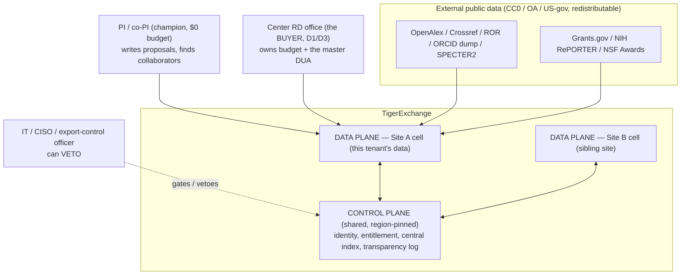
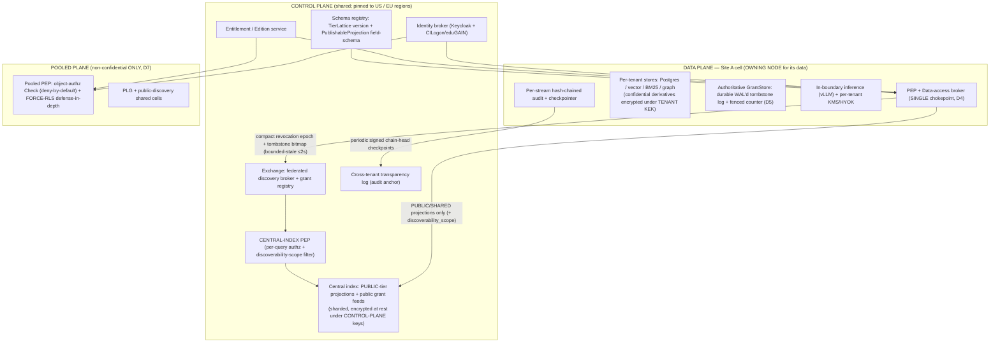
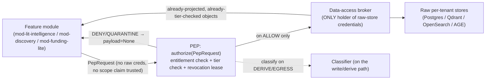
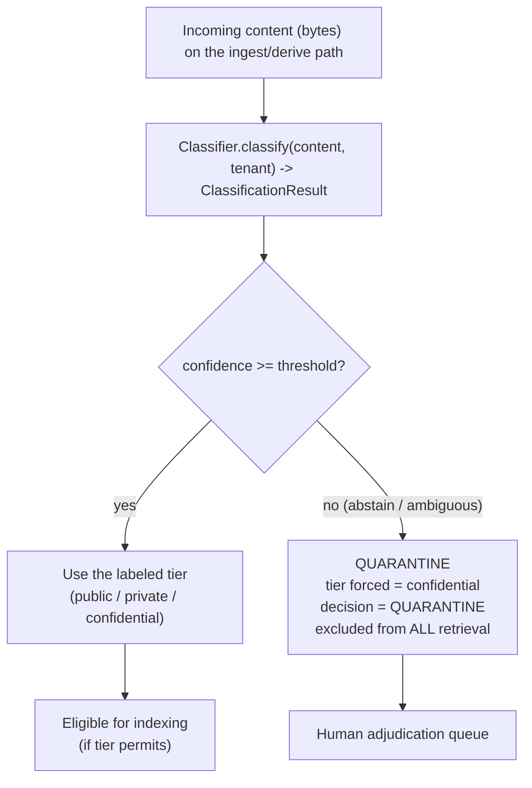
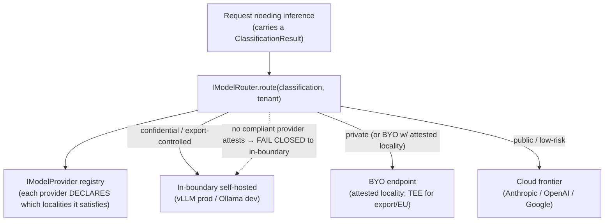
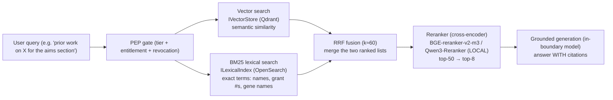
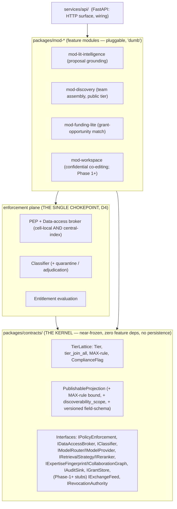
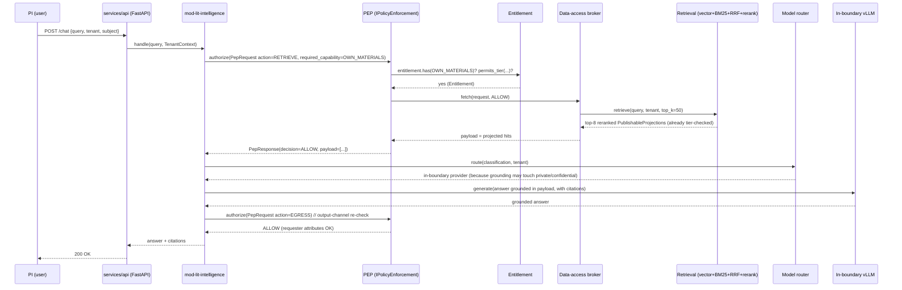

# High-Level Design (HLD)

## What this document is for

This document is the **architecture map** for building TigerExchange Phase-0. It tells you (the code-generation model) **what the major pieces are, how data flows between them, and — for every piece — WHY it exists**. It is deliberately self-contained: every term is defined the first time it appears, every path is absolute under the project root `tigerexchange/`, and every non-trivial choice is stated as "we do X because Y; we considered Z but rejected it because W". You should be able to build the system from this document plus the canonical kernel (`tigerexchange/packages/contracts/`) **without guessing intent**. This is the *what and why*; the *how* (exact signatures, test bodies, line-by-line code) lives in the per-component sub-plans (`plans/phase0/0a`…`0k`). Read this first; it is the frame those plans hang on.

---

## 0. Glossary (defined once, used everywhere)

You MUST know these terms. They are used unqualified throughout.

| Term | One-line definition |
|---|---|
| **Tenant** | One institution (or one PLG individual). A unit of isolation and billing. Has a stable `tenant_id` string. |
| **Cell** | One tenant's isolated runtime: its own databases, its own model server, its own keys. A "dedicated cell" is one tenant alone; a "pooled plane" co-locates many low-risk tenants. |
| **Node / owning node** | The institution that *owns* a confidential artifact. It is the **sole authority** for who may read/revoke that artifact (decision **D5**). |
| **Tier** | Sensitivity level of data. Exactly three, totally ordered: `public < private < confidential`. The kernel encodes this in `contracts.lattice.Tier` (an `IntEnum`, `public=0,private=1,confidential=2`). |
| **MAX-rule** | When data is combined/derived, the result's tier = the *most restrictive* input tier (the lattice join). `contracts.lattice.tier_join_all([...])`. Empty input → `confidential` (fail-closed). |
| **PEP (Policy Enforcement Point)** | The **single chokepoint** (decision **D4**) every retrieval/egress/derivation request passes through. Kernel interface `contracts.IPolicyEnforcement.authorize(PepRequest) -> PepResponse`. |
| **Data-access broker** | The component *behind* the PEP that is the **only** holder of raw-store credentials. It fetches raw rows and returns projected, tier-checked objects. Kernel interface `contracts.IDataAccessBroker`. |
| **Classifier** | The single component that labels content with a `Tier`. On low confidence it **abstains** → quarantine (decision **D6**). Kernel interface `contracts.IClassifier`. |
| **Quarantine** | Fail-closed disposition for unclassifiable content: treated as `confidential`, excluded from ALL retrieval, queued for a human. `contracts.Decision.QUARANTINE`. |
| **PublishableProjection** | The ONLY data shape allowed to cross into the shared index. Public/private metadata + non-reversible signals only — **never confidential** (D6). `contracts.PublishableProjection`. |
| **Central index / Exchange** | The shared, cross-institution discovery layer in the control plane. Holds `PublishableProjection`s only. |
| **Control plane** | The shared, cross-tenant services (identity, entitlement, central index, transparency log). Region-pinned (US/EU). |
| **Data plane** | The per-tenant cells where actual confidential/private data lives and is served. |
| **Entitlement / Edition** | A tenant's resolved capability set (`contracts.Entitlement`). Editions (PLG, Institutional, Consortium-Anchor, …) are *config*, not code forks. Evaluated AT the PEP. |
| **RRF (Reciprocal Rank Fusion)** | The algorithm that merges vector-search and BM25 result lists into one ranked list. Constant `k≈60`. |
| **BM25** | A classic lexical (keyword) ranking function. Good for entity-heavy text (author names, grant numbers, gene names). |
| **Reranker** | A cross-encoder model that re-scores the top candidates for relevance (top-50 → top-8). |
| **KEK / DEK** | Key-Encryption-Key / Data-Encryption-Key (envelope encryption). Shredding the KEK makes ciphertext permanently undecryptable ("crypto-shred"). |
| **D1…D7** | The seven locked decisions (see `plans/00-decisions.md`). Summarized inline where used. They are **authoritative; never contradict them**. |

**Project root and layout** (every path below is relative to this root):

```
tigerexchange/
├── packages/                         # importable libraries
│   ├── contracts/                    # THE KERNEL (authoritative types + interfaces). Near-frozen, zero feature deps, no persistence.
│   ├── mod-lit-intelligence/         # feature module: proposal grounding (Phase 0)
│   ├── mod-discovery/                # feature module: cross-institution expert discovery (Phase 0 public-tier)
│   ├── mod-funding-lite/             # feature module: grant-opportunity match (Phase 0 lite)
│   └── mod-workspace/                # feature module: confidential co-editing (Phase 1+; seam only in Phase 0)
└── services/
    └── api/                          # FastAPI app: HTTP surface, wires modules behind the PEP
```

**Stack baseline (do not deviate):** Python 3.11+, Pydantic v2, FastAPI, pytest + ruff + mypy, test-driven development (write the failing test first). Kernel dependency pin: `pydantic>=2.6,<3`.

---

## 1. System context — who talks to what

This is the outermost view: the human/external actors and the two planes.



**Why this shape.** The wedge (decision **D1**: grant intelligence = cross-institution team assembly + secure proposal collaboration) is *intrinsically* multi-institution: NIH U54/U01 centers and NSF AI Institutes require teams across universities. So there must be ≥2 data-plane cells *and* a shared control plane that lets them discover each other — **but confidential proposal content must never centralize** (decision **D6**). That tension is the entire reason for the control-plane/data-plane split in §2. We considered a single centralized SaaS database (like the grant-DB incumbents Pivot/Cayuse); we rejected it because a centralized store cannot host confidential cross-institution proposals without becoming the one-way-door leak D6 forbids.

**Phase-0 reality check.** In Phase 0 you build **one** cell (the anchor center's largest site, decision **D3**) plus the *seams* for the second. There is **no live federation** in Phase 0 — the cross-node interfaces (`IExchangeFeed`, `IRevocationAuthority`) are Phase-1+ stubs that exist only so federation can light up later without changing the kernel.

---

## 2. Control plane vs data plane + federation topology (D5)

This is the load-bearing diagram. Read the WHY paragraphs after it.



### Why a control-plane / data-plane split at all

- **Control plane** = the *shared* services that must be cross-tenant (you cannot federate discovery without a shared place to discover *in*). It holds **only** non-confidential projections.
- **Data plane** = the *per-tenant* runtime where confidential and private data actually lives and is served.

We split them because **D6** ("confidential content never enters the shared index") is a *physical* invariant, not a policy you can configure away. By making the control plane a different deployment with no access to raw tenant stores, a bug in the shared layer **cannot** reach confidential data — the data is not there to reach.

### Why D5: the owning node is the sole LOCAL authority, with NO global hot-path consensus

**The problem D5 solves (name the risk):** the *confidential hot-path latency/availability impossibility*. If "can subject X read confidential artifact Y?" required a multi-region consensus round trip (e.g. a global Raft/Paxos quorum) on **every request**, then:

1. **Latency:** every confidential read pays a cross-region RTT (US↔EU ≈ 350 ms one way) plus quorum overhead — this blows the 6.5 s composite SLO and serializes the whole system on one global log.
2. **Availability:** a control-plane partition would make **every** confidential read everywhere fail — a global outage from a single network event.

**D5's resolution:** the institution that *owns* a confidential artifact is the **only** authority for access/revocation decisions on it, and the check is a **local read** at that node:

```
allow  ⇔  lease.valid  AND  now < lease.expiry  AND  grant_id NOT IN local_tombstone_log
```

This read is `p99 < 15 ms` and **never** leaves the owning cell. Why this works:

- **Latency:** no consensus hop on the read path. The only cross-region cost is *reaching* the owner once (one RTT), then the owner does local checks. (See the per-hop budget table in `plans/final-plan-v2.md` §4.3.)
- **Availability:** a partition degrades **only the partitioned cell**, and only to *deny* (fail-closed), TTL-bounded. The blast radius is one node, not the world.
- **Correctness:** discovery *metadata* is allowed to be eventually-consistent (it's only public/shared), but **confidentiality decisions are strongly consistent at the owning node** against its durable local tombstone log. A revoked confidential artifact is never served past the owner's local revocation, regardless of how stale the shared Exchange's view is.

**We considered** global consensus on every access (option rejected: anti-scaling serialization point + global outage domain) and **also considered** synchronous fan-out to every owner cell per discovery query (rejected: reintroduces cross-region coupling on the fast discovery path and scales badly with N owners per result page). D5 picks owner-local authority instead.

**Phase-0 note:** the federation seam (`IExchangeFeed`) and the cross-node revocation authority (`IRevocationAuthority`) are **deferred stubs** — present in the kernel so Phase-1 can extend cleanly, but **NO implementation ships in Phase 0**. In Phase 0 the "owning node" is just *the one cell*; the local fail-closed GrantStore read path still applies to that cell's own grants.

---

## 3. The three data tiers and the single PEP chokepoint (D4)

### 3.1 The three tiers

There are exactly three sensitivity tiers, totally ordered. This is the frozen lattice (`contracts.lattice.Tier`).

| Tier | Value | Examples | Where it may live |
|---|---|---|---|
| `public` | 0 | OpenAlex papers, public faculty profiles, Grants.gov opportunities | Anywhere, including the shared central index |
| `private` | 1 | A tenant's own internal documents, PLG "own materials" | The owning cell + pooled plane (with per-tenant isolation, §6) |
| `confidential` | 2 | Proposal drafts, budgets, preliminary data, team negotiations | The owning cell ONLY — **never** the central index (D6) |

**MAX-rule (the join).** When you combine inputs, the output tier is the *most restrictive* input. A summary that draws on one confidential source is itself confidential. Use `contracts.lattice.tier_join_all([t1, t2, ...])`. **Unknown/empty → `confidential`** (fail-closed). We do this because the alternative — picking a permissive default on uncertain input — is exactly the misclassification leak D6 forbids.

### 3.2 The single PEP chokepoint — and why one chokepoint preserves modularity



**The rule (D4):** *every* retrieval, egress, and derivation in a cell flows through **one** PEP + data-access broker. Feature modules receive **already-projected, already-tier-checked result objects** and **never** see raw classification logic or the raw store. The PEP returns a `PepResponse` whose `payload` is `None` on any non-`ALLOW` decision (the kernel enforces this in `PepResponse.model_post_init`).

**Why one chokepoint *preserves* modularity (this is the key insight, name the risk it resolves — "pluggable module impossibility"):**

If each feature module had to re-implement the ~7 confidentiality mechanisms (classification, tier check, entitlement, revocation lease, egress allowlist, audit, taint propagation), then:
- adding a new module (e.g. `mod-funding-lite` in a later phase) would be a **new leak surface** — you'd have to re-verify confidentiality in every module, every time;
- modules could **not** be "dumb and pluggable" — they'd each carry security-critical code.

By forcing every access through **one** PEP, modules become genuinely pluggable: a module **physically cannot bypass enforcement** because it never holds raw-store credentials and never constructs a `PublishableProjection` (the broker does). Adding a module **inherits enforcement for free**. This is enforced three ways:

1. **import-linter** forbids feature modules from importing the raw store, the classifier, or constructing a `PublishableProjection`.
2. **Runtime:** the broker is the only component with raw-store DB credentials (per-module DB-role isolation).
3. **Egress re-check:** the PEP re-evaluates classification against a publishable allowlist at the boundary — the outbox is *checked, not trusted*.

**We considered** letting each module enforce its own policy (rejected: every module becomes security-critical, blast radius is unbounded, and the system cannot stay modular). The single chokepoint is the structural resolution.

**Two loci, one PEP code.** The same PEP implementation runs in two places, selected by `PepRequest.action`:
- **cell-local PEP** — gates raw confidential/private data in the owning cell (`action` ∈ `retrieve`, `egress`, `derive`, `brokered-drilldown`);
- **central-index PEP** — gates *reads of published projections* in the control plane (`action = discover`, §5/§4.7-style scope filtering).

They share one policy table. This is not two implementations — it is one PEP at two deployment loci.

**Public-tier clarification (`mod-discovery`).** "Every access goes through the PEP" does not mean every module touches the confidential enforcement path. `mod-discovery` operates on **PUBLIC-tier data only**: it goes through the **central-index read PEP** (`action = discover`) for discoverability-**scope** filtering, and never reaches the cell-local confidential broker path. The confidential mechanisms (KEK-decryptable derivatives, owner-local tombstone lease) are exercised by `mod-lit-intelligence` on private/confidential content, not by `mod-discovery`.

**ABAC engine = OPA.** The tier ABAC step inside the PEP is enforced by **OPA (Open Policy Agent, Rego)** deployed as an HTTP sidecar — a single CNCF-graduated decision point for tier ABAC behind the one PEP — alongside SpiceDB for ReBAC. (Cedar was considered and not used.)

---

## 4. Classification engine + quarantine (D6)



**The rule (D6):** the classifier is **single** and **fail-closed**. Below a stated confidence threshold it does **not** guess a tier — it returns `ClassificationResult.quarantine(reason=...)`, which forces `tier = confidential` and `decision = QUARANTINE`. A quarantined record is **excluded from all retrieval** and routed to a **human adjudication queue** before it can ever be indexed. Use the kernel constructor:

```python
from contracts import ClassificationResult, Decision, Tier

# abstention path — the ONLY safe default for unsure content
result = ClassificationResult.quarantine(reason="confidence 0.41 below threshold 0.7")
assert result.tier is Tier.confidential
assert result.decision is Decision.QUARANTINE
assert result.is_retrievable is False   # never enters a retrieval path
```

**Why fail-closed quarantine (name the risk — "misclassification root leak"):** the central index is a **one-way door** (D6) — once confidential-derived content is published, you cannot un-publish what others have already pulled. If the classifier *guessed* `public` on a confidential document, that document would leak permanently. So the only safe default for uncertainty is "treat as confidential and exclude". We **considered** a confidence-weighted "best guess" (rejected: a wrong guess on the permissive side is an irreversible leak) and a dual-classifier agreement scheme (deferred to Phase 1 — Phase 0 ships single-classifier + default-deny-on-abstention + adjudication only).

**Phase-0 contract test (build this):** inject low-confidence and *adversarial* records (confidential content wearing public-looking metadata); assert **zero leak** into any retrievable surface.

---

## 5. Classification-routed model router (local vs cloud) + BYO



**The routing rules (fail-closed):**

| Data class | Allowed providers | Why |
|---|---|---|
| `confidential` (proposal drafts/budgets) | **in-boundary self-hosted ONLY** (vLLM prod, Ollama dev) | confidential bytes must never leave the boundary; sending them to a cloud API would breach D6's spirit at the inference layer |
| export-controlled (ITAR/EAR) | in-boundary on an **export-conformant cell** only; **BYO refused unless TEE-attested + jurisdiction-proven** | deemed-export risk; we never overclaim that a contractual no-log control is cryptographic |
| `private` (institution-internal) | in-boundary, **or** a BYO endpoint with *attested* locality | locality must be proven, not assumed |
| `public` / low-risk | cloud frontier or local | no confidentiality constraint → use the strongest/cheapest model |

**Why a *registry* of providers, not a hardcoded `tier→provider` table:** the router selects over an `IModelProvider` registry where each provider **declares the locality classes it satisfies** (`IModelProvider.satisfies_locality(tier) -> bool`). A single owned policy table is consulted by **both** the router **and** the egress/transport layer — never two independent re-derivations; disagreement is a hard-fail ("router violated given policy"). We do this because hardcoding `tier→provider` would make adding a BYO endpoint a code change in the router (a leak risk); a declared-locality registry makes providers pluggable while the *policy* stays single-sourced.

**BYO (Bring-Your-Own provider/keys), honestly bounded:** an institution may register its own model endpoint as an `IModelProvider`. "No-retention" is a **contractual** control (mTLS proves endpoint identity; it does **not** cryptographically prevent the provider from logging prompts — we do not overclaim). For export-controlled or EU-personal data, the BYO endpoint MUST present **TEE remote attestation** (enclave + no-log proof + jurisdiction proof). **If it cannot attest, the router fails closed to the in-boundary self-hosted model** — a routing rule in the policy table, not a caveat in a contract.

**Phase-0 note:** Ollama on the M4 Max is **dev/UI only** — *never* the confidential-path test target. Confidential-path tests run against a vLLM container in CI + cloud GPU staging.

---

## 6. The retrieval pipeline (hybrid vector + BM25 + RRF + rerank)

This is the Phase-0 core of `mod-lit-intelligence` (proposal grounding). It is the *how a question gets answered from documents* path.



**Why hybrid (vector + BM25), not vector alone:** academic corpora are *entity-heavy* — author names, acronyms, grant numbers, gene names. Pure vector search blurs these (it captures meaning, not exact tokens); pure BM25 misses paraphrase. We run **both** and fuse with **RRF (Reciprocal Rank Fusion, k≈60)**, which combines two ranked lists by summing `1/(k+rank)` per document — robust, score-scale-independent, no tuning of relative weights needed. We **considered** vector-only (rejected: misses exact-entity matches that grant writers rely on) and a single weighted linear blend of raw scores (rejected: vector and BM25 scores live on incomparable scales, so the blend is fragile).

**Why a reranker on top:** RRF gives a good top-50 cheaply; a **cross-encoder reranker** (which reads query+document *together*, unlike the bi-encoder that produced the embeddings) re-scores those 50 and keeps the top-8 actually fed to the generator. This is the single biggest precision lever for grounded drafting. It runs **locally** so it works on the confidential tier.

**Confidential-tier wrinkle (ties to §7):** on the confidential tier, the vector/BM25/graph *derivative* stores backing this path are **encrypted under the tenant KEK** (or, where the engine cannot do customer-held-KEK encryption, on tenant-CMK-encrypted volumes, else delete-and-rebuild). So a confidential search is served from KEK-decryptable derivatives only — crypto-shredding the KEK shreds the *searchable copies*, not just the primary document. This is `mod-lit-intelligence`'s interaction with `0g-confidential-kek-stores`.

**Behind interfaces (do not bypass):** callers consume `contracts.IRetrievalStrategy.retrieve(query, tenant, top_k=8)` and `contracts.IReranker.rerank(...)` only. Engine choice (Qdrant/OpenSearch/AGE) is insulated; a conformance suite gates any swap. Retrieval returns **already-PEP-gated, already-projected** hits.

**Evaluation gate:** retrieval quality is a release gate — RAGAS (faithfulness, context-precision/recall) + nDCG@k/Recall@k on a small in-domain gold set, run **per-tenant and per-model-route**. On the confidential tier the **judge LLM is the local model** (you cannot send a confidential answer to a cloud judge).

---

## 7. Module map — kernel + mod-* + services/api, and how modules plug in behind the PEP



### How a module plugs in (the contract)

A **module** = an owned Postgres schema + an owned DB role (with `REVOKE` on other schemas) + published domain events + consumed/published kernel interfaces. It owns its data; no other module reads its tables.

To add a module you do exactly three things — and **no confidentiality re-threading**:
1. **Register its edition capabilities** in the Entitlement service (so the PEP can gate it).
2. **Declare the kernel interfaces it consumes** (e.g. `mod-lit-intelligence` consumes `IRetrievalStrategy`, `IModelRouter`, `IPolicyEnforcement`).
3. **Receive already-projected objects from the broker.** The module never touches raw classification or raw stores.

| Module | Consumes (kernel interfaces) | Phase |
|---|---|---|
| `mod-lit-intelligence` (proposal grounding) | `IRetrievalStrategy`, `IModelRouter`, `IPolicyEnforcement` | **0** (own-corpus grounded drafting) |
| `mod-discovery` (team assembly = expert discovery) | `IRetrievalStrategy`, `ICollaborationGraph`, `IExpertiseFingerprint`, `IExchangeFeed`(stub) | **0** public-tier; 1 cross-inst. |
| `mod-funding-lite` (opportunity match) | `IExpertiseFingerprint`, `ICollaborationGraph`, public grant feeds | **0** lite; 1 match; 3 full |
| `mod-workspace` (confidential co-editing) | `IGrantStore`, `IRevocationAuthority`(stub), `IPolicyEnforcement`, `IAuditSink` | 1 single grant; 2 full |

**Why this map (decision D2 — "narrow to land, full architecture"):** the four "wedges" are NOT four products — they are the **natural decomposition of one grant workflow**: team assembly = expert discovery (`mod-discovery`); proposal grounding = literature intelligence (`mod-lit-intelligence`); confidential co-editing = secure workspaces (`mod-workspace`); the grant itself = funding intelligence (`mod-funding-lite`). Building the grant wedge legitimately builds slices of all four behind one kernel, so nothing is thrown away while Phase 0 stays small. We **considered** four separate products (rejected: 18–36-month pre-revenue program for a 3–4 person team, inverted unit economics).

**Kernel fitness function (do not violate):** a type/interface belongs in `packages/contracts/` iff (a) zero deps on feature modules, (b) no persistent state, (c) referenced by ≥2 features. import-linter forbids the kernel from importing any persistence/feature engine (sqlalchemy, qdrant_client, opensearchpy, kuzu, neo4j, spicedb, …). The kernel stays a pure, importable set of types + Protocols.

**Phase-0 modular monolith (honest posture):** in Phase 0 this is **one deployable** (`services/api/`) with **in-process** module boundaries enforced by per-schema DB roles + import-linter — NOT independently-deployed microservices. The extraction escape-hatch (own DB + event-bus-only) exists from day one, but you do not extract until measured load demands it.

---

## 8. Key invariants (the non-negotiables — verify your build against these)

These are the properties that MUST hold. Each maps to a locked decision and a named risk. If your code can violate one of these, the code is wrong.

| # | Invariant | Decision | Risk it kills | Enforced by |
|---|---|---|---|---|
| **I1** | **Confidential content never leaves its owning boundary.** It is served only by the owning cell's in-boundary inference; never sent to a cloud model. | D6 / router §5 | Confidential leak via inference egress | `IModelRouter` fail-closed-to-local; egress PEP re-check |
| **I2** | **Confidential content never enters the shared central index.** `PublishableProjection` rejects `tier == confidential` at construction. | D6 | One-way-door publication leak | `PublishableProjection` field validator (raises `ValueError`) |
| **I3** | **Discovery metadata is eventually-consistent; confidentiality decisions are strongly-consistent at the owning node ONLY.** Shared-tier discovery may be ≤2 s stale; confidential drill-down re-derives at the owner against the durable local tombstone log and is never stale-allowed. | D5 | Global-consensus serialization / global outage | owner-local lease read (`p99 < 15 ms`); bounded-stale epoch/bitmap push for discovery |
| **I4** | **Unknown/unsure → most-restrictive.** Unknown tier parses to `confidential`; classifier abstention → `QUARANTINE` (= confidential, excluded from all retrieval). | D6 | Misclassification root leak | `Tier.parse` fail-closed; `ClassificationResult.quarantine()` |
| **I5** | **MAX-rule on every derivation.** A derived artifact's tier = MAX of all input tiers; compliance flags UNION (sticky, never dropped). | D6 / §6.1 | Tier-downgrade on combination | `tier_join_all`, `compliance_union` |
| **I6** | **All access goes through the single PEP; modules never hold raw-store credentials and never construct a `PublishableProjection`.** | D4 | Pluggable-module leak surface | import-linter + broker-only credentials + egress re-check |
| **I7** | **Non-ALLOW carries no payload.** A `DENY`/`QUARANTINE` `PepResponse` has `payload is None`. | D4 | Fail-open data return | `PepResponse.model_post_init` raises if violated |
| **I8** | **Owner-side authoritative re-derivation.** For any cross-tenant access the owning node looks the grant up in its own authoritative GrantStore and **ignores** any scope claim presented in the token. | D5 | Confused-deputy / IDOR widening | `IGrantStore` lookup + owner-side re-derivation |
| **I9** | **Crypto-shred shreds the searchable copies too.** Confidential derivative stores (vectors, BM25 postings, graph) are encrypted under the tenant KEK (or tenant-CMK volume, else delete-and-rebuild). | D6 / D7 | Searchable-copy leak after revocation | tenant-KEK/volume encryption; post-shred zero-decryptable-hits test |
| **I10** | **Non-confidential is pooled; dedicated isolation only for confidential.** PLG/public run multi-tenant pooled with a per-tenant isolation boundary (object-authz primary + FORCE-RLS defense-in-depth); confidential gets a dedicated cell. | D7 | Cross-tenant BOLA/IDOR in pooled plane; COGS blowout | object-authz Check + FORCE-RLS/SET-LOCAL/WITH-CHECK/RESTRICTIVE |

**Build-verification habit:** for each invariant there is a contract test in `0a`–`0k`. Write the failing test first (TDD), then the implementation. Never claim a component done until its invariant tests pass against a real engine (vector + BM25 + graph for I9; a borrowed PgBouncer connection for I10).

---

## 9. How a request flows end-to-end (worked example)

Trace a Phase-0 proposal-grounding query so you can see every box cooperate.



**Read the flow as invariants in motion:**
- The module **never** queries a store directly — it asks the PEP, the broker fetches (I6).
- Entitlement is checked **at the PEP**, not in the module (D4) — a PLG tenant literally cannot construct a confidential request.
- The router picks **in-boundary** inference whenever grounding may touch private/confidential content (I1).
- There is a **second PEP call on EGRESS** — the model *output* is re-checked against requester attributes (export/FERPA), because a grounded answer over tainted sources is itself a confidentiality event at generation time (sticky taint, I5).

---

## 10. What Phase 0 builds vs. defers (so you don't build the wrong thing)

| Capability | Phase 0? | Why |
|---|---|---|
| Kernel (`packages/contracts/`) — all types + Protocols | **Build** | Everything imports it; it is authoritative |
| Single PEP + data-access broker (cell-local) | **Build** | The D4 chokepoint; nothing is safe without it |
| Single fail-closed classifier + quarantine + adjudication queue | **Build** | D6 default-deny-on-abstention is Phase 0, not deferred |
| `mod-lit-intelligence` (grounded drafting, hybrid retrieval) | **Build** | The first-dollar product surface |
| `mod-discovery` (public-tier expert discovery over OpenAlex) | **Build** | The federation-flavored differentiator so first revenue isn't commodity |
| `mod-funding-lite` (grant-opportunity match over Grants.gov/RePORTER/NSF) | **Build (lite)** | Makes the product grant-flavored |
| Model router + in-boundary vLLM + classification routing | **Build** | I1 depends on it |
| Confidential KEK-encrypted derivative stores | **Build** | I9; crypto-shred must shred searchable copies |
| Per-stream hash-chained audit + transparency-log checkpoints | **Build** | Tamper-evidence is a compliance gate |
| Pooled-plane per-tenant isolation (object-authz + FORCE-RLS) | **Build** | I10; PLG own-materials co-located safely |
| **Live federation / Exchange feed (`IExchangeFeed`)** | **Defer (Phase 1+)** | D5 stub only; one cell in Phase 0 |
| **Cross-node revocation authority (`IRevocationAuthority`)** | **Defer (Phase 1+)** | Stub seam only; owner-local GrantStore read still applies |
| **`mod-workspace` confidential co-editing** | **Defer (Phase 1+)** | Single confidential grant lands in Phase 1.1 |
| Temporal, Debezium, Kafka, schema-registry server | **Defer** | Phase 0 uses Dagster + transactional-outbox-polling; in-repo codegen + CI compat check stands in for the registry |
| Multi-agent retrieval, GraphRAG global summarization, PSI | **Defer (Phase 2/3)** | Cost/safety; not on the first-dollar path |

---

## 11. Cross-references (the detailed sub-plans)

This HLD is the frame. Build details (exact signatures, exact tests, exact migrations) live in:

| Concern | Sub-plan |
|---|---|
| Kernel types + interfaces (authoritative) | `plans/phase0/00-kernel-contracts.md` |
| Foundation / repo scaffolding | `plans/phase0/0a-foundation.md` |
| Classification engine + quarantine | `plans/phase0/0b-classification-engine.md` |
| PEP + broker chokepoint | `plans/phase0/0c-pep-broker-chokepoint.md` |
| Identity + entitlement | `plans/phase0/0d-identity-entitlement.md` |
| Audit spine | `plans/phase0/0e-audit-spine.md` |
| Model router | `plans/phase0/0f-model-router.md` |
| Confidential KEK stores | `plans/phase0/0g-confidential-kek-stores.md` |
| Ingestion pipelines | `plans/phase0/0h-ingestion-pipelines.md` |
| Retrieval + eval | `plans/phase0/0i-retrieval-eval.md` |
| Central-index read PEP | `plans/phase0/0j-central-index-read-pep.md` |
| Feature modules | `plans/phase0/0k-feature-modules.md` |
| Locked decisions D1–D7 (ground truth) | `plans/00-decisions.md` |

The decisions D1–D7 and the kernel in `00-kernel-contracts.md` are **authoritative**. If anything in this HLD appears to conflict with them, the decisions and the kernel win — report the conflict, do not silently pick.
