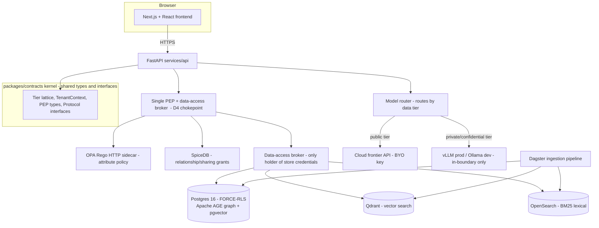
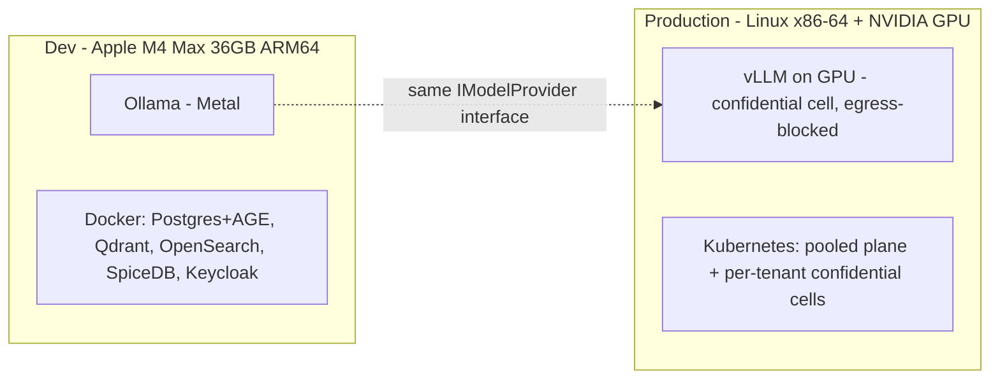

# Technology Stack & Rationale

**What this document is for.** This is the single, definitive list of every technology TigerExchange uses, with the exact version to install, what each one does, *why* it was picked over the obvious alternative, and the open-source license. TigerExchange is a federated, multi-university research-collaboration platform: it crawls public scholarly data, lets researchers at different universities discover each other and assemble grant-proposal teams, and lets them co-edit confidential proposals across institutions without the confidential bytes ever leaving the owning university. You are a code-generation model with a small context window; you should be able to build the Phase-0 skeleton from this document alone, without holding any other document in memory. Every term is defined the first time it appears. Every choice states "we chose X because Y; we rejected Z because W." Where a choice closes a known risk, the risk is named so a human auditor can check it.

---

## 0. How to read this document

- **Project root** is the directory `tigerexchange/`. All file paths below are relative to it (for example, `tigerexchange/services/api/pyproject.toml`).
- The repository is a **monorepo** (one git repository holding many packages). Layout:
  - `tigerexchange/packages/` — installable Python libraries. The most important is `tigerexchange/packages/contracts/` (the "kernel": shared types and interfaces every other package imports). Feature libraries are named `mod-*` (for example, a discovery module would live at `tigerexchange/packages/mod-discovery/`).
  - `tigerexchange/services/api/` — the FastAPI web application (defined below).
- **Stack baseline (already locked, do not change):** Python 3.11+, Pydantic v2 (a Python library that validates data against typed models), FastAPI (a Python web framework), and the developer tools pytest (test runner), ruff (linter/formatter), and mypy (static type checker). We build test-first (TDD: write the failing test, then the code that passes it).
- **Phase-0 vs later phases.** Phase-0 is the first build: one university's own data, no cross-university traffic yet. Some technologies below are marked **Phase-0** (install and use now) versus **Phase-1+** (the seam exists in code, but you install/run nothing now). Do not install Phase-1+ software during Phase-0.

> Version-pin note for a human auditor: the locked plan and the kernel package pin **Python 3.11+** (`requires-python = ">=3.11"`). `StrEnum`/`IntEnum` features the kernel relies on are 3.11+. A specific service may target 3.12 if it documents the reason, but the baseline stated everywhere is 3.11+.

---

## 1. The seven locked decisions you must not contradict

These are fixed. Every technology below exists to serve one of them. They are summarized here so you do not need another document open.

| ID | Decision | One-line consequence for the stack |
|---|---|---|
| **D1** | Beachhead product = **grant intelligence**: cross-institution team assembly + secure proposal collaboration. | The stack must support multi-university identity (CILogon) and confidential co-editing, not just one-lab search. |
| **D2** | Build the **full modular architecture**, but ship only the grant wedge for 12–18 months. | Pluggable `mod-*` packages behind stable interfaces; nothing thrown away later. |
| **D3** | Cold-start by anchoring on **one existing federally-funded multi-site center** that already has a signed Data Use Agreement (DUA — a contract permitting data sharing). | We get ≥2 universities and a legal basis on day one; the federation layer is needed early, not deferred. |
| **D4** | A **single Policy Enforcement Point (PEP)** + data-access broker is the one chokepoint all data access flows through. | Authz (OPA + SpiceDB) and the broker live behind one interface; feature modules never touch raw stores. |
| **D5** | The **owning university node is the sole local authority** for access/revocation of its confidential data. No global consensus on the request hot path. | Confidentiality decisions are strongly consistent *at one node*; discovery metadata may be eventually consistent. |
| **D6** | **Confidential content never enters the shared central index.** A red-team test gates any shared-index write. If the classifier is unsure, it abstains → the record is quarantined and treated as confidential (default-deny). | The central index holds only public/explicitly-shared metadata. The classifier is fail-closed. |
| **D7** | Institutional contract value ≥ 2–3× the per-tenant cost to serve. Non-confidential workloads run **pooled** (shared infra); **dedicated isolation only for the confidential tier**. | Heavy isolated infra (dedicated GPU cell, per-tenant keys) is reserved for the paid confidential tier. |

"Tenant" = one customer university (or department). "Cell" = the isolated set of infrastructure for one confidential tenant. "Pooled plane" = shared multi-tenant infra for non-confidential work.

---

## 2. Architecture at a glance



Reasoning for the shape: D4 forces *one* PEP chokepoint, so every store sits behind the broker and no feature module gets raw credentials. The model router exists because D6 forbids sending confidential data to a cloud model — routing-by-tier is the enforcement mechanism.

---

## 3. Stack tables — one per layer

Columns: **Technology | Version (pinned) | Role | WHY chosen | Alternative(s) rejected + why | License**. "Version (pinned)" is the exact version constraint to put in `pyproject.toml` (Python packages) or the container image tag (services). Where a project is changing fast, we pin a minor-version floor with a major-version ceiling (for example `>=2.6,<3`) so a breaking major release cannot silently break the build.

### 3.1 Language, web framework, and developer tooling

| Technology | Version (pinned) | Role | WHY chosen | Alternative(s) rejected + why | License |
|---|---|---|---|---|---|
| **Python** | `>=3.11` (kernel `requires-python = ">=3.11"`) | Implementation language for kernel, services, modules. | Async support, mature data/ML ecosystem, native `StrEnum`/`IntEnum` (3.11+) the kernel relies on. Locked by D2 and the kernel `pyproject.toml`. | Go/Rust rejected: the retrieval/ML libraries (LlamaIndex, embeddings, SPECTER2) are Python-first; rewriting them is wasted effort. | PSF (permissive) |
| **Pydantic** | `>=2.6,<3` | Typed, validated data models for every cross-boundary object (`TenantContext`, `PepRequest`, classification results). | v2 is fast (Rust core) and gives us `model_config = ConfigDict(frozen=True)` immutable value objects — critical so an authorized request cannot be mutated mid-flight. | Pydantic v1 rejected: end-of-life API; dataclasses rejected: no runtime validation at trust boundaries. | MIT |
| **FastAPI** | `>=0.115,<1` | The HTTP API in `tigerexchange/services/api/`. | Async, typed, generates OpenAPI docs automatically, integrates Pydantic v2 natively. Clean per-endpoint dependency injection lets each feature module plug in behind the PEP. | Flask rejected: sync-first, no built-in typing/OpenAPI; Django rejected: heavyweight ORM/admin we don't need and fights our per-schema isolation. | MIT |
| **SQLAlchemy** | `>=2.0,<2.1` (async, with `asyncpg`) | ORM / query layer to Postgres. | 2.0 async API works with FastAPI's event loop; lets us pin a transaction-scoped tenant context for Row-Level Security. | Raw `asyncpg` only rejected: we lose typed models and migration tooling; Django ORM rejected (see FastAPI row). | MIT |
| **asyncpg** | `>=0.29,<0.31` | Async Postgres driver under SQLAlchemy. | Fastest async Postgres driver; required for `SET LOCAL` transaction-scoped tenant pinning. | `psycopg2` (sync) rejected: blocks the async event loop. | Apache-2.0 |
| **uv** | `>=0.4` (install via `curl -LsSf https://astral.sh/uv/install.sh \| sh`) | Workspace/dependency manager for the monorepo. | One fast tool resolves and locks deps across all `packages/*` and `services/*`; defines the workspace in the root `tigerexchange/pyproject.toml`. | Poetry rejected: slower, weaker monorepo-workspace support; bare pip rejected: no lockfile/workspace. | MIT / Apache-2.0 |
| **hatchling** | `>=1.25` | Build backend that turns each `packages/*` into an installable wheel. | Minimal, PEP-621 native; the kernel's `pyproject.toml` already uses it. | setuptools rejected: more config noise for no benefit here. | MIT |
| **pytest** | `>=8` | Test runner (TDD: write failing test first). | Standard; markers (`-m unit`, `-m integration`) split fast tests from Docker-needing ones. | unittest rejected: more boilerplate, weaker fixtures. | MIT |
| **pytest-asyncio** | `>=0.24` | Lets pytest run `async def` tests for the async API. | Required because the API is async. | — | Apache-2.0 |
| **testcontainers[postgres]** | `>=4.8` | Spins up a real Postgres 16 in Docker for integration tests. | Tests the actual FORCE-RLS isolation against a real database, not a mock. | sqlite-in-memory rejected: no Row-Level Security, so it cannot test the isolation that matters. | Apache-2.0 |
| **ruff** | `>=0.6` | Linter + formatter (`ruff check`, `ruff format`). | One fast Rust tool replaces flake8 + isort + black. | flake8/black/isort rejected: three tools, slower. | MIT |
| **mypy** | `>=1.11` | Static type checker (`mypy .`). | Catches interface-contract violations at CI time, before runtime. | pyright rejected: Node dependency; mypy matches the locked tooling. | MIT |
| **import-linter** | `>=2.1` | CI guard that the kernel imports no feature/persistence package (the "kernel fitness function"). | Enforces D2/D4 structurally: a module physically cannot bypass the chokepoint or pollute the kernel. | manual review rejected: not enforceable, will rot. | BSD-3-Clause |
| **griffe** | `>=1.3` | Diffs the kernel's public API against a frozen baseline in CI. | The kernel is near-frozen; griffe fails CI if an interface signature changes incompatibly. | hand-maintained changelog rejected: drifts from reality. | ISC |

Concrete root install commands:

```bash
# from inside tigerexchange/
uv sync                     # resolve + install all workspace deps into .venv
uv run pytest -m unit       # fast tests, no Docker
uv run pytest -m integration  # needs Docker for testcontainers Postgres
uv run ruff check . && uv run mypy . && uv run lint-imports   # CI gate
```

### 3.2 Identity (who is the user, which university)

| Technology | Version (pinned) | Role | WHY chosen | Alternative(s) rejected + why | License |
|---|---|---|---|---|---|
| **CILogon** | hosted service (no version; OIDC endpoint) | Federation entry: one OpenID Connect (OIDC) login endpoint that bridges 5,000+ university identity providers (InCommon/eduGAIN) plus ORCID/Google/GitHub. | A new university can log in **without us integrating its SSO one-by-one** — essential for D1/D3 (cross-institution from day one). | Integrating each university's SAML directly rejected: O(N) onboarding work; would block the consortium cold-start. | Service; free for academic research. **Commercial deployment needs a paid CILogon subscription — this is a cost line in COGS, not a license blocker.** |
| **Keycloak** | image `quay.io/keycloak/keycloak:26.0` | Identity broker + token issuer; one realm (isolated identity space) per tenant. Sits behind CILogon and mints our session tokens. | Apache-2.0, batteries-included OIDC/SAML, realm-per-tenant gives clean multi-tenant identity isolation. | Ory (Kratos/Hydra) is the fallback if Keycloak's monolith becomes a scaling bottleneck; rejected as primary because it needs more assembly. | Apache-2.0 |
| **Ory Kratos/Hydra** | (fallback, not installed Phase-0) | Composable identity if Keycloak does not scale. | Listed as documented fallback only. | n/a (fallback) | Apache-2.0 |

Phase-0 note: you may run **Keycloak** locally for development; **CILogon** wiring is exercised when the second university joins (still Phase-0 per D3, but only after the anchor consortium is connected). ORCID is used only as a *correlation key* to match a person across universities — never as the root of trust for login.

### 3.3 Authorization (is this user allowed to do this, on this object)

Two-stage check, both behind the single PEP (D4). ABAC decides "does this *kind* of access even count given the data's labels"; ReBAC decides "does a sharing relationship exist."

| Technology | Version (pinned) | Role | WHY chosen | Alternative(s) rejected + why | License |
|---|---|---|---|---|---|
| **OPA (Open Policy Agent) / Rego** | image `openpolicyagent/opa:latest` (engine release pinned in the image), deployed as an **HTTP sidecar** | **ABAC** = Attribute-Based Access Control. Evaluates attributes on the object (`tier`, `residency_region`, `export_controlled`, `contains_PHI`) and subject (`home_tenant`, `nationality`) into ALLOW/DENY. | Mature, **CNCF-graduated**, and matches the built plans (`0c`/`0d`). One owned Rego policy table behind the single PEP gives a **single decision point for tier ABAC**; the HTTP-sidecar deployment keeps policy out of the application binary so it is independently auditable and swappable. | Cedar rejected: considered for its formal-analysis story, but not used — OPA/Rego is what the PEP plans actually build, and a second policy engine is unjustified. | Apache-2.0 |
| **Cedar** (Amazon Cedar policy language) | (considered, not used) | ABAC alternative. | Deterministic, formally analyzable policy language. | Considered-not-used — OPA/Rego is the locked ABAC engine; we do not run a second policy engine. | Apache-2.0 |
| **SpiceDB** (Authzed) | image `authzed/spicedb:v1.35` | **ReBAC** = Relationship-Based Access Control (Google Zanzibar model). Stores sharing grants as relationship tuples (e.g. `proposal:X#collaborator@univB:user`); revocation = delete one tuple. | Its **ZedToken** gives per-request strong consistency: after a cross-institution share is revoked, the very next check denies — no stale "still allowed" window. For a confidentiality product, a stale allow is a security incident, so this is the deciding factor. | **OpenFGA** is the acceptable fallback **only if you opt into `HIGHER_CONSISTENCY` on every confidential check** — rejected as default because that consistency is opt-in, not the safe default. **Permify rejected outright: AGPL-3.0 license** (network-copyleft, hostile to a commercial SaaS). | Apache-2.0. **Note: AuthZed's *managed cloud* is paid; the self-hosted engine is Apache-2.0 and is what we run.** |
| **OpenFGA** | (fallback) | ReBAC alternative. | Apache-2.0, CNCF. | Fallback — weaker default consistency (see SpiceDB row). | Apache-2.0 |

Named risk closed: SpiceDB's ZedToken closes the **"new-enemy" / stale-grant leak** (Risk: a revoke-then-recheck that reads a stale cache could leak confidential data across institutions). D5 requires the owning node to be strongly consistent for confidentiality decisions; SpiceDB's consistency model is how we honor that.

### 3.4 Vector search (semantic similarity over embeddings)

An "embedding" is a list of floats representing the meaning of text; "vector search" finds the nearest embeddings to a query embedding.

| Technology | Version (pinned) | Role | WHY chosen | Alternative(s) rejected + why | License |
|---|---|---|---|---|---|
| **Qdrant** | image `qdrant/qdrant:v1.12.0`; client `qdrant-client>=1.12,<2` | Primary vector store; per-tenant payload isolation and flexible sharding. | Best-in-class **multi-tenant isolation** (per-university data physically separable) — directly serves D7's pooled-vs-dedicated split. Rust, fast, Apache-2.0. | Milvus rejected: scales to billions but heavy ops, overkill for our corpus size; Weaviate rejected: operational complexity rises with multi-tenancy; LanceDB rejected for prod (embedded only — fine as a dev-node convenience, not the multi-tenant plane). | Apache-2.0 |
| **pgvector** | Postgres extension `pgvector` `>=0.7` | Fallback vector store for *small* tenants — collapses the stack by living inside the same Postgres as the graph and authz data. | Lets a small tenant run one database instead of three services (lower COGS — D7). | Not primary: lower ceiling at high vector volume than Qdrant. | PostgreSQL License (permissive) |

Confidential note (D6): when a tenant is on the confidential tier, its Qdrant collection / pgvector data sits in the dedicated cell and is encrypted with the tenant's own key (tenant-KEK or volume-key); confidential embeddings never reach the shared central index.

### 3.5 Graph database (relationships: authors, papers, citations, collaborations)

| Technology | Version (pinned) | Role | WHY chosen | Alternative(s) rejected + why | License |
|---|---|---|---|---|---|
| **Apache AGE** | Postgres extension `apache-age` `>=1.5.0` on Postgres 16 | Primary knowledge graph; runs openCypher queries (`SELECT * FROM cypher(...)`) *inside Postgres*. Stores the author/paper/citation/collaboration graph. | Co-locates with pgvector + the authz store in **one Postgres**, inheriting Postgres backup/HA/observability — strong fit for per-tenant isolation and ops simplicity. | **KuzuDB rejected: the upstream repo was archived 10 Oct 2025 (read-only, no corporate backing).** TigerBuddy (the predecessor project) used KuzuDB — it must be replaced here. **Neo4j Community rejected: GPLv3** (copyleft distribution risk) and no clustering in the free edition — only a fallback, isolated behind a service boundary. **Memgraph rejected: BSL** (Business Source License, source-available with delayed conversion) — fallback only. | Apache-2.0 |
| **Neo4j Community** / **Memgraph** | (fallbacks, isolate behind a service) | Used only if AGE deep-traversal performance is insufficient. | Documented fallbacks. | See license flags above. | GPLv3 / BSL |

Named risk closed: **archived-dependency risk** — building on KuzuDB would mean shipping on abandoned software. AGE removes it.

### 3.6 Lexical / BM25 search (exact keyword match)

BM25 is a classic keyword-ranking algorithm; academic corpora are entity-heavy (author names, acronyms, grant numbers, gene names) where exact match beats semantic search, so BM25 is mandatory alongside vectors.

| Technology | Version (pinned) | Role | WHY chosen | Alternative(s) rejected + why | License |
|---|---|---|---|---|---|
| **OpenSearch** | image `opensearchproject/opensearch:2.17.0`; client `opensearch-py>=2.7,<3` | Primary lexical/BM25 engine; can also serve k-NN vectors as a fallback. | **Apache-2.0**, governed by the Linux Foundation (no single-vendor control), ships hybrid BM25 + vector + neural-sparse. | **Elasticsearch rejected: AGPLv3** network-copyleft is hostile to a commercial SaaS. OpenSearch is the clean Apache-2.0 substitute. Tantivy/Quickwit are embedded fallbacks only. | Apache-2.0 |
| **Tantivy / Quickwit** | (fallback) | Embedded lightweight BM25 path. | Documented fallback. | Not the prod default. | MIT / AGPLv3 (Quickwit) — use Tantivy (MIT) for the embedded path. |

Named risk closed: **Elasticsearch AGPL license trap** (see §4).

### 3.7 LLM serving (running the language models)

| Technology | Version (pinned) | Role | WHY chosen | Alternative(s) rejected + why | License |
|---|---|---|---|---|---|
| **vLLM** | image `vllm/vllm-openai:v0.6.3` (production, GPU) | Production LLM serving; high-throughput in-boundary inference for the confidential/private tiers. | PagedAttention gives up to ~24× the throughput of TGI under concurrency; the de-facto open-weight serving standard. It is the engine on the **self-hosted confidential branch** — confidential data is served by a model that never leaves the cell. | **HuggingFace TGI rejected: maintenance mode as of Dec 2025** (HF itself now recommends vLLM). SGLang is the documented alternative for heavy structured/agentic decoding. | Apache-2.0 |
| **Ollama** | `>=0.5` (local binary, `ollama serve`) | **Development-only** local serving on the Apple M4 Max (36 GB). | MIT, trivial to run locally; ideal for the dev node. | Not for production multi-tenant: **Ollama serves requests sequentially under load** — use vLLM in prod. llama.cpp is the lower-level fallback. | MIT |
| **SGLang** | (alternative) | vLLM alternative for structured/agentic decoding. | Documented alternative. | Not the default. | Apache-2.0 |

Named risk closed: **confidential-data egress** (D6). The router (§3.8) pins the confidential tier to vLLM/Ollama with network egress blocked; routing confidential-tagged data to a cloud model is a compliance defect, not a config choice.

### 3.8 Model router and embeddings

| Technology | Version (pinned) | Role | WHY chosen | Alternative(s) rejected + why | License |
|---|---|---|---|---|---|
| **Model router** (our code, `mod-*` behind `IModelRouter`) | n/a (in-repo) | Selects a model provider whose declared locality satisfies the data's classification: public → cloud frontier (BYO key) allowed; private/confidential → in-boundary local model only. Fails closed to the local model. | This routing *is* the D6 enforcement point. The kernel ships the `IModelRouter`/`IModelProvider` interfaces. | A hardcoded tier→model table rejected: not auditable, not swappable; a registry of providers declaring their locality is. | (in-repo) |
| **SPECTER2** (`allenai/specter2`) | HF revision pinned at deploy; model card License: Apache-2.0 | Primary **scientific** embedding model: turns a paper title+abstract into a vector for "related papers" / expertise fingerprints. | Purpose-built for scientific document similarity; beats general models on paper-to-paper similarity. Apache-2.0, fully self-hostable (required for the confidential tier). | nomic-embed is the fallback but is materially behind on quality. | Apache-2.0 |
| **Qwen3-Embedding** | `Qwen/Qwen3-Embedding-0.6B` (dev) / `-4B` or `-8B` (prod) | Primary **general** query→passage embedding for ad-hoc RAG. Matryoshka (MRL) truncation lets us shrink vectors to control per-node RAM. | Top general-retrieval quality, Apache-2.0, self-hostable; MRL is operationally essential for the 36 GB dev node. | nomic-embed-text-v1.5 is the long-context fallback (8k context, Apache-2.0). | Apache-2.0 |
| **BGE-reranker-v2-m3** | `BAAI/bge-reranker-v2-m3` | Cross-encoder reranker: re-scores the top ~50 retrieved candidates down to the top ~8 (the cheapest large quality gain in RAG). Runs locally. | +5–15 nDCG@10 for <200 ms, local (works on the confidential tier). Qwen3-Reranker is an equivalent alternative. | Cohere Rerank 3.5 rejected for confidential (cloud API) — public/BYO-key only. | MIT / Apache-2.0 |

Why two embedding spaces, not one: scientific paper-similarity (SPECTER2) and ad-hoc query RAG (Qwen3) are different jobs; using one model for both loses quality on the discovery/expertise surface that is D1's differentiator.

### 3.9 Orchestration and workflows

| Technology | Version (pinned) | Role | WHY chosen | Alternative(s) rejected + why | License |
|---|---|---|---|---|---|
| **Dagster** | `dagster>=1.8,<2` | Data-pipeline orchestration: the asset DAG crawl → distill → embed → index → graph, with per-tenant materialization. | Asset-based lineage exactly fits the ingestion pipeline; it is the team's existing idiom (TigerBuddy used it). | Airflow rejected: heavier, not asset-native; Prefect rejected: overlaps Dagster with no added value. | Apache-2.0 |
| **Temporal** | **Phase-1+ (deferred to contract-demand) — do not install in Phase-0** | Durable, resumable long-running workflows: cross-institution sharing-grant lifecycles, revocations, multi-party proposal coordination that must survive failures for days/months. | The only tool fit for month-long stateful cross-institution business processes. | A Dagster sensor is the Phase-0 stand-in until a contract demands Temporal. **Temporal Cloud is metered** — self-host if adopted. | MIT (server) / Apache-2.0 (SDKs) |
| **Debezium + Kafka** | **Phase-2 — do not install in Phase-0** | Change-Data-Capture (CDC): streams "publishable" metadata from each cell to the central index via a transactional outbox. | Reliable eventual-consistency replication of *non-confidential* discovery metadata (allowed by D5/D6). | Phase-0/1 use simple **outbox-polling** instead — no Kafka. **Managed Kafka (MSK/Confluent) has a monthly cost floor.** | Apache-2.0 |
| **Schema registry** (Confluent or Apicurio) | **Phase-2** (Phase-0/1: in-repo codegen + CI compatibility check) | Governs the Protobuf/Avro schema of the `PublishableProjection` that crosses the federation seam, under backward+forward compatibility. | Prevents a schema change from breaking the federation feed. | Phase-0/1: an in-repo schema + CI compat check is enough; Apicurio (Apache-2.0) preferred if a registry is needed. | Apache-2.0 (Apicurio) |

### 3.10 App / API, frontend, infrastructure

| Technology | Version (pinned) | Role | WHY chosen | Alternative(s) rejected + why | License |
|---|---|---|---|---|---|
| **FastAPI** | `>=0.115,<1` | The HTTP API (see §3.1). | (see §3.1) | (see §3.1) | MIT |
| **LlamaIndex** | `llama-index>=0.11,<0.13` | RAG ingestion + retrieval *library used behind our own thin interface* — connectors, chunking, query engines. | Low-overhead, MIT; we use it as a library, never as the architecture, to keep modules swappable. | Haystack (Apache-2.0) is the deterministic-pipeline fallback for stricter FERPA/ITAR auditability. | MIT |
| **LangGraph** | `langgraph>=0.2,<0.3` | Agentic multi-step orchestration for the expert-discovery and grant-team-assembly agents. | Stateful agent graphs fit team-assembly; MIT. | Used for agent workflows only, never hot-path retrieval (higher per-call overhead). | MIT |
| **RAGAS** | `ragas>=0.2` | Retrieval/answer-quality evaluation wired into CI as a regression gate (Faithfulness, Context Precision/Recall). | "Trustworthy grounded answers" is the whole pitch; CI must catch quality regressions. On the confidential tier the judge model must itself be the local model. | Manual eval rejected: not a CI gate. | Apache-2.0 |
| **Postgres** | image `postgres:16` (with `apache-age` + `pgvector` extensions) | The relational core: tenant tables under FORCE Row-Level Security, plus the AGE graph and pgvector. | One database carries relational + graph + small-tenant vectors; FORCE-RLS is defense-in-depth for tenant isolation. | Postgres 15 rejected: 16 has the extension and RLS behavior we pin to. | PostgreSQL License |
| **Next.js + React** | `next@15` / `react@19` | The browser frontend. | Modern SSR React; matches the predecessor frontend idiom. | — | MIT |
| **Terraform** | `>=1.9` | Infrastructure-as-Code (declarative cloud/cluster provisioning). | Declarative, reproducible per-cell infra. | Manual provisioning rejected: not reproducible/auditable. | BUSL-1.1 (Terraform) — pin `<=1.5.x` if you require MPL, or use OpenTofu (MPL-2.0) as the drop-in fork. **Flag: post-1.6 Terraform is BUSL; OpenTofu is the OSS-clean alternative.** |
| **Kubernetes** | `>=1.30` | Container orchestration for cells + pooled plane. | Standard; per-cell namespace isolation maps to D7. | — | Apache-2.0 |

> Terraform license caveat for the auditor: HashiCorp relicensed Terraform to BUSL-1.1 (source-available) at v1.6. If a fully-OSS posture is required, use **OpenTofu** (the MPL-2.0 community fork) — it is a drop-in. This is the same class of trap as the others in §4.

### 3.11 Scholarly / grant data sources (the corpus)

Rule for this whole layer: **self-host the open CC0/permissive bulk snapshots; never put a metered or non-commercial live API on a hot path.** CC0 = public-domain dedication (no restrictions). ODC-BY = Open Data Commons Attribution (free, must credit).

| Source | Version / form to use | Role | WHY chosen | Alternative(s) rejected + why | License |
|---|---|---|---|---|---|
| **OpenAlex** | the **free monthly snapshot** (S3/AWS bulk download), self-hosted | ~250M+ works/authors/institutions — the broadest open scholarly graph; backbone of discovery. | Self-hosting the CC0 snapshot avoids the metered live API entirely. | **The live OpenAlex API is metered** (~$1/day free, then paid credits; per-credit price is quote-gated) — never depend on it in product. | CC0 (data) |
| **ORCID** | the **annual Public Data File** (CC0 bulk dump), self-hosted | Researcher identity / affiliations correlation key. | The CC0 dump is open to everyone and carries no commercial restriction. | **The ORCID Public API is non-commercial (verbatim ToS) — must NOT be shipped in product.** Buy Member API only if real-time writes are needed. | Public Data File: CC0 |
| **ROR** | full data dump (CC0, Zenodo) | Canonical institution identifiers — the backbone of cross-institution joins (D1). | CC0, lightweight, authoritative. | Live API fine for lookups, but use the dump for joins. | CC0 |
| **Crossref** | the **annual public data file** + polite-pool API (set a `mailto`) | ~180M DOI records, references, funder links. | Metadata is treated as public-domain facts, freely redistributable; the annual file avoids rate limits. | **Crossref rate limits tightened 1 Dec 2025** — use the polite pool; buy Metadata Plus only for production freshness SLAs. | Public-domain facts |
| **OpenCitations** | full dumps (CC0) | ~1B+ DOI-to-DOI citation links; complements Crossref references. | CC0 citation graph. | — | CC0 |
| **arXiv** | metadata bulk (Kaggle dataset / S3 requester-pays); OAI-PMH | ~2.4M preprints (CS/physics/math heavy). | Metadata is **CC0**. | **Full-text license varies per article** — gate full-text by per-paper license; metadata is safe. | Metadata CC0; full-text varies |
| **Semantic Scholar (S2AG / S2ORC)** | bulk Datasets API | Citation graph + prebuilt SPECTER2 scientific vectors. | Best prebuilt scientific vectors. | **Bulk is ODC-BY → attribution is required**; the API ToS forbids reselling the API itself (fine for our use). | ODC-BY 1.0 |
| **PMC / Europe PMC** | sanctioned bulk (FTP/Cloud/OAI-PMH/E-utils), filtered to the OA subset | Biomedical full text. | The commercial-OK OA subset (CC0/BY/BY-SA/BY-ND) is usable. | **License is tiered — programmatically exclude NC-only records** from any commercial feature; bulk only via sanctioned endpoints. | Per-record (filter required) |
| **Grants.gov / NIH RePORTER / NSF** | their open feeds/bulk | The grant/funding data for D1's wedge. | Public federal data; the commodity layer the wedge sits on. | The moat is the federation graph, not this data — do not over-invest in re-hosting. | Public/government |

---

## 4. License traps to avoid (quick reference)

These are the specific "looks fine, will bite you" hazards. Each row says the trap and the safe substitute. A human auditor should be able to confirm none of the trapped technologies are in the build.

| Trap | Why it bites | Safe substitute (what we use) |
|---|---|---|
| **ORCID Public API** (non-commercial ToS) | Verbatim: "you may not make use of the Public API in connection with any revenue-generating product or service." | **ORCID annual Public Data File (CC0)**, self-hosted. |
| **OpenAlex live API** (metered) | Per-credit billing on the hot path = unbounded cost; per-credit price is quote-gated. | **OpenAlex free monthly CC0 snapshot**, self-hosted. |
| **KuzuDB** (archived 10 Oct 2025) | Repo read-only, no backing; building on abandoned software. | **Apache AGE** (Cypher-on-Postgres, Apache-2.0). |
| **HuggingFace TGI** (maintenance mode Dec 2025) | HF itself recommends moving off it. | **vLLM** (Apache-2.0) in prod, **Ollama** (MIT) in dev. |
| **Elasticsearch** (AGPLv3) | Network-copyleft is hostile to a commercial SaaS. | **OpenSearch** (Apache-2.0, LF-governed). |
| **Permify** (AGPL-3.0) | Same AGPL network-copyleft hazard for authz. | **SpiceDB** (Apache-2.0); OpenFGA (Apache-2.0) fallback. |
| **Neo4j Community** (GPLv3) / **Memgraph** (BSL) | Copyleft distribution risk / source-available license. | Fallbacks only, isolated behind a service boundary; primary is AGE. |
| **Terraform ≥1.6** (BUSL-1.1) | Source-available, not OSS. | **OpenTofu** (MPL-2.0) drop-in if a pure-OSS posture is required. |
| **Temporal Cloud / Managed Kafka (MSK/Confluent) / CILogon commercial / AuthZed managed** | Not license traps — **metered/subscription cost lines**. | Self-host the OSS engines; put the subscription in COGS, not the hot path. |

---

## 5. Apple M4 Max / ARM64 local-dev notes vs production posture

The development machine is an **Apple M4 Max, 36 GB unified memory, ARM64 (arm64/aarch64)**. Unified memory means CPU and GPU share the same 36 GB — there is no separate VRAM. This is the constraint that shapes local dev. Production is different hardware (Linux x86-64 + NVIDIA GPU) and a different posture.

### 5.1 What runs natively vs in Docker on the M4 Max

| Component | Local-dev posture on M4 Max | Why |
|---|---|---|
| Python 3.11+, FastAPI, Pydantic, SQLAlchemy, ruff, mypy, pytest | **Native** (in the `uv` venv) | Pure-Python / ARM64 wheels exist; fastest dev loop. |
| **Ollama** (LLM serving) | **Native** (`ollama serve`) | First-class Apple Silicon support; uses Metal/ANE; this is the whole reason Ollama is the dev LLM. **Sequential under load — dev only.** |
| Embedding / reranker models (SPECTER2, Qwen3-Embedding-0.6B, BGE-reranker) | **Native** via PyTorch with the **MPS (Metal Performance Shaders) backend** | ARM64 PyTorch wheels exist; MPS uses the GPU. Use the **0.6B** Qwen3 variant locally (the 4B/8B are prod-only — too large for 36 GB alongside everything else). |
| **Postgres 16 + Apache AGE + pgvector** | **Docker** (`postgres:16` arm64 image; AGE/pgvector built for arm64) | Easiest reproducible setup; light memory footprint. |
| **Qdrant** | **Docker** (`qdrant/qdrant` has arm64 images) | Native arm64 image, light. |
| **OpenSearch** | **Docker** (arm64 image exists) — **heavy: JVM, give it ≥2 GB heap** | JVM-based; the single heaviest dev container. Run it only when testing lexical/hybrid retrieval. |
| **Keycloak** | **Docker** (arm64 image) — JVM, moderate | Run only when testing the identity flow. |
| **SpiceDB** | **Docker** (arm64 image, Go binary, light) | Light. |
| **vLLM** | **DOES NOT run usefully on the M4 Max** — it targets NVIDIA CUDA GPUs | **Production-only.** On the dev machine, the model router transparently uses **Ollama** in place of vLLM (same `IModelProvider` interface). Do not try to run CUDA vLLM locally. |
| **OPA** (Rego HTTP sidecar) | **Docker** (arm64 image, Go binary, light) | Small single-binary policy engine; light arm64 container. |
| Temporal, Debezium/Kafka, schema registry | **Not run in Phase-0** | Deferred (see §3.9). |

ARM64 compatibility flag for the auditor: every Phase-0 component above has a working arm64 wheel or arm64 container image. The one component without a useful arm64 story — **vLLM** — is production-only by design, and the `IModelProvider` abstraction means the dev machine substitutes Ollama with zero code change.

### 5.2 Memory budget on 36 GB (a realistic concurrent dev session)

You will not run the full prod stack on 36 GB. A sane concurrent dev footprint:

| Process | Approx. memory | Notes |
|---|---|---|
| macOS + IDE + browser | ~8–10 GB | Baseline. |
| Ollama serving a 7–8B quantized chat model (Q4) | ~5–6 GB | One model loaded at a time. |
| Qwen3-Embedding-0.6B + BGE-reranker (MPS) | ~2–3 GB | Load on demand; unload when idle. |
| Postgres (AGE + pgvector) container | ~0.5–1 GB | Light. |
| Qdrant container | ~0.5–1 GB | Light. |
| OpenSearch container (JVM) | ~2–3 GB | **Heaviest container** — start only when needed. |
| Keycloak / SpiceDB containers | ~1–1.5 GB combined | Start only when testing identity/authz. |

Practical rule: **do not run OpenSearch + Keycloak + a large local model simultaneously.** Bring up only the containers the current test needs (`docker compose up postgres qdrant` for retrieval work; add `opensearch` only for lexical/hybrid tests). Use the **0.6B** embedding model and a single Q4-quantized chat model locally; the 4B/8B embedding and unquantized serving are production concerns.

### 5.3 Production posture (contrast)



- **Dev** = single machine, Ollama in place of vLLM, Docker for stores, small models, no Temporal/Kafka.
- **Prod** = Kubernetes with a **pooled plane** for all non-confidential workloads (D7) and **per-tenant confidential cells**; each confidential cell runs **vLLM on a dedicated GPU with network egress blocked** (D6), per-tenant KMS keys, a SpiceDB replica, and a durable revocation log (D5). Dedicated GPU/isolation cost lands **only** on the priced confidential tier (D7) — PLG and public discovery share pooled infra.
- The bridge that makes this work: every store and model sits behind a kernel interface (`IModelProvider`, `IRetrievalStrategy`, etc.), so the dev-vs-prod swap (Ollama↔vLLM, embedded↔clustered) is a configuration change, not a code change. This is D2's "full modular architecture" paying off.

---

## 6. One-paragraph summary for the builder

Build Phase-0 in Python 3.11+ with FastAPI + Pydantic v2, managed by `uv` in the `tigerexchange/` monorepo. Put shared types/interfaces in `tigerexchange/packages/contracts/`, the app in `tigerexchange/services/api/`, and feature libraries in `tigerexchange/packages/mod-*/`. Stores: Postgres 16 (with Apache AGE for the graph and pgvector for small-tenant vectors), Qdrant for vectors, OpenSearch for BM25 — all behind the single PEP (OPA/Rego for attribute policy, SpiceDB for sharing-grant relationships). Serve models with Ollama in dev and vLLM in prod, routed by data tier so confidential data never reaches a cloud model. Self-host the OpenAlex/ORCID/ROR/Crossref/OpenCitations CC0 snapshots; never call the metered or non-commercial live APIs in product. Do not install Temporal, Kafka/Debezium, or a schema registry in Phase-0 — their seams exist, but they are Phase-1+/Phase-2. Avoid every license trap in §4.
