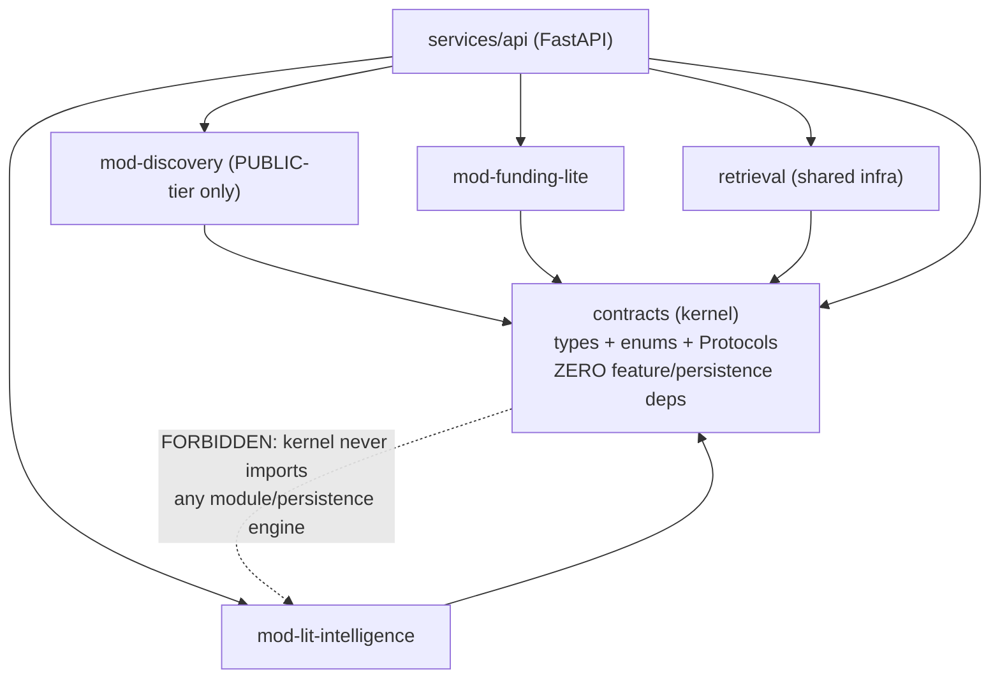
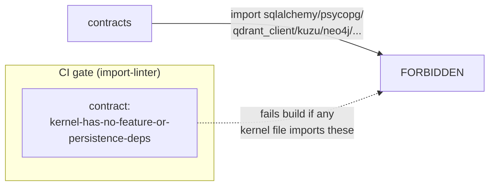
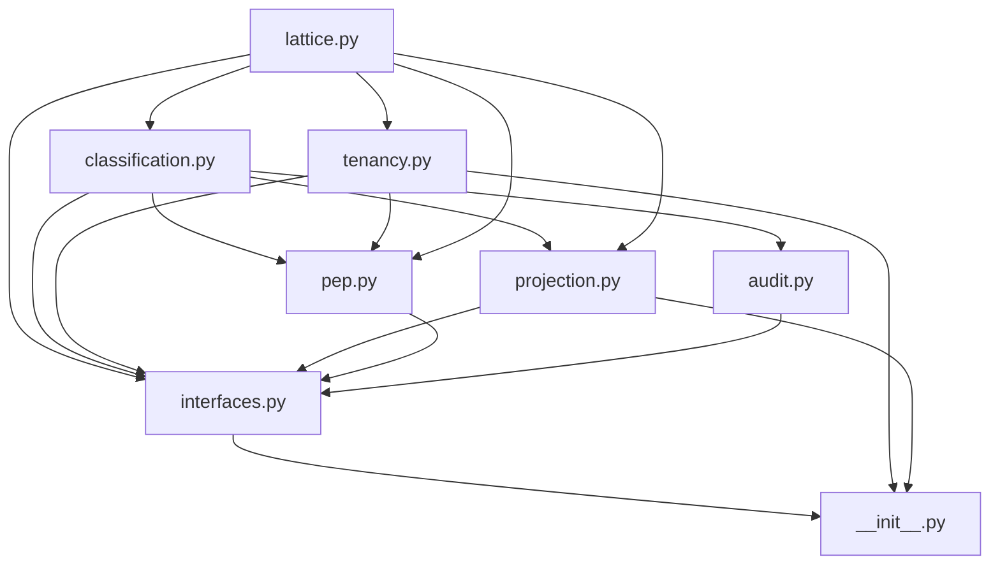

# LLD: The `contracts/kernel` Package

## What this document is for

This is the authoritative, build-it-first low-level design (LLD) for the **`contracts` kernel package** of TigerExchange. You — a local code-generation model — must build this package first, before any feature module, because every other package in the monorepo imports these types and interfaces **verbatim**. This document is fully self-contained: it defines every term inline, gives exact file paths, exact library versions, exact type and function signatures (copied verbatim from the canonical kernel doc), and the reasoning behind every non-trivial choice. Do not invent signatures, rename symbols, or "improve" the shapes. The signatures here are the contract; if you change one, you break every downstream module. When in doubt, copy the code blocks exactly as written.

---

## 1. Orientation: what TigerExchange is and where the kernel sits

**TigerExchange** is a cross-institution research-grant platform. Its locked product wedge (decision **D1**, see §2) is **grant intelligence**: helping researchers at different universities assemble teams and collaborate on grant proposals, where proposal text, budgets, and preliminary data are *confidential* and shared across institutions. Because the data is confidential and crosses organizational boundaries, the whole system is built around one idea: **a single, fail-closed enforcement chokepoint that decides who can see what.**

The **kernel** (this `contracts` package) is the shared vocabulary that chokepoint and every feature module speak. It contains:

- **Value types** — frozen, immutable data objects that cross trust boundaries (a tenant's identity, a classification result, a publishable projection, an authorization request/response, an audit record).
- **Enums** — stable string/integer enumerations (sensitivity tiers, decisions, editions, capabilities).
- **Protocol interfaces** — structural type definitions (Python `typing.Protocol`) that feature modules depend on instead of concrete implementations.

The kernel contains **no behavior, no persistence, no feature logic**. It is types and interface shapes only. This is enforced mechanically (see §11, the fitness function).

### Monorepo layout

The project root is `tigerexchange/`. The relevant layout:

```
tigerexchange/
├── packages/
│   ├── contracts/              <-- THIS package (the kernel). Build first.
│   ├── mod-lit-intelligence/   <-- feature module 1 (imports contracts)
│   ├── mod-discovery/          <-- feature module 2, PUBLIC-tier only (imports contracts)
│   ├── mod-funding-lite/       <-- feature module 3 (imports contracts)
│   └── retrieval/              <-- shared retrieval infra, NOT a feature module (imports contracts)
└── services/
    └── api/                    <-- FastAPI app (imports contracts + modules)
```

> `mod-workspace` is **not** built in Phase-0 (Phase-1+); only its kernel seams exist (e.g. `IGrantStore`). Retrieval is shared infrastructure (the `retrieval` package), not one of the three Phase-0 feature modules.



The arrows point "imports". The kernel is a **leaf**: everyone imports it; it imports nothing of theirs. That one-directional dependency rule is the single most important structural property of the project (§11).

---

## 2. The locked decisions the kernel encodes (D1–D7)

The kernel's shapes exist to enforce seven locked founder/architecture decisions. You do not need to re-derive these; they are fixed. Each one maps to specific code in the kernel.

| ID | Decision (summary) | How the kernel encodes it |
|---|---|---|
| **D1** | Wedge = grant intelligence (cross-institution team assembly + secure proposal collaboration). | `Capability.CROSS_INSTITUTION_GRANTS`, `TEAM_ASSEMBLY`; discovery interfaces. |
| **D2** | Narrow scope to the grant wedge, but build the **full** modular architecture so nothing is thrown away. The other 3 wedges are decompositions of the grant workflow. | Full interface set in `interfaces.py`, including deferred Phase-1+ seams. |
| **D3** | Cold-start by anchoring on one existing federally-funded multi-site center that already has a Data Use Agreement (DUA). | `consortium_ids` on `TenantContext`; `Edition.CONSORTIUM_ANCHOR`. |
| **D4** | A **single** Policy Enforcement Point (PEP) + data-access broker is the only chokepoint for all retrieval/egress/derivation. | `pep.py` (`PepRequest`/`PepResponse`), `IPolicyEnforcement`, `IDataAccessBroker`. |
| **D5** | The **owning node** is the sole local authority for access/revocation; **no** global hot-path consensus. Decisions are owner-local and fail-closed locally. | `IGrantStore` owner-side re-derivation; `grant_id` re-derivation rule in `PepRequest`. |
| **D6** | Confidential content **never** enters the shared central index. Red-team is a gate before any shared-index write. Classifier abstention → **quarantine, default-deny** (unclassified = treated confidential, excluded from all retrieval). | `Decision.QUARANTINE`, `ClassificationResult.quarantine()`, `PublishableProjection` validator rejecting `confidential`. |
| **D7** | Institutional sale ACV ≥ 2–3× per-tenant COGS; non-confidential runs pooled multi-tenant; dedicated isolation only for confidential. | `IsolationPosture` (`POOLED` vs `DEDICATED_CELL*`), `Edition`. |

> **Definitions you must know to read the rest of this doc:**
> - **Tenant** = an institution (or a billing/isolation unit within one). A university is a tenant.
> - **Subject** = an authenticated human (a researcher), identified by an OIDC `sub` / `eduPersonUniqueId`.
> - **Tier** = sensitivity level of a piece of data: `public`, `private`, or `confidential`.
> - **PEP (Policy Enforcement Point)** = the single code path that authorizes every data access. It is *the* chokepoint (D4).
> - **Broker (data-access broker)** = the only component holding raw database credentials. It sits behind the PEP and returns *projected* (filtered/safe) results.
> - **Projection** = a safe, allowlisted, immutable view of an artifact that is allowed to leave the owner's boundary (e.g., go into the shared index).
> - **Classifier** = the single component that decides a piece of content's tier; it is fail-closed (abstain → quarantine).
> - **Lattice** = the formal ordering of tiers (`public < private < confidential`) plus the rule for combining them (the MAX-rule).
> - **Fail-closed** = on any uncertainty/error/unknown input, choose the *most restrictive* (most secure) outcome, never the permissive one.

---

## 3. Package layout, build target, and global design rules

### 3.1 File layout (exact paths)

Create exactly these files under `tigerexchange/packages/contracts/`:

```
tigerexchange/packages/contracts/
├── pyproject.toml
└── src/contracts/
    ├── __init__.py          # single public import surface; re-exports everything
    ├── lattice.py           # Tier, MAX-rule helpers, ComplianceFlag, LATTICE_VERSION
    ├── tenancy.py           # TenantContext, Edition, Capability, IsolationPosture, Entitlement
    ├── classification.py    # ClassificationResult, Decision, DiscoverabilityScope, Caveats
    ├── projection.py        # PublishableProjection, PROJECTION_SCHEMA_VERSION
    ├── pep.py               # PepAction, PepRequest, PepResponse
    ├── audit.py             # AuditEvent, AuditEventType
    └── interfaces.py        # all I* Protocol interfaces + KERNEL_API_VERSION + InterfaceLocus
```

### 3.2 Stack baseline (exact versions)

| Tool | Version constraint | Why |
|---|---|---|
| Python | `>=3.11` | We use `enum.StrEnum`, which exists only in 3.11+. We chose `StrEnum` over `(str, Enum)` because it is the standard idiom from 3.11 and serializes to a plain string. |
| Pydantic | `>=2.6,<3` | We use Pydantic **v2** (`ConfigDict`, `model_config`, `field_validator`, `model_post_init`). v1 syntax (`class Config:`, `@validator`) is **forbidden** — it will not work with these signatures. |
| Build backend | `hatchling` | Simple, standard src-layout build. We considered setuptools but rejected it as heavier for a pure-Python leaf package. |
| Lint / type / test | `ruff`, `mypy`, `pytest` | Dev tooling. TDD: write the test, then the type. |
| Architecture lint | `import-linter` | Enforces the "kernel imports nothing of theirs" rule mechanically in CI (§11). |

### 3.3 Global design rules (apply to every file)

These three rules are applied uniformly. Internalize them so the code looks consistent across all files.

1. **Frozen, hashable value objects.** Every type that crosses a trust boundary uses `model_config = ConfigDict(frozen=True)`.
   - *Why:* Once the PEP has authorized a request and produced a projection or decision, **no downstream code may mutate it**. A mutable `TenantContext` would let a feature module silently re-scope an in-flight request to a different tenant — a privilege-escalation hole. Frozen objects make that impossible by construction. We considered plain dataclasses; rejected because we want Pydantic validation (e.g., the confidence-range check, the no-confidential-projection check) at construction time.

2. **`StrEnum` for all string enums (3.11+).** Wire/DB values are stable strings (the member's name/value), not integers.
   - *Why:* If we used `IntEnum` for, say, `Decision`, then `"ALLOW" = 0` and a logging/DB row would store `0`, which is unreadable and silently reorderable. With `StrEnum`, the persisted value is `"ALLOW"` — stable, greppable, audit-friendly. The **one deliberate exception** is `Tier`, which is `IntEnum` (see §4, the integer ordering *is* the sensitivity ordering).

3. **`typing.Protocol` (`@runtime_checkable`) for all interfaces.** Feature modules depend on the *shape*, not a base class.
   - *Why:* Structural typing means a module never has to `import` a concrete implementation class to satisfy a type. That keeps the dependency graph acyclic and lets `import-linter` forbid modules from importing each other's concrete code. We considered abstract base classes (`abc.ABC`); rejected because inheriting an ABC forces an import edge to the defining module and couples implementations to a class hierarchy. `@runtime_checkable` lets tests do `isinstance(obj, IPolicyEnforcement)` to assert conformance.

---

## 4. `pyproject.toml`

**Path:** `tigerexchange/packages/contracts/pyproject.toml`

Copy this verbatim. The `[tool.importlinter]` block is the fitness function (§11) — it is **part of the kernel contract**, not optional tooling.

```toml
[project]
name = "tigerexchange-contracts"
version = "0.0.0"
description = "TigerExchange canonical shared kernel: TierLattice, tenancy, classification, PEP contracts, interface seams. Near-frozen, zero feature deps, no persistence."
requires-python = ">=3.11"
dependencies = [
    "pydantic>=2.6,<3",
]

[build-system]
requires = ["hatchling"]
build-backend = "hatchling.build"

[tool.hatch.build.targets.wheel]
packages = ["src/contracts"]

# Kernel fitness function (§5.5): zero outbound feature deps, no persistence.
# import-linter enforces this in CI; the kernel may NOT import any mod-*/service/store package.
[tool.importlinter]
root_package = "contracts"

[[tool.importlinter.contracts]]
name = "kernel-has-no-feature-or-persistence-deps"
type = "forbidden"
source_modules = ["contracts"]
forbidden_modules = [
    "sqlalchemy", "psycopg", "qdrant_client", "opensearchpy",
    "kuzu", "neo4j", "spicedb", "openfga_sdk",
]
```

**Reasoning.** The only runtime dependency is `pydantic`. The kernel must be installable and importable with nothing else present. The `forbidden_modules` list names persistence/feature engines the kernel must never touch; if any kernel file ever imports one of these, `import-linter` fails CI. We do X (forbid these imports) because Y (the kernel is the shared contract and must stay stateless and engine-agnostic); we considered just documenting the rule, but rejected that because documentation is not enforced — a mechanical fitness function is.

---

## 5. `lattice.py` — the frozen 3-tier sensitivity lattice (K1)

**Path:** `tigerexchange/packages/contracts/src/contracts/lattice.py`

### 5.1 Responsibility

This file is the **single source of truth for how sensitive data is** and how sensitivities combine. It defines three things:

1. `Tier` — the 3-level sensitivity ordering `public < private < confidential`.
2. The **MAX-rule** join (`tier_join`, `tier_join_all`) — when you combine data of two tiers, the result is the *more restrictive* tier.
3. `ComplianceFlag` + `compliance_union` — sticky regulatory flags (FERPA, IRB, ITAR, EAR, GDPR) that travel with data and only ever accumulate.

It also stamps a `LATTICE_VERSION` so that if the lattice semantics ever tighten, every stamped record can be found and re-derived.

### 5.2 Exact code (verbatim)

```python
"""Frozen 3-tier classification lattice (plan §5.6, §6.1).

This is K1 of the kernel: a tiny, near-frozen, formally-specified lattice
(3 tiers + total ordering + MAX-rule). It is the single source of truth for
tier sensitivity ordering across ALL nodes and consumers.

Safety invariants (do not relax without a lattice-version bump, §5.6):
  - Ordering is total: public < private < confidential.
  - The join of two tiers is the MAX (more-restrictive wins).
  - An UNKNOWN/unparseable tier is treated as the MOST-restrictive tier
    (confidential) — safe-by-construction, never fail-open.
"""

from __future__ import annotations

from enum import IntEnum, StrEnum
from functools import reduce
from typing import Iterable


class Tier(IntEnum):
    """The frozen 3-tier sensitivity lattice.

    IntEnum is used deliberately so the ordering IS the sensitivity ordering
    (public=0 < private=1 < confidential=2). The integer values are an
    implementation detail of the ordering; the wire/DB representation is the
    member NAME (see ``Tier.wire`` / ``Tier.parse``).
    """

    public = 0
    private = 1
    confidential = 2

    @property
    def wire(self) -> str:
        """Stable string form for wire/DB ('public'|'private'|'confidential')."""
        return self.name

    @classmethod
    def parse(cls, value: object) -> "Tier":
        """Parse a tier from wire/DB form, FAIL-CLOSED on anything unknown.

        Any unrecognized value (including None, empty, or an unknown string)
        resolves to the MOST-restrictive tier (confidential), per §5.6's
        "unknown tier is treated MOST-restrictive" rule. This is intentional:
        callers must never get a permissive default from bad input.
        """
        if isinstance(value, cls):
            return value
        if isinstance(value, str):
            try:
                return cls[value.strip().lower()]
            except KeyError:
                return cls.confidential
        return cls.confidential


# --- MAX-rule helpers (the lattice join) ---------------------------------- #

def tier_join(a: Tier, b: Tier) -> Tier:
    """Least-upper-bound of two tiers = the MORE restrictive one (MAX-rule)."""
    return a if a >= b else b


def tier_join_all(tiers: Iterable[Tier]) -> Tier:
    """MAX-rule over a collection. Empty input fails closed to confidential.

    Used whenever sensitivity propagates across a join/derivation: a derived
    artifact's tier is the MAX of every input tier (§6.1 sticky propagation).
    """
    materialized = list(tiers)
    if not materialized:
        return Tier.confidential
    return reduce(tier_join, materialized)


class ComplianceFlag(StrEnum):
    """Sticky compliance/regulatory flags carried on a classification (§6.1).

    Flags are UNION-on-join (sticky): a derived artifact carries the union of
    every input's flags. They never drop on a join (§11). This set is frozen
    alongside the lattice; new flags require a lattice-version bump.
    """

    FERPA = "FERPA"
    IRB = "IRB"
    ITAR = "ITAR"
    EAR = "EAR"
    GDPR_PERSONAL = "GDPR-personal"


def compliance_union(*flag_sets: frozenset[ComplianceFlag]) -> frozenset[ComplianceFlag]:
    """UNION of compliance-flag sets (sticky-flag propagation, §6.1)."""
    out: set[ComplianceFlag] = set()
    for fs in flag_sets:
        out.update(fs)
    return frozenset(out)


# The lattice version this kernel build emits. Every PublishableProjection and
# ClassificationResult is stamped with this so a tightening change is
# recallable-by-construction (§5.6 reclassification recall).
LATTICE_VERSION: int = 1
```

### 5.3 Reasoning (auditable)

**Why `Tier` is `IntEnum`, not `StrEnum` (the one exception to rule 2).** We need `public < private < confidential` to be a real comparison so the MAX-rule is literally `max(a, b)` / `a >= b`. With `IntEnum`, `Tier.public < Tier.confidential` is `True` for free, and `reduce(tier_join, ...)` is trivial. We considered defining a custom `__lt__` on a `StrEnum`; rejected because it is error-prone and re-implements what `IntEnum` gives for free. To keep wire/DB values stable and human-readable we expose `Tier.wire` (the member *name*, e.g. `"confidential"`), so the integer is never persisted.

**Why the MAX-rule (more-restrictive wins).** When you derive a new artifact from several inputs — e.g., a synthesized answer drawn from a public paper and a confidential proposal — the result must be at least as protected as the *most* sensitive input. This is the join (least-upper-bound) of a security lattice. Risk this resolves: **sensitivity downgrade on derivation** — without MAX, a confidential input could be "averaged away" into a public output. We do MAX because Y (downgrade = leak); we considered taking the originating tier or a configurable policy, rejected because any rule other than MAX can produce a leak.

**Why empty `tier_join_all` returns `confidential`.** Fail-closed. An empty collection means "we don't actually know what went into this," which must be treated as maximally sensitive, never as public. This is the same principle as `Tier.parse` on unknown input.

**Why `Tier.parse` fails closed to `confidential`.** Input from a DB row, an API payload, or a misconfigured caller may be `None`, `""`, `"PUBLIC "`, or `"secret"`. We normalize (`strip().lower()`) and look up the member; **anything we don't recognize becomes `confidential`**. Risk this resolves: **fail-open on bad input** — a typo'd or attacker-supplied tier string must never silently downgrade to `public`. We do X (unknown → confidential) because Y (a permissive default is a leak); we considered raising an exception, rejected because some call paths (logging, best-effort classification) must not crash and must instead degrade *safely*.

**Why `ComplianceFlag` flags are sticky (UNION on join).** FERPA (student records), IRB (human-subjects), ITAR/EAR (export-controlled), and GDPR-personal obligations attach to data and follow it through every derivation. A derived artifact carries the **union** of its inputs' flags — flags only accumulate, never drop. Risk: **compliance-obligation loss on derivation**. We do UNION because Y; we considered intersection or "keep the originating set," both of which can silently drop an obligation that legally still applies.

**Why `LATTICE_VERSION` exists.** If we ever tighten the lattice (e.g., add a tier, or reclassify a category as more sensitive), we need to *find and recall* every record that was classified under the old rules. Stamping each `ClassificationResult` and `PublishableProjection` with the version it was produced under makes reclassification "recallable by construction." `LATTICE_VERSION` governs **tier semantics** specifically — it is independent of `PROJECTION_SCHEMA_VERSION` (§8), which governs field shape.

---

## 6. `tenancy.py` — tenant identity + Edition/Entitlement capability model

**Path:** `tigerexchange/packages/contracts/src/contracts/tenancy.py`

### 6.1 Responsibility

This file defines **who is asking** and **what they are allowed to do**:

- `TenantContext` — the request-scoped identity (which institution, which human) that the PEP authorizes against, and that the Postgres Row-Level Security (RLS) layer pins per transaction.
- `Edition` — the product tier the tenant bought (PLG, institutional, campus, consortium-anchor, confidential-sovereign).
- `Capability` — atomic, PEP-checkable permissions.
- `IsolationPosture` — where the tenant's workloads run (pooled vs dedicated).
- `Entitlement` — the resolved capability set for a tenant. Editions resolve to Entitlements; the **PEP** (not a feature module) evaluates them.

### 6.2 Exact code (verbatim)

```python
"""Tenant context + Edition/Entitlement capability model (plan §2.3, §5, §7).

TenantContext is the request-scoped identity of the tenant + subject that the
PEP authorizes against and that the Postgres RLS layer pins via
``SET LOCAL app.tenant_id = ...`` (transaction-scoped, never SET — §7.7).

Editions are entitlement CONFIG, not forks (§2.3). An Entitlement is the
resolved capability set for a tenant; it is evaluated at the PEP, and feature
modules consume it as a contract.
"""

from __future__ import annotations

from enum import StrEnum

from pydantic import BaseModel, ConfigDict, Field

from contracts.lattice import Tier


class Edition(StrEnum):
    """Product editions (§2.3). Edition resolves to an Entitlement capability set."""

    PLG = "plg"  # public + own-materials ONLY; confidential/exchange hard-OFF (pooled plane)
    INSTITUTIONAL = "institutional"
    CAMPUS = "campus"
    CONSORTIUM_ANCHOR = "consortium-anchor"
    CONFIDENTIAL_SOVEREIGN = "confidential-sovereign"


class Capability(StrEnum):
    """Atomic, PEP-checkable capabilities (§2.3, §2.4).

    A module may only act on a capability the tenant's Entitlement grants.
    The PEP — not the module — is the evaluator (the contract tests in §2.3
    assert e.g. a PLG tenant cannot construct a confidential/exchange request).
    """

    PUBLIC_RETRIEVAL = "public-retrieval"
    OWN_MATERIALS = "own-materials"           # ingest/search the tenant's own private corpus
    PRIVATE_TIER = "private-tier"
    CONFIDENTIAL_WORKSPACE = "confidential-workspace"
    EXCHANGE_PARTICIPATION = "exchange-participation"  # cross-institution federation seam (Phase 1+)
    CROSS_INSTITUTION_GRANTS = "cross-institution-grants"  # Phase 1+
    TEAM_ASSEMBLY = "team-assembly"
    BYO_PROVIDER = "byo-provider"
    DEDICATED_GPU = "dedicated-gpu"


class IsolationPosture(StrEnum):
    """Where a tenant's workloads run (§2.3, D7)."""

    POOLED = "pooled"            # multi-tenant pooled plane (non-confidential only)
    DEDICATED_CELL = "dedicated-cell"
    DEDICATED_CELL_GPU = "dedicated-cell-gpu"


class Entitlement(BaseModel):
    """Resolved capability set for a tenant. Evaluated at the PEP (§2.3).

    Frozen: an Entitlement is a decision input, not mutable per-request state.
    """

    model_config = ConfigDict(frozen=True)

    edition: Edition
    capabilities: frozenset[Capability]
    isolation: IsolationPosture
    # The MAXIMUM tier this tenant may ever access/hold. PLG is capped at
    # private (own materials); confidential editions raise this ceiling.
    max_tier: Tier

    def has(self, capability: Capability) -> bool:
        """True iff the tenant is entitled to ``capability``. The PEP's gate."""
        return capability in self.capabilities

    def permits_tier(self, tier: Tier) -> bool:
        """True iff ``tier`` is at or below this tenant's tier ceiling."""
        return tier <= self.max_tier


class TenantContext(BaseModel):
    """Request-scoped tenant + subject identity (plan §4, §7).

    This is the object the PEP authorizes and that the RLS layer pins via
    ``SET LOCAL`` per transaction (§7.7). It is frozen for the request's
    lifetime so no downstream code can re-scope an in-flight request.
    """

    model_config = ConfigDict(frozen=True)

    tenant_id: str = Field(..., description="Stable owning-institution/tenant id; RLS leading key.")
    subject_id: str = Field(..., description="Authenticated subject (eduPersonUniqueId / OIDC sub).")
    entitlement: Entitlement
    # Consortium membership(s) — used by the central-index PEP to enforce
    # named-consortium discoverability_scope (§4.7).
    consortium_ids: frozenset[str] = Field(default_factory=frozenset)
    # eduPersonScopedAffiliation-style attributes consumed by ABAC (§7.1/§7.3).
    affiliations: frozenset[str] = Field(default_factory=frozenset)
    # True only after a fresh deprovision/affiliation check (§7.4). Stale/unknown
    # MUST be treated as not-fresh by the PEP for non-public tiers.
    subject_active: bool = True
```

### 6.3 Reasoning (auditable)

**Why Editions are config, not forks.** A product "edition" (PLG vs institutional vs confidential-sovereign) is just a *resolved set of capabilities and an isolation posture*, not a different codebase. We map `Edition → Entitlement` centrally (at the PEP), so there is one code path. Risk this resolves: **per-edition forks** would multiply the confidentiality surface and let a feature behave differently per edition — exactly the blast-radius problem D4 forbids.

**Why capabilities are checked at the PEP, not in modules.** The comment "a PLG tenant cannot construct a confidential/exchange request" is the contract. The PEP evaluates `entitlement.has(...)` and `entitlement.permits_tier(...)`. A module never decides its own permissions. Risk: a module that self-authorizes is a bypass of the single chokepoint (D4). PLG is explicitly capped: `max_tier = private`, and it does **not** hold `CONFIDENTIAL_WORKSPACE` or `EXCHANGE_PARTICIPATION`. The pooled isolation posture for PLG (`POOLED`) ties to D7: non-confidential workloads share infrastructure to keep COGS low; confidential editions get `DEDICATED_CELL*`.

**Why `TenantContext` is frozen.** It is what the PEP authorizes and what Postgres RLS pins via `SET LOCAL app.tenant_id = ...` inside a transaction (transaction-scoped, *never* a session-wide `SET`, so the binding cannot leak across pooled connections). If a feature module could mutate `tenant_id` mid-request, it could read another institution's data through the same authorized handle. Frozen = no re-scoping. We do X because Y; we considered passing the tenant id as a bare string parameter, rejected because a structured frozen object carries the entitlement and freshness signals together and can't be partially constructed.

**Why `subject_active` defaults `True` but "stale/unknown must be treated as not-fresh."** The flag means "this subject passed a fresh deprovisioning/affiliation check." The PEP must treat anything not freshly verified as not-active for non-public tiers. Risk this resolves: **a departed researcher retaining confidential access** because their status wasn't re-checked. The default value is a programming convenience; the *policy* (the PEP) is what enforces freshness — the kernel just carries the signal.

**Why `consortium_ids` and `affiliations` are `frozenset`.** They are membership sets used by the central-index PEP to enforce `NAMED_CONSORTIUM` discoverability (§7) and by attribute-based access control (ABAC). `frozenset` keeps `TenantContext` hashable and immutable, consistent with rule 1.

---

## 7. `classification.py` — classification result, Decision, scope, caveats

**Path:** `tigerexchange/packages/contracts/src/contracts/classification.py`

### 7.1 Responsibility

This file defines the **output of the single classifier** and the vocabulary of decisions:

- `Decision` — `ALLOW | DENY | QUARANTINE`.
- `DiscoverabilityScope` — who is allowed to *discover* a published projection.
- `ClassificationResult` — the classifier's verdict (tier + decision + flags + confidence), with a canonical fail-closed `quarantine()` constructor.
- `Caveats` — sticky conditions on a sharing grant, re-evaluated at the moment of access (never trusted from a token).

### 7.2 Exact code (verbatim)

```python
"""Classification result + Decision/DiscoverabilityScope enums (plan §4.7, §8, D6).

The classifier is SINGLE and FAIL-CLOSED. Abstention or ambiguity does not
produce a tier guess: it produces QUARANTINE, which the rest of the platform
treats as confidential + default-deny + excluded from ALL retrieval, pending
human adjudication (D6). These types carry that decision verbatim.
"""

from __future__ import annotations

from enum import StrEnum

from pydantic import BaseModel, ConfigDict, Field

from contracts.lattice import LATTICE_VERSION, ComplianceFlag, Tier


class Decision(StrEnum):
    """Terminal authorization/classification decision (D6, §4.7)."""

    ALLOW = "ALLOW"
    DENY = "DENY"
    # Abstention/ambiguity: unclassified == treated confidential, excluded from
    # all retrieval, routed to the human-adjudication queue (D6, §8).
    QUARANTINE = "QUARANTINE"


class DiscoverabilityScope(StrEnum):
    """First-class discoverability scope on every PublishableProjection (§4.7, §7.3).

    Publishing to discovery is NOT consent to be discovered by everyone. The
    central-index PEP enforces this at query time against requester identity
    and consortium membership (§4.7).
    """

    PUBLIC_WEB = "public-web"            # discoverable by anyone
    FEDERATION_WIDE = "federation-wide"  # any authenticated federation member
    NAMED_CONSORTIUM = "named-consortium"  # only within the publisher's consortium(s)
    NAMED_TENANTS = "named-tenants"      # only an explicit tenant allowlist
    NONE = "none"                        # not centrally indexed; owner-brokered drill-down only


class ClassificationResult(BaseModel):
    """Output of the single fail-closed classifier (§8, D6).

    A QUARANTINE result MUST be honored as confidential-and-excluded by every
    consumer; ``tier`` is forced to confidential and ``decision`` to QUARANTINE
    on abstention so a careless reader of ``tier`` alone still fails closed.
    """

    model_config = ConfigDict(frozen=True)

    tier: Tier
    decision: Decision
    compliance_flags: frozenset[ComplianceFlag] = Field(default_factory=frozenset)
    # Classifier confidence in [0, 1]; below the abstention threshold the
    # classifier MUST emit decision=QUARANTINE (enforced by the impl, asserted here).
    confidence: float = Field(..., ge=0.0, le=1.0)
    # Free-form reason / abstention cause for the adjudication queue + audit.
    reason: str = ""
    # Stamp so a lattice tightening can recall/re-derive this result (§5.6).
    lattice_version: int = LATTICE_VERSION

    @classmethod
    def quarantine(cls, reason: str, confidence: float = 0.0) -> "ClassificationResult":
        """Construct the canonical fail-closed quarantine result (D6).

        Forces tier=confidential and decision=QUARANTINE so the record is
        excluded from all retrieval and queued for human adjudication.
        """
        return cls(
            tier=Tier.confidential,
            decision=Decision.QUARANTINE,
            confidence=confidence,
            reason=reason,
        )

    @property
    def is_retrievable(self) -> bool:
        """False for QUARANTINE/DENY: never enters any retrieval path (D6)."""
        return self.decision is Decision.ALLOW


class Caveats(BaseModel):
    """Sticky, re-evaluated-at-access caveats on a sharing grant (§4.3, §7.3).

    Caveats are re-evaluated at grantee-side access, not trusted from the token.
    """

    model_config = ConfigDict(frozen=True)

    transfer_legality: bool | None = None     # cross-jurisdiction transfer permitted?
    export_attestation: str | None = None     # export-conformance attestation ref (ITAR/EAR)
    ferpa_role: str | None = None              # FERPA authorization role of the requester
```

### 7.3 Reasoning (auditable)

**Why `QUARANTINE` is a first-class decision, not "DENY."** D6 mandates that classifier *abstention or ambiguity* is its own outcome: the content is **treated as confidential, excluded from all retrieval, and routed to a human adjudication queue** — not silently denied (which would hide it) and absolutely not allowed. `QUARANTINE` makes "we don't know yet, so default-deny and escalate" an explicit, auditable state. Risk this resolves: **a low-confidence classification leaking** because the system guessed a permissive tier. We do X (three-valued decision) because Y; we considered a boolean allow/deny, rejected because it cannot represent "unknown → escalate."

**Why `quarantine()` forces `tier = confidential`.** Defense in depth. A consumer that *only* reads `result.tier` (ignoring `decision`) must still fail closed. By pinning the tier to `confidential` whenever we quarantine, even a careless reader gets the safe answer. `is_retrievable` returns `True` **only** for `ALLOW` — so any DENY or QUARANTINE is excluded from every retrieval path. This double-encoding is intentional redundancy at a security boundary.

**Why `confidence` is range-validated `[0, 1]`.** `Field(..., ge=0.0, le=1.0)` rejects out-of-range confidence at construction. The contract (asserted here, enforced in the classifier impl) is: confidence below the abstention threshold MUST yield `decision=QUARANTINE`. The kernel can't enforce the threshold (it's an impl/policy number), but it pins the *shape* so the impl can't emit a confidence the rest of the system can't reason about.

**Why `DiscoverabilityScope` is separate from `Tier`.** Sensitivity (tier) and discoverability (who may find this) are orthogonal. A `public` projection can still be scoped `NAMED_CONSORTIUM` — "anyone in my consortium may discover this, but not the open web." "Publishing to discovery is NOT consent to be discovered by everyone." The central-index PEP enforces the scope at query time against the requester's identity and `consortium_ids`. Risk this resolves: **over-broad discovery** — conflating "not confidential" with "globally findable."

**Why `Caveats` are re-evaluated at access, not trusted from a token.** `transfer_legality`, `export_attestation` (ITAR/EAR), and `ferpa_role` are conditions on a sharing grant. The grantee's side must re-check them at the moment of access against current state — a token presented by the requester is not authoritative. This dovetails with D5: the **owning node** re-derives caveats from its authoritative store (see `IGrantStore`, §10). Risk: **stale/forged authorization** in a presented token.

---

## 8. `projection.py` — the federation-seam contract (K2)

**Path:** `tigerexchange/packages/contracts/src/contracts/projection.py`

### 8.1 Responsibility

`PublishableProjection` is the **only** shape allowed to cross the federation seam into the shared central index. It carries public/shared-tier metadata and non-reversible derived signals **only** — never confidential content or embeddings (D6). It is the kernel artifact most exposed to data-model churn, so it carries **two independent version stamps**.

### 8.2 Exact code (verbatim)

```python
"""PublishableProjection — the federation-seam contract (plan §4.7, §5.6b, §6.1).

K2 of the kernel. This is the ONLY shape that crosses the federation seam into
the shared central index. It holds public/shared-tier metadata + non-reversible
derived signals ONLY — never confidential-derived content or embeddings (D6).

It carries TWO independent versions:
  - lattice_version: governs tier SEMANTICS (§5.6).
  - projection_schema_version: governs the FIELD SCHEMA / allowlist that
    physically crosses the seam (§5.6b), evolved under backward+forward
    schema-registry compatibility, independent of the lattice version.

Only the broker/PEP may construct this (import-linter forbids feature modules
from constructing a PublishableProjection — §4.2).
"""

from __future__ import annotations

from pydantic import BaseModel, ConfigDict, Field, field_validator

from contracts.classification import DiscoverabilityScope
from contracts.lattice import LATTICE_VERSION, Tier

# The field-schema version this kernel build emits (§5.6b). Independent of
# LATTICE_VERSION. Bumped under backward+forward schema-registry compatibility.
PROJECTION_SCHEMA_VERSION: int = 1


class PublishableProjection(BaseModel):
    """Public/shared-tier projection of an artifact for the central index (§4.7, D6).

    Frozen: a published projection is an immutable, stamped record. Tier is
    constrained to public|private (never confidential — D6); the central index
    never holds confidential-derived content.
    """

    model_config = ConfigDict(frozen=True)

    projection_id: str
    artifact_id: str = Field(..., description="Source artifact this projects (owner-local).")
    owner_tenant_id: str

    # The tier of the PROJECTION (MAX-rule-bounded at derivation). D6 forbids
    # confidential here; the validator enforces it.
    tier: Tier
    discoverability_scope: DiscoverabilityScope

    # The allowlisted, publishable field payload. Concrete fields are governed
    # by the registered Protobuf/Avro schema at projection_schema_version
    # (§5.6b); the kernel pins the envelope + versions, not the field set.
    fields: dict[str, object] = Field(default_factory=dict)

    lattice_version: int = LATTICE_VERSION
    projection_schema_version: int = PROJECTION_SCHEMA_VERSION

    @field_validator("tier")
    @classmethod
    def _no_confidential_in_index(cls, v: Tier) -> Tier:
        """D6: confidential-derived content NEVER enters the shared index."""
        if v is Tier.confidential:
            raise ValueError(
                "PublishableProjection cannot carry confidential tier (D6): "
                "confidential content never enters the shared central index."
            )
        return v
```

### 8.3 Reasoning (auditable)

**Why the `tier` validator rejects `confidential` (D6 in code).** This is the single most important runtime guard in the kernel. D6 says confidential content *never* enters the shared central index. The `@field_validator` raises a `ValueError` at construction if anyone tries to build a `PublishableProjection` with `tier == confidential`. So even if upstream logic is buggy, a confidential projection **cannot be instantiated** — the leak is impossible by construction, not merely by convention. Risk this resolves: **the one-way-door leak** — once confidential data is in the shared index it cannot be un-published. We do X (hard validator) because Y; we considered a lint/test-only check, rejected because runtime construction must fail, not just CI.

**Why two independent version numbers.** `lattice_version` governs *what a tier means* (sensitivity semantics, §5). `projection_schema_version` governs *which fields physically cross the seam* (the allowlist field schema). These evolve on different cadences: the field set changes often (under backward+forward schema-registry compatibility) while the lattice almost never changes. Coupling them would force a lattice bump every time we add a field. Risk this resolves: **schema/semantics version coupling** — a field-schema change being mistaken for a sensitivity change. We keep them separate so each is auditable on its own.

**Why `fields` is `dict[str, object]` and not a fixed model.** The concrete publishable field set is governed by an external Protobuf/Avro schema registry at `projection_schema_version`. The kernel deliberately pins only the *envelope* (ids, tier, scope, versions) and not the field set, so the kernel never has to change when the field allowlist evolves. Trade-off acknowledged: the `fields` payload is untyped at the kernel level; the schema registry is the typed authority. This keeps the kernel near-frozen (its whole purpose).

**Why only the broker/PEP may construct it.** `import-linter` forbids feature modules from constructing a `PublishableProjection` (§11). Construction is a privileged act because it is the moment data is declared safe-to-publish; concentrating it in the broker/PEP keeps the chokepoint single (D4).

---

## 9. `pep.py` — the single PEP request/response contracts

**Path:** `tigerexchange/packages/contracts/src/contracts/pep.py`

### 9.1 Responsibility

These two types are the **wire shapes of the single chokepoint** (D4). One `PepRequest`/`PepResponse` pair serves *both* deployment loci of the *same* PEP code: the cell-local PEP (owner-side, raw confidential data) and the central-index read PEP (scope-filtered reads of published projections). The locus is selected by `PepAction`. The response is fail-closed: a non-`ALLOW` decision carries **no** payload.

### 9.2 Exact code (verbatim)

```python
"""Policy Enforcement Point request/response contracts (plan §4.2, §4.7, D4).

The PEP is the SINGLE confidentiality chokepoint (D4). One request/response
contract serves both deployment loci of the SAME PEP code (§4.2):
  - cell-local PEP (raw confidential data, owner-side authority), and
  - central-index read PEP (scope-filtered reads of published projections).

The locus is selected by ``PepAction``; both consume the one owned policy table.
Feature modules send a PepRequest and receive already-projected,
already-tier-checked PepResponse objects — they never see raw classification
logic or raw stores (§4.2).
"""

from __future__ import annotations

from enum import StrEnum

from pydantic import BaseModel, ConfigDict, Field

from contracts.classification import Caveats, Decision, DiscoverabilityScope
from contracts.lattice import Tier
from contracts.tenancy import Capability, TenantContext


class PepAction(StrEnum):
    """The action being authorized; also selects the PEP locus (§4.2)."""

    RETRIEVE = "retrieve"          # cell-local read of a tenant's own data
    EGRESS = "egress"              # boundary egress (re-checked publishable allowlist, §4.2)
    DERIVE = "derive"              # derivation (router/embedding/synthesis)
    DISCOVER = "discover"          # central-index read PEP query (§4.7)
    BROKERED_DRILLDOWN = "brokered-drilldown"  # cross-tenant owner-authoritative access (§4.3)


class PepRequest(BaseModel):
    """A request for an authorization + brokered access decision (D4)."""

    model_config = ConfigDict(frozen=True)

    request_id: str
    tenant: TenantContext
    action: PepAction
    # Capability the action requires; the PEP checks tenant.entitlement.has(...).
    required_capability: Capability
    # Target the action touches (artifact id, query string, projection id, ...).
    resource_id: str | None = None
    # For BROKERED_DRILLDOWN: the sharing grant-ID. The OWNER node re-derives
    # scope/tier/caveats from its authoritative GrantStore and IGNORES any
    # scope claim presented here (§4.3 owner-side re-derivation).
    grant_id: str | None = None
    # Remaining deadline for this hop (ms); a hop that cannot meet it
    # fails-closed-fast (§4.3 deadline propagation).
    deadline_ms: int | None = None
    # Opaque per-action attributes (query text, discovery scope filter, etc.).
    attributes: dict[str, object] = Field(default_factory=dict)


class PepResponse(BaseModel):
    """The PEP's terminal decision. Fail-closed: payload only on ALLOW.

    On DENY/QUARANTINE the ``payload`` MUST be None. The broker is the only
    holder of raw-store credentials; what it returns here is already projected
    and tier-checked (§4.2).
    """

    model_config = ConfigDict(frozen=True)

    request_id: str
    decision: Decision
    effective_tier: Tier
    # Present ONLY on ALLOW; already-projected, already-tier-checked objects.
    payload: list[dict[str, object]] | None = None
    # For DISCOVER results: the scope under which each hit was authorized (§4.7).
    discoverability_scope: DiscoverabilityScope | None = None
    # Re-derived caveats that remain sticky for downstream egress (§4.3/§11.5).
    caveats: Caveats | None = None
    # Human-readable obligation/deny reason; mirrored into the audit event.
    reason: str = ""

    def model_post_init(self, _ctx: object) -> None:
        if self.decision is not Decision.ALLOW and self.payload is not None:
            raise ValueError("PepResponse: non-ALLOW decision must carry no payload (fail-closed).")
```

### 9.3 Reasoning (auditable)

**Why one request/response pair for both PEP loci.** D4 mandates a *single* PEP. The same PEP code runs cell-local (owner-side, raw confidential data) and at the central index (scope-filtered reads of projections). If we had two different request shapes we'd have two PEPs — and two places to get confidentiality wrong. The `PepAction` enum selects the locus and behavior; the shape is shared. Risk this resolves: **chokepoint duplication** (the contradiction D4 exists to kill).

**Why `model_post_init` enforces "non-ALLOW ⇒ no payload."** Fail-closed at the response boundary. If the decision is `DENY` or `QUARANTINE`, the response *cannot* carry a payload — Pydantic raises on construction. This makes it structurally impossible to return data alongside a denial (a classic "deny but still leak the rows" bug). We use `model_post_init` (Pydantic v2's post-construction hook) because the invariant spans two fields (`decision` + `payload`) and can't be expressed as a single-field validator. Risk this resolves: **payload-on-deny leak**.

**Why `grant_id` triggers owner-side re-derivation (D5).** For `BROKERED_DRILLDOWN`, the requester presents a `grant_id`. The **owning node** looks that grant up in its authoritative `IGrantStore` (§10) and re-derives scope/tier/caveats from *its own* state, **ignoring any scope claim the requester presented**. This is D5: the owner is the sole local authority; there is no global consensus, and presented claims are not trusted. Risk this resolves: **forged/stale grant scope** from a malicious or out-of-date requester.

**Why `deadline_ms` (fail-closed-fast).** Confidential decisions are owner-local and must not hang. Each hop carries its remaining deadline; a hop that cannot meet it fails closed *fast* (deny) rather than blocking. This is the availability side of D5 — bounding the failure domain to one node and never letting a slow dependency turn into an open door or a hung request.

---

## 10. `audit.py` — per-stream hash-chained audit event

**Path:** `tigerexchange/packages/contracts/src/contracts/audit.py`

### 10.1 Responsibility

Every PEP decision, classification, revocation, and egress emits an `AuditEvent` into a **per-stream hash chain**. Each event links to the previous event's hash in the same stream; tampering breaks the chain. Signed chain-head checkpoints are periodically anchored to a cross-tenant transparency log.

### 10.2 Exact code (verbatim)

```python
"""Per-stream hash-chained audit event (plan §4.1, §4.4a).

Every PEP decision, classification, revocation, and egress emits an AuditEvent
into a per-stream hash chain. ``prev_hash`` links to the prior event's
``entry_hash`` in the SAME stream; tampering breaks the chain. Signed chain-head
checkpoints are anchored to the cross-tenant transparency log (§4.1 TXP).
"""

from __future__ import annotations

from datetime import datetime
from enum import StrEnum

from pydantic import BaseModel, ConfigDict, Field

from contracts.classification import Decision


class AuditEventType(StrEnum):
    """Kinds of auditable events on the confidentiality spine."""

    PEP_DECISION = "pep-decision"
    CLASSIFICATION = "classification"
    REVOCATION = "revocation"
    EGRESS = "egress"
    GRANT_ISSUED = "grant-issued"
    BROKERED_ACCESS = "brokered-access"


class AuditEvent(BaseModel):
    """A single, frozen, hash-chained audit record (§4.1).

    The hash chain is per-stream: ``stream_id`` partitions the chain (e.g. one
    chain per cell/tenant). ``entry_hash`` = H(prev_hash || canonical(payload));
    the kernel pins the SHAPE and chain semantics, the AuditSink impl computes
    the hash and persists it.
    """

    model_config = ConfigDict(frozen=True)

    event_id: str
    stream_id: str = Field(..., description="Per-stream hash-chain partition key.")
    sequence: int = Field(..., ge=0, description="Monotonic per-stream sequence number.")

    event_type: AuditEventType
    occurred_at: datetime

    tenant_id: str
    subject_id: str | None = None
    resource_id: str | None = None

    # Decision recorded (for PEP_DECISION / EGRESS / BROKERED_ACCESS events).
    decision: Decision | None = None
    reason: str = ""

    # Hash-chain links. prev_hash is None only for the genesis entry of a stream.
    prev_hash: str | None = None
    entry_hash: str = Field(..., description="H(prev_hash || canonical(this event payload)).")

    # Arbitrary structured detail (already redacted of confidential payload).
    detail: dict[str, object] = Field(default_factory=dict)
```

### 10.3 Reasoning (auditable)

**Why a per-stream hash chain.** Each event stores `prev_hash` (the previous entry's `entry_hash`) so the log is tamper-evident: altering or deleting any past event breaks every subsequent hash. The chain is **per-stream** (`stream_id` partitions it, e.g. one chain per tenant cell) so a single global chain doesn't become a serialization bottleneck across tenants — consistent with D5's "bound the failure domain to one node." Risk this resolves: **silent audit tampering** and a **global audit bottleneck**.

**Why the kernel pins the shape but not the hash function.** `entry_hash = H(prev_hash || canonical(payload))` is documented as the semantics; the actual hashing/canonicalization/persistence is done by the `IAuditSink` implementation (§11), not the kernel. The kernel stays stateless and crypto-library-free (it can't import a persistence or crypto engine — §4 fitness function). The `detail` dict is explicitly "already redacted of confidential payload" — the audit log itself must never become a confidential-data leak.

**Why `sequence` is `ge=0` and monotonic per stream.** Gives an orderable, gap-detectable sequence within a stream; combined with the hash chain it makes both *reordering* and *omission* detectable.

---

## 11. `interfaces.py` — all K3 Protocol interfaces + versioning contract

**Path:** `tigerexchange/packages/contracts/src/contracts/interfaces.py`

### 11.1 Responsibility

This file defines every interface a feature module depends on, as `@runtime_checkable` `Protocol`s. **Active Phase-0** interfaces have full method signatures. **Deferred Phase-1+** seams (`IExchangeFeed`, `IRevocationAuthority`) are present but stubbed — the kernel pins their shape so later phases extend cleanly *without a kernel change*, and Phase-0 ships **no implementation** of them. The file also pins the kernel API surface itself: `KERNEL_API_VERSION`, the `InterfaceLocus` enum, and the frozen `INTERFACE_LOCUS` mapping.

### 11.2 Interface inventory

| Interface | Plane | Phase | Locus |
|---|---|---|---|
| `IClassifier` | Enforcement | Active | intra_cell |
| `IPolicyEnforcement` | Enforcement (the PEP) | Active | intra_cell |
| `IDataAccessBroker` | Enforcement (the broker) | Active | intra_cell |
| `IModelProvider` | AI/model-router | Active | intra_cell |
| `IModelRouter` | AI/model-router | Active | intra_cell |
| `IRetrievalStrategy` | Retrieval | Active | intra_cell |
| `IReranker` | Retrieval | Active | intra_cell |
| `IExpertiseFingerprint` | Discovery graph | Active | intra_cell |
| `ICollaborationGraph` | Discovery graph | Active | intra_cell |
| `IAuditSink` | Audit spine | Active | intra_cell |
| `IGrantStore` (+ `Grant`) | Grant/sharing | Active (own-tenant read only) | intra_cell |
| `IExchangeFeed` | Federation seam | **Deferred Phase-1+ (no impl)** | cross_node |
| `IRevocationAuthority` | Revocation seam | **Deferred Phase-1+ (no impl)** | cross_node |

### 11.3 Exact code (verbatim)

```python
"""Kernel interface definitions (K3 — plan §5.1, §5.8).

All interfaces are runtime-checkable Protocols (structural typing) so feature
modules depend on the SHAPE, not a base class, and import-linter can forbid
modules from importing concrete impls. Active Phase-0 interfaces carry full
signatures. Deferred seams (IExchangeFeed, IRevocationAuthority) are minimal
stubs with explicit "Phase-1+" docstrings — present so later phases extend the
kernel cleanly, but NOT implemented in Phase-0.
"""

from __future__ import annotations

from enum import StrEnum
from typing import Protocol, Sequence, runtime_checkable

from contracts.audit import AuditEvent
from contracts.classification import Caveats, ClassificationResult, Decision
from contracts.lattice import Tier
from contracts.pep import PepRequest, PepResponse
from contracts.projection import PublishableProjection
from contracts.tenancy import TenantContext


# --------------------------------------------------------------------------- #
# Enforcement plane (the single chokepoint, D4)
# --------------------------------------------------------------------------- #

@runtime_checkable
class IClassifier(Protocol):
    """Single fail-closed classifier (§8, D6).

    Abstention/ambiguity MUST return ClassificationResult.quarantine(...);
    implementations never emit a permissive tier on low confidence.
    """

    def classify(self, content: bytes, tenant: TenantContext) -> ClassificationResult: ...


@runtime_checkable
class IPolicyEnforcement(Protocol):
    """The Policy Enforcement Point — the single confidentiality chokepoint (D4, §4.2).

    Same code deployed cell-local AND at the central index (§4.2); the locus is
    selected by PepRequest.action. Consumes the one owned policy table. Returns
    already-projected, already-tier-checked PepResponse objects; modules never
    see raw classification logic or raw stores.
    """

    def authorize(self, request: PepRequest) -> PepResponse: ...


@runtime_checkable
class IDataAccessBroker(Protocol):
    """The data-access broker — the ONLY holder of raw-store credentials (D4, §4.2).

    Sits behind the PEP. Given an ALLOW decision, fetches from the per-tenant
    raw stores under per-module DB-role isolation and returns projected results.
    Feature modules never receive raw-store handles.
    """

    def fetch(self, request: PepRequest, decision: PepResponse) -> PepResponse: ...

    def project(
        self, request: PepRequest, raw_rows: Sequence[dict[str, object]]
    ) -> PublishableProjection: ...


# --------------------------------------------------------------------------- #
# AI / Model-Router layer (the AI/model-router requirement: provider-agnostic,
# classification-routed; confidential-routing rule per D6, §8)
# --------------------------------------------------------------------------- #

@runtime_checkable
class IModelProvider(Protocol):
    """A registered model provider declaring the locality classes it satisfies (§5.8, §8.3).

    The router selects over a REGISTRY of providers by declared locality +
    capability + cost — never a hardcoded tier->provider table.
    """

    @property
    def provider_id(self) -> str: ...

    def satisfies_locality(self, tier: Tier) -> bool:
        """True iff this provider may serve data at ``tier`` (attested locality)."""
        ...

    def no_retention_attested(self) -> bool: ...


@runtime_checkable
class IModelRouter(Protocol):
    """Provider-agnostic, classification-routed model router (the AI/model-router
    requirement: provider-agnostic, classification-routed; confidential-routing
    rule per D6; §8.1/§8.2).

    Selects a provider whose declared locality satisfies the data's
    classification (local/in-boundary for non-public; cloud frontier for
    public). Fails closed to the in-boundary model if no compliant provider
    attests (§8.3).
    """

    def route(
        self, classification: ClassificationResult, tenant: TenantContext
    ) -> IModelProvider: ...


# --------------------------------------------------------------------------- #
# Retrieval (§9)
# --------------------------------------------------------------------------- #

@runtime_checkable
class IRetrievalStrategy(Protocol):
    """Hybrid retrieval behind one interface (vector + BM25 + RRF) (§9.1).

    Callers consume only this; engine choice (Qdrant/OpenSearch) is insulated.
    Returns already-PEP-gated, already-projected hits.
    """

    def retrieve(
        self, query: str, tenant: TenantContext, *, top_k: int = 8
    ) -> list[PublishableProjection]: ...


@runtime_checkable
class IReranker(Protocol):
    """Cross-encoder reranker (BGE-reranker / Qwen3-Reranker), local (§9.1)."""

    def rerank(
        self,
        query: str,
        candidates: Sequence[PublishableProjection],
        *,
        top_k: int = 8,
    ) -> list[PublishableProjection]: ...


# --------------------------------------------------------------------------- #
# Discovery graph (mod-discovery, §9.2, §6.3)
# --------------------------------------------------------------------------- #

@runtime_checkable
class IExpertiseFingerprint(Protocol):
    """SPECTER2-based expertise fingerprint for expert/team-assembly discovery (§9.2, §8.4).

    Public-tier by construction (§6.3); confidential records never contribute.
    """

    def fingerprint(self, researcher_id: str) -> Sequence[float]: ...

    def similarity(self, a: str, b: str) -> float: ...


@runtime_checkable
class ICollaborationGraph(Protocol):
    """Cross-institution collaboration graph traversal (§9.2, §6.3).

    Public-tier ego-graph / candidate traversal for team-assembly context.
    Backed by an IGraphStore (AGE, with Neo4j/Memgraph fallback) behind a
    conformance suite (§5.8).
    """

    def neighbors(self, researcher_id: str, *, hops: int = 1) -> list[str]: ...

    def candidate_collaborators(
        self, researcher_id: str, *, limit: int = 50
    ) -> list[str]: ...


# --------------------------------------------------------------------------- #
# Audit spine (§4.1, §4.4a)
# --------------------------------------------------------------------------- #

@runtime_checkable
class IAuditSink(Protocol):
    """Per-stream hash-chained audit sink (§4.1).

    append() links the new event to the prior entry_hash in its stream and
    returns the persisted event (with computed entry_hash). checkpoint() emits
    a signed chain-head for the cross-tenant transparency log (§4.1 TXP).
    """

    def append(self, event: AuditEvent) -> AuditEvent: ...

    def head(self, stream_id: str) -> AuditEvent | None: ...

    def checkpoint(self, stream_id: str) -> str:
        """Return a signed chain-head digest for transparency-log anchoring."""
        ...


# --------------------------------------------------------------------------- #
# Grant / sharing store (future mod-workspace consumer is Phase-1+; §4.3, §7.3)
# Phase-0: only the owner-local own-tenant read path is exercised.
# --------------------------------------------------------------------------- #

@runtime_checkable
class IGrantStore(Protocol):
    """Authoritative store of sharing grants at the owning node (D5, §4.3).

    In Phase-0 only the OWNER-LOCAL read path is exercised (own-tenant grants);
    cross-institution issuance is Phase-1+. The owner re-derives scope/tier/
    caveats/revocation from THIS store and ignores token-presented scope (§4.3).
    """

    def get_grant(self, grant_id: str, tenant: TenantContext) -> "Grant | None": ...

    def is_revoked(self, grant_id: str) -> bool:
        """Strongly-consistent local read against the durable tombstone log (§4.4a)."""
        ...


class Grant(Protocol):
    """Read-only view of a sharing grant as the owner re-derives it (§4.3, §7.3)."""

    @property
    def grant_id(self) -> str: ...

    @property
    def tier(self) -> Tier: ...

    @property
    def caveats(self) -> Caveats: ...

    @property
    def revocation_epoch(self) -> int: ...


# --------------------------------------------------------------------------- #
# DEFERRED SEAMS — Phase-1+ stubs. Present so the kernel is cleanly extended
# later; Phase-0 ships NO implementation of these.
# --------------------------------------------------------------------------- #

@runtime_checkable
class IExchangeFeed(Protocol):
    """Phase-1+ STUB. Cross-institution federation discovery feed (§4.1 Exchange).

    Phase-0 ships none of this: there is no federation seam, no exchange feed,
    no cross-institution discovery. The interface fixes the shape so mod-discovery
    / mod-funding-lite can light up federation in Phase-1 without a kernel change.
    Phase-0 implementations MUST NOT exist; importing a concrete impl is a
    Phase-0 import-linter violation.
    """

    def publish(self, projection: PublishableProjection, tenant: TenantContext) -> None:
        """Phase-1+: push a MAX-rule-bounded projection to the Exchange (CDC)."""
        ...

    def query(
        self, query: str, tenant: TenantContext, *, top_k: int = 50
    ) -> list[PublishableProjection]:
        """Phase-1+: federation-wide discovery, central-index PEP scope-filtered (§4.7)."""
        ...


@runtime_checkable
class IRevocationAuthority(Protocol):
    """Phase-1+ STUB SEAM ONLY. Owner-local fenced-lease revocation authority (D5, §4.4).

    The full revocation authority + tombstone log + fenced-lease replication is
    explicitly DEFERRED (not Phase-0). This seam exists only so the owner-local
    fail-closed lease design (§4.4/§4.4a) and the cross-institution revocation
    path can be implemented in a later phase without re-touching the kernel.
    Phase-0 ships NO implementation.
    """

    def check_lease(self, grant_id: str, tenant: TenantContext) -> Decision:
        """Phase-1+: local fail-closed lease read (valid && now<expiry && not-tombstoned)."""
        ...

    def revoke(self, grant_id: str, reason: str, tenant: TenantContext) -> int:
        """Phase-1+: durable-commit tombstone -> fence-bump -> lease-invalidate; returns new epoch."""
        ...

    def current_epoch(self, tenant: TenantContext) -> int:
        """Phase-1+: owner-local monotonic revocation epoch."""
        ...


# --------------------------------------------------------------------------- #
# Kernel-interface versioning / evolution contract (R8, §5.1/§5.8)
# --------------------------------------------------------------------------- #
# These pin the kernel API surface itself: a single integer API version, the
# locus each interface is deployed at (intra-cell vs cross-node), and a frozen
# name->locus mapping. They are part of the canonical kernel; 0a legitimately
# re-exports them (they are NOT non-canonical symbols).

# Monotonic version of the kernel interface surface (K3). Bumped on any
# breaking change to an interface signature; lets 0a assert compatibility.
KERNEL_API_VERSION: int = 1


class InterfaceLocus(StrEnum):
    """Deployment locus of a kernel interface (§4.2, §5.8).

    intra_cell: invoked inside a single tenant cell / owner-local trust boundary.
    cross_node: invoked across the federation seam between nodes (Phase-1+ for
    the deferred seams, but the locus is fixed now so it cannot drift).
    """

    intra_cell = "intra_cell"
    cross_node = "cross_node"


# Frozen mapping of every kernel interface NAME to its locus. The deferred
# federation seams (IExchangeFeed, IRevocationAuthority) are cross_node; all
# Phase-0-active interfaces are intra_cell. The central-index read PEP runs the
# SAME IPolicyEnforcement code at the seam, but the interface itself is pinned
# intra_cell here because Phase-0 exercises only the owner-local locus.
INTERFACE_LOCUS: dict[str, InterfaceLocus] = {
    "IClassifier": InterfaceLocus.intra_cell,
    "IPolicyEnforcement": InterfaceLocus.intra_cell,
    "IDataAccessBroker": InterfaceLocus.intra_cell,
    "IModelProvider": InterfaceLocus.intra_cell,
    "IModelRouter": InterfaceLocus.intra_cell,
    "IRetrievalStrategy": InterfaceLocus.intra_cell,
    "IReranker": InterfaceLocus.intra_cell,
    "IExpertiseFingerprint": InterfaceLocus.intra_cell,
    "ICollaborationGraph": InterfaceLocus.intra_cell,
    "IAuditSink": InterfaceLocus.intra_cell,
    "IGrantStore": InterfaceLocus.intra_cell,
    "IExchangeFeed": InterfaceLocus.cross_node,        # Phase-1+ seam
    "IRevocationAuthority": InterfaceLocus.cross_node,  # Phase-1+ seam
}
```

> **Note:** `StrEnum` is imported at the top of `interfaces.py` via `from enum import StrEnum` (the import line is in the verbatim block above). Do not omit it.

### 11.4 Reasoning (auditable)

**Why `Protocol` + `@runtime_checkable` for every interface.** Structural typing: a class is an `IPolicyEnforcement` if it has an `authorize(self, request) -> PepResponse` method — it does **not** have to inherit anything from the kernel. This keeps the dependency graph acyclic (a module never imports another module's concrete class to satisfy a type) and lets `import-linter` forbid modules from importing concrete impls. `@runtime_checkable` lets conformance tests assert `isinstance(impl, IPolicyEnforcement)`. We considered `abc.ABC`; rejected because subclassing an ABC creates an import edge and a class-hierarchy coupling that defeats the pluggable-module goal of D4/D2.

**Why the enforcement-plane split (`IPolicyEnforcement` vs `IDataAccessBroker`).** The PEP *decides*; the broker *fetches*. Only the broker holds raw-store credentials, and it runs under per-module DB-role isolation. Feature modules call the PEP, get an already-projected, already-tier-checked `PepResponse`, and **never receive a raw-store handle**. This is D4's chokepoint expressed as two cooperating interfaces. Risk this resolves: a feature module obtaining direct DB access and bypassing classification.

**Why the model router is a registry, not a hardcoded tier→provider table.** `IModelRouter.route(...)` selects over a *registry* of `IModelProvider`s by declared locality + capability + cost. Each provider declares `satisfies_locality(tier)` and `no_retention_attested()`. The router **fails closed to the in-boundary (local) model** if no compliant provider attests for the data's classification. Risk this resolves: confidential text being sent to a cloud model that doesn't attest locality/no-retention. We do X (attestation registry) because Y; we considered a static map, rejected because it can't express per-provider attestation and would need editing for every provider change.

**Why `IGrantStore` is owner-local read-only in Phase-0 (D5).** Phase-0 exercises only the owner-local read path (own-tenant grants). The owner re-derives scope/tier/caveats from *this* store and ignores token-presented scope (matches the `grant_id` rule in §9). `is_revoked` is a **strongly-consistent local read** against the durable tombstone log — strong consistency is required *locally at the owner only*, never globally (D5). `Grant` is a read-only Protocol view (properties only) — the requester never gets a mutable grant.

**Why `IExchangeFeed` and `IRevocationAuthority` are stubs with no Phase-0 impl.** D2: build the full architecture so nothing is thrown away, but ship narrow. These two seams are the federation (cross-node) future. We define their *shape* now so Phase-1 can implement federation discovery and fenced-lease revocation **without changing the kernel** — and the docstrings explicitly state that a Phase-0 concrete implementation of either is an `import-linter` violation. There is no federation seam, exchange feed, or cross-institution discovery in Phase-0. Risk this resolves: a later kernel-breaking change to add federation (a kernel bump is the most expensive change because every module re-imports).

### 11.5 The versioning / evolution contract (`KERNEL_API_VERSION`, `InterfaceLocus`, `INTERFACE_LOCUS`)

These three symbols pin the **kernel API surface itself** and are canonical kernel symbols (re-exported from `__init__`):

- `KERNEL_API_VERSION: int = 1` — a single monotonic integer for the whole interface surface (K3). **Bump it on any breaking change to an interface signature.** Downstream packages (and the bootstrap module "0a") assert compatibility against this number. We do X (one API version int) because Y (a single, cheap compatibility check); we considered per-interface versions, rejected as overkill for a near-frozen kernel and harder to assert against.
- `InterfaceLocus` (`intra_cell | cross_node`) — declares *where* an interface is invoked. `intra_cell` = inside one tenant cell / owner-local trust boundary. `cross_node` = across the federation seam between nodes. Pinning the locus now means it cannot silently drift later.
- `INTERFACE_LOCUS` — a **frozen** name→locus mapping for every interface. All Phase-0-active interfaces are `intra_cell`; the two deferred federation seams are `cross_node`. Note the deliberate subtlety in the comment: the central-index read PEP runs the **same** `IPolicyEnforcement` code at the seam, but the *interface* is pinned `intra_cell` because Phase-0 exercises only the owner-local locus. This is intentional and must not be "corrected."

Risk this resolves: **silent kernel drift** — interfaces or their deployment loci changing without an explicit, assertable version/locus signal that downstream code can check.

---

## 12. `__init__.py` — the single public import surface

**Path:** `tigerexchange/packages/contracts/src/contracts/__init__.py`

### 12.1 Responsibility

This is the **single import surface**. Every downstream module does `from contracts import Tier, TenantContext, IPolicyEnforcement, ...`. Re-export everything here so module authors never reach into submodules.

### 12.2 Exact code (verbatim)

```python
"""TigerExchange canonical kernel — single import surface (plan §5.1).

These signatures are AUTHORITATIVE. Every sub-plan imports from `contracts`
verbatim. The kernel is near-frozen, has zero feature-module deps, and holds
no persistent state (§5.5 fitness function).
"""

from contracts.audit import AuditEvent, AuditEventType
from contracts.classification import (
    Caveats,
    ClassificationResult,
    Decision,
    DiscoverabilityScope,
)
from contracts.interfaces import (
    Grant,
    IAuditSink,
    IClassifier,
    ICollaborationGraph,
    IDataAccessBroker,
    IExchangeFeed,
    IExpertiseFingerprint,
    IGrantStore,
    IModelProvider,
    IModelRouter,
    IPolicyEnforcement,
    IReranker,
    IRetrievalStrategy,
    IRevocationAuthority,
)
from contracts.interfaces import (
    INTERFACE_LOCUS,
    KERNEL_API_VERSION,
    InterfaceLocus,
)
from contracts.lattice import (
    LATTICE_VERSION,
    ComplianceFlag,
    Tier,
    compliance_union,
    tier_join,
    tier_join_all,
)
from contracts.pep import PepAction, PepRequest, PepResponse
from contracts.projection import PROJECTION_SCHEMA_VERSION, PublishableProjection
from contracts.tenancy import (
    Capability,
    Edition,
    Entitlement,
    IsolationPosture,
    TenantContext,
)

__all__ = [
    # lattice (K1)
    "Tier", "tier_join", "tier_join_all", "ComplianceFlag", "compliance_union",
    "LATTICE_VERSION",
    # tenancy
    "TenantContext", "Edition", "Entitlement", "Capability", "IsolationPosture",
    # classification
    "Decision", "DiscoverabilityScope", "ClassificationResult", "Caveats",
    # projection (K2)
    "PublishableProjection", "PROJECTION_SCHEMA_VERSION",
    # pep
    "PepRequest", "PepResponse", "PepAction",
    # audit
    "AuditEvent", "AuditEventType",
    # interfaces (K3)
    "IClassifier", "IPolicyEnforcement", "IDataAccessBroker", "IModelRouter",
    "IModelProvider", "IRetrievalStrategy", "IReranker", "IExpertiseFingerprint",
    "ICollaborationGraph", "IExchangeFeed", "IGrantStore", "Grant", "IAuditSink",
    "IRevocationAuthority",
    # kernel-interface versioning / evolution contract (R8)
    "KERNEL_API_VERSION", "InterfaceLocus", "INTERFACE_LOCUS",
]
```

### 12.3 Reasoning

**Why a single import surface.** Module authors import from `contracts`, never `contracts.lattice` or `contracts.interfaces`. This decouples them from the internal file layout — we can reorganize submodules without breaking any downstream import. `__all__` is the explicit public API; anything not listed is not part of the contract.

---

## 13. The fitness function — why the kernel imports nothing of theirs (§11 enforcement)

The kernel's defining property is **zero outbound feature/persistence dependencies and no persistent state**. This is enforced two ways:



1. **`pyproject.toml` `[tool.importlinter]` "forbidden" contract** (§4) — names the engines the kernel may never import (`sqlalchemy`, `psycopg`, `qdrant_client`, `opensearchpy`, `kuzu`, `neo4j`, `spicedb`, `openfga_sdk`). CI runs `lint-imports` and fails if any kernel file imports one.
2. **The Protocol/interface pattern** — the kernel defines *shapes*, never implementations, so there is no reason to import a persistence engine in the first place.

**Why this matters (auditable).** The kernel is imported by every module (§1). If the kernel depended on, say, `qdrant_client`, then every module — including ones that don't use vector search — would transitively depend on it, and a kernel change driven by a persistence engine upgrade would ripple everywhere. Keeping the kernel a stateless, dependency-free leaf is what makes the "pluggable modules, minimal blast radius" property of D2/D4 hold. The fitness function is the mechanical guarantee that the property never silently erodes.

Run it locally:

```bash
# from tigerexchange/packages/contracts/
python -m pip install import-linter
lint-imports
```

---

## 14. Build order, commands, and a TDD smoke test

### 14.1 Build order (top of file to bottom of dependency graph)

Build the files in dependency order so each import resolves as you go:



Order: `lattice.py` → `tenancy.py` → `classification.py` → `projection.py` → `pep.py` → `audit.py` → `interfaces.py` → `__init__.py`.

### 14.2 Setup and verification commands (exact)

```bash
# 1. Create and enter the package (from tigerexchange/ project root)
mkdir -p packages/contracts/src/contracts
cd packages/contracts

# 2. Write pyproject.toml and the eight source files exactly as in this doc.

# 3. Install (editable) plus dev tooling
python -m pip install -e .
python -m pip install pytest ruff mypy import-linter

# 4. Verify imports resolve and the package is importable
python -c "import contracts; print(contracts.KERNEL_API_VERSION, contracts.LATTICE_VERSION)"
# expected output: 1 1

# 5. Lint, type-check, fitness function
ruff check src/
mypy src/
lint-imports

# 6. Run tests
pytest
```

### 14.3 TDD smoke test (write this first)

Per the TDD baseline, write this test before/alongside the code. Place it at `tigerexchange/packages/contracts/tests/test_kernel_smoke.py`. It asserts the load-bearing invariants of every file. If all pass, the kernel is correctly built.

```python
"""Smoke test: the load-bearing kernel invariants. Run with: pytest"""

import pytest

from contracts import (
    ClassificationResult,
    Decision,
    PepResponse,
    PublishableProjection,
    Tier,
    tier_join,
    tier_join_all,
)


def test_tier_ordering_and_max_rule():
    assert Tier.public < Tier.private < Tier.confidential
    assert tier_join(Tier.public, Tier.confidential) is Tier.confidential
    assert tier_join_all([Tier.public, Tier.private]) is Tier.private
    # empty join fails closed to confidential
    assert tier_join_all([]) is Tier.confidential


def test_tier_parse_fails_closed():
    assert Tier.parse("public") is Tier.public
    assert Tier.parse("PRIVATE ") is Tier.private
    assert Tier.parse("nonsense") is Tier.confidential
    assert Tier.parse(None) is Tier.confidential


def test_quarantine_is_confidential_and_not_retrievable():
    r = ClassificationResult.quarantine(reason="abstained")
    assert r.tier is Tier.confidential
    assert r.decision is Decision.QUARANTINE
    assert r.is_retrievable is False


def test_projection_rejects_confidential():
    with pytest.raises(ValueError):
        PublishableProjection(
            projection_id="p1",
            artifact_id="a1",
            owner_tenant_id="t1",
            tier=Tier.confidential,
            discoverability_scope="public-web",
        )


def test_pep_response_non_allow_carries_no_payload():
    with pytest.raises(ValueError):
        PepResponse(
            request_id="r1",
            decision=Decision.DENY,
            effective_tier=Tier.private,
            payload=[{"leaked": "row"}],
        )
```

---

## 15. Final checklist for the builder

- [ ] Eight files created at the exact paths in §3.1.
- [ ] Python `>=3.11`, Pydantic `>=2.6,<3` (v2 syntax only — `ConfigDict`, `field_validator`, `model_post_init`).
- [ ] Every value type uses `model_config = ConfigDict(frozen=True)`.
- [ ] `Tier` is `IntEnum` (ordering = sensitivity); all other enums are `StrEnum`.
- [ ] `Tier.parse` and `tier_join_all([])` fail closed to `confidential`.
- [ ] `ClassificationResult.quarantine()` forces `tier=confidential`, `decision=QUARANTINE`.
- [ ] `PublishableProjection` validator raises on `tier == confidential`.
- [ ] `PepResponse.model_post_init` raises when a non-`ALLOW` decision carries a payload.
- [ ] All interfaces are `@runtime_checkable Protocol`; the two deferred seams have **no** implementation.
- [ ] `KERNEL_API_VERSION`, `InterfaceLocus`, `INTERFACE_LOCUS` present and re-exported.
- [ ] `__init__.py` re-exports everything in `__all__`.
- [ ] `pyproject.toml` has the `[tool.importlinter]` forbidden-deps contract; `lint-imports` passes.
- [ ] `python -c "import contracts; print(contracts.KERNEL_API_VERSION, contracts.LATTICE_VERSION)"` prints `1 1`.
- [ ] `pytest`, `ruff check src/`, `mypy src/` all pass.

**These signatures are AUTHORITATIVE. Every other module imports them verbatim. Do not change them.**
