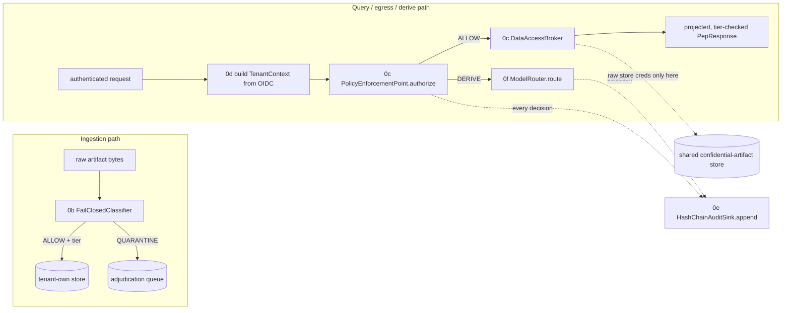
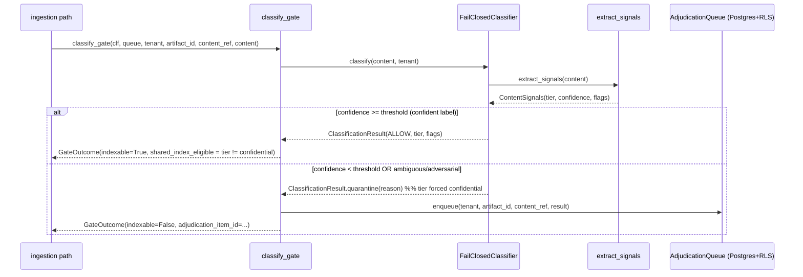
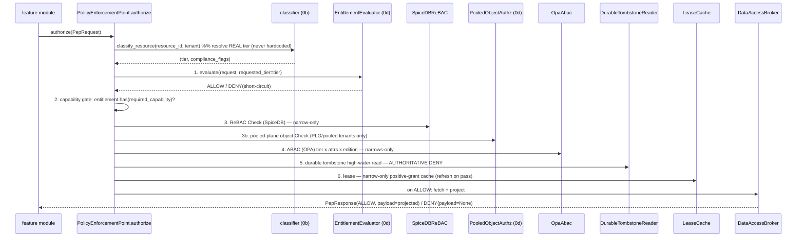
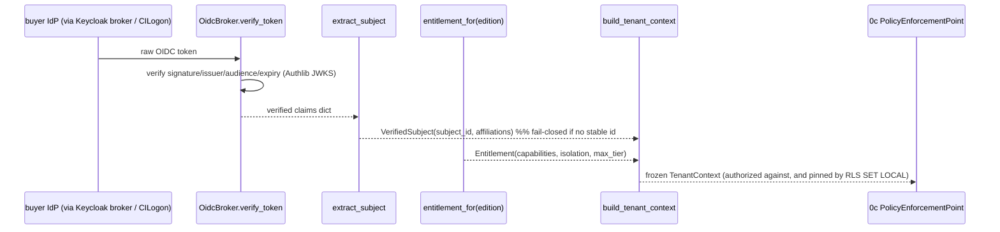
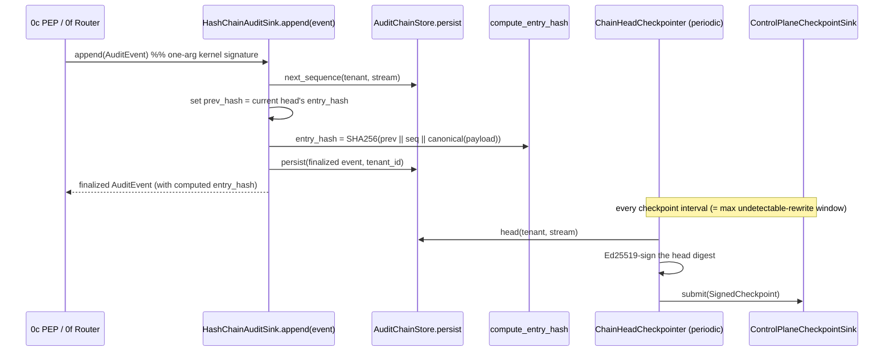
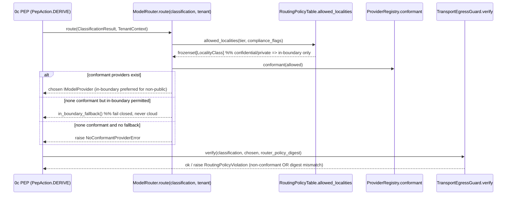

# LLD: Security & AI Kernel (Classification, PEP, Identity, Audit, Model Router)

## What this document is for

This is the low-level design (LLD) for the five security-and-AI components that make TigerExchange's confidentiality guarantees *structural* rather than *aspirational*: the fail-closed **Classification Engine** (0b), the single **Policy Enforcement Point + data-access Broker** (0c), **Identity + Entitlement** (0d), the per-stream hash-chain **Audit Spine** (0e), and the provider-agnostic **Model Router** (0f). It is written so a local code-generation model (a quantized open-weight model on an Apple M4 Max, 36 GB, via Ollama) can build each component without holding any other document in context: every term is defined inline, every file path / type / signature is exact, and every non-trivial choice states *we do X because Y; we considered Z but rejected it because W*. The matching task-by-task TDD steps live in the `0b`–`0f` plan files (paths given per component); this document is the design rationale and the map between them.

> TigerExchange in one sentence: a cross-institution grant-collaboration platform where research data is labeled into three sensitivity **tiers** (`public < private < confidential`) and **every** read/egress/derivation is forced through one chokepoint that fails closed (denies) on any doubt. The wedge product is "assemble a multi-institution grant team and co-edit a confidential proposal", anchored on one federally-funded multi-site center that already shares data under an existing Data Use Agreement (DUA).

---

## 0. Ground truth you must not contradict

These are LOCKED. If your code would violate one, your code is wrong.

| ID | Locked decision (summary) | What it forces in this LLD |
|---|---|---|
| **D1** | Wedge = grant intelligence (cross-institution team assembly + secure proposal collaboration). | Confidential tier + cross-institution sharing are exercised early but scoped to proposals/budgets. |
| **D2** | Narrow-to-land scope, but build the FULL modular architecture. | Components are pluggable modules behind one kernel; nothing is thrown away later. |
| **D3** | Cold-start anchors on ONE existing federally-funded multi-site center with an existing DUA. | Phase-0 is effectively single-tenant own-data; cross-institution issuance is Phase-1+. |
| **D4** | Confidentiality enforcement = a SINGLE Policy Enforcement Point (PEP) + data-access broker chokepoint. | 0c is the one chokepoint; feature modules physically cannot bypass it. |
| **D5** | The owning node is the SOLE local fail-closed authority. NO global hot-path consensus. | Revocation/lease reads are owner-local Postgres reads, never a network consensus hop. |
| **D6** | Confidential content NEVER enters the shared central index. Red-team gate before any write. Classifier abstention -> quarantine default-deny. | 0b quarantines on doubt; `PublishableProjection` rejects confidential at validation. |
| **D7** | Institutional ACV >= 2-3x per-tenant COGS. Pooled for non-confidential; dedicated isolation only for confidential. | 0f documents the K=2 GPU isolation decision and the ACV-floor implication. |

**Authoritative kernel.** All shared types/interfaces live in the package `contracts` (import path `from contracts import ...`), defined in `00-kernel-contracts.md`. You import these *verbatim*; you never redefine them. The relevant ones for this LLD:

| Symbol | Kind | One-line meaning |
|---|---|---|
| `Tier` | `IntEnum` | `public=0 < private=1 < confidential=2`. Ordering IS sensitivity. `Tier.parse(x)` fails closed to `confidential` on anything unknown. `Tier.wire` = the stable string name. |
| `tier_join_all(tiers)` | fn | MAX-rule join (more-restrictive wins); empty input -> `confidential`. |
| `ComplianceFlag` | `StrEnum` | `FERPA \| IRB \| ITAR \| EAR \| GDPR_PERSONAL`. Sticky: UNION-on-join. |
| `Decision` | `StrEnum` | `ALLOW \| DENY \| QUARANTINE`. |
| `DiscoverabilityScope` | `StrEnum` | `public-web \| federation-wide \| named-consortium \| named-tenants \| none`. |
| `ClassificationResult` | frozen model | `tier, decision, compliance_flags, confidence, reason, lattice_version`. `.quarantine(reason, confidence)` classmethod; `.is_retrievable` is True only for ALLOW. |
| `Caveats` | frozen model | `transfer_legality, export_attestation, ferpa_role` — re-evaluated at access. |
| `TenantContext` | frozen model | request-scoped `tenant_id, subject_id, entitlement, consortium_ids, affiliations, subject_active`. |
| `Edition` / `Entitlement` / `Capability` / `IsolationPosture` | models/enums | the PEP-evaluated capability set for a tenant. `Entitlement.has(cap)`, `Entitlement.permits_tier(tier)`. |
| `PepRequest` / `PepResponse` / `PepAction` | frozen models / enum | the one request/response the PEP consumes/returns. `PepResponse` enforces "non-ALLOW carries no payload" in `model_post_init`. |
| `PublishableProjection` | frozen model | the ONLY shape that crosses into the shared index; **rejects `confidential` tier at validation (D6)**. |
| `AuditEvent` / `AuditEventType` | frozen model / enum | one hash-chained audit record (`prev_hash -> entry_hash`). |
| `IClassifier, IPolicyEnforcement, IDataAccessBroker, IAuditSink, IModelProvider, IModelRouter` | `@runtime_checkable Protocol` | the seams each component implements. |

**Monorepo layout** (project root is `tigerexchange/`):

```
tigerexchange/
├── packages/
│   ├── contracts/                 # the kernel (00-kernel-contracts.md) — you import this
│   ├── mod-pep/                   # 0c: PolicyEnforcementPoint + DataAccessBroker
│   ├── mod-identity/              # 0d: OIDC->TenantContext, EntitlementEvaluator, pooled authz
│   ├── mod-audit/                 # 0e: HashChainAuditSink + checkpointer + verifier
│   ├── mod-pooled-plane/          # 0d: pooled own-materials repo (RLS-hardened)
│   └── mod_ai/                    # 0f: ModelRouter, providers, routing policy, guardrails
└── services/
    ├── api/                       # FastAPI app (wires the above via DI)
    └── classification/            # 0b: FailClosedClassifier + adjudication queue
```

**Stack baseline.** Python 3.11+, Pydantic v2 (`>=2.6,<3`), FastAPI (`>=0.110`), pytest/ruff/mypy, import-linter. TDD throughout: write the failing test, run it red, write the minimal code, run it green, commit. Postgres 16 with **FORCE ROW LEVEL SECURITY** for tenant isolation. SpiceDB (Apache-2 OSS) for relationship-based access (ReBAC). OPA (Rego) for attribute-based access (ABAC). `cryptography>=42` for Ed25519 audit signing. vLLM (prod) / Ollama (dev) for in-boundary inference.

> **Three vocabulary terms used everywhere below, defined once:**
> - **Fail-closed** = on any error, missing input, timeout, or ambiguity, the system DENIES (or QUARANTINES), never allows. The opposite (fail-open) is the bug class we are designing against.
> - **Chokepoint** = a single code path every sensitive operation must pass through, so a new feature module *cannot* become a leak vector — it physically has no other way to reach the data.
> - **Owner-local authority (D5)** = the institution that owns a confidential artifact decides access/revocation for it, using only its own local Postgres; there is no cross-network vote on the request hot path.

---

## 1. How the five components compose (one picture)



Reading the picture:
- **0b** is the gate on the *write* side: nothing reaches a retrievable surface without a confident classification; doubt -> quarantine.
- **0d** turns a verified login into a frozen `TenantContext` (who you are + what your edition entitles you to).
- **0c** is the single gate on the *read/egress/derive* side (D4). It runs a fixed decision order and is the only thing that talks to the broker.
- **0f** is invoked behind 0c on derivation (`PepAction.DERIVE`) and picks where inference runs based on the data's tier.
- **0e** records every 0c decision and 0f selection into a tamper-evident hash chain.

---

## 2. (0b) Fail-Closed Classification Engine + Quarantine + Adjudication Queue

> **Plan file with task-by-task TDD steps:** `plans/phase0/0b-classification-engine.md`
> **Package:** `tigerexchange/services/classification/` (import module `classification`)

### 2.1 Why this exists and the risk it resolves

The named risk (D6) is the **one-way-door leak**: once confidential-derived content lands in a shared retrievable surface, you cannot un-publish it from every cache/replica. The mitigation is to make *labeling* the hard gate **before** any indexing, and to make *doubt* default to the most restrictive outcome. We do this because a misclassification that errs toward "public" is unrecoverable, while a misclassification that errs toward "confidential" only costs a human review. We considered training an LLM classifier in Phase-0 and rejected it because (a) it is non-deterministic and hard to red-team, and (b) the wedge needs an auditable, explainable gate first; the LLM classifier is deferred.

### 2.2 Main flow (sequence)



### 2.3 Key classes / functions (exact signatures)

```python
# tigerexchange/services/classification/src/classification/config.py
class ClassifierConfig(BaseModel):
    model_config = ConfigDict(frozen=True)
    # gt=0.0 because a 0 threshold disables abstention (everything passes); le=1.0
    # because confidence is in [0,1]. Default 0.7 = strict Phase-0 floor.
    confidence_threshold: float = Field(default=0.7, gt=0.0, le=1.0)

# tigerexchange/services/classification/src/classification/signals.py
@dataclass(frozen=True)
class ContentSignals:
    tier: Tier
    confidence: float
    compliance_flags: frozenset[ComplianceFlag] = field(default_factory=frozenset)

def extract_signals(content: bytes) -> ContentSignals: ...

# tigerexchange/services/classification/src/classification/classifier.py
class FailClosedClassifier:                       # implements kernel IClassifier
    def __init__(self, config: ClassifierConfig | None = None) -> None: ...
    def classify(self, content: bytes, tenant: TenantContext) -> ClassificationResult: ...

# tigerexchange/services/classification/src/classification/queue.py
class AdjudicationQueue:
    def __init__(self, session_factory: sessionmaker[Session]) -> None: ...
    def enqueue(self, tenant, *, artifact_id: str, content_ref: str,
                result: ClassificationResult) -> str: ...   # only QUARANTINE results accepted
    def list_pending(self, tenant) -> list[AdjudicationItem]: ...
    def release(self, tenant, item_id, *, reviewer_id, approved_tier: Tier,
                review_reason) -> AdjudicationItem: ...       # human approves a tier
    def reject(self, tenant, item_id, *, reviewer_id, review_reason) -> AdjudicationItem: ...

# tigerexchange/services/classification/src/classification/ingest_gate.py
def classify_gate(classifier, *, queue, tenant, artifact_id, content_ref,
                  content: bytes) -> GateOutcome: ...
```

The **decision logic** inside `classify` (the whole point of the component):

```python
def classify(self, content, tenant):
    signals = extract_signals(content)
    threshold = self._config.confidence_threshold
    if signals.confidence < threshold:                  # <-- the fail-closed gate
        result = ClassificationResult.quarantine(
            reason=f"abstain: confidence {signals.confidence:.2f} < {threshold:.2f} "
                   f"(estimated tier {signals.tier.wire})",
            confidence=signals.confidence,
        )
        # sticky flags must survive into the queue/audit even on quarantine
        return result.model_copy(update={"compliance_flags": signals.compliance_flags})
    return ClassificationResult(tier=signals.tier, decision=Decision.ALLOW,
                                confidence=signals.confidence,
                                compliance_flags=signals.compliance_flags,
                                reason=f"confident label {signals.tier.wire}")
```

The **adversarial-collapse rule** inside `extract_signals` is load-bearing: if a *confidential* marker fires it dominates regardless of public-looking noise; if a *private* AND a *public* marker both fire, confidence collapses below threshold. We do this because the attack we name is the **mosaic / metadata-spoof**: confidential content wrapped in public-looking metadata ("Open access preprint DOI:10.1/x ... INTERNAL DRAFT PROPOSAL CONFIDENTIAL"). A naive max-of-signals classifier would label it public; our rule guarantees it can never be a confident-public ALLOW. We considered scoring the highest-confidence single signal and rejected it precisely because it loses to this attack.

### 2.4 Deny / error handling

| Situation | Outcome |
|---|---|
| confidence < threshold | `Decision.QUARANTINE`, `tier=confidential`, `is_retrievable=False`, routed to adjudication queue. |
| no discriminating signal at all | `tier=confidential, confidence=0.2` -> quarantine. |
| confident confidential | `Decision.ALLOW, tier=confidential` — indexable into the tenant's OWN store only; `shared_index_eligible=False` (D6). |
| `enqueue` called with a non-QUARANTINE result | `raise ValueError` — only quarantined records belong in the queue. |
| reviewer `release`/`reject` of a non-pending item | `raise ValueError`. |

### 2.5 Storage + isolation

The adjudication queue is a Postgres table `adjudication_item` with **FORCE ROW LEVEL SECURITY** and a **RESTRICTIVE** policy pinned to `current_setting('app.tenant_id')`, plus a `tenant_id`-leading index. We use `FORCE` so even the table owner is subject to RLS (no owner bypass); we use `RESTRICTIVE` (which ANDs with any future policy) and a `WITH CHECK` clause so a tenant cannot even *insert* another tenant's row. Each operation runs in one transaction that begins with `SET LOCAL app.tenant_id = :tid` — `SET LOCAL` (transaction-scoped) is mandatory rather than `SET`, because a pooled connection would otherwise leak the previous tenant's id into the next borrower's transaction. `content_ref` is a pointer to the quarantined bytes — **never** inline confidential bytes in the queue row.

### 2.6 Test strategy (0b)

| Test file | What it proves |
|---|---|
| `tests/test_signals.py` | public/confidential/FERPA/ITAR markers; ambiguous -> low confidence; adversarial -> never confident-public. |
| `tests/test_classifier.py` | `isinstance(FailClosedClassifier(), IClassifier)`; confident label allowed; abstain -> quarantine + confidential + reason; threshold honored. |
| `tests/test_queue.py` (integration) | quarantine persists as `pending`; only QUARANTINE enqueueable; release assigns human tier; reject stays out of retrieval; **one tenant cannot see another's queue (RLS)**. |
| `tests/test_ingest_gate.py` | confident public passes; quarantine blocked + enqueued; adversarial blocked; confident confidential indexable but `shared_index_eligible=False`. |
| `tests/test_contract_zero_leak.py` | the acceptance gate: adversarial + low-confidence records leak into **no** retrievable surface. |

---

## 3. (0c) The Single Policy Enforcement Point + Data-Access Broker

> **Plan file with task-by-task TDD steps:** `plans/phase0/0c-pep-broker-chokepoint.md`
> **Package:** `tigerexchange/packages/mod-pep/` (import module `mod_pep`)

### 3.1 Why one chokepoint (D4) and the risk it resolves

The named risk is the **bypass / re-implementation leak**: in a modular system every feature module that re-implements "the ~7 confidentiality checks" is a place those checks can drift or be skipped, so adding wedge #4's funding module could silently become a leak vector. D4 resolves this by routing *all* retrieval/egress/derivation through **one** `PolicyEnforcementPoint` class behind which sits **one** `DataAccessBroker` that is the *sole* holder of raw-store credentials. Feature modules stay "dumb": they send a `PepRequest` and receive an already-projected, already-tier-checked `PepResponse` — they never see raw classification logic or raw stores. We enforce this structurally with **import-linter** (a forbidden-imports contract in `pyproject.toml`), so a module that imports the raw store or the classifier directly fails CI. We considered a shared "security library" that each module calls and rejected it because a library can be *not called*; a chokepoint plus an import contract makes bypass impossible to merge.

### 3.2 The canonical PEP constructor and decision order

There is exactly ONE PEP class, `PolicyEnforcementPoint`, implementing the kernel `IPolicyEnforcement.authorize(request: PepRequest) -> PepResponse`. It has **one canonical keyword-only constructor** — do not invent a second PEP class and do not add a `requested_tier` kwarg to the kernel `authorize`:

```python
# tigerexchange/packages/mod-pep/src/mod_pep/policy_enforcement_point.py
class PolicyEnforcementPoint:                       # implements kernel IPolicyEnforcement
    def __init__(
        self,
        *,
        entitlement_evaluator,   # 0d EntitlementEvaluator — the entitlement/edition gate (step 1)
        classifier,              # 0b lookup: classify_resource(resource_id, tenant) -> (Tier, flags)
        rebac,                   # SpiceDBReBAC — relationship Check (step 3)
        abac,                    # OpaAbac     — attribute Check (step 4)
        tombstone,               # DurableTombstoneReader — AUTHORITATIVE deny (step 5)
        lease,                   # LeaseCache  — narrow-only positive-grant cache (step 6)
        broker,                  # DataAccessBroker — sole raw-store credential holder
        pooled_authz,            # 0d PooledObjectAuthz — pooled-plane object Check (feeds step 3)
    ) -> None: ...
    def authorize(self, request: PepRequest) -> PepResponse: ...
```

The **single canonical decision order** inside `authorize` (every confidential request runs it top to bottom; the first deny short-circuits):



The order, with the *why* for each step:

| # | Step | Store / engine | Role | Why here |
|---|---|---|---|---|
| 1 | Entitlement/edition gate | injected `EntitlementEvaluator` (0d) | deny if edition lacks the capability OR the object tier exceeds the edition's tier ceiling | runs FIRST so a PLG tenant physically cannot construct a confidential/exchange request — cheap, structural, before any store touch. |
| 2 | Capability gate | `tenant.entitlement.has(...)` | deny if the resolved entitlement does not grant `required_capability` | central PEP-side capability check (§2.3); modules never self-grant. |
| 3 | ReBAC Check | SpiceDB (`authzed` gRPC) | relationship/grant check; **narrow-only cache** | "do you have a `view` relation on this object?"; deny-by-default; any client error fails closed. |
| 3b | Pooled object Check | `PooledObjectAuthz` (0d) | for `IsolationPosture.POOLED` tenants, the deny-by-default object boundary | the pooled plane is the OWASP-API-#1 (BOLA/IDOR) class; the Check gates the *request*, not the SQL, so a query that omits the tenant predicate still cannot reach another tenant's rows. |
| 4 | ABAC | OPA (Rego, HTTP sidecar) | tier x subject-attributes x edition; **narrows-only** | a missing attribute on a confidential/export request denies; PIP-unavailable on confidential denies with NO cache-fallback. |
| 5 | Durable tombstone | cell-local Postgres `revocation_log` | **the single AUTHORITATIVE store for the deny dimension** | every confidential read reads the local high-water-mark (single-digit-ms, NOT a consensus hop, per D5) so a revocation is observed immediately. |
| 6 | Lease | in-memory `LeaseCache` | **narrow-only positive-grant cache**, refreshed on pass | the 15ms lease is the benign fast path; it can affirm but never override the durable deny. |

**The convergence fix you must implement (the lease-vs-log reconciliation).** A security-reason revocation must have a **zero allow-window**: even if a positive-grant lease is still valid, the authoritative deny comes from the durable tombstone read at step 5, not from lease expiry. This is why the durable log is authoritative and the lease is *narrow-only* — the lease can only ever narrow (deny or pass-through), never widen a grant. We do this because D5 forbids a global consensus hop on the hot path, so we cannot push revocations synchronously to every node; instead each owner reads its own local log on every confidential request. We considered relying on short lease TTLs alone and rejected it because any nonzero TTL is a nonzero leak window for a compromised grant.

`decision_order.py` pins the cache portion exactly and marks authority:

```python
DECISION_ORDER = (DecisionStep.REBAC_CHECK, DecisionStep.ABAC,
                  DecisionStep.DURABLE_TOMBSTONE, DecisionStep.LEASE)
AUTHORITATIVE_DENY_STORE = DecisionStep.DURABLE_TOMBSTONE     # the only non-narrow-only step
```

**Real per-object tier (R2) — do not hardcode confidential.** `authorize` calls the injected classifier's `classify_resource(resource_id, tenant) -> (Tier, flags)` to resolve the object's *real* tier. A public object resolves to `Tier.public` and takes the non-confidential ABAC branch; an unknown/missing object resolves fail-closed to `confidential` (per kernel `Tier.parse`). We do this because otherwise public/private retrieval (0i) and funding (0k) would be forced onto the confidential path and break.

### 3.3 The data-access broker

```python
# tigerexchange/packages/mod-pep/src/mod_pep/broker.py
_PUBLISHABLE_FIELDS = ("artifact_id", "tier", "title")     # the egress allowlist (§4.2)

class DataAccessBroker:                                     # implements kernel IDataAccessBroker
    def __init__(self, store) -> None: ...
    def fetch(self, request: PepRequest, decision: PepResponse) -> PepResponse: ...
    def project(self, request: PepRequest, raw_rows) -> PublishableProjection: ...
```

`fetch` returns the (unchanged) deny response and fetches NOTHING on a non-ALLOW decision; on ALLOW it reads rows and projects each one down to the allowlist, dropping the raw `body`. The broker's DB role `broker_ro` is GRANTed `SELECT` on `confidential_artifact.artifact` and `confidential_artifact.classification` **only**, with an explicit `REVOKE ALL` on every feature-module schema. We do this so "single PEP" means one logical decision point over one *narrow* broker — not a god-object that can read every module's schema. The broker-role contract test asserts `broker_ro` can read the two shared tables, cannot read a feature schema, and cannot write.

### 3.4 Deny / error handling (0c)

| Situation | Outcome |
|---|---|
| any decision step denies | `PepResponse(decision=DENY, payload=None, reason="<step>-deny")`; short-circuit. |
| object tier unknown/missing | resolves to `confidential` (fail-closed), takes the confidential ABAC branch. |
| SpiceDB/OPA client raises | `fail_closed=True`, treated as deny. |
| OPA PIP unavailable on confidential | deny, `used_cache=False` (no cache fallback). |
| grant tombstoned (security reason) | deny even with a valid lease (zero allow-window). |
| `PepResponse` constructed with non-ALLOW + payload | kernel `model_post_init` raises — defense-in-depth against a buggy caller. |

### 3.5 Central-index read scope (R5)

0c does **not** implement a discoverability-scope filter. The single central-index read PEP (`CentralIndexReadPEP`) is owned by 0j; 0c delegates. The 0c test only asserts no duplicate `filter_by_discoverability` exists in `mod_pep`.

### 3.6 Test strategy (0c)

| Test file | What it proves |
|---|---|
| `tests/test_import_linter_contract.py` | the forbidden-imports contract names `mod_pep.broker_db` and `classification.classifier` — bypass is unmergeable. |
| `tests/test_decision_order.py` | the order is exactly the 4 pinned steps; durable tombstone is the sole authoritative-deny store; the rest are narrow-only. |
| `tests/test_rebac.py` / `test_abac.py` | deny-by-default; client error fails closed; ABAC narrows-only; missing-attr/PIP-unavailable on confidential -> deny. |
| `tests/test_revocation.py` | durable log authoritative; **security-reason zero allow-window even with a valid lease**; lease narrow-only. |
| `tests/test_broker_role_contract.py` | broker reads only confidential-artifact tables, never a feature schema, never writes. |
| `tests/test_pep_compose.py` | end-to-end: ALLOW path projects; each step's deny short-circuits with the right reason; public object resolves non-confidential tier. |

---

## 4. (0d) Identity (Keycloak + CILogon OIDC) + Entitlement + Pooled Object-Authz

> **Plan file with task-by-task TDD steps:** `plans/phase0/0d-identity-entitlement.md`
> **Packages:** `tigerexchange/packages/mod-identity/` (import `mod_identity`) and `tigerexchange/packages/mod-pooled-plane/` (import `mod_pooled_plane`)

### 4.1 Why and the risks it resolves

Two risks. First, **wrong root of trust**: ORCID is a correlation key, not an authentication assertion; trusting it would let anyone claim an identity. We resolve this by authorizing only on a federation-verified `eduPersonUniqueId` (or the OIDC `sub`), failing closed if neither is present. Second, **edition escape**: a PLG (individual, $179/mo top-of-funnel) tenant must be physically unable to touch confidential or cross-institution flows. We resolve this by evaluating editions->entitlements **centrally at the PEP** and making the entitlement gate the *first* decision step, so a PLG tenant cannot even construct a confidential/exchange request. Phase-0 ships **Direct OIDC/CILogon only**; SAML/eduGAIN brokering is a separately-sized later line and is NOT built here.

### 4.2 Main flow (sequence)



### 4.3 Key classes / functions (exact signatures)

```python
# mod_identity/oidc_claims.py
class VerifiedSubject(BaseModel):           # frozen
    subject_id: str
    affiliations: frozenset[str]
def extract_subject(claims: dict[str, object]) -> VerifiedSubject: ...   # ClaimError if no stable id

# mod_identity/entitlement_catalog.py
def entitlement_for(edition: Edition) -> Entitlement: ...                # frozen Edition->Entitlement map

# mod_identity/context_builder.py
def build_tenant_context(*, claims, tenant_id: str, edition: Edition,
                         consortium_ids: frozenset[str], subject_active: bool) -> TenantContext: ...

# mod_identity/keycloak_broker.py
@dataclass(frozen=True)
class BrokerConfig: issuer: str; audience: str; jwks: dict
class OidcBroker:
    def __init__(self, config: BrokerConfig) -> None: ...
    def verify_token(self, raw_token: str) -> dict[str, object]: ...     # TokenError on any failure

# mod_identity/entitlement_evaluator.py  -- the step composed INTO 0c's PEP
class EntitlementEvaluator:
    def evaluate(self, request: PepRequest, *, requested_tier: Tier) -> PepResponse: ...

# mod_identity/pooled_authz.py
class AuthzDenied(PermissionError): ...
class PooledObjectAuthz:
    def __init__(self, rebac) -> None: ...
    def require_object_access(self, *, tenant_id: str, object_id: str) -> str: ...   # AuthzDenied on no grant
```

The **edition catalog** (the locked PLG hard-OFF rule, §2.3):

| Edition | Capabilities (cumulative) | `isolation` | `max_tier` |
|---|---|---|---|
| `PLG` | `PUBLIC_RETRIEVAL`, `OWN_MATERIALS` | `POOLED` | `private` |
| `INSTITUTIONAL` | + `PRIVATE_TIER`, `TEAM_ASSEMBLY` | `DEDICATED_CELL` | `private` |
| `CAMPUS` | same as institutional | `DEDICATED_CELL` | `private` |
| `CONSORTIUM_ANCHOR` | + `CONFIDENTIAL_WORKSPACE`, `EXCHANGE_PARTICIPATION`, `CROSS_INSTITUTION_GRANTS`, `BYO_PROVIDER` | `DEDICATED_CELL` | `confidential` |
| `CONFIDENTIAL_SOVEREIGN` | + `DEDICATED_GPU` | `DEDICATED_CELL_GPU` | `confidential` |

PLG is `POOLED` + tier-capped at `private`; `CONFIDENTIAL_WORKSPACE`/`EXCHANGE_PARTICIPATION` are simply absent from its capability set, so `Entitlement.has(...)` returns False and the entitlement gate denies. We chose a frozen lookup table (config, not forks — D2) so a single edit changes entitlements platform-wide and the catalog is unit-testable.

The `EntitlementEvaluator` is an internal helper, NOT the kernel `IPolicyEnforcement`; it takes the PEP-resolved object tier as `requested_tier` so the kernel `authorize(request)` signature stays one-arg. Its logic: deny if the edition lacks the capability, deny if the edition's `max_tier < requested_tier`, else ALLOW. 0d does **not** define a PEP class; it only injects this evaluator + `PooledObjectAuthz` into 0c's canonical constructor (assembled by the `services/api` DI factory `get_pep`).

### 4.4 Pooled-plane defense-in-depth (D7)

The pooled plane co-locates multiple PLG tenants' own-materials. The **primary** boundary is the object-authz `Check` (step 3b in 0c). **Behind** it, the Postgres `own_materials` table is hardened with: FORCE RLS, RESTRICTIVE policy, `WITH CHECK`, `SET LOCAL app.tenant_id` per transaction (PgBouncer transaction-mode safe), and a `tenant_id`-leading index. A CI lint (`tools/ci/forbid_security_definer.py`) forbids `SECURITY DEFINER` functions and materialized views over tenant-scoped tables, because both are classic RLS-bypass escapes. We layer authz-Check + RLS because RLS alone trusts the SQL to carry the tenant predicate, and the Check gates the request regardless of the SQL.

### 4.5 Deny / error handling (0d)

| Situation | Outcome |
|---|---|
| no `eduPersonUniqueId` and no `sub` | `ClaimError` (fail-closed; never a guessed identity). |
| token bad signature/issuer/audience/expiry | `TokenError`. |
| PLG tenant requests `CONFIDENTIAL_WORKSPACE` | entitlement gate `DENY`, payload None, reason mentions "entitlement". |
| capability held but tier above ceiling | `DENY` on the tier ceiling. |
| pooled tenant has no grant on the object | `AuthzDenied` -> 0c returns `DENY`. |

### 4.6 Test strategy (0d)

| Test file | What it proves |
|---|---|
| `test_oidc_claims.py` | extracts subject + affiliations; single-string affiliation; **missing unique id fails closed**; falls back to `sub`. |
| `test_entitlement_catalog.py` | PLG public+own-materials only, confidential/exchange OFF, `private` ceiling, `POOLED`; consortium-anchor has confidential+exchange; every edition mapped; frozen. |
| `test_entitlement_evaluator.py` | PLG cannot construct confidential/exchange request; tier-above-ceiling denied even with capability. |
| `test_pooled_authz.py` | Check passes when tenant owns object; cross-tenant deny-by-default; unknown object denied. |
| `test_cross_tenant_read_denied.py` | the §7.7 contract: BOLA / direct / SECURITY DEFINER / borrowed PgBouncer connection all denied. |
| `test_pep_entitlement_wired.py` | the two collaborators are injected into 0c's one PEP and run as steps 1 / 3b. |

---

## 5. (0e) Per-Stream Hash-Chain Audit Sink

> **Plan file with task-by-task TDD steps:** `plans/phase0/0e-audit-spine.md`
> **Package:** `tigerexchange/packages/mod-audit/` (import `mod_audit`)

### 5.1 Why and the risk it resolves

The named risk is **silent operator-side rewrite** of the audit trail (a compelled or compromised operator editing history). The mitigation is a **per-stream hash chain** (each event links to the previous via `prev_hash`, so any mutation/drop/reorder breaks the chain) plus **periodic signed chain-head checkpoints** anchored to an external control-plane sink (the Phase-0 stand-in for the transparency log), so a rewrite becomes tamper-*evident*. We make the chains **parallel per `(tenant_id, stream_id)`** rather than one global serial chain because a single global chain is a single-writer throughput ceiling; parallel chains let each cell append independently. The kernel `IAuditSink.append(event)` is **one argument** — do not add a tenant parameter to it.

### 5.2 Main flow (sequence)



### 5.3 Key classes / functions (exact signatures)

```python
# mod_audit/hashing.py
def canonical_event_bytes(event: AuditEvent) -> bytes: ...           # deterministic, EXCLUDES entry_hash
def compute_entry_hash(prev_hash: str | None, event: AuditEvent) -> str: ...   # 64-hex SHA-256

# mod_audit/store.py
@runtime_checkable
class AuditChainStore(Protocol):
    def persist(self, event: AuditEvent, tenant_id: str) -> None: ...  # NOT 'append' — avoids confusion
    def head(self, tenant_id: str, stream_id: str) -> AuditEvent | None: ...
    def read_chain(self, tenant_id: str, stream_id: str) -> list[AuditEvent]: ...
    def next_sequence(self, tenant_id: str, stream_id: str) -> int: ...
class InMemoryAuditChainStore: ...        # PostgresAuditChainStore is the durable, RLS-backed twin

# mod_audit/sink.py
class HashChainAuditSink:                  # implements kernel IAuditSink
    def __init__(self, store, signer=None, control_plane=None) -> None: ...
    def append(self, event: AuditEvent) -> AuditEvent: ...     # kernel: ONE arg
    def head(self, stream_id: str) -> AuditEvent | None: ...   # kernel: stream_id only
    def checkpoint(self, stream_id: str) -> str: ...           # returns signed head digest (hex)

# mod_audit/verify.py
class ChainVerificationError(Exception): ...
def verify_chain(events: list[AuditEvent]) -> bool: ...        # fail-closed on any break

# mod_audit/checkpoint.py
class SignedCheckpoint(BaseModel): ...     # frozen: tenant_id, stream_id, head_sequence, head_entry_hash,
                                           #         signed_at, signature_hex, public_key_hex
class Ed25519Signer:
    def sign(self, digest: bytes) -> bytes: ...
    def verify(self, digest: bytes, signature: bytes) -> bool: ...   # returns bool, never raises
class ChainHeadCheckpointer:
    def checkpoint_stream(self, tenant_id: str, stream_id: str) -> SignedCheckpoint | None: ...
    def checkpoint_all(self, streams) -> list[SignedCheckpoint]: ...
```

The chain link primitive (the integrity of the whole spine depends on getting this exactly right):

```python
def compute_entry_hash(prev_hash, event):
    h = hashlib.sha256()
    prev = prev_hash if prev_hash is not None else ""
    h.update(f"prev:{len(prev)}:".encode("utf-8"))   # length-tagged domain separator:
    h.update(prev.encode("utf-8"))                   #   None vs empty-string predecessor never collide
    h.update(b"|payload:")
    h.update(canonical_event_bytes(event))           # canonical EXCLUDES entry_hash (its own output)
    return h.hexdigest()
```

`canonical_event_bytes` uses Pydantic JSON mode then `json.dumps(..., sort_keys=True, separators=(",",":"))` so two equal events always produce identical bytes regardless of field-insertion order, and **excludes `entry_hash`** because that field is the output of this function and including it would be circular.

### 5.4 Wiring 0e to 0c/0f — `store.persist` vs `IAuditSink.append`

The two write methods are deliberately named differently. The kernel sink seam is `IAuditSink.append(event)` (one argument — the event already carries its `tenant_id`). The internal store method is `AuditChainStore.persist(event, tenant_id)` (takes the raw `tenant_id` string for the RLS chain key). We split them so the one-arg kernel contract is never polluted and the durable store still gets the tenant key it needs for RLS. The sink instance is bound to its owning tenant at construction (a cell serves one tenant in Phase-0), which is how `head(stream_id)` / `checkpoint(stream_id)` resolve their tenant while keeping the kernel signature intact.

### 5.5 Deny / error handling (0e)

| Situation | Outcome |
|---|---|
| `append` event whose `tenant_id` != the sink's bound tenant | `ValueError` (cross-tenant write rejected). |
| non-monotonic per-stream sequence | `store.persist` raises `ValueError` ("sequence"). |
| any chain break (mutated payload / dropped / reordered / re-linked) | `verify_chain` raises `ChainVerificationError` (fail-closed). |
| `Ed25519Signer.verify` on a tampered head/signature | returns `False` (never raises). |
| empty stream checkpoint | `checkpoint_stream` returns `None`. |

### 5.6 Test strategy (0e)

| Test file | What it proves |
|---|---|
| `test_hashing.py` | canonical bytes deterministic + exclude `entry_hash`; hash is 64-hex; depends on prev_hash and on payload. |
| `test_sink_append.py` | per-stream monotonic sequence; streams independent; head returns last; non-monotonic rejected; per-tenant isolation. |
| `test_tamper_detection.py` | THE acceptance test: mutated payload / dropped entry / broken prev-link / reordered seq all detected. |
| `test_checkpoint.py` | signer roundtrip; checkpoint signs current head + delivered to control-plane sink; tampered head fails signature check. |
| `test_sink_kernel_contract.py` | `isinstance(sink, IAuditSink)`; `append` links + computes hash; cross-tenant event rejected. |
| `test_append_rate_ceiling.py` | per-stream append rate exceeds peak per-cell operation rate (parallel-chain throughput property). |

---

## 6. (0f) Provider-Agnostic, Classification-Routed Model Router

> **Plan file with task-by-task TDD steps:** `plans/phase0/0f-model-router.md`
> **Package:** `tigerexchange/packages/mod_ai/` (import `mod_ai`)

### 6.1 Why and the risk it resolves

The named risk is **confidential data egressing to a cloud frontier model**. The mitigation is to route by the data's *classification*, never by a hardcoded provider name: confidential/private inference runs **in-boundary** (self-hosted vLLM/Ollama); only public may reach a cloud frontier provider. The decision lives in ONE owned `RoutingPolicyTable` (tier->allowed-localities) consulted by BOTH the router AND a transport/egress guard; a `policy_digest()` cross-check makes any divergence a **hard-fail**. We made locality a *declared, attested* provider property and the table the single authority because a hardcoded `{tier: provider}` map rots the moment a new provider is added, whereas filtering an open registry by an owned policy table is provider-agnostic and BYO-friendly. We fail **closed to the in-boundary provider** when no compliant provider attests, never open to cloud.

### 6.2 Main flow (sequence)



### 6.3 Key classes / functions (exact signatures)

```python
# mod_ai/locality.py
class LocalityClass(StrEnum):
    IN_BOUNDARY = "in-boundary"
    EXPORT_CONFORMANT_CELL = "export-conformant-cell"   # stricter subclass of in-boundary
    CLOUD_FRONTIER = "cloud-frontier"
    def is_in_boundary(self) -> bool: ...
def tier_required_localities(tier: Tier) -> frozenset[LocalityClass]: ...   # behind the kernel sig

# mod_ai/routing_policy.py
class RoutingPolicyTable(BaseModel):                      # frozen; the ONE owned table
    rules: dict[Tier, frozenset[LocalityClass]]
    def allowed_localities(self, tier: Tier, compliance_flags: frozenset[ComplianceFlag]
                           ) -> frozenset[LocalityClass]: ...
    def policy_digest(self) -> str: ...                   # SHA-256 of the table, for agreement proof
def load_routing_policy() -> RoutingPolicyTable: ...

# mod_ai/providers.py  -- each implements kernel IModelProvider
class InBoundaryProvider:                                 # vLLM(prod)/Ollama(dev); no_retention=True
    def satisfies_locality(self, tier: Tier) -> bool: ... # KERNEL signature: takes a Tier
    def serves_locality_class(self, locality: LocalityClass) -> bool: ...  # internal predicate
class CloudFrontierProvider: ...                          # public tier only
class ProviderRegistry:
    def register(self, provider) -> None: ...
    def conformant(self, allowed: frozenset[LocalityClass]) -> list: ...
    def in_boundary_fallback(self): ...

# mod_ai/router.py
class ModelRouter:                                        # implements kernel IModelRouter
    def __init__(self, registry, policy: RoutingPolicyTable) -> None: ...
    def route(self, classification: ClassificationResult, tenant: TenantContext): ...

# mod_ai/transport_guard.py
class TransportEgressGuard:
    def verify(self, classification, provider, *, router_policy_digest: str | None = None) -> None: ...

# mod_ai/byo.py
class ByoRegistration(BaseModel): ...   # frozen: provider_id, tenant_id, attested_locality,
                                        #   attestation_present, compliance_flags, tee_attested
def register_byo(registry, registration, tenant) -> str: ...   # PermissionError / AttestationAbsentError

# mod_ai/guardrails.py
class GuardrailViolation(RuntimeError): ...
def output_egress_check(source_tier: Tier, requester_max_tier: Tier, caveats: Caveats) -> Decision: ...
def filter_injection(context: str) -> tuple[str, bool]: ...        # (cleaned, flagged)
def tier_pinned_tools(classification: ClassificationResult, candidate_tools: frozenset[str]
                      ) -> frozenset[str]: ...
```

The routing rules (the locked tier->locality mapping, with the export-control narrowing):

| Tier | Allowed localities | Export-controlled (ITAR/EAR) narrows to |
|---|---|---|
| `confidential` | `IN_BOUNDARY`, `EXPORT_CONFORMANT_CELL` | `EXPORT_CONFORMANT_CELL` only |
| `private` | `IN_BOUNDARY`, `EXPORT_CONFORMANT_CELL` | `EXPORT_CONFORMANT_CELL` only |
| `public` | `IN_BOUNDARY`, `EXPORT_CONFORMANT_CELL`, `CLOUD_FRONTIER` | `EXPORT_CONFORMANT_CELL` only |

An export-controlled compliance flag *tightens* the allowed set by intersection (never widens). A `ClassificationResult.quarantine(...)` is forced to confidential tier (D6), so a quarantined derivation can never reach cloud.

> **Note on `LocalityClass` vs the kernel.** The kernel `IModelProvider.satisfies_locality(tier: Tier) -> bool` takes a *Tier*. `LocalityClass` is an internal `mod_ai` detail behind that signature: a provider answers the kernel's tier question via `tier_required_localities(tier)`, and the registry/router/guard filter on the internal `serves_locality_class(locality)` predicate. Do not leak `LocalityClass` into the kernel contract.

### 6.4 BYO + guardrails

`register_byo` raises `PermissionError` if the tenant lacks `Capability.BYO_PROVIDER`, raises `AttestationAbsentError` if no locality attestation is present (router then falls back to in-boundary), and refuses an export-controlled BYO that is not TEE-attested + jurisdiction-proven. BYO `no_retention_attested()` is `False` — for BYO it is a *contractual* control, never crypto-enforced; we never overclaim. Guardrails wrap generation: `output_egress_check` denies if the requester's tier ceiling is below the source tier or a sticky caveat forbids transfer; `filter_injection` strips known prompt-injection markers from retrieved context; `tier_pinned_tools` removes egress-capable tools (`web_fetch`, `cloud_summarize`) for any non-public tier.

### 6.5 The K=2 confidential-GPU isolation decision (D7)

The risk: §16.1 held confidential COGS low by sharing one GPU across K=2 confidential tenants, but volume keys protect data *at rest* — they do **not** isolate the in-process vLLM KV-cache two confidential tenants would share, which is a cross-tenant inference side-channel. **Resolution:** mandate per-confidential-tenant GPU isolation — a hardware-isolated MIG partition (preferred) or a dedicated vLLM process — with **no shared KV cache** (`ConfidentialGpuIsolationPolicy` rejects `shared_kv_cache=True`). K=2 is retained as a *hardware-partition* count, so the ~$36-43k/yr shared-GPU COGS basis holds and is CISO-defensible. If MIG cannot meet the RAGAS quality gate and a dedicated GPU per tenant is forced (~$66-72k/yr Sovereign basis), the confidential ACV floor must rise to **>= $150k** to preserve D7's >= 2x ratio (a $120k deal on the dedicated basis is only ~1.7x and is D7-violating). This is captured both as code (`mod_ai/gpu_isolation.py`) and the documented decision (`mod_ai/docs/gpu-isolation-decision.md`).

### 6.6 Deny / error handling (0f)

| Situation | Outcome |
|---|---|
| no conformant provider, in-boundary permitted | `in_boundary_fallback()` (fail closed, never cloud). |
| no conformant provider, no fallback | `NoConformantProviderError`. |
| transport guard sees a non-conformant selection | `RoutingPolicyViolation`. |
| router/transport consulted different tables (digest mismatch) | `RoutingPolicyViolation`. |
| BYO without capability / attestation / export TEE | `PermissionError` / `AttestationAbsentError`. |
| `shared_kv_cache=True` on a confidential isolation policy | `ValueError`. |

### 6.7 Test strategy (0f)

| Test file | What it proves |
|---|---|
| `test_routing_policy.py` | confidential/private exclude cloud; public includes cloud; export flag narrows to export-conformant; same table -> same digest; mutation -> different digest. |
| `test_providers_registry.py` | in-boundary satisfies all tiers; cloud satisfies public only; registry filters by locality; fallback exposed. |
| `test_router.py` | `isinstance(router, IModelRouter)`; confidential -> in-boundary; public -> cloud; quarantine never cloud; no-conformant+no-fallback hard-fails. |
| `test_router_transport_agreement.py` | the dual contract: non-public never selects cloud; router/transport disagreement hard-fails. |
| `test_byo.py` | attested in-boundary registers; missing capability/attestation refused; export BYO needs TEE. |
| `test_guardrails.py` | egress re-check allow/deny; caveat deny; injection strip; tier-pinned tools. |
| `test_gpu_isolation_cogs.py` | K=2 MIG keeps shared basis + D7-compliant at $120k; dedicated GPU lands higher basis + D7-violating at $120k; shared KV cache forbidden. |

---

## 7. Cross-component invariants (audit checklist)

These are the properties a reviewer (Claude/Anthropic) will check. If your implementation cannot demonstrate all of them, it is incomplete.

| Invariant | Where enforced | Named risk it closes |
|---|---|---|
| Doubt -> quarantine -> confidential, excluded from all retrieval. | 0b `classify`, `ClassificationResult.quarantine` | one-way-door leak (D6). |
| Confidential never enters the shared index. | kernel `PublishableProjection` validator; 0b `shared_index_eligible=False` | one-way-door leak (D6). |
| Every read/egress/derive passes the one PEP; modules can't import raw store/classifier. | 0c import-linter contract | bypass / re-implementation leak (D4). |
| Decision order fixed; durable tombstone is the sole authoritative deny; lease narrow-only. | 0c `decision_order.py` + `authorize` | revocation race / nonzero allow-window (D5). |
| Security-reason revocation = zero allow-window. | 0c step 5 read on every confidential request | compromised-grant leak window (D5). |
| Identity root of trust = verified `eduPersonUniqueId`/`sub`, never ORCID. | 0d `extract_subject` fail-closed | spoofed identity (D1/D3). |
| PLG physically cannot construct confidential/exchange requests. | 0d entitlement gate as 0c step 1 | edition escape (D7). |
| Pooled-plane reads pass an object-authz Check before any SQL; RLS behind it. | 0d `PooledObjectAuthz` + RLS hardening | BOLA/IDOR cross-tenant read (D7). |
| Audit chain is tamper-evident; checkpoints externally anchored. | 0e `verify_chain` + signed checkpoints | operator-side rewrite. |
| Confidential/private inference is in-boundary; only public reaches cloud; disagreement hard-fails. | 0f owned table + transport guard | confidential egress to cloud. |
| No shared KV cache across confidential tenants; D7 ACV floor preserved. | 0f `ConfidentialGpuIsolationPolicy` | cross-tenant inference side-channel (D7). |

---

## 8. Build order

Build bottom-up so each component's dependencies already exist (each is a separate TDD plan file under `plans/phase0/`):

1. **0b** (`0b-classification-engine.md`) — depends only on the kernel + Postgres; gives 0c its `classify_resource` lookup.
2. **0d** (`0d-identity-entitlement.md`) — gives 0c its `EntitlementEvaluator` + `PooledObjectAuthz`, and produces `TenantContext`.
3. **0e** (`0e-audit-spine.md`) — gives 0c/0f their audit sink.
4. **0c** (`0c-pep-broker-chokepoint.md`) — composes 0b+0d+0e behind the one chokepoint.
5. **0f** (`0f-model-router.md`) — invoked behind 0c on `PepAction.DERIVE`.

All five are wired together by the FastAPI app in `tigerexchange/services/api/` (the `get_pep` DI factory assembles the PEP from the injected collaborators). Run the full gate per package: `python -m pytest -q && ruff check src/ && mypy src/ && lint-imports`.
