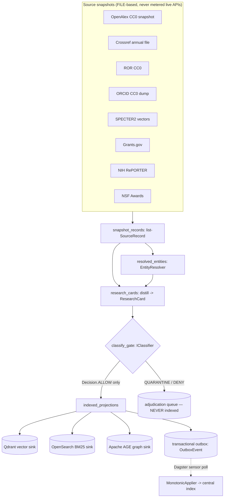
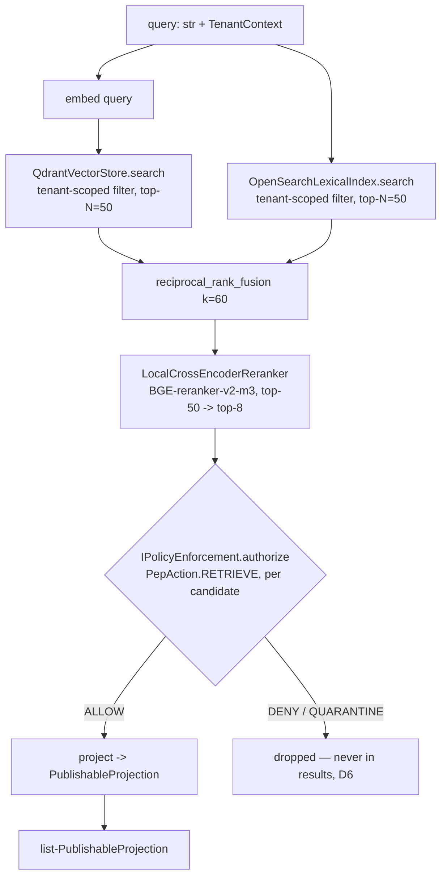
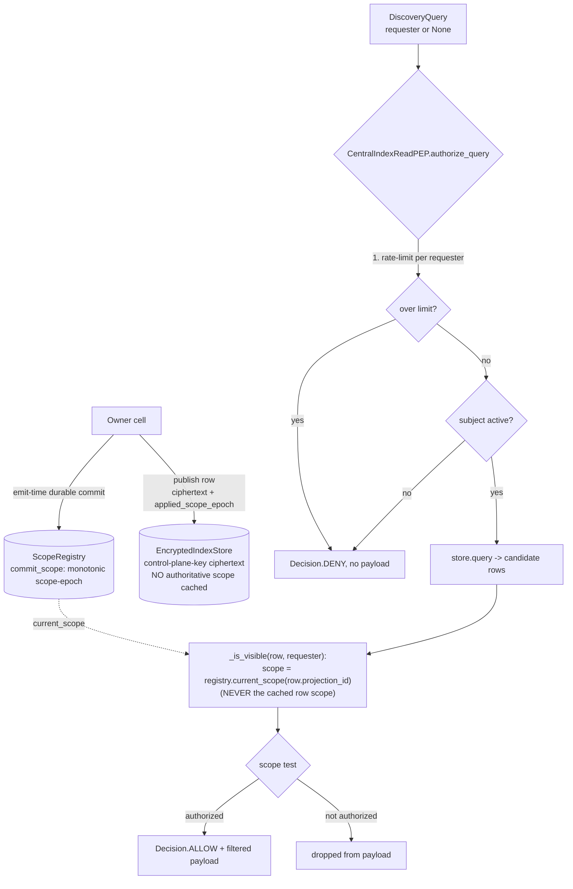
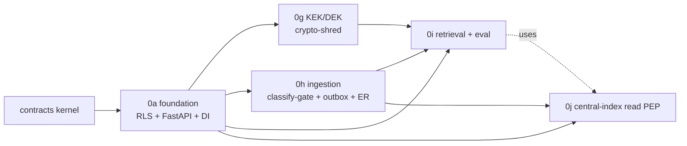

# LLD: Data Layer (Tenant Isolation, Encryption, Ingestion, Retrieval, Central Index)

## What this document is for

This is the low-level design (LLD) for the **data layer** of TigerExchange — a cross-institution grant-intelligence platform. It is written so a code-generation model with a limited context window can build the data layer **without reading any other document**. It is fully self-contained: every term is defined inline the first time it appears, every file path is absolute under the project root `tigerexchange/`, every library version is pinned, and every non-trivial design choice is stated with its reasoning ("we do X because Y; we considered Z, rejected it because W"). It covers five components, each backed by a detailed plan file you can consult for the full TDD task-by-task build: **(0a)** Postgres tenant isolation + monorepo + FastAPI skeleton + DI factories; **(0g)** per-tenant envelope encryption + crypto-shred of confidential stores; **(0h)** Dagster ingestion with the classify-gate-index outbox pattern + entity resolution; **(0i)** hybrid retrieval (Qdrant + OpenSearch + RRF + reranker) + a PEP-gated RAGAS evaluation harness; **(0j)** the central-index read Policy Enforcement Point. Build them in that order — later components import the earlier ones.

---

## 0. Vocabulary you must know before reading anything else

Define these once; they recur everywhere.

| Term | Definition (read this, do not guess) |
|---|---|
| **Tenant** | One owning institution (e.g. a university). The unit of data isolation. Every row, vector, index entry, and key is owned by exactly one tenant. |
| **Subject** | An authenticated user inside a tenant (a PI / researcher). Identified by an OIDC `sub` / `eduPersonUniqueId`. |
| **Tier** | The sensitivity level of a piece of data. Exactly three, totally ordered: `public < private < confidential`. An **unknown/unparseable tier always resolves to `confidential`** (the most restrictive) — never fail open. |
| **MAX-rule** | When data is derived from multiple inputs, the derived tier = the MAX (most restrictive) of all input tiers. Function: `tier_join_all`. |
| **PEP (Policy Enforcement Point)** | The **single** chokepoint that authorizes every read/egress/derive/discover. Decision D4: feature modules are "dumb" and physically cannot bypass it. One `IPolicyEnforcement` Protocol, two deployment loci (cell-local + central-index), selected by `PepAction`. |
| **Data-access broker** | The only component holding raw-store credentials. Sits behind the PEP. Returns already-projected, already-tier-checked rows; feature modules never get a raw DB handle. |
| **Owning node / owner-local authority** | Decision D5: the tenant that owns a confidential artifact is the **sole** authority for access/revocation decisions on it. Checks are owner-local and fail-closed locally. There is **no global hot-path consensus**. |
| **Central index** | A shared store of **only** public + private + explicitly-shared metadata (decision D6: confidential content NEVER enters it). |
| **PublishableProjection** | The one frozen shape that crosses into the central index. It rejects `confidential` tier at validation (D6 enforced in code). |
| **DiscoverabilityScope** | First-class enum on every projection: `public-web | federation-wide | named-consortium | named-tenants | none`. Publishing ≠ consent to be discovered by everyone; the central-index PEP enforces this at query time. |
| **Decision** | Terminal authorization outcome: `ALLOW | DENY | QUARANTINE`. `QUARANTINE` = abstention/ambiguity → treated as confidential, excluded from ALL retrieval, queued for human adjudication (D6). |
| **KEK / DEK** | Key-Encryption-Key wraps a Data-Encryption-Key; the DEK encrypts the actual records. **Crypto-shred** = destroy the KEK so every wrapped DEK (and thus every ciphertext) becomes permanently undecryptable. |
| **Kernel (`contracts` package)** | The near-frozen shared library every component imports: `Tier`, `TenantContext`, `Decision`, `PublishableProjection`, `PepRequest/PepResponse`, the `I*` Protocol interfaces, etc. Zero feature dependencies, no persistence. |
| **RLS (Row-Level Security)** | Postgres feature: rows are filtered by a policy predicate per query. `FORCE` makes even the table owner obey it. Our isolation foundation. |

**Stack baseline (use exactly these):** Python 3.11+ (`requires-python = ">=3.11"`), Pydantic v2 (`pydantic>=2.6,<3`), FastAPI (`fastapi>=0.115`), SQLAlchemy 2 async (`sqlalchemy[asyncio]>=2.0`) + `asyncpg>=0.29`, Postgres 16, `uv` workspace, pytest 8 + `testcontainers[postgres]>=4.8`, ruff, mypy, `import-linter>=2.1`, TDD throughout. Source plan files: `plans/phase0/0a-foundation.md`, `0g-confidential-kek-stores.md`, `0h-ingestion-pipelines.md`, `0i-retrieval-eval.md`, `0j-central-index-read-pep.md`. Ground-truth decisions: `plans/00-decisions.md` (D1–D7). Canonical kernel: `plans/phase0/00-kernel-contracts.md`.

**Monorepo layout (memorize):**

```
tigerexchange/
├── pyproject.toml                 # uv workspace root
├── packages/                      # libraries
│   ├── contracts/                 # the kernel (Tier, PEP, projection, interfaces)
│   ├── mod-confidential-crypto/   # 0g: KEK/DEK + crypto-shred
│   ├── mod-confidential-cogs/     # 0g: COGS reconciliation
│   ├── mod-ingestion/             # 0h: Dagster DAGs + classify-gate + outbox
│   ├── identity-resolution/       # 0h: entity resolution (evicted service)
│   └── retrieval/                 # 0i: hybrid retrieval + eval (src/retrieval, src/eval)
└── services/
    ├── api/                       # 0a: FastAPI app, RLS db.py, dependencies.py
    └── central_index/             # 0j: read PEP + encrypted index + scope registry
```

Why a monorepo with separate packages and a single kernel: D2 mandates the **full modular architecture** so nothing is thrown away, while D4 mandates a **single PEP chokepoint**. The kernel + `import-linter` fitness checks let modules stay pluggable and "dumb" while making it physically impossible for any module to bypass the PEP or import a persistence engine. We considered one flat package; rejected because import-linter could not then enforce the chokepoint, and a new feature module (e.g. funding) could silently become a leak vector.

---

## 1. (0a) Postgres FORCE-RLS Tenant Isolation + Monorepo + FastAPI Skeleton + DI Factories

**Plan file:** `plans/phase0/0a-foundation.md`. This is the walking skeleton every later component extends.

### 1.1 Why FORCE Row-Level Security (and the exact policy shape)

The pooled multi-tenant plane (decision D7: non-confidential workloads run multi-tenant pooled to keep cost-of-goods-sold bounded) puts many tenants' rows in **one** Postgres table. The risk we are defending against is **BOLA / IDOR** (Broken Object-Level Authorization / Insecure Direct Object Reference): tenant A asking for tenant B's row by id and getting it. RLS is our defense-in-depth boundary at the database itself (the PEP is the primary boundary; RLS is belt-and-suspenders).

The migration `tigerexchange/services/api/migrations/001_tenant_rls.sql` creates the canonical pattern. Build exactly this:

```sql
-- Pooled-plane per-tenant isolation: FORCE RLS defense-in-depth.
CREATE TABLE own_materials (
    id        BIGINT PRIMARY KEY,
    tenant_id TEXT   NOT NULL,
    title     TEXT   NOT NULL
);

-- tenant_id as the LEADING index column (see 1.2, pitfall 3).
CREATE INDEX own_materials_tenant_id_idx ON own_materials (tenant_id, id);

ALTER TABLE own_materials ENABLE ROW LEVEL SECURITY;
-- FORCE so the table OWNER also obeys the policy (see 1.2, pitfall 1).
ALTER TABLE own_materials FORCE ROW LEVEL SECURITY;

-- RESTRICTIVE (AND-combined), with both USING (reads) and WITH CHECK (writes).
CREATE POLICY own_materials_tenant_isolation ON own_materials
    AS RESTRICTIVE
    FOR ALL
    USING (tenant_id = current_setting('app.tenant_id', true))
    WITH CHECK (tenant_id = current_setting('app.tenant_id', true));
```

The current tenant is supplied per-transaction by `current_setting('app.tenant_id', true)` — set by the application via `SET LOCAL` (see 1.3).

### 1.2 The four pitfalls and their mitigations (each is a real footgun — do not skip)

| # | Pitfall | What goes wrong | Mitigation (do this) | Why |
|---|---|---|---|---|
| **1** | **Owner/superuser bypass** | By default RLS does **not** apply to the table owner or a superuser. If the app connects as the table owner, RLS silently does nothing — every tenant sees every row. | `ALTER TABLE ... FORCE ROW LEVEL SECURITY;` | `FORCE` makes the owner obey the policy too. We considered running the app as a dedicated non-owner role; we still do that in prod, but `FORCE` removes the single-mistake catastrophe of a misconfigured role. |
| **2** | **PERMISSIVE vs RESTRICTIVE** | The default `PERMISSIVE` policies are **OR-combined**: adding a second policy *widens* access. A careless future migration can accidentally open the table. | Declare policies `AS RESTRICTIVE` (AND-combined). Adding a RESTRICTIVE policy can only *narrow*. | With no base PERMISSIVE policy, the single RESTRICTIVE policy is the whole boundary; if a future migration adds a PERMISSIVE policy, the RESTRICTIVE one still narrows it. Safe-by-construction. |
| **3** | **Missing `WITH CHECK` → cross-tenant write** | `USING` filters **reads**. Without `WITH CHECK`, tenant A can `INSERT`/`UPDATE` a row stamped `tenant_id='B'` (it just won't be able to read it back) — a write-side leak / data-poisoning vector. | Add `WITH CHECK (tenant_id = current_setting('app.tenant_id', true))`. | `WITH CHECK` validates the *new* row values on write, blocking forged cross-tenant writes. |
| **4** | **Non-leading `tenant_id` index → full-scan side channel** | If `tenant_id` is not the leading index column, the planner may full-scan and the RLS predicate becomes a filter, not an index seek — a timing/throughput side channel and a performance cliff. | `CREATE INDEX ... (tenant_id, id)` — `tenant_id` **leading**. | The RLS predicate is then index-driven; the tenant boundary is enforced by the index, not by post-scan filtering. |
| **5 (CI lint)** | **`SECURITY DEFINER` function / `MATERIALIZED VIEW` RLS bypass** | A `SECURITY DEFINER` function runs as its *definer* (often the owner) — it bypasses RLS. A `MATERIALIZED VIEW` snapshots rows **without** re-applying the tenant predicate — a frozen cross-tenant copy. | A CI lint (`tigerexchange/services/api/src/api_scripts/check_rls_bypass.py`) regex-scans every applied migration and **fails the build** on `SECURITY DEFINER` or `CREATE MATERIALIZED VIEW`. | These constructs silently re-open the boundary. Forbidding them outright in Phase-0 is cheaper than auditing each. If ever required, they must explicitly re-apply the tenant filter (reviewed exception, out of Phase-0 scope). |

The lint function signature (build it exactly):

```python
# tigerexchange/services/api/src/api_scripts/check_rls_bypass.py
def find_rls_bypasses(migrations_dir: Path) -> list[str]: ...
# regex (case-insensitive): r"security\s+definer"  and  r"create\s+materialized\s+view"
# main() exits 1 if any finding; CI runs: python -m api_scripts.check_rls_bypass services/api/migrations
```

The fixture file proving the lint has teeth lives at `tigerexchange/services/api/tests/fixtures/bad_migration.sql` (a deliberately-bad file, **never applied**).

### 1.3 `SET LOCAL` — transaction-scoped tenant pinning (never `SET`)

The application pins the tenant **per transaction** via `SET LOCAL`, never session-level `SET`. The implementation is `tigerexchange/services/api/src/api/db.py`:

```python
# tigerexchange/services/api/src/api/db.py
class Database:
    def __init__(self, dsn: str) -> None:
        self.engine = create_async_engine(dsn, pool_pre_ping=True)
        self._sessionmaker = async_sessionmaker(self.engine, expire_on_commit=False)

    @asynccontextmanager
    async def tenant_session(self, tenant_id: str) -> AsyncIterator[AsyncSession]:
        """Open a transaction and pin app.tenant_id via SET LOCAL for its lifetime."""
        async with self._sessionmaker() as session:
            async with session.begin():
                # set_config(key, value, is_local=true) == SET LOCAL; parameterized
                # to avoid SQL injection. Scoped to THIS transaction only.
                await session.execute(
                    text("SELECT set_config('app.tenant_id', :tid, true)"),
                    {"tid": tenant_id},
                )
                yield session

    async def dispose(self) -> None:
        await self.engine.dispose()
```

**Why `SET LOCAL` (`is_local=true`), not `SET`, and why parameterized:** with connection pooling (e.g. PgBouncer transaction mode) a connection is handed to the next borrower after the transaction. A session-level `SET` would **leak the tenant context to the next request on that connection** — a cross-tenant disaster. `SET LOCAL` is rolled back at transaction end, so it cannot leak. We use `SELECT set_config(..., true)` rather than literal `SET LOCAL app.tenant_id = '...'` because `set_config` accepts a **bound parameter**, eliminating SQL-injection of the tenant id. We considered session-level `SET` with explicit `RESET` in a `finally`; rejected because a crash between `SET` and `RESET` leaks, whereas `SET LOCAL` is leak-proof by construction.

### 1.4 The required isolation tests (these ARE the security demonstration)

Run against a live Postgres via `testcontainers` (marked `integration`), in `tigerexchange/services/api/tests/test_rls_isolation.py`:

1. `test_tenant_a_sees_only_own_rows` — under `tenant_session("tenant-A")`, `SELECT title FROM own_materials` returns only A's rows.
2. `test_bola_read_of_other_tenant_row_by_id_denied` — under `tenant-A`, `SELECT ... WHERE id = 2` (B's row id) returns `[]`. This is the BOLA proof.
3. `test_cross_tenant_insert_blocked_by_with_check` — under `tenant-A`, inserting a row stamped `tenant-B` raises (WITH CHECK rejects it).

And the leakage test in `test_db_set_local.py`: after a `tenant_session("tenant-A")` block, a fresh raw connection reads `current_setting('app.tenant_id', true)` and asserts it is `None`/empty — proving `SET LOCAL` did not leak.

### 1.5 The DI factory seam — `api/dependencies.py` (OWNED by 0a)

This is the single module from which **every** feature component imports its wiring. 0a defines every `get_*` factory **name + signature**; Phase-0 bodies are **fail-closed not-wired stubs** that raise `NotWiredError` (never return `None`). Each feature plan supplies its real implementation later via FastAPI `app.dependency_overrides[get_x] = ...`.

```python
# tigerexchange/services/api/src/api/dependencies.py
class NotWiredError(RuntimeError):
    """A feature dependency was requested before its plan wired it. Fail-closed."""

def get_pep() -> IPolicyEnforcement:        raise _not_wired("get_pep", "0c")
def get_model_router() -> IModelRouter:     raise _not_wired("get_model_router", "0f")
def get_lit_retrieval() -> IRetrievalStrategy: raise _not_wired("get_lit_retrieval", "0i")
def get_draft_store() -> object:            raise _not_wired("get_draft_store", "0k")
def get_discovery() -> object:              raise _not_wired("get_discovery", "0i")
def get_funding() -> object:                raise _not_wired("get_funding", "0k")
def get_audit_sink() -> IAuditSink:         raise _not_wired("get_audit_sink", "0e")
def get_classifier() -> IClassifier:        raise _not_wired("get_classifier", "0b")
```

**Why fail-closed stubs and not `None`:** a not-yet-wired feature must produce a clear, loud `NotWiredError`, never a silent `None` that a caller treats as "no result" (which could read as "access denied → allow empty" and mask a missing security control). The factory **names and return types are the frozen seam**; the bodies are Phase-0 placeholders. The typed return contracts (`IPolicyEnforcement`, `IClassifier`, etc.) are the kernel Protocols, so when a real impl is injected it is type-checked against the same contract.

### 1.6 The kernel package (what every component imports)

`tigerexchange/packages/contracts/` is near-frozen: zero feature dependencies, no persistence. An `import-linter` contract in its `pyproject.toml` **forbids** it importing `sqlalchemy, psycopg, asyncpg, qdrant_client, opensearchpy, kuzu, neo4j, spicedb, openfga_sdk, fastapi, api`. A fitness test caps it at ≤10 modules / ≤900 lines so it cannot drift into a god-package. The key symbols you will import everywhere:

```python
from contracts import (
    Tier, tier_join_all,                       # lattice (MAX-rule)
    TenantContext, Entitlement, Capability,    # tenancy
    Decision, DiscoverabilityScope,            # classification
    ClassificationResult,                      # classifier output (.quarantine(), .is_retrievable)
    PublishableProjection,                     # K2 — rejects confidential tier (D6)
    PepRequest, PepResponse, PepAction,        # PEP contracts
    AuditEvent, AuditEventType,                # per-stream hash-chain
    IClassifier, IPolicyEnforcement, IDataAccessBroker,
    IRetrievalStrategy, IReranker, IModelRouter, IModelProvider,
    IAuditSink, IGrantStore,                   # active Phase-0 interfaces
)
```

Two non-trivial kernel invariants the data layer depends on:

- `Tier.parse(anything_unknown) is Tier.confidential` — fail-closed parse. `tier_join_all([])` is `confidential` too (empty → most restrictive).
- `PublishableProjection` has a field validator `_no_confidential_in_index` that **raises** if `tier is Tier.confidential`. This is D6 enforced in code: confidential content cannot even be constructed as a publishable projection.

---

## 2. (0g) Per-Tenant KEK/DEK Envelope Encryption + Crypto-Shred

**Plan file:** `plans/phase0/0g-confidential-kek-stores.md`. Package: `tigerexchange/packages/mod-confidential-crypto/`. **Phase-0 scope is SINGLE-TENANT own-data only** (per the single-tenant Phase-0 scope rule — a consequence of D2 + D6; cross-institution sharing / revocation-authority is Phase-1+): this encrypts the center's OWN confidential proposal data; cross-institution sharing and the cross-institution revocation authority are Phase-1+ (kernel stubs `IExchangeFeed`/`IRevocationAuthority`, not active here).

### 2.1 Why envelope encryption with crypto-shred

The legal requirement is GDPR-style **erasure** + offboarding: when a confidential tenant leaves or a record must be erased, every **searchable derivative** of that data (vector embeddings, BM25 postings, graph nodes, caches, generated drafts, eval traces) must become unrecoverable — fast, and provably. Deleting rows one-by-one across five engines is slow, error-prone, and unverifiable. Instead:

- A per-tenant **KEK** (Key-Encryption-Key) wraps a per-tenant **DEK** (Data-Encryption-Key).
- The DEK encrypts each derivative record (AES-256-GCM).
- **Crypto-shred** = destroy the KEK in the KMS. The wrapped DEK can no longer be unwrapped, so every ciphertext everywhere becomes permanently undecryptable in **one** operation.

We considered per-record physical deletion; rejected because it is O(records × engines), cannot prove completeness, and races with replication. Crypto-shred is O(1) and provable.

### 2.2 The three at-rest postures (because real engines differ)

Not every engine supports customer-held keys at rest. The plan enumerates three postures, all exercised by the headline gate:

| Posture | Class | When | Behavior on crypto-shred |
|---|---|---|---|
| **Customer-held-KEK at rest** | `EncryptedDerivativeStore` | Engine supports per-record DEK encryption | Ciphertext becomes undecryptable; `get()` raises `KmsKeyDestroyedError`. |
| **Tenant-CMK volume key** | `VolumeKeyFallbackStore` | Engine has **no** customer-held-KEK at rest (the common Qdrant/OpenSearch/AGE reality today) — bind the whole volume to a tenant Customer-Managed Key | KEK shred → on-disk volume unreadable; modeled in CI by binding records to the tenant DEK at the store boundary. Carries `volume_key_id`. |
| **Delete-and-rebuild** | `DeleteAndRebuildStore` | Any derivative not covered above — on shred, delete the index and rebuild from the (now-undecryptable) source, with a **stated residual window** | `delete_and_rebuild()` clears the store, `is_unavailable()` → True, `get()` raises `KeyError`. Carries `residual_window_seconds`. |

`DerivativeKind` enumerates **every** confidential derivative (memorize — the gate asserts this exact set):

```python
class DerivativeKind(StrEnum):
    VECTOR = "vector"              # Qdrant embeddings
    BM25_POSTINGS = "bm25-postings" # OpenSearch postings
    GRAPH = "graph"               # Apache AGE nodes/edges
    OBJECT = "object"             # object storage
    CACHE = "cache"               # per-tenant cache
    GENERATED_DRAFT = "generated-draft"  # the highest-value confidential artifact
    EVAL_TRACE = "eval-trace"     # RAGAS context/answer traces (see §4)
```

### 2.3 Component signatures (build these)

```python
# kms.py — the KMS seam. CI uses InMemoryKms; prod uses cloud-KMS-per-tenant +
# CloudHSM HYOK behind the SAME IKms interface (prod adapter NOT built in Phase-0).
class KmsKeyDestroyedError(Exception): ...   # raised by unwrap after destroy (fail-closed)

@runtime_checkable
class IKms(Protocol):
    def create_kek(self, kek_id: str) -> None: ...
    def wrap(self, kek_id: str, dek: bytes) -> bytes: ...
    def unwrap(self, kek_id: str, wrapped: bytes) -> bytes: ...     # raises after destroy
    def rewrap(self, src_kek_id: str, dst_kek_id: str, wrapped: bytes) -> bytes: ...
    def destroy_kek(self, kek_id: str) -> None: ...                 # the crypto-shred primitive
    def is_destroyed(self, kek_id: str) -> bool: ...

class InMemoryKms:  # AES-256-GCM wrapping; nonce(12) || ciphertext; AAD = kek_id.encode()
    ...

# envelope.py — per-tenant DEK lifecycle.
class EnvelopeAuthority:
    def __init__(self, kms: IKms, tenant_id: str, granularity: DekGranularity) -> None: ...
    def provision(self) -> None: ...
    def encrypt_record(self, plaintext: bytes, record_id: str) -> bytes: ...
    def decrypt_record(self, ciphertext: bytes, record_id: str) -> bytes: ...
    def rotate_dek(self) -> None: ...                  # PER_TENANT: fresh DEK
    def shred_record(self, record_id: str) -> None: ...# PER_RECORD only: per-subject erasure
    def forget_unwrapped(self) -> None: ...            # drop in-process DEK cache on shred
    def wrapped_dek_ids(self) -> tuple[str, ...]: ...
```

`DekGranularity` is `PER_TENANT` (default — one envelope key per confidential tenant) or `PER_RECORD` (for the `Confidential-Sovereign` edition where per-subject crypto-erasure is required). **Per-tenant DEK must not bind a `record_id`; per-record DEK must bind one** (validated in `WrappedDek`).

### 2.4 PEP-gated shred (D4)

Shred is **not** a privileged side-call — it is an authorization-bearing action that routes through the single PEP. `CryptoShredder.shred(tenant)` builds a `PepRequest(action=PepAction.EGRESS, required_capability=Capability.CONFIDENTIAL_WORKSPACE)`, proceeds **only on `Decision.ALLOW`** (otherwise raises `PermissionError` and the KEK survives — fail-closed), then: (1) `delete_and_rebuild()` on delete-and-rebuild stores, (2) `kms.destroy_kek(...)`, (3) `authority.forget_unwrapped()`, (4) emits an `AuditEvent` of type `EGRESS` into the per-stream hash chain, and returns a `ShredReceipt` enumerating shredded DEK ids, revoked volume keys, rebuilt stores, and residual window.

```python
class CryptoShredder:
    def __init__(self, pep: IPolicyEnforcement, audit: IAuditSink, kms: IKms) -> None: ...
    def register(self, authority: EnvelopeAuthority,
                 stores: list[IConfidentialDerivativeStore]) -> None: ...
    def shred(self, tenant: TenantContext) -> ShredReceipt: ...  # PermissionError on non-ALLOW
```

### 2.5 The headline gate: post-shred zero-decryptable-hits (§15.2 / §11.3b contract test)

This is the one test that proves the whole component. File: `tigerexchange/packages/mod-confidential-crypto/tests/test_post_shred_zero_hits.py`. It puts the **same** record into all three posture stores (vector via `EncryptedDerivativeStore`, graph via `VolumeKeyFallbackStore`, BM25 via `DeleteAndRebuildStore`), runs a hybrid search that returns only **decryptable** hits, then shreds, then asserts the search returns `[]`:

```python
def _hybrid_search(vector, graph, bm25, record_id):
    hits = []
    for store in (vector, graph):
        try: hits.append(store.get(record_id))
        except KmsKeyDestroyedError: pass   # KEK shredded -> undecryptable -> no hit
    try: hits.append(bm25.get(record_id))
    except KeyError: pass                    # delete-and-rebuild removed postings -> no hit
    return hits

# THE CONTRACT: after shredder.shred(_ctx()), _hybrid_search(...) == []
```

This is the "single crypto-shred renders every searchable copy undecryptable" proof. The companion COGS module (`mod-confidential-cogs`) is out of the data-layer scope of this document but lives in the same plan; it reconciles the confidential-tier cost-of-goods so the D7 ratio (institutional ACV ≥ 2–3× per-tenant COGS) and the ≥60% gross-margin gate are computed from line items, not asserted.

---

## 3. (0h) Dagster Ingestion: Classify-Gate-Index Outbox + Entity Resolution

**Plan file:** `plans/phase0/0h-ingestion-pipelines.md`. Packages: `tigerexchange/packages/mod-ingestion/` and `tigerexchange/packages/identity-resolution/`. Stack adds `dagster>=1.8,<2`, `psycopg[binary]>=3.1,<4`. **Public-tier only** in Phase-0: confidential records are resolved inside the cell and never reach this DAG.

### 3.1 The ingestion DAG (snapshot → resolve → distill → classify-gate → index → outbox)



**Why file snapshots, not live APIs:** OpenAlex/ORCID metered/non-commercial live APIs cannot sit on a hot ingestion path. We read on-disk CC0 snapshots (`{snapshot_root}/{source}/*.jsonl`) instead. Each reader yields a frozen `SourceRecord(source, external_id, corpus, payload)` with `corpus ∈ {"scholarly","grant"}` selecting the downstream branch.

### 3.2 The classify-gate hard edge (the load-bearing safety invariant)

`classify_gate(cards, classifier, tenant)` splits a batch using the kernel `IClassifier`. **Only `ClassificationResult.is_retrievable` (== `Decision.ALLOW`) cards proceed** to embed/index/graph/outbox. Everything else (`QUARANTINE` from abstention/ambiguity, or `DENY` for confidential) goes to a quarantine bucket and **never reaches any index** (vector, lexical, OR graph) or the outbox.

```python
def classify_gate(cards, classifier: IClassifier, tenant) -> GateResult:
    out = GateResult()
    for card in cards:
        result = classifier.classify(_card_content(card), tenant)
        if result.is_retrievable:        # True ONLY for Decision.ALLOW (D6)
            out.indexable.append(card)
        else:
            out.quarantined.append(QuarantinedCard(card=card, result=result))
    return out
```

**Why this is the hard edge:** D6 says unclassified == confidential == excluded from all retrieval, with classifier abstention defaulting to quarantine. The gate enforces D6 in code: a card cannot reach the index unless the single fail-closed classifier explicitly returned `ALLOW`. The Task-11 end-to-end test asserts zero leak: an "ambiguous"-titled card is quarantined and absent from every sink.

### 3.3 Index sinks build a MAX-rule-bounded PublishableProjection

`build_projection(card, owner_tenant_id, input_tiers)` sets `tier = tier_join_all(input_tiers)` (MAX-rule). Because the kernel `PublishableProjection` validator rejects `confidential`, a confidential input lifts the tier and the construction **raises** — D6 enforced at the seam. Public corpus → `Tier.public` + `DiscoverabilityScope.PUBLIC_WEB`. Engines (Qdrant/OpenSearch/AGE) are injected behind `VectorSink`/`LexicalSink`/`GraphSink` Protocols so engine choice stays insulated.

### 3.4 The transactional-outbox + the disambiguated epoch model (resolves a HIGH finding)

A naive system would overload one "epoch" counter for two unrelated jobs. The plan splits them into **two named, non-interchangeable objects at different granularities**:

| Object | Granularity | Purpose | Compared by |
|---|---|---|---|
| `ProjectionVersion` | per-`(tenant, record)` | The applier's **lower-version-reject** key: a replayed/snapshot lower version cannot resurrect a revoked/downgraded record. | `is_higher_than` — **raises `ValueError`** if you try to compare across different records (that cross-compare *is* the bug). |
| `CellRevocationEpoch` | per-**CELL** (single fenced counter) | Versions the tombstone set; detects a node moving **backward** on recovery (anti-resurrection); the cursor for delta/log-tail replication. | `advances` / `is_backward_of` — same-cell only. |

Both ride **every** `OutboxEvent` in distinct fields (`projection_version`, `revocation_epoch`). The `MonotonicApplier` keeps a per-`(tenant, record)` high-water mark and returns `"applied"` or `"rejected-lower-version"`; a tombstone event deletes from the sink:

```python
def apply(self, event: OutboxEvent) -> str:
    key = (event.tenant_id, event.record_id)
    if event.projection_version <= self._high_water.get(key, -1):
        return "rejected-lower-version"   # replay/snapshot cannot resurrect
    self._high_water[key] = event.projection_version
    if event.kind == "tombstone": self._sink.delete(event.tenant_id, event.record_id)
    else: self._sink.upsert(event.tenant_id, event.record_id, event.payload)
    return "applied"
```

**Bitmap sizing fix (why delta replication):** the tombstone "compact bitmap" is naively bit-per-record. At the N=200-institution scale the public corpus is ~100M records → `100_000_000 / 8 = 12_500_000` bytes (~12.5 MB) pushed per ≤2s replication cycle. That is **not** a tiny push. So `replication_mode_for(naive_bitmap_bytes)` switches to `"delta-log-tail"` above `DELTA_SWITCH_BYTES = 256*1024`: replicate only the tail of the revocation log since the consumer's last-seen `revocation_epoch`, making per-cycle bytes O(revocations-since-last-cycle), independent of corpus size, preserving the ≤2s p99 bound. Small corpora keep the full bitmap.

The outbox DDL uses the **same** FORCE-RLS pattern from §1.1 (RESTRICTIVE, `USING` + `WITH CHECK` on `current_setting('app.tenant_id', true)`, `tenant_id`-leading index `ix_outbox_tenant`). The Dagster **sensor** (`outbox_poller`) drains pending events via `drain_outbox_once(store, applier, batch)` — **Dagster-only polling, not Temporal/Debezium/Kafka** in Phase-0.

### 3.5 Entity resolution / author disambiguation (evicted service)

`tigerexchange/packages/identity-resolution/` is an evicted service (own DB + events), **public-tier by construction**. `EntityResolver.resolve(inputs)` does **deterministic anchors first** (ORCID > DOI > ROR, by rank) merging records via union-find, then **probabilistic blocking** for the unanchored tail: records sharing a normalized `BlockingKey(name_norm, sorted coauthors, sorted concepts)` are merged. The cluster's `resolution_method` is the strongest method any member carried (`deterministic-orcid` beats `deterministic-doi` beats `deterministic-ror` beats `probabilistic-block`).

**Why deterministic-first:** persistent identifiers (ORCID/DOI/ROR) are authoritative and cheap; only fall back to probabilistic blocking where no anchor exists. Phase-0 uses a **deterministic blocking-key union-find — no ML scorer** (YAGNI; a learned scorer is a later phase). `import-linter` forbids `mod_ingestion` from importing sibling module internals or the classifier impl directly — the classifier is reached **only** via the kernel `IClassifier` Protocol (injected from `classification.classifier`, the canonical module name owned by 0b).

---

## 4. (0i) Hybrid Retrieval (Qdrant + OpenSearch + RRF + Reranker) + PEP-Gated RAGAS Eval

**Plan file:** `plans/phase0/0i-retrieval-eval.md`. Package: `tigerexchange/packages/retrieval/` (two source trees: `src/retrieval/` and `src/eval/`). Stack adds `qdrant-client>=1.9,<2`, `opensearch-py>=2.5,<3`, `FlagEmbedding>=1.2,<2`, `ragas>=0.2,<0.3`.

### 4.1 The retrieval flow



Config defaults (`RetrievalConfig`, frozen): `rrf_k=60`, `candidate_top_n=50`, `rerank_top_k=8`, `reranker_model_id="BAAI/bge-reranker-v2-m3"`, `embed_model_id="allenai/specter2_base"`.

### 4.2 The pieces (signatures)

- **RRF fusion** (`rrf.py`, pure): `reciprocal_rank_fusion(ranked_lists, *, k=60, top_n=50)` sums `1/(k + rank + 1)` across lists, sorts descending, truncates to `top_n`. **Why RRF over score-normalization:** vector cosine scores and BM25 scores are on incomparable scales; RRF fuses by **rank**, needing no normalization. `k≈60` damps the contribution of low-ranked items (the standard tuning).
- **Reranker** (`reranker.py`): `LocalCrossEncoderReranker(score_fn=...)` implements `IReranker`. A pluggable `score_fn` keeps CI off the M4 Max / model weights; the real BGE scorer is lazily imported. `rerank_candidates(query, candidates, *, top_k=8)` reranks internal `Candidate`s; the kernel `rerank(query, projections, *, top_k=8)` adapter reranks already-projected hits. **Why local:** confidential-tier reranking must be in-boundary by construction (no cloud model sees confidential text).
- **Adapters** (`vector_store.py`, `lexical_index.py`): take an **injected client** (CI uses fakes; integration uses testcontainers). Both push a **tenant filter into the engine query** as defense-in-depth (`owner_tenant_id == tenant_id`). The PEP is the primary boundary; the engine filter is belt-and-suspenders. Only these two adapter modules import the engine SDKs (`import-linter` forbids the SDKs from `hybrid_retriever`/`rrf`/`reranker`/`eval.*`).
- **HybridRetriever** (`hybrid_retriever.py`) implements `IRetrievalStrategy.retrieve(query, tenant, *, top_k=8) -> list[PublishableProjection]`. After rerank it routes **every** surviving candidate through `IPolicyEnforcement.authorize` with `PepAction.RETRIEVE`; **only `Decision.ALLOW` responses are projected and returned**; `DENY`/`QUARANTINE` candidates are dropped (D6 — confidential/quarantined never enters the result set).

### 4.3 Why the eval gold-set MUST route through the PEP (the core HIGH this component resolves)

A RAGAS (Retrieval-Augmented Generation Assessment) harness measures retrieval quality with metrics like faithfulness, context-precision/recall, plus `nDCG@k`/`Recall@k`. The trap: **the measurement path is itself a confidential data path.** RAGAS stores the **retrieved context and the generated answer verbatim**, the judge LLM sees the same payload, and the per-tenant gold-set questions/ground-truths are themselves confidential proposal material. If the eval harness used a side-door (plaintext CI logs, a cloud judge, an unencrypted trace store), it would leak exactly the confidential content the production controls protect — a security hole hidden inside the test rig.

Therefore the eval path **mirrors the production security controls onto the measurement path**:

1. **Gold-sets, traces, judge I/O are first-class confidential-tier artifacts.** `GoldItem`, `EvalTrace`, `JudgeIO` default to `tier = Tier.confidential` so they (a) KEK-encrypt, (b) route to an in-boundary judge, (c) are covered by per-subject erasure.
2. **Persisted ONLY through the KEK-encrypted `ConfidentialEvalStore`** (reuses 0g): `put_trace`/`put_judge_io` write via the injected per-tenant KEK store; `crypto_shred()` forgets the tenant key → all eval artifacts undecryptable; `erase_subject(sid)` does per-subject erasure. **No plaintext side-door.** A test asserts the raw at-rest blob does **not** contain the plaintext (`b"confidential budget" not in blob`).
3. **Judge model selected via `IModelRouter.route`, fail-closed to in-boundary.** `route_judge(tier, tenant, router)` derives a `ClassificationResult` from the artifact tier and, for any non-public tier, asserts the chosen provider `satisfies_locality(tier)` — raising `JudgeRoutingError` if the router ever returns a non-local (cloud) provider. The contract test `test_confidential_eval_cannot_route_to_cloud_judge_fails_closed` proves a confidential eval can never send answers to a cloud judge.
4. **Retrieval inside the harness is the same PEP-gated `IRetrievalStrategy`** — the gold-set queries are authorized exactly as production queries are.

So routing the gold-set through the PEP is not ceremony: it is the only way the eval can exercise confidential data **without** becoming the leak it is meant to guard against. The harness emits an `EvalReport(tenant_id, model_route, metrics)`; `assert_no_regression(report, baseline, tolerance=0.02)` is the CI **release gate** (any baseline metric absent, or below `baseline - tolerance`, raises `EvalRegressionError`).

**Scope boundary (do not violate):** `HybridRetriever` does **cell-local `PepAction.RETRIEVE`** gating of a tenant's **own** corpus only. It does **not** do `discoverability_scope` filtering — that is the **sole** responsibility of 0j's `CentralIndexReadPEP` (§5). The retrieval package must not carry a local copy of the scope filter.

---

## 5. (0j) The Central-Index Read PEP (discoverability_scope + owner-committed scope-epoch)

**Plan file:** `plans/phase0/0j-central-index-read-pep.md`. Service: `tigerexchange/services/central_index/`. Stack adds `cryptography` (Fernet) for at-rest control-plane encryption, `hypothesis>=6` for the property test. **R5: this is the ONE AND ONLY scope-filter implementation** — no other component duplicates it.

### 5.1 What this component authorizes

The central index holds **only** public/private/explicitly-shared `PublishableProjection` rows (D6: confidential never enters — enforced by the kernel validator). The read PEP authorizes **discovery reads** with three guarantees:

1. **Per-query authorization, deny-by-default** — no membership relation → no result. Anonymous queries (`requester is None`) see **only** `public-web` records. A deprovisioned subject (`subject_active=False`) sees nothing → `Decision.DENY`.
2. **First-class `discoverability_scope` enforced at query time** against requester identity + consortium membership.
3. **The aggregate is at-least-private-tier**: at-rest encrypted under **control-plane keys distinct from tenant keys**, plus a per-requester bulk **rate limit** (mosaic-recon control). Over-limit → `Decision.DENY`, no payload.

It is the **same `IPolicyEnforcement` code** as the cell-local PEP, deployed at the central-index locus, selected by `PepAction.DISCOVER` (D4: one PEP, two loci).

### 5.2 The owner-committed, strongly-consistent monotonic scope-epoch (the share-correctness HIGH)

The bug this prevents: a projection's `discoverability_scope` is cached on the index row. The owner **narrows** the scope (e.g. `federation-wide` → `named-consortium`), but a stale row still carries the old wide scope — so the PEP would over-share. This is the **over-share mirror of the revocation gate**.

The fix: the index row **deliberately does NOT store the authoritative scope.** The authoritative scope lives in an owner-authoritative `ScopeRegistry`, durably committed at emit time under a **monotonic per-projection scope-epoch**. The PEP resolves scope from the registry at query time, **never** from the cached row.



`ScopeRegistry.commit_scope(commit)` **raises `ScopeEpochTooOld`** if `commit.scope_epoch <= existing.scope_epoch` — so a replayed OLD widening event can never resurrect a stale-HIGH scope (monotonic, replay-safe). `current_scope(projection_id)` returns `None` for a never-committed projection → **deny-by-default invisible**.

### 5.3 The scope-visibility decision (the heart of `_is_visible`)

```python
def _is_visible(self, row: IndexedRow, requester) -> bool:
    committed = self._registry.current_scope(row.projection_id)
    if committed is None:
        return False                                  # never committed -> invisible
    scope = committed.scope
    if requester is not None and requester.tenant_id == row.owner_tenant_id:
        return True                                   # owner always sees own
    if scope is DiscoverabilityScope.NONE:        return False  # brokered drill-down only
    if scope is DiscoverabilityScope.PUBLIC_WEB:  return True   # anyone, incl. anonymous
    if requester is None:                         return False  # below: must be authenticated
    if scope is DiscoverabilityScope.FEDERATION_WIDE:   return True
    if scope is DiscoverabilityScope.NAMED_CONSORTIUM:
        return bool(requester.consortium_ids & committed.consortium_ids)
    if scope is DiscoverabilityScope.NAMED_TENANTS:
        return requester.tenant_id in committed.named_tenant_allowlist
    return False                                       # unknown scope -> fail closed
```

`PepResponse` is fail-closed: payload present only on `ALLOW`; a fully-filtered query returns `ALLOW` with an **empty** payload (the query was authorized; nothing the requester may see matched). The aggregate's `effective_tier` is reported as `Tier.private`.

### 5.4 At-rest control-plane encryption (keys distinct from tenant keys)

`ControlPlaneCipher(control_plane_key)` (Fernet = AES-128-CBC + HMAC) encrypts each row's `fields` to ciphertext at rest. **Why control-plane keys distinct from tenant keys (§11.2b):** (1) an index compromise must **not** surrender any tenant KEK — the cipher only ever holds the control-plane key; (2) tenant crypto-shred must **not** depend on the index — the index never holds confidential content (D6) and never holds a tenant key. The test `test_decrypt_with_tenant_key_fails_key_distinctness` proves a tenant key cannot decrypt the index (`InvalidToken`).

The durable DDL (`migrations/0001_central_index.sql`) has two tables, both FORCE-RLS + RESTRICTIVE + `owner_tenant_id`-leading index (§1 pattern): `central_index_projection` (`fields_ciphertext BYTEA NOT NULL` — never plaintext — + `applied_scope_epoch BIGINT`, monotonic applier) and a **separate** `scope_commit` table (the authoritative scope, keyed by `projection_id`, with monotonic `scope_epoch`). Keeping scope in a separate table is what makes "PEP reads owner-committed scope, never the cached row scope" a structural guarantee.

### 5.5 The two proofs (build both)

- **Characterization test** (`test_read_pep_scope_consistency.py`): a row applied with a stale-HIGH cached scope of `FEDERATION_WIDE` while the owner has committed the narrower `NAMED_CONSORTIUM` is **not** served to a federation member outside the consortium — the cached scope is ignored. A `NONE` narrowing commit at a higher epoch makes the row invisible to everyone immediately.
- **Hypothesis property test** (`test_share_correctness_property.py`, `max_examples=300`): over random commit sequences (with out-of-order/replayed epochs) and random index-row applies (with arbitrary cached scopes + skew + reversed replay), for **every** requester profile: every served hit is authorized by the **final** owner-committed scope, and is **never** visible at any scope strictly **wider** than the committed scope (using `scope_wider_than` from the breadth-ordered scope lattice `NONE < NAMED_TENANTS < NAMED_CONSORTIUM < FEDERATION_WIDE < PUBLIC_WEB`). This is the additive counterpart to the revocation gate.

### 5.6 The HTTP shell

`build_app(pep, requester_provider)` exposes `POST /discovery/query`: it builds a `DiscoveryQuery` from the authenticated requester (or `None`), delegates **all** authorization to `pep.authorize_query`, and maps `Decision.DENY` → HTTP 403, `ALLOW` → 200 with only the scope-authorized hits. The HTTP layer never filters, scopes, or reads the index itself.

---

## 6. How the five components compose (the data-layer dependency order)



Build order: **kernel → 0a → 0g, 0h (parallel) → 0i → 0j**. Every component imports kernel symbols verbatim, talks to the PEP via `IPolicyEnforcement`, and is forbidden by `import-linter` from importing persistence engines or sibling internals. Across all components the single repeated invariants are: **fail-closed everywhere** (unknown tier → confidential; abstention → quarantine; non-ALLOW → no payload; missing scope commit → invisible), **D6** (confidential never in the shared index, structurally enforced by the `PublishableProjection` validator), and **D4** (one PEP chokepoint, two loci selected by `PepAction`).

### 6.1 Decisions referenced (audit map)

| Decision | Where it shows up in the data layer |
|---|---|
| **D4** single PEP + broker chokepoint | 0g shred is PEP-gated; 0i retrieval is PEP-gated; 0j is the `PepAction.DISCOVER` locus of the same `IPolicyEnforcement`. |
| **D5** owning node = sole local fail-closed authority | 0j `ScopeRegistry` is owner-authoritative + strongly consistent; no global hot-path consensus. |
| **D6** confidential never in shared index; abstention → quarantine default-deny | 0h classify-gate; `PublishableProjection` rejects confidential; 0j index holds no confidential. |
| **D7** ACV ≥ 2–3× COGS; pooled non-confidential, dedicated confidential | 0a pooled-plane RLS; 0g dedicated confidential KEK + COGS reconciliation. |
| **Single-tenant Phase-0 scope rule** (consequence of D2 + D6) | 0g and the 0i eval store are single-tenant own-data only in Phase-0; cross-institution sharing/revocation are Phase-1+ stubs. |
