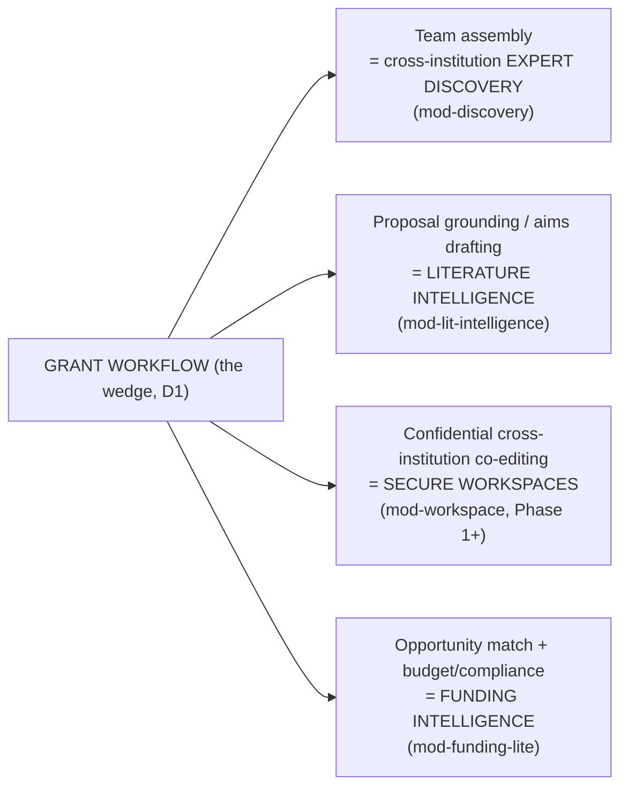
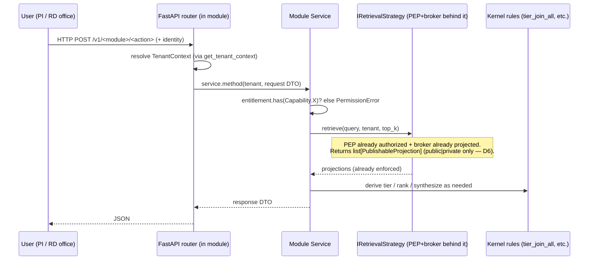
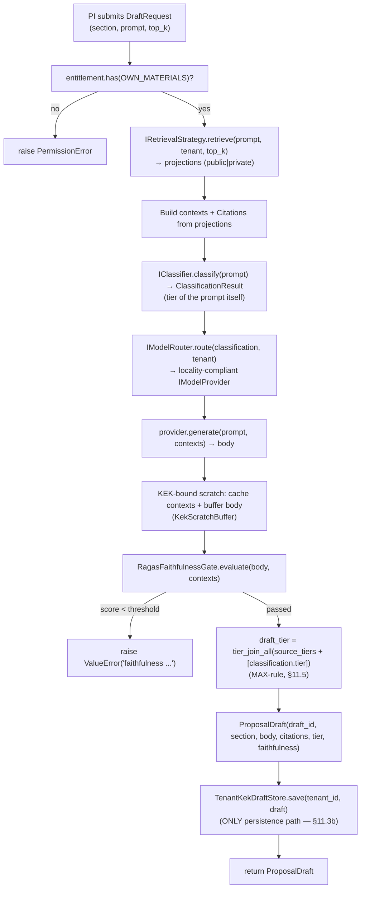
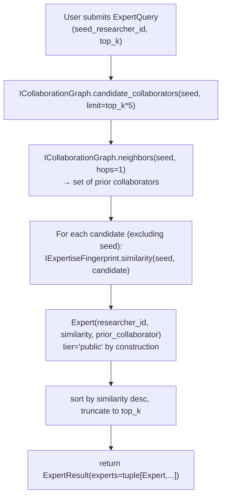
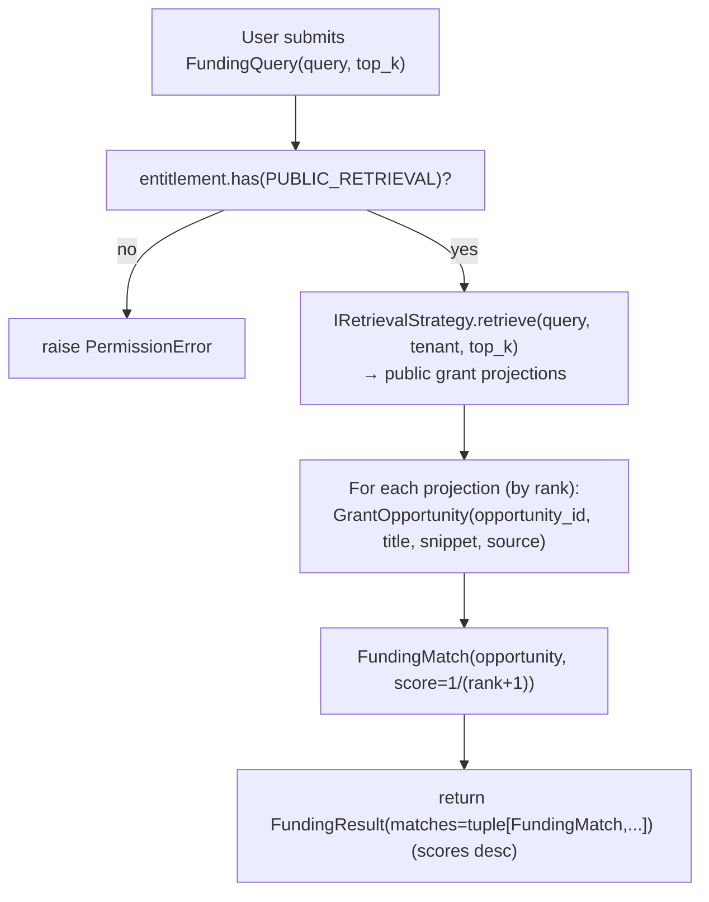
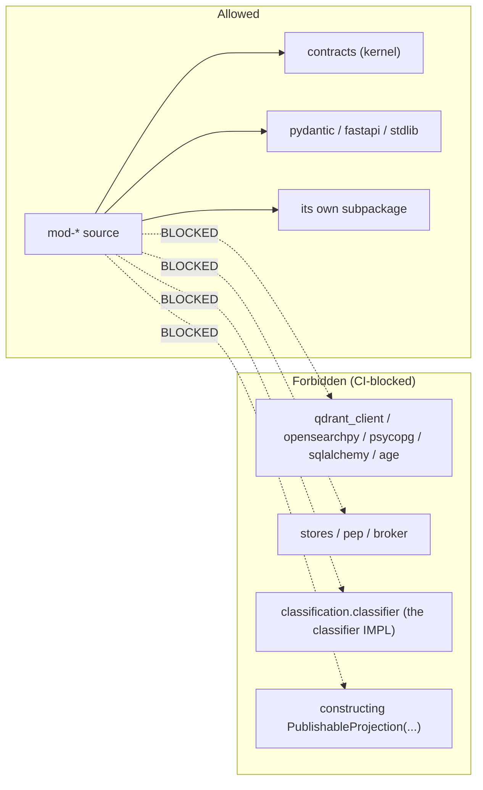

# LLD: Feature Modules (Lit-Intelligence, Discovery, Funding-lite)

## What this document is for

This is the **low-level design (LLD)** for the three Phase-0 *feature modules* of TigerExchange — the product the team is building first. You (the reader) are a local code-generation model with a small context window; this document is written so you can build these three modules **without needing any other document open at the same time**. Every term is defined inline the first time it appears, every file path is absolute under the project root `tigerexchange/`, every type and function signature is spelled out, and every non-trivial design choice states *why we chose it and what we rejected*. Where this document and the step-by-step task plan in `plans/phase0/0k-feature-modules.md` (referred to below as **"0k"**) overlap, **0k is the build script** (it has the failing tests, the exact commands, and the commit messages); this document is the **map and the reasoning** that explains what 0k is building and why. Read this first, then execute 0k task-by-task.

Two documents are **authoritative ground truth** and this LLD never contradicts them:
- `plans/00-decisions.md` — the locked founder/architecture decisions **D1–D7** (summarized in §0 below).
- `plans/phase0/00-kernel-contracts.md` — the canonical **kernel** package `contracts` (the shared types and interfaces every module imports verbatim). The kernel symbols this document references (`Tier`, `tier_join_all`, `ClassificationResult`, `Decision`, `PublishableProjection`, `TenantContext`, `Entitlement`, `Capability`, `IRetrievalStrategy`, `IModelRouter`, `IClassifier`, `IExpertiseFingerprint`, `ICollaborationGraph`) are defined there; **do not redefine them**.

---

## 0. Background you need before reading anything else (self-contained)

### 0.1 What TigerExchange is, in one paragraph

TigerExchange is a **federated, multi-university grant-intelligence platform**. Its first product (the "wedge", locked decision **D1**) is **grant intelligence**: helping research teams at different universities *assemble a competitive team for a federal grant* and *collaborate securely on the proposal*. The other capabilities are not separate products — they are the **decomposition of one grant workflow** (locked decision **D2**):



**This LLD covers the three boxes that ship in Phase 0:** `mod-lit-intelligence`, `mod-discovery`, and `mod-funding-lite`. The fourth box, `mod-workspace` (confidential cross-institution co-editing), is **Phase 1+ and out of scope here**.

### 0.2 The locked decisions D1–D7 (summary; full reasoning in `00-decisions.md`)

| ID | Decision | Why it matters to these three modules |
|---|---|---|
| **D1** | Wedge = **grant intelligence** (cross-institution team assembly + secure proposal collaboration). | The three modules are the Phase-0 slices of this one workflow. |
| **D2** | **Narrow-to-land scope, full modular architecture.** The other three wedges are the grant workflow's decomposition, not separate products. | Build full modular boundaries now, but only the three Phase-0 modules are active. |
| **D3** | Cold-start by anchoring on **one existing federally-funded multi-site center** that already has a Data Use Agreement (DUA). | Gives a real paying customer + N≥2 sites + a recurring grant need on day one. |
| **D4** | **Single Policy Enforcement Point (PEP) + data-access broker** chokepoint. Modules are "dumb" and pluggable behind it. | **Critical for these modules:** they never re-implement confidentiality; they consume already-enforced data. |
| **D5** | The **owning node is the sole local fail-closed authority** for confidential access/revocation. No global hot-path consensus. | Phase-0 modules operate on owner-local data only; no cross-node consensus exists yet. |
| **D6** | **Confidential content never enters the shared central index.** Classifier abstention → quarantine, default-deny. | The data a module retrieves (a `PublishableProjection`) can be `public` or `private` but **never `confidential`** — enforced by the kernel. |
| **D7** | Institutional ACV (annual contract value) ≥ 2–3× per-tenant COGS. Non-confidential workloads pooled; **dedicated isolation only for confidential**. | Drives why `mod-discovery`/`mod-funding-lite` (public-tier) need zero confidentiality machinery, while `mod-lit-intelligence`'s confidential drafts get dedicated KEK-bound storage. |

### 0.3 Vocabulary used throughout (define-once table)

| Term | Plain-English definition |
|---|---|
| **Kernel / `contracts`** | The frozen shared library at `tigerexchange/packages/contracts/`. Holds the common types (`Tier`, `TenantContext`, …) and the `I*` interface protocols. Modules import it verbatim and never modify it. |
| **Tier** | Sensitivity level of data. The kernel `Tier` enum is a 3-level lattice ordered `public < private < confidential`. |
| **MAX-rule** | When you combine inputs of different tiers, the result takes the **most restrictive (maximum)** tier. The kernel function `tier_join_all(tiers)` computes this; empty input fails closed to `confidential`. |
| **`TenantContext`** | The request-scoped identity of the institution (`tenant_id`) and the user (`subject_id`) plus their `Entitlement`. Frozen for the life of a request. |
| **`Entitlement` / `Capability`** | The resolved set of permissions a tenant has (e.g. `Capability.OWN_MATERIALS`, `Capability.PUBLIC_RETRIEVAL`). `tenant.entitlement.has(cap)` is the gate. |
| **PEP (Policy Enforcement Point)** | The single chokepoint (D4) that authorizes every retrieval/egress/derivation. Implemented elsewhere (sub-plan 0c). Modules never call raw stores; they receive data that has already passed the PEP. |
| **Data-access broker** | The only component holding raw-store credentials. It fetches from per-tenant stores and returns **projections** (see below). Behind the PEP. |
| **`PublishableProjection`** | The only data shape that crosses into shared/retrieval surfaces. Holds `public`/`private`-tier metadata + fields. The kernel **forbids `confidential`** on it (D6). Only the broker may construct it — modules never do. |
| **`IRetrievalStrategy`** | Kernel interface for hybrid retrieval (vector + BM25 + RRF fusion). Its `.retrieve(query, tenant, top_k)` returns a `list[PublishableProjection]` that is **already PEP-gated and already projected**. |
| **`IModelRouter` / `IModelProvider`** | Kernel interfaces. The router picks an LLM provider whose declared *locality* (where it runs) satisfies the data's tier — local/in-boundary for non-public, cloud for public. Fail-closed to the in-boundary model. |
| **`IClassifier`** | Kernel interface. `.classify(content, tenant)` returns a `ClassificationResult` (tier + `Decision`). Abstention → `QUARANTINE` (treated as confidential, excluded). |
| **KEK / DEK / crypto-shred** | KEK = Key-Encryption-Key (per tenant). DEK = Data-Encryption-Key (encrypts the actual bytes). **Crypto-shred** = delete the key so ciphertext becomes permanently undecryptable. This is how GDPR "right-to-erasure" is satisfied for confidential data. Provided by sub-plan 0g. |
| **RAGAS faithfulness** | A score in [0,1] measuring how well a generated answer is *grounded in* its retrieved source contexts (not hallucinated). Used as a release gate in `mod-lit-intelligence`. |
| **OpenAlex** | A free, public, open scholarly database of papers, authors, and citations. The public-tier data source for `mod-discovery`. |
| **Grants.gov / RePORTER / NSF** | Public US-government grant-opportunity / funded-award feeds. The public-tier data source for `mod-funding-lite`. |
| **DTO** | Data Transfer Object — a frozen Pydantic v2 model used as a request/response shape. |

### 0.4 Monorepo layout and the package these modules live in

```
tigerexchange/
├── pyproject.toml                       # workspace; holds import-linter contracts
├── packages/
│   ├── contracts/                       # the kernel (sub-plan: kernel-contracts) — DO NOT EDIT
│   ├── mod-lit-intelligence/            # THIS DOC
│   ├── mod-discovery/                   # THIS DOC
│   ├── mod-funding-lite/                # THIS DOC
│   └── mod-confidential-crypto/         # KEK stores + contract tests (sub-plan 0g)
└── services/
    └── api/                             # FastAPI app + api.dependencies DI factory (sub-plan 0a)
```

**Stack baseline (use these exact versions; they match the kernel's `pyproject.toml`):** Python **3.11+**, `pydantic>=2.6,<3`, `fastapi` (latest 0.11x), `pytest`, `ruff`, `mypy`, `import-linter` (CLI `lint-imports`). RAGAS scoring is injected via a protocol (you do not pip-install RAGAS into these packages in Phase 0; the scorer is provided by the DI factory). Methodology is **TDD** (test-driven development: write the failing test first, then the minimal code to pass it) — 0k gives you the exact failing tests.

**Why a separate installable package per module** (`packages/mod-*/`, each `src/`-layout, e.g. import root `mod_lit_intelligence`): we want each module to be an independent unit with its own dependency graph so `import-linter` can mechanically forbid forbidden imports (see §5). We considered a single shared `modules` namespace package and rejected it because a shared namespace makes it trivial for one module to reach into another's internals, defeating the "minimal blast radius" requirement of D2/D4.

---

## 1. The shared design contract: how every module plugs in behind the PEP

This is the single most important section. **All three modules obey the same plug-in contract**, which is the concrete form of D4 (single chokepoint).

### 1.1 The rule, stated three ways

1. **A module imports ONLY the kernel (`contracts`) + its own subpackage + stdlib/pydantic/fastapi.** It must **never** import: a raw store driver (`qdrant_client`, `opensearchpy`, `psycopg`, `sqlalchemy`, the Apache AGE `age` driver), the PEP/broker implementation packages (`pep`, `broker`, `stores`), or the classifier *implementation* (`classification.classifier`). Importing the kernel *result type* `ClassificationResult` is fine; importing the classifier *engine* is forbidden.
2. **A module never constructs a `PublishableProjection`.** Only the broker may. A module *receives* projections from `IRetrievalStrategy.retrieve(...)` and *reads* their fields.
3. **A module never decides a tenant's permissions.** It only *reads* the already-resolved `Entitlement` (`tenant.entitlement.has(cap)`) and raises `PermissionError` if the capability is missing. The PEP, not the module, evaluates editions → capabilities.

These three rules are enforced two ways (both in 0k Task 8): an **AST test** that parses every module source file and asserts no forbidden import/construction, **and** an `import-linter` contract in `tigerexchange/pyproject.toml`.

> **Risk this resolves (auditable):** "adding a new feature module becomes a confidentiality leak vector." Because a module *physically cannot* reach a raw store or build a projection, a buggy or malicious module cannot bypass enforcement. This is D4 made mechanical.

### 1.2 Where concrete dependencies come from (Dependency Injection)

Modules declare what they need as **kernel interface types** in their constructors (e.g. `retrieval: IRetrievalStrategy`). They never build those dependencies. The concrete adapters (broker-backed retrieval from 0c, model router from 0f, KEK stores from 0g, retrieval engines from 0i) are assembled by a **DI factory module `api.dependencies`** owned by sub-plan 0a, at `tigerexchange/services/api/src/api/dependencies.py`. It exposes `get_*` factory functions: `get_lit_intelligence()`, `get_discovery()`, `get_funding()`, `get_tenant_context()`, etc. The FastAPI app mounts the routers using these factories. **You do not write `api.dependencies`** — you import its `get_*` functions when mounting (0k Task 11).

### 1.3 The request lifecycle every module sees



The key insight: **by the time a module sees data, all confidentiality enforcement has already happened upstream.** The module's job is feature logic (rank, draft, match) on already-safe data — plus, for `mod-lit-intelligence` only, the *persistence of newly-generated confidential content* (covered in §2).

---

## 2. mod-lit-intelligence — grounded, cited proposal drafting + classification-enforced search

### 2.1 What it does (and why)

For a PI at the anchor center, this module provides **(a)** semantic + keyword search over *their own corpus* + *public scholarly data*, and **(b)** **grounded, cited drafting** of a proposal section (e.g. "Specific Aims"). "Grounded" means every claim is backed by retrieved source text; "cited" means each draft carries `Citation` objects pointing at the projections it was built from. We do this (vs. ungrounded free-generation) because grant reviewers reject unsupported claims and because hallucinated prior-art is a credibility and compliance hazard.

This is the **only** Phase-0 module that touches confidential data, and it does so in a tightly-scoped way: **Phase-0 scope = SINGLE-TENANT own-data only.** It persists the center's *own* confidential proposal drafts under the center's own KEK. Cross-institution sharing/exchange and cross-institution revocation are **Phase-1+** (the kernel seams exist but are not active here).

### 2.2 User-facing flow



### 2.3 Why the draft's tier comes from the MAX-rule (the subtle, must-get-right part)

A `PublishableProjection` can only be `public` or `private` (D6 — the kernel validator rejects `confidential`). So the *retrieved sources* are never themselves confidential. **But the draft can still be confidential**, because the *prompt itself* (a PI's preliminary aims, unpublished data) may be confidential. We therefore compute the draft's tier as:

```
draft_tier = tier_join_all([p.tier for p in projections] + [classification.tier])
```

i.e. the MAX over every grounding-source tier **and** the classifier's tier for the prompt. We include the classifier's tier in the list specifically so the join is never empty (empty input would fail closed to `confidential`, which is safe but over-restrictive). This is why **the draft store and the synthesizer scratch buffers must be tenant-KEK-bound even though no retrieved projection is confidential** — the *derived* draft can be, and per the MAX-rule (§11.5 of the plan) sensitivity sticks to the derivative.

> We considered storing drafts in the normal pooled store and tiering them lazily; rejected because a confidential draft in a pooled store violates D7 (confidential ⇒ dedicated isolation) and could not be crypto-shredded per-tenant (D6/GDPR).

### 2.4 The four internal components

| File (under `tigerexchange/packages/mod-lit-intelligence/src/mod_lit_intelligence/`) | Responsibility | Key signatures |
|---|---|---|
| `models.py` | Frozen DTOs. No persistence, no kernel-rule logic. | `SearchRequest(query:str, top_k:int=8 ge1 le50)`, `SearchHit(projection_id, title, snippet, tier:Tier, score:float)`, `Citation(source_id, snippet, projection_id)`, `DraftRequest(section, prompt, top_k:int=8)`, `ProposalDraft(draft_id, section, body, citations:tuple[Citation,...], tier:Tier, faithfulness:float ge0 le1)` |
| `draft_store.py` | Tenant-KEK-bound persistence for draft + autosave + version history. The **only** path that persists generated content. | `TenantKek` protocol (`ensure_dek/encrypt/decrypt/crypto_shred`); `IDraftStore` protocol (`save/load/autosave/version_history/decryptable_hits`); `TenantKekDraftStore(kek: TenantKek)` |
| `synthesizer_buffer.py` | KEK-bound ephemeral store for synthesizer intermediate buffers + the RAG cache of confidential grounding context. No plaintext at rest. | `KekScratchBuffer(kek: TenantKek)` with `put_intermediate/get_intermediate/put_rag_cache/get_rag_cache/decryptable_hits` |
| `faithfulness.py` | RAGAS faithfulness release gate. Fail-closed on empty contexts. | `FaithfulnessScorer` protocol (`score(answer, contexts)->float`); `FaithfulnessVerdict(score, threshold, passed)`; `RagasFaithfulnessGate(scorer, threshold=0.80)` with `.evaluate(answer, contexts)->FaithfulnessVerdict` |
| `service.py` | Orchestrates retrieve→route→synthesize→gate→MAX-rule-tier→KEK-persist. Imports ONLY the kernel + its own KEK stores. | `LitIntelligenceService(retrieval, router, classifier, gate, draft_store, scratch)` with `.search(tenant, SearchRequest)->list[SearchHit]`, `.draft(tenant, DraftRequest)->ProposalDraft`, `.load_draft(tenant, draft_id)->ProposalDraft` |
| `router.py` | FastAPI `APIRouter` for `/v1/lit/search` and `/v1/lit/draft`. | `build_lit_router(service, tenant_provider)->APIRouter` |

### 2.5 KEK-bound persistence: why and what crypto-shred guarantees

The KEK store keeps **only ciphertext at rest**, keyed by `tenant_id`. The only way to read a draft is via the tenant's live DEK. After `crypto_shred(tenant_id)` the DEK is gone and every stored entry is undecryptable — `decryptable_hits(tenant_id)` must return `0`. This store (plus the synthesizer buffer + RAG cache) is **registered into the post-crypto-shred zero-decryptable-hits contract test** owned by 0g at `tigerexchange/packages/mod-confidential-crypto/tests/test_post_shred_zero_hits.py` (0k Task 9 appends the case). That contract is the auditable proof that GDPR erasure (D6/§11.3b) actually reaches the highest-value confidential artifact (the generated draft).

Minimal shape of the store (full code + tests in 0k Tasks 2–3):

```python
class TenantKekDraftStore:
    def __init__(self, kek: TenantKek) -> None:
        self._kek = kek
        self._blobs: dict[str, dict[str, list[bytes]]] = {}  # tenant -> draft_id -> [ciphertext...]

    def save(self, tenant_id: str, draft: ProposalDraft) -> None:
        self._kek.ensure_dek(tenant_id)
        ct = self._kek.encrypt(tenant_id, draft.model_dump_json().encode("utf-8"))
        self._blobs.setdefault(tenant_id, {})[draft.draft_id] = [ct]

    def load(self, tenant_id: str, draft_id: str) -> ProposalDraft:
        versions = self._blobs.get(tenant_id, {}).get(draft_id)
        if not versions:
            raise KeyError(f"no draft {draft_id} for tenant {tenant_id}")
        pt = self._kek.decrypt(tenant_id, versions[-1])  # raises KeyError if shredded
        return ProposalDraft.model_validate_json(pt.decode("utf-8"))
```

### 2.6 The kernel interfaces this module consumes

| Interface | How `mod-lit-intelligence` uses it |
|---|---|
| `IRetrievalStrategy` | Both search and draft call `.retrieve(query, tenant, top_k)` to get already-PEP-gated projections. |
| `IClassifier` | `draft()` classifies the prompt to obtain its tier for the MAX-rule join. |
| `IModelRouter` (→ `IModelProvider`) | `draft()` routes to a locality-compliant provider, then calls `provider.generate(prompt, contexts)`. |
| `Tier` / `tier_join_all` | Derives the draft tier (MAX-rule). |
| `TenantContext` / `Capability` | `search` requires `PUBLIC_RETRIEVAL`; `draft`/`load_draft` require `OWN_MATERIALS`. |

### 2.7 API surface

| Method + path | Request DTO | Response DTO | Required capability |
|---|---|---|---|
| `POST /v1/lit/search` | `SearchRequest` | `list[SearchHit]` | `PUBLIC_RETRIEVAL` |
| `POST /v1/lit/draft` | `DraftRequest` | `ProposalDraft` | `OWN_MATERIALS` |

`build_lit_router(service, tenant_provider)` wires both endpoints; `tenant_provider` is a `Callable[[], TenantContext]` injected so tests can pass a fixed tenant and production passes the Keycloak/CILogon-backed identity dependency.

### 2.8 Performance budget

Deliverable: a grounded, cited draft at **p95 < 4 seconds** (asserted in 0k by running `draft()` 20× and checking the 95th-percentile latency). This is achievable in tests because retrieval, routing, and generation are injected fakes; in production the budget is met by local in-boundary inference plus the hybrid retriever's own SLOs.

---

## 3. mod-discovery — cross-institution PUBLIC-tier expert discovery over OpenAlex

### 3.1 What it does (and why it has ZERO confidentiality machinery)

This module answers "**who at other universities should be on my grant team?**" It ranks candidate collaborators by **expertise-fingerprint similarity** (how close their research vector is to a seed researcher's) and flags **prior collaborators** (people already in the seed's collaboration graph). All data is **public-tier OpenAlex** — published papers, authors, public citation/co-author edges. Because nothing it touches is confidential (public-tier by construction, §6.3 of the plan), **this module has no KEK, no PEP wiring, no classifier — nothing.** Its only dependencies are two kernel interfaces.

> Why no confidentiality machinery: D6 says confidential never enters the shared index; D7 says public workloads run pooled with no dedicated isolation. Expert discovery over OpenAlex is the canonical public-tier workload. Adding any KEK/PEP code here would be dead weight and would blur the chokepoint boundary. We considered routing discovery through the PEP "for uniformity" and rejected it — the PEP is for tier-bearing data; public OpenAlex carries no tier to enforce.

### 3.2 User-facing flow



### 3.3 Components

| File (under `tigerexchange/packages/mod-discovery/src/mod_discovery/`) | Responsibility | Key signatures |
|---|---|---|
| `models.py` | Frozen DTOs, public-tier only. | `ExpertQuery(seed_researcher_id:str, top_k:int=10 ge1 le100)`, `Expert(researcher_id, similarity:float, prior_collaborator:bool, tier:Literal["public"]="public")`, `ExpertResult(experts:tuple[Expert,...])` |
| `service.py` | Ranking logic. Consumes only the two kernel interfaces. | `DiscoveryService(fingerprint: IExpertiseFingerprint, graph: ICollaborationGraph)` with `.find_experts(query: ExpertQuery)->ExpertResult` |
| `router.py` | FastAPI router. No tenant credentials required (public). | `build_discovery_router(service)->APIRouter` |

### 3.4 Kernel interfaces consumed

| Interface | Use |
|---|---|
| `IExpertiseFingerprint` | `.similarity(a, b)->float` (SPECTER2-based research-vector similarity). |
| `ICollaborationGraph` | `.candidate_collaborators(researcher_id, limit)->list[str]` and `.neighbors(researcher_id, hops=1)->list[str]`. |

### 3.5 API surface

| Method + path | Request DTO | Response DTO | Auth |
|---|---|---|---|
| `POST /v1/discovery/experts` | `ExpertQuery` | `ExpertResult` | none (public-tier) |

### 3.6 How it "plugs in behind the PEP"

It does not go through the **confidential** enforcement path, because public data carries no tier to enforce — but it **does not bypass enforcement**, because it can only see public OpenAlex projections that the ingestion pipeline already classified as public (D6 guarantees confidential never reaches this surface). The PEP boundary is upstream of OpenAlex ingestion; by the time `mod-discovery` reads anything, it is provably public. **Public-tier clarification (do not over-read "all modules go through the PEP"):** `mod-discovery` *is* still subject to the **central-index read PEP** (sub-plan 0j) for discoverability **scope filtering only** — it consults that read PEP to decide *what is in scope to surface*, and never reaches the confidential enforcement path. So when a higher-level doc says "all modules go through the PEP," for `mod-discovery` that means the central-index read PEP for scope, not the confidential chokepoint.

---

## 4. mod-funding-lite — ranked grant-opportunity match

### 4.1 What it does

Given a free-text query (research area / aims summary), this module returns **ranked grant opportunities** from public feeds (**Grants.gov** open funding announcements, **NIH RePORTER** funded awards, **NSF**). It is "lite" because Phase-0 does *opportunity match only* — full team-assembly + budget intelligence is Phase 3. Like `mod-discovery`, the data is commodity public/CC0; **no KEK/PEP/classifier machinery.** It uses the kernel `IRetrievalStrategy` over **public-tier grant projections** produced by the ingestion pipeline.

### 4.2 User-facing flow



### 4.3 Components

| File (under `tigerexchange/packages/mod-funding-lite/src/mod_funding_lite/`) | Responsibility | Key signatures |
|---|---|---|
| `models.py` | Frozen DTOs, public grant opportunities only. | `FundingQuery(query:str, top_k:int=10 ge1 le100)`, `GrantOpportunity(opportunity_id, title, snippet, source:str)`, `FundingMatch(opportunity, score:float)`, `FundingResult(matches:tuple[FundingMatch,...])` |
| `service.py` | Ranking over public grant projections. | `FundingLiteService(retrieval: IRetrievalStrategy)` with `.match(tenant, query: FundingQuery)->FundingResult` |
| `router.py` | FastAPI router. | `build_funding_router(service, tenant_provider)->APIRouter` |

### 4.4 Kernel interfaces consumed

| Interface | Use |
|---|---|
| `IRetrievalStrategy` | `.retrieve(query, tenant, top_k)` over public grant projections. |
| `TenantContext` / `Capability` | `match()` requires `PUBLIC_RETRIEVAL`. |

### 4.5 API surface

| Method + path | Request DTO | Response DTO | Required capability |
|---|---|---|---|
| `POST /v1/funding/match` | `FundingQuery` | `FundingResult` | `PUBLIC_RETRIEVAL` |

### 4.6 Why it reuses `IRetrievalStrategy` rather than its own search

The grant feeds are just another corpus; the hybrid retriever (vector + BM25 + RRF) already exists behind `IRetrievalStrategy`. Reusing it keeps engine choice (Qdrant/OpenSearch) insulated from this module and means grant-match quality improves automatically when the shared retriever improves. We rejected a bespoke lexical matcher inside this module because it would duplicate ranking logic and break the "modules consume kernel interfaces only" rule.

---

## 5. The plug-in boundary, enforced (applies to all three modules)

### 5.1 Forbidden imports / forbidden construction



Enforced by **both** (0k Task 8):
1. An **AST test** (`packages/mod-lit-intelligence/tests/test_module_import_boundaries.py`) that walks every `packages/mod-*/src/mod_*/**.py` file and asserts none import the forbidden prefixes and none construct `PublishableProjection`.
2. An **import-linter** `forbidden` contract appended to `tigerexchange/pyproject.toml`:

```toml
[[tool.importlinter.contracts]]
name = "feature-modules-consume-only-kernel-and-broker"
type = "forbidden"
source_modules = ["mod_lit_intelligence", "mod_discovery", "mod_funding_lite"]
forbidden_modules = [
    "qdrant_client", "opensearchpy", "psycopg", "sqlalchemy",
    "stores", "pep", "broker", "classification.classifier",
]
```

> Note the precision: `classification.classifier` (the engine) is forbidden, but importing `ClassificationResult`/`Decision` from the kernel `contracts` package is allowed. The `FakeKek`/`Fake*` test doubles live in `tests/` only — never in `src/`.

### 5.2 Mounting on the FastAPI app

The three routers are mounted in `tigerexchange/services/api/src/api/app.py` (owned by 0a), using the 0a-owned DI factories — the module code does not assemble its own adapters:

```python
from api.dependencies import (  # owned by 0a; concrete adapters from 0c/0f/0g/0i
    get_discovery, get_funding, get_lit_intelligence, get_tenant_context,
)
from mod_discovery.router import build_discovery_router
from mod_funding_lite.router import build_funding_router
from mod_lit_intelligence.router import build_lit_router

app.include_router(build_lit_router(get_lit_intelligence(), get_tenant_context))
app.include_router(build_discovery_router(get_discovery()))
app.include_router(build_funding_router(get_funding(), get_tenant_context))
```

---

## 6. Build order (mirror of 0k) and dependencies

This module set **depends on** these sub-plans being built first: `0c-pep-broker-chokepoint` (PEP + broker behind `IRetrievalStrategy`), `0f-model-router` (`IModelRouter`), `0g-confidential-kek-stores` (KEK envelope + the zero-decryptable-hits contract suite), `0h-ingestion-pipelines` (produces the public + private projections), `0i-retrieval-eval` (the concrete retriever + RAGAS judge). The kernel `contracts` package must already exist.

| 0k Task | Builds | Lands in |
|---|---|---|
| 1 | `mod-lit-intelligence` DTOs | `models.py` |
| 2 | Tenant-KEK draft store | `draft_store.py` |
| 3 | KEK synthesizer buffer + RAG cache | `synthesizer_buffer.py` |
| 4 | RAGAS faithfulness gate | `faithfulness.py` |
| 5 | `LitIntelligenceService` orchestration | `service.py` |
| 6 | `mod-discovery` (DTOs + service) | `mod_discovery/` |
| 7 | `mod-funding-lite` (DTOs + service) | `mod_funding_lite/` |
| 8 | Import-boundary enforcement | AST test + `pyproject.toml` |
| 9 | Add draft+history to post-shred zero-hits contract | `mod-confidential-crypto/tests/` |
| 10 | FastAPI routers (all three) | `router.py` × 3 |
| 11 | Mount routers on the app | `services/api/src/api/app.py` |
| 12 | Full suite green + ruff/mypy/import-linter | — |

**Execute task-by-task with TDD: each 0k task gives you (1) the failing test, (2) the exact `pytest` command + expected failure, (3) the minimal implementation, (4) the passing command, (5) the commit message. Do not skip ahead; do not add scope.**

---

## 7. Load-bearing constraints (do not violate; auditable)

- **Kernel signatures are verbatim.** `Tier`, `tier_join_all`, `ClassificationResult`, `Decision`, `PublishableProjection`, `TenantContext`, `Entitlement`, `Capability`, `IRetrievalStrategy`, `IModelRouter`, `IClassifier`, `IExpertiseFingerprint`, `ICollaborationGraph` come from `contracts` exactly as defined in `00-kernel-contracts.md`. **Do not redefine them.**
- **D6 boundary:** `PublishableProjection.tier` can only be `public` or `private` (the kernel validator rejects `confidential`). Retrieved grounding projections therefore never carry `confidential`; the **draft's** confidential tier is derived by the MAX-rule join of source tiers with the prompt's classifier tier (§11.5). That is why the draft store and synthesizer buffers must be tenant-KEK-bound even though no retrieved projection is itself confidential.
- **MAX-rule is the kernel join.** `tier_join_all([...])` with empty input fails closed to `confidential`; `LitIntelligenceService.draft()` always includes at least the classifier's tier so the join is non-empty.
- **No raw store / classifier-impl / projection-constructor imports** in any `packages/mod-*/src/**` file — enforced by the AST test *and* the import-linter contract (forbidden `classification.classifier`).
- **`mod-discovery` and `mod-funding-lite` have ZERO confidentiality machinery** — no KEK, no PEP, no classifier. If you find yourself importing a KEK or classifier into either, you are wrong; only `mod-lit-intelligence` touches confidential persistence.
- **Phase-0 scope = single-tenant own-data only** for `mod-lit-intelligence` persistence. Cross-institution sharing/exchange and cross-institution revocation are Phase-1+ (kernel seams stubbed, not active).

**For the full code and the exact test/command/commit sequence, follow `plans/phase0/0k-feature-modules.md` task-by-task.**
