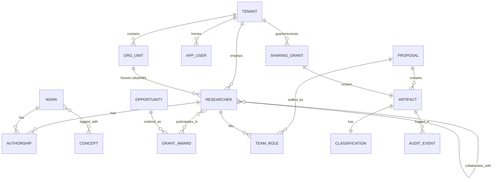
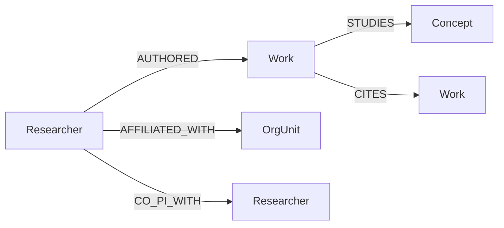
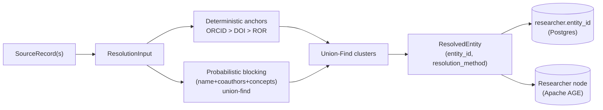
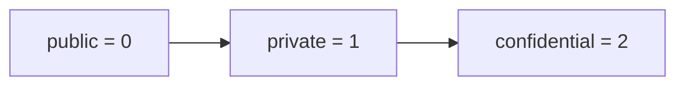

# Data Model & Schemas (Reference)

## What this document is for

This is the **single reference for every persistent data shape in TigerExchange Phase-0**: the relational core (Postgres tables + Row-Level-Security policies), the property graph (Apache AGE node/edge labels), the search engines (Qdrant vector collection + OpenSearch BM25 index), and the JSON document schemas (research cards, grant opportunities). It tells a code-generation model **exactly which fields exist, in which store, with which types, and why each one is there**. TigerExchange is a federated grant-intelligence platform: it crawls public scholarly + grant corpora, distills them into structured cards, indexes them for hybrid retrieval, and (in later phases) hosts confidential cross-institution proposal workspaces. Phase-0 builds only the public-tier ingestion + retrieval skeleton plus the confidential-tier *storage* primitives (encryption, isolation) that later phases switch on. Two ideas dominate every schema below and you must never drop them: **(1) `tenant_id` partitions all data by owning institution and is enforced by Postgres RLS**, and **(2) every record carries a sensitivity `tier` + sticky `compliance_flags`** so the policy engine can decide, at every read, whether a row may be served. Read this doc top-to-bottom before writing any migration, any Qdrant/OpenSearch call, or any Pydantic model.

> Project root is `tigerexchange/`. Monorepo layout: libraries live under `tigerexchange/packages/` (the `contracts` kernel + `mod-*` feature modules + evicted services); the FastAPI app lives at `tigerexchange/services/api/`. Stack: Python 3.11+ (kernel `pyproject.toml` pins `requires-python = ">=3.11"`), Pydantic v2, FastAPI, SQLAlchemy 2 (async, asyncpg), Postgres 16 with Apache AGE, Qdrant, OpenSearch. Test/lint: pytest, ruff, mypy. Methodology: TDD (write the failing test first).

---

## 0. Reading map (what is authoritative vs synthesized)

This matters because a weaker model must not treat a guess as a locked contract.

| Section | Status | Source |
|---|---|---|
| §1 ERD | **Authoritative** (matches plan §6.1) | `final-plan-v2.md` §6.1 |
| §2 Postgres DDL + RLS | **Authoritative pattern**, table set synthesized to match §6.1 entities | foundation `001_tenant_rls.sql`, ingestion outbox DDL (§7.7 footgun rules) |
| §3 Apache AGE graph | **Synthesized** from §6.1 entities + §9.2 graph-backbone description; edge label set is fixed by this doc | plan §9.2, §6.1 |
| §4 Qdrant + OpenSearch | **Synthesized** from §9.1 retrieval stack + §8.4 embeddings; field names align to §6.1 | plan §9.1, §8.4 |
| §5 JSON schemas | **Authoritative** for `ResearchCard` (matches ingestion `records.py`); grant-opportunity schema synthesized from §6.2 feeds | ingestion `records.py`, plan §6.2 |
| §6 Entity resolution model | **Authoritative** (matches ingestion `identity_resolution`) | ingestion Task 5, plan §6.3 |
| §7 tier / compliance columns | **Authoritative** (kernel `lattice.py`, plan §6.1) | `00-kernel-contracts.md`, plan §6.1/§11 |

Where a shape is **synthesized**, it is internally consistent with the authoritative kernel and is the contract you should build to; it is flagged so a later audit knows it was derived, not lifted verbatim.

---

## 1. Entity-Relationship Diagram (core entities)

This is the conceptual model. It is the *same* entity set as plan §6.1; the concrete stores in later sections each materialize a slice of it (Postgres holds the authoritative rows, AGE holds the traversable graph, Qdrant/OpenSearch hold retrieval-optimized derivatives).



| Entity | Plain-English meaning | Tier (typical) | Store(s) |
|---|---|---|---|
| **TENANT** (Institution) | One owning institution / node. The RLS partition key. | n/a (control) | Postgres |
| **ORG_UNIT** | A department or lab inside a tenant. | public | Postgres, AGE |
| **APP_USER** | An authenticated human (OIDC subject). Distinct from RESEARCHER (a scholarly identity). | private | Postgres |
| **RESEARCHER** | A disambiguated scholarly identity (may span institutions; ORCID-anchored). | public | Postgres, AGE, Qdrant |
| **WORK** (Paper) | A publication/preprint from OpenAlex/Crossref. | public | Postgres, AGE, Qdrant, OpenSearch |
| **CONCEPT** (Topic) | A research topic/field tag. | public | Postgres, AGE |
| **OPPORTUNITY** (Grant/Funding opp) | A funding opportunity (Grants.gov/RePORTER/NSF). | public | Postgres, OpenSearch |
| **GRANT_AWARD** | A realized award linking researchers to an opportunity. | public | Postgres, AGE |
| **PROPOSAL** (Workspace) | The confidential proposal workspace (the wedge artifact). **Phase-1+ content**; Phase-0 only provisions its encrypted storage. | confidential | Postgres (encrypted derivatives) |
| **ARTIFACT** | Any addressable content item (a work, a card, a proposal section). Carries the CLASSIFICATION. | varies | Postgres |
| **CLASSIFICATION** | `{tier, codes, compliance_flags, lattice_version}` on an artifact (§7). | n/a | embedded columns |
| **SHARING_GRANT** | A revocable, scope-bounded cross-institution access grant. **Phase-1+ behavior**; Phase-0 only models its row. | n/a (control) | Postgres |
| **TEAM_ROLE** | A researcher's role on a proposal (PI/co-PI/staff). | confidential | Postgres |
| **AUDIT_EVENT** | A per-stream hash-chained audit record (kernel `AuditEvent`). | n/a (control) | Postgres |

**Why APP_USER and RESEARCHER are separate** (we considered merging them, rejected it): a human logs in once (one `APP_USER`) but may map to a scholarly identity resolved across institutions (`RESEARCHER`), and many `RESEARCHER` rows have **no** logged-in human at all (they come from the public OpenAlex crawl). Merging would force a fake user row for every crawled author and break the public/private tier split.

---

## 2. Postgres core tables + Row-Level Security (RLS)

### 2.1 The RLS pattern (every tenant-scoped table uses it verbatim)

RLS is Postgres's per-row access filter. We use it as the **defense-in-depth** tenant boundary (the *primary* boundary is the object-level authorization check at the PEP, plan §7.7). Every tenant-scoped table closes the four known RLS footguns. **Do X because Y, rejected Z because W:**

| Clause | We use | Because | Rejected alternative + why |
|---|---|---|---|
| `FORCE ROW LEVEL SECURITY` | always | the table **owner/superuser** otherwise bypasses RLS silently | plain `ENABLE` only — owner bypass is a latent cross-tenant leak |
| `AS RESTRICTIVE` | always | RESTRICTIVE policies are **AND-combined**, so adding a policy can only *narrow* access | `PERMISSIVE` (OR-combined) — a later added policy could *widen* access |
| `WITH CHECK (...)` | always | blocks cross-tenant **INSERT/UPDATE** (writing a row stamped with another tenant) | `USING` only — filters reads but lets you forge a foreign-tenant write |
| `tenant_id` leading index column | always | makes the tenant predicate **index-driven** (no full-scan timing side-channel) | non-leading / no index — full scan leaks row counts via timing |
| `SET LOCAL app.tenant_id` (txn-scoped) | always | a **PgBouncer transaction-pooled** connection cannot leak tenant context to the next borrower | session `SET` — persists on the pooled connection → next tenant inherits it |

The tenant context variable is read inside every policy as `current_setting('app.tenant_id', true)`. The `true` second argument means "return NULL if unset" rather than erroring — and because a NULL never equals any `tenant_id`, an **unset context fails closed (zero rows)**, which is the safe default.

`SECURITY DEFINER` functions and materialized views over tenant-scoped tables are **forbidden** (they execute as the definer and re-introduce owner-bypass). A CI lint (`check_rls_bypass.py`) scans migrations and fails the build if it finds either.

### 2.2 Canonical migration (foundation `own_materials` — the reference shape)

This is the exact shape from `tigerexchange/services/api/migrations/001_tenant_rls.sql`. **Copy this pattern for every new tenant-scoped table.**

```sql
-- tigerexchange/services/api/migrations/001_tenant_rls.sql
CREATE TABLE own_materials (
    id        BIGINT PRIMARY KEY,
    tenant_id TEXT   NOT NULL,
    title     TEXT   NOT NULL
);

-- tenant_id as the LEADING index column (§7.7): index-driven predicate.
CREATE INDEX own_materials_tenant_id_idx ON own_materials (tenant_id, id);

ALTER TABLE own_materials ENABLE ROW LEVEL SECURITY;
ALTER TABLE own_materials FORCE  ROW LEVEL SECURITY;   -- owner/superuser cannot bypass

CREATE POLICY own_materials_tenant_isolation ON own_materials
    AS RESTRICTIVE
    FOR ALL
    USING      (tenant_id = current_setting('app.tenant_id', true))
    WITH CHECK (tenant_id = current_setting('app.tenant_id', true));
```

### 2.3 Core domain tables (Phase-0)

These materialize the §1 entities. File: `tigerexchange/services/api/migrations/010_core_entities.sql`. Every table repeats the §2.1 pattern; only `researcher` and `work` are shown with full policy blocks (apply the **identical** RLS block to all the others — abbreviated as `-- + standard RLS block` to fit context, but you MUST write it out in real migrations).

The two sensitivity columns appear on **every** content-bearing table (`tier`, `compliance_flags`); §7 explains why they are not optional.

```sql
-- tigerexchange/services/api/migrations/010_core_entities.sql

-- Sensitivity columns are a reusable shape. Postgres has no struct type, so we
-- inline the four classification fields on every content table (see §7).
--   tier            : 'public' | 'private' | 'confidential'  (kernel Tier.wire)
--   compliance_flags: TEXT[]   of FERPA|IRB|ITAR|EAR|GDPR-personal (sticky UNION)
--   lattice_version : INT      the lattice version this row was classified under
--   class_codes     : TEXT[]   extensible per-feature codes mapping onto the lattice

------------------------------------------------------------------- INSTITUTION
CREATE TABLE institution (
    tenant_id  TEXT PRIMARY KEY,            -- this IS the RLS partition value
    ror_id     TEXT,                        -- ROR institution id (CC0)
    name       TEXT NOT NULL,
    consortium_ids TEXT[] NOT NULL DEFAULT '{}'   -- consortium membership (§4.7 scope)
);
-- institution is the control row; it is read cross-tenant by the control plane
-- only, so it is NOT RLS-FORCED here (the API never serves it to tenant users).

--------------------------------------------------------------------- ORG_UNIT
CREATE TABLE org_unit (
    id         BIGINT PRIMARY KEY,
    tenant_id  TEXT NOT NULL,
    kind       TEXT NOT NULL CHECK (kind IN ('department','lab')),
    name       TEXT NOT NULL,
    parent_id  BIGINT REFERENCES org_unit(id),
    tier       TEXT NOT NULL DEFAULT 'public',
    compliance_flags TEXT[] NOT NULL DEFAULT '{}',
    lattice_version  INT  NOT NULL DEFAULT 1,
    class_codes      TEXT[] NOT NULL DEFAULT '{}'
);
CREATE INDEX org_unit_tenant_idx ON org_unit (tenant_id, id);
-- + standard RLS block (ENABLE+FORCE, RESTRICTIVE FOR ALL, USING+WITH CHECK on tenant_id)

------------------------------------------------------------------- RESEARCHER
CREATE TABLE researcher (
    id            BIGINT PRIMARY KEY,
    tenant_id     TEXT NOT NULL,
    org_unit_id   BIGINT REFERENCES org_unit(id),
    orcid         TEXT,                       -- deterministic anchor (nullable)
    canonical_name TEXT NOT NULL,
    entity_id     TEXT NOT NULL,              -- resolution cluster id (§6)
    tier          TEXT NOT NULL DEFAULT 'public',
    compliance_flags TEXT[] NOT NULL DEFAULT '{}',
    lattice_version  INT  NOT NULL DEFAULT 1,
    class_codes      TEXT[] NOT NULL DEFAULT '{}'
);
CREATE INDEX researcher_tenant_idx ON researcher (tenant_id, id);
CREATE INDEX researcher_orcid_idx  ON researcher (orcid);   -- correlation, not auth
ALTER TABLE researcher ENABLE ROW LEVEL SECURITY;
ALTER TABLE researcher FORCE  ROW LEVEL SECURITY;
CREATE POLICY researcher_tenant_isolation ON researcher
    AS RESTRICTIVE FOR ALL
    USING      (tenant_id = current_setting('app.tenant_id', true))
    WITH CHECK (tenant_id = current_setting('app.tenant_id', true));

------------------------------------------------------------------------- WORK
CREATE TABLE work (
    id            BIGINT PRIMARY KEY,
    tenant_id     TEXT NOT NULL,
    doi           TEXT,                        -- deterministic anchor (nullable)
    openalex_id   TEXT,
    title         TEXT NOT NULL,
    abstract      TEXT NOT NULL DEFAULT '',
    pub_year      INT,
    tier          TEXT NOT NULL DEFAULT 'public',
    compliance_flags TEXT[] NOT NULL DEFAULT '{}',
    lattice_version  INT  NOT NULL DEFAULT 1,
    class_codes      TEXT[] NOT NULL DEFAULT '{}'
);
CREATE INDEX work_tenant_idx ON work (tenant_id, id);
CREATE INDEX work_doi_idx     ON work (doi);
ALTER TABLE work ENABLE ROW LEVEL SECURITY;
ALTER TABLE work FORCE  ROW LEVEL SECURITY;
CREATE POLICY work_tenant_isolation ON work
    AS RESTRICTIVE FOR ALL
    USING      (tenant_id = current_setting('app.tenant_id', true))
    WITH CHECK (tenant_id = current_setting('app.tenant_id', true));

------------------------------------------------------------------- AUTHORSHIP
-- Join table: which researcher authored which work, in which position.
CREATE TABLE authorship (
    id           BIGINT PRIMARY KEY,
    tenant_id    TEXT NOT NULL,
    researcher_id BIGINT NOT NULL REFERENCES researcher(id),
    work_id      BIGINT NOT NULL REFERENCES work(id),
    author_position INT
);
CREATE INDEX authorship_tenant_idx ON authorship (tenant_id, work_id);
-- + standard RLS block

---------------------------------------------------------------------- CONCEPT
CREATE TABLE concept (
    id        BIGINT PRIMARY KEY,
    tenant_id TEXT NOT NULL,
    label     TEXT NOT NULL,
    tier      TEXT NOT NULL DEFAULT 'public'
);
CREATE INDEX concept_tenant_idx ON concept (tenant_id, id);
-- + standard RLS block

CREATE TABLE work_concept (                    -- WORK }o--o{ CONCEPT
    tenant_id  TEXT  NOT NULL,
    work_id    BIGINT NOT NULL REFERENCES work(id),
    concept_id BIGINT NOT NULL REFERENCES concept(id),
    PRIMARY KEY (work_id, concept_id)
);
-- + standard RLS block

------------------------------------------------------------------ OPPORTUNITY
CREATE TABLE opportunity (
    id            BIGINT PRIMARY KEY,
    tenant_id     TEXT NOT NULL,
    source        TEXT NOT NULL CHECK (source IN ('grants_gov','reporter','nsf')),
    external_id   TEXT NOT NULL,               -- OpportunityID / appl_id / award id
    title         TEXT NOT NULL,
    agency        TEXT,
    deadline      DATE,
    tier          TEXT NOT NULL DEFAULT 'public',
    compliance_flags TEXT[] NOT NULL DEFAULT '{}',
    lattice_version  INT  NOT NULL DEFAULT 1,
    class_codes      TEXT[] NOT NULL DEFAULT '{}'
);
CREATE UNIQUE INDEX opportunity_src_ext_idx ON opportunity (source, external_id);
CREATE INDEX opportunity_tenant_idx ON opportunity (tenant_id, id);
-- + standard RLS block

------------------------------------------------------------------ GRANT_AWARD
CREATE TABLE grant_award (
    id            BIGINT PRIMARY KEY,
    tenant_id     TEXT NOT NULL,
    opportunity_id BIGINT REFERENCES opportunity(id),
    award_number  TEXT,
    tier          TEXT NOT NULL DEFAULT 'public'
);
CREATE INDEX grant_award_tenant_idx ON grant_award (tenant_id, id);
-- + standard RLS block

CREATE TABLE award_participation (             -- RESEARCHER }o--o{ GRANT_AWARD
    tenant_id     TEXT NOT NULL,
    grant_award_id BIGINT NOT NULL REFERENCES grant_award(id),
    researcher_id  BIGINT NOT NULL REFERENCES researcher(id),
    role          TEXT NOT NULL DEFAULT 'investigator',
    PRIMARY KEY (grant_award_id, researcher_id)
);
-- + standard RLS block
```

### 2.4 Control / confidential tables (Phase-0 models the rows; behavior is Phase-1+)

```sql
-- tigerexchange/services/api/migrations/020_workspace_sharing_audit.sql

---------------------------------------------------------------------- PROPOSAL
-- The confidential proposal workspace. Phase-0 provisions the row + encrypted
-- derivative storage (see 0g KEK doc); confidential CONTENT is Phase-1+.
CREATE TABLE proposal (
    id            BIGINT PRIMARY KEY,
    tenant_id     TEXT NOT NULL,               -- owning institution = sole authority (D5)
    opportunity_id BIGINT REFERENCES opportunity(id),
    title         TEXT NOT NULL,
    tier          TEXT NOT NULL DEFAULT 'confidential',  -- almost always confidential
    compliance_flags TEXT[] NOT NULL DEFAULT '{}',
    lattice_version  INT  NOT NULL DEFAULT 1,
    class_codes      TEXT[] NOT NULL DEFAULT '{}'
);
CREATE INDEX proposal_tenant_idx ON proposal (tenant_id, id);
-- + standard RLS block

--------------------------------------------------------------------- TEAM_ROLE
CREATE TABLE team_role (
    id           BIGINT PRIMARY KEY,
    tenant_id    TEXT NOT NULL,
    proposal_id  BIGINT NOT NULL REFERENCES proposal(id),
    researcher_id BIGINT NOT NULL REFERENCES researcher(id),
    role         TEXT NOT NULL CHECK (role IN ('PI','co-PI','staff','consultant')),
    tier         TEXT NOT NULL DEFAULT 'confidential'
);
CREATE INDEX team_role_tenant_idx ON team_role (tenant_id, proposal_id);
-- + standard RLS block

----------------------------------------------------------------- SHARING_GRANT
-- A revocable, scope-bounded cross-institution access grant (§4.3). The OWNER
-- node re-derives scope/tier/caveats from THIS row and ignores any token claim.
-- Phase-0: row exists; cross-institution issuance is Phase-1+.
CREATE TABLE sharing_grant (
    grant_id        TEXT PRIMARY KEY,
    grantor_tenant_id TEXT NOT NULL,           -- owner (authority)
    grantee_tenant_id TEXT NOT NULL,
    artifact_id     TEXT NOT NULL,             -- what is shared
    scope           TEXT NOT NULL,             -- scope token (owner-re-derived)
    tier            TEXT NOT NULL,
    -- Caveats (kernel Caveats), re-evaluated at grantee-side access (§7.3):
    transfer_legality   BOOLEAN,
    export_attestation  TEXT,
    ferpa_role          TEXT,
    lattice_version  INT  NOT NULL DEFAULT 1,
    revocation_epoch BIGINT NOT NULL DEFAULT 0  -- per-CELL fenced counter (§4.4a)
);
CREATE INDEX sharing_grant_grantor_idx ON sharing_grant (grantor_tenant_id, grant_id);

------------------------------------------------------------------- AUDIT_EVENT
-- Per-stream hash-chained audit (kernel AuditEvent, §4.1). stream_id partitions
-- the chain (one chain per cell/tenant). entry_hash = H(prev_hash || payload).
CREATE TABLE audit_event (
    event_id    TEXT PRIMARY KEY,
    stream_id   TEXT NOT NULL,
    sequence    BIGINT NOT NULL CHECK (sequence >= 0),
    event_type  TEXT NOT NULL,                 -- pep-decision|classification|revocation|egress|grant-issued|brokered-access
    occurred_at TIMESTAMPTZ NOT NULL,
    tenant_id   TEXT NOT NULL,
    subject_id  TEXT,
    resource_id TEXT,
    decision    TEXT,                          -- ALLOW|DENY|QUARANTINE (nullable)
    reason      TEXT NOT NULL DEFAULT '',
    prev_hash   TEXT,                           -- NULL only for the genesis entry
    entry_hash  TEXT NOT NULL,
    detail      JSONB NOT NULL DEFAULT '{}'::jsonb,
    UNIQUE (stream_id, sequence)               -- monotonic per-stream ordering
);
CREATE INDEX audit_event_stream_idx ON audit_event (stream_id, sequence);
```

### 2.5 Transactional outbox (ingestion → central index)

The outbox is how a committed index write is *reliably* propagated to the central index. It is written **in the same transaction** as the producing change, then a Dagster sensor drains it. The DDL is fixed by the ingestion plan (`mod_ingestion/outbox.py:OUTBOX_DDL`). Two **distinct, non-interchangeable** version fields ride every row — keeping them separate resolves the "overloaded epoch" risk (see §5.4):

```sql
CREATE TABLE IF NOT EXISTS outbox_event (
    event_id           TEXT PRIMARY KEY,
    tenant_id          TEXT NOT NULL,
    kind               TEXT NOT NULL CHECK (kind IN ('index','grant','tombstone')),
    record_id          TEXT NOT NULL,
    projection_version BIGINT NOT NULL,   -- per-(tenant,record) monotonic; lower-version-reject
    revocation_epoch   BIGINT NOT NULL,   -- per-CELL fenced; versions the tombstone SET
    payload            JSONB NOT NULL DEFAULT '{}'::jsonb,
    delivered          BOOLEAN NOT NULL DEFAULT FALSE,
    created_at         TIMESTAMPTZ NOT NULL DEFAULT now()
);
CREATE INDEX IF NOT EXISTS ix_outbox_tenant ON outbox_event (tenant_id, delivered, created_at);
ALTER TABLE outbox_event ENABLE ROW LEVEL SECURITY;
ALTER TABLE outbox_event FORCE  ROW LEVEL SECURITY;
CREATE POLICY outbox_tenant_isolation ON outbox_event
    AS RESTRICTIVE
    USING      (tenant_id = current_setting('app.tenant_id', true))
    WITH CHECK (tenant_id = current_setting('app.tenant_id', true));
```

---

## 3. Apache AGE graph model

> **Synthesized** (§0). The plan (§9.2) specifies a "deterministic metadata-backbone graph (authors/papers/citations/affiliations/venues/grants/topics)" behind the kernel `IGraphStore` (AGE primary, Neo4j/Memgraph fallback via a conformance suite). The plan does **not** print AGE DDL or fix the edge label strings; this section fixes them so the builder has one contract. The five required edge labels are **AUTHORED, AFFILIATED_WITH, CO_PI_WITH, STUDIES, CITES**.

Apache AGE is a Postgres extension that adds an openCypher property graph **inside** the same Postgres instance. We use it (rather than a separate Neo4j) because it co-locates the graph with the relational tenant data and the same Postgres HA covers both. The graph holds only **public-tier** backbone facts (plan §6.3: the disambiguation/collaboration graph is public-tier by construction; confidential records are resolved inside the cell and never enter the graph).

### 3.1 Node and edge labels



| Label | Kind | From → To | Carries | Why it exists |
|---|---|---|---|---|
| `Researcher` | node | — | `entity_id, orcid, canonical_name, tenant_id` | the team-assembly subject |
| `Work` | node | — | `work_id, doi, title, pub_year, tenant_id` | the publication node |
| `Concept` | node | — | `concept_id, label` | topic for expertise matching |
| `OrgUnit` | node | — | `org_unit_id, kind, name, tenant_id` | dept/lab for affiliation |
| `AUTHORED` | edge | Researcher → Work | `author_position` | authorship backbone |
| `AFFILIATED_WITH` | edge | Researcher → OrgUnit | `start_year, end_year` | affiliation-over-time (entity-res signal) |
| `CO_PI_WITH` | edge | Researcher → Researcher | `award_number` | collaboration / team-assembly priors |
| `STUDIES` | edge | Work → Concept | `score` | topic tagging for expertise fingerprints |
| `CITES` | edge | Work → Work | — | citation graph (PPR / multi-hop, §9.2) |

`tenant_id` is stored as a node property (AGE has no per-row RLS), so every Cypher query the graph store issues **MUST** include a `tenant_id` predicate; the `IGraphStore` adapter injects it. This is why graph reads go through the broker, not raw Cypher.

### 3.2 AGE setup + DDL

```sql
-- tigerexchange/services/api/migrations/030_age_graph.sql
CREATE EXTENSION IF NOT EXISTS age;
LOAD 'age';
SET search_path = ag_catalog, "$user", public;

SELECT create_graph('tigerexchange');

-- Node labels
SELECT create_vlabel('tigerexchange', 'Researcher');
SELECT create_vlabel('tigerexchange', 'Work');
SELECT create_vlabel('tigerexchange', 'Concept');
SELECT create_vlabel('tigerexchange', 'OrgUnit');

-- Edge labels (the five required relationships)
SELECT create_elabel('tigerexchange', 'AUTHORED');
SELECT create_elabel('tigerexchange', 'AFFILIATED_WITH');
SELECT create_elabel('tigerexchange', 'CO_PI_WITH');
SELECT create_elabel('tigerexchange', 'STUDIES');
SELECT create_elabel('tigerexchange', 'CITES');
```

### 3.3 Example writes / reads (always tenant-scoped)

```sql
-- Upsert a researcher node (tenant_id is a mandatory property).
SELECT * FROM cypher('tigerexchange', $$
  MERGE (r:Researcher {entity_id: 'ent-0', tenant_id: 'rit'})
  SET r.orcid = '0000-0001', r.canonical_name = 'Ada Lovelace'
  RETURN r
$$) AS (r agtype);

-- Add an AUTHORED edge.
SELECT * FROM cypher('tigerexchange', $$
  MATCH (r:Researcher {entity_id:'ent-0', tenant_id:'rit'}),
        (w:Work {work_id:'W1', tenant_id:'rit'})
  MERGE (r)-[:AUTHORED {author_position: 1}]->(w)
$$) AS (e agtype);

-- 1-hop collaborator ego-graph for team assembly (ICollaborationGraph.neighbors).
-- tenant_id predicate is ALWAYS present.
SELECT * FROM cypher('tigerexchange', $$
  MATCH (r:Researcher {entity_id:'ent-0', tenant_id:'rit'})-[:CO_PI_WITH]-(c:Researcher)
  WHERE c.tenant_id = 'rit'
  RETURN c.entity_id LIMIT 50
$$) AS (collaborator agtype);
```

---

## 4. Qdrant collection + OpenSearch index

> **Synthesized** (§0) from plan §9.1 (hybrid retrieval = Qdrant vector + OpenSearch BM25 + RRF fusion) and §8.4 (SPECTER2 scholarly embeddings). Field names align to the `PublishableProjection.fields` produced by the ingestion projection builder. Both stores hold **derivatives** of the authoritative Postgres rows; on the confidential tier both are encrypted under the tenant KEK (0g doc) so a crypto-shred blinds them.

The two engines exist together because academic corpora are **entity-heavy** (author names, gene symbols, grant numbers, acronyms) where exact lexical match (BM25) beats embeddings, while conceptual similarity needs vectors. Results are fused with Reciprocal Rank Fusion (RRF, `k≈60`). We rejected vector-only retrieval because exact grant-number / author-name lookups degrade badly under pure embedding similarity.

### 4.1 Qdrant collection

One collection, **tenant isolated by a mandatory payload filter** (Qdrant has no RLS). The `IRetrievalStrategy` adapter always adds `tenant_id` to the filter; a query without it is a bug the adapter prevents.

```python
# Embedding dim = SPECTER2 output (768). We pin the dim to the IIndexProfile
# (§8.4): an embedding-model swap is a GATED re-validation, never silent.
SPECTER2_DIM = 768

# tigerexchange/packages/mod-lit-intelligence/... (vector store adapter)
from qdrant_client import QdrantClient
from qdrant_client.models import Distance, VectorParams, PayloadSchemaType

def ensure_collection(client: QdrantClient) -> None:
    # Create-if-absent (idempotent); NEVER recreate_collection — that destructively
    # drops and re-creates, wiping every indexed point.
    if not client.collection_exists("research_cards"):
        client.create_collection(
            collection_name="research_cards",
            vectors_config=VectorParams(size=SPECTER2_DIM, distance=Distance.COSINE),
        )
    # tenant_id is indexed so the mandatory tenant filter is cheap.
    client.create_payload_index("research_cards", "tenant_id", PayloadSchemaType.KEYWORD)
    client.create_payload_index("research_cards", "tier",      PayloadSchemaType.KEYWORD)
```

**Point payload schema** (one point per `PublishableProjection`):

| Field | Type | Source | Notes |
|---|---|---|---|
| `tenant_id` | keyword | projection.owner_tenant_id | **mandatory filter**; never query without it |
| `tier` | keyword | projection.tier | filtered to `public`/`private`; `confidential` never indexed here (D6) |
| `projection_id` | keyword | projection.projection_id | point id |
| `artifact_id` | keyword | projection.artifact_id | back-link to Postgres `work`/card |
| `entity_id` | keyword | fields.entity_id | researcher cluster |
| `title` | text | fields.title | display |
| `abstract` | text | fields.abstract | aligns with the OpenSearch `abstract` mapping (§4.2) and `ResearchCard.abstract` |
| `concepts` | keyword[] | fields.concepts | facet |
| `discoverability_scope` | keyword | projection.discoverability_scope | central-index PEP filter (§4.7) |
| `lattice_version` | integer | projection.lattice_version | reclassification recall |

### 4.2 OpenSearch index

```json
PUT /research_cards
{
  "mappings": {
    "properties": {
      "tenant_id":             { "type": "keyword" },
      "tier":                  { "type": "keyword" },
      "projection_id":         { "type": "keyword" },
      "artifact_id":           { "type": "keyword" },
      "entity_id":             { "type": "keyword" },
      "title":                 { "type": "text", "analyzer": "english" },
      "abstract":              { "type": "text", "analyzer": "english" },
      "concepts":              { "type": "keyword" },
      "source_external_ids":   { "type": "keyword" },
      "discoverability_scope": { "type": "keyword" },
      "lattice_version":       { "type": "integer" }
    }
  }
}
```

Every BM25 query MUST be a `bool` query with a `filter` clause pinning `tenant_id` (and excluding `tier: confidential`). Example:

```json
GET /research_cards/_search
{
  "query": {
    "bool": {
      "must":   [ { "match": { "title": "federated retrieval" } } ],
      "filter": [ { "term": { "tenant_id": "rit" } },
                  { "terms": { "tier": ["public","private"] } } ]
    }
  }
}
```

---

## 5. JSON document schemas

### 5.1 ResearchCard (authoritative — matches ingestion `records.py`)

A `ResearchCard` is the distilled, structured summary of one resolved entity/work, and is the **input handed to the single fail-closed classifier** before any index write. It is a frozen Pydantic v2 model.

```python
# tigerexchange/packages/mod-ingestion/src/mod_ingestion/records.py
from pydantic import BaseModel, ConfigDict, Field

class ResearchCard(BaseModel):
    """A distilled, structured paper/grant card (plan §10.2); classifier input."""
    model_config = ConfigDict(frozen=True)

    card_id: str
    entity_id: str                              # resolution cluster (§6)
    title: str
    abstract: str = ""
    concepts: tuple[str, ...] = ()
    source_external_ids: tuple[str, ...] = ()   # e.g. ("openalex:W1","crossref:10.1/x")
```

Upstream models in the same file (`SourceRecord`, `ResolvedEntity`) feed the distiller that produces a `ResearchCard`:

```python
class SourceRecord(BaseModel):
    model_config = ConfigDict(frozen=True)
    source: str       # openalex|crossref|ror|orcid|specter2|grants_gov|reporter|nsf
    external_id: str  # source-native id
    corpus: str       # scholarly|grant — selects the downstream DAG branch
    payload: dict[str, object] = Field(default_factory=dict)
```

### 5.2 GrantOpportunity (synthesized from §6.2 grant feeds)

> **Synthesized** (§0). The plan (§6.2) lists the grant feeds (Grants.gov opportunities, NIH RePORTER awards, NSF Awards) and the ingestion `grants.py` reads them as `SourceRecord`s with `corpus="grant"`, but does not print a normalized opportunity schema. This is the normalized shape the distiller should emit and the `opportunity` table (§2.3) stores.

```python
# tigerexchange/packages/mod-ingestion/src/mod_ingestion/records.py  (add)
from pydantic import BaseModel, ConfigDict
import datetime as dt

class GrantOpportunity(BaseModel):
    """Normalized public funding opportunity (plan §6.2)."""
    model_config = ConfigDict(frozen=True)

    opportunity_id: str                          # internal id
    source: str                                  # grants_gov|reporter|nsf
    external_id: str                             # OpportunityID|appl_id|award id
    title: str
    agency: str | None = None
    description: str = ""
    deadline: dt.date | None = None
    program_codes: tuple[str, ...] = ()
    # Always public per §6.2; carried for uniformity with the tier/flag contract.
    tier: str = "public"
    compliance_flags: tuple[str, ...] = ()
    lattice_version: int = 1
```

### 5.3 PublishableProjection (kernel K2 — what crosses into the index)

This is the only shape that the ingestion pipeline writes to Qdrant/OpenSearch (§4). It is built from a `ResearchCard` with a MAX-rule-bounded tier; the kernel **rejects** a `confidential` tier here (D6). You do not redefine it — import it from `contracts`.

```python
from contracts import PublishableProjection, DiscoverabilityScope, Tier, tier_join_all

def build_projection(card, owner_tenant_id, input_tiers) -> PublishableProjection:
    return PublishableProjection(
        projection_id=f"proj-{card.card_id}",
        artifact_id=card.card_id,
        owner_tenant_id=owner_tenant_id,
        tier=tier_join_all(input_tiers),           # MAX-rule; confidential is rejected by the validator
        discoverability_scope=DiscoverabilityScope.PUBLIC_WEB,
        fields={"title": card.title, "abstract": card.abstract,
                "concepts": list(card.concepts), "entity_id": card.entity_id,
                "source_external_ids": list(card.source_external_ids)},
    )
```

### 5.4 The two version fields (do not conflate — named risk: "overloaded epoch")

A code-gen model commonly merges these into one "epoch" integer; that is a correctness bug the ingestion plan explicitly resolves.

| Field | Granularity | Used for | Compare rule |
|---|---|---|---|
| `projection_version` | per **(tenant, record)** | the index applier's **lower-version-reject** (a replayed/stale lower version is dropped) | only within the same `(tenant_id, record_id)` |
| `revocation_epoch` | per **CELL** (one fenced counter) | versions the tombstone *set*; detects backward recovery (anti-resurrection) | per cell; never compared per record |

Never compare a `revocation_epoch` against a `projection_version`. They are different types at different scopes and have no cross-conversion.

---

## 6. Entity-resolution / author-disambiguation data model

> **Authoritative** — matches the evicted `identity-resolution` service (ingestion Task 5, plan §6.3). Entity resolution is an **evicted service** (own DB + events), and the disambiguation graph is **public-tier by construction** (confidential records are resolved inside the cell only and never reach this service).

Resolution runs in two stages, in this order (deterministic beats probabilistic): **(1) deterministic anchors** — merge records sharing an `ORCID`, then `DOI`, then `ROR` (precedence ORCID > DOI > ROR); **(2) probabilistic blocking** — for the unanchored tail, merge records sharing a normalized blocking key `(name, co-author set, concept set)` via union-find. Phase-0 uses a **deterministic blocking-key union-find, NOT a learned scorer** (a learned model is a later phase; building one now is out of scope).

```python
# tigerexchange/packages/identity-resolution/src/identity_resolution/models.py
from pydantic import BaseModel, ConfigDict, Field

class ResolutionInput(BaseModel):
    model_config = ConfigDict(frozen=True)
    record_ref: str                 # stable ref, e.g. 'openalex:W1'
    name: str
    orcid: str | None = None        # deterministic anchor (highest precedence)
    doi: str | None = None
    ror: str | None = None
    coauthors: tuple[str, ...] = () # probabilistic blocking signal
    concepts: tuple[str, ...] = ()
    affiliation_year: int | None = None

class ResolvedEntity(BaseModel):
    model_config = ConfigDict(frozen=True)
    entity_id: str                  # cluster id -> Postgres researcher.entity_id, AGE node
    canonical_name: str
    orcid: str | None = None
    ror: str | None = None
    member_records: list[str] = Field(default_factory=list)  # all refs in the cluster
    resolution_method: str          # deterministic-orcid|deterministic-doi|deterministic-ror|probabilistic-block
```



`resolution_method` is retained on every entity because cross-institution resolution decisions are **trust artifacts that accumulate as data-gravity** (plan §1); an auditor must be able to see *how* two records were judged the same person. The `entity_id` is the join key that ties a Postgres `researcher` row, an AGE `Researcher` node, and a Qdrant/OpenSearch payload together.

---

## 7. Why `tier` and `compliance_flags` sit on EVERY record

This is the most important invariant in the data model; a weaker model tends to treat sensitivity as an afterthought column. It is not — it is on **every content-bearing row/point/document** for structural reasons.

### 7.1 The columns

| Column | Type | Domain | Semantics |
|---|---|---|---|
| `tier` | TEXT / keyword | `public` < `private` < `confidential` | sensitivity level; a **total order** |
| `compliance_flags` | TEXT[] / keyword[] | `FERPA, IRB, ITAR, EAR, GDPR-personal` | regulatory obligations attached to the data |
| `lattice_version` | INT | monotonic int (Phase-0 = 1) | which lattice version classified this row |
| `class_codes` | TEXT[] | extensible per-feature codes | feature-specific codes mapping onto the frozen lattice |

These mirror the kernel exactly (`contracts.lattice.Tier`, `contracts.lattice.ComplianceFlag`, `LATTICE_VERSION`). Postgres has no struct type, so the four fields are **inlined** on each table rather than a shared FK row — we rejected a shared `classification` table because every authorization read would then need a join, and the policy engine reads tier on the hot path.

### 7.2 Why on every record (not on a parent/folder)

| Reason | Consequence if you omit it |
|---|---|
| **The PEP authorizes per-record reads** (D4). The single chokepoint compares the *row's* tier against the requester's entitlement on every fetch. | A row with no tier is unauthorizable → must be treated as `confidential` and excluded → effectively invisible. |
| **The MAX-rule propagates sensitivity on derivation** (§6.1). A derived artifact's tier = MAX of every input tier; a derived row's flags = UNION of input flags. | Without per-record flags you cannot compute the join, so a derivative silently *loses* an ITAR/FERPA obligation — a compliance breach. |
| **Unknown tier fails closed to most-restrictive** (`Tier.parse`). | A NULL/garbled tier resolves to `confidential`, never to `public` — there is no permissive default. This is why the column is `NOT NULL DEFAULT 'public'` only on tables that ingest *known-public* corpus, and defaults to `confidential` semantics anywhere ambiguity is possible. |
| **`compliance_flags` are STICKY (UNION on join)** (§6.1/§11). They never drop on a derivation. | A flag that drops on join means the obligation evaporates — the exact failure regulators audit for. |
| **D6: confidential content never enters the shared index.** The `PublishableProjection` validator rejects a confidential tier. | Without tier on the source row you cannot enforce the gate, and confidential data can leak into Qdrant/OpenSearch — a one-way-door leak. |

### 7.3 The lattice + sticky-flag rules (kernel-enforced)



- **Join = MAX** (more-restrictive wins): `tier_join(public, confidential) -> confidential`.
- **Empty join fails closed**: `tier_join_all([]) -> confidential`.
- **Unknown parses to most-restrictive**: `Tier.parse("???") -> confidential`.
- **Flags UNION on join**: `{FERPA} ∪ {ITAR} -> {FERPA, ITAR}` and never shrink.
- **A QUARANTINE classification == confidential + excluded from all retrieval** (D6): an abstaining classifier never emits a permissive tier; it emits `QUARANTINE`, which every consumer treats as confidential and routes to human adjudication.

These rules are implemented once in `contracts.lattice` and `contracts.classification`; the data model **stores** their inputs/outputs but does not re-implement them. Any table, Qdrant payload, or OpenSearch document that carries content carries these fields so the single policy engine can make a fail-closed decision at every read.

---

## 8. Quick cross-store join key map

So the builder knows which key ties the stores together:

| Concept | Postgres | Apache AGE | Qdrant | OpenSearch |
|---|---|---|---|---|
| Tenant partition | `tenant_id` (RLS) | node prop `tenant_id` | payload `tenant_id` (filter) | filter `tenant_id` |
| Researcher identity | `researcher.entity_id` | `Researcher.entity_id` | payload `entity_id` | `entity_id` |
| Work/card | `work.id` / card_id | `Work.work_id` | `artifact_id` | `artifact_id` |
| Indexed projection | (built at egress) | — | `projection_id` (point id) | `projection_id` (doc id) |
| Sensitivity | `tier`,`compliance_flags` | (public only) | `tier` | `tier` |
