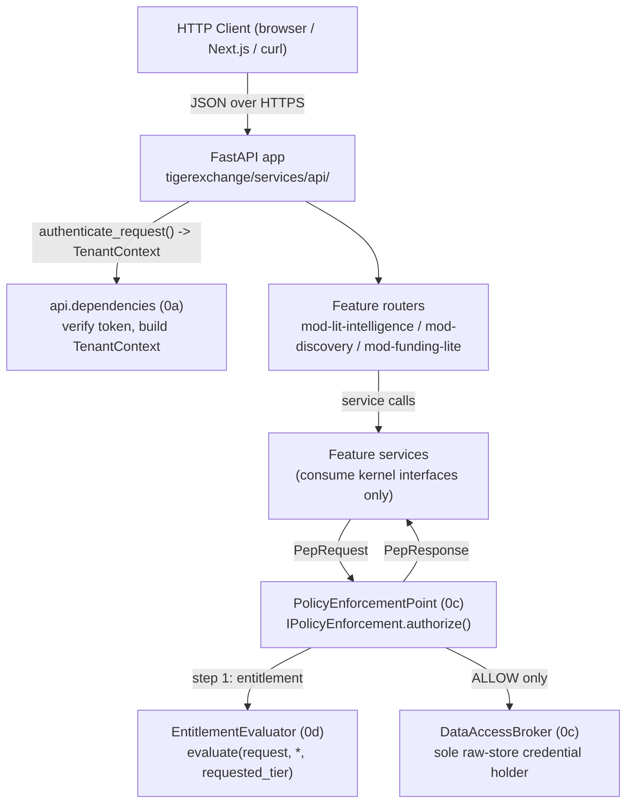
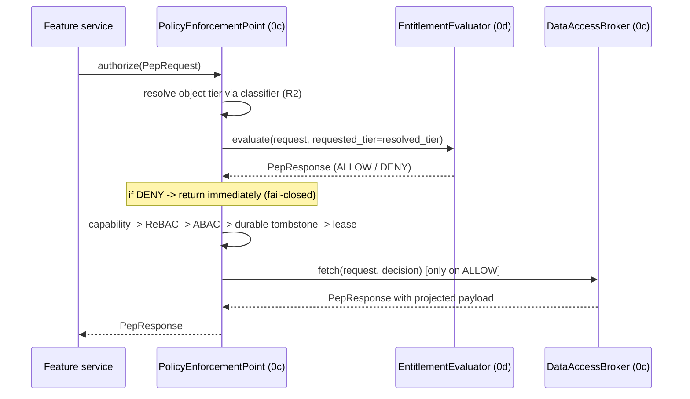

# API & Interface Reference

**What this document is for.** This is the single, self-contained reference for every programmatic surface you will build in TigerExchange Phase-0: the FastAPI HTTP endpoints (auth, literature-intelligence search/drafting, expert discovery, funding match), the in-process Policy Enforcement Point (PEP) contract (`PepRequest` / `PepResponse` / `Decision` / `entitlement_evaluator.evaluate(...)`), the list of kernel `contracts.*` interfaces every module imports, and the one standard error/deny envelope used everywhere. It assumes no other document is open. Every type, path, and signature below is copied verbatim from the authoritative kernel (`plans/phase0/00-kernel-contracts.md`) and the locked decisions D1-D7 (`plans/00-decisions.md`); if anything here ever disagrees with those two files, those two files win. Project root is `tigerexchange/`. Stack baseline: Python 3.11+, Pydantic v2 (`pydantic>=2.6,<3`), FastAPI (`fastapi>=0.110`), pytest/ruff/mypy, test-driven development.

---

## 0. Orientation: where each surface lives

We keep three distinct API "altitudes" because mixing them is exactly the leak class D4 forbids. We considered collapsing HTTP handlers + authorization into one layer but rejected it: a feature module that authorizes itself can bypass the chokepoint, so authorization MUST live below HTTP, inside the one PEP.



| Surface | Layer | Package / file | Who owns it |
|---|---|---|---|
| HTTP endpoints | Transport | `tigerexchange/services/api/` + `mod-*/router.py` | 0a app, 0k routers |
| Auth dependency | Transport→identity seam | `tigerexchange/services/api/src/api/dependencies.py` | 0a (helper added by 0d) |
| PEP contract | Authorization | `tigerexchange/packages/mod-pep/` | 0c |
| Entitlement step | Authorization (step 1) | `tigerexchange/packages/mod-identity/src/mod_identity/entitlement_evaluator.py` | 0d |
| Kernel interfaces | Shared contracts | `tigerexchange/packages/contracts/src/contracts/` | kernel (00) |

---

## 1. FastAPI HTTP endpoints

### 1.1 Endpoint summary table

All endpoints accept and return JSON (`Content-Type: application/json`). All are `POST` because every call carries a structured request body and is non-idempotent at the search/generation layer; we considered `GET` with query strings but rejected it because the bodies are nested objects (e.g. `top_k`, query text with arbitrary characters) and because confidential drafting requests must never land in URL/access logs.

| Path | Method | Purpose | Auth required | Request body | Response body | Error codes |
|---|---|---|---|---|---|---|
| `/v1/auth/token` | POST | Exchange a verified upstream OIDC token for a TigerExchange session bearer token | No (presents upstream token) | `TokenExchangeRequest` | `TokenExchangeResponse` | 401, 400 |
| `/v1/lit/search` | POST | Classification-enforced hybrid search over tenant's own corpus + public scholarly data | Yes (Bearer) | `SearchRequest` | `list[SearchHit]` | 401, 403, 422, 503 |
| `/v1/lit/draft` | POST | Grounded, cited proposal-section drafting (RAGAS-gated, MAX-rule tier, KEK-persisted) | Yes (Bearer) | `DraftRequest` | `ProposalDraft` | 401, 403, 422, 503 |
| `/v1/discovery/experts` | POST | Public-tier cross-institution expert / collaborator discovery | No (public-tier only) | `ExpertQuery` | `ExpertResult` | 422 |
| `/v1/funding/match` | POST | Ranked grant-opportunity match over public Grants.gov / RePORTER / NSF feeds | Yes (Bearer) | `FundingQuery` | `FundingResult` | 401, 403, 422 |
| `/v1/admin/adjudication/queue` | POST | List QUARANTINEd records awaiting human classification adjudication (D6) | Yes (Bearer, admin) | `AdjudicationListRequest` | `AdjudicationQueue` | 401, 403, 422 |
| `/v1/admin/adjudication/decide` | POST | Resolve a QUARANTINEd record to ALLOW (with tier) or DENY | Yes (Bearer, admin) | `AdjudicationDecision` | `AdjudicationResult` | 401, 403, 404, 422 |

> **Why `/v1/discovery/experts` requires no auth.** Per D6 and §6.3, discovery is public-tier by construction — confidential records never contribute to it, so there is nothing to authorize. The router (`build_discovery_router`) takes no `tenant_provider`. We considered requiring auth for consistency but rejected it because adding an auth gate where there is no protected data is dead code that invites future confusion about whether discovery touches confidential data (it must never).

> **Why an admin/adjudication endpoint exists.** D6 mandates: classifier abstention/ambiguity → QUARANTINE → default-deny → human adjudication before the record is usable. Those quarantined records need a human-driven resolution path; that is this endpoint pair. Without it, a QUARANTINEd record would be permanently dark with no recovery path.

### 1.2 Auth: `POST /v1/auth/token`

**Purpose.** The client presents a token already verified by the buyer's IdP (Direct OIDC/CILogon via the Keycloak broker — Phase-0 ships Direct OIDC only, no SAML/eduGAIN). The server verifies issuer/audience/signature/expiry, extracts `eduPersonUniqueId` + `eduPersonScopedAffiliation`, builds a frozen `TenantContext`, and returns a TigerExchange session bearer token. ORCID is a correlation key only, NEVER the auth root of trust (§7.1).

The verification path is `mod_identity.keycloak_broker.OidcBroker.verify_token(raw_token) -> dict` then `mod_identity.context_builder.build_tenant_context(...) -> TenantContext`. Fail-closed: a token lacking both `eduPersonUniqueId` and OIDC `sub` raises `ClaimError`, surfaced as HTTP 401.

Request body shape (`TokenExchangeRequest`):

```json
{
  "upstream_token": "eyJhbGciOiJSUzI1Ni␣...",
  "tenant_id": "rit",
  "edition": "plg"
}
```

| Field | Type | Required | Notes |
|---|---|---|---|
| `upstream_token` | string | yes | The IdP-issued OIDC JWT. Verified, never trusted blindly. |
| `tenant_id` | string | yes | Owning-institution id; becomes the RLS leading key. |
| `edition` | string enum | yes | One of `plg \| institutional \| campus \| consortium-anchor \| confidential-sovereign`. Resolves to the `Entitlement`. |

Response body shape (`TokenExchangeResponse`) on success (HTTP 200):

```json
{
  "access_token": "te_sess_9f2c...",
  "token_type": "bearer",
  "expires_in": 900,
  "subject_id": "abc123@rit.edu",
  "edition": "plg"
}
```

Error responses use the standard envelope (§4). 401 on a forged/expired/wrong-audience token or missing stable subject id; 400 on an unknown `edition`/`tenant_id`.

### 1.3 Literature intelligence: `POST /v1/lit/search`

**Purpose.** Hybrid retrieval (vector + BM25 + RRF behind `IRetrievalStrategy`) over the tenant's own corpus + public scholarly data. Results are already PEP-gated and already projected before the handler sees them — the handler never touches a raw store. Requires capability `PUBLIC_RETRIEVAL`; a tenant lacking it is denied (`PermissionError` → HTTP 403).

Handler (verbatim from 0k `router.py`):

```python
@router.post("/search", response_model=list[SearchHit])
def search(req: SearchRequest, tenant: TenantContext = Depends(tenant_provider)):
    return service.search(tenant, req)
```

Request body (`SearchRequest`):

```json
{ "query": "lipid nanoparticle CRISPR delivery", "top_k": 8 }
```

| Field | Type | Constraint | Default |
|---|---|---|---|
| `query` | string | non-empty | — |
| `top_k` | int | `>= 1, <= 50` | 8 |

Response body (`list[SearchHit]`, HTTP 200):

```json
[
  {
    "projection_id": "proj-1",
    "title": "title-proj-1",
    "snippet": "snippet text...",
    "tier": "private",
    "score": 1.0
  },
  {
    "projection_id": "proj-2",
    "title": "title-proj-2",
    "snippet": "snippet text...",
    "tier": "public",
    "score": 0.5
  }
]
```

`SearchHit` fields: `projection_id: str`, `title: str`, `snippet: str`, `tier: Tier` (`public|private`), `score: float`. Note `tier` can never be `confidential` here — hits are `PublishableProjection`-shaped and D6 forbids confidential in any projection.

### 1.4 Literature intelligence: `POST /v1/lit/draft`

**Purpose.** Grounded, cited proposal-section drafting. The service pipeline is: retrieve (PEP-gated) → route to a locality-compliant model provider (`IModelRouter`) → synthesize a cited section grounded ONLY in retrieved contexts → RAGAS faithfulness release gate → derive draft tier via the kernel MAX-rule (`tier_join_all` over source tiers + the prompt's classified tier) → persist draft + buffers + RAG cache ONLY in tenant-KEK stores. Requires capability `OWN_MATERIALS`.

We persist generated content only in the tenant-KEK-bound store because the draft is the highest-value confidential artifact; KEK crypto-shred (GDPR erasure) must reach it. We considered a plain DB column but rejected it: plaintext at rest cannot be crypto-shredded and would survive erasure.

Handler (verbatim):

```python
@router.post("/draft", response_model=ProposalDraft)
def draft(req: DraftRequest, tenant: TenantContext = Depends(tenant_provider)):
    return service.draft(tenant, req)
```

Request body (`DraftRequest`):

```json
{ "section": "Specific Aims", "prompt": "Draft aims for a CRISPR delivery study", "top_k": 8 }
```

| Field | Type | Constraint | Default |
|---|---|---|---|
| `section` | string | non-empty | — |
| `prompt` | string | non-empty | — |
| `top_k` | int | `>= 1, <= 50` | 8 |

Response body (`ProposalDraft`, HTTP 200):

```json
{
  "draft_id": "draft-3f9c8e2a1b...",
  "section": "Specific Aims",
  "body": "Aim 1 grounded on the corpus [1][2].",
  "citations": [
    { "source_id": "art-p1", "snippet": "snippet-p1", "projection_id": "p1" },
    { "source_id": "art-p2", "snippet": "snippet-p2", "projection_id": "p2" }
  ],
  "tier": "private",
  "faithfulness": 0.92
}
```

`ProposalDraft` fields: `draft_id: str`, `section: str`, `body: str`, `citations: tuple[Citation,...]`, `tier: Tier`, `faithfulness: float (0.0-1.0)`. `Citation` fields: `source_id: str`, `snippet: str`, `projection_id: str`.

Error behavior: if RAGAS faithfulness `< threshold` (default 0.80) or there were zero grounding contexts, the service raises `ValueError("draft rejected: faithfulness ...")` → HTTP 422 with the standard envelope. A tenant lacking `OWN_MATERIALS` → HTTP 403.

### 1.5 Discovery: `POST /v1/discovery/experts`

**Purpose.** Rank public-tier expert/collaborator candidates by SPECTER2 fingerprint similarity (`IExpertiseFingerprint`) with a prior-collaborator flag from the public collaboration graph (`ICollaborationGraph`). Zero confidentiality machinery. No auth. Note on the chokepoint claim (§2): `mod-discovery` is PUBLIC-tier only — it goes through the central-index read PEP (0j) for discoverability *scope* filtering only and never reaches the confidential enforcement path or any confidential data.

Handler (verbatim):

```python
@router.post("/experts", response_model=ExpertResult)
def experts(query: ExpertQuery):
    return service.find_experts(query)
```

Request body (`ExpertQuery`):

```json
{ "seed_researcher_id": "seed", "top_k": 10 }
```

| Field | Type | Constraint | Default |
|---|---|---|---|
| `seed_researcher_id` | string | non-empty | — |
| `top_k` | int | `>= 1, <= 100` | 10 |

Response body (`ExpertResult`, HTTP 200):

```json
{
  "experts": [
    { "researcher_id": "r1", "similarity": 0.9, "prior_collaborator": true,  "tier": "public" },
    { "researcher_id": "r3", "similarity": 0.7, "prior_collaborator": false, "tier": "public" },
    { "researcher_id": "r2", "similarity": 0.4, "prior_collaborator": false, "tier": "public" }
  ]
}
```

`Expert` fields: `researcher_id: str`, `similarity: float`, `prior_collaborator: bool`, `tier: Literal["public"]` (always `"public"` — the type literally cannot be anything else, enforcing §6.3 at the type level).

### 1.6 Funding: `POST /v1/funding/match`

**Purpose.** Ranked grant-opportunity match over public-tier grant projections (Grants.gov / RePORTER / NSF) via `IRetrievalStrategy`. Requires capability `PUBLIC_RETRIEVAL`.

Handler (verbatim):

```python
@router.post("/match", response_model=FundingResult)
def match(query: FundingQuery, tenant: TenantContext = Depends(tenant_provider)):
    return service.match(tenant, query)
```

Request body (`FundingQuery`):

```json
{ "query": "machine learning institute", "top_k": 10 }
```

| Field | Type | Constraint | Default |
|---|---|---|---|
| `query` | string | non-empty | — |
| `top_k` | int | `>= 1, <= 100` | 10 |

Response body (`FundingResult`, HTTP 200):

```json
{
  "matches": [
    {
      "opportunity": {
        "opportunity_id": "grant-p1",
        "title": "NSF AI Institute",
        "snippet": "Funding for multi-institution AI...",
        "source": "nsf"
      },
      "score": 1.0
    }
  ]
}
```

`FundingMatch` fields: `opportunity: GrantOpportunity`, `score: float`. `GrantOpportunity` fields: `opportunity_id: str`, `title: str`, `snippet: str`, `source: str` (`grants_gov | reporter | nsf`). Tenant lacking `PUBLIC_RETRIEVAL` → HTTP 403.

### 1.7 Admin / adjudication: `POST /v1/admin/adjudication/queue` and `/decide`

**Purpose.** D6 routes every classifier abstention/ambiguity to QUARANTINE → human adjudication. These two endpoints are that human-in-the-loop. They require a Bearer token whose `TenantContext` holds an admin/adjudicator affiliation; a non-admin token → HTTP 403. We separate "list" from "decide" so the read path can be polled cheaply without risk of an accidental state change.

`POST /v1/admin/adjudication/queue` request (`AdjudicationListRequest`):

```json
{ "tenant_id": "rit", "limit": 50 }
```

Response (`AdjudicationQueue`, HTTP 200) — one entry per QUARANTINEd record, mirroring `ClassificationResult`:

```json
{
  "items": [
    {
      "artifact_id": "art-77",
      "tenant_id": "rit",
      "tier": "confidential",
      "decision": "QUARANTINE",
      "confidence": 0.41,
      "reason": "classifier abstained: ambiguous ITAR markers",
      "lattice_version": 1
    }
  ]
}
```

`POST /v1/admin/adjudication/decide` request (`AdjudicationDecision`):

```json
{
  "artifact_id": "art-77",
  "resolution": "ALLOW",
  "tier": "private",
  "reason": "reviewed: no export-controlled content"
}
```

| Field | Type | Constraint |
|---|---|---|
| `artifact_id` | string | must reference a QUARANTINEd record |
| `resolution` | string enum | `ALLOW` or `DENY` only (never `QUARANTINE` — a human decision is terminal) |
| `tier` | string enum | required iff `resolution == "ALLOW"`; one of `public \| private` (never `confidential` for a record that will be indexed — D6) |
| `reason` | string | non-empty audit reason |

Response (`AdjudicationResult`, HTTP 200): `{ "artifact_id": "art-77", "decision": "ALLOW", "effective_tier": "private" }`. Unknown `artifact_id` → HTTP 404. A `decide` body with `resolution=="ALLOW"` but no `tier` → HTTP 422.

---

## 2. The PEP programmatic contract

This is the in-process (not HTTP) contract. Everything that reads, egresses, derives, discovers, or drills down across tenants goes through the one `PolicyEnforcementPoint.authorize(request) -> PepResponse` (D4: single chokepoint). Feature modules construct a `PepRequest` and receive an already-projected, already-tier-checked `PepResponse`; they never see raw classification logic or raw stores.



### 2.1 `Decision` enum

Authoritative (`contracts/classification.py`). A `StrEnum` so wire/DB values are stable strings:

| Member | Wire value | Meaning |
|---|---|---|
| `Decision.ALLOW` | `"ALLOW"` | Authorized. The ONLY decision that may carry a payload. |
| `Decision.DENY` | `"DENY"` | Refused. No payload. |
| `Decision.QUARANTINE` | `"QUARANTINE"` | Classifier abstained/ambiguous → treated confidential, excluded from ALL retrieval, routed to human adjudication (D6). No payload. |

### 2.2 `PepRequest` fields

Authoritative (`contracts/pep.py`). Frozen Pydantic model.

| Field | Type | Required | Purpose |
|---|---|---|---|
| `request_id` | `str` | yes | Correlation id; mirrored into the audit event and the response. |
| `tenant` | `TenantContext` | yes | The authenticated tenant+subject the PEP authorizes (§2.1). |
| `action` | `PepAction` | yes | What is being authorized; also selects the PEP locus. |
| `required_capability` | `Capability` | yes | Capability the action needs; PEP checks `tenant.entitlement.has(...)`. |
| `resource_id` | `str \| None` | no (default `None`) | Artifact id / query string / projection id the action touches. |
| `grant_id` | `str \| None` | no (default `None`) | For `BROKERED_DRILLDOWN`: the owner re-derives scope/tier/caveats from its authoritative store and IGNORES any scope claim presented here (§4.3). |
| `deadline_ms` | `int \| None` | no (default `None`) | Remaining hop deadline; a hop that cannot meet it fails-closed-fast. |
| `attributes` | `dict[str, object]` | no (default `{}`) | Opaque per-action attributes (query text, scope filter, etc.). |

`PepAction` (`StrEnum`): `RETRIEVE` = `"retrieve"` (cell-local read of own data), `EGRESS` = `"egress"` (boundary egress, re-checked publishable allowlist), `DERIVE` = `"derive"` (router/embedding/synthesis), `DISCOVER` = `"discover"` (central-index read), `BROKERED_DRILLDOWN` = `"brokered-drilldown"` (cross-tenant owner-authoritative access).

Construction example:

```python
from contracts import Capability, PepAction, PepRequest, TenantContext

req = PepRequest(
    request_id="r1",
    tenant=tenant_ctx,                       # a frozen TenantContext
    action=PepAction.RETRIEVE,
    required_capability=Capability.OWN_MATERIALS,
    resource_id="obj-1",
)
```

### 2.3 `PepResponse` fields

Authoritative (`contracts/pep.py`). Frozen. **Fail-closed invariant:** a non-`ALLOW` decision MUST carry `payload=None` — enforced in `model_post_init`, which raises `ValueError` if violated. This makes "deny leaks no data" structurally impossible to get wrong.

| Field | Type | Notes |
|---|---|---|
| `request_id` | `str` | Echoes the request. |
| `decision` | `Decision` | `ALLOW` / `DENY` / `QUARANTINE`. |
| `effective_tier` | `Tier` | The tier the decision was made at. |
| `payload` | `list[dict[str, object]] \| None` | Present ONLY on `ALLOW`; already-projected, already-tier-checked objects. `None` otherwise. |
| `discoverability_scope` | `DiscoverabilityScope \| None` | For `DISCOVER` results: the scope under which each hit was authorized. |
| `caveats` | `Caveats \| None` | Re-derived sticky caveats for downstream egress. |
| `reason` | `str` (default `""`) | Human-readable obligation/deny reason; mirrored into the audit event. |

ALLOW example:

```json
{
  "request_id": "r1",
  "decision": "ALLOW",
  "effective_tier": "private",
  "payload": [ { "artifact_id": "a1", "title": "Proposal Draft" } ],
  "discoverability_scope": null,
  "caveats": null,
  "reason": "entitlement gate passed"
}
```

DENY example (note `payload` is `null`):

```json
{
  "request_id": "r1",
  "decision": "DENY",
  "effective_tier": "confidential",
  "payload": null,
  "discoverability_scope": null,
  "caveats": null,
  "reason": "entitlement: edition 'plg' lacks capability 'confidential-workspace'"
}
```

### 2.4 `entitlement_evaluator.evaluate(request, *, requested_tier) -> PepResponse`

This is the **entitlement step (step 1)** the single PEP runs first, defined in `mod_identity.entitlement_evaluator.EntitlementEvaluator`. It is NOT a second PEP and does NOT implement the kernel `IPolicyEnforcement`. It is composed INTO 0c's `PolicyEnforcementPoint`. The kernel `authorize(request)` signature is unchanged (one positional arg, no `requested_tier`); the PEP resolves the object's tier from the classifier (R2 — never hardcoded `confidential`) and passes that resolved tier here as the keyword-only `requested_tier`.

Exact signature:

```python
class EntitlementEvaluator:
    def evaluate(self, request: PepRequest, *, requested_tier: Tier) -> PepResponse:
        """Deny if the edition lacks the capability OR exceeds its tier ceiling."""
```

Contract (two checks, in order):

1. **Capability gate.** If `not request.tenant.entitlement.has(request.required_capability)` → `Decision.DENY`, reason `"entitlement: edition '<edition>' lacks capability '<cap>'"`.
2. **Tier-ceiling gate.** If `not entitlement.permits_tier(requested_tier)` (i.e. `requested_tier > entitlement.max_tier`) → `Decision.DENY`, reason `"entitlement: edition '<edition>' tier ceiling '<ceiling>' < requested '<tier>'"`.
3. Otherwise → `Decision.ALLOW`, `effective_tier=requested_tier`, reason `"entitlement gate passed"`.

This makes "a PLG tenant physically cannot construct a confidential-tier or exchange-participation request" structurally true (§2.3), because the deny happens here BEFORE any ReBAC/ABAC/store access. Every DENY carries `payload=None`, consistent with `PepResponse.model_post_init`.

Example:

```python
from contracts import Tier
ev = EntitlementEvaluator()
resp = ev.evaluate(plg_confidential_request, requested_tier=Tier.confidential)
assert resp.decision is Decision.DENY
assert resp.payload is None
assert "entitlement" in resp.reason.lower()
```

### 2.5 Canonical PEP decision order (for context)

The full `PolicyEnforcementPoint.authorize` runs six steps in this fixed order; the durable tombstone log is the single authoritative store for the deny dimension, and ReBAC/ABAC/lease may only NARROW a grant, never widen it:

1. Entitlement / edition gate (`EntitlementEvaluator.evaluate`, §2.4)
2. Capability gate
3. ReBAC check (SpiceDB; pooled-plane object-authz `Check` feeds here)
4. ABAC tier check (OPA)
5. Owner-local durable tombstone read (AUTHORITATIVE deny)
6. Lease read (narrow-only positive-grant cache; security-reason revocations get a zero allow-window because the deny is read from the durable log, not lease expiry)

The PEP's constructor is keyword-only and owned by 0c:

```python
PolicyEnforcementPoint(
    *, entitlement_evaluator, classifier, rebac, abac, tombstone, lease, broker, pooled_authz
)
```

---

## 3. Kernel interface list

Every feature module imports these from `contracts` (the single import surface) and depends on the SHAPE, never a concrete implementation. All are `@runtime_checkable typing.Protocol`. Active interfaces have full signatures; the two deferred seams ship NO Phase-0 implementation.

| Interface | Phase-0 status | One-line purpose |
|---|---|---|
| `IClassifier` | active | Single fail-closed classifier: `classify(content, tenant) -> ClassificationResult`; abstention → `quarantine(...)`. |
| `IPolicyEnforcement` | active | The one PEP chokepoint (D4): `authorize(request) -> PepResponse`. |
| `IDataAccessBroker` | active | Sole raw-store credential holder behind the PEP: `fetch(...)`, `project(...)`. |
| `IModelProvider` | active | A registered model provider declaring locality it satisfies: `satisfies_locality(tier)`, `no_retention_attested()`. |
| `IModelRouter` | active | Classification-routed, provider-agnostic router: `route(classification, tenant) -> IModelProvider`; fails closed to in-boundary model. |
| `IRetrievalStrategy` | active | Hybrid retrieval (vector + BM25 + RRF): `retrieve(query, tenant, *, top_k=8) -> list[PublishableProjection]`; returns PEP-gated, projected hits. |
| `IReranker` | active | Local cross-encoder reranker: `rerank(query, candidates, *, top_k=8)`. |
| `IExpertiseFingerprint` | active | SPECTER2 expertise fingerprint (public-tier): `fingerprint(researcher_id)`, `similarity(a, b)`. |
| `ICollaborationGraph` | active | Public cross-institution collaboration traversal: `neighbors(...)`, `candidate_collaborators(...)`. |
| `IAuditSink` | active | Per-stream hash-chained audit sink: `append(event)`, `head(stream_id)`, `checkpoint(stream_id)`. |
| `IGrantStore` | active (owner-local read only) | Authoritative sharing-grant store at the owning node (D5): `get_grant(...)`, `is_revoked(...)`. |
| `IExchangeFeed` | **deferred Phase-1+** | Cross-institution federation discovery feed. No Phase-0 impl; importing one is a CI violation. |
| `IRevocationAuthority` | **deferred Phase-1+** | Owner-local fenced-lease revocation authority. Seam only; no Phase-0 impl. |

Supporting kernel value types you will also import from `contracts`: `Tier` (`public<private<confidential`, `tier_join`, `tier_join_all`), `ComplianceFlag` (`FERPA|IRB|ITAR|EAR|GDPR-personal`, sticky UNION via `compliance_union`), `TenantContext`, `Edition`, `Entitlement`, `Capability`, `IsolationPosture`, `ClassificationResult`, `DiscoverabilityScope` (`public-web|federation-wide|named-consortium|named-tenants|none`), `Caveats`, `PublishableProjection`, `PepRequest`, `PepResponse`, `PepAction`, `AuditEvent`, `AuditEventType`, plus the versioning constants `LATTICE_VERSION`, `PROJECTION_SCHEMA_VERSION`, `KERNEL_API_VERSION`, `InterfaceLocus`, `INTERFACE_LOCUS`.

---

## 4. Standard error / deny envelope

There is ONE error/deny envelope for every HTTP endpoint and one mapping from internal exceptions/decisions to it. We use a single envelope because the local code-generation model must produce identical error handling everywhere; per-endpoint ad-hoc error shapes were considered and rejected as a source of inconsistency and of accidental data leakage in error text.

### 4.1 HTTP error envelope

Every non-2xx response body is exactly:

```json
{
  "error": {
    "code": "FORBIDDEN",
    "message": "entitlement: edition 'plg' lacks capability 'confidential-workspace'",
    "request_id": "r1",
    "decision": "DENY"
  }
}
```

| Field | Type | Notes |
|---|---|---|
| `error.code` | string enum | Stable machine code (table below). |
| `error.message` | string | Human-readable reason. MUST NOT contain confidential payload (already redacted, per §4.1 audit rule). |
| `error.request_id` | string | Correlation id; matches the originating `PepRequest.request_id` when present. |
| `error.decision` | string or null | The `Decision` value (`DENY`/`QUARANTINE`) when the error originated at the PEP; `null` for transport-level errors (e.g. bad token). |

### 4.2 Code ↔ HTTP status ↔ origin mapping

| `error.code` | HTTP | Origin | When |
|---|---|---|---|
| `UNAUTHENTICATED` | 401 | `AuthError` / `ClaimError` / `TokenError` | Missing/forged/expired token, or no stable subject id. |
| `FORBIDDEN` | 403 | `PepResponse(decision=DENY)` / `PermissionError` / `AuthzDenied` | Entitlement/capability/tier/ReBAC/ABAC/tombstone denial. |
| `QUARANTINED` | 409 | `PepResponse(decision=QUARANTINE)` | Record excluded pending human adjudication (D6). |
| `VALIDATION_ERROR` | 422 | Pydantic `ValidationError` / service `ValueError` | Bad request body, or faithfulness gate rejection. |
| `NOT_FOUND` | 404 | service lookup miss | Unknown `artifact_id`/`draft_id`/`grant_id`. |
| `UPSTREAM_UNAVAILABLE` | 503 | dependency failure | Model provider / retrieval engine / OPA / SpiceDB unreachable (fail-closed). |

### 4.3 The deny envelope IS the PEP envelope

For any authorization-layer failure, the HTTP envelope is built directly from the `PepResponse`: `code` is derived from `decision` (`DENY`→`FORBIDDEN`, `QUARANTINE`→`QUARANTINED`), `message` = `PepResponse.reason`, `request_id` = `PepResponse.request_id`, `decision` = `PepResponse.decision`. No new fields are invented at the HTTP layer. This keeps the deny reason auditable end-to-end and ensures a denied request never carries data (the `PepResponse` already guarantees `payload is None` on non-ALLOW).

QUARANTINE envelope example (HTTP 409):

```json
{
  "error": {
    "code": "QUARANTINED",
    "message": "classifier abstained: ambiguous ITAR markers; routed to adjudication",
    "request_id": "r9",
    "decision": "QUARANTINE"
  }
}
```
