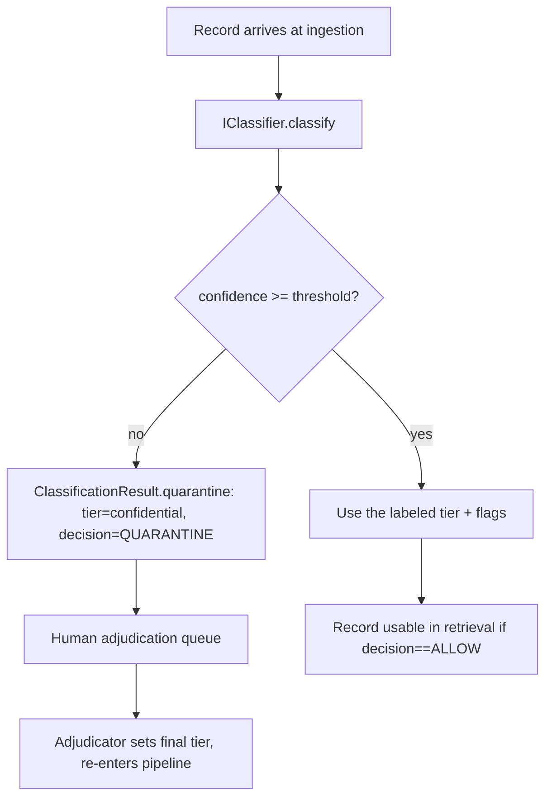
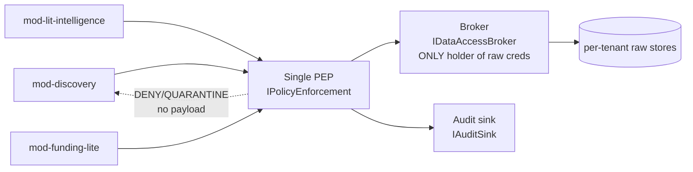
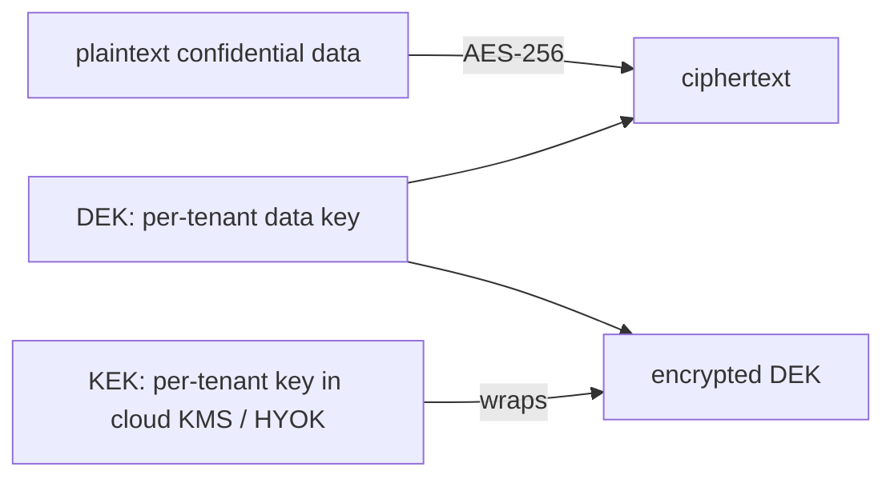
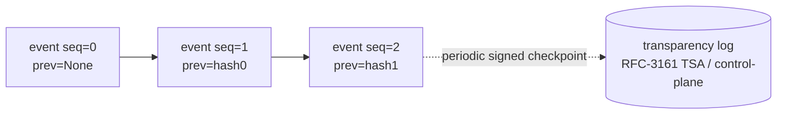

# Security & Compliance Design

**What this document is for.** This is the single, self-contained security and compliance reference for building TigerExchange Phase-0. TigerExchange is a federated multi-university research platform whose first product ("the wedge") is *grant intelligence*: helping research teams at different universities find each other, assemble a team for a federal grant, and co-edit a confidential proposal across institutions. Because proposals, budgets, preliminary data, and student records are involved, security is not a feature bolted on later — it is the product's spine. This document tells the builder exactly how confidential data is classified, where it is enforced, how it is encrypted, how access is audited, which laws apply and how the design satisfies each, what can go wrong (the threat model) and the mitigation for each, and the minimum bar a university security office demands before they will buy. Every non-obvious choice states *why* it was made and what was rejected. Read this end-to-end before writing any security-touching code. The authoritative type and interface definitions referenced here live in `tigerexchange/packages/contracts/src/contracts/` (the "kernel"); this document explains how to *use* them, never redefines them.

---

## 0. Vocabulary (read this first — every term used below is defined here)

| Term | Plain definition |
|---|---|
| **Tenant** | One university (or one institution) on the platform. Has a `tenant_id` string. |
| **Subject** | An authenticated end user (a person), identified by `subject_id`. |
| **Tier** | The sensitivity level of a record. Exactly three: `public`, `private`, `confidential`. Defined in `contracts/lattice.py` as `Tier(IntEnum)` with `public=0 < private=1 < confidential=2`. |
| **Compliance flag** | A regulatory tag a record carries *in addition* to its tier: `FERPA`, `IRB`, `ITAR`, `EAR`, `GDPR_PERSONAL`. Defined in `contracts/lattice.py` as `ComplianceFlag(StrEnum)`. |
| **PEP (Policy Enforcement Point)** | The single piece of code that every read/egress/derivation/discovery request passes through. It decides ALLOW/DENY/QUARANTINE. Interface: `IPolicyEnforcement` in `contracts/interfaces.py`. There is exactly one PEP design (decision D4). |
| **Data-access broker** | The only component holding raw database credentials. Sits behind the PEP. Interface: `IDataAccessBroker`. Feature modules never touch raw stores. |
| **Cell** | A dedicated, isolated deployment for one confidential tenant: its own Postgres, vector store, lexical index, graph store, all on tenant-keyed volumes. Confidential data lives only in cells. |
| **Pooled plane** | Shared multi-tenant infrastructure for non-confidential (public/private) workloads. Cheaper; never holds confidential data. |
| **Central index** | The shared, global discovery index. Holds ONLY publishable metadata — never confidential content (decision D6). |
| **KEK / DEK** | Key-Encryption-Key / Data-Encryption-Key. The DEK encrypts the data; the KEK encrypts (wraps) the DEK. This is "envelope encryption." Destroying the KEK makes the data permanently undecryptable ("crypto-shred"). |
| **Crypto-shred** | Deleting data by destroying its encryption key, so retained ciphertext can never be read again. Our mechanism for GDPR erasure of confidential data. |
| **MAX-rule** | When two records combine into a derived record, the derived record's tier is the *more restrictive* of the two (the maximum), and its compliance flags are the *union* of both. Sticky propagation. |
| **Quarantine** | The fail-closed state for any record the classifier cannot confidently label: treated as confidential, excluded from ALL retrieval, queued for human review. `Decision.QUARANTINE`. |
| **Deemed export** | US export-control concept: giving a foreign national access to controlled technical data *inside the US* legally counts as an export to their home country. |
| **HECVAT** | Higher Education Community Vendor Assessment Toolkit — the standard security questionnaire universities send vendors. |

> **The one-line rule the whole design enforces:** publishable metadata is centralized for fast discovery; confidential bytes never leave their cell; every confidentiality decision is made fresh at the owning node through the single PEP; eventual consistency is allowed only where a leak is impossible.

---

## 1. The confidentiality model end-to-end

### 1.1 The three tiers

We use exactly **three** sensitivity tiers, ordered. We chose three (not two, not five) because three maps cleanly onto the real-world distinction research offices already make — "anyone can see it" / "only my institution" / "legally restricted" — and a small fixed lattice is formally verifiable and fail-closeable. We rejected a free-form label set because it cannot be totally ordered, so a "more restrictive" rule (the MAX-rule, §1.3) cannot be computed safely.

| Tier | `Tier` value | Meaning | Where it may live | Enters central index? |
|---|---|---|---|---|
| `public` | 0 | Published / openly shareable (e.g. a published paper abstract, a public faculty profile) | Pooled plane + central index | Yes |
| `private` | 1 | Institution-internal, not secret but not public (e.g. an internal expertise note) | Pooled plane (own tenant only) | Only as explicitly-shared metadata |
| `confidential` | 2 | Legally/contractually restricted (e.g. proposal drafts, budgets, preliminary data, PHI, export-controlled data) | **Dedicated cell only** | **Never** (decision D6) |

The lattice is **total**: `public < private < confidential`. This is `Tier(IntEnum)` in `contracts/lattice.py`, where the integer value *is* the sensitivity ordering. Do not invent new tiers; a new tier requires a `LATTICE_VERSION` bump and re-derivation of every stamped record.

### 1.2 How each record gets a tier

Every record is classified exactly once, at ingestion, by **one** classifier (interface `IClassifier`, method `classify(content, tenant) -> ClassificationResult`). The result is `ClassificationResult` (`contracts/classification.py`) carrying `tier`, `decision`, `compliance_flags`, `confidence`, and `reason`.



**We classify exactly once at ingestion because** re-classifying at read time would put an LLM call on the hot path (latency) and would make the same record's tier non-deterministic across reads (auditability nightmare). We considered classify-on-read and rejected it for both reasons.

### 1.3 Sticky compliance flags and the MAX-rule

When content is *derived* (an embedding, a summary, a grounded LLM answer that combines several sources), the derived artifact inherits sensitivity from its inputs:

- **Tier = MAX of all input tiers.** Use `tier_join_all(tiers)` from `contracts/lattice.py`. Empty input fails closed to `confidential`.
- **Compliance flags = UNION of all input flags.** Use `compliance_union(*flag_sets)`.

```python
from contracts.lattice import tier_join_all, compliance_union, Tier, ComplianceFlag

# Two sources combined into one grounded answer:
src_a_tier, src_b_tier = Tier.public, Tier.confidential
derived_tier = tier_join_all([src_a_tier, src_b_tier])      # -> Tier.confidential

src_a_flags = frozenset()
src_b_flags = frozenset({ComplianceFlag.ITAR})
derived_flags = compliance_union(src_a_flags, src_b_flags)   # -> {ITAR}
```

**Flags are sticky — they never drop on a join.** This is the rule that prevents the most dangerous leak: a public-looking answer that secretly grounded on a confidential, export-controlled source. The taint follows the data all the way to the **completion** (the LLM's answer to the user). See §5 (threat model) and §4.5 (export taint at generation time).

**We make the MAX-rule the only join because** sensitivity must be monotone-up under combination; allowing a join to *lower* sensitivity is a one-way leak with no recovery. We considered per-flag override rules and rejected them as unauditable.

---

## 2. The single Policy Enforcement Point (PEP) — decision D4

### 2.1 Why one PEP

**Decision D4 (locked):** every retrieval, egress, derivation, and discovery flow passes through **one** Policy Enforcement Point plus data-access broker. Feature modules (grant search, team assembly, workspace co-editing, funding lookup) stay "dumb" — they send a `PepRequest` and receive a `PepResponse`. They **physically cannot** reach a raw store, because only the broker holds raw-store credentials.

**We do this because** the platform is modular (many feature modules will be added over time), and if each module re-implemented the ~7 confidentiality mechanisms (classification, tier check, scope check, caveat check, key access, audit, taint propagation), every new module would be a new leak vector. A single chokepoint means **adding a new module cannot bypass enforcement** — it has no path to the data except through the PEP. We rejected per-module enforcement because it makes the blast radius of any module bug = the whole confidential corpus.



### 2.2 The PEP request/response contract

Use `PepRequest` / `PepResponse` from `contracts/pep.py`. One request shape serves both PEP deployment loci, distinguished by `PepAction`:

| `PepAction` | When | Locus |
|---|---|---|
| `RETRIEVE` | cell-local read of a tenant's own data | inside the owning cell |
| `EGRESS` | data leaving the boundary (re-checks publishable allowlist) | boundary |
| `DERIVE` | embedding / synthesis / model routing | inside the cell |
| `DISCOVER` | central-index query | central index |
| `BROKERED_DRILLDOWN` | cross-tenant access via a sharing grant | owning node |

**Fail-closed response invariant (enforced in code):** a `PepResponse` whose `decision` is not `ALLOW` MUST carry `payload=None`. This is asserted in `PepResponse.model_post_init`; do not work around it.

```python
from contracts.pep import PepRequest, PepResponse, PepAction
from contracts.tenancy import Capability
from contracts.classification import Decision

req = PepRequest(
    request_id="r-123",
    tenant=ctx,                        # a frozen TenantContext (see §6)
    action=PepAction.RETRIEVE,
    required_capability=Capability.OWN_MATERIALS,
    resource_id="artifact-42",
)
resp: PepResponse = pep.authorize(req)
if resp.decision is Decision.ALLOW:
    use(resp.payload)                  # already projected + tier-checked
else:
    # DENY or QUARANTINE -> resp.payload is None by construction
    log_and_refuse(resp.reason)
```

### 2.3 The PEP's two-stage check on every request

The PEP runs two stages; **both must pass** or the request is denied. We split them because relationships and attributes answer different questions, and conflating them historically produces fail-open bugs.

1. **Relationship / path check (ReBAC).** Is there an authorization *path* from this subject to this resource? Backed by SpiceDB (Zanzibar-style relationship tuples). Tenant isolation is structural: every resource has a `tenant` relation, and cross-tenant access is reachable *only* through an explicit `sharing_grant`. No grant ⇒ no path ⇒ deny. SpiceDB is chosen over OpenFGA because its **ZedToken** consistency tokens make revocation correctness a first-class guarantee (a revoked grant denies on the very next consistent check); OpenFGA is an acceptable fallback only with `HIGHER_CONSISTENCY` explicitly enabled on confidential checks.
2. **Attribute / condition check (ABAC).** *Given* a path exists, is it currently permitted by classification, residency, export-control, consent state, and grant expiry? Backed by **OPA (Open Policy Agent, Rego)**, deployed as an **HTTP sidecar**. OPA is chosen because it is mature, **CNCF-graduated**, matches the built plans, and gives a **single decision point for tier ABAC** — one owned Rego policy table behind the one PEP, so every highest-stakes attribute decision is made by one auditable, versioned policy bundle. Cedar was considered as an alternative and rejected: standing up a second policy language and PDP alongside OPA fragments the decision surface for no gain, and OPA's policy-bundle/decision-log tooling is exactly what a confidentiality gate needs for audit.

**ABAC narrows only and never fails open.** If a required attribute is missing (e.g. the export-control attribute cannot be resolved), the PEP returns **DENY** for confidential/export resources. There is **no cache-fallback** that would let a stale "allowed" survive. We made this absolute because a fail-open PIP (Policy Information Point — the thing that fetches attributes) is the classic confused-deputy leak.

### 2.4 PEP placement: authorize locally, manage centrally

- The OPA Rego policy bundle and SpiceDB schema are **authored centrally** (control plane) so policy is consistent.
- The OPA PDP runs **embedded per-cell** (the OPA sidecar deployed alongside the cell) so a confidential-tier classification check executes *inside the boundary* and does not depend on the shared control plane being reachable (availability + sovereignty).
- SpiceDB relationship data for cross-tenant grants is **centralized** (cross-tenant grants must be globally consistent).
- Decision D5: the **owning node is the sole local authority** for access/revocation on its confidential artifacts. There is **no global consensus on the hot path**. For `BROKERED_DRILLDOWN`, the owner node re-derives scope/tier/caveats from its own authoritative `IGrantStore` and **ignores any scope claim presented in the request** (`grant_id` is looked up, not trusted). This owner-side re-derivation is the **universal invariant for all cross-tenant access**.

---

## 3. Classification + quarantine default-deny — decision D6

### 3.1 The fail-closed classifier

There is **one** classifier (`IClassifier`). It returns a `ClassificationResult`. The rule (Phase-0, **not deferred**):

- **Confidently labeled** (confidence ≥ threshold) → use the label.
- **Cannot confidently label** (below threshold) OR ambiguous → `ClassificationResult.quarantine(reason)`, which forces `tier=confidential`, `decision=QUARANTINE`, and routes the record to a **human adjudication queue**. It is **excluded from ALL retrieval** until a human adjudicates.

```python
from contracts.classification import ClassificationResult, Decision

def classify(self, content: bytes, tenant) -> ClassificationResult:
    label, confidence = self._model.predict(content)
    if confidence < self.ABSTENTION_THRESHOLD:
        return ClassificationResult.quarantine(
            reason=f"low confidence {confidence:.2f} < {self.ABSTENTION_THRESHOLD}",
            confidence=confidence,
        )
    return ClassificationResult(tier=label.tier, decision=Decision.ALLOW,
                                compliance_flags=label.flags, confidence=confidence)
```

`ClassificationResult.is_retrievable` is `True` **only** for `decision == ALLOW`. A careless reader that checks `tier` alone still fails closed, because quarantine forces `tier=confidential`.

**We default-deny on abstention because** the alternative (guess a tier when unsure) means the model's *uncertainty* becomes a leak: an "unsure" confidential record guessed as public is published forever (the central index is a one-way door, §3.3). Treating unknown as most-restrictive is the only safe default. The dual-classifier (two models must agree to label *down*) is a Phase-1 enhancement; **Phase-0 ships default-deny-on-abstention + human adjudication**, which is sufficient and simpler.

### 3.2 Phase-0 contract test (required)

Inject (a) low-confidence records and (b) **adversarial records** — confidential content wearing public-looking metadata — and assert **zero leak** into any retrievable surface (vector, BM25, graph, central index). This test is a CI gate, not a manual check.

### 3.3 The central index is a one-way door (decision D6)

The shared central index holds **only** public-tier + explicitly-shared metadata + non-reversible derived signals. **Confidential-derived content and embeddings NEVER enter it.** This is enforced *in the type system*: `PublishableProjection` (`contracts/projection.py`) has a field validator that **raises** if you try to construct one with `tier == confidential`. An abstained/quarantined record is by construction never a candidate for a shared-index write.

Before any *real* embedding is ever written to the central index, a **red-team gate** must run on **synthetic / de-identified corpora** and prove a quantified resistance bound (ε, k-anonymity, churn-noise) against three attacks:
1. **Membership inference** — can an attacker tell a given record is in the index?
2. **Embedding inversion** — can an attacker reconstruct text from an embedding?
3. **Cross-tenant linkage** — can an attacker correlate presence/churn across tenants to infer an *undisclosed* collaboration?

We run this **before** real data is written, not at GA, because publishing is irreversible — a Phase-2 GA gate would be past the point of no return. A versioned, provenance-carrying projection design makes a re-embed/rollback procedure possible if the bound later proves insufficient.

---

## 4. Confidential-at-rest encryption + crypto-shred

### 4.1 Envelope encryption (KEK/DEK)

Confidential data is encrypted at rest with **envelope encryption**:



- **Per-tenant DEK** is the default (one envelope key per confidential tenant), wrapped by the **per-tenant KEK** in cloud KMS. **Per-record DEK** is offered only for the highest-isolation "Confidential-Sovereign" edition where per-subject crypto-erasure granularity is needed.
- **KEK rotation re-wraps DEKs** (cheap, no data re-encryption). **DEK rotation** happens on a fixed cadence and on membership/offboarding events.

**Key-management posture (decision D7 isolation + research brief):**

| Posture | What it means | Used for |
|---|---|---|
| Cloud KMS per-tenant key | Provider-managed KEK per tenant; default | All confidential tenants |
| **BYOK** (mandatory for confidential) | University owns the KEK; revoking it locks the platform out | Every confidential customer |
| **HYOK** (offered, premium) | Key never leaves the university; platform sees only ciphertext | Export-controlled / highest-sensitivity tenants |

We default to **cloud KMS per-tenant keys** (managed; no namespace toil, no unseal operations). We reserve **self-run Vault for sovereign/on-prem only**, and we explicitly do **NOT** assume Vault Community namespaces (that is an Enterprise-only feature — do not design around it). **HYOK is not overclaimed:** it protects data *at rest*, not *at use* — there is a plaintext-at-use residual; TEE-at-use (confidential computing) is the stated upgrade path, not a Phase-0 claim.

### 4.2 ALL confidential derivatives are also tenant-key encrypted

This is the subtle, load-bearing point. Encrypting only the *primary document* is **not enough**: the **searchable derivatives** — vector embeddings, BM25 postings, graph nodes/edges — are themselves content-revealing (embedding inversion, term-frequency reconstruction). So:

**Every confidential-tier derivative store is bound to the tenant KEK/DEK**: Qdrant vectors, OpenSearch BM25 postings, Apache AGE graph nodes/edges, object storage, and per-tenant caches.

Because most engines (Qdrant, OpenSearch, AGE today) do **not** support a customer-held-KEK at-rest mode that cryptographically shreds their internal structure, use one of two **enforced fallbacks** (no overclaiming):

- **(a) Volume-level encryption keyed by the tenant KEK** (LUKS/dm-crypt or cloud block encryption with a tenant CMK) on the engine's data volumes. Viable because the confidential tier is **dedicated per-tenant** (D7), so each tenant's engines sit on tenant-keyed volumes — KEK shred → on-disk data unreadable.
- **(b) Delete-and-rebuild** for anything not covered by (a): on crypto-shred or per-subject erasure, delete and rebuild the affected indices from the (now-undecryptable) source, with the **residual rebuild window stated** and the index marked unavailable for that corpus during rebuild.

**CI contract test (required):** *after KEK crypto-shred, a search (vector + BM25 + graph) over the confidential corpus returns no decryptable hits* — run against all three engines on a dedicated confidential cell.

### 4.3 Crypto-shred = the GDPR/offboarding mechanism

Revocation, offboarding, and consortium dissolution trigger **crypto-shred**: destroy the DEK-wrapping (or rotate the per-consortium scope-key) → retained ciphertext becomes permanently undecryptable. Per-consortium scope-keys **rotate on membership change**. If a `allow_durable_copy` grant was issued (default `false`), the UI and audit must plainly state that revocation is **best-effort and the durable copy is permanent**. See §6.5 (GDPR) for how this combines with per-subject erasure.

---

## 5. The per-stream hash-chain audit

### 5.1 Why hash-chained, and why per-stream

Every PEP decision, classification, revocation, egress, grant issuance, and brokered access emits an `AuditEvent` (`contracts/audit.py`). Events are **hash-chained**: each event's `entry_hash = H(prev_hash || canonical(payload))`, linking to the previous event in its stream. Tampering with any event breaks the chain from that point on → **tamper-evident**.

The chain is **per-stream** (one chain per tenant/cell), **not** one global serial chain. We chose parallel per-stream chains because a single global chain has a single-writer throughput ceiling; per-stream chains remove that ceiling, and the per-stream append rate is confirmed to exceed peak served-operation rate per cell.



### 5.2 Anchored against the operator (insider / compelled access)

The threat model includes a **compelled or insider operator**. So the audit chain is anchored *externally*:

- Each node emits **periodic signed chain-head checkpoints** to the control-plane transparency log and/or an RFC-3161 timestamp authority / public transparency log. This makes tampering detectable even by an internal-only actor and even against a compelled operator. The **checkpoint interval = the maximum undetectable-rewrite window** (a compliance-tier parameter).
- **Fair-exchange disclosure:** before serving confidential bytes, the owner issues a signed access-receipt binding `(grant_id, grant_version, scope, token_jti, watermark, ts)` and obtains a signed request-receipt first (commit-then-serve). **Divergence is a control, not just detection:** on divergence, auto-**freeze the grant + raise P1 + suspend pending investigation.**

### 5.3 Per-tenant audit export

Each university can pull *its own* audit trail, including who at other institutions touched its shared resources. This is both a FERPA/GDPR accountability requirement and a sales feature.

---

## 6. Regulatory regimes — what each is, what triggers it, how the design handles it

For each: **what it is → what triggers it → exactly how this design satisfies it.** These are enforced as ABAC attributes and cell placement, never as bolt-on prose.

### 6.1 FERPA (US) — Family Educational Rights and Privacy Act

- **What it is.** US law protecting student "education records."
- **Trigger.** The platform stores or processes student education records (relevant when grant teams include student data, or directory-style data).
- **How we handle it.**
  - Position the platform as a **"school official"** acting under the institution's direct control, contractually limited to educational purposes (a contract-posture requirement, recorded in the DPA/vendor agreement).
  - Records carrying student data get the `ComplianceFlag.FERPA` flag (sticky, §1.3).
  - Access is gated by a **`ferpa_role` caveat** (`contracts/classification.py:Caveats`), re-evaluated at access. Provide encryption (§4), ReBAC object-authz (§2.3), and the audit trail (§5) — these are the FERPA technical safeguards.

### 6.2 GDPR (EU/EEA) — General Data Protection Regulation

- **What it is.** EU law governing all personal data of EU data subjects (here: researcher names, affiliations, profiles).
- **Triggers.** Processing any EU data subject's personal data; transferring it across borders; a data-subject erasure request.
- **How we handle it.**
  - **Controllership per plane:** each cell = **processor**; the Exchange = **joint-controller** (Art. 26 arrangement + lawful basis is an EU-index release gate). University = controller.
  - **Residency:** EU control-plane + EU Exchange pinned to EU regions. EU confidential-path lease consultations and brokered-drill-down metadata never leave the EEA. Every cross-border flow is mapped to a transfer mechanism (adequacy / SCCs) as a Phase-1/2 design artifact.
  - **Right to erasure (Art. 17)** — see §6.5; this is **distinct** from tenant-KEK crypto-shred.
  - A signed **DPA** with processor terms is mandatory. EU IdP attribute release uses the **REFEDS CoCo v2** code of conduct.

### 6.3 Export controls — ITAR (22 CFR 120–130) / EAR

- **What it is.** US controls on defense articles (ITAR) and dual-use technical data (EAR).
- **Triggers.** (a) Storing controlled technical data; (b) **deemed export** — granting a *foreign national* access to controlled data, even inside the US; (c) the project accepts publication/participation restrictions (which strips the Fundamental Research Exclusion).
- **How we handle it.**
  - Records get `ComplianceFlag.ITAR` / `ComplianceFlag.EAR` (sticky).
  - **Citizenship is an access attribute**, but it is **NEVER an SSO-carried nationality claim.** Access is gated by an **institution-attested US-person signed grantor caveat** — an export-control-officer assertion (`export_attestation` in `Caveats`). We refuse SSO nationality attributes because they are unverified and IdP-asserted; an export violation is a felony, so the assertion must be a signed, accountable, institution-level act.
  - **Export-conformant cells only.** Export-controlled data is FORBIDDEN on any non-conformant cell. A conformant cell requires US-person-only *vendor operational staff*, US-region hosting, and TEE-at-use (which removes vendor operational access from the deemed-export surface). The placement policy **refuses to place export-classified data on a non-conformant cell.** Until conformant cells exist (Phase 2+), **export-controlled data is not accepted** in Phase 0.
  - **Opt-in per controlled project, never blanket.** Imposing access restrictions on ordinary fundamental research can itself *strip* the Fundamental Research Exclusion. So the export gate is opt-in for projects that are actually controlled — applying it to everything would be a compliance own-goal.
  - Export-sensitive tenants additionally set `discoverability_scope = none` (their capability map never enters the shared index).

### 6.4 HIPAA (US) — Health Insurance Portability and Accountability Act

- **What it is.** US law protecting Protected Health Information (PHI) in covered research.
- **Triggers.** A research dataset contains PHI; a Limited Data Set (still PHI) is shared; de-identified data is *outside* HIPAA.
- **How we handle it.**
  - PHI-bearing records are classified **confidential** and carry `ComplianceFlag.IRB` (IRB/DUA-governed) — there is no separate HIPAA enum; PHI rides the IRB flag + confidential tier + a referenced DUA. (If a builder needs a distinct PHI flag later, that is a `LATTICE_VERSION` bump — do not silently add one.)
  - Sharing a Limited Data Set requires a **Data Use Agreement (DUA)**; the DUA is referenced by the sharing grant (grants are first-class, revocable objects — never ad-hoc ACLs). Minimum-necessary is enforced by the per-query authz + projection (the broker returns only the projected fields).
  - De-identified data may be reclassified down to public/private through the normal classifier path — but only with confident labeling; abstention quarantines (§3).

### 6.5 Per-data-subject erasure (GDPR Art. 17 / FERPA) — distinct from crypto-shred

This is a frequent confusion, so it is called out explicitly. There are **two different erasure mechanisms**:

| Mechanism | Scope | How |
|---|---|---|
| **Tenant-KEK crypto-shred** (§4.3) | An entire tenant's confidential corpus (offboarding, consortium dissolution) | Destroy the KEK-wrapping → all ciphertext undecryptable |
| **Per-data-subject erasure** | One person's data, including in the *central index* | Targeted hard-delete + tombstone of that subject's published projections/embeddings (subject-keyed reuse of the revocation-tombstone path) + **Art. 19 recipient-notification** to consumers that pulled the projection |

Per-subject erasure is required **because the central index holds *published* projections** (researcher names/affiliations = personal data) even though D6 keeps *confidential* content out — so you cannot rely on crypto-shred alone. For confidential-tier derivatives, per-subject erasure uses **per-record DEK crypto-shred (§4.2) where available, else delete-and-rebuild.**

---

## 7. Threat model and mitigation per threat

Every threat below has a concrete mitigation already specified in this document. The risk names are auditable.

| # | Threat (what goes wrong) | Mitigation |
|---|---|---|
| T1 | **Classifier misclassification → root leak.** A confidential record labeled public is published forever. | Quarantine-on-abstention in Phase 0 (§3.1) + adversarial **zero-leak contract test** (§3.2). Unknown = most-restrictive. |
| T2 | **Federation-seam leak.** Confidential content escapes into the shared index. | Single PEP chokepoint (D4, §2) + `PublishableProjection` type-rejects confidential (§3.3) + MAX-rule incl. flags (§1.3); D6 keeps confidential out of the index entirely. |
| T3 | **Tenant data leakage (no isolation).** A shared table with a `tenant_id` column that a query forgets to filter. | **Structural isolation:** confidential = dedicated cell; every resource has a `tenant` relation; **deny-by-default** when no path exists; per-tenant keys so even a leaked row is ciphertext. |
| T4 | **IDOR / BOLA (broken object-level auth).** Attacker swaps `/papers/123` → `/papers/124` to read another tenant's data. (#1 in OWASP API Top 10.) | **Object-level authz on every request** via SpiceDB `Check(subject, view, resource)` — never trust the URL/id. In the pooled PLG plane, layer FORCE-RLS + `SET LOCAL` + `WITH CHECK` + `RESTRICTIVE` + `tenant_id`-leading index as defense-in-depth; forbid `SECURITY DEFINER`/materialized-view bypass. Cross-tenant-read-denied test required. |
| T5 | **Confused deputy (federation).** A compromised/fake IdP or transitive trust asserts identities into the platform; or a broker presents a forged scope claim. | **Owner-side re-derivation is the universal invariant** (§2.4): the owning node looks up the grant by `grant_id` in its own `IGrantStore` and ignores presented scope. Validate `issuer`/`audience` strictly; scope every assertion to the asserting tenant; require **Sirtfi** from IdPs; audience-bound single-use DPoP tokens. |
| T6 | **Stale-grant / "new enemy" problem.** A revoked cross-institution share still reads because a cache hasn't caught up. | SpiceDB **ZedToken** consistency on confidential checks; revocation flips `sharing_grant.is_active` and the next consistent check denies. Owner-local fail-closed revocation (D5). |
| T7 | **Departed-researcher privilege creep.** Person leaves University A but keeps a collaborator relation in a confidential workspace. | **SCIM deprovisioning** + affiliation re-check cascade revocation through the authz graph. The PEP treats stale/unknown `subject_active` as not-fresh for non-public tiers (freshness check §7-design). |
| T8 | **AI exfiltration / shadow AI.** A confidential workspace points at a cloud frontier model; data leaves the boundary. | Model router enforces classification→route binding: confidential ⇒ in-boundary local model only, network-egress-blocked; per-tenant BYO keys scoped so cloud routing is impossible for confidential-tagged data. Taint flows to the completion (§4.5/§1.3). |
| T9 | **Export-control violation via unverified nationality.** A foreign-national read = a deemed export. | Institution-attested **US-person signed grantor caveat**, never an SSO nationality attribute (§6.3). Export-conformant cells only. |
| T10 | **Confidential derivatives survive crypto-shred** (searchable-copy leak). | All confidential derivative stores under tenant KEK/DEK; volume-key fallback; delete-and-rebuild fallback; **post-shred zero-decryptable-hits test** (§4.2). |
| T11 | **Operator audit rewrite (insider/compelled).** | External chain-head anchoring + fair-exchange receipts + divergence-freeze control (§5.2). |
| T12 | **RAG output leak / export taint at generation.** A grounded answer reveals tainted content to an unauthorized requester. | Egress PEP covers the **model OUTPUT channel**; re-checks requester attributes (FERPA role, US-person) at generation time. Foreign-person requester gets deny/redaction even if surrounding context is differently classified (§4.5 contract test). |
| T13 | **Cross-tenant linkage inference (undisclosed facts).** Correlating presence/churn to infer an undisclosed collaboration. | DP-noise on presence/count/churn + k-anonymity + per-consortium scope-keys + churn decoupling (§3.3 / §11.2b of the plan). |
| T14 | **ABAC PIP fail-open / widen.** Missing attribute silently widens access. | DENY on missing attribute for confidential/export; ABAC **narrows only**; **no cache-fallback** (§2.3). |
| T15 | **GDPR/FERPA erasure not satisfied.** | Per-subject hard-delete + tombstone + Art. 19 notification; confidential-derivative per-record DEK shred or rebuild (§6.5/§4.2). |

### 7.x Export taint at generation (the subtle one, expanded)

Sticky flags (§1.3) flow to the **completion**. A grounded answer built over tainted sources is itself a confidentiality/export event **at generation time** — not only at cross-node publication. Therefore the **egress PEP covers the model output channel to the user** and re-checks requester attributes (FERPA authorization, US-person status) before returning the answer. **Contract test:** a foreign-person requester gets deny/redaction when the grounded answer would reveal export-tainted content, even though they could retrieve the differently-classified surrounding context.

---

## 8. Minimum security bar to sell to a university

A university security office will not buy without these. Group them; treat the checklist as a Phase-0/1 readiness gate.

**Identity & access**
- [ ] SAML2 + OIDC SSO; **InCommon/eduGAIN reachable** (directly or via the CILogon broker into Keycloak).
- [ ] REFEDS **R&S + Sirtfi + CoCo v2** entity categories asserted (turns "negotiate attribute release with 200 universities" into "publish three tags").
- [ ] **MFA** supported/enforceable.
- [ ] **SCIM** provisioning **and deprovisioning** (auto-revoke on affiliation loss — closes T7).
- [ ] SP-initiated SSO default; strict `issuer`/`audience`/tenant-binding validation.
- [ ] **Object-level authorization on every request** (no IDOR/BOLA surface — T4).

**Data protection**
- [ ] AES-256 at rest; TLS 1.2+/mTLS in transit.
- [ ] **Per-tenant envelope encryption; BYOK mandatory for confidential; HYOK offered.**
- [ ] Confidential data + confidential AI inference **never leave the tenant boundary**; cloud egress blocked for confidential-tagged data.
- [ ] Key rotation + **crypto-shred for GDPR erasure**, covering derivatives (§4.2).

**Governance & audit**
- [ ] **Immutable / tamper-evident cross-institution access + grant + revocation audit trail** (§5), externally anchored.
- [ ] Per-tenant audit export (including external access to its shared resources).
- [ ] **Revocable, time-boxable, accountable** cross-institution sharing grants (grantor recorded).
- [ ] Demonstrable **tenant isolation** (deny-by-default; structural, not just a column).

**Compliance**
- [ ] **HECVAT** (full toolkit) completed — mandatory before any pilot/purchase.
- [ ] **SOC 2 Type I sequenced first** (point-in-time), targeted at the Phase-0/1 boundary; **deferrable only if validated in writing** with the anchor center's CISO/contracts officer as a Week-1 kill-gate sub-condition. **SOC 2 Type II → Phase 2** (prerequisite for expansion). **ISO 27001 → Phase 3** (EU).
- [ ] **FERPA "school official"** contractual posture; **GDPR DPA** with processor terms; subprocessor list + breach-notification SLA in contract.
- [ ] **Export-control mode** (ITAR/EAR): US residency + US-person-access gate, opt-in per controlled project.
- [ ] Annual third-party / pen-test + documented incident response (Sirtfi-aligned).

**Sequencing note (do not over-build Phase 0).** The primitives that *cannot* be deferred without rework are: tenancy, the authz graph, the classification gate, and the append-only audit log — build their interfaces in Phase 0 even if implementations are thin. **Deferred to the full platform:** HYOK, the full export-control gate (conformant cells), in-boundary AI router enforcement at scale, full SCIM matrix, ISO 27001, multi-region residency, and the confidential cross-institution workspaces. Lead Phase-0 with cross-institution discovery over public+private data — lowest sensitivity, fastest to a clean security review, and it exercises the federation + ReBAC + audit spine you reuse for the confidential features.

---

## 9. Phase-0 build checklist (security/compliance subset)

| Item | Where | Gate |
|---|---|---|
| `IClassifier` with abstention→`quarantine()` | uses `contracts/classification.py` | Adversarial zero-leak test (§3.2) |
| Single PEP (`IPolicyEnforcement`) two-stage check | uses `contracts/pep.py`, SpiceDB + OPA | DENY-on-missing-attr test (§2.3) |
| Broker (`IDataAccessBroker`) sole cred holder | import-linter forbids modules touching stores | Module-cannot-reach-store test |
| `PublishableProjection` confidential rejection | `contracts/projection.py` validator | Type-construction test |
| Per-tenant envelope encryption + derivative encryption | confidential cell | Post-shred zero-decryptable-hits test (§4.2) |
| Per-stream hash-chain audit (`IAuditSink`) + external checkpoint | `contracts/audit.py` | Chain-tamper-detection test |
| Pooled-plane RLS defense-in-depth | FORCE RLS + SET LOCAL + WITH CHECK + RESTRICTIVE | Cross-tenant-read-denied test |
| HECVAT + SOC 2 Type I readiness started | contract/compliance track | Week-1 CISO kill-gate (Q17) |

---

*Authoritative types referenced here are defined in `tigerexchange/packages/contracts/src/contracts/` — never redefine them. Locked decisions D1–D7 (`plans/00-decisions.md`) and the kernel (`plans/phase0/00-kernel-contracts.md`) override anything that appears to conflict with this document.*
