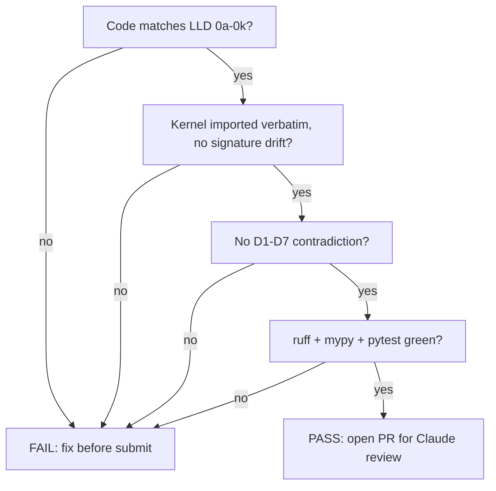
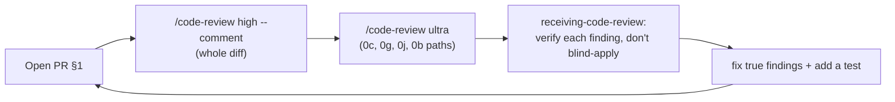

# Review & Audit Handoff to Anthropic/Claude

**What this document is for.** You (a local code-generation model running on an Apple M4 Max via Ollama) built the TigerExchange Phase-0 codebase under `tigerexchange/` by following the Phase-0 builder guide and the sub-plans `0a`–`0k`. This document tells you, step by step, how to *stop building and hand the result to Claude (Anthropic)* — a stronger frontier model — for an independent review and audit. It explains exactly **what to submit**, **which review questions to ask**, **how to self-check each sub-plan before you submit**, **where the auditor finds the "why" behind every decision**, **how to trigger a deep cloud review**, and **which known issues to flag up front so they are not re-reported as new bugs**. Everything you need is in this file; you do not need any other document open to follow it.

---

## 0. Vocabulary (defined once, used throughout)

These terms appear below. Read them once.

| Term | Plain-language definition |
|---|---|
| **Claude / Anthropic** | A cloud frontier large-language model made by Anthropic. It is the *reviewer/auditor* here. You are the *builder*. We hand to Claude because frontier-model reasoning catches correctness and architecture defects that a smaller local model is likely to miss. |
| **PR (pull request)** | A named bundle of git commits on a branch, opened against the main branch, that a reviewer can read, comment on line-by-line, and approve. Created with the `gh` GitHub CLI. |
| **PEP (Policy Enforcement Point)** | The single code path every data read/egress/derivation must pass through to be authorized. Locked decision **D4**. Lives at `tigerexchange/packages/mod-pep/src/mod_pep/policy_enforcement_point.py`. |
| **Data-access broker** | The only component holding raw-store database credentials; it fetches rows and returns *already-projected, already-tier-checked* objects so feature modules never touch raw stores. Part of D4. |
| **Kernel / contracts kernel** | The frozen shared package `tigerexchange/packages/contracts/` (TierLattice, TenantContext, PEP request/response, interfaces). Every other package imports it verbatim. It is **authoritative** — code must match it exactly. |
| **Tier / TierLattice** | The 3-level sensitivity ordering `public < private < confidential`. The "MAX-rule" means a derived artifact's tier is the *highest* tier among its inputs. Unknown tier = `confidential` (fail-closed). |
| **Fail-closed** | On any doubt (error, abstention, missing data, partition), deny access — never grant it. The opposite, "fail-open," is the bug class this whole design exists to prevent. |
| **Quarantine** | When the classifier is unsure of a document's tier, it does not guess: it marks the record `QUARANTINE`, which is treated as `confidential` + excluded from all retrieval + queued for a human to adjudicate. Locked decision **D6**. |
| **Crypto-shred** | Deleting an encryption key so the data it protected becomes permanently unreadable, satisfying "erase this person's data" without physically scrubbing every store. |
| **RLS (Row-Level Security)** | A Postgres feature that filters rows by a per-request `tenant_id` so tenant A cannot read tenant B's rows in a shared (pooled) database. |
| **D1–D7** | The seven *locked* founder/architecture decisions in `plans/00-decisions.md`. They are ground truth; code must not contradict them. Summarized in §4 below. |
| **LLD** | "Low-Level Design" — the per-sub-plan spec files `0a`–`0k` in `plans/phase0/` that the code was built against. |
| **`/code-review`** | A Claude Code slash command that reviews the current git diff for bugs and cleanups. `/code-review ultra` ("ultrareview") runs a deeper multi-agent review in the cloud. |

**Project layout you built (for reference):**

```
tigerexchange/
├── packages/
│   ├── contracts/          # the frozen kernel (sub-plan 0a)
│   ├── mod-pep/            # PEP + data-access broker (0c)
│   ├── mod-identity/       # Keycloak/CILogon + Entitlement/Edition (0d)
│   ├── mod-pooled-plane/   # pooled multi-tenant data-plane helpers (0d)
│   ├── mod-audit/          # per-stream hash-chain audit (0e)
│   ├── mod_ai/             # classification-routed model router + BYO (0f)
│   ├── mod-confidential-crypto/ # per-tenant KEK/DEK + crypto-shred (0g)
│   ├── mod-confidential-cogs/   # confidential-tier COGS accounting (0g)
│   ├── mod-ingestion/      # OpenAlex/Crossref/ROR/ORCID/SPECTER2 + grants (0h)
│   ├── identity-resolution/ # entity resolution feeding ingestion (0h)
│   ├── retrieval/          # Qdrant + OpenSearch + RRF + reranker + RAGAS (0i)
│   └── mod-lit-intelligence / mod-discovery / mod-funding-lite/  # feature modules (0k)
└── services/
    ├── classification/     # fail-closed classifier + adjudication queue (0b)
    ├── central_index/      # central-index read PEP + discoverability_scope (0j)
    └── api/                # FastAPI app wiring it all together (0a defines DI)
```

> Note: exact package directory names follow each sub-plan's "Files" section. If a name in your build differs from the table above, use *your* actual path in the PR — do not rename to match this table.

---

## 1. What to submit (the handoff bundle)

Submit **three things together**, as one git branch + PR. The reviewer needs the *code*, the *spec it was built against*, and *this guide*. Without the spec, Claude cannot tell "deviation from intent" from "the intent itself."

| # | What | Where it is | Why it must be included |
|---|---|---|---|
| 1 | **The built code** | the whole `tigerexchange/` tree on a feature branch | the thing under review |
| 2 | **The spec it was built against** | `plans/phase0/00-kernel-contracts.md`, `plans/phase0/0a`–`0k`, `plans/00-decisions.md` | so Claude checks *code vs intended design*, not code vs its own guesses. We include these because a reviewer with no spec invents an implied spec and reports false positives. |
| 3 | **This guide + audit trail** | `plans/phase0/guide/13-review-and-audit-handoff.md` (this file) + the four trail files in §5 | so Claude can read *why* each decision was made and not re-litigate locked strategy. The whole convergence (§5) hinged on stopping reviewers from re-arguing strategy; this guide tells the auditor the same. |

### 1.1 Exact commands to create the branch and PR

Run these from inside the repo. Replace nothing except the branch name if it already exists.

```bash
# 1. Make a feature branch off main (never commit Phase-0 work straight to main).
git checkout -b phase0/built-mvp

# 2. Stage and commit the built tigerexchange/ tree and the plans it was built against.
git add tigerexchange/ plans/
git commit -m "feat(phase0): build TigerExchange Phase-0 MVP against locked plan 0a-0k

Co-Authored-By: Claude Opus 4.8 <noreply@anthropic.com>"

# 3. Push and open a PR for review.
git push -u origin phase0/built-mvp
gh pr create \
  --title "TigerExchange Phase-0 MVP — review & audit" \
  --body-file plans/phase0/guide/13-review-and-audit-handoff.md
```

> We use a PR (not a raw diff or a zip) **because** a PR gives the reviewer line-anchored comments, CI status, and a stable base for the deep review in §6. We considered attaching a tarball and rejected it: a tarball loses the diff against `main`, so the reviewer cannot see *what changed* versus pre-existing scaffolding.

**Before you push, the CI walking skeleton from sub-plan `0a` must pass locally.** Run and confirm green output:

```bash
cd tigerexchange
ruff check .          # lint — must report no errors
mypy packages services # type-check — must report no errors
pytest -q             # all tests green (TDD: every task shipped with tests)
```

Do not open the PR if any of these three fail. A red CI wastes the reviewer's first pass on noise that you can fix locally. If you cannot make one green, say so explicitly in the PR body under a "Known failing" heading (see §7) — do not hide it.

---

## 2. Review dimensions — the five adversarial lenses, mapped to concrete questions

The design converged by attacking it from **five fixed lenses** (this is recorded in `plans/decision-log.md` and `plans/convergence-report.md`). Ask Claude to review the *code* through the same five lenses. For each lens below: the lens, *why it matters*, and the **exact questions** to put in front of the reviewer. Copy these verbatim into the PR or the review prompt.

### Lens A — Distributed-systems / scale
*Why:* the single hardest property of the whole system is "a revoked confidential artifact must never be served," kept correct **without** a global synchronous dependency on the read hot path (decision **D5**). Most converged-away bugs were fail-open races here.

Ask Claude:
1. Does any confidential read path do a **strongly-consistent local read** of the durable revocation/tombstone state at the owning node before returning data, or can a cached lease serve a revoked artifact? (This is convergence-report HIGH #1 — the lease-vs-tombstone composition. Phase-0 is single-tenant own-data; confirm the *seam* is fail-closed even though cross-institution revocation is stubbed.)
2. Are "epoch" / version fields used at **one** consistent granularity (per-cell vs per-record), so the CDC/index applier never over-rejects valid updates nor under-rejects a stale revoked one? (HIGH #2.)
3. Is `discoverability_scope` evaluated at query time against an **owner-committed** value, never a cached higher scope, so a projection is never queryable wider than its owner currently allows? (HIGH on share-correctness.)
4. On recovery/restart, does the code refuse to serve confidential reads until revocation state is rebuilt from the durable log (fail-closed during recovery)?

### Lens B — Security / confidentiality
*Why:* confidential proposal content is the most sensitive artifact in the product. Decisions **D4** (single PEP), **D6** (confidential never enters the shared index; quarantine default-deny), **D7** (pooled vs dedicated isolation) all live here.

Ask Claude:
1. Can a feature module read a raw store or construct a `PublishableProjection` **without** going through the PEP/broker? (Should be structurally impossible — verify the import-linter contract and that the broker holds the only raw-store credentials. HIGH on broker topology.)
2. Does `PublishableProjection` reject `confidential` tier at validation, so confidential-derived content can never reach the central index (D6)?
3. On classifier abstention/low confidence, is the result forced to `QUARANTINE` (tier=confidential, excluded from all retrieval, queued for adjudication) rather than a permissive tier guess (D6)?
4. Are **all** confidential derivative stores (vector, lexical/BM25, graph, object, cache) — **and the generated draft + its autosave/version-history** — encrypted under the tenant KEK, so crypto-shred actually shreds the searchable copies? (HIGH on generated-draft tiering + HIGH on derivative-store KEK.)
5. Is the **eval/RAGAS path** routed through the PEP, with gold-sets/traces/judge-I-O tagged confidential-tier and KEK-encrypted, and is a confidential eval forbidden from selecting a cloud judge? (HIGH on un-PEP-gated eval side-door.)
6. In the pooled plane (PLG/public): is there object-level deny-by-default authz on every request, with `FORCE` RLS + `tenant_id`-leading index + `RESTRICTIVE` policy + `WITH CHECK` + `SET LOCAL` (not `SET`) as defense-in-depth? Are `SECURITY DEFINER`/materialized views blocked from bypassing the tenant predicate? (HIGH on pooled-tenant isolation.)

### Lens C — Maintainability / modularity
*Why:* the locked requirement is "pluggable modules, minimal blast radius." A god-object PEP or an un-versioned contract would silently rot into a distributed monolith.

Ask Claude:
1. Does the data-access broker's DB role read **only** the shared confidential-artifact/classification tables, *not* any feature module's owned schema? (HIGH on broker-as-god-object.)
2. Does every module own its schema and reach no other module's tables (import-linter "no cross-schema query")?
3. Do kernel interfaces carry a versioning/evolution rule (`KERNEL_API_VERSION`, `InterfaceLocus`/`INTERFACE_LOCUS`), and does `PublishableProjection` have an independent `projection_schema_version` separate from `lattice_version`? (HIGH on contract evolution.)
4. Is the kernel free of any persistence/feature-engine import (the import-linter fitness function in `contracts/pyproject.toml`)?

### Lens D — Product / GTM
*Why:* this lens governs strategy (which wedge, pricing, sequencing), already **locked** in D1/D2/D3. For a *code* review it is mostly out of scope — but the code must not silently bake in a contradicting assumption.

Ask Claude (lightweight):
1. Does the `Edition`/`Entitlement` capability model match D1/D2 (grant-intelligence wedge; PLG capped at public+own-materials; confidential/exchange off for PLG)?
2. Is anything strategy-level (pricing constants, wedge scope) hardcoded in code where it should be config? Flag, do not redesign — strategy is locked, see §3 of the trail.

### Lens E — Cost / ops
*Why:* decision **D7** requires institutional ACV ≥ 2–3× per-tenant COGS, and the GPU-density assumption is load-bearing.

Ask Claude:
1. Does sub-plan `0g`'s Table-B COGS reconciliation use line items that **sum to the stated totals** (shared-GPU K=2 ≈ $42k/yr; dedicated ≈ $66k/yr), with no stated-total-vs-rows contradiction? (HIGH on Table-B arithmetic.)
2. If confidential tenants share a GPU (K=2), is in-process isolation (separate vLLM process / MIG partition, no shared KV-cache) used — not just at-rest volume keys? (HIGH on GPU-density vs isolation; binds the D7 ratio.)

---

## 3. Per-sub-plan acceptance checklist

For **each** sub-plan, confirm the code matches its LLD **and** the kernel **and** the locked decisions. Mark each row Pass / Fail / N-A (with a one-line reason). Put this filled-in table in the PR body so the reviewer audits *your* self-assessment, not a blank.

| Sub-plan | Acceptance check (code must satisfy ALL) |
|---|---|
| **0a Foundation** | monorepo `packages/`+`services/` layout exists; `contracts/` kernel matches `00-kernel-contracts.md` **verbatim** (symbol names, signatures, `KERNEL_API_VERSION`, `INTERFACE_LOCUS`); Postgres `FORCE` RLS with `SET LOCAL` tenant pin; FastAPI skeleton with DI factories in `api.dependencies`; CI runs ruff+mypy+pytest green. |
| **0b Classification** | single classifier; abstention/low-confidence → `ClassificationResult.quarantine()` (tier=confidential, `Decision.QUARANTINE`); quarantined records excluded from retrieval; adjudication queue exists. (D6) |
| **0c PEP + broker** | one `PolicyEnforcementPoint` class at `packages/mod-pep/.../policy_enforcement_point.py` with the keyword-only ctor `(*, entitlement_evaluator, classifier, rebac, abac, tombstone, lease, broker, pooled_authz)` and `authorize(request) -> PepResponse`; broker is the only raw-credential holder and returns projected/tier-checked objects; broker DB role can read only confidential-artifact/classification tables; owner-local revocation decision-order; non-ALLOW carries no payload. (D4, D5) |
| **0d Identity + Entitlement** | Keycloak+CILogon OIDC; `EntitlementEvaluator.evaluate(request, requested_tier=tier) -> PepResponse` called by 0c's PEP; PLG capped at `private`/own-materials, `confidential-workspace`+`exchange-participation` OFF; pooled-plane object authz deny-by-default. (D1, D7) |
| **0e Audit spine** | per-stream hash-chain `AuditEvent` (`prev_hash`→`entry_hash`); `IAuditSink.append(event)` one-arg + `store.persist(event, tenant)`; signed `checkpoint(stream_id)` head. |
| **0f Model Router** | provider-agnostic registry; `satisfies_locality(tier)` on concrete providers; routes non-public to local/in-boundary, fails closed to in-boundary if no compliant provider attests; BYO keys + guardrails. |
| **0g Confidential KEK stores** | per-tenant KEK/DEK; **all** confidential derivative stores (Qdrant/OpenSearch/AGE/object/cache) **and** generated drafts + autosave/version-history KEK-encrypted; crypto-shred leaves zero decryptable hits (contract test); Table-B COGS rows sum to stated totals. Scoped **single-tenant own-data** in Phase-0. (D6, D7) |
| **0h Ingestion** | Dagster pipelines for scholarly + grant corpora; classify→gate→index outbox (no record indexed before classification); entity resolution (ROR/ORCID). (D6) |
| **0i Retrieval + eval** | Qdrant + OpenSearch + RRF + reranker behind `IRetrievalStrategy`; results PEP-gated and projected; **RAGAS eval routed through the PEP**, gold-sets/traces/judge-I-O confidential-tier + KEK-encrypted, confidential eval cannot pick a cloud judge. (D6) |
| **0j Central-index read PEP** | per-query authz; `discoverability_scope` (`public-web|federation-wide|named-consortium|named-tenants|none`) evaluated against **owner-committed** scope at query time, never cached-high; this is the single central-index PEP (no duplicate in 0c). (D6) |
| **0k Feature modules** | mod-lit-intelligence (grounded drafting), mod-discovery (public OpenAlex; PUBLIC-tier only — goes through the central-index read PEP for scope filtering only, never the confidential path), mod-funding-lite (grant match); each consumes the kernel + PEP via `api.dependencies` DI; no module touches raw stores or another module's schema; confidential draft persistence stays single-tenant via 0g. (D1, D2, D4) |

**Cross-cutting acceptance gates (apply to the whole build):**



---

## 4. Locked decisions D1–D7 (ground truth — code must never contradict)

The auditor verifies the code against these. They are **not** open for re-debate; full reasoning is in `plans/00-decisions.md`.

| ID | Decision | What the code must reflect |
|---|---|---|
| **D1** | Wedge = grant intelligence (cross-institution team assembly + secure proposal collaboration). | Feature modules and editions serve the grant workflow. |
| **D2** | Narrow-to-land scope, **full** modular architecture; the other 3 wedges are this workflow's decomposition. | Full kernel + modules built now; scope of *active* features narrow. |
| **D3** | Cold-start by anchoring on one existing federally-funded multi-site center with an existing DUA. | Phase-0 is single-tenant own-data for that anchor; cross-institution exchange stubbed. |
| **D4** | Single PEP + data-access broker chokepoint. | One PEP class; broker is sole raw-credential holder; modules can't bypass. |
| **D5** | Owning node is the sole local fail-closed authority; **no** global hot-path consensus. | Confidential decisions are owner-local, strongly consistent locally, fail-closed. |
| **D6** | Confidential content never enters the shared central index; red-team gate before any shared-index write; classifier abstention → quarantine default-deny. | `PublishableProjection` rejects confidential; quarantine path; index write-gate. |
| **D7** | Institutional ACV ≥ 2–3× per-tenant COGS; pooled for non-confidential, dedicated isolation only for confidential. | Pooled plane for PLG/public with RLS isolation; dedicated confidential cell; COGS reconciled. |

---

## 5. Where the audit trail lives (so the auditor sees *why*)

The reviewer should read these **before** filing findings, so they understand which choices are deliberate (and resolve a named risk) versus accidental. Point Claude to them explicitly in the PR body.

| File | What it contains | Use it to answer |
|---|---|---|
| `plans/00-decisions.md` | The seven locked decisions D1–D7 **with full rationale** ("we chose X over Y because…"). | "Is this design choice intentional and locked?" |
| `plans/critique-log.md` | The full round-by-round adversarial critique (v1→v5), every critical/high finding per lens, per version. ~448 KB. | "Was this exact concern already raised and resolved?" |
| `plans/convergence-report.md` | The outcome: 0 critical / 11 high remaining, each high written as *finding → why → fix*, grouped by the five lenses. | "Which known refinements are accepted/assigned, not new?" |
| `plans/decision-log.md` | The narrative of *how* the design converged across v1→v5, the recurring root-cause insight ("revocation correctness without a global hot-path dependency"), and the 10 resolved tradeoffs. | "Why does the architecture look the way it does?" |

**The convergence story in one line, for the auditor:** the first 4-round loop never converged (~9 critical / ~21 high every round) because critics kept *re-litigating strategy*; locking D1–D7 and bounding critics to implementation-correctness produced **0 critical / 11 high, 0 relitigation**. So: ask Claude to review *implementation correctness against the locked spec*, not to re-argue the wedge, pricing, or federation thesis (those are D1/D2/D3/D7, locked).

---

## 6. How to invoke a deep review

Two levels. Start with the standard one; escalate to ultra for the security-critical paths.

| Command | What it does | When to use |
|---|---|---|
| `/code-review` | Reviews the current git diff (your PR branch vs `main`) for correctness bugs and reuse/simplification cleanups. Effort levels `low`/`medium`/`high`/`max`. | First pass on the whole PR. Use `high` for this build (broader coverage). |
| `/code-review ultra` (a.k.a. "ultrareview") | A **user-triggered, cloud, multi-agent** review of the branch/PR — multiple reviewer agents in parallel, deeper than a single pass. | Escalation for the confidentiality-critical paths (PEP/broker 0c, KEK/crypto-shred 0g, central-index 0j, classifier 0b). |

Useful flags:
- `/code-review --comment` posts findings as inline PR comments (so they live on the PR, line-anchored).
- `/code-review --fix` applies the findings to the working tree after review (use only after you have read them).

**Recommended sequence:**



`/code-review ultra` is a **user-triggered** action — it runs in the cloud and is initiated by the human operator, not silently by you. Ask the user to run it on the security-critical paths once the standard pass is clean.

When you receive findings, **do not implement blindly.** Verify each one is real against the spec (the receiving-code-review discipline): a finding that contradicts a locked decision D1–D7 or the kernel is likely a reviewer misunderstanding of intent — point it back at §5's trail rather than "fixing" the architecture.

---

## 7. Known non-blocking items to call out up front

State these in the PR body under a **"Known / accepted — do not re-report as new"** heading. They are deliberate Phase-0 scope or accepted refinements already tracked in `convergence-report.md`. Calling them out stops the reviewer from spending the audit on them.

1. **Cross-institution exchange/revocation is stubbed (Phase-1+), by design.** `IExchangeFeed` and `IRevocationAuthority` are kernel **seams only** with explicit "Phase-1+" docstrings and **no Phase-0 implementation**. Per D3, Phase-0 stores the anchor center's *own* confidential drafts single-tenant; 0g (KEK/crypto-shred), 0c (owner-local revocation), 0e (signed checkpoints) are kept but scoped single-tenant own-data.
2. **The 11 remaining HIGH items are refinements, not blockers.** They are listed in `convergence-report.md` (0 critical / 11 high) and each is assigned to an owning sub-plan via `_decomposition.json` (`highs_addressed`). They are the *target* of the review, not surprises — but they were known before the build.
3. **Historical inconsistencies in the review docs are pre-fix narration.** `_consistency-check.md` and `_recheck-after-fixup.md` describe a *pre-fix* state (e.g. an old `services/pep` path, a `IRerankerLike := IReranker` walrus artifact). Those were resolved; the canonical state is `00-kernel-contracts.md` + `README.md`. Do not report the historical text as live bugs.
4. **Open questions are demand/legal/measurement facts, not code defects.** `decision-log.md` lists kill-gates (Gate A/B), procurement/SOC2 timing, and measurement spikes (lease-latency, index-skew, privacy red-team). These are validated with customers/benchmarks, not in this code review.
5. **Strategy lens (D) is mostly out of scope for a code review.** D1/D2/D3/D7 are locked. Flag only if code *hardcodes* a strategy assumption that should be config; do not propose a different wedge or pricing.

---

## 8. One-page submission checklist (do this, in order)

- [ ] `cd tigerexchange && ruff check . && mypy packages services && pytest -q` all green.
- [ ] Filled-in §3 acceptance table pasted into the PR body (Pass/Fail/N-A per sub-plan).
- [ ] §2 five-lens review questions pasted into the PR body for Claude.
- [ ] §7 "Known / accepted" list pasted into the PR body.
- [ ] Links to the four §5 trail files in the PR body.
- [ ] Branch `phase0/built-mvp` pushed; PR opened with `gh pr create` (§1.1).
- [ ] Run `/code-review high --comment` on the full diff.
- [ ] Ask the user to run `/code-review ultra` on 0c, 0g, 0j, 0b.
- [ ] For each finding: verify against spec/kernel/D1–D7 before changing code; add a test for every real fix.
