# Plan v1

> Adversarial review of this version: **10 critical**, **21 high** findings.

---

This is a synthesis and writing task — produce a comprehensive markdown implementation plan grounded in the provided research brief. No codebase work needed. I'll write the full plan directly.

# plan1 — Federated Multi-University Research Collaboration & Discovery Platform

*A from-scratch, production-grade redesign inspired by TigerResearchBuddy. Opinionated, sequenced, fundable. This is plan1 of an iterative loop — strong by design, but Section 19 is deliberately honest about what must still be validated.*

**One-line invariant the whole platform enforces:** *publishable metadata is centralized for fast discovery; confidential bytes never leave their cell; every confidentiality decision is made fresh at the owning node under a ReBAC+ABAC policy; eventual consistency is permitted only where a leak is structurally impossible.*

---

## 1. Vision & Positioning

### 1.1 The product in one sentence
A federated, AI-native research collaboration platform where each university owns a strongly-isolated node holding its confidential data, and a thin shared exchange layer enables selective, revocable cross-institution discovery and collaboration **without ever centralizing confidential bytes**.

### 1.2 The white space (why this is unoccupied)
The market splits into six silos, each solving one pillar partially:

| Silo | Players | What they own | What they lack |
|---|---|---|---|
| Profile/data layer | Elsevier **Pure**, Clarivate **Converis/Esploro**, **Symplectic**, **Academic Analytics**, **Dimensions**, OSS **VIVO** | Institutional research metadata | No AI-native grounded Q&A; no confidential federation |
| AI over public literature | **Elicit, Consensus, Scite, SciSpace, Undermind, Scholar-QA** | Workflow AI over *public* papers | Public-only; single-user; no institutional data; no federation |
| Grants/compliance admin | **Cayuse, Kuali, Pivot-RP, GrantForward, Instrumentl** | Grants workflow | Not AI-native; no discovery; no confidential collaboration |
| AI grant fast-follow | **Atom Grants / GrantsAI** (~$179/mo, 50+ institutions, pillars 1+4) | AI co-PI matching into RD offices | **Single-tenant, public-data-only** — no confidentiality, no federation |
| Commercial clean rooms | **Decentriq, BeeKeeperAI, Snowflake/Databricks/Azure clean rooms, Duality** | Confidential multi-party compute | Generic; not research-native; no scholarly graph or AI Q&A |
| Academic public federation | **VIVO CTSAsearch / Direct2Experts** (64 institutions) | Public-LOD expert federation | Public-tier only; no confidential tier; no AI layer |

**Nobody federates confidential cross-institution research data with revocable grants + AI-native grounded Q&A on top.** That precise intersection is the white space, and it is technically de-risked: Secure Multifaceted-RAG (arXiv 2504.13425) validates classification-routed RAG; TEEs (SEV-SNP/TDX/Nitro) are production; Zanzibar ReBAC (SpiceDB) gives revocation correctness as a guarantee.

### 1.3 Positioning statement
> For research-active universities that must collaborate across institutional boundaries without exposing confidential IP, TigerExchange (working name) is a federated research intelligence platform that keeps every institution's confidential data inside its own boundary while enabling AI-grounded discovery, expert matching, secure shared workspaces, and grant team assembly across institutions — unlike public-only AI tools (Elicit, Atom Grants) or generic clean rooms (Decentriq), it is research-native and confidentiality-first by construction.

### 1.4 Why now (timing thesis)
1. **AI-native scholarly Q&A is proven but commoditized at the public tier** — the unowned frontier is institutional/confidential data, which public tools structurally cannot touch.
2. **The federation primitives just matured**: SpiceDB/OpenFGA (Zanzibar) productionized ReBAC; TEEs (Nitro/SEV-SNP/TDX) made confidential compute deployable; vLLM made local frontier-class inference economical.
3. **Regulatory pressure is rising** (export controls tightening, GDPR enforcement, NIH/NSF data-sharing mandates) — "your confidential data never leaves your node" is becoming a procurement requirement, not a nice-to-have.
4. **The incumbent data layer is stale and non-AI** (Pure/Converis), and the AI startups are public-only and outfunded on public literature — so we neither fight them on their turf nor get fought on ours.
5. **A credible fast-follow exists (Atom Grants)** validating the buyer and the wedge, but it is single-tenant/public-only — we have a structural moat (confidentiality + federation) they cannot bolt on cheaply.

### 1.5 The moat
- **Federation network effect**: value compounds with each connected node; the exchange layer is worthless single-tenant and defensible at N≥2.
- **Confidentiality as architecture, not feature**: per-tenant keys + local-model routing + ReBAC revocation are load-bearing from day one; a competitor retrofitting these re-architects.
- **Compliance posture as sales weapon**: "confidential data never leaves your node" is the single strongest HECVAT/SOC2 answer.

---

## 2. Users, Buyers & Packaging

### 2.1 Personas

| Persona | Role | Primary jobs-to-be-done | Pillar |
|---|---|---|---|
| **PI / Lab Director** | Research-active faculty | Find collaborators, mine own + public literature, manage confidential project corpus | 1, 2, 3 |
| **Postdoc / Grad researcher** | Bench/field researcher | Grounded Q&A over papers + internal docs, lit review | 2 |
| **Research Development Officer** | Central RD office | Grant discovery, cross-institution team assembly, funding intelligence | 1, 4 |
| **Sponsored Programs / Compliance** | Research admin | Export-control gating, DUA tracking, audit | (cross-cutting) |
| **Librarian / Scholarly Comms** | Library | Expert discovery, profile data quality, OA corpus | 1, 2 |
| **Research IT / CISO** | IT security | HECVAT, SOC2, isolation, key custody, deprovisioning | (cross-cutting, veto holder) |
| **VP Research / Consortium lead** | Executive | Cross-institution alliances, strategic collaboration | 1, 3, 4 |

### 2.2 The four buyers and how one product serves all four

| Buyer motion | Entry point | What they buy first | Procurement surface |
|---|---|---|---|
| **Bottom-up PLG** | Individual PI/lab | Lit-intelligence + private-corpus over own data, few seats | Below committee threshold — credit card / dept PO |
| **Top-down institutional** | Research office / library / IT | Campus-wide discovery + node deployment | HECVAT + SOC2 + DPA |
| **Consortia / alliances** | Multi-institution alliance | Exchange add-on connecting ≥2 nodes | Master agreement + per-node |
| **Campus-wide** | Provost / VP Research | All-pillar, FTE-capped site license | Full procurement |

**The mechanism: one architecture, packaging toggles — not four products.** Editions are config flags over the same modular platform (Section 5). A PLG lab and a campus-wide deployment run the *same* node software with different modules enabled and different isolation posture (shared managed cell vs dedicated cell).

### 2.3 Editions

| Edition | Deployment | Modules | Tiers active | Target buyer |
|---|---|---|---|---|
| **Lab (PLG)** | Managed shared-control, soft-isolated cell | Lit-Intelligence, Discovery (read) | public + private | Individual PI/lab |
| **Department** | Managed dedicated cell | + Workspaces | public + private (confidential schema present, gated) | Dept / RD office |
| **Institution** | Managed dedicated cell OR self-hosted node | All four pillars | public + private + confidential | Campus-wide |
| **Consortium** | ≥2 Institution nodes + Exchange add-on | All + cross-institution exchange | all + sharing grants | Alliance |
| **Sovereign / On-prem** | University-operated node, BYOK/HYOK | All | all, HYOK key custody | Export-controlled / high-security |

### 2.4 Pricing model (copying Starmind's structure)

```
Per-institution node/platform base fee
  + per-active-user pillar modules (discovery | lit-intelligence | workspaces | funding)
  + consortium/exchange add-on (priced per connected institution)
  + BYO-provider/key tier (premium)
```

**Benchmarks grounding the bands:**
- PLG seat: $12–$20/seat/mo (defer committee).
- Department band: $179–$499/mo (Instrumentl/Atom benchmark).
- Institutional base: Starmind ~$4k/mo base ≤500 profiles + $0.60–$2.20/active-user; Interfolio ~$28k/yr FTE.
- Consortium exchange: priced per connected institution (network value).

One SKU serves PLG (one module, few seats) → department → campus-wide (FTE-capped) → consortium (exchange add-on). **Editions = config toggles, not forks.**

### 2.5 GTM sequencing
1. **Land** PLG private-corpus into a single research-active lab (below committee threshold). Earn revenue, prove the local-model isolation demo.
2. **Expand** to department, then institution-wide expert discovery (now engage HECVAT/SOC2 — already started day one).
3. **Flip on the exchange** once ≥2 nodes are live (the federated moat lights up with zero re-architecture).
4. **Monetize the consortium** via cross-institution grant/team-assembly (enter Atom Grants' territory *with* the confidentiality+federation they lack).

**Strategic don'ts:** don't rebuild the public graph (OpenAlex + ORCID); don't lead with public-literature AI (commoditized, outfunded); **integrate don't displace** incumbents early (connectors to Pure/Esploro/ORCID/OpenAlex in; push to Cayuse/Kuali out).

---

## 3. Feature Catalog & MVP Sequencing

### 3.1 The four pillars as modules

| # | Pillar | Module name | Core capability | Depends on kernel |
|---|---|---|---|---|
| 1 | Cross-institution collaborator/expert discovery | `mod-discovery` | Expertise fingerprints, expert search, GNN link prediction, federated expert matching | Classification, Retrieval, Graph, Exchange |
| 2 | Research & literature intelligence | `mod-lit-intelligence` | Grounded Q&A + semantic search over papers/profiles/internal docs; CRAG citation faithfulness | Classification, Retrieval, Model Router, Audit |
| 3 | Secure shared cross-institution workspaces | `mod-workspaces` | Confidential project collaboration via clean rooms/TEE, sharing grants, zero-copy query-where-data-resides | Authz (ReBAC), Exchange, TEE broker, Temporal |
| 4 | Grant & funding intelligence + team assembly | `mod-funding` | Funding discovery, cross-institution co-PI matching over federated public-tier graph | Discovery, Exchange, Graph |

### 3.2 The kernel (built FIRST, in MVP — non-negotiable)

These are interface-load-bearing primitives that **cannot be retrofitted**. Thin implementations are fine; skipping their interfaces forces re-architecture (Risk #7).

1. **Data-classification engine** — classifies every record as `public | private | confidential`; emits the routing attribute that binds everything.
2. **Model router** — classification → model binding; the locked differentiator (Section 8).
3. **Tenant isolation primitive** — structural deny-by-default; per-tenant keys; cell boundary.
4. **Authz spine** — SpiceDB (ReBAC) + Cedar (ABAC) two-stage PEP/PDP (Section 7).
5. **Audit spine** — append-only, tamper-evident log of every access decision (Section 11).
6. **Identity resolution service** — author disambiguation; consumed by graph build, expertise, discovery (Section 6).

### 3.3 MVP wedge (explicit, resolving the cross-report contradiction)

The market report says lead with *confidential single-lab local-model-only* (easiest security review). The security report says lead with *public+private discovery* (lowest sensitivity, defers heavy machinery). **These are sequential phases of one wedge, not a conflict:**

> **MVP = AI-native research/literature intelligence + expert discovery over a single research-active lab/department's OWN corpus, single-tenant, bottom-up PLG.** Run **public + private** tiers fully. **Define the confidential tier in the schema and prove the local-model isolation story from day one** (it's the demo that wins the room). Gate the heavy confidential machinery (HYOK, full export-control gate, cross-institution grants) as the immediately-following phase.

This exercises the kernel (classification + router + isolation + ReBAC + audit) with the smallest procurement surface, and the federation/exchange layer lights up in Phase 2 with **zero re-architecture**.

### 3.4 Beachhead buyer
A **single research-active department or lab at one R1** (bottom-up PLG, $179–$499/mo department band).

**High-value variant:** an **export-controlled engineering/defense lab** — ITAR/EAR-aware sharing is genuinely novel; no AI-assistant competitor can touch it. Higher ACV, lower competition, but requires the export-control gate early (see Risk #3 — opt-in per project).

### 3.5 What ships in MVP vs deferred

| Capability | MVP | Phase 2 | Phase 3 | Why deferred |
|---|---|---|---|---|
| Hybrid retrieval (vector+BM25+RRF) | ✅ | | | MVP-essential |
| Reranking (BGE-reranker-v2-m3) | ✅ | | | Highest cheap ROI |
| Grounded Q&A (single-shot) | ✅ | | | Core pitch |
| Public + private tiers | ✅ | | | Lowest sensitivity |
| Confidential tier (schema + local-model isolation demo) | ✅ (defined + demoed) | (heavy machinery) | | Win-the-room demo; gate complexity |
| Classification engine + model router (kernel) | ✅ | | | Cannot retrofit |
| Authz spine (SpiceDB + Cedar, thin) | ✅ | | | Cannot retrofit |
| Audit spine | ✅ | | | Cannot retrofit |
| Identity resolution (deterministic anchors) | ✅ | LLM adjudication | | Foundational; LLM later |
| Expert discovery (profile-as-retrieval) | ✅ (single-tenant) | institution-wide | cross-institution | Federation needs ≥2 nodes |
| Knowledge graph (deterministic backbone) | ✅ | HippoRAG2 PPR | | LLM-extraction tax later |
| Federation / exchange layer | | ✅ | | Needs ≥2 nodes |
| Cross-institution sharing grants | | ✅ | | Federation dependency |
| Secure workspaces (TEE/clean room) | | ✅ | | Heavy confidential machinery |
| GNN link prediction | | ✅ | | Needs graph maturity |
| Grant/funding intelligence + team assembly | | | ✅ | Monetize consortium; Atom territory |
| Adaptive RAG routing | | ✅ | | Module behind interface |
| CRAG corrective loop | | ✅ | | Lit-intelligence credibility |
| Multi-agent query decomposition | | | ✅ | Grant team assembly only |
| MS-GraphRAG global summarization | | | opt-in | ~331k tokens/query — overkill |
| Learned convex fusion (per-tenant) | | ✅ | | Needs click feedback to accrue |
| FHE encrypted-match | | | pilot | Research/narrow — off critical path |
| SOC2 Type II | start day one → | ✅ (achieved) | | Gates first institutional contract |

---

## 4. System Architecture

### 4.1 The spine: control-plane / data-plane split (AWS SaaS Lens "bridge model")

Pool the public/discovery surface; **silo the confidential data plane per university**. The isolation decision is made **per data store by regulatory profile**, not globally.

```mermaid
graph TB
    subgraph CP["SHARED CONTROL / EXCHANGE PLANE (holds NO confidential bytes)"]
        IDP["Identity: CILogon front-door → Keycloak token issuer"]
        SPICE["SpiceDB — cross-tenant sharing grants (globally consistent, ZedToken)"]
        DISC["Central metadata discovery index<br/>(publishable profiles, abstracts, capability tags,<br/>embeddings of publishable text, pointers to owning nodes)"]
        TEE["Exchange/match broker inside TEE<br/>(SEV-SNP / TDX / Nitro) — operator cannot read match inputs"]
        ROUTERPOL["Model-router policy registry"]
        BILL["Onboarding · Billing · Telemetry"]
    end

    subgraph CELLA["UNIV A DATA PLANE — isolated cell (region-pinned)"]
        PGA["Postgres: confidential+private<br/>(FORCE RLS, tenant_id-leading index — defense-in-depth only)"]
        QDA["Qdrant per-tenant vector index"]
        OSA["OpenSearch BM25"]
        AGEA["Apache AGE knowledge graph"]
        OBJA["Object storage (research cards, PDFs)"]
        LLMA["Local AI: vLLM (prod) / Ollama (dev)"]
        PEPA["Local PEP + PIP (Cedar embedded)<br/>confidential checks execute IN-boundary"]
        VAULTA["Vault — per-tenant DEK/KEK, BYOK/HYOK"]
        OUTBOXA["Transactional Outbox → Debezium CDC"]
    end

    subgraph CELLB["UNIV B DATA PLANE — isolated cell (EU in-region)"]
        PGB["Postgres confidential+private"]
        QDB["Qdrant"]
        LLMB["Local vLLM"]
        PEPB["Local PEP + PIP"]
        OUTBOXB["Outbox → CDC"]
    end

    IDP -.OIDC.-> PEPA
    IDP -.OIDC.-> PEPB
    OUTBOXA -."publishable metadata only".-> DISC
    OUTBOXB -."publishable metadata only".-> DISC
    DISC -."drill-down brokered back".-> PEPA
    DISC -."drill-down brokered back".-> PEPB
    SPICE -.grant checks.-> PEPA
    SPICE -.grant checks.-> PEPB
    TEE -.PSI / clean-room match.-> PEPA
    TEE -.PSI / clean-room match.-> PEPB
    ROUTERPOL -.policy.-> LLMA
    ROUTERPOL -.policy.-> LLMB
```

### 4.2 Plane responsibilities

**Per-university Data Plane = silo "cell"** (own infra or dedicated isolated data plane), region-pinned (EU in-region):
- Confidential + private Postgres (FORCE RLS + tenant_id-leading indexes — *defense-in-depth only, never the sole boundary*).
- Per-cell vector index (Qdrant) + BM25 (OpenSearch) + AGE knowledge graph + object storage + research cards.
- **Local AI** (vLLM prod / Ollama dev) for confidential routing.
- **Local PEP + PIP** (Cedar embedded) — confidential classification checks execute *inside* the boundary, never depend on the shared plane.
- **BYOK/HYOK** per institution.

**Thin shared Control/Exchange Plane (holds NO confidential bytes):**
- Central **metadata-only discovery index**: publishable profiles, abstracts, capability tags, embeddings of *publishable* text, **pointers** back to owning nodes. Populated via Transactional Outbox + log-based CDC (Debezium) from each cell (eventually consistent).
- **SpiceDB** relationship store — cross-tenant grants must be globally consistent.
- Identity/SSO, onboarding, billing, telemetry, model-router policy.
- **Exchange/match broker inside a TEE** (AMD SEV-SNP / Intel TDX / AWS Nitro Enclaves) so even the operator can't read cross-institution match inputs. *(TEE.Fail caveat: forged SEV-SNP/TDX attestation needs physical access + root → out of scope for our remote-attacker threat model.)*

### 4.3 How cross-institution discovery works WITHOUT leaking confidential data

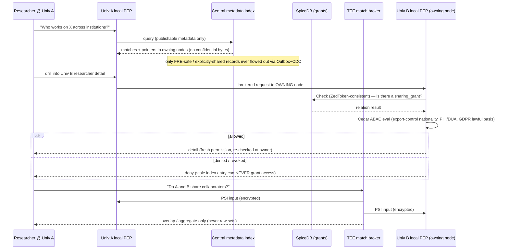

**The five mechanisms:**
1. Search hits the **central metadata index** → answers from publishable metadata + pointers only. Confidential bytes were never published; only FRE-safe / explicitly-shared records flow out via Outbox+CDC pub/sub.
2. Drill-into-detail is **brokered back to the owning node**, where its **local PEP** evaluates against *fresh* permissions (ZedToken-consistent) + compliance attributes.
3. "Do A and B share collaborators/interests?" → **2-party PSI** or in the TEE broker / clean room (returns overlap/aggregate, never raw sets).
4. Confidential joint work (Feature 3 workspaces, Feature 4 grant assembly over confidential data) → **data clean rooms / TEE**, zero-copy, query-where-data-resides, aggregation thresholds + pre-approved query templates.
5. **Revocation** = delete the sharing tuple + fast-path propagate; reads re-check at the owning node → stale index entries can **never** grant access.

### 4.4 Privacy-tech practicality ranking (what we use where)
**TEEs (production) > clean rooms (production) > 2-party PSI + DP for aggregates (production, bounded) > FHE (research/narrow — OFF the critical path, pilot only for a single encrypted-match feature).**

---

## 5. Modularity Model

### 5.1 What "modular to the bone" means here
Every pillar (discovery, lit-intelligence, workspaces, funding) is a **pluggable module behind the same PEP/PDP contract + same publish-metadata interface**. The bridge model means a new pool-tier module never touches the confidential silo. GTM editions = packaging toggles over one architecture, not forks.

### 5.2 Module definition (the contract)

A **module** is a deployable unit that:
1. Registers against the **kernel contracts** (classification, authz PEP, model router, audit, retrieval interface, publish-metadata interface).
2. Declares its **manifest**: name, semver, required kernel-contract versions, required tiers, emitted/consumed events, exposed FastAPI routes, RBAC scopes.
3. Never accesses another module's storage directly — only via published events or kernel services.
4. Can be enabled/disabled per edition via a config toggle, with deny-by-default if disabled.

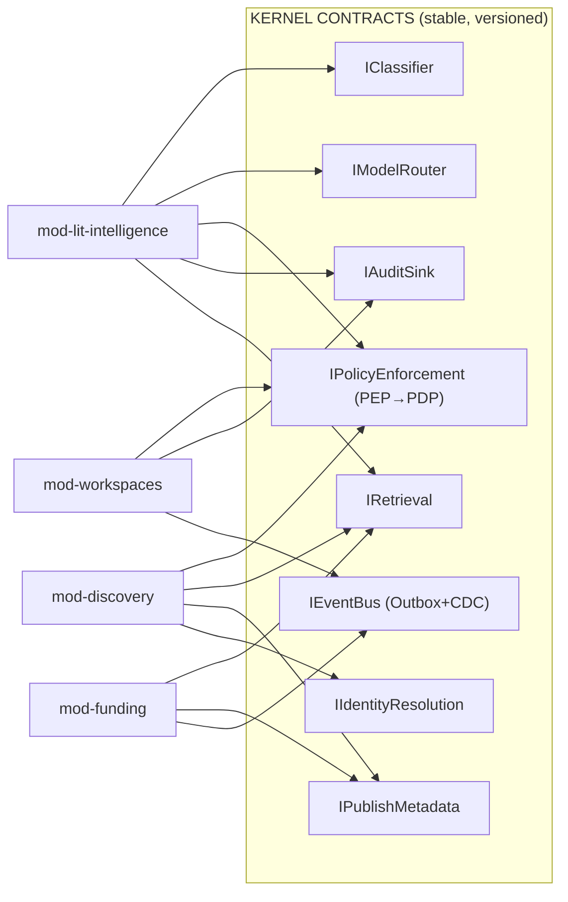

### 5.3 Communication: interfaces + contracts + events
- **Synchronous**: FastAPI HTTP/gRPC behind a per-module router prefix; all calls pass through the kernel PEP (object-level `Check` on every request — kills BOLA/IDOR, OWASP API #1).
- **Asynchronous**: **Transactional Outbox + Debezium CDC + idempotent consumers + schema registry**. Never naive dual-write (lost-event-forever failure, Risk #2). Events are versioned via the schema registry; consumers tolerate forward-compatible additions.
- **Cross-tenant**: *only* through the exchange layer's publish-metadata interface and SpiceDB grant checks. No module can address another tenant's storage.

### 5.4 Adding a module (minimal blast radius)
1. Implement the manifest + kernel-contract bindings.
2. Register routes, event subscriptions, RBAC scopes.
3. Declare edition eligibility (which packaging tiers expose it).
4. Deploy as an independent service/Helm sub-chart; feature-flag on.
5. **No kernel change required** if it stays within contract versions. A new pool-tier module never touches the confidential silo.

### 5.5 Removing a module (minimal blast radius)
1. Feature-flag off (deny-by-default).
2. Drain its event consumers; the schema registry retains historical event schemas.
3. Tear down its service; its storage is namespaced and independently droppable.
4. Kernel and other modules unaffected because no module reads another's storage.

### 5.6 Versioning
- Kernel contracts are **semver**; modules pin a compatible major. Breaking a contract = new major + a deprecation window where both are served.
- Events carry a schema version; the registry enforces backward/forward compatibility on register.

### 5.7 Directory / service boundaries

```
platform/
  kernel/
    classification/        # IClassifier
    model_router/          # IModelRouter
    authz/                 # IPolicyEnforcement (SpiceDB client + Cedar eval)
    audit/                 # IAuditSink
    retrieval/             # IRetrieval (thin interface over LlamaIndex)
    publish_metadata/      # IPublishMetadata (Outbox writer)
    identity_resolution/   # IIdentityResolution
    eventbus/              # Outbox + CDC + schema registry client
  modules/
    discovery/
    lit_intelligence/
    workspaces/
    funding/
  exchange/                # control-plane: central index, TEE broker, grant store client
  cell/                    # data-plane node bootstrap (per-tenant infra)
  shared/
    contracts/             # versioned interface + event schemas (the law)
    edition_config/        # packaging toggles
```

**The rule:** `shared/contracts/` is the law. A module touches the kernel only through `shared/contracts/`. A module never imports another module.

---

## 6. Data Model & Knowledge Graph

### 6.1 Core entities & relationships

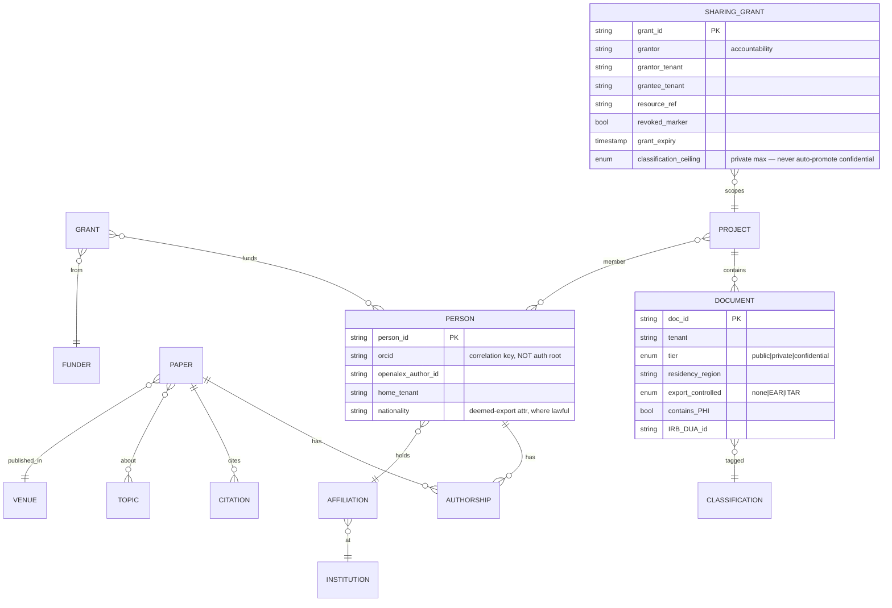

### 6.2 Two graph layers
1. **Deterministic metadata-backbone graph** (built FIRST, cheap, no LLM-extraction tax): authors / papers / citations / affiliations / venues / grants / topics. Stored in **Apache AGE** (Cypher-on-Postgres, co-locates with pgvector + authz store — *replaces archived KuzuDB*).
2. **HippoRAG2-style Personalized-PageRank augmentation** (Phase 2, ~1k tokens/query — the only graph economics that survive per-tenant deployment) for multi-hop retrieval.

**Explicitly overkill at MVP:** Microsoft GraphRAG global community summarization (~331k tokens/query + heavy recurring indexing) — later opt-in module for global-synthesis queries only.

### 6.3 Scholarly ingestion (self-hosted corpus — own it, avoid metering/NC traps)

| Source | License | Use | Path constraint |
|---|---|---|---|
| **OpenAlex** monthly snapshot | CC0 | Core graph (works/authors/institutions/topics) | **Self-host snapshot; NEVER put the metered live API on a hot path** |
| **Crossref** annual file | metadata open | DOIs, references | snapshot |
| **OpenCitations** | CC0 | Citation edges | snapshot |
| **arXiv** metadata | CC0 | Preprints | snapshot |
| **ROR** | CC0 | Institution identity | snapshot |
| **ORCID Public Data File** | CC0 | Person identity | **Ship the CC0 dump, NOT the live API (Public API is non-commercial per verbatim ToS)** |
| **Semantic Scholar bulk** | ODC-BY | Enrichment | **attribution required** |
| **SPECTER2 vectors** | Apache-2.0 | Citation/scientific embedding space | clean |
| PMC / Europe PMC full text | license-tiered | OA full text | **programmatically gate to commercial-OK OA subset (CC0/BY/BY-SA/BY-ND); exclude NC-only** |

ORCID Member API (paid) only for real-time writes. OpenAlex live API for freshness deltas only, never hot path.

### 6.4 Entity resolution / author disambiguation (foundational, not optional)
- Deterministic anchors: **ORCID / DOI / OpenAlex author IDs** + blocking + graph-feature classifier (MVP).
- **LEAD-style LLM adjudication** for hard collisions (Phase 2).
- **Critical federated wrinkle: treat the cross-institution identity graph as public-tier by construction** — disambiguation must never centralize private records or become a confidentiality leak.
- Standalone **Identity Resolution service** (`IIdentityResolution`) consumed by graph build, expertise modeling, and discovery alike. ORCID is a correlation key, **not** an auth root of trust.

---

## 7. Identity & Access Control

### 7.1 Federated identity

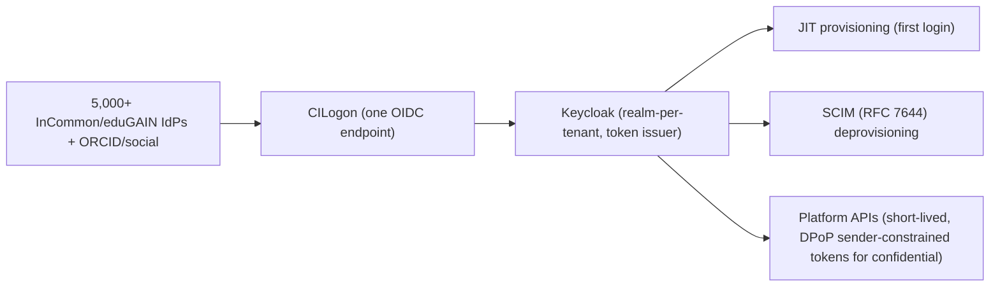

- **CILogon** = federation front-door (commercial deployment requires a paid subscription → COGS line, not a blocker). Fallback: direct Keycloak SAML/OIDC brokering.
- **Keycloak** (Apache-2.0, realm-per-tenant) = broker / session / token issuer. Fallback: Ory (Kratos/Hydra).
- **Provisioning**: JIT first login + SCIM deprovisioning (table-stakes; cascade revocation on affiliation loss).
- **Federation hardening**: SP in eduGAIN via **REFEDS R&S + Sirtfi + CoCo v2** (turns "negotiate attribute release with 200 universities" into "publish three entity-category tags"). Authorize on `eduPersonScopedAffiliation` + stable `subject_id`/`eduPersonUniqueId` (not recyclable eppn alone). **Prefer SP-initiated SSO**; strictly validate issuer/audience; scope every assertion to the asserting tenant (confused-deputy mitigation).

### 7.2 The authz model — hybrid ReBAC + ABAC

**Two-stage check at every PEP:** SpiceDB relationship path → Cedar ABAC caveat.

- **Sharing & membership = ReBAC tuples (Zanzibar / SpiceDB):**
  - `project:X#collaborator@univB:user`
  - hierarchical `document#parent@project`, `org_unit#parent` (lab→dept)
  - **Cross-institution sharing grant is a first-class `sharing_grant` object** recording `grantor` (accountability), grantor/grantee tenants, resource ref, `revoked_marker`, with ABAC caveats (time-bound, consent-gated, DUA-referenced, `classification_ceiling` so a grant can share *private* but never auto-promote *confidential*).
  - **Revocation = O(1) tuple delete → `is_active` flips → next consistent Check denies.**

- **Classification & compliance = ABAC attributes/conditions (Cedar):**
  - On objects: `tier{public|private|confidential}`, `residency_region`, `export_controlled{none|EAR|ITAR}`, `contains_PHI`, `IRB_DUA_id`, `consent_status`, `grant_expiry`.
  - On subjects: `home_tenant`, `scoped_affiliation`, `nationality`/`country` (deemed-export, where lawfully collected).
  - These gate *whether a relationship even counts*.

### 7.3 Why SpiceDB over OpenFGA (resolving the only stack contradiction)
For a confidentiality-first product where **revocation correctness is a security guarantee, not a UX nicety**, SpiceDB's **ZedToken per-request consistency** is the deciding factor — a stale "still allowed" after a revoked cross-institution share is an *incident* (Zanzibar "new-enemy problem"). OpenFGA is the acceptable lower-friction fallback **only if you commit to `HIGHER_CONSISTENCY` on every confidential-tier check.** **Recommendation: SpiceDB.** (Cedar over OPA/Rego for ABAC because Cedar is deterministic and validated; use OPA only if you also need infra policy.)

### 7.4 Decision flow (XACML-shaped) & where the PDP sits

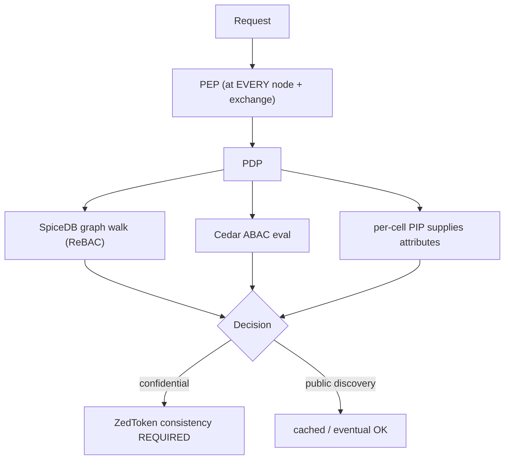

- **PEP at every node + exchange.** **Confidential PDP evaluation executes inside the owning cell** (local PEP + PIP) — it never depends on the shared plane.
- **ZedToken consistency for confidential checks; cached/eventual only for low-risk public discovery** (new-enemy mitigation — a revoke-then-add must not leak via stale cache).
- **Tenant isolation is structural, not a column:** every resource has a `tenant` relation; cross-tenant access reachable *only* through a `sharing_grant`. No grant ⇒ no path ⇒ deny-by-default. **Object-level `Check` on every request.**

### 7.5 Postgres RLS footgun checklist (defense-in-depth only, never sole boundary)
`FORCE ROW LEVEL SECURITY` (owner/superuser bypass by default) · `SET LOCAL` not `SET` (PgBouncer connection-context leak) · specify `WITH CHECK` (else INSERT cross-tenant rows you can't see) · `RESTRICTIVE` policies (PERMISSIVE OR-unions) · `tenant_id` must be **leading index column** · materialized/`SECURITY DEFINER` views bypass RLS.

---

## 8. AI / Model-Router Layer

### 8.1 The kernel differentiator (validated by Secure Multifaceted-RAG, arXiv 2504.13425)
**Classification → route binding is the kernel. Build the data-classification engine + model router FIRST** — every differentiator (confidential RAG, federation grants, compliance) hangs off classification.

### 8.2 Routing rules

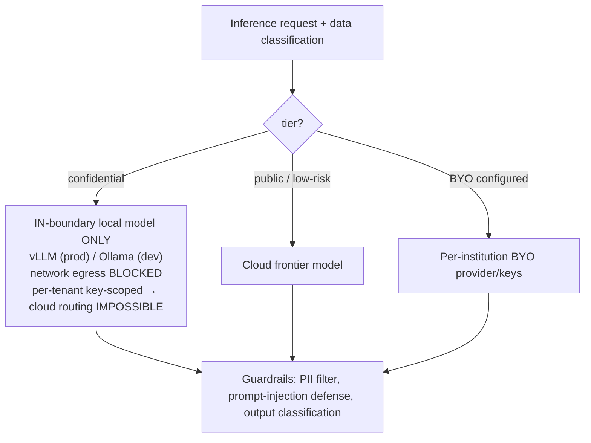

- **Confidential ⇒ in-boundary local model only**, network-egress-blocked, per-tenant key-scoped so cloud routing is *impossible* for confidential-tagged data. Cloud egress for confidential-tagged data is a **compliance defect, not a config choice** — enforced cryptographically (per-tenant keys) AND at the network layer.
- **Public / low-risk ⇒ cloud frontier model.**
- **Per-institution BYO-provider/keys throughout** (a premium edition tier).
- The confidential tier is constrained to **open, self-hostable** components → disqualifies proprietary embedding/rerank/LLM APIs (Voyage/Cohere/Gemini/frontier) from the confidential path (public-tier or explicit BYO-key only).

### 8.3 Serving & models

| Component | Confidential (local) | Public / BYO |
|---|---|---|
| LLM serving (prod) | **vLLM** (PagedAttention, ~24x TGI throughput) — fallback SGLang | Cloud frontier (OpenAI/Anthropic/Gemini) or BYO |
| LLM serving (dev) | **Ollama** (M4 Max 36GB) — sequential under load → dev only; fallback llama.cpp | — |
| Embeddings | **Qwen3-Embedding** (0.6B dev / 4B–8B prod, Apache-2.0, MTEB #1) + **SPECTER2** (scientific space); fallback BGE-M3, nomic-v1.5 | Voyage/Cohere/Gemini = public/BYO only |
| Reranker | **BGE-reranker-v2-m3** / **Qwen3-Reranker** (local) | Cohere Rerank 3.5 (public/BYO) |

**Avoid HuggingFace TGI** (maintenance mode Dec 2025) → vLLM. **nomic-embed is materially behind** Qwen3/BGE-M3 (TigerBuddy inheritance trap).

### 8.4 Guardrails
- Input: PII detection, prompt-injection screening, classification-tag verification (refuse if request tier > session clearance).
- Output: confidential-leak scanning before any cross-tier surfacing; citation faithfulness (CRAG, Phase 2).
- **Router-aware evaluation: the judge LLM must itself be the local model on the confidential tier** — you cannot send confidential answers to a cloud judge.

---

## 9. Retrieval Architecture

**Single tenant-local retrieval engine behind one clean `IRetrieval` interface; the model router selects local-vs-cloud per tier; a thin exchange adapter federates only public-tier discovery. Confidential data and its models never leave the node.**

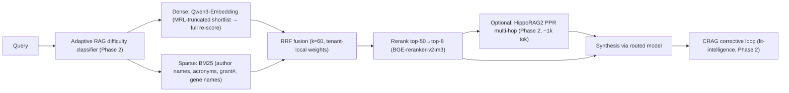

### 9.1 MVP-essential
- **Hybrid retrieval**: dense (Qwen3-Embedding, MRL-truncated shortlist → full re-score) + sparse (**BM25, mandatory** — academic corpora are entity-heavy). Hybrid beats either alone by **15–30% recall**.
- **Fusion: RRF (k≈60)** — parameter-free, no labels, robust cold-start. **Fusion weights must be tenant-local** (term distributions don't transfer across institutions).
- **Reranking (highest cheap ROI)**: top-50→top-8 with BGE-reranker-v2-m3 / Qwen3-Reranker (local); Cohere Rerank 3.5 public/BYO. +5–15 nDCG@10 for <200ms.
- **Two embedding spaces**: Qwen3 (ad-hoc query→passage RAG) + SPECTER2 (citation-proximity / "related papers" / expertise fingerprints). **Matryoshka (MRL) operationally essential** for per-node RAM control on M4 Max.
- **Deterministic metadata-backbone graph** (Section 6.2) for graph traversal.
- **Evaluation harness (MVP-essential — "trustworthy grounded intelligence" is the whole pitch)**: **RAGAS** (Faithfulness/Groundedness + Context Precision/Recall) + nDCG@k / Recall@k on a small in-domain gold set, **wired into CI as a regression gate**, run **per-tenant and per-model-route**. Judge LLM is the local model on the confidential tier.

### 9.2 Phased (modules behind `IRetrieval`)
- **Adaptive RAG** routing early (cheap query-difficulty classifier; dovetails with the model router).
- **CRAG corrective loop** for lit-intelligence (citation faithfulness = credibility differentiator).
- **HippoRAG2 PPR** multi-hop augmentation (~1k tokens/query).
- **Per-tenant learned convex fusion** once click/relevance feedback accrues inside a node (convex Recall@5 0.726 vs RRF 0.695).
- **Query-decomposition / multi-agent** reserved for grant/team-assembly (LangGraph). On the confidential path every agent step runs the local model — **cap loop iterations.**

### 9.3 Expertise / collaborator surface (Features 1+4)
Expertise = profile-as-retrieval (SPECTER2/Qwen3 fingerprints + retrieve+rerank) at MVP → **GNN link prediction** over the heterogeneous graph (Phase 2) → **cross-institution team assembly** over the federated public-tier graph (Phase 3 — strongest defensibility vs single-institution tools).

### 9.4 Explicitly overkill at MVP (Risk #6)
MS-GraphRAG global, ColBERTv2/PLAID per-tenant index, multi-agent orchestration, learned/LambdaMART fusion, FHE on critical path. Ship single-shot hybrid+rerank+RRF; defer the rest as pluggable modules.

---

## 10. Data Pipelines & Orchestration

### 10.1 Two orchestrators, complementary (not redundant)
- **Dagster** — asset-lineage data pipelines: `crawl → distill → embed → index → graph` (TigerBuddy idiom; per-cell). Fallback Prefect/Airflow.
- **Temporal** — durable long-running cross-institution workflows: grant/revocation/workspace lifecycles spanning days–months. Complementary to Dagster.

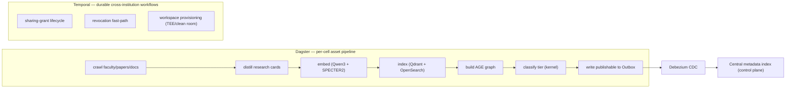

### 10.2 Sync between nodes and the exchange — consistency model
- **Transactional Outbox + log-based CDC (Debezium) + idempotent consumers + schema registry.** Never naive dual-write (lost-event-forever, Risk #2).
- **Only publishable metadata flows out** (FRE-safe / explicitly-shared). Confidential bytes never enter the outbox.
- **Revocations propagate on a separate FAST PATH and are enforced at read time** (stale shareable metadata after revocation is a leak vector). Prefer the prebuilt central index for the common path; reserve live federated fan-out for drill-down (slowest-node tail latency). Per-tenant rate limits/partitioning against exchange backpressure.

### 10.3 The hard one-line consistency rule
**Eventual consistency is allowed for discovery metadata; confidentiality decisions must be strongly consistent and re-checked at the owning node.**

---

## 11. Security, Privacy & Compliance

### 11.1 Confidential-tier controls
- **BYOK mandatory (confidential); HYOK offered.** Per-tenant **envelope encryption (DEK/KEK)** via **Vault** (fallback cloud KMS). **Revoke KEK = cryptographic lockout / crypto-shred** (also the GDPR right-to-erasure reconciliation mechanism).
- Confidential data + confidential AI inference **never leave the tenant boundary** — enforced cryptographically (per-tenant keys) AND at the network layer (egress block).
- **Confidential computing where warranted**: exchange/match broker in TEE (SEV-SNP / TDX / Nitro); clean rooms for confidential joint work. *(TEE.Fail caveat noted — physical-access threat out of scope.)*
- Postgres RLS = defense-in-depth only (Section 7.5 footguns), never the sole boundary.

### 11.2 Audit
Append-only, tamper-evident audit log of every access decision (the audit spine — kernel, MVP). Every inter-institutional transfer of identifiable data references a **DUA artifact**. Per-tenant + per-model-route audit for compliance and incident forensics.

### 11.3 Compliance triggers & handling (designed-in as attributes, not bolt-ons)

| Regime | Posture | Mechanism |
|---|---|---|
| **FERPA** | "School official" under institutional control; school stays liable, we are its agent | Encryption, ReBAC/ABAC, audit logs, annual notification |
| **GDPR** | University = controller, we = **processor**; mandatory **DPA** | Right-to-erasure ~30 days reconciled via **crypto-shred**; **EU data stays in-region cell**; **REFEDS CoCo v2** for EU IdP attribute release; cross-border needs adequacy/SCCs |
| **Export controls (ITAR 22 CFR 120–130 / EAR)** | **deemed export**: nationality/citizenship is an access attribute *even within the US* | Controlled technical data → US-stored, US-person-access-only. **FRE is lost the moment you impose access/publication restrictions → the export-control gate must be OPT-IN per controlled project, NEVER blanket** (Risk #3) |
| **HIPAA / IRB / DUAs** | Limited Data Sets need a DUA; de-identified (45 CFR 164.514) falls outside HIPAA | Every inter-institutional identifiable transfer references a DUA artifact |

### 11.4 SOC2 / ISO readiness
**Start SOC 2 Type II day one** (~3–6 mo readiness) — it gates the first institutional contract and is the de facto floor. Add **ISO 27001** for EU/international. **HECVAT** (full toolkit = 321 questions) is mandatory before any pilot/purchase — and **"confidential data never leaves your node" is the single strongest HECVAT answer; weaponize it.**

### 11.5 Threat model + top mitigations

| Threat | Mitigation (invariant) |
|---|---|
| Confidentiality leak via federation seam (existential) | Publishable metadata only in central index; confidential reads re-checked at owning node under ZedToken; revocation fast-path at read time; structural deny-by-default; per-tenant keys so a leaked row is ciphertext |
| Stale-grant / new-enemy + dual-write loss | SpiceDB ZedToken on confidential checks; Outbox+CDC (never naive dual-write); idempotent consumers; revocation on separate fast path |
| BOLA/IDOR (OWASP API #1) | Object-level `Check` on every request; structural tenant isolation |
| Confused deputy (federation) | SP-initiated SSO; strict issuer/audience validation; scope assertions to asserting tenant; sender-constrained (DPoP) short-lived tokens for confidential APIs |
| Export-control self-sabotage (FRE loss) | Export gate opt-in per controlled project, never default-on |
| Operator reads cross-institution match inputs | TEE broker (SEV-SNP/TDX/Nitro); PSI returns aggregates only |

---

## 12. Technology Stack

| Layer | Primary | Fallback | Licensing/justification flag |
|---|---|---|---|
| Federation entry | **CILogon** (5,000+ InCommon/eduGAIN IdPs + ORCID/social, one OIDC endpoint) | direct Keycloak SAML/OIDC brokering | Commercial needs paid CILogon subscription → COGS |
| IdP / broker / session | **Keycloak** (Apache-2.0, realm-per-tenant) | Ory (Kratos/Hydra) | CILogon front-door → Keycloak issuer |
| Provisioning | **JIT + SCIM** (RFC 7644) | — | SCIM deprovisioning table-stakes |
| Authz — ReBAC core | **SpiceDB** (ZedToken strong consistency) | OpenFGA (must opt `HIGHER_CONSISTENCY` on confidential) | Apache-2.0; revocation correctness = security guarantee |
| Authz — ABAC overlay | **Cedar** (deterministic, validated) | OPA/Rego (only if infra policy too) | Two-stage: SpiceDB path → Cedar caveat |
| Vector search | **Qdrant** (Apache-2.0, best multi-tenant isolation/sharding) | pgvector (small tenants; co-locates w/ AGE + authz in one PG) | Per-tenant index in cell |
| Graph DB | **Apache AGE** (Cypher-on-Postgres) | Neo4j Community (GPLv3, isolate) / Memgraph (BSL) | **Replaces archived KuzuDB (archived 10 Oct 2025)** |
| Search / BM25 | **OpenSearch** (Apache-2.0, hybrid BM25+vector) | Tantivy/Quickwit (embedded) | **Not Elasticsearch (AGPLv3 network-copyleft)** |
| LLM serving (prod) | **vLLM** (PagedAttention) | SGLang | **Not TGI (maintenance mode Dec 2025)** |
| LLM serving (dev) | **Ollama** (M4 Max 36GB) | llama.cpp | Sequential under load → dev only |
| Embeddings | **Qwen3-Embedding** (Apache-2.0, MTEB #1) + **SPECTER2** (Apache-2.0) | BGE-M3, nomic-v1.5 | Voyage/Cohere/Gemini = public/BYO only |
| Reranker | **BGE-reranker-v2-m3** / **Qwen3-Reranker** (local) | Cohere Rerank 3.5 (public/BYO) | +5–15 nDCG@10 <200ms |
| Data orchestration | **Dagster** | Prefect / Airflow | TigerBuddy idiom; asset lineage |
| Durable workflows | **Temporal** | — | Complementary, not redundant |
| API | **FastAPI** (async, typed, OpenAPI) | — | Clean module boundaries |
| RAG ingestion/retrieval | **LlamaIndex** (behind thin `IRetrieval`) | Haystack (deterministic for FERPA/ITAR) | Avoid framework lock-in |
| Agent orchestration | **LangGraph** | — | Expert-discovery & grant-team agents |
| Secrets / keys | **Vault** + per-tenant envelope encryption (DEK/KEK); BYOK mandatory (confidential), HYOK offered | cloud KMS | Revoke KEK = crypto-shred |
| Confidential compute | **TEE** (AWS Nitro / AMD SEV-SNP / Intel TDX) + clean rooms | PSI libs; DP for aggregates | FHE off critical path (pilot only) |
| Scholarly data | **OpenAlex snapshot (CC0)** + Crossref + OpenCitations (CC0) + arXiv (CC0) + ROR (CC0) + ORCID Public Data File (CC0) + Semantic Scholar bulk (ODC-BY) + SPECTER2 | live polite-pool APIs for freshness only | Own corpus; avoid metering/NC traps |
| CDC / event bus | **Debezium** + Kafka/Redpanda + schema registry | — | Outbox pattern; idempotent consumers |

**TigerBuddy inheritance traps avoided:** KuzuDB → AGE; nomic-embed → Qwen3/BGE; single-tenant NetworkX `tiger_brain.json` does not survive multi-tenancy (replaced by per-cell AGE).

---

## 13. Deployment & Infrastructure

### 13.1 Topology

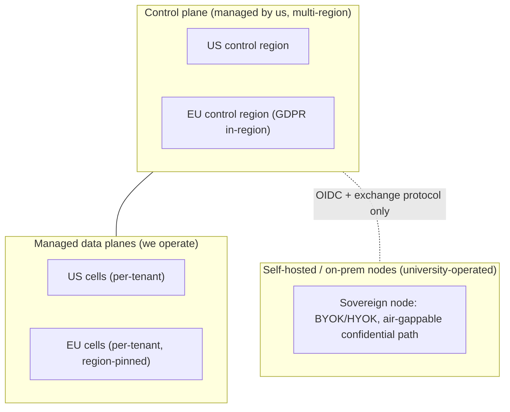

### 13.2 Managed vs self-hosted node

| Dimension | Managed cell | Self-hosted / on-prem node |
|---|---|---|
| Who operates | Us | University Research IT |
| Confidential data location | Dedicated isolated cell we run, region-pinned | Entirely on university infra |
| Keys | BYOK via Vault | HYOK (university holds KEK; we never can decrypt) |
| Connection to control plane | Full | **Exchange protocol + OIDC only** (no confidential bytes ever traverse) |
| Update model | We push | University-pulled signed releases (air-gappable) |
| Target | Lab/Dept/Institution editions | Sovereign edition (export-controlled/defense) |

### 13.3 IaC / k8s posture
- **Kubernetes** per cell; **Helm** sub-charts per module (clean enable/disable). **Terraform** for cloud substrate; **Crossplane** optional for control-plane-managed cell provisioning.
- **Per-cell namespace + network policy + egress block** for the confidential path. The egress block is a *compliance control*, tested in CI (Section 15).
- GitOps (Argo CD) for managed cells; signed release bundles (cosign) for self-hosted pull.

---

## 14. Scalability & Reliability

### 14.1 Consistency model (the load-bearing decision)
- **Strong (ZedToken / synchronous re-check at owning node)**: all confidentiality decisions, cross-institution grant checks, revocation enforcement.
- **Eventual (Outbox+CDC)**: discovery metadata, central index population — *only where a leak is structurally impossible* (publishable bytes only).

### 14.2 Bottlenecks & scaling levers
| Bottleneck | Lever |
|---|---|
| Per-tenant vector index RAM (M4 Max ceiling in dev / cell sizing in prod) | Matryoshka (MRL) truncation; per-tenant Qdrant sharding |
| Local LLM throughput (Ollama sequential) | vLLM PagedAttention in prod; Ollama dev-only |
| Exchange backpressure | Per-tenant rate limits/partitioning; prebuilt central index for common path |
| Drill-down tail latency (slowest-node) | Reserve live fan-out for drill-down; cache publishable metadata |
| SpiceDB consistency cost | Cached/eventual for public; ZedToken only on confidential checks |

### 14.3 Failure domains
- **Cell-isolated**: a tenant cell failure never affects another tenant or the control plane.
- **Control-plane degradation** (discovery index down): confidential intra-node operation continues (local PEP/PIP/LLM are self-contained) — graceful degradation of *cross-institution* features only.
- **Exchange outage**: federation pauses; single-tenant pillars unaffected.

### 14.4 SLOs (initial targets, to validate)
- Intra-node grounded Q&A p95 < 4s (local model).
- Confidential `Check` p99 < 50ms (ZedToken-consistent).
- Discovery search p95 < 800ms (central index).
- Revocation propagation to read-enforcement < 5s (fast path); but **read-time re-check makes correctness independent of propagation latency.**
- Cell availability 99.9%; control plane 99.95%.

---

## 15. Observability, Testing & CI/CD

### 15.1 Telemetry
- **OpenTelemetry** traces across PEP → PDP → retrieval → model router (per-tenant, per-model-route tags). Prometheus + Grafana; Loki/Tempo. Per-tenant cost attribution (LLM tokens, vector RAM) for billing.
- **Confidential-tier telemetry stays in-cell** (no confidential content in spans — only decision metadata).

### 15.2 Eval-in-CI for retrieval quality (the differentiator's guardrail)
**RAGAS (Faithfulness/Groundedness, Context Precision/Recall) + nDCG@k/Recall@k on an in-domain gold set, wired as a CI regression gate, run per-tenant and per-model-route.** Judge LLM is the **local model on the confidential tier** (router-aware eval — you can't send confidential answers to a cloud judge). A retrieval-quality regression fails the build.

### 15.3 Test strategy across modules
- **Contract tests** against `shared/contracts/` for every module (the law).
- **Authz policy tests**: SpiceDB assertions + Cedar validation suites; explicit "revoke-then-read denies" tests; new-enemy regression tests.
- **Isolation tests**: cross-tenant access attempts must deny; **egress-block tests** (confidential path cannot reach the internet) run in CI as compliance controls.
- **Federation seam tests**: confidential bytes never appear in the outbox/central index (golden-path leak tests).
- Unit/integration per `pytest` markers (TigerBuddy idiom: `-m unit`, `-m integration`).

### 15.4 Release / rollback
- GitOps (Argo CD) per managed cell; canary per module via feature flags. Signed bundles (cosign) for self-hosted pull. Rollback = flag-off + previous Helm revision. Kernel-contract changes follow the deprecation-window rule (Section 5.6).

---

## 16. Cost Model & Team

### 16.1 Infra cost shape (qualitative — precise figures are an Open Question)
- **Control plane**: thin, multi-region, mostly stateless + SpiceDB + central index + TEE broker. Modest fixed cost.
- **Per-cell COGS** (dominant variable cost): vector RAM (Qdrant) + local LLM GPU (vLLM) + Postgres/AGE + OpenSearch. **Confidential-tier local GPU is the COGS driver** — a primary reason BYOK/self-host shifts cost to the university for the sovereign edition.
- **Fixed COGS lines flagged by research**: CILogon paid subscription; CORE membership (if used); ORCID Member API (only if real-time writes); SOC2/ISO audit.
- **MRL truncation + cell-sizing by edition** are the main COGS levers (PLG cells small/shared; institution cells dedicated).

### 16.2 Minimal founding team

| Role | Focus |
|---|---|
| **Founding eng — distributed systems / backend** | Kernel: authz spine, isolation, exchange, CDC, Temporal |
| **Founding eng — ML/RAG** | Retrieval engine, model router, embeddings/serving, eval harness |
| **Founding eng — security/compliance + infra** | BYOK/HYOK, TEE, SOC2/HECVAT, k8s/IaC, egress controls |
| **Founding GTM / domain (research-admin)** | PLG land, RD-office relationships, HECVAT navigation, consortium |
| **(Fractional) compliance counsel** | FERPA/GDPR/ITAR-EAR review; DPA/DUA templates |

Three engineers + one GTM + fractional counsel is the lean wedge team; the modular architecture lets later pillar modules be built by added engineers without kernel churn.

---

## 17. Risks & Mitigations

| # | Risk | Type | Mitigation |
|---|---|---|---|
| 1 | **Confidentiality leak via federation seam** (existential) | Technical | Invariants: publishable metadata only; confidential reads re-checked at owning node under ZedToken; revocation fast-path at read time; structural deny-by-default; per-tenant keys (leaked row = ciphertext) |
| 2 | **Stale-grant / new-enemy + dual-write loss** | Technical | SpiceDB ZedToken on confidential checks; Outbox+CDC never naive dual-write; idempotent consumers; revocation separate fast path |
| 3 | **Export-control self-sabotage (FRE loss)** | Compliance | Export gate **opt-in per controlled project, never default-on** |
| 4 | **Procurement death-by-committee + HECVAT/SOC2 wall** | Market | PLG private-corpus wedge stays *below* committee threshold; SOC2 Type II day one; weaponize "data never leaves your node" |
| 5 | **Fast-follow on pillars 1+4 (Atom Grants/GrantsAI)** | Market | Enter funding/team-assembly *with* the confidentiality+federation moat they structurally lack; keep it Phase 3 |
| 6 | **Over-engineering the AI core too early** | Execution | Ship single-shot hybrid+rerank+RRF; defer MS-GraphRAG/ColBERT/multi-agent/learned-fusion/FHE as pluggable modules |
| 7 | **Foundational primitives that can't be retrofitted** | Execution | Build kernel + audit spine in MVP even if thin: disambiguation, classification, authz graph, audit log are interface-load-bearing day one |
| 8 | **TigerBuddy inheritance traps** | Technical | KuzuDB→AGE; nomic→Qwen3/BGE; NetworkX `tiger_brain.json` doesn't survive multi-tenancy. Inspiration, not foundation |
| 9 | Federation network-effect chicken-and-egg (value only at N≥2) | Market | Single-tenant pillars (lit-intelligence, intra-institution discovery) deliver standalone value *before* exchange flips on |
| 10 | TEE attestation / supply-chain trust | Technical | Remote-attacker threat model (TEE.Fail needs physical access + root → out of scope); document the boundary honestly |

---

## 18. Phased Roadmap & Milestones

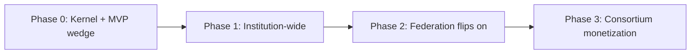

### Phase 0 — Kernel + MVP wedge (single-tenant PLG)
**Build:** classification engine + model router + tenant isolation + authz spine (SpiceDB+Cedar, thin) + audit spine + identity resolution (deterministic) + `mod-lit-intelligence` (hybrid+rerank+RRF, single-shot, RAGAS-in-CI) + `mod-discovery` (single-tenant profile-as-retrieval) + deterministic AGE graph + OpenAlex/ORCID-dump ingestion. **Confidential tier defined in schema + local-model isolation demo.** SOC2 readiness started.
**Milestones:** first paying lab; grounded Q&A p95 < 4s; RAGAS faithfulness gate green in CI; isolation + egress-block tests passing.

### Phase 1 — Institution-wide (managed dedicated cell)
**Build:** institution-wide expert discovery; full HECVAT/SOC2 Type II achieved; BYOK; `mod-workspaces` schema; confidential heavy machinery (HYOK option, export-control opt-in gate). Adaptive RAG + CRAG modules.
**Milestones:** first institutional contract; SOC2 Type II report; HYOK validated; confidential-tier in production.

### Phase 2 — Federation flips on (≥2 nodes + exchange)
**Build:** exchange/control plane (central metadata index, Outbox+CDC, TEE broker); cross-institution sharing grants (SpiceDB cross-tenant); brokered drill-down; PSI overlap; `mod-workspaces` (clean room/TEE) live; HippoRAG2 PPR; GNN link prediction.
**Milestones:** ≥2 live federated nodes; first revocable cross-institution share enforced (revoke-then-read denies under ZedToken); confidential-byte-never-leaves seam tests green across the federation.

### Phase 3 — Consortium monetization
**Build:** `mod-funding` (grant intelligence + cross-institution team assembly over federated public-tier graph); multi-agent decomposition (LangGraph); per-tenant learned fusion; optional MS-GraphRAG / FHE encrypted-match pilots.
**Milestones:** first consortium contract with exchange add-on; cross-institution grant team assembled and funded; expansion to ISO 27001 for EU.

---

## 19. Open Questions & Decisions to Validate

*Honest about what plan1 has NOT settled — these require customer discovery or technical spikes before commit.*

1. **MVP wedge resolution under stress** — the market report (lead confidential single-lab) vs security report (lead public+private) were reconciled as sequential phases. **Validate with 5–10 beachhead interviews**: does the PLG lab actually buy on lit-intelligence alone, or does the confidential-isolation demo need to be *functional* (not just demoed) to close? This shifts how much Phase-0 confidential machinery is truly MVP.
2. **Beachhead: general R1 lab vs export-controlled defense lab** — the high-value variant needs the export-control gate early (higher build cost, FRE risk). Spike: how much ITAR/EAR machinery is the true minimum, and is the ACV uplift worth front-loading Risk #3?
3. **Single-tenant standalone value before N≥2** — does intra-institution lit-intelligence + discovery deliver enough value to sustain revenue through the months before the exchange flips on? (Risk #9 chicken-and-egg.)
4. **Per-cell COGS at PLG price points** — confidential local GPU (vLLM) is the COGS driver. Can a PLG/department cell be served profitably at $179–$499/mo, or is shared-cell soft-isolation the only viable PLG posture (and does that satisfy "confidential" claims)? **This is the riskiest unit-economics question.**
5. **SpiceDB ZedToken latency under cross-institution load** — spike the p99 of strongly-consistent cross-tenant checks at realistic fan-out; confirm SLO (Section 14.4) is achievable, else reconsider OpenFGA HIGHER_CONSISTENCY tradeoff.
6. **CILogon commercial subscription cost & terms** — confirm the COGS line and whether direct Keycloak brokering is viable as a cost-control fallback for price-sensitive PLG tiers.
7. **PMC/Europe PMC OA-subset gating** — verify the programmatic license-tier filter actually yields a usefully large commercial-OK corpus; if the NC-excluded slice is too large, lit-intelligence corpus value drops.
8. **TEE deployment surface across clouds + on-prem** — Nitro (AWS-only) vs SEV-SNP/TDX (on-prem/multi-cloud) fragments the confidential-compute story. Spike: one TEE abstraction or per-substrate implementations? Affects the sovereign edition.
9. **Self-hosted node update/trust model** — air-gappable signed-bundle pull for export-controlled nodes vs operational burden on university IT. Validate with one Research IT org.
10. **Identity resolution as public-tier-by-construction** — confirm that cross-institution disambiguation genuinely never needs a private record; if it does, the "identity graph is public-tier" invariant breaks and becomes a leak surface.
11. **Eval gold-set bootstrapping per tenant** — RAGAS-in-CI needs in-domain gold data. How is the first per-tenant gold set built without confidential data leaving the cell, and who labels it?
12. **Pricing elasticity across four buyers from one SKU** — the packaging model is borrowed from Starmind; validate that the per-module + per-active-user + exchange-add-on structure actually clears each buyer's budget authority (esp. PLG below committee vs consortium master agreement).

---

*End of plan1. This is the opening move of an iterative loop — the architecture is constant; build order is the lever. Sections 17 and 19 are deliberately the most honest: the existential risk is the federation seam (Risk #1), and the riskiest un-validated assumption is per-cell confidential COGS at PLG price points (Open Question #4).*