# Plan v2

> Adversarial review of this version: **8 critical**, **22 high** findings.

---

This is a writing/synthesis task. I'll produce the revised plan directly — no codebase work, no skill needed. The plan is self-contained and resolves every critical/high finding with explicit decisions.

# plan2 — Federated Multi-University Research Collaboration & Discovery Platform

*A from-scratch, production-grade redesign inspired by TigerResearchBuddy. Opinionated, sequenced, fundable. Version 2 hardens the federation seam, the authz topology, the confidentiality crypto, the modularity contracts, and — most consequentially — the GTM wedge and unit economics after an adversarial multi-lens review.*

**The single invariant the whole platform enforces, restated honestly:**
> *Confidential bytes are processed only inside their owning cell and never enter the shared plane. What flows outward is a typed, allowlisted **PublishableProjection** — and even that is gated by an independent egress PEP, carries a monotonic version, self-expires via lease, and is purged on a strongly-consistent fast path on revoke/reclassify. Every confidentiality decision is made fresh at the owning node under fail-closed ReBAC+ABAC. Eventual consistency is permitted only for discovery metadata whose worst-case staleness is bounded and treated as a security leak-window, not a soft target.*

The original plan claimed "read-time re-check makes correctness independent of propagation latency." **That claim was half-true and is retracted.** It protects the byte-fetch (drill-down) path. It does NOT protect already-replicated metadata in the central index. v2 specifies the index-revocation path as a first-class, SLO'd, security-critical mechanism.

---

## 0. What changed from v1 and why (decision log)

This section is non-normative but load-bearing: it records the explicit tradeoff decisions made to resolve the review.

| Decision | v1 | v2 | Rationale |
|---|---|---|---|
| **MVP wedge** | Single-tenant PLG lit-intelligence over own corpus (commodity space) | **Confidential single-lab as a FUNCTIONAL product** sold to a security-sensitive lab; OR a **pre-bonded 2-node consortium design partner**. Public lit-Q&A is explicitly NOT the paid wedge. | v1 earned first revenue in the arena it said to avoid (Elicit/Consensus/Atom), validating the wrong thing. The moat must be demonstrable at first dollar. |
| **Beachhead price** | $179–499/mo PLG/department | **$2.5–8k/mo institutional/center/export-controlled-lab line-item**, OR BYO-compute PLG (university supplies GPU) at low price. | A dedicated confidential GPU cell cannot be served at $300/mo. Price the security guarantee, not the RAG. |
| **Central index** | "thin, stateless, modest cost" | First-class **horizontally-sharded, encrypted, authz-gated, discoverability-scoped** stateful store with a capacity model. | It is the fan-in of all nodes' publishable corpora + embeddings — the single largest stateful component. Mislabeling it broke the scalability story. |
| **SpiceDB topology** | One global cross-tenant cluster on the confidential hot path | **Grant tuples replicated INTO each owning cell** via ordered, authenticated replication; the confidential Check is **cell-local**. Shared cluster is the system-of-record + replication source, not the synchronous hot-path dependency. | v1 contradicted itself: "confidential checks never depend on the shared plane" vs "PEP calls control-plane SpiceDB on every drill-down." Resolved in favor of cell-local checks that survive control-plane partition. |
| **Revocation** | Tuple delete + "correctness independent of latency" | Tuple delete (cell-local) **+ index tombstone with monotonic version + index lease/TTL + strongly-consistent revocation set checked before any metadata is surfaced.** Symmetric grant-creation visibility defined too. | Closes the metadata leak window v1 admitted but never specified. |
| **Classification failure mode** | Unspecified | **Fail-CLOSED: no high-confidence tier ⇒ confidential.** Derived artifacts inherit **MAX(input tiers).** Tier-down requires audited human approval. Independent egress scan is a second gate. | Single probabilistic classifier was a single point of catastrophic leak. |
| **Outbox** | "we only write publishable things" (circular) | **PublishableProjection is a structural type**; Outbox writer can only emit it via a total projection function; an independent egress PEP re-validates against a field allowlist; continuous runtime leak assertion in prod. | v1's mitigation was the thing needing enforcement. |
| **Crypto / crypto-shred** | "Revoke KEK = crypto-shred; we never decrypt (HYOK)" | All derivative stores (vectors, BM25, graph, objects) encrypted under tenant KEK so shred actually shreds. Plaintext-at-use boundary stated honestly; TEE-backed inference, swap/coredump disabled. HYOK reworded to "custody + revocation; transient in-cell decryption under TEE." | v1's crypto guarantee was contradicted by the need to decrypt for inference, and shred missed the searchable derivatives. |
| **MVP kernel scope** | Full SpiceDB+Cedar+tamper-evident-merkle+isolation-cell+SOC2 before first revenue | **Thin implementations behind stable interfaces**: library RBAC, Postgres hash-chained audit table, if/else router, consolidated Postgres datastore. Swap to SpiceDB/Cedar/TEE at N≥2. | v1 preached pluggable interfaces then hard-wired prod implementations into the MVP — a 16-month death march for 3 engineers. |
| **Orchestrators** | Dagster + Temporal + Kafka + Debezium in MVP | **Dagster only** in MVP; outbox-polling not Kafka until central index exists; Temporal only when first grant lifecycle is built. | 5 stateful distributed systems for a single-tenant MVP is dead weight. |
| **Two graph + 3 stores per cell** | Postgres+AGE+pgvector?+Qdrant+OpenSearch, no intra-cell consistency contract | **Consolidate to one Postgres (pgvector + AGE + tsvector/ParadeDB + audit + outbox)** for small/MVP cells; split to Qdrant/OpenSearch only when scale forces it, behind an intra-cell consistency contract (system-of-record + rebuildable indexes). | Three index-sync paths with no consistency contract is a rot source; AGE multi-hop at scale is unvalidated and now gated by a benchmark. |
| **Nationality for export control** | Subject attribute via SSO | **Institution-attested US-person determination** recorded as a signed grant caveat + explicit authorized-person allowlist. Never an SSO claim. | SSO does not carry verified citizenship; gating ITAR on a self-asserted attribute is worse than not claiming the capability. |
| **TEE match broker** | Core to MVP exchange | **Deferred**; early federation uses brokered drill-down + plain 2-party PSI + DP under contractual/audit controls. TEE added only when a buyer's threat model demands and pays for operator-zero-trust. Modeled as a scaled enclave fleet when it arrives. | Attestation across Nitro/SEV-SNP/TDX is a multi-month specialist project the 3-person team cannot carry early. |
| **Team** | 3 eng for full kernel | 3 eng for the **reduced** kernel; security/compliance role explicitly split as scope grows; cloud staging is a budgeted opex line. | v1's third role was 2–3 jobs; MVP scope now matches headcount. |

---

## 1. Vision & Positioning

### 1.1 The product in one sentence
A federated, AI-native research collaboration platform where each university owns a strongly-isolated node holding its confidential data, and a thin shared exchange layer enables selective, **revocable, version-bounded** cross-institution discovery and collaboration **without ever centralizing confidential bytes** — and provably so, enforced by an independent egress gate, not by trust.

### 1.2 The white space

| Silo | Players | What they own | What they lack |
|---|---|---|---|
| Profile/data layer | Pure, Converis/Esploro, Symplectic, Academic Analytics, Dimensions, OSS **VIVO** | Institutional research metadata | No AI-native grounded Q&A; no confidential federation |
| AI over public literature | Elicit, Consensus, Scite, SciSpace, Undermind, Scholar-QA | Workflow AI over *public* papers | Public-only; single-user; no institutional data; no federation |
| Grants/compliance admin | Cayuse, Kuali, Pivot-RP, GrantForward, Instrumentl | Grants workflow | Not AI-native; no discovery; no confidential collaboration |
| AI grant fast-follow | **Atom Grants / GrantsAI** (~$179/mo, 50+ institutions) | AI co-PI matching into RD offices | Single-tenant, public-data-only — no confidentiality, no federation |
| Commercial clean rooms | Decentriq, BeeKeeperAI, Snowflake/Databricks/Azure clean rooms, Duality | Confidential multi-party compute | Generic; not research-native; no scholarly graph or AI Q&A |
| Academic public federation | **VIVO CTSAsearch / Direct2Experts** (64 institutions, free) | Public-LOD expert federation | Public-tier only; no confidential tier; no AI layer |

**Nobody federates confidential cross-institution research data with revocable grants + AI-native grounded Q&A.** That intersection is the white space.

**Honest competitive truth (new in v2):** on the *public tier*, the price ceiling is set by **free** incumbents (VIVO federates 64 institutions for free; OpenAlex/ORCID free; Elicit/Consensus have generous free tiers). Therefore the paid increment a buyer pays for **must be confidential-corpus support and confidential federation** — which is exactly why the MVP must ship that functionally (Section 3), not as a demo.

### 1.3 Positioning statement
> For research-active institutions and consortia that must collaborate across institutional boundaries without exposing confidential IP or regulated data, **TigerExchange** is a federated research-intelligence platform that keeps every institution's confidential data inside its own boundary — provably, via an independent egress gate and per-tenant key custody — while enabling AI-grounded discovery, expert matching, secure shared workspaces, and grant team assembly across institutions. Unlike public-only AI tools (Elicit, Atom Grants) or generic clean rooms (Decentriq), it is research-native and confidentiality-first by construction.

### 1.4 Why now
1. The unowned frontier is institutional/confidential data; public AI Q&A is commoditized and increasingly free.
2. Federation primitives matured: Zanzibar-style ReBAC (SpiceDB) productionized revocation correctness; TEEs deployable; vLLM made in-boundary frontier-class inference economical.
3. Regulatory pressure (export-control tightening, GDPR enforcement, NIH/NSF data-sharing mandates) is turning "confidential data never leaves your node" into a procurement *requirement*.
4. Incumbent data layer is stale/non-AI; AI startups are public-only and outfunded on public literature — we fight on neither's turf.
5. A credible fast-follow (Atom Grants) validates the buyer/wedge but is single-tenant/public-only — a structural moat they cannot bolt on cheaply.

### 1.5 The moat (and its honest precondition)
- **Federation network effect** — value compounds per connected node; worthless single-tenant, defensible at N≥2.
- **Confidentiality as architecture** — per-tenant keys + local-model routing + cell-local ReBAC revocation + independent egress gate are load-bearing from day one.
- **Compliance posture as sales weapon** — "confidential data never leaves your node, and here is the egress gate + audit chain that proves it."

**Precondition acknowledged:** the moat lives in pillars 3/4 (workspaces, federation) sequenced after the wedge. v2 brings a *thin functional slice* of confidentiality forward to the wedge so the moat is demonstrable while Atom is still public-only (resolves the "moat ships last, incumbent lands first" risk).

---

## 2. Users, Buyers & Packaging

### 2.1 Personas

| Persona | Role | Jobs-to-be-done | Pillar |
|---|---|---|---|
| **PI / Lab Director** | Research-active faculty | Find collaborators; mine own + public literature; manage confidential project corpus | 1,2,3 |
| **Postdoc / Grad researcher** | Bench/field | Grounded Q&A over papers + internal docs | 2 |
| **Research Development Officer** | Central RD | Grant discovery, cross-institution team assembly | 1,4 |
| **Sponsored Programs / Export-control officer** | Research admin | Export-control adjudication, DUA tracking, **US-person determinations**, audit | cross-cutting (authoritative for export/FERPA gating) |
| **Registrar / Compliance** | Institutional | FERPA disclosure authorization | cross-cutting (authoritative for student-record sharing) |
| **Librarian / Scholarly Comms** | Library | Expert discovery, profile data quality, OA corpus | 1,2 |
| **Research IT / CISO** | IT security | HECVAT, SOC2, isolation, key custody, deprovisioning | cross-cutting (**veto holder**) |
| **VP Research / Consortium lead** | Executive | Cross-institution alliances | 1,3,4 |

### 2.2 The four buyers — one product, but sequenced MOTIONS not just build order
Locked requirement: one product serves all four buyers via packaging. New in v2: **the four GTM *motions* (PLG self-serve funnel, enterprise field sales, consortium multi-party BD, executive selling) are distinct org capabilities.** A one-GTM-hire team runs **exactly one motion at a time.** The product supports all four; the company sells one.

| Buyer motion | Entry | What they buy first | Procurement surface | Phase |
|---|---|---|---|---|
| **Consortium / alliance design partner** (v2 PRIMARY wedge motion) | Pre-bonded 2-node collaboration (existing NSF/NIH center, CTSA hub, Big Ten Academic Alliance) | Cross-institution discovery + confidential workspace under an EXISTING master agreement | Master agreement already executed → short-circuits fresh DUA | 0–1 |
| **Top-down institutional** | Research office / library / IT | Campus-wide discovery + node deployment | HECVAT + SOC2 Type II + DPA | 1–2 |
| **Bottom-up PLG** | Individual PI/lab | Public-tier lit-intelligence + **own-materials** corpus | Below committee (card/dept PO) — **public + researcher-own materials ONLY** | 2 |
| **Campus-wide** | Provost / VP Research | All-pillar, FTE-capped site license | Full procurement | 3 |

**Why the wedge motion changed to consortium design-partner (resolves three review criticals/highs):** cross-institution DUAs take months; a pre-bonded dyad already has the legal seam solved, so N≥2 is the *first* deployment (exercising and de-risking the existential federation seam at first revenue) instead of a deferred phase. It also lands first revenue on differentiated value, and the buyer has a security-line-item budget that can absorb a confidential GPU cell.

### 2.3 PLG, honestly scoped (resolves the "CISO blocks shadow-IT confidential upload" critical)
A self-serve PLG buyer **cannot** lawfully or safely ingest institutional private/confidential data on a department card — that triggers IT security, FERPA, GDPR-DPA, and IRB review the moment institutional data lands in third-party SaaS, which the CISO persona exists to stop. Therefore:
- **PLG tier operates on public literature + the individual researcher's OWN materials only** (their drafts, notes, their own authored corpus). It is explicitly **public + private(self) tiers; NO confidential, NO institutional-private.**
- **Tier availability is a property derived from isolation posture, enforced in ONE place** (Section 5.9), not a per-feature toggle. A shared/soft-isolated PLG cell *structurally cannot* host the confidential tier. The same enforcement code runs everywhere; PLG simply has no confidential data to guard.
- PLG is therefore a **Phase-2 expansion funnel**, not the revenue wedge. Its honest value increment vs free incumbents is "AI Q&A over YOUR own draft corpus with your materials never used for training" — modest, priced accordingly.

### 2.4 Editions (one architecture, packaging toggles + isolation-posture substrate)

| Edition | Isolation posture | Modules | Tiers AVAILABLE (derived from posture) | Buyer |
|---|---|---|---|---|
| **Lab (PLG)** | Shared, soft-isolated cell | Lit-Intelligence, Discovery(read) | public + private(self) — **confidential UNAVAILABLE** | Individual PI/lab |
| **Department** | Dedicated cell | + Workspaces | public + private (confidential available iff dedicated GPU provisioned) | Dept / RD office |
| **Institution** | Dedicated cell OR self-hosted | All four pillars | public + private + confidential | Campus-wide |
| **Consortium** | ≥2 Institution nodes + Exchange | All + cross-institution exchange | all + revocable sharing grants | Alliance (PRIMARY wedge) |
| **Sovereign / On-prem** | University-operated, single-appliance image | All | all, HYOK custody, air-gappable | Export-controlled / defense |

### 2.5 Pricing model — derived bottom-up, not anchored to non-analogous incumbents

v1 anchored to Starmind/Interfolio/Atom — none carry a per-tenant confidential GPU cell as COGS, so their prices are uninformative for ours. v2 prices **bottom-up from real confidential-cell COGS** (Section 16), validated against willingness-to-pay in design-partner interviews.

```
Per-institution node base fee (covers dedicated-cell COGS incl. GPU amortization)
  + per-active-user pillar modules (sales-assisted tiers only)
  + consortium/exchange add-on (per connected institution)
  + BYO-provider/key tier (premium)
```

- **Sales-assisted motions (consortium/institution/campus):** multi-axis configurable pricing is acceptable — there is a sales engineer to quote it. Floor is **dedicated-cell COGS + margin** (Section 16 → ~$2.5–8k/mo realistic).
- **PLG self-serve:** **ONE flat legible price, fixed module bundle, public+own-materials only** — multi-axis quoting is incompatible with self-serve. Validate (Open Q) that research buyers accept any per-active-user metric; many prefer FTE-capped site licenses for fluctuating lab populations.

### 2.6 GTM sequencing (MOTIONS sequenced, not run in parallel)
1. **Land** a pre-bonded **2-node consortium design partner** (public-tier federated expert discovery first — needs zero confidential sharing to show value — then upsell a confidential workspace). First revenue on differentiated value; federation seam exercised immediately.
2. **Prove + harden** confidential workspaces + revocable grants with that dyad; achieve SOC2 Type I (weeks) to unblock conversations, begin Type II observation window.
3. **Expand** to institution-wide within each member; engage full HECVAT/SOC2 Type II/DPA.
4. **Open the PLG funnel** (public + own-materials) as a bottom-up expansion and brand surface.
5. **Monetize broader consortium** via grant/team-assembly — entering Atom's territory *with* the confidentiality+federation moat, from an installed base.

**Strategic don'ts:** don't rebuild the public graph (OpenAlex+ORCID); don't lead with public-literature AI; integrate-don't-displace incumbents early (connectors in from Pure/Esploro/ORCID/OpenAlex; push out to Cayuse/Kuali).

---

## 3. Feature Catalog & MVP Sequencing

### 3.1 The four pillars as modules — with an explicit, acyclic dependency DAG (resolves the "modules import each other" critical)

v1's text had `mod-discovery → Graph` and `mod-funding → Discovery, Graph`, contradicting "a module never imports another module." v2 resolves it: **modules never depend on each other's internals. Shared cross-pillar surfaces are promoted to versioned kernel read-models.**

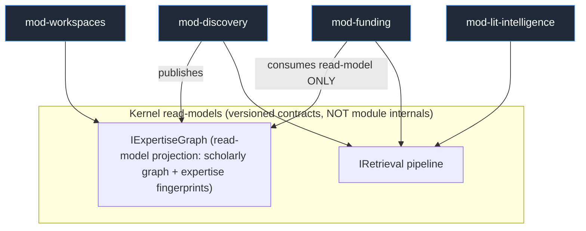

- `mod-funding` consumes the **published expertise read-model** (a kernel-owned projection), never `mod-discovery`'s code or storage. The expertise/graph surface is a **kernel contract `IExpertiseGraph`** with its own versioned schema.
- **CI gate (import-linter):** fails on ANY import edge between `modules/*` packages, and on any concrete-store/SDK import outside a kernel adapter. The module DAG is machine-verified acyclic.

### 3.2 The kernel — split into two coherence domains (resolves the "8 entangled contracts version in lockstep" high)

v1's "thin kernel" threaded a hardcoded tier enum through 5 contracts — a distributed monolith. v2 splits the kernel:

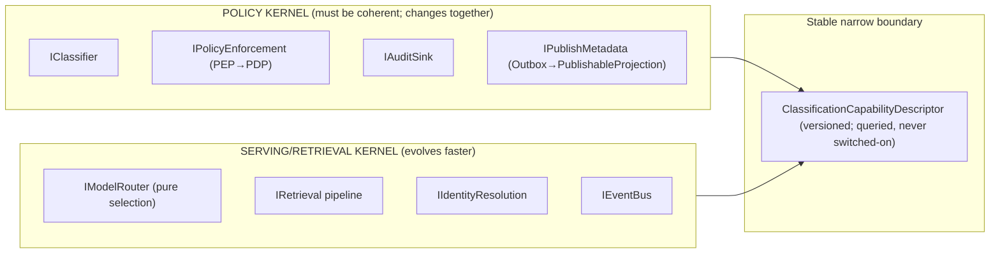

- **Tier model is a versioned `ClassificationCapabilityDescriptor`**, not a hardcoded enum. Router/publish/authz **query** it rather than `switch` on it, so adding a 4th tier or an export sub-regime does not force a coordinated multi-contract release.
- **Intra-kernel compatibility matrix** is published; policy-kernel contracts move together, serving-kernel contracts evolve independently across the narrow descriptor boundary.

### 3.3 MVP wedge (re-cut to be differentiated — resolves the two GTM criticals)

> **MVP = a FUNCTIONAL confidential research-intelligence product for a pre-bonded 2-node consortium design partner.** Two collaborating labs/centers at different institutions that already co-author (existing master agreement) get: (a) AI-grounded Q&A + semantic search over each lab's OWN corpus including a **functional confidential tier** (local-model-only, egress-blocked, provably in-boundary); (b) **public-tier federated expert discovery** across the two members (zero confidential sharing needed to demonstrate value); (c) one **revocable confidential sharing grant** exercised end-to-end (the federation seam, de-risked at first revenue).

This is NOT "RAG over public PDFs." First revenue is tied to the moat: confidential isolation + federated discovery + revocable cross-institution sharing. Public lit-Q&A is a supporting feature, never the paid wedge.

**Fallback wedge if no pre-bonded dyad closes:** a single **export-controlled / security-sensitive lab** buying the functional confidential single-tenant product (priced on the security guarantee, ~$2.5–5k/mo, GPU amortized) — N=1 but still differentiated, federation deferred one phase.

### 3.4 Beachhead buyer
**Primary:** a pre-bonded 2-node consortium (NSF/NIH multi-site center, CTSA hub, or academic alliance) with an existing DUA/master agreement and a security-line-item budget (~$2.5–8k/mo/node defensible).
**Fallback:** a single export-controlled engineering/defense lab (higher ACV, lower competition, requires the export-control gate early — opt-in per project, institution-attested per Section 11).

### 3.5 MVP vs deferred (re-scoped to be buildable by 3 engineers — resolves the "MVP is not an MVP" critical)

| Capability | MVP (Phase 0) | Phase 1 | Phase 2 | Phase 3 | Notes |
|---|---|---|---|---|---|
| Hybrid retrieval (vector+BM25+RRF) | ✅ | | | | essential |
| Reranking (BGE-reranker-v2-m3) | ✅ | | | | cheap ROI |
| Grounded Q&A (single-shot) + RAGAS-in-CI | ✅ | | | | core; gold-set bootstrapped in-cell |
| **Functional confidential tier** (local-model-only, egress-blocked) | ✅ | | | | **the differentiator, now functional** |
| Public + private(self) tiers | ✅ | | | | |
| Classification engine (fail-closed) + model router (if/else) | ✅ | richer policy | | | router = simple selection in MVP |
| **IPolicyEnforcement over LIBRARY RBAC** (not SpiceDB) | ✅ | →SpiceDB cell-local | | | interface stable; impl swapped at N≥2 |
| **IAuditSink over hash-chained Postgres table** (not merkle service) | ✅ | →WORM + external anchor | | | tamper-evident via hash chain in MVP |
| Independent egress PEP + PublishableProjection type | ✅ | | | | seam enforcement is MVP even at N=2 |
| Identity resolution (deterministic anchors) | ✅ | LLM adjudication | | | |
| Federated expert discovery (2-node, public-tier) | ✅ | | institution-wide | cross-consortium | wedge needs the seam at N=2 |
| One revocable confidential sharing grant (cell-local SpiceDB) | ✅ (minimal) | full ReBAC | | | exercises seam |
| Knowledge graph (deterministic, in consolidated Postgres/AGE) | ✅ | | HippoRAG2 PPR (gated by benchmark) | | |
| Consolidated Postgres datastore (pgvector+AGE+tsvector+audit+outbox) | ✅ | | split→Qdrant/OpenSearch at scale trigger | | one store for small cells |
| Cedar ABAC overlay | | ✅ | | | thin attribute gate first |
| Cross-institution sharing grants (full) + index tombstone/lease path | | ✅ | ✅ | | |
| Secure workspaces (zero-copy query-where-data-resides) | (minimal) | ✅ | TEE/clean-room | | zero-copy is the DEFAULT for confidential cross-tenant |
| GNN link prediction | | | ✅ (data-gated) | | needs graph maturity + feedback |
| Grant/funding intelligence + team assembly | | | | ✅ | Atom territory, from installed base |
| Adaptive RAG / CRAG / multi-agent | | | ✅ pipeline stages | ✅ | behind retrieval pipeline (Section 9) |
| Per-tenant learned fusion | | | | ✅ (**data-gated**, not build-gated) | needs click feedback to accrue |
| TEE match broker (scaled enclave fleet) | | | (only if buyer demands) | | PSI+DP under contractual controls first |
| Temporal durable workflows | | (grant lifecycle) | ✅ | | not in MVP |
| Kafka/Debezium CDC | | | ✅ (when central index exists) | | MVP uses outbox-polling |
| SOC2 Type I | | ✅ (weeks) | | | unblocks conversations |
| SOC2 Type II | | observation window starts | ✅ achieved | | gates institutional contract |

---

## 4. System Architecture

### 4.1 Control-plane / data-plane split (bridge model) — with the central index modeled as first-class state

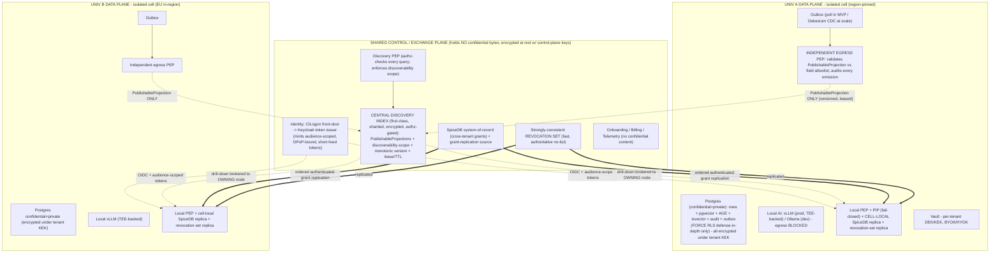

### 4.2 Plane responsibilities

**Per-university Data Plane = silo "cell"** (own infra or dedicated isolated data plane), region-pinned:
- Confidential + private data + **all derivative indexes (vectors, BM25, graph) encrypted under the tenant KEK** (so crypto-shred actually shreds — Section 11).
- Local AI (vLLM prod, TEE-backed / Ollama dev), egress-blocked at the network layer.
- **Local PEP + PIP (fail-closed)** + **cell-local SpiceDB replica** of relevant grant tuples + **cell-local replica of the strongly-consistent revocation set**. Confidential checks are cell-local and survive control-plane partition.
- **Independent egress PEP** between outbox and the world (Section 4.5).
- BYOK/HYOK per institution.

**Thin-but-stateful shared Control/Exchange Plane (holds NO confidential bytes):**
- **Central discovery index** — now a first-class, horizontally-sharded, **encrypted-at-rest (control-plane keys distinct from tenant keys)**, **authz-gated** store (Section 4.6 capacity model). Holds only `PublishableProjection`s, each carrying a **discoverability scope**, a **monotonic version (HLC)**, and a **lease/TTL**.
- **Discovery PEP** — authz-checks every discovery query and enforces discoverability scope (public-web | federation-wide | named-consortium | named-tenants). Publishing ≠ consenting to be discovered by all N.
- **SpiceDB system-of-record** for cross-tenant grants — but it is the **replication source**, NOT the synchronous hot-path dependency (Section 7.3).
- **Strongly-consistent revocation set** — a small, fast, authoritative no-list replicated to cells (Section 4.4).
- Identity/SSO, onboarding, billing, telemetry.
- **TEE match broker: deferred** (Section 0); when present, a horizontally-scaled enclave fleet (Section 4.7).

### 4.3 How cross-institution discovery works WITHOUT leaking confidential data

```mermaid
sequenceDiagram
    participant U as Researcher @ Univ A
    participant PEPA as Univ A local PEP
    participant DPEP as Discovery PEP
    participant DISC as Central discovery index
    participant TOK as Keycloak (token mint)
    participant PEPB as Univ B local PEP (owning node)

    U->>PEPA: "Who works on X across our consortium?"
    PEPA->>DPEP: discovery query (subject token)
    DPEP->>DISC: authz + discoverability-scope filtered query
    DISC->>DISC: gate each hit through REVOCATION SET (still-publishable?) + lease-valid?
    DISC-->>DPEP: surviving PublishableProjections + pointers (no confidential bytes)
    DPEP-->>PEPA: results

    U->>PEPA: drill into Univ B researcher detail
    PEPA->>TOK: request token audience=B, DPoP-bound, subject=U
    TOK-->>PEPA: short-lived token (audience=B)
    PEPA->>PEPB: brokered request + token (NOT A's self-assertion of U)
    PEPB->>PEPB: validate token sig/audience/binding; resolve subject FROM TOKEN
    PEPB->>PEPB: cell-local SpiceDB Check (grant?) + Cedar ABAC (fail-closed PIP)
    alt allowed (fresh, cell-local, partition-tolerant)
        PEPB-->>U: detail
    else denied / revoked / owning node unreachable
        PEPB-->>U: deny OR (if node unreachable) publishable-metadata-only + "detail unavailable"
    end
```

**The mechanisms (v2):**
1. **Discovery search** hits the central index → answers from `PublishableProjection`s + pointers. **Before any hit is surfaced**, the index gates it through the strongly-consistent revocation set (still-publishable?) and checks the lease is valid. The Discovery PEP enforces per-query authz + discoverability scope.
2. **Drill-into-detail** is brokered to the **owning node** carrying a **control-plane-minted, audience-scoped, DPoP-bound token for the actual end user**. The owning PEP resolves the subject **from the token, never from the requesting cell's claim** (confused-deputy mitigation). Check is **cell-local** (grant replica) + Cedar ABAC (fail-closed). **If the owning node is unreachable, return publishable-metadata-only + mark detail unavailable** (bounded brokered-path degradation — Section 14).
3. **"Do A and B share collaborators?"** → 2-party PSI with **mandatory DP budget + k-anonymity floor + pre-approved, rate-limited query templates** (Section 11.8). Returns aggregate only, never raw sets, never below the threshold.
4. **Confidential joint work** → **zero-copy query-where-data-resides is the DEFAULT** (no durable copy lands in the grantee cell), TEE/clean-room only where a buyer's threat model demands.
5. **Revocation / reclassification** (Section 4.4) — the v1 gap, now specified.

### 4.4 Revocation & reclassification — the specified path (resolves the #1 distributed-systems critical)

A revoke or a tier reclassification (private→confidential, or un-publishing previously-published metadata) must remove the now-stale entry from the central index, not just deny future drill-down.

**On revoke / reclassify-up / un-publish, the grantor cell atomically:**
1. **Deletes the grant tuple** in its cell-local SpiceDB replica and the SoR (drill-down denies immediately, cell-local).
2. **Adds the record/grant to the strongly-consistent revocation set** (a small, fast, authoritative no-list, replicated to the index and to cells). This is checked **before any metadata is surfaced** — so even if the index row persists, it cannot be served.
3. **Emits a CDC tombstone** for the index entry, stamped with a **monotonic per-record version (HLC at the grantor node)** so consumers reject out-of-order resurrections (a late publish cannot un-delete a newer tombstone).
4. The **index entry itself carries a short lease/TTL** and **self-expires absent re-publish** — bounding worst-case staleness even if a tombstone is lost.

**Three independent mechanisms guarantee no stale-metadata leak:** (a) strongly-consistent revocation-set gate at surface time (correctness), (b) versioned tombstone (eventual purge, ordering-safe), (c) lease self-expiry (backstop). The **metadata-revocation propagation bound is an SLO and a security-critical leak-window**, not a soft target; exceeding it is a P1 incident (Section 14.4).

**Grant-creation visibility (symmetric, v1 never addressed):** when a grant tuple is written, the grantee's discovery view updates only after (i) the grant replicates to the relevant cells and (ii) the corresponding `PublishableProjection` (if any) publishes with its version. The **grant-creation visibility window** is defined and SLO'd symmetric to the revoke window (Section 14.4), with explicit UX ("grant active; discoverability propagating").

**Already-disclosed data (resolves the revocation-semantics high):** revocation = *no further access* + index purge on fast path + grantee-tenant obligation to crypto-shred derived copies (**enforceable only via DUA + audit — stated plainly to buyers**). We distinguish **"revoke access" (enforced) from "revoke disclosure" (contractual)**. For confidential cross-tenant work, **zero-copy query-where-data-resides is the default** so no durable copy ever lands in the grantee cell.

### 4.5 The independent egress gate & PublishableProjection (resolves the #2 security critical + the modularity-seam high)

v1's invariant ("we only write publishable things to the outbox") was circular — the outbox writer was trusted, not checked.

- **`PublishableProjection` is a structural type** per entity in `shared/contracts/`: an **allowlist** of fields. The internal record → projection is a **total function** where every field defaults to non-published; a field is published only if explicitly added to the projection schema (with a classification review recorded in CI).
- **The Outbox writer can ONLY emit `PublishableProjection` objects.** Confidential→publishable is a type error, not a runtime hope.
- **An independent egress PEP** sits between the outbox and CDC/exchange. It treats the outbox as **untrusted**, re-validates each outbound record's classification against the strict field allowlist, **strips/rejects** anything else, applies **per-field** projection (a private doc with one public abstract publishes ONLY the abstract), and **audits every emission**.
- **Continuous runtime leak assertion in production:** sample outbound records and alarm on any confidential tag (or any non-allowlisted field) reaching the boundary. The federation-seam leak test is a **runtime control**, not only a CI test (CI negative tests can only catch known shapes).
- **CI gate:** any new field on an internal entity is non-publishable unless explicitly added to the projection — so a data-model change cannot silently widen the seam.

### 4.6 Central discovery index — capacity model (resolves the "thin/stateless" mislabel high)

The index is the **union of all nodes' publishable corpora + embeddings of publishable text + pointers**, under a continuous CDC firehose, serving cross-institution discovery.

- **Engine:** OpenSearch (hybrid BM25 + vector, Apache-2.0) as primary for the central index — collapses text + vector into one sharded engine and avoids a separate vector store at the fan-in point. Fallback: Qdrant (vector) + OpenSearch (text) split if vector scale forces it.
- **Shard key:** **by tenant** (natural isolation + per-tenant quota enforcement + clean tenant-eviction on offboarding), with topic-level routing within large tenants. Discovery search is **scatter-gather across tenant shards with a bounded fan-out and a hard timeout**; slow/absent shards return partial results flagged "incomplete," never block the whole query.
- **Embedding dimension:** MRL-truncated to **256-d** for the central index (full-precision vectors stay in-cell); inversion risk minimized by publishing only truncated, public-text embeddings (Section 11.8).
- **Size/throughput estimate (order-of-magnitude, to validate):** at N=50 R1s × ~50k–500k publishable works/profiles each = 2.5M–25M projections. At 256-d float16 ≈ 0.5KB/vector + text → **~30–150 GB** vector+text across shards; continuous write load dominated by snapshot-refresh bursts, smoothed by per-tenant CDC partitioning (Section 10). Modeled at N=10/50/200; query latency held under ingest via separate write vs query node pools and **per-tenant write-rate quotas** (Section 14.5).
- **Encrypted at rest** with control-plane keys (distinct from tenant keys); **authz-gated** by the Discovery PEP; **discoverability-scoped** per record.
- **Opt-out:** export-controlled/defense tenants may **opt out of central indexing entirely** → live federated drill-down only (no aggregate honeypot exposure).

The control plane is therefore **NOT "mostly stateless"**; it is a thin *control* surface plus this one large, sharded, stateful index that gets a real capacity model and its own scaling levers.

### 4.7 TEE match broker (when it arrives) — scaled fleet, not a chokepoint
Deferred from MVP. When a buyer's threat model demands operator-zero-trust: a **horizontally-scaled enclave fleet** with a **session scheduler**, per-session resource cost and max-concurrency stated, **queueing/backpressure** for match requests, a **warm enclave pool** so attestation cold-start doesn't dominate, and an explicit interactive-vs-batch distinction (most matches are batch/throughput-bound). N-choose-2 pair surface is managed by scheduling, not a single enclave.

### 4.8 Privacy-tech practicality ranking
**Zero-copy query-where-data-resides (default for confidential cross-tenant) > brokered drill-down (default for discovery) > 2-party PSI + DP (bounded, templated) > clean rooms / TEE (when buyer demands) > FHE (research/narrow, pilot only, off critical path).**

---

## 5. Modularity Model

### 5.1 What "modular to the bone" means here
Every pillar is a pluggable module behind kernel contracts; a new pool-tier module never touches the confidential silo; editions are packaging toggles over one architecture; **the module DAG is machine-verified acyclic and enforced by CI.**

### 5.2 Module definition
A **module** is a deployable unit that: (1) registers against **kernel contracts only**; (2) declares a **manifest** (name, semver, required kernel-contract versions, required tiers, emitted/consumed events, FastAPI routes, RBAC scopes); (3) **never** accesses another module's storage or imports another module's package — only via published events or kernel read-models; (4) is enabled/disabled per edition with **deny-by-default if disabled**.

### 5.3 Communication
- **Synchronous:** FastAPI behind a per-module prefix; every call passes the kernel PEP (object-level `Check` — kills BOLA/IDOR).
- **Asynchronous:** **Transactional Outbox** (poll-based in MVP; Debezium+Kafka at scale) + **idempotent consumers keyed by per-record monotonic version (HLC) + idempotency keys** + schema registry. Never naive dual-write.
- **Cross-pillar shared surface:** the scholarly-graph + expertise representation is a **kernel read-model `IExpertiseGraph`** with its own versioned schema; `mod-funding` consumes the **projection**, never `mod-discovery`'s internals.
- **Cross-tenant:** only through the publish-metadata interface (via the egress PEP) and cell-local grant checks.

### 5.4 The retrieval seam — a composable PIPELINE, not one fat interface (resolves the IRetrieval high)
v1's "thin IRetrieval over LlamaIndex" could not absorb PPR/CRAG/learned-fusion without leaking. v2:
- **`IRetrieval` core is small and stable:** `query → ranked passages with scores + provenance`.
- **Advanced behaviors are composable pipeline stages**, each its own micro-interface: `IRetriever → IFuser → IReranker → ICorrectiveLoop → IGraphAugment`. CRAG is an `ICorrectiveLoop` stage; HippoRAG2 PPR is an `IGraphAugment` stage; learned fusion is an `IFuser` impl.
- **State-bearing concerns are explicit dependencies, not hidden:** per-tenant learned fusion weights and click feedback live behind `IFeedbackStore`, injected — never buried inside a "thin" retriever.
- Worked seams are specified for the single-shot case (`IRetriever→IFuser→IReranker`) and the corrective-loop case (`…→ICorrectiveLoop` re-queries `IRetriever`), proving the seam holds for both control flows.

### 5.5 The model router — pure selection, with enforcement OUT of the router (resolves the "router god-object" high)
v1's router absorbed routing + egress enforcement + key-scoping + guardrails + eval-judge selection. v2 separates concerns so the router stays swappable/provider-agnostic (the locked requirement):
- **`IModelRouter` = pure provider selection**: given `(tier, tenant policy, capability needs)` → a provider handle. Swapping the router means swapping selection logic only.
- **`ITransportPolicy` (egress enforcement) is a separate, provider-independent compliance layer** at the network/key boundary — it is what *guarantees* confidential never egresses, tested as a compliance control (the CI egress-block test enforces here, not in the router).
- **Guardrails are a pluggable `IGuardrail` chain** composed around any provider.
- **Eval-judge selection** is a property of the eval harness, not the router.
- **Routing precedence is a pinned, tested invariant:** classification routing is evaluated FIRST; **confidential ALWAYS routes local**; BYO keys are **selectable only for public/low-risk tiers**; the config UI **cannot** attach a BYO cloud provider to the confidential tier; `confidential + BYO-cloud-configured ⇒ still routes local, BYO ignored, audited` (Section 8).

### 5.6 Versioning & consumer-driven contract testing (resolves the "no compatibility machinery" high)
- Kernel contracts are **semver**; modules pin a compatible major; the **intra-kernel compatibility matrix** (Section 3.2) says which contracts move together vs independently.
- **Consumer-driven contract testing (Pact-style) is a CI gate:** the provider verifies against recorded consumer contracts.
- A **machine-readable contract-version usage registry** records which module pins which kernel-contract major/minor, so a deprecation is retired only when **zero consumers remain**.
- **"Both served" is defined precisely for stateful kernel services:** for authz/audit, dual-version serving uses a **translation shim over a single source of truth**, never two independent authz spines (which would have security implications). Read-model contracts use additive-only evolution.

### 5.7 Adding / removing a module (minimal blast radius)
- **Add:** implement manifest + kernel-contract bindings; register routes/events/RBAC scopes; declare edition eligibility; deploy as independent service/Helm sub-chart; feature-flag on. No kernel change if within contract versions.
- **Remove:** feature-flag off (deny-by-default); drain consumers (registry retains historical event schemas); tear down its namespaced storage; kernel + other modules unaffected.

### 5.8 Revocation responsibility map (resolves the "revocation spread across 3 subsystems" medium)
Single source of truth, explicit ownership:
- **Cell-local SpiceDB tuple delete = the authoritative revocation** (correctness).
- **Read-time cell-local PEP re-check + the strongly-consistent revocation-set gate = enforcement guarantee** (drill-down + index surface).
- **Temporal orchestrates ONLY side effects** of revocation (notifications, downstream cleanup, key-rotation) — **never on the correctness path.** This is a pinned invariant so no one later puts revocation correctness inside a workflow.

### 5.9 Edition = isolation posture, not a feature toggle (resolves the "shared cell weakens confidentiality" medium)
Tier availability is **derived from isolation posture and enforced in ONE place**: a shared/soft-isolated cell **structurally cannot host the confidential tier**. The same enforcement code runs everywhere; PLG simply has no confidential data to guard. This keeps it one honest codebase — no fork, no PLG "confidential" claim.

### 5.10 Event substrate is profile-able for sovereign/air-gapped nodes (resolves the IEventBus low)
The Outbox **consumer contract** (idempotent, versioned, HLC-keyed events) is **substrate-independent**. A **lightweight transport profile** (outbox-table polling, no Kafka, embeddable/optional schema registry) is provided for constrained/air-gapped sovereign nodes behind the same `IEventBus` contract. The architecture stays constant across substrates; only the transport changes.

### 5.11 Directory / service boundaries + machine-enforced rules

```
platform/
  kernel/
    policy/                # IClassifier, IPolicyEnforcement, IAuditSink, IPublishMetadata (POLICY KERNEL)
      classification/
      authz/               # PEP + cell-local SpiceDB client + Cedar eval + revocation-set client
      audit/               # hash-chained sink (MVP) -> WORM+anchor
      publish_metadata/    # PublishableProjection types + total projection fn + egress PEP
    serving/               # IModelRouter, IRetrieval pipeline, IIdentityResolution, IEventBus (SERVING KERNEL)
      model_router/        # pure selection
      transport_policy/    # egress enforcement (compliance control)
      retrieval/           # pipeline stages: retriever/fuser/reranker/corrective/graph-augment
      identity_resolution/
      eventbus/            # outbox + (poll | CDC) + schema registry client
    read_models/
      expertise_graph/     # IExpertiseGraph (cross-pillar projection)
  modules/
    discovery/ lit_intelligence/ workspaces/ funding/
  exchange/                # central index (sharded), discovery PEP, revocation set, grant SoR client
  cell/                    # data-plane node bootstrap; single-appliance profile for sovereign
  shared/
    contracts/             # versioned interfaces + event schemas + PublishableProjection schemas (THE LAW)
    edition_config/        # packaging toggles; tier-availability derivation
```

**Machine-enforced rules (CI):** `import-linter` forbids module→module imports and concrete-store/SDK imports outside kernel adapters; LlamaIndex/Qdrant/SpiceDB SDK types may not appear in `shared/contracts/`; any new internal-entity field is non-publishable unless added to a `PublishableProjection`. The predecessor (TigerBuddy) had `hybrid_retriever.py` importing the concrete `VectorStore` — exactly the drift these gates prevent.

---

## 6. Data Model & Knowledge Graph

### 6.1 Core entities & relationships

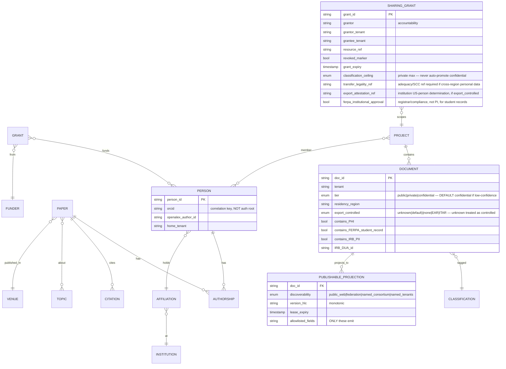

**Classification semantics pinned (resolves the static-vs-contextual medium):**
- **Record-intrinsic classification** (`DOCUMENT.tier`) is stored at ingest, **fail-closed default = confidential** if not high-confidence; it drives the **model-router egress decision** and the egress PEP.
- **Contextual access authorization** is the PEP decision per request (ReBAC + ABAC). The router keys off intrinsic tier; the PEP keys off intrinsic tier **plus** context.
- **Derived-data tiering rule:** every derivative inherits **MAX(input tiers)** — an embedding of confidential text is confidential; a graph edge touching a confidential node is at least private. Enforced at derivative creation.
- **Tier-down (declassification) requires audited human approval**; `export_controlled` defaults to `unknown` and the PEP treats `unknown` as controlled until adjudicated.

### 6.2 Two graph layers — with a scaling gate (resolves the AGE-at-scale high)
1. **Deterministic metadata-backbone graph** (built first, cheap, no LLM-extraction tax): authors/papers/citations/affiliations/venues/grants/topics. **Stored in Apache AGE inside the consolidated Postgres for small/MVP cells.**
2. **HippoRAG2-style Personalized-PageRank augmentation** (Phase 2, ~1k LLM tokens/query) for multi-hop retrieval.

**Scaling gate (mandatory before locking AGE for large cells):** benchmark **AGE multi-hop + PPR latency at a realistic R1 graph size** (estimate: ~0.5–5M author/paper nodes, ~10–50M citation edges per cell after OpenAlex-subset ingest). **PPR graph-compute cost (not just the ~1k-token LLM cost) is stated and budgeted.** If AGE doesn't hold the lit-intelligence/discovery latency SLO, a defined **switch trigger** moves the graph workload to **Neo4j/Memgraph** (the fallback now has a criterion, not just a name). **Co-location resource isolation:** for large cells, the graph-traversal CPU workload, HNSW vector RAM, and authz OLTP are **split out of the single Postgres** (Section 4.6 split trigger) so one workload cannot starve the others; small cells keep them co-located for operational simplicity.

### 6.3 Scholarly ingestion (self-hosted corpus — avoid metering/NC traps)

| Source | License | Use | Constraint |
|---|---|---|---|
| OpenAlex monthly snapshot | CC0 | Core graph | **Self-host snapshot; NEVER the metered live API on a hot path** |
| Crossref annual file | metadata open | DOIs, references | snapshot |
| OpenCitations | CC0 | Citation edges | snapshot |
| arXiv metadata | CC0 | Preprints | snapshot |
| ROR | CC0 | Institution identity | snapshot |
| ORCID Public Data File | CC0 | Person identity | **Ship the CC0 dump, NOT the live API (Public API is non-commercial)** |
| Semantic Scholar bulk | ODC-BY | Enrichment | **attribution required** |
| SPECTER2 vectors | Apache-2.0 | Scientific embedding space | clean |
| PMC / Europe PMC full text | license-tiered | OA full text | **programmatically gate to commercial-OK OA subset (CC0/BY/BY-SA/BY-ND); exclude NC-only** |

### 6.4 Entity resolution / author disambiguation
- Deterministic anchors (ORCID/DOI/OpenAlex IDs) + blocking + graph-feature classifier (MVP); LEAD-style LLM adjudication for hard collisions (Phase 2).
- **The cross-institution identity graph is public-tier by construction** — disambiguation must never centralize private records. (Validated in Open Questions: confirm no hard collision genuinely requires a private record.)
- Standalone `IIdentityResolution` consumed by graph build, expertise, discovery. ORCID is a correlation key, not an auth root.

---

## 7. Identity & Access Control

### 7.1 Federated identity

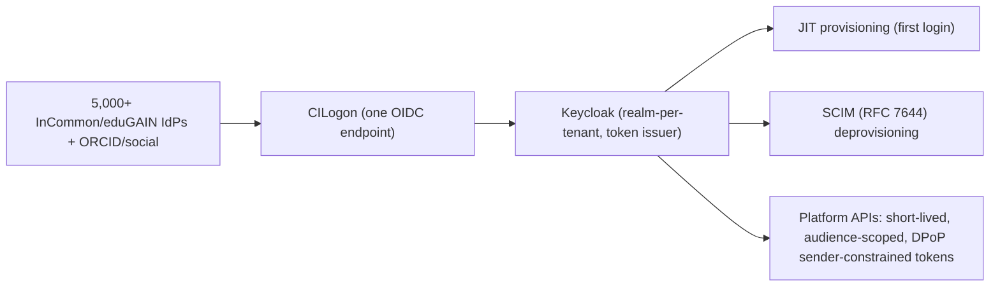

- **CILogon** front-door (commercial deployment requires a paid subscription → COGS line). Fallback: direct Keycloak SAML/OIDC brokering (a real cost-control fallback for price-sensitive tiers).
- **Keycloak** (Apache-2.0, realm-per-tenant) broker/issuer. Fallback: Ory.
- **Provisioning:** JIT first login + SCIM deprovisioning (cascade revocation on affiliation loss).
- **Federation hardening:** eduGAIN via REFEDS R&S + Sirtfi + CoCo v2; authorize on `eduPersonScopedAffiliation` + stable `subject_id` (not recyclable eppn). **SP-initiated SSO; strict issuer/audience validation; assertions scoped to the asserting tenant.**

### 7.2 Authz model — hybrid ReBAC + ABAC, fail-closed (resolves the ABAC fail-open high)

**Two-stage check at every PEP — composition order pinned: SpiceDB relationship path FIRST (ReBAC), then Cedar ABAC can only NARROW, never widen.**
- **ReBAC (SpiceDB):** project membership, hierarchical document/org-unit, and the first-class **`sharing_grant`** (grantor accountability, tenants, resource ref, `revoked_marker`, caveats: time-bound, consent-gated, DUA-referenced, `classification_ceiling`, **transfer_legality_ref**, **export_attestation_ref**, **ferpa_institutional_approval**). **Revocation = O(1) tuple delete (cell-local).**
- **ABAC (Cedar):** object attributes (`tier`, `residency_region`, `export_controlled`, `contains_PHI`, `contains_FERPA_student_record`, `IRB_DUA_id`, `consent_status`, `grant_expiry`) gate **whether a relationship even counts**.

**Fail-closed invariants (pinned + tested):**
1. **Indeterminate/missing ABAC attribute ⇒ DENY** for confidential and export-controlled tiers.
2. **ABAC can only NARROW the ReBAC grant, never widen** — a tested invariant.
3. **PIP unavailable on a confidential check ⇒ DENY**, not cache-fallback.
4. **`export_controlled` default = `unknown` ⇒ treated as controlled** until adjudicated.

### 7.3 SpiceDB topology — cell-local grant checks (resolves the #2 distributed-systems critical)
v1 contradicted itself (confidential checks "never depend on the shared plane" vs "PEP calls control-plane SpiceDB on every drill-down"). **v2 resolution (decision (a) from the review):**
- The **shared SpiceDB is the system-of-record** for cross-tenant grants and the **replication source**.
- **Relevant `sharing_grant` tuples are replicated INTO each owning cell** via **authenticated, ordered replication**, with the **ZedToken minted at the grant's home** carried along so the **cell-local Check is strongly consistent and monotonic**.
- **The confidential drill-down Check is cell-local** — it survives a control-plane partition (fail-closed if the cell's replica is stale beyond a bound). Cross-institution confidential access therefore does **not** have a synchronous hard dependency on the shared plane, and there is **no cross-region ZedToken round-trip on the hot path**.
- **SpiceDB region topology:** **regional clusters + cross-region grant replication** (not a single global cluster), so a US cell never makes a synchronous cross-Atlantic Check.
- **Benchmark moved to Phase 0:** ZedToken p99 (now cell-local) and replication lag are benchmarked **before** committing the Check SLO — this is no longer an open question deferred to "#5."

### 7.4 Decision flow & where the PDP sits

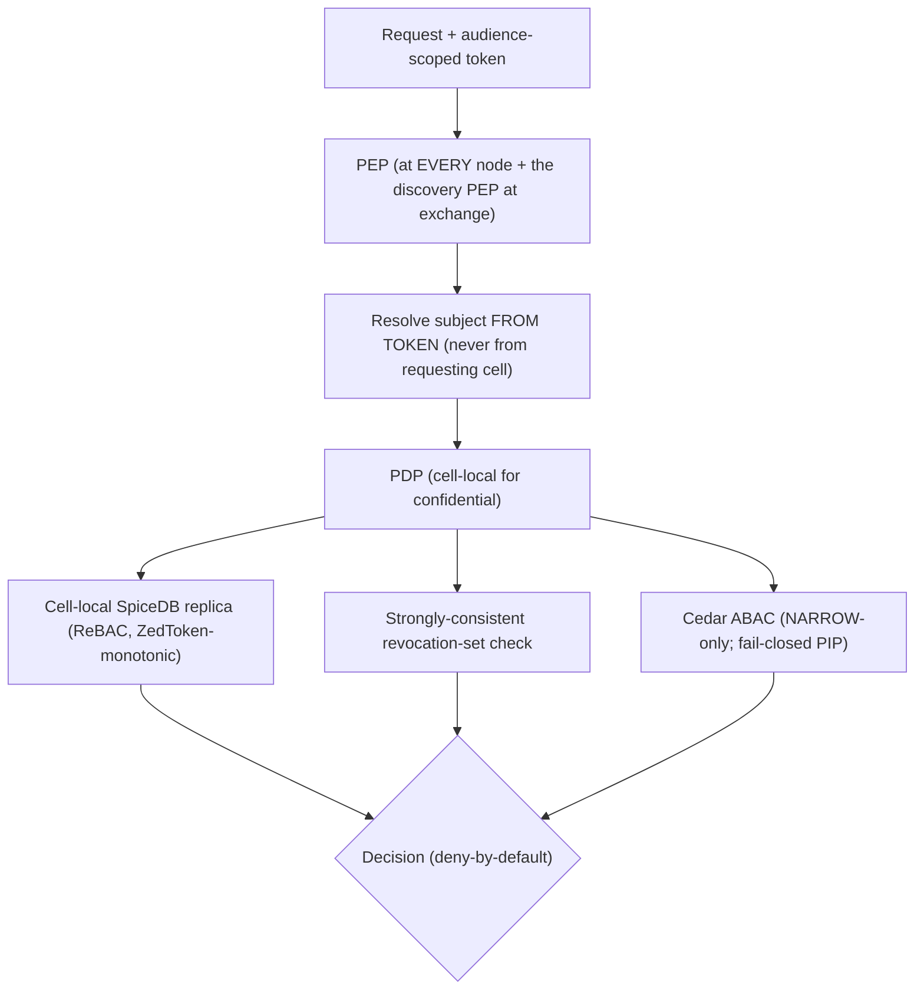

- **Confidential PDP evaluation executes inside the owning cell** — now genuinely true (cell-local grant replica + revocation-set replica + local PIP).
- **Tenant isolation is structural:** every resource has a `tenant` relation; cross-tenant access reachable only through a `sharing_grant`. No grant ⇒ no path ⇒ deny. **Object-level Check on every request.**
- **Confused-deputy mitigation (resolves the medium):** brokered drill-down carries a **control-plane-minted, audience=owning-tenant, DPoP-bound, short-lived token for the actual end user**; the owning PEP validates signature/audience/binding and **resolves the subject from the token, never from the requesting cell's body**. The `sharing_grant` is checked against the token subject. Tested: cell A cannot obtain B's confidential data by asserting an arbitrary subject.

### 7.5 Postgres RLS footgun checklist (defense-in-depth only)
`FORCE ROW LEVEL SECURITY` · `SET LOCAL` not `SET` (PgBouncer leak) · `WITH CHECK` on writes · `RESTRICTIVE` policies · `tenant_id` leading index column · `SECURITY DEFINER`/materialized views bypass RLS. RLS is never the sole boundary.

---

## 8. AI / Model-Router Layer

### 8.1 The kernel differentiator
**Classification → route binding** is the kernel differentiator (validated by Secure Multifaceted-RAG, arXiv 2504.13425). Build the fail-closed classification engine + the pure model router FIRST.

### 8.2 Routing rules — precedence pinned, enforcement separated (resolves the BYO-bypass medium + router god-object high)

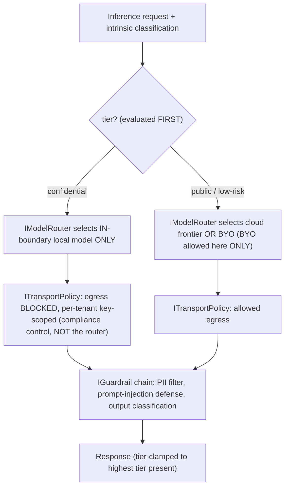

- **Classification routing is evaluated FIRST and dominates BYO.** `confidential ⇒ in-boundary local only`. **BYO keys are selectable ONLY for public/low-risk tiers**; the config UI cannot attach a BYO cloud provider to confidential; `confidential + BYO-cloud-configured ⇒ routes local, BYO ignored, audited`. BYO may point at a **self-hosted endpoint for confidential only if the institution attests it is in-boundary.**
- **Egress enforcement is `ITransportPolicy`, not the router** — provider-independent, tested as the compliance control (the CI egress-block test enforces here). Adding a provider does not re-open compliance enforcement.
- The confidential tier is constrained to **open, self-hostable** components → proprietary embedding/rerank/LLM APIs are public/BYO-only.

### 8.3 Serving & models

| Component | Confidential (local) | Public / BYO |
|---|---|---|
| LLM serving (prod) | **vLLM** (PagedAttention), **TEE-backed for confidential** | Cloud frontier or BYO |
| LLM serving (dev) | **Ollama** (M4 Max 36GB) — dev only | — |
| Embeddings | **Qwen3-Embedding** (0.6B dev / 4B–8B prod, Apache-2.0) + **SPECTER2**; fallback BGE-M3, nomic-v1.5 | Voyage/Cohere/Gemini = public/BYO only |
| Reranker | **BGE-reranker-v2-m3** / **Qwen3-Reranker** (local) | Cohere Rerank 3.5 (public/BYO) |

**Avoid TGI (maintenance mode).** nomic-embed is materially behind Qwen3/BGE (TigerBuddy inheritance trap).

### 8.4 Guardrails — tier-segregated synthesis (resolves the prompt-injection medium)
- **Input:** PII detection, prompt-injection screening, classification-tag verification (refuse if request tier > session clearance).
- **Tier-segregated synthesis (hard policy):** a single generation call must **not mix chunks across a tier boundary unless the output is clamped to the highest tier present** and routed/surfaced accordingly. Retrieved content is treated as **untrusted data, never instructions** (structured/delimited context). **A confidential output cannot reach a lower-tier surface regardless of LLM scan result** — the destination surface's clearance is a hard check, not a probabilistic scan.
- **Output:** confidential-leak scan + citation faithfulness (CRAG, Phase 2) as defense-in-depth on top of the hard tier-clamp.
- **Injection-corpus tests** in the eval harness (a poisoned document attempting exfiltration must fail).
- **Router-aware eval:** the judge LLM is the local model on the confidential tier.

---

## 9. Retrieval Architecture

**A composable per-tenant retrieval PIPELINE (Section 5.4) behind stable micro-interfaces; the model router selects local-vs-cloud per tier; a thin exchange adapter federates only public-tier discovery. Confidential data and its models never leave the node.**

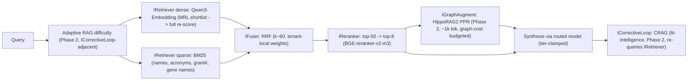

### 9.1 MVP-essential
- **Hybrid retrieval:** dense (Qwen3-Embedding, MRL-truncated shortlist → full re-score) + sparse (**BM25, mandatory**). Hybrid beats either alone by 15–30% recall.
- **Fusion: RRF (k≈60), tenant-local weights** (term distributions don't transfer across institutions).
- **Reranking (highest cheap ROI):** top-50→top-8, BGE-reranker-v2-m3 / Qwen3-Reranker (local). +5–15 nDCG@10 for <200ms.
- **Two embedding spaces:** Qwen3 (ad-hoc RAG) + SPECTER2 (citation-proximity / expertise fingerprints). **MRL operationally essential** for per-node RAM control.
- **Deterministic metadata-backbone graph** for traversal.
- **Evaluation harness (MVP-essential):** RAGAS (Faithfulness/Groundedness, Context Precision/Recall) + nDCG@k/Recall@k on a small in-domain gold set, **wired into CI as a regression gate**, run **per-tenant and per-model-route**; judge LLM is the local model on the confidential tier. **The RRF+rerank baseline is the contractually-promised quality bar** — learned improvements are upside, so no revenue depends on data that won't exist for 1–2 years.

### 9.2 Phased (composable pipeline stages, data-gated where noted)
- **Adaptive RAG** difficulty routing (cheap; dovetails with the router).
- **CRAG corrective loop** (`ICorrectiveLoop`) for lit-intelligence credibility.
- **HippoRAG2 PPR** (`IGraphAugment`) — gated by the AGE scaling benchmark (Section 6.2).
- **Per-tenant learned convex fusion** (`IFuser` impl) — **explicitly data-gated, not build-gated**; needs in-cell click/relevance feedback to accrue (collected behind `IFeedbackStore` without confidential data leaving the cell).
- **GNN link prediction** and **query-decomposition/multi-agent** (LangGraph) — **data-gated**; reserved for discovery maturity and grant team assembly. On the confidential path every agent step runs the local model — **cap loop iterations.**

### 9.3 Expertise / collaborator surface
Profile-as-retrieval (SPECTER2/Qwen3 fingerprints + retrieve+rerank) at MVP → GNN link prediction over the heterogeneous graph (Phase 2, data-gated) → cross-institution team assembly over the federated public-tier graph (Phase 3). The shared graph/expertise surface is the kernel read-model `IExpertiseGraph` (Section 5.3), not a module dependency.

### 9.4 Explicitly overkill at MVP
MS-GraphRAG global (~331k tokens/query), ColBERTv2/PLAID per-tenant index, multi-agent orchestration, learned/LambdaMART fusion, FHE on critical path. Ship single-shot hybrid+rerank+RRF; defer the rest as **pipeline stages**, not IRetrieval reimplementations.

---

## 10. Data Pipelines & Orchestration

### 10.1 Orchestrators — sequenced, not both in MVP (resolves the over-eventing high)
- **MVP: Dagster ONLY** — asset-lineage per-cell pipeline `crawl → distill → embed → index → graph → classify(fail-closed) → outbox`. Inherited idiom; fallback Prefect/Airflow.
- **Temporal added only when the first cross-institution grant lifecycle is built** (Phase 1/2) — durable grant/revocation-side-effect/workspace workflows spanning days–months. **Temporal never owns revocation correctness** (Section 5.8).
- **Kafka/Debezium CDC added only when the central index first exists** (Phase 2). **MVP uses transactional-outbox polling** to the (then nonexistent) exchange — i.e., MVP has no central-index firehose.

```mermaid
graph LR
    subgraph DAGSTER["Dagster — per-cell asset pipeline (MVP)"]
        CRAWL["crawl faculty/papers/docs"] --> DISTILL["distill research cards"]
        DISTILL --> EMBED["embed (Qwen3 + SPECTER2)"]
        EMBED --> INDEX["index (consolidated Postgres: pgvector + tsvector + AGE)"]
        INDEX --> CLASSIFY["classify tier (FAIL-CLOSED) + derive MAX-tier on derivatives"]
        CLASSIFY --> PROJ["build PublishableProjection (total fn)"]
        PROJ --> EGRESS["INDEPENDENT EGRESS PEP (allowlist re-validate + audit)"]
        EGRESS --> OUTBOX["Outbox (poll in MVP)"]
    end
    OUTBOX -."Phase 2".-> CDC["Debezium CDC (per-tenant partitioned)"]
    CDC --> EXIDX["Central discovery index (sharded, encrypted, authz-gated)"]
```

### 10.2 Sync between nodes and the exchange — CDC operational reality specified (resolves the CDC-correctness medium)
- **Per-record monotonic versioning (HLC) + idempotency keys** for all index upserts/deletes (exactly-once *effect* via idempotent consumers, even on at-least-once delivery).
- **Schema registry enforces forward+backward compatibility.** The central consumer **must handle events from a node running an OLDER schema** (self-hosted nodes upgrade independently — version skew is guaranteed, not hypothetical).
- **Per-tenant CDC partitioning with bounded-lag SLOs and alerting**, so one tenant's backfill cannot starve others.
- **Backpressure/shedding policy that NEVER drops tombstones:** delete/revoke events are durable even when publish events are shed (lost tombstone = leak window — Section 4.4 lease is the backstop, but tombstones are prioritized).
- **Only `PublishableProjection`s flow out**, through the egress PEP (Section 4.5). Confidential bytes never enter the outbox; the egress PEP treats the outbox as untrusted.

### 10.3 Intra-cell consistency contract (resolves the multi-store-divergence medium)
- **Postgres is the system of record** within a cell. **All derived indexes (pgvector/AGE in MVP; +Qdrant/OpenSearch after the split trigger) are rebuildable from it.**
- A **per-cell intra-cell outbox** fans out an entity update to all derived indexes via **idempotent, replayable indexers**, plus a **reconciliation/repair job** that detects and heals BM25↔vector↔graph divergence. This is distinct from the *outbound* publish outbox.

### 10.4 The consistency model — a TABLE, not a slogan (resolves the consistency-class medium + the low SLO finding)

| Cross-node flow | Consistency class | Staleness bound | Failure behavior |
|---|---|---|---|
| Confidential drill-down Check | **Strong (cell-local ZedToken-monotonic)** | 0 (cell-local) | fail-closed if replica stale beyond bound |
| **Revoke / reclassify-up / un-publish (index)** | **Strong gate (revocation set) + eventual purge** | **leak-window SLO; P1 if exceeded** | revocation-set gate prevents surfacing even if purge lags |
| Grant-creation visibility (index) | **Eventual, bounded** | symmetric to revoke window | UX: "grant active; discoverability propagating" |
| Discovery-index population | Eventual | bounded by CDC lag SLO | partial/incomplete-flagged results |
| Graph/GNN feature freshness | Eventual | bounded; recommendations labeled "as of <ts>" | stale features flagged, never silently used |
| Recommendation/team-assembly inputs | Eventual | bounded; built on federated public-tier replicas | surface freshness timestamp |
| PSI/aggregate outputs | Strong (computed live) + DP budget | n/a | rate-limited, k-anonymity floor |

---

## 11. Security, Privacy & Compliance

### 11.1 Confidential-tier crypto — plaintext-at-use stated honestly (resolves the BYOK/HYOK high)
- **Per-tenant envelope encryption (DEK/KEK) via Vault** (fallback cloud KMS). **ALL confidential derivative stores — pgvector/Qdrant vectors, BM25/OpenSearch postings, AGE graph nodes, object storage — are encrypted under the tenant KEK**, so **revoke-KEK = crypto-shred actually shreds the searchable derivatives**, not just the source rows. (v1 left the derivatives unencrypted, defeating shred.)
- **DEK granularity:** DEK-per-project (confidential), enabling project-scoped crypto-shred; **key rotation** defined (re-wrap DEKs under a new KEK version; rotate KEKs on a schedule and on personnel-change events). In-flight queries at revocation are aborted (the DEK is invalidated).
- **Plaintext-at-use boundary, stated plainly:** confidential plaintext **is** exposed in cell memory during inference and indexing. Mitigations: **TEE-backed inference (memory encryption)**, **disabled swap, disabled core dumps, ephemeral DEK caching.** **HYOK corrected to:** "the university controls key custody and can revoke; plaintext is processed transiently in-cell under TEE" — **not** "we can never decrypt" (which was false given inference must decrypt).

### 11.2 Audit — integrity, tenancy, and confidentiality of the audit itself (resolves the audit medium)
- **Hash-chained append-only log** (MVP) → **WORM storage + periodic external anchoring** (Phase 1). Tamper-evidence is a named mechanism, not an assertion.
- **A cross-tenant access decision produces a record on BOTH sides** — the accessor tenant (A) and the owner tenant (B) — in **per-tenant audit partitions.**
- **Audit-read authz:** audit content can itself reveal confidential relationships ("User X@A accessed Project Y@B"), so audit reads are access-controlled, and **confidential-tier audit content stays in-cell.**
- Every inter-institutional transfer of identifiable data references a **DUA artifact**.

### 11.3 Compliance triggers & handling (designed-in as attributes, with the federated gaps closed)

| Regime | Posture | Mechanism (v2 additions in bold) |
|---|---|---|
| **FERPA** | School official under institutional control; school stays liable | **`contains_FERPA_student_record` flag on DOCUMENT; cross-institution grants on FERPA-flagged data require registrar/compliance institutional approval (`ferpa_institutional_approval`), NOT a PI's grant.** Default: identifiable student data is NOT PI-shareable cross-institution. Directory-vs-education-record distinction encoded in classification. |
| **GDPR** | University = controller, we = **processor**; mandatory **DPA** | Right-to-erasure reconciled via crypto-shred (now covers derivatives, 11.1); EU data in-region cell; CoCo v2 for EU IdP attribute release. **Cross-border share carries a `transfer_legality_ref` (adequacy/SCC) caveat enforced by Cedar against `residency_region`; a grant from an EU cell to a non-adequate region without an SCC ref is BLOCKED.** **Published sub-processor list (CILogon, cloud KMS, TEE provider) in the DPA package.** |
| **Export controls (ITAR/EAR)** | **Deemed export**: access is gated by an **institution-attested US-person determination**, not an SSO claim | **Nationality is NOT an SSO-carried attribute.** Export-controlled access is gated by an explicit **signed US-person determination by the owning tenant's export-control officer (`export_attestation_ref` caveat) + an explicit authorized-person allowlist** — never an attribute-derived implicit set. **FRE is lost on imposing access restrictions → the export gate is OPT-IN per controlled project, never blanket.** The platform enforces the mechanism; the institution owns the determination. |
| **HIPAA / IRB / DUAs** | Limited Data Sets need a DUA; de-identified (45 CFR 164.514) is outside HIPAA | `contains_IRB_PII` flag; every inter-institutional identifiable transfer references a DUA artifact. |

### 11.4 SOC2 / ISO readiness — sequenced honestly (resolves the SOC2-timeline high)
- **SOC2 Type I first** (point-in-time, weeks) to **unblock early institutional conversations.**
- **SOC2 Type II observation window (6–12 months) starts once controls are stable**, achieved in Phase 2; it **gates the first full institutional contract** — so the time-to-institutional-revenue model (Section 16/18) assumes 12–18 months and the design-partner/consortium wedge bridges it under an existing master agreement.
- **ISO 27001** for EU/international later. **HECVAT** (321 questions) before any pilot — "confidential data never leaves your node, here is the egress gate + audit chain" is the strongest answer.

### 11.5 Threat model + mitigations

| Threat | Mitigation (invariant) |
|---|---|
| **Federation-seam leak (existential)** | PublishableProjection structural type + independent egress PEP + continuous runtime leak assertion; per-field projection; central index encrypted + authz-gated + discoverability-scoped + opt-out |
| **Stale-metadata leak on revoke/reclassify** | Strongly-consistent revocation-set gate at surface time + versioned tombstone + lease self-expiry; SLO'd leak-window, P1 on breach |
| **Misclassification / untagged derivative** | Fail-closed default = confidential; derivatives inherit MAX(input tiers); audited human approval for tier-down; independent egress scan as a 2nd gate |
| **New-enemy / partition** | Cell-local SpiceDB replica (ZedToken-monotonic) + fail-closed on stale replica; revocation set strongly consistent |
| **Confused deputy / IDOR at the seam** | Control-plane-minted, audience-scoped, DPoP-bound token; owning PEP resolves subject from token, never from requesting cell; object-level Check |
| **ABAC fail-open** | Missing/indeterminate attr ⇒ deny (confidential/export); ABAC narrows-only; PIP-down ⇒ deny; export default `unknown`⇒controlled |
| **Crypto-shred misses derivatives** | All derivative stores encrypted under tenant KEK; project-scoped DEK |
| **PSI differencing / embedding inversion** | Mandatory DP budget + k-anonymity floor + pre-approved rate-limited templates; publish only 256-d truncated public-text embeddings, never private/confidential derivatives |
| **Prompt injection across tiers** | Tier-segregated synthesis; output clamped to highest tier; hard destination-clearance check; injection-corpus tests |
| **Export-control self-sabotage (FRE loss)** | Opt-in per controlled project, never default-on |
| **Operator reads match inputs** (when TEE used) | TEE broker; PSI returns aggregates only; until then, contractual + audit controls, disclosed honestly |

### 11.6 (folded into 11.5)

### 11.7 (folded into 11.3)

### 11.8 PSI / aggregate privacy — DP as a required control (resolves the inference-leak high)
**Differential privacy is a REQUIRED, budgeted control on all cross-institution aggregate/PSI outputs**, not a footnote: a **per-tenant-pair privacy budget**, a **minimum-aggregation k-anonymity floor** before any overlap is returned, and **mandatory, rate-limited, pre-approved query templates** (no ad-hoc overlap queries). **Embedding-inversion threat modeled:** the central index publishes **only quantized/MRL-truncated (256-d) embeddings of lowest-sensitivity public text**; private/confidential derivatives' embeddings are **never** published.

---

## 12. Technology Stack

| Layer | Primary | Fallback | Licensing/justification flag |
|---|---|---|---|
| Federation entry | **CILogon** | direct Keycloak SAML/OIDC brokering | Commercial needs paid CILogon subscription → COGS (get hard quote, Section 16) |
| IdP / broker / session | **Keycloak** (Apache-2.0, realm-per-tenant) | Ory | mints audience-scoped DPoP tokens |
| Provisioning | **JIT + SCIM** (RFC 7644) | — | deprovisioning table-stakes |
| Authz — ReBAC | **SpiceDB** — SoR + **cell-local replicas**, regional clusters | OpenFGA (`HIGHER_CONSISTENCY` on confidential) | Apache-2.0; revocation = security guarantee; cell-local Check |
| Authz — ABAC | **Cedar** (deterministic, NARROW-only) | OPA/Rego (if infra policy too) | two-stage; fail-closed |
| **Cell datastore (MVP/small)** | **Postgres** = pgvector + **Apache AGE** + **tsvector/ParadeDB BM25** + audit + outbox | split below | ONE store; **encrypted under tenant KEK** |
| Vector (at scale) | **Qdrant** (split trigger) | pgvector | per-tenant index |
| Graph (at scale) | **Apache AGE**; **switch to Neo4j Community (GPLv3, isolate) / Memgraph (BSL) if AGE fails the multi-hop/PPR benchmark** | Neo4j/Memgraph | **replaces archived KuzuDB**; switch has a criterion (Section 6.2) |
| BM25 (at scale) / **central index** | **OpenSearch** (Apache-2.0, hybrid BM25+vector) | Tantivy/Quickwit | **Not Elasticsearch (AGPLv3)**; central index = sharded OpenSearch |
| LLM serving (prod) | **vLLM** (PagedAttention), **TEE-backed for confidential** | SGLang | **Not TGI (maintenance mode)** |
| LLM serving (dev) | **Ollama** (M4 Max 36GB) | llama.cpp | dev only |
| Embeddings | **Qwen3-Embedding** + **SPECTER2** (Apache-2.0) | BGE-M3, nomic-v1.5 | proprietary APIs = public/BYO only |
| Reranker | **BGE-reranker-v2-m3** / **Qwen3-Reranker** | Cohere Rerank 3.5 (public/BYO) | +5–15 nDCG@10 |
| Data orchestration | **Dagster** (MVP) | Prefect/Airflow | asset lineage |
| Durable workflows | **Temporal** (Phase 1/2 only) | — | side-effects only, never revocation correctness |
| API | **FastAPI** | — | clean module boundaries |
| RAG pipeline | **LlamaIndex** behind composable stage interfaces | Haystack | SDK types banned from `shared/contracts/` |
| Agent orchestration | **LangGraph** (Phase 2/3) | — | capped iterations on confidential path |
| Secrets / keys | **Vault** + per-tenant envelope encryption; **derivatives encrypted under tenant KEK** | cloud KMS | **confirm OSS suffices for per-tenant KMS/namespaces (Section 16); budget Enterprise if not** |
| Confidential compute | **TEE** (Nitro/SEV-SNP/TDX) — **deferred to buyer-demand**; vLLM TEE-backed for in-boundary inference | PSI libs + DP; clean rooms | FHE off critical path (pilot) |
| Event substrate | **Outbox polling** (MVP / sovereign profile) → **Debezium + Kafka/Redpanda + schema registry** (at scale) | — | substrate-independent consumer contract; tombstones never dropped |
| Scholarly data | OpenAlex/Crossref/OpenCitations/arXiv/ROR/ORCID-PDF (CC0) + Semantic Scholar bulk (ODC-BY) + SPECTER2 | live APIs for freshness only | own corpus; avoid metering/NC |

**TigerBuddy inheritance traps avoided:** KuzuDB→AGE (with a scale switch); nomic-embed→Qwen3/BGE; single-tenant NetworkX `tiger_brain.json` doesn't survive multi-tenancy; concrete-store imports past the seam are blocked by CI.

---

## 13. Deployment & Infrastructure

### 13.1 Topology

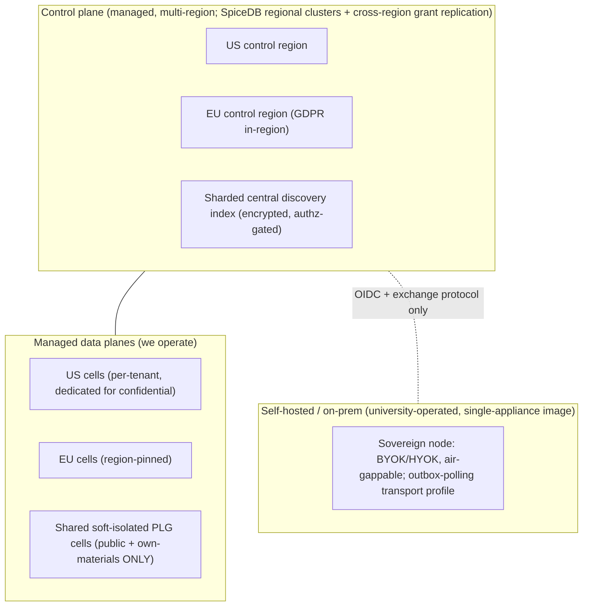

### 13.2 Managed vs self-hosted — with a shrunk sovereign footprint (resolves the on-prem ops high)

| Dimension | Managed cell | Self-hosted / sovereign node |
|---|---|---|
| Who operates | Us | University Research IT |
| Confidential data | Dedicated isolated cell we run, region-pinned | Entirely on university infra |
| Keys | BYOK via Vault | HYOK (university custody + revocation; transient in-cell decryption under TEE) |
| Control-plane link | Full | **Exchange protocol + OIDC only** (no confidential bytes ever) |
| **Stack footprint** | Full managed stack | **Single signed appliance image: k3s single-binary (NOT full k8s+Helm+Argo), consolidated Postgres (pgvector+AGE+tsvector), embedded library authz (NOT SpiceDB cluster), outbox-polling (NO Kafka/Debezium), local vLLM** |
| Update model | We push (Argo GitOps) | University-pulled **cosign-signed** bundles (air-gappable) |
| Target | Lab/Dept/Institution | Sovereign edition (export-controlled/defense) |

**Sovereign edition is deferred out of the first 18 months** (highest-ops, lowest-count buyer). We sell managed cells first where we control the stack. When sovereign ships, it is the **single-appliance profile** above — the architecture stays constant; the transport/auth substrate uses the lightweight profile (Section 5.10).

### 13.3 IaC / k8s posture
- **Kubernetes + Helm** sub-charts per module for **managed** cells; **Terraform** for cloud substrate; Crossplane optional for control-plane-managed provisioning. **Sovereign uses the single-appliance image, not k8s+Helm.**
- **Per-cell namespace + network policy + egress block** for the confidential path — the egress block is the `ITransportPolicy` compliance control, tested in CI.
- GitOps (Argo CD) for managed; cosign-signed bundles for sovereign pull.

---

## 14. Scalability & Reliability

### 14.1 Consistency model
See the table in Section 10.4 — strong (cell-local) for confidentiality decisions and the revocation-set gate; eventual-but-bounded for discovery metadata and recommendation inputs; DP-budgeted for aggregates.

### 14.2 Bottlenecks & scaling levers

| Bottleneck | Lever |
|---|---|
| Per-tenant vector index RAM | MRL truncation; per-tenant Qdrant sharding (after split trigger) |
| Local LLM throughput (Ollama sequential) | vLLM PagedAttention in prod; Ollama dev-only |
| **Central index growth/write-amplification** | Tenant-sharded OpenSearch; separate write vs query node pools; per-tenant write quotas; 256-d MRL vectors (Section 4.6) |
| **Brokered drill-down tail (slowest/offline node)** | **Separate SLO (14.4); timeout + circuit-breaker; degraded result = publishable-metadata-only; per-owning-node health/SLA tracking** |
| Exchange backpressure | Per-tenant CDC partitioning + bounded-lag SLOs; tombstones never shed |
| **Graph multi-hop / PPR at scale** | AGE scaling benchmark + switch trigger to Neo4j/Memgraph; split graph CPU out of the OLTP/vector Postgres for large cells; PPR graph-cost budgeted |
| SpiceDB consistency cost | Cell-local replica (no cross-region hot-path Check); regional clusters |

### 14.3 Failure domains — modeled as a PRODUCT for cross-node ops (resolves the failure-domain high)
- **Intra-node ops are cell-isolated:** a tenant cell failure never affects another tenant or the control plane.
- **Cross-node (brokered) ops availability is the PRODUCT, not the min:** a brokered drill-down touches A's PEP + token mint + B's cell. At 99.9% each, the brokered op is ~**99.7%** — stated explicitly, not hidden. **Sovereign/air-gapped/offline owning nodes are expected**; behavior is defined: **owning node unreachable ⇒ publishable-metadata-only + "detail unavailable," never an unbounded wait.**
- **Control-plane degradation** (discovery index down): confidential intra-node operation continues (cell-local PEP/PIP/LLM + grant replica + revocation-set replica are self-contained); only *cross-institution discovery* degrades.
- **Exchange outage:** federation pauses; single-tenant pillars unaffected.

### 14.4 SLOs — derived, path-split, security-critical where relevant (resolves the SLO low + the cross-region medium)

| SLO | Target | Basis / note |
|---|---|---|
| Intra-node grounded Q&A | p95 < 4s | local model; measured per route |
| **Confidential Check (cell-local)** | p99 < 50ms | **cell-local replica — benchmarked in Phase 0 (no cross-region round-trip)** |
| **Discovery (index path)** | p95 < 800ms | scatter-gather across tenant shards, bounded fan-out |
| **Discovery (brokered path)** | p95 < 2.5s, hard timeout 5s → degraded result | **separate from index path; owning-node-governed; degrade not block** |
| **Metadata-revocation leak window** | < 5s; **P1 incident if exceeded** | **security-critical bound, not a soft target;** revocation-set gate makes correctness independent of purge lag |
| Grant-creation visibility | < 5s (symmetric) | UX-labeled |
| Cell availability | 99.9% | per-cell |
| Control plane | 99.95% | |
| **Cross-region confidential drill-down** | budgeted explicitly | **US-cell PEP → cell-local Check (no cross-Atlantic) → brokered to EU cell → EU local inference → response; ~1–2 cross-region hops, summed against the 4s Q&A SLO. PSI/TEE cross-region runs in async/batch mode with its own budget, never on the sub-second path.** |

### 14.5 Hot-tenant / noisy-neighbor model (resolves the hot-tenant high)
- **Shared control-plane components** (central index, CDC, eventually TEE broker): **per-tenant write/query quotas + fair scheduling** on the index; **per-tenant CDC partitioning with bounded-lag SLOs** so a mega-R1's backfill or query storm cannot degrade discovery for others.
- **Shared PLG cells:** **per-tenant resource quotas on vector RAM and local-LLM GPU time** + fair scheduling, so one lab's batch distill cannot starve co-tenants' inference.
- **Cell-split / promote-to-dedicated trigger** when a tenant crosses a size/QPS threshold (mega-R1s like MIT/Stanford get dedicated cells; small colleges share). The trigger is an explicit operational policy, not ad hoc.

---

## 15. Observability, Testing & CI/CD

### 15.1 Telemetry
- **OpenTelemetry** traces across PEP → PDP → retrieval pipeline → router (per-tenant, per-model-route tags); Prometheus + Grafana; Loki/Tempo. Per-tenant cost attribution (LLM tokens, vector RAM, **GPU-hours**) for billing.
- **Confidential-tier telemetry and audit stay in-cell** (only decision metadata leaves; no confidential content in spans).

### 15.2 Eval-in-CI
RAGAS (Faithfulness/Groundedness, Context Precision/Recall) + nDCG@k/Recall@k on an in-domain gold set, **CI regression gate, per-tenant + per-model-route**, judge = local model on confidential tier. A retrieval-quality regression fails the build. The **RRF+rerank baseline is the contracted bar**; learned gains are upside.

### 15.3 Test strategy across modules
- **Consumer-driven contract tests** (Pact-style) against `shared/contracts/`; **contract-version usage registry** gates deprecation retirement (Section 5.6).
- **import-linter / dependency CI gate:** no module→module imports; no concrete-store/SDK imports past kernel adapters; no SDK types in `shared/contracts/`.
- **Authz tests:** SpiceDB assertions + Cedar validation; explicit **revoke-then-read denies**; **new-enemy regression**; **ABAC-narrows-only invariant**; **PIP-down ⇒ deny**; **confused-deputy test (A cannot assert arbitrary subject to read B)**.
- **Isolation + egress tests:** cross-tenant access denies; **egress-block test enforced at `ITransportPolicy`** as a compliance control.
- **Federation-seam tests (CI) + continuous runtime leak assertion (prod):** confidential tag / non-allowlisted field never reaches the boundary; **PublishableProjection type guarantee + single audited projection function** make this provable, not an infinite negative test.
- **Revocation leak-window test:** metadata is unsurfaceable within the SLO after revoke (revocation-set gate).
- **Injection-corpus test:** a poisoned document attempting confidential exfiltration must fail tier-segregated synthesis.
- Unit/integration per `pytest` markers (`-m unit`, `-m integration`).

### 15.4 Release / rollback
GitOps (Argo CD) per managed cell; canary per module via feature flags; cosign-signed bundles for sovereign pull. Rollback = flag-off + previous Helm/appliance revision. Kernel-contract changes follow the deprecation-window + translation-shim rule (Section 5.6).

### 15.5 Dev/prod parity & cloud staging (resolves the M4-Max-parity medium)
- **Dev-testable on M4 Max:** retrieval logic, classification, RRF, rerank, single-tenant flows, projection/egress logic.
- **REQUIRES cloud (cannot be validated on a 36GB Mac):** vLLM batching/PagedAttention, **two-cell federation seam**, egress-block enforcement at scale, TEE, multi-region SpiceDB replication. These are **gated behind CI in a budgeted cloud staging environment** (Section 16) — the confidentiality moat can only be validated in paid cloud infra, and that is an explicit opex line, not hidden by the local-first story.

---

## 16. Cost Model & Team

### 16.1 Infra cost shape — with the unit-economics question RESOLVED pre-build (resolves the inverted-economics criticals)

**The confidential tier requires an in-boundary GPU (vLLM). A dedicated GPU cell cannot be served at $179–499/mo.** Therefore, pinned decisions:
- **Per-cell confidential COGS (smallest viable config):** smallest acceptable local LLM (quantized 7–8B) + embeddings + vector RAM + consolidated Postgres + a single always-on small GPU (L4/A10G class). **Realistic floor ≈ a few hundred to ~$1k+/mo per dedicated cell in cloud GPU alone.** This is **modeled on real cloud GPU pricing before committing the wedge**, not deferred.
- **Decision:** the **beachhead is NOT a price-sensitive PLG lab.** It is a **consortium design partner or funded center / export-controlled lab** at **$2.5–8k/mo/node**, where the GPU amortizes and a security line-item exists. PLG (public + own-materials) is a later expansion funnel priced separately and does **not** carry a dedicated confidential GPU.
- **BYO-compute path:** at PLG/department, the confidential tier (where offered at all) can run on the **customer's own hardware / on-prem GPU** — we charge for software, shifting GPU COGS to the buyer (matches the sovereign philosophy). Whether this is operationally tolerable self-serve is an Open Question.
- **Central index:** first-class sharded OpenSearch (Section 4.6) — a real, growing stateful cost, not "modest fixed."
- **Hard fixed COGS lines (get real numbers before commit, not "open question"):** **CILogon commercial subscription**, **Vault OSS-vs-Enterprise** (confirm OSS provides per-tenant KMS/namespaces + envelope encryption for BYOK/HYOK; budget Enterprise if not — flagged as a no-fabricated-capability check), managed-Kafka/SpiceDB-Cloud if not self-run, **SOC2 audit + Drata/Vanta (~$40–70k/yr all-in)**, cloud GPU staging. **Compute breakeven customer count per edition.**
- **Cloud staging** (Section 15.5) is a fixed opex line.

### 16.2 Minimal founding team — sized to the REDUCED MVP scope (resolves the team-mis-sizing high)

| Role | MVP focus | Scale-up |
|---|---|---|
| **Founding eng — distributed systems/backend** | Reduced kernel: RBAC shim, hash-chained audit, consolidated Postgres, outbox+egress PEP, cell-local grant check, Dagster pipeline | →SpiceDB cell-local replication, CDC, Temporal |
| **Founding eng — ML/RAG** | Retrieval pipeline, pure router, embeddings/serving, eval harness | →pipeline stages (CRAG/PPR), GNN |
| **Founding eng — security/infra** | Classification (fail-closed), `ITransportPolicy` egress, BYOK, k8s/IaC, SOC2 Type I evidence | **explicitly splits into security-eng + platform/SRE + fractional GRC as scope grows; TEE is a later specialist hire, not this person now** |
| **Founding GTM / domain (research-admin)** | **ONE motion: consortium design-partner BD** (not four motions at once) | enterprise + PLG funnel later |
| **(Fractional) compliance counsel** | FERPA/GDPR/ITAR review; DPA/DUA/SCC templates; US-person determination workflow | — |

**The reduced Phase-0 kernel (library RBAC, Postgres audit, if/else router, consolidated Postgres, no TEE, no SOC2-Type-II-yet, Dagster-only) IS buildable by three engineers.** v1's full kernel was not. Team size and MVP scope are now consistent.

---

## 17. Risks & Mitigations

| # | Risk | Type | Mitigation |
|---|---|---|---|
| 1 | **Federation-seam confidentiality leak** (existential) | Technical | PublishableProjection structural type + independent egress PEP + continuous runtime leak assertion; revocation-set gate + versioned tombstone + lease; central index encrypted/authz-gated/scoped/opt-out |
| 2 | **Stale-metadata leak on revoke/reclassify** | Technical/Compliance | Strongly-consistent revocation set checked before surfacing; SLO'd leak-window; P1 on breach |
| 3 | **Unit economics inverted (confidential GPU vs price)** | Business | Beachhead = funded consortium/center/export lab at $2.5–8k/mo; PLG = public+own-materials only; BYO-compute path; COGS modeled pre-build |
| 4 | **MVP earns revenue in commodity space** | Market | MVP = functional confidential + federated discovery at a pre-bonded dyad; public lit-Q&A is never the paid wedge |
| 5 | **Network-effect cold-start / DUA latency** | Market | Seed a pre-bonded dyad with an existing master agreement; N≥2 is the FIRST deployment; first use case needs zero confidential sharing |
| 6 | **CISO blocks PLG confidential upload** | Market/Compliance | PLG is public + researcher-own materials only; confidential is institutional/sales-assisted; tier availability derived from isolation posture |
| 7 | **SOC2 Type II 12-month window vs runway** | Compliance/Execution | Type I first (weeks); Type II window starts when controls stable; consortium master-agreement wedge bridges the 12–18mo institutional cycle |
| 8 | **Over-scoped MVP / 5 distributed systems** | Execution | Thin kernel impls behind stable interfaces; Dagster-only; outbox-polling; no Kafka/Temporal/SpiceDB/TEE/SOC2-II in MVP |
| 9 | **SpiceDB global consistency/latency bottleneck** | Technical | Cell-local grant replicas; regional clusters; Phase-0 benchmark of cell-local Check + replication lag |
| 10 | **Crypto-shred misses searchable derivatives** | Compliance | All derivative stores encrypted under tenant KEK; project-scoped DEK; plaintext-at-use stated honestly + TEE-backed inference |
| 11 | **Export-control (ITAR) over-claim** | Compliance/Legal | Institution-attested US-person determination + authorized-person allowlist (not SSO claim); opt-in per project; platform enforces mechanism, institution owns determination |
| 12 | **FERPA cross-institution disclosure by PI** | Compliance/Legal | FERPA flag + registrar/compliance approval required for student-record sharing; not PI-grant-shareable by default |
| 13 | **PSI differencing / embedding inversion** | Technical | Mandatory DP budget + k-anonymity floor + templated rate-limited queries; publish only truncated public-text embeddings |
| 14 | **AGE multi-hop/PPR fails at R1 scale** | Technical | Benchmark + switch trigger to Neo4j/Memgraph; split graph CPU from OLTP/vector at scale |
| 15 | **Self-hosted sovereign ops crush a 3-person team** | Execution | Single-appliance image (k3s+consolidated Postgres, no Kafka/SpiceDB-cluster); defer sovereign past 18 months |
| 16 | **Fast-follow on pillars 1+4 (Atom)** | Market | Bring a thin confidential/federated slice forward to the first RD-office conversation; expand into grants from installed base |
| 17 | **Four GTM motions on one hire** | Execution | Sequence MOTIONS; one motion (consortium BD) at a time; product supports all four, company sells one |
| 18 | **TigerBuddy inheritance traps / coupling drift** | Technical | KuzuDB→AGE; nomic→Qwen3/BGE; import-linter CI gate prevents concrete-store imports past the seam |

---

## 18. Phased Roadmap & Milestones

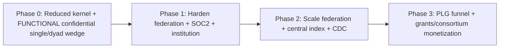

### Phase 0 — Reduced kernel + functional confidential wedge (pre-bonded dyad, or single export lab)
**Build:** fail-closed classification + pure model router (if/else) + `ITransportPolicy` egress block + **IPolicyEnforcement over library RBAC** + **IAuditSink over hash-chained Postgres** + PublishableProjection type + independent egress PEP + identity resolution (deterministic) + `mod-lit-intelligence` (composable retrieval pipeline: retriever→fuser→reranker, single-shot, RAGAS-in-CI) + **functional confidential tier (local vLLM, egress-blocked)** + 2-node public-tier federated discovery + ONE revocable confidential grant (cell-local SpiceDB minimal). Consolidated Postgres datastore. Dagster only. Cloud staging stood up. SOC2 Type I.
**Milestones:** first paying design-partner node(s); grounded Q&A p95 < 4s; **confidential egress-block + federation-seam leak assertion green (CI + runtime)**; **revoke-then-read denies + metadata unsurfaceable within leak-window SLO**; cell-local Check p99 benchmarked < 50ms; RAGAS faithfulness gate green.

### Phase 1 — Harden federation + institution + SOC2 Type II window
**Build:** swap RBAC shim → **SpiceDB cell-local replication**; audit → WORM + external anchor; Cedar ABAC overlay (fail-closed); full revocable sharing grants + index tombstone/lease/revocation-set path; institution-wide expert discovery; BYOK + derivative-store encryption under tenant KEK; export-control opt-in gate (institution-attested) + FERPA institutional-approval flow; HECVAT; SOC2 Type II observation window begins; Adaptive RAG + CRAG pipeline stages; Temporal for grant lifecycle side-effects.
**Milestones:** first institutional contract; HYOK validated (custody + revocation; TEE-backed inference); confidential-tier in production; cross-region confidential drill-down within budgeted SLO.

### Phase 2 — Scale federation + central index + CDC
**Build:** sharded encrypted authz-gated central discovery index; Debezium+Kafka CDC (per-tenant partitioned, tombstone-durable); discoverability-scope enforcement; brokered-path circuit-breakers + per-node health; zero-copy confidential workspaces (default), TEE/clean-room only on buyer demand (scaled enclave fleet if so); HippoRAG2 PPR (after AGE benchmark / switch decision); GNN link prediction (data-gated); split datastore (Qdrant/OpenSearch) past the trigger; hot-tenant quotas + cell-split policy; SOC2 Type II achieved.
**Milestones:** N≥5 federated nodes; discovery index-path p95 < 800ms under continuous ingest; brokered-path degraded-result behavior verified with an offline node; SOC2 Type II report.

### Phase 3 — PLG funnel + grants/consortium monetization
**Build:** PLG self-serve (public + own-materials, single flat price); `mod-funding` (grant intelligence + cross-institution team assembly over the federated public-tier graph, consuming `IExpertiseGraph`); multi-agent decomposition (LangGraph, capped); per-tenant learned fusion (data-gated); DP-budgeted PSI productionized; optional MS-GraphRAG/FHE pilots; ISO 27001 for EU.
**Milestones:** PLG funnel live; first broad-consortium contract with exchange add-on; first cross-institution grant team assembled and funded.

---

## 19. Open Questions & Decisions to Validate

*What v2 still must test with customers or spikes before committing. (Several v1 "open questions" — unit economics, SpiceDB topology, MVP wedge — are now DECISIONS above, not open questions.)*

1. **Pre-bonded dyad identification** — which specific existing NSF/NIH center, CTSA hub, or academic alliance has an executable master agreement AND two members who will co-deploy? The wedge depends on finding one; spike: outreach to 5–8 candidates.
2. **Confidential-cell COGS at the chosen price band** — validate the modeled GPU+stack floor against real cloud pricing and against design-partner willingness-to-pay at $2.5–8k/mo/node; confirm the BYO-compute path is operationally acceptable to at least one buyer.
3. **SpiceDB cell-local replication mechanics** — spike authenticated ordered grant replication + home-minted ZedToken carry; measure replication lag and the fail-closed staleness bound; confirm regional-cluster topology cost.
4. **AGE multi-hop + PPR at R1 scale** — benchmark at ~0.5–5M nodes / 10–50M edges per cell; if it fails the SLO, exercise the Neo4j/Memgraph switch; quantify PPR graph-compute cost.
5. **Central index scaling** — validate tenant-shard scatter-gather fan-out latency and per-tenant write-quota smoothing at N=10/50/200; confirm 256-d MRL vectors hold discovery quality.
6. **Vault OSS capability** — confirm OSS provides per-tenant KMS/namespaces + envelope encryption for BYOK/HYOK without Enterprise (no-fabricated-capability check); else budget Enterprise.
7. **CILogon commercial cost & Keycloak-brokering fallback** — hard quote; confirm direct brokering is a viable cost-control fallback for price-sensitive tiers.
8. **Metadata-revocation leak-window SLO feasibility** — spike the revocation-set replication + index-gate latency end to end; confirm <5s is achievable, else set the bound honestly and treat as security-critical.
9. **PSI/DP usability** — does a k-anonymity floor + DP budget on templated overlap queries still return useful collaborator-overlap answers, or does the privacy budget destroy utility? Spike with synthetic two-institution data.
10. **Export-control attestation workflow** — validate with one export-control officer that a signed US-person determination + authorized-person allowlist is operationally acceptable and legally sufficient as the gating mechanism.
11. **FERPA gating acceptance** — validate with a registrar/compliance office that the "PI cannot cross-share student-record-flagged data without institutional approval" default is correct and sufficient.
12. **PMC/Europe PMC OA-subset gating** — verify the commercial-OK OA filter yields a usefully large corpus.
13. **TEE deployment surface (when it arrives)** — Nitro vs SEV-SNP/TDX abstraction; only spike when a buyer's threat model demands operator-zero-trust and pays for it.
14. **Eval gold-set bootstrapping per tenant** — how the first per-tenant gold set is built without confidential data leaving the cell, and who labels it.
15. **Pricing metric acceptance** — confirm research buyers accept any per-active-user metric vs preferring FTE-capped site licenses, especially for fluctuating lab populations.

---

*End of plan2. The architecture is constant; build order and isolation posture are the levers. The existential risk remains the federation seam (Risk #1) — now defended by a structural PublishableProjection type, an independent egress PEP, a continuous runtime leak assertion, and a strongly-consistent revocation-set gate, rather than by trust. The previously-riskiest unproven assumption (confidential-cell COGS at PLG prices) is now a resolved decision: the wedge is a funded consortium/center, not a price-sensitive lab, and the moat ships functional at first revenue.*