# Plan v3

> Adversarial review of this version: **9 critical**, **22 high** findings.

---

This is a writing and synthesis task. I'll produce the revised version 3 plan directly, resolving every critical and high finding with explicit decisions. No codebase work or skill is needed.

# plan3 — Federated Multi-University Research Collaboration & Discovery Platform

*A from-scratch, production-grade redesign inspired by TigerResearchBuddy. Opinionated, sequenced, fundable. Version 3 resolves an adversarial multi-lens review across distributed-systems correctness, end-to-end confidentiality, maintainability/modularity, GTM/business viability, and founder feasibility. Where a finding exposed a genuine CAP/trust/economics tradeoff, v3 makes the decision explicit and states the losing side's failure behavior rather than asserting both.*

**The single invariant the platform enforces — stated with its honest boundary:**
> *Confidential bytes are processed only inside their owning cell and never enter the shared plane. What flows outward is a typed, allowlisted **PublishableProjection**, structurally guaranteed by the type system + a 100% inline blocking egress PEP allowlist re-validation. That projection carries an **authority-anchored monotonic version** and a lease, and is gated on every surface against an **authoritative freshness check** — fail-closed when the freshness watermark is older than the leak-window. **Trust model: nodes are mutually distrusting; no node's self-asserted timestamp ever orders a security decision in its own favor.** For managed cells the operator is a contractually- and technically-bounded processor (NOT operator-zero-trust until TEE/HYOK); for sovereign/HYOK cells it is operator-zero-trust. We say "provably" only of the structural type guarantee and the sovereign tier — never of the managed-cell operator boundary.*

The v1 claim "read-time re-check makes correctness independent of latency" was retracted in v2. v3 goes further: it specifies the **authority-anchored** freshness model that makes the revocation gate genuinely correct under partition and across mutually-distrusting clocks, and it honestly reconciles the availability-vs-revocation tradeoff that v2 claimed to satisfy on both sides.

---

## 0. What changed and why (decision log)

Non-normative but load-bearing. Records the explicit tradeoffs made to resolve the review.

| Decision | Prior | v3 | Rationale (finding resolved) |
|---|---|---|---|
| **Revocation correctness model** | "Strongly-consistent revocation set replicated to cells, checked locally, <5s" — CAP-contradictory | **Authoritative linearizable revocation store at a single region; cell/index hold a freshness *watermark*, not a strongly-consistent copy. Surfacing/drill-down requires a watermark newer than (now − leak-window), else FAIL-CLOSED (deny / publishable-metadata-only).** | A replica cannot be "strongly consistent" at the consumer. The gate is now an authoritative freshness check with defined partition behavior, not a wished-for replicated set. (DS-crit-1, SEC-crit-1, DS-high-grant-liveness) |
| **Version authority for revoke ordering** | Per-record HLC minted by the data-owning (possibly skewed/adversarial) cell | **Revoke/tombstone ordering is anchored to a monotonic version assigned by the central revocation authority. A node cannot outrun the authority's tombstone version. Node HLCs still order *intra-cell* events; accepted cross-trust HLC skew is clamped to a max-skew window with alarms.** | A self-asserted timestamp must never order a security decision in the node's own favor. (DS-crit-2) |
| **Gated discovery query cost** | Inline per-hit revocation lookup at fan-out, never costed | **Revocation gate pushed INTO each shard as a filtered query against a locally-materialized revocation bitmap refreshed within the leak-window. One indexed filter, not N lookups. A shard whose bitmap is staler than the leak-window returns `incomplete` — and `incomplete` is a SECURITY state (fail-closed), not a quality flag.** | (DS-high-query-cost) |
| **Lease liveness mechanism** | Re-publish full doc to refresh lease (write firehose) | **Leases live in a separate lightweight expiry store (sorted-set / TTL index) keyed by record-version; refresh is a timestamp bump, not a hybrid-index re-index. Lease = hours-scale backstop; revocation watermark = seconds-scale fast path. Explicitly reconciled.** | (DS-high-lease-write-amp) |
| **Central index shard key** | By tenant (pessimal for the dominant cross-tenant topical query; mega-R1 skew) | **Two-tier: a global topical ANN candidate layer (sharded by embedding cluster) + per-tenant authz/scope/quota filtering. Tenant is a filter + quota dimension, not the shard key. Mega-tenants topic-subsharded from day one.** | The dominant read pattern is cross-tenant topical discovery; tenant-sharding made every broad query hit every shard. (DS-med-shardkey) |
| **Embedding publication** | Raw 256-d MRL embeddings published; "truncation = privacy" | **No raw invertible embeddings leave the cell. Publish only per-tenant-keyed, salted quantized LSH codes for candidate generation; final scoring brokered to the owning cell. Membership-inference + embedding-inversion are named, tested threats. MRL is a quality knob, never a privacy control.** | Truncation is dimensionality, not privacy; vec2text-class inversion + membership inference leak research direction. (SEC-crit-2, SEC-high-composition) |
| **Operator trust claim** | "Confidential never leaves your node, provably" applied to managed cells | **Claim split per deployment: managed = vendor-operated isolation + per-tenant keys + inline egress gate, vendor is a bounded processor (NOT zero-trust until TEE); sovereign/HYOK = operator-zero-trust. "Provably" reserved for the structural type guarantee and sovereign. HYOK key custody + TEE moved EARLY for any operator-zero-trust buyer (export labs).** | Managed operator holds key-unwrap, runs the egress gate and the un-TEE'd inference host — operator is in the TCB. (SEC-high-operator-trust) |
| **GDPR erasure** | "Crypto-shred = erasure" | **Per-data-subject erasure workflow distinct from tenant-KEK shred: targeted hard-delete + tombstone of the subject's projections/embeddings in the central index, plus Art. 19 recipient-notification propagating erasure obligations (and technical revoke where possible) to every grantee cell. Technical-vs-contractual guarantees stated per surface.** | Tenant-KEK shred does not reach control-plane-keyed central index or cross-tenant copies. (SEC-high-erasure) |
| **Classifier trust root** | Single probabilistic classifier; fail-closed-on-uncertainty only | **Dual independent classifier (rules + separate model). Any tier-DOWN decision requires AGREEMENT; disagreement fails closed to confidential. Egress PEP re-derives/sanity-checks source classification on emission, not just field allowlist. Classification-time prompt injection added to the injection-corpus test. Human review for automated public-tier assignment above a corpus-sensitivity threshold for export/IRB tenants.** | Fail-closed-on-uncertainty does nothing against confident-WRONG downgrade; classifier is itself an injection target. (SEC-high-classifier) |
| **Sticky cross-institution caveats** | Caveats enforced only at grantor PEP | **Caveats travel with shared confidential data and are RE-EVALUATED at grantee-side access against the ACTUAL accessing individual's attributes (US-person, FERPA role). Downstream re-share prohibited by default (no transitive grant without grantor consent), enforced by SpiceDB + egress PEP on the grantee side.** | Deemed-export applies to the person who accesses; grantor's institution-level attestation doesn't bind the grantee-side individual. (SEC-high-sticky) |
| **PSI/DP privacy ledger** | Per-tenant-PAIR budget, no authoritative ledger, no coalition model | **Global per-subject and per-target-project privacy ledger with a linearizable monotonic decrement (the one justified small consensus dependency — PSI is async/batch, latency-tolerant), replay protection (template+nonce dedupe), and a cap on aggregate ε spent against a single target across ALL queriers. Composition with central-index membership signal modeled as one adversary capability.** | Per-pair budget with no ledger and no coalition model is defeated by racing or colluding queriers. (SEC-high-PSI, DS-med-PSI-ledger) |
| **Agent-action egress** | Output-text tier-clamp only | **Every agent-initiated action (re-query target tier, tool call, projection/share emission) passes the same PEP + tier-clamp + egress PEP as a user action. Agents act under a constrained, tier-pinned capability — never the user's full authority. Loops are iteration- AND action-tier-capped. Injection-corpus test extended to agent-action exfiltration.** | Agentic stages are a confused-deputy vector the text-clamp misses. (SEC-med-agent) |
| **Subject deprovisioning** | Revocation set covers grants/records, not subjects; token valid until expiry | **Revocation authority extends to SUBJECTS. Confidential drill-down requires a fresh subject-not-deprovisioned watermark within the leak-window; very short confidential-tier token TTLs + step-up. Per-tenant token signing keys so one mint compromise can't forge all audiences.** | A deprovisioned insider keeps minutes of cross-institution access at token expiry. (SEC-med-deprovision) |
| **PLG isolation** | RLS demoted to defense-in-depth; no stated primary isolation for shared cells | **PRIMARY isolation for shared PLG cells = schema-per-tenant + per-tenant encryption keys + per-tenant vector namespaces (NOT a shared index with a tenant filter column). `private(self)` gets the same per-tenant key separation as confidential, minus local-model-routing. Egress/leak runtime assertion runs WITHIN the shared cell for cross-tenant `private(self)` leakage.** | `private(self)` drafts ARE sensitive; one RLS bug = multi-tenant breach. (SEC-med-PLG) |
| **Export gate firing** | US-person allowlist attaches only on per-project opt-in | **US-person allowlist fires whenever `export_controlled ∈ {EAR, ITAR}` OR `unknown` for an export-sensitive tenant, REGARDLESS of project opt-in. Opt-in governs the FRE/workflow tradeoff, not whether the gate fires. Unadjudicated potentially-controlled ingest enters a QUARANTINE state.** | Deemed-export liability doesn't wait for an admin to opt a project in. (SEC-med-export-gap) |
| **Audit anti-repudiation** | Two-sided log, no binding, no reconciliation | **Each cross-tenant access record binds (grant_id, grant_version, token_jti, freshness-watermark). Audit-before-serve for confidential: an access that cannot be durably logged on the owner side is DENIED. Cells exchange counter-signed audit receipts; a reconciliation job detects divergence.** | A divergent/unbindable two-sided log is worthless as a legal artifact. (SEC-med-audit) |
| **Tier lattice modularity** | "Query the descriptor, don't switch" — false decoupling | **Tier lattice is a single OWNED module (partial order + explicit join/MAX + default + routing/clamp policy table). "Add a tier" is a checklisted, test-gated policy-kernel release. A typed total-match / exhaustiveness check + import-linter FAILS the build when a new tier isn't handled by every consumer (router, derivation, egress, Cedar, edition derivation).** | The tier lattice is the most cross-cutting concept; descriptor indirection hid the fan-out. (MAINT-high-tier-lattice) |
| **IExpertiseGraph contract** | One write, two reads, kernel-owned, unspecified — a god-contract | **Split into `IExpertiseFingerprint` (vectors; funding/discovery) and `ICollaborationGraph` (edges/membership; workspaces/discovery). Both kernel-owned, versioned, additive-only, READ-only projections; mod-discovery emits RAW events the kernel projects (it does NOT own the contract). Per-field consumer registry so a field is retired when no pillar reads it.** | A contract one module writes and all four read is the classic bottleneck where v1 rotted. (MAINT-high-expertisegraph) |
| **PublishableProjection evolution** | Safety property specified; versioning/cross-node-skew unaddressed | **First-class versioned contract in `shared/contracts/` with per-field `introduced-in-version` + classification-review record, additive-only. Egress PEP validates against the NODE's emitted projection version; central index accepts the intersection of fields across deployed node versions. Contract test: node@N and index@M agree on the allowlist intersection.** | Federation seam = existential surface; a maintainability gap here is a security gap across independently-upgrading nodes. (MAINT-high-projection-evolution) |
| **DB-level module isolation** | import-linter only; MVP consolidates everything into one Postgres | **Per-module schema ownership inside the consolidated Postgres with DB-role grants (module A's role cannot read module B's tables). CI/migration check forbids cross-schema references. Cross-module data access ONLY via kernel read-models/events — enforced at the DB-permission layer, not just imports.** | import-linter is blind to coupling through a shared store, which the consolidated Postgres invites. (MAINT-high-db-coupling) |
| **Router/transport disagreement** | Undefined when router selects cloud for confidential and transport blocks | **Router emits a typed decision; ITransportPolicy validates against intrinsic tier INDEPENDENTLY. Disagreement = HARD FAIL (deny + audit) — never silent cloud egress, never silent local fallback masking a router bug. Contract test: a deliberately-buggy router selecting cloud for confidential must hard-fail at transport.** | A swappable router whose correctness depends on a second component sharing tier logic needs a defined disagreement contract. (MAINT-med-router-transport) |
| **Retrieval pipeline shape** | Fixed linear stage chain | **`IRetrievalPlanner` emits a bounded-iteration plan (graph, not fixed chain) over micro-interfaces, executed by a small orchestrator. Adaptive RAG = a planner strategy; CRAG re-query = a bounded back-edge; multi-agent = another planner. Loop caps + per-stage tier-clamp pinned at the orchestrator.** | A linear chain can't express router-decides-shape + corrective back-edge + interleaved graph-augment. (MAINT-med-pipeline-graph) |
| **Cross-kernel contracts** | Only the descriptor named as the boundary | **Explicit versioned, additive-only `AuditEvent` schema (serving emits, policy consumes) and `OutboxRecord` envelope (serving produces, policy egress PEP validates), listed in the intra-kernel compatibility matrix alongside the descriptor.** | Audit-of-serving and egress-over-eventbus are structural cross-kernel dependencies the descriptor alone doesn't cover. (MAINT-med-cross-kernel) |
| **Split-store consistency** | Specified only for consolidated MVP | **Split-store consistency contract specified NOW (implemented later): per-record version carried into every derived index; divergence detector (SoR-version vs index-version sweep); defined repair (re-project from SoR); defined IRetrieval behavior during rebuild (SoR-version-gated results; drop passages whose SoR row is tombstoned). Treated as a planned migration with contract tests, not an adapter swap.** | One transactional store → three eventually-consistent ones is a consistency-model change, not an adapter swap. (MAINT-med-split-store) |
| **Local federation test harness** | Seam correctness gated behind paid cloud staging only | **Local docker-compose multi-cell harness (two cells + stub control plane + mock/quantized inference) runs the federation seam, brokered drill-down, confused-deputy test, egress PEP, and revocation/freshness gate in CI on every PR. Paid cloud staging reserved for PERFORMANCE/scale only.** | Seam correctness must be locally testable or it rots; only catching it in paid staging means under-testing the highest-blast-radius surface. (MAINT-med-test-harness) |
| **Sovereign substrate parity** | Implied "one architecture, toggles"; sovereign silently a different stack | **Explicitly TWO supported runtime profiles (full managed stack vs single-appliance) behind the SAME contracts. The abstract confidentiality/authz/egress conformance suite runs against BOTH substrates. Substrate profile is an explicit, tested axis.** | Sovereign swaps authz impl + event substrate + orchestration — different runtime stacks that must stay behaviorally identical for the guarantee. (MAINT-low-substrate) |
| **MVP wedge & build order** | Phase-0 = full kernel + 2-cell live federation + egress gate + central index | **Phase-0 = SINGLE-CELL functional confidential product for the FALLBACK-class buyer (one security-sensitive R1 center/lab, NOT export-controlled). No second cell, no central index, no egress PEP/projection/runtime-assertion yet. The 2-node consortium dyad becomes Phase-1. First revenue lands on N=1 differentiated security value while the dyad is sourced.** | Two-cell live federation + a provably-correct egress gate is the full moat, not an MVP; building it pre-customer burns runway. (COST-crit-mvp-scope, COST-crit-dyad-dependency) |
| **First sellable unit** | Gated on a rare 4-way-AND consortium dyad | **Phase-0 first dollar is independent of the dyad: a single-tenant confidential research-intelligence cell for ANY security-sensitive funded center/lab (no export controls, no second institution). Dyad is the EXPANSION proof. Buyer-discovery spike runs in WEEK 1 and gates the architecture sequence.** | Revenue cannot depend on an external precondition with unknown hit rate and a months-long cycle. (GTM-crit-dyad, GTM-crit-fast-vs-differentiated) |
| **Export-lab fallback** | Presented as the easy safety net | **Reclassified: the export-controlled/defense lab is NOT a Phase-0 fallback — it requires sovereign/on-prem + CMMC/NIST-800-171 + DCSA posture (Phase-2+ vertical with its own capital). The genuine easier fallback is a well-funded R1 center buying the confidential single-tenant product for INTERNAL use, no export controls.** | A pre-revenue startup's managed cloud cell cannot hold ITAR data; CMMC is a multi-quarter capital-intensive cert. (GTM-high-export-fallback, COST-crit-dyad-dependency) |
| **Pricing basis** | Bottom-up from COGS | **Value-based WTP validated in 8–10 pricing interviews BEFORE build; if WTP clusters below the COGS floor, BYO-compute becomes the DEFAULT (shift GPU COGS to buyer), not a PLG afterthought. First 3–5 deals = a SINGLE flat per-node fee, everything included (multi-axis pricing deferred until a sales engineer exists).** | Buyers pay perceived value, not your COGS; free/cheap adjacents depress the ceiling. (GTM-high-WTP, GTM-med-pricing-complexity) |
| **Revenue instrument & runway** | "First revenue" implied as SaaS subscription, no burn model | **Phase-0 revenue = a paid PILOT/POC services contract (clears faster than a security-reviewed SaaS subscription). Explicit burn/runway/revenue-by-quarter model added (Section 16): seed assumption, monthly burn, first-dollar and first-recurring dates overlaid on security/legal gates. Recurring SaaS revenue modeled at month 12–18.** | Confidential multi-party university SaaS = longest enterprise cycles with the smallest sales org; no runway model = fatal. (GTM-high-runway, GTM-crit-fast-vs-differentiated) |
| **Network-effect bootstrap** | "Seed a dyad" restates the cold-start | **Standalone-useful side named: the INTRA-institution research-intelligence product must be independently worth buying (acquires nodes without the network). Cross-node value compounds after. Honest TAM statement: early growth rides existing consortia (CTSA, Big Ten) — this is consortium-BD, not PLG-bootstrapped network growth; reconciled with the PLG story.** | A dyad is N=2 with one edge; the platform captures pre-existing collaborations, it doesn't manufacture new ones. (GTM-high-network-effect) |
| **PLG honesty** | Modeled as a revenue funnel | **PLG (public + own-materials) is a LOSS-LEADER / brand-awareness play, NOT modeled as revenue or a meaningful funnel against free Elicit/NotebookLM. GTM energy reallocated to consortium/institution. The one differentiated PLG-ish increment (grounded Q&A over the researcher's OWN sanctioned institutional library corpus) is acknowledged as land-and-expand into the top-down motion, not true self-serve.** | A funnel no one enters because the free product is as good is not a funnel. (GTM-high-PLG) |
| **Vault per-tenant keys** | Open question: "confirm OSS suffices, else Enterprise" | **DECIDED: per-tenant key isolation via per-cell isolated Vault Community instances (one Vault per cell = naturally tenant-isolated, no namespaces) OR cloud KMS per-tenant keys. Vault Enterprise namespaces NOT used. Cost added to COGS.** | Vault Community lacks namespaces; Enterprise is low-six-figures/yr — a knowable answer, not an open question. (COST-high-vault) |
| **Cloud-GPU COGS & availability SLO** | "A few hundred to ~$1k+/mo" + 99.9% on one GPU | **Per-cell COGS rebuilt as a line-item stack (GPU + standby policy + Postgres + storage + egress + central-index share + monitoring): realistic all-in ≈ $1.5–3k/mo. Confidential-cell SLO DOWNGRADED to 99.5% single-instance with a documented recovery procedure (no warm-standby GPU budgeted), OR warm-standby explicitly doubles GPU cost — buyer chooses.** | A single non-redundant GPU cannot hit 99.9%; floor COGS was understated, compressing margin. (COST-high-gpu-cogs) |
| **Central index ops** | Sized in GB, not dollars or ownership | **Central index costed at N=10/50/200 and assigned to a MANAGED service (OpenSearch Serverless / managed vector) pre-scale to keep ops off the 3 engineers. Cost recovered via the consortium/exchange add-on, not silent overhead.** | A self-managed CDC-fed multi-region cluster is a small-team ops sink + unamortized overhead. (COST-high-central-index-ops) |
| **Edition build vs design** | Blurred "architecture constant" into "build all variation points now" | **Explicit DESIGNED-only vs BUILT-now split: through Phase-1 the only fully-built topology is the single-cell managed edition. PLG shared-cell scheduler, sovereign appliance image, BYO-compute path are design-reserved seams with ZERO implementation until their phase.** | Designing five isolation postures + a fair-scheduled PLG substrate + a sovereign image up front is a large tax for a team selling one edition for 18 months. (COST-high-edition-tax) |
| **AGE-at-scale + license** | Benchmark + switch deferred to Phase 2 | **AGE multi-hop + PPR benchmark moved to Phase 0/1 on synthetic OpenAlex-subset data (no customer needed). Neo4j GPLv3 process-isolation story and Memgraph BSL commercial terms PRE-VERIFIED; fallback engine picked before needed so a switch is a planned port, not a fire drill.** | A "switch trigger" that is actually a DB migration + license change is a large deferred risk on a small team. (COST-med-age) |
| **CILogon for first buyer** | Default front-door from day 1 | **For the single-institution first buyer (ONE IdP), direct OIDC/SAML to their Keycloak is trivial — CILogon DEFERRED until federation breadth is needed. CILogon commercial quote obtained pre-build; eduGAIN-brokering fallback scoped as real engineering weeks, not a drop-in.** | The first buyer has one IdP; broad federation isn't needed yet, and the "fallback" transfers significant ops burden. (COST-med-cilogon) |
| **SOC2 Type I timing** | Phase-0, "weeks," concurrent with heaviest build | **SOC2 Type I moved to the Phase-0→1 boundary once a verbal design-partner commit exists; design partners start on a questionnaire + roadmap. Fractional GRC role pulled into Phase 0 if Type I must start earlier — NOT assumed as zero engineering cost.** | Type I needs policies/risk-assessment/evidence that compete with 3 engineers; no GRC owner is staffed in Phase 0. (COST-med-soc2) |
| **Cloud staging shape** | Implied always-on CI gate | **Staging is EPHEMERAL on-demand spin-up for federation/egress/perf gates (torn down between runs); multi-region SpiceDB validation is a one-time spike, not a standing gate. Dollar estimate added; confirmed on-demand, not 24/7.** | An always-on multi-region GPU staging cluster rivals production COGS and consumes ops time. (COST-med-staging) |
| **Eval judge parity** | Assumed RAGAS judge runs free on the Mac | **Judge model size pinned to match prod; RAGAS-in-CI confidential-tier judge runs in the GPU staging budget, not on the M4 Max. Dev-tier judge allowed only with documented periodic prod-tier re-validation.** | A judge that differs dev-vs-prod measures something other than what ships. (COST-low-eval-parity) |
| **Backpressure freshness honesty** | "Discovery bounded by CDC lag" while publishes are shed under load | **Under publish-shedding, discovery freshness SLO is SUSPENDED and results carry an explicit `as-of` staleness that can exceed the nominal bound. Shedding is by priority WITHIN publishes (shed re-embeddings/enrichment; keep first-publish + content-material updates). Tombstones are NEVER shed. The 10.4 table reconciled with this degraded mode.** | "Bounded by CDC lag" and "publishes shed under load" contradict precisely when load makes SLOs matter. (DS-med-backpressure) |
| **Intra-cell contention** | Undefined "split trigger"; consolidated Postgres runs everything | **Split trigger DEFINED (corpus > 2M docs OR p95 Q&A breaches SLO OR graph nodes > 5M OR vector RAM > 60% of cell RAM) and is an ALERT, not a postmortem. Reconciliation/HNSW rebuilds isolated to off-peak/read-replica. RAM budget for HNSW + AGE working set stated for the smallest cell so COGS floor isn't violated by index memory.** | Small cells are cheapest-provisioned, so contention bites where there's no headroom; an unspecified trigger = production discovery. (DS-med-intra-cell-contention) |
| **Egress runtime assertion framing** | Marketed in the headline invariant as a hard proof control | **Egress PEP allowlist re-validation is the 100% inline blocking gate (the proof). The runtime sampling assertion is repositioned explicitly as DRIFT-DETECTION/alerting — it does NOT carry proof weight in the headline invariant.** | A sampling, after-the-fact detector cannot "prove" no leak. (DS-low-runtime-assertion, SEC-low-control-plane-blast-radius) |
| **Control-plane blast radius** | Unstated for narrowly-scoped projections | **Documented explicitly. `named_consortium` / `named_tenants`-scoped projections encrypted under per-consortium keys so a control-plane compromise can't read narrow shares. Federation-scoped projection content minimized. Opt-out is the DEFAULT for any export-controlled/high-sensitivity tenant.** | A control-plane breach yields the cross-institution honeypot since the PEP is app-layer and keys are operator-held. (SEC-low-control-plane) |
| **Product name** | TigerExchange (mascot-coded) | **Institution-neutral working name `MeridianExchange` for the commercial product; Tiger* lineage dropped.** | A name coded to one institution undercuts neutral-federation trust with rival institutions. (GTM-low-branding) |

---

## 1. Vision & Positioning

### 1.1 The product in one sentence
A federated, AI-native research collaboration platform where each university owns a strongly-isolated node holding its confidential data, and a thin shared exchange layer enables selective, **revocable, freshness-gated** cross-institution discovery and collaboration **without ever centralizing confidential bytes** — enforced by a structural type boundary and an inline egress gate, not by trust.

### 1.2 The white space

| Silo | Players | What they own | What they lack |
|---|---|---|---|
| Profile/data layer | Pure, Converis/Esploro, Symplectic, Academic Analytics, Dimensions, OSS **VIVO** | Institutional research metadata | No AI-native grounded Q&A; no confidential federation |
| AI over public literature | Elicit, Consensus, Scite, SciSpace, Undermind, Scholar-QA, NotebookLM | Workflow AI over *public* papers | Public-only; single-user; no institutional data; no federation |
| Grants/compliance admin | Cayuse, Kuali, Pivot-RP, GrantForward, Instrumentl | Grants workflow | Not AI-native; no discovery; no confidential collaboration |
| AI grant fast-follow | **Atom Grants / GrantsAI** (~$179/mo, 50+ institutions) | AI co-PI matching into RD offices | Single-tenant, public-data-only — no confidentiality, no federation |
| Commercial clean rooms | Decentriq, BeeKeeperAI, Snowflake/Databricks/Azure clean rooms, Duality | Confidential multi-party compute | Generic; not research-native; no scholarly graph or AI Q&A |
| Academic public federation | **VIVO CTSAsearch / Direct2Experts** (64 institutions, free) | Public-LOD expert federation | Public-tier only; no confidential tier; no AI layer |

**Nobody federates confidential cross-institution research data with revocable grants + AI-native grounded Q&A.** That intersection is the white space.

**Honest competitive truth:** on the *public tier*, the price ceiling is set by **free** incumbents (VIVO federates 64 institutions free; OpenAlex/ORCID free; Elicit/Consensus/NotebookLM generous free tiers). The paid increment is therefore **confidential-corpus support and confidential federation** — and on the *grant* pillar a funded fast-follow (Atom, 50+ logos) already has distribution. v3 treats the moat as a **race** (Section 1.5), not a structural impossibility.

### 1.3 Positioning statement
> For research-active institutions and consortia that must collaborate across institutional boundaries without exposing confidential IP or regulated data, **MeridianExchange** is a federated research-intelligence platform that keeps every institution's confidential data inside its own boundary — structurally, via a typed egress gate and per-tenant key custody — while enabling AI-grounded discovery, expert matching, secure shared workspaces, and grant team assembly across institutions. Unlike public-only AI tools (Elicit, Atom Grants) or generic clean rooms (Decentriq), it is research-native and confidentiality-first by construction.

### 1.4 Why now
1. The unowned frontier is institutional/confidential data; public AI Q&A is commoditized and increasingly free.
2. Federation primitives matured: Zanzibar-style ReBAC (SpiceDB), deployable TEEs, vLLM-economical in-boundary frontier-class inference.
3. Regulatory pressure (export-control tightening, GDPR enforcement, NIH/NSF data-sharing mandates) is turning "confidential data never leaves your node" into a procurement *requirement*.
4. Incumbent data layer is stale/non-AI; AI startups are public-only and outfunded on public literature — we fight on neither's turf.
5. A credible fast-follow (Atom Grants) validates the buyer but is single-tenant/public-only.

### 1.5 The moat — honestly a RACE, with a stated window
- **Federation network effect** compounds per connected node — but only AFTER the intra-institution product is independently worth buying (Section 2.7). The platform captures value from collaborations that already exist; it does not manufacture new ones. Early growth rides existing consortia (CTSA, Big Ten), so early GTM is consortium-BD, not PLG network-bootstrap.
- **Confidentiality as architecture** — per-tenant keys + local-model routing + cell-local ReBAC revocation + structural egress type are load-bearing from day one.
- **What actually compounds and can't be copied quickly:** the accumulated cross-institution sharing-grant graph + per-tenant trust relationships + compliance certifications already passed.
- **The race, stated:** a funded incumbent with 50+ institutional logos can add per-tenant isolation as an engineering project faster than we can acquire their distribution. Our window is the time before they ship isolation. **Target: lock ≥2 consortia under multi-year contracts before a funded incumbent ships a credible confidential-federation feature.** "Structural moat" is downgraded to "time-boxed lead we must convert to contracts."

---

## 2. Users, Buyers & Packaging

### 2.1 Personas

| Persona | Role | Jobs-to-be-done | Pillar |
|---|---|---|---|
| **PI / Lab Director** | Research-active faculty | Find collaborators; mine own + public literature; manage confidential project corpus | 1,2,3 |
| **Postdoc / Grad researcher** | Bench/field | Grounded Q&A over papers + internal docs | 2 |
| **Research Development Officer** | Central RD | Grant discovery, cross-institution team assembly | 1,4 |
| **Sponsored Programs / Export-control officer** | Research admin | Export-control adjudication, DUA tracking, **US-person determinations**, audit | cross-cutting (authoritative for export/FERPA gating) |
| **Registrar / Compliance** | Institutional | FERPA disclosure authorization | cross-cutting (authoritative for student-record sharing) |
| **Librarian / Scholarly Comms** | Library | Expert discovery, profile data quality, OA/licensed corpus | 1,2 |
| **Research IT / CISO** | IT security | HECVAT, SOC2, isolation, key custody, deprovisioning | cross-cutting (**veto holder**) |
| **OGC / IRB / Data Governance** | Institutional | New-data-flow sign-off, IRB review, data-governance approval | cross-cutting (**additional veto points** — Section 2.8) |
| **VP Research / Consortium lead** | Executive | Cross-institution alliances | 1,3,4 |

### 2.2 The four buyers — one product, sequenced MOTIONS

Locked: one product serves all four buyers via packaging. The four GTM *motions* (PLG funnel, enterprise field sales, consortium multi-party BD, executive selling) are distinct org capabilities; a one-GTM-hire team runs **one motion at a time**.

| Buyer motion | Entry | First paid increment | Procurement surface | Phase |
|---|---|---|---|---|
| **Single funded R1 center / security-sensitive lab** (v3 Phase-0 wedge) | Direct to PI/center director + Research IT | Confidential single-tenant research-intelligence cell (internal-only, no federation) | One IdP, one security review, paid PILOT contract | **0** |
| **Consortium / alliance design partner** (expansion proof) | Pre-bonded 2-node collaboration (existing center/CTSA/Big Ten) | Cross-institution discovery + one confidential workspace | Existing master agreement + a fresh processor DPA (see 2.3) | 1 |
| **Top-down institutional** | Research office / library / IT | Campus-wide discovery + node deployment | HECVAT + SOC2 Type II + DPA + OGC/IRB | 2 |
| **Bottom-up PLG** | Individual PI/lab | Public-tier lit-intelligence + own-materials | Below committee — public + own-materials ONLY | 2 (loss-leader) |
| **Campus-wide** | Provost / VP Research | All-pillar FTE-capped site license | Full procurement | 3 |

### 2.3 The master-agreement assumption — falsifiable, tested in Week 1 (resolves GTM-crit-dyad)
The v2 premise that a consortium's existing master agreement "short-circuits fresh DUA" is **a falsifiable assumption, not a fact**: NSF/NIH center DUAs, CTSA, and Big Ten agreements govern data sharing *between institutions*, not onboarding a *new SaaS processor*. Onboarding us almost always triggers a fresh DPA/security review for **this vendor**.

**Therefore the dyad is NOT Phase-0.** Phase-0 first dollar is a single funded center (one IdP, one review). The dyad buyer-discovery spike runs in **Week 1** and must, before any federation engineering, (a) name 3 concrete candidate dyads, (b) confirm in writing whether their master agreement permits a new SaaS processor without a full fresh security review, (c) get a verbal price indication. If none clears, the wedge changes before engineering — not after.

### 2.4 PLG, honestly scoped — a loss-leader, not a funnel (resolves GTM-high-PLG, SEC-med-PLG)
- **PLG operates on public literature + the individual researcher's OWN materials only** — explicitly **public + `private(self)` tiers; NO confidential, NO institutional-private.** This de-fangs the CISO shadow-IT veto.
- **It is NOT modeled as revenue or a meaningful funnel.** Against free Elicit/Consensus/NotebookLM/ChatGPT-with-files, the public+own-materials increment has no defensible differentiation. PLG is a **brand-awareness loss-leader.** GTM energy goes to the consortium/institution motion.
- **The one genuinely differentiated "PLG-ish" increment** — grounded Q&A over the researcher's **own sanctioned institutional library/subscription corpus** via a library connector (a real gap vs Elicit) — **requires institutional buy-in and is therefore land-and-expand into the top-down motion, not true self-serve.** Stated honestly.
- **Shared PLG cell isolation (primary, not defense-in-depth):** schema-per-tenant + per-tenant encryption keys + per-tenant vector namespaces. `private(self)` drafts get the same per-tenant key separation as confidential. The egress/leak runtime assertion runs WITHIN the shared cell for cross-tenant `private(self)` leakage. `private(self)` is sensitive (unpublished work, grant drafts); one RLS bug must not be a multi-tenant breach.

### 2.5 Editions (one architecture; build-vs-design split is explicit — resolves COST-high-edition-tax)

| Edition | Isolation posture | Modules | Tiers AVAILABLE (derived from posture) | Buyer | **Built by** |
|---|---|---|---|---|---|
| **Lab (PLG)** | Shared, schema+key-isolated cell | Lit-Intelligence, Discovery(read) | public + `private(self)` — **confidential UNAVAILABLE** | Individual PI/lab | Phase 2 |
| **Department** | Dedicated cell | + Workspaces | public + private (confidential iff dedicated GPU) | Dept / RD office | Phase 1–2 |
| **Institution** | Dedicated cell OR self-hosted | All four pillars | public + private + confidential | Campus-wide | **Phase 0 (single-cell managed) → 1** |
| **Consortium** | ≥2 Institution nodes + Exchange | All + cross-institution exchange | all + revocable sharing grants | Alliance | Phase 1–2 |
| **Sovereign / On-prem** | University-operated single-appliance | All | all, HYOK, air-gappable | Export-controlled / defense | Phase 2+ |

**Built-now vs design-reserved:** Through Phase-1 the only fully-built deployment topology is the **single-cell managed Institution edition.** The PLG shared-cell fair-scheduler, the sovereign appliance image, and the BYO-compute path are **design-reserved seams (interfaces present, zero implementation)** until their phase.

### 2.6 Pricing model — value-validated before build (resolves GTM-high-WTP, GTM-med-pricing-complexity)
1. **Validate WTP first.** 8–10 pricing interviews with RD officers/CISOs framed as value ("what would you pay to share confidential project data with a partner institution without it leaving your boundary, replacing your DUA+manual process?"), BEFORE committing the COGS-bearing architecture.
2. **If WTP clusters below the COGS floor (Section 16), BYO-compute becomes the DEFAULT** (university supplies the GPU; we charge for software) — not a PLG afterthought. This is the explicit escape from inverted unit economics.
3. **First 3–5 deals: ONE flat annual per-node fee, everything included.** Trivially quotable, signs fast, compresses cycle time. Multi-axis pricing (per-active-user pillar modules, per-connected-institution exchange add-on, BYO-key premium) is **deferred until a sales engineer exists** (Phase 2).
4. Floor is the all-in dedicated-cell COGS + margin (Section 16 → realistic $2.5–8k/mo/node, BYO-compute materially lower).

### 2.7 Network-effect bootstrap — the standalone-useful side (resolves GTM-high-network-effect)
The intra-institution research-intelligence product (grounded Q&A + expert discovery over the institution's own corpus) **must be independently worth buying with zero network.** That is the node-acquisition engine. Cross-node value (federated discovery, cross-institution workspaces, grant team assembly) compounds afterward. Node #11's join is attractive to #1–10 because each new node adds expertise/collaboration surface to the federated discovery graph — but this only matters once intra-institution value has already put nodes #1–10 on the platform. **Honest TAM:** early growth is bounded by existing consortium membership; GTM is consortium-BD. The PLG "funnel" is reconciled as a brand surface, not a growth engine.

### 2.8 The full procurement veto graph (resolves GTM-med-governance-friction)
Confidential cross-institution data movement routes through **4–6 offices, any of which can stall a deal**: IT Security (HECVAT, SOC2), OGC (new-data-flow + DPA/SCC sign-off), IRB/HRPP (human-subjects data), Sponsored Programs (DUA, export), Library/Scholarly-Comms (corpus licensing), Data Governance. v3 maps this as a **deal-stage checklist per motion** (who approves, in what order, typical duration) and ships pre-empting collateral: a ready IRB data-flow description, an OGC-ready DPA+SCC package, a HECVAT pre-fill. "Number and sequence of veto points" is a **primary GTM risk (Risk #19)**, not a footnote under CISO.

### 2.9 GTM sequencing
1. **Land** a single funded R1 center / security-sensitive lab on the confidential single-tenant product (internal-only). Paid pilot. First dollar independent of federation.
2. **Source + qualify** the consortium dyad (Week-1 spike → close in Phase 1); harden federation seam + revocable grants with that dyad; SOC2 Type I at the Phase-0→1 boundary; begin Type II observation.
3. **Expand** institution-wide within members; full HECVAT/SOC2-II/DPA/OGC/IRB.
4. **Open the PLG loss-leader** (public + own-materials) as brand surface.
5. **Monetize broader consortium** via grant/team-assembly — entering Atom's territory *with* the confidentiality+federation moat, from an installed base, within the race window.

**Strategic don'ts + integration-risk honesty (resolves GTM-med-integration-dependency):** don't rebuild the public graph (OpenAlex+ORCID); don't lead with public-literature AI. Integrate-don't-displace — but **distinguish partner-friendly open standards (ORCID, OpenAlex, ROR — safe) from competitor-controlled proprietary APIs (Pure/Elsevier, Symplectic/Clarivate — strategic risk).** Reduce critical-path dependence on competitor APIs; have an institution-provided-export fallback for each. State plainly: the data-layer incumbents are the most likely well-resourced entrant into this white space.

---

## 3. Feature Catalog & MVP Sequencing

### 3.1 The four pillars as modules — acyclic DAG, kernel-owned read-models

Modules never depend on each other's internals. Cross-pillar surfaces are kernel read-models, now **split** (resolves MAINT-high-expertisegraph):

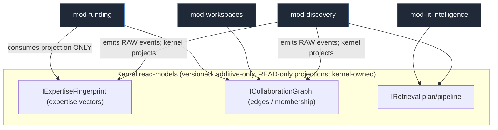

- mod-discovery **emits raw events; the kernel owns the projection.** mod-discovery does NOT own the contract.
- `mod-funding` consumes the **fingerprint/graph projections**, never mod-discovery's code or storage.
- **Per-field consumer registry:** a field is retired when no pillar reads it; adding a field is additive-only and recorded.
- **CI gate (import-linter):** fails on ANY `modules/*`→`modules/*` import and on concrete-store/SDK imports outside kernel adapters. The DAG is machine-verified acyclic.

### 3.2 The kernel — two coherence domains, with ALL cross-kernel contracts named (resolves MAINT-high-tier-lattice, MAINT-med-cross-kernel)

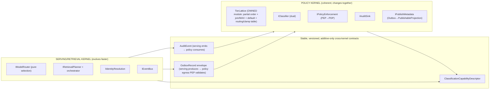

- **The TierLattice is an owned module, not a lookup descriptor.** It holds the partial order, the explicit join/MAX, the declared default (confidential), and the routing/clamp policy table. The `ClassificationCapabilityDescriptor` is a *capability advertisement* over the lattice, not a substitute for it.
- **Adding a tier is a checklisted, test-gated policy-kernel release.** A typed exhaustiveness/total-match check + import-linter **FAILS the build** if a new tier is not handled by every consumer: router, MAX-derivation, egress allowlist review, Cedar narrow-only rules, edition-posture derivation. The cross-cutting change is compiler-enforced fan-out, never a silent config edit.
- **Intra-kernel compatibility matrix** lists the descriptor AND the `AuditEvent` and `OutboxRecord` contracts as the cross-kernel boundary; serving internals can change without breaking policy consumers as long as these additive-only contracts hold.

### 3.3 MVP wedge — re-cut to single-cell, dyad-independent (resolves COST-crit-mvp-scope, COST-crit-dyad-dependency)

> **Phase-0 MVP = a SINGLE-CELL functional confidential research-intelligence product for one funded R1 center / security-sensitive lab (NOT export-controlled).** Delivers: AI-grounded Q&A + semantic search + expert discovery over the center's OWN corpus, with a **functional confidential tier** (local vLLM inference, network-egress blocked, per-tenant keys) and intra-institution private/public tiers. **No second cell, no central index, no egress PEP / PublishableProjection / runtime-leak-assertion / brokered drill-down yet** — those only earn their cost once a second node exists.

This is NOT "RAG over public PDFs." First revenue is the differentiated security guarantee at N=1, sold while the dyad is sourced.

**Why this halves the build:** the egress PEP, PublishableProjection type, runtime leak assertion, and 2-node seam are the *full moat*. They are Phase-1, gated on a real second node. Phase-0 ships the confidentiality-at-N=1 value (classification + router + transport egress block + confidential local inference + hybrid retrieval + audit) — buildable by 3 engineers.

**Fallback within Phase-0:** if the first center stalls, another security-sensitive funded center (no export controls, no federation). The **export-controlled/defense lab is NOT a Phase-0 fallback** — it needs sovereign/on-prem + CMMC/NIST-800-171 + DCSA (Phase-2+ vertical, own capital — Section 2/16).

### 3.4 Beachhead buyer
**Phase-0:** a single funded R1 center / institute / security-sensitive lab with a security line-item budget, ONE IdP, internal-only confidential use. **Phase-1 expansion proof:** a pre-bonded 2-node consortium (subject to the Week-1 master-agreement test, 2.3).

### 3.5 MVP vs deferred (re-scoped to single-cell Phase-0 — resolves COST-crit-mvp-scope)

| Capability | Phase 0 (single cell) | Phase 1 (dyad/federation) | Phase 2 | Phase 3 | Notes |
|---|---|---|---|---|---|
| Hybrid retrieval (vector+BM25+RRF) | ✅ | | | | essential |
| Reranking (BGE-reranker-v2-m3) | ✅ | | | | cheap ROI |
| Grounded Q&A (single-shot) + RAGAS-in-CI | ✅ | | | | judge runs in GPU staging (16.x) |
| **Functional confidential tier** (local-only, egress-blocked, per-tenant keys) | ✅ | | | | the N=1 differentiator |
| Public + `private(self)`/private tiers | ✅ | | | | |
| **Dual classifier (agreement-for-tier-down) + pure router (if/else)** | ✅ | richer policy | | | trust root hardened from day 1 |
| **IPolicyEnforcement over LIBRARY RBAC** | ✅ | →SpiceDB cell-local | | | interface stable; impl swapped at N≥2 |
| **IAuditSink over hash-chained Postgres** | ✅ | →WORM + external anchor | | | |
| `ITransportPolicy` egress block + router-disagreement hard-fail | ✅ | | | | compliance control, tested |
| Identity resolution (deterministic anchors) | ✅ | LLM adjudication | | | |
| **Independent egress PEP + PublishableProjection type + versioned projection contract** | | ✅ (first second node) | | | only earns cost at N≥2 |
| **Runtime leak assertion (drift-detection)** | | ✅ | | | NOT a proof control |
| Federated expert discovery (2-node, public-tier) | | ✅ | institution-wide | cross-consortium | |
| One revocable confidential grant (cell-local SpiceDB) + freshness gate | | ✅ | full ReBAC | | exercises seam |
| **Authority-anchored revocation store + freshness watermark gate** | | ✅ | | | the correctness gate |
| Brokered drill-down (token-audience, confused-deputy-safe) | | ✅ | | | |
| Central discovery index (two-tier topical, managed service) | | | ✅ | | sized in $ (16) |
| Knowledge graph (deterministic, AGE) | ✅ | | HippoRAG2 PPR (post-benchmark) | | |
| **AGE multi-hop/PPR scaling benchmark (synthetic)** | ✅ | | | | moved up; no customer needed |
| Consolidated Postgres (pgvector+AGE+tsvector+audit+outbox) + **defined split trigger** | ✅ | | split→Qdrant/OpenSearch | | per-module schemas + DB-role grants |
| Cedar ABAC overlay (narrow-only, fail-closed) | | ✅ | | | |
| Cross-institution sharing grants (full) + sticky caveats + index tombstone/lease/erasure path | | ✅ | ✅ | | |
| Secure workspaces (zero-copy query-where-data-resides default) | | ✅ (minimal) | TEE/clean-room (buyer demand) | | |
| Grant/funding intelligence + team assembly | | | | ✅ | Atom territory, from installed base |
| Adaptive RAG / CRAG / multi-agent (planner strategies + capped tier-pinned agent actions) | | | ✅ | ✅ | behind IRetrievalPlanner (5.4) |
| Per-tenant learned fusion | | | | ✅ (data-gated) | needs click feedback |
| TEE-backed inference + HYOK | | ✅ for operator-zero-trust buyers | (broader) | | early for export-class buyers |
| PSI + global DP ledger | | | ✅ | | |
| Temporal durable workflows | | (grant lifecycle) | ✅ | | side-effects only |
| Kafka/Debezium CDC | | | ✅ (when central index exists) | | Phase-0/1 use outbox-polling |
| SOC2 Type I | | ✅ (Phase 0→1 boundary) | | | once verbal commit exists |
| SOC2 Type II | | observation starts | ✅ achieved | | gates institutional contract |

---

## 4. System Architecture

### 4.1 Control-plane / data-plane split (bridge model); central index two-tier

Phase-0 is a single cell with NO exchange plane. The diagram below is the Phase-1+ federated target.

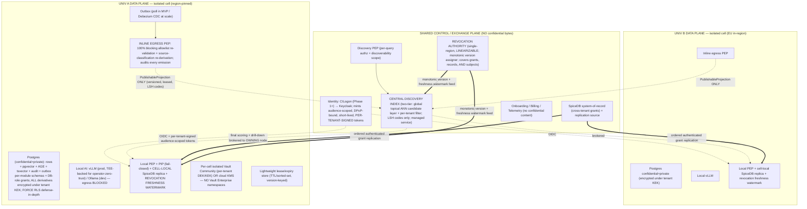

### 4.2 Plane responsibilities

**Per-university Data Plane = silo "cell"** (own infra or dedicated isolated data plane), region-pinned:
- Confidential + private data + **all derivative indexes (vectors, BM25, graph) encrypted under the tenant KEK** so crypto-shred shreds the searchable derivatives.
- Local AI (vLLM prod, TEE-backed for operator-zero-trust buyers / Ollama dev), egress-blocked at the network layer.
- **Local PEP + PIP (fail-closed)** + **cell-local SpiceDB replica** of relevant grant tuples + **revocation freshness watermark** (Section 4.4). Confidential GRANT checks survive control-plane partition; confidential REVOCATION knowledge is authoritative only if fresh.
- **Inline egress PEP** between outbox and the world (Section 4.5).
- Per-tenant keys via per-cell isolated Vault Community / cloud KMS.

**Thin-but-stateful shared Control/Exchange Plane (NO confidential bytes):**
- **Central discovery index** — **two-tier**: a global topical ANN candidate layer (sharded by embedding cluster, the dominant cross-tenant read pattern) + per-tenant authz/scope/quota filtering. Holds only `PublishableProjection`s with **LSH candidate codes** (not raw invertible embeddings), each carrying a discoverability scope, an **authority-anchored monotonic version**, and a lease. Managed service (ops off the 3 engineers). (Sections 4.6, 11.8)
- **Discovery PEP** — per-query authz + discoverability scope (public-web | federation | named-consortium | named-tenants).
- **SpiceDB system-of-record** for cross-tenant grants — the replication source, NOT the synchronous hot-path dependency.
- **Revocation Authority** — single-region, **linearizable**; assigns the monotonic version that orders all tombstones; emits a freshness watermark to cells and the index; covers grants, records, AND subjects (Section 4.4, 7.x).
- Identity/SSO, onboarding, billing, telemetry.
- **TEE match broker: deferred**; when present, a horizontally-scaled enclave fleet (Section 4.7).

### 4.3 How cross-institution discovery works WITHOUT leaking confidential data (Phase 1+)

```mermaid
sequenceDiagram
    participant U as Researcher @ Univ A
    participant PEPA as Univ A local PEP
    participant DPEP as Discovery PEP
    participant DISC as Central discovery index (sharded by topic)
    participant TOK as Keycloak (per-tenant-signed token mint)
    participant PEPB as Univ B local PEP (owning node)

    U->>PEPA: "Who works on X across our consortium?"
    PEPA->>DPEP: discovery query (subject token)
    DPEP->>DISC: authz + discoverability-scope filtered topical query
    Note over DISC: each shard applies its LOCALLY-MATERIALIZED revocation bitmap<br/>as an indexed filter (one filter, not N lookups).<br/>Shard bitmap staler than leak-window ⇒ returns INCOMPLETE (fail-closed security state)
    DISC-->>DPEP: surviving PublishableProjections (LSH candidates) + completeness flag
    DPEP-->>PEPA: results (+ "incomplete" if any shard fail-closed)

    U->>PEPA: drill into Univ B researcher detail
    PEPA->>TOK: request token audience=B, DPoP-bound, subject=U
    TOK-->>PEPA: short-lived per-tenant-signed token (audience=B)
    PEPA->>PEPB: brokered request + token (NOT A's self-assertion of U)
    PEPB->>PEPB: validate sig/audience/binding; resolve subject FROM TOKEN
    PEPB->>PEPB: cell-local SpiceDB Check (grant?) + STICKY-CAVEAT re-eval vs THIS individual + Cedar ABAC + REVOCATION FRESHNESS check (subject + grant + record)
    alt allowed AND freshness watermark within leak-window
        PEPB->>PEPB: audit-before-serve (bind grant_id, grant_version, token_jti, watermark)
        PEPB-->>U: detail (final scoring done HERE on real embeddings)
    else denied / revoked / watermark stale / node unreachable
        PEPB-->>U: deny OR publishable-metadata-only + "detail unavailable"
    end
```

**The mechanisms (v3):**
1. **Discovery search** hits the topical candidate layer → LSH candidates from `PublishableProjection`s. **The revocation gate is an indexed filter materialized into each shard's bitmap** (one filter per shard, not N remote lookups). A shard whose bitmap is staler than the leak-window returns **`incomplete` — a security state, fail-closed**, never silently complete. **Final scoring on real embeddings is brokered to the owning cell**, so raw invertible vectors never leave the boundary.
2. **Drill-into-detail** is brokered to the **owning node** with a **control-plane-minted, per-tenant-signed, audience-scoped, DPoP-bound token for the actual end user**. The owning PEP resolves the subject **from the token**. Check is **cell-local** (grant replica) + **sticky-caveat re-evaluation against the actual accessing individual** (US-person/FERPA role — Section 7.6) + Cedar ABAC + **revocation freshness** (grant, record, AND subject-not-deprovisioned). **Audit-before-serve** for confidential.
3. **"Do A and B share collaborators?"** → 2-party PSI with the **global DP ledger + k-anonymity floor + pre-approved, rate-limited templates** (Section 11.8). Aggregate only.
4. **Confidential joint work** → **zero-copy query-where-data-resides is the DEFAULT**; TEE/clean-room only where a buyer's threat model demands.
5. **Revocation / reclassification / erasure** — Sections 4.4, 11.

### 4.4 Revocation, freshness & the partition tradeoff — stated honestly (resolves DS-crit-1, DS-crit-2, DS-high-grant-liveness, SEC-crit-1)

**The CAP reconciliation, decided:** A replicated copy cannot be "strongly consistent" at the consumer. v3 therefore makes the **Revocation Authority** a single-region linearizable store, and gives cells/index a **freshness watermark**, not a strongly-consistent replica.

**Authority-anchored versioning (DS-crit-2):** the Authority assigns the **monotonic version** that orders every tombstone. A tombstone always carries an authority-monotonic version a node cannot outrun, so a clock-skewed or malicious node's self-stamped publish can never dominate a legitimate later tombstone. Node HLCs order only intra-cell events; cross-trust HLC skew is **clamped to a max-skew window with alarms**, and rejected beyond it. **Trust model pinned: no node's self-asserted timestamp orders a security decision in its own favor.**

**On revoke / reclassify-up / un-publish / subject-deprovision, atomically:**
1. **Delete the grant tuple** in the cell-local SpiceDB replica + SoR (drill-down denies cell-local).
2. **Record it in the linearizable Revocation Authority**, which assigns the ordering version and advances the freshness watermark.
3. **Emit a CDC tombstone** stamped with the **authority version**; consumers reject out-of-order resurrection (a late publish cannot un-delete a newer tombstone).
4. The index entry carries a **lease/TTL in the lightweight expiry store** (Section 4.6) and self-expires absent re-publish — an hours-scale backstop.

**The freshness gate (the correctness mechanism):** before surfacing a hit or authorizing a confidential drill-down, the consumer checks its **revocation freshness watermark**. If the watermark is older than `(now − leak-window)`, the consumer **FAILS CLOSED**: discovery shard returns `incomplete`; drill-down returns deny / publishable-metadata-only. **This is a hard liveness check, not a wish.**

**The partition tradeoff, stated explicitly and asymmetrically (DS-high-grant-liveness):**
> During a control-plane / Revocation-Authority partition, **grant-GRANTS may be served from the cell-local replica (availability preserved for already-granted reads within the freshness bound), but confidential cross-tenant drill-down DEGRADES TO DENY beyond the freshness bound — NOT stale-allow.** We do not claim both "access keeps working during partition" and "revocations take effect within the leak-window during partition." The safe side wins: revocation knowledge is authoritative-only-if-fresh.

Section 14.3's availability statement is corrected accordingly: *"confidential cross-institution access continues for already-granted reads only within the freshness bound; denies beyond it."*

**Three independent mechanisms, correctly weighted:** (a) authoritative freshness gate at surface/access time — **correctness, fail-closed under partition**; (b) authority-versioned tombstone — **ordering-safe eventual purge**; (c) lease self-expiry — **hours-scale backstop**. The leak-window is an **SLO and a security-critical bound**; exceeding it is a P1 incident (Section 14.4).

**Grant-creation visibility (symmetric):** a grantee's discovery view updates only after the grant replicates and the corresponding projection publishes with its authority version. SLO'd symmetric to the revoke window; UX: "grant active; discoverability propagating."

**Already-disclosed data:** revocation = no further access + index purge on the fast path + grantee-tenant obligation to crypto-shred derived copies (**enforceable via DUA + audit + technical revoke where copies exist; stated plainly**). We distinguish **"revoke access" (enforced) from "revoke disclosure" (contractual)**. Zero-copy query-where-data-resides is the default so no durable copy lands in the grantee cell.

### 4.5 The inline egress gate & PublishableProjection (resolves SEC-crit-2, MAINT-high-projection-evolution, DS-low-runtime-assertion)

- **`PublishableProjection` is a structural type** per entity in `shared/contracts/`: an allowlist of fields. Internal record → projection is a **total function**; every field defaults to non-published; a field publishes only if explicitly added (with a recorded classification review).
- **The Outbox writer can ONLY emit `PublishableProjection` objects** — confidential→publishable is a type error.
- **The inline egress PEP is a 100% blocking check** between outbox and exchange. It treats the outbox as untrusted, **re-validates each record against the field allowlist AND re-derives/sanity-checks the source record's classification** (so a record mis-tagged `public` at ingest does not sail through), **strips/rejects** anything else, applies per-field projection, and **audits every emission**. **This blocking gate is the proof.**
- **The runtime sampling assertion is DRIFT-DETECTION/alerting only** — it samples outbound records and alarms on any confidential tag at the boundary. It does **NOT** carry proof weight in the headline invariant (DS-low). The structural type + inline allowlist gate is the correctness guarantee.
- **No raw embeddings leave the cell:** only per-tenant-keyed, salted, quantized LSH codes for candidate generation (Section 11.8); final scoring is brokered.
- **Projection-contract evolution (MAINT-high):** `PublishableProjection` is a first-class versioned contract with per-field `introduced-in-version` + classification-review record, additive-only. The egress PEP validates against the **node's emitted projection version**; the central index accepts the **intersection of fields across deployed node versions**. Contract test: node@N and index@M agree on the allowlist intersection. A new publishable field cannot silently widen the seam or break older nodes.

### 4.6 Central discovery index — two-tier, topical, managed, LSH-coded (resolves DS-med-shardkey, DS-high-lease-write-amp, COST-high-central-index-ops, SEC-crit-2)

- **Topology (two-tier):** a **global topical ANN candidate layer** sharded by **embedding cluster / topic** (co-locates topically-similar work cross-tenant, so the dominant "who across the consortium works on X" query hits FEW shards) + a **per-tenant authz/scope/quota filter layer**. Tenant is a filter + quota + offboarding dimension, **not the shard key.** Mega-R1s are **topic-subsharded from day one** (no long-tail mega-shard dominating p95).
- **No raw embeddings:** the index stores per-tenant-keyed salted **LSH/quantized candidate codes** (non-invertible) for candidate generation; real-embedding scoring is brokered to the owning cell.
- **Lease liveness decoupled from re-write (DS-high):** leases live in a **separate lightweight expiry store** (TTL index / sorted set keyed by record-version); refresh is a **timestamp bump**, not a hybrid-index re-index. **Lease = hours-scale backstop; the freshness watermark = seconds-scale fast path** — explicitly reconciled.
- **Write-load model:** steady-state write QPS = tombstones + content-material updates + lease-bumps (cheap, in the expiry store, NOT the hybrid engine). Sized at N=10/50/200. Separate write vs query node pools; per-tenant write quotas; refresh-interval tuning to bound merge pressure.
- **Ops:** **managed service** (OpenSearch Serverless / managed vector) pre-scale — keeps cluster upgrades, shard rebalancing, hot-tenant tuning off the 3 engineers. Cost recovered via the consortium/exchange add-on (Section 16), not silent overhead.
- **Encryption + scope:** encrypted at rest (control-plane keys); `named_consortium`/`named_tenants`-scoped projections encrypted under **per-consortium keys** so a control-plane compromise can't read narrow shares (SEC-low). Federation-scoped projection content minimized.
- **Opt-out is the DEFAULT** for export-controlled / high-sensitivity tenants → live brokered drill-down only, no honeypot exposure.

The control plane is **NOT "mostly stateless"**; it is a thin control surface plus this one managed, sharded, topical stateful index with a real capacity + write model.

### 4.7 TEE match broker (when it arrives)
Deferred from MVP, except **brought EARLY for operator-zero-trust buyers (export-class)** who require it. When present: a horizontally-scaled enclave fleet with a session scheduler, stated per-session cost + max-concurrency, queueing/backpressure, a warm enclave pool (attestation cold-start amortized), and an explicit interactive-vs-batch split (most matches are batch). N-choose-2 pair surface managed by scheduling.

### 4.8 Privacy-tech practicality ranking
**Zero-copy query-where-data-resides (default for confidential cross-tenant) > brokered drill-down (default for discovery) > 2-party PSI + global-ledger DP (bounded, templated) > clean rooms / TEE (buyer-demanded / operator-zero-trust) > FHE (research/narrow pilot, off critical path).**

---

## 5. Modularity Model

### 5.1 What "modular to the bone" means here
Every pillar is a pluggable module behind kernel contracts; a new pool-tier module never touches the confidential silo; editions are packaging toggles + a tested substrate profile over one architecture; the module DAG is machine-verified acyclic **and** module data isolation is DB-permission-enforced, not just import-enforced.

### 5.2 Module definition
A **module** is a deployable unit that: (1) registers against **kernel contracts only**; (2) declares a **manifest** (name, semver, required kernel-contract versions, required tiers, emitted/consumed events, FastAPI routes, RBAC scopes, **owned DB schema**); (3) **never** accesses another module's storage or imports another module's package — only via published events or kernel read-models; (4) is enabled/disabled per edition with **deny-by-default if disabled**.

### 5.3 Communication
- **Synchronous:** FastAPI behind a per-module prefix; every call passes the kernel PEP (object-level `Check` — kills BOLA/IDOR).
- **Asynchronous:** **Transactional Outbox** (poll-based in MVP; Debezium+Kafka at scale) + **idempotent consumers keyed by authority-anchored monotonic version + idempotency keys** + schema registry. Never naive dual-write.
- **Cross-pillar shared surface:** `IExpertiseFingerprint` + `ICollaborationGraph` (Section 3.1) — kernel-owned, versioned, additive-only, READ-only projections; mod-funding consumes projections, never mod-discovery's internals.
- **Cross-tenant:** only through the publish-metadata interface (via the inline egress PEP) and cell-local grant checks.

### 5.4 The retrieval seam — a PLAN/GRAPH, not a fixed chain (resolves MAINT-med-pipeline-graph)
- **`IRetrievalPlanner` emits a bounded-iteration plan (a possibly-cyclic graph) over micro-interfaces** (`IRetriever`, `IFuser`, `IReranker`, `ICorrectiveLoop`, `IGraphAugment`), executed by a small **orchestrator**.
- **Adaptive RAG is a planner strategy** (difficulty router choosing which stages run); **CRAG's re-query is a bounded back-edge in the plan**; **multi-agent decomposition is another planner**; **HippoRAG2 PPR is an `IGraphAugment` node** interleaved with rerank; **learned fusion is an `IFuser` impl**.
- **Loop-iteration caps and per-stage tier-clamping are pinned at the orchestrator** (so control flow can evolve without changing the micro-interfaces). State-bearing concerns (per-tenant learned-fusion weights, click feedback) live behind `IFeedbackStore`, injected.
- Each micro-interface stays swappable AND control flow stays evolvable — the linear-chain limitation is removed.

### 5.5 The model router — pure selection; transport enforces; disagreement HARD-FAILS (resolves MAINT-med-router-transport)
- **`IModelRouter` = pure provider selection**: given `(tier, tenant policy, capability needs)` → a **typed decision**. Swapping the router swaps selection only.
- **`ITransportPolicy` (egress enforcement) is a separate, provider-independent compliance layer** that **validates the router's decision against intrinsic tier INDEPENDENTLY.** The CI egress-block test enforces here, not in the router.
- **Disagreement contract (pinned, tested):** if the router selects cloud for a confidential request, transport **HARD-FAILS (deny + audit)** — never silent cloud egress, never silent local fallback masking the bug. Contract test: a deliberately-buggy router selecting cloud for confidential must hard-fail at transport. This makes any replacement router validated by an independent enforcement layer with a defined disagreement behavior.
- **Guardrails** are a pluggable `IGuardrail` chain composed around any provider; **eval-judge selection** is a property of the eval harness, not the router.
- **Routing precedence is a pinned, tested invariant:** classification first; **confidential ALWAYS routes local**; BYO keys selectable **only** for public/low-risk; the config UI cannot attach BYO-cloud to confidential; `confidential + BYO-cloud-configured ⇒ routes local, BYO ignored, audited`.

### 5.6 Versioning & consumer-driven contract testing
- Kernel contracts are **semver**; modules pin a compatible major; the **intra-kernel compatibility matrix** names the descriptor, `AuditEvent`, and `OutboxRecord` as the cross-kernel boundary (Section 3.2).
- **Consumer-driven contract testing (Pact-style) is a CI gate**; the provider verifies against recorded consumer contracts. **Cross-cell contracts have a LOCAL harness** (Section 5.12 / 15.5), not just paid staging.
- A **machine-readable contract-version usage registry** records pins so a deprecation retires only when **zero consumers remain**.
- **"Both served"** for stateful kernel services uses a **translation shim over a single source of truth**, never two independent authz spines. Read-model + projection contracts use additive-only evolution.

### 5.7 Adding / removing a module (minimal blast radius)
- **Add:** implement manifest + kernel-contract bindings + owned DB schema; register routes/events/RBAC scopes; declare edition eligibility; deploy as independent service/Helm sub-chart; feature-flag on. No kernel change within contract versions.
- **Remove (resolves MAINT-low-removal):** feature-flag off (deny-by-default); drain consumers. **Read-model DATA outlives its producing module** — read-models are kernel-owned storage, not module-namespaced, so removing a producer leaves the read-model **stale-but-readable (freshness-timestamped)**, not gone. A **removal-time dependency check warns/blocks** if a kernel read-model field has a single producer being removed while live consumers remain.

### 5.8 Revocation responsibility map
Single source of truth, explicit ownership:
- **Cell-local SpiceDB tuple delete = authoritative revocation** (correctness).
- **Cell-local PEP re-check + the authoritative freshness gate against the Revocation Authority watermark = enforcement guarantee** (drill-down + index surface).
- **Temporal orchestrates ONLY side effects** (notifications, downstream cleanup, key-rotation) — **never the correctness path.** Pinned invariant.

### 5.9 Edition = isolation posture, enforced in ONE place
Tier availability is **derived from isolation posture and enforced in one place** via the TierLattice + edition-posture derivation (a consumer the exhaustiveness check covers — Section 3.2). A shared/soft-isolated PLG cell **structurally cannot host the confidential tier**; the same enforcement code runs everywhere.

### 5.10 Event substrate is profile-able; sovereign is a TESTED substrate axis (resolves MAINT-low-substrate)
The Outbox **consumer contract** (idempotent, versioned, authority-version-keyed events) is **substrate-independent**. There are **two explicit, supported runtime profiles**: the **full managed stack** (SpiceDB cell-local + Kafka/Debezium) and the **single-appliance profile** (library authz + outbox-polling, no Kafka). **The abstract confidentiality/authz/egress conformance suite runs against BOTH substrates** so the sovereign substrate's authz/egress behavior cannot drift from managed. The substrate profile is a tested axis, not an implied single architecture.

### 5.11 Module data isolation is DB-permission-enforced, not just import-enforced (resolves MAINT-high-db-coupling)
The consolidated MVP Postgres physically invites cross-module coupling that import-linter cannot see. Therefore:
- **Per-module schema ownership inside Postgres**, with **DB-role grants so module A's role cannot read module B's tables.**
- A **CI/migration check forbids any module migration referencing another module's schema.**
- **Cross-module data access is ONLY via kernel read-models/events**, enforced at the DB-permission layer. Boundaries are "machine-verified" at BOTH the import layer and the DB-permission layer; the modularity claim is no longer import-only.

### 5.12 Directory / service boundaries + machine-enforced rules

```
platform/
  kernel/
    policy/                # TierLattice, IClassifier(dual), IPolicyEnforcement, IAuditSink, IPublishMetadata (POLICY KERNEL)
      tier_lattice/        # OWNED partial order + join/MAX + default + routing/clamp table + exhaustiveness check
      classification/      # dual classifier; agreement-for-tier-down
      authz/               # PEP + cell-local SpiceDB client + Cedar eval + revocation-authority freshness client
      audit/               # hash-chained sink (MVP) -> WORM+anchor; AuditEvent consumer
      publish_metadata/    # PublishableProjection types (versioned) + total fn + INLINE egress PEP
    serving/               # IModelRouter, IRetrievalPlanner+orchestrator, IIdentityResolution, IEventBus (SERVING KERNEL)
      model_router/        # pure selection (typed decision)
      transport_policy/    # egress enforcement + router-disagreement hard-fail
      retrieval/           # planner + orchestrator + micro-interfaces (retriever/fuser/reranker/corrective/graph-augment)
      identity_resolution/
      eventbus/            # outbox + (poll | CDC) + schema registry; OutboxRecord envelope
    read_models/
      expertise_fingerprint/   # IExpertiseFingerprint (vectors)
      collaboration_graph/     # ICollaborationGraph (edges/membership)
  modules/
    discovery/ lit_intelligence/ workspaces/ funding/   # each owns a DB schema (role-isolated)
  exchange/                # central index (two-tier topical), discovery PEP, revocation authority client, grant SoR client
  cell/                    # data-plane node bootstrap; single-appliance profile for sovereign
  shared/
    contracts/             # versioned interfaces + event schemas + PublishableProjection schemas (THE LAW)
    edition_config/        # packaging toggles; tier-availability derivation (lattice consumer)
  test_harness/
    local_federation/      # docker-compose 2-cell + stub control plane + mock/quantized inference (CI seam tests)
```

**Machine-enforced rules (CI):** `import-linter` forbids module→module imports and concrete-store/SDK imports outside kernel adapters; LlamaIndex/Qdrant/SpiceDB SDK types may not appear in `shared/contracts/`; any new internal-entity field is non-publishable unless added to a versioned `PublishableProjection`; **a new tier fails the build unless every TierLattice consumer handles it (exhaustiveness check)**; **a module migration referencing another module's schema fails the migration check.**

---

## 6. Data Model & Knowledge Graph

### 6.1 Core entities & relationships

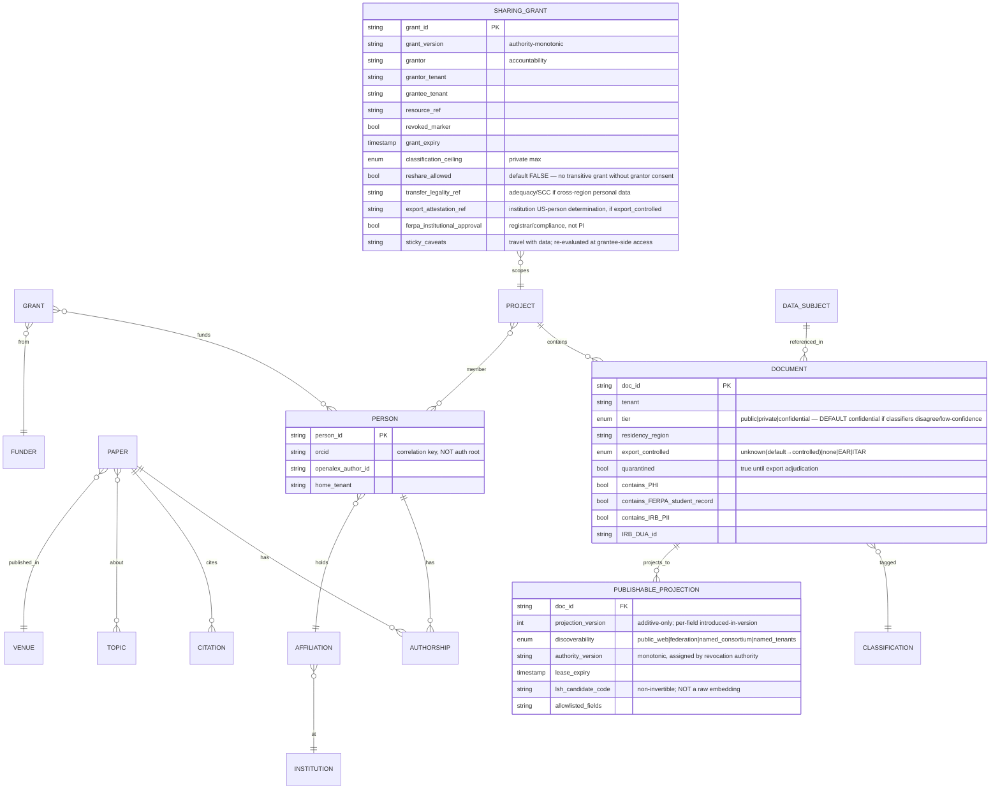

**Classification semantics pinned:**
- **Record-intrinsic classification** stored at ingest, **fail-closed default = confidential** if the dual classifiers disagree or are low-confidence; drives the router egress decision and the egress PEP.
- **Contextual access authorization** is the PEP decision per request (ReBAC + ABAC + sticky-caveat re-eval + freshness).
- **Derived-data tiering rule:** every derivative inherits **MAX(input tiers)** via the TierLattice join — enforced at derivative creation and exhaustiveness-checked.
- **Tier-down requires dual-classifier AGREEMENT + audited human approval**; `export_controlled` default `unknown` ⇒ treated as controlled; unadjudicated potentially-controlled ingest is **quarantined**.

### 6.2 Two graph layers — benchmarked in Phase 0/1, fallback pre-verified (resolves COST-med-age)
1. **Deterministic metadata-backbone graph** (built first, cheap, no LLM-extraction tax): authors/papers/citations/affiliations/venues/grants/topics, in **Apache AGE inside the consolidated Postgres** for small/MVP cells.
2. **HippoRAG2-style PPR augmentation** (post-benchmark) for multi-hop retrieval.

**Scaling gate moved to Phase 0/1 (no customer needed):** benchmark **AGE multi-hop + PPR at a realistic R1 graph size** (~0.5–5M author/paper nodes, ~10–50M citation edges per cell) on **synthetic OpenAlex-subset data**. **PPR graph-compute cost (not just the ~1k-token LLM cost) is stated and budgeted.** If AGE misses the SLO, a defined **switch trigger** moves the graph to **Neo4j / Memgraph** — with **licenses pre-verified now** (Neo4j Community is GPLv3 → run as an isolated process/service across a network boundary, no linkage; Memgraph is BSL → confirm commercial-use terms) so the switch is a **planned port, not a fire drill.** Co-location resource isolation per the split trigger (Section 6.3 / 14).

### 6.3 Intra-cell store consolidation — defined split trigger (resolves DS-med-intra-cell-contention, MAINT-med-split-store)
- **Postgres is the SoR** for small cells (pgvector + AGE + tsvector + audit + outbox), all derivatives rebuildable.
- **Split trigger DEFINED (an ALERT, not a postmortem):** corpus > **2M docs** OR p95 Q&A breaches SLO OR graph nodes > **5M** OR vector (HNSW) RAM > **60% of cell RAM**. Breaching any ⇒ split graph/vector/OLTP onto isolated resources.
- **Smallest-cell RAM budget stated:** HNSW working set + AGE working set must fit the smallest viable cell with headroom; if the corpus pushes HNSW RAM past the budget, that IS the split trigger — so the COGS floor isn't quietly violated by index memory.
- **Reconciliation/HNSW rebuilds isolated to off-peak / a read-replica**; they never contend with live PPR + OLTP on the smallest cell.
- **Split-store consistency contract specified NOW (implemented later):** per-record authority version carried into every derived index; a **divergence detector** (SoR-version vs index-version sampling sweep); **defined repair** (re-project from SoR); **defined IRetrieval behavior during rebuild** (serve SoR-version-gated results; drop passages whose SoR row is tombstoned). The split is a planned migration with its own contract tests — not an adapter swap.

### 6.4 Scholarly ingestion (self-hosted corpus — avoid metering/NC/competitor-API traps)

| Source | License | Use | Constraint |
|---|---|---|---|
| OpenAlex monthly snapshot | CC0 | Core graph | **Self-host snapshot; NEVER the metered live API on a hot path** |
| Crossref annual file | metadata open | DOIs, references | snapshot |
| OpenCitations | CC0 | Citation edges | snapshot |
| arXiv metadata | CC0 | Preprints | snapshot |
| ROR | CC0 | Institution identity | snapshot |
| ORCID Public Data File | CC0 | Person identity | **Ship the CC0 dump, NOT the live API (Public API is non-commercial)** |
| Semantic Scholar bulk | ODC-BY | Enrichment | **attribution required** |
| SPECTER2 vectors | Apache-2.0 | Scientific embedding space | clean |
| PMC / Europe PMC full text | license-tiered | OA full text | **programmatically gate to commercial-OK OA subset (CC0/BY/BY-SA/BY-ND); exclude NC-only** |
| Pure / Symplectic (institutional) | proprietary API | enrichment | **competitor-controlled (Elsevier/Clarivate) — institution-provided export FALLBACK required; not critical-path** |

### 6.5 Entity resolution / author disambiguation
- Deterministic anchors (ORCID/DOI/OpenAlex IDs) + blocking + graph-feature classifier (MVP); LEAD-style LLM adjudication for hard collisions (Phase 2).
- **The cross-institution identity graph is public-tier by construction** — disambiguation never centralizes private records. (Validate: confirm no hard collision genuinely requires a private record — Open Q.)
- Standalone `IIdentityResolution` consumed by graph build, expertise fingerprints, discovery. ORCID is a correlation key, not an auth root.

---

## 7. Identity & Access Control

### 7.1 Federated identity — CILogon deferred for the single-IdP first buyer (resolves COST-med-cilogon)

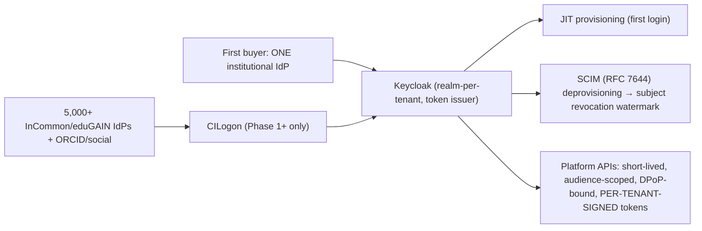

- **Phase-0 single buyer has ONE IdP → direct OIDC/SAML to their Keycloak is trivial; CILogon is DEFERRED** until federation breadth (Phase 1+). CILogon commercial quote obtained pre-build; the eduGAIN-brokering fallback is scoped as **real engineering weeks** (metadata aggregation, cert rotation, per-IdP attribute-release quirks), not a drop-in.
- **Keycloak** (Apache-2.0, realm-per-tenant) broker/issuer; **per-tenant token signing keys** so one mint compromise cannot forge all audiences (SEC-med-deprovision). Fallback: Ory.
- **Provisioning:** JIT first login + **SCIM deprovisioning that feeds the subject revocation watermark** (Section 7.7).
- **Federation hardening:** eduGAIN via REFEDS R&S + Sirtfi + CoCo v2; authorize on `eduPersonScopedAffiliation` + stable `subject_id`; SP-initiated SSO; strict issuer/audience validation.

### 7.2 Authz model — hybrid ReBAC + ABAC, fail-closed, sticky-caveat-aware

**Check at every PEP — composition order pinned: SpiceDB relationship path FIRST (ReBAC), then sticky-caveat re-evaluation, then Cedar ABAC can only NARROW, then freshness.**
- **ReBAC (SpiceDB):** project membership, hierarchical doc/org-unit, and the first-class **`sharing_grant`** with caveats (time-bound, consent-gated, DUA-referenced, `classification_ceiling`, `reshare_allowed=false` default, `transfer_legality_ref`, `export_attestation_ref`, `ferpa_institutional_approval`, `sticky_caveats`). Revocation = O(1) tuple delete (cell-local) + authority record.
- **ABAC (Cedar):** object attributes gate whether a relationship counts; **narrow-only.**

**Fail-closed invariants (pinned + tested):**
1. Indeterminate/missing ABAC attribute ⇒ DENY for confidential/export.
2. ABAC narrows the ReBAC grant, never widens.
3. PIP unavailable on a confidential check ⇒ DENY.
4. `export_controlled` default `unknown` ⇒ controlled.
5. **Revocation freshness watermark stale beyond leak-window ⇒ DENY (confidential drill-down).**
6. **Sticky caveats re-evaluated against the actual accessing individual ⇒ DENY if the individual fails US-person/FERPA-role even with a valid institution-level grant.**

### 7.3 SpiceDB topology — cell-local grant checks (resolves DS-crit-2 partial, DS-high-grant-liveness)
- Shared SpiceDB = **system-of-record + replication source**; relevant `sharing_grant` tuples **replicated INTO each owning cell** via authenticated, ordered replication with the **ZedToken minted at the grant's home** carried along (monotonic cell-local read-after-write).
- **The confidential drill-down Check is cell-local** and survives a control-plane partition for **grant-GRANTS within the freshness bound**; **revocation knowledge is authoritative-only-if-fresh** (Section 4.4). No cross-region ZedToken round-trip on the hot path.
- **Regional clusters + cross-region grant replication** (not one global cluster).
- **Benchmark in Phase 0/1:** cell-local Check p99 and replication lag, before committing the Check SLO.

### 7.4 Decision flow & where the PDP sits

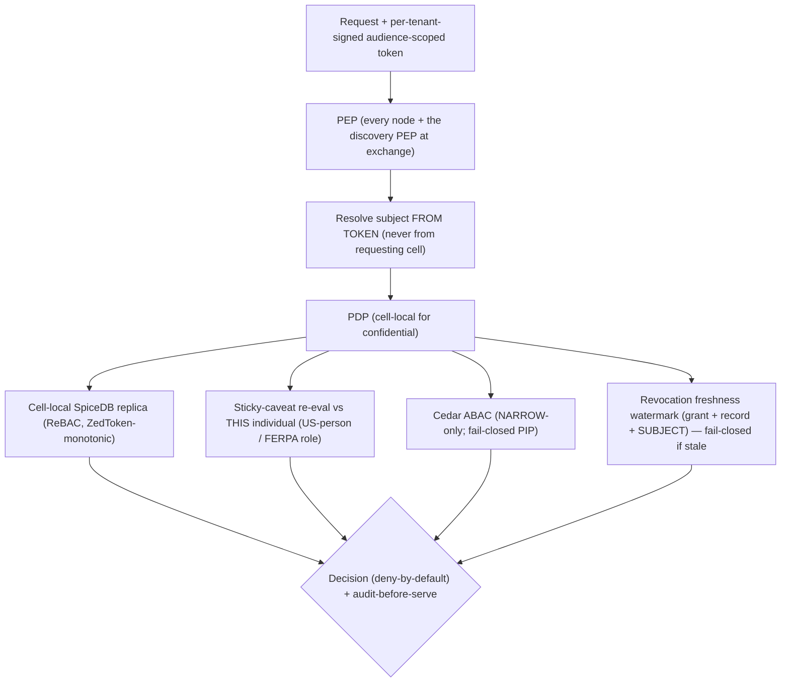

### 7.5 Confused-deputy mitigation
Brokered drill-down carries a **control-plane-minted, audience=owning-tenant, DPoP-bound, short-lived, per-tenant-signed token for the actual end user**; the owning PEP validates signature/audience/binding and **resolves the subject from the token, never from the requesting cell's body**. Tested: cell A cannot obtain B's confidential data by asserting an arbitrary subject.

### 7.6 Sticky cross-institution caveats (resolves SEC-high-sticky)
Caveats are **properties of the DATA** and travel with shared confidential data. At grantee-side access (zero-copy brokered query or, where copies exist, on the copy), the owning PEP (or a grantee-side PEP operating under the grant's policy) **re-checks the actual accessing individual's attributes against the grant caveats** — the US-person determination and FERPA role are evaluated for the *person accessing*, not trusted from the grantor's institution-level attestation. **Downstream re-share is prohibited by default** (`reshare_allowed=false`); transitive grants require explicit grantor consent, enforced by SpiceDB + the egress PEP on the grantee side. Technical-vs-DUA-contractual split stated per control.

### 7.7 Subject deprovisioning within the leak-window (resolves SEC-med-deprovision)
SCIM deprovisioning **advances a subject revocation watermark** in the Revocation Authority. Confidential drill-down requires a **fresh subject-not-deprovisioned watermark within the leak-window** — so a deprovisioned insider loses cross-institution confidential access within the leak-window, not at token expiry. Confidential-tier token TTLs are very short; step-up/freshness required for confidential drill-down. Token-mint compromise is in the threat model; per-tenant signing keys bound the blast radius.

### 7.8 Postgres RLS footgun checklist (defense-in-depth only; primary isolation is schema+role+key)
`FORCE ROW LEVEL SECURITY` · `SET LOCAL` not `SET` (PgBouncer leak) · `WITH CHECK` on writes · `RESTRICTIVE` policies · `tenant_id` leading index column · `SECURITY DEFINER`/materialized views bypass RLS. RLS is never the sole boundary; for shared PLG cells the primary isolation is **schema-per-tenant + per-tenant keys + per-tenant vector namespaces** (Section 2.4).

---

## 8. AI / Model-Router Layer

### 8.1 The kernel differentiator + the trust-root hardening
**Classification → route binding** is the kernel differentiator (validated by Secure Multifaceted-RAG, arXiv 2504.13425). Because the classifier is the single trust root AND an injection target, v3 hardens it with a **dual independent classifier** (resolves SEC-high-classifier):
- **Two independent methods (rules + a separate model).** A **tier-DOWN (toward public/low-risk) requires AGREEMENT;** disagreement fails closed to confidential.
- **Ingested document content is untrusted at CLASSIFICATION time** (delimited/structured handling), the same way it is at synthesis time; **classification-time prompt injection is in the injection-corpus test.**
- **The egress PEP re-derives/sanity-checks source classification on emission** — a record mis-tagged `public` at ingest does not pass the seam on field-allowlist alone.
- **Human review required for any automated public-tier assignment above a corpus-sensitivity threshold** for export-controlled/IRB tenants; such tenants default to quarantine-on-ingest.

### 8.2 Routing rules — precedence pinned, enforcement separated, disagreement hard-fails

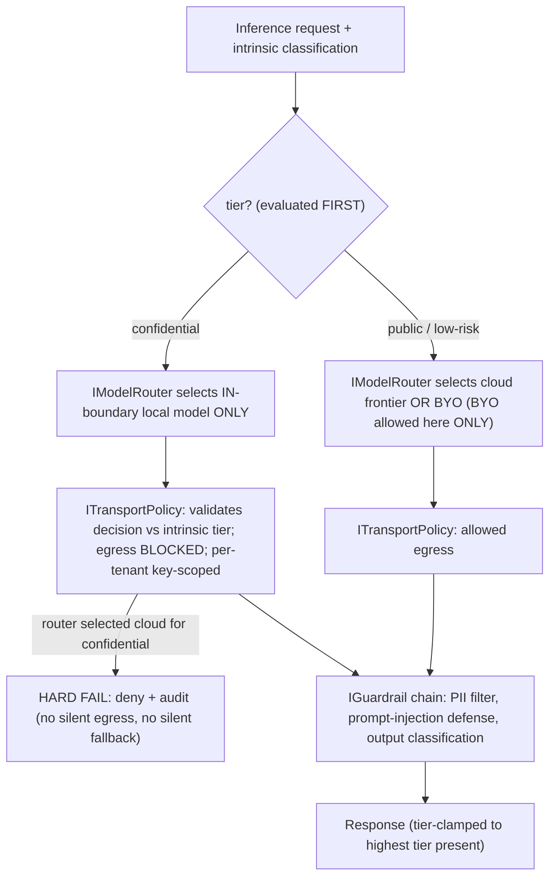

- Classification routing dominates BYO. `confidential ⇒ in-boundary local only`. BYO selectable only for public/low-risk; the config UI cannot attach BYO-cloud to confidential; `confidential + BYO-cloud-configured ⇒ routes local, BYO ignored, audited`. BYO may point at a self-hosted endpoint for confidential **only if the institution attests it is in-boundary.**
- **Egress enforcement is `ITransportPolicy`, not the router; router/transport disagreement HARD-FAILS** (Section 5.5).
- Confidential tier constrained to **open, self-hostable** components.

### 8.3 Serving & models

| Component | Confidential (local) | Public / BYO |
|---|---|---|
| LLM serving (prod) | **vLLM** (PagedAttention), **TEE-backed for operator-zero-trust buyers** | Cloud frontier or BYO |
| LLM serving (dev) | **Ollama** (M4 Max 36GB) — dev only | — |
| Embeddings | **Qwen3-Embedding** (0.6B dev / 4B–8B prod, Apache-2.0) + **SPECTER2**; fallback BGE-M3 | Voyage/Cohere/Gemini = public/BYO only |
| Reranker | **BGE-reranker-v2-m3** / **Qwen3-Reranker** (local) | Cohere Rerank 3.5 (public/BYO) |

**Avoid TGI (maintenance mode).** nomic-embed is materially behind Qwen3/BGE (TigerBuddy inheritance trap).

### 8.4 Guardrails — tier-segregated synthesis + agent-action egress (resolves SEC-med-agent)
- **Input:** PII detection, prompt-injection screening (delimited untrusted content), classification-tag verification.
- **Tier-segregated synthesis (hard policy):** a generation call must not mix chunks across a tier boundary unless the output is clamped to the highest tier present; retrieved content is **untrusted data, never instructions**; a confidential output cannot reach a lower-tier surface **regardless of LLM scan result** (destination clearance is a hard check).
- **Agent-action egress (NEW):** **every agent-initiated action — re-query target tier, tool invocation, any projection/share emission — passes the same PEP + tier-clamp + egress PEP as a user action.** Agents act under a **constrained, tier-pinned capability, never the user's full authority.** Loops are **iteration- AND action-tier-capped** at the orchestrator. The injection-corpus test covers **agent-action exfiltration**, not just synthesis text.
- **Output:** confidential-leak scan + citation faithfulness (CRAG) as defense-in-depth on top of the hard clamps.
- **Router-aware eval:** the judge LLM is the local model on the confidential tier (run in GPU staging, Section 16).

---

## 9. Retrieval Architecture

**A composable per-tenant retrieval PLAN (Section 5.4) behind stable micro-interfaces; the model router selects local-vs-cloud per tier; a thin exchange adapter federates only public-tier topical discovery. Confidential data and its models never leave the node.**

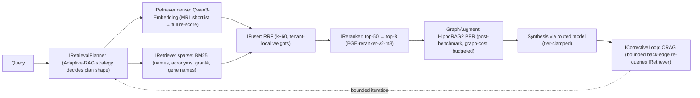

### 9.1 MVP-essential
- **Hybrid retrieval:** dense (Qwen3-Embedding, MRL shortlist → full re-score) + sparse (**BM25, mandatory**). +15–30% recall vs either alone.
- **Fusion: RRF (k≈60), tenant-local weights.**
- **Reranking (highest cheap ROI):** top-50→top-8, BGE-reranker-v2-m3 / Qwen3-Reranker. +5–15 nDCG@10 for <200ms.
- **Two embedding spaces:** Qwen3 (ad-hoc RAG) + SPECTER2 (citation-proximity / expertise fingerprints). MRL operationally essential for per-node RAM control (a quality/RAM knob, never a privacy control).
- **Deterministic metadata-backbone graph** for traversal.
- **Evaluation harness (MVP-essential):** RAGAS (Faithfulness/Groundedness, Context Precision/Recall) + nDCG@k/Recall@k on a small in-domain gold set, **wired into CI as a regression gate**, per-tenant + per-model-route; **judge = prod-size local model on the confidential tier, run in GPU staging (not the M4 Max)** (resolves COST-low-eval-parity). **The RRF+rerank baseline is the contractually-promised quality bar** — learned gains are upside.

### 9.2 Phased (planner strategies / data-gated)
- **Adaptive RAG** difficulty routing — a planner strategy.
- **CRAG corrective loop** — a bounded back-edge in the plan.
- **HippoRAG2 PPR** — `IGraphAugment`, gated by the AGE benchmark (Section 6.2).
- **Per-tenant learned convex fusion** — `IFuser` impl, **data-gated** (needs in-cell click/relevance feedback behind `IFeedbackStore`; no confidential data leaves the cell).
- **GNN link prediction** and **query-decomposition/multi-agent (LangGraph)** — **data-gated**; on the confidential path every agent step runs the local model under a tier-pinned capability with capped loops (Section 8.4).

### 9.3 Expertise / collaborator surface
Profile-as-retrieval (SPECTER2/Qwen3 fingerprints + retrieve+rerank) at MVP → GNN link prediction (Phase 2, data-gated) → cross-institution team assembly over the federated public-tier graph (Phase 3). The shared surfaces are the kernel read-models `IExpertiseFingerprint` + `ICollaborationGraph` (Section 3.1).

### 9.4 Explicitly overkill at MVP
MS-GraphRAG global (~331k tokens/query), ColBERTv2/PLAID per-tenant index, multi-agent orchestration, learned/LambdaMART fusion, FHE on critical path. Ship single-shot hybrid+rerank+RRF; defer the rest as planner strategies / `IGraphAugment` nodes, not IRetrieval reimplementations.

---

## 10. Data Pipelines & Orchestration

### 10.1 Orchestrators — sequenced
- **MVP: Dagster ONLY** — per-cell asset pipeline `crawl → distill → embed → index → graph → classify(dual, fail-closed) → outbox`. Fallback Prefect/Airflow.
- **Temporal** only when the first cross-institution grant lifecycle is built (Phase 1/2) — durable grant/revocation-side-effect/workspace workflows. **Never owns revocation correctness** (Section 5.8).
- **Kafka/Debezium CDC** only when the central index first exists (Phase 2). **Phase-0/1 use transactional-outbox polling.**

```mermaid
graph LR
    subgraph DAGSTER["Dagster — per-cell asset pipeline (MVP)"]
        CRAWL["crawl faculty/papers/docs"] --> DISTILL["distill research cards"]
        DISTILL --> EMBED["embed (Qwen3 + SPECTER2)"]
        EMBED --> INDEX["index (consolidated Postgres: pgvector + tsvector + AGE)"]
        INDEX --> CLASSIFY["DUAL classify (agreement-for-tier-down; FAIL-CLOSED) + MAX-tier on derivatives + quarantine unadjudicated export"]
        CLASSIFY --> PROJ["build PublishableProjection (total fn; versioned)"]
        PROJ --> EGRESS["INLINE EGRESS PEP (allowlist re-validate + source-class re-derive + audit)"]
        EGRESS --> OUTBOX["Outbox (poll in MVP)"]
    end
    OUTBOX -."Phase 2".-> CDC["Debezium CDC (per-tenant partitioned; priority shedding; tombstones never dropped)"]
    CDC --> EXIDX["Central discovery index (two-tier topical, managed, LSH codes)"]
```

### 10.2 Sync between nodes and the exchange
- **Authority-anchored monotonic versioning + idempotency keys** for all index upserts/deletes (exactly-once *effect* on at-least-once delivery).
- **Schema registry enforces forward+backward compatibility;** the central consumer **must handle events from a node on an OLDER projection schema** (independent upgrades guarantee skew). Egress PEP validates against the **node's** projection version; index accepts the **field intersection across deployed versions** (Section 4.5).
- **Per-tenant CDC partitioning with bounded-lag SLOs + alerting.**
- **Priority backpressure (resolves DS-med-backpressure):** **tombstones are NEVER shed.** Among publishes, shed **re-embeddings/enrichment first; keep first-publish + content-material updates.** Under publish-shedding the **discovery freshness SLO is SUSPENDED** and results carry an explicit `as-of` staleness that may exceed the nominal bound — surfaced, not hidden. The 10.4 table reflects this degraded mode.
- **Only `PublishableProjection`s flow out**, through the inline egress PEP. Confidential bytes never enter the outbox.

### 10.3 Intra-cell consistency contract
- **Postgres is the SoR;** all derived indexes rebuildable. A per-cell intra-cell outbox fans updates to derived indexes via idempotent replayable indexers + a reconciliation/repair job (divergence detector + re-project repair, Section 6.3). Distinct from the outbound publish outbox.

### 10.4 The consistency model — a TABLE with honest degraded modes (resolves DS-med-backpressure, DS-low)

| Cross-node flow | Consistency class | Staleness bound | Failure / degraded behavior |
|---|---|---|---|
| Confidential drill-down Check (grant) | **Strong (cell-local ZedToken-monotonic)** | 0 (cell-local) | grant-GRANT served within freshness bound during partition; DENY beyond |
| **Revoke / reclassify-up / un-publish / deprovision** | **Authoritative freshness gate + authority-versioned eventual purge** | **leak-window SLO; P1 if exceeded** | fail-closed (deny / incomplete) if watermark stale beyond leak-window |
| Grant-creation visibility (index) | Eventual, bounded | symmetric to revoke window | UX: "grant active; discoverability propagating" |
| Discovery-index population | Eventual | bounded by CDC lag SLO — **SUSPENDED under publish-shedding** | partial/`incomplete`-flagged (security state if revocation-stale; quality flag if shed); `as-of` staleness surfaced |
| Graph/GNN feature freshness | Eventual | bounded; "as of <ts>" | stale features flagged, never silently used |
| Recommendation/team-assembly inputs | Eventual | bounded; federated public-tier replicas | freshness timestamp surfaced |
| PSI/aggregate outputs | Strong (computed live) + global DP ledger | n/a | rate-limited, k-anonymity floor, ledger-debited |

---

## 11. Security, Privacy & Compliance

### 11.1 Confidential-tier crypto — plaintext-at-use and operator boundary stated honestly (resolves SEC-high-operator-trust)
- **Per-tenant envelope encryption (DEK/KEK) via per-cell isolated Vault Community / cloud KMS — NO Vault Enterprise namespaces** (Section 16). **ALL confidential derivative stores (pgvector/Qdrant vectors, BM25/OpenSearch postings, AGE graph, object storage) are encrypted under the tenant KEK**, so revoke-KEK = crypto-shred actually shreds the searchable derivatives.
- **DEK-per-project** enables project-scoped crypto-shred; key rotation defined (re-wrap DEKs on new KEK version; rotate on schedule + personnel-change). In-flight queries at revocation abort (DEK invalidated).
- **Operator boundary, per deployment model (the honest split):**
  - **Managed cell:** vendor-operated isolation + per-tenant keys + inline egress gate. **The vendor holds the key-unwrap path, runs the egress gate, and (pre-TEE) runs the inference host — so the operator is in the TCB.** This tier is **a bounded processor with technical + contractual controls, NOT operator-zero-trust.** Mitigations pre-TEE: disabled swap, disabled core dumps, ephemeral DEK caching. **We do NOT say "provably" or "never leaves your node" for this tier.**
  - **Sovereign / HYOK:** university controls key custody and revocation; **TEE-backed inference** so plaintext-at-use is memory-encrypted. **This is the operator-zero-trust tier**, and it is **brought EARLY for any buyer whose threat model demands it (export-class labs on day one).**
- **HYOK stated correctly:** "the university controls key custody and can revoke; plaintext is processed transiently in-cell under TEE" — not "we can never decrypt."
- **Operator-insider is in the threat model** with an explicit residual-risk statement per tier.

### 11.2 Audit — bound, two-sided, reconciled, audit-before-serve (resolves SEC-med-audit)
- **Hash-chained append-only log** (MVP) → **WORM + periodic external anchoring** (Phase 1).
- **Each cross-tenant access record binds `(grant_id, grant_version, token_jti, freshness_watermark)`** so the authorizing state is provable post-hoc even after a later revoke.
- **Audit-before-serve for confidential:** a cross-tenant access that cannot be durably logged on the owner side is **DENIED.**
- **Cells exchange counter-signed audit receipts;** a two-sided reconciliation job detects divergence (each side holds the other's signed evidence).
- **Audit-read authz:** audit content can reveal confidential relationships, so reads are access-controlled and confidential-tier audit content stays in-cell.

### 11.3 Compliance triggers & handling

| Regime | Posture | Mechanism |
|---|---|---|
| **FERPA** | School official under institutional control | `contains_FERPA_student_record`; cross-institution grants on FERPA-flagged data require registrar/compliance approval (`ferpa_institutional_approval`), NOT a PI's grant; **FERPA role re-checked at grantee-side access (sticky caveat, 7.6).** Directory-vs-education-record distinction encoded. |
| **GDPR** | We = **processor**; mandatory **DPA** | **Per-data-subject erasure workflow (11.4)**; EU data in-region; CoCo v2 EU attribute release; cross-border share carries `transfer_legality_ref` (adequacy/SCC) enforced by Cedar against `residency_region` (EU→non-adequate without SCC = BLOCKED); published sub-processor list. |
| **Export controls (ITAR/EAR)** | **Deemed export**: access gated by institution-attested US-person determination, **re-checked at the accessing individual (7.6)** | Nationality is NOT an SSO claim. **The US-person allowlist fires whenever `export_controlled ∈ {EAR,ITAR}` OR `unknown` for export-sensitive tenants — REGARDLESS of project opt-in** (resolves SEC-med-export-gap). Opt-in governs the FRE/workflow tradeoff, not whether the gate fires. Unadjudicated potentially-controlled ingest is **quarantined.** Export-class buyers are operator-zero-trust (sovereign/HYOK + TEE, Phase-2+). |
| **HIPAA / IRB / DUAs** | LDS needs a DUA; de-identified outside HIPAA | `contains_IRB_PII`; every inter-institutional identifiable transfer references a DUA artifact. |

### 11.4 GDPR per-data-subject erasure + Art. 19 (resolves SEC-high-erasure)
Crypto-shred (tenant-KEK) does **not** reach the control-plane-keyed central index or cross-tenant grantee copies. Therefore a **per-data-subject erasure workflow distinct from tenant-KEK shred:**
1. **Targeted hard-delete + tombstone** of the subject's projections/embeddings/LSH-codes in the central index (reuse the revocation tombstone path, keyed by data-subject, not by grant).
2. **Art. 19 recipient-notification:** propagate erasure obligations (and technical revoke where copies exist) to **every grantee cell that received a copy**, logged in the per-tenant audit.
3. **Technical-vs-contractual guarantees stated per surface:** central index = technical hard-delete; grantee copies = technical revoke where zero-copy/known, contractual (DUA) otherwise. FERPA correction/access analog mapped.

### 11.5 Threat model + mitigations

| Threat | Mitigation (invariant) |
|---|---|
| **Federation-seam leak (existential)** | PublishableProjection structural type + 100% inline blocking egress PEP (the proof) + source-class re-derivation; runtime sampling = drift-detection only; central index LSH-coded, encrypted, authz-gated, scope-keyed, opt-out-default |
| **Stale-metadata leak on revoke/reclassify/deprovision** | Authoritative freshness gate (fail-closed under partition) + authority-versioned tombstone + lease backstop; SLO'd leak-window, P1 on breach |
| **Clock-skew / malicious-node revoke ordering** | Authority-anchored monotonic version (node can't outrun the authority's tombstone); HLC skew clamped + alarmed; trust model: no self-asserted timestamp orders a security decision in its own favor |
| **Confident-WRONG misclassification / injection at classify time** | Dual classifier; tier-DOWN needs agreement; egress PEP re-derives class; classification-time injection in the test corpus; human review above sensitivity threshold for export/IRB |
| **Embedding inversion / membership inference (central index)** | No raw embeddings published — per-tenant-keyed salted LSH codes only; final scoring brokered; inversion + membership inference are named, tested threats |
| **New-enemy / partition** | Cell-local SpiceDB replica (ZedToken-monotonic) + fail-closed on stale freshness watermark; grant-GRANT availability vs revocation-freshness tradeoff stated asymmetrically |
| **Confused deputy / IDOR at the seam** | Per-tenant-signed, audience-scoped, DPoP-bound token; owning PEP resolves subject from token; object-level Check |
| **Sticky-caveat bypass at grantee** | Caveats re-evaluated vs the actual accessing individual; re-share prohibited by default; enforced grantee-side |
| **ABAC fail-open** | Missing/indeterminate ⇒ deny (confidential/export); narrows-only; PIP-down ⇒ deny; export default unknown⇒controlled |
| **Crypto-shred misses derivatives** | All derivative stores encrypted under tenant KEK; project-scoped DEK |
| **GDPR erasure gap (central index + grantee copies)** | Per-data-subject erasure workflow + Art. 19 notification (11.4) |
| **PSI differencing / coalition / composition with index signal** | Global per-subject + per-target-project DP ledger (linearizable, replay-protected) + k-anonymity floor + templated rate-limited queries; index membership signal modeled as one adversary capability |
| **Subject deprovisioning lag** | Subject revocation watermark fed by SCIM; fresh-subject check on confidential drill-down; short TTLs; per-tenant signing keys |
| **Prompt injection across tiers (text + agent action)** | Tier-segregated synthesis + hard destination clamp; agent actions pass PEP + tier-clamp + egress PEP under tier-pinned capability; injection-corpus covers agent-action exfiltration |
| **Operator insider (managed cell)** | Per-tenant keys + inline egress gate + audit; residual risk stated; operator-zero-trust only via sovereign/HYOK + TEE |
| **Control-plane compromise (honeypot)** | Per-consortium-key encryption of narrow-scoped projections; federation-scoped content minimized; opt-out default for high-sensitivity; LSH (non-invertible) codes |
| **Export-control self-sabotage (FRE loss)** | US-person gate fires on classification regardless of opt-in; opt-in governs only the workflow/FRE tradeoff |

### 11.6 SOC2 / ISO readiness — sequenced honestly (resolves COST-med-soc2)
- **SOC2 Type I at the Phase-0→1 boundary**, once a verbal design-partner commit exists — design partners start on a security questionnaire + roadmap, not a completed Type I. **A fractional GRC owner is staffed when Type I work begins** (policies, risk assessment, vendor management, evidence) — NOT assumed as zero engineering cost.
- **SOC2 Type II observation window (6–12 months) starts once controls are stable**, achieved Phase 2; **gates the first full institutional contract** — so the revenue model (Section 16/18) assumes 12–18 months to institutional SaaS revenue, bridged by the Phase-0 single-center pilot.
- **ISO 27001** for EU later. **HECVAT** before any pilot.

### 11.7 PSI / aggregate privacy — global DP ledger (resolves SEC-high-PSI, DS-med-PSI-ledger)
**Differential privacy is a REQUIRED, budgeted control on all cross-institution aggregate/PSI outputs, with a GLOBAL ledger:**
- **A global per-subject and per-target-project privacy ledger** — a **linearizable monotonic-decrement counter** (the one justified small consensus dependency; PSI is async/batch per Section 14, latency-tolerant), with **replay protection (query-template + nonce dedupe).**
- **A cap on aggregate ε spent against a single target tenant across ALL querying tenants** (coalition defense), not just per-pair.
- **A minimum-aggregation k-anonymity floor** before any overlap returns.
- **Mandatory, rate-limited, pre-approved query templates** (no ad-hoc overlap queries).
- **The composition of (PSI overlap signal + central-index membership signal) is modeled as one adversary capability.** Until the global ledger is in production, PSI is scoped to a **hard whitelist of pre-approved aggregate questions with conservative fixed thresholds** — stated plainly.

### 11.8 Embedding/honeypot privacy (resolves SEC-crit-2)
**No raw invertible embeddings leave any cell.** The central index publishes only **per-tenant-keyed, salted, quantized LSH candidate codes** usable for candidate generation but not text reconstruction; **final scoring is brokered to the owning cell on real embeddings.** **MRL truncation is a quality/RAM knob, not a privacy control** — it is never described as privacy. Membership-inference and embedding-inversion (vec2text-class) are named threats with tested controls (LSH non-invertibility, per-tenant salt/key, scope-keyed encryption, opt-out default for high-sensitivity tenants).

---

## 12. Technology Stack

| Layer | Primary | Fallback | Licensing/justification flag |
|---|---|---|---|
| Federation entry | **Direct Keycloak OIDC/SAML for single-IdP buyers (Phase 0)** → **CILogon (Phase 1+)** | direct eduGAIN brokering (real eng weeks) | CILogon commercial = paid subscription → COGS (hard quote pre-build) |
| IdP / broker / session | **Keycloak** (Apache-2.0, realm-per-tenant, **per-tenant signing keys**) | Ory | audience-scoped DPoP tokens |
| Provisioning | **JIT + SCIM** (RFC 7644) → subject revocation watermark | — | deprovisioning within leak-window |
| Authz — ReBAC | **SpiceDB** — SoR + **cell-local replicas**, regional clusters | OpenFGA (`HIGHER_CONSISTENCY`) | Apache-2.0; cell-local Check |
| Authz — ABAC | **Cedar** (deterministic, NARROW-only) | OPA/Rego | two-stage; fail-closed |
| Revocation authority | **Single-region linearizable store (e.g. etcd/Spanner-class) assigning monotonic versions + freshness watermark** | — | the correctness anchor; covers grants/records/subjects |
| **Cell datastore (MVP/small)** | **Postgres** = pgvector + **Apache AGE** + **tsvector/ParadeDB BM25** + audit + outbox; **per-module schemas + role grants** | split below | ONE store; **encrypted under tenant KEK** |
| Vector (at scale) | **Qdrant** (split trigger) | pgvector | per-tenant namespace |
| Graph (at scale) | **Apache AGE**; switch to **Neo4j Community (GPLv3 — isolated process/service) / Memgraph (BSL — confirm commercial terms)** if AGE fails the Phase-0/1 benchmark | Neo4j/Memgraph | **replaces archived KuzuDB**; licenses pre-verified; switch is a planned port |
| BM25 (at scale) / **central index** | **Managed OpenSearch Serverless (hybrid) / managed vector** (two-tier topical) | self-managed OpenSearch + Qdrant | **Not Elasticsearch (AGPLv3)**; managed pre-scale to keep ops off 3 eng |
| LLM serving (prod) | **vLLM** (PagedAttention), **TEE-backed for operator-zero-trust** | SGLang | **Not TGI (maintenance mode)** |
| LLM serving (dev) | **Ollama** (M4 Max 36GB) | llama.cpp | dev only |
| Embeddings | **Qwen3-Embedding** + **SPECTER2** (Apache-2.0) | BGE-M3 | proprietary APIs = public/BYO only; MRL = quality knob, not privacy |
| Reranker | **BGE-reranker-v2-m3** / **Qwen3-Reranker** | Cohere Rerank 3.5 (public/BYO) | +5–15 nDCG@10 |
| Data orchestration | **Dagster** (MVP) | Prefect/Airflow | asset lineage |
| Durable workflows | **Temporal** (Phase 1/2) | — | side-effects only, never revocation correctness |
| API | **FastAPI** | — | clean module boundaries |
| RAG pipeline | **LlamaIndex** behind composable planner/orchestrator + micro-interfaces | Haystack | SDK types banned from `shared/contracts/` |
| Agent orchestration | **LangGraph** (Phase 2/3) | — | capped iterations + tier-pinned capability + PEP-on-every-action |
| Secrets / keys | **Per-cell isolated Vault Community / cloud KMS** + per-tenant envelope encryption; derivatives encrypted under tenant KEK | cloud KMS | **Vault Enterprise namespaces NOT used** (decided, Section 16) |
| Confidential compute | **TEE** (Nitro/SEV-SNP/TDX) — **early for operator-zero-trust buyers**, deferred otherwise | PSI libs + global-ledger DP; clean rooms | FHE off critical path (pilot) |
| Event substrate | **Outbox polling** (MVP / sovereign profile) → **Debezium + Kafka/Redpanda + schema registry** (at scale) | — | substrate-independent consumer; tombstones never dropped; two tested substrate profiles |
| Scholarly data | OpenAlex/Crossref/OpenCitations/arXiv/ROR/ORCID-PDF (CC0) + Semantic Scholar bulk (ODC-BY) + SPECTER2 | live APIs for freshness only; institution export for competitor-API data | own corpus; avoid metering/NC/competitor-API critical-path |

**TigerBuddy inheritance traps avoided:** KuzuDB→AGE (with a pre-verified scale switch); nomic-embed→Qwen3/BGE; single-tenant NetworkX `tiger_brain.json` doesn't survive multi-tenancy; concrete-store imports past the seam blocked by CI.

---

## 13. Deployment & Infrastructure

### 13.1 Topology

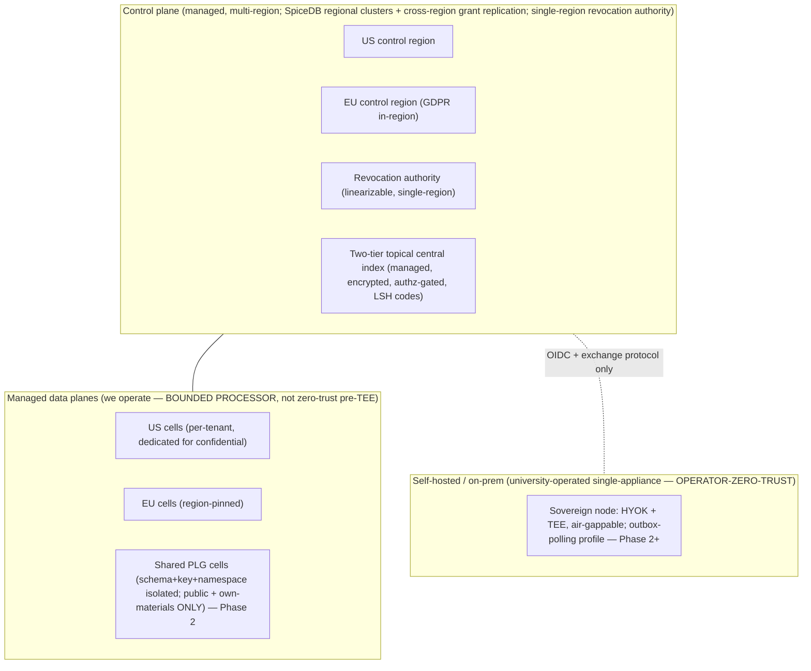

### 13.2 Managed vs self-hosted — two tested substrate profiles, shrunk sovereign footprint

| Dimension | Managed cell | Self-hosted / sovereign node |
|---|---|---|
| Who operates | Us (bounded processor) | University Research IT (operator-zero-trust) |
| Confidential data | Dedicated isolated cell we run, region-pinned | Entirely on university infra |
| Keys | Per-tenant via per-cell Vault Community / cloud KMS (we hold unwrap path) | HYOK (university custody + revocation; transient in-cell decryption under TEE) |
| Control-plane link | Full | Exchange protocol + OIDC only (no confidential bytes ever) |
| **Stack footprint / substrate profile** | **Full managed stack:** SpiceDB cell-local cluster, Kafka/Debezium, k8s+Helm, vLLM (+TEE for zero-trust) | **Single-appliance profile:** k3s single-binary, consolidated Postgres, **embedded library authz**, **outbox-polling (no Kafka)**, local vLLM+TEE |
| Conformance | **Same abstract confidentiality/authz/egress suite** | **Same suite — both profiles must pass** (Section 5.10) |
| Update model | We push (Argo GitOps) | University-pulled cosign-signed bundles (air-gappable) |
| Target | Dept/Institution | Sovereign (export-controlled/defense) — Phase 2+ |

**Sovereign is deferred past the first 18 months** (highest-ops, lowest-count) **EXCEPT** that the **HYOK + TEE operator-zero-trust capability is brought EARLY for any buyer (export-class) whose threat model demands it** — those buyers are sold the sovereign/on-prem appliance, not a managed cell, and that path carries CMMC/NIST-800-171 + DCSA posture and its own capital (Section 2/16).

### 13.3 IaC / k8s posture
- **Kubernetes + Helm** per-module sub-charts for **managed** cells; **Terraform** for cloud substrate; Crossplane optional. **Sovereign uses the single-appliance image, not k8s+Helm.**
- **Per-cell namespace + network policy + egress block** for the confidential path — the egress block is the `ITransportPolicy` compliance control, tested in CI and in the local federation harness.
- GitOps (Argo CD) for managed; cosign-signed bundles for sovereign pull.

---

## 14. Scalability & Reliability

### 14.1 Consistency model
See Section 10.4 — strong (cell-local) for confidentiality grant decisions; **authoritative freshness gate (fail-closed under partition)** for revocation; eventual-but-bounded (suspended under publish-shedding, with surfaced `as-of`) for discovery population; global-ledger-DP for aggregates.

### 14.2 Bottlenecks & scaling levers

| Bottleneck | Lever |
|---|---|
| Per-tenant vector index RAM | MRL truncation; per-tenant Qdrant sharding (after split trigger); RAM budget = split trigger input |
| Local LLM throughput | vLLM PagedAttention in prod; Ollama dev-only |
| **Central index growth / write-amp** | **Two-tier topical sharding (few shards per topical query); lease-bumps in a separate expiry store (not the hybrid engine); separate write/query pools; per-tenant write quotas; LSH codes** |
| **Gated discovery query cost** | **Revocation gate as an indexed bitmap filter materialized into each shard (one filter, not N lookups); stale-bitmap shard ⇒ `incomplete` fail-closed** |
| **Brokered drill-down tail (slow/offline node)** | Separate SLO (14.4); timeout + circuit-breaker; degraded result = publishable-metadata-only; per-owning-node health/SLA tracking |
| Exchange backpressure | Per-tenant CDC partitioning; **priority shedding (tombstones never shed; enrichment shed first); freshness SLO suspended + `as-of` surfaced under shedding** |
| **Graph multi-hop / PPR at scale** | Phase-0/1 AGE benchmark + pre-verified switch; split graph CPU from OLTP/vector past the trigger; PPR graph-cost budgeted |
| SpiceDB consistency cost | Cell-local replica (no cross-region hot-path Check); regional clusters |
| **DP ledger decrement** | Linearizable counter on the async/batch PSI path (latency-tolerant — the one justified consensus dependency) |

### 14.3 Failure domains — modeled as a PRODUCT, with the partition tradeoff corrected
- **Intra-node ops are cell-isolated:** a tenant cell failure never affects another tenant or the control plane.
- **Cross-node (brokered) ops availability is the PRODUCT, not the min:** A's PEP + token mint + B's cell at 99.5% each ≈ **~98.5%** for the brokered op — stated explicitly. Offline/air-gapped owning nodes are expected: **owning node unreachable ⇒ publishable-metadata-only + "detail unavailable," never an unbounded wait.**
- **Control-plane / Revocation-Authority degradation (CORRECTED — resolves DS-high-grant-liveness):** confidential **already-granted reads continue within the freshness bound**; **confidential cross-tenant drill-down DEGRADES TO DENY beyond the freshness bound (not stale-allow).** Intra-node operation (cell-local PEP/PIP/LLM + grant replica) continues; cross-institution discovery degrades.
- **Exchange outage:** federation pauses; single-tenant pillars unaffected.

### 14.4 SLOs — path-split, security-critical, single-instance-honest (resolves COST-high-gpu-cogs, DS-high cross-region)

| SLO | Target | Basis / note |
|---|---|---|
| Intra-node grounded Q&A | p95 < 4s | local model; per route |
| **Confidential Check (cell-local)** | p99 < 50ms | cell-local replica — benchmarked Phase 0/1 (no cross-region round-trip) |
| **Discovery (index path)** | p95 < 800ms | **two-tier topical → few shards per query; per-shard revocation bitmap filter included in budget** |
| **Discovery (brokered path)** | p95 < 2.5s, hard timeout 5s → degraded | owning-node-governed; degrade not block |
| **Metadata-revocation leak window** | < 5s; **P1 if exceeded** | security-critical; authoritative freshness gate makes correctness fail-closed under partition |
| Grant-creation visibility | < 5s (symmetric) | UX-labeled |
| **Confidential-cell availability** | **99.5% single-instance (documented recovery), OR 99.9% with a budgeted warm-standby GPU (doubles GPU COGS)** | **a single non-redundant GPU CANNOT hit 99.9%; buyer chooses the tradeoff** |
| Control plane | 99.95% | |
| **Cross-region confidential GENERATED-answer drill-down** | **explicit summed budget below; honest 6s SLO with token streaming** | see 14.4.1 |

#### 14.4.1 The worst-realistic composite flow, summed (resolves DS-high-cross-region)
US subject, EU-resident confidential data, **generated** answer:

| Stage | Budget |
|---|---|
| Token mint (control plane) | ~50–100ms |
| Cross-region broker US→EU (RTT) | ~80–150ms |
| EU cell-local SpiceDB Check | <50ms |
| EU revocation freshness + sticky-caveat re-eval | <50ms |
| EU local vLLM **TTFT** (warm, quantized 7–8B, TEE) | ~0.5–1.5s |
| EU generation (streamed) | ~2–4s total |
| Response cross-region (streamed) | overlapped |

**Reconciliation:** the brokered-path SLO (retrieval/metadata) and the Q&A SLO are reconciled into ONE honest number for this composite GENERATED case: **perceived latency = TTFT (~1–2s) via token streaming; full-generation p95 = 6s SLO, stated honestly — NOT 4s.** Mitigations pinned: **token streaming** (perceived latency is TTFT, not full generation), **region-affinity routing** (route the requesting user to compute near the data where policy allows), and **warm vLLM** (no cold-start). PSI/TEE cross-region runs async/batch with its own budget, never on this path.

### 14.5 Hot-tenant / noisy-neighbor model
- **Shared control-plane components** (central index, CDC, eventually TEE broker): per-tenant write/query quotas + fair scheduling; per-tenant CDC partitioning with bounded-lag SLOs so a mega-R1's backfill/query storm can't degrade discovery for others. **Two-tier topical sharding + day-one topic-subsharding of mega-R1s** prevents a long-tail mega-shard from dominating p95.
- **Shared PLG cells (Phase 2):** per-tenant resource quotas on vector RAM and local-LLM GPU time + fair scheduling (design-reserved seam until Phase 2).
- **Cell-split / promote-to-dedicated trigger** per the defined thresholds (Section 6.3); mega-R1s get dedicated cells.

---

## 15. Observability, Testing & CI/CD

### 15.1 Telemetry
- **OpenTelemetry** traces across PEP → PDP → retrieval orchestrator → router (per-tenant, per-model-route tags); Prometheus + Grafana; Loki/Tempo. Per-tenant cost attribution (LLM tokens, vector RAM, **GPU-hours**) for billing.
- **Confidential-tier telemetry and audit stay in-cell** (only decision metadata leaves; no confidential content in spans).
- **Runtime leak assertion is an alerting/drift-detection signal**, explicitly NOT a correctness gate (Section 4.5).

### 15.2 Eval-in-CI
RAGAS + nDCG@k/Recall@k on an in-domain gold set, **CI regression gate, per-tenant + per-model-route**, **judge = prod-size local model run in GPU staging** (not the M4 Max; resolves COST-low-eval-parity). The **RRF+rerank baseline is the contracted bar**; learned gains are upside.

### 15.3 Test strategy across modules
- **Consumer-driven contract tests** (Pact-style) against `shared/contracts/`; contract-version usage registry gates deprecation.
- **import-linter / DB-permission CI gates:** no module→module imports; no concrete-store/SDK imports past kernel adapters; no SDK types in `shared/contracts/`; **no module migration referencing another module's schema**; **TierLattice exhaustiveness check fails the build on an unhandled new tier.**
- **Authz tests:** SpiceDB assertions + Cedar validation; **revoke-then-read denies**; **new-enemy regression**; **ABAC-narrows-only**; **PIP-down ⇒ deny**; **confused-deputy (A cannot assert arbitrary subject)**; **sticky-caveat re-eval denies a non-US-person grantee**; **deprovisioned-subject denies within leak-window**.
- **Isolation + egress tests:** cross-tenant access denies; **egress-block enforced at `ITransportPolicy`**; **router-disagreement hard-fail** (buggy router selecting cloud for confidential must hard-fail).
- **Federation-seam tests + projection-version intersection test:** confidential tag / non-allowlisted field never reaches the boundary; node@N and index@M agree on the allowlist intersection.
- **Revocation/freshness tests:** metadata unsurfaceable within leak-window after revoke; **stale-bitmap shard returns `incomplete` (security state)**; **fail-closed under simulated revocation-authority partition.**
- **Injection-corpus test:** poisoned document fails both synthesis exfiltration AND **agent-action exfiltration** AND **classification-time manipulation**.
- Unit/integration per `pytest` markers.

### 15.4 Release / rollback
GitOps (Argo CD) per managed cell; canary per module via feature flags; cosign-signed bundles for sovereign pull. Rollback = flag-off + previous Helm/appliance revision. Kernel-contract changes follow the deprecation-window + translation-shim rule.

### 15.5 Dev/prod parity, LOCAL federation harness, ephemeral cloud staging (resolves MAINT-med-test-harness, COST-med-staging)
- **Dev-testable on M4 Max:** retrieval logic, classification, RRF, rerank, single-tenant flows, projection/egress logic.
- **LOCAL multi-cell harness (NEW — seam CORRECTNESS is locally testable):** `docker-compose` runs **two cells + a stub control plane + a mock/quantized inference endpoint** so the **federation seam, brokered drill-down, confused-deputy test, egress PEP, projection-version intersection, and revocation/freshness gate ALL run in local CI on every PR.** Seam correctness does not depend on paid staging.
- **Ephemeral, on-demand cloud staging (NOT 24/7):** reserved for **PERFORMANCE/scale** — vLLM batching/PagedAttention, egress-block-at-scale, multi-region latency, index sharding, the RAGAS prod-size judge. **Spun up on demand and torn down between runs;** multi-region SpiceDB replication validation is a **one-time spike, not a standing gate.** Dollar estimate in Section 16; confirmed on-demand.

---

## 16. Cost Model & Team

### 16.1 Infra cost shape — unit economics resolved with real line items (resolves COST-high-gpu-cogs, COST-high-vault, COST-high-central-index-ops, GTM-high-WTP)

**Per-confidential-cell COGS — line-item stack (resolves the understated floor):**

| Line | Monthly (smallest viable) |
|---|---|
| Always-on small GPU (L4 / A10G class) for vLLM | ~$735–1,454 |
| Warm-standby GPU (ONLY if 99.9% chosen) | +~$735–1,454 (else $0 at 99.5%) |
| Consolidated Postgres (pgvector+AGE+tsvector) compute/RAM (HNSW+AGE working set budgeted) | ~$200–500 |
| Object storage + backups | ~$50–150 |
| Egress + monitoring | ~$50–150 |
| Per-cell Vault Community (isolated instance — **no Enterprise**) | ~$0–100 (self-run) |
| Share of managed central index (Phase 2+) | amortized via exchange add-on |
| **All-in realistic floor** | **≈ $1.5–3k/mo (single-instance) per dedicated confidential cell** |

**Pinned decisions:**
- **The beachhead is NOT a price-sensitive PLG lab.** It is a **single funded R1 center / security-sensitive lab** at **$2.5–8k/mo/node** (Phase 0), where the GPU amortizes and a security line-item exists.
- **WTP is validated against this floor in 8–10 pricing interviews BEFORE build (Section 2.6).** **If WTP < the COGS floor, BYO-compute is the DEFAULT** (university supplies the GPU; we charge software) — the explicit escape from inverted economics.
- **Confidential-cell availability SLO is 99.5% single-instance (documented recovery) by default; 99.9% only with a budgeted warm-standby GPU that doubles GPU COGS** — buyer chooses (Section 14.4). We do NOT promise 99.9% on a non-redundant GPU.
- **Per-tenant key isolation = per-cell isolated Vault Community / cloud KMS; Vault Enterprise namespaces NOT used** (Section 11.1) — no low-six-figure license surprise.
- **Central index = a MANAGED service**, costed at N=10/50/200, recovered via the consortium/exchange add-on — not silent overhead, not a 3-engineer ops sink.
- **CILogon deferred for the single-IdP first buyer** (direct OIDC); commercial quote obtained pre-build; eduGAIN fallback scoped as engineering weeks (Section 7.1).
- **Other fixed COGS:** SOC2 audit + Drata/Vanta (~$40–70k/yr all-in), **ephemeral cloud staging (on-demand, est. ~$1–3k/mo amortized, not 24/7)**, managed-CDC if not self-run.
- **Compute breakeven customer count per edition** is modeled against the floor above.

### 16.2 Burn / runway / revenue-by-quarter (NEW — resolves GTM-high-runway, GTM-crit-fast-vs-differentiated)

| Quarter | Engineering state | Revenue instrument | Modeled revenue |
|---|---|---|---|
| Q1 | Week-1 buyer-discovery spike; Phase-0 single-cell build; AGE benchmark | — | $0 |
| Q2 | Phase-0 complete; first pilot live | **Paid PILOT/POC (services-style)** with the first funded center | first dollar (pilot fee) |
| Q3 | SOC2 Type I; dyad sourcing + master-agreement test | Pilot continues; possible 2nd pilot | pilot revenue |
| Q4–Q5 | Phase-1 federation + dyad close | First SaaS subscription (post first security review) | first recurring (small) |
| Q6 (mo 15–18) | SOC2 Type II achieved | **First full institutional SaaS contract** | first material recurring |

- **First Phase-0 revenue is a paid PILOT/POC contract** (clears faster than a security-reviewed SaaS subscription) — this is the honest revenue instrument and it changes the funding story (services-quality revenue first, recurring later).
- **Recurring SaaS revenue is modeled at month 12–18**, gated by SOC2 Type II + DPA + OGC/IRB.
- **Runway implication:** with 5 FTE + ephemeral staging + SOC2 + GPU + (deferred) CILogon, **plan for ~24–30 months of runway**; the seed raise must explicitly fund the long pre-recurring-revenue valley. If the model shows recurring after month 15+, the levers are: shrink the team, lean harder on paid pilots/services, or raise more — stated, not implied.

### 16.3 Minimal founding team — sized to the SINGLE-CELL Phase-0 (resolves COST-crit-mvp-scope, COST-med-soc2)

| Role | Phase-0 focus (single cell) | Scale-up |
|---|---|---|
| **Founding eng — distributed systems/backend** | Library RBAC, hash-chained audit, consolidated Postgres (+per-module schemas/roles), Dagster pipeline, transport egress block | →SpiceDB cell-local replication, revocation authority, CDC, Temporal |
| **Founding eng — ML/RAG** | Retrieval planner+orchestrator (single-shot), pure router, embeddings/serving, eval harness (GPU-staging judge) | →planner strategies (CRAG/PPR), GNN |
| **Founding eng — security/infra** | Dual classifier (fail-closed), `ITransportPolicy` + router-disagreement hard-fail, per-tenant keys (Vault/KMS), k8s/IaC, AGE benchmark | →egress PEP/projection + 2-cell seam (Phase 1), security-eng + platform/SRE split; TEE later specialist |
| **Founding GTM / domain (research-admin)** | **ONE motion:** single-center BD + the Week-1 dyad-discovery spike | enterprise + consortium-BD later |
| **(Fractional) compliance counsel + GRC** | FERPA/GDPR/ITAR review; DPA/DUA/SCC templates; US-person workflow; **GRC pulled in when SOC2 Type I work begins (Phase 0→1)** | — |

**The single-cell Phase-0 (library RBAC, Postgres audit, if/else router + transport hard-fail, dual classifier, consolidated Postgres, no egress-PEP/projection/2-cell-seam, no TEE, Dagster-only) IS buildable by three engineers.** The federation seam (egress PEP, PublishableProjection, revocation authority, brokered drill-down, 2-cell) is Phase-1, gated on a real second node. Team size and scope are consistent at every phase.

---

## 17. Risks & Mitigations

| # | Risk | Type | Mitigation |
|---|---|---|---|
| 1 | **Federation-seam confidentiality leak** (existential) | Technical | PublishableProjection structural type + 100% inline blocking egress PEP (proof) + source-class re-derivation; runtime sampling = drift-detection only; LSH-coded encrypted authz-gated scope-keyed central index, opt-out default |
| 2 | **Stale-metadata leak on revoke/reclassify/deprovision** | Technical/Compliance | Authoritative freshness gate (fail-closed under partition); authority-versioned tombstone; lease backstop; SLO'd leak-window, P1 |
| 3 | **Clock-skew / malicious-node revoke ordering** | Technical/Security | Authority-anchored monotonic version; HLC skew clamp+alarm; "no self-asserted timestamp orders a security decision in its own favor" |
| 4 | **Embedding inversion / membership inference** | Security | No raw embeddings published — LSH codes + per-tenant key/salt; final scoring brokered; named tested threats |
| 5 | **Confident-WRONG classification / classify-time injection** | Security | Dual classifier (agreement-for-tier-down); egress re-derivation; classification-time injection test; human review above threshold |
| 6 | **Operator-trust overclaim (managed cell)** | Compliance/Sales-integrity | Claim split per tier; "provably"/"never leaves" reserved for sovereign+structural type; operator-insider in threat model; HYOK+TEE early for zero-trust buyers |
| 7 | **GDPR erasure gap (central index + grantee copies)** | Compliance | Per-data-subject erasure workflow + Art. 19 recipient-notification; technical-vs-contractual stated per surface |
| 8 | **Sticky-caveat bypass at grantee (deemed export/FERPA)** | Compliance/Legal | Caveats re-evaluated vs the actual accessing individual; re-share prohibited by default |
| 9 | **PSI differencing / coalition / index-signal composition** | Security | Global per-subject + per-target DP ledger (linearizable, replay-protected); ε cap across all queriers; composition modeled |
| 10 | **Unit economics inverted (confidential GPU vs WTP)** | Business | Value-based WTP validated pre-build; BYO-compute as DEFAULT if WTP < floor; line-item COGS; $2.5–8k beachhead |
| 11 | **First revenue gated on a rare consortium dyad** | Market/Execution | Phase-0 first dollar = single funded center (one IdP, paid pilot), dyad-independent; dyad = Phase-1 expansion; Week-1 master-agreement falsification test |
| 12 | **Export-lab "fallback" is actually harder (CMMC/DCSA/on-prem)** | Market/Compliance | Reclassified to Phase-2+ vertical with own capital; genuine fallback = another funded R1 center, internal-only |
| 13 | **MVP over-scoped (2-cell seam pre-customer)** | Execution | Phase-0 = single cell; egress PEP/projection/seam deferred to Phase-1 (earns cost only at N≥2); 3-engineer-buildable |
| 14 | **Long sales cycle vs runway (SOC2-II 12–18mo)** | Execution/Compliance | Burn/runway/revenue-by-quarter model; paid pilots first; Type I at Phase-0→1 boundary; 24–30mo runway planned |
| 15 | **Network-effect cold-start** | Market | Intra-institution product standalone-useful (node-acquisition engine); honest consortium-BD TAM; PLG reconciled as brand surface |
| 16 | **PLG hollow vs free incumbents** | Market | PLG = loss-leader, not modeled as revenue; differentiated library-corpus increment is land-and-expand, not self-serve |
| 17 | **Fast-follow race (Atom distribution)** | Market | Moat = race; lock ≥2 consortia under multi-year contracts before incumbent ships isolation; compounding = grant-graph + trust + certs |
| 18 | **Pricing complexity unquotable (no sales engineer)** | Execution | First 3–5 deals = single flat per-node fee; multi-axis deferred to Phase 2 |
| 19 | **4–6 procurement veto points stall deals** | Market/Compliance | Full veto graph mapped per motion; pre-empting collateral (IRB data-flow, OGC DPA+SCC, HECVAT pre-fill) |
| 20 | **Vault Enterprise license surprise** | Cost | Decided: per-cell isolated Vault Community / cloud KMS; namespaces not used |
| 21 | **Central index ops sink / unamortized overhead** | Cost/Execution | Managed service; costed at N=10/50/200; recovered via exchange add-on |
| 22 | **99.9% on a single non-redundant GPU is unfundable** | Cost/Reliability | 99.5% single-instance default; 99.9% only with budgeted warm-standby; buyer chooses |
| 23 | **AGE multi-hop/PPR fails at R1 scale (DB+license migration)** | Technical | Phase-0/1 synthetic benchmark; Neo4j GPLv3 isolation + Memgraph BSL pre-verified; fallback picked before needed |
| 24 | **Module coupling through the shared store (import-linter blind)** | Maintainability | Per-module schemas + DB-role grants + migration check; cross-module access only via read-models/events |
| 25 | **Tier-lattice change ships a leak (false "config change")** | Maintainability | Owned TierLattice module + compiler-enforced exhaustiveness fan-out across all consumers |
| 26 | **IExpertiseGraph god-contract rot** | Maintainability | Split into IExpertiseFingerprint + ICollaborationGraph; kernel-owned, additive-only, per-field consumer registry |
| 27 | **Seam correctness under-tested (paid-staging-only)** | Maintainability | Local docker-compose 2-cell harness in CI on every PR; staging for perf only |
| 28 | **Sovereign substrate drift from managed** | Maintainability | Two tested substrate profiles; same conformance suite on both |
| 29 | **Self-hosted sovereign ops crush a 3-person team** | Execution | Single-appliance image (k3s + consolidated Postgres, no Kafka/SpiceDB-cluster); deferred past 18mo |
| 30 | **TigerBuddy inheritance traps / drift** | Technical | KuzuDB→AGE (pre-verified switch); nomic→Qwen3/BGE; import-linter + DB-permission CI gates |

---

## 18. Phased Roadmap & Milestones

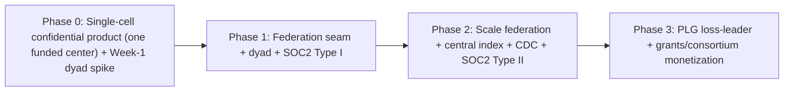

### Phase 0 — Single-cell confidential product (one funded R1 center / security-sensitive lab; NOT export)
**Build:** dual fail-closed classification + pure model router (if/else) + `ITransportPolicy` egress block with router-disagreement hard-fail + IPolicyEnforcement over library RBAC + IAuditSink over hash-chained Postgres + identity resolution (deterministic) + `mod-lit-intelligence` (retrieval planner/orchestrator single-shot, RAGAS-in-CI with GPU-staging judge) + **functional confidential tier (local vLLM, egress-blocked, per-tenant keys via per-cell Vault/KMS)** + consolidated Postgres (per-module schemas + role grants) + Dagster only. Direct OIDC to the buyer's single IdP (no CILogon). **AGE multi-hop/PPR benchmark on synthetic OpenAlex-subset.** Local docker-compose harness scaffolded. Week-1 buyer-discovery spike (single center + dyad candidates + master-agreement test). **NO second cell, central index, egress PEP, projection, runtime assertion, or brokered drill-down.**
**Milestones:** first paying pilot (single center); grounded Q&A p95 < 4s; confidential egress-block green (CI + local harness); router-disagreement hard-fail green; AGE benchmark verdict (AGE-keep or switch-decision); RAGAS faithfulness gate green; Week-1 spike resolved (dyad named + master-agreement answer in writing).

### Phase 1 — Federation seam + dyad + SOC2 Type I
**Build:** **independent inline egress PEP + PublishableProjection (versioned) + runtime drift-assertion + 2-node public-tier federated discovery + brokered drill-down (per-tenant-signed token, confused-deputy-safe) + revocation authority (linearizable) + freshness watermark gate + cell-local SpiceDB replication + Cedar ABAC (narrow-only, fail-closed) + one revocable confidential grant with sticky caveats + subject-deprovision watermark.** BYOK + derivative-store encryption under tenant KEK. Export US-person gate (fires on classification, not opt-in) + quarantine + FERPA institutional-approval flow. **HYOK + TEE for any operator-zero-trust buyer.** Per-data-subject erasure workflow + Art. 19 notification. SOC2 Type I (GRC staffed); HECVAT. Temporal for grant-lifecycle side-effects. Dyad close (subject to master-agreement test).
**Milestones:** first dyad contract; federation-seam + revocation/freshness + confused-deputy + sticky-caveat + deprovision tests green in CI (local harness) and ephemeral staging; cell-local Check p99 < 50ms benchmarked; revoke-then-read denies within leak-window; fail-closed-under-partition verified.

### Phase 2 — Scale federation + central index + CDC + SOC2 Type II
**Build:** two-tier topical managed central index (LSH codes, encrypted, authz-gated, per-consortium-key narrow scopes, opt-out default); Debezium+Kafka CDC (per-tenant partitioned, priority shedding, tombstones durable); discoverability-scope enforcement; per-shard revocation bitmap filter; brokered-path circuit-breakers + per-node health; zero-copy confidential workspaces (default); HippoRAG2 PPR (post-AGE-verdict); GNN link prediction (data-gated); split datastore (Qdrant/OpenSearch) past the trigger; hot-tenant quotas + cell-split; global DP ledger + PSI; PLG shared-cell substrate (schema+key+namespace isolation, fair scheduler); SOC2 Type II achieved. Export-class sovereign/CMMC vertical begins (own capital).
**Milestones:** N≥5 federated nodes; discovery index-path p95 < 800ms under continuous ingest (with the revocation bitmap filter in budget); brokered-path degraded-result verified with an offline node; SOC2 Type II report; PSI returns useful answers within the DP ledger.

### Phase 3 — PLG loss-leader + grants/consortium monetization
**Build:** PLG self-serve (public + own-materials, single flat price, brand surface — not a revenue funnel); `mod-funding` (grant intelligence + cross-institution team assembly over the federated public-tier graph, consuming `IExpertiseFingerprint`/`ICollaborationGraph`); multi-agent decomposition (LangGraph, capped, tier-pinned, PEP-on-every-action); per-tenant learned fusion (data-gated); optional MS-GraphRAG/FHE pilots; ISO 27001 for EU; multi-axis pricing once a sales engineer exists.
**Milestones:** ≥2 consortia under multi-year contracts (the race window target); first broad-consortium contract with exchange add-on; first cross-institution grant team assembled and funded.

---

## 19. Open Questions & Decisions to Validate

*Several v1/v2 "open questions" are now DECISIONS (unit-economics escape via BYO-compute, SpiceDB cell-local topology, single-cell MVP, Vault Community per-cell, revocation-authority model, two-tier topical index, dual classifier). What remains to test:*

1. **Single funded-center first buyer (Week 0–1)** — name 3 candidate centers/labs with a security line-item; confirm one will fund a paid pilot at the $2.5–8k/mo band. (Gates the whole sequence.)
2. **Dyad master-agreement falsification (Week 1)** — for 3 candidate dyads, get IN WRITING whether the existing master agreement permits a new SaaS processor without a full fresh security review; verbal price indication. If none clears, change the wedge before federation engineering.
3. **Value-based WTP (pre-build)** — 8–10 pricing interviews; if WTP clusters below the COGS floor, commit BYO-compute as the default.
4. **Revocation-authority freshness end-to-end** — spike linearizable authority + watermark feed + per-shard bitmap refresh; confirm the <5s leak-window is achievable, else set the bound honestly; verify fail-closed-under-partition behavior.
5. **Cell-local SpiceDB replication mechanics** — authenticated ordered grant replication + home-minted ZedToken carry; replication lag; regional-cluster cost.
6. **AGE multi-hop + PPR at R1 scale (Phase 0/1, synthetic)** — benchmark; if it fails the SLO, exercise the pre-verified Neo4j/Memgraph switch; quantify PPR graph-compute cost.
7. **Two-tier topical index** — validate topical-cluster sharding fan-out + per-tenant filter latency + per-shard revocation-bitmap-filter cost at N=10/50/200; confirm LSH candidate quality vs brokered final scoring.
8. **LSH/embedding-privacy efficacy** — confirm LSH candidate codes are non-invertible enough (resist vec2text-class) while preserving candidate recall; red-team membership inference against the index.
9. **CILogon commercial cost & eduGAIN-brokering effort** — hard quote; size the brokering fallback in engineering weeks for when federation breadth is needed.
10. **PSI/DP usability under the global ledger** — does a k-anonymity floor + global per-subject/per-target ε ledger still return useful collaborator-overlap answers? Spike with synthetic two-institution data; red-team coalition + index-signal composition.
11. **Export-control attestation workflow** — validate with one export-control officer that a signed US-person determination + authorized-person allowlist + classification-fired (not opt-in) gate + quarantine is operationally acceptable and legally sufficient; confirm the sovereign+TEE+CMMC path is the right (Phase-2+) home for these buyers.
12. **FERPA gating + sticky-caveat re-eval acceptance** — validate with a registrar/compliance office that "no PI cross-share of student-record-flagged data without institutional approval" + grantee-side role re-check is correct and sufficient.
13. **GDPR per-data-subject erasure + Art. 19 propagation** — validate the workflow with a DPO; confirm the technical-vs-contractual split per surface is defensible.
14. **PMC/Europe PMC OA-subset gating** — verify the commercial-OK OA filter yields a usefully large corpus.
15. **Procurement veto graph durations (per motion)** — validate the 4–6-office sequence and typical durations with one real institution so the deal-stage checklist is calibrated.
16. **TEE deployment surface (operator-zero-trust buyers)** — Nitro vs SEV-SNP/TDX abstraction; spike when the first export-class buyer's threat model demands it (brought early for that buyer, not deferred).
17. **Eval gold-set bootstrapping per tenant** — how the first per-tenant gold set is built without confidential data leaving the cell, and who labels it; confirm the GPU-staging prod-size judge cost.
18. **Runway/raise sizing** — validate the 24–30-month runway assumption against real pilot-to-recurring timing once the first pilot and security review durations are observed.

---

*End of plan3. The architecture is constant; build order and isolation posture are the levers. The existential risk remains the federation seam (Risk #1) — defended by a structural PublishableProjection type and a 100% inline blocking egress gate (the proof), an authority-anchored revocation model with a fail-closed freshness gate that is honest about the partition tradeoff (deny, never stale-allow), LSH-coded non-invertible publication, and sticky cross-institution caveats re-evaluated at the accessing individual. The operator-trust claim is split honestly per deployment tier — "provably" is reserved for the structural type guarantee and the sovereign/HYOK+TEE tier, never the managed-cell operator boundary. First revenue is decoupled from the rare consortium dyad: a single funded center funds a paid pilot at N=1 while the dyad and its master-agreement assumption are tested in Week 1. The moat is a race, not a structural certainty, and the plan names the contracts that must be locked before a funded incumbent ships isolation.*