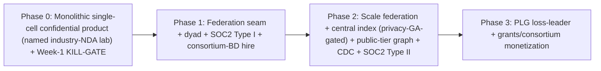

# Plan v4

> Adversarial review of this version: **9 critical**, **20 high** findings.

---

ind the engineering timeline; the consortium-BD specialist must be in place before Phase 1 (2.2). Levers if recurring slips past month 24: shrink the team, lean harder on paid pilots/services, or raise more — stated, not implied.

### 16.3 Minimal founding team — sized to the monolithic single-cell Phase-0 (resolves COST-crit-mvp-scope, COST-med-grc-timing, COST-med-gtm-capacity)

| Role | Phase-0 focus (monolithic single cell) | Scale-up |
|---|---|---|
| **Founding eng — distributed systems/backend** | Library RBAC, hash-chained audit, consolidated Postgres (import-linter isolation only), Dagster pipeline (classify-gates-index), transport egress block, HYOK key custody wiring | →SpiceDB cell-local replication+revision-translation (or sync cross-region), multi-region revocation authority + signed FEED + synchronous-check endpoint, CDC, Temporal |
| **Founding eng — ML/RAG** | Retrieval planner+orchestrator (single-shot), pure router (within legal-locality set), embeddings/serving, eval harness (GPU-staging judge), quarantine hard-exclusion | →planner strategies (CRAG/PPR), bounded-candidate team assembly, GNN; owns the **scholarly-corpus ingestion pipeline + snapshot-drift maintenance** |
| **Founding eng — security/infra** | SINGLE fail-closed classifier, `ITransportPolicy` (policy-table-driven) + router-violation hard-fail, per-tenant keys (KMS + HYOK), k8s/IaC, persistent GPU dev box, local-harness scaffold | →dual classifier + egress PEP/projection + 2-cell seam (Phase 1); security-eng + platform/SRE split; TEE specialist later |
| **Founding GTM / domain (research-admin)** | **SCOPED Phase-0 mandate: ONLY the Week-1 KILL-GATE spike + first-lab close.** Pricing interviews + veto-graph mapping + HECVAT pre-fill assigned to a founder or fractional GRC | →enterprise field sales |
| **Consortium/alliance BD specialist** | (Not Phase-0) — **must be in place BEFORE Phase 1** (or a founder with existing consortium relationships) | Phase-1 dyad + Phase-3 consortium monetization |
| **(Fractional) compliance counsel + GRC** | **From Q1:** FERPA/GDPR/ITAR review; DPA/DUA/SCC + joint-controller templates; owner-side US-person workflow; **HECVAT + questionnaire pre-fill**; SOC2 Type I prep | — |

**The monolithic single-cell Phase-0 (library RBAC, Postgres audit, policy-table router + transport hard-fail, SINGLE classifier, consolidated Postgres with import-linter isolation, HYOK, no egress-PEP/projection/2-cell-seam/dual-classifier/exhaustiveness-machinery, no TEE, Dagster-only) IS buildable by three engineers.** The federation seam is Phase-1, gated on a real second node. The consortium-BD hire is named against the Phase-1 motion, not deferred to Phase-2.

---

## 17. Risks & Mitigations

| # | Risk | Type | Mitigation |
|---|---|---|---|
| 1 | **Federation-seam confidentiality leak** (existential) | Technical | PublishableProjection structural type + 100% inline blocking egress PEP (proof) + source-class re-derivation + **MAX-rule incl. codes (no confidential-derived publication)**; index public/shared-only; **LSH/membership red-team is a GA gate** |
| 2 | **Revocation fail-open during propagation (the v3 flaw)** | Technical/Compliance | **Synchronous authoritative revocation check on the confidential hot path (deny-correct); high-sensitivity blocks until ACK; bitmap/watermark are perf only; lower tiers use an honestly-labeled bounded ALLOW window** |
| 3 | **Clock-skew / malicious-node revoke ordering** | Technical/Security | Authority-anchored fenced monotonic version (signed); HLC clamp+alarm; enforced `max_skew_bound`; no self-asserted timestamp orders a security decision |
| 4 | **Revocation Authority SPOF / global blast radius** | Technical/Reliability | Multi-region consensus; unavailability≠partition (durable buffer, recovery-measured allow-window, runbooked global-deny); signed watermarks (HSM); sovereign co-sign; own 99.95% SLO |
| 5 | **Embedding inversion / membership inference / index honeypot** | Security | No confidential-derived content in the index; presence/count/churn DP-noised + k-anonymity; per-consortium scope-key; **red-team GA gate** |
| 6 | **Per-shard `incomplete` covert channel** | Security | Not exposed per-topic; coarse+noised completeness or whole-query-fail-closed; topology decoupled from the signal |
| 7 | **MAX-rule vs index-design contradiction** | Security/Maintainability | Codes are derivatives ⇒ confidential-derived unpublishable; declassification per-artifact, audited, grantor-consented |
| 8 | **FERPA/IRB/export flow-down to derivatives** | Compliance | Compliance flags STICKY (UNION on join); tainted derivatives gated even when tier-correct; FERPA-grade audit authz |
| 9 | **Export US-person attribute spoofing** | Compliance/Legal | Owner-side authoritative determination + named-individual allowlist; grantee attributes untrusted hints |
| 10 | **In-cell deemed-export via quarantined-but-indexed data** | Compliance | Classify gates indexing; quarantined hard-excluded from ALL retrieval (contract test) |
| 11 | **Operator-trust overclaim at the beachhead** | Compliance/Sales-integrity | **HYOK-at-rest from day one (vendor-blind at rest); plaintext-at-use residual stated; Week-1 CISO acceptance of the at-use trust model BEFORE build**; TEE-at-use priced/mandatory for export |
| 12 | **BYO confidential endpoint exfiltration** | Security | Technical verification (in-boundary network proof + mTLS model-identity + no-retention + TEE for strongest); forbidden for export/EU-personal unless sovereign-verified |
| 13 | **Audit divergence / repudiation** | Compliance/Legal | Fair-exchange receipts (commit-then-serve); divergence auto-suspends + P1; owner-WORM authoritative for disclosure; shared external timestamp |
| 14 | **Subject deprovisioning lag (all non-public tiers)** | Security | Subject-not-deprovisioned on every private/confidential request + discovery; SCIM push session-kill; short TTLs |
| 15 | **GDPR controllership mis-posture (exchange)** | Compliance | Per-plane determination; **Art. 26 joint-controller + lawful basis as an EU-index release gate** |
| 16 | **Copy-creation silently degrades revocability** | Security/Legal | `allow_durable_copy` default false; grantor-consented + disclosed; revocation downgraded explicitly in UI/audit |
| 17 | **Defensibility race lost (lock at yr3 vs incumbent isolation in a quarter)** | Market | **Multi-year FRAMEWORK LOIs in Phase 0–1 (roadmap as lock); down-scope to a regulated niche (industry-NDA + export-adjacent consortia)** |
| 18 | **Data-layer incumbent (Pure/Symplectic/Clarivate) enters** | Market | Elevated to PRIMARY risk; **structural disincentive: confidential-federation cannibalizes their centralized-SaaS/data-monetization model** — the load-bearing moat assumption |
| 19 | **Phase-0 product undifferentiated vs NotebookLM/Glean/ChatGPT-Ent** | Market | **Explicit Phase-0 teardown (1.2.1); named win thesis (research-native graph + SPECTER2 + scholarly-corpus + NDA-tier + HYOK); does NOT inherit the federation moat** |
| 20 | **Beachhead too vague / no real confidentiality need** | Market | **Named segment: industry-NDA labs (primary), PHI-under-BAA clinical centers (secondary)** — validated Week 1 |
| 21 | **WTP < COGS; BYO-compute is friction not escape** | Business | Written price indication from ≥2 of 3 named labs vs a concrete budget line; floor ASP stated; **Week-1 KILL-GATE**; BYO-compute ASP+ops+re-triggered-offices modeled |
| 22 | **GTM motion mismatch (consortium BD deferred)** | Execution | **Consortium-BD specialist in place BEFORE Phase 1**; runway tied to GTM headcount; GTM ramp runs quarters behind engineering |
| 23 | **Procurement + no-SOC2 stalls the pilot** | Execution/Compliance | **Phase-0 pilot = sandbox/de-identified (doesn't trip full prod review); GRC + HECVAT pre-fill from Q1; SOC2 Type I in Phase 0; first-recurring slip-stressed to mo 18–24** |
| 24 | **Burn model omits salaries** | Cost | **Real monthly burn (~$80–130k/mo) incl. loaded FTE; seed ÷ burn = ~25–35 mo; cash-out date explicit** |
| 25 | **MVP over-scoped (platform tax pre-customer)** | Execution | **Monolithic single-cell Phase-0; single classifier; enum+MAX TierLattice; import-linter-only isolation; 2-cell harness + AGE benchmark at the Phase-0/1 boundary** |
| 26 | **Topical-shard skew / drift / smeared bitmaps** | Technical | **Hybrid topical-macro + tenant-sub-partition (bounded bitmap); skew measured on synthetic OpenAlex; re-clustering = first-class migration; per-shard admission control** |
| 27 | **Federated graph = uncosted central store or multi-RTT** | Technical | **Decision: materialized public-tier central graph (costed); bounded-candidate team assembly, NO global PPR** |
| 28 | **SpiceDB cell-local replication = bespoke build** | Execution/Technical | **Dedicated workstream + Week-1 spike; Phase-1 fallback to synchronous cross-region Checks** |
| 29 | **Bulk-revoke saturates the un-sheddable security lane** | Technical | **Tombstone coalescing (tenant/scope-version supersedes N); coarser bulk watermark on saturation (deny-wider, never global-stall)** |
| 30 | **TierLattice exhaustiveness impossible across distributed consumers** | Maintainability | **Signed conformance attestation per consumer + control-plane refuses activation until all attest + runtime fail-closed deny; mypy assert_never for in-process** |
| 31 | **Kernel god-object by accumulation** | Maintainability | **Bounded kernel; independent policy/serving versioning + change-frequency budgets; evict IdentityResolution + read-models to own services; eviction rule pinned** |
| 32 | **Distributed monolith (services sharing one Postgres)** | Maintainability | **Modular monolith for MVP; "independent service" language dropped; extraction = own DB + event-bus-only** |
| 33 | **Router/transport duplicate tier logic** | Maintainability | **Single tier→locality routing table both consult; disagreement = router violated given policy; precedence change = single-table edit** |
| 34 | **Stub control plane drifts from real** | Maintainability | **Stub = thin adapter over REAL contract artifacts; per-release contract test vs ephemeral real control plane gates releases** |
| 35 | **Sovereign substrate drifts on security concurrency** | Maintainability | **Enumerated security-critical conformance tests (partition/skew injection) on BOTH profiles; reduced guarantees stated per profile** |
| 36 | **Additive-only contracts rot** | Maintainability | **Real deprecation lifecycle (introduced/deprecated/removed-in); min-node-version floor; M-version test-matrix cap; zero-consumer auto-flag** |
| 37 | **COGS floor understated (TEE/idle-index/corpus)** | Cost | **Revised to ≈$3–5k/mo; idle OCU floor owned from node 1; corpus ingestion line added; breakeven re-run** |
| 38 | **GPU dev parity (Mac ≠ vLLM+TEE)** | Execution | **Persistent small GPU dev box line item for the confidential-inference owner** |
| 39 | **AGE multi-hop/PPR fails at R1 scale** | Technical | Phase-0/1 synthetic benchmark; Neo4j GPLv3 isolation + Memgraph BSL pre-verified; fallback picked before needed |
| 40 | **TigerBuddy inheritance traps / drift** | Technical | KuzuDB→AGE; nomic→Qwen3/BGE; import-linter + DB-permission + schema-review + swap-test CI gates |

---

## 18. Phased Roadmap & Milestones

### Phase 0 — Monolithic single-cell confidential product (named industry-NDA lab / clinical center; NOT export)
**Build:** SINGLE fail-closed classifier + pure model router (policy-table-driven) + `ITransportPolicy` egress block with router-violation hard-fail + IPolicyEnforcement over library RBAC + IAuditSink over hash-chained Postgres + identity resolution (deterministic, evicted service) + `mod-lit-intelligence` (retrieval planner/orchestrator single-shot, RAGAS-in-CI with GPU-staging judge, quarantine hard-exclusion) + **functional confidential tier (local vLLM, egress-blocked, per-tenant KMS keys + HYOK)** + consolidated Postgres (import-linter isolation) + Dagster only (classify-gates-index). Direct OIDC to the buyer's single IdP. Persistent GPU dev box stood up. GRC fractional from Q1. **NO second cell, central index, egress PEP, projection, dual classifier, exhaustiveness machinery, DB-role isolation, Kafka, Temporal, TEE.** Week-1 KILL-GATE spike (named labs + price indication + dyad master-agreement test).
**Milestones:** Week-1 KILL-GATE resolved (≥2 of 3 named labs give written ≥$30k/yr indication vs a concrete budget line; else pivot the wedge); first paid SANDBOX pilot (named lab); grounded Q&A p95 < 4s; confidential egress-block green (CI + local harness); router-violation hard-fail green; RAGAS faithfulness gate green; AGE/PPR benchmark verdict (at the Phase-0/1 boundary unless expertise discovery is on the Phase-0 path).

### Phase 1 — Federation seam + dyad + SOC2 Type I + consortium-BD hire
**Build:** **independent inline egress PEP + PublishableProjection (versioned, provenance-carrying, MAX-rule incl. codes) + dual classifier (agreement-for-tier-down) + runtime drift-assertion + owned TierLattice + conformance-attestation mechanism + per-module schemas/DB-role grants + 2-node public-tier federated discovery + brokered drill-down (per-tenant-signed, HSM-DPoP, confused-deputy-safe) + multi-region Revocation Authority + signed FEED + SYNCHRONOUS auth-check endpoint + cell-local SpiceDB replication+revision-translation (OR synchronous cross-region fallback) + Cedar ABAC (narrow-only, fail-closed) + one revocable confidential grant with sticky caveats (owner-side determinations) + subject-deprovision (all-tier check + push session-kill) + fair-exchange audit receipts.** HYOK + derivative-store encryption under tenant KEK. Export US-person gate (fires on classification) + quarantine-gates-indexing + FERPA institutional-approval + compliance-flag flow-down. **HYOK+TEE for any zero-trust/export buyer.** Per-data-subject erasure + Art. 19. SOC2 Type I (GRC staffed); HECVAT. Temporal for grant-lifecycle side-effects (dedup state). **Consortium-BD specialist in place.** Dyad close (subject to master-agreement test). Local harness stub-over-real-artifacts; per-release real-control-plane contract test.
**Milestones:** first dyad contract; framework-LOIs with ≥1 consortium (race lock); federation-seam + **synchronous-revocation deny-correct (commit-1s-ago)** + confused-deputy + sticky-caveat (owner-side) + all-tier-deprovision + grantee-over-assert-denied tests green; cell-local Check p99 < 50ms (replicated) benchmarked OR sync-cross-region fallback shipped; fail-closed-under-authority-partition verified; bulk-revoke coalescing verified.

### Phase 2 — Scale federation + central index (privacy-GA-gated) + public-tier graph + CDC + SOC2 Type II
**Build:** hybrid topical-macro + per-tenant-sub-partition managed central index (**public/shared only, GA-GATED on the LSH/membership red-team**, presence DP-noised, per-consortium-key scopes, opt-out default); materialized public-tier graph (bounded-candidate team assembly, no global PPR); Debezium+Kafka CDC (per-tenant partitioned, tombstone coalescing, coarser-watermark-on-saturation); discoverability-scope enforcement; per-shard admission control + (tenant×topic) accounting; re-clustering/re-embedding migration tooling; brokered-path circuit-breakers + per-node health; zero-copy confidential workspaces (default; `allow_durable_copy` opt-in); HippoRAG2 PPR (post-AGE-verdict); GNN link prediction (data-gated); split datastore (Qdrant/OpenSearch) past the trigger; hot-tenant quotas + cell-split; global DP ledger + PSI; PLG shared-cell substrate (schema+key+namespace isolation, fair scheduler); **GDPR joint-controller arrangements + lawful basis (EU-index release gate)**; SOC2 Type II achieved. Export-class sovereign/CMMC vertical begins (own capital).
**Milestones:** N≥5 federated nodes; discovery index-path p95 < 800ms under continuous ingest (with per-shard admission control); brokered-path degraded-result verified with an offline node; central-index privacy red-team PASSED (GA gate); SOC2 Type II report; PSI returns useful answers within the DP ledger; re-clustering migration exercised once on synthetic data.

### Phase 3 — PLG loss-leader + grants/consortium monetization
**Build:** PLG self-serve (public + own-materials, two-SKU pricing, brand surface — not a revenue funnel); `mod-funding` (grant intelligence + cross-institution team assembly via bounded-candidate fingerprints over the public-tier graph, consuming `IExpertiseFingerprint`/`ICollaborationGraph`); multi-agent decomposition (LangGraph, capped, tier-pinned, PEP-on-every-action, no DPoP key); per-tenant learned fusion (data-gated); optional MS-GraphRAG/FHE pilots; ISO 27001 for EU; multi-axis pricing once a sales engineer exists.
**Milestones:** **≥2 consortia under multi-year contracts (the race-window target — converted from Phase-0/1 framework LOIs)**; first broad-consortium contract with exchange add-on; first cross-institution grant team assembled and funded.

---

## 19. Open Questions & Decisions to Validate

*Many v1–v3 "open questions" are now DECISIONS (synchronous confidential revocation check; multi-region authority; HYOK-at-rest at the beachhead; index public/shared-only; hybrid shard key; materialized public-tier graph; modular monolith; conformance-attestation exhaustiveness; single Phase-0 classifier; named beachhead segment; cloud-KMS key custody). What remains to test:*

1. **Named-lab KILL-GATE (Week 0–1)** — name 3 industry-NDA labs / PHI-clinical centers; get a **written price indication ≥ $30k/yr** anchored to a **specific budget line (NDA/clean-room vs research-software)** from ≥2; confirm one funds a paid sandbox pilot. **If it fails, pivot the wedge before engineering.** (Hard gate.)
2. **Dyad master-agreement falsification (Week 1)** — for 3 dyads, get IN WRITING whether the master agreement permits a new SaaS processor without a full fresh review; verbal price indication; framework-LOI appetite.
3. **Beachhead at-use trust acceptance (Week 1)** — confirm the beachhead CISO accepts **"HYOK-at-rest + contractual/technical at-use, not cryptographically vendor-blind at-use"** for the managed cell, or requires TEE-at-use from day one (changes COGS/edition).
4. **Synchronous-revocation latency + authority HA** — spike the multi-region authority + synchronous-check endpoint; confirm the confidential drill-down adds ~80–150ms p99 and the composite 6.5s SLO holds; verify fail-closed under authority outage and the durable-buffer/recovery-measured allow-window behavior; sum the ALLOW-window propagation budget (14.4.2) and set the allow-window honestly (5s or 30s).
5. **Cell-local SpiceDB replication vs synchronous fallback** — does SpiceDB's primitives + a revision-translation table give monotonic carried-ZedToken reads, or must we build it? Benchmark replication lag and the fail-closed-on-lag behavior. Decide Phase-1 path (cell-local vs synchronous cross-region).
6. **AGE multi-hop + PPR at R1 scale (synthetic)** — benchmark; exercise the Neo4j/Memgraph switch if it fails; quantify PPR graph-compute cost.
7. **Hybrid index skew + drift + bitmap locality** — measure topical concentration of corpus AND queries on synthetic OpenAlex (not just average fan-out); confirm a tenant's bitmap stays in a bounded shard set; cost the re-clustering/re-embedding migration; validate per-shard admission control.
8. **Central-index privacy red-team (GA GATE)** — membership-inference + embedding-inversion against the index BEFORE GA; confirm presence/count/churn DP-noise + k-anonymity + per-consortium scope-keys hold; specify the quantified resistance bound in `shared/contracts/`.
9. **Federated public-tier graph cost + team-assembly quality** — cost the materialized central graph at N=10/50/200; confirm bounded-candidate fingerprint + local-augment team assembly is good enough without global PPR.
10. **CILogon commercial cost & eduGAIN-brokering effort** — hard quote; size the brokering fallback in engineering weeks.
11. **PSI/DP usability under the global ledger** — does a k-anonymity floor + global per-subject/per-target ε ledger still return useful collaborator-overlap answers? Red-team coalition + index-signal composition.
12. **Export-control owner-side workflow** — validate with one export-control officer that a signed US-person determination + named-individual allowlist + classification-fired gate + quarantine-gates-indexing is operationally acceptable and legally sufficient; confirm sovereign+TEE+CMMC is the right home for these buyers.
13. **GDPR controllership + per-data-subject erasure** — get a per-plane controllership determination (cell=processor; exchange=likely joint-controller) and prepare Art. 26 arrangements + lawful basis as an **EU-index release gate**; validate the erasure + Art. 19 workflow with a DPO.
14. **FERPA gating + compliance-flag flow-down acceptance** — validate with a registrar/compliance office that owner-side authorization + grantee-side role re-check + sticky FERPA flag on derivatives + FERPA-grade audit authz is correct and sufficient.
15. **BYO confidential-endpoint technical verification** — confirm network-level in-boundary proof + mTLS model-identity challenge + no-retention enforcement is feasible per target cloud; define the sovereign-tier verification for export/EU-personal.
16. **PMC/Europe PMC OA-subset gating** — verify the commercial-OK OA filter yields a usefully large corpus; size the ingestion/embedding cost line.
17. **Procurement veto graph durations (per motion)** — validate the 4–6-office sequence and durations with one real institution; confirm the sandbox-pilot structure actually avoids the full prod security review pre-SOC2.
18. **Runway/raise sizing + GTM ramp lag** — validate the ~25–35-month runway against observed pilot-to-recurring timing and the quarters-behind GTM ramp; confirm the consortium-BD hire can be in place before Phase 1.
19. **TEE deployment surface (zero-trust/export buyers)** — Nitro vs SEV-SNP/TDX abstraction + attestation; spike when the first export-class buyer's threat model demands it.
20. **Eval gold-set bootstrapping per tenant** — how the first per-tenant gold set is built without confidential data leaving the cell, and who labels it; confirm the GPU-staging prod-size judge cost.

---

*End of plan4. The architecture is constant; build order and isolation posture are the levers. The existential risk remains the federation seam (Risk #1) — defended by a structural PublishableProjection type whose MAX-tier rule now extends to codes/embeddings (no confidential-derived content is ever published or centralized), a 100% inline blocking egress gate (the proof), and a **synchronous authoritative revocation check on the confidential drill-down hot path** that makes revocation deny-correct rather than fail-open-during-propagation — the v3 leak is closed; lower tiers use an honestly-labeled bounded ALLOW window whose budget is summed, not asserted. The Revocation Authority is multi-region with a stated revoke-write cost, signed tombstones, and a runbooked global-deny exposure; the compound availability of confidential drill-down under correlated control-plane failure is modeled honestly (near-total deny on degradation, accepted as metadata-only for the beachhead). The operator-trust claim is reconciled with the beachhead reality before any paid security review: HYOK-at-rest from day one (vendor-blind at rest), plaintext-at-use a stated residual upgraded by TEE. Modularity is bounded (a bounded kernel with eviction, a conformance-attestation exhaustiveness mechanism that survives distributed consumers, a single tier→locality source of truth, a modular monolith that doesn't pretend to be services, and a real contract-deprecation lifecycle). First revenue is decoupled from the rare consortium dyad and from full production review: a named industry-NDA lab funds a paid sandbox pilot at N=1 while the dyad, its master-agreement assumption, and the at-use trust model are tested in a Week-1 kill-gate; the burn model includes salaries and a ~25–35-month runway; the consortium-BD motion has a named hire before Phase 1; and the defensibility race is confronted with framework-LOIs and a regulated-niche down-scope, resting on the data-layer incumbent's structural disincentive to cannibalize its own centralization.*